# Cross IDC Disaster Recovery Deployment

## Basic Information

Based on the Distributed Transactional Database Product HotDB Server - v2.5.6, this manual masterly describes the basic function usage and operation process of the cross-IDC disaster recovery scheme of HotDB Server based on the MySQL native replication function, for the user's reference and learning.

This document focuses more on the functions related to compute nodes and the management platform. If you need to know how to use the compute nodes and the management platform, please refer to the [HotDB Management](hotdb-management.md) document and [Standard](hotdb-server-standard-operations.md) document.

### Background

Data as the most important means of production, the loss and non-restorable of data is often fatal to enterprises. The distributed transactional database product has a complete set of cross-IDC disaster recovery scheme which can provide higher availability and security for database services. Therefore, HotDB Server provides a solution which can solve the HotDB Server cross-IDC disaster recovery difficulty based on MySQL native replication functions to realize the cross-IDC data synchronization and solve the problem of distributed transactional database service disaster recovery across IDCs.

### Disaster Recovery Target

It supports synchronous data transmission across IDCs, and ensures that when the distributed transactional database service in the active center fails, it can be switched to the standby center; when the data source MySQL starts the semi-synchronous replication, the RPO can be guaranteed to be 0, and the TPS of a single IUD SQL (take the standard performance test SQL as standard) can be up to more than 100,000.

### Glossary

| Words                                       | Descriptions                                                                                                                                                                                                                                                                                                                                                                                                                                                                 |
|---------------------------------------------|------------------------------------------------------------------------------------------------------------------------------------------------------------------------------------------------------------------------------------------------------------------------------------------------------------------------------------------------------------------------------------------------------------------------------------------------------------------------------|
| IDC Type                                    | The IDC type includes master center and DR (disaster recovery) center and is only used to identify and distinguish the two IDCs, and does not change with the service status of IDCs. In the process of using HotDB Server products, you are able to distinguish between the master center and the DR center on the compute node cluster management page.                                                                                                                    |
| IDC Status                                  | The IDC status consists of the current active center and the current standby center, which is determined according to whether the current active compute node in the IDC provides services (3323 service port by default). The IDC in which the current master compute node provides services is the current active center; the standby IDC that provides high-availability service switching at the IDC level with the current active center is the current standby center. |
| Disaster Recovery Mode (DR Mode)            | The components required for the operation of a compute node cluster with a disaster recovery relation are coordinated and deployed in the two IDCs. This cluster is called a cluster with DR mode enabled.                                                                                                                                                                                                                                                                   |
| Single-IDC Mode                             | A compute node cluster without DR mode enabled is a single-IDC-mode cluster.                                                                                                                                                                                                                                                                                                                                                                                                 |
| Disaster Recovery Data Replication Relation | Replication relation of master data source/ConfigDB between master center and DR center.                                                                                                                                                                                                                                                                                                                                                                                     |
| Disaster Recovery Data Replication Status   | Replication status of master data source/ConfigDB between master center and DR center.                                                                                                                                                                                                                                                                                                                                                                                       |
| Disaster Recovery Data Replication Latency  | Replication latency of master data source/ConfigDB between master center and DR center.                                                                                                                                                                                                                                                                                                                                                                                      |
| Compute Node                                | I.e., the distributed transactional database service HotDB Server.                                                                                                                                                                                                                                                                                                                                                                                                           |
| Data Source                                 | Data source is a MySQL database service that stores data. A MySQL database can be used as a data source; one or more data sources with MySQL replication relations form a data node.                                                                                                                                                                                                                                                                                         |
| ConfigDB                                    | ConfigDB is a MySQL database where the compute node configuration data are stored.                                                                                                                                                                                                                                                                                                                                                                                           |
| RPO                                         | Recovery Point Objectives                                                                                                                                                                                                                                                                                                                                                                                                                                                    |
| RTO                                         | Recovery Time Objectives                                                                                                                                                                                                                                                                                                                                                                                                                                                     |

## Fundamentals and architecture of DR mode

### Fundamentals

With the data source instances under the data nodes as the unit, the DR mode will set up the master/slave replication relations of master data sources between the master center and the DR center, as well as synchronize business data of the data source of the master center with that of the corresponding data source of the DR center, based on the master/slave replication relations fundamentals of MySQL, as is the case with the ConfigDB. In the case of IDC-level failure in the master center, after manual instruction to switch the IDC, the compute node will automatically set up the replication relations of the new IDC according to the current data source, the replication status of the ConfigDB and the role configuration, and ensures the compute node service can continue.

### Architecture of data transfer

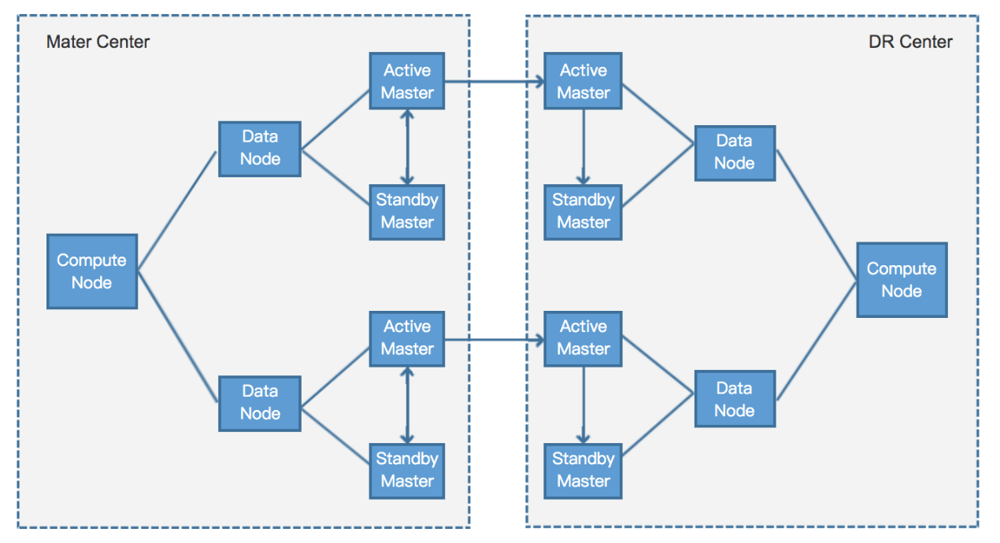

The user performs business SQL operation through the service port of the master compute node in the master center; the compute node parses the SQL statements and determines and distributes them to the master data sources corresponding to each data node for execution based on the sharding rules.

At this time, through the MySQL master/slave replication function, users can synchronize data of each master data source in the master center to the corresponding master data source in the DR center.

If there are other slave data sources in the DR center, the data will be synchronized to other slave data sources in the DR center based on the MySQL master-slave replication relations in the DR center, so as to complete the cross-IDC data synchronization.

## Installation and deployment

### Environment requirements

**Server:** physical machine is recommended for production environment; virtual machine can be used for test environment. If performance test is needed, physical machine must be used.

**Operating system:** 64 bit CentOS 6.x, 7.x or RHEL 6.x, 7.x are recommended; other operating systems are not supported.

**Software:** the running of HotDB Server (distributed transactional database) and HotDB Management (distributed transactional database platform) requires Java environment. JDK V1.7 is required when compute node version is lower than 2.5.6, and JDK V1.8 is required when compute node version is 2.5.6 and above.

**Network environment:** at least Gigabit-NIC is required in a single IDC, and the total network latency between servers across IDCs is less than 10ms. The bandwidth between IDCs is fully sufficient, with no bandwidth bottleneck and no packet loss.

**Recommended configuration:**

For the hardware environment configuration recommendation, please refer to the [Hardware Config Recommendation](hardware-config-recommendation.md) document.

For configuration requirements and recommendations of cluster operation environment, refer to the [Cluster Environment Requirement](cluster-environment-recommendation.md) document.

### Function premise

- The DR mode of the compute node cluster is enabled; the MGR mode of data sources or ConfigDBs are not supported temporarily.
- When the DR center is the current standby center, even if the ConfigDB and the data source replication mode is configured as master-maste, the actual replication relations can only be master-slave. When the DR center is switched to the current active center, the compute node will build master-master replication relations for the ConfigDB and data source of the master-master mode.
- The performance throughput index is based on the internal standard performance test environment. In the case of asynchronous replication, the performance can exceed 100,000 TPS; for semi-synchronous replication, the expected performance loss is 1/3.
- It is recommended to use the automatic cluster deployment function to deploy the disaster recovery environment, or at least use the one click deployment installation script for single-component deployment before adding configuration on the management platform. Manual deployment is not recommended.
- If the compute node enables XA mode, the data source must enable semi-synchronous replication, otherwise data consistency cannot be guaranteed.

### Deployment architecture

This section will take the following deployment architecture in master/slave mode as an example to explain the deployment related functions:

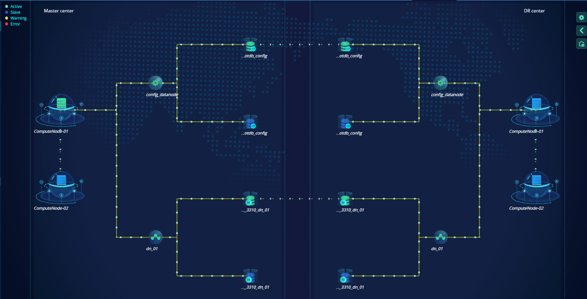

The actual connection information corresponding to each component is listed as follows:

| IDC Type      | Component Type | Role           | Code Name | Connection Information                                                                                                   |
|---------------|----------------|----------------|-----------|--------------------------------------------------------------------------------------------------------------------------|
| Master Center | Compute Node   | Master         | HotDB-01  | 192.168.220.186_3323_3325                                                                                                |
| ^             | ^              | Slave          | HotDB-02  | 192.168.220.187_3323_3325                                                                                                |
| ^             | Data Source    | Master         | ds01      | 192.168.220.186_3307                                                                                                     |
| ^             | ^              | Standby Master | ds02      | 192.168.220.187_3307                                                                                                     |
| ^             | ConfigDB       | Master         | hc01      | 192.168.220.186_3306                                                                                                     |
| ^             | ^              | Standby Master | hc02      | 192.168.220.187_3306                                                                                                     |
| DR Center     | Compute Node   | Master         | HotDB-03  | 192.168.220.188_3323_3325                                                                                                |
| ^             | ^              | Slave          | HotDB-04  | 192.168.220.189_3323_3325                                                                                                |
| ^             | Data Source    | Master         | ds03      | 192.168.220.188_3307                                                                                                     |
| ^             | ^              | Standby Master | ds04      | 192.168.220.189_3307<br>(Configured as master-master, however the actual replication relation is set up as master-slave) |
| ^             | ConfigDB       | Master         | hc03      | 192.168.220.188_3306                                                                                                     |
| ^             | ^              | Standby Master | hc04      | 192.168.220.189_3306<br>(Configured as master-master, however the actual replication relation is set up as master-slave) |

> **Note**
>
> - When deploying in a real scenario, it is not recommended to deploy the compute nodes and data sources on the same server. This time is only for the convenience of subsequent explanations.
> - In the real deployment environment, the number of data nodes and data sources should be planned according to the actual needs. For the convenience of explanation, only single data node deployment is made here.

### Automatic deployment

Automatic deployment can be achieved through the cluster deployment function provided by the management platform. The cluster deployment function in the DR mode is performed orderly in the master center and the DR center of compute node clusters as. One deployment at least requires: compute node, ConfigDB, keepalived (required in master/slave node mode), and other components: data source, NTPD should be planned and installed according to the actual needs.

This section only describes in detail what should be paid attention to in the automatic deployment when the DR mode, not single-IDC mode, is enabled. For other automatic deployment related contents, please refer to the [Installation and Deployment](installation-and-deployment.md) document.

#### Deploy a new set of disaster recovery environment

###### Cluster deployment -- master center deployment

**(1) Select the deployment mode:**

1. Log in to the management platform as the management user, enter "Cluster Management -> Compute Node Cluster", and click the \[Cluster Deployment] button to enter the cluster deployment function page.
2. Choose the compute node mode, click to enable "deploy by DR mode", choose "master center" in "IDC type" and click \[Parameter Configuration] to enter the cluster deployment parameter configuration page.


**(2) Parameter configuration：**

The parameter configuration of the master center is basically the same as the single-IDC mode. The differences are listed as follows:

- The compute node v2.4 is not supported; the data source and ConfigDB MySQL v5.6 is not supported either;
- MGR is not supported by the data source and ConfigDB;
- Over "More" button of the data source and ConfigDB, GTID and semi-synchronous replication are enabled by default, and GTID is not allowed to be disabled;
- A new time zone setting module is added to configure the time zone of the operating system to ensure that the deployed component time zone is consistent with the operating system time zone. You can fill in the valid time zone under system directory /usr/share/zoneinfo/. The default time zone is Asia/Shanghai.

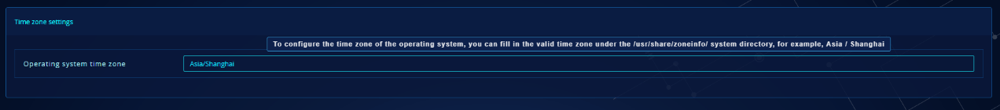

Therefore, the parameter configuration of the master center is as follows ([deployment architecture](#deployment-architecture)):

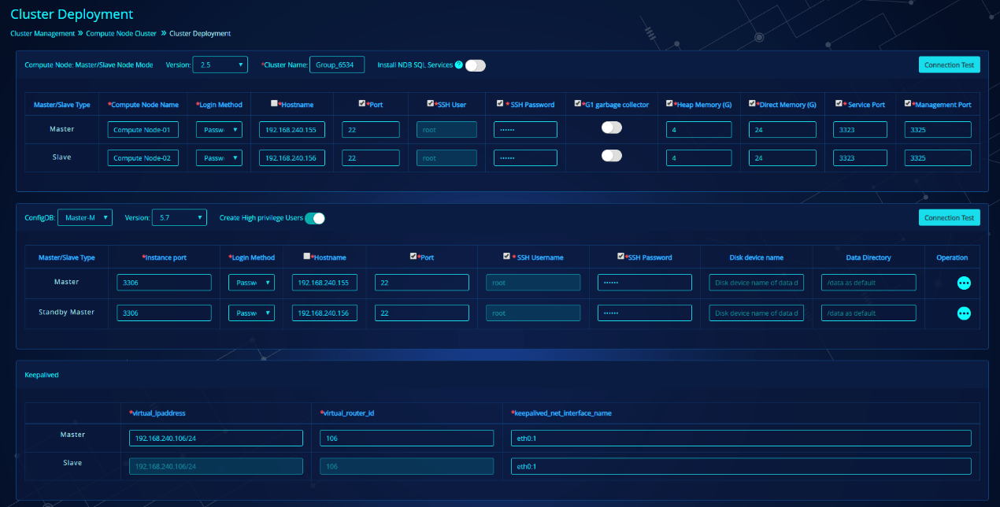

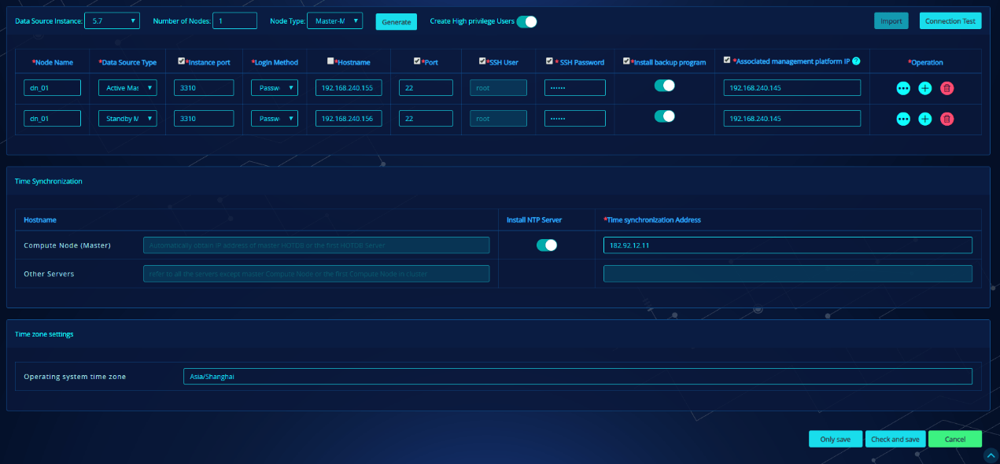

**(3) Start deployment:**

1. Click \[Check and save] to verify the validity and integrity of the configuration parameters, and send a detection scripts to the target server to verify whether it meets the hardware requirements of the cluster deployment. If it does not meet the requirements, a pop-up prompt will appear. Before deployment, all clusters need to pass \[Check and save] before installation.
2. After check and accept of the management platform, click \[Start deployment] to enter the installation process.


While a step "set up disaster recovery replication" is added in the installation and deployment process of management platform, there are no additional operations in this step when deploying the master center. Therefore, the installation process of the master center deployment is the same as that of a cluster deployment in single-IDC mode.

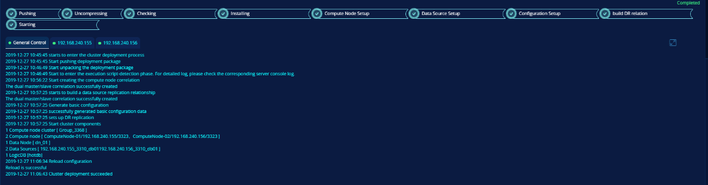

**(4) Cluster management:**

When the monitoring of cluster is enabled, a deployed master center with no DR center deployed or added can be regarded as a compute node cluster in single-IDC mode, and can be managed by single-IDC mode.


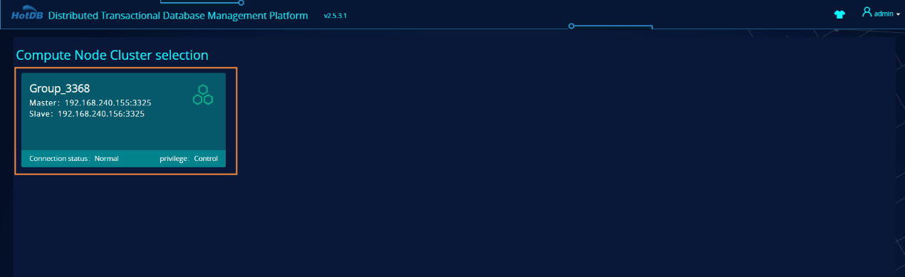

That is, the DR mode of the cluster will be OFF at this time after the master center is deployed, which can be seen on the compute node details page of the IDC via cluster management page.


At this time, you can either deploy the corresponding DR center through the cluster deployment function, or after the DR center is deployed manually, click "Enable DR mode" on the Edit Compute Node Cluster page to add the DR center information to the cluster.

###### Cluster deployment -- DR center deployment

**(1) select the deployment mode:**

1. After the master center is deployed, click the \[Cluster Deployment] button again.
2. Similar to the master center deployment, after choosing the compute node mode, click to enable "Deploy by DR mode", choose [DR center](#dr-center) in "IDC type" and the corresponding "Cluster name of the master center", i.e., the master center cluster that is newly deployed.

> **Note**
>
> It is recommended to deploy the DR center at the low peak of the master center business, otherwise it may affect the data migration time when setting up the disaster recovery replication.

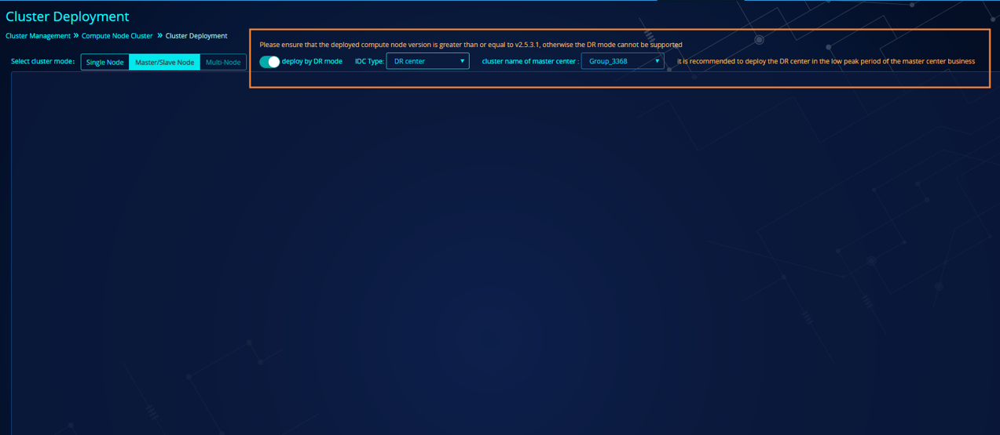

**(2) Parameter configuration:**{#dr-center-parameter-configuration}

While the parameter configuration of the DR center is roughly the same as that of the master center, it needs attention that some parameter settings will be forced to be consistent with that of the master center, that is, the management platform automatically obtains the relevant parameter values of the master center and fills in the DR center with no modification allowed, which are listed as follows:

- The version of compute node, ConfigDB and data source must be consistent with that of the master center;
- `--character-set-server`, `--collation-server`, `--innodb-buffer-pool-size-mb` in "More Parameters" of ConfigDB and data source must be consistent with the master center;
- The DR center will automatically generate all data nodes that have existed in the master center by default, and the data node type is the same as that in the master center (in this example, a master-master data node is automatically generated). You can choose other data source types and click Generate to regenerate, but the number and name of data nodes must be consistent with the master center;

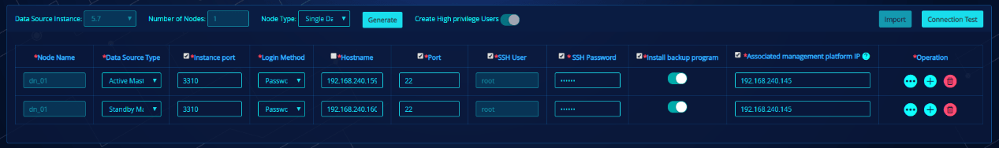

- The time synchronization address and operating system time zone must be consistent with the master center.

The parameter configuration of the DR center reference is as follows ( [Deployment architecture](#deployment-architecture) ):


**(3) Start deployment:**

1. Click \[check and save], the management platform will check whether there is error. When it is all correct, click \[Start deployment] to enter the installation process.
2. In step "Generate basic configuration", configuration of the DR center will be updated to ConfigDB and server.xml of the master center synchronously and take effect after dynamic loading.
3. In step "Set up disaster recovery replication", data of the master center ConfigDB and data source will be migrated to the DR center ConfigDB and data source, and the disaster recovery replication will be set up between the ConfigDB and data source of the two IDCs.

> **Note**
>
> Due to the data import, you may wait a long time if the master center data source has a large data amount.


###### Cluster management

After the successful installation and deployment of the DR center, you can see a compute node cluster with two sets of IDCs and with the DR mode enabled on the cluster management page.


- The IDC types include the master center and the DR center. According to the IDC status, the icon  next to the IDC type indicates that type of the IDC is current active center;
- The two IDCs have their own component configuration and deployment, among which the current standby center does not provide the access to \[Switch] and \[Rebuild], that is, the current standby center does not allow to manually switch compute nodes;
- The two IDCs in a cluster temporarily do not support separate monitoring pause or start, and the user privilege also regards the two IDCs as a cluster and manages uniformly;


- If the cluster with DR mode enabled is deleted, the master center and the DR center will be deleted at the same time;
- On the compute node cluster editing page, if the "Enable DR mode" is ON, it is not allowed to be OFF; if it is OFF, it is allowed to be ON.The existing cluster information is used as the master center configuration, and the DR center configuration can be added to it.

###### Disaster recovery environment deployment in multi-node mode

The disaster recovery deployment of the multi-node cluster mode is basically the same as the steps of the master/slave compute node mode described in the previous chapter. The differences are as follows:

1. For disaster recovery deployment of the multi-node cluster mode, the version of compute node must be 2.5.6 and above, and "multi node" must be selected at the entrance of cluster deployment. On this basis, the master center and DR center of disaster recovery mode can be deployed.

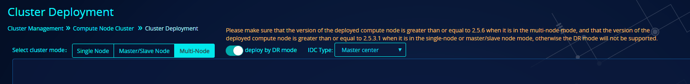

2. For the multi-node cluster, the master center should be deployed before the DR center.

3. The configuration of the multi-node cluster in the master center and DR center is consistent with the deployment that needs to be filled in for the common multi-node cluster mode deployment.

4. In the process of automatic deployment through the management platform, the program will configure server.xml according to the information of the master center and DR center by default. The associated configuration items include:

**Modification items for cluster mode in master center:**

```
haMode is set to 4, that is, the cluster mode master center
idcld is set to 1, that is, the master center
idcNodeHost is set to the compute node information of the DR center: host name (IP) + service port, separated by English commas, for example: 192.168.220.112:3325,192.168.220.113:3325,192.168.220.114:3325
```

> **Note**
>
> the clusterName in the cluster of the same IDC must be consistent, but the master center and the DR center cannot be consistent. Therefore, the master center can be configured as HotDB-Cluster-idc1-groupID by default (groupID is the platform cluster group ID, in order to distinguish the deployment of multiple clusters on the same server).

**Modification items for cluster mode of DR center:**

```
haMode is set to 5, that is, cluster mode DR center
idcld is set to 2, that is, the DR center
idcNodeHost is set to the compute node information of the master center: host name (IP) + service port, separated by English commas, for example: 192.168.210.86:3325,192.168.210.87:3325,192.168.210.88:3325
```

> **Note**
>
> The clusterName in the cluster of the same IDC must be consistent, but the master center and the DR center cannot be consistent. Through platform deployment, the default configuration is: HotDB-Cluster-idc1/idc2-groupID (groupID is the platform cluster group ID, in order to distinguish the deployment of multiple clusters on the same server)

In addition to the special modification items described above, for the deployment of multi-node cluster in DR mode you should also pay attention to:

1. The serverID in the same IDC must be continuous. In the master center and DR center, it is according to the number of nodes and increases from 1 by default.
2. When all compute nodes of the cluster in the same IDC are deployed on one server, haNodeHost in the master center should be configured as the cluster information of all members in the IDC: host name (IP) + communication port, for example: 192.168.210.86:3326,192.168.210.86:3327,192.168.210.86:3328. When not on the same server, there is no need to pay attention to haNodeHost.
3. ConfigMGR(whether ConfigDB uses MGR) must be set to false, and ConfigDB MGR is not supported in multi-node cluster mode.
4. Other cluster related modification items, such as clusterSize, clusterNetwork, clusterHost and clusterPort, are consistent with the configured mode in the ordinary single IDC.

It allows the master center to be multi-node cluster mode, DR center to be the master/slave compute node mode or vice versa. Different architectures are compatible.

The corresponding host names of all components in the DR center cannot be consistent with the master. Otherwise, it will not pass the verification.

The information of multi-node cluster after normal deployment is shown in the list as follows:

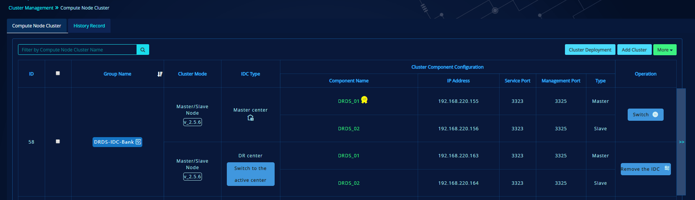

#### Disaster recovery environment deployment based on a running cluster

The cluster deployment function of management platform is able to deploy DR center for the running cluster. Requirements for the cluster are as follows.

- If compute node mode in the cluster is master/slave compute node mode, and the version is higher than 2.5.3.1; if it is multi-node mode, and the version needs to be higher than 2.5.6 and above
- The mode of ConfigDB and data source in the cluster cannot be MGR;
- SSH information must be added to management platform in the cluster. If not, you can try again after adding it on the compute node cluster editing page;
- ConfigDB or management port of the cluster must be connected normally;
- ConfigDB or data source in the cluster must have GTID enabled.
- Try to ensure that all components of the cluster are in normal operating status, including but not limited to: no ConfigDBs or data sources marked as unavailable, master/slave status in which the high availability switch can be performed and the required configuration is met, server resource usage lower than the alert threshold, cluster throughput lower than the alert threshold, etc.

**Deployment steps are as follows:**

1. After clicking the \[Cluster Deployment] button, click to enable "Deploy by DR mode", and choose "DR center" in "IDC type". Then, two cluster names, Compute node mode cluster with DR mode disabled and DR mode cluster with no corresponding DR center, will appear in the drop-down box of cluster name of master center.
2. After choosing a target cluster name and clicking \[Parameter Configuration], if master center is deployed through management platform, the management platform will also automatically obtain the relevant parameter values of master center and automatically fill in DR center with no modification allowed. Please refer to the [parameter configuration and deployment process of DR center.](#dr-center-parameter-configuration) If the former master center is manually deployed offline, it is required to manually ensure that the parameters filled in are consistent with the master center configuration.

### Manual deployment

#### Deploy a new set of disaster recovery environment

When deploying the disaster recovery environment, the deployment process of components in master center and DR center are the same as deployment process in single-IDC mode. Please refer to the [Manual Deployment](installation-and-deployment.md#manual-deployment) chapter of the [Installation and Deployment](installation-and-deployment.md) document. It needs extra attention that the number of data nodes in both IDCs should be the same, and the names should correspond one by one. The content below is masterly about the required configuration modification after deployment of the basic components of master center and DR center.

##### Parameter configuration modification

###### Master/slave mode

When deploying the compute nodes of master center or DR center, the [new parameters](#new-parameters) of the DR mode need to be modified accordingly. According to the [deployment architecture](#deployment-architecture), if the compute node mode is master/slave mode, the compute node parameters of the two IDCs should be modified as follows:

Master center:

```xml
<property name="url">jdbc:mysql://192.168.220.186:3306/hotdb_config</property><!-- Master ConfigDB address, which needs to be the real IP address of the ConfigDB service -->
<property name="username">hotdb_config</property><!-- Master ConfigDB user name -->
<property name="password">hotdb_config</property><!-- Master ConfigDB password -->
<property name="bakUrl">jdbc:mysql://192.168.220.187:3306/hotdb_config</property><!-- Slave ConfigDB address, which needs to be the real IP address of the ConfigDB service -->
<property name="bakUsername">hotdb_config</property><!-- Slave ConfigDB user name -->
<property name="bakPassword">hotdb_config</property><!-- Slave ConfigDB password -->
<property name="drUrl">jdbc:mysql://192.168.220.188:3306/hotdb_config</property><!-- ConfigDB address in DR center -->
<property name="drUsername">hotdb_config</property><!-- ConfigDB user name in DR center -->
<property name="drPassword">hotdb_config</property><!-- ConfigDB password in DR center -->
<property name="drBakUrl">jdbc:mysql://192.168.220.189:3306/hotdb_config</property><!-- Slave ConfigDB address in DR center -->
<property name="drBakUsername">hotdb_config</property><!-- Slave ConfigDB user name in DR center -->
<property name="drBakPassword">hotdb_config</property><!-- Slave ConfigDB password in DR center -->
<property name="haMode">2</property><!-- High-availability mode, 0:HA, 1:Cluster, 2:HA in master center, 3:HA in DR center) -->
<property name="idcId">1</property><!-- ID of IDC, 1:master center, 2:DR center -->
<property name="idcNodeHost">192.168.220.188:3325,192.168.220.189:3325</property><!-- Computer node info in the other IDC -->
```

**DR center：**

ConfigDB-related configuration is consistent with that of the master center, unnecessary details omitted.

```xml
<property name="haMode">3</property><!-- High-availability mode, 0:HA, 1:Cluster, 2:HA in master center, 3:HA in DR center) -->
<property name="idcId">2</property><!-- ID of IDC, 1:master center, 2:DR center -->
<property name="idcNodeHost">192.168.220.186:3325,192.168.220.187:3325</property><!-- Computer node info in the other IDC -->
```

###### Multi-node mode

Please refer to the relevant parameter adjustment instructions in the chapter [Disaster Recovery Environment Deployment in Multi-node Mode](#disaster-recovery-environment-deployment-in-multi-node-mode), and adjust it as needed (focus on points 4 and 5)

##### Set up ConfigDB replication relations

This section will introduce the setup of ConfigDB replication relations. The deployment architecture is as follows:

| IDC Type      | Component Type | Role                                                           | Code Name | Connection Information |
|---------------|----------------|----------------------------------------------------------------|-----------|------------------------|
| Master Center | ConfigDB       | Master                                                         | hc01      | 192.168.220.186_3306   |
| ^             | ^              | Standby Master                                                 | hc02      | 192.168.220.187_3306   |
| DR Center     | ConfigDB       | Master                                                         | hc03      | 192.168.220.188_3306   |
| ^             | ^              | Standby Master<br>(Actually master-slave replication relation) | hc04      | 192.168.220.189_3306   |

The ConfigDB is essentially a standard MySQL instance, so under this deployment architecture, the order of setting up the ConfigDB should be:

1. Set up a master-master replication relation between ConfigDBs in the master center;
2. Set up a master-slave replication relation between the master ConfigDB in the master center and the master ConfigDB in the DR center;
3. Set up a master-slave replication relation between ConfigDBs in the DR center;
4. Import the ConfigDB data into the master ConfigDB in the master center.

The detailed steps are as follows:

1. By default, MySQL instances are installed on these four servers and GTID is enabled in the configuration parameters.
2. Set up a master-master replication relation between the MySQL instances of servers 220.186 and 220.187.

> **Note**
>
> For more requirements and more detailed master-slave replication setup steps, please refer to the relevant chapters in the "[Recommended steps for replication setup](#recommended-steps-for-replication-setup)". This section describes the basic operations performed without considering the influence of other factors.

Execute the code on Instance 192.168.220.186_3306:

```
mysql> change master to master_host='192.168.220.187',master_user='repl',master_password='repl',Master_Port=3306,master_auto_position=1;
mysql> start slave;
```

Execute the code on Instance 192.168.220.187_3306：

```
mysql> change master to master_host='192.168.220.186',master_user='repl',master_password='repl',Master_Port=3306,master_auto_position=1;
mysql> start slave;
```

At this time, by executing show slave status on 220.186 and 220.187 respectively, you can see that the relation between Master and Host is master-master,and Slave_IO_Running and Slave_SQL_Running are in normal status. For example:

Execute the code on Instance 192.168.220.186_3306：

```
mysql> show slave status\G
*************************** 1. row ***************************
Slave_IO_State: Waiting for master to send event
Master_Host: 192.168.220.187
Master_User: repl
Master_Port: 3306
Connect_Retry: 60
Master_Log_File: mysql-bin.000001
Read_Master_Log_Pos: 57030
Relay_Log_File: mysql-relay-bin.000002
Relay_Log_Pos: 4785
Relay_Master_Log_File: mysql-bin.000001
Slave_IO_Running: Yes
Slave_SQL_Running: Yes
```

3. Set up a master-slave replication relation (DR replication) between MySQL instances on servers 220.186 and 220.188.

Execute the code on Instance 192.168.220.188_3306：

```
mysql> change master to master_host='192.168.220.186',master_user='repl',master_password='repl',Master_Port=3306,master_auto_position=1;
mysql> start slave;
```

4. Set up a master-slave replication relation between MySQL instances on servers 220.188 and 220.189.

Execute the code on Instance 192.168.220.189_3306：

```
mysql> change master to master_host='192.168.220.188',master_user='repl',master_password='repl',Master_Port=3306,master_auto_position=1;
mysql> start slave;
```

5. Import the ConfigDB data to the master ConfigDB 192.168.220.186_3306 in the master center.

Execute the code on Server 192.168.220.186：

```
root> mysql -uroot -S /data/mysql/mysqldata3306/sock/mysql.sock < /usr/local/hotdb/hotdb-server/conf/hotdb_config.sql
```

6. Wait for the replication latency to catch up, then log in to Instance 3306 on four servers to find the imported ConfigDB data, which means the ConfigDB deployment is successful.

```
mysql> use hotdb_config;
mysql> show tables;
+------------------------------------+
| Tables_in_hotdb_config_replication |
+------------------------------------+
| hotdb_auto_failover                |
| hotdb_config_info                  |
| hotdb_config_info_running          |
| hotdb_datanode                     |
| hotdb_datanode_running             |
| hotdb_datasource                   |
...More details omitted ...
```

##### Set up data source replication relations

Under a new disaster recovery environment deployed from zero, ConfigDB and the data source are essentially standard new MySQL instances, among which the difference is that the ConfigDB data needs to be imported after the ConfigDB replication relation is set up, while the data source replication relation has no such requirement. Therefore, for the process of setting up the data source disaster recovery relation, please refer to the [Set up ConfigDB replication relations](#multi-node-mode) and skip the Importing ConfigDB Data step.

##### Add compute node clusters to management platform

If the clusters have been successfully deployed offline, you can add the compute node clusters to management platform by filling in the configuration through cluster adding function of management platform.

**（1）Compute node:**

Click "Enable DR mode", and fill in two sets of compute node information of the master center and the DR center. The numbers of compute nodes in two IDCs are selected respectively by two "compute node modes". Select according to different compute node modes. If it is master/slave mode, select master/slave node. If it is multi-node mode, select multi node.

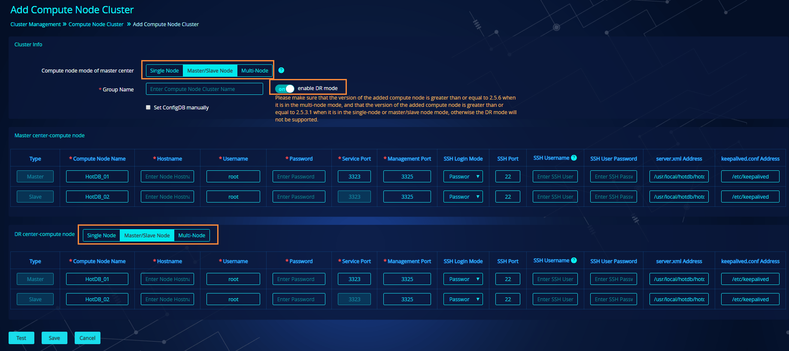

> **Note**
>
> 1. In the multi-node mode, you need to add the configuration of cluster communication ports. If the compute nodes are distributed on different servers and the communication ports are consistent, you can fill in only one port (3326 by default). If the compute nodes are deployed on the same or multiple servers with different ports, you can use English commas to separate the communication ports, for example, 3326,3327,3328, and the order of the communication ports should correspond to the order of adding the compute nodes. Otherwise, when saving the verification, it will refuse to save and remind "the compute nodes are on the same server, the communication ports must match the compute nodes in numbers and cannot be repeated.".
> 2. If multiple compute nodes in the cluster are deployed on the same server, the communication port+ service port+ management port should be unique to each other, and there can't be the same port combination.


3. When the cluster mode of the added compute node does not match the real compute node mode, the configuration verification will synchronously verify the current status and give an error reminder.

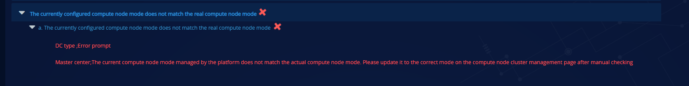

**（2）ConfigDB:**

If the management port of the compute node is connectable, the management platform will automatically obtain the ConfigDB information without the need of manually filling in the ConfigDB; if the management port of the compute node is not connectable, the management platform cannot obtain the ConfigDB information and needs to manually add the ConfigDB information. Check "Manually setting ConfigDB" and fill in the ConfigDB information of two IDCs respectively.

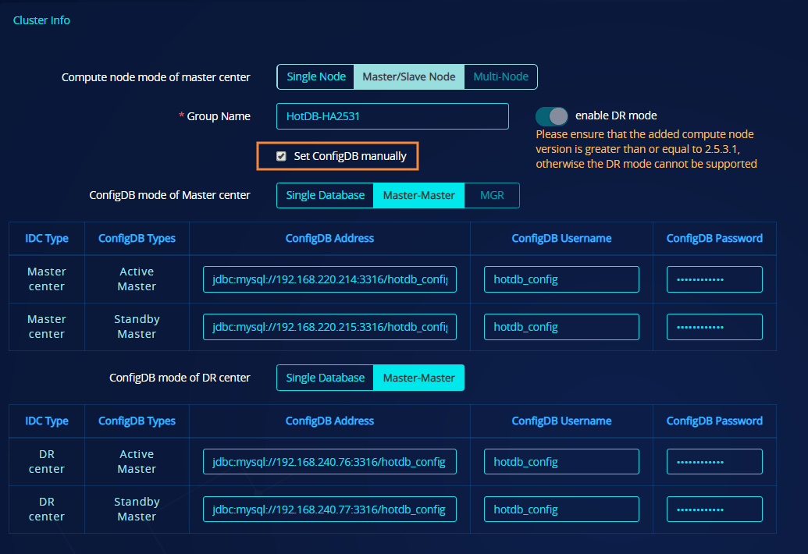

**（3）Connection detection:**

Click Detect to detect whether the connection of compute nodes is normal.

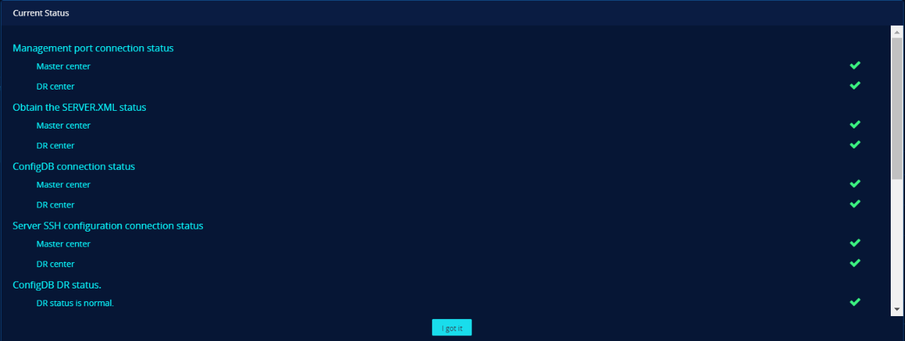

Example of normal connection

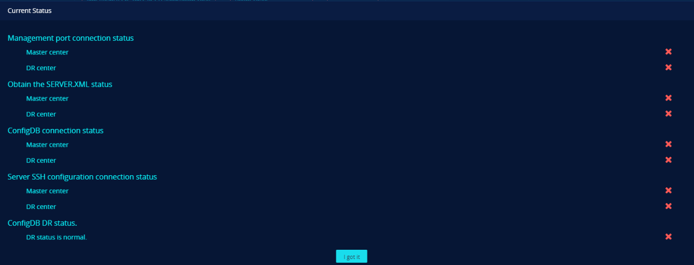

Example of abnormal connection

IDC identifications are added to four detection items in the single-IDC mode, which can clearly indicate which IDC has abnormal connections;

Disaster recovery status detection of ConfigDB is added, including two items:

- ConfigDB replication status: detect whether the master-master (master-slave) replication relation between ConfigDBs in the two IDCs is normal and whether the disaster recovery relation between master ConfigDBs in the two IDCs is normal. If the disaster recovery relation between master ConfigDBs in the two IDCs is abnormal, the replication status of ConfigDB in the IDC will not be detected.
- metadata consistency: whether the data of all ConfigDBs in the two IDCs are consistent with the current active ConfigDB in the master center.

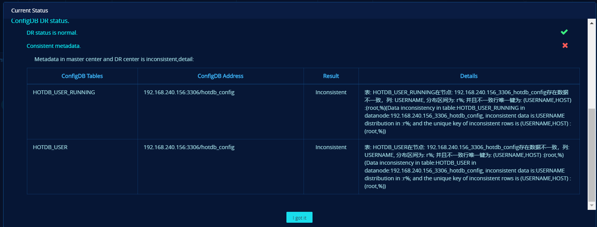

When the DR center is switched to the current active IDC after the failure of the master center, the \[Detect] here will detect based on the IDC status, that is, detect the port connection status of the current active center; detect the data consistency of all other ConfigDBs with the current active ConfigDB in the current active center as a standard; detect the replication status internal the IDC or between IDCs, etc.

##### Add data sources for IDCs

With the compute node cluster added successfully, you can switch to the general user role, select the added cluster on the [compute node cluster selection](#compute-node-cluster-selection) page, and click [Add Node](#add-node) on the node management page to add data nodes and data sources for both the master center and the DR center at the same time. For details, please refer to the relevant linked section.

#### Disaster recovery environment deployment based on a running cluster

##### Parameter configuration modification

To deploy the DR center on the basis of the running cluster, it is necessary to modify the [new parameters](#new-parameters) related to the DR mode of the master center. For the modification, please refer to the [compute node parameter configuration modification](#parameter-configuration-modification) under the chapter of deploying a new set of disaster recovery environment.

##### Set up ConfigDB replication relations

When deploying a DR center on the basis of a running cluster, the steps of setting up ConfigDB replication relations are basically the same as that of deploying a new set of disaster recovery environment. The difference is that when deploying a DR center on the basis of a running cluster, due to the existing configuration information in the ConfigDB of master center, the master ConfigDB data of master center should be migrated to the master ConfigDB of DR center before setting up when setting up a disaster recovery relation. Therefore, the setting up sequence of ConfigDB should be:

1. The master-master replication relation between ConfigDBs in the master center is set up by default;
2. Import the data of the master ConfigDB of the master center into the master ConfigDB of the DR center;
3. Set up a master-slave replication relation between the master ConfigDB of the master center and the master ConfigDB of the DR center;
4. Import the data of the master ConfigDB of the DR center into the slave ConfigDB of the DR center;
5. Set up a master-slave replication relation between ConfigDBs in the DR center;

**Deployment architecture for reference is as follows:**

| IDC Type      | Component Type | Role                                                           | Code Name | Connection Information |
|---------------|----------------|----------------------------------------------------------------|-----------|------------------------|
| Master Center | ConfigDB       | Master                                                         | hc01      | 192.168.220.186_3306   |
| ^             | ^              | Standby master                                                 | hc02      | 192.168.220.187_3306   |
| DR Center     | ConfigDB       | Master                                                         | hc03      | 192.168.220.188_3306   |
| ^             | ^              | Standby master<br>(Actually master-slave replication relation) | hc04      | 192.168.220.189_3306   |

**The detailed steps are as follows:**

1. By default, the master-master replication status of the ConfigDB in the master center is normal and the data is consistent at this time, and MySQL instance has been installed on the server in the DR center with GTID enabled in the configuration parameters.

> **Note**
>
> for more requirements and more detailed master-slave replication setup steps, please refer to the relevant chapters in the "[Recommended steps for replication setup](#recommended-steps-for-replication-setup)". This section describes the basic operations performed without considering the influence of other factors.

2. Import the data from MySQL Instance 220.186_3306 to MySQL Instance 220.188_3306.

Execute the code on Server 192.168.220.186：

```
root> mysqldump --no-defaults -uroot --port=3306 --no-tablespaces --default-character-set=utf8mb4 --all-databases --set-gtid-purged --single-transaction --events --routines --triggers --hex-blob >/usr/local/config_data.sql ;echo $?
```

If the returned result is 0, the data is imported successfully:

Transmit the exported sql file to 192.168.220.188 via scp command：

```
root> scp /usr/local/config_data.sql <root@192.168.220.188:/usr/local/>
```

Execute the code on Server 192.168.220.188:

```
root> mysql --no-defaults --default-character-set=utf8mb4 --binary-mode --disable-reconnect --host=192.168.220.188 --port=3306 --uroot -proot < config_data.sql;echo $?
```

If the returned result is 0, the data has been successfully imported.

At this time, you can see that the master ConfigDB data of the DR center has been imported successfully:

```
mysql> show tables;
+------------------------------------+
| Tables_in_hotdb_config_replication |
+------------------------------------+
| hotdb_auto_failover                |
| hotdb_config_info                  |
| hotdb_config_info_running          |
| hotdb_datanode                     |
| hotdb_datanode_running             |
| hotdb_datasource                   |
...More details omitted...
```

3. Set up the master-slave replication relation (disaster recovery relation) between MySQL instances of servers 220.186 and 220.188.

Execute the code on Instance 192.168.220.188_3306：

```
mysql> change master to master_host='192.168.220.186',master_user='repl',master_password='repl',master_Port=3306,master_auto_position=1;
mysql> start slave;
```

4. Import data of MySQL instance 220.188_3306 to MySQL instance 220.189_3306.

Execute the code on Server 192.168.220.188：

```
root> mysqldump --no-defaults -uroot --port=3306 --no-tablespaces --default-character-set=utf8mb4 --all-databases --set-gtid-purged --single-transaction --events --routines --triggers --hex-blob >/usr/local/config_data.sql ;echo $?
```

If the returned result is 0, the data is imported successfully:

Transmit the exported sql file to 192.168.220.189 via scp command：

```
root> scp /usr/local/config_data.sql <root@192.168.220.189:/usr/local/>
```

Execute the code on Server 192.168.220.189:

```
root> mysql --no-defaults --default-character-set=utf8mb4 --binary-mode --disable-reconnect --host=192.168.220.189 --port=3306 --uroot -proot < config_data.sql;echo $?
```

If the returned result is 0, the data has been successfully imported:

5. Set up master-slave replication relations of MySQL instances between servers 220.188 and 220.189.

Execute the code on Instance 192.168.220.189_3306：

```
mysql> change master to master_host='192.168.220.188',master_user='repl',master_password='repl',master_Port=3306,master_auto_position=1;
mysql> start slave;
```

6. At this time, the data modification of master ConfigDB in master center will be synchronized to all ConfigDBs of the two IDCs, that is, the ConfigDB is successfully deployed.

##### Set up data source replication relations

ConfigDB and data source are essentially standard MySQL instances, so the principle of setting up replication relations is the same: both need to import data before setting up the replication relation. You can refer to [Set up ConfigDB replication relations](#multi-node-mode).

##### Add compute node clusters to management platform

If clusters in the DR center have been successfully deployed offline, you can modify the DR mode status of the running cluster through management platform, fill in the configuration information of DR center, and add the DR center to the cluster.

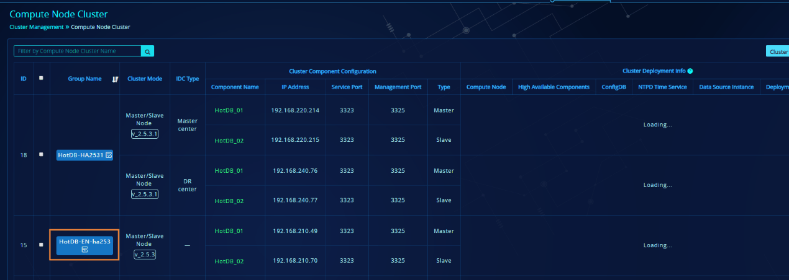

1. On the cluster management page, click the name of a running cluster to enter the compute node cluster editing page.

2. Click "Enable DR mode" to take the existing cluster information as configuration information of the master center, and add configuration information of the DR center for it. For details, please refer to [add compute node clusters to management platform](#add-compute-node-clusters-to-management-platform).


##### Add data source for DR centers

On the node management page of general users, if you click Add node, management platform will judge whether there is data node missing in the newly added DR center compared with the running master center. If any, you need to [add the missing node](#add-missing-data-nodes) for it. For details, please refer to the relevant linked section.

## Description of functions related to management platform

This chapter needs to be read together with the [HotDB Management](hotdb-management.md) document. This chapter only describes the function usage of the compute node cluster group managed by the management platform after enabling the DR mode. At the same time, the function pages not specifically mentioned display information related to the current active center and control the current active center status by default.

### Compute node cluster selection

Log in to HotDB Management as a general user and enter the " compute node cluster selection" page.

- If the user has the privilege of accessing or controlling a cluster with DR mode enabled and the cluster runs normally, the current active center is displayed in green, with the current standby center in blue. When the master center is the current active center, the DR center is the current standby center, and both of them are connected normally, it is as shown in the figure below.

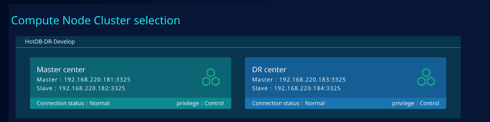

- Click either IDC module to enter the management platform. Pages not specifically mentioned in this document will display or control information of the current active center. For example, when one IDC fails to connect and switches to the other IDC, click any IDC module you will enter the management platform page that monitors the current active center, that is, the DR center after the switch.

- Each IDC module will display the connection status of its own IDC, which is displayed the same way as that of the cluster in single-IDC mode, including: when the compute node is unable to connect, the compute node is marked red and abnormal; when the ConfigDB is unable to connect, the connection of the bottom ConfigDB is displayed abnormal; when part of the ConfigDB is unable to connect, move the cursor over the word "partially abnormal" to display the specific ConfigDB connection abnormal information, etc.

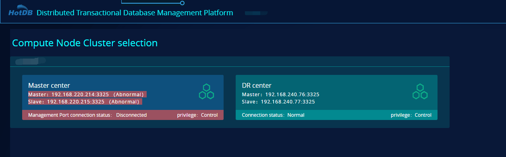

> In the above screenshot, the DR center is switched to be the current active center after the master center fails.

- If all compute nodes in master center cannot be connected, click either IDC panel, it will display the prompt message that the current master center cannot provide services. Please ensure that DR center will be manually enabled after all compute nodes in master center are disabled. If it is necessary to enable the DR center, please refer to the [Switch to the DR center after master center fails](#master-center-fails-and-dr-center-is-switched-as-the-active-idc).


- After manual switching, DR center is the current active center, which is displayed in green. Click either IDC panel to enter the management platform where the DR center is identified as the current active center. If you need to restart the master center after manual repair, please refer to [cross-IDC failure repair and switching back](#idc-failure-repair-and-failover).

- The cluster selection page in cluster mode is shown in the following figure, and its status is similar to that of the master/slave mode.

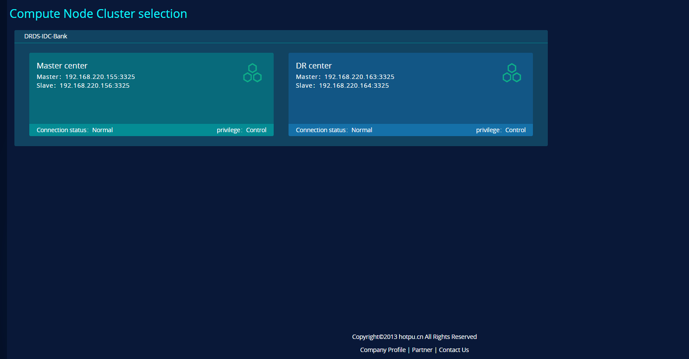

### Deployment environment examination

The deployment environment examination not only supports the current active center, but also the IDC that does not provide services, that is, the current standby center.

- Click \[Initiate Examination], if you choose the cluster of DR mode, you can continue to choose the master center or the DR center for examination.


- Several examination items for the current standby center are skipped due to the inability to connect to the service port. The skipped items are listed as follows:

| Examination Dimensions | Examination Items                 | Examination Details                                                          |
|------------------------|-----------------------------------|------------------------------------------------------------------------------|
| Software Configuration | High Availability of Compute Node | The compute node service port and management port can be normally connected. |
| ^                      | ^                                 | Connection to the compute node service port via VIP is normal.               |
| ^                      | ^                                 | Compute Node Mode                                                            |
| ^                      | Basic function verification       | Data Source High Availability Switch                                         |
| ^                      | ^                                 | Compute Node High Availability Switch                                        |
| ^                      | ^                                 | Backup Program                                                               |
| ^                      | ^                                 | 10s Performance Test                                                         |

### Configuration

#### Node management

The node management page will manage all data nodes and all data sources of master center and DR center at the same time. For data nodes added in the master center and the DR center, it is required that the number of the data nodes is the same, and the names correspond one by one.

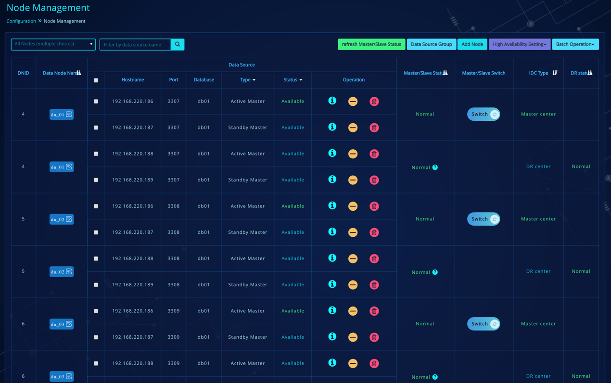

**（1）Descriptions of the added list information:**

**IDC type:**

IDC type refers to the type of IDC to which the data node belongs, including master center or DR center. Colors are displayed according to the status of IDC: available-green, standby-blue, unavailable-red. The IDC status is consistent with the IDC status displayed on the [compute node cluster selection page](#compute-node-cluster-selection).

For example, when cluster is running normally, the master center is displayed in green, with DR center in blue; when the master center goes down, IDC types of all data nodes in the master center are displayed in red.

**Disaster recovery status:**

Disaster recovery status refers to the replication status of the current active data source between the master center and the DR center.

If the data source of the master center is manually switched or fails over, the compute node will rebuild the replication relations of the current active data source between the master center and the DR center.

The disaster recovery status includes Abnormal, Unknown, Normal, Setting up and Setup failed, details as follows:

- **Empty:** For data nodes in the master center, the disaster recovery status is not displayed.
- **Normal:** Command show slave status can be executed normally; the replication status is normal (Slave_IO_Running: YES，Slave_SQL_Running: YES) and consistent with the master-slave relation required by the disaster recovery.
- **Abnormal:** replication status is abnormal (Slave_IO_Running: NO or Slave_SQL_Running: NO).
- **Unknown:** the data source cannot be connected; the data source does not have sufficient privileges, detection timeout (timeout time is 1min), the non-master-slave replication relation between nodes (no replication relation is set up, or the replication relation is set up incorrectly).
- **Setup failed:** it means that there is a detection failure or setup failure in the master-slave setup. Move the cursor over the word "Setup failed", it will prompt the specific failure information.
- **Setting up:** it means that the master-slave setup is currently in progress. When the background operation is completed, refresh the page, and it will display Normal or Setup failed.

If the master center fails and is switched to the DR center, the compute node will delete the replication relations of the former active data source between the master center and the DR center, and the disaster recovery status will be displayed as Unknown at this time.

**Master/slave status:**

The master/slave status function of the master center is the same as that of the single-IDC mode, which is displayed according to the configuration.

> **Note**
>
> The DR center needs to set up disaster recovery relations and multi-source replication is not allowed. When the DR center is the current standby center, if the data node type is master-master, the actual master-slave relation should be master-salve. At this time, the master-slave status only checks whether the master-slave replication is normal. When the DR center is switched to be the current active center, if the data node type is master-master, the master-slave status will display the detection results of master-master replication status.

If the master data source of the DR center fails, all the associated slave data sources will be set as unavailable and need manual repair.

**Data source status:**

The data source status is the same as the single-IDC mode, but it needs extra attention that when the DR center is the current standby center, if the master data source fails, the compute node will set all the related slave data sources as unavailable. When enabling the slave data source, you need to confirm that the current active data source is available, otherwise the slave data source cannot be enabled, that is, the slave data source can be enabled only after the master data source is enabled.

**（2）Descriptions of the page functions**

No \[switch] button can be seen in the data source of the current standby center, that is, when the master center or the DR center is the current standby center, management platform will not provide manual switch access for the data source.

Users can delete single or batch data sources and data nodes, while it is not allowed to separately delete the data nodes in the DR center which correspond to the master center. If the data nodes in the master center are deleted, the corresponding data nodes in the DR center will be deleted together.

##### Add node

The function can quickly configure data nodes and data sources for two IDCs, or configure data sources for one IDC separately. Due to requirement by the DR mode that the number of data nodes added in two IDCs must be the same and the names should correspond one by one, management platform makes restrictions accordingly when adding nodes.

**（1） Add data nodes and data sources at the same time:**

- Input "Number of Data Nodes", for example, 2, which means 2 data nodes are generated under the master center and DR center modules at the same time, and the names correspond one by one.
- The data node name can only be modified under the master center module, and the modification will be updated to the corresponding node in the DR center synchronously.
- It is allowed to delete data sources in any IDCs, however the deletion of data nodes must synchronize with the master center the DR center, that is, separate deletion of data nodes of DR center is not allowed.
- Check "Automatically build DR relation" to automatically set up a replication relation between the corresponding data nodes of the two added IDCs.


**(2) Add data source only:**

- Check "Add data source only" to add data sources to data nodes that already exist in the master center or DR center.
- Addition of only data sources will not affect the logical structure of data nodes in two IDCs. Therefore, when only adding data sources, the number of data sources added under any IDC module will not be limited. For example, if you want to add data sources to a data node in the master center separately, you can delete the automatically generated data source under the DR center module.

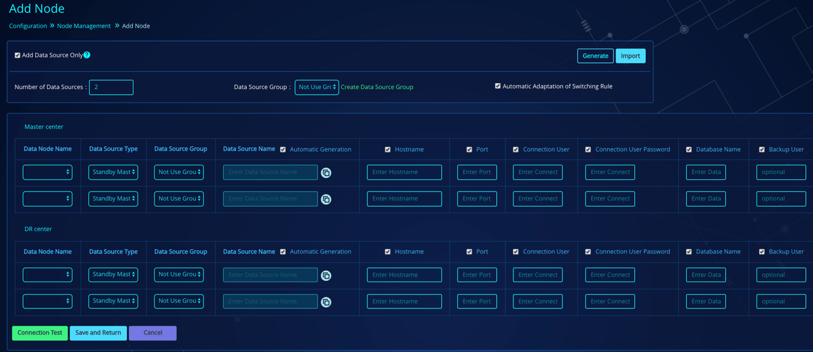

**(3) Add missing data nodes:**{#add-missing-data-nodes}

Click \[Add Node]. When the master center is the current active center, management platform will check whether the current logical structure of the two IDCs is consistent. If it is found that there are more data nodes in the master center than in the DR center, management platform will ask users to add corresponding nodes for the DR center, otherwise the function Add Node cannot be used. This function is used to separately supplement the data nodes which correspond to the production environment for the DR center after a DR center is added to an existing production environment, which can avoid the situation where the node information is manually modified in the ConfigDB.


Click \[Confirm], then management platform will automatically generate missing nodes in the DR center of the same node type as that of the master center. You can modify the "Data Node Type" or "Data Source Group" and regenerate it, but the data node name and number cannot be modified which are consistent with the master center.


**(4) Import function:**

When using the Import function, you need to ensure that the logical structure of the imported data nodes in the master center and the DR center is the same, that is, the number of data nodes is the same, and the names correspond to each other. Otherwise, the import will fail.

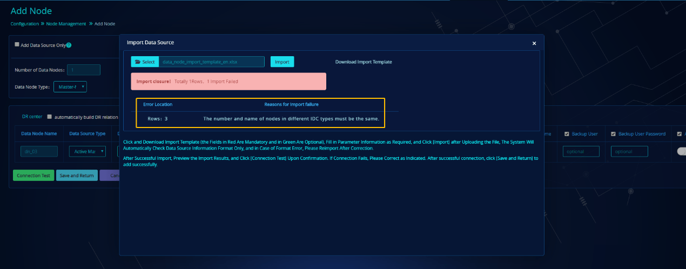

##### Master-slave setup

Master-slave setup can set up replication relations not only for the data sources in a single IDC that have not yet set up a replication relation, but also for the master data sources of the two IDCs.

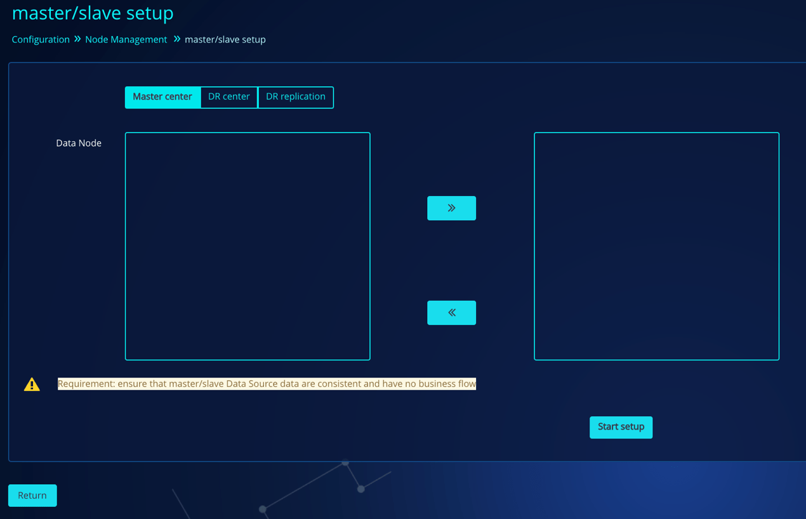

**（1）Setup instructions:**

(The setup instructions only explain the differences between DR centers. For detailed setup instructions and steps, please refer to the [HotDB Management](hotdb-management.md) documnet.)

- The data source you choose to set up cannot be configured with or have multi-master replication relations. To set up disaster recovery relations, it is required that the master data source in the DR center cannot be a slave data source in a set up replication relation; if the slave data source in the DR center has a set up replication relation, it can only be a replication relation with the master data source.

- The configuration parameters of the data source my.cnf selected for setup are correct (for those copied based on binlog and GTID, open the corresponding parameters respectively). To set up a disaster recovery relation, the data source must have GTID enabled.

**（2） Others:**

IDC type is added uniformly to the error message of setting up to identify which IDC the data source that reports errors belongs to.


If the master center fails, the DR center will be switched to the be current active center, and the master-slave setup function will not provide the setup of disaster recovery relations.

##### Switching rules

Switching rules configuration can configure the high availability switching priority for the data sources of the two IDCs. The compute node will detect the availability of the data source regularly. If the data source is detected to fail, the compute node will automatically switch to the standby data source according to the configured switching rules.

If the data source fails and no relevant switching rules are configured, automatic failover cannot be performed.

(1) **Add switching rules:**


Select the IDC type and add switching rules for the data sources in a single IDC.

The data sources in the DR center still need to be configured with intra-IDC switching rules, because when the master center fails and the DR center is switched to be the current active center, failure to configure the switching rules will result in failover failure between data sources.

(2) **Automatic adaption:**

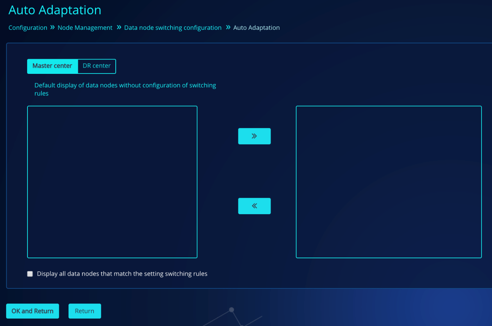

Select the IDC type and the switching rules will be automatically adapted for the data nodes in a single IDC. The automatic adaptation rules of the DR center remain unchanged.

#### Configuration checking

Configuration checking mainly provides checking function for relevant configurations of compute nodes to prevent abnormal operation caused by manual error settings or offline modification of relevant configurations of compute nodes. In the DR mode, the following adaptations are made:

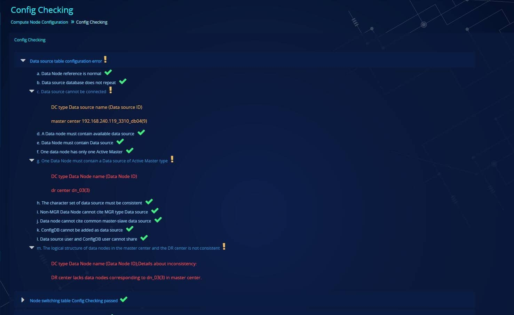

- The IDC type is added to the error message related to the checking of the data source, which can clearly identify which IDC's data source fails the checking, so as to troubleshoot the problem.
- The checking item \[Data source connection is normal] is changed to the checking of warning level. For example, if any data source in the master center or the DR center is connected abnormally, a warning message will appear in the configuration checking, which however will not affect the dynamic loading. When the master center or the DR center fails as the current standby center, this checking item will still check whether all data sources in the two IDCs are connected normally, which however will not affect the dynamic loading.
- If the unconnected data source causes no available nodes under the corresponding data nodes of the master center and the DR center, such as dn_01 of the master center and dn_01 of the DR center, an error message will appear in the checking item \[A Data Node must contain available Data Source] in the configuration checking, and the dynamic loading will not succeed. For example, if all data sources in a data node of the DR center are connected abnormally, as long as there are still available data sources in the corresponding data node of the master center, the dynamic loading will succeed, but a warning message will still appear in the configuration checking.
- An error-level checking item is added in \[Data Source table configuration]: the logical structure of the data nodes in the master center and the DR center is consistent, that is, the number of data nodes in the master center and the DR center is consistent, and the names correspond one by one.
- In \[ConfigDB status], \[ConfigDB connection is normal] is modified as a warning-level checking item. Similar to \[Data source connection is normal], check whether all ConfigDBs in the two IDCs are connected normally.
- A warning-level checking item in \[ConfigDB] is added: whether the replication status between ConfigDBs is normal, that is, whether the replication status of the internal ConfigDBs of a single IDC is normal and whether the replication status of the master ConfigDB between two IDCs is normal.


#### Compute node parameter configuration

The compute node parameter configuration can configure the server.xml parameters of two IDCs in a visualized manner.


- The server.xml parameter information of the master compute node of the current active center is displayed by default.
- The compute node parameters in the current active center are switched and checked through the TAB page.
- Click \[switch] to switch to the parameter configuration page of the other IDC.
- If the compute node fails or the connection failure of compute nodes due to the IDC switching, the parameter configuration page of the compute node cannot be displayed.


**(1) Parameter synchronization:**

If you check "Automatically synchronize to other compute nodes", the modified or added parameters will be synchronized to other compute nodes. If the DR center is the current active center, the master compute node parameters of the DR center will be displayed and synchronized on the page by default.


> **Note**
>
> The six parameters \[DR Mode], \[HA role], \[HA role, other node IP: PORT], \[IDC ID], \[The other IDC compute node information] and \[keepalived virtual IP] do not support the modification synchronization.

**(2) Node failure**

If there is compute node failure, then the failed compute node will not be displayed in the compute node selection box.

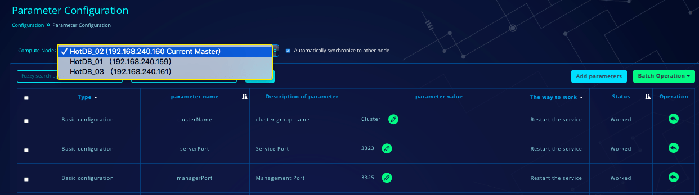

**(3) Enable the ConfigDB:**

When the ConfigDB mode used by the master center or DR center is master-slave or master-master, if the master ConfigDB fails, the compute node will automatically switch the connection of the ConfigDB to the slave ConfigDB or standby master ConfigDB. At this time, if the master ConfigDB failure is manually repaired, the compute node cluster will not use the master ConfigDB, you can re-enable the failed ConfigDB according to the following steps:

1. When the master ConfigDB fails, the compute node parameter configuration page is displayed as the following figure:

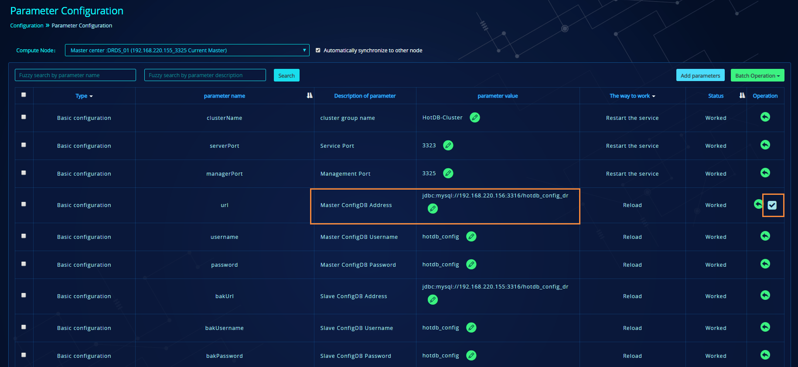

2. If it is determined that the master ConfigDB has returned to normal and consistent with the data of the slave ConfigDB and is up-to-date, click the enable button on the [Compute node parameter configuration](#compute-node-parameter-configuration) page to enable the master ConfigDB.

3. Click the enable button , and then click the \[Dynamic loading] button to re-enable the master ConfigDB.

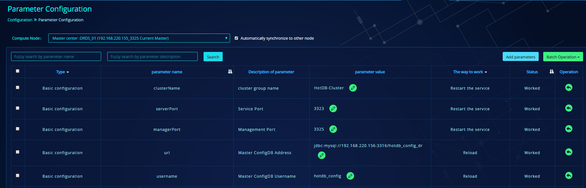

**Notes:**

- When the DR center is the current standby center, after the master ConfigDB fails, the compute node will set both the master and slave ConfigDBs unavailable.
- When the DR center is the current standby center, when enabling the slave ConfigDB, you need to confirm that the current active ConfigDB is available; otherwise, the slave ConfigDB cannot be enabled, that is, you can enable the slave ConfigDB only after the master ConfigDB is enabled.
- If you want to enable either ConfigDB in the two IDCs, you need to ensure that the current replication status inside the IDC and between the IDCs is normal. If any of the replication status is abnormal, there will be a warning message though the dynamic loading may succeed.

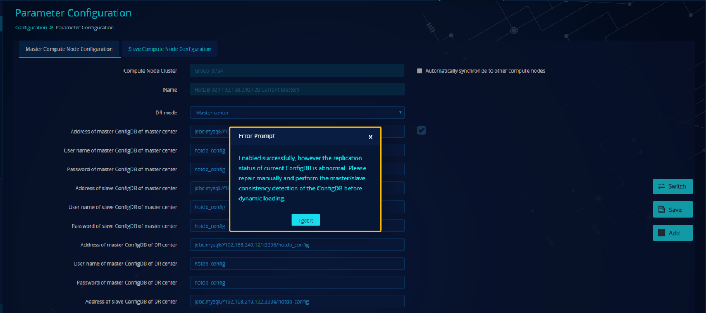

**(4) New parameters:**{#new-parameters}

1. Configure the DR center ConfigDB


Add the ConfigDB configuration of the DR center, including the address of the master-slave ConfigDB of DR center and the corresponding user name and password. The master center and the DR center refer to the IDC type, which does not change with the IDC status.

All compute nodes in the two IDCs need to be configured with the master center and DR center ConfigDB configuration in server.xml.

(The ConfigDB parameters that do not have the IDC type identifications represent the ConfigDB parameters of the master center)

```xml
<propertyname="url">jdbc:mysql://192.168.220.213:3316/hotdb_config</property><!-- Master ConfigDB address，which needs to be the real IP address of the ConfigDB service-->
<propertyname="username">hotdb_config</property><!--Master ConfigDB username-->
<propertyname="password">hotdb_config</property><!--Master ConfigDB password-->
<propertyname="bakUrl">jdbc:mysql://192.168.220.214:3316/hotdb_config</property><!--Slave ConfigDB address，which needs to be the real IP address of the ConfigDB service-->
<propertyname="bakUsername">hotdb_config</property><!--Slave ConfigDB username-->
<propertyname="bakPassword">hotdb_config</property><!--Slave ConfigDB password-->
<propertyname="drUrl">jdbc:mysql://192.168.220.217:3316/hotdb_config</property><!--ConfigDB address in DR center-->
<propertyname="drUsername">hotdb_config</property><!--ConfigDB username in DR center-->
<propertyname="drPassword">hotdb_config</property><!--ConfigDB password in DR center-->
<propertyname="drBakUrl">jdbc:mysql://192.168.220.218:3316/hotdb_config</property><!--Slave ConfigDB address in DR center-->
<propertyname="drBakUsername">hotdb_config</property><!--Slave ConfigDB username in DR center-->
<propertyname="drBakPassword">hotdb_config</property><!--Slave ConfigDB password in DR center-->
```

2. haMode adds high availability in DR mode

In the DR mode, regardless of whether the high-availability or single-node compute node mode is used, set this parameter as 2 for the master center and 3 for the DR center. If the multi-node mode is used, set this parameter as 4 for the master center and 5 for the DR center.

Master center:

```xml
<property name="haMode">2</property><!--High-availability mode, 0:HA, 1:Cluster, 2:HA in master center, 3:HA in DR center, 4: Cluster in master center, 5: Cluster in DR center -->
```

DR center:

```xml
<property name="haMode">3</property><!--High-availability mode, 0:HA, 1:Cluster, 2:HA in master center, 3:HA in DR center, 4: Cluster in master center, 5: Cluster in DR center -->
```

3. Add the ID of IDC and the compute node configuration of another IDC

idcId and idcNodeHost should be configured in DR mode.

ID of IDC: The user needs to set an ID value to uniquely identify the type of IDC. Currently by default 1 is for the master center and 2 for the DR center.

Compute node configuration of another IDC: Connection information of all compute nodes in another IDC. Format: IP:PORT

For example, the master compute node connection information of the master center is 192.168.220.213:3325, and the slave compute node connection information is 192.168.220.214:3325; the master compute node connection information of the DR center is 192.168.220.217:3325, and the slave compute node connection information is 192.168.220.218:3325. In server.xml of the master center, the configuration is as follows:

Slave compute node in DR center:

```xml
<property name="idcId">1</property><!--ID of IDC, 1:master center, 2:DR center-->
<property name="idcNodeHost">192.168.220.213:3325,192.168.220.214:3325</property><!-- Computer node info in the other IDC -->
```

Slave compute node in DR center:

```xml
<property name="idcId">2</property><!--ID of IDC, 1:master center, 2:DR center-->
<property name="idcNodeHost">192.168.220.213:3325,192.168.220.214:3325</property><--- Computer node info in the other IDC)-->
```

### Monitoring

#### Logic topological graph

The Logic topological graph not only provides the topological graph of the current active center (called the topology of master center), but also provides the topology of DR center which monitors the component status, disaster recovery status, disaster recovery latency and other information of the two IDCs.

**(1) Topology of master center and 2.5D topology of master center:**

1. Visualized monitoring of ConfigDB is added.

- The ConfigDB components are always displayed on the far left of the topology of master center.

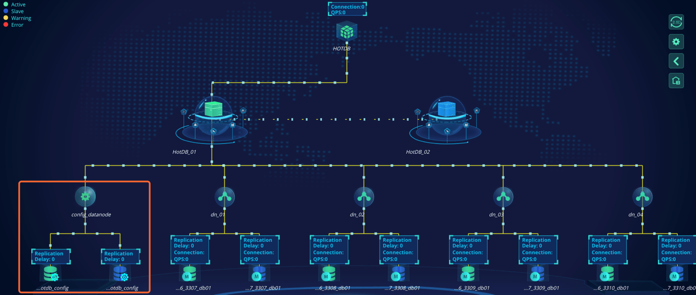

The ConfigDB components are also added in the 2.5D topology of master center, with the same functions as that of the topology of master center.


 is a non-status icon, which connects one or two ConfigDBs , respectively representing a single node ConfigDB and a master-master ConfigDB. In single-IDC mode, if three or more ConfigDBs are connected, it represents the ConfigDB in MGR mode.  will be in orange when all ConfigDBs are not available.

Similar to the data source, icon of ConfigDB in red means a failure exists; moving the cursor over the red icon, the failure cause can be displayed. Orange means an abnormal replication status exists, moving the cursor over the orange icon, the abnormality cause can be displayed.

The monitoring information of "Replication latency" is displayed in the ConfigDB. Similar to the data source, the alert threshold of replication latency can be set under ConfigDB module in "Setting ---> Topological Graph Alert Setting".

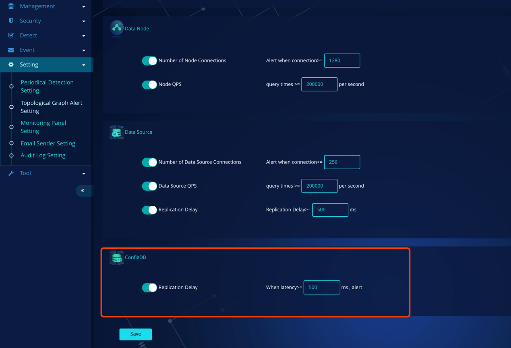

2. Monitoring information of ConfigDB is added to the Topological Graph Info Panel

Warning-level monitoring information is added: The replication status of ConfigDB is abnormal and ConfigDB replication latency exceeds the threshold.

3. IDC switching message is added in the Topological Graph Info Panel

When IDC switching occurs, a message which reports the IDC switching will appear on the Topological Graph Info Panel of the topology of master center under the three levels of info, warning and error.

For example, when the master center is switched to the DR center, the message about the IDC switching is displayed as: At 2019-11-22 12:23:32 IDC switching occurs. The following messages are of the master center.

The IDC switching message can be used as a dividing line of history information. In this example, the history information before the IDC switching message is the of the master center, and the history information after the IDC switching message is of the DR center.


**(2) Topology of DR center:**

On the topology of master center or the 2.5D topology of master center page, click  to switch to the topology of DR center; click again to switch back to the topology of master center or 2.5D topology of master center page.

The icon  means that in the topology of DR center, the number of components in the DR center currently in error status and not repaired is also the number of messages of errors that are still not repaired in the Topological Graph Info Panel, including the number of components that cannot be connected and the abnormal replication status of the data source or ConfigDB between the two IDCs.


If the master center fails and the DR center is switched to be the current active center, the topology of master center will be replaced by the topology of DR center, and the icon of the topology of DR center will still display the current error number of the DR center.

In the topology of DR center, there are six layers of components from left to right. Layers 1-3 from left to right represent the compute node, data node (ConfigDB) and data source (ConfigDB) of the master center in turn. Layers 4-6 represent the data source (ConfigDB), data node (ConfigDB) and compute node of the DR center in turn.


Edges inside one IDC in the topological graph are consistent with the topology of master center. If the master ConfigDB or the master data source service of the DR center is abnormal, all data sources under the corresponding data nodes of the DR center are also set as red and unavailable. The edge is set as gray.

The graph shows the abnormal replication ConfigDB service in the DR center.

Edges between two IDCs, that is, the edges of the current active data sources between the master center and the DR center, indicates the disaster recovery status. If the DR center status is abnormal, edges between the two IDCs are set as gray.

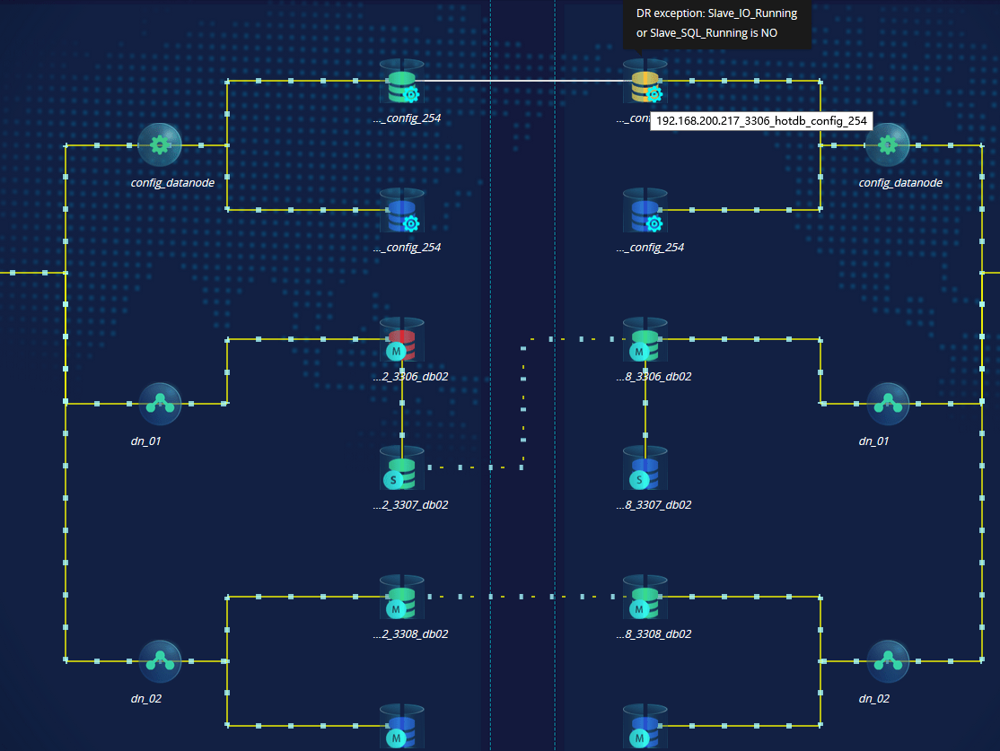The graph shows the abnormal replication between ConfigDBs in the DR center.

The data sources with replication latency in the master center and DR center will display monitoring information of the replication latency. If the replication latency is 0, it will not be displayed. Same as that of the topology of master center, the alert threshold for the replication latency is set under the ConfigDB or data source module in "Setting ---> Topological Graph Alert Setting".

The current active compute node in the DR center will display monitoring information of the disaster recovery latency. The alert threshold for the disaster recovery latency of the ConfigDB and the data source is set uniformly in  on the topology of DR center page.


The display order of the ConfigDB and the data source from top to bottom is: the ConfigDB at the top, the data source failure (in red), the data source warning (in yellow), the data source with the replication latency warning or the disaster recovery latency warning, and the normal node at the bottom.

If the master center fails and the DR center is switched to be the current active center, the components (compute node, ConfigDB and data source) of the master center are in red and in unavailable status and the edge is gray on the Topology of DR center; the components of the DR center are displayed based on the actual operation status.

At this time, the disaster recovery status of the master data sources between the master center and the DR center is no longer detected, so the edges of the disaster recovery status are not displayed.


The disaster recovery architecture in the multi-node mode is shown in the following figure, and its function is similar to that of the master/slave mode.

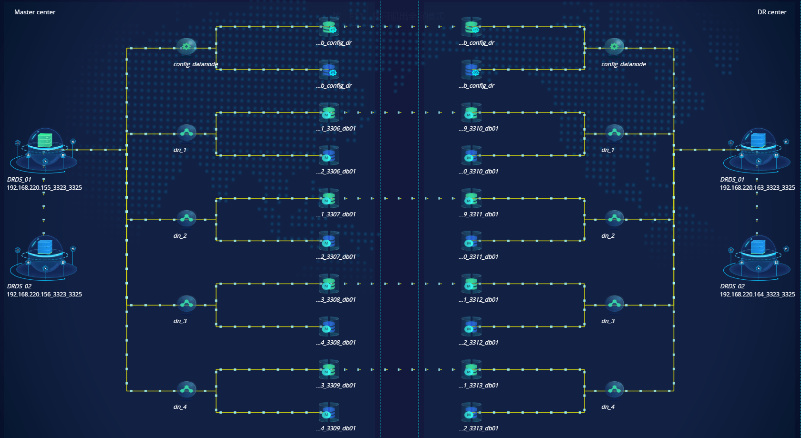

**(3) Topological Graph Info Panel of topology of DR center:**

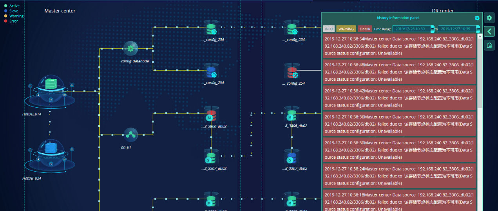

No matter whether the IDC fails or not, the Topological Graph Info Panel will monitor the status of the two IDCs. If the master center fails and the DR center is switched to be the current active center, other status will still be monitored except the disaster recovery relation between the two IDCs.

1. Info

- Add data sources and data nodes for both two IDCs;
- Add data sources only in one single IDC;
- Delete data sources only in one single IDC;
- Delete data sources and data nodes in the two IDCs at the same time.

2. Warning

- The replication status of data sources or ConfigDBs in a single IDC is abnormal;
- The replication latency of data sources or ConfigDBs in a single IDC exceeds the threshold;
- The disaster recovery latency of data sources and ConfigDBs between two IDCs exceeds the threshold.

3. Error

- Failure of data sources, ConfigDBs, or compute nodes in a single IDC;
- Switching of Data sources, ConfigDBs, or compute nodes occur in a single IDC;
- The last available data source in the current active center is abnormal;
- The replication status of data sources or ConfigDBs between the two IDCs is abnormal;
- The IDC switching occurs.

#### Physical topological graph

The physical topological graph adds a toggle button for the IDC switching, through which you can view the relations between the components of the master center or the DR center and the server, the use of server resources, and the running status of the services of each component.

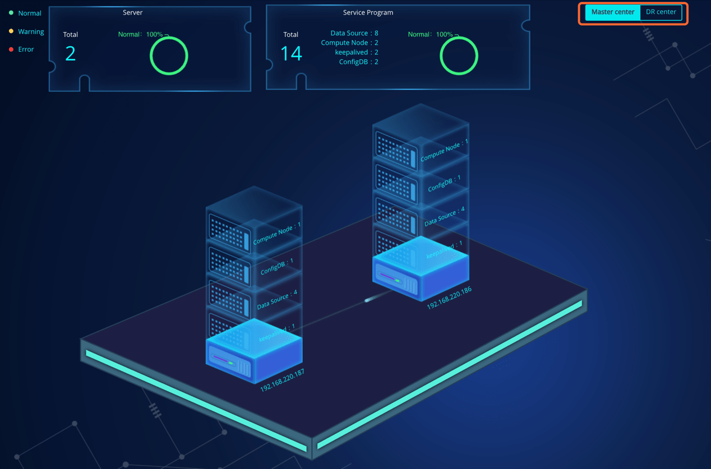

#### Other monitoring items

**(1) Compute node server resources:**

You can select to monitor all compute nodes that can connect to the management port whether in the master center or in the DR center on the compute node server resources function page. In \[Add Monitoring Item], you can select the compute nodes of the master center or DR center you want to monitor. while the master compute node of the current active center is selected by default.

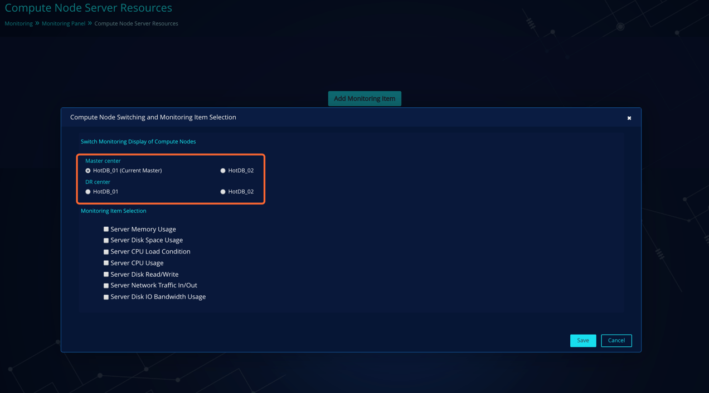

If the management port of compute nodes cannot be connected, for example, if the compute node fails or the compute node of DR center does not enable the management port, you cannot check and monitor the compute node.

**(2) Other server resources:**

For other server resources, you can view detailed information about all server resources configured with SSH information in the two IDCs, including: CPU usage, memory usage, disk usage, and network traffic in and out.

(It is a prerequisite to configure the server's SSH information in "Configuration-> Server")


**（3）Network quality:**

You can refer to the cross-IDC network quality monitoring information. There are some differences between the cross-IDC network quality topology and that of the single IDC.


**Page Description:**

- The master compute node server in the master center needs to ping all servers in the master center except for itself and all servers in the DR center, so the master compute node server in the master center is placed in the master center and the DR center in the topology area above (as shown in mark 1 above);
- The cross-IDC network quality topology only displays: the master center compute node server (including the master/slave compute nodes), the DR center compute node server (including the master/slave compute nodes), the master center ConfigDB server, the master center data source server, the DR center ConfigDB server, the DR center data source server;
- If the server is shared by the service programs, the server role is divided according to the priority described in the single IDC network;
- The cross-IDC network replication relation requires the network quality link connection according to the replication relation between the master/slave data sources of the master IDC and the DR center (as shown in Note 2 above);

**IDC switching instructions:**


If the IDC switching happens, that is, the compute node of the current DR center provides service, only the network quality monitoring status of the DR center will be displayed; all components in the master center will be displayed gray with no monitoring. There will be no network connection from the DR center to the master center, and the network connection relation of the DR center degenerates to be consistent with that of the single IDC.

**(4) Monitoring management:**

Monitoring management page can be used to check the relations between the front-end and back-end connections of compute nodes in the two IDCs and other effective management through the compute node management port.

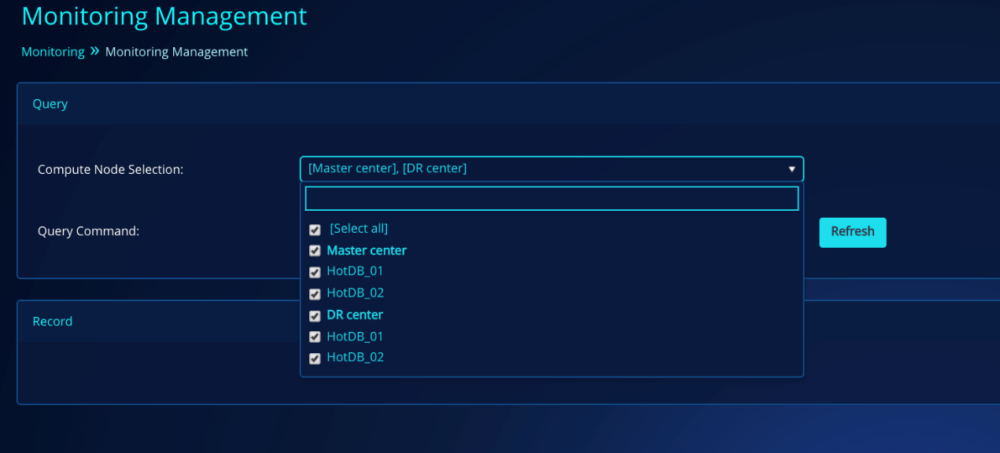

For example, if you select "Server Connection Information: show processlist" in "Query Command", the server connection information of the master compute node server in the current active center is displayed by default:


### Management

#### Data backup

The management platform does not provide the data backup function for the DR center. If you want to restore the data backup of the current active center to another IDC, you can check the item "Backup to Remote Path simultaneously" in "Start Backup" to transfer all the backup files of each data source in the current IDC to a remote path through scp command before restoring the backup files to the corresponding data sources one by one according to the correspondence of the data sources offline.


#### Data source migration

The management platform supports the migration of data sources in the master center or DR center to new data sources, and the re-setup of disaster recovery relations.

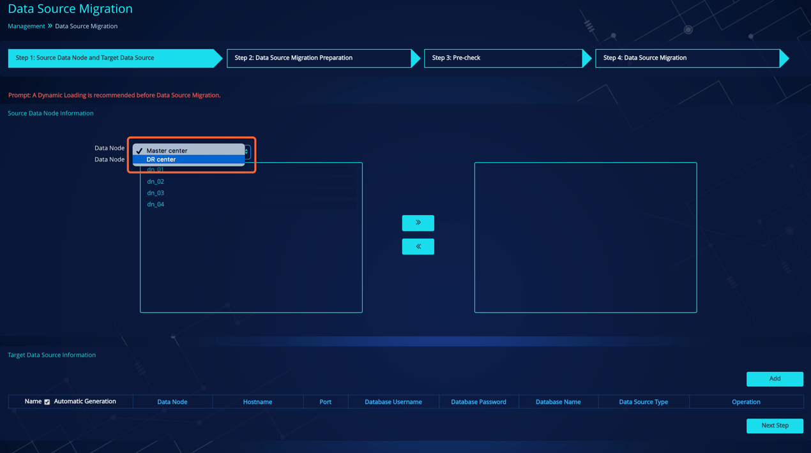

- You can choose whether to migrate the data source of the master center or the data source of the DR center by selecting the IDC type, however, you still need to meet the prerequisites of using the migration function, for example, you need to manually import the data of the old data source to the new data source and set up the replication relations from the old data source to the new data source. It needs attention that the configured target new database instance cannot coincide with the existing instance in the DR center, that is, the instance filled in by the detection cannot coincide with all the existing data source instances in the ConfigDB.

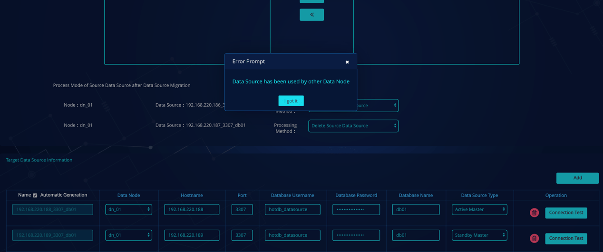

- In \[Step 4: Data Source Migration], a replication relation will be set up of the current active data sources between the master center and the DR center. For example, if to migrate the data nodes of the master center, the management platform will set up a replication relation between the target master data source of the master center and the current active data source of the DR center.

### Detect

#### Master/slave data consistency detection

The IDC type is a multiple choice drop-down box, that is, you can select a central IDC or a disaster recovery IDC or two IDCs at the same time.

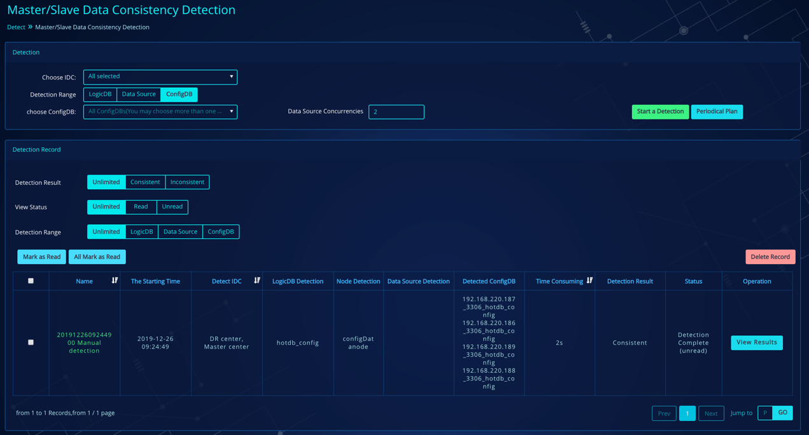

**(1) Choose IDC:**

The Choose IDC item is a drop-down box with multiple choices, that is, you can select a master center, a DR center or the two IDCs both.

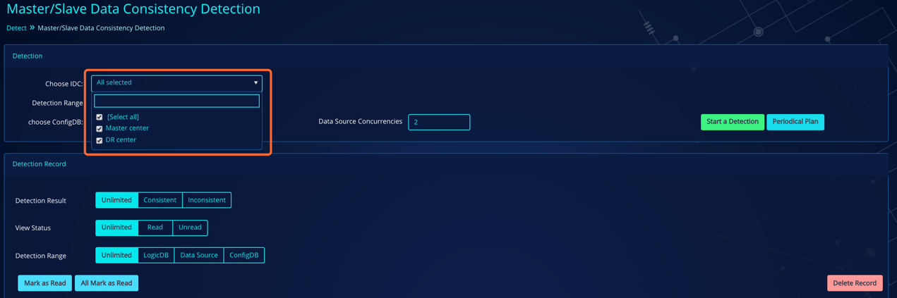

For detection range of LogicDB or detection range of data source:

- If a single IDC is selected, the data sources under the selected data nodes in the IDC will be compared with the master data sources under the same data nodes to see whether the data is consistent, same logic as the master/salve data consistency detection in single-IDC mode.
- If two IDCs are both selected, all the data sources under the selected data nodes will be compared with the master data sources under the corresponding data nodes of the current active center to see whether the data is consistent.
  For example, in the detection range of **LogicDB**, select logicdb01, which is associated with the dn_01 of the master center and the DR center. Click \[Start a Detection], and then the current active data source (ds_01) under the dn_01 of master center will be compared with all the data sources (ds_01, ds_02, ds_03, ds_04) under the dn_01 of the two IDCs respectively.

**(2) Detection range of ConfigDB:**

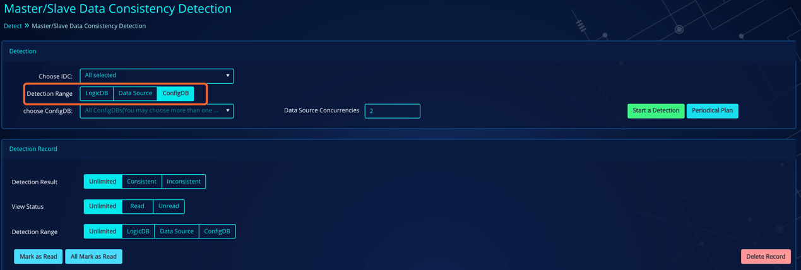

- In detection range of ConfigDB, select the ConfigDB address you want to detect and fill in the concurrency number (the default is 2)
- Click \[Start a Detection] to check the data consistency between the selected ConfigDB and the master ConfigDB of the current active center.
- Click \[View Results] to view the details of detection results. If there are inconsistencies, locations and details of the inconsistencies will be displayed in the detection results.


### Event

#### Notification strategy

After adding notification strategy, it can alert you by email to the failure or abnormalities of the master center or DR center during cluster operation. The monitoring items including \[Failure Real-time Monitoring], \[Compute Node Server Resource Monitoring], \[Compute Node Service Status], \[Data Source Information Monitoring], and \[ConfigDB Monitoring] are added with the IDC identifications to alert the failure or abnormalities related to the current active center; \[Other Server Resource Monitoring] and \[License Authorization Monitoring] are added with IDC identifications to identify the IDC where the server exceeds the alert threshold and the IDC to which the compute node with abnormal license belongs.

**(1) Email information:**

Added email information: whether to enable the DR mode, type of the current active center, and compute node information of two IDCs.


**(2) Data source information monitoring:**


In the data source information monitoring, for \[Replication Delay] and \[Data Source Replication Status], in addition to alerting the abnormality of the internal data source in the current active center, it also alerts the disaster recovery latency and the abnormal disaster recovery status between the current active data source in the master center and the current active data source in the DR center.

**Threshold setting:**

- The replication latency still corresponds to the replication latency under the data source module in "Setting -> Topological Graph Alert Setting"
- The disaster recovery latency corresponds to the disaster recovery latency setting of the topology in DR center in "Monitoring-> [Logical Topological Graph](#logic-topological-graph)"


**(3) ConfigDB information monitoring:**

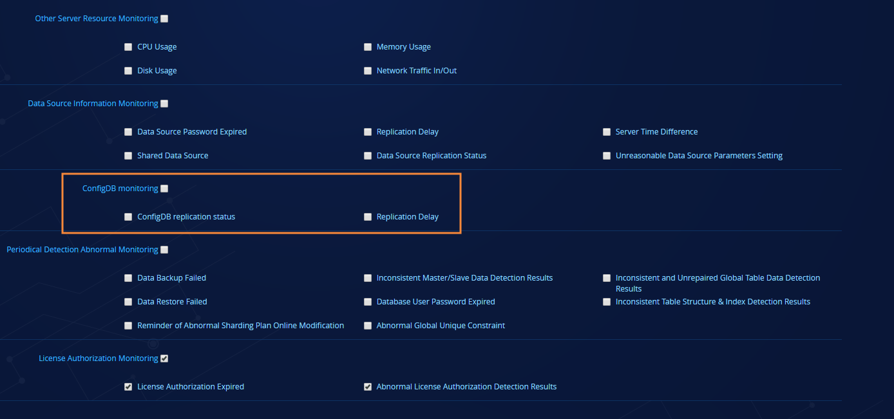

In ConfigDB information monitoring, alert is added of the replication latency and abnormal replication status between ConfigDBs in the current active center and between the master ConfigDBs in the two IDCs.

**Threshold setting:**

- The replication latency corresponds to the replication latency under the ConfigDB module in "Setting -> Topological graph alert setting"
- The disaster recovery latency corresponds to the disaster recovery latency setting of the topology in the DR center in "Monitoring -> [Logical Topological Graph](#logic-topological-graph)"


#### Others

**(1) History Events:**

The history events will display the history events that occurred in the current active center recorded by the management platform. Contents include: notification of completed task, notification of abnormal periodical detection, and early warnings triggered by the platform, etc. The IDC type is displayed as the IDC type when the history event occurs.


**(2) Compute Node Logs:**

The compute node logs record the log information generated by the compute nodes in the master center and the DR center during operation. By default, the log information of the master compute node in the current active center is displayed. You can select or view other compute node log information.

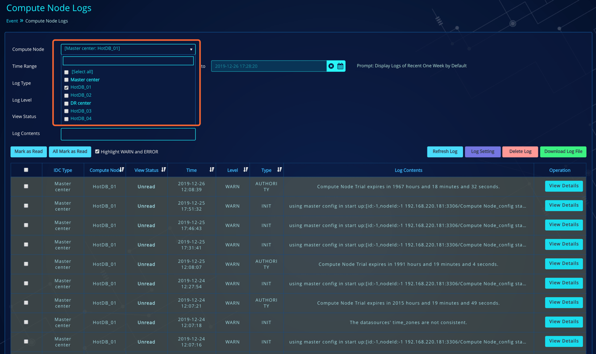

### Others

**(1) server:**

The server is added with the IDC type, which manages the server SSH information of all components in the cluster. When configuring or adding server SSH information, you need to select the IDC type corresponding to the server.

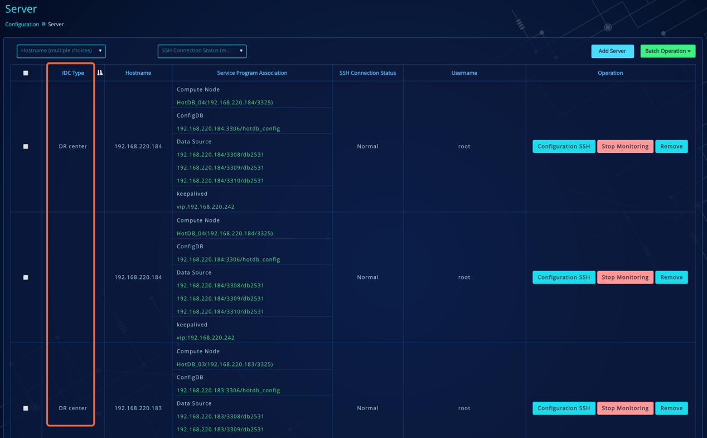

**(2) Data source password:**

The data source password is also added with the IDC type, and displays the IDC type corresponding to all data sources.


**(3) Information collection:**

The information collection tool of management platform supports the collection of logs and configuration files for abnormality analysis of all components of the two IDCs.

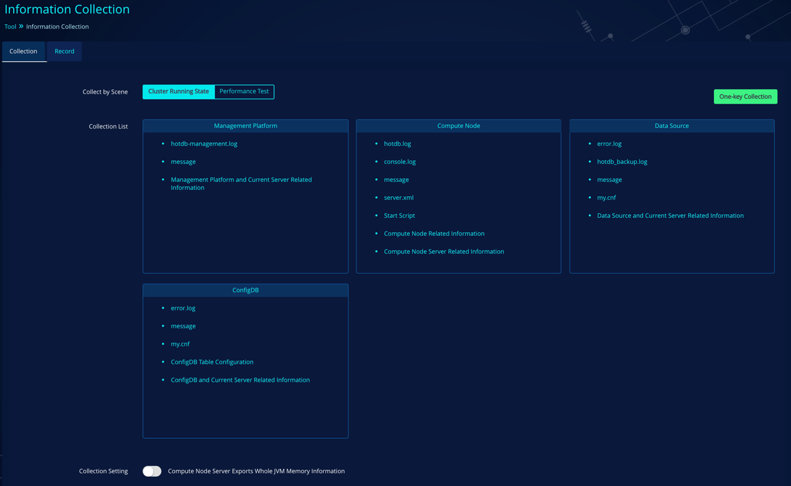

If there is a server in the two IDCs that cannot be connected, you can choose to skip the collection of server information or cancel the collection task. If there are compute node services that cannot be connected in the two IDCs, you can manually enter the compute node installation directory and continue the collection task. That is, neither the failure of the IDC or the unopened service port of the compute node of the DR center will affect the information collection task.

**(4) Upgrade Center:**

The upgrade center also supports cross-version or minor-version upgrade, that is, users can upgrade the lower version of the compute node to version 2.5.3.1, so that the already running low-version compute node cluster can enable the DR mode after the upgrade is completed.

Select the compute node cluster that needs to be upgraded. If the cluster has the DR mode enabled, the color green will be used to mark the master center, and blue to mark the DR center for the items Cluster Mode and the Compute Node. After uploading the upgrade package, click \[Start Update] to enter the upgrade process.


After the upgrade is complete, you can view the detailed update logs:

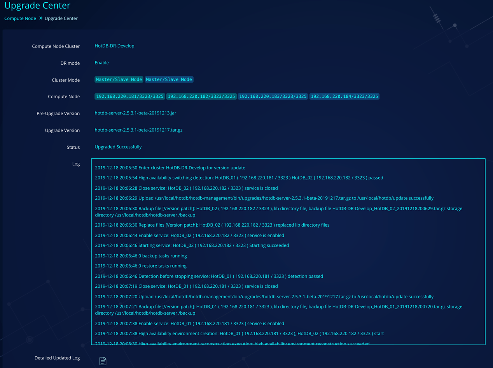

> **Note**
>
> - If the currently configured master center is not the current active center and the current master center management port cannot be connected, the upgrade cannot be performed.
> - If the compute node in the master center is in the master/slave mode, the page will display "whether to switch back after the upgrade". Select "Yes" to switch back to the former master compute node after the upgrade (the master/slave high availability switch will be performed during the upgrade).
> - If the compute node in the DR center is in master/slave mode, no matter whether the upgrade is successful or not, only the master compute node management port will be enabled after the upgrade, that is, the slave compute node management port or keepalived components will not be enabled.
> - The upgrade process will first upgrade the master center and then the DR center. The cluster that failed to upgrade will still perform the rollback process. The rollback process will also first roll back the master center and then the DR center.

## Descriptions of compute-node-related functions

### Master center

In the DR mode, the compute node service in a master center is nearly the same as that in a single IDC. Under normal circumstances, the service ports are provided by master compute nodes of the master center, while the slave compute nodes are standby.

### DR center

The master-slave compute node services in DR center are in standby status before the IDC-level switching of service occurs, and only the management port (3325 by default) provides services.

The online command is disabled for the master-slave compute nodes of DR center before the IDC-level switching of service occurs, mainly to differentiate from the general high availability switching operation. When the online command is executed, the following prompt will be given:

```
root@192.168.220.183:(none) 8.0.15-HotDB-2.5.3.1 07:58:26> online;
ERROR 10192 (HY000): access denied. online is not allowed in a DR HotDB Server.
```

The master compute node of DR center is not involved in HA high availability switching and master selection of master center. In addition to some show commands, only manual commands are accepted: online_dr switch the IDC.

```
root@192.168.220.183:(none) 8.0.15-HotDB-2.5.3.1 08:12:31> online_dr;
Query OK, 1 row affected (5 min 4.35 sec)
```

Once the master compute node of DR center executes the online_dr command, an IDC-level switching of the compute node services will occur, and the master compute node of DR center will provide services. For other situations, please refer to the detailed description of the [IDC failure](#idc-failure) in related chapters. At the same time, the compute node logs output of DR center are as follows, which means that the service of the DR center is successfully enabled:

```log
2019-12-12 19:50:47.257 [INFO] [MANAGER] [$NIOExecutor-1-0] cn.hotpu.hotdb.manager.ManagerQueryHandler(178) - online_dr by [thread=$NIOExecutor-1-0,id=8514,user=root,host=192.168.220.183,port=3325,localport=13838,schema=null]
2019-12-12 19:50:47.258 [INFO] [MANAGER] [Labor-2] cn.hotpu.hotdb.HotdbServer(2111) - DR online start
......
2019-12-12 19:50:50.587 [INFO] [MANAGER] [Labor-2] cn.hotpu.hotdb.HotdbServer(2142) - DR online end
......
2019-12-12 19:50:50.689 [INFO] [INIT] [Labor-2] cn.hotpu.hotdb.HotdbServer(1789) - HotDB-Server listening on 3323
```

The slave compute node of DR center is not involved in the HA high availability switching and master selection of master center. When the IDC-level switching of the compute node occurs, that is, when the master compute node of the DR center provides services, if the master compute node of the DR center fails at this time, it can execute enable_online; command before executing online or online_dr command to enable the slave compute node of the DR center. After the command is executed, the slave compute node in the DR center can automatically enable the service port (3323 by default) to continue the service by enabling the process judging.

```
root@192.168.220.184:(none) 8.0.15-HotDB-2.5.3.1 08:10:31> enable_online;
Query OK, 1 row affected (11 min 5.39 sec)
root@192.168.220.184:(none) 8.0.15-HotDB-2.5.3.1 08:22:27> online;
Query OK, 1 row affected (0.01 sec)
```

> **Warning**
>
> After the IDC-level failure and the online_dr command is manually executed in the master compute node of DR center, the enable_online command needs to be executed in the slave compute node of the DR center at the same time to ensure that the master compute node of the DR center can automatically switch to the slave compute node of the DR center after failure. Otherwise, the master compute node of the DR center may not be able to switch to the slave compute node of the DR center after failure. If it is multi-node cluster mode, it needs to execute the online_dr command in the primary compute node of the DR center, to ensure that the successful switching in the compute node clusters in the DR center.

If you execute the online_dr command directly on the slave compute node of DR center, the IDC switching will also occur, and the service port (3323) will be enabled on the party currently executing the disaster recovery service startup command. At this time, you need to pay attention to whether the VIP and service port of the keepalived service are on the same server.

The master compute node of DR center needs online_dr to enable the service normally every time it starts the process; the slave compute node of DR center in the master/slave mode needs enable_online to accept online commands and provide subsequent high availability service every time it starts the process. In multi-node mode, it only needs to execute the online_dr command to the primary compute node.

## Operation and maintenance management

This chapter masterly describes the judgment logic of the compute nodes and how to correctly repair the failure in the case of core component service failure and IDC-level failure during the operation of the compute node disaster recovery cluster.

### Premise explanation

For the convenience of subsequent explanation, except for special remark, the following basic information description shall be taken as an example in the operation and maintenance management chapter.

Prepare a set of normally running DR mode compute node cluster (including master/slave compute nodes, master-master data sources, master-master ConfigDB). For the convenience of subsequent explanation, all components are represented by simple code names, including:

The master compute node of the master center is HotDB-01; and the slave compute node is HotDB-02;

The master compute node of the DR center is HotDB-03; and the slave compute node is HotDB-04;

The corresponding master data source of data node dn01 in the master center is ds01; and the standby master data source is ds02;

The corresponding master data source of data node dn01 in the DR center is ds03; and the standby master data source is ds04;

The master ConfigDB of the master center is hc01, and the standby master ConfigDB is hc02;

The master ConfigDB of the DR center is hc03, and standby master ConfigDB is hc04;

A master-master replication relation is set up between ds01 and ds02; a master-slave relation is set up between ds01 and ds03, ds03 as the slave; a master-slave relation is set up between ds03 and ds04, ds04 as the slave;

A master-master replication relation is set up between hc01 and hc02; a master-slave relation is set up between hc01 and hc03, ds03 as the slave; a master-slave relation is set up between hc03 and hc04, hc04 as the slave.

Graph representation (edge arrow indicates data flow direction):


All MySQL instance versions are 5.7.25, GTID enabled, and semi-synchronous replication is enabled by default for all replication relations. Other parameter configurations and system parameter settings are the same as the default installation and deployment conditions.

The actual connection information corresponding to each component is listed as follows:

| IDC Type      | Component Type | Role          | Code Name | Connection Information    |
|---------------|----------------|---------------|-----------|---------------------------|
| Master Center | Compute Node   | Master        | HotDB-01  | 192.168.220.181_3323_3325 |
| ^             | ^              | Slave         | HotDB-02  | 192.168.220.182_3323_3325 |
| ^             | Data Source    | Master        | ds01      | 192.168.220.181_3307      |
| ^             | ^              | Master-master | ds02      | 192.168.220.182_3307      |
| ^             | ConfigDB       | Master        | hc01      | 192.168.220.181_3306      |
| ^             | ^              | Master-master | hc02      | 192.168.220.182_3306      |
| DR Center     | Compute Node   | Master        | HotDB-03  | 192.168.220.183_3323_3325 |
| ^             | ^              | Master-master | HotDB-04  | 192.168.220.184_3323_3325 |
| ^             | Data Source    | Master        | ds03      | 192.168.220.183_3307      |
| ^             | ^              | Master-master | ds04      | 192.168.220.184_3307      |
| ^             | ConfigDB       | Master        | hc03      | 192.168.220.183_3306      |
| ^             | ^              | Master-master | hc04      | 192.168.220.184_3306      |

> **Note**
>
> - The data node names of the same group of data sources with disaster recovery relations are the same;
> - By default, the data sources and ConfigDBs of the DR center are only set up with the replication relation from the master to the standby master, and do not set up a return circuit, which is different from the role of the actual standby master;
> - When deploying in a real scenario, it is not recommended to deploy compute nodes and data sources on the same server. This time is only for the convenience of subsequent explanation.
> - All data sources and ConfigDBs with master-slave relations need to set the value of rpl_semi_sync_master_wait_for_slave_count as in correct status in advance.
> - There is little difference between the multi- node cluster mode and the master/slave mode, so the master/slave mode shall prevail. In the multi- node mode, when the DR center is enabled, it should be noted to execute online_dr command in the primary compute node and replace haMode according to the role.

### Failure only inside the master center

This section mainly describes the function usage when high-availability switching (including manual switching or failover) occurs in only the core service components in the master center in a cluster environment where services are normally provided.

#### Compute node

##### Manual switching

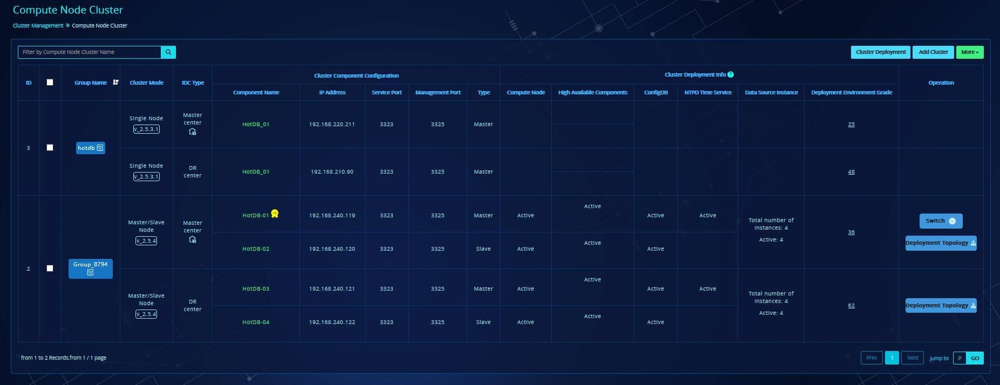

Enter the "Cluster Management"-> "Compute Node Cluster" page. When you manually click the \[Switch] button corresponding to the compute node group with the master-slave relation to perform manual compute node switching operations, switching will only occur in the master center, which has no effect on the compute node services of the DR center. The logic of high-availability switching and re-setup operations in all master center compute node services is the same as that of the ordinary single IDC mode.

##### Failover

When the master compute node of the current master center fails, it will be automatically switched to the slave compute node of the master center according to the configuration of keepalived, the high-availability scheduling component. The compute node services in the equipment center of the DR center are not affected. The compute node high-availability service is only associated with the compute nodes in the IDC, and the judgment is made inside the current IDC. The failure re-setup method is the same as the ordinary single IDC mode.

#### ConfigDB

##### Failover

When the master ConfigDB of the master center fails, same principle as that of the [data source](#failover) judgement, the standby master ConfigDB will automatically start service after catching up with replication. The master ConfigDB of the DR center will automatically reset the replication relation with the former master ConfigDB of the master center, and set up a replication relation with the standby master ConfigDB of the master center (the master ConfigDB of the DR center is as a slave), that is, the master-slave replication relation between hc01 and hc03 is cleared, and hc03 will set up a replication relation with hc02 as a slave.

When the failed master ConfigDB of the master center is restored, if the master-master replication relation of the ConfigDB in the master center is normal, you can enable the master ConfigDB through the parameter configuration page and perform the dynamic loading operation to switch the connection back to the failed former master ConfigDB. In the process, the master compute node will automatically reset the ConfigDB replication relations, and replication relation between the master ConfigDB newly enabled by the slave ConfigDB of the former master center and the master ConfigDB of the DR center will be reset up, that is, the replication relation between hc02 and hc03 is cleared, and hc03 will reset up a replication relation with hc02 as a slave.

#### Data source

##### Manual switching

Click \[Switch] button corresponding to the master center on the "Node Management" page of the management platform, the compute node will automatically detect whether the replication relations between the master nodes of the current master center and the standby master nodes or the slave nodes are normal and whether the replication latency is within 10s. The switching can be successful when the conditions are met. At the same time, the master data sources of the DR center will be automatically set up with replication relations with the standby master nodes or slave nodes in the switched master center, without manual intervention. That is, after switching from ds01 to ds02, the replication relation between ds01 and ds03 will be cleared, and ds03 as a slave will reset up a replication relation with ds02.

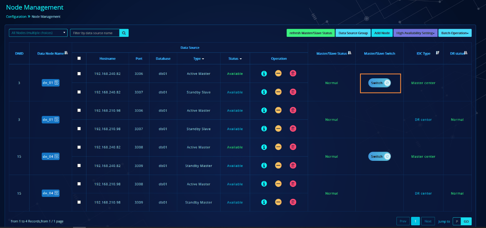

> **Note**
>
> If the switched data source of the master center is with a master-slave replication relation, the master data source of the former master center will be set unavailable after manual switching. It is required to set up a replication relation in the master center between the data source and the master data source, and to ensure the catching up with replication, thus the dynamic loading can be switched back to the former master data source in the master center, and the disaster recovery relation will be reset automatically without manual intervention. That is, when ds01 and ds02 are in a master-slave relation instead of a master-master relation, ds01 is manually switched to ds02 (slave only), and ds01 is set as unavailable. When ds01 is enabled, only if ds01 has a replication relation with ds02, ds01 is the slave of ds02, and there is no replication latency and other effects can the dynamic loading be successful and ds01 be enabled.

##### Failover

When the master data source fails, the service will be automatically started after the standby master data source catches up with replication (whether to wait for the replication catching up is controlled by the parameter waitForSlaveInFailover, waiting is enabled by default), and the master data source of the DR center will automatically reset the replication relation with the master data source of the former master center and set up a replication relation with the standby master ConfigDB of the master center (the master data source in the DR center is the slave).

When the replication relation between the failed data sources in the master center is master-slave instead of master-master, if you want to promote the former failed data source to be the current active data source, the operation mode is consistent with that of the ConfigDB master/slave cases. You need to set up the needed replication return circuit in the master center first, and ensure that there are no replication exceptions and the former master data source can be return to after dynamic loading.

### Failure only inside the DR center

This section mainly describes the function usage when high-availability switching (including manual switching or failover) occurs in the core service components in the DR center in a cluster environment where services are normally provided.

#### Compute node

As the DR center does not provide real database services, it is recommended to disable keepalived, the master/slave high availability components of the DR center, during day-to-day operation and maintenance to avoid unnecessary recovery operations caused by VIP drift in the DR center. If keepalived do not provide services, when the compute node in the DR center fails, regardless of the master/slave roles, you only need to restart the service in an available operation environment.

If the keepalived service in the DR center needs to be retained due to special requirements, when the master compute node in the DR center fails, the VIP will drift to the server where the slave compute node is located after the keepalived detection timeout of the compute node service availability. At this time, only when VIP is guaranteed to go back to the master compute node in the former DR center can the master compute node back up normally.That is, disable the keepalived service in the slave compute node, ensure that the master/slave compute nodes are enabled, and then enable in turn the keepalived service in master compute node and the keepalived service in slave compute node.

#### ConfigDB

##### Failover

After the master ConfigDB of the DR center fails, the standby master ConfigDB of the DR center will be automatically set as unavailable. When the failure is restored, you need to click the \[Enable] button on the "[Parameter Configuration](#compute-node-parameter-configuration)" page of management platform before the dynamic loading takes effect. When the standby master ConfigDB in the DR center is enabled, its master ConfigDB must be enabled; otherwise, the operation is invalid. If only the slave ConfigDB of the DR center fails, only the slave ConfigDB will be marked as unavailable and will not affect other services.

#### Data source

##### Failover

Same logic as that of ConfigDB. After the master data source in the DR center fails, other slave data sources in the IDC related to the failed master data source are also remarked as unavailable. That is, when ds03 fails and is marked as unavailable, ds04 is also marked as unavailable. After the service is restored, when the failed data source in the master center is enabled, the master data source must be enabled to enable the slave data source.

The master data sources of the DR center provide services normally. However, if the standby data sources of the DR center fail, only the standby data sources and their slaves will be marked as unavailable and the current used data source is not affected. That is, when ds04 fails and is marked as unavailable, ds03 is not affected; but if ds04 has other slaves such as ds05, then ds05 will also be marked as unavailable. When the data source marked as unavailable is enabled, ensure that the former master-slave replication synchronization status has no exceptions.

When the failed data source is enabled, it takes effect after the dynamic loading. The data sources in the DR center do not support manual switching.

After the manual switching and failover of all data sources and ConfigDBs, the compute nodes automatically adjust the value of rpl_semi_sync_master_wait_for_slave_count as correct.

### IDC Failure

This section mainly describes precautions and instructions when master center fails in the IDC level, DR center is switched as the active IDC and provides services during a compute node cluster is providing services normally, taken the compute node cluster in the master/slave mode as an example. This description mainly describes the steps of manual switching and repair of IDC. If automatic switching, repair and removal of the IDC through the management platform is wanted, on the basis of ensuring that the management platform version is 2.5.6 and above, you can refer to the [Cross IDC Disaster Recovery Management](cross-idc-disaster-recovery-management.md) document.

#### Master center fails and DR center is switched as the active IDC

When the compute node services of the master center fail irreparably, you can manually determine whether to switch to the DR center. When you decide to switch to the DR center, you need to refer to the description in the following sections for manual pre-judgment and inspection to ensure that the switch can be successful.

##### Switch Pre-detection

- Check that all the services and processes of master and slave compute nodes in the master center have stopped and exited.

- Check that there is no abnormality in the service status of the master data source of each data node and master ConfigDB in the DR center, and there is no abnormality in the replication status between master center and DR center.(The compute node in the DR center will also automatically check when it is started, but manual inspection in advance can increase the probability of successful failover.)

- If the keepalived service in the DR center has been started before, you need to check whether the VIP of the keepalived in the DR center is on the current active compute node. (if there is no high availability of compute nodes, you can skip this step)

##### Switch Process

After confirming the switch pre-detection, you can execute the online_dr command on the management port of compute nodes in the DR center. After receiving the command, the compute node will make the following judgments in order:

1. Send the offline command to the master compute node in the master center again to try to avoid multiple compute node services running simultaneously;
2. Wait for all the master data sources and master ConfigDB of the DR center to catch up with the replication;
3. Automatically clear all the data sources and ConfigDBs replication relation between the master center and the DR center;
4. Mark all data sources and ConfigDBs in the master center as unavailable;
5. After passing other verifications that need to be done when start service port, start the service port of master computer node in the DR center to provide services;
6. At the same time, the replication relation between data sources in a single data node is automatically determined by the compute node. The compute node will set up or reset the replication relation in the DR center according to the configuration roles of data sources in the DR center.
   - If the data source is configured as a "standby master", compute node will compare the GTID position: When the master data source has more or equal GTID than the standby master data source, compute node will automatically set up a replication between these two data sources (the standby master data source is the host) so that there is a master-master replication for this data node; when the master data source has fewer GTID than the standby master data source(generally, this situation does not occur, and it is more possible when human operation involved),compute node will perform reset slave all on the standby master data source and set the standby master data source unavailable;
   - If other data sources in the DR center are configured as "slave", then only the GTID replication position will be detected. If the master data source has less GTID than the slave data source, compute node will perform reset slave all on the slave data source to clean up replication relations and set the slave data source as unavailable;
   - Other replication relations (such as master-master with slave(s)) will be determined same as above whether to set up or reset replication relation based on specific role configurations.
7. If currently there is high-availability compute node services in the DR center, you need to continue to execute the enable_online command on the management port of the standby compute node in the DR center to ensure that when the current master compute node fails, you can perform compute node service switchover in the DR center according to high-availability rules of keepalived component.
8. Finally, check whether the keepalived status of the DR center is normal. The VIP is on the current master compute node, and there is no abnormality in the service status and role status of the master and standby keepalived, master and standby compute nodes.
9. If necessary, perform SQL operations on the compute nodes that are currently providing services to confirm that the services are normal

#### IDC failure repair and failover

At the current stage, the product only supports intelligent process of switching from the master center to DR center. The switch back of service in IDC level, cross-IDC high availability reconstruction and role of IDC switching will be launched in the future. Such scenarios can only be handled manually.

##### Scenario One: Abandon the original master center

After the master center fails and the DR center is successfully switched, if the data in the original master center cannot be recovered, you have to abandon the monitoring information of the master center and DR center, then re-add the active IDC as an new compute node cluster to ensure that the management platform can monitor it normally. Otherwise, some garbage data will be left to affect the current monitoring status of the active IDC. The necessary steps are as follows:

Step 1: Make a data backup of the ConfigDB of the management platform that is currently providing the service, and the ConfigDB of compute nodes, so that they can be restored after misuse;

Step 2: Delete the original cluster in the DR mode through the "Cluster Management"-> "Computer Node Cluster" page of the administrator interface in the management platform;

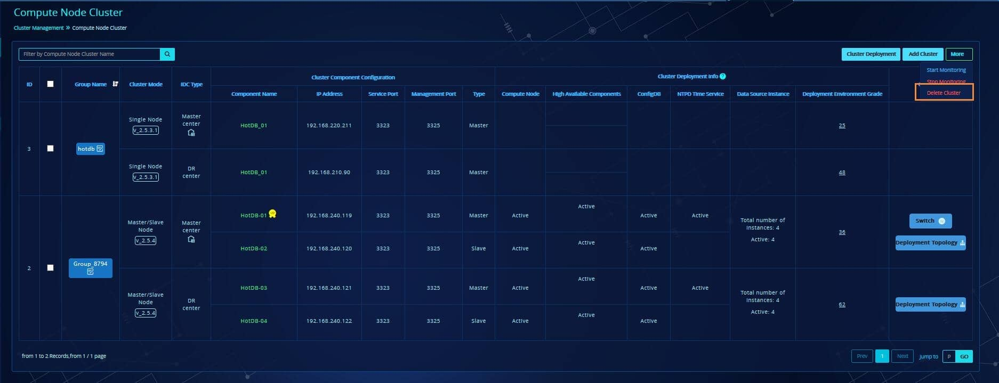

Step 3: Still through the "Cluster Management"-> "Compute Node Cluster" page, click \[Add Cluster] to add the active IDC as a new compute node cluster and add the ConfigDB information after the disaster recovery switchover (as long as the compute node management port is currently connectable, no manual configuration is required here by default).


Step 4: Add user privileges to the new cluster for general users

Step 5: Log in to the management platform as a general user, select the newly-added cluster

Step 6: Go to the [Configuration](#configuration)-> "Parameter Configuration" page and modify the related configuration parameters as shown in red below: select HA as cluster mode and select master center as IDC ID (here is the preparation for [scenario two](#scenario-two-make-the-original-master-center-as-the-standby-idc)). The ConfigDB connection information should be filled and saved according to the actual current ConfigDB information;


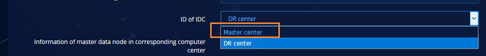

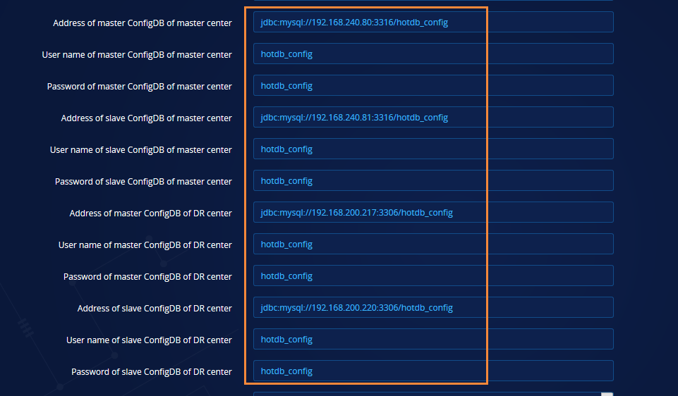

Step 7: Go to the [Configuration](#configuration)-> "Node Management" page to delete the data stored for the original master center.(You can choose to search by IP, or you can choose to search by unavailable status, but you need to be careful not to delete the data used by the current active IDC by mistake)


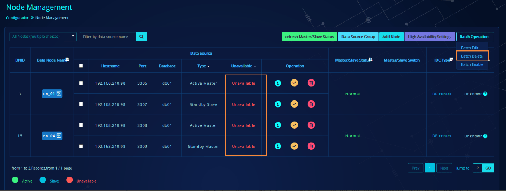

Step 8: Enter the master ConfigDB of the current active IDC and replace all the IDC ID related in the hotdb_datasource table with 1 (1 represents the master center, which has no practical meaning without disaster recovery)

```sql
update hotdb_datasource set idc_id=1;
```

Step 9: Enter the master ConfigDB of the current active IDC, then check the result of the hotdb_config_info table and make sure that v value of the row whose k column is hotdb_master_config_status is 1. (The data of this row represents whether the current master ConfigDB is available. It will not be updated after IDC switchover, just check it and make sure that the current ConfigDB information can be read normally.) If it is not 1, update the row of data to 1.

```
root@localhost:hotdb_config 5.7.25-log 07:47:19> select * From hotdb_config_info where k='hotdb_master_config_status' ;
+----------------------------+---+----------------------------------------------------------+
| k                          | v | description                                              |
+----------------------------+---+----------------------------------------------------------+
| hotdb_master_config_status | 1 | Master configuration database status                     |
+----------------------------+---+----------------------------------------------------------+
1 row in set (0.00 sec)
```

Step 10: Execute reload;

Step 11: Check whether the service status of current compute nodes, ConfigDB and data sources conforms to the current actual situation.

##### Scenario Two: Make the original master center as the standby IDC

After the original DR center is switched as the current active IDC, when the original components in the original master center can be restored, you can consider to make the original master as the current standby IDC. In the case, you must manually perform the operations described in this section based on the completion of [operations described in scenario one](#scenario-one-abandon-the-original-master-center). Subsequent configuration modification operations, the operation steps are as follows (note that it must be based on the description of [scenario one](#scenario-one-abandon-the-original-master-center)):

Step 1: Make a data backup of the ConfigDB of the management platform that is currently providing the service, and the ConfigDB of compute nodes, so that they can be restored after misuse;(try not to conflict with the previous backup file).

Step 2: Check whether the compute node service process or keepalived process of the original master center exists. If it exists, you can directly close them all without affecting the compute node services that are currently providing services (in the case of multi node cluster mode, there is no need to pay attention to keepalived, and LVS control is available.); it is mainly to avoid unnecessary operation and maintenance costs for mis-operation of this compute node.

Step 3: Establish replication relation of the ConfigDBs and data sources between the current active IDC and the original master center and swap the replication hosts. The reference operation steps in the swap process are as follows:

- After the disaster recovery switchover, when the service of original DR center starts and become the current active IDC, under normal circumstances, compute node will automatically establish a master-master replication between data sources according to the data source configuration in the current active IDC and establish a master-master replication between ConfigDBs by default. No special operation is required. that is, ds03 and ds04, hc03 and hc04 have master-master replication;

- It is necessary to manually clean up the replication relation between the data sources and ConfigDBs of the original master center, that is, execute reset slave all. At the same time, if the data of the original master center can be abandoned or [must be abandoned](#under-what-circumstances-data-in-the-original-idc-must-be-abandoned), clear the data and perform the reset master operation;

- Export the current data of the data sources in the current active IDC and import it to the target master data source and the master ConfigDB that are about to be set up replication in the original master center. (for data export and replication setup, please refer to the [master-slave replication setup recommended steps](#recommended-steps-for-replication-setup));

- Establish a master-slave replication relation between the master data source/ConfigDB in the active IDC and the master data source/ConfigDB in the original master center main. The data sources/ConfigDB in the original master center are slaves. That is, a master-slave relationship is established between ds01 and ds03 while ds01 is a slave; a master-slave relationship is established between hc03 and hc01 while hc01 is a slave.

- Establish a replication relation between the data source/ConfigDB in the original master center, that is, a master-slave relationship is established between ds01 and ds02 while ds02 is the slave; a master-slave relationship is established between hc01 and hc02 while hc02 is the slave. Note: For the sake of insurance, before setting up a replication relation, it is recommended that export the source data from the master data source in the original master center ds01 and the ConfigDB hc01 and then import into ds02 and hc02, finally set up a replication relation.

- If semi-synchronous replication is enabled, you need to manually modify the value of rpl_semi_sync_master_wait_for_slave_count of the master data source/ConfigDB in the current active IDC to a correct number as required to match the number of its real slaves. Refer to the following statement: `set global rpl_semi_sync_master_wait_for_slave_count=XXX;`

Step 4: Modify the configuration file server.xml of the original master center and the current active IDC to the configuration of the new state of DR mode, refer to the following:

**Master compute node in the current active IDC:**

```xml
<property name="drUrl">jdbc:mysql://192.168.220.181:3306/hotdb_config</property><!-- Configuration database address in DR center -->
<property name="drBakUrl">jdbc:mysql://192.168.220.182:3306/hotdb_config</property><!-- Slave ConfigDB address in DRIDC -->
<property name="haMode">2</property><!-- High-availability mode, 0:HA, 1:Cluster, 2:HA in master center, 3:HA in DR center -->
<property name="idcId">1</property><!-- ID of IDC, 1:master center, 2:DR center -->
```

**Standby compute node in the current active IDC:**

```xml
<property name="drUrl">jdbc:mysql://192.168.220.181:3306/hotdb_config</property><!-- Configuration database address in DR center -->
<property name="drBakUrl">jdbc:mysql://192.168.220.182:3306/hotdb_config</property><!-- Slave ConfigDB address in DR center -->
<property name="haMode">2</property><!-- High-availability mode, 0:HA, 1:Cluster, 2:HA in master center, 3:HA in DR center -->
<property name="idcId">1</property><!-- ID of IDC, 1:master center, 2:DR center -->
```

**Master compute node in the original master center:**

```xml
<property name="url">jdbc:mysql://192.168.220.183:3306/hotdb_config</property><!-- ConfigDB address-->
<property name="bakUrl">jdbc:mysql://192.168.220.184:3306/hotdb_config</property><!-- Slave ConfigDB address -->
<property name="drUrl">jdbc:mysql://192.168.220.181:3306/hotdb_config</property><!-- Configuration database address in DR center -->
<property name="drBakUrl">jdbc:mysql://192.168.220.182:3306/hotdb_config</property><!-- Slave ConfigDB address in DRIDC -->
<property name="haMode">**3**</property><!-- High-availability mode, 0:HA, 1:Cluster, 2:HA in master center, 3:HA in DR center -->
<property name="idcId">**2**</property><!-- ID of IDC, 1:master center, 2:DR center -->
```

**Standby compute node in the original master center:**

```xml
<property name="url">jdbc:mysql://192.168.220.183:3306/hotdb_config</property><!-- ConfigDB address-->
<property name="bakUrl">jdbc:mysql://192.168.220.184:3306/hotdb_config</property><!-- Slave ConfigDB address -->
<property name="drUrl">jdbc:mysql://192.168.220.181:3306/hotdb_config</property><!-- Configuration database address in DR center -->
<property name="drBakUrl">jdbc:mysql://192.168.220.182:3306/hotdb_config</property><!-- Slave ConfigDB address in DRIDC -->
<property name="haMode">**3**</property><!-- High-availability mode, 0:HA, 1:Cluster, 2:HA in master center, 3:HA in DR center -->
<property name="idcId">**2**</property><!-- ID of IDC, 1:master center, 2:DR center -->
```

Step 5: Log in to the master ConfigDB in the current active IDC, and set the availability of the ConfigDB of original master center to 1. (after disaster recovery switchover in IDC level, the compute node will automatically mark the status of ConfigDB in master center as unavailable. It needs to be enabled here to ensure that after reloading, the compute node can read the correct ConfigDB information according to the current latest configuration.) Also, check whether the status of other ConfigDB in this table is in accordance with the actual availability status:

**Update the availability of the ConfigDB of master center:**

```sql
update hotdb_config_info set v='1' where k='hotdb_biz_idc_config_ok' or k='hotdb_master_config_status';
```

**Check the availability of other ConfigDB:**

```
select * from hotdb_config_info limit 1,5;
+-----------------------------------+---+------------------------------------------------------------------------------------------+
| k                                 | v | description                                                                              |
+-----------------------------------+---+------------------------------------------------------------------------------------------+
| hotdb_biz_idc_config_ok           | 1 | configuration database in Biz IDC ok or not                                              |
| hotdb_dr_idc_config_ok            | 1 | configuration database in DR IDC ok or not                                               |
| hotdb_dr_idc_master_config_status | 1 | Master configuration database status in DR IDC                                           |
| hotdb_dr_idc_slave_config_ok      | 1 | standby configuration database in DR IDC ok or not                                       |
| hotdb_master_config_status        | 1 | Master configuration database status                                                     |
+-----------------------------------+---+------------------------------------------------------------------------------------------+
```

Step 6: Start the services of the active and standby compute nodes of the original master center. (Keepalived don't need to be started temporarily. If a failover at IDC level occurs afterwards, you can start keepalived after restarting services.)

Step 7: Log in to the management platform as a manager user and go to the "Cluster Management"-> "Compute Node Cluster" page to turn on the DR mode for this cluster, and configure the original master center as the current standby IDC. Save after passing test.


Step 8: Log in to the management platform as a general user account and select the newly added cluster in DR mode.

Step 9: Go to the [Configuration](#configuration)-> "Node Management" page to add data nodes and data sources in the DR center.


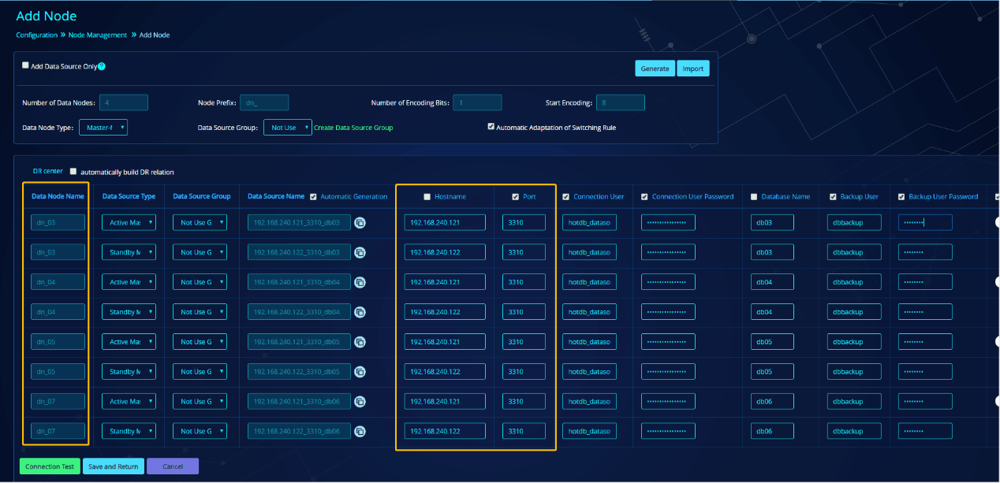

Step 10: Check whether the replication status or DR replication status in the current active IDC is abnormal. You can check whether the replication status of the data sources or ConfigDBs are normal through the "Node Management" and "Configuration Verification" pages.

Step 11: Dynamic loading.

Step 12. Check whether the topologic graph and various monitoring indicators are normal, and check whether all the heartbeat is monitored by executing the `show @@heartbeat` command through management port of compute node in the current active IDC.

##### Scenario Three: Make the original master center as the active IDC

When a failover at IDC level occurs and the original DR center is switched as the current active IDC, if the service status of each component in the original master center can be restored and it needs to be switched back to the original master center, the actual roles of all the IDC remain the same with configuration, then you need to manually do the modifications as follows:

- **When compute nodes can be stopped**

Step 1: Stop the management platform that is currently providing services, all compute node services, and keepalived service. (Note that no matter which IDC type is, the keepalived services corresponding to the standby compute node and the standby compute node service should be stopped first, and then the master keepalived service and master compute node service should be stopped).

Step 2: Wait the data sources in the current active IDC for catching up replication and clean up all replication relation between data sources or ConfigDB in the original master center or DR center.

Step 3: Export data from the master data source in the current active IDC. Based on this data, follow normal steps and requirements of setting up replication in the DR mode to rebuild the replication in both IDC and DR replication between master data source of these two IDC. That is, after the master center fails and the DR center is switched as the current active IDC, the replication relation should be: replication between ds01 and ds02 should be master-master, replication between ds03 and ds04 should be master-master while ds03 is the current active master. After the original master center is restored and its roles are made sure not to be changed, it is necessary to restore the replication relation based on the data of ds03 according to the standard steps of replication setup: replication between ds01 and ds02 should be master-master, replication between ds01 and ds03 should be master-slave(ds03 is a slave), replication between ds03 and ds04 should be master-slave(ds04 is a slave). All the replication relation between data sources need to be rebuilt, as are the replication relation between ConfigDB.

Step 4: After confirming that there is no abnormality in the replication relation between the data sources or ConfigDBs, execute the following statement in the master ConfigDB (should be ds01 at this time) to set the availability of the ConfigDB of master center to 1. Also, check whether the status of other ConfigDB in this table is in accordance with the actual availability status:

**Update the availability of the ConfigDB of master center:**

```sql
update hotdb_config_info set v='1' where k='hotdb_biz_idc_config_ok' or k='hotdb_master_config_status';
```

**Check the availability of other ConfigDB:**

```sql
select * From hotdb_config_info limit 1,5;
+----------------------------------+---+---------------------------------------------------+
| k | v | description |
+----------------------------------+---+---------------------------------------------------+
| hotdb_biz_idc_config_ok | 1 | ConfigDB in master center ok or not |
| hotdb_dr_idc_config_ok | 1 | ConfigDB in DR center ok or not) |
```

Step 5: After confirming that the first 4 steps are correct, start the compute nodes and keepalived service of the original master center and DR center according to the normal process; At this time, for the front-end application, the master data has been officially switched back, and the IDC type has not changed;

Step 6. Start the management platform and check whether the replication relation and status in topologic graph are normal.

- **When compute nodes cannot be stopped**

Referring to the steps described in [Scenario one](#scenario-one-abandon-the-original-master-center) and [Scenario two](#scenario-two-make-the-original-master-center-as-the-standby-idc), you need to make the current active IDC as the master center of a new cluster and make the original master center as the DR center of this cluster. Then make another switchover at the IDC level and rebuild the DR relation. That is, HotDB-01 and HotDB-03 are the master compute node of the master center and DR center respectively. When a failover at the IDC level occurs at the first time, HotDB-03 is switched as the master compute node of the current active IDC. If you want to switch back to HotDB-01 without stopping services, you need to modify the IDC type of HotDB-01 as a DR center and HotDB-03 as a master center; then execute online_dr command to switch HotDB-01 as the current active IDC and modify the IDC type of HotDB-01 as a master center and HotDB-03 as a DR center. It is equivalent to perform the steps described in [Scenario one](#scenario-one-abandon-the-original-master-center) and [Scenario two](#scenario-two-make-the-original-master-center-as-the-standby-idc) twice, and then rebuilding to make HotDB-01 as a master center and HotDB-03 as a DR center.

##### Scenario Four: Make the original master center as the active IDC without deleting cluster

When using the operation methods described in the previous sections, once failover at the IDC level occurs, the historical monitoring data of the failed IDC will be deleted. In actual use, as long as the data in the master data can be recovered, users may not want to discard the existing cluster group information, but they may want the IDC switch guaranteed. At this time, the data of ConfigDB and the configuration file must be manually modified, and replication relation between data sources must be rebuilt to complete the IDC type swap. The reference steps are as follows:

Step 1: Under the environment of [premise explanation](#premise-explanation)，a failover at the IDC level occurs, HotDB-03 and HotDB-04 are current master and slave compute nodes in the current active IDC and data of ds01, ds02, hc01, hc02 in the original master center can be recovered. At this time, make sure that the active and standby compute node services of the original master center have been shut down, that is, the services of HotDB-01 and HotDB-02 have been shut down;

Step 2: Make a data backup of the ConfigDB of the management platform that is currently providing the service, and the ConfigDB of compute nodes, so that they can be restored after misuse;(try not to conflict with the previous backup file).

Step 3: Check whether the compute node service process or keepalived process of the original master center exists. If it exists, you can directly close them all without affecting the compute node services that are currently providing services; it is mainly to avoid unnecessary operation and maintenance costs for mis-operation of this compute node.

Step 4: Establish replication relation of the ConfigDBs and data sources between the current active IDC and the original master center and swap the replication hosts. The reference operation steps in the swap process are as follows:

- After the disaster recovery switchover, when the service of original DR center starts and become the current active IDC, under normal circumstances, compute node will automatically setup a master-master replication between data sources according to the data source configuration in the current active IDC and also setup a master-master replication between ConfigDBs by default. No special operation is required. that is, ds03 and ds04, hc03 and hc04 have master-master replication;

- It is necessary to manually clean up the replication relation between the data sources and ConfigDBs of the original master center, that is, execute reset slave all. At the same time, if the data of the original master center can be abandoned or [must be abandoned](#under-what-circumstances-data-in-the-original-idc-must-be-abandoned), clear the data and perform the reset master operation; (Note: In the previous step, if GTIDs in the original master center are qual or less than the original DR center, and the missing GTIDs are not in the gtid_purged set of the master data sources in the original DR center. You can also try to set up replication without executing reset master. But after replication catchup, make sure to perform a master-slave data consistency detection to ensure that the data is truly consistent.)

- Export data of each master data source and each master ConfigDB in the current active IDC and import it to the target master data source and the master ConfigDB that are about to be set up replication in the original master center. (for data export and replication setup, please refer to the [master-slave replication setup recommended steps](#recommended-steps-for-replication-setup));

- Setup a master-slave replication relation between the master data source/ConfigDB in the active IDC and the master data source/ConfigDB in the original master center main. The data sources/ConfigDB in the original master center are slaves. That is, a master-slave relationship is established between ds01 and ds03 while ds01 is a slave; a master-slave relationship is established between hc03 and hc01 while hc01 is a slave.

- Setup a replication relation between the data source/ConfigDB in the original master center, that is, a master-slave relationship is established between ds01 and ds02 while ds02 is the slave; a master-slave relationship is established between hc01 and hc02 while hc02 is the slave. Note: For the sake of insurance, when setting up a replication relation, it is recommended that export the source data from the master data source in the original master center ds01 and the ConfigDB hc01 and then import into ds02 and hc02, finally set up a replication relation.

- If semi-synchronous replication is enabled, you need to manually modify the value of rpl_semi_sync_master_wait_for_slave_count of the master data source/ConfigDB in the current active IDC to a correct number as required to match the number of its real slaves. Refer to the following statement: `set global rpl_semi_sync_master_wait_for_slave_count=XXX;`

Step 5: Modify the configuration file server.xml of the original master center and the current active IDC to the configuration of the new state of DR mode, refer to the following:

**Master compute node in the current active IDC:**

```xml
<property name="url">jdbc:mysql://192.168.220.183:3306/hotdb_config</property><!-- ConfigDB address -->
<property name="bakUrl">jdbc:mysql://192.168.220.184:3306/hotdb_config</property><!-- Slave ConfigDB address -->
<property name="drUrl">jdbc:mysql://192.168.220.181:3306/hotdb_config</property><!-- Configuration database address in DR center -->
<property name="drBakUrl">jdbc:mysql://192.168.220.182:3306/hotdb_config</property><!-- Slave ConfigDB address in DR center -->
<property name="haMode">2</property><!-- High-availability mode, 0:HA, 1:Cluster, 2:HA in master center, 3:HA in DR center -->
```

**Standby compute node in the current active IDC:**

```xml
<property name="url">jdbc:mysql://192.168.220.183:3306/hotdb_config</property><!-- ConfigDB address-->
<property name="bakUrl">jdbc:mysql://192.168.220.184:3306/hotdb_config</property><!-- Slave ConfigDB address -->
<property name="drUrl">jdbc:mysql://192.168.220.181:3306/hotdb_config</property><!-- Configuration database address in DR center -->
<property name="drBakUrl">jdbc:mysql://192.168.220.182:3306/hotdb_config</property><!-- Slave ConfigDB address in DR center -->
<property name="haMode">2</property><!-- High-availability mode, 0:HA, 1:Cluster, 2:HA in master center, 3:HA in DR center -->
<property name="idcId">1</property><!-- ID of IDC, 1:master center, 2:DR center -->
```

**Master compute node in the original master center:**

```xml
<property name="url">jdbc:mysql://192.168.220.183:3306/hotdb_config</property><!-- ConfigDB address-->
<property name="bakUrl">jdbc:mysql://192.168.220.184:3306/hotdb_config</property><!-- Slave ConfigDB address -->
<property name="drUrl">jdbc:mysql://192.168.220.181:3306/hotdb_config</property><!-- Configuration database address in DR center -->
<property name="drBakUrl">jdbc:mysql://192.168.220.182:3306/hotdb_config</property><!-- Slave ConfigDB address in DRIDC -->
<property name="haMode">**3**</property><!-- High-availability mode, 0:HA, 1:Cluster, 2:HA in master center, 3:HA in DR center -->
<property name="idcId">**2**</property><!-- ID of IDC, 1:master center, 2:DR center -->
```

**Standby compute node in the original master center:**

```xml
<property name="url">jdbc:mysql://192.168.220.183:3306/hotdb_config</property><!-- ConfigDB address-->
<property name="bakUrl">jdbc:mysql://192.168.220.184:3306/hotdb_config</property><!-- Slave ConfigDB address -->
<property name="drUrl">jdbc:mysql://192.168.220.181:3306/hotdb_config</property><!-- Configuration database address in DR center -->
<property name="drBakUrl">jdbc:mysql://192.168.220.182:3306/hotdb_config</property><!-- Slave ConfigDB address in DRIDC -->
<property name="haMode">**3**</property><!-- High-availability mode, 0:HA, 1:Cluster, 2:HA in master center, 3:HA in DR center -->
<property name="idcId">**2**</property><!-- ID of IDC, 1:master center, 2:DR center -->
```

Step 6: Log in to the master ConfigDB in the current active IDC, and set the availability of the ConfigDB of original master center to 1 and swap IDC ID:

```sql
update hotdb_config_info set v='1' where k='hotdb_biz_idc_config_ok' or k='hotdb_master_config_status';
update hotdb_datasource t1 join hotdb_datasource t2 on(t1.idc_id=1 and t2.idc_id=2) set t1.idc_id=t2.idc_id,t2.idc_id=t1.idc_id;
```

Step 7: Log in to ConfigDB of the management platform and execute the following SQL statement to swap IDC ID (make sure to replace the group_id, which is consistent with the cluster ID at the cluster management page of management platform):

```sql
UPDATE hotdb_info t1 JOIN hotdb_info t2 ON (t1.group_id = ? and t2.group_id = ? and t1.room_type=1 and t2.room_type=2) SET t1.room_type = t2.room_type,t2.room_type=t1.room_type;
UPDATE host_info t1 JOIN host_info t2 ON (t1.group_id = ? and t2.group_id = ? and t1.room_type=1 and t2.room_type=2) SET t1.room_type = t2.room_type,t2.room_type=t1.room_type;
UPDATE host_soft_info t1 JOIN host_soft_info t2 ON (t1.group_id = ? and t2.group_id = ? and t1.room_type=1 and t2.room_type=2) SET t1.room_type = t2.room_type,t2.room_type=t1.room_type;
UPDATE hotdb_config t1 JOIN hotdb_config t2 ON (t1.group_id = ? and t2.group_id = ? and t1.room_type=1 and t2.room_type=2) SET t1.room_type = t2.room_type,t2.room_type=t1.room_type;
UPDATE env_check t1 JOIN env_check t2 ON (t1.group_id = ? and t2.group_id = ? and t1.room_type=1 and t2.room_type=2) SET t1.room_type = t2.room_type,t2.room_type=t1.room_type;
UPDATE mslog t1 JOIN mslog t2 ON (t1.group_id = ? and t2.group_id = ? and t1.room_type=1 and t2.room_type=2) SET t1.room_type = t2.room_type,t2.room_type=t1.room_type;
```

Example of page display after replacement:

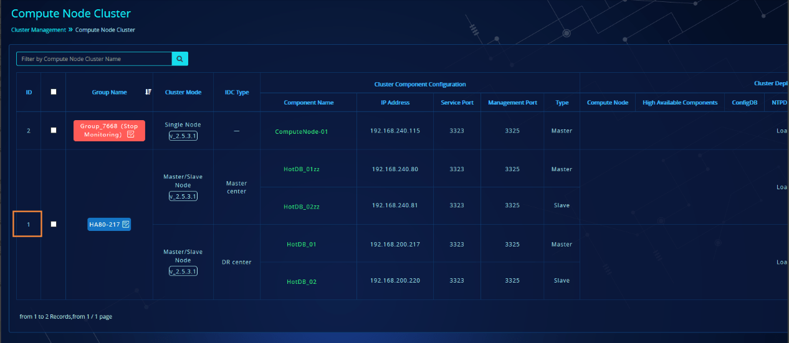

Step 8: Log in to the management platform and enable the data sources in the original master center (current DR center) that is automatically disabled:


Step 9: Check whether the replication status and DR replication status in the current active IDC is abnormal. You can check the replication status of data sources and ConfigDBs through the "Node Management" and "Configuration Checking" pages.

Step 10: Reload

Step 11: Check whether the topologic graph and various monitoring indicators are normal, and check whether all the heartbeat is monitored by executing the `show @@heartbeat` command through management port of compute node in the current active IDC and check whether IDC type has been swapped by executing the `show @@configurl` or `show @@datanode` command.For example:


##### Special Instructions

- When a switchover at IDC level occurs, if the target IDC has slave data sources or standby master data sources, log file hotdb.log will output the replication position of the master data source and slave data source that are about to setup a replication relation. By copying the position, You will know the GTID execution status of the data sources after IDC switchover:

Example 1: Log output of replication position of ConfigDB

```log
2019-12-14 19:07:58.317 [INFO] [INNER] [$I-NIOREACTOR-3-RW] cn.hotpu.hotdb.mysql.nio.handler.ChangeIDCDatasourceReplByConfig(351) - master([id:-4,nodeId:-1 192.168.220.183:3306/hotdb_config status:1,charset:utf8], Executed_Gtid_Set:46906d49-0b87-11ea-91a0-525400e2c4b6:1-2015,f629710f-0c19-11ea-bff2-525400edf2d2:1-3524,fc61739a-0c19-11ea-b887-5254007e6b1d:1-2) change master to master_standby([id:-5,nodeId:-1 192.168.220.184:3306/hotdb_config status:1,charset:utf8], Executed_Gtid_Set:46906d49-0b87-11ea-91a0-525400e2c4b6:1-2015,f629710f-0c19-11ea-bff2-525400edf2d2:1-3524,fc61739a-0c19-11ea-b887-5254007e6b1d:1-2).
```

Example 2: Log output of replication position of data source

```log
2019-12-14 19:08:00.546 [INFO] [INNER] [$NIOREACTOR-2-RW] cn.hotpu.hotdb.mysql.nio.handler.ChangeIDCDatasourceReplByConfig(351) - master([id:192,nodeId:46 192.168.220.183:3308/db2531 status:1,charset:utf8mb4], Executed_Gtid_Set:4a12db23-0c1a-11ea-a751-525400edf2d2:1-3524,a53b2400-0b87-11ea-b97e-525400e2c4b6:1-3) change master to master_standby([id:193,nodeId:46 192.168.220.184:3308/db2531 status:1,charset:utf8mb4], Executed_Gtid_Set:4a12db23-0c1a-11ea-a751-525400edf2d2:1-3524,a53b2400-0b87-11ea-b97e-525400e2c4b6:1-3).
```

Example 3: Slave data source has more GTID than the master

```log
2019-12-14 19:08:00.546 [WARN] [INNER] [$NIOREACTOR-2-RW] cn.hotpu.hotdb.mysql.nio.handler.ChangeIDCDatasourceReplByConfig(329) - Slave([id:189,nodeId:45 192.168.220.184:3307/db2531 status:1,charset:utf8mb4])'s Executed_Gtid_Set(1e81d24b-0c1a-11ea-b34f-525400edf2d2:1-3518,70ee41d5-0b87-11ea-85cd-525400e2c4b6:1,7afdc35d-0b87-11ea-91a3-52540073fb81:1) is **greater than** master([id:188,nodeId:45 192.168.220.183:3307/db2531 status:1,charset:utf8mb4])'s Executed_Gtid_Set(1e81d24b-0c1a-11ea-b34f-525400edf2d2:1-3518,70ee41d5-0b87-11ea-85cd-525400e2c4b6:1).
```

Example 4: Semi-synchronous replication status monitoring

```log
2019-12-14 19:07:57.820 [WARN] [INIT] [Labor-26] cn.hotpu.hotdb.backend.BackendDatasource(806) - [id:-5,nodeId:-1 192.168.220.184:3306/hotdb_config status:1,charset:utf8], Rpl_semi_sync_master_status or Rpl_semi_sync_slave_status must be 'ON' in DR mode
```

- All descriptions in this [Maintenance Management](#operation-and-maintenance-management) chapter are explained with GTID and semi-synchronous replication enabled. If you consider semi-synchronization replication of data sources and ConfigDB in a single IDC and asynchronous replication between this two IDC, we recommend the following configuration:

1. It is recommended that you set rpl_semi_sync_master_wait_no_slave = 0 and rpl_semi_sync_master_timeout should not be set too long for instances (including data sources and ConfigDB) in the master center. Also set rpl_semi_sync_slave_enabled as disable for the master instance in the DR center.
2. After a switchover at IDC level occurs, when you manually check the semi-synchronous replication parameters, you need to execute the stop slave; start slave command once to make it take effect.
3. After failover of the master instances in the DR center, you need to manually disable rpl_semi_sync_slave_enabled for the current active master and enable rpl_semi_sync_slave_enabled for the original master , and execute the stop slave; start slave command once on both instances to make it effective.

- Or, if semi-synchronous replication is not considered in the DR center at all, you can directly disable rpl_semi_sync_slave_enabled for all the instances in DR center so that there is no need to maintain the semi-synchronization status in the DR center. If semi-synchronous replication is not enabled in the DR replication relationship, you must strictly pay attention that the RPO cannot be set to 0.

## Note

When the DR mode is turned on, it is essential to monitor the service status for the entire cluster with two IDC. In this process, you must pay attention to turning on some necessary periodic plans and monitoring functions to avoid risks in advance.

#### Periodic Plans

It is recommended to enable replication status [monitoring](#monitoring) of ConfigDBs and data sources;

It is recommended to set a periodic plan for [master/slave consistency detection](#masterslave-data-consistency-detection) to check the data consistency of master center and DR center.

#### Email Alert

It is recommended that you set an email alert including monitoring the service status of all compute nodes and data sources in order to be aware of error information of each core component in time. And newly-added item, replication status of ConfigDB, can be set on the "Events"-> "Email Alert Setting"-> "Add Notification Strategy" page. For example, the following figure shows an example of setting up for monitoring replication status of ConfigDB:


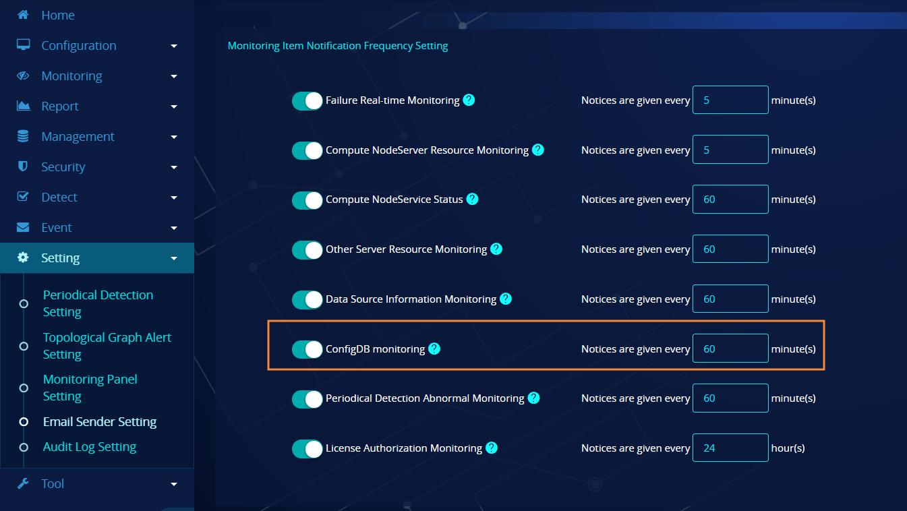

The content of the email alert will explain the specific IDC type where the problem occurred:

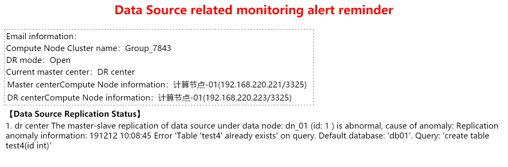

#### Environment Examination

After cluster deployment is completed without any errors, it is recommended to use the manager account of management platform to enter the "Cluster Management"-> "Deployment Environment Examination" page to perform environment examinations for both master center and DR center, and follow the suggestions to optimize unqualified configuration.

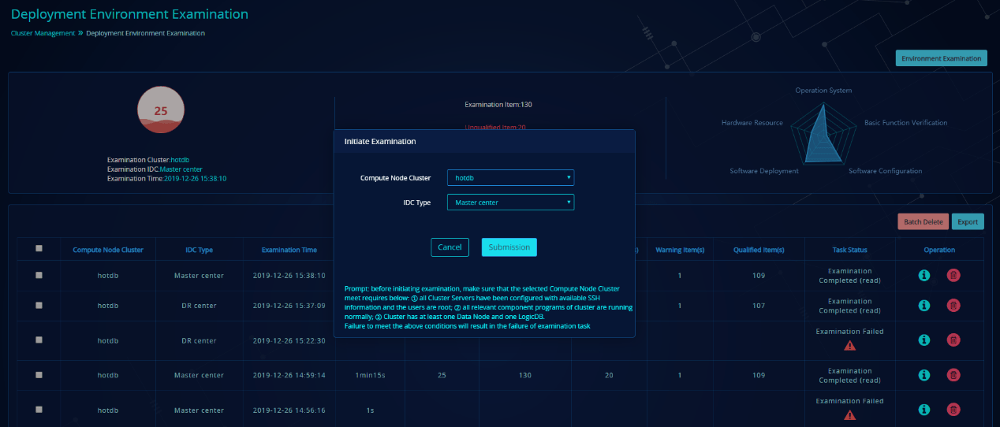

#### Data Backup

Currently data backup only supports backup for the master center, but you can transmit the backup files to the remote server. However, during the transmission process, it is necessary to pay attention to the consumption of network bandwidth by large backup files.

#### Service Restarted

When the serviced of failed data sources or ConfigDB are started, you must make sure that all replication relation abnormalities have been repaired.

#### SSH of Servers

It is recommended to configure the server SSH information on the [Configuration](#configuration)-> "Server" page when you start to use it, so as to assist the management platform to complete some simple maintenance and monitoring operations.

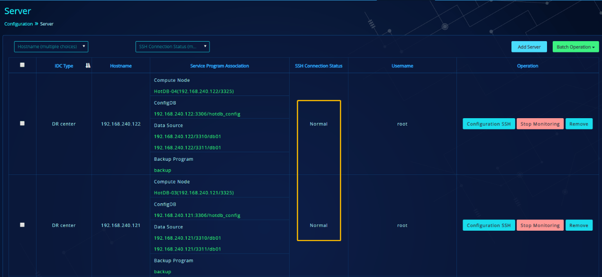

#### Master/Slave Data Consistency Detection

Whenever there is an inconsistent detection record of master and slave instances in the master center or the DR center, you should resolve as soon as possible to ensure data consistency and make data consistency detection regularly for both master center and DR center. When a failover at IDC level occurs, the historical data before the time of the last master/slave data consistency detection can be guaranteed to be correct.

#### Service Access

It is not allowed to open the service port in the DR center through the online_dr command when the master center is running, unless it is confirmed to switch IDC;

The DR center must not use the same VIP as the master center to avoid the risk of applications directly accessing across IDCs;

It is recommended to stop keepalived, the master and slave high availability components of the DR center during the daily operation and maintenance to avoid unnecessary recovery operations caused by VIP drift in the DR center.

#### Setup Replication

When manually setting up a replication relation, you must enable auto_position mode of GTID and cannot set any Channel names;

Multi-source replication is not allowed. There is a one-to-one match between the data nodes and instances in this two IDCs. Otherwise, multi-source replication will occur.

Before doing any failovers, please check whether the master-slave replication relation is normal.

#### Important but temporarily unsupported functions

Data sources currently do not support MGR replication mode.

When semi-synchronous replication is not enabled or degrades on the data sources and ConfigDBs, it is not guaranteed that the RPO will be 0 after switchover at the IDC level occurs.

## Reference Instructions

After the DR mode is enabled, you must pay attention to some abnormal log alerts and follow the correct way to setup replication relation during actual use and maintenance. This section mainly describes this type of reference instructions.

### Compute node logs

- Degraded semi-synchronous replication status of the slave data source (possibly cause that RPO is not 0):

```log
2019-12-10 12:17:00.630 [WARN] [TIMER] [$NIOExecutor-5-1] cn.hotpu.hotdb.manager.handler.LoggerHandler(25) - DR_IDC's datasource: -5([id:-5,nodeId:-1 192.168.220.184:3306/hotdb_config status:1,charset:utf8])'s RPL_SEMI_SYNC_SLAVE_STATUS is OFF
```

- The number of acks returned by the slave that is set for the semi-synchronous replication of slave data source is inconsistent with the actual number (possibly cause that RPO is not 0):

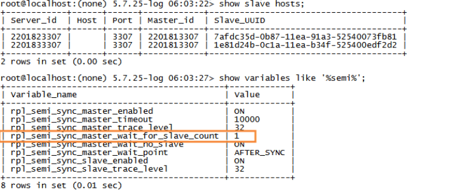


```log
2019-12-10 12:16:00.634 [WARN] [TIMER] [$NIOExecutor-5-1] cn.hotpu.hotdb.manager.handler.LoggerHandler(25) - datasource: 169([id:169,nodeId:43 192.168.220.181:3307/db2531 status:1,charset:utf8mb4])'s RPL_SEMI_SYNC_MASTER_WAIT_FOR_SLAVE_COUNT=2, real slave count=1
```

- The actual replication relation between the data source or ConfigDB is inconsistent with the configuration in ConfigDB.

```log
2019-12-14 19:08:00.426 [WARN] [INNER] [$NIOREACTOR-3-RW] cn.hotpu.hotdb.mysql.nio.handler.InitSlaveStatusHandler(99) - Datasource: 188's master datasource: 192.168.220.183:3307 not in datanode: 45
```

- When IDC is switched or the compute node that is providing services is offline, the current back-end connection related to it will also be closed. For related log information, please refer to:

```log
2019-12-14 19:08:00.978 [WARN] [CONNECTION] [$NIOREACTOR-2-RW] cn.hotpu.hotdb.net.NIOSocketWR(181) - exception(stream closed) in reading backend connection: [id:196,nodeId:47 192.168.220.181:3309/db2531 status:1,charset:utf8mb4] id=931
threadId=5801 isAuthenticated=true responseHandler=null isNetFull=false bufferInFullNet=false lastUsedTime=1576321520613 tookTime=1576321520605 sendingData=false inFlowControl=false maybeSlow=false heavyRowEof=false inFieldPacket=false
needSyncAutocommit=false syncAutocommitValue=true usingReadBuffer=false usingWriteBuffer=false readBuffer=java.nio.DirectByteBuffer[pos=0 lim=16384 cap=16384] writeBuffer=null writeQueue=0 host=192.168.220.181 port=3309 localPort=22248
connectionVars=[dsCharset=utf8mb4 autocommit=true savepointChecked=false txIsolation=2 charsetIndex=45 characterSetClient=utf8mb4 characterSetResults=utf8mb4 characterSetConnection=utf8mb4 collationConnection=utf8mb4_general_ci foreignK
eyChecks=true uniqueChecks=true txReadOnly=false] connectionStat=[startupTime=1576320655994 lastReadTime=1576321520594 lastWriteTime=1576321520594 netInBytes=5533 netOutBytes=1477] state=idle pauseTime=0 usedMemory=16384 lastSQL=[null]
readData=1576321520613 lastWritten=184 inner=false toBeClosed=false isClosed=false closeReason=null MySQLVersion=5.7.25
```

- Log records when service port is closed:

```log
2019-12-14 19:07:56.610 [INFO] [MANAGER] [$NIOExecutor-0-2] cn.hotpu.hotdb.manager.response.Offline(66) - received offline command from:[thread=$NIOExecutor-0-2,id=1056,user=root,host=192.168.220.181,port=3325,localport=16928,schema=null]
2019-12-14 19:07:56.612 [INFO] [MANAGER] [Labor-10] cn.hotpu.hotdb.HotdbServer(2149) - MANAGER offline start
```

- Log records when service in the DR center is started:

```log
2019-12-14 19:07:56.552 [INFO] [MANAGER] [Labor-26] cn.hotpu.hotdb.HotdbServer(2115) - DR online start
```

### Recommended steps for replication setup

#### Prerequisites

- The version numbers of all MySQL instances about to setup replication are exactly the same;

- The result of executing show master status on the new slave instance does not including any GTID (GTID is disabled or GTID is empty). Also, the results of executing show slave status and show slave hosts are both empty;

- If the GTID function is enabled on the old master instance, each set of GTID value in the Executed_Gtid_Set by executing show master status must be continuous without any breakpoints. (That is, any GTID must start from 1 and reach the maximum. There must be no gap in the middle of any GTID.) Note: For the old master instance with parallel replication turned on, it tends to see that GTID is not continuous. In this case, it is recommended to manually decide whether to continue to setup replication;

- For those MySQL instances are deployed by single component deployment, the ConfigDB instances can only be setup replication with the the ConfigDB instances, and the data source instances can only be setup replication with the data source instances. Do not mix instances;

- It should be setup in the business period with low flow. If the amount of data is large, sufficient time must be reserved for execution;

- If the MySQL instance is installed by single component deployment, it is recommended to use the dbbackup user or hotdb_datasource user to export and import data and use the repl user when setting up replicatio.

#### Set up replication relations when GTID is enabled

If the GTID function on both the new instances and the old master instances about to set up replication is enabled, that is, gtid_mode is on, the following method can be used to set up the master-slave replication:

Step 1: Check whether the remaining free disk space of the directory used for exporting data is sufficient. It must be ensured that the remaining space of the directory used by the data is greater than 1.5 times + 10GB of space required for the current query. For the size of the current data, refer to SQL statement: select sum (data_length) from information_schema.tables (unit: byte b).

Step 2: Use the following parameters to export the old master instance data:

```bash
mysqldump --no-defaults --all-databases --default-character-set=utf8mb4 --single-transaction --set-gtid-purged --events --routines --triggers --hex-blob --no-tablespaces --host=xxx --port=xxx --user=xxx -pxxx > *file name* ;echo $?
```

Example：

```bash
mysqldump --no-defaults --all-databases --default-character-set=utf8mb4 --single-transaction --set-gtid-purged --events --routines --triggers --hex-blob --no-tablespaces --host=127.0.0.1 --port=3306 --user=dbbackup -pdbbackup > backup_data.sql ;echo $?
mysqldump: [Warning] Using a password on the command line interface can be insecure.
```

If the return value is 0 and the export command does not report an error, it means the data is exported successfully. (This is normal: mysqldump: `[Warning] Using a password on the command line interface can be insecure.`)

> **Note**
>
> By adopting the above method to export data, `SET @@SESSION.SQL_LOG_BIN = 0;` is added by default. Therefore, you must make sure that you do not setup DR replication first and then import data to the master in DR center when setting up the replication relation between master instances in the master center and DR center, and the replication relation in the DR center itself. (Wrongly believing that data will synchronize to the slave in DR center). You have to set up replication relations after importing data correctly into each instance.

Step 3: After the file is exported, check if the file content is available. Transmit the file through SCP command to the server where the new instance to be the slave stores. Before execute SCP command, check the data directory of the new instance to see if the remaining disk space was sufficient. It is required the remaining disk space of the target data directory to be greater than 2.5 times the size of the exported file + 10GB. The command to check the new instance data directory can refer to:

```sql
show global variables like 'datadir'
```

Step 4: After the file transfer is successful, you can choose to delete the exported file on the original master instance as required.

Step 5: Use the following command to import the file:

```bash
mysql --no-defaults --default-character-set=utf8mb4 --binary-mode --disable-reconnect --host=xxx --port=xxx --user=xxx -pxxx < *file name* ;echo $?
```

Example：

```bash
[root@hotdb-220-182 ~]# mysql --no-defaults --default-character-set=utf8mb4 --binary-mode --disable-reconnect --host=127.0.0.1 --port=3306 --user=dbbackup -pdbbackup < /data/mysql/mysqldata3306/backup_data.sql ;echo $?
mysql: [Warning] Using a password on the command line interface can be insecure.
```

If the return value is 0 and the export command does not report an error, it means that data is imported successfully. ( This is normal: `mysqldump: [Warning] Using a password on the command line interface can be insecure.`)

Step 6: Run the following command to refresh privileges. Note that after the refresh, if the instance is reconnected, the username and password of the connection are the same as the old master instance.

```sql
FLUSH NO_WRITE_TO_BINLOG PRIVILEGES;
```

Step 7: Consider executing the following statements for all tables:

```sql
ANALYZE NO_WRITE_TO_BINLOG TABLE xxx;
```

Step 8: Delete the original data backup file under data directory of the new instance as required.

Step 9: Set up a replication relationship using GTID auto-location.

```sql
change master to master_host = 'xxx',master_user='xxx',master_password='xxx', master_port=xxx,master_auto_position=1;
```

Example：

```sql
change master to master_host = '192.168.220.181',master_user='repl',master_password='repl', master_port=3306,master_auto_position=1;
```

#### Set up replication relations when GTID is disabled

> **Note**
>
> If the DR mode is enabled for the compute node cluster, all data sources are required to have GTID turned on. The introduction here is only for reference. There is no direct correlation in the actual maintenance of the DR mode.
>
> If the GTID function of the new instance and the old master instance for the replication relation to be set up is turned off or one of them is turned off, the replication relation can only be set up by using binlog position. The main process is the same as the process of [GTID enabled](#set-up-replication-relations-when-gtid-is-enabled), but the data import, export, and replication setup involved in steps 2, 5, and 9 are different:

Step 2: export data command refers to:

```bash
mysqldump --no-defaults --all-databases --default-character-set=utf8mb4 --single-transaction --loose-set-gtid-purged=off --master-data=2 --events --routines --triggers --hex-blob --no-tablespaces --host=xxx --port=xxx --user=xxx -pxxx > *file name* ;echo $?
```

Step 5: import data command refers to:

```bash
mysql --no-defaults --default-character-set=utf8mb4 --binary-mode --disable-reconnect --host=xxx --port=xxx --user=xxx -pxxx < *file name* ;echo $?
```

Step 9: set up replication refers to:

```bash
change master to master_host = 'xxx',master_user='xxx',master_password='xxx', MASTER_LOG_FILE='mysql-bin.xxx', MASTER_LOG_POS=xxx;
```

> **Note**
>
> `MASTER_LOG_FILE = 'mysql-bin.xxx', MASTER_LOG_POS = xxx;` This position is the position obtained when the data was exported in step 2, which can be obtained by: *head -c 4096 file without duplicate name | grep -I 'change master'*. If there are multiple new instances that need to set up a master-slave replication and there is a multipe levels of slaves relation, you need to execute *show master status* on the corresponding master to obtain the binlog position after the data is imported and before performing any write operations. You cannot directly take the export position to set up a replication relation.

### Under what circumstances data in the original IDC must be abandoned

If a faiover at the IDC level occurs, you need to pay attention that data in the original master center must be discarded in the following cases:

When it is decided manually that some data is not synchronized to the original DR center (the current active IDC), since the data is based on the original DR center (the current active IDC), the data has been synchronized cannot be synchronized any more.

If you need to rebuild the original master center, you need to delete the data from the original master center and export the data from the current active IDC, and then perform subsequent IDC recovery operations, otherwise it will cause data confusion (note that the use of semi-synchronous replication may also cause data confusion, but such data is a transaction that has issued a commit but has not received ok. we cannot simply consider such a transaction as a transaction have been submitted or must have been submitted. It must be decided on the processing method by the data being actually queried).

