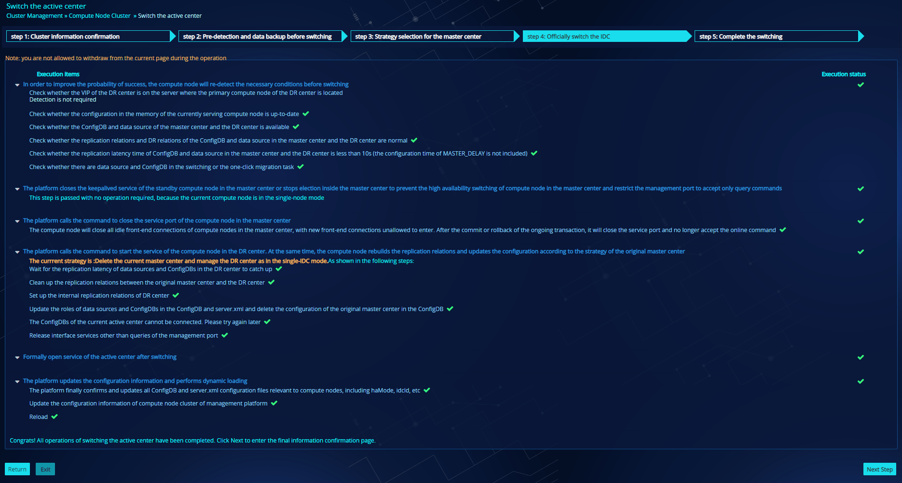
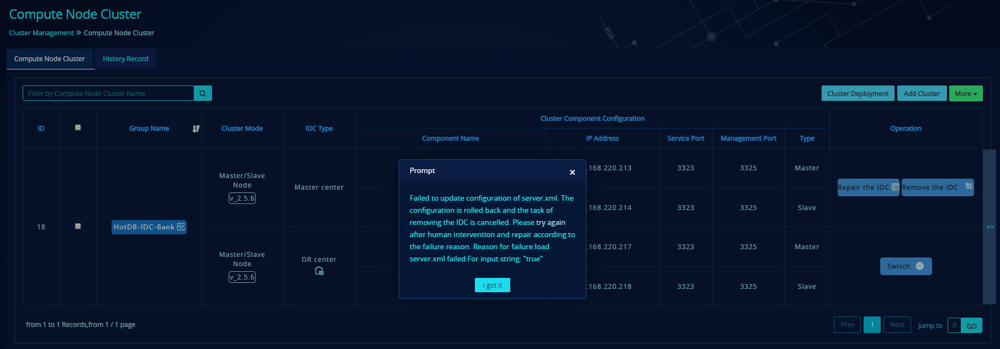
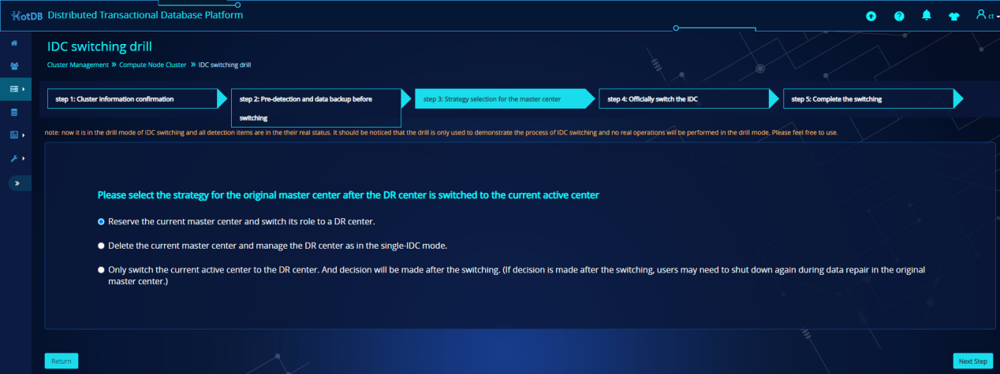
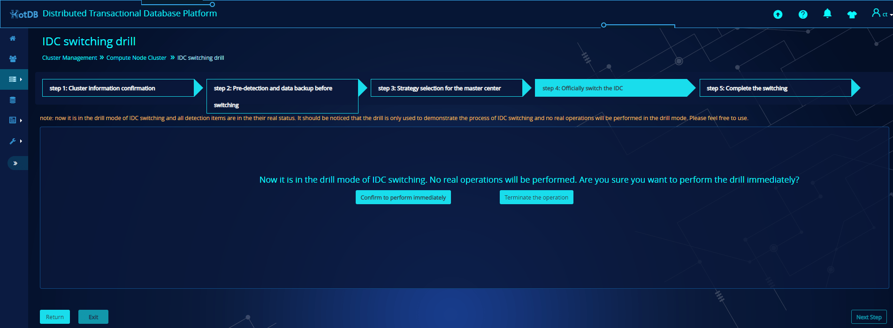

# Visual IDC

## Background

HotDB Server and management platform in v.2.5.3.1 and above support cross-IDC disaster recovery function. However, if there is an IDC-level failure, the user needs to manually switch after manual detection, judging and repair, which takes a high operation and maintenance cost. Therefore, we introduce the visualization of functions such as IDC switching, IDC switchback, IDC removal, IDC repair and disaster recovery drill, etc. in v.2.5.6 and above, so as to improve the reliability and usability of IDC operations.

## Compute node cluster

### Entry to switch the active center

#### When the master center is the current active center

When the master center is the current active center, the [switch the active center](#switch-the-active-center) entry button will be provided in the following two situations:

1. The service port and management port of the master center are both connected normally, and the management port of the DR center is connected normally.
2. Only the management port of the DR center can be connected.

When the service port and management port of the master center are both connected normally, and the management port of the DR center is connected normally, the entry page to [switch the active center](#switch-the-active-center) will be shown as:

When only the management port of the DR center can be connected, the cluster name will be marked in orange and the entry page to "switch the active center" will be shown as:

#### When the DR center is the current active center

When the DR center is the current active center, the "switch the active center" entry button will not be provided.

### Entry to IDC repair

When the DR center is the current active center and the service port and management port of the DR center are connected normally, the master center will be provided with the "repair the IDC " entry button:

### Entry to IDC removal

- When the master center is the current active center, and the service port and management port of the master center are connected normally, the DR center will be provided with the "remove the IDC" entry button:

- When the DR center is the current acti ve center, and the service port and management port of the DR center are connected normally, the master center will be provided with the " remove the IDC" entry button:

### Other instructions

In HotDB Server V.2.5.6 and above and with DR mode enabled, when more cluster deployment information is unfolded, the original buttons of \[repair the IDC], \[remove the IDC], \[switch] and \[rebuild] will be displayed in a smaller version, and button information will be shown when the cursor moves over the icon.

- Repair the IDC: 
- Remove the IDC: 
- Switch (in the IDC): 
- Rebuild (in the IDC): 

## Switch the active center

To switch the active center mainly includes five steps: cluster information confirmation, Pre-detection and data backup before switching, strategy selection for the master center, officially switch the IDC and complete the switching. Based on the selection of switching strategy, the IDC is switched to be the active center, and the roles of data sources and ConfigDBs are changed accordingly.

### The service port of the master center is connected normally

#### Cluster information confirmation

The cluster information confirmation page includes the confirmation of cluster information, backup information and switching results of IDC.

**Confirm information of compute node cluster**

- The current active center and standby center: displays information about the current active center and standby center
- Master compute node: displays the master compute node and VIP of the current IDC
- Service status: displays the connection status of the service port / management port of the master compute node in the current IDC
- Slave compute node: displays the slave compute node of the current IDC
- Service status: displays the connection status of the service port / management port of the slave compute node in the current IDC

**Conform backup information of compute node cluster**

By default, all backup items are checked in the backup information confirmation module of the compute node cluster. You can also select the backup items by yourself. After selecting at least one item, the \[next] button will be opened normally and allow to enter the next step.

**Confirmation of IDC switching results**

Displays information about the active center and master compute node after switching

#### Pre-detection and data backup before switching

The pre-detection of cluster running status, configuration information, replication latency and replication relations of nodes is to ensure the normal running and data accuracy of compute nodes and data sources after the switching. The data backup ensures that the data will not be lost if switching failed.

**Buttons description**

- Retry: retry the current step.
- Ignore this item and proceed to the next step: skip this step and perform the next step.
- Return: return to the [cluster information confirmation](#cluster-information-confirmation) page.
- Next step: available only after all detection and backup items are passed. Otherwise, it will be grayed.

Detection items must all be passed before taking the next step. Otherwise, manual intervention is required to solve the failed items.

1. Abnormal high availability status of compute nodes in the master center .

2. The data source in the master center is not available.

3. Abnormal DR relations of data source.

4. No master-slave data consistency detection and global data consistency is performed for all data with 24 hours.

The data backup before switching is mainly to back up the backup items selected in the previous step and store data under the directory `/hotdb-management/databak/cluster number/backup time`.

#### Strategy selection for the master center

There are mainly three switching strategies:

- Reserve the current master center and switch its role to a DR center.
- Delete the current master center and manage the DR center as in the single-IDC mode.
- Only switch the current active center to the DR center. And decision will be made after the switching.

The first switching strategy is selected by default.

#### Officially switch the IDC

Confirm again before the official switching.

- In this step, you can click the exit button to exit and switch it to an active center task. After the detection, exit will not be allowed.

If there is a task which is quitted in the detection phase, you can either choose to continue the last task or cancel the previous unfinished task, and start a new task within 24 hours. (when you choose to continue the last task, the page will jump to the phase where the last task is quitted, and when you choose to cancel the previous unfinished task and start a new task, the last unfinished result will be ignored.)

The exceptions detected in the process of IDC switching can be handled manually.

Different switching strategies correspond to different switching processes.

1. Reserve the current master center and switch its role to a DR center.

2. Delete the current master center.

3. Only switch the current active center to the DR center.

#### Complete the switching

Operation buttons for the current standby IDC on the final "complete the switching" page is different based on the switching strategy you chose.

- Reserve the master center and exchange roles

- Delete the current master center.

- Only switch the current active center to the DR center.

### Abnormal connections of the service port in the master center

#### Cluster information confirmation

When the connection status of the service port of the master center is abnormal, the service status of the compute node on the cluster information confirmation page changes correspondingly, while others remain consistent with the normal connection page.

#### Pre-detection and data backup before switching

The pre-detection of cluster running status, configuration information, replication latency and replication relations of nodes is to ensure the normal running and data accuracy of compute nodes and data sources after the switching. The data backup ensures that the data will not be lost if switching failed.

When the service port of the master center is connected abnormally, some detection related to the master center will not be executed and a warning in orange will be given. With this warning, detections will be directly ignored, which has no impact on the current task of switching the active center.

The data backup remains consistent with the master center of normal service.

#### Strategy selection for the master center

There are three switching strategies provided on the page, with the second one selected by default. Only the second strategy and third strategy can be selected because the service port of the master center is connected abnormally.

When the master center service cannot be connected, the original master center can be repaired after switching.

#### Officially switch the IDC

Confirm again before officially switching the IDC. The confirmation is displayed according to the strategy selection.

- re-detection of necessary conditions is required for the "officially switch the IDC" step. You can click the exit button to exit and switch it to an active center task during the step. After the re-detection step, you cannot exit.

The exceptions occurred during switching can be processed manually according to the specific information.

Different switching strategies correspond to different switching processes.

1. Delete the master center

2. Only switch the current active center to the DR center.

#### Complete the switching

1. Delete the master center

2. Only switch the current active center to the DR center.

### Other instructions

Tasks cannot be initiated when the status of switching the active center button on the compute node cluster page is not up-to-date. If you click the button, it will prompt that "The current status is not up-to-date. Please refresh the page."

New tasks cannot be initiated when there is a task in progress (in all clusters monitored under the management platform).

## Repair the IDC

After the IDC switching, you can restore the original master center to the DR center, and keep the original DR center as the active center or restore the original master center to the active center.

### Repair information confirmation

Before repairing the IDC, it is necessary to ensure the normal service of the compute node in the current active center. Whether the service port or the management port is connected normally or not, the compute node can be repaired.

### Selection of repair strategy for the master center

There are two repair strategies provided on the page, with the first one selected by default.

It may take a long time to repair the master center. Please be patient.

At least one item shall be selected. Otherwise, you cannot proceed to the next step.

### Pre-detection and data backup before repair

- Before the repair of the IDC, the cluster running status, various configuration, and the replication latency and replication relations of nodes should be thoroughly detected to ensure the normal execution of the repair of the IDC.

- The exceptions detected can be processed manually according to the specific information. You can ignore the steps which have no impact on the repair (generally prompted in orange) and proceed to the next step directly.

### Execution of repair strategy for the master center

Confirm again before the repair of the IDC. And the confirmation is displayed according to the strategy selection.

A re-detection of necessary conditions is required for the official repair of the IDC. You can click the exit button to exit and switch it to an active center task during the step. After the re-detection step, you cannot exit.

The exceptions detected during the repair can be processed manually according to the specific information.

Different repair strategies have different repair processes.

1. Roles exchange

2. Reserve the current role and switch back.

### Repair complete

After the repair of IDC, you can choose to switch the active center in the current standby center.

### Other instructions

Tasks cannot be initiated when the status of repair the IDC button on the compute node cluster page is not up-to-date. If you click the button, it will prompt that "The current status is not up-to-date. Please refresh the page."

New tasks cannot be initiated when there is a task in progress (in all clusters monitored under the management platform).

## Remove the IDC

### Remove the master center

When the DR center is the current active center and the service port and the management port is connected normally, the master center can be removed and the DR center can run as a single IDC. Swap `server.xml` and update `server.xml` to single-node mode.

Confirm again before removing the IDC. Click the "confirm" button to enter the process of removing the IDC, and click the "Cancel" button to return to the compute node cluster page.

During the process of removing the IDC, the dynamic loading will be performed twice to the current active center. If you click "yes", the task will be continued; if you click "no", the task will be cancelled, with a 3-second prompt " task cancelled".

If the dynamic loading fails, a pop-up prompt "the IDC cannot be removed temporarily" will be shown.

After the preparation for removing the IDC is completed, confirm again whether to remove the master center. Click "yes" to. Click "no" to cancel the task of removing the IDC. The page will disappear in 3 seconds and prompt "cancel the task of removing the IDC".

If removal fails, the specific failure reason will be displayed, and the configuration will be rolled back.

- If the removal is successful, a 3-second prompt "removed successfully" will be shown and the cluster info will be updated to single-node mode.

### Remove the DR center

When the master center is the current active center and the service port and the management port is connected normally, the DR center can be removed and the master center can run as a single IDC. Remove the DR center and `server.xml` will be updated to single-node mode

During the removal, there is no need to swap `server.xml`. You shall directly update server.xml. Other processes are consistent with the removal of the master center

### Other instructions

After the removal of IDC, the other IDC will run independently as a single IDC, so please be careful with the operation.

Before removal, you should ensure that the service port and management port of the current active center are connected normally.

The operation of removing the IDC will not clear the replication relations of data sources and ConfigDBs in the removed IDC, but only clear the configuration and monitoring data related to the IDC.

## Historical records

Operations including switching the active center, repairing the IDC, removing the IDC, switching (inside the IDC), and rebuilding (inside the IDC) will be recorded in the compute node cluster--> historical records.

You can search by typing or selecting key words such as compute node name, operation user, access IP, execution content and execution status.

Sorting is supported by all columns except for the "operation" column.

When the compute node cluster is available, you can click the cluster name to enter the edit page.

Only when the execution content is "switch the active center" or "repair the IDC", the corresponding execution strategy will be displayed. Otherwise, the execution strategy column will be empty.

The execution status column records the specific execution status. Hovering over the cursor, the specific status will be displayed, such as execution success, in progress..., halfway exit, and execution failed (failure reason will be marked).

Only when the execution content is "switch the active center" or "repair the IDC", the "details" button will be displayed in the operation column.

Click the "details" button in the operation column, you can enter the task records of switching the active center / repairing the IDC and view the detailed switching / repair process. Click the "delete" button to delete the latest historical record.

## IDC switching drill

The IDC switching drill mainly includes five steps: cluster information confirmation, pre-detection and data backup before switching, strategy selection for the master center, officially switch the IDC and complete the switching. You are not allowed to proceed to the next step until the previous step is completed. In the step "officially switch the IDC", you can view the animation demonstration of IDC switching.

### Function entry

In the cluster with DR mode enabled, if the cluster meets the conditions for the IDC switching drill, you can click the \[IDC switching drill] button in the "more" drop-down box to view the animation demonstration of IDC switching.

### Drilling conditions

**The following conditions shall be met for the IDC switching drill:**

- V.2.5.6 and above, with DR mode enabled;
- Only one group of compute node clusters is allowed to be selected;
- [Switching-related operations](#switch-the-active-center) are allowed in the current cluster;
- There is no switching task in progress in the current cluster;

### Under normal service of the master center

When the master center and the DR center are serving normally, you can carry out the IDC switching drill.

#### Cluster information confirmation

This step is divided into three modules: information confirmation of compute node cluster, backup information confirmation of compute node cluster and confirmation of IDC switching results;

The information confirmation module of compute node cluster displays the latest information and service status of the current cluster;

By default, all backup items are checked in the backup information confirmation module of the compute node cluster. You can also select the backup items by yourself.

The \[next] button is only opened after selecting at least one item.

The confirmation of IDC switching results module displays the active center and the master compute node after the switching;

#### Pre-detection and data backup before switching

This step is divided into two modules: pre-detection before switching and data backup before switching;

The pre-detection module before switching is mainly to detect the detection items of each IDC in the current cluster;

The data backup before switching is mainly to back up the backup items selected in the previous step and store data under the directory /hotdb-management / databak / cluster number / backup time.

Detection items must all be passed before taking the next step. Otherwise, manual intervention is required to solve the failed items.

#### Strategy selection for the master center

There are mainly three switching strategies: reserve the current master center and switch its role to a DR center; delete the current master center and manage the DR center as in the single-IDC mode; only switch the current active center to the DR center. And decision will be made after the switching.

Reserve the current master center and switch its role to a DR center, i.e. exchange the master center and the DR center.

Delete the current master center and manage the DR center as in the single-IDC mode, i.e. return to the single-IDC mode.

Only switch the current active center to the DR center. And decision will be made after the switching, i.e. only switch to the DR center.

#### Officially switch the IDC

In this step, you can confirm to start the IDC switching drill or terminate the operation. It should be noted that now it is in the drill mode of IDC switching. No real operations will be performed;

Click "terminate the operation", you will exit from the IDC switching drill and return to the compute node cluster page;

Click "Confirm to perform immediately", the necessary conditions will be re-detected to improve the probability of success. When the re-detection is finished, the message will be given as "Congrats! All pre-detection items of IDC switching have been completed. Now it is in the drill mode. You can view the simulated process of IDC switching through animation or click Next to enter the final confirmation page."

#### View the animation of IDC switching

Click the [view the animation of IDC switching](#view-the-animation-of-idc-switching) button, and view the animation on the popped-up new page. This step is the key step of IDC switching drill, which shows the detailed process of IDC switching through animation;

During the animation, you can click the "replay" button in the upper right corner to replay the animation. The button is available in the entire process;

#### Complete the switching

This step mainly displays the results of IDC switching drill based on the previously selected strategy;

When you select the strategy "reserve the current master center and switch its role to a DR center", the switching steps will be as follows:

When you select the strategy "delete the current master center and manage the DR center as in the single-IDC mode", the switching steps will be as follows:

When you select the strategy "only switch the current active center to the DR center. And decision will be made after the switching", the switching steps will be as follows:

Click "Finish" to complete the IDC switching drill and return to the compute node cluster page.

### Under abnormal service of the master center

When the service of the master center is abnormal, while the DR center is serving normally, you can carry out the IDC switching drill:

#### Cluster information confirmation

This step is divided into three modules: information confirmation of compute node cluster, backup information confirmation of compute node cluster and confirmation of IDC switching results;

The information confirmation module of compute node cluster displays the latest information and service status of the current cluster. When the service of the master center is abnormal, a message in red will be given to remind that the management port / service port cannot be connected;

By default, all backup items are checked in the backup information confirmation module of the compute node cluster. You can also select the backup items by yourself. When the service port of compute nodes in the master center cannot be connected, the backup will be based on the configuration of the master compute node in the DR center by default;

The confirmation of IDC switching results module displays the active center and the master compute node after the switching. When the compute node service of the master center before switching cannot be connected, some detection related to the master center will not be carried out; after the switching, the original master center service can be repaired;

The \[next] button is only opened after selecting at least one item.

#### Pre-detection and data backup before switching

This step is divided into two modules: pre-detection before switching and data backup before switching;

The pre-detection module before switching is mainly to detect the detection items of each IDC in the current cluster. When the service of the master center is abnormal and some detection items cannot be detected, a message in yellow will be given "detection is not available, because the compute node service of the current master center cannot be connected, which however has no impact on the switching.". You can select "ignore this item and continue to the next step" and choose "yes" in the pop-up window, and other items that cannot be detected will be ignored directly;

The data backup before switching is mainly to back up the backup items selected in the previous step and store data under the directory /hotdb-management / databak / cluster number / backup time.

Detection items must all be passed before taking the next step. Otherwise, manual intervention is required to solve the failed items.

#### Strategy selection for the master center

There are mainly three switching strategies: reserve the current master center and switch its role to a DR center; delete the current master center and manage the DR center as in the single-IDC mode; only switch the current active center to the DR center. And decision will be made after the switching.

Reserve the current master center and switch its role to a DR center, i.e. exchange the master center and the DR center.

Delete the current master center and manage the DR center as in the single-IDC mode, i.e. return to the single-IDC mode.

Only switch the current active center to the DR center. And decision will be made after the switching, i.e. only switch to the DR center.

#### Officially switch the IDC

In this step, you can confirm to start the IDC switching drill or terminate the operation. It should be noted that now it is in the drill mode of IDC switching. No real operations will be performed;

Click "terminate the operation", you will exit from the IDC switching drill and return to the compute node cluster page;

Click "Confirm to perform immediately", the necessary conditions will be re-detected to improve the probability of success. When the re-detection is finished, the message will be given as "Congrats! All pre-detection items of IDC switching have been completed. Now it is in the drill mode. You can view the simulated process of IDC switching through animation or click Next to enter the final confirmation page."

#### View the animation of IDC switching

Click the [view the animation of IDC switching](#view-the-animation-of-idc-switching) button, and view the animation on the popped-up new page. This step is the key step of IDC switching drill, which shows the detailed process of IDC switching through animation;

When the service of the master center is abnormal, the compute node in the left IDC will be red at the beginning of the animation, with ConfigDBs and data nodes unavailable;

During the animation, you can click the "replay" button in the upper right corner to replay the animation. The button is available in the entire process;

#### Complete the switching

This step mainly displays the results of IDC switching drill based on the previously selected strategy;

When you select the strategy "reserve the current master center and switch its role to a DR center", the switching steps will be as follows:

When you select the strategy "only switch the current active center to the DR center. And decision will be made after the switching", the switching steps will be as follows:

Click "Finish" to complete the IDC switching drill and return to the compute node cluster page.

### Notes

In the IDC switching drill, all detection items are in their real status. It should be noticed that the drill is only used to demonstrate the process of IDC switching and no real operations will be performed in the drill mode. Please feel free to use.

Once you click "confirm", the strategy you select will be valid immediately. Even if other strategies are selected in the following operations, the first-time selection shall prevail.

If you want to view the animation under other strategies, you need to exit this switching drill, select a cluster on the compute node cluster page and restart the IDC switching animation.

