# HotDB Management

## New functions and features of Version 2.5.6.1

This chapter will briefly introduce the newly added or optimized functions in HotDB Management V2.5.6. Please go to the specific function menu for details.

- Add new functions including [visualized switching, repair, removal of IDC and IDC switching drill](#switching-removal-and-repair-of-idc) to improve the reliability and ease of use of IDC operation and reduce the operation and maintenance cost of cross-IDC operation
- Add the function of [Intelligent Inspection](#intelligent-inspection), which helps with the cluster inspection in database
- Add the function of [Platform Configuration Ddata Management](#platform-configuration-data-management). The management platform ConfigDB is able to support high availability switching and backup and restore of ConfigDB
- Add functions such as "Disable", "Comment", "Online time" in [User Management](#user-management)
- Optimize the configuration function of some sharding functions, so that the [MATCH](#match) and [ROUTE](#route) type are able to support prefix/infix/suffix matching, and the [RANGE](#range) type to support the maximum and minimum boundary value matching
- Optimize the function of [Upgrade Center](#upgrade-center) to match the new JDK version in v.2.5.6 and the self-developed license
- Optimize the function of [Add New Table Configuration](#add-new-table-configuration): when adding new table configuration, all data nodes under the LogicDB will be associated by default
- Optimize the function of [Alert Type](#alert-type-description) in History Events, and add cluster election or switching reminders
- Optimize the function of [Update License](#upgrade-center) to adapt to the new self-developed encrypted authorization plan
- Optimize the [master/slave consistency detection](#masterslave-data-consistency-detection), and give a prompt to the tables that are not configured with switching functions or whose data sources are unavailable
- Optimize the function of [Config Checking](#config-checking), add checking item of whether to configure switching functions, and give warnings for the data nodes with replication relations that are not configured with switching functions
- Add the identification of whether the data of data sources are consistent on the data nodes in the [Logic Topological Graph](#logic-topological-graph)
- Optimize the [high availability switching](#masterslave-switch) function of data source, and do compatibility processing for master_delay replication latency. Add "switching" button, you can cancel the switching task halfway via the button
- The [Topological Graph Alert Setting](#periodical-plan) is compatible with master_delay configuration to make it within the alert range. Besides, add "Reset" button to the Topological Graph Alert Setting and Monitoring Panel Setting to restore the default configuration
- Optimize the page of [Compute Node Cluster Management](#compute-node-cluster) to unfold/hide more deployment info and improve the page access rate
- Optimize the function of [data unique constraint detection](#data-unique-constraint-detection) to make it compatible with prefix unique index
- Set the entrance for data sharding route periodical detection plan, data unique constraint periodical detection plan in the [Periodical Plan](#periodical-detection-setting) of the management platform
- Optimize the [user privilege](#database-user-management) table page, so that the privilege info of LogicDB can be directly seen on the page
- Optimize the function of [OEM Management](#oem-management), remove the original menu, and access it by hyperlink (also applicable to v.2.5.5)
- Enhance the password strength of [database users](#database-user-management) (the password of database users shall be no less than 8 digits and must be composed of numbers and letters)
- Add the function of [platform license management](#license-management), to limit the number of cluster groups of available compute nodes and the number of available compute nodes for each group of compute nodes
- Optimized execution of [Online DDL](#online-ddl) and [Sharding Plan Online Modification](#sharding-plan-online-modification): the master/slave data consistency detection can be skipped

## Preface

This document describes the operation of the distributed transactional database platform (hereinafter referred to as HotDB Management). HotDB Management is a configuration, monitoring and O&M tool used with the distributed transactional database (HotDB Server). It is simple and easy to use, and can easily configure the database, table and sharding function of distributed transactional database and provide multi-dimensional monitoring information and abundant O＆M functions to help users reduce the usage threshold and improve work efficiency.

This document mainly describes the configuration operation process and related functions of HotDB Management, aiming at reducing the difficulties in the use process and reducing the communication costs. This document is prepared based on the current identification version of HotDB Management and provides descriptions based on the normal deployment environment of HotDB Server and HotDB Management. Some screenshots contain the HotDB Management versions and the detailed differences which need no special attention, and the version number described in this document shall prevail. This document can be read in conjunction with the supporting [Standard](hotdb-server-standard-operations.md) document to quickly understand key function points.

## Instructions for use

### Glossary

HotDB Management contains many special terms. Please read the [Glossary](glossary.md) document before use to be familiar with various technical terms which helps to understand and use HotDB Management.

### HotDB Management architecture

HotDB Management is a B/S structure management and control product. The bottom layer connects compute nodes of the distributed transactional database by JDBC mode to provide configuration, monitoring and O&M services for compute nod_es. It connects HotDB Management ConfigDB by JDBC mode, and connects distributed transactional database backup program by TCP/IP mode. The function data interaction of browser is transmitted by JSON mode, and the business logic support is provided by HotDB Management service layer.


### Access mode

Manual deployment of HotDB Management is required before use. For detailed deployment instructions, please read the [Installation and Deployment](installation-and-deployment.md)

For deployed and launched HotDB Management, the access address can be entered in the browser for login access.

**Browser requirements:** Chrome 49 or Firefox 61 and above is recommended.

**Access address format:** `http:// HotDB Management Server IP: Access port /login.html`

Example: `http://192.168.200.201:3324/login.html`

HotDB Management login page appears after successful connection.


**Login user:** The initial login can use the default built-in management user (**account: admin password: admin**) of HotDB Management to enter the management interface.

## Admin index

The admin index page mainly provides the manager user with a global perspective to view the managed cluster basic data, running data, peak data, statistics and configuration data, etc.


### Cluster switching


The manager user can view the basic data of all compute node clusters with "monitoring enabled" on the index page.

You can switch to the corresponding page of cluster by clicking the tabs of different cluster names. When there are more than 3 clusters displayed, you can click the left and right buttons to turn pages of the remaining clusters.

### Basic data


The basic data includes the cluster configuration and license information, etc.

> !Note
> 
> - The table quantity is the total quantity of all created and not created tables in the current cluster.
> - If the license information type is permanent, the remaining available time is not displayed. If it is a beta version and the remaining time is less than 7 days, an alert will be given in red.
> - Authorizations include the number of available data nodes and the number of available LogicDBs, among which the limit of number of ConfigDBs is added in v.2.5.6 and above.

### Statistics


- Statistics includes total data amount, client throughput, back-end throughput and client connection. For the data acquisition of the total data amount, client throughput and back-end throughput, please refer to the corresponding content on [the home page of general users](#overview-of-data-amount-and-throughput).
- Total data volume: the value is the total data volume of the current cluster, and the pie chart on the left is the proportion of data volume of TOP10 LogicDB.
- Client throughput: the data displayed is the throughput of compute nodes since midnight of the day. The pie chart on the left calculates the proportions according to the operation type（SELECT/UPDATE/DELETE/INSERT/OHTHER）.
- Back-end throughput: the data displayed is the throughput of data nodes since midnight of the day. The pie chart on the left calculates the proportions according to the operation type（SELECT/UPDATE/DELETE/INSERT/OHTHER）.
- Client connection: it displays the number of front-end connections of the current compute node. The pie chart on the left shows the connection proportion of TOP10 applications (differentiated by client IP address) with the longest connection durations in a week.

### Peak data


- On the index page, you can view the cluster peak data within 24 hours and within 30 minutes, mainly with two objects: compute node and data source, and three dimensions: connections, QPS and TPS.
- Peak data includes the highest peak data and the time point within the selected time range. If there are multiple peak data, the latest peak data will be taken.
- The management platform collects the peak data on the compute node and data source once a minute for a scheduled task. The data is saved for 24 hours by default, and is automatically cleaned when it expires.
- When the compute node cluster is a single node or a master/slave node, the peak data of the compute node only takes data of the current active node; if it is a multi-node cluster, the peak data is the sum of all the compute nodes.
- By default, the peak data of the data source is the sum of the data of all data sources (excluding the slave) in the cluster. The data source has no TPS data, and the dimension is empty.

### Running data


- Under the running data, cluster starting time, cluster running time, failover times (cumulative), failure recovery time (cumulative), cluster availability, slow SQL are consistent with [the home page of general users](#home).
- The compute node status shows the number of compute nodes running normally (the connection of the management port is normal) and abnormally in the current cluster. Green is for the normal compute nodes; red and blue are for the abnormal compute nodes, among which red will be displayed when the number of exceptions is greater than 0, and blue when there is no exception.
- The data source status shows the number of data sources running normally (data sources which can be connected normally and whose status is not set as unavailable) and abnormally in the current cluster. The color depends on the status. For details, please refer to the relevant descriptions in the compute node status part.
- ConfigDB status shows the number of ConfigDBs running normally or abnormally in the current cluster compute nodes.

### Configuration data


- Configuration data mainly shows the configuration of some key parameters including management platform, compute node and data source.
- For the parameter configuration display of the management platform, please refer to the corresponding parameter explanation on [the home page of general users](#cluster-security). When the management platform parameters are not enabled, the page will alert with red font, and if not all of them are enabled, the page will alert with orange font.
- The parameters of the compute node mainly come from the settings of the function page "[Parameter Configuration](#parameter-configuration)". Different clusters may display different parameters due to different versions of compute nodes
- The parameters of the data source display the settings of all data source instance parameters in the cluster. If some data source instance settings are inconsistent, the page will alert with red font and display the inconsistent settings (at this time, it is recommended that the user timely modify the data source instance parameters with inconsistent settings)
- If some data source instances cannot be connected normally in the cluster, the parameter settings displayed do not include the data source instances that cannot be connected.
- The parameters of the management platform and the compute node are obtained in real time from the ConfigDB and the server.xml file when refreshing the page; the parameters of the data source are detected every hour by the regular task of the management platform, and the detected data is stored in the management flat memory. When the admin index page is refreshed, the configuration of data source parameters is obtained from the latest detection results of memory.

## User management

The users managed by this function are the users using the HotDB Management platform. The "User Management" function can be used to add, modify, delete and record platform users.

### User management table

The user management table is the platform user record that has been added by the current HotDB Management. The fuzzy search of user name and user info and the search of user status can be performed by the search box in the upper left corner.

**Table field description**

- Username: Username for login to the HotDB Management account
- Role: User-assigned roles include manager users and general users
- Compute Node Cluster Privilege: The user-assigned compute node cluster privilege. Possession of privilege means that the compute node cluster can be accessed or controlled.
- Status: including Online, Offline and Disabled (Note: when logging in two different users using the same browser successively, the info of the second user will cover the first one, that is, the first user status will become offline).
- Last login time: records the last login time of the user. If there is no login record, it will be blank. Click "last login time", it will switch to the user login page.
- Comment: displays the comments entered by users when adding or editing.
- Operation: "Disable", "Enable", "Reset password", "Edit" and "Delete" operations of users can be performed. The admin user cannot perform "Disable" and "Delete".


### Add user information

Adding a platform user needs to fill in two parts of content information: User Basic Information and User Menu Privilege.

**User Basic Information:** including user account name, user role, compute node cluster privilege, etc.

- At present, there are no specific restrictions on user names, except that they cannot be duplicated with existing names.
- The default password of newly added user is `service_hotdb@hotdb.com`. When first logging into the management platform through the new account, the user will be required to change the password.
- Added users need to be assigned with specific roles, which are general users by default. The difference between the two types of roles is as follows:

**General user:** can only manage compute node clusters with existing privileges in the general user interface.

**Manage user:** can enter the management interface and manage compute node clusters with existing privileges in the general user interface. The interface views can be switched back and forth in the personal information drop-down box in the upper right corner.

- Assigning compute node cluster privileges to users means that the users can see the cluster and enter the cluster for management after logging into the general user interface.
- There are two kinds of compute node cluster privileges:** access** and **control**. Users assigned with "access privileges" can only query after entering the cluster. All operations that affect the data will trigger a prompt of "insufficient privileges". Users assigned with "control privileges" automatically have "access privileges" and can perform all operations on the cluster.
- you can enter "comments" on the adding and editing page. It is not required.

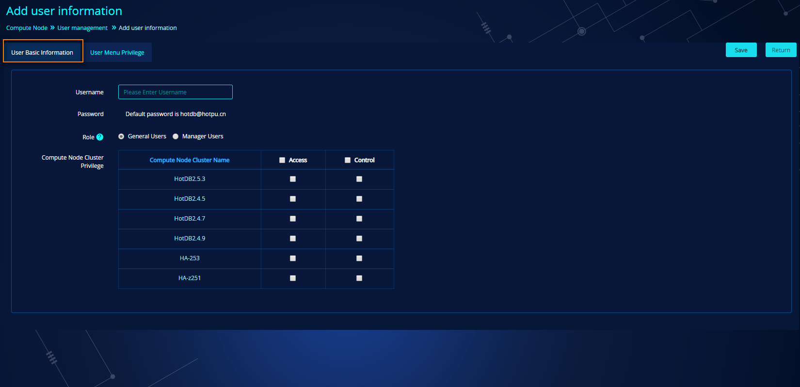

**User Menu Privilege:** The menu privileges for users when they enter the cluster management through accessing the general user interface can be configured.

- When there is no special requirement, all menu privileges are granted by default. If it needs to mask the menu of a user, directly remove the checked item from the menu.
- If HotDB Management has been upgraded, the menu privileges of historical platform users need to be checked to see whether the menu privileges in the new version need to be assigned. **Currently, due to the menu function security problem, the new function menu privileges in the new version will not be assigned to historical users by default, and need to be added by the users.**


### User password

**Reset Password:** The users can reset the password when forgetting the login password. The password can be reset with the "Reset Password" button in the operation column via the "[User Management](#user-management)" interface, or by clicking "Reset Password" on the "Edit User Information" page.

**Change Password:** User password change will be required when the users first log into HotDB Management. Later change can be operated in "Personal Information -> Modify User Information" in the upper right corner of the page.

### Login history

The login history displays the history of login and logout of the management platform by all users.

**Function entry:** User Management > Login history


- "Logout time" of the current online user is empty.
- The login history of all users will not be accumulated. A single login and logout is a record, in which a single "online time" is recorded. The user login history can record the user login within 6 months at most.
- Fuzzy search by username and login IP is supported.
- Operations such as "Log out", "Automatic exit after timeout" and "Automatic exit after resetting password" during the login will be sensed and recorded by the management platform.

## Cluster management

### Compute node cluster

Cluster management mainly provides users with management operations such as deployment, addition, start-stop monitoring and deletion of compute node clusters.

#### Cluster management record

The cluster management page displays the compute node clusters deployed or added. The compute node cluster name can be searched quickly through the fuzzy search in the upper left corner search box. You can also control the content to be displayed in the cluster table via the Unfold/Hide more on the right side.

**Table field description:**

- Cluster Name: The cluster name of a group of compute nodes, which can be used to distinguish with other compute node clusters. The name is unique throughout HotDB Management. Click the cluster name to enter the "Edit Compute Node Cluster" page.
- Cluster Mode: At present, the compute node cluster modes which are supported include the single node, master/slave node and multi-node modes. For details, please refer to the [Glossary](glossary.md) document. The version number of compute node is shown at the bottom of the mode.
- Component Name: The compute node name is used to represent the difference between different compute nodes in the cluster. If the server SSH information is configured for compute nodes in the cluster in the master/slave node mode, the current Keepalived Virtual IP (VIP) mark will be displayed next to the name to facilitate users to quickly understand the location of master compute node in the current cluster.

>!Tip
> 
> **Cluster name color description:** Red indicates that the HotDB Management has stopped monitoring the cluster; yellow indicates that the cluster high availability environment in master/slave mode needs to be rebuilt; and blue indicates that HotDB Management normally opens the cluster under monitoring.

- IP Address: It refers to the server IP deployed by the compute node.
- Service Port: It refers to the port for compute nodes to provide data service to the outside world, which can be modified in the server.xml configuration file.
- Management Port: It refers to the port for compute nodes to provide monitoring management queries to the outside world, which can be modified in the server.xml configuration file.
- Type: The compute node cluster in the master/slave mode can identify the master/slave role of compute nodes. This field has little meaning in single-node and multi-node clusters.
- Compute Node: This field belongs to the cluster deployment information and mainly displays the current running status of compute node service program. If the compute node cluster is not deployed by the current management platform, this field is displayed as NULL.
- High Available Components: This field mainly displays the running status of Keepalived components in the cluster in the master/slave node mode. The LVS virtual IP address (VIP) is displayed when the running status of LVS component is displayed in the multi-node mode cluster. If the compute node cluster is not deployed by the current management platform, this field is displayed as NULL.
- ConfigDB: It displays the running status of configDB used by the compute node cluster. If the compute node cluster is not deployed by the current management platform, this field is displayed as NULL.
- NTPD Time Service: It displays the running status of NTPD Time Service installed on the compute node cluster.
- Data Source: It displays the running status of all data sources in the compute node cluster.
- Deployment Environment Grade: The compute node cluster that successfully performed the "[Deployment Environment Examination](#deployment-environment-examination)" function will display the latest examination grade.
- Cluster Operation: If the cluster is added by the "Cluster Deployment" function on the current management platform, the \[Deployment Topology] button will be displayed in the cluster operation bar. Click to view the component topology framework of the deployed cluster; if the cluster mode is "Master/Slave Node", the operation column will display the \[Rebuilding] or \[Switch] button according to whether the current high availability rebuilding environment of the cluster meets the switching conditions.
- Buttons of \[Switch the active center], \[Remove the IDC], \[Repair the IDC] can be seen in the cluster with DR mode enabled and conditions satisfied. You can refer to the [Cross IDC Disaster Recovery Management](cross-idc-disaster-recovery-management.md) document.


**Function button description:**

- Deploy Cluster: Deploy a complete set of compute node clusters from 0. For details, please refer to the [Installation and Deployment](installation-and-deployment.md) document
- Add Cluster: Manually add compute node cluster (the compute node has been deployed offline) information of HotDB Management
- More->Start Monitoring: Restart the monitoring of compute node clusters whose monitoring has been stopped (the cluster name is displayed on a red background)
- More->Stop Monitoring: If the monitoring of compute node clusters under monitoring is stopped, HotDB Management will stop monitoring the cluster status. The cluster not under monitoring cannot be viewed by the user when logging into the general user role page.
- More->Delete Cluster: Delete the managed compute node cluster on the page.
- More->IDC Switching Drill: you can refer to the [Cross IDC Disaster Recovery Management](cross-idc-disaster-recovery-management.md) document.

#### Add cluster

Because the compute node clusters manually deployed by some users offline need to be added to HotDB Management for management, the cluster management function provides cluster addition. Users only need to fill in the information in HotDB Management according to the filling requirements to complete the management and monitoring of compute node clusters.

Click \[Add Cluster] on the cluster management page to enter the "Add Compute Node Cluster" page.


**Filling instructions:**

**(1) Cluster information**

Select the cluster mode of the deployed cluster, and the input parameters of different modes are different.

The cluster name cannot be duplicated with the current existing compute node cluster name.

The cluster network segment appears as the network segment to which the compute node belongs when the "Cluster Mode" is "Multi-Node". The format is: IP/subnet mask length, for example, 192.168.200.0/24. This parameter can be viewed or modified in server.xml.

The communication port appears as the port used for communication between multiple compute nodes in the deployed cluster only when the "Cluster Mode" is "Multi-Node". This parameter can be viewed or modified in server.xml.

"Set ConfigDB Manually" is not checked by default and is not required to be filled in. Only when the added compute node cannot connect to the management port (usually 3325), the user needs to manually specify the configDB address.

Set ConfigDB Manually specifies that configDB needs to select the configDB replication mode and the configDB address needs to be filled in according to the given example. The configDB username and configDB password refer to the account and password connecting configDB instance.

> !Note
> 
> Any configDB in the replication mode strongly requires that the configDB connection address in server.xml shall be consistent with the IP address of the server where the actual configDB is located. It cannot be configured as 127.0.0.1 or localhost, so as mainly to prevent the risk of misjudging the actual address when the management platform obtains multiple configDB addresses in case that the management platform and the compute node service are not on the same service..

**(2) Compute node**

Different "Cluster Mode" displays different compute node records need to be configured. The "Single Node" mode only needs to configure one record. The "Master/Slave Node" mode needs to configure one master record and one slave record. The "Multi-Node" mode needs to configure at least three records, up to nine records.

The fields with red \* must be filled in, including: compute node name, hostname, username, password, service port and management port

The fields without red \* may not be filled in, but when **the compute node cluster is in the master/slave mode**, users are recommended to fill in these parameter values because they may be used for high availability rebuilding and high availability switch later.

After filling in the compute node name, test whether the compute node can be connected via the \[Test] button. The connection exception and successful connection are shown in the following figure:


When the number of existing compute node clusters (including those with stopped monitoring and normal monitoring) has reached the number of available compute node clusters authorized by the platform license, if you click \[Add Cluster] on the cluster management page, it will prompt: `"Add is not allowed because the number of available compute node cluster groups authorized by the platform is exceeded."`

> !Note
> 
> for more notes on DR mode and multi-node mode, you can refer to the supporting documents including [Installation and Deployment](installation-and-deployment.md), [Cross IDC Disaster Recovery Deployment](cross-idc-disaster-recovery-deployment.md).

#### High availability switch

In the master/slave mode cluster, if the cluster meets the high availability switch conditions, click the \[Switch] button in the "Cluster Operation" column of cluster record to manually perform the Master/Slave switching operation of compute node.


**High availability switch operation instructions**

High availability switch mainly includes four steps: Confirmation of SSH and Configuration File Location, Pre-inspection of Switching, High-availability Switching, and Switching Complete. It is not allowed to proceed to the next step when the previous step is not completed, and the completion of all steps represents the success of high availability switch.

**(I) Confirmation of SSH and configuration file location**


- This step mainly confirms whether the SSH connection information and configuration file (server. XML and keepalived. conf) storage address of master/slave compute node configuration is filled in correctly.
- SSH login mode may choose Login with User Password or Sign in without Password, the information will be saved after successful connection, and the information will not be saved if one-time login is chosen.
- The current logged-in user must have the read-write access privilege of master/slave configuration files.
- If the SSH Sign in without Password mode is chosen, the server where HotDB Management is located must set the public key of the account started and copy it to the server to be accessed. (Note: The user who can sign in without password must be consistent with the server user who starts the management platform currently).
- If the current connection account has the Sign in without Password privilege, even if Login with User Password is selected and wrong password is entered, the login will be successful and priority will be given to the judgement of whether there is Sign in without Password privilege. The check of password will be filtered directly if there is Sign in without Password privilege.
- The configuration file directory shall be consistent with the real service directory, otherwise the connection test will fail.
- If the SSH information and the configuration file address of compute node are configured in "Add Cluster", the page information will be displayed automatically. It only needs to click \[Connection Test] to verify the information correctness.
- Only when SSH information and configuration file address pass the test, the \[Next Step] button can be clicked normally to proceed to the next step.

**(2) Pre-inspection of switching**


- Click \[Start Detection] to check whether the current cluster high availability environment meets the requirements before high availability switch.
- This step requires all detection items to pass the test before proceeding to the next step. Otherwise, it is necessary to manually intervene to solve the abnormal problem of the failed item.

**(3) High-availability switch**


- This step is a high availability switch execution step. The high availability switch is successful only when all execution items are completed normally.
- The slave compute node randomly will be set before switch (no setting for below V2.4.8). After the switch is successful, the setting will be canceled automatically.
- The "Automatically rebuild high available environment after switch" on the page will be automatically ticked, that is, the program automatically rebuilds the environment after the switch is completed to satisfy the next high availability switch operation without manual rebuilding.
- If the execution fails, manual intervention is needed to check and solve the problem.

**(4) Switch complete**


Reaching this step means that the high availability switch has been completed. The current VIP drift position and the opening and closing of master/slave compute node service port can be viewed.

#### High availability reconstruction

The master/slave mode clusters identify the master/slave role mainly through the server.xml and keepalived.conf configuration files. The high availability switch only allows the switch from the Master role to the Slave role. After the failover or manual switch of compute node, in order to ensure the compute node can be smoothly switched back in the next failure, high availability reconstruction must be performed to ensure correct master/slave compute node configuration.


The master/slave mode cluster not meeting the high availability switch condition displays the \[Rebuilding] button in the "Cluster Operation" bar. At the same time, the cluster name will display an alert with a yellow background.

**High availability reconstruction instructions**

Click the \[Rebuilding] button to enter the high availability reconstruction process. The process is divided into four steps: Confirmation of SSH and Configuration File Location, Environmental Rebuild Inspection, Rebuild the High Availability Environment, and Rebuild Complete.

**(I) Test of SSH and configuration file location**


Before configuration test, attention shall be paid to the following points:

- If the SSH login information or configuration file information has been configured in [Add Cluster](#add-cluster), the high availability environment reconstruction page will fill in the relevant information by default.
- SSH login mode may choose Login with User Password or Sign in without Password; the information will be saved after successful connection, and the information will not be saved if one-time login is chosen.
- The current logged-in user must have the read-write access privilege of master/slave configuration files.
- If the SSH Sign in without Password mode is chosen, the server where the distributed transactional database platform is located must set the public key of the account started and copy it to the server to be accessed. (Note: The user who can sign in without password must be consistent with the server user who starts the management platform currently).
- If the current connection account has the Sign in without Password privilege, even if Login with User Password is selected and wrong password is entered, the login will be successful and priority will be given to the judgement of whether there is Sign in without Password privilege. The check of password will be filtered directly if there is Sign in without Password privilege.
- The configuration file directory shall be consistent with the real service directory, otherwise the connection test will fail.
- Enter the correct configuration information, the connection test will be successful and the corresponding configuration will be saved to the compute node cluster synchronously. Click \[Next Step] to enter the environment reconstruction detection page. If the current page information does not pass the test, the operation button for the next step cannot be triggered.

**(2) Environment rebuild inspection**


Attentions shall be paid when clicking \[Start Detection]:

- The detection will be stopped if any item fails, and the cause of detection failure can be located and processed according to the failure error information.
- Config Checking mainly checks whether the configuration is reasonable and whether the configuration used in the memory is consistent with that in the configDB. If an inconsistency is detected, it can be processed by reloading, which is a feasible but not unique method.
- When the detection is completed, click \[Next Step] to enter the high availability environment reconstruction page. If the current page information fails the detection, the \[Next Step] button cannot be triggered.

**(3) Rebuild the high availability environment**


The reconstruction is mainly to modify the relevant configuration information as follows:

- Modify the (haState, haNodeHost) role information in the master/slave compute node server.xml
- Modify the master/slave keepalived configuration files. The keepalived configuration file modification points are as follows:


Notes for high availability reconstruction:

- Click \[Start Execution]. The execution will be stopped if any item fails, and the cause of execution failure can be located and processed according to the failure error information.
- For the modification of server.xml configuration by the reconstruction process, if the actual deployed environment management network and the running network are separate, the haNodeHost configuration may have incorrectness risks, in which case manual intervention is needed because the server connection IP is currently used.
- When the reconstruction is completed, click \[Next Step] to enter the high availability environment reconstruction page. If the current page information is not completed or the execution fails, the \[Next Step] button cannot be triggered.

**(4) Rebuild complete**


- When the high availability reconstruction is completed, the master/slave compute node services are running normally. Click \[Immediate Switch] and manually perform the [High Availability Switch](#high-availability-switch) operation to complete the reconstruction page.

#### Switching, removal and repair of IDC

With DR mode enabled, the visualized switching, removal and repair of IDC can be performed in the qualified clusters by the management platform. For details, you can refer to the [Cross IDC Disaster Recovery Management](cross-idc-disaster-recovery-management.md) document.

#### IDC switching drill

With DR mode enabled, the visualized IDC switching drill can be performed in the qualified clusters by the management platform. For details, you can refer to the [Cross IDC Disaster Recovery Management](cross-idc-disaster-recovery-management.md) document.

### Single Component Deployment

Single Component Deployment provides HotDB Management users with the function of installing and deploying a single component, which makes up for the defect that a component cannot be installed separately in cluster deployment function. For specific function description and operation steps, please refer to the [Installation and Deployment](installation-and-deployment.md) document.

### Deployment environment examination

Deployment grade Examination is a set of operation environment examination grade functions tailored specifically for HotDB Server clusters. Users can use this function to evaluate the environment of clusters installed manually or deployed through the management platform. After the evaluation, it displays the results of nearly 140 examination sub-items of the whole cluster in five dimensions, and supports the export of examination result records.

**Function Entry:** Login Management User Interface->Compute Node Cluster->Deployment Environment Examination

**Examination dimension:**

| Examination dimension       | Examination item                         |
|-----------------------------|------------------------------------------|
| Hardware resource           | Server attribute                         |
| ^                           | Disk space                               |
| ^                           | Disk IO response time                    |
| ^                           | Memory                                   |
| ^                           | CPU                                      |
| ^                           | Network quality                          |
| Operation system            | periodical scheduling                    |
| ^                           | sysctl.conf                              |
| ^                           | Time synchronization                     |
| ^                           | Can be connected to the external network |
| ^                           | Firewall and selinux                     |
| ^                           | yum                                      |
| ^                           | Time zone                                |
| ^                           | tune                                     |
| ^                           | limits.cnf                               |
| ^                           | Character set                            |
| ^                           | SSH connection                           |
| Software deployment         | Backup program                           |
| ^                           | MySQL client                             |
| ^                           | MySQL server                             |
| ^                           | Java environment                         |
| Software configuration      | MySQL connection                         |
| ^                           | MySQL high availability                  |
| ^                           | Compute node startup script              |
| ^                           | ConfigDB                                 |
| ^                           | MySQL disk space                         |
| ^                           | MySQL parameter configuration            |
| ^                           | MySQL user privilege                     |
| ^                           | server.xml                               |
| ^                           | Compute node high availability           |
| ^                           | Monitoring port                          |
| Basic function verification | Data source high availability switch     |
| ^                           | Compute node high availability switch    |
| ^                           | LogicDB privilege                        |
| ^                           | Backup program                           |
| ^                           | 10 s performance test                    |

**Examination panel:**


**Examination panel content description**

The examination panel displays an overview of cluster reports that have been successfully examined recently.

- **Score:** The left score ball is the total examination score. Scores are obtained from the examination results of cluster examination items. The total score is 100. If the corresponding examination item in examination does not meet the evaluation criteria, the score of this item will be deducted. If the examination item meets the evaluation criteria, no score will be deducted or added. When the total score is deducted or the score deducted is greater than 100, the examination score is 0.
- **Examination item:** The examination item is the number of items needing examination in the compute node cluster examination. Different modes of compute node clusters or different replication modes of MySQL data sources will affect the number of examination items. Unqualified items in the figure above are items not meeting the evaluation criteria. Warning items are items that do not involve deduction but need attention in physical examination, and qualified items are items meeting the evaluation criteria.
- **Radar chart:** Radar chart displays the deduction in five dimensions in examination. The less points deducted in the dimension, the closer the highlighted part is to the edge of radar chart, which indicates a good examination result in the dimension. Move the mouse cursor cursor into the radar chart to view the detailed deductions in each dimension and the percentage of total examination item score in the dimension.

**Start environment examination:**

Click \[Environment Examination] button on the deployment environment examination page to Start the cluster running environment examination task. After the initiation, the compute node cluster needing examination can be selected (the clusters not under monitoring do not support initiating examination, and such clusters will be automatically filtered in the cluster selection drop-down box). After submitting the task, the current cluster environment will be pre-detected, and the task initiation will fail if the pre-detection fails.

**Pre-detection item**

1. All servers in the cluster are configured with available SSH information and the user is root or is configured with sudo operation privilege.
2. All related component programs in the cluster run normally
3. The cluster is configured with at least one data node and one logicDB

> !Note
> 
> The status detection of all related component programs in the cluster depends on a 2-minute periodic detection task, so there may be a 2-minute detection error between the current detection status and the actual component status.

**Examination report detail:**

A successful examination task will generate a examination report. Click  detail button in the task record operation column to access the "Examination report detail page".

**Examination report description**

The examination report defaults to display unqualified and warning examination items. Click different dimensions to expand the detailed examination item information of the dimension. The red and orange dots that appear in each dimension heading represent unqualified and warning examination items in the dimension. Each tab in the dimension is a specific examination item in the dimension. The red and orange markings in the upper right corner of the Tab represent the same meaning with that of the above dots.

- Examination item: specific examination item in the dimension
- Examination result: the examination results of examination items include Unqualified, Warning and Qualified
- Deduction: the actual deduction of the examination item
- Exception object: instances of servers or applications not meeting the evaluation criteria of examination items
- Prompt: unqualified and warning examination items inform users of the risks that exist or suggestions
- Evaluation criteria: the program evaluation criteria for judging whether an item passes the detection


> !Note
>
> The deployment environment examination function has no requirement for HotDB Server version. However, when the Server version used for examination is below 2.5.3, the "10 s performance test" and "master/slave or MGR configDB data consistency" examination items are not supported.

## Instance management

This function is used to view and manage the master-slave relation of the instances of data sources in all compute node clusters. The instance information can be filtered by hostname, port and MySQL version.

### Instance management information

**Function Entry:** Login Management User Interface -> Instance Management


The instance management information displays a record in the form of a MySQL instance, and performs operations such as "Remove Master", "Add Slave", and "Setup High-privilege User" of specific MySQL instances.

- **Remove Master:** Click \[Remove Master] to stop the replication of this instance and perform the operation of clearing replication information (stop slave; reset slave all;).

- **Add Master:** Click \[Add Master] to add a slave to this instance and set this instance as a host when performing a "change master" operation on the slave. When selecting a slave, only instances without master can be selected and instances have been configured with master shall first remove the Master.

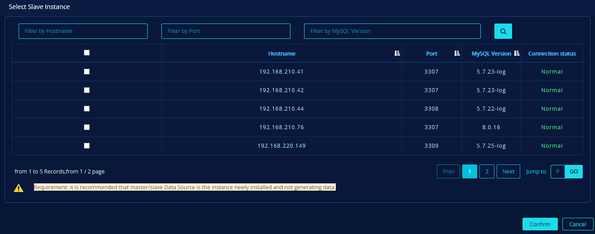

- **Setup High-privileges User:** Mainly used for users configured with "change master/slave" privileges to perform "Remove Master" and "Add Slave" operations. High-privilege users need to have "super, replication slave, replication client, create user, reload" privileges. If the data source does not have these privileges, they need to be added to the instance.


Click the \[Replication] button to replicate and add the SQL statement of high-privilege user to the instance for execution.

"Master/Slave Replication Username" and "Master/Slave Replication Password" are users created automatically when a master/slave relation is created for an instance by a high-privilege user. By default, the `hotdb_repl` replication user with password of `hotdb_repl` and only the `replication slave, replication client` privilege is created. Users can also customize the username and password for the created replication user.

## Audit logs

The audit logs of the management user interface is mainly used to view the HotDB Management operation records of the management user, and to view the basic operations of general users in all managed compute node clusters.

### Manager operation

The operation of all manager users on the management platform can be viewed. The type of operation can be viewed in the operation type drop-down box on the page. Access IP and operation content supports fuzzy query.

**Function Entry:** Login Management User Interface->Audit Logs->Manager Operation


**Table information description:**

- Username: The user used to login to the management platform.
- Access IP: The local IP used to login to the management platform. It supports fuzzy query.
- Operation Type: All supported types are displayed in the drop-down box. After checking the checkbox, only logs of the selected operation type are displayed.
- Operation Content: Record the user's real operation and important parameters, and support fuzzy query.
- Input Parameter: More detailed user operation logs for easy analysis of user operations.
- Operation Time: Record the actual operation time, and support the selection of time range to display log records. The time range of record here is determined by the default retention days in the settings.
- Operation Result: Record the actual operation results. Log records can be filtered by the operation results.

### General user operation

The operations of all general users on the management platform can be viewed. The log records of all compute node groups are displayed by default. Check the drop-down box to filter the log information of compute node groups can be viewed, including Platform Operation, Safety Protection and Management Port Operation, which are consistent with the view mode of general user login.

**Function Entry:** Login Management User Interface->Audit Logs->General User Operation


#### Platform operation

The operations of all general users on the management platform can be viewed. The operation type specifically recorded can be viewed in the operation type drop-down box on the page. Access IP and operation content input boxes support fuzzy query. If the compute node group is selected, only the operation records of the selected compute node group are displayed, and all compute node groups are displayed by default.


**Table information description:**

- Group Name: The name of the compute node group queried.
- Username: The user used to login to the management platform.
- Access IP: The local IP used to login to the management platform. It supports fuzzy query.
- Operation Type: All supported types are displayed in the drop-down box. After checking the checkbox, only logs of the selected operation type are displayed.
- Operation Content: Record the user's real operation and important parameters, and support fuzzy query.
- Input Parameter: More detailed user operation logs for easy analysis of user operations.
- Operation Time: Record the actual operation time, and support the selection of time range to display log records. The time range of record here is determined by the default retention days in the settings.
- Operation Result: Record the actual operation results. Log records can be filtered by the operation results.

#### Security protection

The operation logs related to security protection performed by all general users can be viewed. The operation type specifically recorded can be viewed in the operation type drop-down box on the page. Access IP and Intercept Details input boxes support fuzzy query. If the compute node group is selected, only the operation records of the selected compute node group are displayed, and all compute node groups are displayed by default. A specific compute node can be selected, and all compute nodes are selected by default.


**Table information description:**

- Group Name: The name of the compute node group queried.
- Username: The user used to execute the operation.
- Access IP: The local IP used to perform the operation. It supports fuzzy query.
- Intercept Type: All supported types are displayed in the drop-down box. After checking the checkbox, only logs of the selected operation type are displayed.
- Intercept Details: Record the commands executed. It supports fuzzy query.
- Operation Time: Record the actual operation time, and support the selection of time range to display log records. The time range of record here is determined by the default retention days in the settings.
- Operation Result: Record the actual operation results. Log records can be filtered by the operation results.

> !Note
> 
> If the compute node version is below V2.5.0, the page does not display the security audit log record.

#### Management port operation

The operation records of all general users on the management port can be viewed. The operation type specifically recorded can be viewed in the operation type drop-down box on the page. Access IP and Intercept Details input boxes support fuzzy query. If the compute node group is selected, only the operation records of the selected compute node group are displayed, and a specific compute node can also be selected. All compute nodes are selected by default.


**Table information description:**

- Group Name: The name of the compute node group queried.
- Username: The user used to login to the management port.
- Access IP: The IP used to login to the management port.
- Operation Type: All supported types are displayed in the drop-down box. After checking the checkbox, only logs of the selected operation type are displayed.
- Operation Command: The command actually executed on the management port.
- Operation Time: Record the actual operation time, and support the selection of time range to display log records. The time range of record here is determined by the default retention days in the settings.
- Operation Result: Record the actual operation results. Log records can be filtered by the operation results.

> !Note
> 
> If the compute node version is below V2.5.0, the page does not display the management port operation audit log record.

## Tool

### License management

Provide users with operations such as platform license, compute node license, update license and obtain the existing license information.

#### Platform license

##### Update entry

- "License Management" in the [Tool](#tool) menu under admin role.


- The "[license management](#license-management)" hyperlink in the "certified" menu of management platform.


##### Generate fingerprint

- Enter the license management page, select \[Generate license] for operation type, select \[Platform license] for license type, and click \[Generate].


- Click the \[Download Fingerprint File] hyperlink to download the fingerprint file (the fingerprint file is saved under the directory hotdb-management/keys by default, and the format is: management-fingerprint-year-month-day-hour-minute-second).

- Fill in the information of the applicant and license properties (not required), and copy the application information.


- Click the default address hyperlink of supplier（[service@hotdb.com](mailto:service@hotdb.com)）, and call the local mailbox.


- Paste the application information to the email, upload the fingerprint file to the email attachment and send it to the supplier to obtain the new license file.


##### Update license

- Enter the license management page, select \[Update license] for operation type, select \[Platform license] for license type, and click \[Select] to upload the license file.

- Click \[Update] to update the license, and then refresh the page to make the new license take effect.


- When the name of the newly uploaded license file is consistent with that of the currently used license file, click \[Update], it will prompt that license file already exists and whether to replace it. Click \[Confirm to replace] to replace the existing license file and enter the Update process.


##### Obtain existing license information

Enter the license management page, select \[Obtain the existing license information] for operation type, select \[Platform license] for license type, and click \[Acquire] to obtain the existing license information.


The license information is as follows:

- file: license file name
- serial number: serial number of license file
- type: license type, example: OFFICIAL, TRIAL
- Num of available compute node cluster groups: number of available compute node cluster groups. 0 means that there are no restrictions
- Num of compute nodes available in each cluster: number of compute nodes available in each cluster. 0 means that there are no restrictions
- module limit: module limit (can be ignored temporarily)
- create time: create time
- customer info: customer info

When there are multiple license files in the management platform, the license marked in blue is the license currently being used.


##### Other instructions

**(1) The default address of the supplier can be configured.**

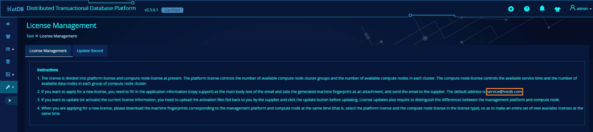

Connect to the ConfigDB of management platform, and configure SQL for the first time as follows:

```sql
insert into hotdb_setting values('emailAddress',1,'your_email@xx.cn',1,1);
```

The SQL configuration is changed as follows:

```sql
update `hotdb_setting` set `value` ='new_email@xx.cn' where `key`='emailAddress';
```

**(2) Notes on updating platform license**

- Manual tampering with the license file will invalidate the license.
- Manual tampering with the license dependency package will result in failure to update the license.
- If the the user has no privilege for management/keys directory, the license update will fail.
- Uploading unauthorized file updates will result in failed license update.
- If the number of available cluster groups of the new license is less than the number of existing cluster groups, the update will fail.
- If the number of available compute nodes in each cluster of the new license is less than the number of existing compute nodes, the update will fail.
- After the new license is updated, the old license will not be deleted, but transferred to the management/databak/keys directory of the management platform.

**(3) Restrictions of platform license on single-IDC deployment**

If the number of existing compute node clusters (including those with stopped monitoring and normal monitoring) has reached the number of available compute node cluster groups authorized by the platform license, the user has enabled the "Automatically generate basic configuration" and the started list includes clusters recorded in the high availability setup of compute nodes, then click \[Enable with one click] on the single-IDC deployment page, and a pop-up window will be displayed: "It is not allowed to start and generate basic configuration because the number of available compute node cluster groups authorized by the platform is exceeded."


**(4) Restrictions of platform license on cluster deployment**

In normal mode deployment, when the number of compute node cluster groups has reached the number of available compute node cluster groups authorized by the license, a prompt of 3s will be given when clicking \[Parameter configuration]: Cluster addition through parameter configuration is not allowed because the number of available compute node cluster groups authorized by the platform is exceeded.


The deployment of the master center in the DR mode is the same as that in the ordinary mode. That is, when the number of the current compute node cluster groups has reached the license limit, the deployment of the master center will not be allowed.
Because the deployment of the DR center in the DR mode is in the same cluster group with the master center, the deployment of the DR center is not limited by the number of compute node cluster groups, but limited only by the number of available compute nodes in each group.
The deployment of DR center is limited by the number of available compute nodes in each cluster. When the number of remaining available compute nodes is less than the number of compute nodes in the DR center to be deployed, deployment is not allowed.


**(5) Restrictions of platform license on cluster editing**

When the number of compute nodes in the group has reached the number of available compute nodes in each cluster of the license limit, click \[Add compute nodes], it will prompt: Add is not allowed because the number of available compute nodes authorized by the platform is exceeded.


When DR mode is enabled on the Edit Compute Node Cluster page, if the number of compute nodes in the group exceeds the number of available compute nodes in each group limited by the license, the current cluster will not be saved when you click \[Save], and it will prompt: "Add is not allowed because the number of available compute nodes authorized by the platform is exceeded."


#### Compute node license

##### Update entry

- "License Management" in the [Tool](#tool) menu under admin role.


- "License Management" in the [Tool](#tool) menu under general role.


- The "license management" hyperlink in the "certified" menu of management platform under general role.


##### Generate fingerprint


**Step 1:** select the \[Compute node license] for License Type;

**Step 2:** select the \[Generate fingerprint] for Operation Type;

**Step 3:** select the \[Compute Node Cluster] and \[Hostname] to be operated and execute on all servers of all compute nodes in the cluster. Then fill in the SSH connection information of the corresponding server;

**Step 4:** click \[Connection Test] to check the availability of SSH information. Only through SSH connection test can follow-up operation be carried out;

**Step 5:** click \[Generate] to generate the fingerprint;

**Step 6:** after the fingerprint is generated successfully, the corresponding prompt will be output in the information column, and you can click \[Download Fingerprint File];

**Step 7:** if you want to apply for custom license information, you can fill in the information of the applicant and license properties (not required);


**Step 8:** click \[Copy the above application information] to copy the filled information to the cutting board;

**Step 9:** click the hyperlink of the email address, the existing local mailbox will be automatically opened. Paste the information copied in the previous step into the email body, and send the email with fingerprint file as an attachment to the supplier.


##### Update license


**Step 1:** select the \[Compute node license] for License Type;

**Step 2:** select the \[Update license] for Operation Type;

**Step 3:** select the \[Compute Node Cluster] and \[Hostname] to be operated and execute on all servers of all compute nodes in the cluster. Then fill in the SSH connection information of the corresponding server;

**Step 4:** click \[Connection Test] to check the availability of SSH information. Only through SSH connection test can follow-up operation be carried out;

**Step 5:** click \[Select] to select license file;

**Step 6:** click \[Update] to check and update the license;

**Step 7:** the corresponding update information will be output in the information column;

##### Obtain existing license information


**Step 1:** select the \[Compute node license] for License Type;

**Step 2:** select the \[Obtain existing license information] for Operation Type;

**Step 3:** select the \[Compute Node Cluster] and \[Hostname] to be operated and execute on all servers of all compute nodes in the cluster. Then fill in the SSH connection information of the corresponding server;

**Step 4:** click \[Connection Test] to check the availability of SSH information. Only through SSH connection test can follow-up operation be carried out;

**Step 5:** click \[Acquire] to obtain existing license information;

**Step 6:** after successful acquisition, the information all available licenses of the corresponding compute node will be output in the information column, among which the one marked in blue is the license currently being used;

##### Other instructions

- When the compute node version is lower than V2.5.6, the license management activates and updates the license according to the historical logic;

- If the compute node is not running normally, you need to manually specify the installation directory of the compute node. The entered directory needs to end with /. Then click \[Continue to Update];


- If an activation file with the same name is found under the key/ directory of the installation directory of the compute node, it will prompt whether to replace. Click \[Confirm to Replace], the old activation file will be replaced and the new file will be put in the /key directory;


- When the license is updated, the validity of the license will be checked. The check items include whether the license is available, whether the number of authorized nodes meets the current number of existing nodes, and whether the number of authorized LogicDBs meets the current number of existing LogicDBs. If the new license does not meet the validity check, it will prompt that the update is invalid;


- If sudo mode is used for license management, sudo users and privileges should be configured in advance. In particular, the java environment variables of sudo users also need to be configured.

#### Update record


- The update record is primarily the user's update and authorization operation records of the compute node license and the platform license.

- In update failure records, move the mouse cursor cursor into the failure mark to see the specific reason for failure.

- The record can view the status information of the compute node license and the platform license before and after the update.

- When the license update type is platform license, the column of compute node cluster displays "--";

- The admin user can view all the update records, while the general user can only view the update records of the compute node cluster that he has visited.

### Platform configuration data management

The platform ConfigDB supports the high availability mode. When the platform ConfigDB fails, it can switch to the slave ConfigDB. Function entry: admin > Tool > Platform Configuration Data Management.


#### ConfigDB file management

Add three parameters in the configuration file application.properties: spring.datasource.bakurl/spring.datasource.bakusername/spring.datasource.bakpassword. When spring.datasource.bakurl and spring.datasource.url correspond to the same ConfigDB instance, it is regarded as single-node mode. In high availability mode, the two parameters need to be configured as master and standby master or master and slave respectively.

If the slave ConfigDB is not added through platform cluster deployment or stand-IDC deployment, the replication relation between the master and slave ConfigDBs needs to be built manually. The corresponding types will be displayed on the platform configuration data management page according to the master-master and master-slave replication relation.

**Configure master-master or master-slave type:**

```properties
spring.datasource.url=jdbc:mysql://192.168.210.134:3308/hotdb_cloud_config134?useUnicode=true&characterEncoding=UTF-8&autoReconnect=true&connectTimeout=3000&socketTimeout=3600000&useSSL=false
spring.datasource.username=hotdb_cloud
spring.datasource.password=hotdb_cloud
spring.datasource.bakurl=jdbc:mysql://192.168.210.135:3308/hotdb_cloud_config134?useUnicode=true&characterEncoding=UTF-8&autoReconnect=true&connectTimeout=3000&socketTimeout=3600000&useSSL=false
spring.datasource.bakusername=hotdb_cloud
spring.datasource.bakpassword=hotdb_cloud
```

When starting the management platform service program, if the master ConfigDB is not available, it will fail after reconnection for 30 minutes (reconnection every 10 seconds, timeout for 5 seconds will be judged as failure). If the master ConfigDB is available and the slave ConfigDB is not available, the slave ConfigDB can be reconnected for 10 minutes at most. If it is unable to connect eventually, the slave ConfigDB will be set to "not available" and the master ConfigDB will be started in "available" status.

#### Platform ConfigDB Status and Operation

Users can perform switching, enabling, disabling, deletion and other operations to the platform ConfigDB on the platform configuration data management page.


**(1) Switch**

After the switching of master-master ConfigDB, the original standby master ConfigDB will be updated to the master ConfigDB, and the original master ConfigDB will be updated to the standby master ConfigDB. Parameters in the corresponding configuration file application.properties in spring.datasource.bakurl will be updated synchronously.

**The standby master ConfigDB will be updated to:**

```properties
spring.datasource.url=jdbc:mysql://192.168.210.135:3308/hotdb_cloud_config134?useUnicode=true&characterEncoding=UTF-8&autoReconnect=true&connectTimeout=3000&socketTimeout=3600000&useSSL=false
spring.datasource.username=hotdb_cloud
spring.datasource.password=hotdb_cloud
spring.datasource.bakurl=jdbc:mysql://192.168.210.134:3308/hotdb_cloud_config134?useUnicode=true&characterEncoding=UTF-8&autoReconnect=true&connectTimeout=3000&socketTimeout=3600000&useSSL=false
spring.datasource.bakusername=hotdb_cloud
spring.datasource.bakpassword=hotdb_cloud
```

After the switching of master-slave ConfigDB, the original slave ConfigDB will be updated to the master ConfigDB, and the original master ConfigDB will be updated to the slave ConfigDB, and the slave ConfigDB status will be updated to "unavailable".


**(2) Disable**

Click "Disable", the availability status of the ConfigDB will be updated to "unavailable" and marked in red, the master-slave replication status will be "abnormal", and "Disable" will be updated to "Enable".


**(3) Enable**

Click "Enable", the availability status, master-slave replication status and operation button will be restored to the previous status.

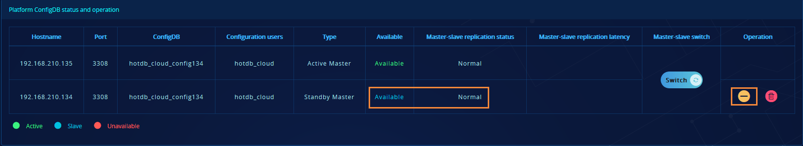

> !Note
> 
> In the single-node mode, there are no switching, disabling, deletion and other operations.
> 
> When the slave ConfigDB is unavailable, the switching operation will prompt that there is no available slave ConfigDB.
> 
> If the replication latency exceeds 10 seconds, it will prompt "the master-slave replication latency of the current ConfigDB exceeds 10 seconds, manual switch is not allowed.".
> 
> 
> 
> When enabling the slave ConfigDB, if the data of the master and slave ConfigDBs are inconsistent, switch is not allowed.
> 
> 

#### Platform configuration backup data

The function supports manual and scheduled backup for the platform ConfigDB and ConfigDB files. For scheduled backup, the backup task is performed by the scheduled plan instead of manual operation.


**(1) Platform server connection configuration**


- Connection configuration is required before backup. The configured server host name must be consistent with the server host name where the service program runs.

- SSH supports password free and sudo mode. After the test connection is passed, the configuration is saved directly, and no filling will be required in the next time.

**(2) Manual backup**

For manual backup, ConfigDB and backup basic data only are selected by default. The format of backup file name is ManagementConfigDatabase+year+month+day+hour+minute+second+backup type. After selecting to backup ConfigDB or ConfigFile, the backup will generate the corresponding backup record.

- When "backup basic data only" is selected, it will prompt that " when only the basic data is backed up, the backed-up tables can be used when the platform recovers the basic data. Special large tables will not be backed up. For example, tables related to functions such as reports, monitoring, intelligent query of operation logs, and compute node logs will not be backed up.".


- When "full backup" is selected, it will prompt that "full backup may take a long time, please be patient."


When "ConfigFile" is selected, the file appalication.properties is mainly backed up. The default format of the backup file name is ManagementConfigDatabase+year+month+day+hour+minute+second+backup type. "Backup to remote simultaneously" is checked compulsorily, and a corresponding prompt will be given when the cursor moves in.


**(3) Scheduled backup**

Add a scheduled backup task, and backup the platform ConfigDB and ConfigFile regularly.


For backup data, you can select ConfigDB and ConfigFile. When "ConfigDB" is selected, you shall select the "Backup range" and "Backup to remote simultaneously"; when "ConfigFile" is selected, you shall fill in the remote backup server information.

#### Backup record & restore

When a manual or scheduled task is performed, the corresponding backup record will be generated. After the backup succeeds, the backup can be restored.


**(1) Backup record**

Backup record includes: Data type, ConfigFile name, Backup range, Starting time, time consuming, Backup to remote simultaneously, backup status. After the backup succeeds, the ConfigDB backup file will be saved in the corresponding data/HotDB_Management_Backup of the management platform, and the ConfigFile will be saved in the /conf directory, as shown in the following figure:

 

During the backup, the backup status displays "backup in progress"; after the backup, the backup status displays "success" or "failure". When the backup fails, it will prompt the specific reason of the failure. If the local backup is successful but the remote backup fails, a warning prompt will also be given, as shown in the following figure:


**(2) Backup restore**

After the backup, find the corresponding record and click Restore to restore the backup.

> !Note
> 
> During the restore, if you perform other operations on the management platform, it will prompt "Operations are not allowed temporarily because the management platform ConfigDB is being restored".
>
> When restoring, if the configuration library of the management platform is changed, you will be prompted that "the currently restored ConfigDB is inconsistent with the original ConfigDB. Are you sure to continue the restore?".
>
> 
> 
> During the restore, if the backup file is deleted, the restore will fail and a prompt will be given "restore file does not exist".

**(3) Backup deletion**

Click Delete to delete the backup record. After deletion, the corresponding backup files in the platform service program directory will also be deleted.

#### Other instructions

**(1) Notice alert**

Click Notice on the top navigation bar and click the [Setting](#setting) button to enable or disable the notice alert of "platform ConfigDB status detection and platform configuration data backup detection".


- When the ConfigDB is in single-node mode, the "platform ConfigDB status detection" will be hidden:

- After the notice alert setting is enabled, the notice alert will give a reminder when the ConfigDB status is abnormal, the replication relations between the master-slave ConfigDBs is abnormal, or the latest backup record shows that the configuration backup is abnormal.


- After the exception is recovered, reminders will disappear automatically.

- With notice alert disabled, no reminders will be given if exception occurs.

**(2) Email alert**

Check ConfigDB replication status and Replication delay, you will receive an email reminder when the ConfigDB status or replication status is abnormal.


- The email reminder for abnormal status of ConfigDB replication is as follows:


- The email reminder for abnormal replication relations of ConfigDB is as follows:


**(3) Cluster deployment**

When the platform ConfigDB is in single-node mode, the switch "Do you want to add a slave for the existing platform ConfigDB" will be displayed on the cluster deployment parameter configuration page; if the current ConfigDB is already in standby master mode or master-slave mode, this switch will not be displayed.


- The deployment version is consistent with the existing platform ConfigDB and cannot be modified.

- The platform ConfigDB being deployed cannot conflict with the existing platform ConfigDB, the deployed compute node ConfigDB or the data source instance.

- If the management platform ConfigDB is deployed, the replication relations of the platform ConfigDB and whether it is built successfully will also be verified during the deployment process.

**(4) Single-IDC deployment**

For the single-IDC deployment, when selecting to deploy compute node or data source servers, the switch "Do you want to add a slave for the existing platform ConfigDB" will be displayed among the ConfigDB MySQL instance options. This option is only displayed when the platform ConfigDB is in single-node mode, and it is checked by default.


After the single-IDC deployment, you can set up platform ConfigDB high availability in the ConfigDB high availability setup.

- By default, replication type and platform ConfigDB instance are not displayed. When "Set up the high available replication relations of the platform ConfigDB" is checked, the select replication type (master-master or master/slave) and ConfigDB instance information are displayed.


- Before setting up replication, data of the original master ConfigDB needs to be imported to the new slave ConfigDB.

- After the setup, you can view the availability status and replicaiton status of the ConfigDB on the "Platform Configuration Data Management" page, and the corresponding configuration files application.properties will also be updated synchronously.

## Upgrade center

The upgrade center provides HotDB Management with the online upgrade function for compute node version. It satisfies the iteration of cross-version or minor version upgrade for single-node, master/slave, multi-node and DR mode cluster. At the same time, it can provide users with automatic rollback protection mechanism when exceptions occur during upgrade process. The program tries to ensure that the cluster is rolled back to the pre-upgrade status to reduce the impact on online services.

**Function Entry:** Login Management User Interface -> "Upgrade Center" in the upper right corner of the page


Click the \[Add Upgrade Task] button to enter the upgrade center to Start an upgrade task. Details are as follows:


- Select the compute node cluster that needs to be upgraded.

After selecting the cluster, the cluster will be automatically checked to see whether it meets the upgrade criteria:

- The cluster is not currently performing upgrade tasks

- The compute nodes of the cluster are configured with available SSH information

- The master/lave mode cluster also needs to verify whether the available configuration file storage address is configured

- Clusters that meet the above upgrade conditions will automatically display information such as "DR mode", "cluster mode", "compute node", "current version", "upgrade version", "status", "log". Different cluster modes will be slightly different besides the basic information.

- When it is in the single-node mode: no other information will be displayed.

- When it is in the master/slave mode, the message "whether to switch back after upgrading" will be displayed. If "Yes", it will switch back to the original master compute node after the upgrading; if "No", the status of the master and slave nodes after the exchange will be maintained (the master/slave high availability switch will be performed during the upgrading)


- When the selected compute node cluster is in multi-node mode, the page will display the "Wait Timeout Setting" (QPS needs to be detected when the multi-node cluster shuts down the compute node service. If it is less than 100, the compute node service will be directly closed. If it is greater than or equal to 100, shutdown will be executed after QPS drops to less than 100). If a custom timeout waiting time or a forced shutdown is set, the program can execute a forced shutdown after the custom time or a direct shutdown without waiting.


- If the selected cluster is a DR mode cluster, the DR mode will be ON, otherwise it is not.

- Users can manually upload the upgrade version or select the existing upgrade package. The upgrade package uploaded manually is stored under the installation directory /bin/upgrades of the hotdb management server by default. If there is no such directory, the program will create one automatically. (the upgrade version package must be no less than the version of the current compute node and no higher than the version of the current HotDB Management)

- If the uploaded version is less than the current existing version, it will prompt "the updated version must be greater than or equal to the current version".


- If the uploaded version is higher than the current version, it will prompt "the updated version can not be higher than the current version".


- Before clicking \[Start Update], the "status" is "wait for update"; after clicking \[Start Update], "status" is "updating"; after the update completed, "status" is "successful update or update failed".

- After clicking the \[Start Update] button, if the current compute node is performing tasks such as High availability switch (Master/Slave Mode only), Reload, Data Backup, Data Recovery, Data Source Migration, Online DDL, Sharding Plan Online Modification, Unfinished Transaction, the pre-service detection will not be passed and the upgrade task will fail directly.

- After satisfying the legitimate upgrade logic, click \[Start Update] to perform the upgrade task. During the execution of upgrade task, the log box will display the upgrade task log in real time. You can download the detailed update log to view more detailed log info.


- Clusters that fail to upgrade will perform a rollback process, and the program will try to restore the cluster to the status before initial upgrade. If the rollback fails, manual intervention is required to restore the cluster. In case of manual intervention, **Detailed Update Log** can be used to view the commands executed by the program and the stage of upgrade or rollback to help restore the cluster.


> !Note
>
> It supports the version upgrade of the compute nodes with NDB services installed. During the upgrade process, the management platform automatically copies the NDB installation directory of the former compute node to the directory of new compute node version. After the upgrade, the NDB service remains the same as before. Note that in this process the NDB version will not be upgraded.
>
> During the upgrading, check whether the current version to be upgraded is greater than or equal to v2.5.6, and whether the version currently in use is less than v2.5.6. If so, there will be an upgrade entry for JDK version and authorization file.
>
> JDK version upgrade: manual upload by default. When "specify the storage directory of existing installation package" is checked, the default directory is /usr/local/hotdb/. Users can also specify the storage directory as needed. When the upgrade fails and rolls back, the upgraded JDK will not be cleaned up, because the JDK version can be compatible with the lower version of the compute node.
>
> 1. When the version of the uploaded update package is greater than or equal to 2.5.6 and the current version of is less than 2.5.6, if you click "start update" after the upload succeeds, a 3s message will appear that "Update is not allowed temporarily, please pay attention to the content of JDK version upgrade", and "JDK version upgrade option" will be given at the same time.
>
> 
>
> 2. If "manual upload" is selected for JDK version upgrade, when the uploaded file does not match "OpenJDK8U-jdk_x64_linux_hotspot_8u252b09.tar.gz", it will prompt that "the uploaded file does not meet the standard, please upload again". 3) When the uploaded JDK file does not meet the standard, if you still click "Start Update", a 3s message will appear that "Update is not allowed temporarily, please pay attention to the content of JDK version upgrade".
>
> 
>
> 3. When "specify the storage directory of existing installation package" is selected for "JDK version upgrade", if no JDK upgrade matching file is found in the corresponding directory, click "Start Update", a 3s message will appear that "No matching file is found in the directory corresponding to JDK version upgrade, please fill in again".
>
> 
>
> license file upgrade: the self-developed license starts to be used in v2.5.6, and the license file is in the keys directory by default. In upgrading, it is necessary to ensure that the authorization is available and the number of authorized nodes is not less than the number of existing nodes and the number of authorized ConfigDBs is not less than the number of existing ConfigDBs.
>
> 4. When the user uploads the authorization file, if it is invalid (that is, the new authorization is not available or the number of authorized nodes is less than the number of existing nodes，the number of authorized ConfigDBs is not less than the number of existing ConfigDBs), a warning will be given on the page "the authorization uploaded by the compute node is invalid, please re-upload available new authorization license file". when the uploaded update package, JDK version and license of the compute node are valid and available, the upgrade page is as follows
>
> 

## OEM management

To facilitate the replacement of the product logo and product name of the management platform, OEM management is introduced to provide an entry for visualized updating of logo and product name.

**Function entry:** manager users can enter the function page through the hyperlink of OEM management after logging in to the platform. The hyperlink path is http://192.168.240.147 :3324/page/ index.html?page=oem, i.e. url of the original page plus ?page=oem.


### Modify the system name

Click the edit button of System Name and edit, then click Confirm to save the name. With the system name saved successfully, the name displayed on the management platform login page and the upper left corner of the menu page are modified synchronously.


### Modify the product logo

The preview area displays the default logo image of the management platform, as shown below:


Click \[Upload] to open the file selection window, and select the logo image.


> !Note
>
> the image is required to be no more than 1024KB and the suffix should be ".png/.jpg/.svg". With the image requirements met, the preview area will display the effect picture of the uploaded image, as shown in the following figure:
> 
> 
> 
> 
> 
> The check box "Consistent with the login page" for the navigation bar logo and the browser tab logo is not checked by default. When it is checked, the Upload button will be grayed and cannot be operated, and the corresponding logo preview will display the same as the login page logo.


### Retain the original product information

When it is Yes by default, the logo and copyright declaration of HotDB will be displayed at the bottom of the management platform login page and cluster selection page; when No is selected, the logo and copyright declaration of HotDB will be hidden at the bottom of the management platform login page and cluster selection page. As shown below:


Click Restore the defaults. After the setting takes effect, image files under the logo directory of the management platform will be cleared. Meanwhile, the system name on pages will be reset to the "Distributed Transactional Database Platform"; the logo preview will restore the default logo of the management platform, and the switch Retain the original product information will be changed to yes.


## General user login

### Login

General users are created by the manager user in the "[User Management](#user-management)" of the management interface, and the access mode is the same as that of the manager user.


For general users logging in for the first time, HotDB Management forces the password change and the initial password is `hotdb@hotpu.cn` by default.

### Cluster selection

General users enter the Cluster Selection page after logging into HotDB Management successfully. If the DR mode is enabled, please refer to the chapter "Compute node cluster selection" in the [Cross IDC Disaster Recovery Deployment](cross-idc-disaster-recovery-deployment.md) document for the display and explanation of the cluster selection page.

The compute node cluster displayed is the compute node cluster with access or control privilege owned by the login user. Click on a specific cluster to enter the cluster for viewing and management operations. When the cluster compute node and configDB are running normally, the page icon is green (as shown below) and the cluster can be accessed normally.


When the cluster slave compute node cannot be connected but the configDB is connected properly, the cluster slave compute node is red and abnormal.


When the configDB cannot be connected and the compute node is running normally, the bottom configDB connection will display an exception. When the configDB cannot be connected partially, move the mouse cursor to the "Partial Exception" to display the specific configDB connection exception information.


When all compute nodes in the cluster and the configDB cannot be connected, the cluster panel is displayed in red. When clicking on the cluster panel with the mouse, "Unable to connect" will be displayed and it is unable to enter the cluster.


## Home

HotDB Management displays real-time user-concerned information such as data volume, access flow, cluster component status, warning event, and security prevention and control of compute node cluster in the home page function through data visualization.


### Cluster security


- **Email Notification:** Judge according to whether the monitoring switch in the notification setting is turned on, which can be divided into: Enable All, Not Enable and Partially Enable. Click to jump to the notification setting page.
- **System Periodical Detection:** Judge according to whether all switches on the periodical detection setting page are turned on, which can be divided into: Enable All, Not Enable and Partially Enable. Click to jump to the periodical detection setting page.
- **White List:** Judge according to the actual switch state of the white list function, which can be divided into: ON and OFF. Click to jump to the white list page.
- **SQL Firewall:** Judge according to whether the SQL interception status of SQL firewall is enabled or not, which can be divided into: All ON, Partial ON and OFF. Click to jump to the SQL firewall page.

### Summary of important information


- **Table:** The first row "Table Configuration" is the number of all tables on the [Table Configuration](#table-configuration) page, and the second row "Definition Warning" is the number of tables detected to be abnormal in the "Table Structure＆Index Detection".
- **Optimization:** The first row "SQL Log" is the number of SQL records recorded in the [Slow Query Log Analysis](#slow-query-log-analysis) function of HotLog Management. The second row "Slow SQL" is the SQL marked with  in the [Slow Query Log Analysis](#slow-query-log-analysis) function of HotLog Management. ("SQL Log" and "Slow SQL" are displayed are not enabled when the Slow Query Log Analysis does not enable SQL statistics)
- **Backup:** The first row "Totals of Backup" is the number of all backup records in the "Backup Task" function of HotDB Management, and the second row "Failure Backup" is the number of task records with backup status as "Backup Failed".
- **Log:** The first row "Cluster Log" is the total number of logs in the "Compute Node Log" function of HotDB Management. The second row "Unread" is the number of logs with status as "Unread" in the compute node log. When the number of logs is greater than 999, the page displays 999+.

### Data node throughput


Display the real-time throughput of all data nodes in the cluster. Throughput types include: SELECT/INSERT/UPDATE/DELETE/OTHER. Click on the title to jump to the "Data Node Throughput" report function page.

### Event notice

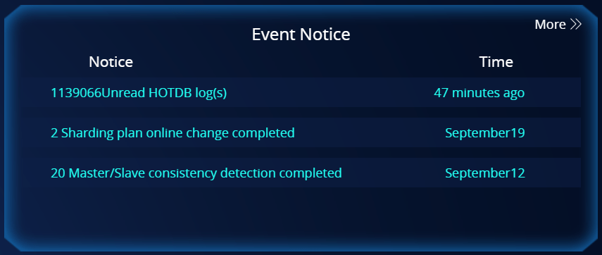

The events are the history events with event warning mark in the upper right corner of HotDB Management. Click \[More] to link to "Historical Event" for more notice details.

### Cluster throughput


Display the number of transactions per second (TPS: Transactions Per Second) and the query per second (QPS: Query Per Second) in the cluster.

- The "Cluster Throughput" displayed by clusters in multi-node mode is the sum of all compute nodes.
- Extra-transaction TPS does not count SELECT operations, and intra-transaction SELECT/UPDATE/DELETE/INSERT will be counted.
- QPS does not count transaction statements such as "begin, commit".
- Click on the title to link to the "Compute Node Flow" function page.
- Page data refreshing rate is 3 seconds

### Overview of data amount and throughput

#### Client throughput today


The client throughput is the operations (SELECT, INSERT, UPDATE, DELETE, OTHER) sent by front-end application to compute node

- Display the client throughput data of all compute nodes in the cluster today, which is counted according to the natural day.
- The page refreshing rate is 1 minute.
- The client throughput today is cleared at 0 a.m. every day, and displayed as 0 if no operations are performed on that day.
- Click on the graph to link to the "[Compute Node Throughput](#compute-node-throughput)" report details page.

#### Back-end throughput today


The back-end throughput is the operations (SELECT, INSERT, UPDATE, DELETE, OTHER) sent by compute node to the underlying data node.

- Display the back-end throughput data of all compute nodes in the cluster today, which is counted according to the natural day.
- The page refreshing rate is 1 minute.
- The client throughput today is cleared at 0 a.m. every day, and displayed as 0 if no operations are performed on that day.
- Click on the graph to link to the "[Compute Node Throughput](#compute-node-throughput)" report details page.

#### New data amount today

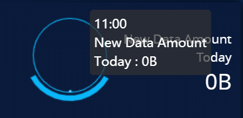

The new data amount today is a description of the change of business data volume in the cluster from 0 a.m. today to the current time. If it is negative, it means that the data amount is less than that at 0 a.m.

- Page data is updated once every hour.
- The data is cleared at 0 a.m. every day.
- Calculation formula: The sum of data amount of all tables in the data source of the cluster minus the data amount recorded before 0 a.m. today.
- Click on the graph to link to the "[Cluster Data Amount](#cluster-data-amount)" report details page.

#### Total data amount


Display the current total data amount of all data nodes in the cluster, that is, the sum of data amounts of all tables in the normal data source.

- Page data is updated once every hour.
- Only the data amount of master data source in the current data node is obtained.
- Click on the graph to link to the "[Cluster Data Amount](#cluster-data-amount)" report details page.

### Sharding grade


It uses grading to reflect the sharing advantages and disadvantages of the sharding table in the cluster. When the compute node starts for less than 24 hours, the grade cannot be calculated and the page is not displayed. Click on the title to jump to the "[Sharding Grade](#sharding-grade)" details screen. The grade trend graph displays the changes of the recent sharding rationality grade, which can be viewed by day and by hour.

### TOP 10 table today


Display the top 10 business tables with the largest change in daily data amount and the highest throughput in the cluster.

- TOP 10 data amount change is ranked by the absolute value of table data added or reduced.
- The data amount of the global table is the average of data amounts of the master data source under each data node.
- The data amount of the sharding table is the sum of data amounts of the master data source under all data nodes.
- Click on the "TOP 10 Table Throughput Today" area to link to the "[Compute Node Throughput](#compute-node-throughput)" report details page; and click on the "TOP 10 Data Amount Table Today" area to link to the "[Cluster Data Amount](#cluster-data-amount)" report details page.

### Throughput rate


Display the operation frequency of the real-time front-end (sent by front-end application to compute node) and back-end (sent by compute node to data node) SELECT, INSERT, UPDATE and DELETE in times/s.

- Page data refreshing frequency is 3 seconds.
- Calculation method: The operation frequency per second is obtained by dividing the operation increment in the fixed time by the interval time.
- Multi-node mode cluster operation increment is the sum of all compute nodes in the cluster.
- Click on the "Front-End Throughput Rate" area to link to the "[Compute Node Throughput](#compute-node-throughput)" report details page; and click on the "Back-End Throughput Rate" area to link to the "[Data Node Throughput](#data-node-throughput)" report details page.

### Cluster overview

**Overview of master/slave node mode clusters:**


**Overview of multi-node mode clusters:**


- Cluster Starting Time: Display the actual starting time of the current master compute node.
- Cluster Running Time: Display the current running time of the master compute node since starting.
- Compute Node Switch Times: The high availability switch times of compute nodes of master/slave mode clusters or the master switch times of compute nodes of multi-node mode clusters calculated based on the natural year.
- Cluster Availability: It is obtained by dividing the "Failure Recovery Time" by a natural year.
- Failure Recovery Time: The time consumed by high availability switch or master switch of the cluster, that is, the period from failure to availability recovery. The cumulative statistics are made according to the natural year.
- Front-End Application: Display the total number of front-end applications, the front-end applications with the highest connections, and the front-end applications with the highest QPS. The data is obtained from the [Logic Topological Graph](#logic-topological-graph).
- LogicDB: Display the total number of logicDB, the number of logicDB with normal or warning status, and the logicDB with the maximum data amount and the highest throughout. The data is obtained from the [Logic Topological Graph](#logic-topological-graph).
- Data Node: Display the total number of data nodes, the number of data nodes with normal or warning status, and the data node with the maximum data amount and the highest throughout. The data is obtained from the [Logic Topological Graph](#logic-topological-graph).
- Data Source: Display the total number of data sources, the number of data sources with normal or warning or failure status, and the data source with replication latency. The data is obtained from the [Logic Topological Graph](#logic-topological-graph).

## Configuration

Configuration is the function developed by the management platform for visual configuration of HotDB Server, including configuring parameters such as data nodes, data sources, data source groups, logicDB, sharding function, table configuration, database users and compute nodes for HotDB Server. At the same time, the auxiliary functions of configuration parameter verification and backup recovery are set.

### Node management

The node management menu mainly provides users with the management of data source groups, data nodes and data sources, including basic addition, deletion and modification. It can also set up the replication relation or high-availability switching rules of the underlying data sources for the configured data nodes.

If the DR mode is enabled, please refer to the [Node management](cross-idc-disaster-recovery-deployment.md#node-management) chapter in the [Cross IDC Disaster Recovery Deployment](cross-idc-disaster-recovery-deployment.md) document for the node management function display and operation explanations

**Function Entry:** 

Click [Configuration](#configuration) -> "[Node Management](#node-management)" on the management platform page


**Table information description:**

- **DNID:** Data node ID
- **Data Node Name:** Click on the button in the Data Node Name to link to the "[Data Node Management](#data-node-management)" page
- **Data Source_Hostname:** Address of the server where the data source is located
- **Data Source_Port:** Data source MySQL instance port
- **Data Source_Database:** Database in the data source MySQL instance
- **Data Source_Type:** The roles of data source in data node include Active Master, Standby Slave, Standby Master and MGR.
- **Data Source_Status:** The data source statuses include availability and unavailability. The unavailability status is displayed in red font. The data source which is an Active Master and available is displayed in green font. The data source which is a Standby Slave or Standby Master and available is displayed in blue font. The data source available and whose listener fails to connect is displayed in orange font.
- **Operation:** Including "Details", "Enable/Disable" and "Delete" from left to right
- **Master/Slave Status:** The replication status between data sources in data node. Only data sources with master-master or master/slave replication relation will display the master/slave statuses as follows: Building Failed, Building, Abnormal, Unknown and Normal. For a detailed description of the status, please refer to the "[Master/Slave Setup](#masterslave-setup)" chapter.
- **Master/Slave Switch:** The entry for manually performing the high availability switch operation of data source, which only appears in data sources with master-master or master/slave replication relation as with the master/slave status. The master/slave switch depends on the switching rule configured for the data node. For the specific switching rule configuration, please refer to the "[Switching Rule](#switching-rule)" chapter.

#### Add data source group

Add Data Source Group allows to easily add or modify a set of data sources with the same parameter values.

**Function Entry:** 

Click on [Configuration](#configuration) -> "[Node Management](#node-management)" -> "Data Source Group" -> "Add Group" on the management platform page to enter the "Add Data Source Group" function page.

**Function Description:** 

Check the parameter items that need to be used by the data source and have the same parameter values, and then set the parameter values of the checked parameter items. Click the "Save and Return" button to complete the addition of data source group.

**Parameter Description:**

- Group Name: Enter the data source group name
- Connection User: Username with the database access privilege
- Connection User Password: User password with the database access privilege
- Database Name: Database name can be referenced in the data source, such as "db01"
- Backup User: (optional) Username used to back up the database
- Backup User Password: (optional) User password used to back up the database
- Character Set: The character set of database connected, which is utf8mb4 by default
- Max Connections: Maximum connections of the MySQL database, which is 4200 by default
- Initial Connections: Initial connections of the MySQL database, which is 32 by default
- Max Idle Connections: Maximum idle connections of the MySQL database, which is 512 by default
- Min Idle Connections: Minimum idle connections of the MySQL database, which is 32 by default
- Idle Examination Period (second): Idle examination period of the MySQL database, which is 600 by default


#### Add node

Add Node function allows to quickly configure data nodes, data sources and listeners for HotDB Server in the early stage and to configure data sources separately.

**Function Entry:** 

Click on [Configuration](#configuration) -> "[Node Management](#node-management)" -> "[Add Node](#add-node)" on the management platform page to enter the "Add Node" function page.

**Example Description:** 

The Add Node function is displayed taking adding 4 data nodes (dn_01, dn_02, dn_03, dn_04) and 8 data sources (master-master: ds_01, ds_02, single database: ds_03, master/slave: ds_04, ds_05, MGR: ds_06, ds_07, ds_08) for example as follows.


**Generation of example data:**

**Step 1:** Set the parameter value of data node number as 4, and other generated parameters adopt the page default values.

**Step 2:** Click the "Generate" button to generate the data into the list

**Step 3:** Click the  button in the "Operation" column to delete the excessive records generated in the dn_02 data node.

**Step 4:** Modify "Date Source Type" under dn_03 data node to "Standby Slave"

**Step 5:** Click the  button in the "Operation" column of dn_04 data node record to add a record under dn_04.

**Step 6:** Modify "Date Source Type" under three records of dn_04 to MGR


**Configure data source data:**

**Step 1:** Use the previously added data source group and link it to each data source record

**Step 2:** Remove the checked "Automatic Generation" and customize the data sources in turn, which shall not be the same. It is generally recommended to check "Automatic Generation"

**Step 3:** Fill in the hostname, port, connection user, connection password, database name, backup user and backup user password of data source (connection user and password are used for connecting the compute node with the data source which must be filled in; backup user and password are specially used for data source data backup which are recommended to be filled in though as optimal items)

**Step 4:** Enable "Automatic Master/Slave Setup". After adding the data source, the program automatically performs setup operation for data node process that needs to build the master/slave or master-master replication relation. If it is not enabled, the "Master/Slave Setup" function can be used for operation later.

**Step 5:** "Master Data Source" adopts the default value "Default". In case of the master-master with slave(s) or master-master with multi-slave relation of data node, the master data source to which the data source belongs can be specified here. The program automatically determines the master/slave relation by default.

**Step 6:** The parameters expanded by the "..." button in the "Operation" column are not modified by default. The parameters in the data source group or the system default values can be directly used. If there are special requirements, click to edit the internal parameters. (if the "Synchronize to other data sources which do not use groups" in more parameters is checked, more parameters of the data source modified can be applied to records of other data source which do not use groups)

**Step 7:** Click the "Connection Test" button to verify the availability of connection of the configured data source information. If the configured information is unavailable, the "Hostname", "Port", "Connection User", "Connection User Password" and "Database Name" input boxes of the corresponding data source will be identified. If it is detected that the data source is connectable but the database does not exist, it prompts whether to create database for the user, but the configured connection user shall have create privilege.

> !Note
> 
> **Backup user test:** The availability testing of backup users depends on the backup program (HotDB) on the server where the data source is located. If the server where the data source is located is not installed with the backup program or the backup program is not started, the availability of backup user cannot be detected and the "Connection Test" cannot be passed.

**Step 8:** Click the "Save and Return" button to save the configured node data


#### Master/slave setup

Master/Slave Setup function can set up a replication relation for a data source that has been configured but has not yet built a replication relation.

**Function Entry:** 

Click [Configuration](#configuration) -> "[Node Management](#node-management)" -> "High Availability Setting" -> "Master/Slave Setup" on the management platform page to enter the "Master/Slave Setup" function page.


After entering the Master/Slave Setup page, it will automatically display the data nodes that need to be set up. If it is NULL,it means there is no data node to be set up.

**Setup instructions:**

- The data source selected must be running normally and the page "Status" field is displayed as available
- The data source selected shall not be configured or have multiple target replication relations
- The my.cnf configuration parameters of the data source selected shall be correct (for those based on binlog and GTID replication, the corresponding parameters shall be opened respectively)
- If the connection user of the data source selected has no create user and super privileges, the program will try to set up with the account "repl" and password "repl". If the repl account does not exist in the data source or the password is incorrect, the user needs to manually specify the replication account of master/slave setup.
- The replication account must have two basic privileges: "replication slave, replication client".
- The data source selected shall ensure that the master/slave data is consistent (except for mysql, information_schema, performance_schema, sys database)
- If the data source selected adopts the GTID mode for replication setup, GTID shall have no breakpoints
- The data source selected shall have no traffic flow currently


**Master/slave setup process:**

**Step 1:** Select the data node that needs to set up the replication relation and click "Start setup"

**Step 2:** Detect whether there are multiple target replication relations for the set data source (if any exist, the setup fails)

**Step 3:** Check whether the data source parameters are configured correctly and determine whether the replication mode is binlog or GTID (if the parameter checking fails, the setup fails).

**Step 4:** Set up a replication account or try to use "repl" as a replication account (if the setup fails or the use of "repl" account fails, the pop-up window requires to manually specify the available replication account, and if the manually specified account is still invalid, the setup fails).

**Step 5:** Detect the data consistency of master/slave data source. If the GTID replication mode is adopted, it needs to determine whether there are GTID breakpoints (if the GTID breakpoints exist, the setup fails)

**Step 6:** Detect whether there is traffic flow on the data source (if the traffic flow exists, the setup fails)

**Step 7:** replication relation setup

**Step 8:** Detect if there is a delay (if there is a delay, the specific delay information will be prompted, but the setup result will not be affected)

**Other description:**

1. For the master/slave setup of master-master with slave(s) data node, the master of the standby slave is the active master by default. If it needs to set up standby master, it needs to edit the "Master Data Source Name" to be standby master in the "Data Source Management" before setup, as shown below:

    

2. If the user enters other menu pages or exits the login in the setup process, the master/slave setup task will still run in the background. The setup can be viewed in the "Master/Slave Status" on the "Node Management" function page. The detailed master/slave status is as follows:

    - **Blank:** When the current data node has only one data source or is of MGR type, no status is displayed
    - **Normal:** The master/slave replication status is normal viewed through display slave status ( Slave_IO_Running: YES, Slave_SQL_Running: YES) and is consistent with the master/slave relation configured for the data source under the current node.
    - **Abnormal:** The master/slave replication status is abnormal (Slave_IO_Running: NO, Slave_SQL_Running: NO)
    - **Unknown:** Data source cannot be connected, data source privileges are insufficient, detection is periodical out (timeout time: 1 minute), and current node has no master/slave replication relation (no master/slave relation setup or wrong master/slave relation setup)
    - **Setup Failed:** There is a detection failure or setup failure during the master/slave setup process. Move the mouse cursor into the Setup Failure" to prompt the specific failure information.
    - **Setup:** The master/slave setup task is currently under way. If the setup is completed in the background, refresh the page to display normal or failed setup.

#### Switching rule

Configuring switching rule provides users with a guarantee of high availability of data source. The compute node periodically checks the availability of data source. Once a data source failure is detected, the compute node automatically switches to the standby data source according to the configured switching rule to ensure the service stability and reliability. Users can also switch manually.

**Function Entry:** 

Click [Configuration](#configuration) -> "[Node Management](#node-management)" -> "High Availability Setting" -> "Switching Rule" on the management platform page to enter the "Data Node Switch Configuration" function page.


**Function description:** 

Generally, when "Auto Adaptation of Switching Rule" is selected in "[Add Node](#add-node)", the data source switching rule will be automatically configured by default. If the switching rule is not configured, click the "Add switching rule" button on the "switching rule" page to customize the rule or click the "Auto Adaptation" button to automatically adapt the switching rule.

**Add switching rule**

1. Click the "Add switching rule" button, the page will automatically add a switching rule record
2. Select the data node that needs to configure the switching rule.
3. Select the source data source
4. Select the standby node to be switched when the source data source fails, that is, standby data source.
5. Set the switching priority. The smaller the moving number displayed, the higher the switching priority.
6. Click on the "√"button to save the switching rule record. Click on the "×" button to cancel the record.


**Auto Adaptation operation instructions**

1. Check "Display data nodes without switching rule only", otherwise the switching rule configured may be overrode.
2. Click the ">>"full right-shift button or double-click the data nodes displayed on the left to choose options needing to be automatically adapted.
3. Click the "OK and Return" button. The program will automatically adapt the switching rule for the selected data node.


**Auto Adaptation rule description**

1. When the data node type is "Single Database", clicking "Auto Adaptation" will not generate a switching rule.
2. When the node type is "Master/Slave", click "Auto Adaptation" to generate the switching rule from active master to standby slave (in case of one master and multiple slaves, the switching rule from active master to any standby slave will be automatically adapted, and manual operation is required for other standby slaves)
3. When the node type is "Master-Master", click "Auto Adaptation" to generate the switching rule from active master to standby master and the rule for switching from standby master to active master (in case of master-master with slave(s), the switching rule for standby slave will not be automatically adapted and manual operation is required)
4. When the node type is "Others", the node is judged to be abnormal (for example, there are two active masters), and no operation will be performed after clicking "Auto Adaptation"
5. MGR does not need to be configured with high-availability switching rules. The program automatically switches according to the MySQL master node election rules.

#### Heartbeat paused

**Heartbeat:** Heartbeat is a strategy of HotDB Server to maintain high availability of data nodes. The compute node periodically sends heartbeat detection to the underlying data node at a certain frequency. If the data source normally feeds back the detection of compute node, the current state of data source is normal. If the data source does not send detection feedback to the compute node within the specified time and at the specified frequency, the data source status is considered by the compute node to be abnormal, and the data node high availability switch operation will be performed.

**Heartbeat paused:** When a data node needs special maintenance, it needs to pause the heartbeat detection from the compute node. The heartbeat paused function can be used to pause the data source heartbeat by the compute node in the set time period.

**Function Entry:** Click [Configuration](#configuration) -> "[Node Management](#node-management)" -> "High Availability Setting" -> [Heartbeat paused](#heartbeat-paused) on the management platform page to enter the [Heartbeat paused](#heartbeat-paused) function page.


Function operation instructions:

1. Check the data node to be paused and enter the number of seconds to be paused.
2. Click the "Pause" button and the pop-up box prompts "whether to pause the selected Data Node?" After clicking the "Confirm" button, the program will perform the heartbeat paused operation and the "Pause Status" recorded on the page is "Pause Succeeded". After clicking the "Cancel" button, the program will not perform the heartbeat paused operation and return to the previous level.
3. After the pause period, the data node will automatically respond to the heartbeat detection.


#### Master/Slave switch

For data nodes with multiple data sources and configured with switching rules, the master/slave switching of data node can be performed manually.

**Function Entry:** 

Click [Configuration](#configuration) -> "[Node Management](#node-management)" -> "Switch" -> on the management platform page.

**Instructions for use:**

- The data node high availability switch rule has been configured and reloaded to the compute node.
- The master/slave and master-master replication relations under the node have been set up, and the replication latency time shall not exceed 10s.
- MGR node does not support manual switching, and the active master is selected by MySQL


**Function description:**

1. If the data node is the master/slave architecture, the highest priority is selected when switching manually. After switching, the master data source and other slaves will set by HotDB Server to be unavailable and cannot be switched again.
2. In case of master-master, the active master will not be unavailable after switch and can be further switched manually.
3. If the delay setting of master_delay is detected during switching, the value of master_delay will be automatically cancelled. After the switching, the delay setting will be restored. If the replication latency is still greater than 10s after cancelling master_delay, switching will not be allowed, and the previously set value of master_delay will be restored.
    
4. If the highest priority standby slave is unavailable or delayed for more than 10s, the program will select the remaining standby slaves with higher priority to switch manually. If none is available or delayed for more than 10s, no switch will be performed and an error will be prompted (the switch failure log prompts: switch datasource datasource id failed due to: no available backup found).
5. After the switch is completed, other data sources need to be manually made available, and the active master will be reused after reloading. However, it is recommended to perform the "Master/Slave Consistency Detection" to ensure data consistency before manually setting them available.
6. During the switch process, the program will wait for standby slave catching up with copy.
7. Add "switching" button. You can cancel the switch operation midway by clicking the button.
    
8. After the switch is successful, HotDB Server will record the switch process log.

#### Data node management

Each data node has its own details page, where the user can manage the basic information of the data node, data source, and data node switching rules.

**Function Entry:** 

Click [Configuration](#configuration) -> "[Node Management](#node-management)" -> "" -> on the management platform page.

**Function description:**

1. Click "Select Node" to switch to view the details of different data nodes.
2. Click "Delete" to delete the selected data node, but if the data node is associated with a data source, it needs to clear the data source first.
3. Click the "Edit" button to change the data node name.
4. Click the "Refresh" button to refresh the status of master/slave data sources under the data node.
5. The logicDB name associated with the data node is displayed in the logicDB box.
6. The table name created under the data node is displayed in the table configuration.
7. The data source configuration is a data source configured under the data node.
8. The data node switch includes the switching rule that has been configured under the data node, and the switching rule can be added or automatically adapted for a newly configured data source. The "Auto Adaptation of Node Switching" can be checked to perform the auto adaptation of switching rules for newly added data sources under the data node in the future.


#### Enable/Disable data source

**Disable data source**

Special maintenance for a data source can be operated by disabling the data source when required.

**Function Entry:**

Click [Configuration](#configuration) -> "[Node Management](#node-management)" -> "" -> on the management platform page.

**Function operation:**
 
On the data source management page, click the "Disable" button to confirm, then the data source is disabled successfully, and the "Status" field on the node management page displays the corresponding data source unavailable. If the disabled master data source is reloaded, the data node switches to the standby data source.

> !Note
> 
> Data sources of the MGR type shall not be arbitrarily disabled, otherwise the data source switch will be abnormal.


**Enable data source**

If the abnormal status of the data source is restored after the failure or manual marking of the data source as unavailable, the data source can be re-enabled on the management platform.

**Function Entry:** 

Click [Configuration](#configuration) -> "[Node Management](#node-management)" -> "" -> on the management platform page.

**Function description:**

1. Single database and MGR data source can be directly enabled.
2. When a single or a batch of data sources with master/slave or master-master architecture is enabled, the enabled data source shall have at least one record of passing master/slave data consistency detection according to the data source dimension after it is marked as unavailable for the last time, or a prompt window is popped up to remind the user.
    
3. Click "Start Detection" to jump to the master/slave consistency detection page. The enabled data source is selected by default. Manually click to Start a detection. If "Directly Enable it" is selected, it is necessary to manually ensure that the enabled data source is consistent with the data of other data sources under the data node.
    

### LogicDB

**Function description:** 

LogicDB is a database accessible by client program after connecting to compute node server, describing the collection of database tables, similar to a database seen after directly connecting to MySQL server.

**Function Entry:** 

Click [Configuration](#configuration) -> [LogicDB](#logicdb) on the Distributed Transactional Database Platform page.

On the logicDB page, enter the logicDB name and click "Search" to search the corresponding information.


#### Add LogicDB

**Function Entry:** "Configuration -> LogicDB -> Add LogicDB"


LogicDB name is unique and not empty.

**Default Sharding Node** users can choose whether to configure or not. If it is not configured, table definition information needs to be added on the "Table Configuration" page of HotDB Management when creating tables under the logicDB. If it has been configured, table creation statement is directly executed under the logicDB bypassing HotDB Management (when a node is configured by default, execute table creation statement to create vertical sharding tables under the logicDB by default, and when multiple nodes are selected, sharding tables of AUTO_CRC32 type are created by default).

Click "√", then the logicDB is added successfully (at this time, the logicDB is empty).

When the number of existing LogicDBs exceeds the number of authorized LogicDBs, it is not allowed to add new LogicDBs.


#### Edit LogicDB

Select [Configuration](#configuration) -> [LogicDB](#logicdb) -> [Edit LogicDB](#edit-logicdb) in HotDB Management. When changing the logicDB name, it will prompt: "Changing the name may change user privileges associated with the logicDB", so the logicDB name shall be changed with caution.


Click "√", then the logicDB is edited successfully.

#### Delete LogicDB


Deleting the logicDB will delete all tables under the logicDB that have not created the table structure, but if there is any table without "drop table" in the background, a pop-up window will prompt that the logicDB cannot be deleted.

### Table configuration

**Function description:** 

The management platform provides visual configuration of business tables for HotDB Server cluster. Generally, in order to create business tables under the service of connecting compute node 3323 ports, it is necessary to define the corresponding tables in the "Table Configuration" function of management platform first, and then reload them successfully to normally create and use the table structure.

**Function Entry:** 

Click [Configuration](#configuration) -> "Table Configuration" on the Distributed Transactional Database Platform page.

**Table Type:** 

Global Table, Child Table, Sharding Table and Vertical Sharding Table


#### Add new table configuration

Add New Table Configuration currently supports adding: Sharding Table, Vertical Sharding Table, Global Table and Child Table. The adding of Sharding Table is demonstrated in two modes as follows: Auto Sharding and Advanced Sharding.

##### Add sharding table in Auto Sharding mode：

Auto Sharding can add sharding tables of AUTO_CRC32 and AUTO_MOD types and AUTO_CRC32 is the default sharding type used by the page. For the difference between them, please refer to the "Mode Description" on the page. For a more detailed introduction, please refer to the "Sharding Function" chapter.


**Step 1:** Select the logicDB to which the created sharding table belongs

**Step 2:** Fill in the sharding key used by the sharding table

**Step 3:** Check "Open Global Unique Constraint" by default. For a specific description of global unique constraint, please refer to the relevant chapter of [Standard](hotdb-server-standard-operations.md) document.

**Step 4:** Select the sharding mode, which is Auto Sharding by default.

**Step 5:** Select the sharding type as "AUTO_CRC32".

**Step 6:** Select the data node of the sharding route of added sharding table ("All Data Node under this LogicDB" is checked by default and matches the data in "Default Sharding Key". If the "Default Sharding Key" column is not configured, the "Data Node" column data will be matched. If the "Data Node" column is NULL, it will prompt that "there is no relevant data node in the current LogicDB" when the LogicDB is selected).

**Step 7:** Please Fill in Table Name supports batching addition of table name, and the table can be spaced by line breaks, English commas and English space. If the tables added in batches use the same sharding key, only the table name can be added. If not, enter "table name: sharding key" in the input box to specify the table name, such as: test: id, test1:name.

**Step 8:** Click the "Generate Preview" button to view the table configuration to be added. It is not allowed to directly "Save" unpreviewed tables.

**Step 9:** Click the "Save" button to add new table configuration to the configDB. [Reload](#reload) is also required if it needs to take effect immediately into the compute node.

##### Add sharding table in Advanced Sharding mode:

**Summary of operation steps:**

Select LogicDB, fill in Default Sharding Key, select "Advanced Sharding" in Sharding Mode, select Sharding Function (in case of no sharding function, refer to Add New Sharding Function), fill in the Table Name, click "Generate Preview", click "Save" and Reload.


Multiple tables with the same function can be added at one time.

#### Add new child table

**Child table:** The child table is an association table and a special set of sharding tables, including a parent table and at least one child table. The data node to which the child table data belongs is determined by the data node to which the parent table data belongs.

**Use of child table:** When compute nodes do not support cross-node JOIN operations, compute nodes are designed with the pattern of parent-child tables to support cross-node JOIN operations. The storage location of child table records is based on the storage location of parent table records, which can effectively solve the efficiency and performance problems of JOIN operations across data nodes when the sharding fields are associated keys.

**Suggestion for child table:** Currently, since compute node support cross-node JOIN operations, the pattern of parent-child tables will not be updated later, so child tables are not recommended

**Mode to add child table:** Child tables can be added directly in the management platform or added under the parent table record on the table configuration page.

**Add new child table directly:**

1. Select [Configuration](#configuration) -> "Table Configuration" -> "Add Table" on the Distributed Transactional Database Management Platform page. select child table on the Add Table Configuration page.
2. Under the child table, select LogicDB and Parent Table, enter the Parent Table Associated Field and the number of child tables to be added, and click on "+" to generate the input field with LogicDB, Parent Table, and Parent Table Associated Field.
    
3. Then enter the Child Table Name and Child Table Associated Field, and click "Save" to add the child table successfully.

**Add a child table under the parent table record on the table configuration page:**

1. On the table configuration page, select the record with Table Type of "Sharding Table" and Table Structure of "Not Created".
2. Click on "+", and then enter the Child Table Name, Child Table Association field, and Parent Table Association Field.
3. Click on "√" to add the child table successfully.

> !Note
> 
> If multiple child tables need to be added under the parent table, the Parent Table Association Field filled in must be consistent. No child table shall be added under the parent table with created table structure.


#### Edit table configuration

**Function Entry:** 

Select [Configuration](#configuration) -> "[Table Configuration](#table-configuration)" on the Distributed Transactional Database Platform page, and click the "Edit" button or click the table name to enter [Edit table configuration](#edit-table-configuration) page.

Tables can be divided into two statuses: Created and Not Created. When table structure type is Not Created, the table name, logicDB, sharding key, sharding mode and data node can be changed by editing.


Click "Save" to edit the table configuration successfully. When the table structure type is Created, it is not allowed to modify the table definition but the table can be modified using "Modify Table Structure" or "Modify Table Configuration".


Click "Modify Table Structure" to jump to [Online DDL](#online-ddl) function page, and click "Modify Table Configuration" to jump to "Sharding Plan Online Modification" function page.

#### Table record export


Click the "Export" button on the table configuration page to export the checked records. If not checked, all table configuration records are exported by default.

If the "Export Table Structure of Created Tables" is checked, the [Table structure details](#table-structure-details) column is automatically added to the exported content to display the "Create Table Statement" of the created table.

[Table structure details](#table-structure-details) in the export record is obtained by the `display @@ddl` command in the compute node management port (3325), and the sharding table and the global table adopt the minimum DDL of DNID in the data node. If the current master 3325 port cannot be connected, the "Table Structure" and [Table structure details](#table-structure-details) are NULL.

#### Delete table

**Function Entry:** 

Select [Configuration](#configuration) -> "
" -> "Delete" on the Distributed Transactional Database Platform page.

**Function description:** 

Click the "Delete" button, then the pop-up box will prompt: "Confirm to Delete?". Click "Confirm" to delete the uncreated table successfully.


> !Note
> 
> Tables with no table structure created can be deleted directly.
>
> After deleting the created table, a prompt will pop up: "The xxx table still exists on the server, and the deletion of table fails. Please delete it after dropping the table on the server".

#### Historical compatibility description

HotDB Server after V2.4.6 dropped HASH (including HASH23) and AUTO sharding function. Subsequent new tables will no longer support the use of dropped sharding function, except for tables that have historically used HASH (including HASH23) and AUTO, but attention shall be paid to: "If String-type Sharding Key Operation is Applied in SQL, the Case Sensitivity shall be Paid Attention to (That is to Ensure that the case in SQL, Sharding Key is Consistent with Data Input). At the same time, if the management platform detects tables which cite HASH (including HASH23) and AUTO in the system, Table Configuration, Add Table and Edit Table pages will have corresponding prompt information, as shown in the following figure:


**Data migration description:** 

It is recommended migrating the table data to a new sharding function table if there are tables which historically cite HASH (including HASH23) and AUTO sharding functions in the system. Table data migration can be performed manually or using the sharding plan online modification command provided by the management port. For details, please refer to [Management Port Command](hotdb-server-manager-commands.md) document.

### Sharding function

Sharding Function provides the route method and algorithm for horizontal splitting of tables. Currently, compute nodes support the following sharding function types: five advanced sharding types (ROUTE, RANGE, MATCH, SIMPLE_MOD, CRC32_MOD), and two auto sharding types (AUTO_MOD, AUTO_CRC32). Refer to the new chapters of sharding table for AUTO_MOD and AUTO_CRC32.

**Function Entry:** 

Select [Configuration](#configuration) -> [Sharding Function](#sharding-function) on the Distributed Transactional Database Platform page.

**Seven sharding types are described in detail as follows:**


**Description of historical changes of the sharding function:**

HASH (dropped after V2.4.6), CRC32_MOD (new in V2.4.7), AUTO (replaced by AUTO_MOD after V2.4.6) and AUTO_CRC32 (new in V2.4.7).

#### MATCH

Adding sharding function with sharding type of MATCH is displayed taking the auto setting and manual setting modes as an example as follows.

##### Add sharding function of MATCH type in auto setting mode

**Function demonstration:**

**Step 1:** "Automatic Generation of Sharding Function Name" (automatic generation of function: existing sharding function maximum ID+1_sharding type name) is checked by default. It shall be unchecked in case of any custom name requirement.

**Step 2:** Select [MATCH](#match) for "Sharding Type"

**Step 3:** Select the default "Auto Setting" mode

**Step 4:** Select the data node to be used for sharding function

**Step 5:** Check "For NULL Value, Distribute Route Node Automatically" and "For Blank String, Distribute Route Node Automatically" by default. That is, when the sharding key value of the inserted data is NULL or blank string, the program will automatically select the route data node.

In v.2.5.6 and above, "Match by Digit Number" is added (not checked by default) for some numerical scenario that requires prefix/infix/suffix for sharding. After checking and fill in the matching rule. According to the filling, the corresponding route rules will be generated automatically. The routing of data is based on the rules corresponding to "from left" or "from right", instead of full matching routing according to the original string.

**Example:**


For example, if the express delivery order number "YTQSXXXX4587XXX" needs to be matched according to the first four letters YTQS, you can set the matching rule as: Start from the first on the left to match 4 digits, and enter the value "YTQS". If you need to match from the last four numbers"4587", you can set the matching rule as: start from the seventh on the right to match 4 digits backward, and enter the value "4587".

When "Match by Digit Number" is checked, the digit number of the input value must be the same as the number of matching digit number. Otherwise, it will prompt that the preview cannot be saved when previewing. For example, as shown in the figure below, if the matching digit number is 2 and the input value has more than 2 digits, it is will not be allowed to save.


**Step 6:** Enter the value matching each data node, which can be spaced by line breaks, English commas or English space.

**Step 7:** Click "Preview" to view the effect of sharding function.

**Step 8:** Click the "Save and Return" button to save the new sharding function to the configDB. Reload is also required if it needs to take effect immediately into the compute node.


##### Add sharding function of MATCH type in manual setting mode

**Summary of operation steps:**

Select "Automatic Generation of Sharding Function Name" by default, select MATCH sharding type, set "Manul Setting" mode, check "Match by Digit Number" and fill the matching rule or not, click "+" to add records, select data nodes and matching values, click "Save and Return" and Reload


> !Note
> 
> Manual setting of input values supports the input of multiple values which shall be spaced by English commas or English space

#### RANGE

Adding sharding function with sharding type of RANGE is displayed taking the auto setting and manual setting modes as an example as follows.

##### Add sharding function of RANGE type in auto setting mode

**Function demonstration:**

**Step 1:** "Automatic Generation of Sharding Function Name" (automatic generation of function: existing sharding function maximum ID+1_sharding type name) is checked by default. It shall be unchecked in case of any custom name requirement.

**Step 2:** Select [RANGE](#range) for "Sharding Type"

**Step 3:** Select the default "Auto Setting" mode

**Step 4:** Select the data node to be used for sharding function

**Step 5:** Check "For NULL Value, Distribute Route Node Automatically" by default. That is, when the sharding key value of the inserted data is NULL, the program will automatically select the route data node.

When it is in 2.5.6 and above, "Automatically distribute route nodes to the maximum / minimum boundary value" is added (not checked by default). If checked, the maximum and minimum value boundary will be automatically generated according to the value range filled in by the user. For example, fill in 1-100 and check "Automatically distribute route nodes to the maximum / minimum boundary value", then the boundary data less than 1 and greater than 100 will be automatically sharded, so there is no need to worry that the boundary value cannot be routed.

**Step 6:** The value range is the range of sharding key values (only integers are allowed)

**Step 7:** Select the generated step length by default (step length calculation formula: larger value minus smaller value and divide the number of selected data nodes) and modify the default generated value if it needs to customize the step length.

**Step 8:** Click the "Preview" button to view the sharding effect.

**Step 9:** Click the "Save and Return" button to save the new sharding function to the configDB. Reload is also required if it needs to take effect immediately into the compute node.


##### Add sharding function of RANGE type in manual setting mode

**Summary of operation steps:**

Select "Automatic Generation of Sharding Function Name" by default, select RANGE sharding type, set "Manul Setting" mode, select data nodes and range of matching values (value range is represented by an English colon, such as 10:20), click "+" to add records, and click "Save and Return"

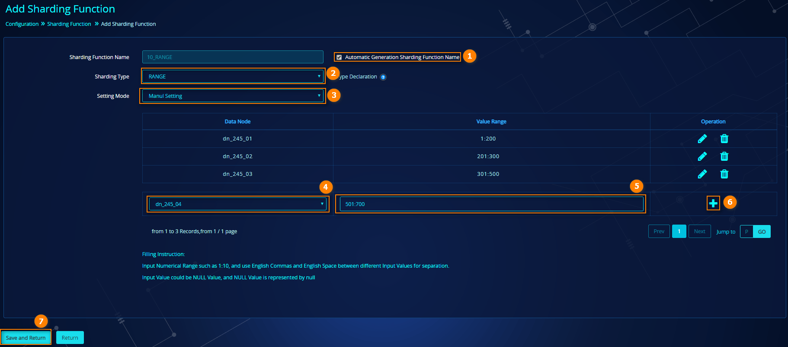

> Note: 
> 
> Manual setting of input values supports the input of multiple values which shall be spaced by English commas or English space. When it is in v.2.5.6 and above, "greater than" or "less than" is supported for the value range to distinguish the maximum and minimum value boundary.

#### ROUTE

Adding sharding function with sharding type of RANGE is displayed taking the auto setting and manual setting modes as an example as follows.

##### Add sharding function of ROUTE type in auto setting mode

**Function demonstration:**

**Step 1:** "Automatic Generation of Sharding Function Name" (automatic generation of function: existing sharding function maximum ID+1_sharding type name) is checked by default. It shall be unchecked in case of any custom name requirement.

**Step 2:** Select [ROUTE](#route) for "Sharding Type"

**Step 3:** Select the default "Auto Setting" mode

**Step 4:** Select the data node to be used for sharding function

**Step 5:** Check "For NULL Value, Distribute Route Node Automatically" by default. That is, when the sharding key value of the inserted data is NULL, the program will automatically select the route data node.

The same as MATCH type. When it is v.2.5.6 and above, you can also select "Match by Digit Number" (not checked by default) and fill in the matching rule. According to the filling, the corresponding route rules will be generated automatically. Here the ROUTE type is suitable for some numerical scenario that requires prefix/infix/suffix for sharding. The routing of data is based on the rules corresponding to "from left" or "from right", instead of full matching routing according to the original string.

**Step 6:** The value range is the range of sharding key values (only integers are allowed)

**Step 7:** Select the generated step length by default and modify the default generated value if it needs to customize the step length.

**Step 8:** Click the "Preview" button to view the sharding effect.

**Step 9:** Click the "Save and Return" button to save the new sharding function to the configDB. Reload is also required if it needs to take effect immediately into the compute node.


##### Add sharding function of ROUTE type in manual setting mode

**Summary of operation steps:**

Select "Automatic Generation of Sharding Function Name" by default, select ROUTE sharding type, set "Manul Setting" mode, check "Match by Digit Number" and fill the matching rule or not, select data nodes and matching values, click "+" to add records, and click "Save and Return".


> !Note
> 
> Manual setting of input values supports the input of multiple values which shall be spaced by English commas or English space

#### SIMPLE_MOD

Adding sharding function with sharding type of SIMPLE_MOD is displayed taking the auto setting and manual setting modes as an example as follows.

##### Add sharding function of SIMPLE_MOD type in auto setting mode

**Function demonstration:**

**Step 1:** "Automatic Generation of Sharding Function Name" (automatic generation of function: existing sharding function maximum ID+1_sharding type name) is checked by default. It shall be unchecked in case of any custom name requirement.

**Step 2:** Select [SIMPLE_MOD](#simple_mod) for "Sharding Type"

**Step 3:** Select the default "Auto Setting" mode

**Step 4:** Select the data node to be used for sharding function

**Step 5:** Check "For NULL Value, Distribute Route Node Automatically" by default. That is, when the sharding key value of the inserted data is NULL, the program will automatically select the route data node.

**Step 6:** Input the module value (positive integers only), which is a parameter of the reminder calculation between sharding key value and input module value. It is finally routed to the corresponding data node according to the obtained remainder.

**Step 7:** Click the "Preview" button to view the sharding effect.

**Step 8:** Click the "Save and Return" button to save the new sharding function to the configDB. Reload is also required if it needs to take effect immediately into the compute node.


##### Add sharding function of SIMPLE_MOD type in manual setting mode

**Summary of operation steps:**

Select "Automatic Generation of Sharding Function Name" by default, select SIMPLE_MOD sharding type, set "Manul Setting" mode, set the module value, select data nodes and matching values, click "+" to add records, and click "Save and Return"


> !Note
> 
> Manual setting of input values supports the input of multiple values which shall be spaced by English commas or English space

#### CRC32_MOD

Adding sharding function with sharding type of CRC32_MOD is displayed taking the auto setting and manual setting modes as an example as follows.

##### Add sharding function of CRC32_MOD type in auto setting mode

**Function demonstration:**

**Step 1:** "Automatic Generation of Sharding Function Name" (automatic generation of function: existing sharding function maximum ID+1_sharding type name) is checked by default. It shall be unchecked in case of any custom name requirement.

**Step 2:** Select [CRC32_MOD](#crc32_mod) for "Sharding Type"

**Step 3:** Select the default "Auto Setting" mode

**Step 4:** Select the data node to be used for sharding function

**Step 5:** Input the module value (positive integers only), which is a parameter of the reminder between sharding key value and input module value. It is finally routed to the corresponding data node according to the obtained remainder.

**Step 6:** Click the "Preview" button to view the sharding effect.

**Step 7:** Click the "Save and Return" button to save the new sharding function to the configDB. Reload is also required if it needs to take effect immediately into the compute node.


##### Add sharding function of CRC32_MOD type in manual setting mode

**Summary of operation steps:**

Select "Automatic Generation of Sharding Function Name" by default, select CRC32_MOD sharding type, set "Manul Setting" mode, set the module value, select data nodes and matching values, click "+" to add records, and click "Save and Return"


> !Note
> 
> Manual setting of input values supports the input of multiple values which shall be spaced by English commas or English space

#### Edit sharding function

**Function Entry:** 

Select [Configuration](#configuration) -> "Sharding Function" -> [Edit sharding function](#edit-sharding-function) on the Distributed Transactional Database Platform page.

**Function operation:**
 
On the Edit sharding function page, change the Sharding Function Name, Sharding Type, Setting Mode, etc., and click "Save and Return" to edit the sharding function successfully.


**Modification notes:**

- Sharding Function Name shall not be repeated.
- Sharding Function Name shall not be NULL.
- Modification of sharding function for tables with associated table structure created:
  - No modification shall not be allowed for AUTO (history version), HASH (history version), and SIMPLE_MOD type
  - The RANGE, ROUTE and MATCH types allow the addition of sharding function parameters (adding a new node requires creating tables manually on the node), but allow no modification of the original sharding function parameters.
  - Parent and child table: Once defined, the sharding function for patent table shall not be modified.

#### Delete sharding function

**Function Entry:** 

Select [Configuration](#configuration) -> "Sharding Function" -> on the Distributed Transactional Database Platform page, and click "Delete" on the Sharding Function page.

**Function description:** 

Click the "Delete" button and then a pop-up box will prompt: "Confirm to Delete?" Click "Confirm" to delete the sharding function successfully.


> !Note
> 
> The sharding function that has been cited by the table cannot be deleted.

#### Replicate sharding function

**Function Entry:** 

Select [Configuration](#configuration) -> "[Sharding Function](#sharding-function)" -> "Replication" on the Distributed Transactional Database Platform page.

**Function description:** 

Click the "Replicate" button on the sharding function page to pop up the new sharding function name input box, enter the new function name and click "Confirm" to replicate the sharding function successfully.


**Replication notes:**

- New sharding function name shall not be NULL.
- New sharding function name shall not be repeated.

#### Special description

When the sharding key is of string type and the sharding type is AUTO or HASH, HotDB Server has different route results for string case, that is, when the sharding key is of string type, it is sensitive to case. When using sharding key in SQL, its case shall be consistent with that when storing data to query the corresponding data. Therefore, the AUTO and HASH sharding types have been dropped in V2.4.7. For the new version, it is recommended to replace HASH\AUTO with partition types such as CRC32_MOD\AUTO_CRC32, while sharding tables of HASH\AUTO type are still allowed for the thought of smooth transition. If historical data contains partition types like AUTO or HASH, the page will give the following prompt, which requires extra attention when using.


### Config checking

Config checking mainly provides checking for the related configuration of compute nodes to prevent abnormal operation caused by manual setting error or offline modification of the related configuration of compute nodes.

DR mode explanation: when the DR mode is enabled, please refer to the [Config checking](cross-idc-disaster-recovery-deployment.md#configuration-checking) chapter in the [Cross IDC Disaster Recovery Deployment](cross-idc-disaster-recovery-deployment.md) document for the relevant logical explanations of configuration checking.

**Function Entry:**

Select [Configuration](#configuration) -> "[Config Checking](#config-checking)" on the Distributed Transactional Database Platform page.


**Operation description:** 

Click the \[Start Checking] button to directly Start Config checking. When all checking items are passed, the checking is successful and there is no problem with the current configuration. When an error is reported in the checking information, the user who fails the checking shall modify according to the checking failure prompt, and then perform Config checking.

**Checking tips:**

Config checking failures are divided into ERROR (red font display) and WARNING (orange font display) generally. When ERROR level information appears, users need to modify and solve the related problems immediately, otherwise [Reload](#reload) cannot be performed. WARNING information indicates a failure to which attention shall be paid and which does not affect the operation of compute nodes.


**Config Checking Items:**

| Type                                            | Checking Content                                                                                                                                                                                                                                                                                                                                                                                                                                                     |
|-------------------------------------------------|----------------------------------------------------------------------------------------------------------------------------------------------------------------------------------------------------------------------------------------------------------------------------------------------------------------------------------------------------------------------------------------------------------------------------------------------------------------------|
| Data source table configuration                 | Data Node reference is normal                                                                                                                                                                                                                                                                                                                                                                                                                                        |
| ^                                               | Data Source database does not repeat                                                                                                                                                                                                                                                                                                                                                                                                                                 |
| ^                                               | Data Source cannot be connected                                                                                                                                                                                                                                                                                                                                                                                                                                      |
| ^                                               | A Data Node must contain available data source                                                                                                                                                                                                                                                                                                                                                                                                                       |
| ^                                               | Data Node must contain Data Source                                                                                                                                                                                                                                                                                                                                                                                                                                   |
| ^                                               | One data node has only one Active Master                                                                                                                                                                                                                                                                                                                                                                                                                             |
| ^                                               | One Data Node must contain a Data Source of Active Master type                                                                                                                                                                                                                                                                                                                                                                                                       |
| ^                                               | The character set of data source must be consistent                                                                                                                                                                                                                                                                                                                                                                                                                  |
| ^                                               | Non-MGR Data Node cannot cite MGR type Data Source                                                                                                                                                                                                                                                                                                                                                                                                                   |
| ^                                               | Data node cannot cite common master-slave data source                                                                                                                                                                                                                                                                                                                                                                                                                |
| ^                                               | ConfigDB cannot be added as data source                                                                                                                                                                                                                                                                                                                                                                                                                              |
| ^                                               | Data source user and configDB user cannot share                                                                                                                                                                                                                                                                                                                                                                                                                      |
| ^                                               | The logical architecture of compute nodes in the master center and the DR center is the same.                                                                                                                                                                                                                                                                                                                                                                        |
| Node switching rule table configuration         | Data Source reference is normal                                                                                                                                                                                                                                                                                                                                                                                                                                      |
| ^                                               | Data Source and Data Node high availability source cannot be the same                                                                                                                                                                                                                                                                                                                                                                                                |
| ^                                               | Data Source and Data Node high availability source must belong to the same data node                                                                                                                                                                                                                                                                                                                                                                                 |
| LogicDB table configuration                     | Data Node reference is normal                                                                                                                                                                                                                                                                                                                                                                                                                                        |
| Sharding function parameter table configuration | Sharding function reference is normal                                                                                                                                                                                                                                                                                                                                                                                                                                |
| ^                                               | Data Node reference is normal                                                                                                                                                                                                                                                                                                                                                                                                                                        |
| ^                                               | The column_value of RANGE or HASH route method must be in the form of an interval, such as: a:b, and a and b shall be numbers, a<=b                                                                                                                                                                                                                                                                                                                                  |
| ^                                               | The sharding parameter value range of HASH route method cannot contain negative numbers                                                                                                                                                                                                                                                                                                                                                                              |
| ^                                               | The sharding parameter value of automatic Sharding Route method shall be a positive integer                                                                                                                                                                                                                                                                                                                                                                          |
| ^                                               | The sharding parameter value of ROUTE route method shall be an integer                                                                                                                                                                                                                                                                                                                                                                                               |
| ^                                               | Sharding function parameter is normal                                                                                                                                                                                                                                                                                                                                                                                                                                |
| ^                                               | Sharding interval of RANGE or HASH shall have no overlap                                                                                                                                                                                                                                                                                                                                                                                                             |
| ^                                               | The column_value of SIMPLE_MOD or CRC32_MOD route method can be a number greater than or equal to 0 or an interval, such as: a:b, and a and b shall be numbers, a>=0, b>=0, a< =b                                                                                                                                                                                                                                                                                    |
| ^                                               | The module value of SIMPLE_MOD or CRC32_MOD must be within 2-2147483647                                                                                                                                                                                                                                                                                                                                                                                              |
| ^                                               | SIMPLE_MOD or CRC32_MOD must be configured with module values                                                                                                                                                                                                                                                                                                                                                                                                        |
| ^                                               | The sharding parameter value interval of SIMPLE_MOD or CRC32_MOD shall have no overlap                                                                                                                                                                                                                                                                                                                                                                               |
| Sharding function table configuration           | Sharding function reference is normal                                                                                                                                                                                                                                                                                                                                                                                                                                |
| Table Configuration                             | Global table is normal                                                                                                                                                                                                                                                                                                                                                                                                                                               |
| ^                                               | Sharding function reference is normal                                                                                                                                                                                                                                                                                                                                                                                                                                |
| ^                                               | Data Node reference is normal                                                                                                                                                                                                                                                                                                                                                                                                                                        |
| ^                                               | LogicDB reference is normal                                                                                                                                                                                                                                                                                                                                                                                                                                          |
| ^                                               | Table name conflict detection is normal                                                                                                                                                                                                                                                                                                                                                                                                                              |
| ^                                               | Global table node must contain all nodes of the logicDB it belongs to                                                                                                                                                                                                                                                                                                                                                                                                |
| ^                                               | Association between table and data node is normal                                                                                                                                                                                                                                                                                                                                                                                                                    |
| ^                                               | Sharding table sharding function association is normal                                                                                                                                                                                                                                                                                                                                                                                                               |
| ^                                               | Vertical sharding table belongs to only one node                                                                                                                                                                                                                                                                                                                                                                                                                     |
| ^                                               | After the global auto-increment and unique is enabled, bigint is the only type allowed for the auto-increment sequence in the table.                                                                                                                                                                                                                                                                                                                                 |
| Child table configuration                       | Parent table reference is normal                                                                                                                                                                                                                                                                                                                                                                                                                                     |
| ^                                               | Parent table sharding type is normal                                                                                                                                                                                                                                                                                                                                                                                                                                 |
| ^                                               | Association between one parent table and multiple child tables is normal                                                                                                                                                                                                                                                                                                                                                                                             |
| ^                                               | Relation between child table and parent table is normal                                                                                                                                                                                                                                                                                                                                                                                                              |
| ^                                               | Child table has no conflict with parent table name                                                                                                                                                                                                                                                                                                                                                                                                                   |
| License management                              | Node number limitation checking passed                                                                                                                                                                                                                                                                                                                                                                                                                               |
| ^                                               | LogicDB number limitation checking passed                                                                                                                                                                                                                                                                                                                                                                                                                            |
| Data source configuration                       | Data source configuration is correct                                                                                                                                                                                                                                                                                                                                                                                                                                 |
| ^                                               | Reload requirement: the replication latency between available master Data Source and original master Data Source cannot exceed 10s                                                                                                                                                                                                                                                                                                                                   |
| ^                                               | Reload requires that the replication status between available master data source and original master data source shall be normal                                                                                                                                                                                                                                                                                                                                     |
| ConfigDB status                                 | ConfigDB connection is normal                                                                                                                                                                                                                                                                                                                                                                                                                                        |
| ^                                               | ConfigDB replication status is normal                                                                                                                                                                                                                                                                                                                                                                                                                                |
| user privilege configuration                    | The data source connection user privilege configuration is normal (privilege shall not be lower than: select,insert,update,delete,create,drop,index,alter,process,references,super,reload (only when the node version is greater than or equal to V2.5.3), lock tables,replication slave,replication client,trigger,display view,create view,create routine,xa_recover_admin (only for data source instances of version 8.0 and above), alter routine,execute,event) |
| ^                                               | The configDB connection user privilege configuration is normal (privilege shall not be lower than: select,insert,update,delete,create,drop,index,alter,create temporary tables,references,super,reload (only when the compute node version is greater than or equal to V2.5.3), lock tables,replication slave,replication client)                                                                                                                                    |
| Compute node configuration                      | Whether the currently configured compute node mode matches the real compute node mode.                                                                                                                                                                                                                                                                                                                                                                               |

> !Note
>
> After the global auto-increment and unique is enabled, bigint is the only type allowed for the auto-increment sequence in the table." is a newly added verification rule for management platforms of v.2.5.5 and above, as shown in the following figure:
> 
> 
> 
> When in cluster mode and autoIncrement is set to 2 (auto-increment and unique), if there is historical auto-increment sequence of type smallint, tinyint, mediamin, int, the dynamic loading will be affected and "After the global auto-increment and unique is enabled, bigint is the only type allowed for the auto-increment sequence in the table." will be prompted, as shown below:
>
> 
>
> This verification rule verifies tables with auto-increment columns enabled under all LogicDBs only when autoIncrement is set to 2, that is, "global auto-increment and unique" and the compute node mode is multi-node cluster. The displayed information includes: LogicDB, table name, field name of auto-increment column and current type of auto-increment column that does not conform to the verified table.

### Cluster metadata backup and restore

Config metadata refers to compute node configDB data and configuration files. HotDB Management backs up metadata for compute nodes manually or periodically in case important configuration data is lost or damaged and cannot be recovered.

#### Cluster metadata backup


**Manual Backup**

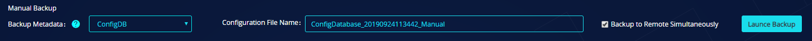

Metadata Backup can be divided into the "ConfigDB" or "ConfigFile". ConfigDB is the data in the master configDB currently used by the compute node; ConfigFile is all files under the bin, conf, and lib directories of the current master compute node, and the master/slave mode clusters also include backup `keepalived.conf` file.

Click the \[Launch Backup] button to issue a backup command by HotDB Management. ConfigDB MySQL instance performs a backup operation through mysqldump and stores the backup file under the HotDB Management installation directory `data`. The configFile is directly backed up from the master compute node server to the HotDB Management installation directory `data`.

When backing up the "ConfigFile", it needs to configure the SSH connection information of the server where the compute node is located on the "Configuration->Server" menu page and ensure the normal connection. Also, it needs to ensure that the master compute node in the cluster runs normally. In addition, the configured SSH connection user also needs to have privileges to view the compute node running thread information. If the above requirements are not met, the configuration file cannot be backed up normally.

**Remote Backup**


To improve the backup metadata security, this function also backs up the backup metadata to a remote server. Check "Backup to Remote Simultaneously" to manually Start a backup. Select "Yes" for "Backup to Remote Simultaneously" in the plan of periodical backup.

Using the remote backup function requires configuring remote server related parameters.

- **Remote Replication Mode:** Supporting both SCP and RSYNC. If RSYNC replication mode is selected, it needs to install RSYNC tools on all compute node servers and remote servers in advance.
- **Sign in without password:** If a remote server is connected through Sign in without password, all compute node servers are required to establish a password-free channel with the remote server. For the establishment of password-free channel, refer to the [Password-free Channel Description](installation-and-deployment.md#description-of-implementing-password-free-login) chapter of the [Installation and Deployment](installation-and-deployment.md) document.
- **Remote Hostname:** IP address of the remote server
- **Remote Host User/Password:** SSH information for remote server connection
- **Remote Storage Directory:** The directory where the backup metadata is stored in the remote server, which must be a directory that exists and in which remote connection accounts have write privileges

**Periodical Backup**


Periodical Backup time can be set to 3 types: daily, weekly and monthly, but the [Cluster metadata backup and restore](#cluster-metadata-backup-and-restore) function in HotDB Management can only add up to 6 periodical backup plans.

Periodical tasks can periodically back up configDB or configFile. When configuring backup plans with the same metadata type and conflicting backup time, only one of the periodical tasks will be executed.

#### Cluster metadata restore

**Cluster metadata restore**


Currently, only the configDB data restore is supported. The configuration file restore needs to be manually replaced.

In the backed up record, the backup record corresponding to the restore time point can be selected. Click the \[Restore] button to restore the configDB data.

HotDB Management automatically backs up the current configDB before restore to ensure available latest backup can be restored after data misoperation. The automatically backed up file restored is automatically named "backup time + restoreBackup".

### Parameter configuration

"Parameter Configuration" is a function of Management Platform to provide users with visual configuration compute node server.xml parameter.

**DR mode explanation:** when the DR mode is enabled, please refer to the [Parameter configuration](cross-idc-disaster-recovery-deployment.md#dr-center-parameter-configuration) chapter in the [Cross IDC Disaster Recovery Deployment](cross-idc-disaster-recovery-deployment.md) document for the relevant logical explanations of the parameter configuration.

Function entry: log in to the management platform, enter the "Configuration -> Parameter configuration" page.

#### Basic functions and notes


Through the compute node drop-down box, you can view all the compute nodes in the current cluster. The current active compute node is displayed at the top of the drop-down box, format: (IP the current active). And other compute nodes are displayed in the drop-down box in turn, format: compute node name (IP). The synchronization box "Slave compute node automatically synchronized" is checked by default. Adding or modifying parameters will be automatically synchronized to other slave compute nodes (no synchronization in single-node mode), including seven parameters `[haMode: DR mode]`, `[idcId: ID of IDC]`, `[idcNodeHost: master compute node information of the corresponding IDC]`, `[ServerId: cluster node number]`, `[clusterHost: IP where the compute node is located]`, `[hsaState: configuration of master/slave roles in high availability mode of compute node]`, `[HaNodeHost: connection information of the current active compute node in the high availability mode of compute node]`, which are controlled by respective compute nodes and will not be modified synchronously.

For the list, you can search by parameter name and parameter description, or filter by "Basic configuration, High availability setting, Database features, SQL grammar and function, Database performance, Database operation and maintenance", as shown in the following figure:


At the same time, parameters can be modified, reset, batch modified, and batch reset. After these operations, Status of parameter will not be "Worked" immediately. You can make it "Work" through reload or restarting the service (refer to the description of "The way to work")


Click the hyperlink of parameter name, the page will jump to the "Parameter Details Explanation" page and navigate to the parameter, which gives a detailed description of the parameter.


Click the "Add parameters" button at the upper right corner to jump to the Add parameters page. It displays all the uncommon parameters of the compute node, which need to be modified and added according to the actual need.


> !Note
>
> The virtual IP parameter Keepalived is recommended to be configured when the cluster mode is the master/slave compute nodes (ignored in a single compute node), and it needs to be current actual.
>
> When some parameters are modified, there will be a suspended prompt message, as follows:
>
> - axIdleTransactionTimeout -> 0 means never timeout.
> - statisticsUpdatePeriod -> 0 means no data persistence.
> - dropTableRetentionTime -> 0 means no retention.
> - deadlockCheckPeriod -> 0 means not enable.
> - maxUserConnections -> 0 means unlimited.
> - VIP -> No filling or the format is not IPv4 means that this item is empty.
>
> For frontConnectionTrxIsoLevel, if enableXA is set to true, the parameter drop-down box will be grayed and the option READ UNCOMMITTED will not be available.
>
> If there is a compute node failure, the failed compute node will not be displayed in the compute node selection box.
>
> In the DR mode, idcId and idcNodeHost need to be configured. idcId configures the ID of IDC. 1 is for the master center and 2 is for the DR center. 1 is set by default.
>
> If the DR mode is not enabled in haMode, "master/slave" will be displayed when the compute node is a single compute node or a master/slave compute node, and "cluster" will be displayed when it is a multi-node.

#### Enable master configDB

When the configDB mode used by compute node cluster is master/slave or master-master mode, if the master configDB fails, the compute node cluster will automatically switch the configDB connection to the master/slave configDB. At this time, if the master configDB is restored manually and started normally, the compute node cluster will not automatically use the master configDB, but the master configDB shall be re-enabled according to the following operations.

1. After the failure of the master ConfigDB, the Parameter Configuration page is shown as follows:


2. If the master configDB is restored and consistent with the slave configDB data, the master configDB can be enabled by clicking the enable button on the compute node Configuration page.

3. After clicking the  button, click the \[Reload] button to re-enable the master configDB.


For the DR mode, attention should be paid to:

- When the DR center is the current standby IDC and the master configDB fails, the compute node will set both the master-slave ConfigDB of the DR center to the unavailable status.
- When the DR center is the current standby IDC, it is necessary to confirm that the current master ConfigDB is available when enabling the slave ConfigDB of the DR center. Otherwise, the slave ConfigDB of the DR center cannot be enabled, that is, the master ConfigDB of the DR center must be enabled before enabling the slave ConfigDB of the DR center.
- If you want to enable any ConfigDB in two IDCs, you need to ensure that the replication status of the current IDC and between the IDC is normal. If any replication status is abnormal, dynamic loading will succeed with alert prompt, as follows:


### Database user management

HotDB Server controls compute node user privileges to the table level, and has SELECT, UPDATE, DELETE, INSERT, CREATE, DROP, ALTER privileges for logicDB or table. The specific privileges are given by HotDB Management users.

#### Query by username


The page displays the compute node database user records added, which support fuzzy search by username or hostname.

The "root" on the page is the built-in user when the HotDB Management installation is initialized, which cannot be deleted (HotDB Management uses root to connect and access the compute node).

#### Add users

Click the \[Add Users] button to enter the Add User information page. There are three modules on the Add User information page: Basic Information, logicDB privilege and Table level privilege.

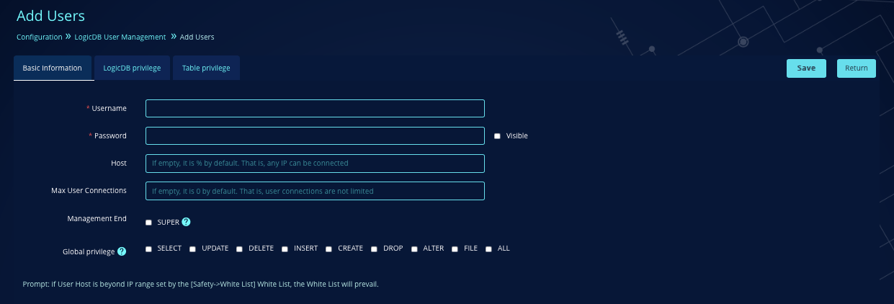

**(1) Basic Information:** including required items "Username", "Password", optional items "Host", "Max User Connections", "super privilege" and "Global privilege"

- "Username" and "Password" are the database account information used when logging into the compute node. "Username" shall not be repeated and in Chinese. "Password"shall meet the requirements.

- "Host" is an optional item. When it is null, it is "%" by default. That is, any IP can be connected. When the white list constraint is currently enabled, and Host User is beyond IP range set by "Security -> White List", the White List will prevail.

- "Max User Connections" is an optional item. When it is null, it is "0" by default. That is, user connections are not limited. For the maximum connections for all users, the "Front-end Max Connections" will prevail.

- super privilege is the user's privilege for management port login (3325 by default).

- Global privilege is an optional item. If user set global privilege, the user will have the selected operation privileges of all objects under all logicDBs. For example, if global privileges SELECT, UPDATE, INSERT, CREATE are checked, current users can perform S/U/I/C operations on all logicDBs and tables after saving.

- Username and host can determine the uniqueness of user, that is, username + host represents an independent user. This rule is consistent with MySQL privilege system.


**(2) LogicDB privilege:** Select the corresponding logicDB to set the corresponding privileges, or create a new logicDB and set the privilege.

- If global privilege is set in the basic information, the relevant privileges at the logicDB level can not be changed with the global privilege, and the cursor focus will prompt "Inherited from global privilege".

- When selecting or adding a logicDB to assign privilege, the page automatically checks the basic privilege item "S/U/D/I".

- Check the "ALL" privilege to perform "S/U/D/I/C/D/A" operation on the logicDB. If it needs to adjust the privilege of the logicDB that has been given the "ALL" privilege later, the ALL option shall be first unchecked.

- If a new logicDB is added and the corresponding privileges are set, the new logicDB information is not synchronized to the actual logicDB table, and is only saved as a pre-configured privilege information in the configDB.

- LogicDB deletion only deletes the privilege record corresponding to the current logicDB, and does not affect the actual logicDB.

> !Note
>
> Changing the logicDB name may affect the logicDB privileges that some users have added and invalidate table privilege configuration. Therefore, the logicDB name change by logicDB list shall be used with caution.

**(3) Table privilege:** User table-level privileges are divided into two parts: table-level privilege allowed and table-level privilege denied. The privilege allowed is the privilege of users to perform table operations. The privilege denied is the privilege not given to users to perform table operations.

**Table privilege Allowed**

Select existing tables to configure privileges or add new table configuration and assign privileges. Select the logicDB and then select the table to be configured from the drop-down box or enter the name of new table. When clicking \[Confirm], the page generates a configuration recodrd.

- If the current logicDB has set privileges or global privileges, the table-related privileges cannot be changed with the global privilege, and the cursor focus will prompt "Inherited from global privilege".

- After configuring a table privilege record, the page automatically checks the basic privilege item "S/U/D/I".

- Check the "ALL" privilege to perform "S/U/D/I/C/D/A" operation on the table. If it needs to adjust the privilege of the table that has been given the "ALL" privilege, the "ALL" option shall be first unchecked.

- If a new table is added and the corresponding privileges are set, the new table is not synchronized to the actual table configuration and is only saved as a pre-configured information. The corresponding privileges are directly matched after the table is created.

- Table deletion only deletes the privilege record corresponding to the current table, and does not affect the actual table configuration.

**Table privilege Denied**

Configuration of table privilege denied is consistent with configuration of table privilege allowed. Table privilege denied is greater than global privilege, logicDB privilege and table-level privilege allowed.

- Table privilege denied is independent of global privilege and logicDB privileges, and no privileges are checked by default.

- If a new table is used to set corresponding privileges, the new table does not synchronize to the real table configuration, but only serves as a configuration information of pre-rejection privileges. After the table is created, the corresponding privileges are matched directly.

- Table deletion only deletes the denial of privilege records corresponding to the current table, and has no effect on the real table configuration.

**Privilege matching note:**

When logging in to the server to read the user tables, they are first sorted by the most specific Host value (hostname and IP are the most specific), and the entries with the same Host value are matched by the most specific username first, for example, adding two users with the same username and different Host values, as shown in the following figure:


User test logs in through host 192.168.200.51 and performs INSERT/ALTER operation. Because the most specific Host is matched, the ALTER unprivileged operation is denied, shown in the following figure:

```
test@192.168.220.104 : TEST_ZY 08:54:51> insert into join_cross_a_jwy(adnid) value (101);
Query OK, 1 row affected (0.05 sec)

test@192.168.220.104 : TEST_ZY 08:56:11> alter table join_cross_a_jwy add column apassword int after aname;
ERROR 1045 (HY000): [ALTER] command denied to user 'test' to logic database 'TEST_ZY'
```

The configured table-level privilege allowed do not conflict with the global, logicDB, and table-level privilege allowed, and the priority is higher than all. For example, the test user sets the global privilege ALL, as shown in the following figure:


Test user sets test_ct.test_temp table privileges denied DELETE, DROP


The user test logs into the service port to perform DELETE and DROP operations on the test_temp table, which are denied. The privilege matching is as follows:

```
test@192.168.200.51 : (none) 08:53:25> use test_ct

Database changed
test@192.168.200.51 : test_ct 08:53:32> insert into test_temp(a) values(30);
Query OK, 1 row affected (0.09 sec)

test@192.168.200.51 : test_ct 08:53:51> delete from test_temp where a=30;
ERROR 1045 (HY000): [DELETE] command refused to user 'test' to table 'TEST_TEMP' of logic database 'TEST_CT'
```

### Server

Server menu mainly provides server SSH information for users to configure all components in the cluster on HotDB Management to facilitate HotDB Management to monitor the server status. In addition, it also supports adding servers outside the cluster to HotDB Management for monitoring.


#### Obtain server IP automatically

The server page automatically displays the server IP of all components in the cluster group and the associated service programs in the server.

**(I) Single node cluster mode**


HotDB Management automatically obtains the server IP information of the compute node, data source, and configDB components.

**(2) Master/slave node mode cluster**


HotDB Management automatically obtains the server IP information of the compute node, data source, configDB and keepalived components.

**(3) Multi-node mode cluster**


HotDB Management automatically obtains the server IP information of the compute node, data source, and configDB components. If the cluster is manually added, a prompt appears at the bottom of the page: The program cannot obtain the server IP of LVS components which shall be configured by the user in \[Add Server].

#### Add server

Click the \[Add Server] button to add a server outside the cluster.


- Login Method: Password and Sign in without password. If "Sign in without password" is selected, it needs to be set in advance. For details, refer to the [Instructions for Sign in without Password](installation-and-deployment.md#description-of-implementing-password-free-login) chapter of the [Installation and Deployment](installation-and-deployment.md) document.
- Hostname: Server ip.
- Port: 22 by default.
- Username: The server login username.
- Password: The server login password; it is gray when "Sign in without password" is selected.
- LVS Server: In case of "Yes", click the \[Test] button to check whether the LVS service in the server is normal. After the test is passed, the saving can be successful. This option is only for multi-compute node cluster environments, and is not displayed for single compute node and master/slave compute node.
- Multiple servers can also be added quickly by selecting "Batch Operation -> Batch Add".

#### Configure SSH

By default, the SSH connection status of cluster component server is "Not Connected". Users need to manually configure SSH information to HotDB Management. Monitoring will be automatically turned on when the configuration is complete.


Configure SSH information by simply filling in: Port (22 by default), Username and Password (not applicable for Sign in without password).

When selecting "Yes" for LVS Server, the cluster component LVS exists in the server.

The configured server automatically starts monitoring (the monitoring script is sent by HotDB Management to the server that starts monitoring).

#### Other description

Click \[Remove] to delete the added server record. If the removed record is the server IP of the cluster component, the configuration SSH information shall be removed.

Click \[Stop Monitoring] to stop regularly executing the monitoring script in the server, but this operation will make HotDB Management unable to grasp the health status of cluster server, which causes certain hidden dangers.

The servers that "Stop Monitoring" do not display the server resource status in "Monitoring -> Monitoring Panel -> Other Servers". The servers that are not monitored in the "Monitoring -> Physical Topological Graph" function cannot view the server details.

## Monitoring

### Logic Topological Graph

HotDB Management fully displays the physical and logic components such as front-end application, logicDB, compute node, data node, data source in the cluster in a visual mode. The QPS and connections on the component is dynamically generated through the front-end application connection pool and the back-end database connection pool information. [Logic Topological Graph](#logic-topological-graph) enables users to quickly understand the running status of the whole cluster and help users achieve efficient operation and maintenance.

**DR mode explanation:** when the DR mode is enabled, please refer to the [Logic topological graph](cross-idc-disaster-recovery-deployment.md#logic-topological-graph) chapter in the [Cross IDC Disaster Recovery Deployment](cross-idc-disaster-recovery-deployment.md) document for the relevant logical explanations of the logic topological graph.

#### Topological graph component description


The topological graph consists of five layers of components from top to bottom: front-end application, logicDB, compute node, data node, and data source.

**(I) Front-end application**

The front-end application layer is the front-end application client that connects to the compute node. The application connects to the specified logicDB through IP, port, and user password (the connection method is consistent with the MySQL connection), that is, the related connection information can be seen in the topological graph. If the real-time connections and QPS of the front-end application exceed the set threshold, the topological graph will display a warning with an orange up arrow.

**(2) LogicDB**

- LogicDB layer is physically a virtual layer and a virtual concept of the HotDB Server product. The topological graph allows to view all logicDBs that exist in the whole cluster.

- The logicDB icon displays the related "Connection" and "QPS".

- "Connection" is the sum of all front-end application connections of the current logicDB.

- "QPS" is the sum of all front-end application QPSs of the connected logicDB (the logicDB QPS occasionally has a single digit deviation from the total number).

- When "QPS" and "Connection" exceed the set threshold, the page will display a warning with an orange arrow.

**(3) Compute node**

- The compute node is the core component of the whole cluster, providing the underlying computing route query service for data.

- The topological graph displays the corresponding number of compute node icons according to the cluster mode. One is displayed in single node mode, two are displayed in master/slave mode, and the multi-node mode is based on the number of compute nodes.

- Green represents the current master compute node and blue represents the current slave compute node by default. Red indicates that the compute node is abnormal and cannot be connected, and orange indicates that the compute node parameter exceeds the set threshold.

- A cluster in master/slave or multi-node mode has a "crown" icon on the current master compute node to represent the master of current cluster.

- When the mouse cursor is hovering over the compute node icon, the back-end connections, direct memory usage, front-end connections, heap memory usage, back-end inflow rate, back-end outflow rate, front-end inflow rate, front-end outflow rate and QPS are displayed. When the data exceeds the warning limit, it will be marked with an orange up arrow.

**(4) Data node**

- The data node is a virtual concept of the HotDB Server, which does not actually exist at the physical level.

- The data node can manage a group of data sources with replication relations for easy viewing and later operation and maintenance.

- Data node information: "Replication Status" is the replication status parameter displayed on the master-master and master/slave data source. The replication status includes: Normal, Abnormal and Unknown. The replication status is consistent with the "Master/Slave Status" on the Node Management page.

- When the replication status is Unknown, the slave data source is displayed in yellow and blinks. Move the mouse cursor to display the Unknown cause which shall be consistent with the cause prompted in the Master/Slave Status of node management. There are four cases of Unknown: Data source cannot be connected, data source privileges are insufficient, detection is periodical out (timeout time: 1 minute), and current node has no master/slave replication relation. In addition to, in case of master-master and slave, if the master_id is configured and the master/slave relation is not matched, the "Unknown" status is also displayed and it prompts that "The current node master/slave relation is inconsistent with the configuration".

- Data node information: "Data Capacity" The data capacity is based on the current active master data capacity under the data node. That is, the current active master data volume = data capacity displayed by the data node. (The unit of data volume is represented by K, M, G). When the data volume reaches M, it is displayed by M.

- Data node information: "Failover Time" is the time when the standby slave officially takes over the service.

- Data node information: "Failover Time" is the time consumed from the active master fails and the standby slave starts to wait for catching up with and then the connection is switched to the standby slave when the standby slave starts to provide the normal service. This parameter is displayed only when the switch is successful. If the replication is normal or the switch fails or the active master is restored during the switch, the parameter displays "- -" instead of the time. The switch time is displayed in ms, s, min and h. The time is displayed in min when it exceeds s.

- Data node information: "Master/slave Data Consistency" when the node type is master-master, master/slave, or one master with multiple slaves, whether the data and objects on multiple data sources are consistent will be identified. There are three values: "--", "normal" and "abnormal", which are displayed according to the latest detection results of "Detection -> Master/slave Data Consistency Detection".

1. When the master/slave data consistency detection is not performed in the selected node, the master/slave data consistency will be shown as "--"


2. When the detection result of the selected node is "unable to detect" or "inconsistent": the master/slave data consistency will be shown as "abnormal", with a hyperlink in orange. Click the hyperlink to jump to the details page of the master/ slave consistency detection result.


3. When the detection result of the selected node is "consistent": the master/slave data consistency will be shown as "normal".


4. When the detection result of the selected node is "consistent"， with a prompt "There are conditions which cannot be detected." (i.e. multiple detection nodes): the master/slave data consistency will be shown according to the actual detection results. For the "consistent" nodes, it will be shown as "normal", and for the nodes that cannot be detected, it will be shown as "abnormal" with a hyperlink in orange.

- Data node information "connections": obtained by adding the connections on all data sources under the data node.

- Data node information "QPS": obtained by adding QPS on all data sources under the data node.

**(5) Data source**

- It is a real storage layer of business data consisting of MySQL instances.

- Green "M" represents the current master data source, blue "S" represents the slave data source, blue "M" represents the standby master, and "MGR" represents the MGR type data source.

- Red icon indicates that there is an error. Move the mouse cursor into the faulty data source icon to display the error cause. Orange indicates that there is a replication latency or the last data source under the data node is unavailable.

- The data source displays the "Replication latency" (the data source with master-slave or master-master relation is displayed, and the delayed data is obtained from the display slave status), "Connection" (generated dynamically according to the back-end MySQL connection pool) and "QPS"

**(6) ConfigDB**

- The ConfigDB components of the compute nodes in the cluster are always displayed on the left of the storage layer.

-  is a non-status icon, which connects one or two ConfigDBs , respectively representing a single node ConfigDB and a master-master ConfigDB. In single-IDC mode, if three or more ConfigDBs are connected, it represents the ConfigDB in MGR mode.  will be in orange when all ConfigDBs are not available.

- Similar to the data source, icon of ConfigDB in red means a failure exists; moving the cursor over the red icon, the failure cause can be displayed. Orange means an abnormal replication status exists, moving the cursor over the orange icon, the abnormality cause can be displayed.

- The monitoring information of "Replication latency" is displayed in the ConfigDB. Similar to the data source, the alert threshold of replication latency can be set under ConfigDB module in "Setting ---> [Topological Graph Alert Setting](#topological-graph-alert-setting)".

**Other description**

For more details about the components, please refer to the [Glossary](glossary.md) document.

The threshold value of the component display parameter alert information in the topological graph can be configured in "Setting ---> [Topological Graph Alert Setting](#topological-graph-alert-setting)".

The data node icon can directly execute the master/slave switch by right clicking. The switching logic is the same as "Node management ---> [master/slave switch](#masterslave-switch)". (there is no such operation entry on the single-node page or data node page of MGR type)

The data source icon can quickly replicate connection information of the data source by right clicking, such as `mysql -uhotdb_datasource -p -P3306 -h192.168.220.232 -Ddb05`. (the connection password is empty due to security issues).

#### Interface adjustment function


**(I) Visual switching**

The topological graph can be switched to "2.5D" visual effect through the \[2.5D] button on the interface, and can be switched back to normal visual effect by clicking the \[2D] button.

**(2) Topological graph setting**

"QPS" and "Connection" information of components can be hidden or displayed.

If there are too many logicDBs on the topological graph page, the logicDB Filter in the setting can be used for targeted viewing.

Because each component can be dragged in the "General View" of topological graph, in order to reposition the scrambled component, click \[Reset Component Arrangement] to restore the position of each component.

**(3) Topological Graph Info Panel**

Move the mouse cursor into the \[<] button to activate the Topological Graph Info Panel which mainly records the INFO (addition or deletion of page component), WARNING (information of component warning parameter exceeding the threshold) and ERROR (information appears when the component is abnormal) in the topological graph.

The information recorded in the Topological Graph Info Panel cannot be deleted manually. However, the window period (local retention time) of the recorded information can be set using the \[Setting] button in the upper right corner of the Info Panel. In order to reduce the excessive information at the WARNING level, the information can be set to be recorded only when the warning occurs for three consecutive times.

#### D topological graph

2.5D topological graph is a visual upgrade based on the original basic topological graph content. The component and component information displayed by this function are consistent with that of the above-mentioned "General View" topological graph, and the functions are similar.


**Special description of 2.5D topological graph:**

2.5D topology does not support arbitrary component dragging, and all component are fixed.

When the compute node fails, the failed compute node is displayed on the right of master compute node.

The display status of all application servers, logicDB, compute nodes, data nodes, and data sources on the page is consistent with that in normal mode.

The upper right corner switch, setting and information pop-up panel functions are consistent that in normal mode.

It supports zooming on the view by mouse cursor scrolling or page page zooming button, and supports page dragging.

### Physical topological graph

Physical topological graph mainly displays the relation between cluster components and servers from the perspective of server. At the same time, the usage of server resources and the running health of cluster component services can be viewed. Before using, it is necessary to configure the available SSH connection information for the cluster server. Otherwise, only the relation between the current server and the cluster component can be viewed, and the status of the server and the component program cannot be viewed.

**DR mode explanation:** when the DR mode is enabled, please refer to the [Physical topological graph](#physical-topological-graph) chapter in the [Cross IDC Disaster Recovery Deployment](cross-idc-disaster-recovery-deployment.md) document for the relevant logical explanations of the physical topological graph.

**(1) Overview of physical topological graph**


Total servers: The total number of cluster servers (servers of associated cluster service programs) shown in the "Configuration -> Server" page list.

Server health status: The statuses include Normal, Warning and Error which are displayed in green, orange and red respectively in the statistics. The server error causes include: the server SSH connection information is incorrect, the server network connection is abnormal, and the server cannot connect normally; the server warning cause is: the server resource usage parameter value reaches the threshold in "Setting - Monitoring Panel Setting - Compute Node/Other Server Resource Setting".

Total service programs: The total number of "Associated Service Program" displayed on the "Configuration -> Server" page.

Service program type: compute node, data source, configDB, keepalived (master/slave mode cluster), and LVS (multi-node mode cluster).

Service program health status: The running status of corresponding service program. Compute nodes statuses include Error (cannot be connected), Warning (exceed the threshold), and Normal (normal service operation). Other service programs have only two statues: Normal (normal operation) and Error (abnormal operation). Move the mouse cursor into the error or abnormal status area to view the details.

**(2) Physical Topological Graph page**


**Page description:**

It displays the relation between servers and service programs. The server is represented by a square, each layer represents a server type, and the server IP is displayed in the lower right corner of the bottom layer. Normal, Warning and Error are represented by blue, orange and red squares respectively. Unconfigured servers are displayed as transparent.

The corresponding service programs on the server are all displayed in layers. The type and number of service programs are consistent with those shown in the overview.

The servers not configured or not enabled for monitoring on the "Configuration -> Server" page is transparent in the figure. Click on the server to pop up the prompt "SSH is not configured or the server is not enabled for monitoring".

The servers that have been configured on the "Configuration -> Server" page and have unavailable SSH information due to SSH modification and change later are displayed as transparent in the figure. Click on the server to pop up the prompt "SSH information is unavailable".

**(3) Server details panel**


**Server Resource Details:**

CPU usage rate: It displays the current CPU usage. Move the mouse cursor to display specific details. If the threshold is exceeded, a warning will appear in the prompt.

Memory usage rate: It displays the current memory. Move the mouse cursor to display specific details: (total memory, used memory, remaining memory, and memory usage rate); memory is uniformly displayed in GB. If the memory is a decimal, it shall be accurate to two decimal places.

Disk space usage rate: It displays the total disk space usage rate of the corresponding drive. Move the mouse cursor to display specific details: (drive name, total disk volume, used disk, remaining memory, and disk usage rate) are uniformly displayed in GB. The bottom drive can be switched to display the monitoring data of the corresponding drive;

Flow: It displays the current network traffic in/out. Move the mouse cursor to display specific details and the unit is KBps or MBps according to the actual situation.

**Service Program Details:**

It displays the components specifically installed in the server, including the current status of component.

### Monitoring panel

The monitoring panel provides users with the function of monitoring the parameters of compute nodes and servers, including: compute node service status, compute node throughout, compute node server resources, and other server resources.

**Data collection description:**

The monitoring panel displays the data collected within 24 hours (it shall be enlarged for viewing; the normal view only displays the data within half an hour). The system collects the data every 5 minutes and records it in the server memory deployed by HotDB management. If the distributed management platform restarts, the data stored in the memory will be cleared, that is, the data collected within 24 hours will be cleared.

#### Add and set monitoring item


Click \[Add Monitoring Item] first when entering this function for the first time.

Click the \[Switch] button to adjust the monitored items or select other compute nodes (multi-node mode cluster) to be displayed.


In multi-node mode cluster, "Switch Monitoring Display of Compute Nodes" can be selected to display the monitoring data of master compute node of the cluster by default. Single-node and master/slave node mode clusters can only view the monitoring data of the current master compute node.

Users can check the monitoring items to be displayed according to the actual situation. All are checked by default. (unchecking will not affect the monitoring data)

Multiple real-time data amounts can be displayed according to the monitoring dimension setting. By default, the data amount of Monitor Whole Service, that is, the change of data amount of the whole cluster is displayed.

The settings of other monitoring items are similar to the above description, and the specific adjustment can refer to the above description.

#### Monitoring panel description

**(I) Compute node service status**


- **Total Number of Client Connection:** It displays the number of connections actually established between the current "Front-end Application" and the compute node, in unit of pcs.
- **Thread Usage of Compute Nodes:** It displays the total number of threads, the occupied thread and the idle thread used by the current connection to the compute node, in unit of pcs.
- **Back-end Connection Status:** It displays the total number of threads, the occupied thread and the idle thread used by connection between the compute node and the back-end data source, in unit of pcs.
- **Direct Memory Usage of Compute Nodes:** It displays the current usage of direct memory configured by the compute node, shown as a percentage.
- **Real-time Data Amount:** It displays the monitoring of data amount in the cluster. It supports two statistical modes: line capacity and data capacity. The units of the line are 1, K and M adopting automatic carry, and the units of data capacity are 1byte, KB, MB and GB adopting automatic carry. The data of the whole cluster is monitored by default, and the monitoring dimension can also be added or adjusted in [Setting](#setting).
- **Heap Memory Usage of Compute Nodes:** It displays the current usage of heap memory configured by the compute node, shown as a percentage.

**(2) Compute node throughout**


- **Network traffic monitoring:** It displays the inflow and outflow of the whole cluster, including front-end traffic in/out and back-end traffic in/out in Bps.
- **TPS:** It displays the number of transactions executed per second for the whole cluster, in unit of pcs.
- **QPS:** It displays the number of queries per second for the whole cluster, in unit of pcs.
- **Client operation rate:** It displays the compute node operation throughput of the client in times/s, and monitors the whole cluster by default. The monitoring dimension can also be added or adjusted in [Setting](#setting).
- **Back-end operation rate:** It displays the operation throughput of compute node and back-end data source in times/s, and monitors the whole cluster by default. The monitoring dimension can also be added or adjusted in [Setting](#setting).

**(3) Compute node server resources**


- **Server memory usage:** It displays the current memory usage of the server where the compute node is located. The total memory, used memory and remaining memory can be viewed. The server memory usage of master compute node is monitored by default, and the multi-node mode cluster can be switched to view other compute nodes in [Setting](#setting).
- **Server disk space usage:** It displays the current disk space usage of the server where the compute node is located. The total disk space, used disk space and remaining disk space can be viewed. The server disk space usage of master compute node is monitored by default, and the multi-node mode cluster can be switched to view other compute nodes in [Setting](#setting).
- **Server CPU load condition:** It displays the CPU load of the server where the compute node is located. The CPU load of master compute node is monitored by default, and the multi-node mode cluster can be switched to view other compute nodes in [Setting](#setting).
- **Server CPU usage:** It displays the CPU usage of the server where the compute node is located. By default, the CPU usage of master compute node is monitored by default, and the multi-node mode cluster can be switched to view other compute nodes in [Setting](#setting).
- **Server disk read/write status:** It displays the disk IO read/write status of the server where the compute node is located. The disk read/write status of master compute node is monitored by default, and the multi-node mode cluster can be switched to view other compute nodes in [Setting](#setting).
- **Server network traffic:** It displays the network traffic in/out of the server where the compute node is located, expressed in Bps. The network traffic in/out of master compute node is monitored by default, and the multi-node mode cluster can be switched to view other compute nodes in [Setting](#setting).
- **Server disk IO bandwidth usage:** It displays the disk IO bandwidth usage of the server where the compute node is located, expressed by a percent sign. The disk IO bandwidth usage of master compute node is monitored by default, and the multi-node mode cluster can be switched to view other compute nodes in [Setting](#setting).

#### Data increment prediction

The management platform can evaluate the data capacity growth trend of data sources, ConfigDBs and other components through the intelligent scientific prediction and provide reference for capacity expansion and reduction.

**（1） Page information description**

The total data of ConfigDB and data nodes (current active ConfigDB and master data source) is collected at two o'clock each morning and recorded in the ConfigDB of the management platform. After 21 days of record, a prediction curve of data increment will be drew using polynomial fitting method, based on the history data amount.


If the history data of compute node ConfigDB, management platform ConfigDB and all data nodes is less than 21 days, the prediction curve will not be generated, and the page will give an orange reminder.

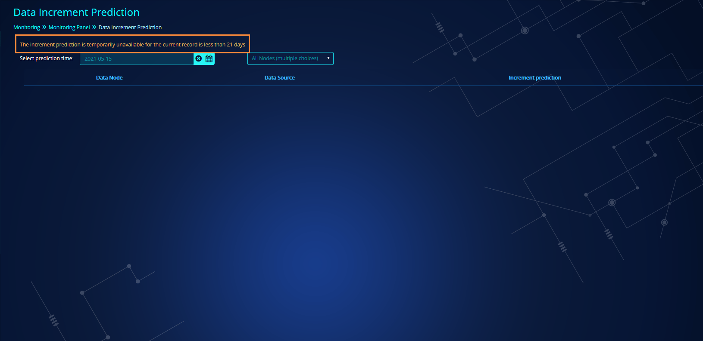

**（2）Select prediction time**

You can select the prediction time, and the minimum unit is day. The timeline of the curve is based on the selected prediction time.


The prediction time is today one year later by default.

Time range: Dates within three years from today. If today is May.15, 2020, only dates between May.16, 2020 and May.15, 2023 (May.15, 2020 is not included) can be selected. Other dates will be displayed gray.

**(3) Prediction data display**

The page is divided into three parts: data node, data source and the data increment prediction. Five pieces of information are displayed on a single page in descending order of data capacity. The data node or ConfigDB whose history data record is less than 21 days will be displayed at the bottom, as shown in the following figure:


- Display of data node: Data node/ConfigDB name + prediction result. For the data node plate, move the cursor over the plate, you can view the hyperlink effect; click the plate, you can jump to the data node details page. For the ConfigDB plate, there is no special effect. The prediction result displayed is the data capacity of the selected prediction time.
- Display of data source: IP_Port_Data source name. It displays all data sources under the data node and identifies the current active data source. If the number of data sources exceeds five, only five data sources will be displayed. Click ">> View more" to jump to the data node details page.
	
- Increment prediction: the prediction curve calculated by the management platform according to the history data amount and time of the current active data source or ConfigDB.

**(4) Prediction curve**

The prediction curve has two parts: one is the history data amount collected every day, which is displayed in the form of blue scatter; the other is the curve generated by fitting the collected history data, which is displayed in green solid line.


- X-axis: The prediction time. The starting time is the recording time of history data capacity within two years, and the ending time is the selected prediction time plus six months. If the recording time is Feb.6, 2019, today is Jan.23, 2020, the selected prediction time is Dec.23, 2020, which after plus six months is Jun.23, 2021, and the final length of this X-axis is Feb.6, 2019 to Jun.23, 2021.
- Y-axis: The data capacity. The unit size is from B to TB, and the unit changes automatically according to the value size.
- History data amount: Displayed in blue scatter. When the cursor is moved above the scatter position, the time and the corresponding data amount will be displayed.
	
- Increment prediction curve: Displayed in green solid line. Move the cursor above the curve, the specific time and corresponding prediction value will be displayed. A scroll bar is under the curve to facilitate the viewing of specific time periods. Click the zoom in button at the upper right to display the chart in full screen.
	
- Click View the current data, the curve will only display the prediction value of current prediction time, which is consistent with the prediction result displayed in the data node.
	

> !Note
>
> The data capacity predicted by the current prediction method is only for reference, which needs further manual judgment based on the actual situation. The longer data prediction time, the more accurate the prediction results.

#### Cluster resource monitoring

##### Server performance

When the server SSH information is configured on the "Configuration -> Server" page and the monitoring is enabled, the server resource details can be monitored in this monitoring panel. When the [Server](#server) page is "Stopped" or the SSH configuration is "Removed", the monitoring page removes the server monitoring, the monitoring information is displayed in pages, and 5 records are displayed per page.

**(I) Page information description**


When there is a record of server not configured with SSH information on the "Configuration -> Server" page, the monitoring page will provide a monitoring reminder, and server monitoring can be enabled by clicking the hyperlink to the [Server](#server) configuration page.

The monitoring status panel displays the detailed monitoring information for all servers included in the monitoring, including: CPU, memory, disk usage (switchable drive), and network traffic in/out (switchable monitoring network card).

The page displays the failure and warning records first by default with a priority of Failure > Abnormal.

The server can select multiple servers by the fuzzy search box in the filtering drop-down box; and the servers can also filter by status. The filtering items include: "Normal, Warning and Failure".


Click the "Status Box" to enter the details page, as shown above.

Click the \[Enlarge] button in the upper right corner of the monitoring module to enlarge and view the monitoring data.

##### Network quality

The management platform can monitor the network quality in the cluster operation link, and display the operation network quality, replication network, cross-IDC network, etc. according to the detection data.

###### Network quality topology


**（1）Page information description**

Triggering network quality detection manually will obtain the detection data of network quality executed this time. When \[Periodical refreshing] is checked, the management platform will periodically detect the network quality (10s/time) and display data, and the Latest detection time will be synchronously updated.

The filter server is a multi-selection drop-down box with a search box. All servers in the current cluster (servers associated with the cluster service program) are displayed in the drop-down box, among which the check box of the current active compute node server should be checked by default and grayed. As shown below:


**Network status descriptions:**

- Unlimited: data result of the latest detection.
- Normal: data of the latest detection is below the threshold.
- Latest detection exception: data of the latest detection is above the threshold, the latest detection failed to ping or the packet loss rate is 100%.
- Exception within 24 hours: within 24 hours, there is data above the threshold, detection failing to ping or the packet loss rate of 100%.

**Topology descriptions:**

Network quality monitoring pings all cluster servers outward for the current active compute node server.

If the cluster service programs are shared, the server attributes are divided according to the following priorities: master compute node>slave compute node>LVS>ConfigDB>data source.

Data is above the threshold (edges in orange), detection failed to ping or the packet loss rate is 100% (edges in red).

Right click to jump to "Monitoring -> Physical Topological Graph" to view the resources of the corresponding server.


###### Network quality overview

When entering the network quality page for the first time, the priority of the overview display of server network quality status is, by default, failure>alert>normality, and the data on the panel will not be automatically refreshed no matter you manually refresh the detection, switch the status filter label on the topology, filter the server or other operations. Click the corresponding server, and the network quality from the active compute node to the server will be displayed.


**Descriptions of network quality overview:**

- IP: the former IP is of the active compute node, and the latter IP is of the pinged cluster server. The IP has two statuses: normality (green) and exception (orange/red). Exception determination: the latest detection data is above the threshold (orange), detection failed to ping and the packet loss rate is 100% (red).

- The network quality data includes the latest detection data and data within 24 hours, which is divided into ping small packets and ping large packets. For the latest detection data, the max latency, average latency and packet loss rate will be displayed. When the packet loss rate is 100%, i.e. ping packets are all lost, max and avg will be displayed with "-" (no value); if any of the max latency, average latency and packet loss rate is above the threshold set by the management platform, it will be displayed in red. For data within 24 hours, the times of max latency>2ms, average latency>1ms or packet loss rate > 0% above the threshold within 24 hours will be counted and displayed.

- If there is an exception in the latest network quality detection, click the abnormal server, the time of the latest detection exception will automatically appear in "orange" on the monitoring quality overview page; if the latest network quality detection is in the normal status, the time of the latest detection exception will also appear in "blue".


###### Network quality panel

The network quality panel displays the corresponding network quality detection data. The data within 24 hours will be displayed by default. If it is less than 24 hours, the drag block will be hidden. By dragging the block towards left and right you can control the display of data within 7 days. Move the cursor into the line chart to view the data of specific time points. Click button in the upper left corner to switch the ping packet type, for which "ping small packets" is selected by default. Click "packet loss rate", "average latency", "max latency" to see the corresponding data. Data acquisition frequency of the monitoring panel is the same as data acquisition frequency controlled by the parameter pingPeriod in server.xml. In the case of network quality failure, the acquisition frequency will be automatically increased to once per minute (for the standard of network quality failure, please refer to the function description of relevant parameters of pingPeriod).


> !Note
> the threshold displayed in the network quality monitoring should be set through Monitoring Panel Setting>Cluster resource monitoring>Network quality. The switch is OFF by default. When it is OFF, the data threshold warning will not be displayed. If the switch is ON, the page will display and judge according to the specific value in the threshold setting, as shown in the following figure:
> 
> 
> 
> 

###### Cross-IDC network quality

The cross-IDC network quality overview and network quality panel are the same as those of the single IDC, which will not be described here in detail.

However, there are differences between the cross-IDC network quality topology and that of the single IDC.


**Page Description:**

The master compute node server in the master center needs to ping all servers in the master center except for itself and all servers in the DR center, so the master compute node server in the master center is placed in the master center and the DR center in the topology area above (as shown in mark 1 above);

The cross-IDC network quality topology only displays: the master center compute node server (including the master/slave compute nodes), the DR center compute node server (including the master/slave compute nodes), the master center ConfigDB server, the master center data source server, the DR center ConfigDB server, the DR center data source server;

If the server is shared by the service programs, the server role is divided according to the priority described in the single IDC network;

The cross-IDC network replication relation requires the network quality link connection according to the replication relation between the master/slave data sources of the master IDC and the DR center (as shown in Note 2 above);

The network quality from the current active data source/ConfigDB in the master center to the target standby data source/ConfigDB in the DR center can obtain the monitoring data only after SSH privilege is configured.


**IDC switching instructions:**


If the IDC switching happens, that is, the compute node of the current DR center provides service, only the network quality monitoring status of the DR center will be displayed; all components in the master center will be displayed gray with no monitoring. There will be no network connection from the DR center to the master center, and the network connection relation of the DR center degenerates to be consistent with that of the single IDC.

###### Email alert of network quality

Add a new monitoring item Network Quality through Event -> Email Alert Setting -> Add Notification Strategy, enable Cluster Resource Monitoring in Email Sender Setting and set the notification frequency of the monitoring item. If the network quality is above the set threshold, an alert email will be sent.


###### Network quality information collection

Add network quality detection data through Tool -> Information Collection.

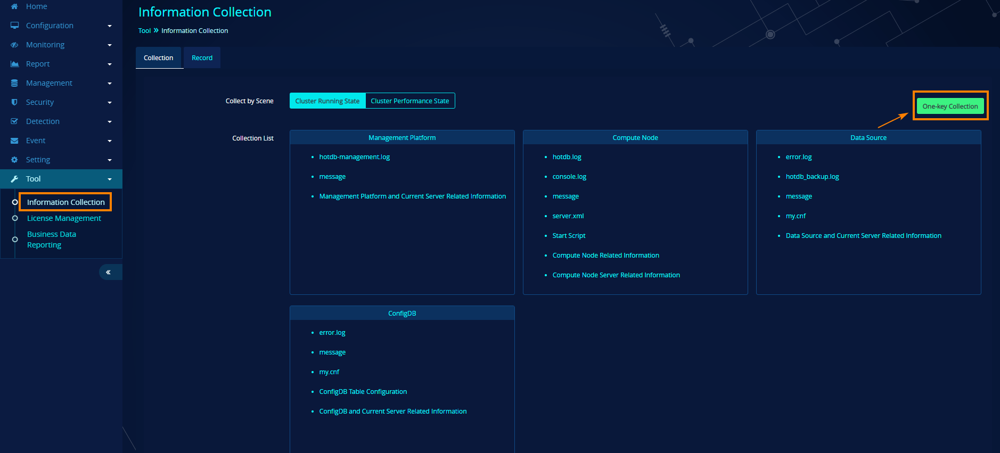

The detection data is added to the "server related information. txt" file in the corresponding server, as shown below:


### Monitoring management

The "Monitoring Management" function is to execute the compute node management port (default 3325) related commands through the management platform, and to view the relation between front-end and back-end connection of compute nodes and other effective management information.

#### Instructions before use

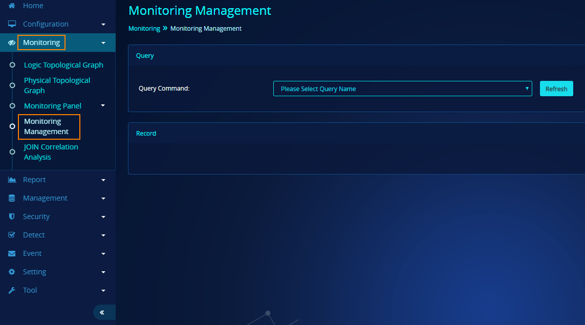

Multi-node mode cluster can choose the scope of executing query commands, and all compute nodes are selected by default. Single-node and master/slave node mode clusters do not need to select compute nodes, and query commands are executed on the current master compute node by default.

Commands need to be selected in the "Query Command" for execution. After first entering the function page and selecting the "Query Command", it is necessary to use the "Compute Node Database User" with SUPER privilege to login to the management port for cluster security. Only after successful login can the command be executed (except the display processlist command).

The "host" configured for the login user must contain the IP address of the server where the management platform is located, otherwise the login will fail.

The commands that can be queried online currently only include a part of the actual management port. The specific executable commands are shown in the following drop-down box.


The command can be sent to port 3323 or port 3325 for execution after login, the query result is displayed in the query panel, and the latest data can be obtained in real time through the \[Refresh] button.

#### Monitoring command description

##### Server Connection Information `show processlist`

This function is similar to the `show processlist` function of MySQL, which is used to view the current compute node server connection processing.


- Click \[Refresh] to re-execute the selected query command. If a filter condition is added, refresh to display the records that meet the filter criteria.

- You can use with the help of filter items, among which user, db, command and state are exact matches; host and info are fuzzy matches. Exact match search requires complete match keywords.

	If jing01 is the user, you need to enter the complete search keyword jing01 in the user input box before filter.
	
	
	
	If jing is entered, you cannot get the record information of user jing01.
	
	

- After entering the search keywords in the box, click Search to trigger a filter query. Click \[Reset] to clear the search box.

- After the `show processlist` query, move the mouse cursor into the header to display the comment information of the specific field.

- When moving the mouse cursor into the connection link in the operation bar, the prompt is displayed as below. Click the link to obtain the ID of this record and perform filtering query in command "display @@connection" (that is, Front-end Link Status). Note: If the login information of the node user expires, it needs to log in again.


##### Front-end Connection Status `show @@connection`

It displays the connection status of the compute node front-end connection (including the server and the management).


- After the command completes the query, select the connection ID and manually close the corresponding connection through the\[Close Connection] button.

- When moving the mouse cursor into the session link in the operation bar, the prompt is displayed as below. The [Current Session Information show @@session](#current-session-information-show-session) of the connection ID can be viewed. Click the link to obtain the connection ID of this record and jump to the session information viewing window.


- After entering the condition value in the filter input box and the drop-down box, click the \[Search] button to trigger the filtering action. Multiple filters are connected with "and".

- If the input box prompts "Fuzzy Search", the back-end uses fuzzy match. If the input box prompts "Search", the back-end uses exact match.


- Click the \[Reset] button to clear all values in the filter boxes.


- Click \[More] to expand search fields:


##### Current Session Information `show @@session`

It displays the current session processing information of the compute node.


- When moving the mouse cursor into the connection, backend, and lastsql links in the operation bar, the following prompt is displayed: "View the [Front-end Connection Status](#front-end-connection-status-show-connection), [Back-end Connection Status](#back-end-connection-status-show-backend), and [Finally Executed SQL](#borrowed-connection-finally-executed-sql-information) corresponding to the session ID. Click the link to obtain the id value of this record and jump to the related query command.

- Click connection to obtain the id value of this record and jump to `show @@connection`


- Click backend to obtain the bk_id field value and jump to `show @@backend`


- Click lastsql to obtain the bk_id field value and jump to `show @@lastsql`


##### Back-end Connection Status `show @@backend`

It displays the back-end connection of the compute node (that is, between compute node and data source).


- After the command is executed, click the \[Rebuild Connection Pool] button in the panel to rebuild the back-end connection. As with the management `rebuild @@pool` command, it prompt "Rebuild Succeeded/Failed" after the execution.

- When moving the mouse cursor into the session and lastsql links in the operation bar, the following prompt is displayed: "View the corresponding session information, view the finally executed SQL". click the link to obtain the id field value of this record and filter in the command `show @@session`, `show @@lastsql`. (the bk_id in `show @@session` record and the id in display@@lastsql record correspond to it). Click the session button in the operation bar:


- Click the lastsql button in the operation bar:


##### Data Node Information `show @@datanode`

It displays information about all data nodes in the current compute node. The query results include: "Current Data Source of Node", "Active Connection", and "Node Status".

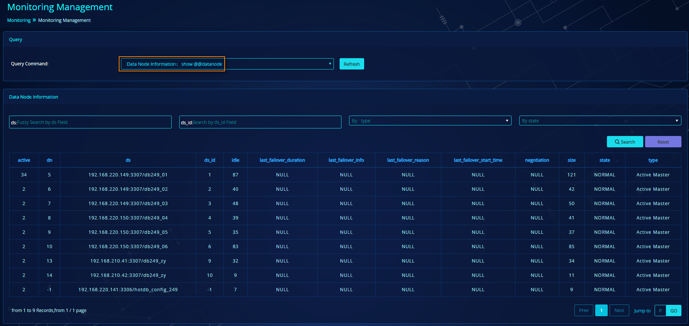

##### Data Source Information `show @@datasource`

It displays information about all data sources in the current cluster. The query results include: "Host IP Address", "Port", "Database Name", and "Unavailable Reason of Data Source".


##### Back-end Heartbeat Status `show @@heartbeat`

It displays the back-end heartbeat status of the current cluster. The query results include: Data Source Type, Host Address, Database Name, Heartbeat Status, and Heartbeat Period.


##### Synchronization Delay `show @@latency`

It displays the synchronization delay. The query results include "Current Data Source Path", "Slave Data Source Path", and "Synchronization Delay Time (in ms)".


##### Buffer Pool Status `show @@bufferpool`

It queries the buffer pool status. The query results include "Thread Name", "Buffer Pool Size", and "Local Cache Thread Application Buffer".


##### TeoThread Information `show @@processor`

It displays the current TeoThread Information. The query results include "Thread Name", "Byte Received by Front/Back End", and "Byte Sent by Front/Back End".


##### Thread Pool Status `show @@threadpool`

It displays the current thread pool status. The query results include "Thread Pool Name", "Thread Pool Size", and "Active Thread". Chinese prompt will be displayed when moving the mouse cursor to the column name.

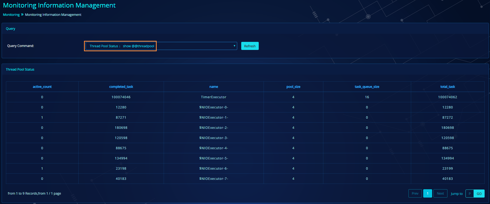

##### Long-lived Transaction `show @@longtransaction`

It displays the long-lived transaction and the query results include "Host IP Address", "Port", and "Long-Lived Transaction id". Chinese prompt will be displayed when moving the mouse cursor to the column name.


##### Compute node server status `show @@server`

It displays the compute node server status. The query results include the running startup information of the compute node server, such as "Memory Usage", "Read/ Write Mode", "Starting Time", and "High Availability Role". Chinese prompt will be displayed when moving the mouse cursor to the column name.


##### Borrowed Connection Finally Executed SQL Information

Queries of the borrowed connection finally executed SQL information is usually used to view the connection exception information. The results include: "Finally Executed SQL Statement", "Back-end mysql Connection id", "Host", and "Node".


##### Acquire the File under conf Directory and the Last Modification Time

It displays the modification record of configuration file.


### JOIN correlation analysis

The "JOIN Correlation Analysis" function is to map the JOIN correlation diagram of the table in current business scenario by parsing the SQL statement in slow query log (i.e. [Slow Query Log Analysis](#slow-query-log-analysis) list data), thereby allowing users to have a global monitoring of the current business join table query JOIN. It also provides the cross-node cross JOIN correlation diagram, and users can pay attention to the current cross-node cross JOIN situation to optimize the table structure or the SQL query statement.

#### Prerequisites for use

To view the JOIN correlation diagram, the following prerequisites shall be met:

- The current user has the [Slow Query Log Analysis](#slow-query-log-analysis) menu privilege;
- The current compute node parameter "Allow JOIN query" is on;
- The current compute node parameter "Statistics on SQL implementation conducted or not" is on;

#### JOIN correlation diagram

After selecting a logicDB and table name, all JOIN correlation diagrams (as shown below) or cross-node cross JOIN correlation diagrams can be viewed. The management platform refreshes the parse results at 0 a.m every day, or you can click  to manually refresh the parse results.

**Description of vertices and edges in the JOIN correlation diagram:**

The vertexes represent tables and are divided into four colors according to the table type（）.

The edge between vertex A and vertex B represents the JOIN/cross-node no-cross JOIN correlation between table A and table B, and the yellow edge indicates that there is an associated key rather than sharding key in the JOIN correlation.

The more the total JOIN/total cross-node JOIN queries, the larger the circle of the vertex; when moves the mouse cursor into the vertex, the table name and the total JOIN/total cross-node JOIN queries are displayed;

Scroll mouse to zoom the JOIN correlation diagram which displays the names of ten tables with the most total JOIN/total cross-node JOIN queries;

The table without JOIN correlation is displayed as scatter on the diagram, that is, if the table under the currently selected logicDB has no JOIN query or no-cross JOIN query record over cross-nodes, the selected table is displayed as scatter

Click on the vertex to display the JOIN Correlation Details;


**Cross-node cross JOIN query judgment logic:**

JOIN query that does not satisfy the following conditions is judged to be a cross-node cross JOIN query (as shown below):

- If the JOIN query is between two sharding tables, the two tables must have the same sharding type and node distribution, and the association conditions use respective sharding key to query, such as a.shardkey_a=b.shardkey_b;
- JOIN query between parent table and child table needs an equivalent association condition associated by join_key;
- If a global table exists in JOIN query, the node where the global table resides must contain all nodes where other sharding tables reside.
- If there is only a vertical sharding table in JOIN query, the nodes of these tables must be on the same node.


> !Note
>
> The judgmental logic of the management platform currently is simplified logic. Compared with a specific version of HotDB server, the judgmental results may be different under complex and special circumstances. For example, for the following two types of JOIN queries, the management platform may uniformly determine them to be cross JOIN correlation over cross-nodes, which may be a single-node query based on the value range:

1. The associated key contains the sharding keys of all tables and are equivalent judgements, for example:

	```sql
	select * from table01 join table02 on table01.shardcol=1 and table02.shardcol=2
	```

	Shardcol is the sharding key of two tables. If data values table01.shardcol=1 and thetable02.shardcol=2 share the same node, the JOIN query is a single-database query.

2. In case of associated query of two tables, one is a vertical sharding table and is stored exactly on the associated query condition node of the other table, for example:

	```sql
	select * from table01 join table02 on table02.i=10;
	```

	If all the data of table02.i=10 is stored on the data node dn_01, and table01 is a vertical sharding table also stored on dn_01, the JOIN query is a single-database query.

**Difference between cross-node cross and cross-node no cross:**

- Cross-node cross: JOIN queries require matching computation across data nodes;
- Cross-node no cross: JOIN queries need to be delivered to multiple data nodes, but only need to be computed in the data node. No cross-computation between data nodes is needed.

#### JOIN correlation details

Click on the vertex to display all/cross-node cross JOIN correlation details. This document takes All JOIN correlation details as an example. The table parameters are as follows:

- **JOIN Correlation Table:** A table with a JOIN correlation with the current table. The table name color is consistent with the vertex color according to the table type (). Click on the table name to jump to the JOIN Correlation Details page for the table.
- **Current Table Association Key:** The associated key of the current table in JOIN query statement. Multiple associated keys are indicated by parentheses, such as (a, b, c).
- **JOIN Correlation Table Association Key:** The associated key of the JOIN correlation table in JOIN query statement. Multiple associated keys are indicated by parentheses, such as (a, b, c).
- **Execution Condition:** The JOIN query statements with identical JOIN correlation table, current table associated key and JOIN correlation table associated key are displayed. Click \[Click to Expand] to view the execution details of all collapsed JOIN query statements.
- **Total Query:** The total accumulated queries of the collapsed JOIN query statements.
- **Orange corner mark:** This associated key or this group of associated keys has no index. Please combine the key value distribution, key type and length, query execution frequency, query filter condition, existing index in the table, etc. to determine whether to adjust the index.

> !Note
>
> **Associated field description:** The table uses the field associated with the JOIN query, for example: SELECT * FROM Persons INNER JOIN Orders ON Persons.id = Orders.oid, then the id is the associated key of Persons, and oid is the associated key of Orders


Click \[Click to Expand] to view the execution details of all collapsed JOIN query statements. Click on the details under Compute Node Average Execution Time to jump up to the Slow Query Log Analysis page.


## Report

The cluster data volume report, throughput report and connection status report are visualized to provide the graph mode and the table mode, and the data report can be viewed through different dimensions.

### Cluster data amount

The data amount distributions of data nodes, logicDB and tables for all members in the cluster are displayed in graph mode and report mode.

#### Graph mode

The graph mode has four dimensions. The data volume reports of all members in the cluster are displayed by default. The data volume reports of data nodes, logicDB and tables to be displayed can be selected.


- The default displayed compute node cluster level is divided into 4 graph areas. The data statistics of 4 graph areas are unified, and the statistical made can be [data row or data capacity](#statistical-mode-descriptions).

**(I) Cluster DataAmount Change Trend Chart**


- This chart describes the change trend of data amount in the whole compute node cluster in a certain period of time.
- This chart is a line chart with two coordinate axes for time and data volume respectively.
- The time range options include Last Year, Last Three Months, Last Month, Last Week, Last Day, and Custom. When the time range is less than 7 days, the trend chart is displayed with data collected every hour. When the time range is over 7 days, the trend chart is displayed with data collected at 23:00 per day.
- Cluster Data Amount Change Trend Chart can be enlarged.

**(2) Cluster Data Amount Distribution Map**


- It depicts the distribution of data volume in the whole compute node cluster in the data node dimension at a certain time point.
- It may be a bar graph or a pie graph which can be switched. The coordinate axes are data node and data volume.
- It supports enlarging the graph to full screen.
- It allows to filter nodes.
- Click on a bar or fan on the map to enter the data volume report at the corresponding data node level.
- Bar graph supports the sorting function, including ascending and descending orders.

**(3) LogicDB Data Amount Distribution Map**


- It depicts the distribution of data volume in the whole compute node cluster in the logicDB dimension at a certain time point.
- It may be a bar graph or a pie graph which can be switched. The coordinate axes are logicDB and data volume.
- It supports enlarging the graph to full screen.
- It allows to filter logicDB.
- Click on a bar or fan on the map to enter the data volume report at the corresponding logicDB level.
- Bar graph supports the sorting function, including ascending and descending orders.

**(4) Table Data Amount Distribution Map**


- It depicts the distribution of data volume in the whole compute node cluster in the table dimension at a certain time point.
- It may be a bar graph or a pie graph which can be switched.
- The table name is displayed in the form of `[LogicDB name].[table name]`, which is usually long. The bar graph is horizontal here.
- It supports enlarging the graph to full screen.
- It allows to filter tables.
- Click on a bar or fan on the map to enter the data volume report at the corresponding table level.
- Bar graph supports the sorting function, including ascending and descending orders.

#### Table mode

In addition to the "Graph Mode", Cluster Data Volume can also view the data distribution of each table under each data node in the whole cluster through the "Table Mode".

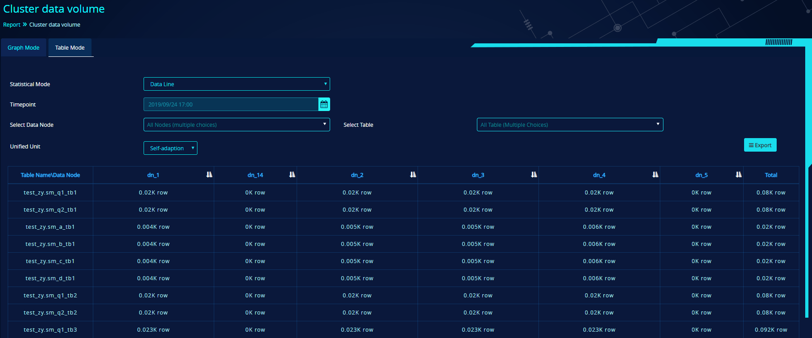

- The interface record can export the table data volume information to the local through the \[Export] button. Currently, the file in the "CSV" or "XLS" format can be exported.

- Statistical modes include: ["Data Row" or "Data Capacity"](#statistical-mode-descriptions). When the statistical mode is Data Row, 1K=1000, 1M=1000*1000; when the statistical mode is Data Capacity, 1KB = 1024B, 1MB = 1024B*1024 and so on.

- If data volume statistics involve the global table, the sum of data volume of all data nodes is counted when calculating at the logicDB dimension, the data volume of each data node is separately counted when calculating at the data node dimension, and the average data volume of the data node where the table reside is counted when calculating at the table dimension.

#### Statistical mode descriptions

At present, the compute node cluster data volume supports two statistical modes: data row and data capacity. Data row comes from the total number of table rows in information_schema.tables, which is not that precise because the parameter itself is the estimated value; data capacity comes from the total number of data_length in information_schema.tables, which cannot accurately reflect the real data capacity because the parameter is based on the allocated data blocks and is affected by the change of data fill rates in the data block.

If you need to know the size of real data rows, you can calculate the size of each row according to different data types by yourself and then add them.  Such calculation method, however, needs to scan all the data of the whole table, which has high cost and the possibility of affecting the operation of the database.

### Compute node throughput

Compute node throughput is the operations sent by the front-end application to the compute node. Five types of user operations are generally described: SELECT, UPDATE, DELETE, INSERT, and OTHER.

#### Graph mode

The graph mode has four dimensions, including the whole cluster throughput. The operation type, logicDB, and table throughput can also be displayed.


- The statistical scale and statistical mode of all throughput charts are consistent.
- Statistical scales include: month, day, hour and minute.
- Statistical modes include: total throughput and average throughput rate.

**(I) Compute Node Throughput Change Trend Chart**


- It describes the change trend of throughput in the whole compute node cluster in a certain period of time and the proportion of each operation in the total throughput.
- This chart is area chart with two coordinate axes for time and throughput respectively. Different color bars in the area indicate the throughput of different operations.
- The time range includes: Last Month, Last Three Months, and Custom.
- When the mouse hovers over a certain point, the throughput data of each operation is displayed. When clicking a point on the chart, the time points of the last three charts are set to be consistent with the time point.

**(3) Compute Node Throughput Type Comparison Chart**

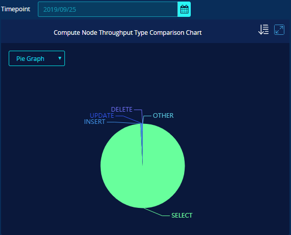

- It describes the proportion of each operation in the throughput of the whole compute node cluster over a period of time.
- It may be a bar graph or a pie graph which can be switched, and is a pie graph by default. The coordinate axes are operation type and throughput.
- The pie chart displays percentage and specific number at the same time.
- It supports enlarging the graph to full screen.
- Bar graph supports the sorting function, including ascending and descending orders.

**(3) LogicDB throughput Comparison Chart**


- It describes the comparison of throughput in the whole compute node cluster in the logicDB dimension at a certain time point.
- It is a stacked bar graph with values displayed at each layer. The coordinate axes are logicDB and throughput.
- It supports enlarging the graph to full screen.
- It allows to filter logicDB.
- Click on a bar on the chart to enter the corresponding [LogicDB Dimension Throughput Report](#logicdb-dimension-throughput-report).
- Bar graph supports the sorting function, including ascending and descending orders. Sorting can be based on the throughput type.

**(4) Table Throughput Comparison Chart**


- It describes the comparison of throughput in the whole compute node cluster in the table dimension at a certain time point.
- It is a stacked bar graph with values displayed at each layer. The coordinate axes are table and throughput.
- The table name is displayed in the form of \[LogicDB name].\[table name].
- It supports enlarging the graph to full screen and allows to filter tables.
- Bar graph supports the sorting function, including ascending and descending orders. Sorting can be based on the throughput type.
- Click on a table bar on the chart to enter the corresponding [Table Dimension Throughput Report](#table-dimension-throughput-report).

#### LogicDB Dimension Throughput Report


LogicDB level is divided into three graph areas. The statistical time scale and statistical mode of the three graph areas are consistent. It supports filtering the logicDB. The \[Back to Compute Node View] throughput report button is in the upper right corner.

#### Table Dimension Throughput Report


The table level is divided into three graph areas. The statistical time scale and statistical mode of the three graph areas are consistent. It supports switching tables and logicDB through the checkbox. When switching logicDB, it switches to the table with the smallest id under the logicDB by default. The \[Back to Compute Node View] throughput report button is in the upper right corner.

#### Table mode

In addition to the "Graph Mode", Compute Node Throughput can also view the SELECT, UPDATE, DELETE, INSERT and OTHER operations of each table in the whole cluster through the "Table Mode".


- Statistical modes include: total throughput and average throughput rate.
- Statistical scale: month, day, hour and minute.
- Unified units include: adaptive, times, K, M, G.
- CSV and XLS files can be exported.
- The table name is displayed in the form of \[LogicDB name].\[table name].

### Data node throughput

The data node throughput is the operation quantity statistics of the compute node to the data source. Generally, the user operations are described by five types: SELECT, UPDATE, DELETE, INSERT, and OTHER.

#### Graph mode

The data node throughput graph mode includes five dimensions: data node throughput total comparison graph, data node throughput change trend comparison graph, cluster throughput type comparison graph, logicDB throughput comparison graph, and table throughput comparison graph.

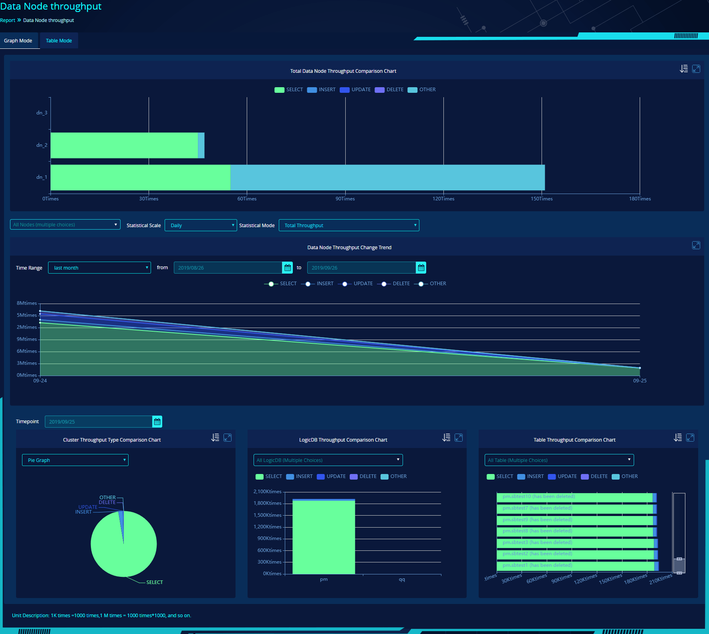

**Total Data Node Throughput Comparison Chart**


- It describes the total throughput of each node, and only calculates the throughput of master data source under the current data node.
- The operation amount is accumulated from the start of the compute node. The data is stored in the ConfigDB of the management platform and is retained for 365 days by default. You can adjust the parameter " hotdb.management.dataExpired.day " in the management platform configuration file application.properties.
- The throughput of different operation types of each node can be viewed by selecting the operation type.
- It supports enlarging the graph to full screen.

**(2) Data Node Throughput Change Trend**


- It describes the change trend of throughput of all data nodes in a certain period of time and the proportion of each operation in the total throughput.
- This chart is area chart with two coordinate axes for time and throughput respectively. Different color bars in the area indicate the throughput of different operations
- The time range includes: Last Month, Last Three Months, and Custom.
- It supports enlarging the graph to full screen.
- When the mouse hovers over a certain point, the throughput data of each operation is displayed.

**(3) Cluster Throughput Type Comparison Chart**


- It describes the proportion of each operation in the throughput of all data nodes at a certain time period.
- It may be a bar graph or a pie graph which can be switched, and is a pie graph by default. The coordinate axes are operation type and throughput.
- The pie graph displays percentage and specific number at the same time.
- It supports enlarging the graph to full screen.
- Bar graph supports the sorting function, including ascending and descending orders.

**(4) LogicDB throughput Comparison Chart**


- It describes the comparison of throughput of all data nodes in the logicDB dimension at a certain time point.
- It is a stacked bar graph with values displayed at each layer. The coordinate axes are logicDB and throughput.
- The drag box will be displayed when there are over 8 logicDB.
- It supports enlarging the graph to full screen.
- It allows to filter logicDB.
- Bar graph supports the sorting function, including ascending and descending orders. Sorting can be based on the operation type.

**(5) Table Throughput Comparison Chart**


- It describes the comparison of throughput of all data nodes in the table dimension at a certain time point.
- It is a stacked bar graph with values displayed at each layer. The coordinate axes are table and throughput.
- The table name is displayed in the form of \[LogicDB name].\[table name].
- It supports enlarging the graph to full screen.
- It allows to filter tables.
- The global table select throughput only counts one node, and the INSERT, UPDATE, and DELETE operations count all nodes.
- Bar graph supports the sorting function, including ascending and descending orders. Sorting can be based on the operation type.

#### Table mode

In addition to the "[Graph Mode](#graph-mode)", Data Node Throughput can also view the SELECT, UPDATE, DELETE, INSERT and OTHER operations of each table in the whole cluster on each node through the "[Table Mode](#table-mode)".


- Statistical modes include: total throughput and average throughput rate.
- Statistical scale: month, day, hour and minute.
- Unified units include: adaptive, times, K, M, G.
- CSV and XLS files can be exported.
- The throughput related to global table is counted according to the throughput type. The SELECT counts only one node, and the INSERT, UPDATE and DELETE throughput count all nodes. If a statement involves cross-node throughput, the number of throughput of each node is counted.

### Compute node connection

The Compute Node Connection Report function displays the status of all connection information associated with the compute node, and records information about the front-end application and user access, such as the number of connections, connection duration, and number of operations.

#### Graph mode

The graph mode mainly displays the total application connections of the current compute node, three TOP1 connections (connection with the longest connection duration, connection with the most operations, and connection with the most connection times), proportion of total connection duration, proportion of total connection times, proportion of number of operations, front-end application IP connection distribution map, connection user distribution map, and logicDB distribution map.


Connections in the selected range can be filtered according to the time range, and all connections in the last three months are displayed by default. This time range is valid for all data in graph mode, and is the primary condition for all query result reports.

**(1) Total application connections**

It displays the number of application connections to the compute node currently, and a connection is determined by the front-end application IP + connection user + logicDB (actually use the logicDB).

**(2) Connection with the longest connection duration**

It displays the connection with the longest duration of connection to the compute node in all current connections.

Duration calculation method: In the selected time range, the connection duration of same connections (consistent IP+connection user+logicDB) is accumulated. If a connection is not ended within the query period, the time at which the query range ends is used as the temporary end time of the connection for statistics.

> !Note
>
> If the statistical units, that is, IP + LogicDB + connection users are consistent, it will be counted as a connection. Thus, the connection duration of A (this connection has 1000 concurrencies at the same time and each concurrency duration is 1 minute) may be longer than the connection duration of B (this connection has only one concurrency and the concurrency duration is one hour)

**(3) Connection with the most operations**

It displays the connection with the most operations (SQL operations sent to compute nodes) in all current connections.

Operation calculation method: In the selected time range, the operations of same connections (consistent IP+connection user+logicDB) are accumulated. If a connection is not ended within the query period, the time at which the query range ends is used as the temporary end time of the connection for statistics.

**(4) Connection with the most connection times**

It displays the connection with the most times of connection to compute nodes (1 connection is the period from establishment to end) in all current connections.

Connection times calculation method: In the selected time range, the same connections (consistent IP+connection user+logicDB) are accumulated to obtain the connection with the most connection times. If a connection is not ended within the query period, it will be counted as one connection.

**(5) Proportion of total connection duration**

It analyzes the proportion of connection duration of all connections within the query time range.

Calculation method for proportion of total connection duration: In the connection data within the query time range, take the maximum and minimum connection duration (accumulated value of same connections), and then divide the difference between the maximum duration and the minimum duration into 5 equal parts to calculate the proportion of connections in each interval in the total connection.

> **For example:**
> 
> Time interval selection: 2018-10-10:00 to 2018-10-11:10:00,
> 
> After the same connection information is merged, the total application connection is: 50
> 
> Maximum connection duration, 40s, minimum connection duration: 5s, the difference is divided into 5 equal parts (5-11s, 12-18s, 19-25s, 26-32s, 33-40s), i.e. 5 equal-scale dimensions (maximum connection times and maximum operations are the same, and the difference is divided into 5 equal parts)
> 
> 5-11s connection: 5, proportion: 5➗50=10%
> 
> 12-18s, 20, proportion: 20➗50=40%
> 
> 19-25s: 8, proportion: 8➗50=16%
> 
> 26-32s: 7, proportion: 7➗50=14%
> 
> 33-40s: 10, proportion: 20➗50=20%
> 
> The proportions are obtained according to the properties of each connection information in the same manner

**(6) Proportion of total connection times**

It analyzes the proportion of connection times of all connections within the query time range.

Calculation method for proportion of connection times: In the connection data within the query time range, take the maximum and minimum connection times (accumulated value of same connections), and then divide the difference between the maximum times and the minimum times into 5 equal parts to calculate the proportion of connection times in each interval.

**(7) Proportion of number of operations**

It analyzes the proportion of number of operations of all connections within the query time range.

Calculation method for proportion of number of operations: In the connection data within the query time range, take the maximum and minimum number of operations (accumulated value of same connections), and then divide the difference between the maximum number of operations and the minimum number of operations into 5 equal parts to calculate the proportion of number of operations in each interval.

**(8) Front-end application IP connection distribution map**

It displays the IPs of application connections to the compute nodes within the query time range. When there are too many IP addresses, drag the bottom drag bar to display more. IP distribution information can also be viewed by the Enlarge button or sorting.

The X-axis displays "Application Connection IP" by default. The horizontal coordinate can be switched to the "Connection User" or [LogicDB](#logicdb) dimension through the "Query by Connection Information" filter box. When modifying the X-axis to view dimensions, the chart title will also be switched accordingly.

The Y-axis displays "Total Connection Duration" by default. The vertical coordinate can be switched to the "Total Connection Times" or "Operation Times" dimension through the "Query by Connection Properties" filter box. Switching the filter box will change the Y-axis display dimension of bottom secondary charts.

Click the specific bar in the icon to link with the display effect of bottom secondary charts "Connection User Distribution Map" and "LogicDB Distribution Map". For example, when clicking on the application connection IP "192.168.200.30", the bottom "Connection User Distribution Map" displays the connection users used for clicking the IP, and the "LogicDB Distribution Map" displays the logicDB used for clicking the IP.

**(9) Connection user distribution map**

The user distribution of the first application connection IP (when the X axis of the chart above is the "Application Connection IP" dimension) is displayed by default. Click on the specific IP bar above to view the user distribution of other application connection IP.

The displayed connection users can be filtered and viewed, or the information to be viewed can be displayed by sorting and enlarging.

The chart title of this module will change with the switch of filter box "Query by Connection Information".

**(10) LogicDB distribution map**

The logicDB distribution of the first application connection IP (when the X axis of the primary chart is the "Application Connection IP" dimension) is displayed by default, that is, the logicDB connected in the IP.

The displayed connection users can be filtered and viewed, or the information to be viewed can be displayed by sorting and enlarging.

The chart title of this module will change with the switch of filter box "Query by Connection Information".

#### Table mode

In addition to displaying connection information in graph mode, the details of each connection can be viewed in table mode and can be exported for local storage.


- The record displayed is the front-end application information (IP+Connection User+LogicDB Identification) of each connection to compute nodes, and the same connection information is aggregated into one.
- The multi-node mode cluster supports querying the compute node service through which each connection connects to the logicDB.
- All data in the report is saved for up to one year by default, and the connection data information of more than one year is automatically cleared.
- In the table mode, the current survival status of each connection can be viewed.

## Management

The management menu mainly provides the functions for managing business data, such as backup and recovery of data or execution of DDL statements of business tables.

### Data backup

Data backup is a disaster recovery backup function for business data to ensure that the data backup can be restored in case of data loss or damage. At present, the data backup function needs to rely on the backup function HotDB Backup self-developed by Hotpu, and only supports logical backup currently.

#### Introduction to HotDB Backup

MySQL's own mysqldump tool exports multiple tables in turn through a single-thread work, but it lacks a parallel mechanism, which makes it impossible to back up data quickly. As a utility tool, mydumper can support multi-threaded work well, and can read data in parallel multi-threaded tables and write data to different files at the same time, which makes it faster than traditional mysqldump in processing speed. One of the functions of mydumper is that the list needs to be locked during processing, so if we need to perform backup work during the working hours, the DML blocking will occur. But generally MySQL now has master and slave, and most of the backups are performed on standby slave, so the lock problem can be ignored and mydumper can better complete the backup task. There is also a local program similar to mydumper in HotDB Server. Each data node uses this program to listen for requests from HotDB-Management and complete data backup. The program is called "HotDB Backup".

#### Installation description

To use the data backup function of HotDB Management, it needs to install the HotDB Backup program on the server where the backed-up data source reside. For the installation and deployment of HotDB Backup, please refer to the [backup program deployment](installation-and-deployment.md#description-of-implementing-password-free-login) chapter of [Installation and Deployment](installation-and-deployment.md) document.

#### Manual backup

**(1) Start backup**


Click "Manage -> Data Backup -> Backup Task -> \[Start Backup]" to manually start a backup task.

**(2) Select backup method**


- **LogicDB:** Backup is performed in unit of logicDB, and one or more logicDB can be selected for backup at a time.
- **Backup Type:** Full Backup and Incremental Backup. "Full Backup" is to backup all data in the current logicDB, and "Incremental Backup" is to continue backing up the new binlog based on the last full or incremental backup. Note: In the first incremental backup, it needs to ensure that the logicDB to be backed up has had a full backup, otherwise the incremental backup cannot be started.
- **Backup logicDB simultaneously:** When the backup is started, the configDB data backup is performed once, with the same effect as manual backup in the "Config Data Backup & Restore".
- **Compute the File MD5 Value or not:** It is checked by default, and mainly records the MD5 value of backup file to facilitate the comparison of file MD5 values during data recovery to ensure the integrity and consistency of data.

**(3) Backup setting**


- **Backup the binlog from last Full Backup to now simultaneously:** It is checked by default, and is used to backup the binlog from last full backup to the current full backup. Note: This is an insurance measure, but the last full backup will not be found during the first full backup, so this option is meaningless for the first full backup.
- **Local Backup Root Directory:** It is the local directory of the server where each data source resides and backup file is stored. This directory needs to be created in advance on the server where each node resides, and the directory of each server shall be consistent. Otherwise, the backup fails and the backup failure message prompts: Failed to create backup directory.

> !Tip
>
> when the data is backed up under different directories due to different hardware specifications and configuration methods of servers, you can use the soft link to unify the directories used for backup.

- **Compression Method:** It is used to control whether the backup file is compressed, with options of No Compression, ZLIB Flow Compression, and LZ4 Compression. LZ4 compression is to first output the file and then call the system compression operation command.
- **Encryption Method:** It is used to control whether the backup file is encrypted, with options of No Encryption, 3DES, and AES. When selecting other encryption methods, it needs to enter the encryption password which is used for decryption in data recovery.
- **Backup File Format:** It is used to control the data format of backup file, and is divided into SQL, MySQL CSV and standard CSV. The default format is SQL. Note: The standard CSV format is mainly used for data exchange with other systems, such as exporting data to Hadoop, but it does not support recovery currently.
- **Backup Statement Option:** When the backup file format is SQL, the SQL to be backed up can be in the insert, insert ignore or replace form.
- **Backup to Remote Path Simultaneously:** The backup file can be transferred to a remote server. It is not checked by default. When backing up to a remote server, all backup files are merged and transferred to the specified directory on the remote server.
- **Remote Replication Mode:** it is divided into: SCP and RSYNC. It is recommended to use the SCP mode. If RSYNC is used, it shall be deployed on a remote server.
- **Remote Replication IP, User and Password:** Fill in the information of the actual remote server.
- **Remote Backup File Root Directory:** The directory for storing backup files shall be filled out according to the actual situation, but it needs to be created in advance.

**(4) Backup task record**


The backup task completed or being executed are displayed on the Backup Task page.

- **Backup sequence number:** unique identification of each backup task
- **Task type:** displays whether the backup task is a manual backup or a scheduled backup
- **Backup type:** displays whether the backup task is an incremental backup or a complete backup
- **LogicDB:** displays which LogicDB are to be backed up
- **Start time:** displays the start time of backup task
- **End time:** displays the end time of the backup task. If the backup task is not completed, the expected end time will be displayed
- **Total time consumption:** displays the time consumption of backup task
- **Backup status:** displays the status of the current backup task, including backup failed, backup invalid, backup completed, backup in progress, cancelling, manually cancelled, automatically cancelled, and delayed. The backup task being executed will display the backup progress in the form of progress bar.
- **Operation:** click "details" to display the backup details of the current backup task, failure reason, etc.

Failed and invalid backup will be displayed in the backup list with the and marks. When moving the mouse cursor to them, the specific reason will be displayed.

Click \[Delete Record] to delete the backup record on the page. Whether the backup file in the server is deleted simultaneously can also be checked, but the backup file on the remote server will not be deleted. (for example, setting up a backup to a remote server).

#### Backup plan

The backup plan can set periodical backup task for HotDB Management. After setting the periodical backup plan, all backup tasks are performed by the periodical plan on time without manually starting the backup task.


**(1) Add backup plan**


Click "Manage -> Data Backup -> Backup Plan -> \[Add New Plan] in HotDB Management to enter the Add Backup Plan page.

- **Backup Plan Name:** Users can set the backup plan name which shall not be same as the existing backup plan name.
- **LogicDB:** The logicDB needs to be backed up in periodical backup. One or more logicDB can be selected for backup.
- **Full Backup Period:** Users can select the full backup period based on actual business needs.
  After the "Full Backup Period" is selected, detailed settings such as "Period Time: Date of Specific Full Backup", "Backup Window Period: Time Range of Backup Start", and "Timeout: If the backup task is not completed within the set time, the backup will be canceled automatically and it needs to be checked to take effect" can be performed on full backup.
- **Incremental Backup Period:** It is checked by default. If not, the backup plan only performs full backup and no incremental backup will be performed.
  Incremental backup execution time can be set, and an incremental backup is executed after 4 hours of full backup by default.
- **Backup File Retention:** The retention time of backup file in the server directory can be set, which is 7 days by default.

> **Notes on "Backup File Retention":**
> 
> 1. The file retention period is only for scheduled backups (i.e. for manual backups, the backup file will not be deleted).
>
> 2. The file retention period is the retention time of the backup file. The backup record will not be deleted accordingly.
> 
> 3. The scheduled task is executed at 0:00 every day. When the backup is deleted, a full backup will be reserved, that is, it does not fully match the time (for example, if the retention period is 24 hours, a full backup A which is greater than or equal to 24 hours will be found, and all automatic backup files before A will be deleted).

- **Add Exception or not:** Exceptions for backup can be set in the periodical backup plan. For example, if a periodical plan executes a full back at 0:00 a.m. every morning and executes an incremental backup every 4 hours, but xxx is set as an exception, the backup plan will not be executed on that day.
- **Backup Setting:** For details, please refer to the "Backup Setting" description in "Manual Backup".

**(2) Specific setting instructions for backup plan**

Backup plan can set timeout cancellation or add exceptions (no backup plan is executed).

The added backup plan can postpone the "next backup task". Click "Management -> Data Backup -> Backup Plan -> Page Record \[Delay the Next Backup Time]" to set the execution delay time.

After setting \[Delay the Next Backup Time], the program will automatically check "whether there are periodical backup tasks between the last backup task completion time and the next task delay time". If there is no interval, successful modification will be prompted directly. If there are periodical backup tasks, a prompt will pop up to inform the user as shown below:


Click \[Unified Delay and Save] to set the periodical task to the delay state in the background. When the next backup task is completed, the periodical task will be executed according to the set backup period. After clicking \[Automatic Cancel and Save], the periodical task will be canceled by default and the backup task will not be executed in the background.

After the delayed backup task is completed, the backup type recorded on the page is "Delayed Completion".

#### Special instructions for backup

When the backup task is enabled, if there is a long-lived transaction (that is, a long uncommitted transaction and an operation statement that has been executed for a long time) in the backed up data source, the backup will not be started immediately, and will be executed after the long-lived transaction retry mechanism is completed.

If the current data source page is not configured with a backup user account, the backup will use the data source connection account for backup. When the backup is completed, it will prompt: "The current backup uses the connection account, please add a dedicated backup account on the data source configuration page".

Example of statement created by backup user:

```sql
GRANT SELECT,INSERT,UPDATE,DELETE,CREATE,DROP,INDEX,ALTER,RELOAD,PROCESS,REFERENCES, SUPER,LOCK TABLES,REPLICATION SLAVE,REPLICATION CLIENT,TRIGGER,SHOW VIEW,CREATE VIEW,CREATE ROUTINE,ALTER ROUTINE,EVENT ON *.* TO 'DBBACKUP'@'127.0.0.1' IDENTIFIED BY 'DBBACKUP';
```

Note: Data source instances deployed by HotDB Management generate DBBACKUP users by default, needing no special creation.

All backup files are stored in the backup directory by the backup task ID. The file directories are: Backup Task ID -> Data Source Name -> Database Name -> Table Data/Table Definition Statement. In each backup, in addition to the data, `my.cnf`, account and privilege data are backed up simultaneously and stored in the same directory of data source. The data and table definition statements are stored in the lower directory of data source.

The backup task is performed on the master data source being used by the current node. When the data source is switched, the backup object will also be switched. But since only the active master is backed up and the standby slave is not backed up, the incremental backup on standby slave cannot be executed until a full backup is available.

If the `my.cnf` file is backed up, it shall exist in any of the following paths: `/etc/my.cnf`, `/etc/mysql/my.cnf` and `/usr/etc/my.cnf`, otherwise the configuration file cannot be backed up.

HotDB-Backup does not need to be restarted when closing or restarting HotDB-Management.

The reasons for backup failure include but are not limited to:

- Backup file directory does not exist
- HotDB-Backup program is not deployed or started
- Data source user privilege for backup node is insufficient
- There are other backup tasks in progress
- User, password and server IP information of the remote backup are incorrect
- The server where the node backed up is not installed with RSYNC
- The server backed up has no free disk space or no sufficient disk space
- Data source cannot be connected

The reasons for backup failure include but are not limited to:

- Modify the data source name, hostname, port and database
- Modify the table name, logicDB, table type, sharding key, sharding mode and data node of undefined tables
- Modify the sharding function that has been applied to the table and add route information (that is, modify the sharding function of defined/undefined tables)
- Modify the default node of the logicDB (that is, the default node that affects automatic table creation)
- Add a new table, and the table introduces nodes not included in the previous backup
- Modify defined tables by online modification of the sharding plan
- DDL executed by the table automatically created through automatic table creation statement or setting default data node in logicDB to bypass the management platform
- (CREATE/ALTER/DROP/TRUNCATE/RENAME) operation

#### Backup log description

- `Start backup `means to start the backup task.
- `Backup is stopped` means that the backup task is stopped.
- `Connected to server successfully!` means that connection is established normally between backup program and Management.
- `Get a quit signal from user, will quit after backup is finished` means that the backup program quits normally.

### Data restore

When business data is damaged or lost, Data Restore function can be used to restore the backed up data to a damaged or lost logicDB.

**Data restore sequence diagram:**


#### Start restore


**(I) Start instructions**

Click "Data Management -> Data Restore -> \[Start Restore]" to jump to the data restore page.

For data security reasons, if there is no data backup for more than 3 h before the restore is started, the user will be informed whether to execute a backup immediately. If a backup is needed, it will jump to the backup window for Manual Backup first.

**(2) Page description**

- **LogicDB:** One or more logicDB can be selected to restore.
- **Restorable Timepoint:** the backup time point that can be restored. Hotdb Management calculates the target time interval that can be restored currently according to the backup file information of the corresponding logicDB recorded, that is, the time point when the backup of logicDB is successful and not cleaned up (excluding the backup that is invalid due to lonfigDB modification).
  You can also select to restore to any restorable time point after selecting "restore to the user-defined time point". For details, please refer to [(III) restore to the user-defined time point](#restore-to-user-defined-time-point).
- **Full Backup to be Used:** the file information that can be restored, which is the latest full backup file by default. Deleted or invalid files are not displayed (backup files shall be fully consistent with the logicDB).
- **Incremental Backup to be used in Restore:** Calculate the incremental backup to be used based on the selected restore time point and the full backup to be used selected by users. If there are multiple incremental backups, the latest incremental backup is displayed by default.
- **Whether to Conduct Drop Operation for the Restored Table before Restore:** It is checked by default, otherwise the restored table shall be deleted manually. If restore is executed directly without checking this option and deleting the restored table manually, users will be prompted that the table already exists.
- **Full Backup File Encryption Method:** Unencrypted, 3DES and AES. By default, it will be the encryption method used in full backup.
- **Full Backup File Encryption Key:** It is not displayed when the encryption method is Unencrypted.

**(3) Restore to the user-defined time point**{#restore-to-user-defined-time-point}


After selecting "restore to the user-defined time point", select any time point within the restorable time range through the second-level time selector. The restorable time range is from the earliest time point when the current LogicDB backup succeeds and has not been cleared till the latest time point.

If the selected time point can only correspond to one full backup, while it is within the restorable time range, it can only be restored to the time of full backup instead of the specified time.

If the cluster is non-XA cluster, when it is restored to the user-defined time point, data consistency is not guaranteed, and there may be half a transaction, and the restore end point is the local time of each node rather than the time of the compute node. It is recommended to use this function only in clusters with XA transaction enabled.

When a user-defined time point is selected, the full backup and incremental backup used for restore will be automatically filled. Click \[start restore] to restore to the user-defined time point.

#### Instructions for executing data restore


Input the correct restore information into the restore page, and jump to the restore page after submitting the restore task. The task status displays Restore in Progress and the restore process update. If the deletion operation is triggered at this time, it prompts "Restore in Progress, Cannot be Deleted".

The compute node will suspend the service during the restore period and restart the service automatically after the restore. (If the restore fails halfway, the compute node service needs to be started manually.)

All ongoing transactions are rolled back before the compute node service is stopped on restore.

The corresponding tables under the database is parsed when starting restore, except for tables have been restored (the backup logicDB has data source crossing), and the heartbeat table will be restored.

If a data node with SQL execution errors occurs in restore, all data sources under the data node are unavailable and require manual intervention by DBA.

Backups all follow the data source being used currently. If the data source is switched during the restore process, the current restore task will be marked as failed. Data restore can only be performed after the original failed data source is restored, in the absence of a new full backup.

If the configDB is backed up when backing up, the configDB is not restored in restore operation.

#### Recovery task details


Completed data recovery tasks can be viewed for recovery task details.

- **LogicDB:** The logicDB included in the recovery.
- **Operator:** HotDB Management user who Starts the recovery task.
- **Task Status:** including Restore in Progress, Restore Succeeded, and Restore Failed.
- **Restore with Full Backup:** Full backup information restored for use. Click the time link to jump to the corresponding Backup Task Details page.
- **Restore with Incremental Backup:** Incremental backup information restored for use. Click the time link to jump to the corresponding Incremental Backup Task Details page.
- **Restore Target Timepoint:** It displays the restore target timepoint.
- **Start Time:** The start time of recovery task.
- **Stop Time:** The stop/failure time of the task. The ongoing task does not display the time.
- **Restore Compute Consuming Time:** Time consumed for restore.
- **Node Involving Restore:** The data nodes affected by the recovery are displayed with a list of data node names.
- **Node with Successful Restore:** The successfully restored data nodes are displayed with a list of data node names.
- **Node with Failed Restore:** The data nodes that failed to restore are displayed with a list of data node names. Data sources under failed data nodes will be set unavailable.
- **Detailed Log:** The restore log page displays the restore details. If there is an error in restore, the error details will be displayed.

If the task is in progress, the data will be refreshed regularly at a frequency of 30s/time.

#### Special instructions for data restore

Attention shall be paid to data source user privileges in recovery operation, and insufficient privileges will lead to recovery failure.

If a backup is running or a recovery is being executed in recovery operation, the system will refuse to submit the recovery operation until the backup or recovery in progress is completed.

When multiple cluster compute nodes share one data source, the recovery will prompt that the heartbeat table is repeated. The reason is that the heartbeat table will be deleted before recovery, but if another cluster compute node has been executing heartbeat detection, the heartbeat table will be recreated, leading to the primary key conflict and the prompt of existence of the heartbeat table in recovery.

Once a data node fails to restore in the recovery process, the service port of compute node will not be restarted automatically.

If the recovery fails, the backup or recovery operation is executed again after restarting the compute node service. If a prompt similar to "... Recovery (id: xxx) is running" appears, HotDB Backup shall be restarted correspondingly, for the reason that although recovery fails, the recovery process may not be closed.

#### Recovery log description


- `Connected to server successfully!` means that connection is established normally between program and Management.
- `Got a quit signal from user, will quit after recovery is finished` means that the program will quit after the recovery.
- `Start recovery` means to start the recovery task.
- `Start full recovery on datasource: 192.168.200.51\3306\ct05, backup id: 101135` means that a recovery task is started on the data node.
- `Recovery is stopped` means that the recovery task is stopped.

### Data source migration

When a data source in the cluster needs version upgrade or server configuration upgrade and it needs to migrate the data source data to a new data source, copy the data of the old data source to the new data source manually, establish the replication, and then migrate the data source using data source migration.

DR mode explanation: when the DR mode is enabled, please refer to the [Data source migration](cross-idc-disaster-recovery-deployment.md#data-source-migration) chapter in the [Cross IDC Disaster Recovery Deployment](cross-idc-disaster-recovery-deployment.md) document for the relevant logical explanations of the data source migration.

#### Data source migration preparation


Click HotDB Management "Management -> Data Source Migration" to enter the "Data Source Migration" function page. Attention shall be paid to the following before using the Data Source Migration function:

- First import the data from the old data source into the new data source manually.
- Build the replication relation from the old data source to the new data source.

If the data sources under multiple data nodes are different databases in the same instance, it needs to add the filter condition: Replicate_Wild_Do_Table，Replicate_Wild_Ignore_Table when building the replication relation between old and new data sources.

Example Scenario: Data sources built by data node dn_3 are different databases in the instance 192.168.210.46:3307. If only the data in database db_qianku is replicated to the target data source before migration, an exception will occur when building the replication relation from old data source to new data sources.


At this point, it needs to add Replicate_Wild_Do_Table and Replicate_Wild_Ignore_Table parameters when building the instance replication relation to filter out the replication of other databases and ensure that only the database currently in use is replicated.


The parameters of the new data source need to be consistent with those of the old data source. A Reload is recommended before data source migration. Data source migration will fail if the Reload of the modified data in configDB is not performed.

Configured target new database instances cannot coincide with existing database instances.

#### Source data node and target data source


After selecting the data node to be migrated and the source data node, the interface will automatically display all data sources under the node.

Set up the processing mode of original data source after the selected data node has been migrated. Currently, three modes are supported: Delete Source Data Source, Set Source Data Source as Standby Master, and Set Source Data Source as Standby Slave. (if it is set to Standby Slave, please select whether it is Active Master replication or Standby Master replication)

Fill in the target data source information: data node, hostname, port, database user name, database password, database name, and data source type. Then click on \[Connection Test] to ensure that the data source information is correct.

Click \[Next Step] to verify the above information, and all shall pass the verification before going to the next step.

> Each new target data node must have one and only one active master, and one standby master at most
> 
> Target data node cannot be of single database type. They must have a standby master or standby slave.
> 
> The new target data source cannot coincide with any existing data source.
> 
> Each new data source can be connected normally.
> 
> The master of new active master must be the active master or standby master of old node.

#### Data source migration preparation


"Execute change master by the system" can choose whether the change master is executed by the compute node. Checking this option will allow the compute node to perform the replication building operation. The compute node will calculate the data source that needs to perform the change master according to the master-slave relation. It can also be configured manually. (Users who perform replication need Reload operation privileges and can be the same users as data sources or other users can be filled in, in which case the usernames and passwords of all data sources shall be the same.)

If this item is not checked, the compute node will not execute the change master operation and the users need to manually build replication in the data source instance.

Select whether the switching rule is automatically configured by the compute node after the completion of data source migration. If this item is checked, the compute node will automatically create the switching rule according to the master-slave relation. If this item is not checked, the users will need to configure the Switching Rule manually.

Select whether to delete the database on old data source after the completion of data source migration. If this item is checked, the compute node will delete the database on old data source. However, it needs to ensure that the replication from old data source to new data source has been disconnected. Therefore, the compute node needs to execute the change master. If this item is not checked, no operation will be executed on old data source.

#### Pre-check


Pre-check will check the following information. If the check fails, it needs to modify the configuration information according to prompts before data source migration.

> **a. ConfigDB detection**
> 
> Check whether the current configDB is correct, which is same as the Config Checking operation. If there is a configuration error, an error is reported and the data source migration cannot be executed.
>
> **b. Target data source connection status**
> 
> Whether each target data source can be connected normally with the filled data source account. If any of the target data sources cannot be connected with the filled data source account, an error is reported.
>
> **c. Target data source replication relation**
> 
> Each target data source shall have a correlation with new target data source established by DBA in advance. It shall be ensured that a non-loop directed connected graph of the target data source of each node and the active master/standby master of source data source is built. The master-master status of target data source can only be the master/slave.
>
> **d. Source data source and target data source replication latency detection**
>
Detect the replication latency to ensure that the delay of all new data source and compute node mechanisms is less than 10 seconds. If this condition is not met, an error is prompted (delay form xx data source to xx data source is too large), and the automatic data source migration function can be used only after the replication latency catches up. Make sure that there are multiple new pure standby slaves. Automatic data source migration is not allowed if all replication data of slave new active master/new master-master standby slave does not meet this condition.
>
> **e. Target data source user privilege detection**
> 
> If "execute change master by the compute node" is checked, it needs to determine the data source that needs change master, and check the corresponding account privileges. If the target data source username and password are used, check whether the account has the replication slave privilege. If the specified new data source username and password are selected and the username already exists, check whether the password is correct and whether the replication privilege is available. If the username does not exist, an error is reported.
>
> **f. Existing data source replication relation**
>
> Detect the replication direction of each node that needs data source migration (the detection range is valid new and old data sources). If this condition is not met, automatic data source migration is not allowed.
>
> **g. Heartbeat table cannot have records with an id value of 3 or 4**
> 
> **h. The switching of data node shall not be in progress**

#### Data source migration


After clicking \[Start Data Source Migration] when the check is completed, the compute node starts to perform the data source migration task. In Data Source Migration is displayed during the execution process, and Migration completed is prompted after the execution is completed. If an exception occurs, a corresponding prompt is given and manual processing is required.


Data Source Migration completed is also displayed in the [Notice](#notice).


### Table structure change

HotDB Management provides users with an entry point to execute DDL statements online through the "[Table Structure Change](#table-structure-change)" function. At the same time, the online DDL mode can also be selected when performing DDL operations on business tables with large amount of data.

#### Ordinary DDL

Ordinary DDL is a data definition type statement, such as CREATE\DROP\TRUNCATE\RENAME.


Enter "Management -> Table Structure Change -> Ordinary DDL" to enter the Ordinary DDL operation interface.

In the Ordinary DDL operation interface, enter the username and password (the username and password are the compute node database user).

> !Note
>
> When selecting the compute node database user for login, the set "host" range must include the IP address of the server to which the current HotDB Management belongs. Otherwise, the compute node cannot be connected.

After selecting the logicDB corresponding to the operation, the relevant DDL statement can be executed.

Currently, the number of columns in single table created by table creation statement of the interface shall not exceed 4096, and the maximum byte in the input box shall not exceed 65535.

Click the \[Import] button on Ordinary DDL page to import external txt or sql type files. After the file is imported into the input box, manually click to execute with the same execution effect as manual input of DDL statement.


All general change records executed can be viewed in the General Change History Record.

#### Online DDL

Online DDL is the change statement executed by the Online DDL algorithm on the management end of HotDB Management (3325 by default). The change does not affect the execution of IUD (INSERT, UPDATE, DELETE) statements, has little impact on the system, does not affect the business, and reduce the probability of slave delay. However, online DDL execution is much slower than Ordinary DDL, and the execution may take tens to hundreds of hours for large tables.

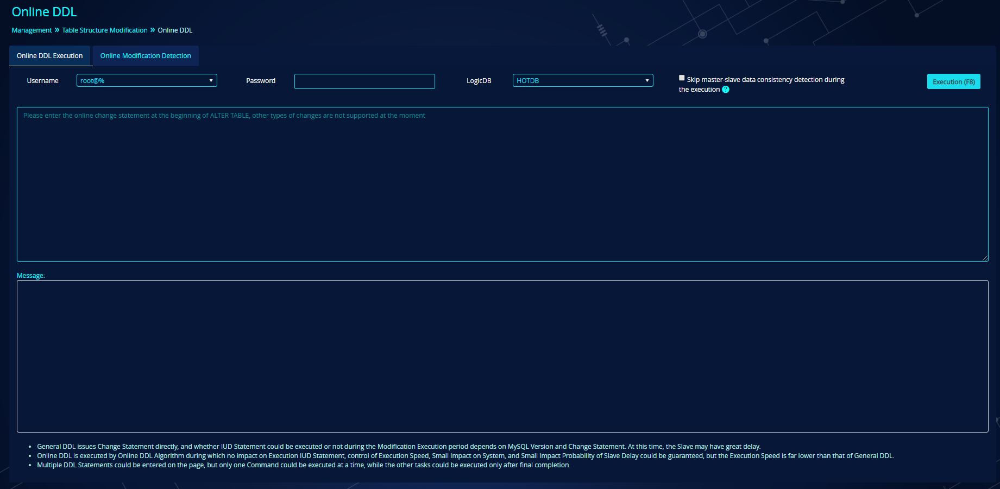

Enter the online DDL operation interface through "Data Management -> Table Structure Change -> Online DDL".

The online DDL function can only execute DDL statements that start with `alter table`.

As with Ordinary DDL, it needs to enter username and password to connect to the logicDB of a specific compute node.

Currently, the number of columns in single table created by table creation statement of the interface shall not exceed 4096, and the maximum byte in the input box shall not exceed 65535.

If "skip master-slave data consistency detection during the execution" is checked, the master-slave data consistency detection will not be performed before online DDL execution. It is not checked by default.


All executed online change records can be viewed in the online change history record. "Online Change Statement under Execution" is used to view the online DDL task under execution and the progress of the task under execution. "Online Change Statement History Execution Record" is used to view the online DDL that has been executed.

When there is an online DDL statement under execution, click the Filter button to view the changes related to the table under execution in the history record.

### View SQL routing plan

In the HotDB Management, the route of SQL statement executed by the compute node can be parsed through the "View SQL Routing Plan" function.


Enter the correct username and password and select the logicDB where the table executing SQL is located.

Enter the SQL statement that needs to be parsed, and click \[Execution] to view it.

This function is the same as the execution of EXPLAIN command on the server (3323 by default).

### Sharding Plan Online Modification

It provides online change support for the table type, sharding function, sharding key, and data node to which the sharding belongs of business tables in four dimensions. Business tables will not be locked during the change, and normal IUD operations can be performed on the table.

#### Sharding Plan Online Modification


The page displays the record of modification task that has been executed or is being executed. The rollback operation of modification task under execution is allowed through \[Cancel Execution].

The task being executed can view the execution progress in real time, which is refreshed every 3 seconds.

The task record can be filtered by [LogicDB](#logicdb), "Table Name", and "Status".

The task record "**Status**" usually includes 9 types, which are:

1. Successful: The task is completed normally without data inconsistency.
2. Successful: The task is completed normally with some inconsistent data automatically restored by the program. The warning sign displays: "The data consistency detection after the change found that a small amount of data is inconsistent and has been automatically restored by the program".
3. Successful: The task is completed normally and the inconsistent data is fixed by the program, but there are still some inconsistencies, and the user chooses to ignore the inconsistent data and complete the modification task. The warning tag prompts: "After the program automatically has restored the inconsistent data, the data still has inconsistencies, and the user chooses to allow partial data inconsistency".
4. Failed: The task fails because the user manually cancels the task. Error mark prompts: "Manually cancel modification task execution".
5. Failed: The task fails because the data inconsistency still exists after automatic restore by the program, and the user chooses to abandon this modification task. Error tag prompts: "data inconsistency still exists after automatic restore by the program, and the user chooses to abandon this modification task".
6. Failed: The task fails because the data is found inconsistent after the change is completed and data inconsistency still exists after automatic restore by the program which shall be confirmed by the user. The user fails to process within the set waiting time which causes the task to fail. Error tag prompts: "The data inconsistency has not been processed within the set time range, and the modification task automatically fails".
7. Failed: The task fails because the modification plan fails the "[Modification plan pre-detection](#modification-plan-pre-detection)" after the task is started in batches. Error tag prompts: "After the task is started in batches, the modification plan fails the pre-check, causing the task to fail."
8. Waiting: The task is not completed, and data inconsistency needs to be confirmed by the user. Warning tag prompts: "Inconsistent data still exists after the program automatically has restored the inconsistent data, waiting for the user to confirm and process".
9. Pause: After the task is started, because the user sets the pause replication period, after the task enters the period, the page displays the task status as Pause, and "The modification task is in the pause data replication period" is prompted when moving the mouse cursor into it.

#### Start modification task


Click the \[Start Modification Task] button on the "Management->Online Change of Sharding Plan" page to enter the "[Start Modification Task](#start-modification-task)" configuration page.

#### Fill in modification plan


Select the logicDB where the modification table is located and the table name to be changed. (Selecting a parent table or a table without table structure is not supported)

"Source Table Configuration" displays the original information of the table that has been selected from the logicDB, including (table type, node information, sharding function and sharding key).

Modification plan can choose the target "Table Type" (child table is not supported currently), "Sharding Key" (when the table type is sharding table), "Sharding Mode" (when the table type is sharding table), and "Data Node".

If "Open Global Unique Constraint" is checked, it needs to ensure that the unique constraint key values in the source table must be unique.

Click the \[Start Modification Task] button on the “Management->Online Change of Sharding Plan” page to enter the “Start Modification Task” configuration page.

#### Modification plan pre-detection

Modification plan pre-detection is mainly to check whether the pre-selected modification plan for the source table meets the modification requirements and whether the data consistency can be guaranteed. Click \[Start Detection] to perform the modification plan pre-detection.


**Special pre-detection item description**

- **The master/slave consistency detection results of the source table data shall be consistent.**

If the logicDB where the source table is located has been verified within 24 hours and the detection results of the source table are consistent, a prompt box will pop up to prompt whether to continue the detection or skip the detection. (Otherwise, master/slave consistency detection of the table needs to be performed once)

- **New sharding plan will not lead to data loss**

The modification of sharding function and sharding key may lead to data inconsistency. The system will judge whether the data may be inconsistent according to sharding function and sharding key.

- **When the global unique constraint is opened, the historical data of the source table unique constraint key is unique**

If "Open Global Unique Constraint" in "[Fill in Modification Plan](#fill-in-modification-plan)" is checked, the modification plan pre-detection will detect whether the historical data of the source table unique constraint key is unique. If it is not checked or the changed table is not a sharding table, the item passes directly without detection.

> !Note
> 
> Pre-detection item "3, 4, 6" is skipped when changing to global table or vertical sharding table type.

#### Modification plan confirmation

Check the modification table configuration and modification plan information, and set the special settings of the modification task at execution.


The source table configuration and modification plan information cannot be modified. If modification is needed, click \[Previous Step] to return to the "[Fill in Modification Plan](#fill-in-modification-plan)", and perform a detection after the modification.

Modification setting:

- **Source table processing:** After selecting Delete after 24 hours or Delete after customized time, the source table is automatically deleted according to the set time. After selecting to reserve the source table, it will exist in the form of source table name +roYYMMDDHHMMSS. The source table will not be processed when the modification task fails. The source table can be viewed in the logicDB, but will not be displayed on the table configuration page.
- **Batch Number of Lines:** The number of data lines replicated per batch during data replication, which shall not be more than 10,000 and not be less than 1.
- **Replication Interval:** The interval between batches during data replication. "x times the SQL execution time" means the interval is x times the execution time of inserting a new table for each batch of replicated data. "Fixed x Second(s)" means that the interval of replication for each batch is fixed x seconds. The input range of multiples is \[0.1-100000], and the input range of seconds is \[0.001-100].
- **Wait Timeout:** It is the time to wait for the user to make processing when the modification causes data inconsistency. If data inconsistency is not confirmed within the set time range, the modification task will automatically fail. It can be edited and modified within 7 days by default. The input box only allows input of positive integers within \[1-30].
- **Pause Data Replication Time-frame:** During the selected time range, data replication between new and old tables is not performed and paused. The sharding modification task will be performed after the set time frame. (If the Modification Table has large Data Amount, it's recommended setting "Pause Data Replication Time-frame" to avoid the peak period)

After clicking the \[Submission] button, the system submits the sharding modification task to the compute node for background execution. The current execution status can be viewed on the Online Change of Sharding Plan page. After the task is completed, click the "View Results" button to view the task execution details.

#### Start modification in batches

**(1) Start mode**


Click "\[Batch Operation]->\[Start Modification Task in Batches]" on the "[Online Change of Sharding Plan](#online-change-of-sharding-plan)" page, or select multiple sharding recommendation plan records in the "[Sharding Plan Recommendation](#sharding-plan-recommendation)" function to start modification task in batches through \[Online Modification] .

**(2) Filling instructions for starting modification task in batches**


If the pre-detection of batch started modification task fails, the entire task fails. During the pre-detection process, if the LogicDB to which the source table belong has executed the master/slave consistency detection within 24 hours and the results are consistent, the "Master/Slave Data Consistency Detection" item will not be executed in the table pre-detection.

- The "Source Table Processing" and "Replication Interval" settings in batch started modification do not support customized input values, and only the drop-down box option is supported.

**(3) Execute batch task**


If any of the multiple tasks started in the same batch is manually canceled, other tasks will fail even if no exception occurs, and "Because one of the tasks started in the same batch is manually canceled, the current task is automatically canceled" is prompted.

If any of the multiple tasks started in the same batch fails the pre-detection (or failure due to loss/excess/inconsistency of a large number of data), other tasks will fail even if no exception occurs, and "An exception exists in one of the tasks started in the same batch, causing the task to automatically fail" is prompted.

#### Sharding plan modification exception handling

It refers to the case that the data of new table and source table after modification is found to be inconsistent when the sharding plan modification task is completed, and the processing instructions need to be made according to the exception.

- When a small amount of data is lost during modification, HotDB Management will prompt the range of lost data and automatically compensate for the lost data, as shown below:


- When there is a small amount of excessive data during modification, HotDB Management will prompt the range of excessive data and automatically delete the excessive data, as shown below:


- When there is a small amount of inconsistent data during modification, HotDB Management will prompt the range of inconsistent data and automatically restore the inconsistent data, as shown below:


- When there is a large amount of inconsistent data during modification, HotDB Management will prompt the range of inconsistent data, but will not restore such a large number of inconsistent data, as shown below:


- When a small amount of inconsistent (lost or excessive) data occurs during modification for the first time, HotDB Management will actively restore the inconsistent data. If inconsistent data occurs again after the restore is completed, HotDB Management will prompt that the data is still inconsistent after automatic restore, give the range of inconsistent (lost or excessive) data, and wait for the user to choose: \[Ignore Inconsistency] or \[Discard Modification] rather than automatically restoring them.


When selecting \[Discard Modification], the modification task fails and "The data is still inconsistent after the program has automatically restored the inconsistent data and the user chooses to discard the modification task" is prompted, as shown below:


When selecting \[Ignore Inconsistency], the task is successful but there is some inconsistent data, and "Online modification is completed, and the user allows the existence of some inconsistency after modification" is prompted, as shown below:


### Table Recycle Bin

Table Recycle Bin is a function that when the parameter dropTableRetentionTime is enabled, the tables operated by the server (3323 by default) with DROP, TRUNCATE, DELETE without WHERE condition (auto commit) will enter the recycle bin. The management platform supports the visualized data flashback operation within the retention time. In addition, it also includes the functions of viewing the list of restorable data, restoring (flashback) data, deleting data, and viewing historical record.

#### Premise for use

The following requirements shall be met for using Table Recycle Bin:

- The current user has the menu privilege of Table Recycle Bin.

- The current compute node parameter dropTableRetentionTime shall not be 0.

- Tables are operated by the server (3323 by default) with DROP, TRUNCATE, DELETE without WHERE condition (auto commit).

#### Table Recycle Bin


The page displays the temporary table which entered the recycle bin after the server (3323 by default) performed three operations.

You can filter and view table recycle bin records through LogicDB, original table name, and execution statement.

After the table retention time, table in the recycle bin will be automatically deleted and not recorded in history record.

#### Table restore

**(1) Click Restore**


- Click the Restore button of the temporary table on the "Management -> Table Recycle Bin" page, and the input box for connection information will pop up.

**(2) Fill in the connection information**


- Select a database user.
- Enter user password.
- The input box for the restored name displays the original table name by default, which can be modified.

**(3) Confirm the restore**


- After the restore, the execution result will be displayed, including the number of successes, the number of failures, and the history record.
- Click History Record to jump to history record page.

#### Table deletion

**(1) Click Delete**


- Click the Delete button of the temporary table on the "Management -> Table Recycle Bin" page, the deletion confirmation box will pop up. Click Confirm, the input box for connection information will pop up.

**(2) Fill in connection information**


- Select a database user.
- Enter user password.

**(3) Confirm the deletion**


- After the deletion, the execution result will be displayed, including the number of successes, the number of failures and the history record.
- Click History Record to jump to history record page.

#### Table batch restore

**(1) Click Batch restore**


- Check tables to be restored, and click "Batch Operation -> Batch restore" on the "Management -> Table Recycle Bin" page.

**(2) Batch restore connection information**


- If the checked tables all belong to the same LogicDB, only one piece of connection information needs to be filled in.
- If the checked tables belong to multiple LogicDBs, connection information need to be filled in separately.
- If there is an error in one piece of connection information, none of the tables can be restored.
- The input box for the restored name displays the original table name by default, which can be modified.

**(3) Confirm the batch restore**


- After the batch restore, the execution result will be displayed, including the number of successes, the number of failures, and the history record.
- Click History Record to jump to history record page.

#### Table batch deletion

**(1) Click Batch deletion**


- Check tables to be deleted, and click "Batch Operation -> Batch deletion" on the "Management -> Table Recycle Bin" page.

**(2) Batch deletion connection information*8


- If the checked tables all belong to the same LogicDB, only one piece of connection information needs to be filled in.

- If the checked tables belong to multiple LogicDBs, connection information need to be filled in separately.

- If there is an error in one piece of connection information, none of the tables can be deleted.

**(3) Confirm the batch deletion**


- After the batch deletion, the execution result is displayed, including the number of successes, the number of failures and the history record.

- Click History Record to jump to history record page.

#### Special instructions for Table Recycle Bin

Some special situations that may occur in the recycle bin are described here.

- After a table with advanced sharding function enters the recycle bin, the table configuration will be deleted while the sharding function cannot be edited or deleted until the table in the recycle bin is deleted. On the sharding function page, a temporary table will be displayed. Click the temporary table to jump to the table recycle bin page. As shown below:


- Restore failures include, but may not be limited to:

- The configuration of the original table is inconsistent with that of the restored table (including table type, sharding key, sharding function and data node). As shown below:


- The LogicDB of the original table is inconsistent with that of the restored table. As shown below:


- When the original table is restored with another table name, the table name is already created. As shown below:


- Among two tables of parent-child relation, the parent table has been deleted when the child table is restored. As shown below:


- Among two tables of parent-child relation, the parent table has deleted part of the data associated with the child table when the child table is restored. As shown below:


- Among two tables of foreign key relation, the parent table has been deleted when the child table is restored. As shown below:


- Among two tables of foreign key relation, the parent table has deleted part of the data associated with the child table when the child table is restored. As shown below:


- If the restored table has existed, a prompt box "The restored table is already defined. Whether to delete the existing table before restore?" will pop up during the restore. Click Confirm to delete the existing table to the recycle bin, as shown below:


- Table with foreign key relation, if data status is normal, will reestablish the foreign key relation after restore.

#### History record


- Click [History Record](#history-record) on the "Management -> Table Recycle Bin" page to enter the table recycle bin operation history page.
- You can view the history record by filtering through [LogicDB](#logicdb) and original table name.

#### Delete history record


- Check the history records you want to delete and click Batch deletion.

## Security

The security menu is mainly used for the security protection of the connection and execution of compute nodes, as well as the security management of relevant component passwords to improve the security of business systems.

### White List

HOTDB Management supports the white list function which restricts hosts outside the white list from connecting to compute node services.


To use the white list function, it needs to enable the white list switch in "Security->White list" first.

It needs to use [Reload](#reload) to enable or disable the white list or to add, modify or delete white list information.

After adding a host that can access the compute node, the host outside the white list will be intercepted when connecting to the compute node. Interception records can be viewed in "Event -> Audit Log -> Safety Protection".

> !Important
>
> Currently, only hosts in IP format can be configured, and the domain name format is not supported.
>
> HotDB Management defaults to include a white list group with "MANAGEMENT" as the "group name" in the white list function, which contains the IP address of the server where the current HotDB Management is located. The white list group can not be deleted or modified in the page.
>
> When it needs to change the HotDB Management of compute node cluster, you have to first disable the white list function. It can be enabled after the new HotDB Management is started and the server IP of new HotDB Management is added to the white list, otherwise the IP address of new HotDB Management is not in the white list, which causes failure of HotDB Management to connect to compute nodes.

### SQL Firewall

The [SQL Firewall](#sql-firewall) function provided by HotDB Management can intercept high-risk SQL, mis-operation SQL, etc. for users to improve system security.


SQL Firewall currently only supports the interceptable SQL templates provided by HotDB Management, and does not support custom SQL.

A single or batch can be enabled or disabled through [Reload](#reload). If the intercepted SQL is executed in the compute node after it takes effect, it will prompt `"ERROR 10029 (HY000): You are using SQL Firewall, this sql isn't allowed"`.

Currently, HotDB Management provides 31 interceptable SQL templates, and records of intercepted SQL can be viewed in "Event -> Audit Logs -> Safety Protection".

In v.2.5.5 and above, an interception rule is added to the SQL firewall to support the interception of WHERE without sharding key, so as to improve the query efficiency of the system.

The management platform displays the rule "Not allowed to use WHERE without sharding key" on Security -> SQL Firewall, as shown below:


This rule is closed by default. After it is opened, it requires the dynamic loading to take effect and the status will change to "Intercept in progress":


When the status is "Intercept in progress", all WHERE without sharding key (associated field for the child table) executed on the service end of the compute node with the operation table of sharding table or child table will be intercepted.

**For example:**

Create a sharding table "teacher" with id as the sharding key. When the rule is opened, WHERE without sharding key is as shown in the following figure:


At the same time, you can see the relevant interception log through Event -> Audit logs -> safety protection:


### Password security management

Password security management can provide users with password validity monitoring reminders for compute node database users, data source connection users and backup users. When the password is about to expire, the users are automatically prompted to change the password to improve the system security.

#### Database user password

**Description of empty page:** If the record is displayed empty after entering the "Security -> Password Security Management -> Database User Password" page, it needs to check whether "Database User Password Expiration Alert" in "Setting -> [Periodical Detection Setting](#periodical-detection-setting)" is enabled. If the page is still empty after the switch is on, it needs to check whether the current database user password validity has reached the advance reminder time.

**Expiration alert mode:** When the "Database User Password Expiration Alert" is enabled, if the password validity has reached the advance reminder time, the pop-up window reminder prompts by default (if there is an expired user after logging in to HotDB Management, the pop-up window prompts); it can also notify database users of password expiration by email alert (it needs to be configured in "Events -> [Notification Strategy](#notification-strategy)").

**(I) In-station alert description**


When a database user password expires, the login page will pop up a reminder window to prompt how many users need to change the password in time, and the corresponding reminder will be given in the "Event Notice" in the upper right corner.

Users can click \[Immediately modify] to jump to the "Security -> Password Security Management -> Database User Password" page to modify the password expired or to be expired.

Users can also click the \[No Alert] button to close the pop-up window. The window will not pop up on the next login (if there is a new database user password expiration record, the pop-up window will prompt again).

**(2) Password modification**


By default, the page only displays "To be Expired" and "Expired" database user records. In the Expired records, a red mark is displayed in the upper right corner of the "User Name" field, and "To be Expired" records have a yellow mark.

Click the password modification button in the "Operation" column to modify the database user password.

Click \[History Record] to view the record of successful or failed modification.

Modifying the password of the exclusive user **root** account of HotDB Management connecting compute nodes requires the automatic execution of [Reload](#reload). If Reload fails, the password modification operation also fails synchronously.

#### Data source password

**Description of** **empty page:** Refer to the description of empty page of the "Database User Password" chapter.

**Expiration alert mode:** Refer to the description of empty page of the "Database User Password" chapter.

**(I) In-station alert description**


When there is a data source user to be expired or has expired, a prompt window will pop up when the user logs in to HotDB Management to select the compute node cluster and enters the home page, and a corresponding reminder will be given in the "Event Notice" in the upper right corner.

Users can click \[Immediately modify] to jump to the "Security -> Password Security Management -> Data Source Password" page to modify the password expired or to be expired.

Users can also click the \[No Alert] button to close the pop-up window. The window will not pop up on the next login (if there is a new data source user password expiration record, the pop-up window will prompt again)

**(2) Password modification**


**Display description**

The records are displayed in the page in unit of data source instance. If the instances of multiple data sources are the same, they will be aggregated for display.

Username displays the "Connection User" and "Backup User" configured by the data source in HotDB Management (the actual configuration of backup user shall prevail).

**Single modification**

Click the \[Modify] button in the "Operation" column of each record to modify the related user password of data source. The modified page automatically does not display the information of the record.

**Batch modification**

Batch modification can be executed through modifying multiple data source user passwords at one time in page record, or modifying all checked or default "Expired" and "To be Expired" records to the same password.

After executing the batch password modification tasks, the modification results will be prompted, including records of successful and failed modifications. The failed record can be viewed in the \[History Record] page for the specific reason for failure.

**(3) Special instruction**

- When the data source cannot be connected properly, the password modification operation will fail directly.
- If multiple compute node clusters share one data source, users will be prompted not to modify.
- When the configDB instance shares an instance with the data source and the accounts used are also the same, modification of the user will fail directly.

## Detection

### Master/Slave data consistency detection

When a data source or a compute node ConfigDB is running in a "master-master" or "master-slave" architecture, there may be problems of inconsistent data between the master and slave data sources due to replication latencys or other exceptions. HotDB Management supports finding hidden problem of data inconsistency through the "Master/Slave Data Consistency Detection" tool.

**DR mode explanation:** when the DR mode is enabled, please refer to the [Master/Slave data consistency detection](cross-idc-disaster-recovery-deployment.md#masterslave-data-consistency-detection) chapter in the [Cross IDC Disaster Recovery Deployment](cross-idc-disaster-recovery-deployment.md) document for the relevant logical explanations of the master/slave data consistency detection.

#### Start a detection


**Step 1:** Select the detection range, which is LogicDB by default.

- LogicDB: detect data consistency between the master/slave data sources under the data node associated with the logicDB
- Data source: specify the data consistency detection of data source under the data node
- ConfigDB: detects the data consistency of the master/slave ConfigDBs in the compute node ConfigDB (master-slave or master-master replication structure)

**Step 2:** Select the logicDB or data node and data source to be detected.

**Step 3:** Configure data source concurrencies, i.e. the number of data sources can be detected at the same time, which is 8 by default and cannot exceed 32.

**Step 4:** Click the \[Start a Detection] button to submit the detection task to the back end of compute node for execution. The progress of task execution can be viewed on the page.

**View Results**


After the task is executed, click \[View Results] to view the specific detection details. If the detection results are inconsistent, the inconsistent data result records will be displayed. If there are a large number of inconsistent records, the inconsistencies will be displayed in the form of data intervals. If the number of inconsistencies exceeds 100,000 lines, manual positioning is required.

Users can manually restore inconsistent data according to the detection execution details.

Master/slave data consistency detection cannot be executed on table whose structure is not created or has no defined index.

When data source is selected in the detection range, if the data source selected for detection is the master data source under the current data node, the detection result will always be consistent (the master/slave consistency detection will always be based on the current master data source as the standard)

If data node of the detected table is not configured with the corresponding "[switching rule](#switching-rule)" or data source of the detected table is unavailable, the master/slave consistency detection cannot be performed for the table.


#### Periodical plan{#masterslave-data-consistency-detection.periodical-plan}

In addition to manually starting the master/slave data consistency detection task, detection can also be executed automatically by adding a periodical task. Click \[Periodical Plan] to manage the current periodical plan record.


- At most six periodical plans can be added. The detection period includes "Daily", "Weekly" and "Monthly".

- Other options can refer to description of starting a task manually.

- When the logicDB selected in periodical plan is consistent and the detection period and detection time overlap, the program will only execute one periodical task.

- Periodical plan is recommended to combine with the "Event -> Email Alert Setting" function. By adding an email alert setting, execution result exception will be alerted when the periodical plan execution is completed.

#### Notes

If there is actual data inconsistency between the master and slave, but the detection results are consistent, please check:

- Whether the detected table contains primary key or unique key.
- Whether the master/slave data sources under the detected data nodes are configured with "[switching rule](#switching-rule)".
- Whether there is delay in the master/slave data sources under the detected data nodes. (view at the 3325 management end via the show @@latency command).
- Whether the configuration is loaded dynamically.

### Global table data detection

It detects whether all global tables in the cluster have the same table structure and table data on each data node, and provides the function to restore inconsistent data online.

#### Start a detection task


**Step 1:** Select the logicDB and the global table under the logicDB to be detected.

**Step 2:** Set the number of detection concurrency, which is 8 by default when it is empty and cannot exceed 32.

**Step 3:** Click the \[Start Checking] button to submit the detection task to the back end of compute node for execution. The progress of the task being executed can be viewed on the page or the task execution can be canceled by clicking the \[Forced Cancellation].

#### View detection details


- Click the \[View Detection Details] button of the detection task to view the detailed results of detection task.

- The detection results are divided into three: Data Consistency, There is Data Inconsistency, and Beyond Detection.

**Data Consistency:** The global table has the same data on all data nodes.

**There is Data Inconsistency:** The global table has inconsistent data on the data nodes. Inconsistent data can be restored online is judged through whether there is a \[Data Restore] button in the operation column

**Beyond Detection:** The table cannot be detected due to some abnormal reason, including but not limited to the following reasons:

- Table has no index and cannot be detected

- The data node does not create the table structure of detection table and cannot be detected

- Table structure is not created and cannot be detected

- The compute node service status is abnormal and cannot be detected

- Beyond detection due to other reasons

- If the "Restore Status" is "Not Restored" in the record, the inconsistent data can be restored online by the \[Data Restore] function. If the status is "Expired", the restore cannot be executed.

**Expired description:** If the global table that has been detected is re-detected, the previous detection result will be invalid. When clicking \[Data Restore], it will prompt "Data has expired, please re-detect". When clicking \[Refresh Detection List], the "Detection Status" is recorded as "Expired".

**Special case:** If the global table that has been detected is re-detected but the detection task is manually canceled or fails due to the exception, the previous detection result will not be invalidated, data restore entry is still available, and the status will not change after refreshing the detection list.

#### Data restore


Data Restore currently supports the restore of the following seven types of data inconsistencies:

- **Class A:** Data Missing with a few Nodes (less than a half of number of nodes); all the remaining nodes have the same data; there is data with the first Data Node, and the data inconsistency can be restored automatically.
- **Class B:** Data Missing with a few Nodes (less than a half of number of nodes); all the remaining nodes have the same data; and there is no data with the first Data Node.
- **Class C:** Data Missing with Majority Nodes (more than or equal to a half of number of nodes), and all the remaining nodes have the same data.
- **Class D:** Excess Data with only one Node
- **Class E:** Data Inconsistency in more than one Nodes
- **Class F:** Only one Node Data Inconsistency
- **Class G:** Data Missing and Inconsistency

Data restore will display inconsistent data content in the table, and the version to be used can be selected according to the actual business situation. Check the checkbox in "Version Selection", select \[Synchronization] or \[Delete], and then Click \[Batch Submission by Selected Restore Strategy] to restore inconsistent data.

When restoring, it is recommended to first select the restore strategy and version for all inconsistent data displayed on this page for unified submission, and then restore the inconsistent data record on the next page.

After the restore is completed, the page automatically refreshes and hide the restored record. Click the \[Back to Detection Result List] button to view the "Restore Status" on the page. The status is "Restored" under normal conditions.

#### Periodical plan

For the global table data detection periodical plan, please refer to the [Periodical Plan](#masterslave-data-consistency-detection.periodical-plan) description in "[Master/Slave Data Consistency Detection](#masterslave-data-consistency-detection)".

### Table structure＆index detection

Table Structure＆Index Detection can be used to compare whether the table structures and index definitions in the compute node are consistent under each data node. Meanwhile, by detecting the table structure and the execution plan and execution time of the SQL statements related to the table, the optimization suggestions of the table structure or table index are provided.


#### Start a detection

Each refresh or entering into the "Table Structure＆Index Detection" function page is a detection. \[Refresh Detection Result] on the page can also be used for re-detection.

Detection tasks can be executed automatically by adding a periodical plan. For introduction of periodical plan, please refer to the [Periodical Plan](#masterslave-data-consistency-detection.periodical-plan) description in "[Master/Slave Data Consistency Detection](#masterslave-data-consistency-detection)".

#### Page description

Table records can be filtered by logicDB and table name.

Tables with normal table structure, tables with abnormal table structure, tables with undefined table structure, and tables with abnormal index can be filtered and viewed.

Table structure&index optimization suggestions are only provided for tables with "normal" table status or " undefined table index ". Tables with table status of "table structure definition exception", "table index definition exception" and "table structure undefined" will be given specific location of data node over definition exception in the optimization suggestions.


- Table structure optimization suggestions are listed as follows:

- %s, there is no NULL data in this field, it is recommended to modify it to NOT NULL.
- %s, the difference between the definition length of this field and the actual maximum length is greater than 256 characters. It is recommended to modify the definition length after viewing the table structure.
- %s, this string field is of text type but the actual length is less than 3000 characters. It is recommended to change it to varchar\varbinary type or mediumtext\mediumblob type.
- %s, this string field may be a status flag bit field. It is recommended to change it to enum\set type.
- %s, this field is of timestamp type and the maximum time is greater than 2030. It is recommended to change it to datatime type.
- In the current table, the field character set is not uniform. It is recommended to unify the character set and Latin1 and utf8mb4 are recommended.
- More than half of the fields in the current table do not have default values. It is recommended to add default values.
- More than half of the fields in the current table are not commented. It is recommended to add comments.

Table index optimization suggestions are as follows:

- %s(%s), this index was not used when it was detected. It is recommended to optimize thisindex after checking.
- %s(%s), %s(%s), this index group is duplicated, it is recommended to keep only one index.
- %s(%s), the cardinality of this index field is less than 100 or the cardinality divided by the total number of rows is less than 0.001, and the total number of table rows is less than 200. It is recommended to create other efficient indexes or combined indexes instead.
- %s(%s), the index byte length is greater than 256 bytes and field prefix can achieve ideal selectivity. It is recommended to modify the index and take a reasonable length prefix, such as (the reasonable length prefix of this field).
- %s(%s,%s), there is a difference of more than 10 times between the cardinality of two fields in this combined index. It is recommended to exchange the order and put the fields with low cardinality behind. For example, change to the index name (field name, field name).
- %s(%s), %s(%s), this index group appears as combined indexes in 70% cases. It is recommended that one or more combined indexes should be set up reasonably, and delete the single index not used alone.
- The current table structure does not have a unique primary key. It is recommended to add a primary key for the auto-incremental field.
- The primary key of the current table structure is a long string, and the maximum byte length is greater than 32 bytes. It is recommended to add an auto-incremental field primary key, and change the existing primary key to a unique index.
- The total execution consumption of non-complex SQL is more than 7200 seconds, and there is no efficient index. It is recommended to add a reasonable index.
- %s, this field was used for the associated field of cross-node JOIN query. It is recommended to add an index for this field.
- %s, this sharding key has a high cardinality, and the cardinality divided by the total number of rows is more than 0.1. It is recommended to add an index for this field.
- %s, this field is used in more than 95% where conditions, and the specific values can be located to data less than 0.01% and less than 1000 rows or data less than 10 rows on average. It is recommended to add indexes for it.
- %s(%s), %s(%s), this is the combination of multiple AND in where condition. A single field has no efficient index, but the combination of multiple fields is of highly selectivity. It is recommended to add a combined index for it.
- %s(%s,%s), %s(%s,%s), this can be used as an efficient index in where condition. It is recommended to add a combined index for it.
- %s(%s), this index field is a long string field with a length greater than 64 characters. It is recommended to define the field length as "X"(X is calculated automatically by the management platform by default.)
- %s(%s), this index field is a time field and this index is an inefficient index, which is not located to data less than 0.01% and less than 1000 rows or is not frequently used. It is recommended to delete this index.

- Note:

- When in multi-node cluster mode and autoIncrement is set to 2 (auto-incremental and unique), if there is an auto-increment sequence in the table with the type of smallint, tinyint, mediumim, int, the table status column will be defined as "table structure definition exception". At the same time, the table structure optimization suggestion column will prompt that "After the global auto-increment and unique is enabled, bigint is the only type allowed for the auto-increment sequence in the table, so it is recommended that the type of id of auto-increment column be changed from tinyint to bigint", Click "Global auto-increment and unique" to jump to the parameter configuration page of compute node, as shown below:

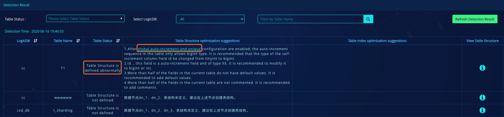

- this verification rule verifies all tables with auto-increment columns enabled under all LogicDBs only when autoIncrement is set to 2, that is, "global auto-increment and unique" and the compute node mode is multi-node cluster.

#### Table structure details


- On the "Table Structure&Index Detection" page, click "Table Name" to view the table structure details.

- Details include: the data node of table, the current status of table, the build table statement, and the description of table field.

- Build Table Statement can be replicated through the \[Replicate] button in the upper right corner of the page.

- For tables with inconsistent table structure under each data node, the page will display the Build Table Statement under each data node, and identify the inconsistent SQL statement with the red font.

### Sharding grade

Sharding grade provides a reasonable score for a table after splitting. It can also obtain the average score according to the statistics of logicDB and multiple tables to help operators to find unreasonably split tables in time.

#### Description of grade dimensions


**Sharding grade is divided into five dimensions:**

- **Score of Well-distributed Data Amount**

Calculate the score according to whether the data distribution of each node is uniform and whether the growth is uniform

- **Score of Cross-node Transaction Proportion**

Calculate the score based on the proportion of cross-node transaction queries

- **Score of SELECT Operations**

Calculate the score according to whether the total queries of each node is uniform, the proportion of cross-node join queries, the proportion of single-database queries, and the proportion of queries that are routed to all nodes because they cannot be routed to the specified node.

- **Score of IUD Operations**

Calculate the score according to whether the IUD operation of each node is uniform and the single-database IUD operation proportion

- **Score of Other Dimensions**

Calculate the score according to the number of times the query cannot find the node and whether the sharding key definition is reasonable.

**Statistics description**

- The compute node is responsible for the statistics and calculation of score. Each calculation is started at the start of compute node. If the compute node service is restarted, the previous statistics are cleared.

- The statistics and display of score can be performed only after 24 hours of the startup of compute node. Otherwise, it will prompt "calculation cannot be performed because the compute node starts for less than 24 hours".

- If the compute node of master/slave mode cluster has a high-availability switch, calculation cannot be performed within 24 hours after the switch.

**Note:** Non-sharding table or table without table structure are not scored;

#### Record export


- Click the "Export" button on the "Sharding Grade" page to export the page record.

- Check the "Export Sharding Function, Sharding Key and Data Node of Table" to add "Sharding Function", "Sharding Key" and "Data Node" columns after the score record of each table.

- All records displayed on the page are exported by default after filtering the page records by the condition filter box.

### Sharding plan recommendation

In order to help users find the appropriate table sharding solution through the actual business scenario, HotDB Management supports the sharding plan recommendation calculation through submitting the SQL log generated by the simulated pressure measurement environment to the compute node, to finally generate the business table sharding plan reference consistent with the actual production environment for users.

#### Start a recommendation

**(1) Pre-start instructions**

- The sharding plan recommendation function can only be used after the full simulated pressure measurement is started.

**Full simulated pressure measurement:** Connect the compute nodes to perform business operations according to the actual business situation. The business operations performed need to simulate the production environment business as much as possible.

- Before the full simulated pressure measurement, it needs to turn on the "Statistics of SQL Execution" parameter switch in "Configuration -> Compute Node Parameters", and set the "Maximum Length of SQL Statement Record in SQL Execution Statistics" as large as possible to prevent statements from being truncated when executing SQL records.

- Before the full simulated pressure measurement, it is recommended to clear the history record log in the "Event -> Slow Query Log Analysis" function to prevent old data from interfering with the full simulated pressure measurement SQL record. After the history record log is cleared, you should execute the formal business SQL in the compute node and refresh the operation log page to make it the simulation initialization data.

- The SQL record switch in the "Event -> Slow Query Log Analysis" is temporarily turned off in the calculation process started by the sharding plan intelligent recommendation function.

**(2) Steps for starting a recommendation**


- Click the \[Start Task] button to start a sharding plan recommendation task, but if no SQL logs are recorded in the "Event -> Slow Query Log Analysis", the task cannot be started.

- It is not allowed to start a task if there are recommendation tasks uncompleted currently.


- By default, all the tables in all logicDB of the cluster will be calculated and recommended when the task is started. Tables that do not need to be calculated and recommended can be filtered according to actual needs.

- The "Number of Lines with Simulated Pressure Measurement" of the table is the actual data line number of the table when performing full simulated pressure measurement. The number of lines with simulated pressure measurement of global table is the actual data line number plus node number.

- Configure "Times Multiplier" or "Estimated Number of Lines for Production" for each table before starting the task. This parameter is set to get closer to the actual execution scenario of business when calculating.

**Times Multiplier:**

Number of Lines with Simulated Pressure Measurement * Times Multiplier = Estimated Number of Lines for Production

Example 1: 10 days of operation of 1 million users in the simulated pressure measurement environment is simulated, but there are operations of 10 million users in the actual production environment and that data shall be stored for 90 days, the table times multiplier related to the service shall be set to 90.

Example 2: For the meta-information table such as configuration table, users can individually adjust the times multiplier of these tables to 1

**Number of Lines:**

Estimated Number of Lines for Production is the number of lines of the simulated table in the generated environment

Example 1: If a table has 1000 lines in the simulated pressure measurement environment, but the number of lines is estimated to reach 9900 in the actual production environment, the number of lines corresponding to the table may be set to 9900

- After selecting "Parameter Mode", input the corresponding value directly in the right input box and click the \[Setting Selected] (check the table to be set) or \[Set All] (set all tables directly without checking) of \[Batch Setting].

- Tables that have been set but need to be individually adjusted can be individually modified by the \[Edit] button next to the parameter. Individually modified records are highlighted.

- Click \[Start Compute] to start the sharding plan recommendation task for the selected and set tables. The page automatically displays the real-time execution of the current task.

- \[Terminate Compute] can be executed during the execution process, but the recommended results displayed may be less accurate, so it shall be adopted with caution.

#### Sharding plan recommendation


The page displays the results of the most recent successful recommendation, and the newly started record will overwrite the previous record.

Click the "More" button to filter the page record by "Number of Lines with Simulated Pressure Measurement" and "Estimated Number of Lines for Production".

Tables to be viewed can be filtered out using page filtering condition. Records of repeated original sharding plan and generated plan can also be filtered by checking the "De-repetition Display of Original Sharding Plan and Generated Plan".

By default, three sets of recommend plans are generated. In general, the first one is optimal, and the latter two are alternatives.

The generated plan includes the recommended table types: sharding table (representing the sharding table) + sharding key, and global table. When a sharding table is recommended, the plan does not include the sharding rule which needs to be selected by the user.

Records with "Table Status" of "Pressure Unmeasured (not subjected to full simulated pressure measurement)" will be highlighted by the page. The recommended plan for this type of table **is not recommended** because it is not subjected to full simulated pressure measurement.

The records in the page can be directly exported to the local. Click the \[Export] button to export the records to be exported or all records.

For tables that need to modify the table sharding plan, the sharding plan modification can be directly completed by clicking \[Online Modification].

**Online modification notes:**

- Click \[Online Modification] to check the table record that needs to be modified, and click to directly link to the "Management -> Online Change of Sharding Plan" function page.
- If the record checked is a parent table, the table structure is not created, and the table has been deleted, online modification cannot be performed.
- If to adopt the generated sharding plan, all tables are recommended using one of the plans, and the recommended plan and the alternative plan cannot be adopted alternatively.
- It is recommended to modify the sharding plan of tables with a JOIN correlation online in batches.
- If "skip master-slave data consistency detection during the execution" is checked, the master-slave data consistency detection will be skipped for sharding plan modification. It is not checked by default.

When choosing a recommended plan, attention shall be paid to that some SQLs may not be executed. Click the \[Unsupported SQL] button to view the SQL that may be unexecutable in the plan.

#### Influencing factors of sharding plan recommendation

Different number of lines and different sharding keys of a table will result in inconsistent results for the last recommended sharding.

**The following factors will affect the sharding plan recommendation:**

- The amount of data generated for table during the pressure measurement, and the generated test environment multiple or the number of lines set.

- In the query statement, the aggregate function, single/multi-node join statement, cross-node join, unsupported join statement, and cross-node/union statement will affect the sharding recommendation results.

- In the query or insert statement, the length of character, sharding table referred by foreign key, sharding key contained in primary key, and type of sharding key all affect the sharding recommendation result.

### Sharding route detection

The sharding route correctness verification function can quickly solve problems of verifying the correctness of sharding rule, whether the inserted data is routed according to the correct sharding rule, and whether the sharding data imported into the cluster by other distributed environments is inconsistent.

#### Start a detection


- Select the logicDB and sharding table to be detected (excluding the table whose table type is child table), and click the \[Start Detection] button for immediate detection.

- If the "Detection Result" of the completed detection task is "Normal", there is no \[Detect Details] button in the operation column. When it is "Abnormal", click \[Detect Details] to enter the "Detection Record Details" page.

#### Detection record details


- "Detection Record Details" mainly displays the detection records of all detection tables in the detection task. By default, table records with abnormal "Detection Result" are displayed.

- For specific table route exception information, click \[Details] to enter the "Route Abnormal Details" page.

- Click the \[Export Record] button to save tables with abnormal route to the local. **Note: The export function currently only supports exporting route records with abnormal detection results.**


#### Route abnormal details


- The correct route node and the actual route node in the table are displayed in the form of "Node ID value".

- Click the \[Load More] button to obtain more undisplayed records. 50 records are added each time the page is loaded. If all records are loaded, the button will be hidden.

- Click the \[Back to Detection Record Details] page to jump to "Detection Record Details".

### Data unique constraint detection

Data unique constraint detection can check the uniqueness of the historical data of the created horizontal partition table or sub table. It can help users to detect whether the columns with unique constraints have data conflicts in the distributed environment.

#### Start a detection


**Steps for starting a detection**

- Select the LogicDB and sharding table for detection. among The sharding table can only be an already created sharding table or a subtable.
- The default detection concurrency is 8, which can be adjusted according to the actual needs, but the maximum value is no more than 32.
- Click \[Start a Detection] to perform the unique constraint detection for the selected table.

**Reason for detection starting failure**

Generally, the reasons for detection starting failure include but are not limited to the following situations:

- Compute node service failure.
- The unfinished detection task due to the management platform service stopping.
- Manual cancellation of detection task.
- Other exceptions (for details, see the prompt description in the exception identification).

Click \[Delete Record] to delete the history detection record on the page. If the record has a result file generated during detection (when the details of detection results exceed 2048 bytes, the results are saved in the form of a file), the corresponding file will be deleted.

#### Detection record details


1. The detection record details page shows the detection results of the corresponding table in the detection task. By default, only the table records with abnormal "detection results" are displayed.
2. The unique key column in the displayed record displays the fields with unique constraints in the table. When there are multiple unique keys, they are separated by commas; if there are unique constraints composed of multiple field associations, they are shown in brackets.
3. "Detection details" is the specific result description of the detected table. If "detection results" is abnormal, the column will display unique constraint fields and repeated data; if the result is normal, the column is empty.
4. When the detection details of the table exceed 2048 bytes, the "detection details" column will no longer display the specific repeated data, but will prompt that the specific details need to be downloaded for viewing.
5. Click the \[View table information] button on the right to enter the detailed description page of the specific table. If the content of "detection details" in the table exceeds 2048 bytes, the \[Download] button will appear in the operation column. Click the button to obtain the corresponding file (the file is generated according to the needs after the compute node detection and saved in the `HotDB-TEMP` directory in the installation directory of the compute node by default).
6. Click \[Export Record] to export all or part of the selected records on the page. Please note that the exported record does not include the record of normal "detection result".
7. If the unique constraint set in the table is prefix index, it can still be detected when the compute node version 2.5.6 and above.

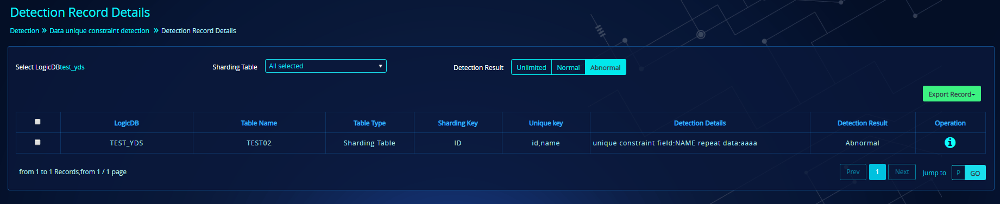

## Events

### History events

History events record and display history information at the HotDB Management platform level, including: task execution completion notification, periodical detection exception notification, and platform triggering alert prompt.


#### Alert type description

##### Server time difference

HotDB Management periodically detects the time difference between the data source server and the compute node server. If there is a time difference, HotDB Management saves the detection result in the history event and prompts the user through the [Notice](#notice) in the upper right corner of the page.

**Alert Level:** The level is WARNING when the difference time is 0.5s-3s, and the level is ERROR when the difference time is more than 3s.
 
##### Parameter perception

The parameters of data source MySQL affect the processing of some commands by the compute node. Therefore, HotDB Management periodically checks whether the parameters of each data source are consistent, and an alert is given if the parameters are inconsistent.

##### Data source is shared

HotDB Management will give an alert when the heartbeat detects that a data source is used by multiple compute nodes. The specific heartbeat detection mechanism is completed in the compute node, and the HotDB Management notifies the user of the detection result and displays the data source shared within 10 minutes.

##### Master/slave data consistency detection

It displays the detection result of whether the table structure, index and records on the master/slave data sources are consistent. The detection results are shown here.

##### Data source migration

When HotDB Management has performed a data source migration, a history event will be recorded to view whether the data source migration result is Successful, Failed, or Warning.

##### Periodic modification detection of database user password

When the database user password expiration reminder is enabled and it is detected that the database user password is about to expire or has expired, HotDB Management gives an alert and detailed information can be viewed in History Events.

##### Periodic modification detection of data source user password

When the data source password expiration reminder is enabled and it is detected that the data source user password is about to expire or has expired, HotDB Management gives gives an alert and detailed information can be viewed in History Events.

##### Table structure&index detection exception

When HotDB Management starts a "[Table Structure&Index Detection](#table-structureindex-detection)" task, if the detection result is abnormal, HotDB Management records the abnormal detection result as a history event.

##### Configuration modification backup failure

When a user modifies certain configDB information under the HotDB Management configuration menu, the backup file of related logicDB may be affected. History events will record the failure of related logicDB backup file due to configuration modification. The level of this alert type is WARNING.

##### Online change of sharding plan

The history event records the task execution when the execution of "[Online Change of Sharding Plan](#online-change-of-sharding-plan)" task is completed. The level of this alert type is WARNING, ERROR and INFO.

##### Global unique constraint exception

When the global unique constraint of a created table fails to take effect or the global unique constraint is closed but the deletion of secondary index fails, an alert is given. The level of this alert type is WARNING.

##### Compute node service status

History events recorded when a compute node management port (3325 by default) or service port (3323 by default) is connected abnormally. The level of this alert type is ERROR; history events recorded when there is a switching or re-election in compute nodes in cluster mode. The level of this alert type is WARNING.

### Compute node log

It records the log information generated by the compute node during the running process to help the user know the running status of the current compute node in real time.

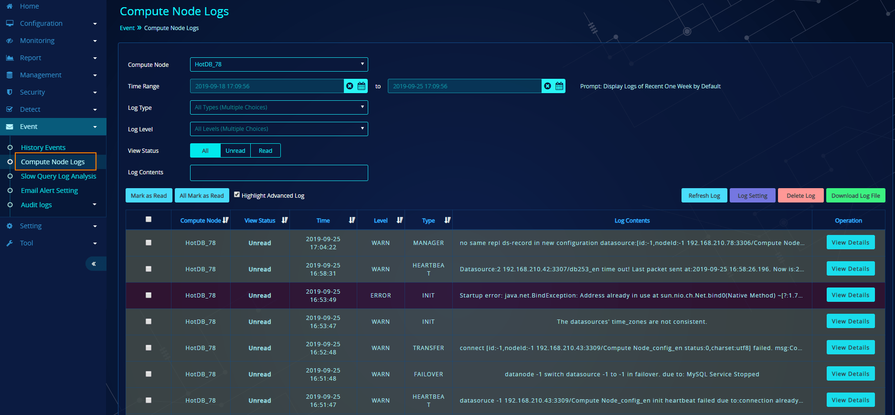

#### View log

- Select "Compute Node" to switch to view the logs generated by other compute nodes in the cluster. The current master compute node running log is displayed by default.

- The page displays logs of the recent one week by default, and logs can be viewed by adjusting the "Time Range".

- Logs can be filtered by log type.

- Logs can be filtered by log level. Currently, the log types are divided into three levels: ERROR, WARNING and INFO.

- Keyword can be input into the "Log Content" input box for fuzzy query of log information.

- The page highlights the high-level log, that is, the ERROR level log information by default.

- For detailed records of logs, click \[View Details] for more detailed log information.

#### Log acquisition description

- HotDB Management takes a log file from the compute node every 10 minutes and writes it to the HotDB Management ConfigDB.

- The compute node log is stored in the compute node installation and deployment logs directory by default, which is usually hotdb.log. If there are too many log files, history log files will be saved in the form of date.

- HotDB Management defaults to obtain ERROR level log information and save it to the configDB. If it needs to obtain the WARNING or INFO level log, click \[Log Setting] on the page to adjust.

- Click \[Refresh Log] to obtain the latest log information in the configDB.

- Click \[Download Log File] to save the compute node log to the local.

#### Log type description

The following is a description of all compute node log types:

| Log type                  | Type description                                                                                                                                                                                                      |
|---------------------------|-----------------------------------------------------------------------------------------------------------------------------------------------------------------------------------------------------------------------|
| AUDIT                     | Record all audit log related log information                                                                                                                                                                          |
| AUTHORITY                 | Record license-related log information, such as checking whether the current data node exceeds the node limit contained in the license, etc.                                                                          |
| BUFFER                    | Record cache-related log information, such as the failure to create direct caches, the size of the requested cache exceeds the set chunksize and other error messages                                                 |
| CCCONFIG                  | Record log information related to NDB connection configuration information, such as unsupported NDB service mode and other error messages                                                                             |
| CCMETADATA                | Record log information related to NDB metadata                                                                                                                                                                        |
| CCONNECTION               | Record log information related to NDB connection, such as error message of the maximum connections detected                                                                                                           |
| CCPARSER                  | Record NDB log information related to SQL statement parsing, such as error message of unsupported SQL statements                                                                                                      |
| CCRECORDRW                | Record the read and write of NDB acquisition record, which refers to the log information when parsing from the SQL format to the NDB format, such as error message of unsupported column type or character set        |
| CCSIGNAL                  | Record log information related to NDB signal parsing, such as error message of semaphore cannot be compressed                                                                                                         |
| CCSQLBUILD                | Record log information when the NDB protocol is parsed into a SQL statement                                                                                                                                           |
| CLUSTER                   | Record log information related to the cluster, such as heartbeat detection information between clusters, cluster broadcast packet timeout information, etc.                                                           |
| CONNECTION                | Record log information related to connection, such as INFO information that the front-end connection is closed due to a new connection requested in the bound session                                                 |
| CONNECTIONCLOSED          | Record log information when the front-end connection is closed                                                                                                                                                        |
| CROSSDNJOIN               | Record across-node JOIN query SQL statement                                                                                                                                                                           |
| DDL                       | Record log information related to DDL, such as recording all DDL operations                                                                                                                                           |
| DEADLOCK                  | Record log information related to deadlocks, such as exception information in deadlock detection                                                                                                                      |
| DISKSPACE                 | Record disk space-related log information, such as error message of detecting insufficient disk space caused by writing temporary files                                                                               |
| EXIT                      | Record log information before the compute node is closed, for example, the data consistency detection result and the created temporary table are cleared before closing                                               |
| FAILOVER                  | Record log information related to data source switching, such as data source manual switching failure due to unavailable data source                                                                                  |
| HEARTBEAT                 | Record log information related to the heartbeat detection, such as heartbeat detection failure due to the failure to obtain data source back-end connection, the heartbeat detection initialization abnormality, etc. |
| HOLD                      | Record log information related to HOLD operation, such as displaying the client information for sending the HOLD command, HOLD success or failure, etc.                                                               |
| HOTDBERROR                | Record the custom ERROR of compute node. For details, please refer to the [HotDB Server Error Code Explanation](error-codes.md) document                                                                              |
| HOTDBWARNING              | Record the custom WARNING of compute node. For details, please refer to the [HotDB Server Error Code Explanation](error-codes.md) document                                                                            |
| INIT                      | Record log information related to the initialization of compute node, for example, the compute node stars to monitor the management port at initialization, etc.                                                      |
| INNER                     | Record log information related to internal operations of compute node, such as failure to clear data nodes and create table configuration                                                                             |
| JOIN                      | Record log information related to JOIN query, such as error message during JOIN query                                                                                                                                 |
| LIMITOFFSETWITHOUTORDERBY | Record SQL statements that use LIMIT but are not sorted                                                                                                                                                               |
| MANAGER                   | Log information related to management end, such as connection information when receiving the RELOAD command                                                                                                           |
| MYSQLERROR                | Record MySQL Error messages that appear in a connection, excluding deadlocks, lock timeouts, primary key or unique key conflicts, and foreign key violations                                                          |
| MYSQLWARNING              | Record MySQL WARNING information that appears in a connection                                                                                                                                                         |
| NDB                       | Record log information related to NDB                                                                                                                                                                                 |
| ONLINEDDL                 | Record log information related to OnlineDDL, such as error message caused by OnlineDDL operation                                                                                                                      |
| RELATIVE                  | Record log information related to the auxiliary table of parent and child tables, such as error message of                                                                                                            |
|                           | updating the parent and child tables related configuration (auxs column)                                                                                                                                              |
| RESPONSE                  | Record log information related to back-end response when the back-end request is started, for example, the table structure does not exist after the back-end request is started                                       |
| ROUTE                     | Record log information related to route, such as sharding type not meeting route conditions                                                                                                                           |
| SQL                       | Record log information related to executing SQL statements, such as error messages after executing a SQL statement                                                                                                    |
| SQLFORWARD                | Record the log information of forwarding the SQL log information from standby compute node to master compute node                                                                                                     |
| SQLINTERCEPTED            | Record statements intercepted by the SQL firewall                                                                                                                                                                     |
| SQLKEYCONFLICT            | Record MySQL ERROR information of primary key or unique key conflicts                                                                                                                                                 |
| SQLSYNTAXERROR            | Record log information related to errors of executed SQL statements                                                                                                                                                   |
| SQLUNSUPPORTED            | Record SQL statements that are not supported by the compute node, such as unsupported global function indexes                                                                                                         |
| SUBQUERY                  | Record SQL statement of the subquery                                                                                                                                                                                  |
| SWITCHSOURCE              | Record log information related to the data correctness guarantee after failover. For details, please refer to the Data Correctness Guarantee after Failover chapter of the [Standard](hotdb-server-standard-operations.md) document           |
| TIMER                     | Record log information related to the timer, such as error information for delayed detection, completion of ONLINE operation executed by checkVIP timer, etc.                                                         |
| TRANSFER                  | Record log information related to data source migration, such as detecting whether the UUID of data source migration is empty or has been used                                                                        |
| UNION                     | Record SQL statement of the UNION query                                                                                                                                                                               |
| UNKNOWN                   | Record all log information except for other log types                                                                                                                                                                 |
| WATCHDOG                  | Record log information of internal status monitoring of WATCHDOG related compute node service, such as detecting whether the compute node content has deadlocks                                                       |

### Slow Query Log Analysis

HotDB Management provides the Slow Query Log Analysis of the execution time and times details of SQL statements for select, insert, update, delete, transaction open, submission and rollback. The internal algorithm is used to automatically analyze the SQL statement that needs to be optimized and remind the user with the To-Be-Optimized mark. O&M personnel can also query the page statistics to obtain the actual SQL execution efficiency and SQL statements to be optimized to help improve system performance.

**Enable Log Record:** If the page is displayed as empty, it needs to check whether the SQL log statistics switch is enabled. Turn on the "Statistics on SQL implementation conducted or not" switch on the "Configuration -> [Compute Node Parameter Configuration](#parameter-configuration)" page.

#### Slow query log record description


**(1) Slow query log list field description**

**LogicDB:**

The name of the logicDB used for executing SQL.

**SQL Statement Abstract:**

HotDB adopts the summary method similar to mysqldumpslow to group similar SQL statements. Here is the SQL after the summary.

**Description of SQL Statement Abstract:**

The same SQL statements are accumulated in statistics.

In the SQL where condition, the constant string is replaced by "S" by default, and the constant value is replaced by "N". In some SQL where conditions, if the constant value is less than 10 or there is a constant with special meaning such as "Y" or "N", no replacement is performed and the original value is displayed.

If the executed SQL statement has failed at the compute node level (for example, intercepting or not supporting SQL), the slow query log will not be recorded. If the SQL has been sent to the data source but the execution fails, the slow query log will still record the SQL execution information.

The insert/replace values statement list, set statement list and update set statement list of insert set/insert onduplicate set do not determine whether the constant value is less than 10 or is a constant with special meaning such as "Y" or "N". It only needs to determine whether it is a value or string and display it with "S" and "N" (**valid in V2.5.3 and above**)

**Compute Node Total Execution Times:** 

Total execution times of all SQL statements of the SQL template in the compute node.

**Compute Node Average Execution Time:** 

It is calculated through dividing the compute node total execution time by the compute node total execution times. Compute node execution time refers to the time from the compute node receiving the first SQL statement packet to the compute node sending the last result packet of SQL; compute node total execution time refers to the total execution time of all SQL statements of the SQL template.

**Data source Average Execution Time:** 

It is calculated through dividing the data source total execution time by the data source total execution times. Data source execution time refers to the time from the compute node sending the first SQL statement packet to the back-end to the compute node receiving the last result packet of SQL from the slowest data node. If a SQL is split into n SQL for execution, the execution time is calculated in accumulation, while the processing time of the compute node in the progress is not included. Data node total execution time refers to the total execution time of all SQL statements of the SQL template.

**Data Source Average Execution Time Proportion:** 

The proportion of the data source average execution time in the compute node average execution time, with three decimal places reserved.

**Time Consumption Distribution Details:** 

The execution time distribution of all SQL statements of the SQL template in the compute node or data source can be viewed.

**SQL Query Optimization Suggestions:** 

The optimization suggestions for SQL query are given based on the internal algorithm.

**(2) Compute time distribution**


Click \[View Compute Time Distribution] to view the execution time distribution of SQL statements of the template in compute node or back-end data source.

Execution compute time distribution is represented by a bar chart, which can be used to view the compute time interval with the maximum execution time.

**(3) SQL to be optimized**


The SQL statement to be optimized is the SQL abstract with yellow snail mark on the page. In general, attention shall be paid to the SQL statement with this mark and low SQL execution efficiency shall be checked.

For the standard for judging whether the SQL statement needs to be optimized, click the \[SQL To-be-Optimized Setting] button to view or edit the standard setting to be optimized.


**(4) SQL query optimization suggestions**


Based on the internal algorithm of the management platform, this function checks the SQL statement structure, execution time, execution plan, etc., filters out unreasonable SQL statements, and gives optimization suggestions.

Check the item "only view SQL query optimization suggestions" to filter out all the SQL statements proposed to be optimized.

SQL suggestions are as follows:

- The subqueries are nested in more than three layers. It is recommended to rewrite SQL according to business needs.
- If you use union or union all to query the same table more than three times, it is recommended to use case, when and other conditions to reduce the union usage.
- It is recommended to use union all instead of union according to business needs.
- The table being queried is a sharding table. It is recommended that the filter condition where contain sharding tables.
- This query is a cross-node JOIN query, and it is recommended that the associated field be a sharding key.

For example: this cross-node SQL JOIN query does not use the sharding key as the associated field. In this case, the compute node needs to cross-compare the data across the data nodes, which takes a lot of time. Therefore, suggestions are given for such SQL statements.


**(5) Average execution time is too long**


For the compute node average execution time or the data source average execution time, if it is found that the average execution time from 00:00 to 24:00 yesterday is twice the average execution time of the history, a message with a triangle identification will appear.

Check the item "only view the data from 00:00 to 24:00 yesterday " to refresh the SQL execution condition from 00:00 to 24:00 yesterday.

#### SQL Performance Tracking

HotDB Management provides SQL performance tracking function, which visually shows the execution plan of SQL statements (HotDB Profiles). It can be used to compare and view the execution plan of a SQL statement before and after optimization, or to view the execution plan of a SQL statement separately.


Input the username and password (the username and password are of the [database users](#database-user-management) of the compute node), and select the LogicDB for query.

> !Note
> 
> host range set by User must contain IP address of the current HotDB Management service. Otherwise, the compute node cannot be connected normally.

Enter SQL query statements, which can be entered up to three at a time. Click \[Execute] to view the performance tracking comparison results. If the input SQL statement is not a SELECT statement or fails execution, an error message will be displayed.

The execution plan will display the relative time point and time consumption (μ s) of each step. For details, please refer to the HotDB Profiles related sections in the [Standard](hotdb-server-standard-operations.md) document.


Click \[View execution time graph] to view the visualized results of execution plan. Only one execution time graph can be viewed at a time.


### Notification strategy

HotDB Management supports the alert of faults or abnormalities that occur during cluster operations by emails. The current monitoring scope of email alerts includes: compute node and data source failure or switching, compute node service resource status, compute node server status, data source related monitoring, system periodical task detection, and license authorization monitoring.

DR mode explanation: when the DR mode is enabled, please refer to the [Notification strategy](cross-idc-disaster-recovery-deployment.md#notification-strategy) chapter in the [Cross IDC Disaster Recovery Deployment](cross-idc-disaster-recovery-deployment.md) document for the relevant logical explanations of the notification strategy.

#### Add notification strategy


**Add notification strategy parameter**

- **Recipient:** Multiple recipients are separated by an English semicolon.
- **Cc:** Optional.
- **Monitoring Item:** The monitoring item in email reminder cannot be empty. If the parent item in Monitoring Item is checked, the child item is automatically checked.
- **Monitoring item setting notes:**
  1. To perform the email reminder of the corresponding item, it shall first ensure that the monitoring item has been opened in the Setting. Otherwise, the email cannot prompt the alert notification of the monitoring item (the monitoring item can be opened in the [Setting](#setting) menu, and the alert value of the corresponding item can be customized).
  2. If the notification frequency switch of the item in the notification setting \[Settings-->Notification Setting] is disabled, the email reminder will not be sent even if the current sub-item is checked. Enabling the notification setting switch is the premise of sending email.
  3. To add a notification strategy, you need to complete the configuration of [email sender setting](#email-sender-setting) in advance. Otherwise, when you save the notification strategy, you will be prompted that you need to set the email sender first.
  4. When the above three points are met and the notification strategy is configured, if there is checked item in the parent item which is abnormal or exceeds the threshold, the email reminder will be sent according to the set notification frequency (the email reminder depends on the background related periodical task).
  5. The email reminder of monitoring item shall be the most recent alert condition within the monitoring frequency.

#### Description of monitoring items

##### Failure real-time monitoring

The failure status monitoring item sends an email reminder of the most recent exception detected within the notification frequency. If the failure is not repaired, the email will send repeated reminder until the failure has been repaired.


**Email example:** The prompt information for compute node service failure or switching is as follows:


**Email example:** The prompt information for data source service failure or switching is as follows:


##### Compute node service resource monitoring

The compute node server resource monitoring item notice is about the most recent time when the threshold is exceeded during the notification time.


**Threshold setting:** To monitor the corresponding item of the compute node service resources, it shall be ensured that the monitoring item has been opened in "Setting -> Monitoring Panel Setting" and the corresponding thresholds have been set, as shown below:


> !Note
> 
> The above thresholds are the test environment settings and are for reference only.

**Email example:** The prompt information of real-time monitoring alert reminder of compute node server resources is as follows:


##### Compute node service status

The compute node service status notice is about the most recent time when the threshold is exceeded during the notification time.


**Threshold setting:** To monitor the corresponding item of the compute node service status, it shall be ensured that the monitoring item has been opened in "Setting -> Monitoring Panel Setting" and the corresponding thresholds have been set, as shown below:


> !Note
> 
> The above thresholds are the test environment settings and are for reference only.

**Email example:** The prompt information of compute node service status monitoring alert reminder is as follows:


##### Other server resource monitoring

Other Server Resource status notification is about the most recent time when the threshold is exceeded during the notification time.


**Threshold setting:** To monitor the corresponding item of the compute node service resources, it shall be ensured that the monitoring item has been opened in "Setting -> [Monitoring Panel Setting](#monitoring-panel-setting)" and "Setting -> [Periodical Detection Setting](#periodical-detection-setting)" and the corresponding thresholds have been set, as shown below:


> !Note
> 
> The above thresholds are the test environment settings and are for reference only..

**Email example:** The prompt information of other server resource monitoring exception reminder is as follows:


##### Data source information monitoring

The data source information monitoring notification is bout the most recent exception during the notification time.


**Threshold setting:** To monitor the corresponding item of the data source, it shall be ensured that the monitoring item has been opened in "Setting -> \[Topological Graph Alert Setting]" and the corresponding thresholds have been set, as shown below:


> !Note
> 
> The above thresholds are the test environment settings and are for reference only.

**Email example:** The prompt information of data source related monitoring alert reminder is as follows:


##### ConfigDB monitoring

the ConfigDB monitoring notification takes the latest exception within the notification time.


**Threshold setting:** to monitor the corresponding items in the ConfigDB, you must first ensure that the monitoring items are opened in "Setting -> [Topological graph alert setting](#topological-graph-alert-setting)" and the corresponding thresholds are set as follows:


> !Note
> 
> the above thresholds are set for the test environment and are for reference only.

**Email example:** ConfigDB monitoring alert reminders; the prompt information is as follows:


##### Periodical detection abnormal monitoring

The periodical detection abnormal monitoring notification is bout the most recent exception (except for backup/restore failure) during the notification time.


**Threshold setting:** To monitor the corresponding item of the data source, it shall be ensured that the monitoring item has been opened in "Setting -> [Periodical Detection Setting](#periodical-detection-setting)" and the corresponding thresholds have been set, as shown below:


> !Note
> 
> The above thresholds are the test environment settings and are for reference only.
> 
> 
> 
> Backup/restore failure is alerted only if it occurs within the notification time range. This failures only includes those caused by abnormal conditions after normal backup/restore.

##### License authorization monitoring

When the compute node license authorization expires, if the detection switch is turned on and the reminder conditions are met, the notification email will be sent according to the set reminder frequency.


**License authorization monitoring description:**

For "License Authorization Expired" and "Abnormal License Authorization Detection", there are 3 methods of notification: page pop-up prompt; top information bar prompt (license status is displayed by default); and email reminder (receiving and sending information shall be set, otherwise no email prompt will be given).

> !Note
> 
> The pop-up prompt and top information bar prompt are not affected by the email settings.

License Authorization Expired means that the current license has a certain period of validity. After checking this item, the system will send email reminder of license authorization expiration according to the license authorization monitoring setting status in Notice Setting, the notification frequency in Periodical Detection Setting, and the setting of advance notification days.

**Email example:** The license authorization expiration email reminder is as follows:


If the current license validity is permanent, the "License Authorization Expired" check box will be automatically hidden.


If the current license is an expired license, the HotDB Server will stop serving.


Click the \[I got it] button to retract the pop-up window. Refresh the current page to activate the pop-up window again.

r License authorization detection exception includes "exception occurred to obtain license authorization information" and "license authorization information cannot be updated" (when "exception occurs to obtain license authorization information" and "license authorization information cannot be updated" exist at the same time, "exception occurs to obtain license authorization information" pop-up window will be displayed first).

**The license authorization expiration reminder pop-up prompt is as follows:**


**The pop-up prompt for exception occurred to obtain license authorization information is as follows:**


**Operation instructions:**

Click the \[X] button in the upper right corner to retract the pop-up window, and log in again or refresh the page to re-activate the pop-up window;

Click the \[I got it] button to retract the pop-up window, and log in again or refresh the page to re-activate the pop-up window;

Click the \[Not Prompt] button to retract the pop-up window, and the pop-up window will not be re-activated when logging in again or refreshing the page.

**Email example:** The email prompt for "License authorization information cannot be updated" is as follows:


### Audit logs

The Audit Logs function is mainly used to view the operation records of HotDB Management users on the platform, as well as the security protection interception records of compute nodes in the cluster and the operations at the management port (3325 by default). This function is only supported on compute node V2.5.0 or above.

#### Platform operation

It can be used to view the operations of all general users in the cluster on the management platform. The specific types of operations recorded can be viewed in the operation type drop-down box on the page. Access IP and operation content input box support fuzzy search.


**Table information description:**

- Username: The account used to log in to the management platform.
- Access IP: IP address for logging on to the management platform. It supports fuzzy query.
- Operation Type: All supported types are displayed in the drop-down box. When checking the checkbox, only logs of the selected operation type are displayed.
- Operation Content: It records the user's actual operation and important parameters. It supports fuzzy query.
- Input Parameter: A more detailed user operation log for easy analysis of user operations.
- Operation Time: It records the actual operation time and supports selecting the time range to display the log record. The time range of record is determined by the default number of days of retention in the settings.
- Operation Result: It records the actual operation result. Log records can be filtered based on the operation results.

#### Security protection

It can be used to view the operation logs related to security protection performed by all ordinary users. The specific types of operations are recorded. You can view them in the operation type drop-down box on the page. Access IP and interception details input box support fuzzy search.


**Table information description:**

- Compute Node: It records the compute node to which it belongs.
- Username: The account used to perform the operation.
- Access IP: IP used for executing the operation. It supports fuzzy query.
- Intercept Type: All supported types are displayed in the drop-down box. When checking the checkbox, only logs of the selected operation type are displayed.
- Interception Details: It records the command executed and supports fuzzy query.
- Occurrence Time: It records the actual operation time and supports selecting the time range to display the log record. The time range of record is determined by the default number of days of retention in the settings.
- Operation Result: It records the actual operation result. Log records can be filtered based on the operation results.

#### Management port operation

It can be used to view the operations of all general users on the management port. The specific types of operations recorded can be viewed in the operation type drop-down box on the page. Access IP and interception details input box support fuzzy search. If a compute node group is selected, only the operation records for the selected compute node group are displayed. A specific compute node can be selected, and all compute nodes are selected by default.


**Table information description:**

- Compute node: The compute node to which the record belongs.
- User: The account used for logging onto the management port.
- Access IP: The IP used for logging onto the management port.
- Operation Type: All supported types are displayed in the drop-down box. When checking the checkbox, only logs of the selected operation type are displayed.
- Operation Command: The command actually executed on the management port.
- Operation Time: It records the actual operation time and supports selecting the time range to display the log record. The time range of record is determined by the default number of days of retention in the settings.
- Operation Result: It records the actual operation result. Log records can be filtered based on the operation results.

#### Audit log setting

The audit object of audit log can be configured in "Setting -> Audit Log Setting", and all existing monitoring objects are audited by default.

## Setting

### Periodical detection setting

#### Periodical detection setting

The periodical detection setting is the function provided by HotDB Management for switch and related parameter setting of background execution periodical detection thread.


Turn on the button (the button dot is turned to the right) to enable the background periodical detection thread, and turn off the button to stop operation.

After turning on the switch, the specific detection frequency or abnormal detection reminder time can be set.

If the periodical detection task is closed, the email alert in "Event -> Notification Strategy" may be affected.

#### Periodical plan

**Description:** It provides the entry for setting the periodical plan window. The effect after setting is the same as the periodical plan entry in the original function. The following are available currently: Config data periodical backup plan, global table data periodical detection plan, master/slave data consistency periodical detection plan, table structure and table index periodical detection plan, data sharding route periodical detection plan, data unique constraint periodical detection plan. For the specific setting method, refer to the Periodical Plan description in "Detection -> Master/Slave Data Consistency Detection".


### Topological graph alert setting

It can set the threshold for alerts for monitoring items at each layer in "Monitoring -> [Logic Topological Graph](#logic-topological-graph)". When the threshold is exceeded, the topological graph displays the corresponding warning information. You can restore the default setting by clicking the Reset button.


### Monitoring panel setting

It is used to enable or disable the monitoring items of "Compute Node Service Status", "Compute Node Traffic", "Compute Node Server Resource" and "Other Server Resources" panels in "Monitoring->[Monitoring Panel](#monitoring-panel)". the data refresh frequency and the server parameter status threshold can also be set.


- Choose whether to enable each monitoring item.
- It allows to set the refresh frequency.
- When the button is turned off, the monitor panel needs to be opened for monitoring.


### Notification setting

It sets the email sender parameter of email alert function in "Event->[Notification Strategy](#notification-strategy)" and the monitoring switch and frequency of monitoring item.

#### Email sender setting

In the email sender setting, enter the correct email sender parameter information for connection test, as shown below:


**Email sender parameter description**

- **Letter Name:** The sender's remark information
- **Sender's E-mail Address:** Full e-mail address of the letter
- **SMTP Server Port:** SSL check box is used. If checked, the SMTP server port is 465 by default. If unchecked, the SMTP server port is 25 by default. The SMTP server port can also be edited.
- **SMTP Server Address:** The address of the email server, generally in the form of SMTP (465/25 port). Example of server address: smtp.exmail.qq.com
- **SMTP Verification:** It is checked by default. If checked, -> SMTP username and SMTP password must be checked; if not checked, -> SMTP username and SMTP password input box shall be empty and gray and cannot be edited (when using the intranet mailbox server to set the email password-free form, SMTP verification can be unchecked)
- **SMTP Username:** It is generally the left part of the sender's email address@, and some mailbox manufacturers require to complete email address
- **Password:** SMTP username password used to verify SMTP server user availability

After inputting the correct parameters, click Test to verify whether the current email sender channel is successfully connected. If the verification fails, the page will return to the error cause and the error will be positioned.

**Mail test**

- Enter the correct parameters and click Test to pop up the mail test window, as shown below:


- **Email:** Enter the inbox address (in case of intranet, the corresponding inbox address needs to be filled in), click the "Send a test email" button to check the email sender parameter settings and inbox parameters, the inbox parameters are filled in When the error occurs, the window prompts. "Test mail sending failed" is prompted when the email sender parameter is set incorrectly. "Email is sent successfully, please check it" when the email sender parameter is set correctly (the "Send a test email" button is gray and email cannot be sent again within 1 minute after successful sending). If the email sender parameter is set incorrectly, the pop-up window displays an error message, as shown below.


- Mail Test content is as shown below:


- **Mailbox Verification Code:** Correctly fill in the received email verification code and click the Confirm button, "Verification successful" is prompted. If the email verification code is filled in incorrectly, "Verification code error" is prompted (the verification code is not case sensitive, but please pay attention to whether there is any space)

#### Notification frequency setting

The monitoring notification frequency controls the email sending interval (also can be understood as the monitoring detection frequency) of monitoring items in the email alert, as shown below:


Closing the corresponding monitoring item may affect the email alert in "Event -> [Notification Strategy](#notification-strategy)" . When closing, check whether there is a notification strategy added and whether a sub-item of the monitoring item is checked.

### Audit logs setting

The operation function menu of audit log records and the audit log record retention time can be set in "Event -> [Audit Logs](#audit-logs)".


## Tool

### Data collection

There are many HotDB Server cluster components, and the operation mechanism is complicated. Troubleshooting is difficult when an exception or malfunction occurs. The data collection tool can be used to quickly collect the logs and configuration files required for exception analysis when the user has a cluster problem, thereby improving the impact of the problem-solving speed reduction on the business.

**Function Entry:** Click "[Tools](#tool) -> [Data Collection](#data-collection)" in the management platform to enter the "[Data Collection](#data-collection)" page.


**Collection scenario:**

According to the collection scenario, data collection is divided into two types: cluster running status and performance test.

- **Cluster Running Status:** Generally, it is used for data collection when faults, exceptions and running problems occur in the cluster running process. The data collected in this scenario includes the running logs, configuration files and server status of running components of the entire cluster.
- **Performance Test:** Generally, it is used when performance test results need to be analyzed or performance test bottlenecks need to be identified after the performance test of HotDB Server. The data collected in this scenario is mainly about compute nodes, data sources, configDB, and server related information.

**Collection list:**

The collection list contain files that need to be packed in one-key collection of data. The collection lists of different cluster modes are also different. For example, when the compute node is in the master/slave mode, the collection list will add keepalived component related data; when the compute node is in the multi-node load balancing mode, the collection list will add LVS component related data, and the page display list shall prevail.

> !Note
> 
> When collecting data in the "Cluster Running Status" scenario, if the configDB or data source instance version is MySQL8.0 or above, the `mysqld_auto.cnf` file will be collected according to the actual situation. This file is not displayed in the page list, and is only collected according to the actual situation after judging the version.

**Function description:**

Data collection shall focus on the following steps and issues.

1. Select the scenario according to the actual collection needs.

2. Select whether to turn on the collection setting according to the actual situation.

    **The compute node server exports the entire JVM memory data:** This switch needs to be noted when collecting data in the "Cluster Running Status" scenario and is OFF on the page by default. If it is ON, it needs to consider the possible full GC problem. It is not recommended to turn on the switch in the production environment. If it is ON, the task will execute `jmap -dump:live,format=b,file=dump.bin [pid] 2>&1` when collecting compute node related data. Note: pid is the compute node process ID
    
    **Allow to use smartctl and MegaCli commands to collect server-related data:** This switch needs to be noted when collecting data in the "Performance Test" scenario and is ON on the page by default. If the corresponding components are not installed on the server when executing smartctl and MegaCli commands, the program will automatically install the corresponding commands through the yum mode.

3. Click the One-key collection" button

    **Precautions for starting a collection task:**
    
    1. There shall be no other compute node groups performing data collection tasks on the current management platform, otherwise the collection task fails. "One-key Collection" can be performed normally only after the completion of other tasks.
    2. The compute node cluster that starts a task needs to configuregg the available SSH data for all servers on the "[Configuration](#configuration) -> [Server](#server)" menu page. Otherwise, some server data may not be collected due to SSH connection failure during the collection process.    
    3. Ensure the normal running of compute node service as far as possible. If the task started detects that the compute node cannot run normally, the user needs to manually specify the location of the compute node log.

4. Pay attention to the task execution on the [Tool](#tool) -> "[Data Collection](#data-collection)" -> "Record" page.

5. The collected tasks will automatically download the collected data to the management platform in the form of a compressed package. The user can also re-download the previously started task collection file later on the management platform record page.

6. The files collected by the task are stored in the /opt directory of the management platform server by default. If the files in the directory are deleted manually, the corresponding "Download" button on the page is gray and the files cannot be downloaded.

7. For the collected files stored on the management platform server, the management platform provides a 30-day retention period by default. For files that are not in the file window period, the program performs the deletion task every morning and in the retention period.

    

8. When deleting the page record, the program will also delete the file content in the /opt directory of the management platform server.

9. Open the compressed packet of collected files, and summarize and divide data mainly according to the cluster component type. Open folders of each component type and summarize data by the server IP or the server IP+ identification port.

10. For the data cannot be collected or abnormal data collected, the "Task Collection Abnormal Report.txt" record is uniformly used in the compressed packet.

    

### License management

This function is the same as the "[License Management](#license-management)" function in admin. For details, please refer to the relevant chapter.

### Business data reporting

Business data reporting provides annual reports of the cluster for users, which support the statistics of the business data of the cluster and support users to have a knowledge of the actual benefits from the cluster to the enterprise and the defects of the cluster operation.

**Function entry:** enter the Business data reporting page through [Tool](#tool) -> [Business data reporting](#business-data-reporting) on the management platform, as shown in the following figure:


Each time entering the page, the business data will be automatically obtained. "By month" is selected by default and the business data of the "current month" will be displayed. The statistical cycle can be selected as "By month", "By quarter", and "By year".

- By month: the selection range is from the month of the start time to the current month, format: "year + month".
- By quarter: the selection range is from the quarter of the starting time to the current quarter, format: "year + quarter".
- By year: the selection range is from the year of the start time to the current year, format: "year + year".


When you reselect the time range for business data statistics, the page will automatically refresh the matching data. Click Export to export the data report, format: PDF/WORD. The exported file name is: cluster name + business data report + time range (i.e. the selected time range)


#### Cluster scale

The Cluster scale shows the number of servers and components in the cluster, which is displayed in combination of graphics and text. The text shows the specific statistics of the name and number of current components in the selected time range (displayed according to the selection drop-down box).

- **Server:** the number of servers in the current compute node cluster. The data is obtained through "configuration -> server".
- **Compute node:** the total number of compute nodes in the current compute node cluster.
- **Data node:** the total number of data nodes in the current compute node cluster.
- **Data source:** the total number of data sources in the current compute node cluster.
- **Backup program:** number of backup programs on the data source server which are in the startup state.
- **ConfigDB:** number of ConfigDBs of the current compute node.
- **LVS:** number of LVS servers in cluster mode

The data of cluster scale is updated regularly in the early hours of each day, as shown in the following figure:


> !Note
> 
> When the system is in initial status and has not carried out data statistics, the number of all components will be displayed with "-".

#### Cluster data

Cluster data consists of four parts: cluster data volume, peak curve of single day data addition, data capacity planning prediction and data operation. Each part is displayed in combination of graphics and text.

**(1) Cluster data volume**

- **Total data volume:** the total data volume of tables of all data nodes in the current compute node cluster.
- **Max LogicDB:** the LogicDB with the largest amount of data in the current compute node cluster.
- **Max data node:** the data node with the largest amount of data in the current compute node cluster.
- **Max table:** the table with the largest amount of data in the current compute node cluster.

The data is updated regularly at zero every day for statistics and display, including the total data volume of the cluster, max LogicDB and its data volume, max data node and its data volume, max table and its data volume, as shown in the following figure:


>!Note
> 
> when the system is in initial status and has not carried out data statistics, the number of all components will be displayed with "-".

**(2) Peak curve of single day data addition**

The data is regularly updated at 0:00 every day, and the date with the largest peak amount of single day data addition within the statistical range, the corresponding data amount and the data of the day before and after will be displayed. If there is no corresponding data in the day before and after, the closest date and data will be selected for display, as shown in the following figure:


If there are multiple time points with the same peak value in the selected time range, the data closest to the selecting time will be displayed.

> !Note
> 
> when the system is in initial status and has not carried out data statistics, the page displays no data temporarily.

**(3) Data capacity planning prediction**

The data capacity planning prediction includes growth prediction of the cluster data volume in the next year, growth prediction of the compute node ConfigDB in the next year and growth prediction of management platform ConfigDB in the next year. The default time range displayed is one year from the current time, regardless of the specific time range selected by the user.

The data is regularly updated at 0:00 every day. The cluster data volume, compute node ConfigDB data volume and management platform ConfigDB data volume are counted respectively. If the statistical data in the current increment prediction is less than 21 days, "The data recorded currently is less than 21 days, so the increment prediction is temporarily unavailable." will be prompted, as shown in the following figure:


Click the zoom in icon at the upper right of the graph to view the curve on a full screen. When the cursor hovers over the graph, the current corresponding date and its historical data capacity statistics and capacity trend prediction will be displayed. Click the zoom in/out button again to go back to the business data reporting page, as shown below:


> !Note
> 
> When the system is in initial status and has not carried out data statistics, the page displays no data temporarily.

- Data operation

Data operations include the number of effective data backups, the number of successful data restore, the number of general DDL statements successfully executed, and the number of online DDL statements successfully executed. The data will be acquired and displayed in real time.

- **Data backup:**Management -> Data backup. The completed backup tasks will be counted in real time.
- **Data restore:**Management -> Data restore, the data restored successfully will be counted in real time.
- **General DDL:**Management -> Table structure modification -> General DDL. Execute general DDL, every DDL successfully executed will be counted in real time.
- **Online DDL:**Management -> Table structure modification -> Online DDL, execute online DDL, every DDL successfully executed will be counted in real time.

At present, the execution times of different operations will be counted by month. When the new month comes, the operation times will be accumulated again from zero, as shown in the following figure:


> !Note
> 
> When the system is in initial status and has not carried out data statistics, the page displays no data temporarily.

####  Cluster performance

The data displayed in the cluster performance is the peak value and corresponding time of the compute node within the selected time range, including two parts of data: the QPS, TPS and the number of connections of the compute node, and the QPS and the number of connections of the data source. The data will be updated regularly at 0:00 every day, as shown in the following figure:


> !Note
> 
> when the system is in initial status and has not carried out data statistics, the number of all components will be displayed with "-".

#### Cluster support

Cluster support calculates the high available data of the current cluster's compute nodes, data nodes and ConfigDB respectively, including cumulative failure time, cumulative failure times and reliability. The data is updated regularly at 0:00 every day and displayed on the management platform in combination of graphics and text.

**(1) Cumulative failure time**

- **Cumulative failure time of compute node:** the cumulative time of all high availability switch of the cluster's compute nodes within the selected time range, unit: seconds.
- **Cumulative failure time of data node:** the cumulative time of all high availability switch of the cluster's all data nodes within the selected time range, unit: seconds.
- **Cumulative failure time of ConfigDB:** the cumulative time of all high availability switch of the cluster's all ConfigDBs within the selected time range, unit: seconds.

**(2) Total switching times**

- **Cumulative switching times of compute node:** the total number of high availability switch of the cluster's all compute nodes in the selected time range.
- **Cumulative switching times of data node:** the total number of high availability switch of the cluster's all data nodes in the filtered time range.
- **Cumulative switching times of ConfigDB:** the total number of high availability switch of the cluster's all ConfigDBs within the filtering time range.

**(3) Reliability**

**Reliability** = (1 - (cumulative failure time in the selected range/total time of the selected range)) * 100%. If the cumulative failure time is 0, the reliability will be 100% without calculation.


> !Note
> 
> when the system is in initial status and has not carried out data statistics, the number of all components will be displayed with "-". When the compute node, data node or ConfigDB is a single node, "a single node with no statistics for now" will be displayed.


#### Cluster operation and maintenance

Cluster operation and maintenance includes data detection, deployment upgrade, alert optimization and safety protection.

**(1) Data detection**

It includes five types of detection, including master/slave data consistency detection, global table data detection, table structure&index detection, route correctness verification, and data unique constraint detection, which are displayed in combination of graphics and text.

1. Proportion of exception tables = (number of exception tables / total number of detected tables) * 100%
2. In the detection submenu, master/slave data consistency detection, global table data detection, table structure&index detection, route correctness verification, and data unique constraint detection can be performed. Real-time statistics of detection data will be displayed, as shown in the following figure:


**(2) Deployment upgrade**

Display the number of cluster upgrades and license updates that have been successfully completed within the selected time range. When there are upgrade and update operations, the data will be counted and displayed in real time, as shown in the following figure:


**(3) Alert optimization**

It shows the number of alert emails successfully sent, the number of optimized slow queries and the number of tables with sharding plan modification in the selected time range. Real time statistics will be displayed as follows:


**(4) safety protection**

It shows the number of intercepted IP, the number of intercepted SQL and the number of intercepted wrong password login (wrong password of login server / management end) within the selected time range, as shown in the following figure:


> !Note
> 
> when the system is in initial status and has not carried out data statistics, the number of all components will be displayed with "-" or no data display temporarily.

### Intelligent inspection

In order to facilitate the operation and maintenance personnel to detect whether there are hidden dangers or exceptions in the database cluster, we add the intelligent inspection function in v.2.5.6 and above. Through this function, you can carry out the day-to-day database inspection of the compute node cluster, and avoid the hidden trouble existing in the running process of the current database service in time.

For details, you can refer to the [Intelligent Inspection](intelligent-inspection.md) document.

## Navigation

The navigation is at the top of HotDB Management and is displayed globally. For the above operations, menu privilege control is currently not supported.


### Version


It displays the current compute node cluster: cluster name, compute node version number, license authorization information (license type: beta or permanent version, remaining time), limit of number of nodes, limit of number of ConfigDBs.

Click on "License Management" to hyperlink to the "[License Management](#license-management)" function.

**License information description:**

When the compute node cannot be connected, there will be a red dot mark. When clicking "Version No.", it will prompt "Unable to connect to the compute node", as shown below:


**License status detection:**
 
When the license information is abnormal, the information bar displays the corresponding exception reminder information (orange dot reminder), as shown below:


**Other forms of license exception notification:**

In case of license information detection exception, in addition to the corresponding prompt in the top information bar, an exception prompt will pop up when the user logging in to the management platform or refreshing the home page. In addition, the user can also configure the email [Notification Strategy](#notification-strategy) to obtain an email reminder when the license information is abnormal. Relevant exception information is also recorded in the compute node log.

> !Important
> 
> Currently, the abnormal license information will not cause the stop of compute node service, but it still needs to be noted. The problem can be solved by restarting the compute node service during the low peak period of service.

### Compute node cluster switching

On the Compute Node Cluster Selection page, click the \[Back to Compute Node Cluster Selection] button to enter the Compute Node Cluster Selection page.


### Help

#### Tutorial

In the navigation bar, click on the Help and select \[Tutorial] to enter the tutorial guide page.


### Reload

#### Reload instructions

When the compute node related configDB parameters are modified in HotDB Management, the modified parameters shall be synchronized to the memory of compute node through the [Reload](#reload) function to take effect immediately. Currently, only some parameters support Reload.

**Reload prompt description:** 

When there is a scenario triggering reload in the management platform, a To Be Loaded mark appears on the \[Reload] button. After the user clicks \[Reload] and "Synchronization Complete" is prompted, the To Be Loaded mark will disappear automatically. If the user does not click \[Reload], the mark still appears after logging out and logging in again. The mark is specifically in the cluster of compute nodes, and when different users enter the same compute node cluster, all To Be Loaded marks can be displayed, as shown below:


**Reload special scenario description**

If master/slave configDB and master/slave data source switch occur during Reload, the page will prompt the user and provide two options: \[Forced Switch Stop] and \[Cancel Reload]. The details are as follows:


Click the \[Confirm] button to forcibly cancel the current switch and perform synchronous loading, and then successful synchronous loading is prompted. Click the \[Cancel] button to cancel the synchronous loading operation.

#### Function exercise


**Step 1:** Click the \[Reload] button in the navigation bar. The pop-up box prompts: "Are you sure to synchronize the configuration data to SERVER port?"

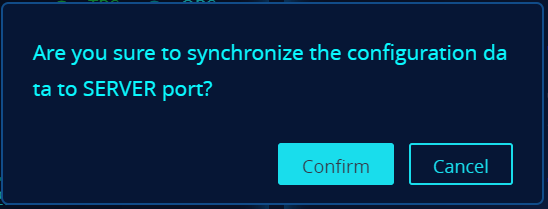

**Step 2:** Click \[Confirm] to check whether there is an error in the contents of the "Configuration->[Config Checking](#config-checking)" module. "Synchronization succeeded" is prompted when all detection items are normal. "Configuration verification failed" is prompted when there is an error.


**Step 3 (in case of an exception):** After the config checking fails, click \[Config Checking] to jump to the "Configuration->[Config Checking](#config-checking)" module to view the specific error information.


#### Reload triggering scenario


The function operations that trigger Reload are as follows:

- Node management: add, modify and delete
- Switch: add, modify and delete
- Data source group: add, modify and delete (the data source group of operation shall have associated data source, otherwise it will not be triggered)
- LogicDB: add, modify, delete and delete in batches
- Table configuration: quickly add table configuration, add new table, modify table, delete and delete in batches (including addition and deletion of child table)
- Sharding function: add, modify, delete and replicate
- Compute node parameter configuration: modify parameters
- Database user management: add, modify, delete and delete in batches
- White list: add, modify, switch, delete and add white list
- SQL Firewall: enable, enable in batches, disable and disable in batches
- Database user password: modify the password successfully
- Data source password: change, change in batches and setup with one click (set selection and set all)

### Notice

This function is used to display various alert types of notification items and other notification items. When there is a notification item, the total number of notifications is displayed in the upper right corner. If there is no notification item, it is not displayed;


The content of notice is consistent with the content of "Event" on the [Home](#home).

Click on the specific event in the Notice to jump to "Event -> History Event" or specific function to view the details.

The Notice content is divided into three levels: ERROR, WARNING and INFO, displayed with the icons of ,  and  respectively.

Click the \[Setting] button in the Notice to set whether to prompt the event.

### Theme

In the navigation bar, click \[Theme] to change the theme style of the current HotDB Management.


### User information

#### Switch user view

If the HotDB Management login user is "Manager User", it can be switched to the manager user view page in the upper right corner in the general user view. it can also be switched to the general user view page in the upper right corner in the manager user.

#### Modify user information

In the Modify User Information page, only the personal password can be changed, and the username and compute node cluster privileges can be viewed. In the navigation bar, click \[Modify User Information] to enter the personal information page.


On the Personal Information page, enter the current password, enter the new password and confirm the new password. Click \[Save] to successfully change the user password.

The new password shall not be the same as the current password.

If the password is forgotten, please contact super administrator to reset the password.


High-risk operation qualification switch requires password checking by users when it is turned on or off.


When the high-risk operation switch is turned on, the page needs to confirm the advanced password if the user performs dangerous operations, such as data source password change, normal DDL and online DDL execution of SQL containing dangerous operation instructions such as "drop" and "truncate".


### Sign out

In the navigation bar, click \[Sign Out] to exit successfully. After signing out successfully, the program will jump to the login page.

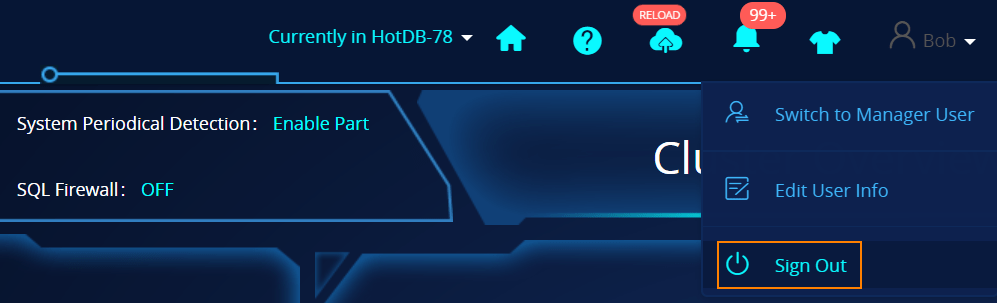

### Language

The management platform supports both Chinese and English; the default language is Chinese. If you want to switch to English, you can change the language parameters in application.properties under the installation `conf/directory` on the management platform.


Currently, the language parameter only supports Chinese and English.

You need to restart the management platform service to take effect after changing the parameters.

### HTTPS secure access

The management platform supports encrypted access using HTTPS.

#### Start with default configuration

Under `conf/application.properties` of the management platform installation directory, HTTPS configuration is commented by default. If you want to enable it, delete the annotation and restart the management platform.


The meaning of HTTPS parameter is as follows:

- `https.port` - HTTPS access port, `4322` by default.
- `https.keystore-password` - Password of the generated .jks file， `zjsWg6977DwK6HBD` by default.
- `https.keystore-file` - Name of the generated .jks file, `hotdb.jks` by default. The file is located under the directory `conf` by default.

#### Customized HTTPS configuration

The management platform supports the customized name and password of jks file through JDK. The steps are as follows:

1. Execute the command through the `conf` path of the management platform installation directory.

```bash
# You can generate it in two different ways

# Phased generation:
keytool -genkey -alias test -keypass 123456 -keyalg RSA -keysize 1024 -validity 365 -keystore hotdbtest.jks -storepass 123456
# Press Enter and input the relevant information.

# One-time generation:
keytool -genkey -alias test -keypass 123456 -keyalg RSA -keysize 1024 -validity 365 -keystore hotdbtest.jks -storepass 123456 -dname "CN=tester,OU=hotdb,O=hotdb,L=shanghai,ST=shanghai,C=CHINA"

# Note: Because jks files need to be placed in the /conf directory under the installation directory of the management platform, it is better to execute commands through the /conf path (or put it in the /conf directory after the file is generated).

# The meaning of common commands of keytool in JDK are as follows:
# -genkey: create a default file ".keystore" in the user's home directory, and an alias of mykey will also be generated. mykey contains the user's public key, private key and certificate (if no location is specified, .keystore will be located inthe default directory of the user's system)
# -alias：generate alias
# -keystore：name of the specified keystore (the generated information will not be in the. Keystore file)
# -keyalg：algorithm for specifying the key (such as RSA, DSA)
# -validity：specifies the validity period of the generated certificate, unit: day
# -keysize：size of the specified key
# -storepass：password for the specified keystore
# -keypass：password for the specified alias
# -dname：owner information of the specified certificate, for example: "CN = first name and last name, OU = unit name, O = organization name, L = city or region name, ST = state or province name, C = two letter country code of the unit"
# -v：show certificate details in keystore

# Note: more commands can be viewed using: keytool -- help.
```

2. Modify `https.keystore-password` and `https.keystore-file` in `application.xml` to be the newly generated value and restart the management platform to access the management platform using HTTPS.

> 
>
> 
>
> 

