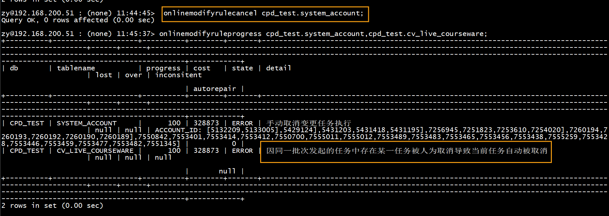
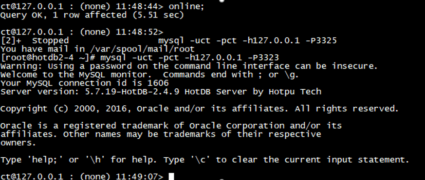

# HotDB Server Management Commands

## New commands in V2.5.6

- [show backupmasterdelay](#show-backupmasterdelay) - show master/slave replication delay of specified data node
- [disable_election](#disable_election) -disable election in cluster
- [enable_election](#enable_election)-enable election in cluster
- [disable_non_query_command](#disable_non_query_command) -only allow query command
- [enable_non_query_command](#enable_non_query_command) -allow non-query command
- [offline_to_dr](#offline_to_dr) -execute offline and online is not allowed
- [exchangeconfig](#exchangeconfig) -exchange configuration of IDC
- [exchangememoryconfig](#exchangememoryconfig) -exchange configuration in memory
- [online_dr_check](#online_dr_check) -check IDC switching
- [online_dr_process](#online_dr_process) -show IDC switching process
- [check @@datasource_config_new](#check-datasource_config_new) -check MySQL parameter configuration information
- [reset @@dberrorcount](#reset-dberrorcount) -clear all the error messages of LogicDBs

## Data Detection Statement

### HotDB Server statistics

#### `show @@backend` - show backend connection

This command is used to view the connection between HotDB Server and data source. For example:

```sql
show @@backend;
```


Or query backend as you query a normal table:

```sql
select * from backend where MYSQLID=198865;
```


Or use HINT statement:

```sql
/*!hotdb:dnid=all*/select * from information_schema.processlist where info!='NULL' and id=198865;
```


**Fields and their description are contained in the result:**

| Column Name  | Description                       | Value Type/Range                                                                                                                                                                               |
|--------------|-----------------------------------|------------------------------------------------------------------------------------------------------------------------------------------------------------------------------------------------|
| `processor`  | The processor                     | `STRING/[processor number]`                                                                                                                                                                    |
| `id`         | Backend connection id             | `LONG/[number]`                                                                                                                                                                                |
| `mysqlid`    | Corresponding MySQL connection id | `LONG/[number]`                                                                                                                                                                                |
| `dnid`       | Data node id                      | `INT/[number]`                                                                                                                                                                                 |
| `host`       | Host information                  | `STRING/[host:port]`                                                                                                                                                                           |
| `schema`     | Database name                     | `STRING/[database]`                                                                                                                                                                            |
| `lport`      | Local port                        | `INT/[number]`                                                                                                                                                                                 |
| `net_in`     | Bytes received                    | `LONG/[number]`                                                                                                                                                                                |
| `net_out`    | Bytes sent                        | `LONG/[number]`                                                                                                                                                                                |
| `up_time`    | Uptime (s)                        | `LONG/[number]`                                                                                                                                                                                |
| `state`      | Connection status                 | `connecting`: the process of actively connecting to the server. A socket setup request is initiated, but not successful yet                                                                    |
| ^            | ^                                 | authenticating: handshake authentication process                                                                                                                                               |
| ^            | ^                                 | `idle` -  idle available status                                                                                                                                                                |
| ^            | ^                                 | `borrowed` -  borrowed status: in the presence of a transaction scenario, even if the backend does not execute sql, the connection will still be held until commit and rollback are committed. |
| ^            | ^                                 | `running` - a request is sent, and in the status of waiting for response or processing the response                                                                                            |
| ^            | ^                                 | `closed` - connection is closed                                                                                                                                                                |
| `send_queue` | size of send queue                | `INT/[number]`                                                                                                                                                                                 |
| `iso_level`  | transaction isolation level       | `0` - read uncommitted                                                                                                                                                                         |
| ^            | ^                                 | `1` - read committed                                                                                                                                                                           |
| ^            | ^                                 | `2` - repeatable read                                                                                                                                                                          |
| ^            | ^                                 | `3` - serializable                                                                                                                                                                             |
| `autocommit` | autocommit or not                 | `BOOLEAN/[true/false]`                                                                                                                                                                         |
| `closed`     | closed or not                     | `BOOLEAN/[true/false]`                                                                                                                                                                         |
| `version`    | connection pool version number    | `INT/[number]`                                                                                                                                                                                 |
| `charset`    | result charset                    | `STRING/[charset]`                                                                                                                                                                             |
| `comment`    | comment                           | `heartbeat` -  heartbeat: connection used by heartbeat                                                                                                                                         |
| ^            | ^                                 | `latency check` - connection used by latency detection                                                                                                                                         |
| ^            | ^                                 | `idle` -  connection for idle status                                                                                                                                                           |
| ^            | ^                                 | `querying` - connection for executing query                                                                                                                                                    |


#### `show @@bufferpool` - Show the status of bufferpool

This command is used to view the status of bufferpool. For example:

```sql
show @@bufferpool;
```


**Fields and their description are contained in the result:**

| Column Name           | Description                                        | Value Type/Range                                                             |
|-----------------------|----------------------------------------------------|------------------------------------------------------------------------------|
| `thread`              | thread name                                        | `STRING/ ["$NIOREACTOR-"[number]"-RW", "$NIOExecutor-"[number]"-" [number]]` |
| `pool_size`           | bufferpool size                                    | `INT/[number]`                                                               |
| `local_allocate_opts` | The count of buffer requests of local cache thread | `LONG/[number]`                                                              |
| `queue_recycle_opts`  | The count of buffer recycles of local cache thread | `LONG/[number]`                                                              |
| `other_allocate_opts` | The count of buffer requests of other threads      | `INT/[number]`                                                               |
| `other_recycle_opts`  | The count of buffer recycles of other threads      | `INT/[number]`                                                               |

#### `show @@clientquery` - statistics of current client query

This command is used to show the statistics of current client query. For example:

```sql
show @@clientquery;
```


**Fields and their description are contained in the result:**

| Column Name | Description                   | Value Type/Range    |
|-------------|-------------------------------|---------------------|
| `client`    | client information            | `STRING/[host]`     |
| `db`        | LogicDB name                  | `STRING/[database]` |
| `select`    | The count of query            | `LONG/[number]`     |
| `insert`    | The count of insert           | `LONG/[number]`     |
| `update`    | The count of update           | `LONG/[number]`     |
| `delete`    | The count of delete           | `LONG/[number]`     |
| `other`     | The count of other operations | `LONG/[number]`     |
| `all`       | all                           | `LONG/[number]`     |

> !Note
>
> other counts the DDL statements executed by current client

#### `show @@cluster` - Show cluster member information

This command is used to view current cluster member status. This command is only used to view cluster member status, and has no reference value for single node and master/slave node. For example:

```sql
show @@cluster;
```


**Fields and their description are contained in the result:**

| Column Name    | Description                  | Value Type/Range |
|----------------|------------------------------|------------------|
| `status`       | member status                | `STRING`         |
| `host`         | member host                  | `STRING/[host]`  |
| `port`         | cluster communication port   | `INTEGER/[port]` |
| `server_port`  | cluster node server port     | `INTEGER/[port]` |
| `manager_port` | cluster node Management Port | `INTEGER/[port]` |

#### `show @@connection` - show frontend connection

This command is used to obtain the frontend connection of HotDB Server. For example:

```sql
show @@connection;
```


**Fields and their description are contained in the result:**

| Column Name   | Description                  | Value Type/Range             |
|---------------|------------------------------|------------------------------|
| `processor`   | processor name               | `STRING/["Processor"number]` |
| `id`          | frontend connection id       | `LONG/[number]`              |
| `host`        | client information           | `STRING/[host:port]`         |
| `dstport`     | target port number           | `INT/[number]`               |
| `schema`      | target database name         | `STRING/[database]`          |
| `charset`     | charset                      | `STRING/[charset]`           |
| `net_in`      | bytes received               | `LONG/[number]`              |
| `net_out`     | bytes sent                   | `LONG/[number]`              |
| `up_time`     | uptime (s)                   | `INT/[number]`               |
| `recv_buffer` | size of receive queue (byte) | `LONG/[number]`              |
| `send_queue`  | size of send queue (byte)    | `LONG/[number]`              |
| `iso_level`   | transaction isolation level  | `0` - read uncommitted       |
| ^             | ^                            | `1` - read committed         |
| ^             | ^                            | `2` - repeatable read        |
| ^             | ^                            | `3` - serializable           |
| `autocommit`  | autocommit or not            | `BOOLEAN/[true/false]`       |

#### `show @@connection_statistics` - Show current live frontend connection statistics

This command is used to obtain current live frontend connection statistics of HotDB Server. For example:

```sql
show @@connection_statistics;
```


**Fields and their description are contained in the result:**

| Column Name       | Description                                | Value Type/Range    |
|-------------------|--------------------------------------------|---------------------|
| `id`              | connection id                              | `INTEGER/[number]`  |
| `client_addr`     | client ip address                          | `STRING/[host]`     |
| `port`            | client connection port                     | `INTEGER/[number]`  |
| `logicdb`         | LogicDB used                               | `STRING/[database]` |
| `username`        | username                                   | `STRING`            |
| `host`            | host matched with client                   | `STRING`            |
| `connect_time`    | connection establishment time              | `STRING/[date]`     |
| `close_time`      | current connection time                    | `STRING/[date]`     |
| `operation_count` | The count of operations of this connection | `INTEGER/[number]`  |

#### `show @@database` - show current available LogicDB information

This command is used to show current available LogicDB information, which is equivalent to the command show databases under the MySQL. For example:

```sql
show @@database;
```


**Fields and their description are contained in the result:**

| Column Name | Description | Value Type/Range    |
|-------------|-------------|---------------------|
| `database`  | LogicDB     | `STRING/[database]` |

#### `show @@datanode` - show data node information

This command is used to show the node information of current database. For example:

```sql
show @@datasource;
```


**Fields and their description are contained in the result:**

| Column Name                | Description                                                                                     | Value Type/Range                   |
|----------------------------|-------------------------------------------------------------------------------------------------|------------------------------------|
| `dn`                       | data node number (the command `restart @@heartbeat` can be sued to restore heartbeat detection) | `INT/[number]`                     |
| `ds`                       | current data source information                                                                 | `STRING/[host:port/database]`      |
| `ds_id`                    | current data source id                                                                          | `INT/[number]`                     |
| `type`                     | current data source type                                                                        | `1` - Active Master                |
| ^                          | ^                                                                                               | `2` - Master/Slave                 |
| ^                          | ^                                                                                               | `3` - Standby Slave                |
| ^                          | ^                                                                                               | `4` - MGR                          |
| `active`                   | active connections                                                                              | `INT/[number]`                     |
| `idle`                     | idle connections                                                                                | `INT/[number]`                     |
| `size`                     | all connections                                                                                 | `INT/[number]`                     |
| `state`                    | node status                                                                                     | `normal` - normal                  |
| ^                          | ^                                                                                               | `failover` - failover              |
| `last_failover_start_time` | start time of last failover                                                                     | `STRING/[yyyy-MM-dd HH:mm:ss.SSS]` |
| `last_failover_duration`   | duration of last failover (ms)                                                                  | `STRING/[number]`                  |
| `last_failover_reason`     | reason for last failover                                                                        | `STRING`                           |
| `last_failover_info`       | information of last failover                                                                    | `STRING`                           |
| `negotiation`              | MGR node negotiation status                                                                     | `OK` - normal                      |
| ^                          | ^                                                                                               | `ERROR` - abnormal                 |
| ^                          | ^                                                                                               | `NULL` - non-MGR                   |

#### `show @@datasource` - show data source information

This command is used to view configuration information and status of current data source. For example:

```sql
show @@datasource;
```


**Fields and their description are contained in the result:**

| Column Name          | Description                                                                                   | Value Type/Range                |
|----------------------|-----------------------------------------------------------------------------------------------|---------------------------------|
| `dn`                 | data node number (the command restart @@heartbeat can be used to restore heartbeat detection) | `INT/[number]`                  |
| `ds`                 | current data source information                                                               | `STRING/[host:port/database]`   |
| `type`               | current data source type                                                                      | `1` - Active Master             |
| ^                    | ^                                                                                             | `2` - Master/Slave              |
| ^                    | ^                                                                                             | `3` - Standby Slave             |
| ^                    | ^                                                                                             | `4` - MGR                       |
| `status`             | data source status                                                                            | `0` - unavailable               |
| ^                    | ^                                                                                             | `1` - available                 |
| ^                    | ^                                                                                             | `2` - last data source abnormal |
| `host`               | host address                                                                                  | `STRING/[IP]`                   |
| `port`               | host port                                                                                     | `STRING/[port]`                 |
| `schema`             | database name                                                                                 | `STRING/[database]`             |
| `active`             | active connections                                                                            | `INT/[number]`                  |
| `idle`               | idle connections                                                                              | `INT/[number]`                  |
| `size`               | all connections                                                                               | `INT/[number]`                  |
| `unavailable_reason` | reasons for unavailable data source                                                           | `STRING`                        |
| `flow_control`       | The count of remaining available                                                              | `INT/[number]`                  |

#### `show @@globaltableconsistency` - global table consistency detection

This command is used to detect the consistency of global table. For example:

```sql
show @@globaltableconsistency;
```


**Fields and their description are contained in the result:**

| Column Name                                      | Description                                                                           | Value Type/Range              |
|--------------------------------------------------|---------------------------------------------------------------------------------------|-------------------------------|
| `db`                                             | LogicDB name                                                                          | `STRING/[database]`           |
| `table`                                          | global table name                                                                     | `STRING/[host:port/database]` |
| `status`                                         | status                                                                                | `0` - undetectable            |
| ^                                                | ^                                                                                     | `1` - consistency             |
| ^                                                | ^                                                                                     | `-1` - inconsistency          |
| `result`                                         | detection result                                                                      | `STRING`                      |
| `less_half_dn_lost_and_first_dn_exsitdata_count` | the number of lines with less than half nodes lost and with data on the first node    | `INT/[number]`                |
| `repair`                                         | restoring state                                                                       | STRING                        |
| `less_half_dn_lost_and_first_dn_nodata_count`    | the number of lines with less than half nodes lost and without data on the first node | `INT/[number]`                |
| `greater_half_dn_lost_count`                     | the number of lines with more than half nodes lost                                    | `INT/[number]`                |
| `only_one_dn_not_lost_row_count`                 | the number of lines with only one node not lost                                       | `INT/[number]`                |
| `inconsist_row_count`                            | the number of lines with more than one node inconsistent                              | `INT/[number]`                |
| `only_one_dn_inconsist_row_count`                | the number of lines with only one node inconsistent and none lost                     | `INT/[number]`                |
| `inconsist_and_lost_count`                       | the number of lines with nodes inconsisntent and lost                                 | `INT/[number]`                |
| `version`                                        | detection version                                                                     | `INT/[number]`                |

#### `show @@heartbeat` - show backend heartbeat status

The command is used to report the heartbeat status. For example:

```sql
show @@heartbeat;
```


**Fields and their description are contained in the result:**

| Column Name        | Description                                                       | Value Type/Range                                        |
|--------------------|-------------------------------------------------------------------|---------------------------------------------------------|
| `dn`               | data node id                                                      | `INT/[number]`                                          |
| `ds_id`            | data source id                                                    | `INT/[number]`                                          |
| `ds_type`          | data source type                                                  | `STRING/[master/slave]`                                 |
| `host`             | host address                                                      | `STRING/[ip]`                                           |
| `port`             | host port                                                         | `INT/[port]`                                            |
| `db`               | database name                                                     | `STRING/[database]`                                     |
| `retry`            | number of retries                                                 | `INT/[number]`                                          |
| `status`           | heartbeat status                                                  | `checking` - checking                                   |
| ^                  | ^                                                                 | `idle` - heartbeat detection is normally started        |
| ^                  | ^                                                                 | `stopped` - stopped                                     |
| ^                  | ^                                                                 | `paused` - heartbeat detection is paused                |
| ^                  | ^                                                                 | `unknown` - heartbeat detection function is not started |
| `period`           | heartbeat period                                                  | `INT/[number]`                                          |
| `execute_time`     | average heartbeat response time of recent 10s, 1min and 5min (ms) | `STRING/[number],[number],[number]`                     |
| `last_active_time` | lastest heartbeat success time                                    | `DATETIME/[yyyy-MM-dd HH:mm:ss]`                        |
| `stop`             | heartbeat stops or not                                            | `BOOLEAN/[true/false]`                                  |

> !Note
>
> dn=-1 means configdb

#### `show @@latency` - show the synchronization latency

This command is used to view whether there is latency of master/slave database synchronization (the value can be shown only when the failover rule needs to be、 configured). When there is latency of master/slave data, for example, when you set the SQL_DELAY time of standby slave:


```sql
show @@latency;
```


If there is no latency, it shows:


**Fields and their description are contained in the result:**

| Column Name   | Description                                                                                                                                                                                                                                                                                                                                          | Value Type/Range                                                                                                                             |
|---------------|------------------------------------------------------------------------------------------------------------------------------------------------------------------------------------------------------------------------------------------------------------------------------------------------------------------------------------------------------|----------------------------------------------------------------------------------------------------------------------------------------------|
| `dn`          | data node id                                                                                                                                                                                                                                                                                                                                         | `INT/[number]`                                                                                                                               |
| `info`        | current data source path                                                                                                                                                                                                                                                                                                                             | `STRING/[ip]:[port]/[database]`                                                                                                              |
| `backup_info` | slave data source path                                                                                                                                                                                                                                                                                                                               | `STRING/[ip]:[port]/[database]`                                                                                                              |
| `latency`     | If it is available, it shows synchronization latency (ms); if it is unavailable or the data source is stopped, it shows `"STOPPED"`; if there is not synchronization latency, it shows `"ERROR! Check your replication."`; if the synchronization latency is invalid, it shows `"ERROR! Check your replication.(datasource may have just switched)"` | `STRING/[number] ms`, `"STOPPED"`, `"ERROR! Check your replication."`, `"ERROR! Check your replication.(datasource may have just switched)"` |

#### `show @@longtransaction` - show long transaction information

This command is used to view the information of long transaction. For example:

```sql
show @@longtransaction;
```


The long transaction is judged based on: transactions executed for more than 10s are all long transactions. Refer to the rules:

```sql
select trx_id, trx_started from information_schema.innodb_trx where trx_started<=date_sub(now(),interval 10 second);
```

**Fields and their description are contained in the result:**

| Column Name | Description    | Value Type/Range  |
|-------------|----------------|-------------------|
| `host`      | host address   | `STRING/[IP]`     |
| `port`      | host port      | `INT/[PORT]`      |
| `trx_id`    | transaction id | `STRING/[number]` |

#### `show @@masterslaveconsistency` - master/slave data consistency detection

This command is used to show the consistency of tables in active master and standby slave. For example:

```sql
show @@masterslaveconsistency;
```


The above result shows that the master/salve data of DN_06 node is inconsistent.


and the above result shows that the CC table in the LogicDB LGG has no index defined, and consistency cannot be detected; DML_A_JWY table structure is inconsistent.

**Fields and their description are contained in the result:**

| Column Name | Description        | Value Type/Range                |
|-------------|--------------------|---------------------------------|
| `db`        | LogicDB name       | `STRING/[database]`             |
| `table`     | table name         | `STRING/[table]`                |
| `dn`        | data node name     | `STRING`                        |
| `result`    | consistent or not  | `STRING/["YES","NO","UNKNOWN"]` |
| `info`      | consistency result | `STRING`                        |

#### `show @@operation` - show detailed command execution statistics

This command is used to show the data source actually used, and statistics of backend command execution. For example, frontend insert execution:

```sql
insert into tid values(10),(2);
insert into tid values(1677870),(233333333);
```


The query result shows the current execution of backend for data source table:

```sql
select * from operation where `TABLE` like '%tid%';
```


**Fields and their description are contained in the result:**

| Column Name | Description                                                                        | Value Type/Range    |
|-------------|------------------------------------------------------------------------------------|---------------------|
| `schema`    | LogicDB name                                                                       | `STRING/[database]` |
| `dn`        | data node id                                                                       | `INT/[number]`      |
| `ds`        | data source id                                                                     | `INT/[number]`      |
| `host`      | data source host ip                                                                | `STRING/[IP]`       |
| `port`      | data source port                                                                   | `INT/[number]`      |
| `db`        | database                                                                           | `STRING/[database]` |
| `table`     | table name                                                                         | `STRING/[table]`    |
| `select`    | The count of SELECT the \[table]                                                   | `LONG/[number]`     |
| `insert`    | The count of INSERT the \[table]                                                   | `LONG/[number]`     |
| `update`    | The count of INSERT the \[table]                                                   | `LONG/[number]`     |
| `delete`    | The count of DELETE the \[table]                                                   | `LONG/[number]`     |
| `replace`   | The count of REPLACE the \[table]                                                  | `LONG/[number]`     |
| `other`     | The count of other operations for \[table] (The count of executing DDL statements) | `LONG/[number]`     |
| `all`       | Statistics of the above operations                                                 | `LONG/[number]`     |

#### `show @@operation_db` - show command execution with LogicDB as unit

This command is used to show statistics of command execution with LogicDB as unit. For example:

```sql
show @@operation_db;
```


**Fields and their description are contained in the result:**

| Column Name | Description                                                                                  | Value Type/Range    |
|-------------|----------------------------------------------------------------------------------------------|---------------------|
| `db`        | LogicDB name                                                                                 | `STRING/[database]` |
| `select`    | The count of SELECT the \[table]                                                             | `LONG/[number]`     |
| `insert`    | The count of INSERT the \[table]                                                             | `LONG/[number]`     |
| `update`    | The count of INSERT the \[table]                                                             | `LONG/[number]`     |
| `delete`    | The count of DELETE the \[table]                                                             | `LONG/[number]`     |
| `replace`   | The count of REPLACE the \[table]                                                            | `LONG/[number]`     |
| `other`     | The count of other operations for the table \[table] (The count of executing DDL statements) | `LONG/[number]`     |
| `all`       | Statistics of the above operations                                                           | `LONG/[number]`     |

#### `show @@operation_dn` -- show the command execution with data node as unit

This command is used to show the command execution statistis with data node as unit. For example:

```sql
show @@operation_dn;
```


**Fields and their description are contained in the result:**

| Column Name | Description                                                                                 | Value Type/Range |
|-------------|---------------------------------------------------------------------------------------------|------------------|
| `dn`        | database node id                                                                            | `INT/[number]`   |
| `select`    | The count of SELECT the \[table]                                                            | `LONG/[number]`  |
| `insert`    | The count of INSERT the \[table]                                                            | `LONG/[number]`  |
| `update`    | The count of INSERT the \[table]                                                            | `LONG/[number]`  |
| `delete`    | The count of DELETE the \[table]                                                            | `LONG/[number]`  |
| `replace`   | The count of REPLACE the \[table]                                                           | `LONG/[number]`  |
| `other`     | The count of other operations for the table \[table] (The count of executing DDL statement) | `LONG/[number]`  |
| `all`       | Statistics of the above operations                                                          | `LONG/[number]`  |

> Note
>
> the operations related to global table are separately counted according to operation types: only one node is counted for SELECT, all nodes are counted for INSERT, UPDATE and DELETE

#### `show @@operation_ds` - show command execution with data source as unit

This command is used to show the statistics of command execution with data source as unit. For example:

```sql
show @@operation_ds;
```


**Fields and their description are contained in the result:**

| Column Name | Description                                                                                  | Value Type/Range    |
|-------------|----------------------------------------------------------------------------------------------|---------------------|
| `ds`        | data source id                                                                               | `INT/[number]`      |
| `host`      | data source host ip                                                                          | `STRING/[IP]`       |
| `port`      | data source port                                                                             | `INT/[number]`      |
| `db`        | database                                                                                     | `STRING/[database]` |
| `select`    | The count of SELECT the \[table]                                                             | `LONG/[number]`     |
| `insert`    | The count of INSERT the \[table]                                                             | `LONG/[number]`     |
| `update`    | The count of INSERT the \[table]                                                             | `LONG/[number]`     |
| `delete`    | The count of DELETE the \[table]                                                             | `LONG/[number]`     |
| `replace`   | The count of REPLACE the \[table]                                                            | `LONG/[number]`     |
| `other`     | The count of other operations for the table \[table] (The count of executing DDL statements) | `LONG/[number]`     |
| `all`       | Statistics of the above operations                                                           | `LONG/[number]`     |

#### `show @@operation_table` - show the command execution with table as unit

This command is used to show the command execution statistics with LogicDB as unit. For example:

```sql
show @@operation_table;
```


**Fields and their description are contained in the result:**

| Column Name | Description                                                                        | Value Type/Range |
|-------------|------------------------------------------------------------------------------------|------------------|
| `table`     | table name                                                                         | `STRING/[table]` |
| `select`    | The count of SELECT the \[table]                                                   | `LONG/[number]`  |
| `insert`    | The count of INSERT the \[table]                                                   | `LONG/[number]`  |
| `update`    | The count of INSERT the \[table]                                                   | `LONG/[number]`  |
| `delete`    | The count of DELETE the \[table]                                                   | `LONG/[number]`  |
| `replace`   | The count of REPLACE the \[table]                                                  | `LONG/[number]`  |
| `other`     | The count of other operations for \[table] (The count of executing DDL statements) | `LONG/[number]`  |
| `all`       | Statistics of the above operations                                                 | `LONG/[number]`  |

#### `show @@processor` - show thread processing information

This command is used to view the thread processing information. For example:

```sql
show @@processor;
```


**Fields and their description are contained in the result:**

| Column Name       | Description            | Value Type/Range           |
|-------------------|------------------------|----------------------------|
| `name`            | processor name         | `STRING/[Processornumber]` |
| `front_net_in`    | fronend received bytes | `LONG/[number]`            |
| `front_net_out`   | frontend sent bytes    | `LONG/[number]`            |
| `backend_net_in`  | backend received bytes | `LONG/[number]`            |
| `backend_net_out` | backend sent bytes     | `LONG/[number]`            |
| `frontends`       | frontend connections   | `LONG/[number]`            |
| `backends`        | backend connections    | `LONG/[number]`            |
| `w_queue`         | write queue size       | `LONG/[number]`            |

#### `show @@query` - show frontend query statistics

This command is used to show the statistics of frontend command (excluding the Management Port). For example:

```sql
show @@query;
```


**Fields and their description are contained in the result:**

| Column Name | Description                                                                                  | Value Type/Range |
|-------------|----------------------------------------------------------------------------------------------|------------------|
| `select`    | The count of calling SELECT of this service                                                  | `LONG/[number]`  |
| `insert`    | The count of calling INSERT of this service                                                  | `LONG/[number]`  |
| `update`    | The count of calling UPDATE of this service                                                  | `LONG/[number]`  |
| `delete`    | The count of calling DELETE of this service                                                  | `LONG/[number]`  |
| `other`     | The count of calling other operations of this service (The count of executing DDL statement) | `LONG/[number]`  |
| `all`       | Statistics of the above operations                                                           | `LONG/[number]`  |

#### `show @@query_db` - show LogicDB frontend query statistics

This command is used to show statistics of command execution of each LogicDB. For example:

```sql
show @@query_db;
```


**Fields and their description are contained in the result:**

| Column Name | Description                                                                                    | Value Type/Range    |
|-------------|------------------------------------------------------------------------------------------------|---------------------|
| `schema`    | LogicDB                                                                                        | `STRING/[database]` |
| `select`    | The count of SELECT the LogicDB \[schema]                                                      | `LONG/[number]`     |
| `insert`    | The count of INSERT the LogicDB \[schema]                                                      | `LONG/[number]`     |
| `update`    | The count of UPDATE the LogicDB \[schema]                                                      | `LONG/[number]`     |
| `delete`    | The count of DELETE the LogicDB \[schema]                                                      | `LONG/[number]`     |
| `other`     | The count of other operations for the LogicDB \[schema] (The count of executing DDL statement) | `LONG/[number]`     |
| `all`       | Statistics of the above operations                                                             | `LONG/[number]`     |

#### `show @@query_tb` - show table-level frontend query statistics`

This command is used to show statistics of command execution of each data table. For example:

```sql
show @@query_tb;
```


**Fields and their description are contained in the result:**

| Column Name | Description                                                                                                       | Value Type/Range    |
|-------------|-------------------------------------------------------------------------------------------------------------------|---------------------|
| `schema`    | LogicDB                                                                                                           | `STRING/[database]` |
| `table`     | table name                                                                                                        | `STRING/[table]`    |
| `select`    | The count of SELECT the \[table] under the LogicDB \[schema]                                                      | `LONG/[number]`     |
| `insert`    | The count of INSERT the \[table] under the LogicDB \[schema]                                                      | `LONG/[number]`     |
| `update`    | The count of UPDATE the \[table] under the LogicDB \[schema]                                                      | `LONG/[number]`     |
| `delete`    | The count of DELETE the \[table] under the LogicDB \[schema]                                                      | `LONG/[number]`     |
| `other`     | The count of other operations for the \[table] under the LogicDB \[schema] (The count of executing DDL statement) | `LONG/[number]`     |
| `all`       | Statistics of the above operations                                                                                | `LONG/[number]`     |

#### `show @@session` - show current session information

This command is used to show current session information. For example:

```sql
show @@session;
```


**Fields and their description are contained in the result:**

| Column Name          | Description                                 | Value Type/Range                   |
|----------------------|---------------------------------------------|------------------------------------|
| `id`                 | current session id                          | `INT/[number]`                     |
| `running`            | SQL is in progress or not                   | `BOOLEAN/[TRUE/FALSE]`             |
| `trx_started`        | transaction start time                      | `STRING/[yyyy-MM-dd HH:mm:ss.SSS]` |
| `trx_time`           | transaction duration (s)                    | `INT/[number]`                     |
| `trx_query`          | last executed SQL                           | `STRING/[SQL]`                     |
| `bk_count`           | total backend connections                   | `INT/[number]`                     |
| `bk_dnid`            | backend connection node id                  | `INT/[number]`                     |
| `bk_dsid`            | backend connection data source id           | `INT/[number]`                     |
| `bk_id`              | backend connection id                       | `INT/[number]`                     |
| `bk_mysqlid`         | backend connection MySQL ID                 | `INT/[number]`                     |
| `bk_state`           | backend connection status                   | `STRING`                           |
| `bk_closed`          | backend connection is closed or not         | `BOOLEAN/[TRUE/FALSE]`             |
| `bk_autocommit`      | backend connection is autocommitted or not  | `BOOLEAN/[TRUE/FALSE]`             |
| `bk_host`            | backend connection Host                     | `STRING/[host]`                    |
| `bk_port`            | backend connection port                     | `INT/[port]`                       |
| `bk_db`              | backend connection database name            | `STRING/[DATABASE]`                |
| `bk_query`           | the last executed SQL of backend connection | `STRING/[SQL]`                     |
| `bk_last_read_time`  | the last read time of backend connection    | `STRING/[yyyy-MM-dd HH:mm:ss.SSS]` |
| `bk_last_write_time` | the last write time of backend connection   | `STRING/[yyyy-MM-dd HH:mm:ss.SSS]` |

#### `show @@tableinfo` - show table data information

This command is used to view the data information of each data table. For example:

```sql
show @@tableinfo;
```


**Fields and their description are contained in the result:**

| Column Name   | Description         | Value Type/Range     |
|---------------|---------------------|----------------------|
| `schema`      | LogicDB             | `STRING/[database]`  |
| `dn`          | data node id        | `INT/[number]`       |
| `ds`          | data source id      | `INT/[number]`       |
| `host`        | data source host ip | `STRING/[IP]`        |
| `port`        | data source port    | `INT/[PORT]`         |
| `db`          | database            | `STRING/[database]`  |
| `table`       | database name       | `STRING/[number]`    |
| `table_type`  | table type          | `0` - Global table   |
| ^             | ^                   | `1` - Sharding table |
| `table_rows`  | database rows       | `INT/[number]`       |
| `data_length` | data length (byte)  | `LONG/[number]`      |

#### `show @@tableinfo_db` - show data information of table with LogicDB as unit

This command is used to view the data information of table with LogicDB as unit. For example:

```sql
show @@tableinfo_db;
```


**Fields and their description are contained in the result:**

| Column Name   | Description        | Value Type/Range    |
|---------------|--------------------|---------------------|
| `db`          | LogicDB name       | `STRING/[database]` |
| `table_rows`  | database rows      | `INT/[number]`      |
| `data_length` | data length (byte) | `LONG/[number]`     |

#### `show @@tableinfo_dn` - show data information of table with data node as unit

This command is used to view the data information of table with data node as unit, and only the table information in current data source is counted. For example:

```sql
show @@tableinfo_dn;
```


**Fields and their description are contained in the result:**

| Column Name   | Description        | Value Type/Range |
|---------------|--------------------|------------------|
| `dn`          | data node id       | `INT/[number]`   |
| `table_rows`  | database rows      | `INT/[number]`   |
| `data_length` | data length (byte) | `LONG/[number]`  |

#### `show @@tableinfo_ds` - show data information of table with data source as unit

This command is used to show the data information of table with data source as unit (including unavailable data source). For example:

```sql
show @@tableinfo_ds;
```


**Fields and their description are contained in the result:**

| Column Name   | Description        | Value Type/Range |
|---------------|--------------------|------------------|
| `ds`          | data source id     | `INT/[number]`   |
| `table_rows`  | database rows      | `INT/[number]`   |
| `data_length` | data length (byte) | `LONG/[number]`  |

#### `show @@tableinfo_table` - show table data information with table level

This command is used to show the data information of table with LogicDB as unit. For example:

```sql
show @@tableinfo_table;
```


**Fields and their description are contained in the result:**

| Column Name   | Description        | Value Type/Range |
|---------------|--------------------|------------------|
| `table`       | table name         | `STRING/[table]` |
| `table_rows`  | database rows      | `INT/[number]`   |
| `data_length` | data length (byte) | `LONG/[number]`  |

### `show @@threadpool` - show status of threadpool

This command is used to view the status of threadpool. For example:

```sql
show @@threadpool;
```


**Fields and their description are contained in the result:**

| Column Name       | Description                | Value Type/Range**                                  |
|-------------------|----------------------------|-----------------------------------------------------|
| `name`            | name of threadpool         | `1STRING/"TimeExecutor","$NIOExecutor-"+number+"-"` |
| `pool_size`       | size of threadpool         | `INT/[number]`                                      |
| `acive_count`     | The count of active thread | `LONG/[number]`                                     |
| `task_queue_size` | size of task queue         | `LONG/[number]`                                     |
| `completed_task`  | completed tasks            | `LONG/[number]`                                     |
| `total_task`      | total tasks                | `LONG/[number]`                                     |

#### `show @@transaction` - show transaction number

This command is used to view each LogicDB and count the number of currently completed autocomit and non-autocommit transactions, for example:

```sql
show @@transaction;
```


**Fields and their description are contained in the result:**

| Column Name   | Description                | Value Type/Range    |
|---------------|----------------------------|---------------------|
| `schema`      | LogicDB                    | `STRING/[database]` |
| `transaction` | the number of transactions | `LONG/[number]`     |

#### `show hotdb datanodes` - show current available nodes

This command is used to view the hotdb_datanodes table in configdb. The statement is:

```sql
show hotdb datanodes [LIKE 'pattern' | WHERE expr];
```

**Parameter description:**

| Parameter | Description                                               | Type     |
|-----------|-----------------------------------------------------------|----------|
| `pattern` | optional, fuzzy query expression, match the key rule_name | `STRING` |
| `expr`    | optional, fuzzy query expression, match the specified key | `STRING` |

For example:


For another example:


**Fields and their description are contained in the result:**

| Column Name     | Description             | Value Type/Range |
|-----------------|-------------------------|------------------|
| `datanode_id`   | node id                 | `INTEGER`        |
| `datanode_name` | node name               | `STRING`         |
| `datanode_type` | 0: master/slave; 1: MGR | `INTEGER`        |

#### `show hotdb functions` - show current available sharding function

This command is used to viw the hotdb_function table in configdb. The statement is:

```sql
show hotdb functions;
```

**Parameter description:**

| Parameter | Description                                                   | Type     |
|-----------|---------------------------------------------------------------|----------|
| `pattern` | optional, fuzzy query expression, match the key function_name | `STRING` |
| `expr`    | optional, fuzzy query expression, match the key function_name | `STRING` |

For example:


For another example:


**Fields and their description are contained in the result:**

| Column Name      | Description                                                                                                   | Value Type/Range |
|------------------|---------------------------------------------------------------------------------------------------------------|------------------|
| `function_id`    | sharding function id                                                                                          | `INTEGER`        |
| `function_name`  | sharding function name                                                                                        | `STRING`         |
| `function_type`  | sharding type                                                                                                 | `STRING`         |
| `auto_generated` | whether it is the configuration auto-generated in HotDB or not (1: auto-generated, other: non-auto-generated) | `INTEGER`        |

#### `show hotdb function infos` - show current available sharding function information

This command is used to view the hotdb_function_info table in cofigdb. The statement is:

```sql
show hotdb function infos [WHERE expr];
```

**Parameter description:**

| Parameter | Description                                               | Type     |
|-----------|-----------------------------------------------------------|----------|
| `expr`    | optional: fuzzy query expression, match the specified key | `STRING` |

For example:


For another example:


**Fields and their description are contained in the result:**

| Column Name    | Description          | Value Type/Range |
|----------------|----------------------|------------------|
| `function_id`  | sharding function id | `INTEGER`        |
| `column_value` | sharding key value   | `STRING`         |
| `datanode_id`  | data node id         | `INTEGER`        |

#### `show hotdb rules` - show current available sharding function

This command is used to view the hotdb_rule table in configDB. The statement is:

```sql
show hotdb rules [LIKE 'pattern' | WHERE expr];
```

**Parameter description:**

| Parameter | Description                                               | Type   |
|-----------|-----------------------------------------------------------|--------|
| `pattern` | optional: fuzzy query expression, match the key rule_name | STRING |
| `expr`    | optional: fuzzy query expression, match the key rule_name | STRING |

For example:


For another example:


**Fields and their description are contained in the result:**

| Column Name    | Description                                                                                                   | Value Type/Range |
|----------------|---------------------------------------------------------------------------------------------------------------|------------------|
| rule_id        | sharding function id                                                                                          | INTEGER          |
| rule_name      | sharding function name                                                                                        | STRING           |
| rule_column    | sharding key name                                                                                             | STRING           |
| function_id    | sharding type ID                                                                                              | INTEGER          |
| auto_generated | whether it is the configuration auto-generated in HotDB or not (1: auto-generated, other: non-auto-generated) | INTEGER          |

#### `show backupmasterdelay [DNID]` - show master/slave replication delay of specified data node{#show-backupmasterdelay}

The command is used to view the master/slave replication delay of specified data node \[DNID], the statement is:

```sql
show backupmasterdelay [DNID];
```

**Parameter description:**

| Parameter | Description  | Type      |
|-----------|--------------|-----------|
| `DNID`    | Data node id | `INTEGER` |

For example:


**Fields and their description are contained in the result:**

| Column Name         | Description                       | Value Type/Range |
|---------------------|-----------------------------------|------------------|
| `datasource_id`     | Data source id                    | `INTEGER`        |
| `sql_delay`         | Replication delay (s)             | `LONG`           |
| `slave_io_running`  | Slave io_thread status (Yes/No)   | `STRING`         |
| `slave_sql_running` | Slave sql_thread status（Yes/No） | `STRING`         |

### HotDB services

#### `show @@config_master_status `- return to show master status of ConfigDB

This command is used to show the show master status of the current ConfigDB.

For example:

```sql
show @@config_master_status;
```


**Fields and their description are contained in the result:**

| Column Name         | Description                       | Value Type/Range |
|---------------------|-----------------------------------|------------------|
| `file`              | Binlog file                       | `STRING`         |
| `position`          | Binlog position                   | `INTEGER`        |
| `binlog_do_db`      | Database to be recorded by Binlog | `STRING`         |
| `binlog_ignore_db`  | Database to be ignorded by Binlog | `STRING`         |
| `executed_gtid_set` | Executed GTID                     | `STRING`         |

#### `show @@server` - show the status of HotDB server

This command is used to show the running status of current HotDB Server. the memory conforms to the value in the configuration./bin/hotdb-server.


For example:

```sql
show @@server;
```


**Fields and their description are contained in the result:**

| Column Name          | Description                         | Value Type/Range                         |
|----------------------|-------------------------------------|------------------------------------------|
| `uptime`             | the time of creating HotDB instance | `STRING/[number"h" number"m" number"s"]` |
| `online_time`        | HotDB online time                   | `STRING/[number"h" number"m" number"s"]` |
| `used_memory`        | the used memory                     | `STRING/[number + "M"]`                  |
| `total_memory`       | the total memory                    | `STRING/[number + "M"]`                  |
| `max_memory`         | the max memory                      | `STRING/[number + "M"]`                  |
| `max_direct_memory`  | the max direct memory               | `STRING/[number + "M"]`                  |
| `used_direct_memory` | the used direct memory              | `STRING/[number + "M"]`                  |
| `reload_time`        | Last re-load configuration time     | `STRING/[yyyy-MM-dd hh:mm:ss]`           |
| `charset`            | charset                             | `STRING/[charset]`                       |
| `role`               | the master/slave role               | `MASTER` - master                        |
| ^                    | ^                                   | `BACKUP` - salve                         |
| `status`             | the status of HotDB                 | `ON` - on                                |
| ^                    | ^                                   | `OFF` 0: off                             |
| `mode`               | the read/write mode of HotDB        | `STRING/["READ-ONLY"，"READ-WRITE"]`     |
| `version`            | the version of HotDB                | `STRING/[number.number.numbernumber]`    |

#### `show @@serversourceusage` - the usage of resources of current server

This command is used to view the usage of resources of current HotDB Server. For example:

```sql
show @@serversourceusage;
```


**Fields and their description are contained in the result:**

| Column Name    | Description                  | Value Type/Range               |
|----------------|------------------------------|--------------------------------|
| `used_memory`  | used memory (MB)             | `STRING/[number]`              |
| `total_memory` | total memory (MB)            | `STRING/[number]`              |
| `disk`         | usage of disk                | `STRING/[path number,...]`     |
| `cpu_load`     | CPU load                     | `FLOAT/[float]`                |
| `cpu_usage`    | CPU usage rate               | `STRING/[number,number,...]`   |
| `net_in`       | network flow rate (bytes/s)  | `LONG/[number]`                |
| `net_out`      | network flow rate (bytes/s)  | `LONG/[number]`                |
| `cores`        | total cores of CPU           | `INT/[number]`                 |
| `io`           | disk read-write speed (kB/s) | `STRING/["sda" number number]` |

#### `show @@systemconfig_memory` - memory parameters of current compute node

This command is used to view the memory parameters usage of the current compute node.For example:

```sql
show @@systemconfig_memory;
```


**Fields and their description are contained in the result:**

| Column Name | Description   | Value Type/Range  |
|-------------|---------------|-------------------|
| `config`    | configuration | `STRING/[number]` |

#### `show @@time_current` - show the current time

This command is used to view the current time, for example:

```sql
show @@time_current;
```


**Fields and their description are contained in the result:**

| Column Name | Description                  | Value Type/Range               |
|-------------|------------------------------|--------------------------------|
| `timestamp` | current time of HotDB Server | `STRING/[yyyy-MM-dd HH:mm:ss]` |

#### `show @@time_startup` - show the startup time of HotDB

This command is used to view the startup time of HotDB Server. For example:

```sql
show @@time_startup;
```


**Fields and their description are contained in the result:**

| Column Name | Description                  | Value Type/Range               |
|-------------|------------------------------|--------------------------------|
| `timestamp` | current time of HotDB Server | `STRING/[yyyy-MM-dd HH:mm:ss]` |

#### `show @@usbkey` - show USB-KEY status

This command is used to show USB-KEY status (authorization) and detect the exception info of the authorization. For example:

```sql
show @@usbkey;
```


**Fields and their description are contained in the result:**

| Column Name           | Description                                            | Value TypeD/Range               |
|-----------------------|--------------------------------------------------------|---------------------------------|
| `left_time`           | left time (s)                                          | `LONG/[number]`                 |
| `usbkey_status`       | USB_KEY status                                         | `0` - abnormal                  |
| ^                     | ^                                                      | `1` - normal                    |
| `usbkey_type`         | USB_KEY type                                           | `1` - tentative                 |
| ^                     | ^                                                      | `2` - terminable                |
| ^                     | ^                                                      | `3` - permanent                 |
| `node_limit`          | limit of node number                                   | `INT/[number]`                  |
| `last_check_time`     | ending time of last detection                          | `STRING/[yyyy-MM-dd HH:mm:sss]` |
| `usbkey_check_stuck`  | whether detection of USB_KEY is stuck                  | `0` - not stuck                 |
| ^                     | ^                                                      | `1` - stuck                     |
| `last_exception_time` | the time of last throwed exception in detection        | `STRING/[yyyy-MM-dd HH:mm:sss]` |
| `last_exception_info` | the information of last throwed exception in detection | `STRING`                        |
| `exception_count`     | the total times of last throwed exception in detection | `INT/[number]`                  |
| `comment`             | comment                                                | `STRING`                        |

> !Note
> 
> `left_time=0` means permanent or cancellation;

> !Note
> 
> `usbkey_check_stuck=1` means that thread is checked to be stuck. When the thread is checked to be stuck or the total times of last throwed exception in detection exceeds 1000, it prompts:

```
It is recommended to restart the HotDB server during the low peak period of business
```

#### `show @@version` - show USB-KEY status

This command is used to view the description of versions of HotDB Server. For example:

```sql
show @@version;
```


**Fields and their description are contained in the result:**

| Column Name | Description   | Value Type/Range |
|-------------|---------------|------------------|
| `version`   | HotDB version | `STRING`         |

### MySQL Services

#### `show @@ddl` - show DDL statements of tables

This command is used to show DDL statements of tables. For example:

```sql
show @@ddl;
```


**Fields and their description are contained in the result:**

| Column Name | Description            | Value Type/Range    |
|-------------|------------------------|---------------------|
| `schema`    | LogicDB                | `STRING/[database]` |
| `dn`        | data node id           | `INT/[number]`      |
| `ds`        | data source id         | `INT/[number]`      |
| `db`        | database               | `STRING/[database]` |
| `table`     | table name             | `STRING/[table]`    |
| `ddl`       | DDL statement of table | `STRING/[sql]`      |

#### `show @@lastsql` - the last executed sql of connection in borrowed status

This command is used to view the last executed SQL information of connection in borrowed status. For example:

```sql
show @@lastsql;
```


**Fields and their description are contained in the result:**

| Column Name         | Description                                                  | Value Type/Range            |
|---------------------|--------------------------------------------------------------|-----------------------------|
| `id`                | backend id                                                   | `LONG/[number]`             |
| `mysqlid`           | data node id                                                 | `LONG/[number]`             |
| `dn_ds`             | data node id -- data source id                               | `STRING/[number_number]`    |
| `host`              | data source                                                  | `STRING/[ip:port/database]` |
| `last_executed_sql` | the last MySQL statement executed on the data source \[host] | `STRING/[sql]`              |

#### `show @@onlineddl` - show the active onlineddl statement

This command shows the active OnlineDDL statement and its execution speed. The progress shows the execution progress of the statement by percentage. The speed shows the execution speed of current OnlineDDL statement (unit: row/ms). For example:

```sql
show @@onlineddl;
```


**Fields and their description are contained in the result:**

| Column Name | Description    | Value Type/Range    |
|-------------|----------------|---------------------|
| `schema`    | LogicDB        | `STRING/[database]` |
| `onlineddl` | statement      | `STRING/[SQL]`      |
| `progress`  | progress       | `LONG/[number]`     |
| `speed`     | speed (row/ms) | `LONG/[number]`     |
| `table`     | table mane     | `STRING/[table]`    |
| `type`      | change type    | `LONG/[number]`     |

#### `show @@tableindex`-- show index structure of tables

This command is used to show the index structure of each data table. For example:

```sql
show @@tableindex;
```


**Fields and their description are contained in the result:**

| Column Name | Description           | Value Type/Range    |
|-------------|-----------------------|---------------------|
| `schema`    | LogicDB               | `STRING/[database]` |
| `dn`        | data node id          | `INT/[number]`      |
| `ds`        | data source id        | `INT/[number]`      |
| `db`        | database              | `STRING/[database]` |
| `table`     | database name         | `STRING/[number]`   |
| `index`     | table index structure | `STRING`            |

### Sharding plan online modification

This section introduces the command of online modifying sharding plan in Management Port, with the following steps:

- Step one, check the modification plan ([onlinemodificationrulecheck](#onlinemodificationrulecheck))
- Step two, modify the sharding plan ([onlinemodificationrule](#onlinemodificationrule))
- Step three, view the modification progress ([onlinemodificationruleprogress](#onlinemodificationruleprogress))
- Whether to continue the modification ([onlinemodificationrulecontinue](#onlinemodificationrulecontinue)). Cancelling the current ongoing task ([onlinemodificationrulecancel](#onlinemodificationrulecancel)) is an optional operation item and can be executed according to actual situation

The above steps shall be carried out in sequence, or the result may not be successful.

#### onlinemodificationrulecheck

This command is used to check the sharding plan online modification. For example:

```sql
onlinemodificationrulecheck db.tablename[=functionid,rulecol:datanodes:checkconsistency (whether to check the master/slave consistency 1|0)]
```

**The command contains the following fields and their description:**

| Parameter          | Description                                                                             |   |
|--------------------|-----------------------------------------------------------------------------------------|---|
| `db`               | LogicDB                                                                                 |   |
| `tablename`        | table name                                                                              |   |
| `functionid`       | refer to the table hotdb_function in the configdb hotdb_config for the sharding rule id |   |
| `rulecol`          | sharding key                                                                            |   |
| `datanodes`        | refer to the table hotdb_datanode in the configdb hotdb_config for the data node        |   |
| `checkconsistency` | whether to check the master/slave consistency 1                                         | 0 |

It is used in two ways:

1. It can be used to check whether sharding rule modification related items pass. The check item id and corresponding check items are as follows:

| Check Item ID | Corresponding Key   | Description of Check Item                                                                               |
|---------------|---------------------|---------------------------------------------------------------------------------------------------------|
| 1             | `tbNameLess45`      | The source table name is not longer than 45 characters                                                  |
| 2             | `running`           | No sharding plan modification task is being executed in source table                                    |
| 3             | `validCol`          | Sharding key is the key contained in table structure                                                    |
| 4             | `diffrule`          | The sharding function and sharding key in modification plan are inconsistent with those in source table |
| 5             | `existUniqueKey`    | The source table has the master key or unique key                                                       |
| 6             | `recommendColType`  | The sharding key is a type of key recommended by the current sharding function                          |
| 7             | `lostData`          | The new sharding plan will not result in data loss                                                      |
| 8             | `trigger`           | The source table has no trigger                                                                         |
| 9             | `refByTrigger`      | The source table is not associated with other triggers                                                  |
| 10            | `foreignConstraint` | The source table has no foreign key constraint                                                          |
| 11            | `consistency`       | The master/slave data consistency check result of the source table is consistent                        |

If the check result (result value) is 1, it means that the check of this item fails, and the modification result may be incorrect.

As shown below: cpd_test is LogicDB, zx_cvset_signin_result is table name, 4 is functionid, id is sharding key, \[1,2] is data node, 1 is master/slave consistency check.

```sql
onlinemodificationrulecheck cpd_test. zx_cvset_signin_result=4,id:1,2:1;
```


When multi tables are checked at the same time, information between tables shall be separated by spaces. For example:

```sql
onlinemodificationrulecheck db.tablename=functionid,rulecol:datanodes:checkconsistency [db.tablename=functionid,rulecol:datanodes:checkconsistency..]
```


2. It can be used to view the check result after the sharding plan online modification is checked. For example:

```sql
onlinemodificationrulecheck db.tablename [db.tablename...]
```

**Fields and their description are contained in the result:**

| Column Name | Description                          |
|-------------|--------------------------------------|
| `db`        | LogicDB                              |
| `tablename` | table name                           |
| `id`        | check item id                        |
| `result`    | result (0 pass, 1 fail, -1 checking) |
| `warning`   | error warning message                |

View whether the check is finished (if the result value is -1, it means that the check is not finished), or whether there is any item that fails to pass the check (if the result value is 1, it means that items fail to pass the check), if all the result values are 0, it means that the sharding plan can be modified.

As shown below: cpd_test is LogicDB, zx_cvset_signin_result is table name.


When check results of multi tables are viewed at the same time, tables shall be separated by spaces. For example:


#### onlinemodificationrule

This command is used to modify the sharding plan. Execute the command to return to the result: OK or MySQLException.

```sql
onlinemodificationrule db.tablename=functionid,rulecol:datanodes: source table handling (hour:0 means perserved): batch row (1000): replication interval (T3/I0.3): waiting timeout (days): pause data replication period;
```

**Fields and their description are contained in the command:**

| Parameter                       | Description                                                                                                                                                                                                   |
|---------------------------------|---------------------------------------------------------------------------------------------------------------------------------------------------------------------------------------------------------------|
| `db`                            | LogicDB                                                                                                                                                                                                       |
| `tablename`                     | table name                                                                                                                                                                                                    |
| `functionid`                    | refer to the table hotdb_function in the configdb hotdb_config for the sharding rule id                                                                                                                       |
| `rulecol`                       | sharding key                                                                                                                                                                                                  |
| `datanodes`                     | refer to the table hotdb_datanode in the configdb hotdb_config for the data node                                                                                                                              |
| `source table handling`         | source table handling mode after successful sharding plan (preserved for n hours, o means not preserved)                                                                                                      |
| `batch row`                     | limit the read/write row size in data replication phase each time                                                                                                                                             |
| `replication interval`          | The interval time of read/write row each time (T3: 3 times of SQL execution time, I0.3: fixed time 0.3s)                                                                                                      |
| `waiting timeout`               | The time of waiting for user to handle the data inconsistency caused by the modification. If the user does not confirm it over the set time, the modification task will automatically fail, set range \[1,30] |
| `pause data replication period` | The data replication of the modificaiton task is automatically paused in the set time range, and the time interval is separated by commas. For example: 0700-2210,0300-0559                                   |

As shown below: cpd_test is LogicDB, zx_cvset_signin_result is table name, 4 is functionid, id is sharding key, \[1,2] is data node, 24 means source table will be deleted after 24 hours, 1000 is batch row, T3 is 3 times of SQL execution time, 7 means waiting timeout of 7 days, 0 means not set period of pause data replication

```sql
onlinemodificationrule cpd_test. zx_cvset_signin_result=4,id:1,2:24:1000:T3:7:0;
```


When multi tables are modified at the same time, the tables shall be separated by spaces.


The functionid used for sharding plan modification can be viewed in the table hotdb_function in configdb.


> !Important
> 
> - The functionid required for sharding rule modifiction has already existed in the table hotdb_function in configdb;
> - When using the sharding rule to be modified, we must ensure that the number of data nodes specified is consistent with that of data nodes in function_id;
> - The source table must have master key or unique key, no trigger and no foreign key constraint, or the modification result may be incorrect;
> - If the parameter of source table handling is 0 when in modification, then the historical table will be preserved in the table information, and the naming format is: "source table name + roYYMMDDHHMMSS";
> - If the modification of sharding rule of a table in the same batch fails, then the modification of all tables in this batch will fail;
> - The sever cannot be restarted when executing this command, or the modification may fail, but the original table may be preserved.

#### onlinemodificationruleprogress

This command is used to view the sharding plan modification progress, a table will have a row of data, as shown below:

```sql
onlinemodificationruleprogress db.tablename[,db1.tablename1,..]
```

**Fields and their description are contained in the command:**

| Parameter   | Description |
|-------------|-------------|
| `db`        | LogicDB     |
| `tablename` | table name  |

As shown below: cpd_test is LogicDB, cv_live_courseware and cv_live_study are table names.


**Fields and their description are contained in the result:**

| Key Name      | Description                                                                                                                                                                   |
|---------------|-------------------------------------------------------------------------------------------------------------------------------------------------------------------------------|
| `db`          | LogicDB                                                                                                                                                                       |
| `tablename`   | table name                                                                                                                                                                    |
| `progress`    | 0-100, integer                                                                                                                                                                |
| `cost`        | execution duration (ms)                                                                                                                                                       |
| `state`       | stopping (non-execution window), running (is being executing), waiting (inconsisitent, waiting for the user to confirm whether to continue), finish (completed), error (fail) |
| `detail`      | other errors                                                                                                                                                                  |
| `lost`        | data lost                                                                                                                                                                     |
| `over`        | data over                                                                                                                                                                     |
| `inconsitent` | data inconsistent                                                                                                                                                             |
| `autorepair`  | autorepair (1/0): 1 means repaired, o means unrepaired                                                                                                                        |

If the state returns to waitting, the user needs to confirm whether to continue it, ignore the inconsistent data or cancel the modification.


#### onlinemodificationrulecontinue

When the state of sharding plan modification progress is WAITTING, and the returned data is inconsistent, this command can be used to continue the modification, as shown below:

```sql
onlinemodificationrulecontinue db.tablename;
```

**fields and their description are contained in the command:**

| Parameter   | Description |
|-------------|-------------|
| `db`        | LogicDB     |
| `tablename` | table name  |

As shown below: in the process of modifying sharding plan, when the state is waitting, and inconsistent data exits, this command is used to continue the modification, and then view the progress again, the progress is 100 and the state is finish.


Ignoring these inconsistent data may lead to data errors, as shown below: some data is lost after modification.


#### onlinemodificationrulecancel

This command is used to cancel the current ongoing task:

```sql
onlinemodificationrulecancle db.tablename;
```

If the modification of a table in the same batch is cancelled, then the modification of sharding plan of all tables in this batch will be cancelled, as shown below:



## Management Control Statement

### `check @@datasource_config` - Check MySQL parameter configuration information{#check-datasource_config}

This command is used to check the consistency of particular parameter configuration information of MySQL data source. If any parameter is different from the requirements of HotDB Server, the system will output a prompt message after executing the command. For example:

```sql
check @@datasource_config;
```


**Fields and their description are contained in the result:**

| Column Name | Description                                  | Value Type/Range             |
|-------------|----------------------------------------------|------------------------------|
| `Level`     | exception information level (Warning, Error) | `STRING/["Error","Warning"]` |
| `Code`      | exception code                               | `INT/[number]`               |
| `Message`   | error message                                | `STRING`                     |
| `Value`     | error or warning related value               | `STRING`                     |

The parameters or configuration below require that all data sources shall be consistent and conform to the parameter configuration standard:

```
The time difference between data source and HOTDB is less than 3s
read-only
completion_type must be NO_CHAN
div_precision_increment
innodb_rollback_on_timeout must be on
autocommit
tx_isolation
max_allowed_packet
```

Please refer to the MySQL Server Parameter chapter in the [Standard](hotdb-server-standard-operations.md) document  the detailed use methods and requirements.

### `check @@datasource_config_new` - Check MySQL parameter configuration information{#check-datasource_config_new}

The function of this command is similar to check @@datasource_config. The difference is: `check @@datasource_config_new` is to read and check data node information from the non-running table without recording the check status history.

```sql
check @@datasource_config_new;
```


Please refer to [check @@datasource_config](#check-datasource_config) for usage and instructions.

### `check @@route` - Route check

This command is used to check the rightness of sharding table data routing. The statement is:

```sql
check @@route [db_name.tb_name | tb_name];
```

Parameter description:

| Parameter | Description   | Type     |
|-----------|---------------|----------|
| `db_name` | database name | `STRING` |
| `tb_name` | table name    | `STRING` |

When the data routing is consistent, the result is:


When the data routing is inconsistent, the result is:


**Fields and their description are contained in the result:**

| Column Name       | Description              | Value Type/Range |
|-------------------|--------------------------|------------------|
| `shard_key_value` | the routing key value    | `STRING`         |
| `route_dn`        | the routing node         | `INT/[number]`   |
| `actual_dn`       | the actually stored node | `INT/[number]`   |

### `kill @@connection` - Close a specified connection

This command is used to close the specified frontend connection, multi connections can be closed at the same time. The statement is:

```sql
kill @@connection [id1,id2,id3...idn];
```

Parameter description:

| Parameter       | Description      | Type                                                      |
|-----------------|------------------|-----------------------------------------------------------|
| `connection_id` | the connected id | `INTEGER/obtained through the command [show @connection]` |

For example:

```
mysql> kill @@connection 7;
Query OK, 1 rows affected (0.00 sec)
```


### `offline` - HotDB offline

This command is used to close the HotDB Server port and disconnect the frontend connection of server port 3323. For example:

```sql
offline;
```


### `online` - HotDB online

If we need to start up the HotDB Server port, we need to run the online in management end. This command is used to start up the HotDB Server port or in scenario where high availability switch occurs. The statement is:

```sql
online;
```




In a complete and normal HotDB Server high availability environment, if we manually send the command online to slave compute node, the slave compute node may start up 3323, and send the command offline to master compute node, and then the master compute node server port 3323 will be closed. But in the current state, the vip of keepalived will not drift (because master compute port 3325 is still available), then the compute node data service may become unavailable virtually. Therefore, if users manually operate the online of slave compute node without knowing clearly the operation mode of hign availability system or the existence of this defect, there may be a high risk of business failure!

When the DR mode is enabled, the master and slave compute nodes in the DR center are standby before IDC switching, with only the management end (port 3325 by default) providing services. Therefore, the online command is disabled for master and slave compute nodes in the DR center before IDC switching. In order to distinguish from the master center, when executing the online command, it will prompt as follows:

```
mysql> online;
ERROR 10192 (HY000): access denied. online is not allowed in a DR HotDB Server.
```

### `online_dr` - switch the IDC

The master compute node of DR center is not involved in HA high availability switching of master center. In addition to some show commands, only this command is accepted: online_dr switch the IDC.

```
root@192.168.220.183:(none) 8.0.15-HotDB-2.5.3.1 08:12:31> online_dr;
Query OK, 1 row affected (5 min 4.35 sec)
```

When the IDC-level switching of the compute node occurs, that is, when the master compute node of the DR center provides services, if the master compute node of the DR center fails at this time, it can execute enable_online; command before executing online or online_dr command to enable the slave compute node of the DR center. At this time, the slave compute node in the DR center can automatically enable the service port (3323 by default) to continue the service.

```
root@192.168.220.184:(none) 8.0.15-HotDB-2.5.3.1 08:10:31> enable_online;
Query OK, 1 row affected (11 min 5.39 sec)

root@192.168.220.184:(none) 8.0.15-HotDB-2.5.3.1 08:22:27> online_dr;
Query OK, 1 row affected (0.01 sec)
```

### `rebuild @@pool` - Rebuild current available data source of all nodes

This command is used to rebuid the backend connection of current HotDB Server and the connection information of data source. The statement is:

```sql
rebuild @@pool;
```

### `reload @@config` - Reread configuration information

This command is used to upgrade configuration, such as upgrading the configuration of the file server.xml and memory. Enter this command in the command window, the configuration parameter can be upgraded without restarting HotDB Server. This command is the same as the dynamic loading of management platform. The result is as following:# this command is not suitable for all parameters

```
mysql> reload @@config;
Query OK, 1 row affected (2.31 sec)
Reload config success
```

### `reset @@reloading` - Release the ongoing reload status by force

This command is used to release the ongoing reload status by force, that is, manually cancel the ongoing dynamic loading by force. Note: this command can be executed only when you confirm that there is no effect at all and this command can be used to reset dynamic loading when it is stuck. It is not recommended to use this command in any other circumstance.

For example, when dynamic loading is stuck:

```
root> reload @@config;
...stuck and no returned result...
```

Then if you confirm that the forced release of the ongoing reload status has no effect, you can execute this command to cancel the dynamic loading by force:

```
root> reset @@reloading;
Query OK, 1 row affected (0.00 sec)
Reset reloading success
```

Then the previous state that dynamic loading is stuck will be cancelled, and the following information will be shown:

```
root> reload @@config;
ERROR 1003 (HY000): Reload config failure, Reloading was set to false manually.
```

And the compute node log record is as follow:

```log
2019-07-19 17:49:57.626 [WARN] [MANAGER] [$NIOExecutor-3-0] ResetHandler(27) - received reset @@reloading from [thread=$NIOExecutor-3-0,id=780,user=re,host=127.0.0.1,port=2475,localport=28613,schema=null], reloading will be set to false.
2019-07-19 17:50:04.336 [WARN] [MANAGER] [Labor-181] HotdbConfig(1331) - Reload config failure, Reloading was set to false manually.
```

### `restart @@heartbeat` - Restart the heartbeat detection on the specified data node

This command is used to restart the heartbeat detection on the specified data node of the specified node. The statement is:

```sql
restart @@heartbeat [datanode_id];
```

Parameter description:

| Parameter     | Description  | Type  |
|---------------|--------------|-------|
| `datanode_id` | data node id | `INT` |

For example:

```
# Restart the heartbeat detection function of node 1
mysql> restart @@heartbeat 1;
Query OK, 2 rows affected (0.00 sec)
```

### `stop @@heartbeat` - Stop the heartbeat on the specified data node for a period

This command is used to stop the heartbeat on the specified data node for a period. When the time is -1, system will cancel the stop state of the specified node. The statement is:

```sql
stop @@heartbeat [datanode_id:time(s)]
```

Parameter description:

| Parameter   | Description   | Type |
|-------------|---------------|------|
| datanode_id | data node id  | INT  |
| time        | stop time (s) | INT  |

For example:

```
mysql> stop @@heartbeat 1:60; # Stop node 1 for 60s
Query OK, 1 row affected (0.01 sec)

mysql> stop @@heartbeat 1:-1;
Query OK, 1 row affected (0.00 sec)
```

### `switch @@datasource` - Switch the specified data source to standby data source

This command is used to switch the data source of the specified data node to the next standby data source. The statement is:

```sql
switch @@datasource [datanode_id];
```

For example:

```
mysql> stop @@heartbeat 1:60; # Stop node 1 for 60s
Query OK, 1 row affected (0.01 sec)

mysql> stop @@heartbeat 1:-1;
Query OK, 1 row affected (0.00 sec)# Control statements related to IDC switching in DR mode
```

## Control statements related to IDC switching in DR mode

The commands described in this chapter only need to be known by users. They are mainly used for interactive judgment between the management platform and the compute node service in the process of IDC switching. In daily use, manual call of these commands is forbidden.

### `disable_election` - Disable election in cluster{#disable_election}

```sql
 disable_election;
```

Generally used when switching the IDC in the DR mode, this command is used to disable election in the internal cluster of the IDC that is providing services, so as to avoid the occurrence of IDC switching and possible affect on the final result of the IDC switching.

### `enable_election` - Enable election in cluster{#enable_election}

```sql
enable_election;
```

### `disable_non_query_command` - Only allow query command{#disable_non_query_command}

```sql
disable_non_query_command;
```

This command is the internal command when switching the IDC in the DR mode. Once called, the instance of the compute node will only allow query command, and non-query command will be released after the switching is successful.

### `enable_non_query_command` - Allow non-query command{#enable_non_query_command}

```sql
enable_non_query_command;
```

### `offline_to_dr` - Execute offline and online is not allowed{#offline_to_dr}

```sql
offline_to_dr;
```

### `exchangeconfig` - Exchange configuration of IDC{#exchangeconfig}

```sql
exchangeconfig;
```

### `exchangememoryconfig` - Exchange configuration in memory{#exchangememoryconfig}

```sql
exchangememoryconfig;
```

### `online_dr_check` - Check IDC switching{#online_dr_check}

```sql
online_dr_check;
```

### `online_dr_process` - Show IDC switching process{#online_dr_process}

This command is used to view the progress of IDC switching in the DR mode, for example:


**Fields and their description are contained in the result:**

| Column Name  | Description                                                                                                                                                                                                                                                | Value Type/Range |
|--------------|------------------------------------------------------------------------------------------------------------------------------------------------------------------------------------------------------------------------------------------------------------|------------------|
| `process`    | Handling process, 0-8                                                                                                                                                                                                                                      | `INTEGER`        |
| `error`      | Error message (error format：srcDs1:dstDs1,srcDs2:dstDs2,...;errormsg or ds,ds:ds,...;errormsg, data source format (datanodeID_datasourceID_datasourceIP_port_dbname)，if included：then src is the original master center，dst is the original DR center) | `STRING`         |
| `error_code` | Error code status, 1 is finished, 0 is unfinished                                                                                                                                                                                                          | `INTEGER`        |
| `status`     | Status, 1 is finished, 0 is unfinished                                                                                                                                                                                                                     | `INTEGER`        |

### `reset dberrorcount` - Clear all the error messages of LogicDBs{#reset-dberrorcount}

```sql
reset dberrorcount;
```

## Function Processing Statement

### `dbremapping @@add@` - Add database mapping relation

This command is used to add the database mapping relation. The statement is:

```sql
dbremapping @@add@[database_name]:[database_name],[database_name]:[database_name]...;
```

For example:

```sql
dbremapping @@add@db01:logic_db01,db02:logic_db02; # Add multiple mapping relations
```

Add mapping relations from the database db01 to the LogicDB logic_db, so that executing the SQL statement USE db01 is equivalent to executing USE logic_db:

```sql
dbremapping @@add@db01:logic_db;
```

> !Note
> 
> If you add mapping relation from the same name database to different LogicDB, the previous mapping relations will be overlaid. Mapping relations are allowed to be added from different databases to the same LogicDB.

For example, first add the mapping relation from db01 to logic_db01:

```sql
dbremapping @@add@db01:logic_db01
```

And then add the mapping relation from db01 to logic_db02:

```sql
dbremapping @@add@db01:logic_db02
```

The first command will be overlaid by the second command, that is, only the mapping relation from db01 to logic_db02 exists finally. You can view the existing mapping relations in the line dbremapping of the table hotdb_config_info in compute node ConfigDB:


### `dbremapping @@remove@` - Remove database mapping relation

This command is used to remove the database mapping relations added in [dbremapping @@add@](#dbremapping-add---add-database-mapping-relation). The statement is:

```
mysql> dbremapping @@remove@[database_name]:[database_name],[database_name]:[database_name]...;
```

For example:

```
mysql> dbremapping @@remove@db01:logic_db01,db02:logic_db02;
# remove multiple mapping relations
Query OK, 0 rows affected (0.00 sec)
```

### `onlineddl` - OnlineDDL operation

This command ensures that when modifying the data table structure, the read/write of online business will not be blocked, and database can still provide normal data access service. The statement is:

```
mysql> onlineddl "[DDLSTATEMENT]";
```

For example:

```
mysql> onlineddl "alter table mytb add column cl1 varchar(90) default '1'";
```

> !Note
> 
> When online modifying table structure, the data table structures on each sharding shall be consistent, and the data table to be modified has unique index.

### `onlineddl_nocheck` - OnlineDDL操作前不进行主备一致性检测

This command ensures that the read and write of online business will not be blocked and the database is able to provide data access service during the modification of data table structure. No master-slave data consistency detection will be performed before execution. The statement is:

```sql
onlineddl_nocheck "[DDLSTATEMENT]";
```

For example:

```
mysql> onlineddl_nocheck "alter table mytb add column cl1 varchar(90) default '1'";
```

> !Note
> 
> When online modifying table structure, the data table structures on each sharding shall be consistent, and the data table to be modified has unique index.

### `check @@commandstatus cmd` - 检测是否支持接口

This command is used to view whether command `cmd` is supported by server. For example: 

```sql
check @@commandstatus onlineddl_nocheck;
```

Parameter description:

| Parameter | Description | Type |
|---|---|---|
| support |	Whether to support | 0 means not support<br>1 means support |

### `file @@list` - Obtain the files under the conf directory and its final modification time

This command is used to view and obtain the files under the conf directory and its final modification time. For example:

```
mysql> file @@list;
```


**Fields and their description are contained in the result:**

| Column Name | Description                                           | Value Type/Range                                    |
|-------------|-------------------------------------------------------|-----------------------------------------------------|
| `DATA`      | information of related files under the conf directory | `STRING/[number : file "time":yyyy-MM-dd hh:mm:ss]` |

### `hold commit` - Set connection status of all clients as HOLD_ALL_COMMIT{#hold-commit}

HOLD COMMIT is executed in the monitoring window of the command line of HotDB Server, and the commit of transaction in server port will be HOLD (including the transaction commit and normal autocommit). For example, when autocommitting the transaction type:

```sql
hold commit;
```


### `hold ddl` - Set connection status of all clients as HOLD_DDL{#hold-ddl}

HOLD DDL is executed in the monitoring window of the command line of HotDB Server, and the execution of related DDL statement in server port will be temporarily HOLD. For example:

```sql
hold ddl;
```


### `releasehold commit` - Release the connection status of HOLD_ALL_COMMIT

After execution of [hold commit](#hold-commit), release HOLD status with this command, and transaction is committed successfully. For example:

```sql
releasehold commit;
```


### `releasehold ddl` - Set HOLD_DDL connection status as UNHOLD

After execution of [hold ddl](#hold-ddl), release HOLD status with this command, and statement is executed successfully. For example:

```sql
releasehold ddl;
```


### Global unique constraint

For global unique constraint related contents, please refer to the [Standard](hotdb-server-standard-operations.md) document.

#### `check @@history_unique` - Check the uniqueness of historical data of unique key

This command is used to check whether the historical data of unique constraint key of the specified table is unique. The statement is:

```sql
check @@history_unique [db_name.tb_name];
```

1. Table name is not specified: check all tables with global unique constraint, whether the historical data of their unique constrain key is unique. If it is unique, an empty set will be returned:

```sql
check @@history_unique;
```

If there is a small amount of inconsistent data, inconsistent values will be prompted:

```
mysql> check @@history_unique;
+---------+---------+----------------------------------------------+
| db_name | tb_name | messege |
+---------+---------+----------------------------------------------+
| DB1 | test1 | duplicate data in unique constraint: ID1:[2] |
+---------+---------+----------------------------------------------+
```

If there is a large number of inconsistent data, with more than 2048 characters in length, you will be prompted to download files for check:

```
mysql> check @@history_unique;
+---------+---------+-------------------------------------------------------------------------------------------------------------------+
| ZJJ_DB1 | UCON1 | duplicate data in unique constraint, for more information,please download: ZJJ_DB1_UCON1_duplicates_1561353006576 |
+---------+---------+-------------------------------------------------------------------------------------------------------------------+
```

2. Table name is specified: check whether the historical data of unique constraint key of the specified table is unique. For example:

```sql
check @@history_unique db01.table01,db01.table02,db01.table03
```

#### `unique @@create` - create secondary index

This command is used to create the secondary index after the historical data of unique constraint key of the specified table is checked unique. The statement is:

```
mysql> unique @@create [db_name.tb_name];
```

1. Table name is not specified: check whether the unique constraint key of all tables is unique. If it is unique, the secondary index is created. For example:

```
mysql> unique @@create;
+------------------+-------------+---------+-----------------------------+
| db_name | tb_name | result | messege |
+------------------+-------------+---------+-----------------------------+
| HOTDB_SERVER_253 | ORDERFORM | fail | global_unique is turned off |
| HOTDB_SERVER_253 | CLIENT | success | |
| HOTDB_SERVER_253 | KEEVEY01 | success | |
+------------------+-------------+---------+-----------------------------+
```

- If the secondary index is successfully created, then the result is success;
- If the global unique constraint of this table is in off state, then the result is fail, and the information is shown: global_unique is turned off;
- If the historical data is unique, but the secondary index fails to be created, then the result is fail, and the information error is shown;
- If the historical data is not unique, then the result is fail, and inconsistent result and the command [check @@history_unique](#check-history_unique---check-the-uniqueness-of-historical-data-of-unique-key) are shown.

2. Table name is specified: check whether the historical data of unique constraint key of the specified table is unique. For example:

```sql
unique @@create db01.table01,db01.table02,db01.table03
```

If this command contains the table whose secondary index has been created, the existing secondary index will be deleted and a new one will be created after the command is executed.

#### `unique @@drop` -- Delete secondary index

This command is used to delete the secondary index of the specified table. The statement is:

```sql
unique @@drop [db_name.tb_name];
```

For example:

```
mysql> unique @@drop HOTDB_SERVER_253.beyond1,HOTDB_SERVER_253.test1,HOTDB_SERVER_253.keevey01;
+------------------+----------+---------+---------+
| db_name | tb_name | result | messege |
+------------------+----------+---------+---------+
| HOTDB_SERVER_253 | BEYOND1 | success | |
| HOTDB_SERVER_253 | KEEVEY01 | success | |
| HOTDB_SERVER_253 | TEST1 | success | |
+------------------+----------+---------+---------+
```

- If the secondary index is deleted successfully, then the result is success;
- If the secondary index fails to be deleted, then the result is fail and the error information is shown.

#### `unique @@valid` - 检测全局唯一表索引表是否创建

This command is used to check whether the global unique table index table is created. The statement is:

```sql
unique @@valid [db_name.tb_name];
```

For example:

```
mysql> unique @@valid zjj_db1.ll1,zjj_db1.kk1;

+---------+---------+--------+
| db_name | tb_name | result |
+---------+---------+--------+
| ZJJ_DB1 | LL1     | 0      |
| ZJJ_DB1 | KK1     | 1      |
+---------+---------+--------+                    
```

If the global unique table index table has been created, the result is 1;

If the global unique table index table is not created, the result is 0. In this case, it is recommended to execute `unique @@create db.tb` manually to create an index table for this table separately.Otherwise, when `unique @@create` is executed again, all unique constraint index tables will be deleted and reinitialized, which may take a long time.
