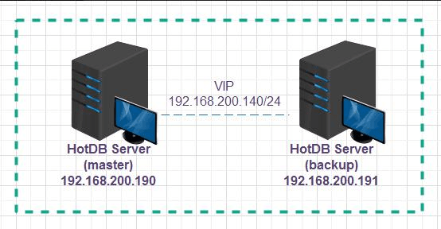
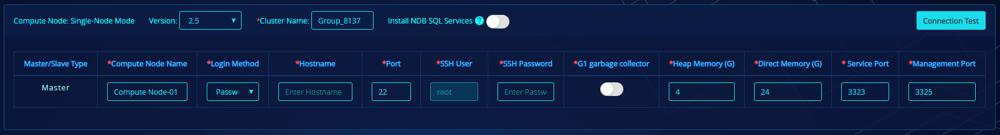
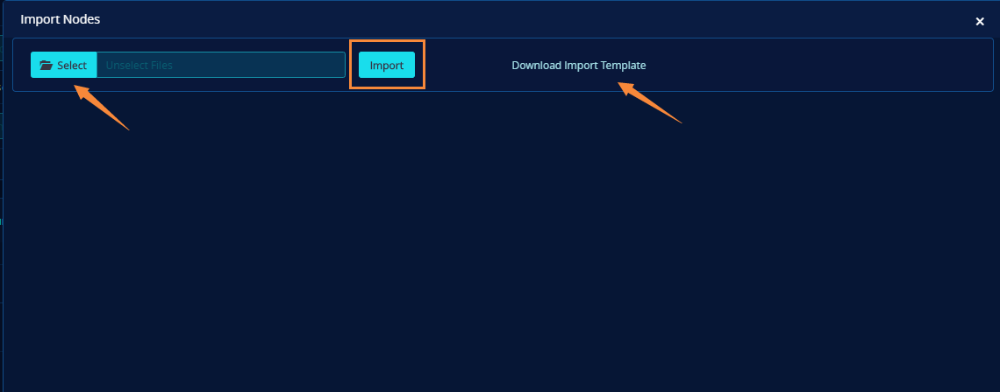
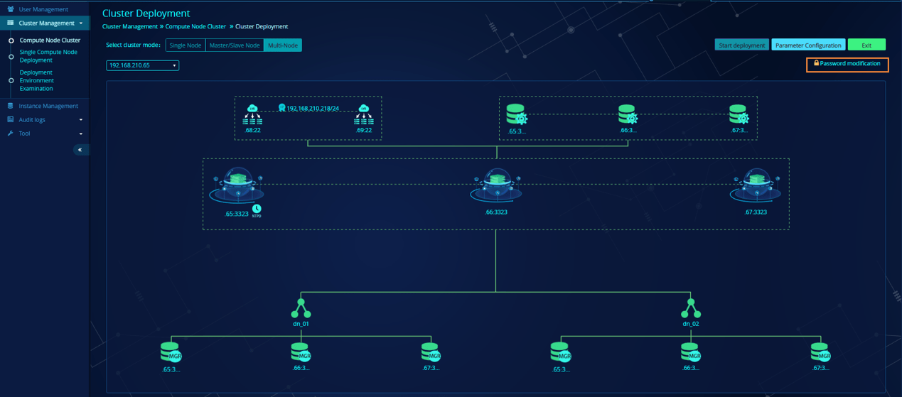
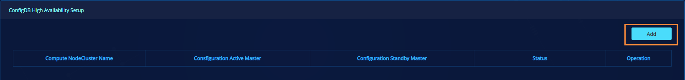

# Install and Deploy

## Deployment environment

HotDB Server cluster deployment has certain requirements for the server, operating system and depended-upon software, etc., and the cluster deployed in non-compliant environment may not be usable or may not meet the use requirements. It's suggested making detailed understanding of the [Description of Requirements](#environment-description) of HotDB Server cluster deployment for environment before deployment.

This document will describe in detail how to deploy a set of HotDB Server clusters in single-IDC mode. If you want to know what you need to pay attention to when you enable the disaster recovery mode, please refer to the "Installation and deployment" chapter of the [Distributed Transactional Database HotDB Server - Cross-IDC Disaster Recovery Function Specification](../Distributed%20Transactional%20Database.docx).

### Deployment architecture diagram


Cluster HA (master/stanby) deployment architecture diagram


Cluster load-balancing deployment architecture diagram

> NOTE
> Please refer to "Figure 1-1 Cluster HA (master/standby) deployment architecture diagram" for cluster single-node deployment architecture diagram, in addition to that there are no "HotDB Server (standby), VIP" in single node, and the rest is consistent with that of HA diagram.

### Environment description

**Server:** It's recommended using physical server for production environment, while virtual machine for testing environment. You must use physical server for performance test (if necessary).

**Operating system:** 64-digit CentOS 6.x, 7.x or RHEL 6.x, 7.x are recommended, while other operating systems are not supported at present.

**Depended-upon software:** Running of HotDB Server (Distributed Transactional Database) and HotDB Management (Distributed Transactional Database Platform) shall depend on JAVA environment. It's recommended installing JDK1.7.0_80 environment on the server where compute node or HotDB Management are deployed.

**Recommended configuration:**

Refer to [Hardware Config Recommendation](hardware-config-recommendation.md) document for hardware environment configuration.

Refer to [Cluster Environment Requirement](cluster-environment-requirement) document for cluster running environment configuration requirements and recommendation.

## Deployment

Deployment of HotDB Server cluster could be either manually installed offline, or automatically installed via "Cluster Deployment" or [Single Component Deployment](#Single%20Component%20Deployment) on the management platform.

### Manual deployment

Manual deployment method of single compute node and HA (master/standby) compute node cluster will be introduced respectively below, and for load-balancing multiple compute node cluster, automatic deployment via "[Cluster Deployment](#cluster-deployment)" is recommended.

#### Single node cluster deployment

Descriptions of teaching environment of single-node deployment and the deployment components are as follow:

**Deployment environment:**

| Item | Name |
| --- | --- |
| Server Properties | Virtual Machine |
| Operating System | CentOS Linux release 7.6.1810 (Core) |
| MySQL Version | MySQL 5.7.25 |
| JDK | JDK1.7_80 |

**Deployment components:**

| Component name | Number of installations |
| --- | --- |
| Compute Node | 1 |
| Management Platform | 1 |
| ConfigDB | 1 |
| Data Source | 4 |

> !!!NOTE
> For description of the component name, refer to [Glossary](glossary.md) document.

##### Compute node

JDK V1.7 is recommended for compute node V2.5.6 below;

JDK V1.8 is recommended for compute node V2.5.6 or above.

For the installation of JDK V1.7, 64-bit JDK1.7_80 is recommended. Acquire RPM installation package of JDK from JAVA official website, and upload to the server or contact the supplier of HotDB.

```bash
# Execute the following command, and install JDK to the directory: /usr/local/
rpm -ivh jdk-7u80-linux-x64.rpm --prefix=/usr/java/

# Configure JDK environment variables
# Open and edit the /etc/profile file:
vi /etc/profile
# Add the following information to the end of the file:**
export JAVA_HOME=/usr/java/jdk1.7.0_80
export PATH=$JAVA_HOME/bin:$PATH
# Execute source command, and make the newly-added environment variables come into effect:
source /etc/profile
```

For the installation of JDK V1.8, OpenJDK8 installation package is recommended, and its operating steps are recommended as follows:

```bash
# Upload OpenJDK8 installation package
Yo# u can upload OpenJDK8U-jdk_x64_linux_hotspot_8u252b09.tar.gz installation package using rz command or ftp file transfer tool. The installation package can be obtained by contacting HotDB.

# Unzip the installation package
# mkdir -p /usr/local/jdk8
# tar -xvf OpenJDK8U-jdk_x64_linux_hotspot_8u252b09.tar.gz -C /usr/local/jdk8
```

1. **Check glibc**

The service authorization of compute node requires the installation of the driver package of encrypted lock, which depends on 32-bit glibc. Therefore, before installing the compute node, you must check whether the server contains 32-bit glibc. If it is detected that it is not installed, you need to install it manually before proceeding.

Check the installation of glibc on the server: (it is normal to output glibc version info)

## rpm -q glibc |egrep 'glibc.*i.86.*'

2. **Install ConfigDB**

ConfigDB and Compute Node could be either installed on the same server, or installed individually. Refer to [ConfigDB Installation Instruction](#configdb) for detailed steps.

3. **Service Authorization**

To start normally and provide service, HotDB Server shall acquire formal authorization and privilege from Shanghai Hotpu Networks Technology Co.,Ltd, which could be interpreted as license is necessary. Please refer to *Distributed Transactional Database HotDB Server [Service Authorization] Function Manual* for detailed service authorization instruction.

4. **Install compute node**

To install compute node, it needs to unzip the compute node installation package, modify the compute node configuration file server.xml, and then import the configDB table structure into the installed MySQL configDB instance.

```bash
# Upload the binary package of hotdb-server-2.5.0-xxx.tar.gz to the server, create installation directory of HotDB Server, and unzip HotDB Server to the installation directory.
mkdir /usr/local/hotdb
tar -zxvf hotdb-server-2.5.0-xxx.tar.gz -C /usr/local/hotdb/

# ConfigDB table structure is under installation directory /conf of compute node, and table structure could be imported into configDB using the following commands. (Importing table structure will create configDBhotdb_config)
mysql -uroot --socket=/data/mysqldata3306/sock/mysql.sock < /usr/local/hotdb/hotdb-server/conf/hotdb_config.sql
```

5. **Add configDB account**

If compute node is to have access to configDB, access account shall be added to configDB MySQL instance. Log in to configDB to execute the following MySQL statements, and create configDB account "hotdb_config".

```sql
# Create hotdb_config account
create user 'hotdb_config'@'%' identified by 'hotdb_config';

# Grant
GRANT select,insert,update,delete,create,drop,index,alter,reload,references,create temporary tables,super,lock tables,replication slave,replication client ON *.* TO 'hotdb_config'@'%';
```

6. **Modify compute node configuration file**

The configuration file `server.xml` to be modified is under installation directory `conf` of compute node. Compute node connection to configDB and port number (the default port number could be directly used without special requirements) and other parameters shall be set.

Edit configuration file:

```bash
vi /usr/local/hotdb/hotdb-server/conf/server.xml
```

Modify parameter information:

```xml
<property name="url">jdbc:mysql://192.168.200.1:3306/hotdb_config</property><!-- configDB address -->
<property name="username">hotdb_config</property><!-- configDB username -->
<property name="password">hotdb_config</property><!-- configDB password -->
<property name="service port">3323</property><!-- service port -->
<property name="management port">3325</property><!-- management port -->
```

> !!!NOTE
> If configDB and compute node are installed on the same server, then the configDB IP address in the server.xml still requires specific IP address and can't be substituted by 127.0.0.1.

7. **Start and stop compute node**

Compute node startup script `hotdb_server` is under installation directory `bin` of compute node. It could be started or stopped merely by executing the following commands

```bash
# Start compute node service
cd /usr/local/hotdb/hotdb-server/bin
sh hotdb_server start

# Check whether compute node is successfully started or not**
jps | grep -i HotdbStartup
# 19833 HotdbStartup

# Stop compute node service
kill 19833
# or: sh hotdb_server stop
```

> !!!TIP
> - In case of abnormal start, view the compute node log `hotdb.log` under the installable directory `logs`. Execute the log view command: `tail -f /usr/local/hotdb/hotdb-server/logs/hotdb.log`.
> - If the server is unauthorized, or the installed compute node service is unauthorized, both of which could result in start failure of compute node service.

##### Management platform

JDK needs to be installed synchronously on the management platform before deployment. JDK V1.7 is recommended for V2.5.6 below; JDK V1.8 is recommended for V2.5.6 or above. The installation steps are consistent with the description in section 2.1.1.1.

1. **Unzip the management platform installation package**

Upload the binary package of `hotdb-management-2.x.x-xxx.tar.gz` to the server installation directory, and execute the following command.

```bash
cd /usr/local/hotdb
tar -zxvf hotdb-management-2.x.x-xxx.tar.gz
```

2. **Import management platform configDB table structure**

Management platform configDB and compute node configDB could share one MySQL instance, which is not recommended in production environment. Management platform configDB table structure is under its installation directory /doc, and before using the Import Configuration command, the account "hotdb_cloud" of management platform connection to configDB shall be created in configDB first.

```sql
# Create hotdb_cloud account
create user 'hotdb_cloud'@'%' identified by 'hotdb_cloud';

# Grant
GRANT select,insert,update,delete,create,drop,index,alter,references ON *.* TO 'hotdb_cloud'@'%';

# Import management platform into configDB
mysql -uroot --socket=/data/mysqldata3306/sock/mysql.sock < /usr/local/hotdb/hotdb-management/doc/hotdb_cloud_config.sql
```

3. **Modify management platform configuration file**

The modified configuration file is "application.properties" under the management platform installation directory /conf, and it mainly modifies the connection information, port number of management platform toward configDB and language setting (the default port number and language could be directly used if no special requirements).

Edit configuration file:

```bash
vi /usr/local/hotdb/hotdb-management/conf/application.properties
```

Modify parameter information:

```properties
# management platform listening port
server.port=3324
# Hotdb Backup Listening Port
server.backup.port=3322
# HotDB Management configDB address
spring.datasource.url=jdbc:mysql://192.168.200.1:3306/hotdb_cloud_config?useUnicode=true&characterEncoding=UTF-8&autoReconnect=true&connectTimeout=3000
# HotDB Management configDB username
spring.datasource.username=hotdb_cloud
# HotDB Management configDB password
spring.datasource.password=hotdb_cloud
# HotDB Management language setting, English by default, you can set it as Chinese if necessary
language=English/Chinese
```

4. **Start and stop management platform**

The management platform startup script "hotdb_management" is under its installation directory /bin. Management platform service could be started or stopped merely by executing the following commands.

```bash
# Enter startup script directory
cd /usr/local/hotdb/hotdb-management/bin

# Start management platform service
sh hotdb_management start

# View whether the service is successfully started or not (if yes, open and log in management platform via browser)
jps | grep -i hotdb-management
# 6595 hotdb-management-xxx.jar

# Stop management platform service
kill 6595 
# or: sh hotdb_management stop
```

##### ConfigDB

ConfigDB is actually a standard MySQL instance, and it is mainly used for storing relevant configuration information for compute node or management platform. At present, configDB is supported to run in three forms: single database, master/standby and MGR.

> !!!TIP
> A MySQL instance with port number 3306 will be as configDB by means of RPM in the following. Refer to official installation instruction of MySQL for installation by other means.

1. **Download MySQL rpm package**

You can download MySQL5.6.32 version from MySQL official website to the server. The following versions are recommended for centos6.x system, and please refer to official instruction to download corresponding versions for other systems

```
http://dev.mysql.com/get/Downloads/MySQL-5.6/MySQL-shared-compat-5.6.32-1.el6.x86_64.rpm
http://dev.mysql.com/get/Downloads/MySQL-5.6/MySQL-devel-5.6.32-1.el6.x86_64.rpm
http://dev.mysql.com/get/Downloads/MySQL-5.6/MySQL-client-5.6.32-1.el6.x86_64.rpm
http://dev.mysql.com/get/Downloads/MySQL-5.6/MySQL-server-5.6.32-1.el6.x86_64.rpm
http://dev.mysql.com/get/Downloads/MySQL-5.6/MySQL-shared-5.6.32-1.el6.x86_64.rpm
```

2. **Uninstall MariaDB**

If MariaDB has been installed, then MySQL could be installed only after uninstallation of MariaDB. View the MariaDB installation condition and uninstallation reference as follow:

```bash
# View whether the command is installed or not:
rpm -qa|grep mariadb
# mariadb-libs-5.5.44-2.el7.centos.x86_64

# Uninstall MariaDB command:
yum remove mariadb-libs-5.5.44-2.el7.centos.x86_64
```

3. **Install MySQL rpm package**

```
# Upload MySQL rpm package to the server and execute rpm command to install MySQL
yum -y localinstall --nogpgcheck MySQL-server-5.6.32-1.el6.x86_64.rpm MySQL-shared-compat-5.6.32-1.el6.x86_64.rpm MySQL-devel-5.6.32-1.el6.x86_64.rpm MySQL-client-5.6.32-1.el6.x86_64.rpm MySQL-shared-5.6.32-1.el6.x86_64.rpm

# Or execute
yum -y localinstall MySQL-*.rpm
```

4. **MySQL configuration file**

Copy the following contents and substitute original contents in `/etc/my.cnf` file of the server

```ini
[client]
default-character-set=utf8

[mysqld_safe]
ledir=/usr/sbin
user=mysql
open-files-limit=8192

[mysqld_multi]
mysqld = /usr/bin/mysqld_safe
user = root
log = /data/multi.log

[mysqld]
# ***********************************common parameters******************************
basedir=/usr
skip-federated
skip-blackhole
skip-name-resolve
skip_external_locking
flush=OFF
performance_schema=0
event-scheduler=ON
default-storage-engine=InnoDB
character_set_server=utf8
collation_server=utf8_general_ci
lower_case_table_names=1
explicit_defaults_for_timestamp
sql_mode='STRICT_TRANS_TABLES,NO_ENGINE_SUBSTITUTION'
user=mysql
port=3306
pid-file=/data/mysqldata3306/sock/mysql.pid
socket=/data/mysqldata3306/sock/mysql.sock
datadir=/data/mysqldata3306/mydata
tmpdir=/data/mysqldata3306/tmpdir
group_concat_max_len=1048576
back_log=1000
max_connections=8000
max_user_connections=7900
thread_cache_size=128
max_connect_errors=99999
wait_timeout=172800
interactive_timeout=172800
net_buffer_length=8K
max_allowed_packet=64M
max_heap_table_size=1G
tmp_table_size=2M
sort_buffer_size=8M
max_length_for_sort_data=16k
join_buffer_size=4M# bka
read_rnd_buffer_size=8M# mrr
table_open_cache=1024
table_open_cache_instances=16
query_cache_type=0
query_cache_size=0
# query_cache_limit=1M
# ******************************* Logs related settings ***************************
# general_log
general_log_file=/data/mysqldata3306/log/general.log
log-error=/data/mysqldata3306/log/error.log
long_query_time=1
slow_query_log
slow_query_log_file=/data/mysqldata3306/log/slow-query.log
# log_queries_not_using_indexes
log_warnings = 2
log-bin-index=/data/mysqldata3306/binlog/mysql-bin.index
log-bin=/data/mysqldata3306/binlog/mysql-bin
relay-log-index=/data/mysqldata3306/relaylog/mysql-relay-bin.index
relay-log=/data/mysqldata3306/relaylog/mysql-relay-bin
binlog_cache_size=256K
max_binlog_size=512M
binlog-format=MIXED
binlog-checksum=CRC32
sync_binlog=0
expire_logs_days=10
# ******************************* Replication related settings *********************
server-id= 3306
# skip-slave-start
log_slave_updates=1
log_bin_trust_function_creators=1
auto_increment_increment=1
auto_increment_offset=1
allow-suspicious-udfs
innodb_support_xa=1
sysdate-is-now
# ******************************* MyISAM Specific options ***************************
key_buffer_size=8M
bulk_insert_buffer_size=16M
myisam_sort_buffer_size=64M
myisam_max_sort_file_size=10G
myisam_repair_threads=1
myisam-recover-options=default
read_buffer_size=1M
# ***************************** INNODB Specific options ****************************
innodb_use_sys_malloc=1
# innodb_additional_mem_pool_size=32M
innodb_buffer_pool_size=4G
innodb_buffer_pool_instances=2
innodb_max_dirty_pages_pct=40
innodb_sort_buffer_size=16M
innodb_data_home_dir=/data/mysqldata3306/innodb_ts
innodb_data_file_path=ibdata1:1024M:autoextend
innodb_autoextend_increment=128
innodb_file_per_table
innodb_open_files=7168
innodb_file_format=Barracuda
innodb_file_format_check=1
innodb_fast_shutdown=1
innodb_force_recovery=0
innodb_flush_log_at_trx_commit=2
innodb_log_buffer_size=64M
innodb_log_file_size=1G
innodb_log_files_in_group=2
innodb_log_group_home_dir=/data/mysqldata3306/innodb_log
innodb_adaptive_flushing_lwm=30
innodb_read_io_threads=8
innodb_write_io_threads=8
innodb_io_capacity=200
innodb_flush_method=O_DIRECT
innodb_flush_neighbors=0
innodb_lru_scan_depth=1024
innodb_change_buffering=all
innodb_purge_threads
innodb_commit_concurrency=0
innodb_thread_concurrency=0
innodb_concurrency_tickets=1024
innodb_autoinc_lock_mode=1
innodb_stats_on_metadata=0
innodb_lock_wait_timeout=120
innodb_rollback_on_timeout=1

[mysqldump]
quick
max_allowed_packet=2G
default-character-set=utf8

[mysql]
no-auto-rehash
prompt="//u@//h : //d //r://m://s> "
default-character-set=utf8
show-warnings

[myisamchk]
key_buffer=512M
sort_buffer_size=512M
read_buffer=8M
write_buffer=8M

[mysqlhotcopy]
interactive-timeout
```

5. **Create MySQL directory**

According to directory parameters of my.cnf configuration file, create MySQL data directory, and set owner user of the data directory.

```sql
mkdir -p /data/mysqldata3306
mkdir -p /data/mysqldata3306/mydata
mkdir -p /data/mysqldata3306/binlog
mkdir -p /data/mysqldata3306/innodb_ts
mkdir -p /data/mysqldata3306/innodb_log
mkdir -p /data/mysqldata3306/relaylog
mkdir -p /data/mysqldata3306/tmpdir
mkdir -p /data/mysqldata3306/log
mkdir -p /data/mysqldata3306/sock
chown -R mysql:mysql /data/mysqldata3306
```

6. **Initialize database**

Execute mysql_install_db to initialize the system database to specified directory.

```bash
mysql_install_db --defaults-file=/etc/my.cnf --user=mysql --datadir=/data/mysqldata3306/mydata
```

7. **Start configDB MySQL instance**

Use startup script of mysql to start the database.

```
**Start MySQL service**

# /etc/rc.d/init.d/mysql start

**Use netsat command to detect whether MySQL is successfully started or not**

# netstat -npl |grep mysql

# The startup is successful if there is command output
# Notice: Please modify the root user password timely after installation.
```

##### Data Source

Data Source is a standard MySQL instance in nature, and it is used for storing underlying transaction data of the whole set of clusters. The number of installations and the building of replication relation depend on the actual business scenarios.

> !!!TIP
> Please refer to description of "[ConfigDB](#configdb)" for manual installation process of data source. "[Single Component Deployment](#single-component-deployment)" of "[Cluster Deployment](#cluster-deployment)" on the management platform are suggested for batch installation of data source.

**Connection user:**

For the data source manually deployed and installed, it is required to create a database user for the compute node to connect to the data source instance.

```sql
# Create a database user
create user 'hotdb_datasource'@'%' identified by 'hotdb_datasource';

# Grant user privilege
GRANT select,insert,update,delete,create,drop,index,alter,process,references,super,reload,lock tables,replication slave,replication client,trigger,show view,create view,create routine,create temporary tables,alter routine,execute,event ON *.* TO 'hotdb_datasource'@'%';

# Note: when the MySQL version of data source is greater than or equal to 8.0, one more privilege"xa_recover_admin"is added.
```

**Backup user:**

For the data source manually deployed and installed, it is required to create a database user for the data backup function.

```sql
# Create a database user
create user 'dbbackup'@'%' identified by ' dbbackup';

# Grant user privilege
GRANT select,insert,update,delete,create,drop,index,alter,reload,process,references,super,lock tables,replication slave,replication client,trigger,show view,create view,create routine,alter routine,event ON *.* TO 'dbbackup'@'127.0.0.1';
```

##### HotDB Backup

HotDB Backup is a distributed transactional database backup tool independently developed by Shanghai Hotpu Networks Technology Co.,Ltd. It is generally deployed on data source server of the cluster, and listens to the data backup request from the management platform. A data source server needs only one HotDB Backup to be deployed.

> !!!NOTE <!--Notice for use-->
> - Only data backup of MySQL 5.6 and above versions is supported.
> - The binlog must be enabled for the backed-up data source instance.
> - Server of HotDB Management must have MySQL Client installed, otherwise, the backup will be affected.

1. **Unzip HotDB Backup installation package**

Upload binary package of `hotdb_backup-2.0-xxxxxxxx.tar.gz` to the server. Create installation directory of HotDB Backup, and unzip the HotDB Backup to the installation directory.

```bash
mkdir /usr/local/hotdb/
tar -zxvf hotdb_backup-2.0-20190109.tar.gz -C /usr/local/hotdb/
```

2. **Start and stop HotDB Backup**

Start backup service program

```bash
cd /usr/local/hotdb/hotdb_backup
sh bin/hotdb_backup start -h 192.168.220.104 -p 3322
```

Add ip of the management platform server behind `-h`, and add management platform listening HotDB Backup port number behind `-p` (generally `3322`, but please view parameter `server.backup.port` in management platform configuration file `application.properties` specifically).

After successful start, the following logs will be printed

```log
INFO: Start HotDB-backup ...
INFO: HotDB-backup start successed.
```

Stop the backup service program

```bash
sh bin/hotdb_backup stop
```

Print the following log after stopping successfully

```log
INFO: Stopping HotDB-backup ...
INFO: HotDB-backup stopped success.
```

View running status of HotDB-Backup

```bash
sh bin/hotdb_backup status
```

```log
# Prompt of already running:
INFO: HotDB-backup service already running (PID: 11709).

# Prompt of not running:
INFO: HotDB-backup service not running.
```

View HotDB-Backup log

```bash
cat logs/hotdb_backup.log
```

HotDB Backup common log

```
Start backup # Start backup task
Backup is stopped # Stop backup task
Connected to server successfully! # HotDB Backup and HotDB Management are normally connected
Got a quit signal from user, will quit after backup is finished # HotDB Backup exits normally
```

#### HA (master/standby) cluster deployment

Descriptions of master/standby node cluster deployment teaching environment and the deployment components are as follow:

**Deployment environment:**

| Item | Name |
| --- | --- |
| Physical Server | Physical Server |
| Operating System | CentOS Linux release 7.6.1810 (Core) |
| MySQL Version | MySQL 5.7.25 |
| JDK | JDK1.7_80 |

**Deployment components**

| Component name | Number of installations |
| --- | --- |
| Compute Node | 2 |
| Keepalived | 2 |
| Management Platform | 1 |
| ConfigDB | 1 |
| Data Source | 4 |

> !!!NOTE
> For description of the component name, refer to the document *Distributed Transactional Database Product HotDB Server - [Explanation of Terms] Function Manual*.

> !!!INFO
> This chapter mainly introduces compute node server.xml configuration, Keepalived installation and configuration, start instruction, high availability switch, etc. under HA cluster mode. Installation steps of compute node, management platform, configDB and Data Source will not be repeated in this chapter, and please refer to "[Single Node Cluster Deployment](#single-node-cluster-deployment)" in the previous chapter for details.

**Deployment planning:**

| Instance | IP | service port | management port | HA role |
| --- | --- | --- | --- | --- |
| Master compute node | 192.168.200.190 | 3323 | 3325 | Master |
| Standby compute node | 192.168.200.191 | 3323 | 3325 | Slave |



HA compute node deployment diagram

> !!!NOTE
> The master/standby compute node servers are then installed with keepalived program respectively, and the VIP used is: 192.168.200.140

##### Compute node

1. **Install master/standby compute node**

Install compute node service respectively on 192.168.220.190 and 192.168.200.191, and refer to "[Compute Node](#compute-node)" in the previous chapter for the installation process.

2. **Modify master/standby compute node configuration file**

Corresponding configuration file `server.xml` of the deployed master/standby compute node shall be modified, and the detailed modification is as follow:

Modification of the `server.xml` configuration on master compute node 192.168.200.190

```xml
<property name="haState">master</property>< HA role, master node: master, backup node: backup>
<property name="haNodeHost"></property><HA role, other node IP:PORT>
<property name="VIP">192.168.200.140</property><virtual IP address>
```

Modification of the server.xml configuration on standby compute node192.168.200.191

```xml
<property name="haState">backup</property>< HA role, master node: master, backup node: backup>
<property name="haNodeHost">192.168.200.190:3325</property><HA role, other node IP:PORT>
<property name="VIP">192.168.200.140</property><virtual IP address>
```

> !!!INFO
> - haNodeHost in the configuration file is the master compute node's IP+management port, and such parameter only needs to be configured on standby compute node.
> - When starting master/standby server, if haState plays as the master, service port (3323) and management port (3325) will be started; if it plays as the Backup, only management port (3325) will be started.
> - At the time of master server failure, if keepalived detects that the service is not available, it will automatically switch vip to the backup server, and start the backup service port (3323), to guarantee service without interruption.

##### Keepalived

1. **Install keepalived**

keepalived could be installed either by means of yum, or by downloading installation tar package from keepalived official website <https://www.keepalived.org/download.html>.

```bash
# Install keepalived by means of yum (execute keepalived installation command on master/standby compute node service)
yum -y install keepalived

# Start or stop keepalived
service keepalived start / server keepalived stop

# View running status of keepalived
service keepalived status
```

1. **Modify keepalived configuration file**

Keepalived configuration file is stored as `keepalived.conf` under `/etc` directory by default; copy the following instance contents to substitute contents in corresponding keepalived configuration file, and make actual modification according to the position marked in red. (the corresponding /conf directory in the standard HotDB Server installation package also contains keepalived configuration file of master/slave mode, which can also be copied directly to the `/etc` directory for customized modification.)

Keepalived configuration information of master compute node: 192.168.200.190:

```
! Configuration File for keepalived
global_defs {
  router_id HotDB Server-ha
}
vrrp_script check_HotDB Server_process {
  script "/bin/bash /usr/local/hotdb/hotdb-server/bin/check_hotdb_p
  rocess.sh process"
  interval 5
  fall 2
  rise 1
  weight -10
}
vrrp_script check_HotDB Server_connect_state {
  state
  code
  script "/bin/bash /usr/local/hotdb/hotdb-server/bin/check_hotdb_p
  rocess.sh connect_master"
  interval 5
  fall 3
  rise 1
  timeout 5
  weight -10
}
vrrp_instance VI_1 {
  state BACKUP
  interface eth1
  virtual_router_id 89
  nopreempt
  priority 100
  advert_int 1
  authentication {
    auth_type PASS
    auth_pass 1111
  }
  track_script {
    check_HotDB Server_process
    check_HotDB Server_connect_state
  }
  #be careful in red hat
  track_interface {
    eth1
  }
  virtual_ipaddress {
    192.168.200.140/24 dev eth1 label eth1:1
  }
  notify_master "/bin/bash /usr/local/hotdb/hotdb-server/bin/chec
  k_hotdb_process.sh master_notify_master"
  notify_backup "/bin/bash /usr/local/hotdb/hotdb-server/bin/chec
  k_hotdb_process.sh master_notify_backup"
  notify_fault "/bin/bash /usr/local/hotdb/hotdb-server/bin/check_hotdb_process.sh master_notify_backup"
}
```

Keepalived configuration information of standby compute node: 192.168.200.191:

```
! Configuration File for keepalived
global_defs {
  router_id HotDB Server-ha
}
vrrp_script check_HotDB Server_process {
  script "/bin/bash /usr/local/hotdb/hotdb-server/bin/check_hotdb_p
  rocess.sh process"
  interval 5
  fall 2
  rise 1
  weight -10
}
vrrp_script check_HotDB Server_connect_state {
  state
  code
  script "/bin/bash /usr/local/hotdb/hotdb-server/bin/check_hotdb_p
  rocess.sh connect_backup"
  interval 5
  fall 3
  rise 1
  timeout 5
  weight -10
}
vrrp_instance VI_1 {
  state BACKUP
  interface eth0
  virtual_router_id 89
  priority 95
  advert_int 1
  authentication {
    auth_type PASS
    auth_pass 1111
  }
  track_script {
    check_HotDB Server_process
    check_HotDB Server_connect_state
  }
  #be careful in red hat
  track_interface {
    eth0
  }
  virtual_ipaddress {
    192.168.200.140/24 dev eth0 label eth0:1
  }
  notify_master "/bin/bash /usr/local/hotdb/hotdb-server/bin/chec
  k_hotdb_process.sh backup_notify_master"
  notify_backup "/bin/bash /usr/local/hotdb/hotdb-server/bin/chec
  k_hotdb_process.sh backup_notify_backup"
  notify_fault "/bin/bash /usr/local/hotdb/hotdb-server/bin/check_hotdb_process.sh backup_notify_backup"
}
```

> !!!NOTE
> Relevant configuration of master/standby keepalived could also be made referring to keepalived.conf.master and keepalived.conf.backup under compute node installation directory /conf. The red area shall be modified according to actual information, while the other areas shall be keep default setting for other configurations.

**Description of customized modification contents:**

- Script: Script path is the actual installation path of compute node, and the called master/standby script shall be configured according to the actual master/standby role
- Interface: the bound network interface card (NIC)
- Nopreempt: set whether to enable the Preempt mode or not. If this parameter is added, Preempt mode will not be enable; otherwise, Preempt mode will be enable. If the master parameter value is priority 100, while the backup parameter value is priority 95, then this parameter shall be set in master keepalived configuration script.
- Priority: the one with high-priority is the master
- virtual_ipaddress: bound vip of instance (vip shall be in the same network segment with the compute node ip)
- Label: give a virtual name to local NIC for binding virtual NIC IP, for example, bind the virtual NIC eth0:1 to the local NIC eth0
- Script: the script path judging whether the service is normal or not, is generally stored under /bin directory of HotDB Server, for example: /usr/local/hotdb/hotdb-server/bin/check_hotdb_process.sh, this script could check whether the master/standby service process of HotDB Server exists or not, and whether the 3323 port and 3325 port of the master/standby HotDB Server are in normal status or not.

3. **Start instruction**

Since the HotDB Servers on the two servers are of master/standby relation, therefore, when starting the service, attention ought to be paid to the start sequence, and the standard start sequence is as follows:

Start the master (192.168.200.190) keepalived first, and then start the master compute node service **after ping VIP successfully**

```bash
# Start master keepalived service
service keepalived start

# Then start the master compute node service after ping VIP successfully
sh /usr/local/hotdb/hotdb-server/bin/hotdb_server start
```

Command `ip a` could be used to could view whether the current master keepalived VIP has been successfully bound or not


After master compute node service starts, **wait 20s,** and then start the backup (192.168.200.191) keepalived, and after keepalived starts, **wait 10s**, and then start the standby compute node service

```bash
# Start the backup keepalived service
service keepalived start

# Start the standby compute node service
sh /usr/local/hotdb/hotdb-server/bin/hotdb_server start
```

##### Description of high availability switch

In case of failure with the compute node service on the host 192.168.200.190 server, if the detection script (vrrp_scripts) detects that the master service port of the compute node is unaccesible or hacheck fails for more than 3 consecutive times, then the master keepalived priority will be adjusted automatically to 90 (weight-10), after the keepalived on the backup 192.168.200.191 server receives vrrp package inferior to its own priority (priority on 192.168.200.191 is 95), it will switch to master state, and preempt the vip (192.168.200.140), meanwhile, after entering master state, it will execute notify_master script, have access to backup server 3325 port, execute online command, and start and initialize standby compute node service port, and if compute node of 192.168.200.191 starts successfully, it will continue to provide service after successful master/standby switching. As shown in the following figure:


Keepalived VIP has already been on 192.168.200.191 server now


##### Description of high availability rebuild

Refer to the chapter of high availability rebuild in [HotDb Management](hotdb-management.md) document for details, and via this function the following could be implemented: in case of failover with the compute node on 192.168.200.190 server, and the master/standby relation could be recovered by manually triggering the compute node high availability rebuild function, and when there is failure with the compute node on 192.168.200.191 server again, it could be switched backed to 192.168.200.190 automatically.

#### NDB SQL Service

NDB SQL service could be used to assist the compute node in completing calcualtion of relatively complex SQL query statements under distributed environment. Refer to description in *Distributed Transactional Database Product HotDB Server - [Standard] Function Manual* for detailed introduction to NDB SQL service. At present, NDB SQL Service supports installation by clickOnce deployment and installation of script and automatic deployment by "[Cluster Deployment](#cluster-deployment)" and "[Single Component Deployment](#single-component-deployment)" functions on management platform. Installation and deployment of NDB SQL service by script will be introduced as follow.

1. **Notice before manual installation**

- NDB SQL service matches to compute node service one by one, that is, if every compute node server needs NDB SQL service support, this service program shall be deployed.
- The version of the compute node corresponding to NDB SQL service must be V2.5.2 and above, otherwise, NDB SQL service is not supported.
- One-time follow deployment is recommended for NDB SQL service and compute node. If NDB SQL service needs to be added to the existing compute note, strict attention shall be paid to: parameter transfer problems of --install-ntpd, --ntpdate-server-ip, --ntpdate-server-host, which shall be consistent with the synchronization time configuration of the current deployed cluster.

2. **Description of simultaneous deployment process of compute node and NDB SQL**

Now, take master/standby cluster for example to illustrate installation of compute node and NDB SQL service by script, and the detailed steps are as follows:

- Log in each compute node server, enter clickOnce deployment resource bundle directory Install_Package to execute the installation command.

- Log in to the master compute node server, and enter clickOnce deployment default installation directory to execute:

```bash
sh hotdbinstall_v2.42.sh --install-hotdb-server=yes --hotdb-version=2.5 --install-ndbsql=yes --install-ntpd=yes --ntpdate-server-host=182.92.12.11
```

- Log in to the standby compute node server, and enter clickOnce deployment default installation directory to execute:

```bash
sh hotdbinstall_v2.42.sh --install-hotdb-server=yes --hotdb-version=2.5 --install-ndbsql=yes --ntpdate-server-host=<IP address of master compute node server>
```

3. **Description of separate deployment procedure of NDB SQL**

If compute node has been installed, but NDB SQL service needs to be installed additionally in later period, then it could be installed by separate deployment of NDB SQL via script, or by "[Single Component Deployment](#single-component-deployment-and-installation-of-ndb-sql)" function on the management platform. This example describes additional deployment of NDB SQL service in later period taking single-node cluster for instance.

Log in to compute node server, and enter rclickOnce deployment resource bundle directory Install_Package to execute installation command.

```bash
sh hotdbinstall_v2.xx.sh --install-ndbsql=yes --ntpdate-server-host=182.92.12.11
```

> !!!NOTE
> - The time synchronization parameters used for installing time synchronization address of NDB SQL specified server shall be consistent with those used for previous installation of compute node. That is, whether `ntpdate-server-ip` or `ntpdate-server-host` is used shall be consistent for both times
> - The time synchronization parameters used for installing time synchronization address shall be consistent with those used for previous installation of compute node. If there is NTP service in cluster, then the parameter value shall be IP address of NIP server.

4. **Description of NDB SQL configuration**

After installing NDB SQL service, server.xml configuration shall be modified under installation /conf directory of corresponding compute node. ndbSqlMode in configuration file shall be modified as local. The details are as follow:

```xml
<property name="ndbSqlMode">none</property><!-- NDB mode. Disable(by default): none; NDB and HotDB in same machine: local-->
<property name="ndbSqlVersion">5.7.24</property><!-- Version of NDB -->
<property name="ndbVersion">7.5.12</property><!-- Engine verion of NDB -->
<property name="ndbSqlAddr">localhost:3329</property><!-- NDB SQL node address -->
<property name="ndbSqlUser">root</property><!-- NDB SQL node user nmae -->
<property name="ndbSqlPass">root</property><!-- NDB SQL node password -->
<property name="ndbSqlDataAddr">127.0.0.1:3327</property><!-- NDB Data node address -->
```

5. **Description of NDB SQL start and stop**

NDB SQL service does not need to be separately started or stopped. It could be started simultaneously when starting compute node, and could also be stopped simultaneously when stopping compute node.

#### HotDB Listener component

HotDB Listener is a pluggable component of compute node. When enabled, it can solve the problem of performance linear expansion in the strong consistency mode of cluster. To use the Listener, the following requirements shall be met: the compute node is in multi-node cluster mode and XA is enabled, the Listener is successfully deployed on the data source server and the parameter enableListener is enabled. This chapter only describe how to manually deploy the Listener. For one-click deployment, please refer to the corresponding chapter of [automatic deployment](#automatic-deployment).

HotDB Listener is compiled by JDK1.7.0_ 80, and the requirements for the operating system and Java environment are consistent with the HotDB Server. Currently, only IPV4 is supported.

##### Unzip installation package of one click deployment

Upload the installation package of one-click deployment auto_hotdbinstall_HotDB2.5.5_v1.0_20200422.tar.gz (2.5.5 is the version number, and different versions correspond to different numbers. Remember to replace the number synchronously.) to the data source server directory /usr/local/hotdb, and execute the following command:

```bash
cd /usr/local/hotdb
tar -zxvf auto_hotdbinstall_HotDB2.5.5_v1.0_20200422.tar.gz
```

##### Installation of Listener

The installation package of one click deployment is built in Listener installation package. Install Listener in the directory /usr/local/hotdb by executing the following command:

```bash
cd /usr/local/hotdb/Install_Package
tar -zxvf hotdb-listener-0.0.1-alpha-20200420-linux.tar.gz -C /usr/loca l/hotdb/
```

##### Configuration of Listener

Before starting, adjust the heap memory size of Listener according to the available memory space of the server.

```bash
cd /usr/local/hotdb/hotdb-listener/bin
vi hotdb_listener
```

Set the heap memory size of row 24 to a reasonable range.

If the server memory is large, G1 algorithm and corresponding configuration can be used as required.

Then configure the Listener start port (this step can be omitted if there is no special requirement)

```bash
cd /usr/local/hotdb/hotdb-listener/conf
vi config.properties
```

The default value of host is 0.0.0.0, which does not need to be modified; the default value of port is 3330, which is not recommended to be modified unless it is occupied.

##### Start Listener

Start the Listener by executing the following command:

```
cd /usr/local/hotdb/hotdb-listener/bin
sh hotdb_listener start
```

If Listener is started successfully, the window will prompt "HotDB-Listener start successed."

In addition to start, other parameters can be used as follows:

```bash
sh hotdb_listener
# Usage: sh hotdb_listener [start|stop|restart]
# example:
# HotDB-Listener start : sh hotdb_listener start
# HotDB-Listener stop : sh hotdb_listener stop
# HotDB-Listener restart : sh hotdb_listener restart
```

After startup, you can switch to the logs directory to view the log output, and view the related information of Listener.

```bash
tailf listener.log
# 2020-05-25 12:09:54.089 [INFO] [INIT] [main] cn.hotpu.hotdb.ListenerServer(158) - Listener-Manager start listening on host 0.0.0.0 port 3330
```

### Automatic deployment

Automatic deployment is a function on management platform which supports automatic installation and deployment of compute node cluster in the interface. At present, V2.5.0 and later version of management platform have two automatic installation functions: [Cluster Deployment](#cluster-deployment) and [Single Component Deployment](#single-component-deployment). **Cluster Deployment** is fit for one-time deployment of the whole set of compute node cluster from 0, while **Single Component Deployment** is fit for adding individual cluster component to deployed cluster.

#### Cluster deployment

Every cluster deployment task is conducted with a set of clusters as the unit, and a deployment shall at least include: compute node, configDB and keepalived (required by master/standby node mode), other components: Data Source, LVS (multi-node mode) and NTPD could be installed as required. It supports installation of "single-node, master/standby node and multiple node" cluster modes. The installed cluster will be automatically built high availability and automatic start according to configuration.

##### Description of terms

Please refer to [Glossary](glossary.md) document for relevant terms of cluster deployment

##### Function use instruction

- Cluster deployment only supports CentOS6/7 RHEL6/7, MySQL 5.6/5.7, HotDB-Server2.4, HotDB-Server2.5;
- The hard disk exceeding 2EB may have computation error;
- It does not support multiple compute nodes or multiple management platforms or multiple HotDB Backups installed on the same server;
- It's recommended adding clean operating system environment server;
- SSH information of server must be configured by the user with root privilege;
- The added server requires available yum source and iso image file of corresponding operating system version under the installation script directory;
- Installation Deployment package name starts with `auto_hotdbinstall` by default, and please don't change the deployment package name under the server arbitrarily;
- Storage route of the uploaded deployment package is `/usr/local/hotdb` by default of the program;
- MySQL supports installation of 5.6.41, 5.7.25/8.0.16 versions by default, and if requiring other versions, please substitute relevant installation package under the installation directory independently;
- Before deploying the cluster, the management platform shall confirm that there is cluster Installation Deployment package resource under any of the following directories of the management platform server. At the time of cluster deployment, resource bundle will be looked up from the following directories to be uploaded through `/usr/local/hotdb` route of the target server. (The lookup priority is subject to the following)
  - `opt`
  - `opt/hotdb`
  - `usr/local`
  - `usr/local/hotdb`
- There may be some damage during the download process of one-click deployment installation package. Deployment at this time may lead to deployment errors. Therefore, in the management platform version of 2.5.6.1 and above, the integrity check function is added to verify the MD5 value of the uploaded installation package. That is, when uploading the deployment installation package, you need to synchronously upload the MD5 value file corresponding to the current installation package to the same directory of the server, as shown in the following figure:


##### Deploy management platform

1. **Upload deployment installation package and corresponding MD5 value file to the server, and unzip to specified directory**

```bash
mkdir /usr/local/hotdb
tar -zxvf auto_hotdbinstall_HotDB2.*.tar.gz -C /usr/local/hotdb/
```

2. **Execute the installation script to install management platform**

```bash
cd /usr/local/hotdb/Install_Package/
sh hotdbinstall_v*.sh --ntpdate-server-ip=182.92.12.11 --mysql-version=5.7 --hotdb-config-port=3316 --hotdb-version=2.5 --install-hotdb-server-management=yes
```

3. **View installation log to acquire the installation progress**

```bash
tail -f /usr/local/hotdb/Install_Package/hotdbinstall.log
```

4. **If the log prints the following mark, the installation is successful and of normal end**

```log
[INFO] hotdbinstall finished without error, but you should check if there is any warnings
```

5. **Start management platform**

```bash
sh /usr/local/hotdb/hotdb-management/bin/hotdb_management start
```

6. **Open management platform via browser**

After successful start, open the browser and goto url: `http://<server IP address>:3324/page/index.html`

After successful opening the page , log in to the account to admin user interface. (Both admin username and password are admin|admin by default)

##### Description of cluster deployment function

> !!!INFO
> **Multiple-node** cluster deployment is taken for instance this time, to illustrate complete process and corresponding descriptions during cluster deployment.

###### Add cluster deployment task

After the admin user logs in to management platform, enter "Cluster Management->Compute Node Cluster", and click [Cluster Deployment] button to enter the page of Cluster Deployment function.


###### Select cluster mode of deployment

Cluster is divided into three modes: single node, master/standby node and multiple node, and after selecting the cluster mode, click [Parameter Configuration] button to enter the page of Cluster Deployment Parameter Configuration.


**Description of cluster modes:**

- Single-node: single-node refers to the cluster mode that there is only one compute node in the whole cluster. Installation of Keepalived or LVS and other high availability components is unnecessary.

	

- Master/standby node: master/standby mode is also known as HA mode, namely the cluster mode making high availability rebuild via Keepalived component. There are master and standby compute nodes in the cluster.

	

	1. Master/standby node mode cluster requires filling in configuration information of 2 servers.
	2. Virtual_ipaddress of Keepalived (hereinafter referred to as VIP) is required to be the address not occupied by server or other applications and on the same network segment with the compute node server. The format is VIP+Subnet Mask length, for example: 192.168.200.120/24.
	3. The virtual_router_id value could be selected from [1-255] independently, but this value is required to be unique in the network segment used by the cluster, that is, it shall not conflict with the value selected for other application services.
	4. Gateway device name of master/standby Keepalived server is the NIC device name of Keepalived server, and the name must be accurately filled in, and the format is NIC name + :1 for example: "eth0:1". (gateway device name could be viewed via "ip a" command)

- Multi-node: multi-node mode is also known as load-balancing, which is an architecture mode controlling distribution of traffic to multiple compute nodes in the cluster via LVS component or other load-balancing components. There shall be no less than 3 or no more than 9 compute nodes in the multi-node mode.


	1. In multi-node mode, the number of compute nodes is 3 by default, and the version of compute node must be 2.5.
	2. The cluster network segment is the network segment of the server where the compute node is installed, and the format is: network segment+Subnet Mask length, for example: 192.168.200.0/24.
	3. Communication port is the port used by various compute nodes in the cluster for communication, and it is 3326 by default. Modification is not recommended without special requirements.
	4. LVS is a component realizing load balance in multi-node mode, and it could also close [Install] to select other load-balancing methods to substitute LVS.
	5. LVS_vip is the vitual IP address configured in LVS component (hereinafter referred to as VIP), and it's required to be the address not occupied by server or other applications and on the same network segment with compute node server. The format is VIP+Subnet Mask length, for example: 192.168.200.120/24.
	6. virtual_router_id value could be selected from [1-255] independently, but this value is required to be unique in the network segment used by the cluster, that is, it shall not conflict with the value selected for other application services.
	7. lvs_net_interface_name is the NIC name of LVS component server, and the name must be accurately filled in, and the format is NIC name + :2 for example: "eth0:2". (gateway device name could be viewed via "ip a" command).

###### Configuration of cluster deployment parameters

1) **Compute node parameters**

Parameter configuration of compute nodes will be introduced with compute node cluster mode as multi-node for instance.


1. There shall be three compute nodes by default, and there shall be no less than three or no more than seven when setting.
2. Cluster name will be generated automatically, and the format is: Group+four-digit random number, which could be modified as the case may be.
3. Whether NDB SQL service needs to be installed or not could be viewed as the case may be, if yes, it's required that the version of compute node must be greater than or equal to V2.5.2.
4. Cluster network segment is the network segment scope of the server where the compute node is, and the format is: network segment+Subnet Mask length, for example: 192.168.200.0/24
5. Communication port is the port used by various compute nodes in the cluster for communication, and it is 3326 by default. Modification is not recommended without special requirements.
6. Compute node name will be generated automatically, and the format is: compute node+serial No., which could be modified as the case may be.
7. The login mode is the connecting mode of management platform connecting to the deployment target server; login by "password" shall be used by default. And if using "Password-free" mode, it's required that there shall be password-free channel between the management platform server and the target deployment server, and the specific implementation mode shall be referred to [Description of implementing password-free login](#description-of-implementing-password-free-login).
8. When the "Login Mode" is "password", the SSH information of the target server to be connected needing to be input shall include: SSH user, SSH password. The port number is 22 by default, which shall not be modified without special requirement.
9. Heap memory is 4G by default, when the setup is bigger than 8G, it will be prompted to open "G1 garbage collector". Input range of the parameter is \[1-64] G.
10. Direct memory is 24G by default, the input range of parameters is \[1-64] G.
11. Service port and management port are "3323, 3325" by default, which could be used directly without special requirement. In case of successful modification and installation, corresponding parameters of server.xml configuration file of compute node will also be modified synchronously.
12. Whether the target server is normally connected or not could be tested or whether the SSH information input is available or not could be judged by clicking \[Test Connection].

2) **ConfigDB parameters**


1. Selectable modes of the installed configDB instance are: single database, standby master and MGR, and MGR mode is taken for instance.
2. configDB version will change due to the mode, and the version must be 5.7 if MGR mode is selected, and MySQL instance version of 5.6 or 5.7 could be selected if other modes are selected.
3. When MGR mode is selected, there shall be three editable instances under MGR mode by default, which shall be no less than three or no more than nine when editing. There is no quantitative limitation if other modes are selected.
4. Create high-privilege user switch, and the switch is open by default, that is, after successful installation of configDB MySQL instance, there will generate a "hotdb_root" account by default, and such account owns all privileges of MySQL instance.
5. The instance port number is 3306 by default, which could be modified independently as the case may be.
6. The parameters "disk device name" and "data directory" are optional, and if they are null, the program will assign a null value for "disk device name" and the default value "/data" for "data directory" automatically. As for detailed description of the parameters, please refer to " [Description of cluster deployment script parameters](#description-of-script-parameters)".
7. \[More Parameters] could set more optional parameters for the current deployed MySQL instance, and when the input box of the parameter is null, the Installation Script will make self-computation and processing and assign default value, and modification is not recommended without special requirement. If needing to make the modified parameters applicable to other deployed configDB instance, the option "Synchronize more parameters to other configDB instances" shall be checked.

3) **LVS parameters**


1. Cluster deployment does not support installation of LVS related components, and if Not Install is selected, the LVS configuration parameters do not need to be filled in
2. The IP filled in for "LVS_vip" is required to be the one not occupied by server or other application and on the same network segment with the compute node server. The format is VIP+Subnet Mask length, for example: 192.168.200.120/24
3. "virtual_router_id value could be selected from \[1-255] independently, but this value is required to be unique in the network segment used by the cluster, that is, it shall not conflict with the value selected for other application services.
4. Master/standby "lvs_net_interface_name" is the gateway device name of the LVS server, and such name must be consistent with the one displayed on the real server (it could be viewed via ip a command), and the format is: gateway device name + ":2", for example: "eth0:2".

4) **Data source parameters**





1. Data Source shall select the version "5.6, 5.7", which is 5.7 by default.
2. Number of nodes is the number of data nodes in the cluster, which cannot exceed 128 when setting.
3. Node type is the replication relation type of the associated data sources under Data Node, which includes: single database, master/slave, standby master and MGR.
4. Data Source configuration information could be generated according to the optional parameter selected by clicking \[Generate] button.
5. As for "Create High-Privilege User", please refer to description about this in configDB.
6. "Node Name" is the Data Node Name, which is automatically generated according to "Number of Nodes", and could be modified by the user independently.
7. "Data Source Type" is generated according to the "Node Type" selected by default. for example: if the "Node Type" is "Master/Slave", then there will generate a "Active Master" and "Standby Slave" type data source records respectively under each Data Node.
8. The "Install Listener" switch is ON by default, that is, install the HotDB Listener component on the server where the data source is located. The Listener can be installed to solve the performance linear expansion problem of the compute node cluster mode. If the user does not use Listener temporarily, it can be OFF manually.
9. "Listener port" is the start port of Listener. The default value is 3330, which can be modified manually. To deploy a Listener on a data source server, you need to configure an unoccupied port as the Listener port. Only one Listener can be deployed through cluster deployment on a data source server, that is, the same host name can only be configured with the same Listener port. If "Install Listener" is turned off, the "Listener port" will be grayed and cannot be edited.
10. "Listener service port" refers to the port where the compute node connects to the data source through the Listener. The default value is 4001. If a Listener needs to listen to multiple data sources, it needs to fill in different service ports for them. If "Install Listener" is turned off, the "Listener service port" will be grayed and cannot be edited.
11. "Install HotDB Backup" switch is open by default, that is, install HotDB Backup on the server where the Data Source is.
12. "Associated Management Platform IP" shall be filled in the address of the current management platform executing the cluster deployment task. This address is the management platform address which needs to be specified when starting HotDB Backup and also the service target of HotDB Backup.
13. A line of data source configuration records could be added or deleted by clicking "Add" or "Delete" in operation.
14. If there are too many Data Sources, "Import" mode may be considered for making configuration. Before import, download the template first, and then fill in the configuration information as instructed on the template, and then import into the management platform upon completion. In case of fill-in error, the program will display import failure and detailed failure information.

5) **Time synchronization parameter setting**


1. Time synchronization is mainly used for designating NTP time service address for all servers of the cluster, so as to ensure time consistency of the servers in the cluster.
2. NTP service program is installed on the server of the master compute node or the multiple nodes by default. If there has been available NTP service in the cluster already, the installation could be cancelled.
3. The other server time synchronization addresses in the cluster refer to the compute node server address installed with NTP server by default. If the compute node has no NTP server installed, then the time synchronization address of the other servers shall be consistent with that of the compute node server.

> !!!TIP
> In the actual scenario, in addition to the clock synchronization configuration of software, you also need to pay attention to whether the hardware clock is synchronized. You can use hwlock to check (generally, there is a greater possibility of difference in the virtual machine environment).

###### Parameter checking and saving


1. Save Only: Click [Save Only] button, the program will not verify legality and integrity of the configuration parameter input, and it only checks whether the required items have been computed or not.

2. Check and Save: click [Check and Save] button, the program will check the legality and integrity of the configuration parameters, and send the installation deployment package and the corresponding MD5 value file to the target server to verify whether it meets requirement for cluster deployment, and if not, there will be pop-up prompt. **All clusters could be installed only after passing the [Check and Save] before deployment starts**.

Note: if the installation package is damaged or changed in the process of downloading or sending, it will be detected that the current MD5 value of the installation package is inconsistent with the original MD5 value during **[Check and Save]**, and the pop-up window will prompt "The integrity check of the one-click deployment package failed. Please check manually", as shown in the figure below:


3. If the cluster configuration parameter fails the test, modification shall be made correspondingly according to the error condition, and then checking shall be made again.

4. If test fails due to that the server hardware configuration does not meet requirement, it's recommended saving the configuration parameters via [Save Only] button first, and then adjusting hardware configuration of the target server or replacing the target server as prompted, and then make checking again.


5. The saved but uninstalled cluster has monitoring not enabled when displayed on "Cluster Management" page, and the information of various cluster deployment information columns has the word "Configured" when displayed.


6. The saved but uninstalled cluster is displayed as the above figure after entering via "Deployment Topology" button. The dashed icons refer to the configured but uninstalled components.

###### Start deployment


1. Click [Start Deployment] to enter the Installation Process.

- For the cluster which fails the checking, when clicking [Start Deployment], it will be prompted that deployment is not allowed.

- For the cluster which passes the checking, if the installation package on any server in the cluster is damaged during [Start Deployment], that is, it is detected that the current MD5 value of the installation package is inconsistent with the original MD5 value, the pop-up window will also prompt:


2. View the current deployment status via the deployment progress bar.

3. Deployment log will be made real-time output to the console, and the master console could view deployment condition of all servers. Specifically speaking, every server console could view script execution log information on deployment of corresponding server separately.

4. Full-screen view is available by clicking the Zoom In button on the top right corner.

5. After completing the installation, the word "Cluster deployment succeeded" could be displayed on the master console.

###### Deployment completed


1. For the successfully deployed cluster, monitoring will be opened automatically on "Cluster Management" page, and running state information of the components will be displayed in the "Cluster Deployment Information" columns.

2. Click [Deployment Topology] button to enter the deployment topology page, it could be seen that all icons on the topology have become full line ones.

###### Instance password modification

For the deployed cluster, both the installed configDB and the Data Source instances could generate some accounts automatically. The details are as follow: configDB instance generates hotdb_config, dbbackup, repl, hotdb_root (depends on whether opening the switch of Creating high-privilege account or not); Data Source instance generates hotdb_datasource, dbbackup, repl and hotdb_root (depends on whether opening the Creating high-privilege account or not).

Since the password and account No. of the generated account are consistent, therefore, it's recommended **modifying the instance password immediately after completing the deployment,** in order to improve safety of the cluster.




1. Modification of instance password is divided into two parts: modification of configDB instance password, and modification of Data Source instance password.

2. You can modify user passwords one by one by clicking the [Password Modification] button in the Action Bar or in batches by clicking [clickOnce Modification of Password] button.

3. Modification of user passwords in batches is divided and displayed by user roles, for example, if modifying the password of repl account in configDB instance, then the repl account passwords in all instances of configDB will be modified synchronously. So does the Data Source.

4. For instances with replication relation, modification of one user password will cause modification of passwords of all instances with replication relation. For example, for Data Source instances with MGR relation (192.168.210.81:3311, 192.168.210.82:3311, 192.168.210.83:3311), if modifying the hotdb_root user password on 192.168.210.81:3311 instance to admin, the program will modify the hotdb_root user passwords of the other two instances to admin.

5. After submitting password modification, the instance password modification page will make page loading, and please don't refresh the page or conduct other operations at this time.

#### Single Component Deployment

Single Component Deployment function could continue to add new components to the existing cluster for the user. In addition, it could also deploy a set of new clusters from zero, because it could also provide High Availability Rebuild, clickOnce Start and other functions in addition to installation function, but relative to "[Cluster Deployment](#cluster-deployment)" function, [Single Component Deployment](#Single%20Component%20Deployment) is more suitable for deploying single component.

##### Description of terms

Please refer to *Distributed Transactional Database HotDB Server [Explanation of Terms] Function Manual* for relevant terms of Single Component Deployment

##### Function use instruction

Single Component Deployment Function use instruction is consistent with "[Cluster Deployment Function Use Instruction](#function-use-instruction)", description of which could be referred to.

##### Deploy management platform

Single Component Deployment is a function in management platform, and before use, management platform shall be installed first. Please refer to "[Instruction of Deployment of Cluster Deployment Function Management Platform](#deploy-management-platform)" for instruction on installation steps.

##### Single Component Deployment

**Description:** Deployment of a master/standby mode cluster will be illustrated via [Single Component Deployment](#Single%20Component%20Deployment) this time. Keepalived virtual address (VIP) uses "192.168.200.112"; master/standby compute node server is installed on "192.168.200.45 and 192.168.200.46" servers respectively. Meanwhile, 4 Data Source MySQL instances are installed respectively on servers "192.168.200.47 and 192.168.200.48".

###### Add deployment task

After logging in to the management platform via admin user, select "Compute Node Cluster ->Single Component Deployment" and click [Add Deployment Task]


###### Deploy compute node and configDB


1. When the server role is selected "Compute Node", the "software installation information and configuration information" will check "Compute node service, Keepalived, configDB MySQL Instance and NTPD Server" automatically by default. This role is selected for guiding installation only, and has no influence on actual installation, and the user could also select other components according to actual conditions.

2. The target deployment server could be logged in via "Password and Password-free" modes, if Password-free mode is used, password-free channel between the servers shall be manually established in advance, referring to "[Description of implementing password-free login](#description-of-implementing-password-free-login)" for details. If "Password" mode is used, SSH connection username and password shall be input.

3. By clicking [Test Connection], whether the management platform server and the target deployment server could be of normal connection could be tested.

4. When logging in by password mode, in order to gaurantee SSH information safety, the management platform will save it for 24 h only, after that, in case of needing reconnection to the target server, click [Edit] for re-saving.


1. Available versions for compute node are "2.4 and 2.5"；2.4 represents the compute node installed with 2.4.X version, and the specific version No. shall be subjected to that provided in the installation package. The user could select according to actual condition.

2. Master/standby selection of compute node shall be made according to actual condition of the current planning. In the master/standby mode, there needs to be a master compute node service and a standby compute node service.

3. The service port and management port are "3323, 3325" by default, and the default value could be used directly without special requirements.

4. If compute node and configDB are installed on the same server, the configDB related information could use the default value directly, but the configDB address IP shall be filled in actual value; if the compute node and configDB are on different servers, then the configDB information shall be modified according to actual condition.

5. The heap memory and direct memory are "4G and 24G" by default, and the user could also adjust according to actual condition, but the input scope shall not exceed [1-64] G. When the heap memory exceeds 8G, it's recommended opening the G1 Garbage Collector.


1. For master/standby mode cluster, Keepalived component must be installed on compute node server, otherwise, compute node cannot build high availability.

2. Keepalived's virtual_ip address (hereinafter referred to as VIP) is required to be the one not occupied by intranet server or other applications and on the same network segment with the compute node server. The format is VIP+Subnet Mask length, for example: 192.168.200.120/24. In this place, we shall fill in the VIP address "192.168.200.112/24" planned previously.

3. virtual_router_id value could be selected from [1-255] independently, but this value is required to be unique in the network segment used by the cluster, that is, it shall not conflict with the value selected for other application services.

4. keepalived_net_interface_name is the NIC name of the Keepalived server; the name must be accurately filled in, and the format is NIC name +:1, for example: "eth0:1". (gateway device name could be viewed via "ip a" command).


1. configDB MySQL instance and the compute node could be installed either on the same server or on separate servers. They are installed on the same server by default.

2. The version is the version No. of configDB MySQL instance, which could be "5.6 or 5.7".

3. "MySQL instance port" shall be paid attention to in MySQL installation parameters, which is 3306 by default, and if the default value is occupied, the port shall be modified.

4. Other parameters could use the default value directly without special requirement, and for the null input box, the program will make automatic computation according to the server condition and provide default value.

5. If configDB and Data Source are installed on the same server, then configDB parameter configuration could modify "MySQL instance port" parameter only, while other more parameters could be set in Data Source only. (Reason: a server could set one MySQL parameter only)


1. When master compute node service is installed in server, "NTPD server" will check Install automatically; if there has been NTP time server already, the Install checked shall be cancelled.

2. Every target deployment server requires specified time synchronization address.

- If NTPD server is installed on the server, then the server time synchronization address is recommended filling in Alibaba Cloud time synchronization address "182.92.12.11"

- If NTPD server is not installed on the server, then the server time synchronization address shall be specified as the address of the intranet server installed with NTPD server

3. Click [Save the Information] will save the configuration information for later installation, while clicking [Start Installation] will enter the installation progress directly.


1. At the time of initial installation, the one-click installation deployment package and the corresponding MD5 value file of the management platform server shall be uploaded to the target deployment server, therefore, [Upload] must be clicked. Please refer to the last item of "[Function use instruction on cluster deployment](#function-use-instruction)" for description of storing resource bundle in management platform server.

- If the installation package is damaged in the process of uploading, it will be detected that the current MD5 value of the installation package is inconsistent with its corresponding MD5 value during [Confirm to Upload], and the pop-up window will prompt:


2. If to manually upload the one-click installation package and the corresponding MD5 value file to the target server /usr/local/hotdb manually or has uploaded the package resources already, click [Start installation directly] to skip the action of uploading installation package. However, the integrity of the package should be guaranteed when the package is uploaded manually.


1. After entering the installation progress, there will be real-time output of installation log and installation result on the bottom of the page. The installation log "hotdbinstall.log" is under "/usr/local/hotdb/ Install_Package" directory of the target server.

2. In case of error information during the installation process, it will be marked in red, while the warning information will be marked in orange. Error information means failure of the installation task this time, and re-installation shall be made after making modification according to the prompt information.

3. Successful installation could be judged according to whether there is: "hotdbinstall finished without error, but you should check if there is any warnings" on the installation log, and could also be judged according to the installation result on the right.


1. The installation task in progress could be placed in the background, and then continue to add new installation tasks, and after completing the installation tasks, the installation status of the components could be viewed by refreshing the page.

2. The saved or installed tasks could be "cloned", clicking [Clone] could copy all configuration parameters of the task to a new deployment task, which could reduce repeated configurations appropriately.


1. Installation of standby compute node could be conducted via the installation task of master compute node before clone, and then "Hostname", "Compute Node Role" and other parameters shall be modified. Other parameters shall be modified according to actual condition.

2. Attention: when installing standby compute node, "NTPD Server" does not need to be checked. You only need to fill in the "server time synchronization address" as master compute node server IP address or refer to the IP address of the installed intranet NTPD server.

###### Deploy data source instance


1. Select the "Server Role" as Data Source server, and fill in SSH information of target installation server of Data Source.

2. According to the role, the installation component will check "Data Source MySQL instance, Data Source HotDB Listener, Data Source HotDB Backup" automatically.

3. The default port of the data source Listener is 3330, which can be adjusted by yourself. If you do not want to install a Listener, please uncheck it manually. Unchecking "Install listener" will be taken as an example in the following content.

4. According to deployment requirement, four Data Source MySQL instances shall be installed in 192.168.200.48, therefore, the "number of instances" shall select four.

5. Server time synchronization address shall be filled in the master compute node server IP (192.168.200.45).


1. Click [Start Installation] and upload the installation package and the corresponding MD5 value file to target delpoyment server of Data Source.

2. Real-time installation progress could be viewed via log.

3. Clone the deployment task of Data Source to "192.168.200.48" via the [Clone] button, and modify the SSH information, then installation could be started.

##### High availability build of Single Component Deployment

High availability rebuild could provide high availability automatic build service for installed components in Single Component Deployment function, including Compute Node High Availability, Data Source High Availability and configDB High Availability Build.

###### Compute node high availability build


1. Click [High Availability Build] button to enter the high availability build page, and then in the "Compute Node High Availability Build" module, by clicking [Add], the configuration window of adding compute node high availability will be popped up.


1. In the pop-up window, selecting "High Availability" means building HA high availability relation for compute nodes, and selecting "Single Instance" means that the compute node is single node.

2. Cluster name is the name of the cluster where master/standby compute node is, which could be customized but shall not be repeated with the existing cluster name.

3. Master is master compute node, if the previous master compute node is successfully installed but is not built, then the drop-down box will show it.

4. Backup is standby compute node, if "single instance" is selected on the top, then Backup does not need to be selected.

5. Master Name and Backup Name are remark name of compute node, which could be customized but shall not be repeated with the existing compute node name.

6. Clicking [Save] means starting to build high availability relation for master/standby compute node.


###### Data Source high availability build


1. Click [Batch Add] button in "node high availability build" module, if the compute node high availability is not constructed or free of build history record, then clicking [Batch Build] will prompt "Please build a compute node cluster first" (because Data Source High Availability Build needs to select the belonging compute node cluster).

2. Adding Data Source High Availability Configuration needs to select the "Compute Node Cluster" first, and the newly cosntructed compute node cluster could be selected.

3. Node name is the Data Node Name (dataNode) to which Data Source belongs, which could be customized but shall not be repeated with the existing Data Node Name.

4. Replication mode refers to the existence mode of the Data Source under the same Data Node, at present three replication modes are supported: "single database, master/slave and master-master".

5. When adding multiple node high availability records, new configuration record could be added by clicking "+".

6. After completing the Node High Availability Configuration, clicking [Start Construct] will automatically build high availability replication relation for Data Source.


1. Success record will be displayed with Data Node as the unit upon completion of build, and for the failure record, rebuild after modifying the parameters by clicking [Edit] button.

###### ConfigDB high availability build




1. Select the installed configDB instance, and select its belonging cluster, and click [Build] button to start the build.

2. Upon completion of build, the program will modify the configDB address with sandby master relation to server.xml file.


##### Single Component Deployment startup program

Startup program mainly provides clickOnce start service for the cluster with component installed or high availability built. At present, the services available for start are: "Compute Node, Keepalived, HotDB Backup, and Management Platform". "Data Source MySQL instance, configDB MySQL instance, and NTPD server" will start directly after completeing the program installation, without restart.


1. The startup program page could be entered via either [Startup Program] button on the page of Single Component Deployment, or by clicking [Startup Program] directly on the lower right corner after completing high availability build.


1. Startup Program page will display records of all servers successfully installed on the Deployment Task page, and make merge display of the servers built with master/standby according to history records of high availability build.

2. The components needing start could be selected by checking, while un-checking means not start.

3. The first group of records are the clusters with Compute Node High Availability Build record, and when starting, if turning on the "Automatically Generate Basis Configuration" switch, the clickOnce Startup Program will write the Compute Node Cluster, Data Node, Data Source and record information generated by defualt into configDB of the management platform, and the user could view directly after logging in to the management platform without re-adding the configuration.

4. The second and the third groups are clusters without Compute Node High Availability Build records, and there will be no configuration information generated when starting (because there is no compute node cluster to which the configuration belongs, therefore, information cannot be generated, and **the user shall manually add to management platform after start**).


1. If Data Source [HotDB Backup](#HotDB%20Backup) is contained in the Start item, then there will be pop-up window of "Start Parameter Setting", asking the user to specify the management platform IP address at the time of HotDB Backup Start.

2. "HotDB Backup IP" is the IP address of the server of the HotDB Backup to be started, "management platform IP address" is the associated management platform IP address at the time of HotDB Backup start (the management platform IP address currently used could be selected).


1. Click [clickOnce Start], program will start and configuration will generate.

##### Single Component Deployment and installation of NDB SQL

If compute node has been installed, but NDB SQL server needs to be added in later period, it could be conducted via Single Component Deployment function. Relevant operating steps and notices are stated as follow:

**Notice for use:**

- Use Single Component Deployment function to seaprately install NDB SQL for compute node, which shall meet the requirement that the compute node in the cluster is deployed manually offline instead of using Cluster Deployment or Single Component Deployment function.

- If the Compute Node is deployed by means of Cluster Deployment or Single Component Deployment, the NDB SQL function needing to be added in later period shall be conducted by means of [Offline Manual Installation](#ndb-sql-service) only.

- NDB SQL must be installed on the same server with compute node, and the version of compute node shall be no lower than V 2.5.2.

**Operating steps:**


- Fill in the server address and SSH connection information of the compute node.

- Check NDB SQL server, and pay attention to the prompt in red.

- Fill in the value consistent with the specified time synchronization address at the time of Compute Node Installation

#### Description of implementing password-free login

Password-free login requires password-free channel established between two servers, and the detailed operation is as follow:

Take password-free connection between 192.168.190.186 and 192.168.190.187 for instance

1) Execute ssh-keygen on the server of 192.168.190.186, press Enter button for 3 consecutive times, generate public key and private key, among which id_rsa is private key and id_rsa_pub is public key, and the private key and public key files newly generated upon command could be viewed under /root/.ssh directory.


2) Input IP of ssh-copy-id target server, and then input password of the target server, thus the public key could be sent to the target server


3) View the public key file "authorized_key" sent from 192.168.190.186 server on 192.168.190.187 server

> 

4) Test whether successful login could be made directly from 192.168.190.186 server ssh to 192.168.190.187 server without inputting password.


#### Description of deployment script

Without using management platform, you could also install directly using Installation Script by means of adding --xxx=xxx to behind hotdbinstall.sh script

##### Description of script parameters

| Parameter name | Description of parameter |
| --- | --- |
| dry-run | Check only with no Modification. You can choose "yes" or "no", among which "no" is the default option. |
| hotdb-version | Specify major version No. of HotDB. You can choose "2.3", "2.4" and "zabbix", among which "2.4" is the default option. |
| install-hotdb-server | Install HotDB-server or not. You can choose "yes" or "no", among which "no" is the default option. |
| install-ndbsql | Install NDB SQL or not. You can choose "yes" or "no", among which "no" is the default option. |
| install-hotdb-listener | Install HotDB-listener or not. You can choose "yes" or "no"，among which "no" is the default option. |
| --listener-heap-mem-size-gb | If specified, it will help modify the heap memory in HotDB Listener startup script from 4G to specified value, with no Modification by default |
| --listener-max-direct-mem-size-gb | If specified, it will help modify the direct memory in HotDB Listener startup script from 24G to specified value, with no Modification by default |
| hotdb-use-g1 | If specified, it will help modify the hotdb startup script to using G1 Garbage Collector, with no Modification by default |
| hotdb-heap-mem-size-gb | If specified, it will help modify the heap memory in hotdb startup script from 4G to specified value, with no Modification by default |
| hotdb-max-direct-mem-size-gb | If specified, it will help modify the direct memory in hotdb startup script from 24G to specified value, with no Modification by default |
| install-hotdb-server-management | Install HotDB-server-management or not. You can choose "yes" or "no", among which "no" is the default option. |
| install-hotdb-backup | Install HotDB-backup or not. You can choose "yes" or "no", among which "no" is the default option. |
| mysql-version | Specify major version No. of MySQL. You can choose "5.6" and "5.7", among which "5.6" is the default option. |
| mysql-port-list | Specify list of the MySQL data source ports to be installed, separate by comma, in ascending order, for example: "3306,3307,3308,3309", null by default |
| hotdb-config-port | Specify list of configDB ports to be installed, which cannot conflict with the MySQL data source ports, null by default |
| hotdb-config-init | Initialize hotdb_configDB in the specified instance of hotdb-config-port or not. You can choose "yes" or "no", among which yes is for installing HotDB-server, and no is for not installing HotDB-server by default. |
| mysql-data-diskname | Specify the name of the disk device used for MySQL data directory, if the device is neither mounted nor formatted, it will be automatically formatted and mounted to the data directory, null by default |
| mysql-data-rootdir | Specify the root directory of MySQL data directory to be used, "/data" by default, and it must be absolute path |
| rename-datadir-before-initdb | Specify whether to rename the potential old data directory or not before initializing the database, "yes" by default |
| server-id-perfix | Specify the prefix for server-id, which is required to be the number smaller than 429496, and automatically computed by default, but absolutely no conflict is not guaranteed |
| character-set-server | Specify the Character Set. You can choose "latin1", "gbk", "utf8", and "utf8mb4", among which "utf8mb4" is the default option. |
| collation-server | Specify the Proofreading Set. "latin1_swedish_ci" "latin1_bin" "gbk_chinese_ci" "gbk_bin" "utf8_general_ci","utf8_bin" "utf8mb4_general_ci" "utf8mb4_bin" are optional, and the default value is the default proofreading set of the character set configured |
| innodb-buffer-pool-size-mb | The innodb-buffer-pool-size with MB as the unit is computed automatically by default |
| innodb-log-file-size-mb | The innodb-log-file-size with MB as the unit, is computed automatically by default |
| innodb-data-file-size-mb | The ibdata file with MB as the unit is "4096" by default |
| innodb-io-capacity | Specify the size of innodb-io-capacity, which is computed automatically by default |
| innodb-flush-log-at-trx-commit | Specify innodb-flush-log-at-trx-commit setting, "2" by default |
| sync-binlog | Specify sync-binlog setting, "10" by default |
| binlog-format | Specify binlog-format setting, "MIXED" and "ROW" are optional, "MIXED" by default |
| gtid-mode | Enable gtid or not, "on" and "off" are optional, "on" by default |
| rpl-semi-sync-enabled | Start semi-synchronous replication or not, "on" and "off" are optional, "on" by default |
| mgr-group-name-list | MySQL port number:MGR group's UUID:list of MGR local port number, separate by comma, and if this parameter is provided, MGR will open for corresponding port, for example "3306:540c2b46-5d73-11e8-ad9b-00a0c9000000:33060,3308:5f5c1e2d-5d73-11e8-ad9b-00a0c9000000:33080", null by default. (Notice: the MySQL instance to be created still needs to be specified in mysql-port-list and hotdb-config-port) |
| mgr-group-local-ip | Local IP address bound by MGR local port, which is automatically computed by default |
| mgr-group-seeds-list | MySQL port number:MGR group member's IP:port comma-separated list, separate by slash, and if this parameter is provided, this value will be added to corresponding port of my.cnf file, null by default, for example "3306:192.168.200.101:33060,192.168.200.102:33060,192.168.200.103:33060/3308:192.168.200.101:33080,192.168.200.102:33080,192.168.200.103:33080" |
| creat-hotdbroot-in-mysql | Create hotdb_root user in MySQL or not, the user owns all privileges, and could connect from optional position, password as hotdb_root by default, "yes" and "no" are optional, "no" by default |
| install-keepalived | Install keepalived or not, "master", "backup" and "no" are optional, "no" by default |
| keepalived-vip-with-perfix | If specified, it will help substitute the vip in keepalive configuration from 192.168.200.140/24 to the value, no Modification by default |
| keepalived-virtual-router-id | If specified, it will help substitute the virtual-router-id in keepalive configuration from 151 to the value, no Modification by default |
| keepalived-net-interface-name | If specified, it will help substitute the vip device name in keepalive configuration from eth0:1 to the value, no Modification by default |
| install-lvs | Install lvs server or not, "master", "backup" and "no" are optional, "no" by default |
| lvs-vip-with-perfix | If specified, it will help substitute the vip in lvs configuration from 192.168.56.203/24 to the value, no Modification by default |
| lvs-port | If specified, it will help substitute the Listening Port in lvs configuration from 3306 to the value, no Modify by default, and the port shall be the same with the data service port of HotDB cluster |
| lvs-virtual-router-id | If specified, it will help substitute the virtual-router-id in lvs configuration from 51 to the value, no Modification by default |
| lvs-net-interface-name | If specified, it will help substitute the vip device name in lvs configuration from eth1:2 to the value, no Modification by default |
| lvs-real-server-list | Lvs back-end HotDB server IP:data service port:management port list, separate by comma, for example "192.168.0.1:3323:3325,192.168.0.2:4323:4325", null by default |
| lvs-real-server-user | Username used by the management port of lvs physical checkup script connection back-end HotDB server, "root" by default |
| lvs-real-server-password | Password used by the management port of lvs physical checkup script connection back-end HotDB server, "root" by default |
| lvs-real-server-startup-type | When as realserver of lvs, configuration mode of relevant adjustments of the server, "no", "config" and "service" are optional, "no" by default |
| install-ntpd | Install ntpd or not, "yes" and "no" are optional, if HotDB is installed, then yes by default, otherwise no by default. Notice: there shall be only one ntpd in a HotDB cluster; HotDB standby shall synchronize time with the HotDB host. If there is ntp source in the intranet, then ntpd may not be installed. |
| ntpdate-server-ip | Configure ip address of time synchronization, either parameter or ntpdate-server-host must be specified, and only one of them shall be specified. If ntpd is installed, the time source beyond the HotDB cluster must be specified; if ntpd is not installed, server address of the internal ntpd service of HotDB cluster shall be specified (if the host HotDB is installed ntpd server), or intranet ntpd server address, then outer-net address shall not be selected. |
| ntpdate-server-host | Configure host address of time synchronization, which is allowed to be domain name or ip, script will make no processing or checkup of the parameter, and it needs to rely on the caller to guarantee accuracy, either the parameter or ntpdate-server-ip must be specified and only one of them shall be specified. If ntpd is installed, the time source beyond the HotDB cluster must be specified; if ntpd is not installed, server address of the internal ntpd service of HotDB cluster shall be specified (if the host HotDB is installed ntpd server), or intranet ntpd server address, then outer-net address shall not be selected. |

##### Instruction on use of parameters

Combined use of parameters: parameter name = value + blank+ parameter name=value, for example:

--hotdb-heap-mem-size-gb=1 --hotdb-max-direct-mem-size-gb=1 --ntpdate-server-ip=192

.168.200.140 --rpl-semi-sync-enabled=on --mysql-version=5.7 --hotdb-config-port=3316 --install-ntpd=yes --install-hotdb-server=yes --hotdb-version=2.5 --install-hotdb-backup=yes --mysql-port-list=3307,3308 --install-hotdb-server-management=yes

Install data source Listener using script:

--hotdb-heap-mem-size-gb=1 --hotdb-max-direct-mem-size-gb=1 --ntpdate-server-ip=192

.168.200.140 --rpl-semi-sync-enabled=on --mysql-version=5.7 --hotdb-config-port=3316 --install-ntpd=yes --install-hotdb-server=yes --install-hotdb-listener=yes --hotdb-version=2.5 --install-hotdb-backup=yes --mysql-port-list=3307,3308 --install-hotdb-server-management=yes

Method used for running script:

sh -x script name .sh+ space + parameter string

sh -x hotdbinstall_v*.sh --hotdb-heap-mem-size-gb=1 --hotdb-max-direct-mem-size-gb=1

--ntpdate-server-ip=192.168.200.140 --rpl-semi-sync-enabled=on --mysql-version=5.6 --hotdb-config-port=3316 --install-ntpd=yes --install-hotdb-server=yes --hotdb-version=2.4 --install-hotdb-backup=yes --mysql-port-list=3307,3308 --install-hotdb-server-management=yes

##### Other descriptions of script

1. Since the clickOnce Deployment and Installation Script at present requires tunescript, and NIC related hardware parameters will be modified in tunescript, which may result in temporary loss of NIC response or interior restart of NIC. It's known that under the environment of Bond configured, short-time network interruption may be caused due to that the operating system response or interchanger response is not quick enough, thus resulting in SSH terminal disconnection or HotDB interruption, part of which could be relieved through shortening the Bond configuration parameter miimon=100.

2. Before installation, it's recommended closing the built-in firewall and selinux functions of the server (selinux restart is effective).