# Standard

## Basic information

This Manual is compiled based on *Distributed Transactional Database Product HotDB Server - V2.5.6*, and it mainly introduces basic use method and operating procedures of compute node, for reference and learning by the users.

Some functions in this manual could be used in combination with distributed transactional database management platform (hereinafter referred to as management platform), and if to know use method of management platform, please refer to *Distributed Transactional Database HotDB Server [Management Platform] Function Manual*.

HotDB Server V.2.5.3.1 and above provide a solution based on MySQL native replication function to solve the problem of HotDB Server cross-IDC disaster recovery, which can realize the cross-IDC data synchronization function and solve the problem of cross-IDC distributed transactional database service disaster recovery. This document only describes the functions and features of HotDB Server in general mode in detail. To understand the functions and features in disaster recovery mode, please refer to the *[Distributed Transactional Database HotDB Server - Cross-IDC Disaster Recovery Function Specification](file:////Users/anita/Desktop/2.5.4/Distributed%20Transactional%20Database%20HotDB%20Server%20-%20V2.5.3.1%20%5bManagement%20Platform%5d%20Function%20Manual.doc).*

Special attention may not be paid to difference in version details of some screenshots, and the version number described in the document shall prevail. Since there are many contents in the document, it's recommended opening document map for the convenience of reading.

### Profile of HotDB Server

HotDB Server is a distributed transactional database product which realizes horizontal expansion of data capacity and performance, and it could solve "two-large and three-high" (namely large-scale user, large-scale data, high availability, high concurrency and high throughput) problems in real-time transaction service system.

HotDB Server could provide centralized database operating experience for application under the environment of data storage distribution, and meanwhile, it could provide a complete set of solutions on data safety, data disaster tolerance, data recovery, online capacity expansion without service stopped, cluster monitoring, intelligent topology, intelligent large screen, etc.

HotDB Server supports to split a table horizontally into multiple portions, and store them in different databases to realize sharding of the data, besides, it also supports vertical sharding and Global table. HotDB Server provides several table data sharding functions, and the user could use different data sharding functions according to transaction needs.

Basing R&D on Java NIO and MySQL protocol, HotDB Server supports multiplex of database connection, and is equipped with better concurrency performance.

HotDB Server provides automatic switching function of database service, and could effectively solve single-point failure of database.

The management platform in compatible use of compute node (also known as HotDB Management) is an important constituent part of the product.

#### Component architecture of HotDB Server

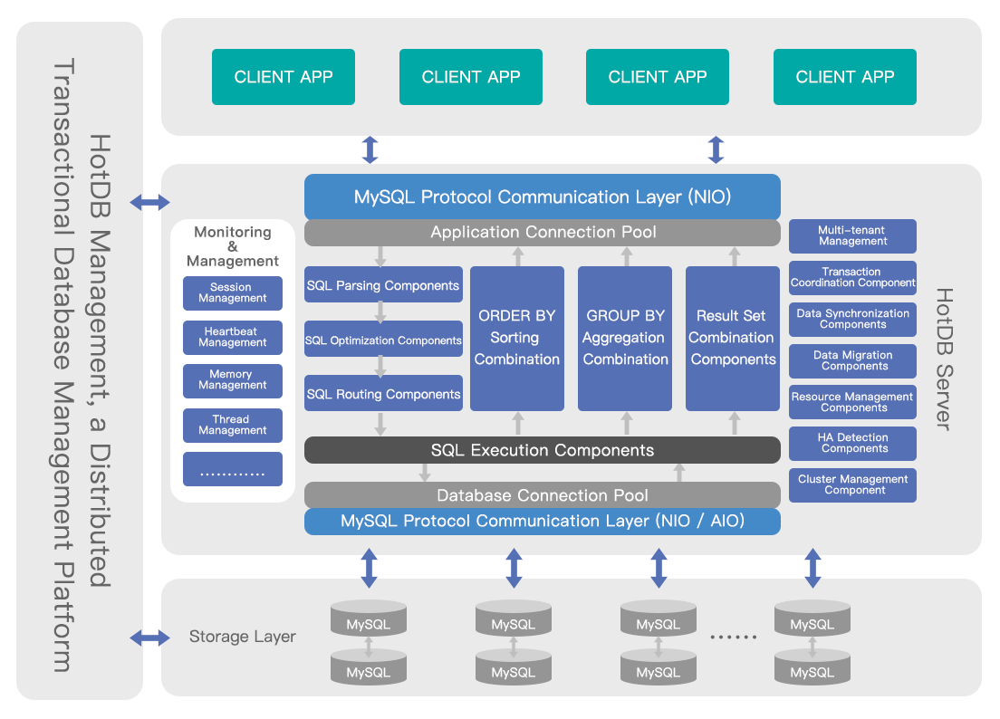Figure 1.1.1-1 Functional component architecture diagram of HotDB Server

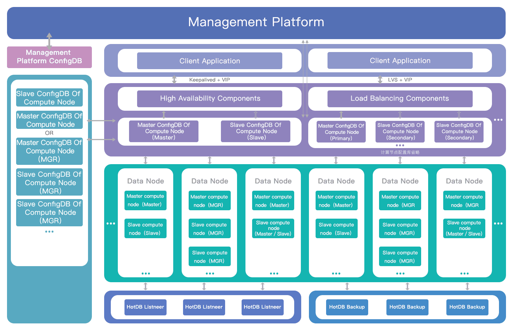

Figure 1.1.1-2 Component architecture diagram of HotDB Server

The distributed transactional database cluster (HotDB Server) is a database management system composed of a group of compute nodes, data sources, management platform and configDBs.

The distributed transactional database cluster (HotDB Server) is a database management system composed of a group of compute nodes, data sources, management platform and configDBs.

**[Compute node](#compute-node):** Compute node is the core of distributed transactional database HotDB Server cluster system. It provides the core control functions of distributed transactional database, such as SQL parsing, routing distribution and result set merging, and is the lifeblood of the whole distributed service.

**Data source:** This is the MySQL database which makes actual storage of data, and IP+ port + physical database could determine a data source. To realize the function of high availability and data multi-copy, a group of data sources with the same data copy are called one **data node** in HotDB.

**Data nodes:** A data node is a group of data sources with the same data copy. A data node can be a MySQL MGR cluster or a MySQL master-slave replication cluster. The data node manages the replication relations of a set of data sources with the same data copies. As sharding data in HotDB, all data nodes together constitute the total data of HotDB.

**[Management platform](#management-platform):** Distributed transactional database management platform (hereinafter referred to as management platform) is also known as HotDB Management. It could realize usability configuration of compute node database user, data node, table type, sharding function and other information, and meanwhile, it could also provide monitoring of compute node service status, reminder of abnormal events, view of statements, management of tasks and other intelligent operation and maintenance related services.

**ConfigDB:** It is responsible for storing relevant configuration information of compute node and management platform. The configDB can perform high availability configuration through master-slave or MGR.

**High availability:** Compute node of HotDB Server could realize master/slave compute node availability checking and high availability switch by means of Keepalived high availability solution.

**Load balancing:** The compute node cluster mode of HotDB Server can achieve high availability and load balancing through LVS/F5. The application accesses the distributed transactional database service of HotDB Server through VIP of LVS. The distributed transactional database service is transparent to the application program, and the failure of single or multiple nodes in the compute node cluster has no effect on the application program.

**HotDB Backup:** Distributed transactional database backup program independently developed by Hotpu, is responsible for backup of transaction data.

**HotDB Listener:** A pluggable component developed by HotDB technology, which needs to be deployed separately and run in an independent process, so as to solve the problem of linear performance expansion under the strong consistency (XA) mode of cluster.

#### Explanation of technical terms

If to know relevant terms and relation of HotDB Server cluster system, please refer to *Distributed Transactional Database HotDB Server [Explanation of Terms] Function Manual*.

#### Compute node

Compute node is data service provider, and its default service port is 3323, and could be logged in using the following MySQL command:

# mysql -uroot -proot -h127.0.0.1 -P3323

After login, compute node could be used the same as MySQL database, for example:

root> mysql -uroot -proot -h127.0.0.1 -P3323

mysql: [Warning] Using a password on the command line interface can be insecure.

Welcome to the MySQL monitor. Commands end with ; or \\g.

Your MySQL connection id is 515

Server version: 5.1.27-HotDB-2.5.0 HotDB Server by Hotpu Tech

Copyright (c) 2000, 2016, Oracle and/or its affiliates. All rights reserved.

Oracle is a registered trademark of Oracle Corporation and/or its

affiliates. Other names may be trademarks of their respective

owners.

Type 'help;' or '\\h' for help. Type '\\c' to clear the current input statement.

mysql> show databases;

+-----------------+

| DATABASE |

+-----------------+

| CLASSIC_LOGICDB |

| HotDB |

+-----------------+

2 rows in set (0.01 sec)

mysql> use CLASSIC_LOGICDB

Database changed

mysql> show tables;

+---------------------------+

| Tables_in_CLASSIC_LOGICDB |

+---------------------------+

| customer |

+---------------------------+

1 row in set (0.03 sec)

The application program connection of compute node is consistent with connection of MySQL, and only host, port, database, user and password information of the database Config File in the application program need to be modified. MySQL database drive and connection pool under different development platforms are supported, such as JDBC, c3p0, DHCP, DRUID connection pool of JAVA development platform. The following is configuration instance of c3p0 connection pool:

<!--database mapping-->

<!-- com.mchange.v2.c3p0.ComboPooledDataSource, org.apache.commons.dbcp.BasicDataSource -->

<bean id="dataSource1" class="com.mchange.v2.c3p0.ComboPooledDataSource"

destroy-method="close">

<property name="driverClass" value="com.mysql.jdbc.Driver" />

<property name="driverClass" value="com.mysql.jdbc.Driver" />

<property name="jdbcUrl" value="jdbc:mysql://192.168.137.101:**3323**.cloth?characterEncoding=UTF-8" /> Where, port 3323 should be changed to the service port of the compute node.

<!--database mapping-->

<property name="user" value="root" />

<property name="password" value="$root" />

<property name="initialPoolSize" value="10" />

<property name="maxPoolSize" value="$256" />

<property name="minPoolSize" value="10" />

<property name="maxIdleTime" value="1800" />

<property name="maxStatements" value="1000" />

Meanwhile, compute node provides management port as 3325 by default, and the current service could be monitored and managed using command in management port. To know more information, please refer to [management port Information Monitoring](#management-port-information-monitoring).

#### Management platform

Management platform provides the compute node with configuration of user information, node information, table configuration and sharding, etc. Its default port is 3324, and by entering HTTP link address in the browser, access could be made to the management platform. Please use Chrome or FireFox browser.

For example: http://*192.168.200.191:3324*/login, the accesss page is shown as follow:

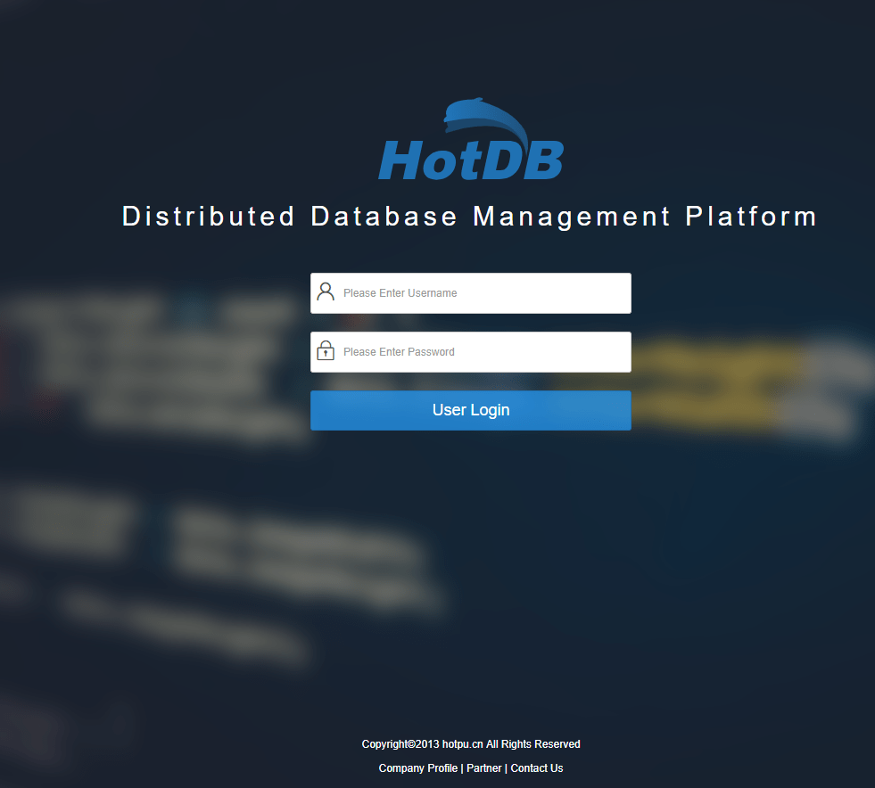

Both manager username and password are: admin by default, while other user accounts are created by the manager user, with the initial password being: <service_hotdb@hotdb.com>.

If to know detailed use method of the management platform, please refer to *Distributed Transactional Database HotDB Server [Management Platform] Function Manual*.

### New functions and new features of Version 2.5.6

This chapter will briefly introduce the summary of functions which are added, prohibited or deleted in HotDB Server -- V2.5.6. For detailed function usage, click the hyperlink to view the details:

-   Support [the online expansion/reduction of compute node services](#compute-node-auto-scaling), that is, the number of online compute node instances;

-   Multi-node mode is supported for the cross-IDC disaster recovery function. For more details, please refer to the "[Distributed Transactional Database HotDB Server - V2.5.5 Cross-IDC Disaster Recovery Function Specification](file:////Users/anita/Desktop/英文文档/管理平台文档/2.5.5/英文2.5.5/Distributed%20Transactional%20Database%20HotDB%20Server%20-%20V2.5.5%20%5bManagement%20Platform%5d%20Function%20Manual.doc)".

-   Support direct parsing and identifying some [Oracle functions and Sequence syntax](#enableoraclefunction) to reduce the amount of code modification when Oracle migrates to HotDB Server;

-   Support direct parsing and identifying of some Oracle functions and Sequence syntax to reduce the amount of code modification when Oracle migrates to HotDB Server;

-   Support SSL + [SM4](#sslusesm4) for client connection;

-   Optimized function of creating [global tables](#_Global_Table) according to the default sharding node;

-   Add parameter [operateMode](#operatemode) to meet one-click configuration of parameter combination under different scenarios, such as performance maximization, debugging mode, etc;

-   Support [modification of sharding key](#online-modification-of-sharding-key) directly through SQL statements (alter table... change shard column...);

-   Optimized [deadlock check](#deadlock-check) logic: control whether to roll back the transaction and start new transactions when deadlock occurs according to MySQL version number;

-   Optimized log record of disconnection in [XA mode](#use-xa-transaction). You can analyze whether the transaction needs to be redone through the log;

-   Optimized logic of role exchange after the failure of [data sources](#high-availability-of-data-node)/[ConfigDBs](#configdb-high-availability) or manual switching, and logic of reloading without changing the service of the original master;

-   Optimized logic of the failure of data sources/ConfigDBs or manual switching. Compatible with the setting of [master_delay](#waitforslaveinfailover). Prevent the failure of switching due to the setting of master_delay;

-   Optimization of [creating table directly via existing Sharding Function](#create-table-directly-via-existing-sharding-function). The sharding attributes can be written after the table definition.

-   Support the use of SQL statements to [CREATE / DROP user and to GRANT / REVOKE user](#user-management-statement);

-   Support the use of SQL statements to [CREATE LogicDB](#create-statement);

-   Support the use of SQL statements to CREATE / DROP / ALTER VIEW.

### New compute node parameters of Version 2.5.6

This section will introduce the new compute node parameters added and optimized in Compute Node -- V2.5.6, as listed below:

| Parameter name of compute node | Description of compute node parameters | Default value | Reload is valid or not | Version supported |
| --- | --- | --- | --- | --- |
| [enableOracleFunction](#enableoraclefunction) | Whether to parse Oracle functions first | false | N | 2.5.6 |
| [lockWaitTimeout](#lockwaittimeout) | Timeout for obtaining metadata lock (s) | 31536000 | Y | Synchronized downward to 2.5.3 |
| [operateMode](#operatemode) | Compute node working mode | 0 | Y | Newly added in 2.5.6 |
| [maxReconnectConfigDBTimes](\l) | Maximum number of retries to connect to the ConfigDB | 3 | Y | 2.5.6 |
| [sslUseSM4](\l) | Whether to support SM4 | No | Y | Synchronized downward to 2.5.5 |
| [haMode](#hamode) | Added status: 4: master center in cluster mode | 5: DR center in cluster mode | 0 | N | 2.5.6 |
| [crossDbXa](#crossdbxa) | Whether XA transactions are adopted in cross-LogicDB | false | N | 2.5.5 |

## Installation deployment and upgrading of HotDB Server

### Service licensing

To make compute node of HotDB Server able to provide service normally, regular authorization license is required.

If to know how to obtain service licensing, please refer to *Distributed Transactional Database HotDB Server [Service Licensing] Function Manual*.

### Installation deployment and upgrading

To deploy HotDB Server, JDK (JAVA operating environment), MySQL Database, USB KEY Driver Packet, Compute Node and Management Platform need to be installed. And a MySQL instance shall be configured as configDB of compute node. To deploy server operating system of compute node, 64-digit CentOS 6.x is recommended. If to know how to install, deploy and upgrade HotDB Server, or to know hardware configuration recommendation of HotDB Server, please refer to *Distributed Transactional Database HotDB Server [Install Deploy] Function Manual*.

### Config File

Config File of compute node is located under conf directory after installation of compute node, and the file name is server.xml. If to view conditions of all parameters supported by compute node, please refer to [Instruction on use of compute node parameters](#_计算节点参数使用说明_2).

After modification of some server.xml parameters, they will take effect only after reenabling compute node, and some parameters could take effect via "[Reload](#reload)".

If the parameters listed in [Instruction on use of compute node parameters](#_计算节点参数使用说明_2) do not exist in server.xml, that means the default value is used by the parameter; if you want to adjust a parameter value or add a parameter, please add the following code in server.xml, or add via "Configuration"->"Compute Node Parameters" page of the management platform.

<property name=" dropTableRetentionTime">0</property><!---retention time of dropped table, o by default, not retained-->

## Rapid configuration of HotDB Server

This section will introduce rapid configuration of HotDB Server. This section only introduces some necessary functions of Configuration to guarantee QuickStart, and to know more configuration functions, please refer to *Distributed Transactional Database HotDB Server [management platform] Function Manual*.

In the following example, a distributed transactional database cluster with three groups of data shardings (two data sources in each group) is configured. In this distributed transactional database cluster, a logicDB named "test" and a database table named "customer" is defined. This table is a sharding table; the sharding type is automatic sharding, and the sharding field is "provinceid".

Before configuring HotDB Server, please ensure that the management platform and compute node have been normally enabled, and 6 MySQL database instances have been well prepared (In this case, configuration of master-master data node will be taken for instance, and if only single-node data node is needed, 3 instances shall be prepared).

To know more about installation and deployment of HotDB Server and management platform, please refer to *Distributed Transactional Database HotDB Server [Install Deploy] Function Manual*.

### Log in to management platform

Enter HTTP link address of management platform in browser, and log in to the management platform; HTTP link address is generally the server IP of the deployed management platform, the port is 3324 by default, for example, http://192.168.200.89:3324/login.html.

The management platform provides two kinds of user roles: super manager user and general user, super manager user has both the initial username and password as: admin by default; while the general user is created by the super manager user, with the default password being: hotdb@hotpu.cn.

After the super manager user logs in, there are mainly "Compute Node Cluster Management" and "User Management" functions, the manager user could create and edit compute node cluster, and configure compute node connection information, add management platform user and add privilege for user, etc.

### Add compute node cluster

Compute node cluster is a group of compute node services with high availability relation, add compute node cluster is to add the well deployed compute node to the management platform for management, and if to deploy a set of compute node cluster, please refer to *Distributed Transactional Database HotDB Server [Install Deploy] Function Manual*.

Click "Cluster Deployment and Configuration"->"Add Compute Node Cluster" on compute node cluster management page, enter compute node's server IP service port, management port, username and password of management port connection, thus single compute node could be created, and after selecting master/slave node or multiple node, a group of high availability compute nodes could be added.

After entry, click Test, and if connection succeeded, this compute node cluster could be assigned to the management platform user for configuration management.

### Add management platform user

Management platform user is the user who Manage, Configure, Monitor and Detect compute node cluster, and it has two privileges, one is access privilege (only some of the pages could be viewed), and the other is control privilege (including edit operation). When creating management platform user, the manager user assigns compute node cluster to management platform user, and assigns the control privilege at the same time, and after successful creation, the management platform user could log in to the page of Manage, Configure and Monitor Compute Node Cluster.

Log in to management platform, and on the Management Platform User page, click "Add New User", enter username, and assign control privilege of compute node cluster. After completing the Add operation, the user could manage the compute node after login.

### Create MySQL database and data source user

Create physical database and data source user respectively on 6 MySQL database instances (Data Source), log in to MySQL, and execute the following statements:

CREATE DATABASE db01 CHARACTER SET 'utf8' COLLATE 'utf8_general_ci';

GRANT SELECT,INSERT,UPDATE,DELETE,CREATE,DROP,INDEX,ALTER,PROCESS,REFERENCES,SUPER,LOCK TABLES,REPLICATION SLAVE,REPLICATION CLIENT,TRIGGER,SHOW VIEW,CREATE VIEW,CREATE ROUTINE,ALTER ROUTINE,EXECUTE,EVENT,RELOAD ON *.* TO 'hotdb_datasource'@'%' IDENTIFIED BY 'hotdb_datasource';

Note:

If MySQL version of the Data Source is 8.0 and above, authorization statements need to be added with XA_RECOVER_ADMIN privilege.

hotdb_ Datasource account is the only account for HotDB to connect to each MySQL instance, through which all added platform users can connect to MySQL instances. Operations of users of each platform are only on front-end business connection and user access control.

Generally, the database created by create database in MySQL is called "LogicDB", while it is called "database" or "certain sharding database" in distributed transactional database system for it is where the data is actually saved.

For the convenience of configuration, the databases and users created on six MySQL database instances need to be consistent.

### Add LogicDB

Usually, the database created by create database in MySQL is called "LogicDB". A "LogicDB" can provide database services for an application or a microservice. In order to maintain consistency, the distributed transactional database system also provides database services for an application or a microservice through the "LogicDB", but the distributed transactional database system is composed of multiple MySQL instances (in this case, 6 sets), so the "LogicDB" in HotDB Server is the "global LogicDB", that is, the set of "LogicDB" in 6 MySQL instances, which is still called LogicDB in HotDB Server.

LogicDB is a virtual database in compute node, after logging in to compute node by MySQL command, display the LogicDB list via the following statements:

show databases;

Log in to management platform page, select "Configuration"->"LogicDB"->[Add LogicDB](#Add%20LogicDB). Click "**√**", save the configuration, and the LogicDB is successfully added.

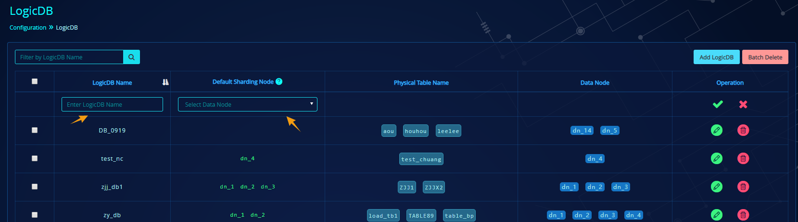

### Grant user LogicDB privilege

Only the user granted with LogicDB privilege could use the LogicDB.

Log in to the management platform page, select "Configuration"->"Database User Management", select Root User, and click "Edit" button. Jump to "Edit user privilege" page, and tick the created LogicDB"test" from the drop-down box, click "Save", and the privilege is successfully granted.

Note:

After the management platform is installed, the system creates a platform user named root (password is root) by default.

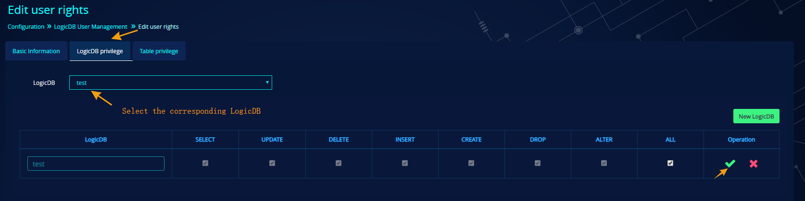

### Add data source group

Add Data Source Group could make it more convenient to Add or Modify a group of data sources with the same parameter value.

Log in to Distributed Transactional Database Management Platform page, select "Configuration"->"Node Management"->"Data Source Group"->"Add Group":

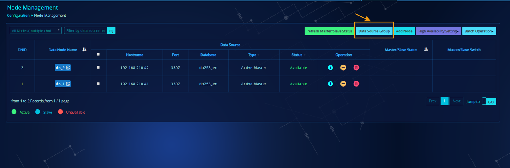

The parameters include:

-   Group Name: enter data source group name;

-   Connection User: The Username of user having access privilege to the physical database (the [Username](#create-mysql-database-and-data-source-user) added in previous section);

-   Connection User Password: the user password having access privilege to the physical database;

-   Physical Database Name: citable database name in the data source, for example "db01" (the [LogicDB](#add-logicdb) added in previous section);

-   Backup User: (optional) the username used for backup of the physical database;

-   Backup User Password: (optional) the user password used for backup of the physical database;

-   Character Set: Character Set of the connected physical database, utf8mb4 by default;

-   Max Connections: [[Max Connections]{.ul}](#management-of-back-end-connection-pool) of MySQL physical database, 4200 by default;

-   Initial Connections: [Initial Connections](#management-of-back-end-connection-pool) of MySQL physical database, 32 by default;

-   Max Idle Connections: [[Max Idle Connections]{.ul}](#management-of-back-end-connection-pool) of MySQL physical database, 512 by default;

-   Min Idle Connections: [[Min Idle Connections]{.ul}](#management-of-back-end-connection-pool) of MySQL physical database, 32 by default;

-   Idle Examination Period (second): Idle Examination Period of MySQL physical database, 600 by default. When the connection fails to send request to the server for a long time, the connection will be disconnected as timed, in order to avoid wasting the database connection.

According to business scenarios, select those with the same parameter value as a data source group, for example in this case, the parameter values ticked and entered in the figure below will constitute a data source group.

When Add Node, the data source group is applied on several data sources, which will Autofill the preset parameter value of the group; when Edit a parameter of the group, the parameter of all data sources in the group will be Edited in batches.

### Add data node and data source

In this case, six MySQL instances are divided into three groups (three shardings) with two MySQL instances in each group (one active and one standby). The above description corresponds to the distributed transactional database system: the total data consists of three data nodes, each of which has two data sources. We need to do the following operations on the platform: add three data nodes and add two data sources for the three data nodes.

Log in to management platform page, select "Configuration"->"Node Management"->"Add Node":

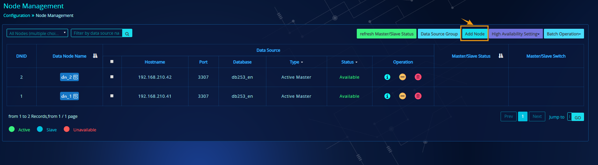

Either Add Data Node and its corresponding Data Source in batches or Add Data Source to existing Data Node is available, and only Add of Data Node and Data Source in batches is introduced here, and the operation is displayed as follow:

1. Fill in parameters of Data Node added: In this case, the Number of Data Nodes is 3, and the Data Node Type is Master-Master (other types could also be selected). In this case, Data Source Group selects not to use group, and you could also select to use the [Data Source Group](#add-data-source-group) added in previous section from the drop-down menu, and then Add in batches or Edit similar parameters. Without special requirements, the Node Prefix, Number of Encoding Bits and Start Encoding could use the default value. After filling in the parameters, click [Generate].

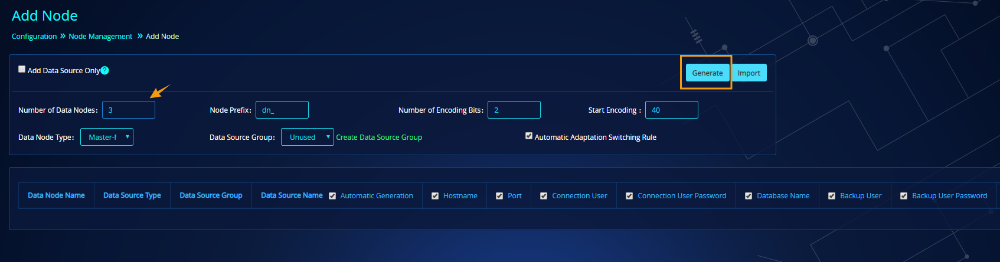

2. Fill in Data Source Configuration Parameters according to the prompt message.

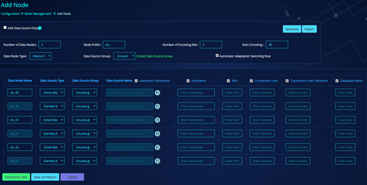

Parameters include:

-   Data Node: Generate according to the previous parameter filled in by default, Edit is available

-   Data Source Type: Generate according to the previous parameter filled in by default, Edit is available

-   Data Source Group: Generate according to the previous parameter filled in by default, Edit is available

-   Data Source Name: Auto Check and Generate by default, but you could also enter Data Source Name in the textbox after un-checking, for example "ds_01";

-   Hostname: enter host Ip of MySQL database.

-   Port Number: enter MySQL database port.

-   Connection User: The Username with access privilege to the physical database ([Username](#create-mysql-database-and-data-source-user) added in previous section);

-   Connection User Password: The User Password with access privilege to the physical database;

-   Physical Database Name: Database Name citable in Data Source, for example "db01" ([LogicDB](#add-logicdb) added in previous section);

-   Backup User: (optional) Username used for backup of the physical database;

-   Backup User Password: (optional) User Password used for backup of the physical database;

-   Listenter hostname(optional): The Listener is installed to solve the performance linear expansion problem of the compute node cluster mode. The Listenter hostname is the host name of the server where the data source is located by default;

-   Monitoring port(optional): The port which is used to set the start of monitoring;

-   Listener service port (optional): Listener service port is the port where a compute node connects to a data source through a Listener. If a Listener needs to listen to multiple data sources, it needs to fill in different service ports for them;

-   Auto Master/Slave Build: after selection, Compute Node will Auto Build Replication Relation for the data source added according to the configuration information.

-   Master Data Source: This parameter shall be filled in only when it needs to set up replication relation like master-master with slave(s) or multiple levels of slaves. The master data source name needing to be built replication relation in the current data source could be copied and pasted here. By default, the system will make auto judgement according to the configuration.

Click [...] to unfold more parameters, including:

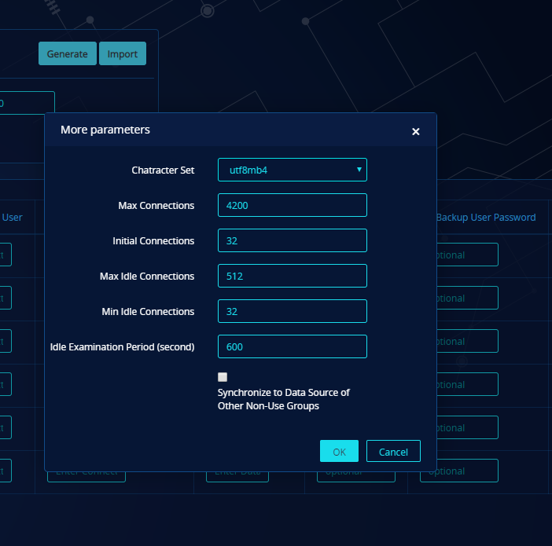

3. After completing the parameters, click [Connection Test] to verify that the entry is accurate and after all data sources are successfully connected, click [Save and Return], thus 3 data nodes and their respective corresponding 6 data sources have been successfully added.

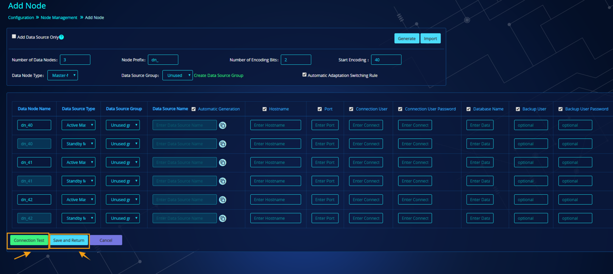

### Add sharding function

The purpose of Add Sharding Function is to provide route method and algorithm of manual setting for table sharding, and if hoping to create table configuration by Auto Sharding, this step could be skipped.

Log in to Management Platform page, select "Configuration"->"Sharding Function"->"Add Sharding Function".

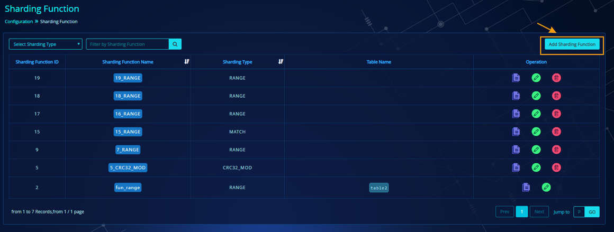

According to business scenarios, enter configuration parameters, including:

-   Sharding Function Name: Generate by default, Edit is available after un-checking

-   Sharding Type: includes ROUTE, RANGE, MATCH, SIMPLE_MOD, CRC32_MOD. Take RANGE for instance, to know more sharding functions, you could view more detailed function description document, and please refer to *Distributed Transactional Database HotDB Server [Management Platform] Function Manual*.

-   Setting Mode: includes Auto Setting and Manual Setting, and Auto Setting is taken for instance here. If selecting Auto Setting, the management platform will compute the Value Range automatically according to the configuration parameters, and partition the data nodes automatically; if selecting Manual Setting, the data nodes could be entered into corresponding Value Range manually.

-   Data Node: select Sharding Data Node

-   Value Range: enter full Value Range of sharding key, and the management platform will compute the Step Length automatically in combination of the Number of Nodes selected

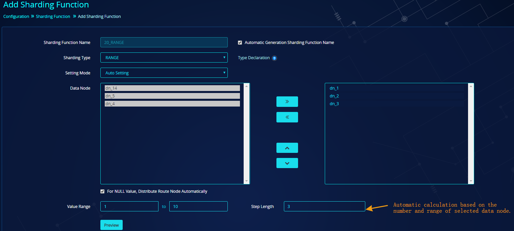

Click [Preview] to view the generated results, and click [Modify] to modify the Value Range or Data Node, in order to solve data skew problem.

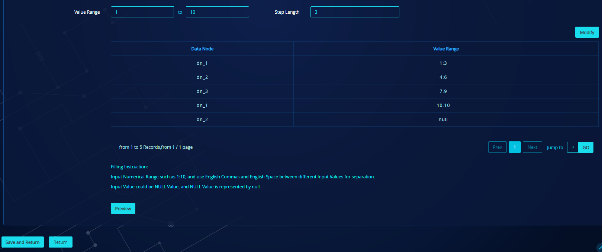

Click [Save and Return] to add sharding function.

### Add table configuration

Log in to Management Platform page, select "Configuration"->"Table Configuration"->"Add Table Configuration"

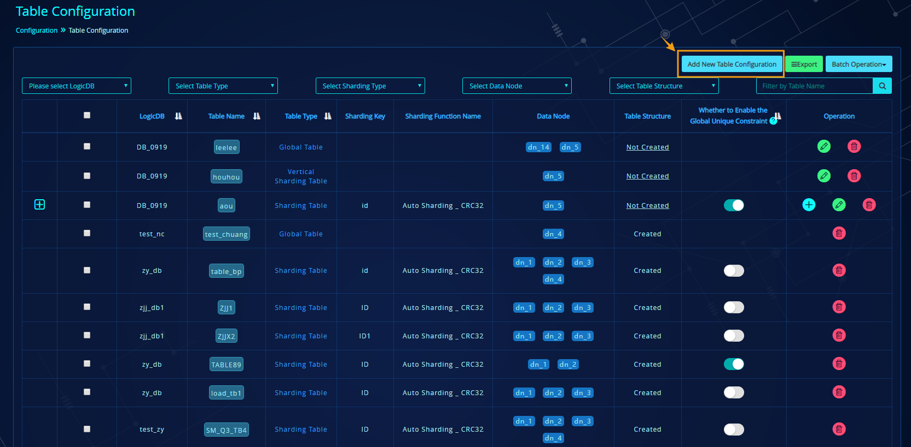

According to business scenarios, after selecting the Table Type, enter the configuration parameters. In this case, under the Sharding Table page, add the parameter configuration as follow:

-   LogicDB: From the drop-down menu, select the [LogicDB](#add-logicdb) test added in previous section.

-   Default Sharding Key: When filling in the Table Name, Table Name and its corresponding Sharding Key shall be separated by English comma, and if no Sharding Key is filled in, the default Sharding Key shall be taken. Therefore, "provinceid" is filled in here

-   Sharding Mode: In this case, either Auto Sharding, or the [Sharding Function](#add-sharding-function) added in previous section could be selected here

-   Data Node: select Sharding Data Node. in this case, the [Data Node](#add-data-node-and-data-source) added in previous section shall be selected

-   Please Fill in Table Name: enter "customer", when Add multiple tables but different sharding keys, "customer:provinceid" could be entered.

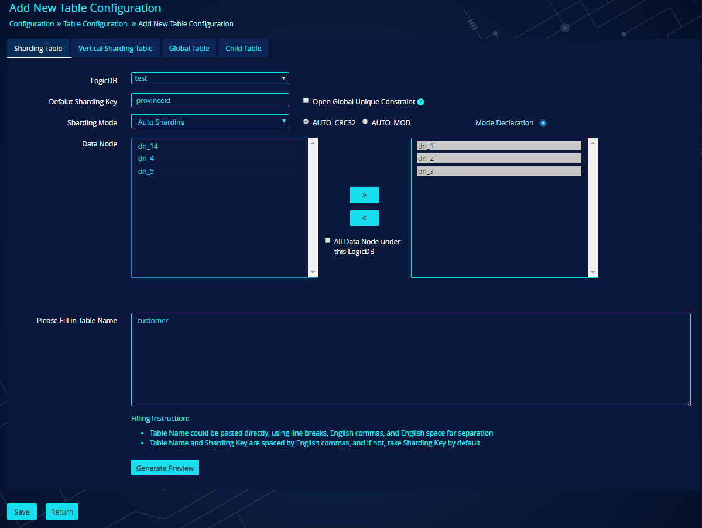

Click [Save], and Customer Auto Sharding Table is successfully added. Note: The Sharding Function cited in this table is AUTO_CRC32 type (for difference of the sharding types AUTO_MOD and AUTO_CRC32, the "Mode Declaration" in the page could be viewed).

### Check and reload configuration information

Log in to Management Platform page, and for any modification made to the HotDB Server User, LogicDB, Data Node, Data Source, Failover, Sharding Function, Table Configuration and Child Table Configuration, under the condition of not re-enabling the compute node service, the new configuration information shall take effect only after [Reload](#Reload).

If Compute Node is not enabled, reload can't be executed, therefore, Compute Node shall be enabled first.

Log in to Management Platform page, select "Configuration"->[Config Checking](#Config%20Checking), and click "Start Checking" in the page, if there is no prompt of configuration error, it means that the configuration information is correct:

Click [Reload](#Reload) in the page, if it's promoted "Reload Succeeded" in the page, then the configuration information has taken effect successfully in the compute node:

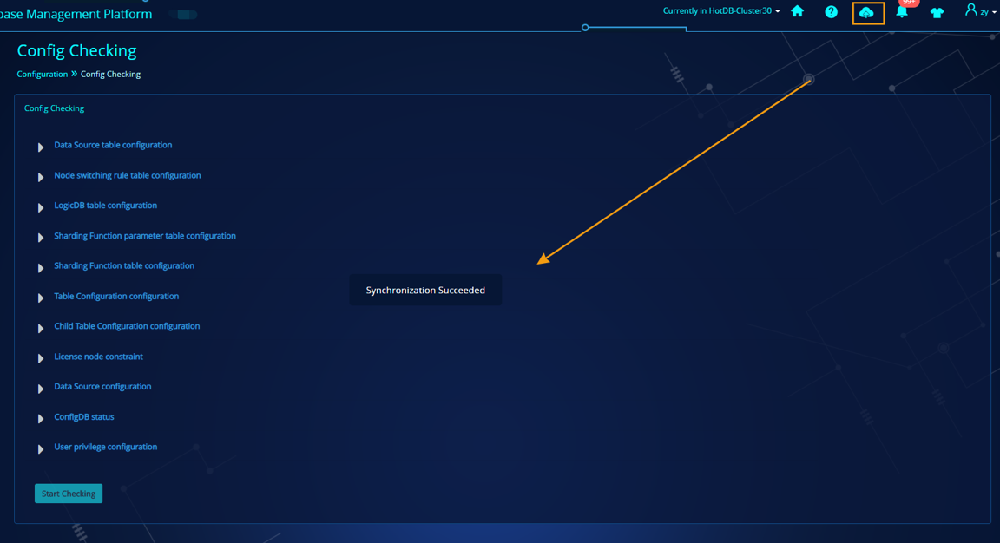

### Log in to compute node and start to use

Use MySQL command line, to specify actual IP address, and log in to the compute node:

mysql -uroot -proot -h127.0.0.1 -P3323 -Dtest

For example:

root> mysql -h127.0.0.1 -uroot -proot -P3323 -Dtest

mysql: [Warning] Using a password on the command line interface can be insecure.

Welcome to the MySQL monitor. Commands end with ; or \\g.

Your MySQL connection id is 100728

Server version: 5.7.19-HotDB-2.5.2 HotDB Server by Hotpu Tech

Copyright (c) 2000, 2018, Oracle and/or its affiliates. All rights reserved.

Oracle is a registered trademark of Oracle Corporation and/or its

affiliates. Other names may be trademarks of their respective

owners.

Type 'help;' or '\\h' for help. Type '\\c' to clear the current input statement.

mysql>

Execute customer Create Table statement:

CREATE TABLE `customer`(

`id` BIGINT UNSIGNED NOT NULL AUTO_INCREMENT,

`name` VARCHAR(32) NOT NULL,

`telephone` VARCHAR(16) NOT NULL,

`provinceid` TINYINT UNSIGNED NOT NULL DEFAULT 0,

`province` ENUM ('Anhui','Aomen','Beijing','Chongqing','Fujian','Gansu','Guangdong','Guangxi','Guizhou','Hainan','Hebei','Heilongjiang','Henan','Hubei','Hunan','Jiangsu','Jiangxi','Jilin','Liaoning','Neimenggu','Ningxia','Qinghai','Shaanxi','Shandong','Shanghai','Shanxi','Sichuan','Taiwan','Tianjin','Xianggang','Xinjiang','Xizang','Yunnan','Zhejiang') NULL,

`city` VARCHAR(16) NULL default '',

`address` VARCHAR(64) NULL,

PRIMARY KEY(`id`),

UNIQUE KEY(`telephone`)

) ENGINE=InnoDB DEFAULT CHARSET=utf8;

Compute node will Create Customer Table in various data nodes. You can log in to various MySQL data sources, to verify whether customer has been created or not.

Or find the [Table Configuration](#add-table-configuration) added in previous section on the "Configuration"->"Table Configuration" page, and click [Not Created] in the Table Structure column to jump to Ordinary DDL page.

Enter [LogicDB Username Password](#grant-user-logicdb-privilege), and after selecting Test LogicDB, enter Create Table statement, click [Execute] to Add Table Structure.

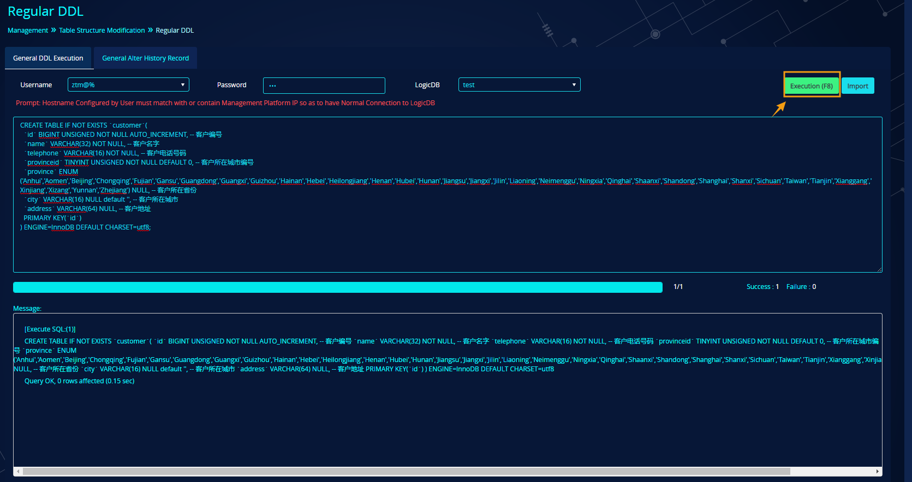

After the Sharding Table Customer is successfully created, you could execute the following SQL statements in Compute Node, and write in data:

INSERT INTO customer VALUES (21,'何重庆','13912340021',4,'Chongqing','重庆','某某街某某号');

INSERT INTO customer VALUES (22,'吕重庆','13912340022',4,'Chongqing','重庆','某某街某某号');

INSERT INTO customer VALUES (25,'孔福州','13912340025',5,'Fujian','福州','某某街某某号');

INSERT INTO customer VALUES (26,'曹兰州','13912340026',6,'Gansu','兰州','某某街某某号');

INSERT INTO customer VALUES (67,'岑南昌','13912340067',17,'Jiangxi','南昌','某某街某某号');

INSERT INTO customer VALUES (68,'薛长春','13912340068',18,'Jilin','长春','某某街某某号');

INSERT INTO customer VALUES (69,'雷沈阳','13912340069',19,'Liaoning','沈阳','某某街某某号');

INSERT INTO customer VALUES (70,'贺呼和浩特','13912340070',20,'Neimenggu','呼和浩特','某某街某某号');

INSERT INTO customer VALUES (71,'倪银川','13912340071',21,'Ningxia','银川','某某街某某号');

INSERT INTO customer VALUES (72,'汤西宁','13912340072',22,'Qinghai','西宁','某某街某某号');

INSERT INTO customer VALUES (73,'滕西安','13912340073',23,'Shaanxi','西安','某某街某某号');

INSERT INTO customer VALUES (74,'殷济南','13912340074',24,'Shandong','济南','某某街某某号');

INSERT INTO customer VALUES (93,'顾台北','13912340093',28,'Taiwan','台北','某某街某某号');

INSERT INTO customer VALUES (94,'孟天津','13912340094',29,'Tianjin','天津','某某街某某号');

INSERT INTO customer VALUES (95,'平香港','13912340095',30,'Xianggang','香港','某某街某某号');

INSERT INTO customer VALUES (96,'黄乌鲁木齐','13912340096',31,'Xinjiang','乌鲁木齐','某某街某某号');

INSERT INTO customer VALUES (99,'萧杭州','13912340099',34,'Zhejiang','杭州','某某街某某号');

INSERT INTO customer VALUES (100,'尹杭州','13912340100',34,'Zhejiang','杭州','某某街某某号');

Next, you could log in to Compute Node Service, to execute DELETE, UPDATE and SELECT operations toward the Customer Sharding Table.

## HotDB Server running related

### Instruction on enabling compute node

-   When the configuration error of Data Node, Data Source and other information can't pass the Config Checking, Compute Node cannot be enabled;

-   To enable compute node, you could switch to /usr/local/hotdb/hotdb-server/bin directory first, and then run the Startup Script, or add the following path directly: sh /usr/local/hotdb/hotdb-server/bin/hotdb_server start;

-   Synchronization State of configDB could influence Compute Node Enable, when compute node is enabled or in case of online High Availability Switch, configDB must ensure synchronization to catch up;

-   Synchronization Status of Data Source could influence Compute Node Enable. Use true/false attribute of the configuration parameter [waitSyncFinishAtStartup](#waitsyncfinishatstartup) in server.xml to Control whether to wait for synchronization of data source to catch up when Compute Node is enabled. Wait by default;

-   When Compute Node is enabled, if the Data Source is of abnormal connection, you could control whether the Master Data Source in Data Node shall be re-initialized or not and the Initialization Timeout time through editing the configuration parameter [masterSourceInitWaitTimeout](#keystore) in server.xml, and please refer to [Judgment of availability of LogicDB when enabling compute node](#judgment-of-availability-of-logicdb-when-enabling-compute-node) for specific control logic.

#### Judgment of availability of LogicDB when enabling compute node

In order to ensure that in case of Unavailable Status of Data Node in Vertical sharding scenario, the unassociated business scenarios of different LogicDB are not influenced, therefore, at the time of Compute Node Enable, special judgment and treatment have been made toward available status of all LogicDB, and the description is as follow:

-   If the configured Master Data Source is in Available status, but this data source can't be connected in reality, then at the time of Compute Node Enable, it will wait for configuration time of [masterSourceInitWaitTimeout](#keystore) (default:300s), to judge whether the data source is really un-connectable or not, and if during this period, the data source comes into reconnection without abnormality, then this node is successfully initialized;

-   If there are Unavailable nodes under all LogicDB, then the compute node can't be enabled, log prompt: 04/13 10:50:54.644 ERROR [main] (HotdbServer.java:436) -datanodes:[3] init failed. System exit.

-   As long as corresponding data node of a LogicDB is available, then the compute node could start, and the table under corresponding logic could come into normal operation. If there is unavailable node under other LogicDB, then the table under the LogicDB can't make normal Read/Write, Client prompt: ERROR 1003 (HY000): DATABASE is unavailable when datanodes: [datanode_id] unavailable.

> For example: ALogicDB includes Node 1, 2, and BLogicDB includes Node 3, 4. If Node 1, 2 are Unavailable, but Node 3, 4 are available, then compute node could start, the table under BLogicDB could come into normal operation, the table under ALogicDB can't make Read/Write; if Node 1, 3 are Unavailable, then the compute node can't be enabled.

-   Judgment of whether a node is available or not, is related with the status of the data source in configDB and the actual available status of the data source, and it's required that the configuration status shall be consistent with the data source status. Otherwise, Compute Node Enable will be influenced, and when compute node is enabled, connect configured available data source of configDB. If connection succeeded, it shall be deemed as available; if a data source configured available cannot be connected, even if the node has other available data sources which could be connected, the node shall be deemed as Unavailable, and each node shall be configured with at least one available data source, otherwise compute node can't be enabled. The specific conditions are as follow:

1. Master/slave data source is configured available

> If master/slave data source could be connected, then the node is available. If Active Master can't be connected, Standby Slave could be connected, then there will be Switch, and the Active Master will be set Unavailable, and the Standby Slave will be used, but the compute node shall still judge that the node is Unavailable. If Active Master could be connected, but Standby Slave can't be connected, then Active Master will be used, and Standby Slave will be set Unavailable, and the compute node will judge that the node is Unavailable. If master/slave database can't be connected, then the node is Unavailable.

2. Active Master Configuration is Unavailable, Standby Slave Configuration is available

> If Standby Slave could be connected, then Standby Slave shall be used, and the node is available. If Standby Slave can't be connected, then the node is Unavailable

3. Active Master Configuration is available, but Standby Slave Configuration is Unavailable

> If Active Master could be connected, then Active Master shall be used, and the node is available. If Active Master can't be connected, then the node is Unavailable

### Parameter checking of MySQL server

In order to guarantee data consistency, when compute node is enabled, it will make checking of the parameters of MySQL data source service port. For different parameters, if parameter configuration doesn't conform to checking rule, compute node will report warning message, or can't be enabled. There are two kinds of requirements of compute node for parameters of MySQL data source service port: one is that all service port parameters between the data sources shall be consistent; the other is that all service port parameters of data source must be fixed value.

#### Parameters required to be set as fixed value

As for following parameters of MySQL data source service port, they are required to be set as uniform fixed value by compute node:

1. **completion_type must be NO_CHAN**, if the parameter is not standard, then reload fails;

2. **innodb_rollback_on_timeout shall be ON,** and the innodb_rollback_on_timeout parameter shown by show [global|session] variables at any time shall be on, the description is as follow:

-   If innodb_rollback_on_timeout parameters are all off, then compute node allows successful load, but the behavior of the compute node equals to the transaction rollback method when innodb_rollback_on_timeout parameter is on, and the following prompts will be given at the time of Config Checking:

And at the time of Reload, the log output will be: innodb_rollback_on_timeout=off is not supported, HotDB behavior will be equivalent to innodb_rollback_on_timeout = on.

-   If innodb_rollback_on_timeout parameter data sources are inconsistent, Reload will fail, and there will be prompt as follow at the time of Config Checking:

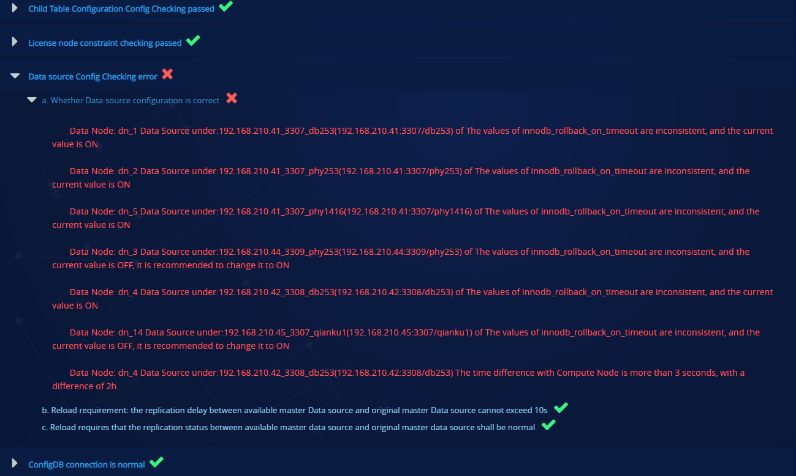

And at the time of Reload, the data source being off will have log output: MySQL variables 'innodb_rollback_on_timeout' is not consistent, the current value is OFF ,neet to bu changed to ON, and the data source being on will have log output: MySQL variables 'innodb_rollback_on_timeout' is not consistent, the current value is ON

3. **read_only**, the parameter description is as follow:

-   If for master data source, the parameter read_only=1, then compute node will refuse to start, and reload fails.

-   If for the Slave, the parameter read_only=1 and is configured with the configuration rule of Switch to the Slave, then compute node could start, RELOAD fails.

-   If for the Slave, the parameter read_only=1 and is not configured with the configuration rule of Switch to the Slave, then compute node could start, and reload will be successful if without other error.

#### Parameters requiring consistent configuration of all nodes

For the following parameters of MySQL data source service port, parameter values between the data sources are required to be set consistent by the compute node:

-   autocommit

-   transaction_isolation

-   div_precision_increment

If the above parameters are configured inconsistent between the data sources, compute node will give warning message. For transaction_isolation parameter, if the min configuration value is lower than REPEATABLE-READ, compute node will use REPEATABLE-READ mode; if the max configuration value is higher than REPEATABLE-READ, SERIALIZABLE will be used.

#### Parameters requiring not exceeding compute node configuration

Considering that sending super-large SQL by Client may threaten HotDB Server (no practical case has yet been discovered at present), HotDB Server could be configured with MAX_ALLOWED_PACKET the same as MySQL, to control the max packet size of SQL sent to compute node by Client, and the parameter could be preset in server.xml via parameter name maxAllowedPacket, if maxAllowedPacket of compute node has its default value bigger than MySQL, the log will give warning prompt, and Config Checking on the management platform will also give prompt:

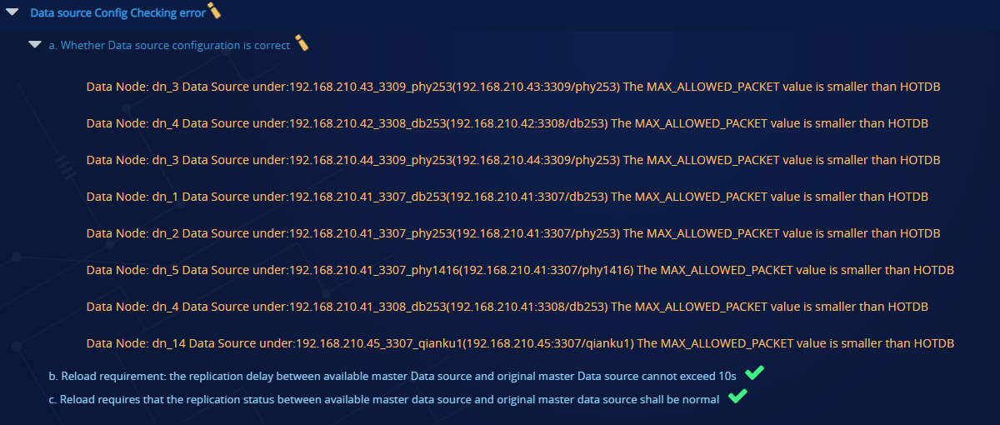

### Management port information monitoring

HotDB Server provides the customer a set of information monitoring, statistics and service management functions which are perfect and easy to operate. The user could log in to monitoring management port of compute node via MySQL Client to view the detailed information, please refer to *Distributed Transactional Database HotDB Server [management port Command] Function Manual* for detailed description.

#### Management port command

The user could log in to management port (default port: 3325) to use show @@help command to view the supported management port command and corresponding role.

root> mysql -uroot -proot -P3325 -h192.168.200.201

mysql: [Warning] Using a password on the command line interface can be insecure.

Welcome to the MySQL monitor. Commands end with ; or \\g.

Your MySQL connection id is 992081

Server version: 5.1.27-HotDB-2.5.0 HotDB Manager by Hotpu Tech

Copyright (c) 2000, 2016, Oracle and/or its affiliates. All rights reserved.

Oracle is a registered trademark of Oracle Corporation and/or its

affiliates. Other names may be trademarks of their respective

owners.

Type 'help;' or '\\h' for help. Type '\\c' to clear the current input statement.

mysql> show @@help;

+-------------------------------------------+---------------------------------------------------------------------------+

| statement | description |

+-------------------------------------------+---------------------------------------------------------------------------+

| check @@datasource_config | Inspect MySQL parameter configuration information |

| check @@route [db_name.tb_name | tb_name] | Detect the data routing correctness of Sharding Table |

| kill @@connection [connection_id] | Close one appointed connection |

| onlineddl "[DDLSTATEMENT]" | Execution onlineddl |

| rebuild @@pool | Rebuild currently available datasources of all nodes |

| reload @@config | Re-load the configuration information |

| restart @@heartbeat [datanode_id] | Recover the heartbeat detection on the appointed data node |

| show @@auxtable | Displays the created auxiliary table information |

...more contents are omitted, and you could log in to view...

#### Management port operation

The user can enter corresponding command to monitor service condition of compute node, such as showing the data source information:

mysql> show @@datasource;

+------+------+------------------------------+------+--------+-----------------+------+----------------------+--------+------+------+--------------------+--------------+

| dn | ds | name | type | status | host | port | schema | active | idle | size | unavailable_reason | flow_control |

+------+------+------------------------------+------+--------+-----------------+------+----------------------+--------+------+------+--------------------+--------------+

| 186 | 227 | 192.168.210.68_3307_db252 | 1 | 1 | 192.168.210.68 | 3307 | db252 | 0 | 512 | 512 | NULL | 0/64 |

| 186 | 228 | 192.168.210.68_3308_db252 | 3 | 1 | 192.168.210.68 | 3308 | db252 | 0 | 512 | 512 | NULL | 0/64 |

| 1 | 7 | 192.168.210.41_3307_db252 | 1 | 1 | 192.168.210.41 | 3307 | db252 | 0 | 512 | 512 | NULL | 0/64 |

| 2 | 8 | 192.168.210.42_3307_db252 | 1 | 1 | 192.168.210.42 | 3307 | db252 | 0 | 512 | 512 | NULL | 0/64 |

| 101 | 74 | 192.168.210.41_3307_clu_db30 | 1 | 1 | 192.168.210.41 | 3307 | clu_db30 | 0 | 512 | 512 | NULL | 0/64 |

...more contents are omitted, and you could log in to view...

The content behind show @@ command is a table name, for example in the previous instance, "show @@datasource;", datasource is a table name.

The user could also make DESC operation of the table name behind show @@ command, to view meanings of various fields in this table, such as viewing the meaning of various fields in data source information:

mysql> desc datasource;

+--------------------+----------------------------------------------+

| filedname | description |

+--------------------+----------------------------------------------+

| dn | Datanode |

| ds | Datasource |

| name | Datasource name |

| type | Datasource type |

| status | Datasource status |

| host | Host |

| port | Port |

| schema | Physical database name |

| active | Active connections |

| idle | Idle connections |

| size | Total connections |

| unavailable_reason | Reason for datasource unavailable |

| flow_control | Remaining available quantity in flow control |

| idc_id | ID of IDC |

| listener_id | LISTENER ID(ID of LISTENER) |

| listener_status | LISTENER STATUS(STATUS of LISTENER) |

+--------------------+----------------------------------------------+

16 rows in set (0.00 sec)

The user could also make SELECT operation of the table name behind show @@ command, to make SQL query under arbitrary condition, such as viewing the data source on No. 11 data node:

mysql> select * from datasource where dn=11;

+------+------+-----------------------------+------+--------+----------------+------+---------+--------+------+------+--------------------+--------------+

| dn | ds | name | type | status | host | port | schema | active | idle | size | unavailable_reason | flow_control |

+------+------+-----------------------------+------+--------+----------------+------+---------+--------+------+------+--------------------+--------------+

| 11 | 9 | 192.168.210.70_3310_yds_db1 | 1 | 1 | 192.168.210.70 | 3310 | yds_db1 | 2 | 32 | 34 | NULL | 0/16 |

+------+------+-----------------------------+------+--------+----------------+------+---------+--------+------+------+--------------------+--------------+

1 row in set (0.00 sec)

### Limit on number of front-end connections

Compute node supports the function of Limit on Number of Front-end Connections, which could provide guarantee in case of access overload, and the function is the same as MySQL. The use method is: make configuration in server.xml:

<property name="maxConnections">5000</property><!-- Front maximum connections -->

<property name="maxUserConnections">0</property><!-- User's front maximum connections, Unlimited: 0 -->

maxConnections is front-end Max Connections, 5000 by default;

maxUserConnections is front-end max user connections, the default 0 means unlimited;

Meanwhile, it supports the user with super privilege to Modify on set global max_connections=1; set global max_user_connections=0 service port;.

Show variables could be used to view limit conditions of current connections.

### Management of back-end connection pool

Compute node will make connection with data source during the start and running, and when [[Add Data Source]{.ul}](#add-data-source-group), four configurations could be used to control the number of connections:

-   Max Connections: Max Connections available between compute node and data source (that is MySQL physical database), SQL can't come into normal execution if exceeded;

-   Initial Connections: Initial Connections established between compute node and data source;

-   Min Idle Connections: Min Idle Connections established between compute node and data source;

-   Max Idle Connections: Max Idle Connections established between compute node and data source.

When the Timing Detection Thread founds that the Idle Connections in the connection pool are smaller than the Min Idle Connections, then Create Connection; if bigger than Max Idle Connections, then Disable Connection. That is: Min Idle Connections ≤ Idle Connections in connection pool ≤ Max Idle Connections, and the Max and Min Idle Connections are mainly used for controlling Idle Connections in connection pool within a certain range.

For example:

Take single compute node as the unit for instance (multiple compute node service will multiply according to the number of compute nodes), HotDB Server data source configuration: Max Connections is 4200, Initial Connections is 32, Min Idle Connections is 64, Max Idle Connections is 512

Then, when HotDB Server compute node is enabled, it will establish 32 back-end connections with each data source, and when Timing Detection Thread detects that the current connections are less than the Min Idle Connections, then the connections shall be increased to the 64 Min Idle Connections;

At this time, if there is a 2048 Concurrent Pressurizing Scenario to impose pressure to compute node, it will be found that there are insufficient available connections in the connection pool, and the compute node will automatically increase the connections with data source, and the Max Connections could be up to 4200.

After Pressurizing, these connections will not be destroyed immediately. Instead, they will wait until examination by Idle Examination Period: if Idle (that is the management port show @@backend is marked as Idle) connections are bigger than 512, then the connections shall be destroyed to 512; if smaller than 512, they will be kept intact;

If to make Idle Connections back to Initial Connections, then during running process of compute node, you could rebuild connection pool by referring to rebuild connection pool rebuild @@pool related chapters in *Distributed Transactional Database HotDB Server [management port Command] Function Manual*, then Initial Connections status shall be recovered.

### Limit on use of disk space

Since insufficient disk space would result in many problems such as the compute node can't come into normal operation, etc., therefore, at the time of Auto Deploy, the compute node will detect whether free disk space of installation directory of HotDB Server is bigger than 10G or not, meanwhile, it will also detect the free disk space when writing temp-files. The details are as follow:

When the user conducts operations such as SQL Query Insert, etc. after Create Session, the compute node will write temp-files under installation directory of HotDB Server. While writing temp-files, if the compute node detects that the free disk space of the installation directory is insufficient, then it will end the current session and report error and record log.

Error-level logs recorded by compute node logs are as follow, and when End Session, the prompt message is the same with it:

2019-06-10 18:03:24.423 [ERROR] [DISKSPACE] [Employee-2] cn.hotpu.hotdb.mysql.nio.handler.MultiNodeHandler(88) - session[1606] was killed,due to less than 1G space left on device,and the size of temp-file is larger than the usable space.

### Reload

Compute node could make Online Reload of configuration information without re-enabling the service. For the parameters which could take effect immediately via [Reload](#Reload) function, please refer to [Instruction on use of compute node parameters](#_计算节点参数使用说明_2).

There are two Reload methods, one is to log in to [[management port (3325)]{.ul}](#management-port-information-monitoring) to execute: reload @@config command; the other is to log in to management platform, click [Reload](#Reload) button on top right corner of the menu bar, and reload the new configuration items to the compute node for use. As shown in the following figure:

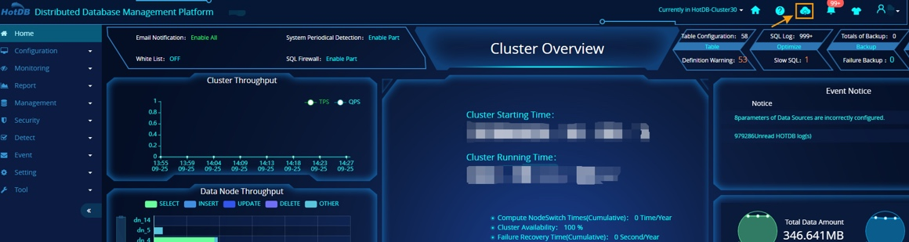

In order to guarantee that compute node makes accurate loading of configuration information, before executing Reload, configuration information could be checked first. During Reload process, in case of master/slave configDB, master/slave data source switching, it will give prompt to the user and provide two optional schemes: force to stop switch and cancel reload.

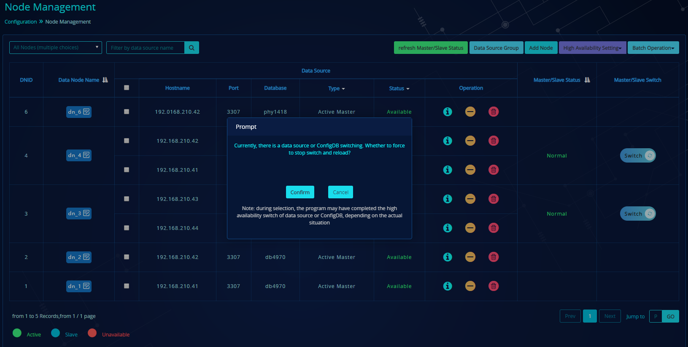

### Config Checking

Log in to management platform, select "Configuration"->[Config Checking](#Config%20Checking) to enter the Config Checking panel, click "Start Checking" button, and then it will check the configuration items in [Config Checking](#Config%20Checking) menu of Distributed Transactional Database Management Platform, as shown in the following figure:

As shown in the above figure, all configuration items have passed the checking normally.

In case of inaccurate configuration items, modify correspondingly according to the error prompt:

When executing reload @@config command to reload via compute node management port, Config Checking will be conducted first as well by default, and successful reload is allowed only after the checking passed.

### Deadlock Check

In Distributed Transactional Database system, in case of deadlock between two data sources under data node, then Deadlock Check mechanism of MySQL can't detect the deadlock.

The operations in the following table, describe the deadlock process of two data nodes in distributed system. Session 1 and Session 2 execute DELETE operation respectively on the two data nodes:

| Session 1 | Session 2 |
| --- | --- |
| Session 1 Start transaction | start transaction; |
| Session 2 Start transaction | 　 | start transaction; |
| Session 1 Execute DELETE statement on data node where DNID = 15 | delete from customer where dnid=15 and id=1; |
| Session 2 Execute DELETE statement on data node where DNID = 13 | 　 | delete from customer where dnid=13 and id=4; |
| Session 1 Execute DELETE statement on data node where DNID = 13; DELETE operation will be blocked by Session 2 | delete from customer where dnid=13 and id=4; |
| Session 2 Execute DELETE statement on data node where DNID = 15; this operation will be blocked by Session 1; since Session 1 is blocked by Session 2, and Session 2 is also blocked by Session 1, therefore, there will be deadlock at this time | 　 | delete from customer where dnid=15 and id=1; |

Under the above condition, Session 1 and Session 2 are mutually blocked, thus there will be deadlock. Since the deadlock occurs between two data sources of data node, MySQL can't detect existence of the deadlock.

In Distributed Transactional Database system of HotDB Server, compute node could detect deadlock among multiple data sources of data node, and rollback the transaction of least overheads.

In Config File server.xml of compute node, set Deadlock Check Period at the value bigger than 0, which will enable Deadlock Auto Check function. By default, Deadlock Check is enabled, and the Check Period is 3000ms.

<property name=" deadlockCheckPeriod ">3000</property>

When the value of deadlockCheckPeriod is set as 0, Deadlock Check function will not start.

When Start Deadlock Check of compute node, re-execute the above-mentioned DELETE operation:

Session 1, start transaction:

mysql> start transaction;

Query OK, 0 rows affected (0.00 sec)

Session 2, start transaction:

mysql> start transaction;

Query OK, 0 rows affected (0.00 sec)

Session 1, Execute DELETE statement on data node where DNID = 15:

mysql> delete from customer where dnid=15 and id=1;

Query OK, 1 row affected (0.00 sec)

Session 2, Execute DELETE statement on data node where DNID = 13

mysql> delete from customer where dnid=13 and id=4;

Query OK, 1 row affected (0.00 sec)

Session 1, Execute DELETE statement on data node where DNID = 13; DELETE operation will be blocked by Session 2:

mysql> delete from customer where dnid=13 and id=4;

Session 2, Execute DELETE statement on data node where DNID = 15; this operation will be blocked by Session 1; since Session 1 is blocked by Session 2, and Session 2 is also blocked by Session 1, therefore, there will be deadlock at this time

mysql> delete from customer where dnid=15 and id=1;

Query OK, 1 row affected (1.59 sec)

Compute node checks deadlock, and rolls back to transaction in Session 1:

mysql> delete from customer where dnid=13 and id=4;

ERROR 1213 (HY000): Deadlock found when trying to get lock; try restarting transaction

Note: In MySQL 5.7 and above, a new transaction will not be started immediately after a deadlock rollback occurs in the transaction. You can refer to the official BUG link: <https://bugs.mysql.com/bug.php?id=98133>. HotDB Server does compatibility processing for the above BUGs: for the lock timeout, deadlock detection, and back-end disconnection, MySQL 5.7 and above will determine whether to start a new transaction according to the front-end connection of autocommit.

### SQL error reporting log

If the following error information is returned during SQL execution, the compute node will record it in the compute node log (hotdb-unusualsql.log):

-   ERROR information caused by primary key\\unique key conflict or foreign key constraint not satisfied (i.e. MySQL error code 1062, 1216, 1217, 1451, 1452, 1557, 1761, 1762, 3008)

-   Data overflow (i.e. MySQL error code 1264, 1690, 3155, 3669) and data truncation (i.e. MySQL error code 1265, 1292, 1366) caused by data type conversion or implicit conversion

-   Involving binlog unsafe statements (i.e. MySQL error codes 1418, 1592, 1663, 1668, 1669, 1671, 1673, 1674, 1675, 1693, 1714, 1715, 1716, 1719, 1722, 1724, 1727, 1785, 3006, 3199, 3570, 3571, MY-010908, MY-013098)

-   When the INSERT operation is performed on the sharding table whose sharding key is not an auto-incremental field, the INSERT of auto increment is specified externally.

-   Mismatch between MATCH and AFFECT in UPDATE statement

-   Zero rows are deleted in DELETE

-   UPDATE or DELETE AFFECT are more than 10000 rows

-   INSERT, UPDATE, DELETE, and DDL statements are used in HINT statements

-   ERROR information is reported during the execution of DDL statements. In addition, there will be additional logging in the following two cases: 1. When the character set of the specified table or field in CREATE TABLE or ALTER TABLE is inconsistent with the character set of the data source or the character set used in the connection; 2. In the sharding table of CREATE TABLE or ALTER TABLE, the primary key or unique key does not contain the sharding key and does not use the global unique constraint to ensure field uniqueness.

-   A partial commit occurs, that is, when some nodes have issued a commit, the rest nodes have not issued a commit but the connection is stopped, or when the rest of the back-end connections have issued a commit, there is no response and the connection is stopped. In the above cases, the whole transaction will be recorded to the compute node log.

-   A syntax error occurs.

-   Execution of SQL that cannot be routed due to lack of routing rules, such as ROUTE rules that do not exist in INSERT

-   Execution of SQL blocked by SQL firewall

-   Execution of SQL which timed out

-   Transaction killed due to the dead lock

-   Transaction killed due to data source switching and other reasons

-   Execution of SQL with lock which timed out and rolled back

-   SQL killed after Kill Command is executed

-   SQL being rolled back

-   SQL rolled back caused by abnormal front-end connection and connection stopping

-   Rollback caused by abnormal back-end connection and connection stopping or other exceptions

-   Unexpected throwing of exception by compute node

-   If the above SQLs are too long, the SQL statements will be intercepted, and the WARNING information will be additionally recorded

For example, execute a SQL with primary key conflict as follows:

mysql> insert into table01 (id,title,author,submission_date) values (3,"apple", "apple pie", '2019-10-11-20-05');

ERROR 1062 (23000): Duplicate entry '3' for key 'PRIMARY'

View the compute node log（hotdb-unusualsql.log）：

2019-10-12 15:27:45.051 [INFO] **[UNUSUALSQL]** [$NIOREACTOR-7-RW] cn.hotpu.hotdb.mysql.nio.MySQLConnection(415) - ERROR 1062:Duplicate entry '3' for key 'PRIMARY' [frontend:[thread=$NIOREACTOR-7-RW,id=453,user=root,host=192.168.210.225,port=3323,localport=65442,schema=DBY]; backend:null; frontend_sql:insert into table01 (id,title,author,submission_date) values (3,"apple", "apple pie", '2019-10-11-20-05');backend_sql:null]

For another example, execute a SQL intercepted by SQL firewall as follows:

mysql> select * from test;

ERROR 1064 (HY000): Intercepted by sql firewall, because: not allowed to execute select without where expression

View the compute node log（hotdb-unusualsql.log）：

2019-10-14 15:41:42.246 [INFO] **[UNUSUALSQL]** [$NIOExecutor-1-2] cn.hotpu.hotdb.route.RouteService(415) - ERROR 10029:not pass sql firewall [frontend:[thread=$NIOExecutor-1-2,id=1433,user=root,host=192.168.210.225,port=3323,localport=64658,schema=DBY]; backend:null; frontend_sql:null; backend_sql:null] [DBY.count]=33

Note:

For MySQL error code explanations, please refer to the official document; <https://dev.mysql.com/doc/refman/8.0/en/server-error-reference.html>

By default, this type of log information is saved in the file hotdb_unusualsql.log under the HotDB Server installation directory /logs/extra/unusualsql/. If the log is not recorded to a file, check whether the following configuration exists under log4j2.xml in the HotDB Server installation directory /conf:

</RollingFile>

<RollingFile

name="**Unusualsql**"

filename="${sys:HOTDB_HOME}**/logs/extra/unusualsql/hotdb-unusualsql.log**"

filepattern="${sys:HOTDB_HOME}/logs/extra/unusualsql/hotdb-unusualsql-%d{yyyy-MM-dd-HH-mm-ss}.log">

<PatternLayout

pattern="%d{yyyy-MM-dd HH:mm:ss.SSS} [%-4p] [%marker] [%t] %c(%L) - %msg%n"/>

<Policies>

<SizeBasedTriggeringPolicy size="100 MB"/>

</Policies>

<!-- only record unusual sql log -->

<filters>

<MarkerFilter marker="U**NUSUALSQL**" onMatch="ACCEPT" onMismatch="DENY"></MarkerFilter>

</filters>

<DefaultRolloverStrategy max="1000"/>

</RollingFile>

</Appenders>

<Loggers>

<Root level="info">

<AppenderRef ref="**Unusualsql**" />

## Safety

### User and privilege

HotDB Server has two kinds of users, one is Compute Node User who operates data, and executes SELECT, UPDATE, DELETE, INSERT and other SQL statements. The other is Distributed Transactional Database Management Platform User, who manages the configuration information. This chapter will emphasize on introducing compute node user related contents.

LogicDB must be accessed with granted compute node user privilege. Compute node provides LogicDB with operating privilege similar to that of MySQL, as follow:

| Privilege type | Executable SQL statement |
| --- | --- |
| CREATE | CREATE TABLE,CREATE INDEX |
| DROP | DROP TABLE,DROP INDEX,TRUNCATE TABLE,RENAME TABLE |
| ALTER | ALTER TABLE,RENAME TABLE |
| SELECT | SELECT,INSERT...SELECT |
| UPDATE | UPDATE |
| DELETE | DELETE,REPLACE |
| INSERT | INSERT,REPLACE,INSERT...SELECT |
| SUPER | management port statement, /*!HotDB:dnid=?*/ |

**Description of SUPER privilege:**

The user with SUPER privilege, could log in to 3325port of compute node, and could execute all SQL statements of management port; otherwise, it can't log in to management port or execute SQL statements of management port.

The user with SUPER privilege could execute hint statement at 3323port. For example:

/*!hotdb:dnid=1*/select * from table

**Privilege range:**

When granting privilege for compute node user, in addition to SUPER privilege, operating privilege of the user toward LogicDB or table will be specified. Privilege range is divided into Global Privilege, LogicDB Privilege and Table Privilege:

-   Global privilege: the user with Global Privilege has the privilege to specify all objects under LogicDB. For example: if check Global privilege: SELECT, UPDATE, INSERT, CREATE, and click Save, then the current user could make S/U/I/C operation toward all LogicDB and tables.

-   LogicDB privilege: the user with LogicDB Privilege has the privilege to specify all objects under LogicDB.

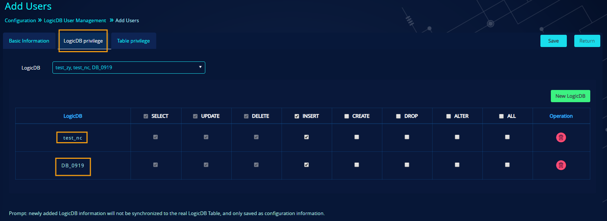

-   Table privilege: Table privilege is also divided into Table privilege Allowed and Table privilege Denied. The user with Table privilege Allowed owns the privilege to check the table; the user with Table privilege Denied owns all privileges other than check privilege toward the table; for example: check Table privilege Denied: SELECT, UPDATE, INSERT, CREATE, and click Save, then the current user can't make S/U/I/C operation of the table, but has the privilege to DELETE, DROP, ALTER.

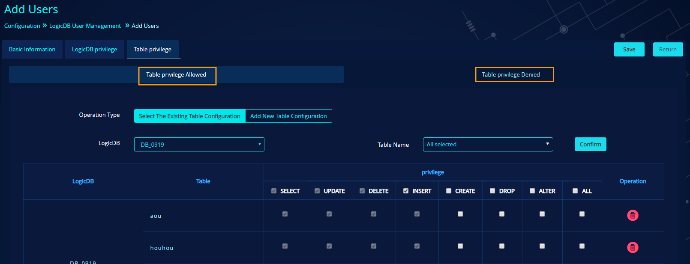

SUPER privilege doesn't specify specific LogicDB. Only the user with SUPER privilege could execute management port statements, please refer to the chapter [management port Information Monitoring](#management-port-information-monitoring) for detailed functions of management port.

The privileges are mutually independent, and owning the Table UPDATE privilege doesn't mean owning the Table SELECT privilege; owning the SUPER privilege doesn't mean owning the Table Operation privilege. Besides, TRIGGER related privilege is not separately maintained at present, and the privilege rule observed is: CREATE TRIGGER requires CREATE privilege; DROP TRIGGER requires DROP privilege; TRIGGER internal statement doesn't verify privilege; DEFINER related are all removed; In case of SHOW TRIGGERS, the related field shall be the current user.

### SSL authentication

Introduction: SSL (Secure Socket Layer) is a protocol encryption layer under HTTPS, with 1, 2 and 3 versions. Currently, we use SSL 3.0. After IETF standardizes SSL, TLS1.0（Transport Layer Security）is released based on SSL 3.0. TLS protocol now has 1.0, 1.1, 1.2, 1.3 four versions.

Since HotDB-Server v.2.5.5, SSL encrypted connection mode to log in to the compute node has been supported.

#### Generation of TLS secret key

##### Generation of the certificate and key files

Please refer to the [official MySQL documents](https://dev.mysql.com/doc/refman/5.7/en/creating-ssl-rsa-files.html) to generate a self-signed secret key. For example, you can generate the certificate and key files using MySQL's own command mysql_ssl_rsa_setup.

mysql_ssl_rsa_setup --datadir=/usr/local/crt/

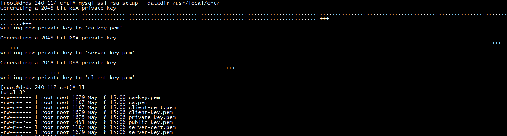

Among them, the secret keys required by the client are: ca.pem, client-cert.pem, client-key.pem;

The secret keys required by HotDB are: ca.pem 、server-cert.pem 、server-key.pem;

Note: the certificate generated by the MySQL command cannot be CA certified, please refer to the link: <https://dev.mysql.com/doc/refman/5.7/en/using-encrypted-connections.html>

If you need to generate a self-signed certificate capable of CA authentication, you need to use openssl. Please refer to the following steps:

1. Generate CA root certificate private key: openssl genrsa 2048 > ca-key.pem

2. Generate CA root certificate: openssl req -new -x509 -nodes -days 3600 -key ca-key.pem -out ca.pem. Please note that in the information filling step, Common Name is better to be filled in the valid domain name, and the name cannot be the same as Common Name in the issued certificate. Here we fill in 127.0.0.1

3. Generate server certificate request file: openssl req -newkey rsa:2048 -days 3600 -nodes -keyout server-key.pem -out server-req.pem. Please note that in the information filling step, Common Name needs to be filled in the IP address/domain name monitored by HotDB-Server, and the client will use this IP for service connection. It cannot be the same as the information in CA certificate.

4. Use command openssl rsa to process the secret key to delete the password: openssl rsa -in server-key.pem -out server-key.pem

5. Generate the self signed certificate for the server: openssl x509 -req -in server-req.pem -days 3600 -CA ca.pem -CAkey ca-key.pem -set_serial 01 -out server-cert.pem

6. Generate the client certificate request file: openssl req -newkey rsa:2048 -days 3600 -nodes -keyout client-key.pem -out client-req.pem. Note that the Common Name in the information filling step cannot be the same as the information in the CA certificate.

7. Use command openssl rsa to process the secret key to delete password: openssl rsa -in client-key.pem -out client-key.pem

8. Generate self signed certificate for client: openssl x509 -req -in client-req.pem -days 3600 -CA ca.pem -CAkey ca-key.pem -set_serial 01 -out client-cert.pem

##### Generation of server.jks file

For a compute node, the secret key needs to be converted to a Java-standard KeyStore file. That is .jks as mentioned below. The generation steps are:

1\) First, synthesize cert and key files into pfx files using openssl:

In this example, SDcrtest should be entered as password (the password of the key file that comes with the program is hotdb.com, which can be used directly. This example is for when generation of a new secret key is required.)

openssl pkcs12 -export -out server.pfx -inkey server-key.pem -in server-cert.pem -CAfile ca.pem

Enter password SDcrtest

2\) Convert pfx to jks file using keytool provided by Java:

keytool -importkeystore -srckeystore server.pfx -destkeystore server.jks -srcstoretype PKCS12

Enter password SDcrtest

#### Configuration of TLS secret key

After the TLS secret key is generated, the corresponding secret key file should be transferred to the server where the server and client of the compute node are located and configured with the following three parameters in the compute node as required before using:

<property name=[enableSSL](#enableSSL)>false</property><!-- Enable SSL connection or not -->

Parameter description: true means to enable SSL function; false means to disable SSL function; default value is false.

<property name=[keyStore](#keyStore)>/server.jks</property><!-- Path to the data certificate .jks file for TLS connection -->

Parameter description: a set of pem file related to server.jks and client is provided by default by compute nodes under /conf directory, with password of hotdb.com, which can be used for simple connection testing. When you choose to use your own generated TLS certificate or pay-for-use TLS certificate to connect, you need to fill in according to the actual path and name. For example, /usr/local/crt/server.jks.

<property name=[keyStorePass](#keyStorePass)>BB5A70F75DD5FEB214A5623DD171CEEB</property><!-- Password of the data certificate .jks file for TLS connection -->

Parameter description: the password in the key file that comes with the program is hotdb.com, which can be encrypted by users through select hex(aes_encrypt('hotdb.com',unhex(md5('Hotpu@2013# shanghai#')))); to get the default value BB5A70F75DD5FEB214A5623DD171CEEB and fill the value in keyStorePass. If users use their own generated key file, the value be filled is based on the password which is actually entered. If SDcrtest is entered as password, users can get the value of keyStorePass through select hex(aes_encrypt('SDcrtest',unhex(md5('Hotpu@2013# shanghai#')))) and fill the value C43BD9DDE9C908FEE7683AED7A301E33 in keyStorePass.

The configured parameters are as follows:

![}]2__08H0B`61[421T9YIBK](media/image40.png)

Users have no need to restart the compute node service for the parameter modification, for server.jks documents will be read again during dynamic loading. If SSL-related logic initialization fails, the dynamic loading will not fail, though the subsequent SSL connections cannot be established normally. Non-SSL connections will not be affected.

**Notes:**

-   If the compute node cannot find any available server.jks file, the following error messages will be output when starting or synchronously loading.

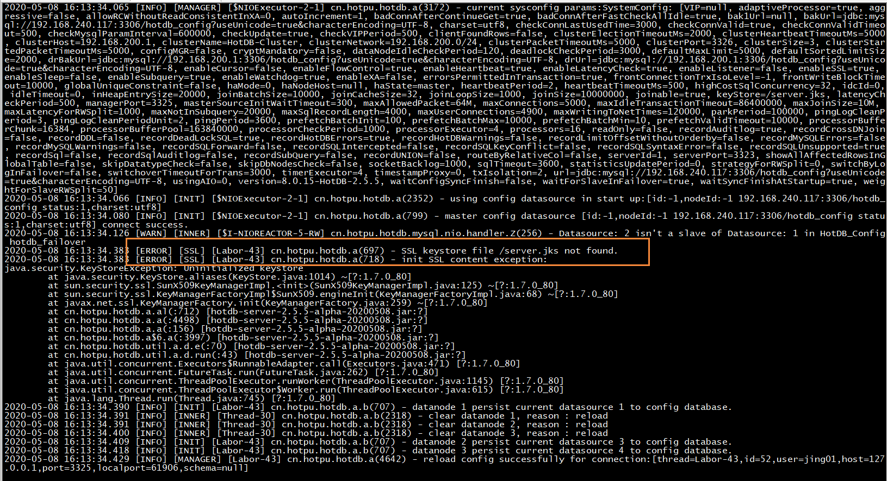

-   If the keyStorePass configuration is wrong, the following error messages will be output during startup or synchronously loading.

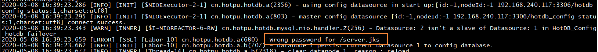

-   If the certificate configuration is wrong, the following error messages will be output during login

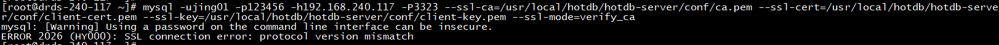

#### TLS connection login

##### MySQL clients

For MySQL clients, users can specify a secret key file to connect using the following method:

mysql -ujing01 -p123456 -h192.168.240.117 -P3323 --ssl-ca=/usr/local/crt/ca.pem --ssl-cert=/usr/local/crt/client-cert.pem --ssl-key=/usr/local/crt/client-key.pem --ssl-mode=verify_ca

Check whether SSL is enabled:

##### JDBC

For JDBC, the corresponding key file is also required. Please refer to the [official MySQL manual](https://dev.mysql.com/doc/connector-j/5.1/en/connector-j-reference-using-ssl.html). Here are two ways for reference:

1） By importing CA into Java trust store:

keytool -importcert -alias MySQLCACert -file ca.pem -keystore truststore

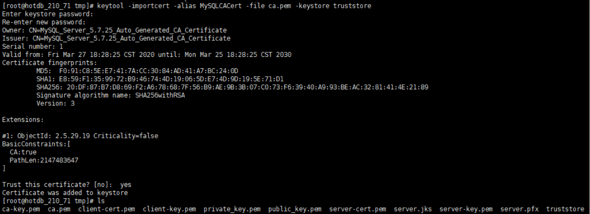\
The truststore file is used for JDBC connection：

jdbc:mysql://192.168.240.117:3323/smoketest?clientCertificateKeyStoreUrl=file:/usr/local/crt/truststore&clientCertificateKeyStorePassword=hotdb.com&verifyServerCertificate=true

2\) By using a certificate:

openssl pkcs12 -export -in client-cert.pem -inkey client-key.pem -name "mysqlclient" -out client-keystore.p12

keytool -importkeystore -srckeystore client-keystore.p12 -srcstoretype pkcs12 -destkeystore keystore -deststoretype JKS

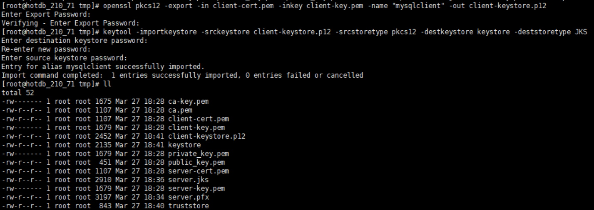\
The truststore file is used for JDBC connection:

jdbc:mysql://192.168.240.117:3323/smoketest?clientCertificateKeyStoreUrl=file:/usr/local/crt/keystore&clientCertificateKeyStorePassword=hotdb.com

##### Navicat and other similar clients

For Navicat and other similar clients, users can configure the relevant file location in the client settings to connect:

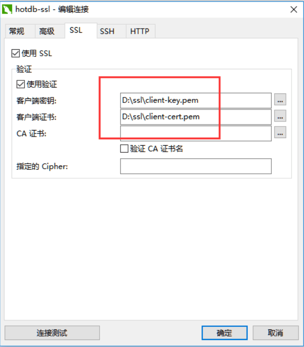

Note: for some versions of Navicat, it may be unable to connect after checking the CA certificate name verification, which may be because the DLL of this version is not compatible. For example, the following warning: "2026 SSL connection error: ASN: bad other signature confirmation". In this case, you need to replace the "libmysql.dll" with files with the same name in MySQL Workbench, or update it to a higher version. Please refer to the [link](https://www.heidisql.com/forum.php?t=19494).

## Data migration, backup and recovery

### Use mysqldump backup

#### mysqldump - database backup program

HotDB Server supports mysqldump function, and the usage is the same with MySQL.

When using mysqldump to export data from compute node, it's required to Add the following specified parameters:

--set-gtid-purged=OFF --no-tablespaces --skip-triggers --single-transaction --default-character-set=utf8mb4 --complete-insert --compact --skip-tz-utc [--replace|--insert-ignore] [--hex-blob] [--where=xxx]

When using mysqldump to export data from MySQL and then import to compute node, it's required to Add the following parameters:

--no-defaults --no-tablespaces --complete-insert --default-character-set=utf8mb4 --hex-blob --master-data=2 --no-create-db --set-gtid-purged=OFF --single-transaction --skip-add-locks --skip-disable-keys --skip-triggers --skip-tz-utc [--replace|--insert-ignore] [--no-create-info|--no-data] [--where=xxx] --databases xxx

Note: Please fill in value of default-character-set parameter according to actual conditions, for example utf8 or utf8mb4, etc.

If specified parameters are not used, there may be problem of time difference, and error reporting of some function commands not supported.

### Use binary log (increment) recovery

#### mysqlbinlog - utility program processing binary log files

Compute node supports parsing mysqlbinlog syntax to synchronize incremental data, in order to reduce downtime for migrating standalone MySQL data to compute node. Use mysqlbinlog to execute SQL statement of a certain binlog file in MySQL connection, so as to import data from a certain database to a certain LogicDB of compute node. Firstly, log in to [management port](#management-port-information-monitoring) (default port: 3325), execute dbremapping command to Add database mapping relation, and for use method of dbremapping command, please refer to *Distributed Transactional Database HotDB Server [management port Command] Function Manual*.

dbremapping @@add@ database name: LogicDB name expected to be imported

Then use mysqlbinlog statement to execute SQL statement in binlog of the selected part, and it's required to use the following syntax and parameters:

mysqlbinlog --base64-output=decode-rows --skip-gtids --to-last-log --stop-never --database= database name --start-position=binlog initial position binlog file name | mysql -u username -p password -h server -Pservice port -c --show-warnings=false

Note: --to-last-log could be replaced with --stop-position, specify end position of binlog instead of the latest execution position of binlog.

For example, if hoping to import physical database db01 in 192.168.200.77:3306 to LogicDB logicdb01 configured on the management platform, then the belonging compute node of the LogicDB is 192.168.210.30.

1. Firstly, go to 192.168.210.30 to log in to [management port 3325](#data-consistency-guarantee), and execute:

dbremapping @@add@db01:logicdb01

2. Then, go to 192.168.210.30 server to make remote login to 192.168.200.77 to execute the following command:

mysqlbinlog -R -h 192.168.200.77 -P3306 -v --base64-output=decode-rows --skip-gtids --to-last-log --stop-never --database=db01 --start-position=0 mysql-bin.000009 | mysql -uroot -proot --h192.168.210.30 --P3323 -c -A

#### Practical application of mysqldump and mysqlbinlog

This section will show how to in practical application scenario, combine complete backup of mysqldump with incremental backup of mysqlbinlog to migrate data from source-end standalone MySQL to compute node.

Notice: During the whole operation process, it's not recommended executing any DDL, parameter change and other irregular operations in source end or compute node of data migration. Due to single thread operation and restriction by network latency, the data-catching execution speed of this mode is slower than execution speed of MySQL replication. Therefore, it's not guaranteed that execution speed of compute node could meet real-time catching of data, and there may be increasing data latency. Therefore, at this time, find the transaction trough to retry or plan a scheme separately.

Scenario description: Hoping to import physical database db01 at source-end 192.168.210.45:3309 (this instance is ordinary MySQL instance with production data) to LogicDB logicdb01 configured on the management platform, and the belonging master compute node of the LogicDB is 192.168.210.32. Reference steps are as follow:

1. Use mysqldump to export table structure from source end of data migration (that is192.168.210.45:3309), and execute the following commands on 192.168.210.45 server (the following parameters must be added):

root> mysqldump --no-defaults -h127.0.0.1 -P3309 -uhotdb_datasource -photdb_datasource **--no-data** --skip-triggers --set-gtid-purged=OFF --no-tablespaces --single-transaction --default-character-set=utf8mb4 --hex-blob --master-data=2 --no-create-db --skip-add-locks --skip-disable-keys --skip-tz-utc --databases db01 >db01.sql

2. After uploading SQL file of table structure to the server where compute node is, that is 192.168.210.32, log in to compute node to execute the following commands, and then Import Table Structure succeeded:

mysql> source /root/db01.sql

3. Use mysqldump to export table data from source end of data migration (that is 192.168.210.45:3309), execute the following commands on 192.168.210.45 server (the following parameters must be added):

root> mysqldump --no-defaults -h127.0.0.1 -P3309 -uhotdb_datasource -photdb_datasource **--no-create-info** --skip-triggers --set-gtid-purged=OFF --no-tablespaces --single-transaction --default-character-set=utf8mb4 --hex-blob --master-data=2 --no-create-db --skip-add-locks --skip-disable-keys --skip-tz-utc --databases db01 >db01-1.sql

4. Open export file of table data, view the current binlog position, and the display below means that the binlog position is 2410, and binlog file is mysql-bin.000076:

CHANGE MASTER TO MASTER_LOG_FILE='mysql-bin.000076', MASTER_LOG_POS=2410;

5. After uploading SQL file of table structure to the server where compute node is, that is 192.168.210.32, log in to compute node to execute the following commands, and then Import Table Data succeeded:

mysql> source /root/db01.sql

Pay attention: if foreign key is used, the following commands shall be executed additionally:

mysql> set foreign_key_checks=0

mysql> source /root/db01.sql

During the execution process, pay close attention to whether there is Warning or Error, otherwise, there will be problem of data inconsistency.

Tips: If transaction data is free of messy code problem, it could be considered splitting file and importing it to compute node in parallel, in order to accelerate the processing speed.

6. Use mysqlbinlog to make incremental data synchronization. If database name of the source end is different from LogicDB name of the compute node, then it needs to add database mapping relation in management port first, for example:

dbremapping @@add@db01:logicdb01

Add is unnecessary in this case, and go to the server where compute node is (192.168.210.32) directly to make remote login to the source end (192.168.200.77) to execute the following command, binlog initial position is the position recorded in Step 4 (in this case it is 2410, binlog file is mysql-bin.000076):

mysqlbinlog -R -h192.168.210.45 -P3309 -uhotdb_datasource -photdb_datasource -v --base64-output=decode-rows --skip-gtids --to-last-log --stop-never --database=db01 **--start-position=2410 mysql-bin.000076** | mysql -uroot -proot --h192.168.210.32 --P3323 -c -A

In order to accelerate data-catching speed, it's recommended that the server executing the mysqlbinlog command is the server where compute node is, which will save the time overhead of SQL and ok packet via network when the MySQL command line client executes SQL, and could greatly improve SQL execution speed of compute node single thread.

7. Check accuracy of data synchronization: at this time, it is necessary to stop service for a short time, interrupt the write-in operation of the transaction system toward database. After manual execution of a special data at the source end, view whether the data has been synchronized or not. After confirming that the compute node has been synchronized with the latest data, stop mysqlbinlog command, and if needed, cancel database name mapping.

Tips: After both the source end and the compute node have executed the following commands, you could view whether the select results are consistent or not to approximately judge whether the data is consistent or not

use xxx

set session group_concat_max_len=1048576;

set @mytablename='xxx';

set @mydbname=database();

select concat('select sum(crc32(concat(ifnull(',group_concat(column_name separator ',\'NULL\'),ifnull('),',\'NULL\')))) as sum from ',table_name,';') as sqltext from information_schema.columns where table_schema=@mydbname and table_name=@mytablename \\G

If consistent, then data increment synchronization completed, for example, execute the following in the source end (192.168.200.77) MySQL instance:

mysql> use db01

Database changed

mysql> set session group_concat_max_len=1048576;

Query OK, 0 rows affected (0.00 sec)

mysql> set @mytablename='table02';

Query OK, 0 rows affected (0.00 sec)

mysql> set @mydbname=database();

Query OK, 0 rows affected (0.00 sec)

mysql> select concat('select sum(crc32(concat(ifnull(',group_concat(column_name separator ',\'NULL\'),ifnull('),',\'NULL\')))) as sum from ',table_name,';') as sqltext from information_schema.columns where table_schema=@mydbname and table_name=@mytablename \\G

*************************** 1. row ***************************

sqltext: select sum(crc32(concat(ifnull(id,'NULL'),ifnull(name,'NULL')))) as sum from table02;

1 row in set (0.00 sec)

msyql> select sum(crc32(concat(ifnull(id,'NULL'),ifnull(name,'NULL')))) as sum from table02;

+------------+

| sum |

+------------+

| 1812521567 |

+------------+

1 row in set (0.00 sec)

If the result (1812521567) is consistent with execution result of compute node, then data synchronization completed.

## Data consistency guarantee

### Master/slave data consistency detection

HotDB Server provides Master/Slave Data Source Consistency Detection function in Data Node. The master/slave database, Active Master and Standby Slave needing checking must be respectively configured as master data source and slave data source, and shall belong to the same data node.

Master/slave data consistency detection, could check whether table structure of various tables in Active Master and Standby Slave is the same or not, whether the table data is consistent or not, and whether the master/slave has delay or not. When there is a few data inconsistency in table data between Active Master and Standby Slave, Master/slave data consistency detection could locate the Primary Key value of the inconsistent data line.

Log in to [management port (3325 Port)](#management-port-information-monitoring) of the compute node to execute show @@masterslaveconsistency command, thus it could be viewed whether the table is consistent on Active Master and Standby Slave:

mysql> show @@masterslaveconsistency;

+---------------------------------+---------------------------------+-------+--------+-------------------------------------+

| db | table | dn | result | info |

+---------------------------------+---------------------------------+-------+--------+--------------------------------------+

| DB_T | FB_STUDENT | dn_04 | NO | There is data inconsistency, because data source: 5, table: FB_STUDENT, MySQL error: Table 'db252.fb_student' doesn't exist |

| DB_A | SP | dn_04 | NO | table: SP has data inconsistency in node: 4, column: ID, distribution interval is: 0-17;, and unique key of the inconsistent line is: (ID):(2),(1) |

| DB_T | JOIN_Z | | YES | |

+---------------------------------+---------------------------------+-------+--------+-------------------------------------+

3 row in set (0.07 sec)

It's shown in the result that for the JOIN_Z table in LogicDBDB_T, among master/slave data sources of all nodes, the data is consistent. Table structure is as follow:

-   db: LogicDB name.

-   table: Table Name.

-   dn: data node name; when the table is inconsistent in master/slave data source, this column will display data node name;

-   result: if checking result is YES, it means that the table is consistent between master/slave data sources; if NO, it means that the table is inconsistent between master/slave data sources, and meanwhile, inconsistency information will be output in info; UNKNOWN means unknown error, which may have the condition of table structure inconsistency, and master/slave replication interruption may also occur in UNKNOWN.

-   info: In case of master/slave data consistency, there is no information output; in case of master/slave data inconsistency, there will be several kinds of information as follow:

| A large amount of data inconsistency in table | Table: ... in datanode: ... exist a large amount of data inconsistency |
| --- | --- |
| Some data inconsistency in table | Table : ... in datanode: ... exist data inconsistency where ID in range:...;and inconsistent rows' Primary Key (...)： |
| Standby Slave Table doesn't exist | exist data inconsistency, because DS: ... Table '...' doesn't exist |
| Index of table doesn't exist | DN: ... not exsit index of table:... |
| Master/slave failure detection (for example the Slave Slave_SQL_Running: NO state) | DN: ... ERROR! Check your replication. |
| Master/slave delay exceeds 10S | DN：... delay too much,can't check master-slave data consistency |
| Delay exceeds 2S | Table: ... in datanode: ... exist a large amount of data inconsistency |

### Global AUTO_INCREMENT

Global AUTO_INCREMENT, refers to that the AUTO_INCREMENT column of the table makes orderly auto-increment in various nodes of the whole distribution system.

HotDB Server provides Global AUTO_INCREMENT support. When the table contains AUTO_INCREMENT column, and in server.xml file, the value of the parameter autoIncrement is set as non-zero (one or two), Global AUTO_INCREMENT of compute node could be used the same as using AUTO_INCRMENT of MySQL:

<property name=[autoIncrement](#autoIncrement)>1</property>

#### When the parameter is set as 0

If the parameter autoIncrement is set as 0, the auto-incremental field will be maintained in the data source MySQL, which is obvious when the table type is sharding table. Repeated auto-incremental sequences may occur between different data sources in the same sharding table.

For example: customer is an auto sharding table, and the sharding field is id, and name is defined as auto-incremental sequence. Then the auto increment feature of name is controlled by each data source:

mysql> create table customer(id int ,name int auto_increment primary key);

mysql> insert into customer values (1,null),(2,null),(3,null),(4,null);

Query OK, 4 rows affected (0.01 sec)

Records: 4 Duplicates:0 Warnings: 0

mysql> select * from customer;

+------+------+------+

| id | name | DNID |

+------+------+------+

| 4 | 1 | 1001 |

| 2 | 1 | 1006 |

| 3 | 1 | 1004 |

| 1 | 1 | 1008 |

+------+------+------+

4 rows in set (0.00 sec)

#### When the parameter is set as 1

If the parameter autoIncrement is set as 1, the compute node takes over the auto increment of all tables, which can ensure the global auto increment.

<property name=[autoIncrement](#autoIncrement)>1</property>

For example: customer is an auto sharding table, and the sharding field is id, and name is defined as auto-incremental sequence. Then the auto increment feature of name is controlled by the compute node, which can realize global auto increment:

mysql> create table customer(id int ,name int auto_increment primary key);

mysql> insert into customer values (1,null),(2,null),(3,null),(4,null);

Query OK, 4 rows affected (0.01 sec)

Records: 4 Duplicates: 0 Warnings: 0

mysql> select * From customer order by id;

+------+------+------+

| id | name | DNID |

+------+------+------+

| 1 | 1 | 1008 |

| 2 | 2 | 1006 |

| 3 | 3 | 1004 |

| 4 | 4 | 1001 |

+------+------+------+

4 rows in set (0.00 sec)

若将参数[autoIncrement](#_autoIncrement)设置为1，自增字段类型必须为INT或BIGINT，否则建表提示warning：

If the parameter autoIncrement is set as 1, the auto-incremental field type must be INT or BIGINT, otherwise, the table creation prompt warning:

mysql> create table table_test(id tinyint auto_increment primary key);

Query OK, 0 rows affected, 1 warning (0.05 sec)

Warning (Code 10212): auto_increment column must be bigint or int

The auto-incremental sequence 1 mode can guarantee the global uniqueness and strict positive increment, but does not guarantee the auto-incremental continuity.

#### When the parameter is set as 2

If the parameter autoIncrement is set as 2, the compute node takes over the auto increment of all tables. In this mode, when the compute node mode is cluster mode and the table contains the auto-incremental sequence, only the global uniqueness and relative increment in the long run of auto-incremental sequence is guaranteed, but the continuity of auto increment is not guaranteed (in a short time, the auto increment between different nodes will be staggered). The intelligent control of the auto increment feature by compute node can improve the performance of the compute node in the cluster mode. If the compute node mode is high availability or single node mode, the outcome of setting as 2 is the same as that of setting as 1.

For example, if the prefetchbatchinit of the existing Primary compute node A, Secondary compute node B and Secondary compute node C is set as 100, the prefetch interval of the auto-incremental sequence of compute node A is [1,100], the prefetch interval of compute node B is [101,200] and the prefetch interval of compute node C is [201,300], that is:

mysql> create table test(id int auto_increment primary key,num int);

Execute the code on compute node A:

mysql> insert into test values(null,1),(null,2),(null,3),(null,4);

mysql> select * from test order by id;

+----+------+

| id | num |

+----+------+

| 1 | 1 |

| 2 | 2 |

| 3 | 3 |

| 4 | 4 |

+----+------+

// the prefetch interval of the auto-incremental sequence is [1,100]

Execute the code on compute node B:

mysql> insert into test values(null,1),(null,2),(null,3),(null,4);

mysql> select * from test order by id;

+-----+------+

| id | num |

+-----+------+

| 1 | 1 |

| 2 | 2 |

| 3 | 3 |

| 4 | 4 |

| 101 | 1 |

| 102 | 2 |

| 103 | 3 |

| 104 | 4 |

+-----+------+

// the prefetch interval of the auto-incremental sequence is [101,200]

Execute the code on compute node C

mysql> insert into test values(null,1),(null,2),(null,3),(null,4);

mysql> select * from test order by id;

+-----+------+

| id | num |

+-----+------+

| 1 | 1 |

| 2 | 2 |

| 3 | 3 |

| 4 | 4 |

| 101 | 1 |

| 102 | 2 |

| 103 | 3 |

| 104 | 4 |

| 201 | 1 |

| 202 | 2 |

| 203 | 3 |

| 204 | 4 |

+-----+------+

// the prefetch interval of the auto-incremental sequence is [201,300]

In the following two cases, it will judge whether to re prefetch the batch and recalculate the next batch size, so as to adjust the batch size suitable for the current business environment:

\(1\) If the current batch utilization reaches the consumed proportion configured by the hidden parameter generatePrefetchCostRatio, the next batch will be prefetched. For example, if the consumed proportion is 90%, the current batch size is 100, and the auto increment has reached 90, the next batch will be prefetched at this time.

\(2\) It is calculated from the time of fetching the batch. If it has reached the prefetchvalidtimeout, it will determine whether to prefetch the next batch according to the utilization rate of the current batch. For example, if you set the consumed proportion as 90%, the current batch size as 100, and the current auto increment has reached 80, when the timeout time is reached and the current batch utilization rate reaches 50% of the configured consumed proportion, the next batch will be prefetched.

Currently, users are allowed to insert a specified auto increment. Whether the size of the auto increment is larger than the batch size or not, it can ensure the global orderly increment of the auto increment. For example, if the current batch size is 100, insert an auto increment value smaller than the batch size:

Execute the code on compute node A

mysql> insert into test values(null,1);

mysql> insert into test values (11,5);

mysql> insert into test values(null,1);

mysql> select * from test order by id;

+----+------+

| id | num |

+----+------+

| 1 | 1 |

| 11 | 5 |

| 12 | 1 |

+----+------+

Execute the code on compute node B

mysql> insert into test values(null,1);

+----+------+

| id | num |

+----+------+

| 1 | 1 |

| 11 | 5 |

| 12 | 1 |

| 101 | 1 |

+----+------+

Notes:

The auto-incremental sequence 2 mode can guarantee the global uniqueness and approximately positive growth in the long run, and does not guarantee the continuity of the auto increment;

The compute node can perceive the field type range of the auto-incremental sequence; the behavior of the node beyond the range is the same as that of MySQL;

If the parameter autoIncrement is set as 2, the auto-incremental field type must be bigint, otherwise the table creation fails:

mysql> create table table_test(id tinyint auto_increment primary key);

ERROR 10212 (HY000): auto_increment column must be bigint

### Data strong consistency (XA transaction)

In Distributed Transactional Database system, after data sharding, the same transaction will operate multiple data nodes, and generate cross-node transaction. In cross-node transaction, after transaction COMMIT, if transaction is successfully committed in one of the data nodes, while of COMMIT failure in the other data node; for the data node with COMMIT completed, the data has been persistent and can no longer be modified; while for the data node with COMMIT failed, the data has lost, which result in data inconsistency between data nodes.

Using foreign XA TRANSACTION provided by MySQL, HotDB Server could solve data strong consistency in cross-node transaction scenario: either COMMIT transactions of all nodes, or ROLLBACK all nodes.

#### Use XA transaction

In compute node, by default, XA TRANSACTION is disabled. To use XA transaction, the attribute enableXA shall be set TRUE in server.xml file:

<property name=[enableXA](#enableXA)>true</property>

It could take effect after restart the compute node, i.e. XA TRANSACTION function is enabled. If after XA TRANSACTION switch is modified, reload is directly conducted without reenabling compute node, then the Modify results shall not take effect and there will be INFO message in compute node log:

Can't reset XA in reloading, please restart the hotdb to enable XA

After enabling XA TRANSACTION function in compute node, the operations toward the application or client MySQL command are transparent, while the SQL command and transaction procedure are free of change, and could be used the same as ordinary transaction. Use START TRANSACTION or BEGIN, SET AUTOCOMMIT=0 to enable transaction, COMMIT or ROLLBACK to commit or rollback transaction.

To use XA TRANSACTION of compute node in the system, in order to guarantee strong consistency of transaction, several points below shall be paid attention to:

-   MySQL Version must be 5.7.17 and above. As for the versions before 5.7.17, MySQL has defect in processing XA TRANSACTION. Therefore, under XA mode, if it's detected when enabling compute node that MySQL version of any data source is lower than 5.7.17, then Compute Node Enable failed; if data source lower than the version 5.7.1.7. is added after starting the compute node, then reload will fail; if before starting the compute node, the data source lower than the version 5.7.17 can't be connected, then even if reconnection succeeded after restart, the data source is still Unavailable and reload will fail. There will be output of ERROR level log prompt for the above circumstances: Currently in XA mode, MySQL version is not allowed to be lower than 5.7.17.

-   Data Source and configDB shall enable semi-synchronization replication (**extra attention: when enabling XA mode, MySQL Group Replication mode is not allowed),** when enabling semi-synchronization replication, it's not recommended enabling Master-1 (innodb_flush_log_at_trx_commit = 1,sync_binlog = 1) mode, and simultaneous enabling of both will also influence the performance;

-   To deploy and use XA strong consistency mode, high availability of data node shall be configured, and attention shall be paid to that after host failover to Slave, the original host can't be reused, and can't be marked Available directly in compute node, and the original host must be redeployed in later period in order to be marked Available.

-   Isolation level of XA TRANSACTION supports serializable and repeatable read, if splitting level of data source is set as read uncommitted and read committed, the compute node will process directly according to repeatable read. Meanwhile, under XA mode, isolation level of sessions can't be set as read uncommitted and read committed.

-   XA transaction fully supports serializable, repeatable read and read committed, while read uncommitted is not supported for the moment. When the front-end isolation level is set to be read committed, you need to refer to the parameter description of allowRCWithoutReadConsistentInXA to avoid strong read-write consistency.

-   After enabling XA mode and using HINT, since compute node can't control modified contents of HINT statement, therefore, for any operations related with the connection in later period, the compute node will no longer control accuracy of the isolation level.

Special description:

Under XA mode: refer to SQL99 Standard, begin\\start transaction will immediately start a transaction. That is, under the condition of enabling XA mode, begin\\start transaction will equal to start transaction with consistent snapshot.

When the compute node version is 2.5.6 and above, if the front end is disconnected under XA mode, the transaction status will be recorded to the log and ConfigDB. You can check whether the transaction needs to be redone by executing SHOW ABNORMAL_XA_TRX directly at the service port.

2020-10-30 15:42:29.857 [WARN] [MANAGER] [$NIOExecutor-2-10] cn.hotpu.hotdb.manager.response.v(39) - [thread=$NIOExecutor-2-10,id=17,user=root,host=127.0.0.1,port=3323,localport=58902,schema=TEST_CT]killed by manager

2020-10-30 15:42:29.857 [INFO] [INNER] [$NIOExecutor-2-10] cn.hotpu.hotdb.server.d.c(1066) - XATransactionSession in [thread=$NIOExecutor-2-10,id=17,user=root,host=127.0.0.1,port=3323,localport=58902,schema=TEST_CT]'s query will be killed due to a kill command, current sql:null

2020-10-30 15:42:29.859 [INFO] [CONNECTION] [$NIOExecutor-2-10] cn.hotpu.hotdb.server.b(3599) - [thread=$NIOExecutor-2-10,id=17,user=root,host=127.0.0.1,port=3323,localport=58902,schema=TEST_CT] will be closed because a kill command.

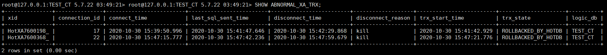

[]{# _Toc60015816 .anchor}disconnect_ reason: reasons for disconnection, such as kill, TCP disconnection (program err:java.io.IOException: Connection reset by peer), SQL execution timeout (stream closed, read return -1), idle timeout, etc.

trx_ state: the transaction status of disconnection, including:

1. ROLLBACKED_BY_HOTDB: in a transaction and the transaction is rolled back by the compute node (when the transaction is not commited automatically, the application program does not issue the commit command or lose the commit command halfway);

2. COMMITED_BY_HOTDB: in a transaction and the transaction is commited by the compute node (when the transaction is not commited automatically, the compute node receives a commit and commits it successfully, but the front-end connection is disconnected in the middle of commit, so the compute node fails to send ok package).

#### Relation between XA transaction and read/write splitting

Under XA mode, when start Read/write splitting: only read request of single node in non-transaction is splittable, and Mode 3 degrades to Mode 2;

Under XA mode, when start Read/write splitting: it can't guarantee accuracy of isolation level but could guarantee no loss of data, and no occurrence of partial Commit/partial Rollback;

Meanwhile, at the time of use, compute node log will output relevant Warning prompt.

### Nondeterministic Function Proxy

The Non-Deterministic Function will bring some column problems in use, especially data consistency problem of Global Table, therefore, HotDB Server provides the function of Nondeterministic Function Proxy. Non-Deterministic Function is generally divided into types, one is Time Function with known value, such as CURDATE(), CURRENT_TIMESTAMP(), etc., the other is Random Value Function and Unique Value Function with unknown value, such as RAND(), UUID(), etc.

1. For Time Function, compute node makes Uniform Proxy.

-   When the Table Field type is datetime (or timestamp) and free of default value, the parameter [timestampProxy](#timestampproxy) will control Proxy Range of the compute node (Auto Mode by default, and Global Processing/Auto Detection are optional), and insert such Function Proxy as specific value into Table;

-   In case the Functions such as curdate(), curtime(), etc. appear in select/insert/update/delete statement, compute node will insert such Function Proxy as specific value into Table;

2. For Random Value Function, compute node conducts different Proxy methods toward different SQL statements.

3. For Unique Value Function, compute node makes Uniform Proxy.

-   In case uuid() or uuid_short() appear in select/insert/update/delete statement, compute node will make Proxy Unique Value according to standard UUIDv1 algorithm;

-   In case of server_id conflict between data source and configDB, compute node will Auto Disable uuid_short() and inform the user of adjusting the server_id manually. You can refer to description in official website of MySQL:\
    <https://dev.mysql.com/doc/refman/5.7/en/replication-options.html>.

### Global Time Zone Support

In order to guarantee data accuracy, for different time zones are set due to existence of different data source servers, and thus resulting in data error of the time type in database, HotDB Server provided support for Global Time Zone, including:

-   When the time_zone parameters are specific same value or for SYSTEM the system_time_zone are all the same specific value, HotDB Server makes no special treatment, otherwise, HotDB Server will set the time_zone as uniform fixed value: "+8:00" and will record warning level log (The datasources' time_zones are not consistent);

> For example, after login service port, enter the command:

set time_zone = '+0:00';

show variables like '%time_zone';

> It will still display that the time_zone is '+8:00':

mysql> set time_zone='+0:00';

mysql> show variables like '%time_zone';

+------------------+--------+

| Variable_name | Value |

+------------------+--------+

| system_time_zone | CST |

| time_zone | +08:00 |

+------------------+--------+

2 rows in set (0.09 sec)

-   At the time of Backup and Recovery, HotDB Server could guarantee that the time type data after recovery is consistent with that before backup.

### Global Unique Constraint

If start Global Unique Constraint function, HotDB Server could guarantee that the column with Unique Constraint (UNIQUE, PRIMARY KEY) is unique in all nodes, including but not limited to the following scenarios:

-   Unique Constraint Key is not sharding key or doesn't include sharding key

-   Under Parent/Child Table, associate field of Child Table and Parent Table is not the same column with Unique Constraint Key of Child Table

HotDB Server 2.5.3 optimizes and accurate Global Unique Constraint to Table Level, and Global Unique Constraint is disabled for all tables added in the future by default, or Global Unique Constraint could be separately disabled / enabled for some tables manually when Add Table.

You could either modify the following parameter in server.xml or modify the parameter in compute node parameter configuration on the management platform. Modify parameter only sets Global unique default value for the table added in the future, but doesn't influence Global Uniqueness of history data table.

<property name=[globalUniqueConstraint](#globalUniqueConstraint)>false</property><!-- Global unique constraints enable on newly added table by default or not -->

Notice: After enable the function, there may be great influence on execution efficiency of INSERT, UPDATE and DELETE of SQL statements, and may result in increasing delay of SQL operation; it may also increase the circumstance of Lock Wait and Deadlock. Please make the choice upon careful consideration.

#### Table level control when creating a table

At the time of Add Table Configuration, it could Enable/Disable Global Unique Constraint separately for a table

1. When Add Table Configuration on the management platform, Enable/Disable status of Global Unique Constraint will be displayed by default according to compute node parameter, which could also be manually modified:

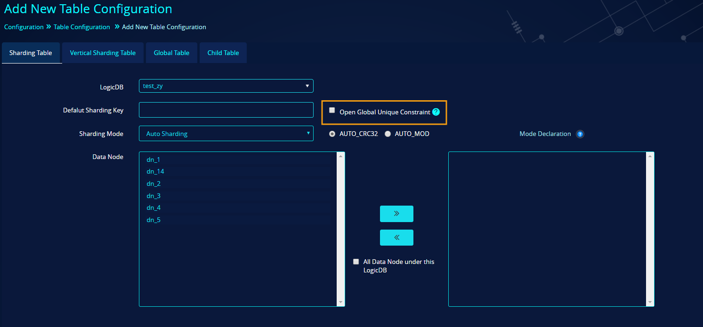

Both Vertical Sharding Table and Global Table have no such exit, because no special treatment is required for Unique Constraint. After Add Table and Configuration, it could be used after using Create Table statement to Add Table Structure.

2. Using [Auto Create Table](#_建表即分片) function, the switch of Global Unique Constraint could be set via table option GLOBAL_UNIQUE [=] {0 | 1}. For example:

mysql> create table test02(id not null auto_increment Primary Key,a char(8),b decimal(4,2),c int) **GLOBAL_UNIQUE=0**;

mysql> create table test03(id int Primary Key,id1 int) **GLOBAL_UNIQUE =1**;

If not using GLOBAL_UNIQUE [=] {0 | 1}, then by default, it will be set Enable or Disable according to default value of the compute node parameter configuration or the Table Configuration added on the management platform; if GLOBAL_UNIQUE=1, it shall be judged as Enable; if GLOBAL_UNIQUE=0, it shall be judged as Disable.

-   If GLOBAL_UNIQUE setting is different from the default value, then GLOBAL_UNIQUE shall prevail;

-   If GLOBAL_UNIQUE setting is different from Global Unique Constraint configuration of this table on the Management Platform, then Create Table will fail, and error prompt will be given, for example when Add test01 on the management platform, Global Unique Constraint is disabled:

mysql> create table test01(id int)global_unique=1;

ERROR 10172 (HY000): CREATE TABLE FAILED due to generated table config already in HotDB config datasource. You may need to check config datasource or reload HotDB config.

-   If using GLOBAL_UNIQUE in Create Table statement in Vertical Sharding Table or Global Table, then Create Table will succeed, but warning message will be given, because no extra treatment is required for its Unique Constraint, for example, test03 is a Vertical Sharding Table:

mysql> create table test03(id int)**global_unique=1**;

Query OK, 0 rows affected, 2 warnings (0.09 sec)

Warning (Code 10032): Create table without Primary Key and unique key

Note (Code 10210): Global_unique is not applicable to vertical-sharding tables or global tables.

In order to meet compatibility of MySQL, for example, when using mysqldump, there is no worry about that the backup results will be interfered by GLOBAL_UNIQUE, therefore, GLOBAL_UNIQUE syntax is parsed as Annotation Format, for example:

mysql> create table test02(id int) GLOBAL_UNIQUE=1;

mysql> show create table test02

+-------+----------------------------------------+

| Table | Create Table |

+-------+----------------------------------------+

| test3 | CREATE TABLE `test3` (

`id` int(11) DEFAULT NULL

) ENGINE=InnoDB DEFAULT CHARSET=utf8mb4**/*hotdb:020503 global_unique=1*/** |

+-------+----------------------------------------+

1 row in set (0.00 sec)

Importing the Create Table statement containing GLOBAL_UNIQUE Syntax into MySQL will have no influence on the result. In compute node, Annotation Syntax could also be directly used to operate GLOBAL_UNIQUE, and use -c as login parameter of MySQL, and annotation is allowed to be executed.

root> mysql -c -uroot -proot -h127.0.0.1 -P3323

For example, executing the following statement, means that when the version of HotDB Server is higher than 2.5.3, GLOBAL_UNIQUE=0 will be executed:

mysql> create table test02(id not null auto_increment Primary Key,a char(8),b decimal(4,2),c int) /*hotdb:020503 GLOBAL_UNIQUE=0*/;

#### Table level control when modifying a table

1. Table Configuration could be modified on Table Configuration Management page on the Management Platform:

If the Table Structure is Created Table, then after Modify the Global Unique Constraint to Enable status, click Reload and refresh the page, if the prompt as in the figure below appears, it means that unique @@create shall be executed on management port, and check history data of the Unique Constraint Key of the table, and after the return result is unique, the compute node will Auto Create secondary index, only in this way could Global Unique Constraint take effect, for details of this command, please refer to *Distributed Transactional Database HotDB Server [management port Command] Function Manual*:

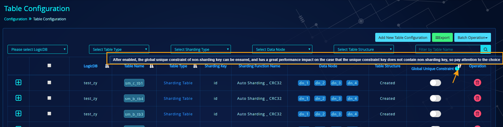

2. Use GLOBAL_UNIQUE Syntax in the compute node via ALTER TABLE, enable Global Unique, and similarly, if appearing warning message, it means that it could take effect only after executing unique @@create:

mysql> alter table keevey01 global_unique=1;

Query OK, 0 rows affected, 1 warning (0.01 sec)

mysql> show warnings;

+-------+-------+---------------------------------------------------------+

| Level | Code | Message |

+-------+-------+---------------------------------------------------------+

| Note | 10210 | please go to HotDB Server manager port and execute this command: unique @@create, otherwise this global_unique setting doesn't work. |

+-------+-------+---------------------------------------------------------+

1 row in set (0.00 sec)

#### Online Change of Sharding Plan

At the time of Online Change of Sharding Plan, you could also Enable or Disable Global Unique Constraint manually for the table after change.

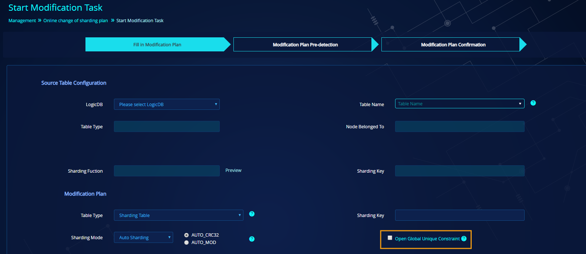

After Enable, the Modification Plan Pre-detection will detect whether history data of Unique Constraint Key of the table is unique or not, if yes, then Test Passed.

#### Locate by secondary index when querying

This function also supports that when the SELECT Query statement doesn't contain sharding key but contains Unique Constraint field, locate to fixed node via Query Secondary Index, and distribute SELECT Query statement to specified node only instead of all nodes.

<property name=[routeByRelativeCol](#routeByRelativeCol)>false</property><!--When not containing sharding key, via Secondary Index Field Route-->

This function is Disable by default, which could be enabled by modifying the routeByRelativeCol parameter in server.xml or adding the parameter "When not containing sharding key, enable via Secondary Index Field Route or not" in compute node parameter configuration under Management Platform Configuration Menu.

After the parameter is enabled, example of its role is as follow: for an existing Sharding Table table01, sharding key is id, sharding function is auto_mod, when executing the following Query statement:

SELECT * FROM table01 WHERE unique_col = 100; //unique_col is Unique Constraint column

This Query statement will be distributed to the data node with unique_col = 100 only, instead of all data nodes

### Data accuracy guarantee after failover

Whether Asynchronous Replication or Semi-synchronization Replication, there may be such a circumstance as follow: after failover completed, the original Active Master will recover, the new Active Master (the original Standby Slave ) Replication IO Thread may Auto Reconnect and acquire the transaction not acquired before Switch, which such transaction has been deemed as transaction failing to be committed during the processing process of Switch, and can't continue to be replicated, otherwise, there will be risk of messy data.

Therefore, compute node parameter [failoverAutoresetslave](#failoverautoresetslave) is added, which is Disable by default.

<property name=[failoverAutoresetslave](#failoverAutoresetslave)>false</property><!-- At the time of failover, Auto Reset master/slave replication relation or not -->

After failover, IO thread between the original Master/Slave will be suspended, and Heartbeat Detection of the original Active Master will be conducted once every minute, until the original Active Master recovers normal. After the original Active Master recovers normal, comparing with binlog position of the original Active Master, detect whether the original Standby Slave (the existing Active Master) has the transaction not acquired before Switch, if yes, enable this parameter will Auto Reset the master/slave replication relation. If not, there will be no treatment after Re-enable the IO Thread.

**Notice:**

-   The precondition for detecting whether there is transaction not received or not is that both the Active Master and Standby Slave need to enable GTID, otherwise, when this parameter is enabled, there will be Auto Reset of master/slave replication relation after failover completed.

-   If at the time of Heartbeat Detection, the original Active Master is still in Unavailable state after more than 10080 times of Retry, at this time, parameter is in Enable status, and there will also be Auto Reset of master/slave replication relation.

-   For example, after Auto Reset of replication relation, warning log recorded by compute node at warning level will be as follow:

you should decide whether to manually execute the unexecuted part of binlog or rebuild the replication according to the actual situation.

> And the Master/Slave Status in the management platform will display Abnormal, and the Pre-click display is as the prompt message in the figure:

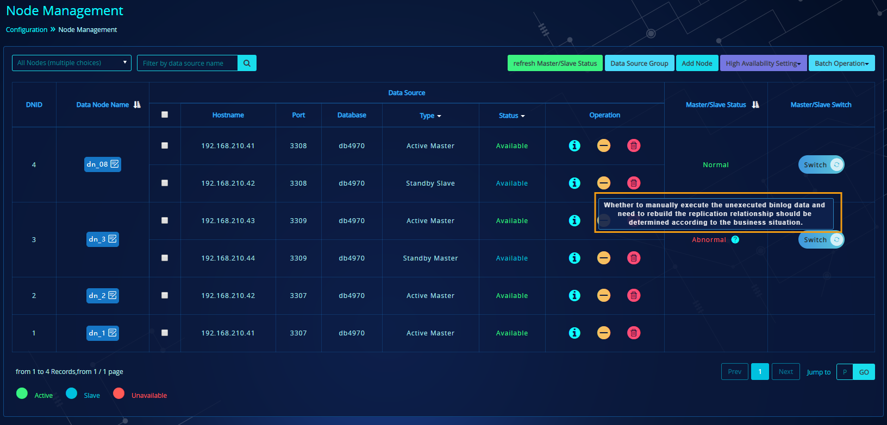

-   If after failover completed, the Master Active and Standby Slave neither Switch GTID or have transaction not received, but this parameter is disabled, then the compute node will also record warning log at warning level as follow:

DBA is required to deal with the new master, which is the original slave before switching and decide whether to stop replication or continue replication regardless. In addition, there is risk of data error caused by automatic reconnection of replication after manual or unexpected restart of the new master.

## High availability service

This chapter mainly describes the high availability service of the computing node cluster in the single-IDC mode. To understand the high availability service in the DR mode, please refer to the [Distributed Transactional Database HotDB Server - Cross-IDC Disaster Recovery Function Specification](../Distributed%20Transactional%20Database%20HotDB%20Server%20-%20Cross-IDC%20Disaster%20Recovery%20Function%20Specification.docx).

### High availability service

HotDB Server provides MySQL high availability in data node, when the Master data source is Unavailable, compute node will switch to slave data source automatically.

If to use high availability of data node, the following preconditions shall be met:

-   Rules for configuration of master/slave data source and failover priority in data node;

-   Master/slave data source must have been configured master/slave or standby master replication relation;

-   Enable Heartbeat function in compute node Config File.

#### High availability of data node

For master/slave configuration mode of MySQL database, please refer to official website of MySQL (pay attention to official document of corresponding version, for example: <http://dev.mysql.com/doc/refman/5.6/en/replication.html>)

By default, compute node Heartbeat function is enabled:

<property name="enableHeartbeat">true</property>

Assuming that instance 3308 of 192.168.210.41 and instance 3308 of 192.168.210.42 are a pair of MySQL databases of master/slave replication.

The master/slave data source configured in the same node, could be set in "Add Node" page or "Data Source Edit" page on the management platform.

Assuming that the data node "dn_08" has already existed, Add Master data source and slave data source for this node. On management platform page, select "Configuration"->"Node Management"->"Add Node", and jump to the "Add Node" page:

In the following operation, generate a data node "dn_08", and add a Master data source"ds_failover_master" and a slave data source"ds_failover_slave" for this data node:

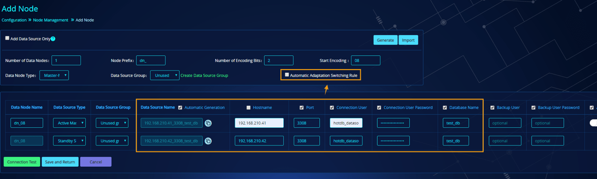

"Automatic Adaptation Switching Rule" could be directly checked, when Add Node, make Automatic Adaptation of failover priority at the same time. Or, on the management platform page, select "Configuration"->"Node Management"->"High Availability Setting"->"Switching Rule"->"Add Switch Rule", select "dn_08" from drop-down box of data node, select Master data source "ds_failover_master from drop-down box of data source, select "ds_failover_slave" from drop-down box of standby data source, and select High in Failover Priority:

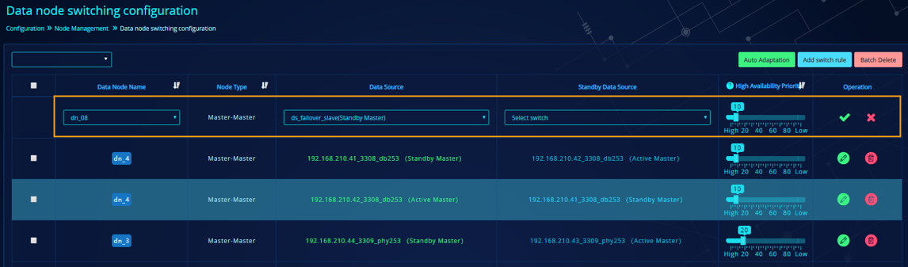

Or click "Auto Adaptation", select dn_08 node, and then Save.

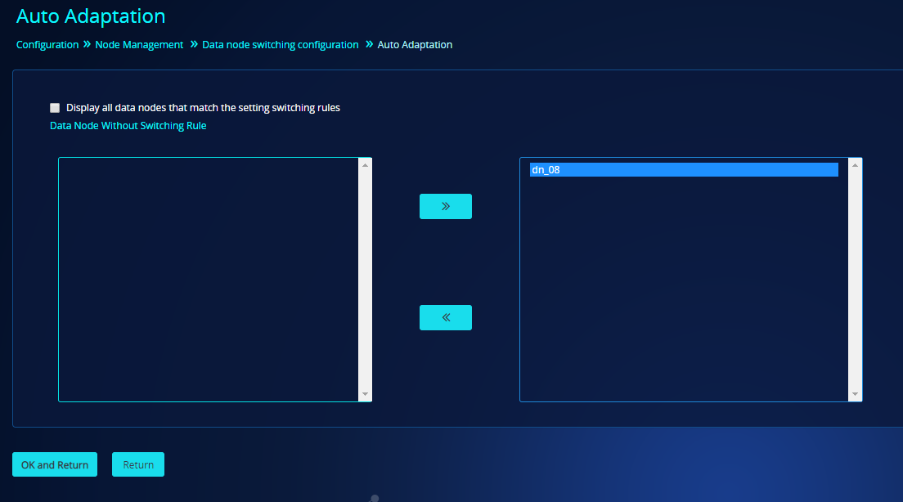

Build master/slave replication relation:

Although a pair of master/slave data sources have been added under node dn_08, if the 2 data sources haven't been built master/slave replication relation in practice, then at this time, you could select "dn_08" node in "Configuration"->"Node Management"->"High Availability Setting"->"Master/Slave Build".

After clicking "Start Build", the system will build master/slave replication relation for the data source automatically. After Build succeeded, the Master/Slave status is the list will display normally:

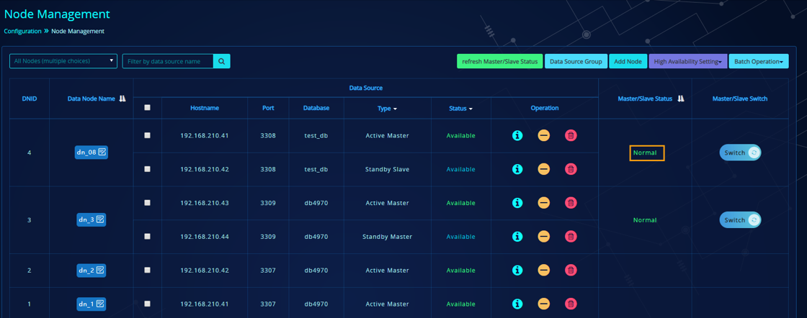

##### Manual Switch

In "Configuration"->"Node Management", click [Switch] of a data node, thus Manual Switch could be completed:

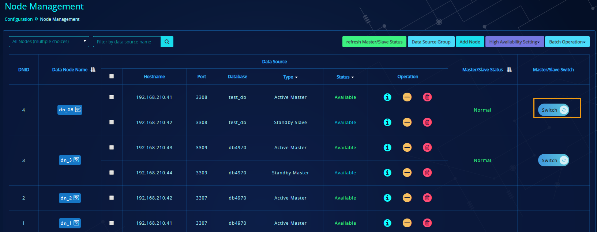

Description:

-   If being Master - Slave, select the data source with highest priority for Switch, and after Switch, the compute node will set the original master and the other Slaves of the original master as Unavailable, which can no longer be switched.

-   If being standby master, after Switch, the Active Master will not be set as Unavailable, and you can switch back and forth.

-   If the Standby Slave with the highest-priority is Unavailable or delays for more than 10s, select the one with higher priority from the remaining Standby Slaves for Switch, if they are all Unavailable or delay for more than 10s, there shall be no Switch, and will be error prompt (Switch Failure Log will prompt: switch datasource datasourceid failed due to:no available backup found)

-   In V2.5.6 and above, in the case of manual switching, it will check first whether the current table hotdb_datanode/hotdb_datasource/hotdb_failover is consistent with the running table. If they are not consistent, it will prompt: "Unable to switch because the the configuration of the current data source is inconsistent with the configuration in memory. Please try again after reloading." If they are consistent, the taken data source will be updated to the master before new data source taking over, and the original master data source will be updated to the standby master or slave. (Note: if it is master/slave relation, the original master data source and its related slave nodes will be cascaded to be unavailable; the original replication relations will be cleaned up synchronously during the switching; the failover rules of the original master data source and the original slave data source will be exchanged, waiting for the manual offline reconstruction of replication relations.

-   After Switch succeeded, the compute node will record switch process log:

INFO [pool-1-thread-1064] (SwitchDataSource.java:78) -received switch datasourceid command from Manager : [Connection Information]

WARN [pool-1-thread-1339] (BackendDataNode.java:263) -datanode id switch datasource:id to datasource:id in failover. due to: Manual Switch by User: username

INFO [pool-1-thread-1339] (SwitchDataSource.java:68) -switch datasource:id for datanode:id successfully by Manager.

-   In case of no Switching Rule configured, there will be no Switch, and will be the error prompt: switch datasource id failed due to:found no backup information)

##### Failover

Failover is generally the Auto Switch after data source failure, and the description is as follow:

-   Whether Standby Master or master/slave, after Failure and Switch of the Active Master, they will set the Active Master as Unavailable, which can no longer be switched. The Active Master needs to be recovered manually, and after the Active Master becomes normal, set the Active Master as Available manually, and the Active Master will be restored as available after Reload.

-   If the Standby Slave Status is Unavailable, there will be no Switch, and the compute node will record log

WARN [pool-1-thread-2614] datanode id failover failed due to found no available backup

-   In server.xml, you could configure the parameter waitForSlaveInFailover to control whether the Switch shall wait for the Standby Slave to catch up with replication. If the parameter is true by default, which means Waiting, then during Switch process, it will wait for the Standby Slave to catch up with replication. If set as false, which means Not Waiting, then it will Switch immediately. (There is a risk of data loss in the immediate switch, which is not recommended).

-   In V2.5.6 and above, in the case of failover, the taken over data source will be updated to the master before new data source taking over, and the original master data source will be updated to the standby master or slave. The original master data source and its related slave nodes will be cascaded to be unavailable. (Note: if it is master/slave relation, the original replication relations will be cleaned up synchronously during the switching; the failover rules of the original master data source and the original slave data source will be exchanged, waiting for the manual offline reconstruction of replication relations.

-   During Failover, Active Master Heartbeat is continuous. If Heartbeat succeed for two successive time, then give up Switch, and the compute node will record log

INFO [$NIOREACTOR-6-RW] (Heartbeat.java:502) -heartbeat continue success twice for datasource 5 192.168.200.52:3310/phy243_05, give up failover.

-   After Switch succeeded, the compute node will record log, and record the cause for Switch:

If being network failure, server down, power down, etc., then it will record: Network is unreachable

If the Network is reachable, MySQL service stops and is without response, then it will record: MySQL Service Stopped

If MySQL service is enabled, but the response is abnormal, then it will record: MySQL Service Exception

For example: when stopping the data source service, the whole Switch process is promoted as follow:

02/21 15:57:29.342 INFO [HeartbeatTimer] (BackendDataNode.java:396) -start failover for datanode:5

02/21 15:57:29.344 INFO [HeartbeatTimer] (BackendDataNode.java:405) -found candidate backup for datanode 5 :[id:9,nodeId:5 192.168.200.51:331001_3310_ms status:1] in failover, start checking slave status.

02/21 15:57:29.344 WARN [$NIOREACTOR-0-RW] (HeartbeatInitHandler.java:44) -datasoruce 5 192.168.200.52:331001_3310_ms init heartbeat failed due to:MySQL Error Packet{length=36,id=1}

02/21 15:57:29.344 INFO [pool-1-thread-1020] (CheckSlaveHandler.java:241) -slave_sql_running is Yes in :[id:9,nodeId:5 192.168.200.51:331001_3310_ms status:1] during failover of datanode 5

02/21 15:57:29.424 WARN [pool-1-thread-1066] (BackendDataNode.java:847) -datanode 5 switch datasource 5 to 9 in failover. due to: MySQL Service Stopped

02/21 15:57:29.429 WARN [pool-1-thread-1066] (Heartbeat.java:416) -datasource 5 192.168.200.52:331001_3310_ms heartbeat failed and will be no longer used.

-   In case of Switching Rule configured, there will be no Switch, and the compute node will record log：

WARN [pool-1-thread-177] (?:?) -datanode id failover failed due to found no backup information

-   After Failover of data source, whether Master/Slave or Standby Master, we have the uniform requirement that, the precondition for setting the data source as Available manually is that the operating personnel must be clear about that the existing master/slave service is free of abnormalities, the data synchronization is free of abnormalities, and especially for the master/slave mode, it must be guaranteed that the data at the time of Slave service during the period has been synchronized to the Master data source. When data source is enabled, we shall form the habit of not skipping the Master / Slave Consistency Detection.

#### ConfigDB High Availability

When the configDB and some data sources are deployed on the same MySQL instance or the same server, in case of failure with this instance, the failure information can't be recorded into the configDB, therefore, compute node supports the ConfigDB High Availability function, in order to guarantee normal use of configDB.

1. Configure connection information of master/slave configDB in server.xml, in order to guarantee normal master/slave relation

<property name="url">jdbc:mysql://192.168.200.191:3310/hotdb_config</property><!-- Master configDB address-->

<property name="username">hotdb_config</property><!-- Master configDB username -->

<property name="password">hotdb_config</property><!-- Master configDB password -->

<property name="bakUrl">jdbc:mysql://192.168.200.190:3310/hotdb_config</property><!-- Slave configDB address -->

<property name="bakUsername">hotdb_config</property><!-- Slave configDB username -->

<property name="bakPassword">hotdb_config</property><!-- Slave configDB password -->

-   In case of failure with the Master configDB, it will switch to the Slave configDB automatically. In case of delay in the Switch process, it will wait for the Slave configDB to catch up with replication.

-   When the compute node version is 2.5.6 or above, in case of failure with the Master configDB, the slave ConfigDB will be updated to the master before taking over, and the original master ConfigDB will be updated to the slave. Server.xml will be adjusted synchronously, as shown below:

<property name="url">jdbc:mysql://192.168.200.190:3310/hotdb_config</property><!-- Master configDB address -->

<property name="username">hotdb_config</property><!-- Master configDB username -->

<property name="password">hotdb_config</property><!-- Master configDB password -->

<property name="bakUrl">jdbc:mysql://192.168.200.191:3310/hotdb_config</property><!-- Slave configDB address -->

<property name="bakUsername">hotdb_config</property><!-- Slave configDB username -->

<property name="bakPassword">hotdb_config</property><!-- Slave configDB password -->

-   If Compute Node High Availability service involves master/slave relation of configDB, then it shall be guaranteed that configuration of a group of Compute Node High Availability master/slave configDB in server.xml is identical, and there shall be no staggered configuration.

2. configDB also supports MGR configDB at the same time (MySQL must be above the Version 5.7, configDB MGR only supports three nodes for the time being), in server.xml, configure configDB information with MGR relation, and guarantee that the MGR relation is normal. Under the condition where MGR relation is inaccurate, configDB may can't provide normal service, and may result in Startup Failure.

<property name="url">jdbc:mysql://192.168.210.22:3308/hotdb_config_test250</property><!-- configDB address -->

<property name="username">hotdb_config</property><!-- configDB username -->

<property name="password">hotdb_config</property><!-- configDB password -->

<property name="bakUrl">jdbc:mysql://192.168.210.23:3308/hotdb_config_test250</property><!-- Slave configDB address (if configDB uses MGR, this item must be configured) -->

<property name="bakUsername">hotdb_config</property><!-- Slave configDB username (if configDB uses MGR, this item must be configured) -->

<property name="bakPassword">hotdb_config</property><!-- Slave configDB password (if configDB uses MGR, this item must be configured) -->

<property name="configMGR">true</property><!-- Whether configDB uses MGR or not-->

<property name="bak1Url">jdbc:mysql://192.168.210.24:3308/hotdb_config_test250</property><!-- MGR configDB address (if configDB uses MGR, this item must be configured) -->

<property name="bak1Username">hotdb_config</property><!-- MGR configDB username (if configDB uses MGR, this item must be configured) -->

<property name="bak1Password">hotdb_config</property><!-- MGR configDB password (if configDB uses MGR, this item must be configured) -->

In case of failure with the Active Master, MGR configDB will re-select the Master Logic according to actual MySQL, and when new Active Master is selected, it will switch to new Master configDB timely.

#### Compute Node High Availability

HotDB Server supports High Availability Architecture Deployment, which utilizes the principle of keepalived high availability service to build master/slave service relation, and it could guarantee that after failure with the master compute node (that is Activecompute node) service, it will switch to the slave compute node (that is Standbycompute node), and in terms of the application layer, it could have access to the database service via VIP of Keepalived, in order to guarantee the service free of interruption.

##### Startup description

When start the master/slave compute node service under High Availability Architecture, attention shall be paid to the problem of startup sequence, and the following is the standard startup sequence:

1. Firstly, start the Keepalived on the server where the master compute node resides, and then start the master compute node:

View the compute node log:

2018-06-13 09:40:04.408 [INFO] [INIT] [Labor-3] j(-1) -- HotDB-Manager listening on 3325

2018-06-13 09:40:04.412 [INFO] [INIT] [Labor-3] j(-1) -- HotDB-Server listening on 3323

View the port listening status:

root> ss -npl | grep 3323

LISTEN 0 1000 *:3323 *:* users:(("java",12639,87))

root> ps -aux |grep hotdb

Warning: bad syntax, perhaps a bogus '-'? See /usr/share/doc/procps-3.2.8/FAQ

root 12639 60.7 34.0 4194112 2032134 ? Sl Jun04 7043:58 /usr/java/jdk1.7.0_80/bin/java -DHOTDB_HOME=/usr/local/hotdb-2.4/hotdb-server -classpath /usr/local/hotdb-2.4/hotdb-server/conf: ...省略更多... -Xdebug -Xrunjdwp:transport=dt_socket,address=8065,server=y,suspend=n -Djava.net.preferIPv4Stack=true cn.hotpu.hotdb.HotdbStartup

Using command"ip a", you could view whether Keepalived VIP of the existing master compute node has been successfully bound or not, for example in the following instance, 192.168.200.190 is the address of the server where master compute node resides; 192.168.200.140 is the configured VIP address

root> ip a

1: lo: <LOOPBACK,UP,LOWER_UP> mtu 65536 qdisc noqueue state UNKNOWN

link/loopback 00:00:00:00:00:00 brd 00:00:00:00:00:00

inet 127.0.0.1/8 scope host lo

inet6 ::1/128 scope host

valid_lft forever preferred_lft forever

2: eth1: <BROADCAST,MULTICAST,UP,LOWER_UP> mtu 1500 qdisc pfifo_fast state UNKNOWN qlen 1000

link/ether 00:1d:0f:14:8b:fa brd ff:ff:ff:ff:ff:ff

**inet 192.168.200.190/24** brd 192.168.200.255 scope global eth1

**inet 192.168.200.140/24** scope global secondary eth1:1

inet6 fe80::21d:ff:fe14:8bfa/64 scope link

valid_lft forever preferred_lft forever

-   Restart the Keepalived on the server where the slave compute node resides, and restart the slave compute node:

View the compute node log:

2018-06-04 18:14:32:321 [INFO] [INIT] [main] j(-1) -- Using nio network handler

2018-06-04 18:14:32:356 [INFO] [INIT] [main] j(-1) -- HotDB-Manager listening on 3325

2018-06-04 18:14:32:356 [INFO] [AUTHORITY] [checker] Z(-1) -- Thanks for choosing HotDB

View the port listening status:

root> ss -npl | grep 3325

LISTEN 0 1000 *:3325 *:* users:(("java",11603,83))

root> ps -aux |grep hotdb

Warning: bad syntax, perhaps a bogus '-'? See /usr/share/doc/procps-3.2.8/FAQ

root 11603 12.0 13.6 3788976 1086196 ? Sl Jun04 1389:44 /usr/java/jdk1.7.0_80/bin/java -DHOTDB_HOME=/usr/local/hotdb-2.4/hotdb-server -classpath /usr/local/hotdb-2.4/hotdb-server/conf: ...省略更多... -Xdebug -Xrunjdwp:transport=dt_socket,address=8065,server=y,suspend=n -Djava.net.preferIPv4Stack=true cn.hotpu.hotdb.HotdbStartup

##### Description of High Availability Switch

In case of failure with the server where master compute node resides (take 192.168.200.190 for instance), and the Detection Script (vrrp_scripts) detects that the service port of the master compute node is Unreachable or more than 3 consecutive hacheck failures, then the priority will be adjusted to 90 (weight-10).

After the keepalived on the server where the slave compute node resides (take 192.168.200.191 for instance) receives vrrp packet inferior to its own priority (the priority of 192.168.200.191 is 95), it will switch to the master status, and preempt the vip (take 192.168.200.140 for instance). Meanwhile, after entering the master status, it will execute the notify_master script, have access to management port of the compute node on 192.168.200.191 to execute online command, start and initialize the service port of the compute node on 192.168.200.191. If this compute node is enabled successfully, then Master/Slave Switch succeeded, and it will continue to provide service. Log of the compute node on 192.168.200.191 is as follow:

2018-06-12 21:54:45.128 [INFO] [INIT] [Labor-3] j(-1) -- HotDB-Server listening on 3323

2018-06-12 21:54:45.128 [INFO] [INIT] [Labor-3] j(-1) -- =============================================

2018-06-12 21:54:45.141 [INFO] [MANAGER] [Labor-4] q(-1) -- Failed to offline master Because mysql: [Warning] Using a password on the command line interface can be insecure.

ERROR 2003 (HY000): Can't connect to MySQL server on '192.168.200.190' (111)

2018-06-12 21:54:45.141 [INFO] [RESPONSE] [$NIOREACTOR-8-RW] af(-1) -- connection killed for HotDB backup startup

...More are omitted...

VIP of Keepalived has been on the 192.168.200.191 server already:

root> ip a

1: lo: <LOOPBACK,UP,LOWER_UP> mtu 65536 qdisc noqueue state UNKNOWN

link/loopback 00:00:00:00:00:00 brd 00:00:00:00:00:00

inet 127.0.0.1/8 scope host lo

inet6 ::1/128 scope host

valid_lft forever preferred_lft forever

2: eth0: <BROADCAST,MULTICAST,UP,LOWER_UP> mtu 1500 qdisc pfifo_fast state UP qlen 1000

link/ether 18:a9:05:1b:0f:a8 brd ff:ff:ff:ff:ff:ff

**inet 192.168.200.191/24** brd 192.168.200.255 scope global eth0

**inet 192.168.200.140/24** scope global secondary eth0:1

inet6 fe80::1aa9:5ff:fe1b:fa8/64 scope link

valid_lft forever preferred_lft forever

Note: For Manual Switch on the management platform, if Switch succeeded, it will modify the configuration in server.xml (haState、haNodeHost), interchange the Master/Slave information, while the configuration will not be modified in case of failover.

##### High Availability Rebuild

The compute node under Master/Slave mode mainly marks the Master/Slave role via the server.xml and keepalived.conf Config File. High Availability Switch shall only from Master role to Slave role, and after Failover or Manual Switch of the compute node, in order to guarantee smooth Failback in case of failure with the compute node next time, it needs to make configuration of the master/slave compute node accurate via the High Availability Rebuild.

For example, through this function it could be realized that: in case of failover with the master compute node (take 192.168.200.190 for instance), after switch to the slave compute node (take 192.168.200.191 for instance), by manual trigger of Compute Node High Availability Rebuild function, the compute node service and Master/Slave relation on the 192.168.200.190 server could be recovered, and in case of failure again with the compute node on the 192.168.200.191 server, it could failback to the 192.168.200.190 automatically. For details of High Availability Rebuild, please refer to *Distributed Transactional Database HotDB Server [Management Platform] Function Manual*.

#### Load-balancing of compute node

HotDB Server supports node autonomy of multiple compute node cluster. Hereinafter, the compute node in Primary status in the compute node cluster is referred to as Primary Compute Node; the compute node in Secondary status in the compute node cluster is referred to as Secondary Compute Node. Data service of both Primary and Secondary Compute Node is completely equivalent, and they both support all types of data operation and guarantee data consistency. After failure with one or more nodes in the cluster (not support failure with multiple compute nodes simultaneously), as long as there is one or more nodes available, the whole data service shall still be available.

HotDB Server supports load-balancing: you could select LVS and other means to distribute SQL request. The application client could have access to database service of HotDB Server via VIP of LVS, and at the same time, use transparency and service un-interruption are guaranteed. It could also use the remaining load-balancing plans for processing, for example F5 plus Custom Test; apply the mode of direct connection compute node, but replace node in case of abnormality, etc.

![9R8QD$VPCV%J$4_]YYIOGHX](media/image64.png)

##### Startup description

After environment deployment of compute node cluster succeeded, start the compute node:

# cd /usr/local/hotdb-2.5.0/hotdb-server/bin

# sh hotdb_server start

View start status of HotDB Server:

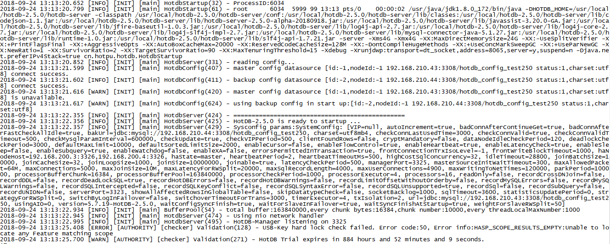

After compute node is enabled, it doesn't enable service port, and will set its role status as Started for the time being. After all compute nodes in the cluster start, one compute node of them will become Primary, while the remaining compute nodes will become Secondary, and all compute nodes have their data service port open, and then the whole cluster comes into normal running status, for example:

Primary node:

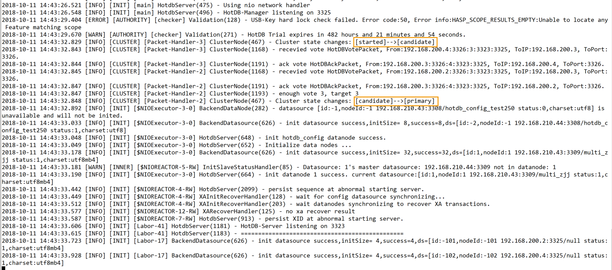

Secondary node:

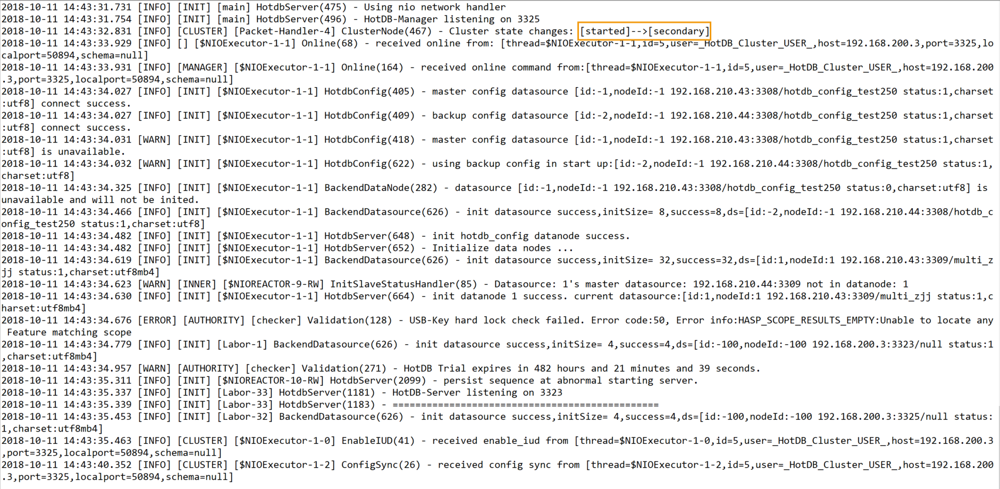

View management port 3325 status:

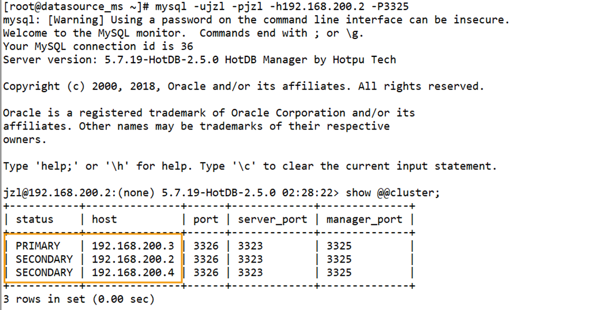

When Primary service is abnormal, one from the remaining Secondary will become the new Primary, and the original Primary will be kicked out of the cluster.

Original Primary:

# cd /usr/local/hotdb-2.5.0/hotdb-server/bin

# sh hotdb_server stop

New Primary:

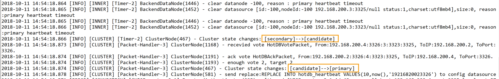

View management port status:

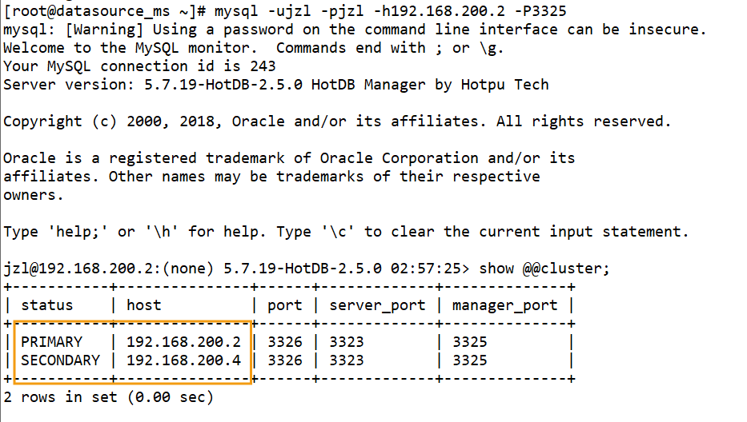

If the original Primary service restarts (equivalent to Add of new node), for the Primary node found to be enabled at present, new node will join the cluster to be Secondary.

Original Primary:

# cd /usr/local/hotdb-2.5.0/hotdb-server/bin

# sh hotdb_server start

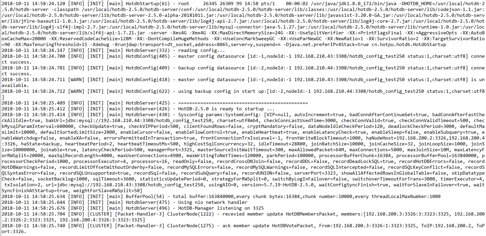

View management port status:

After multiple compute node cluster starts, by accessing to the database service via VIP, transparent load-balancing could be realized, and uninterrupted service could be guaranteed.

Notices for multiple compute node cluster:

1. When compute node cluster starts, the Primary is random, the compute node on the server where the Master configDB resides can't become Primary;

2. After a certain period, the compute node with failure will disable the service port independently to become Started status;

3. In case the Secondary finds that the Primary loses response and itself is not on the server where Master configDB resides, it will launch new Election, and will become the new Primary if receiving the majority votes;

4. Add new node, and the Primary will find join of the new Started node, and will Add the new node found; if the Primary finds that the Secondary loses response, it will kick out this node;

5. For cluster environment upgrade version, if the business is not influenced, it's recommended enabling after disabling the Cluster Upgrade;

6. For server.xml configuration of various nodes in the cluster, all parameters must be consistent except the cluster related parameters;

7. Time difference of various compute node servers shall be less than 1s;

8. It's required that network latency between compute node servers shall be less than 1s at any time;

9. It's recommended deploying only a set of multiple compute node cluster within a local-area network segment (It's just a suggestion, not a mandatory requirement. The reason for the suggestion is to reserve more space for future expansion);

10. configDB IP requires configuration of actual IP.

##### Linear expansion

In the multi-node cluster mode, if you want to achieve linear growth of performance throughput in the strong consistency (XA) mode with the expansion performance of the number of compute nodes, you can use HotDB Listener components.

###### Deployment of Listener

Please refer to the Distributed Transactional Database HotDB Server - [Installation & Deployment] Function Manual for the deployment of Listener components.

###### Use of Listener

These requirements must be met before using the Listener:

-   Compute node version is 2.5.5 and above

-   Multi-node cluster mode

-   XA mode is enabled

-   The parameter [enableListener](#enablelistener) is set to true in server.xml.

####### Add node configuration of Listener

After the Listener deployment is completed, the configuration of Listener can be introduced onto the data node page.

Take adding a group of data nodes with master-master type as an example:

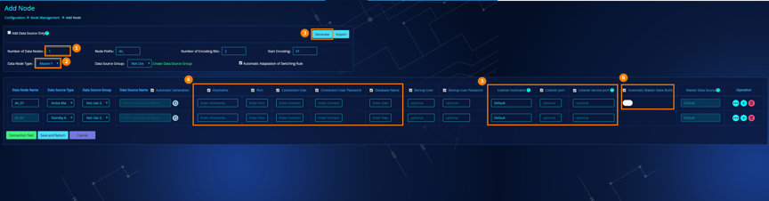

In steps 1-4, fill in the host name and port number of the data source, connection user and password, database, etc. according to the previous rules. If the group of data sources needs to bind Listener, fill in the Listener related information in step 5.

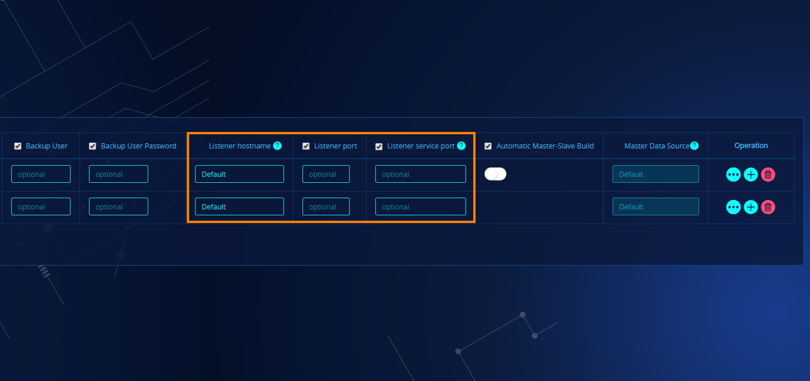

The rules are as follows:

-   Listener host name: "default" by default, no need to modify

-   Listening port: the start port of Listener. 3330 by default

-   Listener service port: the port where Listener provides services to HotDB Server. 4001 by default. If there are multiple MySQL instances on the same data source server that need to bind Listener, the service port needs to be unique.

After filling is achieved, click Connection Test, and click Save and Return after passing the test.

In dynamic loading, if the status on the node management list is , it means that the Listener can be connected; if the status is ，it means that the Listener cannot be connected. You should check whether enableXA is true and enableListener is true.

Verify whether the Listener service is enabled or not: execute show @@datasource on port 3325 to view.

####### Edit node configuration of Listener

This method is suitable for adding Listener configuration based on existing data nodes.

On the node management page, take dn_ 26 as an example:

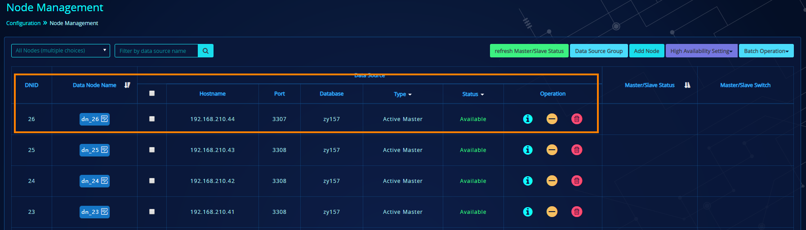

Click the icon *i* in the operation bar, i.e. information, to enter the data source management page.

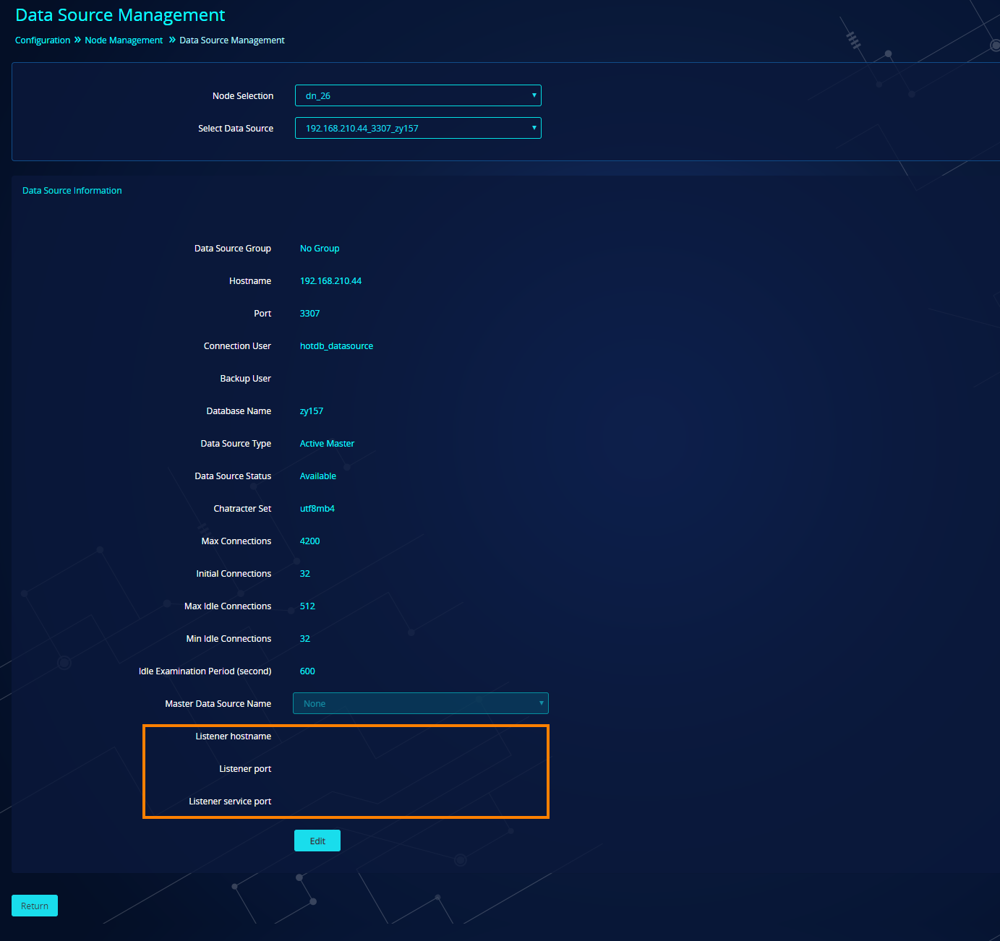

For a data source that is not bound to a Listener, the last three items are empty by default.

Click Edit to add information about the Listener.

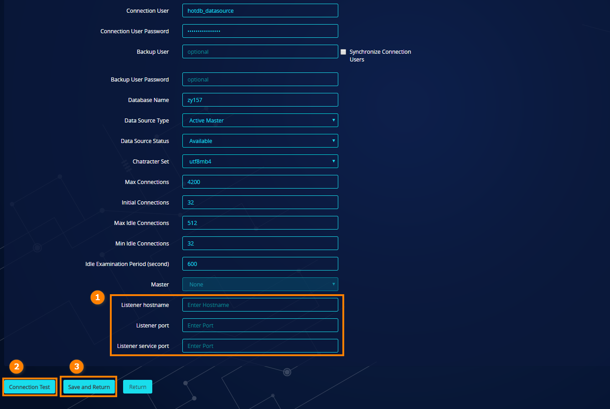

The rules are as follows:

-   Listener host name: "default" by default, no need to modify

-   Listener port: the start port of Listener. 3330 by default

-   Listener service port: the port where Listener provides services to HotDB Server. 4001 by default. If there are multiple MySQL instances on the same data source server that need to bind Listener, the service port needs to be unique.

After filling is achieved, click Connection Test, and click Save and Return after passing the test.

In dynamic loading, if the status on the node management list is , it means that the Listener can be connected; if the status is ，it means that the Listener cannot be connected. You should check whether enableXA is true and enableListener is true.

Verify whether the Listener service is enabled or not: execute show @@datasource on port 3325 to view.

###### Notes

1. Once deployed and correctly identified, the Listener is of no concern to users in the process of daily compute node operation;

2. Listener components should be installed on the same server as the data source;

3. If a Listener needs to listen to multiple data sources, different service ports need to be filled in;

4. When a certain data source is cancelled to be listened by Listener, the allocated Listener service port will always exist. The original data source can use the Listener service port to bind the Listener again.

5. When a certain data source is cancelled to be listened by Listener, the allocated Listener service port will always exist. At this time, if other data sources use the Listener service port, the Listener log will report an error: Port conflicts. Port already exists. Therefore, you need to restart Listener before you can use the Listener service port.

6. When the cluster needs to be restarted, it is recommended that the Listener components be restarted together. The restart sequence is: restart Listener first, and then restart the cluster, so that the cluster can recognize the Listener faster;

7. As a pluggable component, when Listener is not available, the cluster and data sources can still provide services.

#### Compute node auto scaling

In order to satisfy the demand for business development and application data growth, HotDB Server V2.5.6 supports the online expansion/reduction function of compute nodes, by manually adjusting the relevant parameters of the compute node server.xml and dynamically loading. For example, the single-node mode can be expanded to HA mode or cluster mode and the cluster mode can be reduced to HA mode or single-node mode.

##### Expasion of compute nodes

###### Parameter introduction

Parameters involved are as follows:

| Parameters | Instructions | Reference value | Whether the reloading is valid |
| --- | --- | --- | --- |
| haMode | High availability mode: 0: master and slave; 1: cluster | In cluster environment, the parameter value is 1 | yes |
| serverId | Cluster node number 1-N (number of nodes), unique in the cluster and N < = total number of nodes in the cluster | The serverID should start from 1 and should not be repeated continuously in the cluster | yes |
| clusterName | Cluster group name | HotDB-Cluster | yes |
| clusterSize | Total number of cluster nodes | The default value is 3, which is configured according to the actual number of nodes | yes |
| clusterNetwork | Network segment of cluster | 192.168.200.0/24, same network segment as cluster IP | yes |
| clusterHost | IP address of this node | 192.168.200.1, matched according to the specific IP | yes |
| clusterPort | Cluster communication port | 3326 by default | yes |

###### Expand from HA mode to multi-node mode

Expand from HA mode to multi-node mode is mainly about how to switch keepalived to LVS. This section mainly describes the expansion operation of HA to cluster. The information of components involved is as follows:

| Role | Connection information | Name |
| --- | --- | --- |
| Master compute node | 192.168.210.67_3323_3325 | HotDB_01 |
| Slave compute node | 192.168.210.68_3325 | HotDB_02 |
| LVS service | 192.168.210.136 | VIP:192.168.210.218 |
| New compute node | 192.168.210.134 | HotDB_03 |

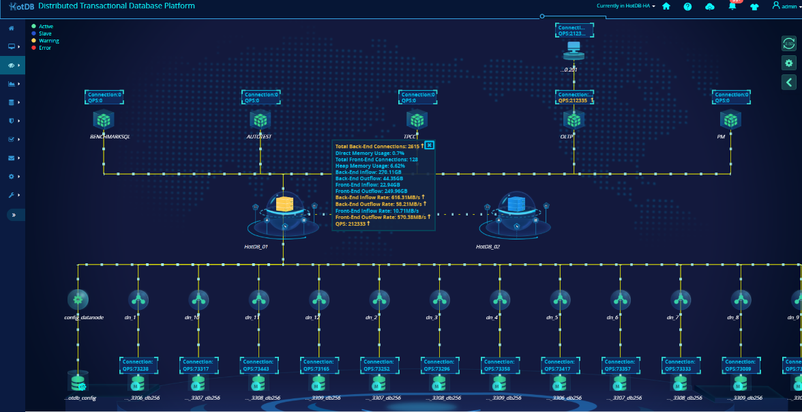

**Step 1: Disable standby compute node / standby keepalived service**

Disable keepalived and compute node service of HotDB_02

**Step 2: Deploy and enable LVS**

Taking single LVS service as an example, select 192.168.210.136 as LVS server, and 192.68.210.218 is used for VIP.

（1）Deploy LVS service on LVS server

cd /usr/local/hotdb/Install_Package

sh hotdbinstall_v*.sh --dry-run=no --install-lvs=master --lvs-vip-with-perfix=192.168.210.218/24 --lvs-port=3323 --lvs-virtual-router-id=44 --lvs-net-interface-name=eth0:1 --lvs-real-server-list=192.168.210.134:3323:3325,192.168.210.67:3323:3325,192.168.210.68:3323:3325 --ntpdate-server-ip=182.92.12.11

（2）Configure LVS service on compute node server （HotDB_01/HotDB_02/HotDB_03）

HotDB_01/HotDB_02/HotDB_03服务器分别执行脚本：

cd /usr/local/hotdb/Install_Package

sh hotdbinstall_v*.sh --dry-run=no --lvs-real-server-startup-type=service --lvs-vip-with-perfix=192.168.210.218/24 --install-ntpd=yes --ntpdate-server-host=182.92.12.11

（3）Enable LVS service on LVS server

service keepalived start

**Step 3: Adjust parameters and enable cluster service**

（1）server.xml of compute node（HotDB_01/HotDB_02/HotDB_03）is adjusted according to relevant [parameters](#parameter-introduction)，as in the following figure:

For HotDB_ 01 parameters, refer to the configuration of selected area:

For HotDB_ 02 parameters, refer to the configuration of selected area:

For HotDB_ 03 parameters, refer to the configuration of selected area:

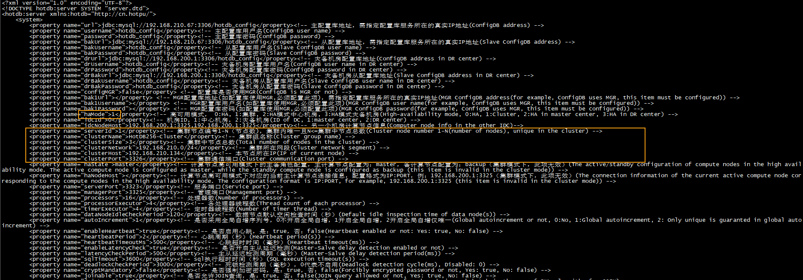

（2）Executes reload @@ config HotDB_ 01 at the management end of HotDB_01, and execute show @@cluster you can see HotDB_01 join the cluster as PRIMARY.

（3）Disable keepalived service of HotDB_01

service keepalived stop

\(4\) Start HotDB_02, HotDB_03, and then execute show @@cluster at the management end of HotDB_01; you can see that all cluster members have joined.

**Step 4: Adaptation adjustment of management platform**

The adaptation mode is the same as "[Expand compute nodes in cluster mode](#expand-compute-nodes-in-cluster-mode)". Edit the cluster of compute nodes to add new compute nodes and convert the HA mode to cluster mode, as shown in the following figure:

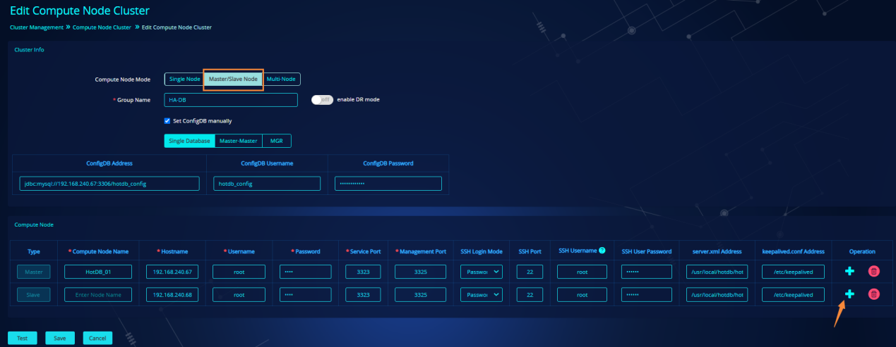

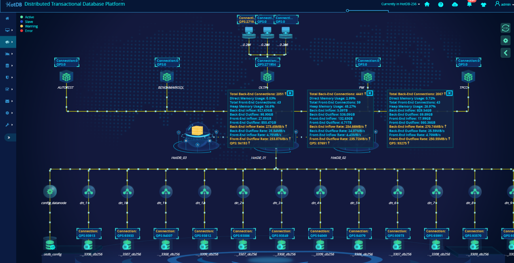

###### Expand compute nodes in cluster mode

This section mainly describes the operation of expanding compute nodes in cluster mode. The information of involved components is as follows:

| Role | Connection information | Name |
| --- | --- | --- |
| Master compute node | 192.168.210.157_3323_3325 | HotDB_01 |
| Slave compute node | 192.168.210.156_3323_3325 | HotDB_02 |
| Slave compute node | 192.168.210.155_3323_3325 | HotDB_03 |
| Master/slave LVS service | 192.168.210.135/137 | VIP:192.168.210.216 |
| New compute node | 192.168.210.134 | HotDB_04 |

**Step 1: add a new compute node to LVS server**

\(1\) Add virtual service of HotDB_04 to the master/slave LVS server.

ipvsadm -a -t 192.168.210.216:3323 -r 192.168.210.134

\(2\) Add the service info of HotDB_04 to keepalived.conf of the master/slave LVS, as shown in the following figure:

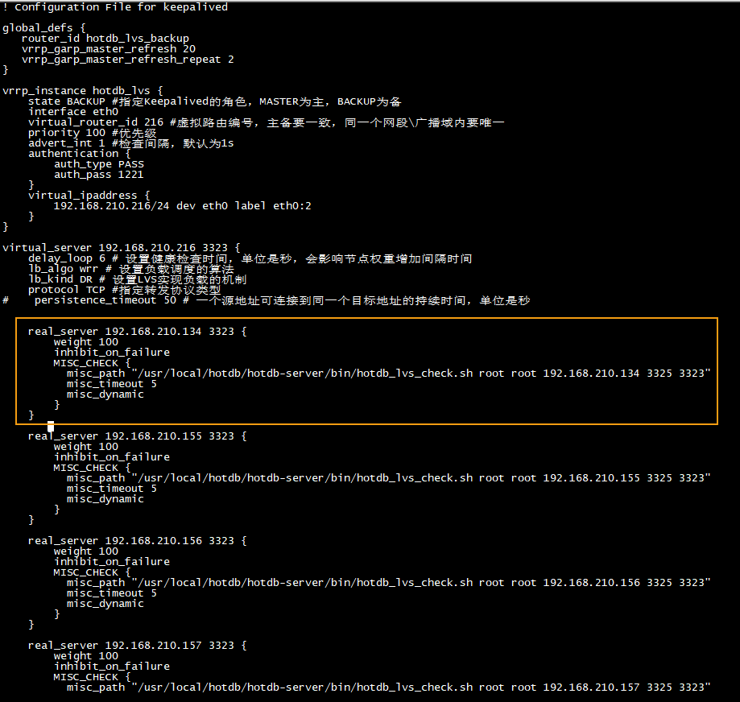

**Step 2: configure LVS for the new compute node server**

Execute deployment script and configure LVS at the HotDB_04 server:

cd /usr/local/hotdb/Install_Package/

sh hotdbinstall_v*.sh --dry-run=no --lvs-real-server-startup-type=service --lvs-vip-with-perfix=192.168.210.216/24 --install-ntpd=no --ntpdate-server-host=182.92.12.11

说明：--lvs-vip-with-perfix：当前集群的VIP

**Step 3: adjust parameters and start a new cluster member**

\(1\) Modify the value of ClusterSize in server.xml of all compute node servers（HotDB_01/HotDB_02/HotDB_03/HotDB_04）to ensure that the value of ClusterSize is equal to the actual number of cluster members (here is 4). Other parameters require no adjustment, but it should be noted that the values of clusterName, clusterSize, clusterNetwork, clusterPort are consistent in the same cluster.

\(2\) Adjust other cluster parameters in server.xml and start the service in the new compute node server (HotDB_04), as shown in the following figure:

**Step 4: Reload the configuration**

Execute reload @@config at the the management end of the primary compute node(HotDB_01), you can see HotDB_04 join the cluster:

**Step5: Adaption adjustment of management platform**

Enter the "Cluster management" -> "Compute node cluster" page to bring the newly added compute nodes into the management.

Edit the compute node cluster, and add the newly introduced compute nodes via the "+" button in the operation bar on the right side of the compute node. After saving, the management platform will automatically identify the compute node mode according to the number of compute nodes, as shown in the following figure:

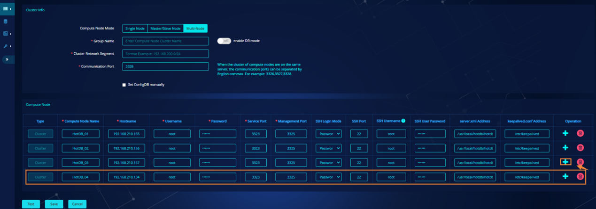

**Notes:**

-   If new compute nodes are added in the cluster, repeat the operation from the first step.

-   If the value of clusterSize and haMode of the compute node does not match the actual configured cluster, reload @@config in step 4 will fail, therefore it shall be ensured that the configuration be consistent with the actual situation.

-   The parameter serverId of new compute nodes should be unique and continuous with the original cluster, otherwise it will cause abnormal startup.

##### Reduction of compute nodes

The number of compute nodes can be reduced by compute node reduction function. After disabling the compute node, you can directly modify other multi-node-related configuration in the cluster. After reloading, the number of compute nodes can be reduced according to the new configuration.

###### Parameter introduction

Parameters involved are as follows:

+----------------+----------------------------------------------------------------------------------------------+-----------------------------------------------------------------------------------------------+------------------------------------+
| **Parameters** | **Instructions**                                                                             | **Reference value**                                                                           | **Whether the reloading is valid** |
+----------------+----------------------------------------------------------------------------------------------+-----------------------------------------------------------------------------------------------+------------------------------------+
| haMode         | High availibity：0：master/slave；1：cluster                                                 | In cluster environment, the parameter value is 1.                                             | Yes                                |
+----------------+----------------------------------------------------------------------------------------------+-----------------------------------------------------------------------------------------------+------------------------------------+
| HaState        | Master / slave role configuration in HA mode.                                                | Configuration of primary compute node: master, configuration of standby compute node: backup. | Yes                                |
+----------------+----------------------------------------------------------------------------------------------+-----------------------------------------------------------------------------------------------+------------------------------------+
| haNodeHost     | The connection information of the current active compute node in the high availability mode. | The configuration format is IP: PORT                                                          | Yes                                |
|                |                                                                                              |                                                                                               |                                    |
|                |                                                                                              | 192.168.200.1:3325                                                                            |                                    |
+----------------+----------------------------------------------------------------------------------------------+-----------------------------------------------------------------------------------------------+------------------------------------+

###### Reduce from cluster mode to HA mode

This section mainly describes the operation of reducing a cluster that normally provides services to HA mode. The components involved are consistent with the

[Eexpand from HA mode to multi-node mode.](\l)

**Step 1: disablethe standby compute node service**

Disable the compute node services of HotDB_ 02 and HotDB_ 03. This process will trigger cluster election. If there is a pressure measurement task at this time, it will flash off and return to normal in a few seconds.

**Step 2: deploy keepalived and adjust the compute node configuration**

（1）HotDB_ 01、HotDB_ 02 servers are respectively deployed with master and slave keepalived (the corresponding VIP can be the same with and VIP of LVS, but virtual_ router_ id cannot be the same)

**HotDB_01 server execution script**：

/usr/local/hotdb/Install_Package

sh hotdbinstall_v*.sh --dry-run=no --install-keepalived=master --keepalived-vip-with-prefix=192.168.210.218/24 --keepalived-virtual-router-id=218 --keepalived-net-interface-name=eth0:1 --ntpdate-server-host=182.92.12.11 --install-ntpd=yes

**HotDB_02 server execution script：**

cd /usr/local/hotdb/Install_Package

sh hotdbinstall_v*.sh --dry-run=no --install-keepalived=backup --keepalived-vip-with-prefix=192.168.210.218/24 --keepalived-virtual-router-id=218 --keepalived-net-interface-name=eth0:1 --ntpdate-server-host=182.92.12.11 --install-ntpd=yes

（2）Modify the configuration of keepalived.conf of HotDB_01、HotDB_02 servers，refer to the chapter 2.1.2.2 in the document Installation and Deployment

（3）Modify server.xml of HotDB_01、HotDB_02 compute nodes. Configure relevant parameters as HA mode，as in the following figure：

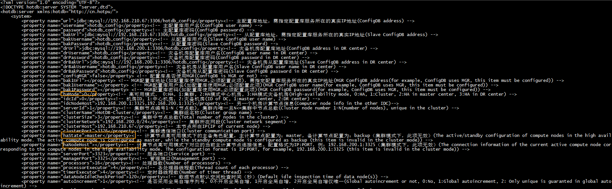

（4）Enable keepalived of HotDB_01，until the VIP of keepalived is mounted。

**（5）**Execute reload @@ config at managemtn end of HotDB_01 to make the remaining compute nodes become the master compute nodes in HA mode.

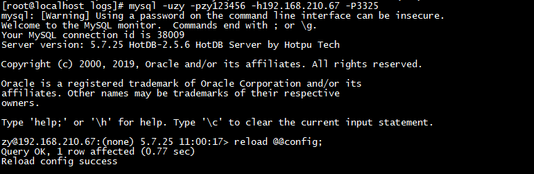

At this time, if there is a pressure measurement task, it will flash off and return to normal after a few seconds.

**Step 3: Disable LVS service on LVS server**

Disables LVS service on LVS server

systemctl stop keepalived.service

**Step 4: Clear LVS configuration of compute node server**

（1）HotDB_01、HotDB_02、HotDB_03 stop lvsrs

/etc/init.d/lvsrs stop

（2）HotDB_01、HotDB_02、HotDB_03 delete lvsrs

cd /etc/init.d

rm -rf lvsrs

**Step 5: Enable slave compute node and slave keepalived service.**

Enable HotDB_02 and keepalived service.

**Step 6: Adaptation adjustment of management platform**

The adaptation mode is the same as "[Expand compute nodes in cluster mode](#expand-compute-nodes-in-cluster-mode)". Edit the cluster of compute nodes to delete the reduced compute nodes and convert the cluster mode to HA mode, as shown in the following figure:

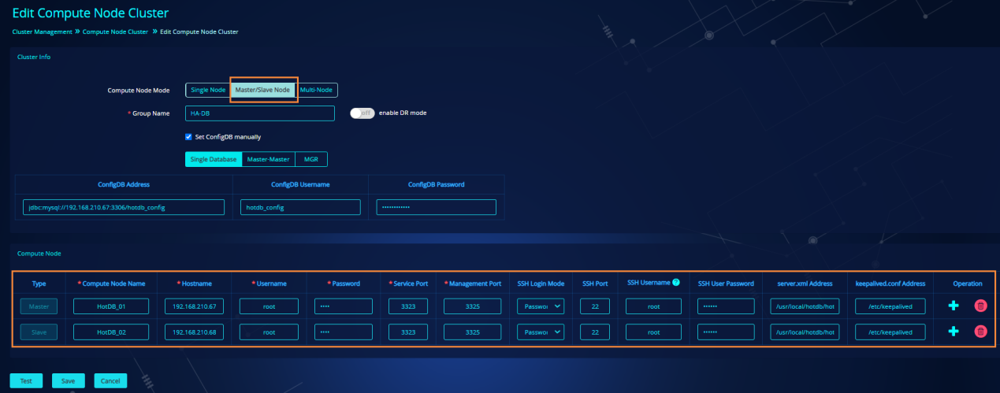

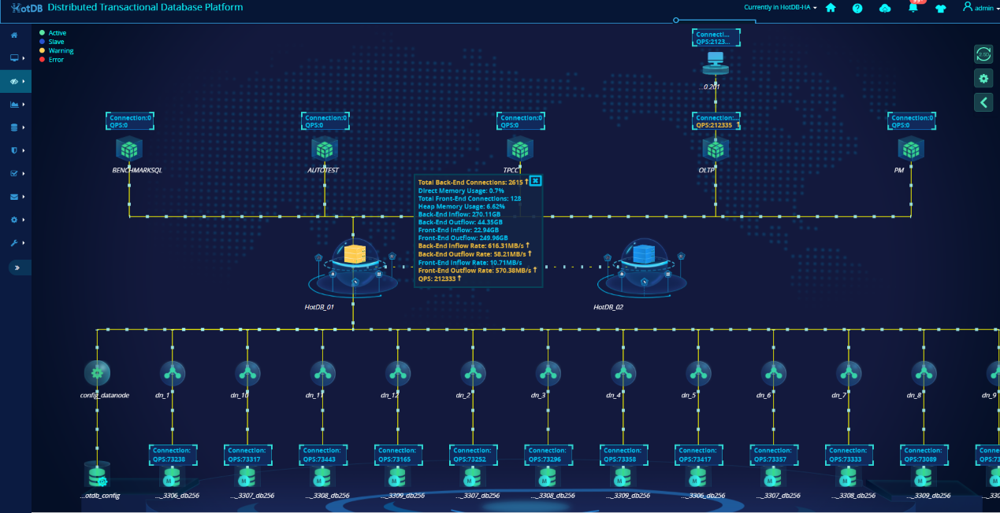

**Notes：**

If you want to perform online reduction of cluster compute nodes, you shall disable the compute nodes, and then reload before modifing the total number of cluster members and member serverId.

### Read/write splitting

HotDB Server supports Master/Slave Read/write splitting function of MySQL data source in data node

#### Description of Read/write splitting function

To use the Read/write splitting function, it needs to configure Master/Slave data source in the data node.

By default, Read/write splitting function is Disable in the compute node. To enable the Read/write splitting function, it needs to set property value of strategyForRWSplit bigger than 0 in Config Fileserver.xml of the compute node.

<property name=[strategyForRWSplit](#strategyForRWSplit)>1</property>

strategyForRWSplit is allowed to be set as 0, 1, 2, 3. If set as 0, the Read/Write operations are conducted in the Master data source.

-   When set as 1, the Master data source participates in the Read/Write, and the Slave participates in Read.

-   When set as 2, the Active Master in non-transaction only participates in Write, and the Slave only participates in Read.

-   When set as 3, then before write request, the Active Master in transaction only participates in Write, and the Slave only participates in Read, after Write occurs in transaction, all Read and Write in the transaction are sent to the Active Master.

Note: when HINT is not used for read-write splitting, the "separable read request" mainly refers to the auto committed read request and the read request in the explicit read-only transaction. The rest of the read requests are "inseparable read requests". For example, a read request in a non-auto-commit transaction.

In server.xml, it could configure max latency time, parameter name: maxLatencyForRWSplit, unit: ms of readable Standby Slave in Read/write splitting, when the actual master/slave latency time is longer than the latency time set, Read/write splitting will force to read data from the Active Master, and if shorter than the latency time set, it will read data according to the configured Read/write splitting strategy. The configured latency time is 1s by default, that is: when the data source data synchronization in the node has latency for more than 1s, then under the condition of enabling the Read/write splitting function, the compute node will not allow the Slave data source with data synchronization latency to participate in Read; if in data node, all Salve data sources have data latency, then at this time, the Read operation will be taken over by the Master data source, and only when there is no latency in data source data synchronization could the Slave data source participate in Read.

When Read/write splitting starts, even if the Heartbeat is not started, it will also force to make latency check. The Latency Check Period could be configured via the parameter latencyCheckPeriod in server.xml.

In the compute node, through [HINT](#hint) function, it could specify the data source type executed by SQL statement.

Specify that SQL statement shall execute the following in the Master data source:

/*!hotdb:rw=master*/select * from customer;

Specify that SQL statement shall execute the following in the Standby Slave data source:

/*!hotdb:rw=slave*/select * from customer;

#### Weight configuration of Read/write splitting

While supporting Read/write splitting, compute node could control the master/slave Read proportion via the configuration parameter in server.xml. Enter conf directory under installation directory of compute node, and edit server.xml, to modify the following related settings:

<property name=[strategyForRWSplit](#strategyForRWSplit)>1</property><!-- Read/write splitting strategy, only Active Master participates in Read/Write: 0; Active Master participates in Read/Write, the Slave participates in Read; 1:Active Master only participates in Write, the Slave participates in Read: 2: Splittable Read request is distributed to available Slave data sources; 3: Read request in transaction before Write is distributed to available Slave data sources; -->

<property name=[weightForSlaveRWSplit](#weightForSlaveRWSplit)>100</property><!-- the Slave Read proportion, 50 (percent) by default, and 0 means that the modified parameter is invalid -->

Description:

-   When the Read/write splitting strategy strategyForRWSplit is configured as 0, it only makes Read/Write on the Active Master, and the setting of weightForSlaveRWSplit Slave Read Proportion is meaningless;

-   When Read/write splitting strategy strategyForRWSplit is configured as 1, Active Master participates in Read/Write, the Slave participates in Read, and only in this way could weightForSlaveRWSplit have practical significance. Read proportion of Active Master is 100% ---percentage value of weightForSlaveRWSplit, and the remaining Slaves shares equal distribution of all proportions of weightForSlaveRWSplit setting, for example: if the weightForSlaveRWSplit value is set as 60%, and the existing node is of one-master and two-slave architecture, then the Master Read 40%, while the two Slave Read 30% respectively;

-   When Read/write splitting strategy strategyForRWSplit is configured as 2, Active Master only participates in Write, and the Slave participates in Read; all Slave share equal distribution of Read proportion, and for one-master and two-slave architecture, the Slave Read 50% each;

-   When Read/write splitting strategy strategyForRWSplit is configured as 3, for Read in transaction before Write, the Slave participates in Read, and the Active Master participates in Write; the Read operations in transaction after Write will be taken over by the Master data source; while the operations beyond the transaction are consistent with that in mode 2.

## Characteristic functions of HotDB Server

HotDB Server provides some expanded functions based on Distributed Transactional Database design, which are easy to use and manage.

### DNID

DNID is abbreviation of DATANODE_ID

On compute node, DNID could be used as filter condition in WHERE Clause, and as a Query item in SELECT statement; DNID (data node) of the results of each row could also be displayed in Result Set.

-   **Use DNID field in SELECT, UPDATE, DELETE Clauses**

SELECT * FROM customer WHERE dnid=1;

If executing this SELECT statement, compute node will return the data of the Sharding Table customer being 1 on DNID.

DELETE FROM customer WHERE dnid=1 AND id=3;

If executing this DELETE statement, compute node will delete data of Sharding Table customer with DNID being 1 and Field ID being 3.

UPDATE customer SET id=4 WHERE dnid=1 AND name='a';

If executing this DELETE statement, compute node will modify the data of Sharding Table customer with DNID being 1 and Field Name = 'a'.

-   **Use DNID as a Query item to execute SELECT statement**

SELECT *,dnid FROM tab_name;

If executing this SELECT statement, compute node will display dnid value of all results in the Result Set, and dnid must be placed behind *, otherwise, there will be Syntax Error.

-   **Show DNID in Result Set**

After log in the compute node, if executing the SET SHOW_DNID=1 statement, compute node will return DNID (data node ID) of results of each row in the SELECT statement.

mysql> set show_dnid=1;

Query OK, 0 rows affected (0.00 sec)

mysql> select * from customer where id in (77,67,52,20);

+----+---------+------------+------------+------------+------+-------------+------+

| id | name | telephone | provinceid | province | city | address | **DNID** |

+----+---------+------------+------------+------------+------+-------------+------+

| 52 | 马深圳 | 13912340052 | 7 | Guangdong | 深圳 | 某某街某某号 | 13 |

| 77 | 郝上海 | 13912340077 | 25 | Shanghai | 上海 | 某某街某某号 | 14 |

| 20 | 许重庆 | 13912340020 | 4 | Chongqing | 重庆 | 某某街某某号 | 12 |

| 67 | 岑南昌 | 13912340067 | 17 | Jiangxi | 南昌 | 某某街某某号 | 15 |

+----+---------+------------+------------+------------+------+-------------+------+

4 rows in set (0.00 sec)

The results in above figure show data rows with data node ID as 12, 13, 14, 15 respectively.

When executing SET SHOW_DNID=1 statement, and Query Global Table, compute node will return DNID (GLOBAL) of results of each row in the SELECT statement.

mysql> set show_dnid=1;

Query OK, 0 rows affected (0.00 sec)

mysql> select * from tb_quan;

+------+-----+-------+----------+

| id | a | b | **DNID** |

+------+-----+-------+----------+

| 1 | 1 | 1.10 | **GLOBAL** |

| 2 | 2 | 1.20 | **GLOBAL** |

| 3 | 3 | 1.30 | **GLOBAL** |

+------+-----+-------+----------+

SET SHOW_DNID=0, will cancel showing DNID column in Result Reset.

mysql> set show_dnid=0;

Query OK, 0 rows affected (0.00 sec)

mysql> select * from customer where id in (77,67,52,20);

+----+---------+------------+------------+------------+------+-------------+

| id | name | telephone | provinceid | province | city | address |

+----+---------+------------+------------+------------+------+-------------+

| 52 | 马深圳 | 13912340052 | 7 | Guangdong | 深圳 | 某某街某某号 |

| 77 | 郝上海 | 13912340077 | 25 | Shanghai | 上海 | 某某街某某号 |

| 20 | 许重庆 | 13912340020 | 4 | Chongqing | 重庆 | 某某街某某号 |

| 67 | 岑南昌 | 13912340067 | 17 | Jiangxi | 南昌 | 某某街某某号 |

+----+---------+------------+------------+------------+------+-------------+

4 rows in set (0.00 sec)

-   **Limit for DNID**

DNID Field is reserved field of the compute node, and it's forbidden from using DNID Field in Transaction Table, and using DNID as alias in SQL statement.

DNID is only applicable to simple single-table statements of SELECT, UPDATE, DELETE; besides, DNID could only serve as filer condition of WHERE Clause, and DNID Field can't be used in ORDER BY, GROUP BY, HAVING; similarly, it doesn't support using DNID in JOIN statement, UNION/UNION ALL, Subquery; DNID Field are forbidden from being used in Function and Expression.

### HINT

If using HINT Syntax on compute node, you can bypass the HotDB Server Parser, and execute arbitrary SQL statement of MySQL on specified data node directly. Compute node supports two modes of HINT Syntax:

-   **Use DNID (data node ID) in HINT:**

Syntax:

/*!hotdb:dnid = dnid_value*/ SQL to be executed

Note: the value of dnid_value is the ID of a data node. The user could specify the specific sharding node by replacing the value of dnid_value.

For example:

/*!hotdb:dnid = 1*/select * from customer where age > 20;

This statement will be executed on database node 1. The user could, via "Data Node" page on Distributed Transactional Database Management Platform, find the name of the data source with data node ID being 1, and search specified data source name of the "Data Node" page, thus the practical MySQL database could be located.

-   **Use DSID (data source ID) in HINT:**

HINT statement supports the specified datasource_id to skip the compute node and send the statement directly to the data source. You can view the data source datasource_ id through the service port command.

Syntax：SHOW [full] HOTDB ｛datasources｝ [LIKE 'pattern' | WHERE expr]

For example：

hotdb> show hotdb datasources where datasource_id like '22';

+-------------+---------------+---------------------------+-----------------+--------------

| DATANODE_ID | DATASOURCE_ID | DATASOURCE_NAME | DATASOURCE_TYPE | DATASOURCE_STATUS | HOST | PORT | SCHEMA | IDC_ID |

+-------------+---------------+---------------------------+-----------------+---------------

| 23 | 22 | 192.168.210.41_3308_hotdb157 | 1 | 1 | 192.168.210.41 | 3308 | hotdb157 | 1 |

-   Specify a specific datasource_id without writing binlog:

/*!hotdb:dsid=nobinlog:datasource_id*/SQL to be executed

Note: the value of datasource_id is the ID of a certain data source, and you can specify multiple nodes and separate them by English commas. This statement will not record the executed statements into binlogof data source. If it is not used properly, it may lead to the data inconsistency between the two masters and the disorder of GTID location. You should be careful when using it.

For Example:

Create the user hpt on the data source datasource_id=22 without writing binlog.

hotdb> /*!hotdb:dsid=nobinlog:22*/create user 'hpt'@'%' identified by '123456';

Query OK, 0 rows affected (0.00 sec)

Set parameters on the data source datasource_id=22.

hotdb> /*!hotdb:dsid=nobinlog:22*/set wait_timeout=1200;

Query OK, 0 rows affected (0.01 sec)

hotdb> /*!hotdb:dsid=nobinlog:22*/show variables like 'wait_timeout';

+---------------+-------+

| Variable_name | Value |

+---------------+-------+

| wait_timeout | 1200 |

+---------------+-------+

1 row in set (0.01 sec)

-   Specify all datasource_ids without writing binlog:

/*!hotdb:dsid=nobinlog:all*/SQL to be executed

Note: all refers to all data sources (including data sources in the DR center when the DR mode is enabled). This statement will not record the executed statements into binlog.

For example:

Update table 1 on all data sources without writing binlog:

/*!hotdb:dsid=nobinlog:all*/update table1 set name='hotdb' where id=100;

Set parameters on all data sources.

hotdb> /*!hotdb:dsid=nobinlog:all*/set wait_timeout=1200;

Query OK, 0 rows affected (0.00 sec)

hotdb> /*!hotdb:dsid=nobinlog:all*/show variables like 'wait_timeout';

+---------------+-------+

| Variable_name | Value |

+---------------+-------+

| wait_timeout | 1200 |

| wait_timeout | 1200 |

| wait_timeout | 1200 |

| wait_timeout | 1200 |

| wait_timeout | 1200 |

| wait_timeout | 1200 |

| wait_timeout | 1200 |

| wait_timeout | 1200 |

8 rows in set (0.00 sec)

-   Specify a specific datasource_id with writing binlog:

/*!hotdb:dsid=datasource_id*/SQL to be executed

Note: this statement will record the executed statements into binlog of the corresponding data source. When operating data sources with replication relations, care should be taken to avoid the master-slave replication synchronization exception.

-   Specify all datasource_ids with writing binlog：

/*!hotdb:dsid=all*/SQL to be executed

Note: all refers to all data sources (including data sources in the DR center when the DR mode is enabled). This statement will record the executed statements into binlog. For writing binlog may lead to replication exception of data sources with replication relations and disorder of GTID location. You should be careful when using it.

Note: if multiple data sources are distributed on the same instance, use of datasource_id in HINT needs to be executed by the specified data source.

-   **Use sharding key in HINT:**

Syntax:

/!hotdb:table = table_name:column_value*/ SQL to be executed

Note: table_name is the Table Name of a Sharding Table; column_value is a value of the Sharding Key in this table. The user could replace the table_name to specify corresponding Splitting Rule, and then via replacing the column_value, specify corresponding Sharding Node of using this Sharding Key.

For example:

/*!hotdb: table = customer:10001*/select * from customer where age > 20;

Use method:

Connect compute node (refer to [Log in compute node and start to use](#_登录HotDB Server并开始使用)), select the set LogicDB (`test`LogicDB is used here), and then execute specified statement by the above means (illustration is made here, and you could write SQL as needed in practical use).

Search customer table on sharding node with dn_id=2

mysql> /*!hotdb: dnid=2*/ select count(*) from customer;

+------------+

| count(*) |

+------------+

| 50 |

+------------+

1 row in set (0.00 sec)

Search the customer table with provinceid = 1 on sharding node

mysql> /*!hotdb: table=customer:1*/ select count(*) from customer;

+------------+

| count(*) |

+------------+

| 11 |

+------------+

1 row in set (0.00 sec)

**Note**: In terms of transaction layer, it's not recommended operating data source directly by HINT, because after using HINT, both the data and status will beyond control of the compute node. Besides, after using HINT operation, compute node will automatically perform the connection binding. Please follow the instructions after the connection binding.

### Connection binding

In order to prevent the connection pool from being contaminated, after using HINT operation, compute node will bind associated back-end connection of the LogicDB used by the existing HINT Quer (that is connection between compute node and data source), and all operations involving back-end are allowed within the bound connection range. Therefore, after using HINT, it's recommended rebuilding new front-end connection to guarantee that the new Session connection is in clean and stable status. If not rebuild connection, then after using HINT, when other operations involve new data nodes beyond back-end connection bound by the original LogicDB, then the back-end connection bound previous will fail, and the front-end connection will be rebuilt automatically.

In addition to HINT, the statements involving connection binding also include the following statements:

set [session] foreign_key_checks=0;

START TRANSACTION /*!40100 WITH CONSISTENT SNAPSHOT */

set [session] UNIQUE_CHECKS=0;

After the SQL with connection binding is executed, the compute node will output Warning and log prompt:

For example, when executing the following statement, there will be warning prompt:

mysql> use db_a

Database changed

mysql> /*!hotdb:dnid=all*/select * From tba;

+------+-----+

| id | a |

+------+-----+

| 1 | 1 |

| 2 | 2 |

| 3 | 3 |

| 4 | 4 |

| 5 | 5 |

+------+-----+

5 rows in set, 1 warning (0.01 sec)

Warning (Code 10041): The current session has been bound to the backend connection associated with the current LogicDB. It is recommended to rebuild the session after use.

Meanwhile, the following info information will be logged:

2019-04-01 19:11:29.662 [INFO] [CONNECTION] [$NIOEecutor-3-1] ServerConnection(1565) -- 31 has been bound to the backend connection:[2,1]

When operating new data node beyond bound back-end connection of the original LogicDB, SHOW WARNING will prompt as follow and the connection will be disconnected:

mysql> use db_b

Database changed

mysql> show warnings;

+-------+-------+----------------------------------------------------------------------------------------------------------------+

| Level | Code | Message

|

+-------+-------+----------------------------------------------------------------------------------------------------------------+

| Note | 10042 | The connection in current LogicDB was a binded connection, operations under current LogicDB may cause connect abort. |

+-------+-------+----------------------------------------------------------------------------------------------------------------+

1 row in set (0.00 sec)

mysql> select * from tbb;

ERROR 2013 (HY000): Lost connection to MySQL server during query

ERROR 2016 (HY000): MySQL server has gone away

No connection. Trying to reconnect...

Connection id: 63

Current database: db_b

When the HotDB Server version is 2.5.5 below, if LogicDB is not USEd, the compute node will bind all the back-end data sources connection by default, and other SQL statements after the connection binding statement will be distributed for execution, which may lead to modification or overwriting of the historical data of the original data soruce.

For example: log in to the service port, execute the connection binding statement without using the LogicDB:

set [session] foreign_key_checks=0;

Then directly execute

DROP TABLE IF EXISTS table_test;

At this time, the DROP statement will be directly distributed to all data sources for execution, and then the unrelated data will be deleted.

Therefore, when using the statement of connection binding, you need to pay extra attention: you need to use the LogicDB in advance for INSERT/REPLACE/UPDATE/DELETE/LOAD DATA/CREATE TABLE /ALTER TABLE/DROP TABLE/TRUNCATE TABLE/RENAME TABLE and other operations that will modify the data.

When HotDB Server version is 2.5.5 and above, this kind of scenario is further optimized to support the content parsing of connection binding.

In connection binding, whether the LogicDB is USEd or not, it is not allowed to execute SQL that may destroy the data source (please note that HINT itself does not restrict the following types of SQL):

CREATE|ALTER|DROP DATABASE, SET SESSION SQL_LOG_BIN|GTID_NEXT, SET GLOBAL, RESET MASTER|SLAVE, CHANGE MASTER, START|STOP SLAVE|GROUP_REPLICATION, CREATE|ALTER|DROP|RENAME USER|ROLE, GRANT, REVOKE, SET PASSWORD, SET DEFAULT ROLE, CLONE and other SQL types.

For example: execute binding connection statement before executing DROP TABLE:

set foreign_key_checks=0;

drop table if exists test1;

ERROR 1289 (HY000): Command 'drop table test1' is forbidden when sql don't use database with table or use multi database, because he current session has been bound to the backend connection.

When the LogicDB is not USEd, after executing the binding connection statement, you can execute SQL with LogicDB which is limited to be single: SELECT/INSERT/ REPLACE/UPDATE/DELETE/LOAD/CREATE TABLE/ALTER TABLE/DROP TABLE/TRUNCATE TABLE/RENAME TABLE/PREPARE/EXECUTE/DEALLOCATE/SET SESSION/SHOW etc.

For example: execute the binding connection statement before executing CREATE TABLE:

set foreign_key_checks=0;

Then directly execute

create table db_b.table_test (id int);

Query OK, 0 rows affected, 1 warning (0.18 sec)

### EXPLAIN

In compute node, EXPLAIN statement is used for showing route plan of SQL statement.

mysql> explain select id,name,telephone from customer;

+----------+------------------------------------------+

| DATANODE | SQL |

+----------+------------------------------------------+

| 1 | SELECT id, name, telephone FROM customer |

| 2 | SELECT id, name, telephone FROM customer |

| 3 | SELECT id, name, telephone FROM customer |

| 4 | SELECT id, name, telephone FROM customer |

| 5 | SELECT id, name, telephone FROM customer |

+----------+------------------------------------------+

5 rows in set (0.01 sec)

DATANODE column is data node ID, and as shown in the above results, this SQL statement will be executed on data node with ID being 1, 2, 3, 4, 5.

If to show execution plan of MySQL in EXPLAIN, you could combine the [HINT](#hint) function in compute node:

mysql> /*!hotdb:dnid=13*/explain select * from customer;

+----+-------------+----------+------+---------------+------+---------+-----+------+------+

| id | select_type | table | type | possible_keys | key | key_len | ref | rows | Extra |

+----+-------------+----------+------+---------------+------+---------+-----+------+------+

| 1 | SIMPLE | customer | NULL | NULL | NULL | NULL | NULL | 53 | NULL |

+----+-------------+----------+------+---------------+------+---------+-----+------+------+

1 row in set (0.00 sec)

**Limit for EXPLAIN**

EXPLAIN statement is only applicable to simple single-table statements of INSERT, SELECT, UPDATE, DELETE. It doesn't support EXPLAIN to show route plan of JOIN statement, UNION/UNION ALL, Subquery statement.

### OnlineDDL

SupportOnlineDDL function on [management port (3325)](#management-port-information-monitoring) of compute node, guarantees that the online Read/Write transaction will not be blocked at the time of Table Change, the database can still provide foreign access, and the specific use methods are as follow:

-   Log in 3325 management port, and onlineddl "[DDLSTATEMENT]" Syntax could be used to execute onlineddl statement, for example: onlineddl "alter table customer add column testddl varchar (20) default '测试onlineddl'";

-   Executing show @@onlineddl statement, it could show the current running OnlineDDL statement and execution speed of the statement, progress shows the current DDL execution progress (unit: %), speed shows the current DDL running speed (unit: row/ms), for example:

mysql> show @@onlineddl;

+--------------+-------------------------------------------------------------------------------+----------+---------+

| schema | onlineddl

| progress | speed |

+--------------+-------------------------------------------------------------------------------+----------+---------+

| TEST_DML_JWY | ALTER TABLE CUSTOMER ADD COLUMN TESTDDL VARCHAR(20) DEFAULT '测试ONLINEDDL' | 0.2300 | 23.3561 |

+--------------+-------------------------------------------------------------------------------+----------+---------+

Special description: execution of onlineddl statement doesn't mean completion of DDL, the return of "Query OK, 0 rows affected" only means that the DDL statement is executable, and if to see whether execution is completed, please view the progress showed in progress in show @@onlineddl. When the result of show @@onlineddl is null, it means that all DDL execution completed and there is no other DDL task at present, in case of midway DDL disconnection due to network or other abnormalities, it will roll back to the whole DDL;

### NDB Cluster SQL Node Service

The compute node below the version of V2.5.2 has incomplete support toward SQL statement in SELECT Query type, especially SQL of Subquery type, therefore, NDB Cluster SQL Node Service (hereinafter referred to as NDB SQL) is introduced. This service uses SQL node of NDB Cluster for compatibility of SQL not supported by the compute node, and to be used for completing relatively complex Query statement computation under distributed environment. If to know how to install and deploy NDB Cluster SQL Node Service, please refer to the chapter of NDB Cluster SQL Node Service Deployment in *Distributed Transactional Database HotDB Server [Install Deploy] Function Manual*.

#### NDB use restrictions

When NDB SQL mode starts, NDB SQL logic could be used only after meeting the following conditions simultaneously:

-   If Global Unique is not enabled, there must be Primary Key or Unique Key, and both the Primary Key and Unique Key must sharding key or Auto Increment;

-   When Global Unique is enabled, there must be Primary Key or Unique Key;

-   The Primary Key and Unique Key in the above two items must be Single Field Value type;

-   Execute the Query statement originally not supported by the compute node.

For the following SQL type statements, the compute node doesn't support itself, but supports Query after NDB SQL is enabled

| MySQL statement type | Clause type | Function | Description |
| --- | --- | --- | --- |
| SELECT | INNER/LEFT JOIN/RIGHT JOIN WHERE | Operation Expression | column1+column2、column1-column2、column1*column2、column1/column2 |
|     |     |     | <=> or <> |
|     |     | \% or MOD | Only support column% constant; not support column1% column2 |
|     |     | RAND() | 2.3 Not support all rand() related Syntax, including group by rand(), order by rand() |
|     |     | / or DIV | Only support column div constant; not support column1 div column2 |
|     |     | INNER/LEFT JOIN/RIGHT JOIN ON | IN/IS NOT NULL/IS NULL/BETWEEN...AND/LIKE |
|     |     |     | <=> or <> |
|     |     |     | XOR |
|     |     |     | CAST() |
|     |     | CONCAT() | Not support concat() to serve as JOIN condition in Operation Expression (on Clause condition), or as association condition in where Clause |
|     |     | CASE...WHEN...END | Only support Field of the table judged single by CASE WHEN; not support conditional judgement of multi-table Field, such as: CASE WHEN column_name1=xx THEN column_name2 END; CASE WHEN must use table alias |
|     | Function | MIN(MIN(column_name))\ | Nested Function not supported |
|     |     |     | ABS(MAX()) |
|     |     | Multi-table (above three tables) Query | Mixed LEFT/INNER/NATURAL JOIN\ |
|     |     |     | Single NATURAL JOIN |
|     |     | Subquery | Query Operational Condition (any, all) |
|     |     |     | Nested Multi-layer Association Subquery |

In case of table structure non-geometry type Space Type Field and json type Field in the table structure, then the Query SQL originally not supported is still not supported;

Field type in WHERE condition of Query SQL originally not supported only supports: all shaping integration, decimal, char, enum, varchar type.

### Online modification of sharding key

The online modification of sharding key by directly using SQL statements on the service port is supported in V2.5.6 and above. The business table will not lock the table during the modification, and the business can perform SIUD on the original table.

#### Usage

The statement of alter is as follows:

alter table table_name change shard column new_column；

For example, modify the sharding key id of source table sbtest1 to k, and execute:

root@127.0.0.1:hotdb 5.7.25 06:44:26> alter table sbtest1 change shard column k;

Query OK, 0 rows affected (2 min 2.27 sec)

#### Restrictions on use

-   The source table must have a primary key or a unique key, and the length of the table name cannot exceed 45 characters;

-   There can be no triggers on the source table, or the source table cannot be associated with other triggers;

-   The source table cannot have foreign key constraints;

-   The new sharding key must be contained in the table structure, and cannot be the one currently used by the table;

-   Data types of the new sharding key cannot be BIT, TINYTEXT, TEXT, MEDIUMTEXT, LONGTEXT, TINYBLOB, BLOB, MEDIUMBLOB, LONGBLOB, GEOMETRY, POINT, LINESTRING, POLYGON, MULTIPOINT, MULTILINESTRING、MULTIPOLYGON, GEOMETRYCOLLECTION, JSON；

-   The global table, vertical sharding table, parent table and child table are not supported. It only supports using alter to modify the sharding key for sharding tables;

-   In the sharding table, using alter to modify the sharding key is not supported for the source table with sharding functions of RANGE, MATCH or ROUTE;

-   When alter is used to modify the sharding key, there should not be a sharding plan modification task in progress in the source table;

-   If there is master/slave data inconsistency in the source table, the detection will be directly skipped when alter is used to modify the sharding key (it is recommended to manually perform the master/slave data consistency detection through the management platform before execution);

-   When the global unique constraint is enabled for the source table, the historical data of the unique constraint field of the source table must be unique when using alter to modify the sharding key;

## Data type and character set support

### Support of HotDB Server toward data type

#### Value type

| MySQL data type | Support status | Description |
| --- | --- | --- |
|     | BIT | Support |
|     | TINYINT | Support |
|     | SMALLINT | Support |
|     | MEDIUMINT | Support |
|     | INT | Support |
|     | INTEGER | Support |
|     | BIGINT | Support |
| SERIAL | Support | Synchronous with BIGINT UNSIGNED NOT NULL AUTO_INCREMENT UNIQUE |
| SERIAL DEFAULT VALUE | Support | Synonymous with NOT NULL AUTO_INCREMENT UNIQUE |
| REAL | Not support | It's forbidden from being set as associate field type of sharding key and Parent/Child Table |
| DOUBLE | Not support | It's forbidden from being set as associate field type of sharding key and Parent/Child Table |
| FLOAT | Not support | It's forbidden from being set as associate field type of sharding key and Parent/Child Table |
|     | DECIMAL | Support |
|     | NUMERIC | Support |

#### Date and time type

| MySQL data type | Support status | Description |
| --- | --- | --- |
|     | DATE | Support |
|     | TIME | Support |
|     | TIMESTAMP | Support |
|     |     | Support |
|     | DATETIME | Support |
|     |     | Support |
|     | YEAR | Support |

#### Character string type

| MySQL data type | Support status | Description |
| --- | --- | --- |
|     | CHAR | Support |
|     | VARCHAR | Support |
|     | BINARY | Support |
|     | VARBINARY | Support |
| TINYBLOB | Support | It's forbidden from being set as associate field type of sharding key and Parent/Child Table |
| BLOB | Support | It's forbidden from being set as associate field type of sharding key and Parent/Child Table |
| MEDIUMBLOB | Support | It's forbidden from being set as associate field type of sharding key and Parent/Child Table |
| LONGBLOB | Support | It's forbidden from being set as associate field type of sharding key and Parent/Child Table |
| TINYTEXT | Support | It's forbidden from being set as associate field type of sharding key and Parent/Child Table |
| TEXT | Support | It's forbidden from being set as associate field type of sharding key and Parent/Child Table |
| MEDIUMTEXT | Support | It's forbidden from being set as associate field type of sharding key and Parent/Child Table |
| LONGTEXT | Support | It's forbidden from being set as associate field type of sharding key and Parent/Child Table |
|     | ENUM | Support |
|     | SET | Support |

#### Space type

Compute node supports use Space typespatial_type when Create Table; it supports use spatial_type in single-node SQL statement; it doesn't support secondary computation of spatial_type in cross-node SQL statement.

#### Other types

| MySQL data type | Support status | Description |
| --- | --- | --- |
| JSON | Support | 　It's forbidden from being used either as sharding key, Parent/Child Table associated Field, or as join Field |

### Support of HotDB Server toward character set

HotDB Server supports relevant setting of Character Set, and the Character Set and Collation Set supported at present are as follow:

| Collation | Charset |

+--------------------------+---------+

| latin1_swedish_ci | latin1 |

| latin1_bin | latin1 |

| gbk_chinese_ci | gbk |

| gbk_bin | gbk |

| utf8_general_ci | utf8 |

| utf8_bin | utf8 |

| utf8mb4_general_ci | utf8mb4 |

| utf8mb4_bin | utf8mb4 |

+--------------------+---- ------------+

The Syntax associated with the Character Set is as follow, HotDB Server could also make synchronous Support, and the functions are consistent with that of MySQL:

+-----------------------------+----------------------------------------------------------------------------------------------------------------------+
| **Function classification** | **Syntax related**                                                                                                   |
+-----------------------------+----------------------------------------------------------------------------------------------------------------------+
| CREATE TABLE                | col_name {CHAR | VARCHAR | TEXT} (col_length)                                                                      |
|                             |                                                                                                                      |
|                             | [CHARACTER SET charset_name]                                                                                       |
|                             |                                                                                                                      |
|                             | [COLLATE collation_name]                                                                                           |
|                             |                                                                                                                      |
|                             | col_name {ENUM | SET} (val_list)                                                                                    |
|                             |                                                                                                                      |
|                             | [CHARACTER SET charset_name]                                                                                       |
|                             |                                                                                                                      |
|                             | [COLLATE collation_name]                                                                                           |
+-----------------------------+----------------------------------------------------------------------------------------------------------------------+
| ALTER TABLE                 | ALTER TABLE tbl_name CONVERT TO CHARACTER SET charset_name [COLLATE collation_name];                               |
+-----------------------------+----------------------------------------------------------------------------------------------------------------------+
|                             | ALTER TABLE tbl_name DEFAULT CHARACTER SET charset_name [COLLATE collation_name];                                  |
+-----------------------------+----------------------------------------------------------------------------------------------------------------------+
|                             | ALTER TABLE t MODIFY tbl_name column_definition CHARACTER SET charset_name [COLLATE collation_name];               |
+-----------------------------+----------------------------------------------------------------------------------------------------------------------+
| SET                         | SET NAMES 'charset_name' [COLLATE 'collation_name']                                                            |
+-----------------------------+----------------------------------------------------------------------------------------------------------------------+
|                             | SET CHARACTER SET charset_name                                                                                       |
+-----------------------------+----------------------------------------------------------------------------------------------------------------------+
|                             | set [session] {character_set_client|character_set_results|character_set_connection|collation_connection} = xxx; |
+-----------------------------+----------------------------------------------------------------------------------------------------------------------+
| WITH                        | With ORDER BY:                                                                                                       |
|                             |                                                                                                                      |
|                             | SELECT k FROM t1 ORDER BY k COLLATE latin1_german2_ci;                                                               |
+-----------------------------+----------------------------------------------------------------------------------------------------------------------+
|                             | With AS:                                                                                                             |
|                             |                                                                                                                      |
|                             | SELECT k COLLATE latin1_german2_ci AS k1 FROM t1 ORDER BY k1;                                                        |
+-----------------------------+----------------------------------------------------------------------------------------------------------------------+
|                             | With GROUP BY:                                                                                                       |
|                             |                                                                                                                      |
|                             | SELECT k FROM t1 GROUP BY k COLLATE latin1_german2_ci;                                                               |
+-----------------------------+----------------------------------------------------------------------------------------------------------------------+
|                             | With aggregate functions:                                                                                            |
|                             |                                                                                                                      |
|                             | SELECT MAX(k COLLATE latin1_german2_ci) FROM t1;                                                                     |
+-----------------------------+----------------------------------------------------------------------------------------------------------------------+
|                             | With DISTINCT:                                                                                                       |
|                             |                                                                                                                      |
|                             | SELECT DISTINCT k COLLATE latin1_german2_ci FROM t1;                                                                 |
+-----------------------------+----------------------------------------------------------------------------------------------------------------------+
|                             | With WHERE:                                                                                                          |
|                             |                                                                                                                      |
|                             | SELECT * FROM k WHERE a='a' COLLATE utf8_bin = 'a';                                                             |
+-----------------------------+----------------------------------------------------------------------------------------------------------------------+
|                             | With HAVING:                                                                                                         |
|                             |                                                                                                                      |
|                             | SELECT * FROM k WHERE a='a' having a='a' COLLATE utf8_bin = a order by id;                                      |
+-----------------------------+----------------------------------------------------------------------------------------------------------------------+

## Function and operator support

### Support of HotDB Server toward function

This document only lists some functions upon special treatment, and if to know all functions supported by the compute node, please obtain the official *HotDB Server-v2.5.3 Latest List of Functions*.

+---------------------------------------------------------------------------------------------------------------------------------------------------------------+--------------------+----------------------+-------------------------------------------------------------------------------------------------------------------------------------------------------------------------------------+
| **Function name**                                                                                                                                             | **Support status** | **Intercept or not** | **Description**                                                                                                                                                                     |
+---------------------------------------------------------------------------------------------------------------------------------------------------------------+--------------------+----------------------+-------------------------------------------------------------------------------------------------------------------------------------------------------------------------------------+
| [ABS()](http://dev.mysql.com/doc/refman/5.6/en/mathematical-functions.html)                                                                                   | Support            | No                   | 　                                                                                                                                                                                  |
+---------------------------------------------------------------------------------------------------------------------------------------------------------------+--------------------+----------------------+-------------------------------------------------------------------------------------------------------------------------------------------------------------------------------------+
| [ACOS()](http://dev.mysql.com/doc/refman/5.6/en/mathematical-functions.html)                                                                                  | Support            | No                   | 　                                                                                                                                                                                  |
+---------------------------------------------------------------------------------------------------------------------------------------------------------------+--------------------+----------------------+-------------------------------------------------------------------------------------------------------------------------------------------------------------------------------------+
| [ADDDATE()](http://dev.mysql.com/doc/refman/5.6/en/date-and-time-functions.html)                                                                              | Support            | No                   | 　                                                                                                                                                                                  |
+---------------------------------------------------------------------------------------------------------------------------------------------------------------+--------------------+----------------------+-------------------------------------------------------------------------------------------------------------------------------------------------------------------------------------+
| [ADDTIME()](http://dev.mysql.com/doc/refman/5.6/en/date-and-time-functions.html)                                                                              | Support            | No                   | 　                                                                                                                                                                                  |
+---------------------------------------------------------------------------------------------------------------------------------------------------------------+--------------------+----------------------+-------------------------------------------------------------------------------------------------------------------------------------------------------------------------------------+
| [AES_DECRYPT()](http://dev.mysql.com/doc/refman/5.6/en/encryption-functions.html)                                                                             | Support            | No                   | 　                                                                                                                                                                                  |
+---------------------------------------------------------------------------------------------------------------------------------------------------------------+--------------------+----------------------+-------------------------------------------------------------------------------------------------------------------------------------------------------------------------------------+
| [AES_ENCRYPT()](http://dev.mysql.com/doc/refman/5.6/en/encryption-functions.html)                                                                             | Support            | No                   | 　                                                                                                                                                                                  |
+---------------------------------------------------------------------------------------------------------------------------------------------------------------+--------------------+----------------------+-------------------------------------------------------------------------------------------------------------------------------------------------------------------------------------+
| [AND, &&](http://dev.mysql.com/doc/refman/5.6/en/logical-operators.html)                                                                                      | Support            | No                   | 　                                                                                                                                                                                  |
+---------------------------------------------------------------------------------------------------------------------------------------------------------------+--------------------+----------------------+-------------------------------------------------------------------------------------------------------------------------------------------------------------------------------------+
| [Area()](http://dev.mysql.com/doc/refman/5.6/en/gis-polygon-property-functions.html)                                                                          | Support            | No                   | 　                                                                                                                                                                                  |
+---------------------------------------------------------------------------------------------------------------------------------------------------------------+--------------------+----------------------+-------------------------------------------------------------------------------------------------------------------------------------------------------------------------------------+
| [AsBinary(), AsWKB()](http://dev.mysql.com/doc/refman/5.6/en/gis-format-conversion-functions.html)                                                            | Support            | No                   | 　                                                                                                                                                                                  |
+---------------------------------------------------------------------------------------------------------------------------------------------------------------+--------------------+----------------------+-------------------------------------------------------------------------------------------------------------------------------------------------------------------------------------+
| [ASCII()](http://dev.mysql.com/doc/refman/5.6/en/string-functions.html)                                                                                       | Support            | No                   | 　                                                                                                                                                                                  |
+---------------------------------------------------------------------------------------------------------------------------------------------------------------+--------------------+----------------------+-------------------------------------------------------------------------------------------------------------------------------------------------------------------------------------+
| [ASIN()](http://dev.mysql.com/doc/refman/5.6/en/mathematical-functions.html)                                                                                  | Support            | No                   | 　                                                                                                                                                                                  |
+---------------------------------------------------------------------------------------------------------------------------------------------------------------+--------------------+----------------------+-------------------------------------------------------------------------------------------------------------------------------------------------------------------------------------+
| [=](http://dev.mysql.com/doc/refman/5.6/en/assignment-operators.html)                                                                                         | Support            | No                   | 　                                                                                                                                                                                  |
+---------------------------------------------------------------------------------------------------------------------------------------------------------------+--------------------+----------------------+-------------------------------------------------------------------------------------------------------------------------------------------------------------------------------------+
| [:=](http://dev.mysql.com/doc/refman/5.6/en/assignment-operators.html)                                                                                        | Not support        | Yes                  | 　                                                                                                                                                                                  |
+---------------------------------------------------------------------------------------------------------------------------------------------------------------+--------------------+----------------------+-------------------------------------------------------------------------------------------------------------------------------------------------------------------------------------+
| [AsText(), AsWKT()](http://dev.mysql.com/doc/refman/5.6/en/gis-format-conversion-functions.html)                                                              | Support            | No                   | 　                                                                                                                                                                                  |
+---------------------------------------------------------------------------------------------------------------------------------------------------------------+--------------------+----------------------+-------------------------------------------------------------------------------------------------------------------------------------------------------------------------------------+
| [ATAN2(), ATAN()](http://dev.mysql.com/doc/refman/5.6/en/mathematical-functions.html)                                                                         | Support            | No                   | 　                                                                                                                                                                                  |
+---------------------------------------------------------------------------------------------------------------------------------------------------------------+--------------------+----------------------+-------------------------------------------------------------------------------------------------------------------------------------------------------------------------------------+
| [ATAN()](http://dev.mysql.com/doc/refman/5.6/en/mathematical-functions.html)                                                                                  | Support            | No                   | 　                                                                                                                                                                                  |
+---------------------------------------------------------------------------------------------------------------------------------------------------------------+--------------------+----------------------+-------------------------------------------------------------------------------------------------------------------------------------------------------------------------------------+
| [AVG()](http://dev.mysql.com/doc/refman/5.6/en/group-by-functions.html)                                                                                       | Support            | No                   | 　                                                                                                                                                                                  |
+---------------------------------------------------------------------------------------------------------------------------------------------------------------+--------------------+----------------------+-------------------------------------------------------------------------------------------------------------------------------------------------------------------------------------+
| [BENCHMARK()](http://dev.mysql.com/doc/refman/5.6/en/information-functions.html)                                                                              | Not support        | Yes                  | 　                                                                                                                                                                                  |
+---------------------------------------------------------------------------------------------------------------------------------------------------------------+--------------------+----------------------+-------------------------------------------------------------------------------------------------------------------------------------------------------------------------------------+
| [BETWEEN ... AND ...](http://dev.mysql.com/doc/refman/5.6/en/comparison-operators.html)                                                                     | Support            | No                   | 　                                                                                                                                                                                  |
+---------------------------------------------------------------------------------------------------------------------------------------------------------------+--------------------+----------------------+-------------------------------------------------------------------------------------------------------------------------------------------------------------------------------------+
| [BIN()](http://dev.mysql.com/doc/refman/5.6/en/string-functions.html)                                                                                         | Support            | No                   | 　                                                                                                                                                                                  |
+---------------------------------------------------------------------------------------------------------------------------------------------------------------+--------------------+----------------------+-------------------------------------------------------------------------------------------------------------------------------------------------------------------------------------+
| [BINARY](http://dev.mysql.com/doc/refman/5.6/en/cast-functions.html)                                                                                          | Support            | No                   | 　                                                                                                                                                                                  |
+---------------------------------------------------------------------------------------------------------------------------------------------------------------+--------------------+----------------------+-------------------------------------------------------------------------------------------------------------------------------------------------------------------------------------+
| [BIT_AND()](http://dev.mysql.com/doc/refman/5.6/en/group-by-functions.html)                                                                                   | Not support        | Yes                  | 　                                                                                                                                                                                  |
+---------------------------------------------------------------------------------------------------------------------------------------------------------------+--------------------+----------------------+-------------------------------------------------------------------------------------------------------------------------------------------------------------------------------------+
| [BIT_COUNT()](http://dev.mysql.com/doc/refman/5.6/en/bit-functions.html)                                                                                      | Support            | No                   | 　                                                                                                                                                                                  |
+---------------------------------------------------------------------------------------------------------------------------------------------------------------+--------------------+----------------------+-------------------------------------------------------------------------------------------------------------------------------------------------------------------------------------+
| [BIT_LENGTH()](http://dev.mysql.com/doc/refman/5.6/en/string-functions.html)                                                                                  | Support            | No                   | 　                                                                                                                                                                                  |
+---------------------------------------------------------------------------------------------------------------------------------------------------------------+--------------------+----------------------+-------------------------------------------------------------------------------------------------------------------------------------------------------------------------------------+
| [BIT_OR()](http://dev.mysql.com/doc/refman/5.6/en/group-by-functions.html)                                                                                    | Not support        | Yes                  | 　                                                                                                                                                                                  |
+---------------------------------------------------------------------------------------------------------------------------------------------------------------+--------------------+----------------------+-------------------------------------------------------------------------------------------------------------------------------------------------------------------------------------+
| [BIT_XOR()](http://dev.mysql.com/doc/refman/5.6/en/group-by-functions.html)                                                                                   | Not support        | Yes                  | 　                                                                                                                                                                                  |
+---------------------------------------------------------------------------------------------------------------------------------------------------------------+--------------------+----------------------+-------------------------------------------------------------------------------------------------------------------------------------------------------------------------------------+
| [&](http://dev.mysql.com/doc/refman/5.6/en/bit-functions.html)                                                                                                | Support            | No                   | 　                                                                                                                                                                                  |
+---------------------------------------------------------------------------------------------------------------------------------------------------------------+--------------------+----------------------+-------------------------------------------------------------------------------------------------------------------------------------------------------------------------------------+
| [\~](http://dev.mysql.com/doc/refman/5.6/en/bit-functions.html)                                                                                               | Support            | No                   | 　                                                                                                                                                                                  |
+---------------------------------------------------------------------------------------------------------------------------------------------------------------+--------------------+----------------------+-------------------------------------------------------------------------------------------------------------------------------------------------------------------------------------+
| [|](http://dev.mysql.com/doc/refman/5.6/en/bit-functions.html)                                                                                               | Support            | No                   | 　                                                                                                                                                                                  |
+---------------------------------------------------------------------------------------------------------------------------------------------------------------+--------------------+----------------------+-------------------------------------------------------------------------------------------------------------------------------------------------------------------------------------+
| [\^](http://dev.mysql.com/doc/refman/5.6/en/bit-functions.html)                                                                                               | Support            | No                   | 　                                                                                                                                                                                  |
+---------------------------------------------------------------------------------------------------------------------------------------------------------------+--------------------+----------------------+-------------------------------------------------------------------------------------------------------------------------------------------------------------------------------------+
| [Buffer()](http://dev.mysql.com/doc/refman/5.6/en/spatial-operator-functions.html)                                                                            | Support            | No                   | 　                                                                                                                                                                                  |
+---------------------------------------------------------------------------------------------------------------------------------------------------------------+--------------------+----------------------+-------------------------------------------------------------------------------------------------------------------------------------------------------------------------------------+
| [CASE](http://dev.mysql.com/doc/refman/5.6/en/control-flow-functions.html)                                                                                    | Support            | No                   | 　                                                                                                                                                                                  |
+---------------------------------------------------------------------------------------------------------------------------------------------------------------+--------------------+----------------------+-------------------------------------------------------------------------------------------------------------------------------------------------------------------------------------+
| [CAST()](http://dev.mysql.com/doc/refman/5.6/en/cast-functions.html)                                                                                          | Support            | No                   | 　                                                                                                                                                                                  |
+---------------------------------------------------------------------------------------------------------------------------------------------------------------+--------------------+----------------------+-------------------------------------------------------------------------------------------------------------------------------------------------------------------------------------+
| [CEIL()](http://dev.mysql.com/doc/refman/5.6/en/mathematical-functions.html)                                                                                  | Support            | No                   | 　                                                                                                                                                                                  |
+---------------------------------------------------------------------------------------------------------------------------------------------------------------+--------------------+----------------------+-------------------------------------------------------------------------------------------------------------------------------------------------------------------------------------+
| [CEILING()](http://dev.mysql.com/doc/refman/5.6/en/mathematical-functions.html)                                                                               | Support            | No                   | 　                                                                                                                                                                                  |
+---------------------------------------------------------------------------------------------------------------------------------------------------------------+--------------------+----------------------+-------------------------------------------------------------------------------------------------------------------------------------------------------------------------------------+
| [Centroid()](http://dev.mysql.com/doc/refman/5.6/en/gis-multipolygon-property-functions.html)                                                                 | Support            | No                   | 　                                                                                                                                                                                  |
+---------------------------------------------------------------------------------------------------------------------------------------------------------------+--------------------+----------------------+-------------------------------------------------------------------------------------------------------------------------------------------------------------------------------------+
| [CHAR_LENGTH()](http://dev.mysql.com/doc/refman/5.6/en/string-functions.html)                                                                                 | Support            | No                   | 　                                                                                                                                                                                  |
+---------------------------------------------------------------------------------------------------------------------------------------------------------------+--------------------+----------------------+-------------------------------------------------------------------------------------------------------------------------------------------------------------------------------------+
| [CHAR()](http://dev.mysql.com/doc/refman/5.6/en/string-functions.html)                                                                                        | Support            | No                   | 　                                                                                                                                                                                  |
+---------------------------------------------------------------------------------------------------------------------------------------------------------------+--------------------+----------------------+-------------------------------------------------------------------------------------------------------------------------------------------------------------------------------------+
| [CHARACTER_LENGTH()](http://dev.mysql.com/doc/refman/5.6/en/string-functions.html)                                                                            | Support            | No                   | 　                                                                                                                                                                                  |
+---------------------------------------------------------------------------------------------------------------------------------------------------------------+--------------------+----------------------+-------------------------------------------------------------------------------------------------------------------------------------------------------------------------------------+
| [CHARSET()](http://dev.mysql.com/doc/refman/5.6/en/information-functions.html)                                                                                | Support            | No                   | 　                                                                                                                                                                                  |
+---------------------------------------------------------------------------------------------------------------------------------------------------------------+--------------------+----------------------+-------------------------------------------------------------------------------------------------------------------------------------------------------------------------------------+
| [COALESCE()](http://dev.mysql.com/doc/refman/5.6/en/comparison-operators.html)                                                                                | Support            | No                   | 　                                                                                                                                                                                  |
+---------------------------------------------------------------------------------------------------------------------------------------------------------------+--------------------+----------------------+-------------------------------------------------------------------------------------------------------------------------------------------------------------------------------------+
| [COERCIBILITY()](http://dev.mysql.com/doc/refman/5.6/en/information-functions.html)                                                                           | Support            | No                   | 　                                                                                                                                                                                  |
+---------------------------------------------------------------------------------------------------------------------------------------------------------------+--------------------+----------------------+-------------------------------------------------------------------------------------------------------------------------------------------------------------------------------------+
| [COLLATION()](http://dev.mysql.com/doc/refman/5.6/en/information-functions.html)                                                                              | Support            | No                   | 　                                                                                                                                                                                  |
+---------------------------------------------------------------------------------------------------------------------------------------------------------------+--------------------+----------------------+-------------------------------------------------------------------------------------------------------------------------------------------------------------------------------------+
| [COMPRESS()](http://dev.mysql.com/doc/refman/5.6/en/encryption-functions.html)                                                                                | Support            | No                   | 　                                                                                                                                                                                  |
+---------------------------------------------------------------------------------------------------------------------------------------------------------------+--------------------+----------------------+-------------------------------------------------------------------------------------------------------------------------------------------------------------------------------------+
| [CONCAT_WS()](http://dev.mysql.com/doc/refman/5.6/en/string-functions.html)                                                                                   | Support            | No                   | 　                                                                                                                                                                                  |
+---------------------------------------------------------------------------------------------------------------------------------------------------------------+--------------------+----------------------+-------------------------------------------------------------------------------------------------------------------------------------------------------------------------------------+
| [CONCAT()](http://dev.mysql.com/doc/refman/5.6/en/string-functions.html)                                                                                      | Support            | No                   | 　                                                                                                                                                                                  |
+---------------------------------------------------------------------------------------------------------------------------------------------------------------+--------------------+----------------------+-------------------------------------------------------------------------------------------------------------------------------------------------------------------------------------+
| [CONNECTION_ID()](http://dev.mysql.com/doc/refman/5.6/en/information-functions.html)                                                                          | Support            | No                   | connection_id of front-end session with the compute node                                                                                                                            |
+---------------------------------------------------------------------------------------------------------------------------------------------------------------+--------------------+----------------------+-------------------------------------------------------------------------------------------------------------------------------------------------------------------------------------+
| [Contains()](http://dev.mysql.com/doc/refman/5.6/en/spatial-relation-functions-mbr.html)                                                                      | Support            | No                   | 　                                                                                                                                                                                  |
+---------------------------------------------------------------------------------------------------------------------------------------------------------------+--------------------+----------------------+-------------------------------------------------------------------------------------------------------------------------------------------------------------------------------------+
| [CONV()](http://dev.mysql.com/doc/refman/5.6/en/mathematical-functions.html)                                                                                  | Support            | No                   | 　                                                                                                                                                                                  |
+---------------------------------------------------------------------------------------------------------------------------------------------------------------+--------------------+----------------------+-------------------------------------------------------------------------------------------------------------------------------------------------------------------------------------+
| [CONVERT_TZ()](http://dev.mysql.com/doc/refman/5.6/en/date-and-time-functions.html)                                                                           | Support            | No                   | 　                                                                                                                                                                                  |
+---------------------------------------------------------------------------------------------------------------------------------------------------------------+--------------------+----------------------+-------------------------------------------------------------------------------------------------------------------------------------------------------------------------------------+
| [CONVERT()](http://dev.mysql.com/doc/refman/5.6/en/cast-functions.html)                                                                                       | Support            | No                   | Whether Sharding Table or Global Table, compute node doesn't support CONVERT (value, type) writing mode, and it only supports CONVERT (value using Character Set);                  |
+---------------------------------------------------------------------------------------------------------------------------------------------------------------+--------------------+----------------------+-------------------------------------------------------------------------------------------------------------------------------------------------------------------------------------+
| [COS()](http://dev.mysql.com/doc/refman/5.6/en/mathematical-functions.html)                                                                                   | Support            | No                   | 　                                                                                                                                                                                  |
+---------------------------------------------------------------------------------------------------------------------------------------------------------------+--------------------+----------------------+-------------------------------------------------------------------------------------------------------------------------------------------------------------------------------------+
| [COT()](http://dev.mysql.com/doc/refman/5.6/en/mathematical-functions.html)                                                                                   | Support            | No                   | 　                                                                                                                                                                                  |
+---------------------------------------------------------------------------------------------------------------------------------------------------------------+--------------------+----------------------+-------------------------------------------------------------------------------------------------------------------------------------------------------------------------------------+
| [COUNT()](http://dev.mysql.com/doc/refman/5.6/en/group-by-functions.html)                                                                                     | Support            | No                   | 　                                                                                                                                                                                  |
+---------------------------------------------------------------------------------------------------------------------------------------------------------------+--------------------+----------------------+-------------------------------------------------------------------------------------------------------------------------------------------------------------------------------------+
| COUNT(DISTINCT)                                                                                                                                               | Support            | No                   | 　                                                                                                                                                                                  |
+---------------------------------------------------------------------------------------------------------------------------------------------------------------+--------------------+----------------------+-------------------------------------------------------------------------------------------------------------------------------------------------------------------------------------+
| [CRC32()](http://dev.mysql.com/doc/refman/5.6/en/mathematical-functions.html)                                                                                 | Support            | No                   | 　                                                                                                                                                                                  |
+---------------------------------------------------------------------------------------------------------------------------------------------------------------+--------------------+----------------------+-------------------------------------------------------------------------------------------------------------------------------------------------------------------------------------+
| [Crosses()](http://dev.mysql.com/doc/refman/5.6/en/spatial-relation-functions-object-shapes.html)                                                             | Support            | No                   | 　                                                                                                                                                                                  |
+---------------------------------------------------------------------------------------------------------------------------------------------------------------+--------------------+----------------------+-------------------------------------------------------------------------------------------------------------------------------------------------------------------------------------+
| CURDATE()                                                                                                                                                     | Support            | No                   | 　                                                                                                                                                                                  |
+---------------------------------------------------------------------------------------------------------------------------------------------------------------+--------------------+----------------------+-------------------------------------------------------------------------------------------------------------------------------------------------------------------------------------+
| [CURDATE(), CURRENT_DATE](http://dev.mysql.com/doc/refman/5.6/en/date-and-time-functions.html)                                                                | Support            | No                   | 　                                                                                                                                                                                  |
+---------------------------------------------------------------------------------------------------------------------------------------------------------------+--------------------+----------------------+-------------------------------------------------------------------------------------------------------------------------------------------------------------------------------------+
| [CURRENT_ROLE()](https://dev.mysql.com/doc/refman/8.0/en/information-functions.html)                                                                          | Not support        | Yes                  | Compute node doesn't support new role function of MySQL8.0                                                                                                                          |
+---------------------------------------------------------------------------------------------------------------------------------------------------------------+--------------------+----------------------+-------------------------------------------------------------------------------------------------------------------------------------------------------------------------------------+
| [CURRENT_TIME(), CURRENT_TIME](http://dev.mysql.com/doc/refman/5.6/en/date-and-time-functions.html)                                                           | Support            | No                   | 　                                                                                                                                                                                  |
+---------------------------------------------------------------------------------------------------------------------------------------------------------------+--------------------+----------------------+-------------------------------------------------------------------------------------------------------------------------------------------------------------------------------------+
| [CURRENT_TIMESTAMP(),CURRENT_TIMESTAMP](http://dev.mysql.com/doc/refman/5.6/en/date-and-time-functions.html)                                                  | Support            | No                   | 　                                                                                                                                                                                  |
+---------------------------------------------------------------------------------------------------------------------------------------------------------------+--------------------+----------------------+-------------------------------------------------------------------------------------------------------------------------------------------------------------------------------------+
| [CURRENT_USER(), CURRENT_USER](http://dev.mysql.com/doc/refman/5.6/en/information-functions.html)                                                             | Support            | No                   | Return the current LogicDB username                                                                                                                                                 |
+---------------------------------------------------------------------------------------------------------------------------------------------------------------+--------------------+----------------------+-------------------------------------------------------------------------------------------------------------------------------------------------------------------------------------+
| [CURTIME()](http://dev.mysql.com/doc/refman/5.6/en/date-and-time-functions.html)                                                                              | Support            | No                   | 　                                                                                                                                                                                  |
+---------------------------------------------------------------------------------------------------------------------------------------------------------------+--------------------+----------------------+-------------------------------------------------------------------------------------------------------------------------------------------------------------------------------------+
| [DATABASE()](http://dev.mysql.com/doc/refman/5.6/en/information-functions.html)                                                                               | Support            | No                   | Return database name of the current compute node                                                                                                                                    |
+---------------------------------------------------------------------------------------------------------------------------------------------------------------+--------------------+----------------------+-------------------------------------------------------------------------------------------------------------------------------------------------------------------------------------+
| [DATE_ADD()](http://dev.mysql.com/doc/refman/5.6/en/date-and-time-functions.html)                                                                             | Support            | No                   | 　                                                                                                                                                                                  |
+---------------------------------------------------------------------------------------------------------------------------------------------------------------+--------------------+----------------------+-------------------------------------------------------------------------------------------------------------------------------------------------------------------------------------+
| [DATE_FORMAT()](http://dev.mysql.com/doc/refman/5.6/en/date-and-time-functions.html)                                                                          | Support            | No                   | 　                                                                                                                                                                                  |
+---------------------------------------------------------------------------------------------------------------------------------------------------------------+--------------------+----------------------+-------------------------------------------------------------------------------------------------------------------------------------------------------------------------------------+
| [DATE_SUB()](http://dev.mysql.com/doc/refman/5.6/en/date-and-time-functions.html)                                                                             | Support            | No                   | 　                                                                                                                                                                                  |
+---------------------------------------------------------------------------------------------------------------------------------------------------------------+--------------------+----------------------+-------------------------------------------------------------------------------------------------------------------------------------------------------------------------------------+
| [DATE()](http://dev.mysql.com/doc/refman/5.6/en/date-and-time-functions.html)                                                                                 | Support            | No                   | 　                                                                                                                                                                                  |
+---------------------------------------------------------------------------------------------------------------------------------------------------------------+--------------------+----------------------+-------------------------------------------------------------------------------------------------------------------------------------------------------------------------------------+
| [DATEDIFF()](http://dev.mysql.com/doc/refman/5.6/en/date-and-time-functions.html)                                                                             | Support            | No                   | 　                                                                                                                                                                                  |
+---------------------------------------------------------------------------------------------------------------------------------------------------------------+--------------------+----------------------+-------------------------------------------------------------------------------------------------------------------------------------------------------------------------------------+
| [DAY()](http://dev.mysql.com/doc/refman/5.6/en/date-and-time-functions.html)                                                                                  | Support            | No                   | 　                                                                                                                                                                                  |
+---------------------------------------------------------------------------------------------------------------------------------------------------------------+--------------------+----------------------+-------------------------------------------------------------------------------------------------------------------------------------------------------------------------------------+
| [DAYNAME()](http://dev.mysql.com/doc/refman/5.6/en/date-and-time-functions.html)                                                                              | Support            | No                   | 　                                                                                                                                                                                  |
+---------------------------------------------------------------------------------------------------------------------------------------------------------------+--------------------+----------------------+-------------------------------------------------------------------------------------------------------------------------------------------------------------------------------------+
| [DAYOFMONTH()](http://dev.mysql.com/doc/refman/5.6/en/date-and-time-functions.html)                                                                           | Support            | No                   | 　                                                                                                                                                                                  |
+---------------------------------------------------------------------------------------------------------------------------------------------------------------+--------------------+----------------------+-------------------------------------------------------------------------------------------------------------------------------------------------------------------------------------+
| [DAYOFWEEK()](http://dev.mysql.com/doc/refman/5.6/en/date-and-time-functions.html)                                                                            | Support            | No                   | 　                                                                                                                                                                                  |
+---------------------------------------------------------------------------------------------------------------------------------------------------------------+--------------------+----------------------+-------------------------------------------------------------------------------------------------------------------------------------------------------------------------------------+
| [DAYOFYEAR()](http://dev.mysql.com/doc/refman/5.6/en/date-and-time-functions.html)                                                                            | Support            | No                   | 　                                                                                                                                                                                  |
+---------------------------------------------------------------------------------------------------------------------------------------------------------------+--------------------+----------------------+-------------------------------------------------------------------------------------------------------------------------------------------------------------------------------------+
| [DECODE()](http://dev.mysql.com/doc/refman/5.6/en/encryption-functions.html)                                                                                  | Support            | No                   | 　                                                                                                                                                                                  |
+---------------------------------------------------------------------------------------------------------------------------------------------------------------+--------------------+----------------------+-------------------------------------------------------------------------------------------------------------------------------------------------------------------------------------+
| [DEFAULT()](http://dev.mysql.com/doc/refman/5.6/en/miscellaneous-functions.html)                                                                              | Support            | No                   | 　                                                                                                                                                                                  |
+---------------------------------------------------------------------------------------------------------------------------------------------------------------+--------------------+----------------------+-------------------------------------------------------------------------------------------------------------------------------------------------------------------------------------+
| [DEGREES()](http://dev.mysql.com/doc/refman/5.6/en/mathematical-functions.html)                                                                               | Support            | No                   | 　                                                                                                                                                                                  |
+---------------------------------------------------------------------------------------------------------------------------------------------------------------+--------------------+----------------------+-------------------------------------------------------------------------------------------------------------------------------------------------------------------------------------+
| [DES_DECRYPT() (deprecated 5.7.6)](http://dev.mysql.com/doc/refman/5.6/en/encryption-functions.html)                                                          | Support            | No                   | 　                                                                                                                                                                                  |
+---------------------------------------------------------------------------------------------------------------------------------------------------------------+--------------------+----------------------+-------------------------------------------------------------------------------------------------------------------------------------------------------------------------------------+
| [DES_ENCRYPT() (deprecated 5.7.6)](http://dev.mysql.com/doc/refman/5.6/en/encryption-functions.html)                                                          | Support            | No                   | 　                                                                                                                                                                                  |
+---------------------------------------------------------------------------------------------------------------------------------------------------------------+--------------------+----------------------+-------------------------------------------------------------------------------------------------------------------------------------------------------------------------------------+
| [Dimension()](http://dev.mysql.com/doc/refman/5.6/en/gis-general-property-functions.html)                                                                     | Support            | No                   | 　                                                                                                                                                                                  |
+---------------------------------------------------------------------------------------------------------------------------------------------------------------+--------------------+----------------------+-------------------------------------------------------------------------------------------------------------------------------------------------------------------------------------+
| [Disjoint()](http://dev.mysql.com/doc/refman/5.6/en/spatial-relation-functions-mbr.html)                                                                      | Support            | No                   | 　                                                                                                                                                                                  |
+---------------------------------------------------------------------------------------------------------------------------------------------------------------+--------------------+----------------------+-------------------------------------------------------------------------------------------------------------------------------------------------------------------------------------+
| [DIV](http://dev.mysql.com/doc/refman/5.6/en/arithmetic-functions.html)                                                                                       | Support            | No                   | 　                                                                                                                                                                                  |
+---------------------------------------------------------------------------------------------------------------------------------------------------------------+--------------------+----------------------+-------------------------------------------------------------------------------------------------------------------------------------------------------------------------------------+
| [/](http://dev.mysql.com/doc/refman/5.6/en/arithmetic-functions.html)                                                                                         | Support            | No                   | 　                                                                                                                                                                                  |
+---------------------------------------------------------------------------------------------------------------------------------------------------------------+--------------------+----------------------+-------------------------------------------------------------------------------------------------------------------------------------------------------------------------------------+
| [ELT()](http://dev.mysql.com/doc/refman/5.6/en/string-functions.html)                                                                                         | Support            | No                   | 　                                                                                                                                                                                  |
+---------------------------------------------------------------------------------------------------------------------------------------------------------------+--------------------+----------------------+-------------------------------------------------------------------------------------------------------------------------------------------------------------------------------------+
| [ENCODE()](http://dev.mysql.com/doc/refman/5.6/en/encryption-functions.html)                                                                                  | Support            | No                   | 　                                                                                                                                                                                  |
+---------------------------------------------------------------------------------------------------------------------------------------------------------------+--------------------+----------------------+-------------------------------------------------------------------------------------------------------------------------------------------------------------------------------------+
| [ENCRYPT() (deprecated 5.7.6)](http://dev.mysql.com/doc/refman/5.6/en/encryption-functions.html)                                                              | Support            | No                   | 　                                                                                                                                                                                  |
+---------------------------------------------------------------------------------------------------------------------------------------------------------------+--------------------+----------------------+-------------------------------------------------------------------------------------------------------------------------------------------------------------------------------------+
| [EndPoint()](http://dev.mysql.com/doc/refman/5.6/en/gis-linestring-property-functions.html)                                                                   | Support            | No                   | 　                                                                                                                                                                                  |
+---------------------------------------------------------------------------------------------------------------------------------------------------------------+--------------------+----------------------+-------------------------------------------------------------------------------------------------------------------------------------------------------------------------------------+
| [Envelope()](http://dev.mysql.com/doc/refman/5.6/en/gis-general-property-functions.html)                                                                      | Support            | No                   | 　                                                                                                                                                                                  |
+---------------------------------------------------------------------------------------------------------------------------------------------------------------+--------------------+----------------------+-------------------------------------------------------------------------------------------------------------------------------------------------------------------------------------+
| [<=>](http://dev.mysql.com/doc/refman/5.6/en/comparison-operators.html)                                                                                     | Support            | No                   | 　                                                                                                                                                                                  |
+---------------------------------------------------------------------------------------------------------------------------------------------------------------+--------------------+----------------------+-------------------------------------------------------------------------------------------------------------------------------------------------------------------------------------+
| [=](http://dev.mysql.com/doc/refman/5.6/en/comparison-operators.html)                                                                                         | Support            | No                   | 　                                                                                                                                                                                  |
+---------------------------------------------------------------------------------------------------------------------------------------------------------------+--------------------+----------------------+-------------------------------------------------------------------------------------------------------------------------------------------------------------------------------------+
| [Equals()](http://dev.mysql.com/doc/refman/5.6/en/spatial-relation-functions-mbr.html)                                                                        | Support            | No                   | 　                                                                                                                                                                                  |
+---------------------------------------------------------------------------------------------------------------------------------------------------------------+--------------------+----------------------+-------------------------------------------------------------------------------------------------------------------------------------------------------------------------------------+
| [EXP()](http://dev.mysql.com/doc/refman/5.6/en/mathematical-functions.html)                                                                                   | Support            | No                   | 　                                                                                                                                                                                  |
+---------------------------------------------------------------------------------------------------------------------------------------------------------------+--------------------+----------------------+-------------------------------------------------------------------------------------------------------------------------------------------------------------------------------------+
| [EXPORT_SET()](http://dev.mysql.com/doc/refman/5.6/en/string-functions.html)                                                                                  | Support            | No                   | 　                                                                                                                                                                                  |
+---------------------------------------------------------------------------------------------------------------------------------------------------------------+--------------------+----------------------+-------------------------------------------------------------------------------------------------------------------------------------------------------------------------------------+
| [ExteriorRing()](http://dev.mysql.com/doc/refman/5.6/en/gis-polygon-property-functions.html)                                                                  | Support            | No                   | 　                                                                                                                                                                                  |
+---------------------------------------------------------------------------------------------------------------------------------------------------------------+--------------------+----------------------+-------------------------------------------------------------------------------------------------------------------------------------------------------------------------------------+
| [EXTRACT()](http://dev.mysql.com/doc/refman/5.6/en/date-and-time-functions.html)                                                                              | Support            | No                   | 　                                                                                                                                                                                  |
+---------------------------------------------------------------------------------------------------------------------------------------------------------------+--------------------+----------------------+-------------------------------------------------------------------------------------------------------------------------------------------------------------------------------------+
| [ExtractValue()](http://dev.mysql.com/doc/refman/5.6/en/xml-functions.html)                                                                                   | Support            | No                   | 　                                                                                                                                                                                  |
+---------------------------------------------------------------------------------------------------------------------------------------------------------------+--------------------+----------------------+-------------------------------------------------------------------------------------------------------------------------------------------------------------------------------------+
| [FIELD()](http://dev.mysql.com/doc/refman/5.6/en/string-functions.html)                                                                                       | Support            | No                   | 　                                                                                                                                                                                  |
+---------------------------------------------------------------------------------------------------------------------------------------------------------------+--------------------+----------------------+-------------------------------------------------------------------------------------------------------------------------------------------------------------------------------------+
| [FIND_IN_SET()](http://dev.mysql.com/doc/refman/5.6/en/string-functions.html)                                                                                 | Support            | No                   | 　                                                                                                                                                                                  |
+---------------------------------------------------------------------------------------------------------------------------------------------------------------+--------------------+----------------------+-------------------------------------------------------------------------------------------------------------------------------------------------------------------------------------+
| [FLOOR()](http://dev.mysql.com/doc/refman/5.6/en/mathematical-functions.html)                                                                                 | Support            | No                   | 　                                                                                                                                                                                  |
+---------------------------------------------------------------------------------------------------------------------------------------------------------------+--------------------+----------------------+-------------------------------------------------------------------------------------------------------------------------------------------------------------------------------------+
| [FORMAT()](http://dev.mysql.com/doc/refman/5.6/en/string-functions.html)                                                                                      | Support            | No                   | 　                                                                                                                                                                                  |
+---------------------------------------------------------------------------------------------------------------------------------------------------------------+--------------------+----------------------+-------------------------------------------------------------------------------------------------------------------------------------------------------------------------------------+
| [FOUND_ROWS()](http://dev.mysql.com/doc/refman/5.6/en/information-functions.html)                                                                             | Not support        | Yes                  | 　                                                                                                                                                                                  |
+---------------------------------------------------------------------------------------------------------------------------------------------------------------+--------------------+----------------------+-------------------------------------------------------------------------------------------------------------------------------------------------------------------------------------+
| [FROM_BASE64()](http://dev.mysql.com/doc/refman/5.6/en/string-functions.html)                                                                                 | Support            | No                   | 　                                                                                                                                                                                  |
+---------------------------------------------------------------------------------------------------------------------------------------------------------------+--------------------+----------------------+-------------------------------------------------------------------------------------------------------------------------------------------------------------------------------------+
| [FROM_DAYS()](http://dev.mysql.com/doc/refman/5.6/en/date-and-time-functions.html)                                                                            | Support            | No                   | 　                                                                                                                                                                                  |
+---------------------------------------------------------------------------------------------------------------------------------------------------------------+--------------------+----------------------+-------------------------------------------------------------------------------------------------------------------------------------------------------------------------------------+
| [FROM_UNIXTIME()](http://dev.mysql.com/doc/refman/5.6/en/date-and-time-functions.html)                                                                        | Support            | No                   | 　                                                                                                                                                                                  |
+---------------------------------------------------------------------------------------------------------------------------------------------------------------+--------------------+----------------------+-------------------------------------------------------------------------------------------------------------------------------------------------------------------------------------+
| [GeomCollFromText(),GeometryCollectionFromText()](http://dev.mysql.com/doc/refman/5.6/en/gis-wkt-functions.html)                                              | Support            | No                   | 　                                                                                                                                                                                  |
+---------------------------------------------------------------------------------------------------------------------------------------------------------------+--------------------+----------------------+-------------------------------------------------------------------------------------------------------------------------------------------------------------------------------------+
| [GeomCollFromWKB(),GeometryCollectionFromWKB()](http://dev.mysql.com/doc/refman/5.6/en/gis-wkb-functions.html)                                                | Support            | No                   | 　                                                                                                                                                                                  |
+---------------------------------------------------------------------------------------------------------------------------------------------------------------+--------------------+----------------------+-------------------------------------------------------------------------------------------------------------------------------------------------------------------------------------+
| [GeometryCollection()](http://dev.mysql.com/doc/refman/5.6/en/gis-mysql-specific-functions.html)                                                              | Support            | No                   | 　                                                                                                                                                                                  |
+---------------------------------------------------------------------------------------------------------------------------------------------------------------+--------------------+----------------------+-------------------------------------------------------------------------------------------------------------------------------------------------------------------------------------+
| [GeometryN()](http://dev.mysql.com/doc/refman/5.6/en/gis-geometrycollection-property-functions.html)                                                          | Support            | No                   | 　                                                                                                                                                                                  |
+---------------------------------------------------------------------------------------------------------------------------------------------------------------+--------------------+----------------------+-------------------------------------------------------------------------------------------------------------------------------------------------------------------------------------+
| [GeometryType()](http://dev.mysql.com/doc/refman/5.6/en/gis-general-property-functions.html)                                                                  | Support            | No                   | 　                                                                                                                                                                                  |
+---------------------------------------------------------------------------------------------------------------------------------------------------------------+--------------------+----------------------+-------------------------------------------------------------------------------------------------------------------------------------------------------------------------------------+
| [GeomFromText(), GeometryFromText()](http://dev.mysql.com/doc/refman/5.6/en/gis-wkt-functions.html)                                                           | Support            | No                   | 　                                                                                                                                                                                  |
+---------------------------------------------------------------------------------------------------------------------------------------------------------------+--------------------+----------------------+-------------------------------------------------------------------------------------------------------------------------------------------------------------------------------------+
| [GeomFromWKB()](http://dev.mysql.com/doc/refman/5.6/en/gis-wkb-functions.html)                                                                                | Support            | No                   | 　                                                                                                                                                                                  |
+---------------------------------------------------------------------------------------------------------------------------------------------------------------+--------------------+----------------------+-------------------------------------------------------------------------------------------------------------------------------------------------------------------------------------+
| [GET_FORMAT()](http://dev.mysql.com/doc/refman/5.6/en/date-and-time-functions.html)                                                                           | Support            | No                   | 　                                                                                                                                                                                  |
+---------------------------------------------------------------------------------------------------------------------------------------------------------------+--------------------+----------------------+-------------------------------------------------------------------------------------------------------------------------------------------------------------------------------------+
| [GET_LOCK()](http://dev.mysql.com/doc/refman/5.6/en/miscellaneous-functions.html)                                                                             | Not support        | Yes                  | 　                                                                                                                                                                                  |
+---------------------------------------------------------------------------------------------------------------------------------------------------------------+--------------------+----------------------+-------------------------------------------------------------------------------------------------------------------------------------------------------------------------------------+
| [GLength()](http://dev.mysql.com/doc/refman/5.6/en/gis-linestring-property-functions.html)                                                                    | Support            | No                   | 　                                                                                                                                                                                  |
+---------------------------------------------------------------------------------------------------------------------------------------------------------------+--------------------+----------------------+-------------------------------------------------------------------------------------------------------------------------------------------------------------------------------------+
| [>=](http://dev.mysql.com/doc/refman/5.6/en/comparison-operators.html)                                                                                       | Support            | No                   | 　                                                                                                                                                                                  |
+---------------------------------------------------------------------------------------------------------------------------------------------------------------+--------------------+----------------------+-------------------------------------------------------------------------------------------------------------------------------------------------------------------------------------+
| [>](http://dev.mysql.com/doc/refman/5.6/en/comparison-operators.html)                                                                                        | Support            | No                   | 　                                                                                                                                                                                  |
+---------------------------------------------------------------------------------------------------------------------------------------------------------------+--------------------+----------------------+-------------------------------------------------------------------------------------------------------------------------------------------------------------------------------------+
| [GREATEST()](http://dev.mysql.com/doc/refman/5.6/en/comparison-operators.html)                                                                                | Support            | No                   | 　                                                                                                                                                                                  |
+---------------------------------------------------------------------------------------------------------------------------------------------------------------+--------------------+----------------------+-------------------------------------------------------------------------------------------------------------------------------------------------------------------------------------+
| [GROUP_CONCAT()](http://dev.mysql.com/doc/refman/5.6/en/group-by-functions.html)                                                                              | Support            | No                   | 　                                                                                                                                                                                  |
+---------------------------------------------------------------------------------------------------------------------------------------------------------------+--------------------+----------------------+-------------------------------------------------------------------------------------------------------------------------------------------------------------------------------------+
| [GROUPING()](https://dev.mysql.com/doc/refman/8.0/en/miscellaneous-functions.html)                                                                            | Not support        | Yes                  | New function of MySQL8.0                                                                                                                                                            |
+---------------------------------------------------------------------------------------------------------------------------------------------------------------+--------------------+----------------------+-------------------------------------------------------------------------------------------------------------------------------------------------------------------------------------+
| [GTID_SUBSET()](http://dev.mysql.com/doc/refman/5.6/en/gtid-functions.html)                                                                                   | Support            | No                   | 　                                                                                                                                                                                  |
+---------------------------------------------------------------------------------------------------------------------------------------------------------------+--------------------+----------------------+-------------------------------------------------------------------------------------------------------------------------------------------------------------------------------------+
| [GTID_SUBTRACT()](http://dev.mysql.com/doc/refman/5.6/en/gtid-functions.html)                                                                                 | Support            | No                   | 　                                                                                                                                                                                  |
+---------------------------------------------------------------------------------------------------------------------------------------------------------------+--------------------+----------------------+-------------------------------------------------------------------------------------------------------------------------------------------------------------------------------------+
| [HEX()](http://dev.mysql.com/doc/refman/5.6/en/string-functions.html)                                                                                         | Support            | No                   | 　                                                                                                                                                                                  |
+---------------------------------------------------------------------------------------------------------------------------------------------------------------+--------------------+----------------------+-------------------------------------------------------------------------------------------------------------------------------------------------------------------------------------+
| [HOUR()](http://dev.mysql.com/doc/refman/5.6/en/date-and-time-functions.html)                                                                                 | Support            | No                   | 　                                                                                                                                                                                  |
+---------------------------------------------------------------------------------------------------------------------------------------------------------------+--------------------+----------------------+-------------------------------------------------------------------------------------------------------------------------------------------------------------------------------------+
| [IF()](http://dev.mysql.com/doc/refman/5.6/en/control-flow-functions.html)                                                                                    | Support            | No                   | 　                                                                                                                                                                                  |
+---------------------------------------------------------------------------------------------------------------------------------------------------------------+--------------------+----------------------+-------------------------------------------------------------------------------------------------------------------------------------------------------------------------------------+
| [IFNULL()](http://dev.mysql.com/doc/refman/5.6/en/control-flow-functions.html)                                                                                | Support            | No                   | 　                                                                                                                                                                                  |
+---------------------------------------------------------------------------------------------------------------------------------------------------------------+--------------------+----------------------+-------------------------------------------------------------------------------------------------------------------------------------------------------------------------------------+
| [IN()](http://dev.mysql.com/doc/refman/5.6/en/comparison-operators.html)                                                                                      | Support            | No                   | 　                                                                                                                                                                                  |
+---------------------------------------------------------------------------------------------------------------------------------------------------------------+--------------------+----------------------+-------------------------------------------------------------------------------------------------------------------------------------------------------------------------------------+
| [INET_ATON()](http://dev.mysql.com/doc/refman/5.6/en/miscellaneous-functions.html)                                                                            | Support            | No                   | 　                                                                                                                                                                                  |
+---------------------------------------------------------------------------------------------------------------------------------------------------------------+--------------------+----------------------+-------------------------------------------------------------------------------------------------------------------------------------------------------------------------------------+
| [INET_NTOA()](http://dev.mysql.com/doc/refman/5.6/en/miscellaneous-functions.html)                                                                            | Support            | No                   | 　                                                                                                                                                                                  |
+---------------------------------------------------------------------------------------------------------------------------------------------------------------+--------------------+----------------------+-------------------------------------------------------------------------------------------------------------------------------------------------------------------------------------+
| [INET6_ATON()](http://dev.mysql.com/doc/refman/5.6/en/miscellaneous-functions.html)                                                                           | Support            | No                   | 　                                                                                                                                                                                  |
+---------------------------------------------------------------------------------------------------------------------------------------------------------------+--------------------+----------------------+-------------------------------------------------------------------------------------------------------------------------------------------------------------------------------------+
| [INET6_NTOA()](http://dev.mysql.com/doc/refman/5.6/en/miscellaneous-functions.html)                                                                           | Support            | No                   | 　                                                                                                                                                                                  |
+---------------------------------------------------------------------------------------------------------------------------------------------------------------+--------------------+----------------------+-------------------------------------------------------------------------------------------------------------------------------------------------------------------------------------+
| [INSERT()](http://dev.mysql.com/doc/refman/5.6/en/string-functions.html)                                                                                      | Support            | No                   | 　                                                                                                                                                                                  |
+---------------------------------------------------------------------------------------------------------------------------------------------------------------+--------------------+----------------------+-------------------------------------------------------------------------------------------------------------------------------------------------------------------------------------+
| [INSTR()](http://dev.mysql.com/doc/refman/5.6/en/string-functions.html)                                                                                       | Support            | No                   | 　                                                                                                                                                                                  |
+---------------------------------------------------------------------------------------------------------------------------------------------------------------+--------------------+----------------------+-------------------------------------------------------------------------------------------------------------------------------------------------------------------------------------+
| [InteriorRingN()](http://dev.mysql.com/doc/refman/5.6/en/gis-polygon-property-functions.html)                                                                 | Support            | No                   | 　                                                                                                                                                                                  |
+---------------------------------------------------------------------------------------------------------------------------------------------------------------+--------------------+----------------------+-------------------------------------------------------------------------------------------------------------------------------------------------------------------------------------+
| [Intersects()](http://dev.mysql.com/doc/refman/5.6/en/spatial-relation-functions-mbr.html)                                                                    | Support            | No                   | 　                                                                                                                                                                                  |
+---------------------------------------------------------------------------------------------------------------------------------------------------------------+--------------------+----------------------+-------------------------------------------------------------------------------------------------------------------------------------------------------------------------------------+
| [INTERVAL()](http://dev.mysql.com/doc/refman/5.6/en/comparison-operators.html)                                                                                | Support            | No                   | 　                                                                                                                                                                                  |
+---------------------------------------------------------------------------------------------------------------------------------------------------------------+--------------------+----------------------+-------------------------------------------------------------------------------------------------------------------------------------------------------------------------------------+
| [IS_FREE_LOCK()](http://dev.mysql.com/doc/refman/5.6/en/miscellaneous-functions.html)                                                                         | Not support        | Yes                  | 　                                                                                                                                                                                  |
+---------------------------------------------------------------------------------------------------------------------------------------------------------------+--------------------+----------------------+-------------------------------------------------------------------------------------------------------------------------------------------------------------------------------------+
| [IS_IPV4_COMPAT()](http://dev.mysql.com/doc/refman/5.6/en/miscellaneous-functions.html)                                                                       | Support            | No                   | 　                                                                                                                                                                                  |
+---------------------------------------------------------------------------------------------------------------------------------------------------------------+--------------------+----------------------+-------------------------------------------------------------------------------------------------------------------------------------------------------------------------------------+
| [IS_IPV4_MAPPED()](http://dev.mysql.com/doc/refman/5.6/en/miscellaneous-functions.html)                                                                       | Support            | No                   | 　                                                                                                                                                                                  |
+---------------------------------------------------------------------------------------------------------------------------------------------------------------+--------------------+----------------------+-------------------------------------------------------------------------------------------------------------------------------------------------------------------------------------+
| [IS_IPV4()](http://dev.mysql.com/doc/refman/5.6/en/miscellaneous-functions.html)                                                                              | Support            | No                   | 　                                                                                                                                                                                  |
+---------------------------------------------------------------------------------------------------------------------------------------------------------------+--------------------+----------------------+-------------------------------------------------------------------------------------------------------------------------------------------------------------------------------------+
| [IS_IPV6()](http://dev.mysql.com/doc/refman/5.6/en/miscellaneous-functions.html)                                                                              | Support            | No                   | 　                                                                                                                                                                                  |
+---------------------------------------------------------------------------------------------------------------------------------------------------------------+--------------------+----------------------+-------------------------------------------------------------------------------------------------------------------------------------------------------------------------------------+
| [IS NOT NULL](http://dev.mysql.com/doc/refman/5.6/en/comparison-operators.html)                                                                               | Support            | No                   | 　                                                                                                                                                                                  |
+---------------------------------------------------------------------------------------------------------------------------------------------------------------+--------------------+----------------------+-------------------------------------------------------------------------------------------------------------------------------------------------------------------------------------+
| [IS NOT](http://dev.mysql.com/doc/refman/5.6/en/comparison-operators.html)                                                                                    | Support            | No                   | 　                                                                                                                                                                                  |
+---------------------------------------------------------------------------------------------------------------------------------------------------------------+--------------------+----------------------+-------------------------------------------------------------------------------------------------------------------------------------------------------------------------------------+
| [IS NULL](http://dev.mysql.com/doc/refman/5.6/en/comparison-operators.html)                                                                                   | Support            | No                   | 　                                                                                                                                                                                  |
+---------------------------------------------------------------------------------------------------------------------------------------------------------------+--------------------+----------------------+-------------------------------------------------------------------------------------------------------------------------------------------------------------------------------------+
| [IS_USED_LOCK()](http://dev.mysql.com/doc/refman/5.6/en/miscellaneous-functions.html)                                                                         | Not support        | Yes                  | 　                                                                                                                                                                                  |
+---------------------------------------------------------------------------------------------------------------------------------------------------------------+--------------------+----------------------+-------------------------------------------------------------------------------------------------------------------------------------------------------------------------------------+
| [IS](http://dev.mysql.com/doc/refman/5.6/en/comparison-operators.html)                                                                                        | Support            | No                   | 　                                                                                                                                                                                  |
+---------------------------------------------------------------------------------------------------------------------------------------------------------------+--------------------+----------------------+-------------------------------------------------------------------------------------------------------------------------------------------------------------------------------------+
| [IsClosed()](http://dev.mysql.com/doc/refman/5.6/en/gis-linestring-property-functions.html)                                                                   | Support            | No                   | 　                                                                                                                                                                                  |
+---------------------------------------------------------------------------------------------------------------------------------------------------------------+--------------------+----------------------+-------------------------------------------------------------------------------------------------------------------------------------------------------------------------------------+
| [IsEmpty()](http://dev.mysql.com/doc/refman/5.6/en/gis-general-property-functions.html)                                                                       | Support            | No                   | 　                                                                                                                                                                                  |
+---------------------------------------------------------------------------------------------------------------------------------------------------------------+--------------------+----------------------+-------------------------------------------------------------------------------------------------------------------------------------------------------------------------------------+
| [ISNULL()](http://dev.mysql.com/doc/refman/5.6/en/comparison-operators.html)                                                                                  | Support            | No                   | 　                                                                                                                                                                                  |
+---------------------------------------------------------------------------------------------------------------------------------------------------------------+--------------------+----------------------+-------------------------------------------------------------------------------------------------------------------------------------------------------------------------------------+
| [IsSimple()](http://dev.mysql.com/doc/refman/5.6/en/gis-general-property-functions.html)                                                                      | Support            | No                   | 　                                                                                                                                                                                  |
+---------------------------------------------------------------------------------------------------------------------------------------------------------------+--------------------+----------------------+-------------------------------------------------------------------------------------------------------------------------------------------------------------------------------------+
| [JSON_ARRAYAGG(col_or_expr) [over_clause]](https://dev.mysql.com/doc/refman/8.0/en/group-by-functions.html# function_json-arrayagg)                          | Not support        | Yes                  | New function of MySQL8.0 and 5.7                                                                                                                                                    |
+---------------------------------------------------------------------------------------------------------------------------------------------------------------+--------------------+----------------------+-------------------------------------------------------------------------------------------------------------------------------------------------------------------------------------+
| [JSON_OBJECTAGG(key, value) [over_clause]](https://dev.mysql.com/doc/refman/8.0/en/group-by-functions.html# function_json-arrayagg)                          | Not support        | Yes                  | New function of MySQL8.0 and 5.7                                                                                                                                                    |
+---------------------------------------------------------------------------------------------------------------------------------------------------------------+--------------------+----------------------+-------------------------------------------------------------------------------------------------------------------------------------------------------------------------------------+
| [JSON_PRETTY(json_val)](https://dev.mysql.com/doc/refman/8.0/en/json-utility-functions.html# function_json-pretty)                                             | Not support        | Yes                  | New function of MySQL8.0 and 5.7                                                                                                                                                    |
+---------------------------------------------------------------------------------------------------------------------------------------------------------------+--------------------+----------------------+-------------------------------------------------------------------------------------------------------------------------------------------------------------------------------------+
| [JSON_STORAGE_FREE(json_val)](https://dev.mysql.com/doc/refman/8.0/en/json-utility-functions.html# function_json-storage-free)                                 | Not support        | Yes                  | New function of MySQL8.0                                                                                                                                                            |
+---------------------------------------------------------------------------------------------------------------------------------------------------------------+--------------------+----------------------+-------------------------------------------------------------------------------------------------------------------------------------------------------------------------------------+
| [JSON_STORAGE_SIZE(json_val)](https://dev.mysql.com/doc/refman/8.0/en/json-utility-functions.html# function_json-storage-free)                                 | Not support        | Yes                  | New function of MySQL8.0 and 5.7                                                                                                                                                    |
+---------------------------------------------------------------------------------------------------------------------------------------------------------------+--------------------+----------------------+-------------------------------------------------------------------------------------------------------------------------------------------------------------------------------------+
| [JSON_MERGE_PATCH(json_doc, json_doc[, json_doc] ...)](https://dev.mysql.com/doc/refman/8.0/en/json-modification-functions.html# function_json-merge-patch) | Not support        | Yes                  | New function of MySQL8.0 and 5.7                                                                                                                                                    |
+---------------------------------------------------------------------------------------------------------------------------------------------------------------+--------------------+----------------------+-------------------------------------------------------------------------------------------------------------------------------------------------------------------------------------+
| [JSON_TABLE(expr, path COLUMNS (column_list) [AS] alias)](https://dev.mysql.com/doc/refman/8.0/en/json-table-functions.html# function_json-table)            | Not support        | Yes                  | New function of MySQL8.0                                                                                                                                                            |
+---------------------------------------------------------------------------------------------------------------------------------------------------------------+--------------------+----------------------+-------------------------------------------------------------------------------------------------------------------------------------------------------------------------------------+
| [LAST_DAY](http://dev.mysql.com/doc/refman/5.6/en/date-and-time-functions.html)                                                                               | Support            | No                   | 　                                                                                                                                                                                  |
+---------------------------------------------------------------------------------------------------------------------------------------------------------------+--------------------+----------------------+-------------------------------------------------------------------------------------------------------------------------------------------------------------------------------------+
| [LAST_INSERT_ID()](http://dev.mysql.com/doc/refman/5.6/en/information-functions.html)                                                                         | Support            | No                   | 　                                                                                                                                                                                  |
+---------------------------------------------------------------------------------------------------------------------------------------------------------------+--------------------+----------------------+-------------------------------------------------------------------------------------------------------------------------------------------------------------------------------------+
| [LCASE()](http://dev.mysql.com/doc/refman/5.6/en/string-functions.html)                                                                                       | Support            | No                   | 　                                                                                                                                                                                  |
+---------------------------------------------------------------------------------------------------------------------------------------------------------------+--------------------+----------------------+-------------------------------------------------------------------------------------------------------------------------------------------------------------------------------------+
| [LEAST()](http://dev.mysql.com/doc/refman/5.6/en/comparison-operators.html)                                                                                   | Support            | No                   | 　                                                                                                                                                                                  |
+---------------------------------------------------------------------------------------------------------------------------------------------------------------+--------------------+----------------------+-------------------------------------------------------------------------------------------------------------------------------------------------------------------------------------+
| [<<](http://dev.mysql.com/doc/refman/5.6/en/bit-functions.html)                                                                                             | Support            | No                   | 　                                                                                                                                                                                  |
+---------------------------------------------------------------------------------------------------------------------------------------------------------------+--------------------+----------------------+-------------------------------------------------------------------------------------------------------------------------------------------------------------------------------------+
| [LEFT()](http://dev.mysql.com/doc/refman/5.6/en/string-functions.html)                                                                                        | Support            | No                   | 　                                                                                                                                                                                  |
+---------------------------------------------------------------------------------------------------------------------------------------------------------------+--------------------+----------------------+-------------------------------------------------------------------------------------------------------------------------------------------------------------------------------------+
| [LENGTH()](http://dev.mysql.com/doc/refman/5.6/en/string-functions.html)                                                                                      | Support            | No                   | 　                                                                                                                                                                                  |
+---------------------------------------------------------------------------------------------------------------------------------------------------------------+--------------------+----------------------+-------------------------------------------------------------------------------------------------------------------------------------------------------------------------------------+
| [<=](http://dev.mysql.com/doc/refman/5.6/en/comparison-operators.html)                                                                                       | Support            | No                   | 　                                                                                                                                                                                  |
+---------------------------------------------------------------------------------------------------------------------------------------------------------------+--------------------+----------------------+-------------------------------------------------------------------------------------------------------------------------------------------------------------------------------------+
| [<](http://dev.mysql.com/doc/refman/5.6/en/comparison-operators.html)                                                                                        | Support            | No                   | 　                                                                                                                                                                                  |
+---------------------------------------------------------------------------------------------------------------------------------------------------------------+--------------------+----------------------+-------------------------------------------------------------------------------------------------------------------------------------------------------------------------------------+
| [LIKE](http://dev.mysql.com/doc/refman/5.6/en/string-comparison-functions.html)                                                                               | Support            | No                   | 　                                                                                                                                                                                  |
+---------------------------------------------------------------------------------------------------------------------------------------------------------------+--------------------+----------------------+-------------------------------------------------------------------------------------------------------------------------------------------------------------------------------------+
| [LineFromText()](http://dev.mysql.com/doc/refman/5.6/en/gis-wkt-functions.html)                                                                               | Support            | No                   | 　                                                                                                                                                                                  |
+---------------------------------------------------------------------------------------------------------------------------------------------------------------+--------------------+----------------------+-------------------------------------------------------------------------------------------------------------------------------------------------------------------------------------+
| [LineFromWKB(), LineStringFromWKB()](http://dev.mysql.com/doc/refman/5.6/en/gis-wkb-functions.html)                                                           | Support            | No                   | 　                                                                                                                                                                                  |
+---------------------------------------------------------------------------------------------------------------------------------------------------------------+--------------------+----------------------+-------------------------------------------------------------------------------------------------------------------------------------------------------------------------------------+
| [LineString()](http://dev.mysql.com/doc/refman/5.6/en/gis-mysql-specific-functions.html)                                                                      | Support            | No                   | 　                                                                                                                                                                                  |
+---------------------------------------------------------------------------------------------------------------------------------------------------------------+--------------------+----------------------+-------------------------------------------------------------------------------------------------------------------------------------------------------------------------------------+
| [LN()](http://dev.mysql.com/doc/refman/5.6/en/mathematical-functions.html)                                                                                    | Support            | No                   | 　                                                                                                                                                                                  |
+---------------------------------------------------------------------------------------------------------------------------------------------------------------+--------------------+----------------------+-------------------------------------------------------------------------------------------------------------------------------------------------------------------------------------+
| [LOAD_FILE()](http://dev.mysql.com/doc/refman/5.6/en/string-functions.html)                                                                                   | Not support        | Yes                  | 　                                                                                                                                                                                  |
+---------------------------------------------------------------------------------------------------------------------------------------------------------------+--------------------+----------------------+-------------------------------------------------------------------------------------------------------------------------------------------------------------------------------------+
| [LOCALTIME(), LOCALTIME](http://dev.mysql.com/doc/refman/5.6/en/date-and-time-functions.html)                                                                 | Support            | No                   | 　                                                                                                                                                                                  |
+---------------------------------------------------------------------------------------------------------------------------------------------------------------+--------------------+----------------------+-------------------------------------------------------------------------------------------------------------------------------------------------------------------------------------+
| [LOCALTIMESTAMP, LOCALTIMESTAMP()](http://dev.mysql.com/doc/refman/5.6/en/date-and-time-functions.html)                                                       | Support            | No                   | 　                                                                                                                                                                                  |
+---------------------------------------------------------------------------------------------------------------------------------------------------------------+--------------------+----------------------+-------------------------------------------------------------------------------------------------------------------------------------------------------------------------------------+
| [LOCATE()](http://dev.mysql.com/doc/refman/5.6/en/string-functions.html)                                                                                      | Support            | No                   | 　                                                                                                                                                                                  |
+---------------------------------------------------------------------------------------------------------------------------------------------------------------+--------------------+----------------------+-------------------------------------------------------------------------------------------------------------------------------------------------------------------------------------+
| [LOG10()](http://dev.mysql.com/doc/refman/5.6/en/mathematical-functions.html)                                                                                 | Support            | No                   | 　                                                                                                                                                                                  |
+---------------------------------------------------------------------------------------------------------------------------------------------------------------+--------------------+----------------------+-------------------------------------------------------------------------------------------------------------------------------------------------------------------------------------+
| [LOG2()](http://dev.mysql.com/doc/refman/5.6/en/mathematical-functions.html)                                                                                  | Support            | No                   | 　                                                                                                                                                                                  |
+---------------------------------------------------------------------------------------------------------------------------------------------------------------+--------------------+----------------------+-------------------------------------------------------------------------------------------------------------------------------------------------------------------------------------+
| [LOG()](http://dev.mysql.com/doc/refman/5.6/en/mathematical-functions.html)                                                                                   | Support            | No                   | 　                                                                                                                                                                                  |
+---------------------------------------------------------------------------------------------------------------------------------------------------------------+--------------------+----------------------+-------------------------------------------------------------------------------------------------------------------------------------------------------------------------------------+
| [LOWER()](http://dev.mysql.com/doc/refman/5.6/en/string-functions.html)                                                                                       | Support            | No                   | 　                                                                                                                                                                                  |
+---------------------------------------------------------------------------------------------------------------------------------------------------------------+--------------------+----------------------+-------------------------------------------------------------------------------------------------------------------------------------------------------------------------------------+
| [LPAD()](http://dev.mysql.com/doc/refman/5.6/en/string-functions.html)                                                                                        | Support            | No                   | 　                                                                                                                                                                                  |
+---------------------------------------------------------------------------------------------------------------------------------------------------------------+--------------------+----------------------+-------------------------------------------------------------------------------------------------------------------------------------------------------------------------------------+
| [LTRIM()](http://dev.mysql.com/doc/refman/5.6/en/string-functions.html)                                                                                       | Support            | No                   | 　                                                                                                                                                                                  |
+---------------------------------------------------------------------------------------------------------------------------------------------------------------+--------------------+----------------------+-------------------------------------------------------------------------------------------------------------------------------------------------------------------------------------+
| [MAKE_SET()](http://dev.mysql.com/doc/refman/5.6/en/string-functions.html)                                                                                    | Support            | No                   | 　                                                                                                                                                                                  |
+---------------------------------------------------------------------------------------------------------------------------------------------------------------+--------------------+----------------------+-------------------------------------------------------------------------------------------------------------------------------------------------------------------------------------+
| [MAKEDATE()](http://dev.mysql.com/doc/refman/5.6/en/date-and-time-functions.html)                                                                             | Support            | No                   | 　                                                                                                                                                                                  |
+---------------------------------------------------------------------------------------------------------------------------------------------------------------+--------------------+----------------------+-------------------------------------------------------------------------------------------------------------------------------------------------------------------------------------+
| [MAKETIME()](http://dev.mysql.com/doc/refman/5.6/en/date-and-time-functions.html)                                                                             | Support            | No                   | 　                                                                                                                                                                                  |
+---------------------------------------------------------------------------------------------------------------------------------------------------------------+--------------------+----------------------+-------------------------------------------------------------------------------------------------------------------------------------------------------------------------------------+
| [MASTER_POS_WAIT()](http://dev.mysql.com/doc/refman/5.6/en/miscellaneous-functions.html)                                                                      | Not support        | Yes                  | 　                                                                                                                                                                                  |
+---------------------------------------------------------------------------------------------------------------------------------------------------------------+--------------------+----------------------+-------------------------------------------------------------------------------------------------------------------------------------------------------------------------------------+
| [MATCH](http://dev.mysql.com/doc/refman/5.6/en/fulltext-search.html)                                                                                          | Support            | No                   | 　                                                                                                                                                                                  |
+---------------------------------------------------------------------------------------------------------------------------------------------------------------+--------------------+----------------------+-------------------------------------------------------------------------------------------------------------------------------------------------------------------------------------+
| [MAX()](http://dev.mysql.com/doc/refman/5.6/en/group-by-functions.html)                                                                                       | Support            | No                   | 　                                                                                                                                                                                  |
+---------------------------------------------------------------------------------------------------------------------------------------------------------------+--------------------+----------------------+-------------------------------------------------------------------------------------------------------------------------------------------------------------------------------------+
| [MBRContains()](http://dev.mysql.com/doc/refman/5.6/en/spatial-relation-functions-mysql-specific.html)                                                        | Support            | No                   | 　                                                                                                                                                                                  |
+---------------------------------------------------------------------------------------------------------------------------------------------------------------+--------------------+----------------------+-------------------------------------------------------------------------------------------------------------------------------------------------------------------------------------+
| [MBRDisjoint()](http://dev.mysql.com/doc/refman/5.6/en/spatial-relation-functions-mysql-specific.html)                                                        | Support            | No                   | 　                                                                                                                                                                                  |
+---------------------------------------------------------------------------------------------------------------------------------------------------------------+--------------------+----------------------+-------------------------------------------------------------------------------------------------------------------------------------------------------------------------------------+
| [MBREqual() (deprecated 5.7.6)](http://dev.mysql.com/doc/refman/5.6/en/spatial-relation-functions-mysql-specific.html)                                        | Support            | No                   | 　                                                                                                                                                                                  |
+---------------------------------------------------------------------------------------------------------------------------------------------------------------+--------------------+----------------------+-------------------------------------------------------------------------------------------------------------------------------------------------------------------------------------+
| [MBRIntersects()](http://dev.mysql.com/doc/refman/5.6/en/spatial-relation-functions-mysql-specific.html)                                                      | Support            | No                   | 　                                                                                                                                                                                  |
+---------------------------------------------------------------------------------------------------------------------------------------------------------------+--------------------+----------------------+-------------------------------------------------------------------------------------------------------------------------------------------------------------------------------------+
| [MBROverlaps()](http://dev.mysql.com/doc/refman/5.6/en/spatial-relation-functions-mysql-specific.html)                                                        | Support            | No                   | 　                                                                                                                                                                                  |
+---------------------------------------------------------------------------------------------------------------------------------------------------------------+--------------------+----------------------+-------------------------------------------------------------------------------------------------------------------------------------------------------------------------------------+
| [MBRTouches()](http://dev.mysql.com/doc/refman/5.6/en/spatial-relation-functions-mysql-specific.html)                                                         | Support            | No                   | 　                                                                                                                                                                                  |
+---------------------------------------------------------------------------------------------------------------------------------------------------------------+--------------------+----------------------+-------------------------------------------------------------------------------------------------------------------------------------------------------------------------------------+
| [MBRWithin()](http://dev.mysql.com/doc/refman/5.6/en/spatial-relation-functions-mysql-specific.html)                                                          | Support            | No                   | 　                                                                                                                                                                                  |
+---------------------------------------------------------------------------------------------------------------------------------------------------------------+--------------------+----------------------+-------------------------------------------------------------------------------------------------------------------------------------------------------------------------------------+
| [MD5()](http://dev.mysql.com/doc/refman/5.6/en/encryption-functions.html)                                                                                     | Support            | No                   | 　                                                                                                                                                                                  |
+---------------------------------------------------------------------------------------------------------------------------------------------------------------+--------------------+----------------------+-------------------------------------------------------------------------------------------------------------------------------------------------------------------------------------+
| [MICROSECOND()](http://dev.mysql.com/doc/refman/5.6/en/date-and-time-functions.html)                                                                          | Support            | No                   | 　                                                                                                                                                                                  |
+---------------------------------------------------------------------------------------------------------------------------------------------------------------+--------------------+----------------------+-------------------------------------------------------------------------------------------------------------------------------------------------------------------------------------+
| [MID()](http://dev.mysql.com/doc/refman/5.6/en/string-functions.html)                                                                                         | Support            | No                   | 　                                                                                                                                                                                  |
+---------------------------------------------------------------------------------------------------------------------------------------------------------------+--------------------+----------------------+-------------------------------------------------------------------------------------------------------------------------------------------------------------------------------------+
| [-](http://dev.mysql.com/doc/refman/5.6/en/arithmetic-functions.html)                                                                                         | Support            | No                   | 　                                                                                                                                                                                  |
+---------------------------------------------------------------------------------------------------------------------------------------------------------------+--------------------+----------------------+-------------------------------------------------------------------------------------------------------------------------------------------------------------------------------------+
| [MIN()](http://dev.mysql.com/doc/refman/5.6/en/group-by-functions.html)                                                                                       | Support            | No                   | 　                                                                                                                                                                                  |
+---------------------------------------------------------------------------------------------------------------------------------------------------------------+--------------------+----------------------+-------------------------------------------------------------------------------------------------------------------------------------------------------------------------------------+
| [MINUTE()](http://dev.mysql.com/doc/refman/5.6/en/date-and-time-functions.html)                                                                               | Support            | No                   | 　                                                                                                                                                                                  |
+---------------------------------------------------------------------------------------------------------------------------------------------------------------+--------------------+----------------------+-------------------------------------------------------------------------------------------------------------------------------------------------------------------------------------+
| [MLineFromText(),MultiLineStringFromText()](http://dev.mysql.com/doc/refman/5.6/en/gis-wkt-functions.html)                                                    | Support            | No                   | 　                                                                                                                                                                                  |
+---------------------------------------------------------------------------------------------------------------------------------------------------------------+--------------------+----------------------+-------------------------------------------------------------------------------------------------------------------------------------------------------------------------------------+
| [MLineFromWKB(),MultiLineStringFromWKB()](http://dev.mysql.com/doc/refman/5.6/en/gis-wkb-functions.html)                                                      | Support            | No                   | 　                                                                                                                                                                                  |
+---------------------------------------------------------------------------------------------------------------------------------------------------------------+--------------------+----------------------+-------------------------------------------------------------------------------------------------------------------------------------------------------------------------------------+
| [MOD()](http://dev.mysql.com/doc/refman/5.6/en/mathematical-functions.html)                                                                                   | Support            | No                   | 　                                                                                                                                                                                  |
+---------------------------------------------------------------------------------------------------------------------------------------------------------------+--------------------+----------------------+-------------------------------------------------------------------------------------------------------------------------------------------------------------------------------------+
| [% or MOD](http://dev.mysql.com/doc/refman/5.6/en/arithmetic-functions.html)                                                                                  | Support            | No                   | 　                                                                                                                                                                                  |
+---------------------------------------------------------------------------------------------------------------------------------------------------------------+--------------------+----------------------+-------------------------------------------------------------------------------------------------------------------------------------------------------------------------------------+
| [MONTH()](http://dev.mysql.com/doc/refman/5.6/en/date-and-time-functions.html)                                                                                | Support            | No                   | 　                                                                                                                                                                                  |
+---------------------------------------------------------------------------------------------------------------------------------------------------------------+--------------------+----------------------+-------------------------------------------------------------------------------------------------------------------------------------------------------------------------------------+
| [MONTHNAME()](http://dev.mysql.com/doc/refman/5.6/en/date-and-time-functions.html)                                                                            | Support            | No                   | 　                                                                                                                                                                                  |
+---------------------------------------------------------------------------------------------------------------------------------------------------------------+--------------------+----------------------+-------------------------------------------------------------------------------------------------------------------------------------------------------------------------------------+
| [MPointFromText(),MultiPointFromText()](http://dev.mysql.com/doc/refman/5.6/en/gis-wkt-functions.html)                                                        | Support            | No                   | 　                                                                                                                                                                                  |
+---------------------------------------------------------------------------------------------------------------------------------------------------------------+--------------------+----------------------+-------------------------------------------------------------------------------------------------------------------------------------------------------------------------------------+
| [MPointFromWKB(), MultiPointFromWKB()](http://dev.mysql.com/doc/refman/5.6/en/gis-wkb-functions.html)                                                         | Support            | No                   | 　                                                                                                                                                                                  |
+---------------------------------------------------------------------------------------------------------------------------------------------------------------+--------------------+----------------------+-------------------------------------------------------------------------------------------------------------------------------------------------------------------------------------+
| [MPolyFromText(),MultiPolygonFromText()](http://dev.mysql.com/doc/refman/5.6/en/gis-wkt-functions.html)                                                       | Support            | No                   | 　                                                                                                                                                                                  |
+---------------------------------------------------------------------------------------------------------------------------------------------------------------+--------------------+----------------------+-------------------------------------------------------------------------------------------------------------------------------------------------------------------------------------+
| [MPolyFromWKB(),MultiPolygonFromWKB()](http://dev.mysql.com/doc/refman/5.6/en/gis-wkb-functions.html)                                                         | Support            | No                   | 　                                                                                                                                                                                  |
+---------------------------------------------------------------------------------------------------------------------------------------------------------------+--------------------+----------------------+-------------------------------------------------------------------------------------------------------------------------------------------------------------------------------------+
| [MultiLineString()](http://dev.mysql.com/doc/refman/5.6/en/gis-mysql-specific-functions.html)                                                                 | Support            | No                   | 　                                                                                                                                                                                  |
+---------------------------------------------------------------------------------------------------------------------------------------------------------------+--------------------+----------------------+-------------------------------------------------------------------------------------------------------------------------------------------------------------------------------------+
| [MultiPoint()](http://dev.mysql.com/doc/refman/5.6/en/gis-mysql-specific-functions.html)                                                                      | Support            | No                   | 　                                                                                                                                                                                  |
+---------------------------------------------------------------------------------------------------------------------------------------------------------------+--------------------+----------------------+-------------------------------------------------------------------------------------------------------------------------------------------------------------------------------------+
| [MultiPolygon()](http://dev.mysql.com/doc/refman/5.6/en/gis-mysql-specific-functions.html)                                                                    | Support            | No                   | 　                                                                                                                                                                                  |
+---------------------------------------------------------------------------------------------------------------------------------------------------------------+--------------------+----------------------+-------------------------------------------------------------------------------------------------------------------------------------------------------------------------------------+
| [NAME_CONST()](http://dev.mysql.com/doc/refman/5.6/en/miscellaneous-functions.html)                                                                           | Support            | No                   | 　                                                                                                                                                                                  |
+---------------------------------------------------------------------------------------------------------------------------------------------------------------+--------------------+----------------------+-------------------------------------------------------------------------------------------------------------------------------------------------------------------------------------+
| [NOT BETWEEN ... AND ...](http://dev.mysql.com/doc/refman/5.6/en/comparison-operators.html)                                                                 | Support            | No                   | 　                                                                                                                                                                                  |
+---------------------------------------------------------------------------------------------------------------------------------------------------------------+--------------------+----------------------+-------------------------------------------------------------------------------------------------------------------------------------------------------------------------------------+
| [!=, <>](http://dev.mysql.com/doc/refman/5.6/en/comparison-operators.html)                                                                                  | Support            | No                   | 　                                                                                                                                                                                  |
+---------------------------------------------------------------------------------------------------------------------------------------------------------------+--------------------+----------------------+-------------------------------------------------------------------------------------------------------------------------------------------------------------------------------------+
| [NOT IN()](http://dev.mysql.com/doc/refman/5.6/en/comparison-operators.html)                                                                                  | Support            | No                   | 　                                                                                                                                                                                  |
+---------------------------------------------------------------------------------------------------------------------------------------------------------------+--------------------+----------------------+-------------------------------------------------------------------------------------------------------------------------------------------------------------------------------------+
| [NOT LIKE](http://dev.mysql.com/doc/refman/5.6/en/string-comparison-functions.html)                                                                           | Support            | No                   | 　                                                                                                                                                                                  |
+---------------------------------------------------------------------------------------------------------------------------------------------------------------+--------------------+----------------------+-------------------------------------------------------------------------------------------------------------------------------------------------------------------------------------+
| [NOT REGEXP](http://dev.mysql.com/doc/refman/5.6/en/regexp.html)                                                                                              | Support            | No                   | 　                                                                                                                                                                                  |
+---------------------------------------------------------------------------------------------------------------------------------------------------------------+--------------------+----------------------+-------------------------------------------------------------------------------------------------------------------------------------------------------------------------------------+
| [NOT, !](http://dev.mysql.com/doc/refman/5.6/en/logical-operators.html)                                                                                       | Support            | No                   | 　                                                                                                                                                                                  |
+---------------------------------------------------------------------------------------------------------------------------------------------------------------+--------------------+----------------------+-------------------------------------------------------------------------------------------------------------------------------------------------------------------------------------+
| [NOW()](http://dev.mysql.com/doc/refman/5.6/en/date-and-time-functions.html)                                                                                  | Support            | No                   | 　                                                                                                                                                                                  |
+---------------------------------------------------------------------------------------------------------------------------------------------------------------+--------------------+----------------------+-------------------------------------------------------------------------------------------------------------------------------------------------------------------------------------+
| [NULLIF()](http://dev.mysql.com/doc/refman/5.6/en/control-flow-functions.html)                                                                                | Support            | No                   | 　                                                                                                                                                                                  |
+---------------------------------------------------------------------------------------------------------------------------------------------------------------+--------------------+----------------------+-------------------------------------------------------------------------------------------------------------------------------------------------------------------------------------+
| [NumGeometries()](http://dev.mysql.com/doc/refman/5.6/en/gis-geometrycollection-property-functions.html)                                                      | Support            | No                   | 　                                                                                                                                                                                  |
+---------------------------------------------------------------------------------------------------------------------------------------------------------------+--------------------+----------------------+-------------------------------------------------------------------------------------------------------------------------------------------------------------------------------------+
| [NumInteriorRings()](http://dev.mysql.com/doc/refman/5.6/en/gis-polygon-property-functions.html)                                                              | Support            | No                   | 　                                                                                                                                                                                  |
+---------------------------------------------------------------------------------------------------------------------------------------------------------------+--------------------+----------------------+-------------------------------------------------------------------------------------------------------------------------------------------------------------------------------------+
| [NumPoints()](http://dev.mysql.com/doc/refman/5.6/en/gis-linestring-property-functions.html)                                                                  | Support            | No                   | 　                                                                                                                                                                                  |
+---------------------------------------------------------------------------------------------------------------------------------------------------------------+--------------------+----------------------+-------------------------------------------------------------------------------------------------------------------------------------------------------------------------------------+
| [OCT()](http://dev.mysql.com/doc/refman/5.6/en/string-functions.html)                                                                                         | Support            | No                   | 　                                                                                                                                                                                  |
+---------------------------------------------------------------------------------------------------------------------------------------------------------------+--------------------+----------------------+-------------------------------------------------------------------------------------------------------------------------------------------------------------------------------------+
| [OCTET_LENGTH()](http://dev.mysql.com/doc/refman/5.6/en/string-functions.html)                                                                                | Support            | No                   | 　                                                                                                                                                                                  |
+---------------------------------------------------------------------------------------------------------------------------------------------------------------+--------------------+----------------------+-------------------------------------------------------------------------------------------------------------------------------------------------------------------------------------+
| [OLD_PASSWORD() (deprecated 5.6.5)](http://dev.mysql.com/doc/refman/5.6/en/encryption-functions.html)                                                         | Support            | No                   | 　                                                                                                                                                                                  |
+---------------------------------------------------------------------------------------------------------------------------------------------------------------+--------------------+----------------------+-------------------------------------------------------------------------------------------------------------------------------------------------------------------------------------+
| [||, OR](http://dev.mysql.com/doc/refman/5.6/en/logical-operators.html)                                                                                     | Support            | No                   | 　                                                                                                                                                                                  |
+---------------------------------------------------------------------------------------------------------------------------------------------------------------+--------------------+----------------------+-------------------------------------------------------------------------------------------------------------------------------------------------------------------------------------+
| [ORD()](http://dev.mysql.com/doc/refman/5.6/en/string-functions.html)                                                                                         | Support            | No                   | 　                                                                                                                                                                                  |
+---------------------------------------------------------------------------------------------------------------------------------------------------------------+--------------------+----------------------+-------------------------------------------------------------------------------------------------------------------------------------------------------------------------------------+
| [Overlaps()](http://dev.mysql.com/doc/refman/5.6/en/spatial-relation-functions-mbr.html)                                                                      | Support            | No                   | 　                                                                                                                                                                                  |
+---------------------------------------------------------------------------------------------------------------------------------------------------------------+--------------------+----------------------+-------------------------------------------------------------------------------------------------------------------------------------------------------------------------------------+
| [PASSWORD()](http://dev.mysql.com/doc/refman/5.6/en/encryption-functions.html)                                                                                | Support            | No                   | 　                                                                                                                                                                                  |
+---------------------------------------------------------------------------------------------------------------------------------------------------------------+--------------------+----------------------+-------------------------------------------------------------------------------------------------------------------------------------------------------------------------------------+
| [PERIOD_ADD()](http://dev.mysql.com/doc/refman/5.6/en/date-and-time-functions.html)                                                                           | Support            | No                   | 　                                                                                                                                                                                  |
+---------------------------------------------------------------------------------------------------------------------------------------------------------------+--------------------+----------------------+-------------------------------------------------------------------------------------------------------------------------------------------------------------------------------------+
| [PERIOD_DIFF()](http://dev.mysql.com/doc/refman/5.6/en/date-and-time-functions.html)                                                                          | Support            | No                   | 　                                                                                                                                                                                  |
+---------------------------------------------------------------------------------------------------------------------------------------------------------------+--------------------+----------------------+-------------------------------------------------------------------------------------------------------------------------------------------------------------------------------------+
| [PI()](http://dev.mysql.com/doc/refman/5.6/en/mathematical-functions.html)                                                                                    | Support            | No                   | 　                                                                                                                                                                                  |
+---------------------------------------------------------------------------------------------------------------------------------------------------------------+--------------------+----------------------+-------------------------------------------------------------------------------------------------------------------------------------------------------------------------------------+
| [+](http://dev.mysql.com/doc/refman/5.6/en/arithmetic-functions.html)                                                                                         | Support            | No                   | 　                                                                                                                                                                                  |
+---------------------------------------------------------------------------------------------------------------------------------------------------------------+--------------------+----------------------+-------------------------------------------------------------------------------------------------------------------------------------------------------------------------------------+
| [Point()](http://dev.mysql.com/doc/refman/5.6/en/gis-mysql-specific-functions.html)                                                                           | Support            | No                   | 　                                                                                                                                                                                  |
+---------------------------------------------------------------------------------------------------------------------------------------------------------------+--------------------+----------------------+-------------------------------------------------------------------------------------------------------------------------------------------------------------------------------------+
| [PointFromText()](http://dev.mysql.com/doc/refman/5.6/en/gis-wkt-functions.html)                                                                              | Support            | No                   | 　                                                                                                                                                                                  |
+---------------------------------------------------------------------------------------------------------------------------------------------------------------+--------------------+----------------------+-------------------------------------------------------------------------------------------------------------------------------------------------------------------------------------+
| [PointFromWKB()](http://dev.mysql.com/doc/refman/5.6/en/gis-wkb-functions.html)                                                                               | Support            | No                   | 　                                                                                                                                                                                  |
+---------------------------------------------------------------------------------------------------------------------------------------------------------------+--------------------+----------------------+-------------------------------------------------------------------------------------------------------------------------------------------------------------------------------------+
| [PointN()](http://dev.mysql.com/doc/refman/5.6/en/gis-linestring-property-functions.html)                                                                     | Support            | No                   | 　                                                                                                                                                                                  |
+---------------------------------------------------------------------------------------------------------------------------------------------------------------+--------------------+----------------------+-------------------------------------------------------------------------------------------------------------------------------------------------------------------------------------+
| [PolyFromText(), PolygonFromText()](http://dev.mysql.com/doc/refman/5.6/en/gis-wkt-functions.html)                                                            | Support            | No                   | 　                                                                                                                                                                                  |
+---------------------------------------------------------------------------------------------------------------------------------------------------------------+--------------------+----------------------+-------------------------------------------------------------------------------------------------------------------------------------------------------------------------------------+
| [PolyFromWKB(), PolygonFromWKB()](http://dev.mysql.com/doc/refman/5.6/en/gis-wkb-functions.html)                                                              | Support            | No                   | 　                                                                                                                                                                                  |
+---------------------------------------------------------------------------------------------------------------------------------------------------------------+--------------------+----------------------+-------------------------------------------------------------------------------------------------------------------------------------------------------------------------------------+
| [Polygon()](http://dev.mysql.com/doc/refman/5.6/en/gis-mysql-specific-functions.html)                                                                         | Support            | No                   | 　                                                                                                                                                                                  |
+---------------------------------------------------------------------------------------------------------------------------------------------------------------+--------------------+----------------------+-------------------------------------------------------------------------------------------------------------------------------------------------------------------------------------+
| [POSITION()](http://dev.mysql.com/doc/refman/5.6/en/string-functions.html)                                                                                    | Support            | No                   | 　                                                                                                                                                                                  |
+---------------------------------------------------------------------------------------------------------------------------------------------------------------+--------------------+----------------------+-------------------------------------------------------------------------------------------------------------------------------------------------------------------------------------+
| [POW()](http://dev.mysql.com/doc/refman/5.6/en/mathematical-functions.html)                                                                                   | Support            | No                   | 　                                                                                                                                                                                  |
+---------------------------------------------------------------------------------------------------------------------------------------------------------------+--------------------+----------------------+-------------------------------------------------------------------------------------------------------------------------------------------------------------------------------------+
| [POWER()](http://dev.mysql.com/doc/refman/5.6/en/mathematical-functions.html)                                                                                 | Support            | No                   | 　                                                                                                                                                                                  |
+---------------------------------------------------------------------------------------------------------------------------------------------------------------+--------------------+----------------------+-------------------------------------------------------------------------------------------------------------------------------------------------------------------------------------+
| [PROCEDURE ANALYSE()](http://dev.mysql.com/doc/refman/5.6/en/procedure-analyse.html)                                                                          | Not support        | Yes                  | 　                                                                                                                                                                                  |
+---------------------------------------------------------------------------------------------------------------------------------------------------------------+--------------------+----------------------+-------------------------------------------------------------------------------------------------------------------------------------------------------------------------------------+
| [PS_CURRENT_THREAD_ID()](https://dev.mysql.com/doc/refman/8.0/en/performance-schema-functions.html)                                                           | Not support        | Yes                  | New function of MySQL8.0                                                                                                                                                            |
+---------------------------------------------------------------------------------------------------------------------------------------------------------------+--------------------+----------------------+-------------------------------------------------------------------------------------------------------------------------------------------------------------------------------------+
| [PS_THREAD_ID(connection_id)](https://dev.mysql.com/doc/refman/8.0/en/performance-schema-functions.html)                                                      | Not support        | Yes                  | New function of MySQL8.0                                                                                                                                                            |
+---------------------------------------------------------------------------------------------------------------------------------------------------------------+--------------------+----------------------+-------------------------------------------------------------------------------------------------------------------------------------------------------------------------------------+
| [QUARTER()](http://dev.mysql.com/doc/refman/5.6/en/date-and-time-functions.html)                                                                              | Support            | No                   | 　                                                                                                                                                                                  |
+---------------------------------------------------------------------------------------------------------------------------------------------------------------+--------------------+----------------------+-------------------------------------------------------------------------------------------------------------------------------------------------------------------------------------+
| [QUOTE()](http://dev.mysql.com/doc/refman/5.6/en/string-functions.html)                                                                                       | Support            | No                   | 　                                                                                                                                                                                  |
+---------------------------------------------------------------------------------------------------------------------------------------------------------------+--------------------+----------------------+-------------------------------------------------------------------------------------------------------------------------------------------------------------------------------------+
| [RADIANS()](http://dev.mysql.com/doc/refman/5.6/en/mathematical-functions.html)                                                                               | Support            | No                   | 　                                                                                                                                                                                  |
+---------------------------------------------------------------------------------------------------------------------------------------------------------------+--------------------+----------------------+-------------------------------------------------------------------------------------------------------------------------------------------------------------------------------------+
| [RAND()](http://dev.mysql.com/doc/refman/5.6/en/mathematical-functions.html)                                                                                  | Support            | No                   | In join, the Sharding Table doesn't support any rand Syntax                                                                                                                         |
+---------------------------------------------------------------------------------------------------------------------------------------------------------------+--------------------+----------------------+-------------------------------------------------------------------------------------------------------------------------------------------------------------------------------------+
| [RANDOM_BYTES()](http://dev.mysql.com/doc/refman/5.6/en/encryption-functions.html)                                                                            | Support            | No                   | 　                                                                                                                                                                                  |
+---------------------------------------------------------------------------------------------------------------------------------------------------------------+--------------------+----------------------+-------------------------------------------------------------------------------------------------------------------------------------------------------------------------------------+
| [REGEXP](http://dev.mysql.com/doc/refman/5.6/en/regexp.html)                                                                                                  | Support            | No                   | 　                                                                                                                                                                                  |
+---------------------------------------------------------------------------------------------------------------------------------------------------------------+--------------------+----------------------+-------------------------------------------------------------------------------------------------------------------------------------------------------------------------------------+
| [RELEASE_LOCK()](http://dev.mysql.com/doc/refman/5.6/en/miscellaneous-functions.html)                                                                         | Not support        | Yes                  | 　                                                                                                                                                                                  |
+---------------------------------------------------------------------------------------------------------------------------------------------------------------+--------------------+----------------------+-------------------------------------------------------------------------------------------------------------------------------------------------------------------------------------+
| [REPEAT()](http://dev.mysql.com/doc/refman/5.6/en/string-functions.html)                                                                                      | Support            | No                   | 　                                                                                                                                                                                  |
+---------------------------------------------------------------------------------------------------------------------------------------------------------------+--------------------+----------------------+-------------------------------------------------------------------------------------------------------------------------------------------------------------------------------------+
| [REPLACE()](http://dev.mysql.com/doc/refman/5.6/en/string-functions.html)                                                                                     | Support            | No                   | 　                                                                                                                                                                                  |
+---------------------------------------------------------------------------------------------------------------------------------------------------------------+--------------------+----------------------+-------------------------------------------------------------------------------------------------------------------------------------------------------------------------------------+
| [REVERSE()](http://dev.mysql.com/doc/refman/5.6/en/string-functions.html)                                                                                     | Support            | No                   | 　                                                                                                                                                                                  |
+---------------------------------------------------------------------------------------------------------------------------------------------------------------+--------------------+----------------------+-------------------------------------------------------------------------------------------------------------------------------------------------------------------------------------+
| [>>](http://dev.mysql.com/doc/refman/5.6/en/bit-functions.html)                                                                                             | Support            | No                   | 　                                                                                                                                                                                  |
+---------------------------------------------------------------------------------------------------------------------------------------------------------------+--------------------+----------------------+-------------------------------------------------------------------------------------------------------------------------------------------------------------------------------------+
| [RIGHT()](http://dev.mysql.com/doc/refman/5.6/en/string-functions.html)                                                                                       | Support            | No                   | 　                                                                                                                                                                                  |
+---------------------------------------------------------------------------------------------------------------------------------------------------------------+--------------------+----------------------+-------------------------------------------------------------------------------------------------------------------------------------------------------------------------------------+
| [RLIKE](http://dev.mysql.com/doc/refman/5.6/en/regexp.html)                                                                                                   | Support            | No                   | 　                                                                                                                                                                                  |
+---------------------------------------------------------------------------------------------------------------------------------------------------------------+--------------------+----------------------+-------------------------------------------------------------------------------------------------------------------------------------------------------------------------------------+
| [ROLES_GRAPHML()](https://dev.mysql.com/doc/refman/8.0/en/information-functions.html)                                                                         | Not support        | Yes                  | New function of MySQL8.0                                                                                                                                                            |
+---------------------------------------------------------------------------------------------------------------------------------------------------------------+--------------------+----------------------+-------------------------------------------------------------------------------------------------------------------------------------------------------------------------------------+
| [ROUND()](http://dev.mysql.com/doc/refman/5.6/en/mathematical-functions.html)                                                                                 | Support            | No                   | 　                                                                                                                                                                                  |
+---------------------------------------------------------------------------------------------------------------------------------------------------------------+--------------------+----------------------+-------------------------------------------------------------------------------------------------------------------------------------------------------------------------------------+
| [ROW_COUNT()](http://dev.mysql.com/doc/refman/5.6/en/information-functions.html)                                                                              | Not support        | Yes                  | 　                                                                                                                                                                                  |
+---------------------------------------------------------------------------------------------------------------------------------------------------------------+--------------------+----------------------+-------------------------------------------------------------------------------------------------------------------------------------------------------------------------------------+
| [RPAD()](http://dev.mysql.com/doc/refman/5.6/en/string-functions.html)                                                                                        | Support            | No                   | 　                                                                                                                                                                                  |
+---------------------------------------------------------------------------------------------------------------------------------------------------------------+--------------------+----------------------+-------------------------------------------------------------------------------------------------------------------------------------------------------------------------------------+
| [RTRIM()](http://dev.mysql.com/doc/refman/5.6/en/string-functions.html)                                                                                       | Support            | No                   | 　                                                                                                                                                                                  |
+---------------------------------------------------------------------------------------------------------------------------------------------------------------+--------------------+----------------------+-------------------------------------------------------------------------------------------------------------------------------------------------------------------------------------+
| [SCHEMA()](http://dev.mysql.com/doc/refman/5.6/en/information-functions.html)                                                                                 | Support            | No                   | 1. select schema() return to LogicDB name;                                                                                                                                         |
|                                                                                                                                                               |                    |                      |                                                                                                                                                                                     |
|                                                                                                                                                               |                    |                      | 2. show tables from information_schema; compute node is not supported, Query result is null;                                                                                       |
+---------------------------------------------------------------------------------------------------------------------------------------------------------------+--------------------+----------------------+-------------------------------------------------------------------------------------------------------------------------------------------------------------------------------------+
| [SEC_TO_TIME()](http://dev.mysql.com/doc/refman/5.6/en/date-and-time-functions.html)                                                                          | Support            | No                   | 　                                                                                                                                                                                  |
+---------------------------------------------------------------------------------------------------------------------------------------------------------------+--------------------+----------------------+-------------------------------------------------------------------------------------------------------------------------------------------------------------------------------------+
| [SECOND()](http://dev.mysql.com/doc/refman/5.6/en/date-and-time-functions.html)                                                                               | Support            | No                   | 　                                                                                                                                                                                  |
+---------------------------------------------------------------------------------------------------------------------------------------------------------------+--------------------+----------------------+-------------------------------------------------------------------------------------------------------------------------------------------------------------------------------------+
| [SESSION_USER()](http://dev.mysql.com/doc/refman/5.6/en/information-functions.html)                                                                           | Support            | No                   | select session_user(); the Query result is not information of the current user login the LogicDB but the user information of LogicDB associated node                                |
+---------------------------------------------------------------------------------------------------------------------------------------------------------------+--------------------+----------------------+-------------------------------------------------------------------------------------------------------------------------------------------------------------------------------------+
| [SHA1(), SHA()](http://dev.mysql.com/doc/refman/5.6/en/encryption-functions.html)                                                                             | Support            | No                   | 　                                                                                                                                                                                  |
+---------------------------------------------------------------------------------------------------------------------------------------------------------------+--------------------+----------------------+-------------------------------------------------------------------------------------------------------------------------------------------------------------------------------------+
| [SHA2()](http://dev.mysql.com/doc/refman/5.6/en/encryption-functions.html)                                                                                    | Support            | No                   | 　                                                                                                                                                                                  |
+---------------------------------------------------------------------------------------------------------------------------------------------------------------+--------------------+----------------------+-------------------------------------------------------------------------------------------------------------------------------------------------------------------------------------+
| [SIGN()](http://dev.mysql.com/doc/refman/5.6/en/mathematical-functions.html)                                                                                  | Support            | No                   | 　                                                                                                                                                                                  |
+---------------------------------------------------------------------------------------------------------------------------------------------------------------+--------------------+----------------------+-------------------------------------------------------------------------------------------------------------------------------------------------------------------------------------+
| [SIN()](http://dev.mysql.com/doc/refman/5.6/en/mathematical-functions.html)                                                                                   | Support            | No                   | 　                                                                                                                                                                                  |
+---------------------------------------------------------------------------------------------------------------------------------------------------------------+--------------------+----------------------+-------------------------------------------------------------------------------------------------------------------------------------------------------------------------------------+
| [SLEEP()](http://dev.mysql.com/doc/refman/5.6/en/miscellaneous-functions.html)                                                                                | Not support        | Yes                  | 　                                                                                                                                                                                  |
+---------------------------------------------------------------------------------------------------------------------------------------------------------------+--------------------+----------------------+-------------------------------------------------------------------------------------------------------------------------------------------------------------------------------------+
| [SOUNDEX()](http://dev.mysql.com/doc/refman/5.6/en/string-functions.html)                                                                                     | Support            | No                   | 　                                                                                                                                                                                  |
+---------------------------------------------------------------------------------------------------------------------------------------------------------------+--------------------+----------------------+-------------------------------------------------------------------------------------------------------------------------------------------------------------------------------------+
| [SOUNDS LIKE](http://dev.mysql.com/doc/refman/5.6/en/string-functions.html)                                                                                   | Support            | No                   | 　                                                                                                                                                                                  |
+---------------------------------------------------------------------------------------------------------------------------------------------------------------+--------------------+----------------------+-------------------------------------------------------------------------------------------------------------------------------------------------------------------------------------+
| [SPACE()](http://dev.mysql.com/doc/refman/5.6/en/string-functions.html)                                                                                       | Support            | No                   | 　                                                                                                                                                                                  |
+---------------------------------------------------------------------------------------------------------------------------------------------------------------+--------------------+----------------------+-------------------------------------------------------------------------------------------------------------------------------------------------------------------------------------+
| [SQL_THREAD_WAIT_AFTER_GTIDS()(deprecated 5.6.9)](http://dev.mysql.com/doc/refman/5.6/en/gtid-functions.html)                                                 | Not support        | Yes                  | 　                                                                                                                                                                                  |
+---------------------------------------------------------------------------------------------------------------------------------------------------------------+--------------------+----------------------+-------------------------------------------------------------------------------------------------------------------------------------------------------------------------------------+
| [SQRT()](http://dev.mysql.com/doc/refman/5.6/en/mathematical-functions.html)                                                                                  | Support            | No                   | 　                                                                                                                                                                                  |
+---------------------------------------------------------------------------------------------------------------------------------------------------------------+--------------------+----------------------+-------------------------------------------------------------------------------------------------------------------------------------------------------------------------------------+
| [SRID()](http://dev.mysql.com/doc/refman/5.6/en/gis-general-property-functions.html)                                                                          | Support            | No                   | 　                                                                                                                                                                                  |
+---------------------------------------------------------------------------------------------------------------------------------------------------------------+--------------------+----------------------+-------------------------------------------------------------------------------------------------------------------------------------------------------------------------------------+
| [StartPoint()](http://dev.mysql.com/doc/refman/5.6/en/gis-linestring-property-functions.html)                                                                 | Support            | No                   | 　                                                                                                                                                                                  |
+---------------------------------------------------------------------------------------------------------------------------------------------------------------+--------------------+----------------------+-------------------------------------------------------------------------------------------------------------------------------------------------------------------------------------+
| [STD()](http://dev.mysql.com/doc/refman/5.6/en/group-by-functions.html)                                                                                       | Not support        | Yes                  | 　                                                                                                                                                                                  |
+---------------------------------------------------------------------------------------------------------------------------------------------------------------+--------------------+----------------------+-------------------------------------------------------------------------------------------------------------------------------------------------------------------------------------+
| [STDDEV_POP()](http://dev.mysql.com/doc/refman/5.6/en/group-by-functions.html)                                                                                | Not support        | Yes                  | 　                                                                                                                                                                                  |
+---------------------------------------------------------------------------------------------------------------------------------------------------------------+--------------------+----------------------+-------------------------------------------------------------------------------------------------------------------------------------------------------------------------------------+
| [STDDEV_SAMP()](http://dev.mysql.com/doc/refman/5.6/en/group-by-functions.html)                                                                               | Not support        | Yes                  | 　                                                                                                                                                                                  |
+---------------------------------------------------------------------------------------------------------------------------------------------------------------+--------------------+----------------------+-------------------------------------------------------------------------------------------------------------------------------------------------------------------------------------+
| [STDDEV()](http://dev.mysql.com/doc/refman/5.6/en/group-by-functions.html)                                                                                    | Not support        | Yes                  | 　                                                                                                                                                                                  |
+---------------------------------------------------------------------------------------------------------------------------------------------------------------+--------------------+----------------------+-------------------------------------------------------------------------------------------------------------------------------------------------------------------------------------+
| [STR_TO_DATE()](http://dev.mysql.com/doc/refman/5.6/en/date-and-time-functions.html)                                                                          | Support            | No                   | 　                                                                                                                                                                                  |
+---------------------------------------------------------------------------------------------------------------------------------------------------------------+--------------------+----------------------+-------------------------------------------------------------------------------------------------------------------------------------------------------------------------------------+
| [STRCMP()](http://dev.mysql.com/doc/refman/5.6/en/string-comparison-functions.html)                                                                           | Support            | No                   | 　                                                                                                                                                                                  |
+---------------------------------------------------------------------------------------------------------------------------------------------------------------+--------------------+----------------------+-------------------------------------------------------------------------------------------------------------------------------------------------------------------------------------+
| [SUBDATE()](http://dev.mysql.com/doc/refman/5.6/en/date-and-time-functions.html)                                                                              | Support            | No                   | 　                                                                                                                                                                                  |
+---------------------------------------------------------------------------------------------------------------------------------------------------------------+--------------------+----------------------+-------------------------------------------------------------------------------------------------------------------------------------------------------------------------------------+
| [SUBSTR()](http://dev.mysql.com/doc/refman/5.6/en/string-functions.html)                                                                                      | Support            | No                   | 　                                                                                                                                                                                  |
+---------------------------------------------------------------------------------------------------------------------------------------------------------------+--------------------+----------------------+-------------------------------------------------------------------------------------------------------------------------------------------------------------------------------------+
| [SUBSTRING_INDEX()](http://dev.mysql.com/doc/refman/5.6/en/string-functions.html)                                                                             | Support            | No                   | 　                                                                                                                                                                                  |
+---------------------------------------------------------------------------------------------------------------------------------------------------------------+--------------------+----------------------+-------------------------------------------------------------------------------------------------------------------------------------------------------------------------------------+
| [SUBSTRING()](http://dev.mysql.com/doc/refman/5.6/en/string-functions.html)                                                                                   | Support            | No                   | 　                                                                                                                                                                                  |
+---------------------------------------------------------------------------------------------------------------------------------------------------------------+--------------------+----------------------+-------------------------------------------------------------------------------------------------------------------------------------------------------------------------------------+
| [SUBTIME()](http://dev.mysql.com/doc/refman/5.6/en/date-and-time-functions.html)                                                                              | Support            | No                   | 　                                                                                                                                                                                  |
+---------------------------------------------------------------------------------------------------------------------------------------------------------------+--------------------+----------------------+-------------------------------------------------------------------------------------------------------------------------------------------------------------------------------------+
| [SUM()](http://dev.mysql.com/doc/refman/5.6/en/group-by-functions.html)                                                                                       | Support            | No                   | 　                                                                                                                                                                                  |
+---------------------------------------------------------------------------------------------------------------------------------------------------------------+--------------------+----------------------+-------------------------------------------------------------------------------------------------------------------------------------------------------------------------------------+
| [SYSDATE()](http://dev.mysql.com/doc/refman/5.6/en/date-and-time-functions.html)                                                                              | Support            | No                   | (Notice: SYSDATE of the test server adds parameter, making it equal to now(), therefore, there will be no difference in latency, in order to avoid Master/Slave data inconsistency) |
+---------------------------------------------------------------------------------------------------------------------------------------------------------------+--------------------+----------------------+-------------------------------------------------------------------------------------------------------------------------------------------------------------------------------------+
| [SYSTEM_USER()](http://dev.mysql.com/doc/refman/5.6/en/information-functions.html)                                                                            | Support            | No                   | The Query result is not user information of LogicDB, but random user information of LogicDB associated node                                                                         |
+---------------------------------------------------------------------------------------------------------------------------------------------------------------+--------------------+----------------------+-------------------------------------------------------------------------------------------------------------------------------------------------------------------------------------+
| [TAN()](http://dev.mysql.com/doc/refman/5.6/en/mathematical-functions.html)                                                                                   | Support            | No                   | 　                                                                                                                                                                                  |
+---------------------------------------------------------------------------------------------------------------------------------------------------------------+--------------------+----------------------+-------------------------------------------------------------------------------------------------------------------------------------------------------------------------------------+
| [TIME_FORMAT()](http://dev.mysql.com/doc/refman/5.6/en/date-and-time-functions.html)                                                                          | Support            | No                   | 　                                                                                                                                                                                  |
+---------------------------------------------------------------------------------------------------------------------------------------------------------------+--------------------+----------------------+-------------------------------------------------------------------------------------------------------------------------------------------------------------------------------------+
| [TIME_TO_SEC()](http://dev.mysql.com/doc/refman/5.6/en/date-and-time-functions.html)                                                                          | Support            | No                   | 　                                                                                                                                                                                  |
+---------------------------------------------------------------------------------------------------------------------------------------------------------------+--------------------+----------------------+-------------------------------------------------------------------------------------------------------------------------------------------------------------------------------------+
| [TIME()](http://dev.mysql.com/doc/refman/5.6/en/date-and-time-functions.html)                                                                                 | Support            | No                   | 　                                                                                                                                                                                  |
+---------------------------------------------------------------------------------------------------------------------------------------------------------------+--------------------+----------------------+-------------------------------------------------------------------------------------------------------------------------------------------------------------------------------------+
| [TIMEDIFF()](http://dev.mysql.com/doc/refman/5.6/en/date-and-time-functions.html)                                                                             | Support            | No                   | 　                                                                                                                                                                                  |
+---------------------------------------------------------------------------------------------------------------------------------------------------------------+--------------------+----------------------+-------------------------------------------------------------------------------------------------------------------------------------------------------------------------------------+
| [*](http://dev.mysql.com/doc/refman/5.6/en/arithmetic-functions.html)                                                                                        | Support            | No                   | 　                                                                                                                                                                                  |
+---------------------------------------------------------------------------------------------------------------------------------------------------------------+--------------------+----------------------+-------------------------------------------------------------------------------------------------------------------------------------------------------------------------------------+
| [TIMESTAMP()](http://dev.mysql.com/doc/refman/5.6/en/date-and-time-functions.html)                                                                            | Support            | No                   | 　                                                                                                                                                                                  |
+---------------------------------------------------------------------------------------------------------------------------------------------------------------+--------------------+----------------------+-------------------------------------------------------------------------------------------------------------------------------------------------------------------------------------+
| [TIMESTAMPADD()](http://dev.mysql.com/doc/refman/5.6/en/date-and-time-functions.html)                                                                         | Support            | No                   | 　                                                                                                                                                                                  |
+---------------------------------------------------------------------------------------------------------------------------------------------------------------+--------------------+----------------------+-------------------------------------------------------------------------------------------------------------------------------------------------------------------------------------+
| [TIMESTAMPDIFF()](http://dev.mysql.com/doc/refman/5.6/en/date-and-time-functions.html)                                                                        | Support            | No                   | 　                                                                                                                                                                                  |
+---------------------------------------------------------------------------------------------------------------------------------------------------------------+--------------------+----------------------+-------------------------------------------------------------------------------------------------------------------------------------------------------------------------------------+
| [TO_BASE64()](http://dev.mysql.com/doc/refman/5.6/en/string-functions.html)                                                                                   | Support            | No                   | 　                                                                                                                                                                                  |
+---------------------------------------------------------------------------------------------------------------------------------------------------------------+--------------------+----------------------+-------------------------------------------------------------------------------------------------------------------------------------------------------------------------------------+
| [TO_DAYS()](http://dev.mysql.com/doc/refman/5.6/en/date-and-time-functions.html)                                                                              | Support            | No                   | 　                                                                                                                                                                                  |
+---------------------------------------------------------------------------------------------------------------------------------------------------------------+--------------------+----------------------+-------------------------------------------------------------------------------------------------------------------------------------------------------------------------------------+
| [TO_SECONDS()](http://dev.mysql.com/doc/refman/5.6/en/date-and-time-functions.html)                                                                           | Support            | No                   | 　                                                                                                                                                                                  |
+---------------------------------------------------------------------------------------------------------------------------------------------------------------+--------------------+----------------------+-------------------------------------------------------------------------------------------------------------------------------------------------------------------------------------+
| [Touches()](http://dev.mysql.com/doc/refman/5.6/en/spatial-relation-functions-object-shapes.html)                                                             | Support            | No                   | 　                                                                                                                                                                                  |
+---------------------------------------------------------------------------------------------------------------------------------------------------------------+--------------------+----------------------+-------------------------------------------------------------------------------------------------------------------------------------------------------------------------------------+
| [TRIM()](http://dev.mysql.com/doc/refman/5.6/en/string-functions.html)                                                                                        | Support            | No                   | 　                                                                                                                                                                                  |
+---------------------------------------------------------------------------------------------------------------------------------------------------------------+--------------------+----------------------+-------------------------------------------------------------------------------------------------------------------------------------------------------------------------------------+
| [TRUNCATE()](http://dev.mysql.com/doc/refman/5.6/en/mathematical-functions.html)                                                                              | Support            | No                   | 　                                                                                                                                                                                  |
+---------------------------------------------------------------------------------------------------------------------------------------------------------------+--------------------+----------------------+-------------------------------------------------------------------------------------------------------------------------------------------------------------------------------------+
| [UCASE()](http://dev.mysql.com/doc/refman/5.6/en/string-functions.html)                                                                                       | Support            | No                   | 　                                                                                                                                                                                  |
+---------------------------------------------------------------------------------------------------------------------------------------------------------------+--------------------+----------------------+-------------------------------------------------------------------------------------------------------------------------------------------------------------------------------------+
| [-](http://dev.mysql.com/doc/refman/5.6/en/arithmetic-functions.html)                                                                                         | Support            | No                   | 　                                                                                                                                                                                  |
+---------------------------------------------------------------------------------------------------------------------------------------------------------------+--------------------+----------------------+-------------------------------------------------------------------------------------------------------------------------------------------------------------------------------------+
| [UNCOMPRESS()](http://dev.mysql.com/doc/refman/5.6/en/encryption-functions.html)                                                                              | Support            | No                   | 　                                                                                                                                                                                  |
+---------------------------------------------------------------------------------------------------------------------------------------------------------------+--------------------+----------------------+-------------------------------------------------------------------------------------------------------------------------------------------------------------------------------------+
| [UNCOMPRESSED_LENGTH()](http://dev.mysql.com/doc/refman/5.6/en/encryption-functions.html)                                                                     | Support            | No                   | 　                                                                                                                                                                                  |
+---------------------------------------------------------------------------------------------------------------------------------------------------------------+--------------------+----------------------+-------------------------------------------------------------------------------------------------------------------------------------------------------------------------------------+
| [UNHEX()](http://dev.mysql.com/doc/refman/5.6/en/string-functions.html)                                                                                       | Support            | No                   | 　                                                                                                                                                                                  |
+---------------------------------------------------------------------------------------------------------------------------------------------------------------+--------------------+----------------------+-------------------------------------------------------------------------------------------------------------------------------------------------------------------------------------+
| [UNIX_TIMESTAMP()](http://dev.mysql.com/doc/refman/5.6/en/date-and-time-functions.html)                                                                       | Support            | No                   | 　                                                                                                                                                                                  |
+---------------------------------------------------------------------------------------------------------------------------------------------------------------+--------------------+----------------------+-------------------------------------------------------------------------------------------------------------------------------------------------------------------------------------+
| [UpdateXML()](http://dev.mysql.com/doc/refman/5.6/en/xml-functions.html)                                                                                      | Support            | No                   | 　                                                                                                                                                                                  |
+---------------------------------------------------------------------------------------------------------------------------------------------------------------+--------------------+----------------------+-------------------------------------------------------------------------------------------------------------------------------------------------------------------------------------+
| [UPPER()](http://dev.mysql.com/doc/refman/5.6/en/string-functions.html)                                                                                       | Support            | No                   | 　                                                                                                                                                                                  |
+---------------------------------------------------------------------------------------------------------------------------------------------------------------+--------------------+----------------------+-------------------------------------------------------------------------------------------------------------------------------------------------------------------------------------+
| [USER()](http://dev.mysql.com/doc/refman/5.6/en/information-functions.html)                                                                                   | Support            | No                   | select user(); the Query result is information of the current user of LogicDB                                                                                                       |
+---------------------------------------------------------------------------------------------------------------------------------------------------------------+--------------------+----------------------+-------------------------------------------------------------------------------------------------------------------------------------------------------------------------------------+
| [UTC_DATE()](http://dev.mysql.com/doc/refman/5.6/en/date-and-time-functions.html)                                                                             | Support            | No                   | 　                                                                                                                                                                                  |
+---------------------------------------------------------------------------------------------------------------------------------------------------------------+--------------------+----------------------+-------------------------------------------------------------------------------------------------------------------------------------------------------------------------------------+
| [UTC_TIME()](http://dev.mysql.com/doc/refman/5.6/en/date-and-time-functions.html)                                                                             | Support            | No                   | 　                                                                                                                                                                                  |
+---------------------------------------------------------------------------------------------------------------------------------------------------------------+--------------------+----------------------+-------------------------------------------------------------------------------------------------------------------------------------------------------------------------------------+
| [UTC_TIMESTAMP()](http://dev.mysql.com/doc/refman/5.6/en/date-and-time-functions.html)                                                                        | Support            | No                   | 　                                                                                                                                                                                  |
+---------------------------------------------------------------------------------------------------------------------------------------------------------------+--------------------+----------------------+-------------------------------------------------------------------------------------------------------------------------------------------------------------------------------------+
| [UUID_SHORT()](http://dev.mysql.com/doc/refman/5.6/en/miscellaneous-functions.html)                                                                           | Support            | No                   | 　                                                                                                                                                                                  |
+---------------------------------------------------------------------------------------------------------------------------------------------------------------+--------------------+----------------------+-------------------------------------------------------------------------------------------------------------------------------------------------------------------------------------+
| [UUID()](http://dev.mysql.com/doc/refman/5.6/en/miscellaneous-functions.html)                                                                                 | Support            | No                   | 　                                                                                                                                                                                  |
+---------------------------------------------------------------------------------------------------------------------------------------------------------------+--------------------+----------------------+-------------------------------------------------------------------------------------------------------------------------------------------------------------------------------------+
| [VALIDATE_PASSWORD_STRENGTH()](http://dev.mysql.com/doc/refman/5.6/en/encryption-functions.html)                                                              | Support            | No                   | 　                                                                                                                                                                                  |
+---------------------------------------------------------------------------------------------------------------------------------------------------------------+--------------------+----------------------+-------------------------------------------------------------------------------------------------------------------------------------------------------------------------------------+
| [VALUES()](http://dev.mysql.com/doc/refman/5.6/en/miscellaneous-functions.html)                                                                               | Support            | No                   | 　                                                                                                                                                                                  |
+---------------------------------------------------------------------------------------------------------------------------------------------------------------+--------------------+----------------------+-------------------------------------------------------------------------------------------------------------------------------------------------------------------------------------+
| [VAR_POP()](http://dev.mysql.com/doc/refman/5.6/en/group-by-functions.html)                                                                                   | Not support        | Yes                  | 　                                                                                                                                                                                  |
+---------------------------------------------------------------------------------------------------------------------------------------------------------------+--------------------+----------------------+-------------------------------------------------------------------------------------------------------------------------------------------------------------------------------------+
| [VAR_SAMP()](http://dev.mysql.com/doc/refman/5.6/en/group-by-functions.html)                                                                                  | Not support        | Yes                  | 　                                                                                                                                                                                  |
+---------------------------------------------------------------------------------------------------------------------------------------------------------------+--------------------+----------------------+-------------------------------------------------------------------------------------------------------------------------------------------------------------------------------------+
| [VARIANCE()](http://dev.mysql.com/doc/refman/5.6/en/group-by-functions.html)                                                                                  | Not support        | Yes                  | 　                                                                                                                                                                                  |
+---------------------------------------------------------------------------------------------------------------------------------------------------------------+--------------------+----------------------+-------------------------------------------------------------------------------------------------------------------------------------------------------------------------------------+
| [VERSION()](http://dev.mysql.com/doc/refman/5.6/en/information-functions.html)                                                                                | Support            | No                   | The Query result shows the version of compute node                                                                                                                                  |
+---------------------------------------------------------------------------------------------------------------------------------------------------------------+--------------------+----------------------+-------------------------------------------------------------------------------------------------------------------------------------------------------------------------------------+
| [WAIT_UNTIL_SQL_THREAD_AFTER_GTIDS()](http://dev.mysql.com/doc/refman/5.6/en/gtid-functions.html)                                                             | Not support        | Yes                  | 　                                                                                                                                                                                  |
+---------------------------------------------------------------------------------------------------------------------------------------------------------------+--------------------+----------------------+-------------------------------------------------------------------------------------------------------------------------------------------------------------------------------------+
| [WEEK()](http://dev.mysql.com/doc/refman/5.6/en/date-and-time-functions.html)                                                                                 | Support            | No                   | 　                                                                                                                                                                                  |
+---------------------------------------------------------------------------------------------------------------------------------------------------------------+--------------------+----------------------+-------------------------------------------------------------------------------------------------------------------------------------------------------------------------------------+
| [WEEKDAY()](http://dev.mysql.com/doc/refman/5.6/en/date-and-time-functions.html)                                                                              | Support            | No                   | 　                                                                                                                                                                                  |
+---------------------------------------------------------------------------------------------------------------------------------------------------------------+--------------------+----------------------+-------------------------------------------------------------------------------------------------------------------------------------------------------------------------------------+
| [WEEKOFYEAR()](http://dev.mysql.com/doc/refman/5.6/en/date-and-time-functions.html)                                                                           | Support            | No                   | 　                                                                                                                                                                                  |
+---------------------------------------------------------------------------------------------------------------------------------------------------------------+--------------------+----------------------+-------------------------------------------------------------------------------------------------------------------------------------------------------------------------------------+
| [WEIGHT_STRING()](http://dev.mysql.com/doc/refman/5.6/en/string-functions.html)                                                                               | Support            | No                   | 　                                                                                                                                                                                  |
+---------------------------------------------------------------------------------------------------------------------------------------------------------------+--------------------+----------------------+-------------------------------------------------------------------------------------------------------------------------------------------------------------------------------------+
| [窗口函数](https://dev.mysql.com/doc/refman/8.0/en/window-functions.html)                                                                                     | Not support        | Yes                  | New function of MySQL8.0                                                                                                                                                            |
|                                                                                                                                                               |                    |                      |                                                                                                                                                                                     |
| Window Function                                                                                                                                               |                    |                      |                                                                                                                                                                                     |
+---------------------------------------------------------------------------------------------------------------------------------------------------------------+--------------------+----------------------+-------------------------------------------------------------------------------------------------------------------------------------------------------------------------------------+
| [Within()](http://dev.mysql.com/doc/refman/5.6/en/spatial-relation-functions-mbr.html)                                                                        | Support            | No                   | 　                                                                                                                                                                                  |
+---------------------------------------------------------------------------------------------------------------------------------------------------------------+--------------------+----------------------+-------------------------------------------------------------------------------------------------------------------------------------------------------------------------------------+
| [X()](http://dev.mysql.com/doc/refman/5.6/en/gis-point-property-functions.html)                                                                               | Support            | No                   | 　                                                                                                                                                                                  |
+---------------------------------------------------------------------------------------------------------------------------------------------------------------+--------------------+----------------------+-------------------------------------------------------------------------------------------------------------------------------------------------------------------------------------+
| [XOR](http://dev.mysql.com/doc/refman/5.6/en/logical-operators.html)                                                                                          | Support            | No                   | 　                                                                                                                                                                                  |
+---------------------------------------------------------------------------------------------------------------------------------------------------------------+--------------------+----------------------+-------------------------------------------------------------------------------------------------------------------------------------------------------------------------------------+
| [Y()](http://dev.mysql.com/doc/refman/5.6/en/gis-point-property-functions.html)                                                                               | Support            | No                   | 　                                                                                                                                                                                  |
+---------------------------------------------------------------------------------------------------------------------------------------------------------------+--------------------+----------------------+-------------------------------------------------------------------------------------------------------------------------------------------------------------------------------------+
| [YEAR()](http://dev.mysql.com/doc/refman/5.6/en/date-and-time-functions.html)                                                                                 | Support            | No                   | 　                                                                                                                                                                                  |
+---------------------------------------------------------------------------------------------------------------------------------------------------------------+--------------------+----------------------+-------------------------------------------------------------------------------------------------------------------------------------------------------------------------------------+
| [YEARWEEK()](http://dev.mysql.com/doc/refman/5.6/en/date-and-time-functions.html)                                                                             | Support            | No                   | 　                                                                                                                                                                                  |
+---------------------------------------------------------------------------------------------------------------------------------------------------------------+--------------------+----------------------+-------------------------------------------------------------------------------------------------------------------------------------------------------------------------------------+

### MERGE_RESULT

MERGE_RESULT controls whether the compute node merges the Aggregate Function results or not. When this is set as 1, the compute node will merge the Aggregate Function results; when this value is set as 0, the compute node will not merge the Aggregate Function results.

By default, the MERGE_RESULT value is 1.

When MERGE_RESULT=0, for the SQL statement containing Aggregate Function, the compute node will not merge the Result Set, and the query result of each data node will be returned separately:

mysql> select count(*) from customer;

+------------+

| COUNT(*) |

+------------+

| 23 |

| 11 |

| 13 |

| 53 |

+------------+

4 rows in set (0.00 sec)

SET MERGE_RESULT=0 and SET SHOW_DNID=1, is available for statistics of distribution condition of transaction tables on various data nodes:

mysql> set MERGE_RESULT=0;

mysql> set show_dnid=1;

mysql> select count(*) from customer;

+------------+------+

| COUNT(*) | DNID |

+------------+------+

| 13 | 12 |

| 11 | 15 |

| 53 | 13 |

| 23 | 14 |

+------------+------+

4 rows in set (0.00 sec)

DNID column in the Result Set shows unique ID of each data node. In the result, the actual data amount of the customer table on various data nodes has been showed intuitively.

When MERGE_RESULT=1, for the SQL statement containing Aggregate Function, the compute node shall return query results of all data nodes by SQL Semantics:

mysql> set show_dnid=0;

mysql> set MERGE_RESULT=1;

mysql> select count(*) from customer;

+------------+

| COUNT(*) |

+------------+

| 100 |

+------------+

1 row in set (0.00 sec)

## SQL syntax support

### DML statement

In distributed database, logic of DML statement will become more complex. Compute node divides DML statement into two types: single-node DML statement and cross-node DML statement.

Single-node DML statement, refers to that SQL statement only needs to run on one node, and the accurate results could be computed. For example, assuming that in Sharding Table the customer has sharding key provinceid, then the following statement is single-node SELECT, because this statement will only run on the node where provinceid=1 resides:

SELECT * FROM customer WHERE provinceid=1;

Cross-node DML statement, refers to that SQL statement requires data of multiple data nodes, and then upon secondary processing of compute nodes, the final results could be integrated and computed. For example, assuming that in the Sharding Table the customer has sharding key provinceid, then the following SELECT statement is cross-node statement, because the id is not sharding key, the data with id>10 may distribute on multiple nodes, and in order to obtain the final result through integration and ranking, data of multiple nodes is required:

SELECT * FROM customer WHERE id>10 ORDER BY id;

Obviously, single-node SQL statement has better performance than cross-node SQL statement. When using compute node, try to use single-node DML statement as much as possible.

In the instance above, it only describes single-node and cross-node Query of simple single-table SELECT. Then in JOIN, if requiring data of multiple data nodes, it is called cross-node JOIN; if requiring data of single data node, it is called single-node JOIN.

For Subquery statement, if requiring Query of data from multiple data nodes, it is called cross-node Subquery; if requiring data from single data node only, it is called single-node Subquery.

Query Support function of the compute node toward single-node JOIN, is the same as Support function of single-node SELECT statement. For support of compute node toward cross-node JOIN statement, please refer to [Cross-node JOIN](#_跨库JOIN)

#### DELETE statement

Since MySQL5.6.2, DELETE statement supports delete data from specified partition. If there are Table Name t and Partition name p0, the statement will delete all data from the Partition p0:

DELETE FROM t PARTITION(p0);

##### Single-node DELETE statement

+--------------------------+--------------------+--------------+--------------------+-----------------------------------------------------------------------------------------------------------------------------+
| **MySQL statement type** | **Clause type**    | **Function** | **Support status** | **Description**                                                                                                             |
+--------------------------+--------------------+--------------+--------------------+-----------------------------------------------------------------------------------------------------------------------------+
| DELETE                   | PARTITION          | 　           | Support            | 　                                                                                                                          |
+--------------------------+--------------------+--------------+--------------------+-----------------------------------------------------------------------------------------------------------------------------+
|                          | ORDER BY           | 　           | Support            | 　                                                                                                                          |
+--------------------------+--------------------+--------------+--------------------+-----------------------------------------------------------------------------------------------------------------------------+
|                          | LIMIT              | 　           | Support            | 　                                                                                                                          |
+--------------------------+--------------------+--------------+--------------------+-----------------------------------------------------------------------------------------------------------------------------+
|                          | WHERE              | dnid         | Support            | 1. dnid in DML where Clause shall be a necessary requirement, and it is not supported if not being a necessary requirement |
|                          |                    |              |                    |                                                                                                                             |
|                          |                    |              |                    | 2. Global Table does not support use dnid.                                                                                 |
+--------------------------+--------------------+--------------+--------------------+-----------------------------------------------------------------------------------------------------------------------------+
|                          |                    | Function     | Support            | 　                                                                                                                          |
+--------------------------+--------------------+--------------+--------------------+-----------------------------------------------------------------------------------------------------------------------------+
|                          | Multi-table DELETE | 　           | Support            |                                                                                                                             |
+--------------------------+--------------------+--------------+--------------------+-----------------------------------------------------------------------------------------------------------------------------+

##### Cross-node DELETE statement

| MySQL statement type | Clause type | Function | Support status | Description |
| --- | --- | --- | --- | --- |
|     | DELETE | PARTITION | 　 | Support |
|     |     | ORDER BY DESC|ASC | 　 | Support |
|     |     | LIMIT | 　 | Support |
|     | ORDER BY ... LIMIT ... | 　 | Support | Parent/Child Table is not supported |
|     |     | ORDER BY case sensitive of Field value | 　 | Support |
|     |     | WHERE | Function in WHERE | Support |
|     | JOIN | 　 | Support | Scenarios with temporary tables are not supported |

In cross-node DELETE statement, the following Multi-table statement is not supported:

DELETE [LOW_PRIORITY] [QUICK] [IGNORE]

tbl_name[.*] [, tbl_name[.*]] ...

FROM table_references

[WHERE where_condition]

Or:

DELETE [LOW_PRIORITY] [QUICK] [IGNORE]

FROM tbl_name[.*] [, tbl_name[.*]] ...

USING table_references

[WHERE where_condition]

#### INSERT statement

##### Single-node INSERT statement

| MySQL statement type | Clause type | Function | Support status | Description |
| --- | --- | --- | --- | --- |
|     | INSERT | INSERT ... SELECT ... | Single-node simple single-table Query | Support |
|     |     |     | Single-node JOIN | Support |
|     |     |     | Single-node Subquery | Support |
|     |     |     | Single-node UNION/UNION ALL | Support |
|     |     | IGNORE | 　 | Support |
|     |     | PARTITION | 　 | Support |
|     |     | ON DUPLICATE KEY UPDATE | 　 | Support |
|     |     | INSERT INTO table_name(columns... ) VALUES(values...) | 　 | Support |
|     |     | INSERT INTO ... VALUES() | 　 | Support |
|     |     | INSERT INTO ... SET | 　 | Support |
|     |     | Sharding Table Splitting-free Field | 　 | Not support |
|     | Sharding Table Splitting Field value is NULL | 　 | Support | NULL value parameter needs to be configured in Sharding Function |
|     | Child Table Non-Associated Field value | 　 | Not support | INSERT operation of child table data must meet foreign key condition |
|     | Child Table Associated Field value is NULL | 　 | Not support | INSERT operation of child table data must meet foreign key condition |
|     |     | INSERT BATCH | Sharding Table | Support |
|     |     |     | Global Table | Support |
|     |     | Child Table | Conditional limit | Associated field of Parent Table is not supported if it is not sharding key. |

-   INSERT INTO...SELECT...

-   For INSERT INTO... SELECT ... statement, if the SELECT clause is not supported, INSERT INTO... SELECT...is not supported either. It can be executed in other circumstances.

-   INSERT IGNORE

-   On compute node, INSERT IGNORE reserves original features of MySQL. In case of Primary Key/Unique Key conflict, data and conflict information will be ignored.

-   Parent/Child Table does not support inser/replace into... select....

mysql> create table test(id int not null Primary Key,provinceid int)engine=innodb;

Query OK, 0 rows affected (0.02 sec)

mysql> insert into test set id = 1,provinceid=2;

Query OK, 1 row affected (0.00 sec)

mysql> select * from test;

+----+------------+

| id | provinceid |

+----+------------+

| 1 | 2 |

+----+------------+

1 row in set (0.00 sec)

mysql> insert ignore into test set id = 1,provinceid=2; -- there has already existed the record of Primary Keyid = 1, data is ignored.

Query OK, 0 rows affected (0.00 sec)

For operation of INSERT IGORE statement in Sharding Table, if in INSERT statement, sharding key and sharding key value are not given, then the compute node will judge whether to ignore the SQL statement according to whether the global unique constraint is enabled.

For example, test is a sharding table, and id is a sharding key.

mysql> CREATE TABLE `test2` (

`id` bigint(20) unsigned NOT NULL AUTO_INCREMENT,

`name` varchar(20) DEFAULT NULL,

UNIQUE KEY `id` (`id`),

UNIQUE KEY `name` (`name`)

) ENGINE=InnoDB;

mysql> insert ignore into test2(name) values ('e');

mysql> insert ignore into test2(name) values ('e')

With the global unique constraint disabled, when inserting the second row, if the values of id column 1 and 2 are routed to the same node, the second SQL will be ignored. If it is not the same node, the second row will be inserted successfully.

With the global unique constraint enabled, when inserting the second row, if the values of id column 1 and 2 are routed to the same node, the second SQL will be ignored. If it is not the same node, the second SQL will also be ignored.

-   INSERT no sharding key

If the value of the sharding key is not specified in the INSERT clause:

If the sharding key has a default value, the default value is used for routing by default;

If the sharding key has no default value, null will be filled in. If the null value is configured with routing rules, it can be inserted. If the null value is not configured with routing rules, it is not allowed to insert (for example, range\\match is the type that requires configuration of null sharding functions; auto_crc32 is the type that automatically route according to null)

##### Cross-node INSERT statement

In Distributed Transactional Database, INSERT statement could generate cross-node INSERT statement only under two conditions: INSERT ... SELECT and INSERT BATCH.

INSERT BATCH refers to the mode of writing single INSERT statement into multi-row records:

INSERT INTO ... table_name VALUES(),VALUES(),VALUES();

| MySQL statement type | Clause type | Function | Support status | Description |
| --- | --- | --- | --- | --- |
|     | INSERT | INSERT ... SELECT ... | Cross-node simple single-table Query | Support |
|     |     |     | Cross-node JOIN | Not support |
|     |     |     | Cross-node UNION | Not support |
|     | INSERT BATCH | Child Table | Support | JOIN Field of Parent Table is not supported if not being sharding key |
|     |     |     | Global Table | Support |
|     |     |     | Sharding Table | Support |

-   **Special instructions for INSERT BATCH**

For INSERT BATCH in a transaction, if parts succeed and parts failed, it will automatically roll back to the previous SAVEPOINT.

#### LOAD DATA statement

+--------------------------+-----------------------------------------+--------------+--------------------+--------------------------------------------------------------------------------------------------------------------------------------------------------------------------------------------------------------------------------------------------------------+
| **MySQL statement type** | **Clause type**                         | **Function** | **Support status** | **Description**                                                                                                                                                                                                                                              |
+--------------------------+-----------------------------------------+--------------+--------------------+--------------------------------------------------------------------------------------------------------------------------------------------------------------------------------------------------------------------------------------------------------------+
| LOAD DATA                | LOAD DATA ... INFILE ... INTO TABLE     |              | Support            | 1. It is required that the database user of the compute node who executes the statement has the FILE privilege.                                                                                                                                             |
|                          |                                         |              |                    |                                                                                                                                                                                                                                                              |
|                          |                                         |              |                    | 2. When the compute node is in cluster mode, no matter on which server in the cluster this statement is executed, the imported file must be uploaded to the fixed path on the current active compute node server: /usr/local/hotdb/hotdb-server/HotDB-TEMP. |
+--------------------------+-----------------------------------------+--------------+--------------------+--------------------------------------------------------------------------------------------------------------------------------------------------------------------------------------------------------------------------------------------------------------+
|                          | LOW_PRIORITY                            |              | Not support        |                                                                                                                                                                                                                                                              |
+--------------------------+-----------------------------------------+--------------+--------------------+--------------------------------------------------------------------------------------------------------------------------------------------------------------------------------------------------------------------------------------------------------------+
|                          | CONCURRENT                              |              | Not support        |                                                                                                                                                                                                                                                              |
+--------------------------+-----------------------------------------+--------------+--------------------+--------------------------------------------------------------------------------------------------------------------------------------------------------------------------------------------------------------------------------------------------------------+
|                          | LOCAL                                   |              | Not support        |                                                                                                                                                                                                                                                              |
+--------------------------+-----------------------------------------+--------------+--------------------+--------------------------------------------------------------------------------------------------------------------------------------------------------------------------------------------------------------------------------------------------------------+
|                          | REPLACE                                 |              | Support            |                                                                                                                                                                                                                                                              |
+--------------------------+-----------------------------------------+--------------+--------------------+--------------------------------------------------------------------------------------------------------------------------------------------------------------------------------------------------------------------------------------------------------------+
|                          | IGNORE                                  |              | Support            |                                                                                                                                                                                                                                                              |
+--------------------------+-----------------------------------------+--------------+--------------------+--------------------------------------------------------------------------------------------------------------------------------------------------------------------------------------------------------------------------------------------------------------+
|                          | PARTITION                               |              | Not support        |                                                                                                                                                                                                                                                              |
+--------------------------+-----------------------------------------+--------------+--------------------+--------------------------------------------------------------------------------------------------------------------------------------------------------------------------------------------------------------------------------------------------------------+
|                          | CHARACTER SET                           |              | Not support        |                                                                                                                                                                                                                                                              |
+--------------------------+-----------------------------------------+--------------+--------------------+--------------------------------------------------------------------------------------------------------------------------------------------------------------------------------------------------------------------------------------------------------------+
|                          | {FIELDS | COLUMNS}                     |              | Support            |                                                                                                                                                                                                                                                              |
|                          |                                         |              |                    |                                                                                                                                                                                                                                                              |
|                          | [TERMINATED BY 'string']            |              |                    |                                                                                                                                                                                                                                                              |
|                          |                                         |              |                    |                                                                                                                                                                                                                                                              |
|                          | [[OPTIONALLY] ENCLOSED BY 'char'] |              |                    |                                                                                                                                                                                                                                                              |
|                          |                                         |              |                    |                                                                                                                                                                                                                                                              |
|                          | [ESCAPED BY 'char']                 |              |                    |                                                                                                                                                                                                                                                              |
+--------------------------+-----------------------------------------+--------------+--------------------+--------------------------------------------------------------------------------------------------------------------------------------------------------------------------------------------------------------------------------------------------------------+
|                          | LINES STARTING BY 'string'            |              | Not support        |                                                                                                                                                                                                                                                              |
+--------------------------+-----------------------------------------+--------------+--------------------+--------------------------------------------------------------------------------------------------------------------------------------------------------------------------------------------------------------------------------------------------------------+
|                          | LINES TERMINATED BY 'string'          |              | Support            |                                                                                                                                                                                                                                                              |
+--------------------------+-----------------------------------------+--------------+--------------------+--------------------------------------------------------------------------------------------------------------------------------------------------------------------------------------------------------------------------------------------------------------+
|                          | Import the specified field              |              | Support            |                                                                                                                                                                                                                                                              |
+--------------------------+-----------------------------------------+--------------+--------------------+--------------------------------------------------------------------------------------------------------------------------------------------------------------------------------------------------------------------------------------------------------------+
|                          | SET                                     |              | Support            |                                                                                                                                                                                                                                                              |
+--------------------------+-----------------------------------------+--------------+--------------------+--------------------------------------------------------------------------------------------------------------------------------------------------------------------------------------------------------------------------------------------------------------+
|                          | IGNORE number {LINES | ROWS}           |              | Support            |                                                                                                                                                                                                                                                              |
+--------------------------+-----------------------------------------+--------------+--------------------+--------------------------------------------------------------------------------------------------------------------------------------------------------------------------------------------------------------------------------------------------------------+

#### REPLACE statement

##### Single-node REPLACE statement

| MySQL statement type | Clause type | Function | Support status | Description |
| --- | --- | --- | --- | --- |
|     | REPALCE | REPLACE ... SELECT ... | Single-node simple single-table Query | Support |
|     |     |     | Single-node JOIN | Support |
|     |     |     | Single-node Subquery | Support |
|     |     |     | Single-node UNION/UNION ALL | Support |
|     |     | IGNORE | 　 | Support |
|     |     | PARTITION | 　 | Support |
|     |     | ON DUPLICATE KEY UPDATE | 　 | Support |
|     |     | REPLACE INTO table_name(columns... ) VALUES(values...) | 　 | Support |
|     |     | REPALCE INTO ... VALUES() | 　 | Support |
|     |     | REPLACE INTO ... SET | 　 | Support |
|     |     | Sharding table has no sharding key | 　 | Not support |
|     | Sharding table sharding key value is NULL | 　 | Support | NULL value parameter needs to be configured in Sharding Function parameter |
|     | Child table has no related field value | 　 | Not support | INSERT operation of child table data must meet foreign key condition |
|     | Child table related field value is NULL | 　 | Not support | INSERT operation of child table data must meet foreign key condition |
|     |     | REPLACE BATCH | Sharding Table | Support |
|     |     |     | Global Table | Support |
|     |     | Child Table | Conditional support | Associated field of Parent Table is not supported if it is not sharding key. |

##### Cross-node REPLACE statement

In Distributed Transactional Database, REPLACE statement could generate cross-node INSERT statement only under two conditions: REPLACE ... SELECT and REPLACE BATCH.

REPLACE BATCH refers to the mode of writing single REPLACE statement into multiple rows of records:

REPLACE INTO ... table_name VALUES(),VALUES(),VALUES();

| MySQL statement type | Clause type | Function | Support status | Description |
| --- | --- | --- | --- | --- |
|     | REPLACE | REPLACE ... SELECT ... | Cross-node simple single-table Query | Support |
|     |     |     | Cross-node JOIN | Not support |
|     |     |     | Cross-node UNION | Not support |
|     | REPLACE BATCH | Child Table | Support | JOIN Field of Parent Table is not supported if it is not sharding key. |
|     |     |     | Global Table | Support |
|     |     |     | Sharding Table | Support |

#### SELECT statement

##### Single-node SELECT statement

+--------------------------+--------------------------------+---------------------------------------------------------+--------------------+--------------------------------------------------------------------------------------------------------------------------------------------------------------------------------------------------------------------------------------------------------------+
| **MySQL statement type** | **Clause type**                | **Function**                                            | **Support status** | **Description**                                                                                                                                                                                                                                              |
+--------------------------+--------------------------------+---------------------------------------------------------+--------------------+--------------------------------------------------------------------------------------------------------------------------------------------------------------------------------------------------------------------------------------------------------------+
| SELECT                   | JOIN                           | LEFT JOIN                                               | Support            |                                                                                                                                                                                                                                                              |
+--------------------------+--------------------------------+---------------------------------------------------------+--------------------+--------------------------------------------------------------------------------------------------------------------------------------------------------------------------------------------------------------------------------------------------------------+
|                          |                                | INNER JOIN                                              | Support            |                                                                                                                                                                                                                                                              |
+--------------------------+--------------------------------+---------------------------------------------------------+--------------------+--------------------------------------------------------------------------------------------------------------------------------------------------------------------------------------------------------------------------------------------------------------+
|                          |                                | RIGHT JOIN                                              | Support            |                                                                                                                                                                                                                                                              |
+--------------------------+--------------------------------+---------------------------------------------------------+--------------------+--------------------------------------------------------------------------------------------------------------------------------------------------------------------------------------------------------------------------------------------------------------+
|                          |                                | CROSS JOIN                                              | Support            |                                                                                                                                                                                                                                                              |
+--------------------------+--------------------------------+---------------------------------------------------------+--------------------+--------------------------------------------------------------------------------------------------------------------------------------------------------------------------------------------------------------------------------------------------------------+
|                          |                                | Ordinary JOIN (Multi-table Query without JOIN key word) | Support            |                                                                                                                                                                                                                                                              |
+--------------------------+--------------------------------+---------------------------------------------------------+--------------------+--------------------------------------------------------------------------------------------------------------------------------------------------------------------------------------------------------------------------------------------------------------+
|                          |                                | PARTITION Table                                         | Support            | 　                                                                                                                                                                                                                                                           |
+--------------------------+--------------------------------+---------------------------------------------------------+--------------------+--------------------------------------------------------------------------------------------------------------------------------------------------------------------------------------------------------------------------------------------------------------+
|                          |                                | Mixed JOIN of single table type                         | Support            | 　                                                                                                                                                                                                                                                           |
+--------------------------+--------------------------------+---------------------------------------------------------+--------------------+--------------------------------------------------------------------------------------------------------------------------------------------------------------------------------------------------------------------------------------------------------------+
|                          |                                | Mixed JOIN of multi-table type                          | Support            | 　                                                                                                                                                                                                                                                           |
+--------------------------+--------------------------------+---------------------------------------------------------+--------------------+--------------------------------------------------------------------------------------------------------------------------------------------------------------------------------------------------------------------------------------------------------------+
|                          | Subquery                       | JOIN                                                    | Support            | 　                                                                                                                                                                                                                                                           |
+--------------------------+--------------------------------+---------------------------------------------------------+--------------------+--------------------------------------------------------------------------------------------------------------------------------------------------------------------------------------------------------------------------------------------------------------+
|                          |                                | IFNULL/NULLIF                                           | Support            | 　                                                                                                                                                                                                                                                           |
+--------------------------+--------------------------------+---------------------------------------------------------+--------------------+--------------------------------------------------------------------------------------------------------------------------------------------------------------------------------------------------------------------------------------------------------------+
|                          |                                | UNION/UNION ALL                                         | Support            |                                                                                                                                                                                                                                                              |
+--------------------------+--------------------------------+---------------------------------------------------------+--------------------+--------------------------------------------------------------------------------------------------------------------------------------------------------------------------------------------------------------------------------------------------------------+
|                          |                                | IS NULL/IS NOT NULL                                     | Support            |                                                                                                                                                                                                                                                              |
+--------------------------+--------------------------------+---------------------------------------------------------+--------------------+--------------------------------------------------------------------------------------------------------------------------------------------------------------------------------------------------------------------------------------------------------------+
|                          |                                | PARTITION Table                                         | Support            | 　                                                                                                                                                                                                                                                           |
+--------------------------+--------------------------------+---------------------------------------------------------+--------------------+--------------------------------------------------------------------------------------------------------------------------------------------------------------------------------------------------------------------------------------------------------------+
|                          |                                | Select from where Expression                            | Support            |                                                                                                                                                                                                                                                              |
+--------------------------+--------------------------------+---------------------------------------------------------+--------------------+--------------------------------------------------------------------------------------------------------------------------------------------------------------------------------------------------------------------------------------------------------------+
|                          |                                | Select select Expression                                | Support            |                                                                                                                                                                                                                                                              |
+--------------------------+--------------------------------+---------------------------------------------------------+--------------------+--------------------------------------------------------------------------------------------------------------------------------------------------------------------------------------------------------------------------------------------------------------+
|                          |                                | SELECT FROM SELECT Expression                           | Support            | NDB service is used and NDB limit requirements are met in compute nodes.                                                                                                                                                                                     |
+--------------------------+--------------------------------+---------------------------------------------------------+--------------------+--------------------------------------------------------------------------------------------------------------------------------------------------------------------------------------------------------------------------------------------------------------+
|                          | UNION/UNION ALL                | Simple single-table Query                               | Support            | 　                                                                                                                                                                                                                                                           |
+--------------------------+--------------------------------+---------------------------------------------------------+--------------------+--------------------------------------------------------------------------------------------------------------------------------------------------------------------------------------------------------------------------------------------------------------+
|                          |                                | JOIN                                                    | Support            |                                                                                                                                                                                                                                                              |
+--------------------------+--------------------------------+---------------------------------------------------------+--------------------+--------------------------------------------------------------------------------------------------------------------------------------------------------------------------------------------------------------------------------------------------------------+
|                          |                                | Subquery                                                | Support            | The same Support Syntax as Subquery                                                                                                                                                                                                                          |
+--------------------------+--------------------------------+---------------------------------------------------------+--------------------+--------------------------------------------------------------------------------------------------------------------------------------------------------------------------------------------------------------------------------------------------------------+
|                          |                                | Having Aggregate Function                               | Support            |                                                                                                                                                                                                                                                              |
+--------------------------+--------------------------------+---------------------------------------------------------+--------------------+--------------------------------------------------------------------------------------------------------------------------------------------------------------------------------------------------------------------------------------------------------------+
|                          |                                | PARTITION Table                                         | Support            | 　                                                                                                                                                                                                                                                           |
+--------------------------+--------------------------------+---------------------------------------------------------+--------------------+--------------------------------------------------------------------------------------------------------------------------------------------------------------------------------------------------------------------------------------------------------------+
|                          | DISTINCTROW                    | 　                                                      | Support            | 　                                                                                                                                                                                                                                                           |
+--------------------------+--------------------------------+---------------------------------------------------------+--------------------+--------------------------------------------------------------------------------------------------------------------------------------------------------------------------------------------------------------------------------------------------------------+
|                          | DISTINCT                       | 　                                                      | Support            |                                                                                                                                                                                                                                                              |
+--------------------------+--------------------------------+---------------------------------------------------------+--------------------+--------------------------------------------------------------------------------------------------------------------------------------------------------------------------------------------------------------------------------------------------------------+
|                          | SELECT INTO                    | 　                                                      | Not support        | 　                                                                                                                                                                                                                                                           |
+--------------------------+--------------------------------+---------------------------------------------------------+--------------------+--------------------------------------------------------------------------------------------------------------------------------------------------------------------------------------------------------------------------------------------------------------+
|                          | STRAIGHT_JOIN                  | 　                                                      | Support            | 　                                                                                                                                                                                                                                                           |
+--------------------------+--------------------------------+---------------------------------------------------------+--------------------+--------------------------------------------------------------------------------------------------------------------------------------------------------------------------------------------------------------------------------------------------------------+
|                          | SQL_NO_CACHE                   | 　                                                      | Support            | 　                                                                                                                                                                                                                                                           |
+--------------------------+--------------------------------+---------------------------------------------------------+--------------------+--------------------------------------------------------------------------------------------------------------------------------------------------------------------------------------------------------------------------------------------------------------+
|                          | PARTITION                      | 　                                                      | Support            | 　                                                                                                                                                                                                                                                           |
+--------------------------+--------------------------------+---------------------------------------------------------+--------------------+--------------------------------------------------------------------------------------------------------------------------------------------------------------------------------------------------------------------------------------------------------------+
|                          | WHERE                          | dnid                                                    | Support            | 1. After set show_dnid=1, do not support where condition with dnid;                                                                                                                                                                                         |
|                          |                                |                                                         |                    |                                                                                                                                                                                                                                                              |
|                          |                                |                                                         |                    | 2. dnid and Other conditions use or association, and only take dnid Condition;                                                                                                                                                                              |
|                          |                                |                                                         |                    |                                                                                                                                                                                                                                                              |
|                          |                                |                                                         |                    | 3. Not support SELECT Clause with dnid Expression, for example: select dnid=4 from dml_a_jwy;                                                                                                                                                              |
+--------------------------+--------------------------------+---------------------------------------------------------+--------------------+--------------------------------------------------------------------------------------------------------------------------------------------------------------------------------------------------------------------------------------------------------------+
|                          |                                | Function                                                | Support            | Please refer to Function Description                                                                                                                                                                                                                         |
+--------------------------+--------------------------------+---------------------------------------------------------+--------------------+--------------------------------------------------------------------------------------------------------------------------------------------------------------------------------------------------------------------------------------------------------------+
|                          | GROUP BY ASC|DESC WITH ROLLUP | 　                                                      | Support            |                                                                                                                                                                                                                                                              |
+--------------------------+--------------------------------+---------------------------------------------------------+--------------------+--------------------------------------------------------------------------------------------------------------------------------------------------------------------------------------------------------------------------------------------------------------+
|                          | HAVING                         | 　                                                      | Support            | 　                                                                                                                                                                                                                                                           |
+--------------------------+--------------------------------+---------------------------------------------------------+--------------------+--------------------------------------------------------------------------------------------------------------------------------------------------------------------------------------------------------------------------------------------------------------+
|                          | ORDER BY ASC|DESC             | 　                                                      | Support            | 　                                                                                                                                                                                                                                                           |
+--------------------------+--------------------------------+---------------------------------------------------------+--------------------+--------------------------------------------------------------------------------------------------------------------------------------------------------------------------------------------------------------------------------------------------------------+
|                          | LIMIT n,m                      | 　                                                      | Support            | 　                                                                                                                                                                                                                                                           |
+--------------------------+--------------------------------+---------------------------------------------------------+--------------------+--------------------------------------------------------------------------------------------------------------------------------------------------------------------------------------------------------------------------------------------------------------+
|                          | PROCEDURE                      | 　                                                      | Not support        | 　                                                                                                                                                                                                                                                           |
+--------------------------+--------------------------------+---------------------------------------------------------+--------------------+--------------------------------------------------------------------------------------------------------------------------------------------------------------------------------------------------------------------------------------------------------------+
|                          | INTO OUTFILE                   | 　                                                      | Support            | 　1. It is required that the database user of the compute node who executes the statement has the FILE privilege.                                                                                                                                            |
|                          |                                |                                                         |                    |                                                                                                                                                                                                                                                              |
|                          |                                |                                                         |                    | 2. When the compute node is in cluster mode, no matter on which server in the cluster this statement is executed, the exported file must be uploaded to the fixed path on the current active compute node server: /usr/local/hotdb/hotdb-server/HotDB-TEMP. |
|                          |                                |                                                         |                    |                                                                                                                                                                                                                                                              |
|                          |                                |                                                         |                    | 3. If the cluster is switched during the export, the data output can still be normal.                                                                                                                                                                       |
+--------------------------+--------------------------------+---------------------------------------------------------+--------------------+--------------------------------------------------------------------------------------------------------------------------------------------------------------------------------------------------------------------------------------------------------------+
|                          | INTO DUMPFILE                  | 　                                                      | Not support        | 　                                                                                                                                                                                                                                                           |
+--------------------------+--------------------------------+---------------------------------------------------------+--------------------+--------------------------------------------------------------------------------------------------------------------------------------------------------------------------------------------------------------------------------------------------------------+
|                          | INTO Variable                  | 　                                                      | Not support        | 　                                                                                                                                                                                                                                                           |
+--------------------------+--------------------------------+---------------------------------------------------------+--------------------+--------------------------------------------------------------------------------------------------------------------------------------------------------------------------------------------------------------------------------------------------------------+
|                          | FOR UPDATE                     | 　                                                      | Support            | Not support collocation with NOWAIT or SKIP LOCKED                                                                                                                                                                                                           |
+--------------------------+--------------------------------+---------------------------------------------------------+--------------------+--------------------------------------------------------------------------------------------------------------------------------------------------------------------------------------------------------------------------------------------------------------+
|                          | LOCK IN SHARE MODE             | 　                                                      | Support            | The same as FOR SHARE function of MySQL8.0, in order to guarantee downward compatibility, it's still reserved and supported                                                                                                                                  |
+--------------------------+--------------------------------+---------------------------------------------------------+--------------------+--------------------------------------------------------------------------------------------------------------------------------------------------------------------------------------------------------------------------------------------------------------+
|                          | FOR SHARE                      |                                                         | Support            | Support use on data source of MySQL8.0 and above;                                                                                                                                                                                                            |
|                          |                                |                                                         |                    |                                                                                                                                                                                                                                                              |
|                          |                                |                                                         |                    | Not support collocation with NOWAIT or SKIP LOCKED                                                                                                                                                                                                           |
+--------------------------+--------------------------------+---------------------------------------------------------+--------------------+--------------------------------------------------------------------------------------------------------------------------------------------------------------------------------------------------------------------------------------------------------------+
|                          | Function                       | Including Aggregate Function                            | Support            | Support complex operation beyond bracket of single-table Aggregate Function                                                                                                                                                                                  |
+--------------------------+--------------------------------+---------------------------------------------------------+--------------------+--------------------------------------------------------------------------------------------------------------------------------------------------------------------------------------------------------------------------------------------------------------+
|                          | DUAL                           | 　                                                      | Support            | 　                                                                                                                                                                                                                                                           |
+--------------------------+--------------------------------+---------------------------------------------------------+--------------------+--------------------------------------------------------------------------------------------------------------------------------------------------------------------------------------------------------------------------------------------------------------+
|                          | FORCE INDEX                    | 　                                                      | Support            | 　                                                                                                                                                                                                                                                           |
+--------------------------+--------------------------------+---------------------------------------------------------+--------------------+--------------------------------------------------------------------------------------------------------------------------------------------------------------------------------------------------------------------------------------------------------------+
|                          | USING INDEX                    | 　                                                      | Support            | 　                                                                                                                                                                                                                                                           |
+--------------------------+--------------------------------+---------------------------------------------------------+--------------------+--------------------------------------------------------------------------------------------------------------------------------------------------------------------------------------------------------------------------------------------------------------+
|                          | IGNORE INDEX                   | 　                                                      | Support            | 　                                                                                                                                                                                                                                                           |
+--------------------------+--------------------------------+---------------------------------------------------------+--------------------+--------------------------------------------------------------------------------------------------------------------------------------------------------------------------------------------------------------------------------------------------------------+

##### Cross-node SELECT statement

+--------------------------+-------------------------------------------------+-------------------------------------+--------------------+--------------------------------------------------------------------------------------------------------------------------------------------------------------------------------------------------------------------------------------------------------------+
| **MySQL statement type** | **Clause type**                                 | **Function**                        | **Support status** | **Description**                                                                                                                                                                                                                                              |
+--------------------------+-------------------------------------------------+-------------------------------------+--------------------+--------------------------------------------------------------------------------------------------------------------------------------------------------------------------------------------------------------------------------------------------------------+
| SELECT                   | LIMIT n,m                                       | 　                                  | Support            | 　                                                                                                                                                                                                                                                           |
+--------------------------+-------------------------------------------------+-------------------------------------+--------------------+--------------------------------------------------------------------------------------------------------------------------------------------------------------------------------------------------------------------------------------------------------------+
|                          | ORDER BY                                        | 　                                  | Support            | 　                                                                                                                                                                                                                                                           |
+--------------------------+-------------------------------------------------+-------------------------------------+--------------------+--------------------------------------------------------------------------------------------------------------------------------------------------------------------------------------------------------------------------------------------------------------+
|                          | ORDER BY LIMIT n,m                              | 　                                  | Support            | 　                                                                                                                                                                                                                                                           |
+--------------------------+-------------------------------------------------+-------------------------------------+--------------------+--------------------------------------------------------------------------------------------------------------------------------------------------------------------------------------------------------------------------------------------------------------+
|                          | GROUP BY ASC|DESC WITH ROLLUP                  | 　                                  | Support            | 　                                                                                                                                                                                                                                                           |
+--------------------------+-------------------------------------------------+-------------------------------------+--------------------+--------------------------------------------------------------------------------------------------------------------------------------------------------------------------------------------------------------------------------------------------------------+
|                          | GROUP BY ORDER BY LIMIT m,n                     | 　                                  | Support            | 　                                                                                                                                                                                                                                                           |
+--------------------------+-------------------------------------------------+-------------------------------------+--------------------+--------------------------------------------------------------------------------------------------------------------------------------------------------------------------------------------------------------------------------------------------------------+
|                          | GROUP BY/ORDER BY case sensitive of Field value | 　                                  | Support            | 　                                                                                                                                                                                                                                                           |
+--------------------------+-------------------------------------------------+-------------------------------------+--------------------+--------------------------------------------------------------------------------------------------------------------------------------------------------------------------------------------------------------------------------------------------------------+
|                          | Aggregate Function                              | Aggregate Function in SELECT Clause | Support            | 　                                                                                                                                                                                                                                                           |
+--------------------------+-------------------------------------------------+-------------------------------------+--------------------+--------------------------------------------------------------------------------------------------------------------------------------------------------------------------------------------------------------------------------------------------------------+
|                          |                                                 | Aggregate Function in HAVING Clause | Support            | 　                                                                                                                                                                                                                                                           |
+--------------------------+-------------------------------------------------+-------------------------------------+--------------------+--------------------------------------------------------------------------------------------------------------------------------------------------------------------------------------------------------------------------------------------------------------+
|                          |                                                 | COUNT(DISTINCT)                     | Support            | 　                                                                                                                                                                                                                                                           |
+--------------------------+-------------------------------------------------+-------------------------------------+--------------------+--------------------------------------------------------------------------------------------------------------------------------------------------------------------------------------------------------------------------------------------------------------+
|                          | DISTINCT                                        | 　                                  | Support            | 　                                                                                                                                                                                                                                                           |
+--------------------------+-------------------------------------------------+-------------------------------------+--------------------+--------------------------------------------------------------------------------------------------------------------------------------------------------------------------------------------------------------------------------------------------------------+
|                          | INTO                                            | 　                                  | Not support        | 　                                                                                                                                                                                                                                                           |
+--------------------------+-------------------------------------------------+-------------------------------------+--------------------+--------------------------------------------------------------------------------------------------------------------------------------------------------------------------------------------------------------------------------------------------------------+
|                          | WHERE                                           | Function                            | Support            | 　                                                                                                                                                                                                                                                           |
+--------------------------+-------------------------------------------------+-------------------------------------+--------------------+--------------------------------------------------------------------------------------------------------------------------------------------------------------------------------------------------------------------------------------------------------------+
|                          | PARTITION                                       | 　                                  | Support            | 　                                                                                                                                                                                                                                                           |
+--------------------------+-------------------------------------------------+-------------------------------------+--------------------+--------------------------------------------------------------------------------------------------------------------------------------------------------------------------------------------------------------------------------------------------------------+
|                          | HAVING                                          | 　                                  | Support            | 　                                                                                                                                                                                                                                                           |
+--------------------------+-------------------------------------------------+-------------------------------------+--------------------+--------------------------------------------------------------------------------------------------------------------------------------------------------------------------------------------------------------------------------------------------------------+
|                          | PROCEDURE                                       | 　                                  | Not support        | 　                                                                                                                                                                                                                                                           |
+--------------------------+-------------------------------------------------+-------------------------------------+--------------------+--------------------------------------------------------------------------------------------------------------------------------------------------------------------------------------------------------------------------------------------------------------+
|                          | INTO OUTFILE                                    | 　                                  | Support            | 　　1. It is required that the database user of the compute node who executes the statement has the FILE privilege.                                                                                                                                          |
|                          |                                                 |                                     |                    |                                                                                                                                                                                                                                                              |
|                          |                                                 |                                     |                    | 2. When the compute node is in cluster mode, no matter on which server in the cluster this statement is executed, the exported file must be uploaded to the fixed path on the current active compute node server: /usr/local/hotdb/hotdb-server/HotDB-TEMP. |
|                          |                                                 |                                     |                    |                                                                                                                                                                                                                                                              |
|                          |                                                 |                                     |                    | 3. If the cluster is switched during the export, the data output can still be normal.                                                                                                                                                                       |
+--------------------------+-------------------------------------------------+-------------------------------------+--------------------+--------------------------------------------------------------------------------------------------------------------------------------------------------------------------------------------------------------------------------------------------------------+
|                          | INTO DUMPFILE                                   | 　                                  | Not support        | 　                                                                                                                                                                                                                                                           |
+--------------------------+-------------------------------------------------+-------------------------------------+--------------------+--------------------------------------------------------------------------------------------------------------------------------------------------------------------------------------------------------------------------------------------------------------+
|                          | INTO Variable                                   | 　                                  | Not support        | 　                                                                                                                                                                                                                                                           |
+--------------------------+-------------------------------------------------+-------------------------------------+--------------------+--------------------------------------------------------------------------------------------------------------------------------------------------------------------------------------------------------------------------------------------------------------+
|                          | FOR UPDATE                                      | 　                                  | Support            | 　                                                                                                                                                                                                                                                           |
+--------------------------+-------------------------------------------------+-------------------------------------+--------------------+--------------------------------------------------------------------------------------------------------------------------------------------------------------------------------------------------------------------------------------------------------------+
|                          | LOCK IN SHARE MODE                              | 　                                  | Support            | 　                                                                                                                                                                                                                                                           |
+--------------------------+-------------------------------------------------+-------------------------------------+--------------------+--------------------------------------------------------------------------------------------------------------------------------------------------------------------------------------------------------------------------------------------------------------+
|                          | FORCE INDEX                                     | 　                                  | Support            | 　                                                                                                                                                                                                                                                           |
+--------------------------+-------------------------------------------------+-------------------------------------+--------------------+--------------------------------------------------------------------------------------------------------------------------------------------------------------------------------------------------------------------------------------------------------------+
|                          | USING INDEX                                     | 　                                  | Support            | 　                                                                                                                                                                                                                                                           |
+--------------------------+-------------------------------------------------+-------------------------------------+--------------------+--------------------------------------------------------------------------------------------------------------------------------------------------------------------------------------------------------------------------------------------------------------+
|                          | IGNORE INDEX                                    | 　                                  | Support            | 　                                                                                                                                                                                                                                                           |
+--------------------------+-------------------------------------------------+-------------------------------------+--------------------+--------------------------------------------------------------------------------------------------------------------------------------------------------------------------------------------------------------------------------------------------------------+
|                          | STRAIGHT_JOIN                                   | 　                                  | Support            | 　                                                                                                                                                                                                                                                           |
+--------------------------+-------------------------------------------------+-------------------------------------+--------------------+--------------------------------------------------------------------------------------------------------------------------------------------------------------------------------------------------------------------------------------------------------------+
|                          | JOIN                                            | 　                                  | Limited support    | Please refer to [Cross-node JOIN](#_跨库JOIN); For some JOIN SQL not supported by compute nodes, they can be supported when NDB service is used and NDB limit requirements are met in compute nodes.                                                         |
+--------------------------+-------------------------------------------------+-------------------------------------+--------------------+--------------------------------------------------------------------------------------------------------------------------------------------------------------------------------------------------------------------------------------------------------------+
|                          | Subquery                                        | JOIN                                | Support            | 　                                                                                                                                                                                                                                                           |
+--------------------------+-------------------------------------------------+-------------------------------------+--------------------+--------------------------------------------------------------------------------------------------------------------------------------------------------------------------------------------------------------------------------------------------------------+
|                          |                                                 | IFNULL/NULLIF                       | Support            |                                                                                                                                                                                                                                                              |
+--------------------------+-------------------------------------------------+-------------------------------------+--------------------+--------------------------------------------------------------------------------------------------------------------------------------------------------------------------------------------------------------------------------------------------------------+
|                          |                                                 | UNION/UNION ALL                     | Support            |                                                                                                                                                                                                                                                              |
+--------------------------+-------------------------------------------------+-------------------------------------+--------------------+--------------------------------------------------------------------------------------------------------------------------------------------------------------------------------------------------------------------------------------------------------------+
|                          |                                                 | IS NULL /IS NOT NULL                | Support            |                                                                                                                                                                                                                                                              |
+--------------------------+-------------------------------------------------+-------------------------------------+--------------------+--------------------------------------------------------------------------------------------------------------------------------------------------------------------------------------------------------------------------------------------------------------+
|                          |                                                 | PARTITION Table                     | Support            |                                                                                                                                                                                                                                                              |
+--------------------------+-------------------------------------------------+-------------------------------------+--------------------+--------------------------------------------------------------------------------------------------------------------------------------------------------------------------------------------------------------------------------------------------------------+
|                          |                                                 | AVG/SUM/MIN/MAX Function            | Support            |                                                                                                                                                                                                                                                              |
+--------------------------+-------------------------------------------------+-------------------------------------+--------------------+--------------------------------------------------------------------------------------------------------------------------------------------------------------------------------------------------------------------------------------------------------------+
|                          |                                                 | Horizontal derived table            | Not support        | New function of MySQL8.0                                                                                                                                                                                                                                     |
+--------------------------+-------------------------------------------------+-------------------------------------+--------------------+--------------------------------------------------------------------------------------------------------------------------------------------------------------------------------------------------------------------------------------------------------------+
|                          | UNION/UNION ALL                                 | join                                | Support            |                                                                                                                                                                                                                                                              |
+--------------------------+-------------------------------------------------+-------------------------------------+--------------------+--------------------------------------------------------------------------------------------------------------------------------------------------------------------------------------------------------------------------------------------------------------+

#### UPDATE statement

##### Single-node UPDATE statement

+--------------------------+------------------------+--------------+--------------------+-------------------------------------------------------------------------------------------------------------------------------------------------------------------------------------------------------------------------------------------------------------------------------------------------------------------+
| **MySQL statement type** | **Clause type**        | **Function** | **Support status** | **Description**                                                                                                                                                                                                                                                                                                   |
+--------------------------+------------------------+--------------+--------------------+-------------------------------------------------------------------------------------------------------------------------------------------------------------------------------------------------------------------------------------------------------------------------------------------------------------------+
| UPDATE                   | LOW_PRIORITY           | 　           | Support            | 　                                                                                                                                                                                                                                                                                                                |
+--------------------------+------------------------+--------------+--------------------+-------------------------------------------------------------------------------------------------------------------------------------------------------------------------------------------------------------------------------------------------------------------------------------------------------------------+
|                          | IGNORE                 | 　           | Support            | 　                                                                                                                                                                                                                                                                                                                |
+--------------------------+------------------------+--------------+--------------------+-------------------------------------------------------------------------------------------------------------------------------------------------------------------------------------------------------------------------------------------------------------------------------------------------------------------+
|                          | ORDER BY               | 　           | Support            | 　                                                                                                                                                                                                                                                                                                                |
+--------------------------+------------------------+--------------+--------------------+-------------------------------------------------------------------------------------------------------------------------------------------------------------------------------------------------------------------------------------------------------------------------------------------------------------------+
|                          | LIMIT n                | 　           | Support            | 　                                                                                                                                                                                                                                                                                                                |
+--------------------------+------------------------+--------------+--------------------+-------------------------------------------------------------------------------------------------------------------------------------------------------------------------------------------------------------------------------------------------------------------------------------------------------------------+
|                          | SET                    |              | Support            | 1. It is allowed to update the sharding key, but it is required that the change of the value of the sharding key will not affect the data routing, that is, the modified value of the sharding key and the value before the modification are routed to the same node, otherwise the execution is not successful. |
|                          |                        |              |                    |                                                                                                                                                                                                                                                                                                                   |
|                          |                        |              |                    | 2. The parent-child table is not allowed to use expression statement to update the associated fields of the parent-child table, even if the change of the value of the sharding key will not affect the data routing, such as SET id=id or SET id=id+3.                                                          |
|                          |                        |              |                    |                                                                                                                                                                                                                                                                                                                   |
|                          |                        |              |                    | 3. It is not supported to update a sharding key multiple times by one statement, for example: UPDATE table1 SET id =31, id=41 WHERE id =1;                                                                                                                                                                       |
+--------------------------+------------------------+--------------+--------------------+-------------------------------------------------------------------------------------------------------------------------------------------------------------------------------------------------------------------------------------------------------------------------------------------------------------------+
|                          | WHERE                  | dnid         | Support            | When dnid serves as or Condition in DML where Condition, only dnid Condition is judged, while other limit conditions will be ignored                                                                                                                                                                              |
+--------------------------+------------------------+--------------+--------------------+-------------------------------------------------------------------------------------------------------------------------------------------------------------------------------------------------------------------------------------------------------------------------------------------------------------------+
|                          |                        | Function     | Support            | 　                                                                                                                                                                                                                                                                                                                |
+--------------------------+------------------------+--------------+--------------------+-------------------------------------------------------------------------------------------------------------------------------------------------------------------------------------------------------------------------------------------------------------------------------------------------------------------+
|                          | Function               | 　           | Support            | 　                                                                                                                                                                                                                                                                                                                |
+--------------------------+------------------------+--------------+--------------------+-------------------------------------------------------------------------------------------------------------------------------------------------------------------------------------------------------------------------------------------------------------------------------------------------------------------+
|                          | Multi-table associated | 　           | Support            | 　                                                                                                                                                                                                                                                                                                                |
+--------------------------+------------------------+--------------+--------------------+-------------------------------------------------------------------------------------------------------------------------------------------------------------------------------------------------------------------------------------------------------------------------------------------------------------------+

##### Cross-node UPDATE statement

+--------------------------+----------------------------------------+------------------------+--------------------+--------------------------------------------------------------------------------------------------------------------------------------------------------------------------------------------------------------------------------------------------------------------------------------------------------------------+
| **MySQL statement type** | **Clause type**                        | **Function**           | **Support status** | **Description**                                                                                                                                                                                                                                                                                                    |
+--------------------------+----------------------------------------+------------------------+--------------------+--------------------------------------------------------------------------------------------------------------------------------------------------------------------------------------------------------------------------------------------------------------------------------------------------------------------+
| UPDATE                   | ORDER BY DESC|ASC                     | 　                     | Support            | 　                                                                                                                                                                                                                                                                                                                 |
+--------------------------+----------------------------------------+------------------------+--------------------+--------------------------------------------------------------------------------------------------------------------------------------------------------------------------------------------------------------------------------------------------------------------------------------------------------------------+
|                          | LIMIT n                                | 　                     | Support            | 　                                                                                                                                                                                                                                                                                                                 |
+--------------------------+----------------------------------------+------------------------+--------------------+--------------------------------------------------------------------------------------------------------------------------------------------------------------------------------------------------------------------------------------------------------------------------------------------------------------------+
|                          | ORDER BY DESC|ASC LIMIT n,m           | 　                     | Support            | Parent/Child Table is not supported                                                                                                                                                                                                                                                                                |
+--------------------------+----------------------------------------+------------------------+--------------------+--------------------------------------------------------------------------------------------------------------------------------------------------------------------------------------------------------------------------------------------------------------------------------------------------------------------+
|                          | ORDER BY case sensitive of Field value | 　                     | Support            | 　                                                                                                                                                                                                                                                                                                                 |
+--------------------------+----------------------------------------+------------------------+--------------------+--------------------------------------------------------------------------------------------------------------------------------------------------------------------------------------------------------------------------------------------------------------------------------------------------------------------+
|                          | WHERE                                  | 　                     | Support            | 　                                                                                                                                                                                                                                                                                                                 |
+--------------------------+----------------------------------------+------------------------+--------------------+--------------------------------------------------------------------------------------------------------------------------------------------------------------------------------------------------------------------------------------------------------------------------------------------------------------------+
|                          | SET                                    | 　                     | Support            | 　1. It is allowed to update the sharding key, but it is required that the change of the value of the sharding key will not affect the data routing, that is, the modified value of the sharding key and the value before the modification are routed to the same node, otherwise the execution is not successful. |
|                          |                                        |                        |                    |                                                                                                                                                                                                                                                                                                                    |
|                          |                                        |                        |                    | 2. The parent-child table is not allowed to use expression statement to update the associated fields of the parent-child table, even if the change of the value of the sharding key will not affect the data routing, such as SET id=id or SET id=id+3.                                                           |
|                          |                                        |                        |                    |                                                                                                                                                                                                                                                                                                                    |
|                          |                                        |                        |                    | 3. It is not supported to update a sharding key multiple times by one statement, for example: UPDATE table1 SET id =31, id=41 WHERE id =1;                                                                                                                                                                        |
+--------------------------+----------------------------------------+------------------------+--------------------+--------------------------------------------------------------------------------------------------------------------------------------------------------------------------------------------------------------------------------------------------------------------------------------------------------------------+
|                          |                                        | Function in SET Clause | Support            |                                                                                                                                                                                                                                                                                                                    |
+--------------------------+----------------------------------------+------------------------+--------------------+--------------------------------------------------------------------------------------------------------------------------------------------------------------------------------------------------------------------------------------------------------------------------------------------------------------------+
|                          | Function in WHERE                      | 　                     | Support            | 　                                                                                                                                                                                                                                                                                                                 |
+--------------------------+----------------------------------------+------------------------+--------------------+--------------------------------------------------------------------------------------------------------------------------------------------------------------------------------------------------------------------------------------------------------------------------------------------------------------------+
|                          | PARTITION                              | 　                     | Support            | 　                                                                                                                                                                                                                                                                                                                 |
+--------------------------+----------------------------------------+------------------------+--------------------+--------------------------------------------------------------------------------------------------------------------------------------------------------------------------------------------------------------------------------------------------------------------------------------------------------------------+
|                          | JOIN                                   | 　                     | Support            | 　                                                                                                                                                                                                                                                                                                                 |
+--------------------------+----------------------------------------+------------------------+--------------------+--------------------------------------------------------------------------------------------------------------------------------------------------------------------------------------------------------------------------------------------------------------------------------------------------------------------+

#### Cross-node JOIN

+----------------------+----------------------------------------+----------------------------------------+--------------------+----------------------------------------------------------------------------------------------------------------------------------------------------------------------------------------------------------------------------------------------------------------------------------+
| **Primary function** | **Secondary function**                 | **Tertiary function**                  | **Support status** | **Description**                                                                                                                                                                                                                                                                  |
+----------------------+----------------------------------------+----------------------------------------+--------------------+----------------------------------------------------------------------------------------------------------------------------------------------------------------------------------------------------------------------------------------------------------------------------------+
| INNER/               | UNION ALL                              | 　                                     | Support            | 　                                                                                                                                                                                                                                                                               |
|                      |                                        |                                        |                    |                                                                                                                                                                                                                                                                                  |
| LEFT JON             |                                        |                                        |                    |                                                                                                                                                                                                                                                                                  |
+----------------------+----------------------------------------+----------------------------------------+--------------------+----------------------------------------------------------------------------------------------------------------------------------------------------------------------------------------------------------------------------------------------------------------------------------+
|                      | UNION                                  | 　                                     | Support            | 　                                                                                                                                                                                                                                                                               |
+----------------------+----------------------------------------+----------------------------------------+--------------------+----------------------------------------------------------------------------------------------------------------------------------------------------------------------------------------------------------------------------------------------------------------------------------+
|                      | HAVING                                 | Unconditional Field                    | Not support        | SELECT Clause must contain HAVING Filter Field, so does MySQL                                                                                                                                                                                                                    |
+----------------------+----------------------------------------+----------------------------------------+--------------------+----------------------------------------------------------------------------------------------------------------------------------------------------------------------------------------------------------------------------------------------------------------------------------+
|                      |                                        | COUNT(*)                              | Support            |                                                                                                                                                                                                                                                                                  |
+----------------------+----------------------------------------+----------------------------------------+--------------------+----------------------------------------------------------------------------------------------------------------------------------------------------------------------------------------------------------------------------------------------------------------------------------+
|                      |                                        | AVG()                                  | Support            |                                                                                                                                                                                                                                                                                  |
+----------------------+----------------------------------------+----------------------------------------+--------------------+----------------------------------------------------------------------------------------------------------------------------------------------------------------------------------------------------------------------------------------------------------------------------------+
|                      |                                        | MAX()                                  | Support            |                                                                                                                                                                                                                                                                                  |
+----------------------+----------------------------------------+----------------------------------------+--------------------+----------------------------------------------------------------------------------------------------------------------------------------------------------------------------------------------------------------------------------------------------------------------------------+
|                      |                                        | MIN()                                  | Support            |                                                                                                                                                                                                                                                                                  |
+----------------------+----------------------------------------+----------------------------------------+--------------------+----------------------------------------------------------------------------------------------------------------------------------------------------------------------------------------------------------------------------------------------------------------------------------+
|                      |                                        | SUM()                                  | Support            |                                                                                                                                                                                                                                                                                  |
+----------------------+----------------------------------------+----------------------------------------+--------------------+----------------------------------------------------------------------------------------------------------------------------------------------------------------------------------------------------------------------------------------------------------------------------------+
|                      |                                        | 别名                                   | Support            | 　                                                                                                                                                                                                                                                                               |
|                      |                                        |                                        |                    |                                                                                                                                                                                                                                                                                  |
|                      |                                        | Alias                                  |                    |                                                                                                                                                                                                                                                                                  |
+----------------------+----------------------------------------+----------------------------------------+--------------------+----------------------------------------------------------------------------------------------------------------------------------------------------------------------------------------------------------------------------------------------------------------------------------+
|                      | ORDER BY                               | Single Field                           | Support            | 　                                                                                                                                                                                                                                                                               |
+----------------------+----------------------------------------+----------------------------------------+--------------------+----------------------------------------------------------------------------------------------------------------------------------------------------------------------------------------------------------------------------------------------------------------------------------+
|                      |                                        | Multiple Field in the same order       | Support            | order by *column_name1* desc,*column_name2* desc                                                                                                                                                                                                                                 |
+----------------------+----------------------------------------+----------------------------------------+--------------------+----------------------------------------------------------------------------------------------------------------------------------------------------------------------------------------------------------------------------------------------------------------------------------+
|                      |                                        | Multiple Fields in different orders    | Support            | order by *column_name1* desc,*column_name2* asc                                                                                                                                                                                                                                  |
+----------------------+----------------------------------------+----------------------------------------+--------------------+----------------------------------------------------------------------------------------------------------------------------------------------------------------------------------------------------------------------------------------------------------------------------------+
|                      |                                        | Field Alias                            | Support            | The Alias can't be the same with the Field Name in the Table                                                                                                                                                                                                                     |
+----------------------+----------------------------------------+----------------------------------------+--------------------+----------------------------------------------------------------------------------------------------------------------------------------------------------------------------------------------------------------------------------------------------------------------------------+
|                      |                                        | Field value Case                       | Support            | 　                                                                                                                                                                                                                                                                               |
+----------------------+----------------------------------------+----------------------------------------+--------------------+----------------------------------------------------------------------------------------------------------------------------------------------------------------------------------------------------------------------------------------------------------------------------------+
|                      |                                        | ENUM type                              | Support            |                                                                                                                                                                                                                                                                                  |
+----------------------+----------------------------------------+----------------------------------------+--------------------+----------------------------------------------------------------------------------------------------------------------------------------------------------------------------------------------------------------------------------------------------------------------------------+
|                      |                                        | Function                               | Support            |                                                                                                                                                                                                                                                                                  |
+----------------------+----------------------------------------+----------------------------------------+--------------------+----------------------------------------------------------------------------------------------------------------------------------------------------------------------------------------------------------------------------------------------------------------------------------+
|                      | OR                                     |                                        | Limited support    | Condition in which Cross-node JOIN supports can transfer to in Condition;                                                                                                                                                                                                        |
|                      |                                        |                                        |                    |                                                                                                                                                                                                                                                                                  |
|                      |                                        |                                        |                    | For some JOIN SQL not supported by compute nodes, they can be supported when NDB service is used and NDB limit requirements are met in compute nodes.                                                                                                                            |
+----------------------+----------------------------------------+----------------------------------------+--------------------+----------------------------------------------------------------------------------------------------------------------------------------------------------------------------------------------------------------------------------------------------------------------------------+
|                      | WHERE                                  | OR condition of different fields       | Limited support    | a=x and b=x or c=x not supported, only support the condition that OR Expression is sub-node of AND Expression, and the condition that there is only one or Expression, for example: select xxx from a,b where (c1 OR c2) and c3 and (c4 OR c5 OR c6) and c7..AND cN.. statement: |
|                      |                                        |                                        |                    |                                                                                                                                                                                                                                                                                  |
|                      |                                        |                                        |                    | Among which, every condition (C1, C2, etc.) in OR Clause only supports table.column [=|<|<=|>|>=|!=] value or IS [NOT] NULL or specific value (0/1/TRUE/FALSE/character string, etc.);                                                                              |
|                      |                                        |                                        |                    |                                                                                                                                                                                                                                                                                  |
|                      |                                        |                                        |                    | For some JOIN SQL not supported by compute nodes, they can be supported when NDB service is used and NDB limit requirements are met in compute nodes.                                                                                                                            |
+----------------------+----------------------------------------+----------------------------------------+--------------------+----------------------------------------------------------------------------------------------------------------------------------------------------------------------------------------------------------------------------------------------------------------------------------+
|                      |                                        | or Condition of Single Field           | Limited support    | or Expression in left join which is not sub-node of and Expression is not supported;                                                                                                                                                                                             |
|                      |                                        |                                        |                    |                                                                                                                                                                                                                                                                                  |
|                      |                                        |                                        |                    | For some JOIN SQL not supported by compute nodes, they can be supported when NDB service is used and NDB limit requirements are met in compute nodes.                                                                                                                            |
+----------------------+----------------------------------------+----------------------------------------+--------------------+----------------------------------------------------------------------------------------------------------------------------------------------------------------------------------------------------------------------------------------------------------------------------------+
|                      |                                        | IN                                     | Support            | 　                                                                                                                                                                                                                                                                               |
+----------------------+----------------------------------------+----------------------------------------+--------------------+----------------------------------------------------------------------------------------------------------------------------------------------------------------------------------------------------------------------------------------------------------------------------------+
|                      |                                        | AND                                    | Support            | 　                                                                                                                                                                                                                                                                               |
+----------------------+----------------------------------------+----------------------------------------+--------------------+----------------------------------------------------------------------------------------------------------------------------------------------------------------------------------------------------------------------------------------------------------------------------------+
|                      |                                        | IS NOT NULL                            | Support            | 　                                                                                                                                                                                                                                                                               |
+----------------------+----------------------------------------+----------------------------------------+--------------------+----------------------------------------------------------------------------------------------------------------------------------------------------------------------------------------------------------------------------------------------------------------------------------+
|                      |                                        | IS NULL                                | Support            | 　                                                                                                                                                                                                                                                                               |
+----------------------+----------------------------------------+----------------------------------------+--------------------+----------------------------------------------------------------------------------------------------------------------------------------------------------------------------------------------------------------------------------------------------------------------------------+
|                      |                                        | BETWEEN ... AND ...                    | Support            | 　                                                                                                                                                                                                                                                                               |
+----------------------+----------------------------------------+----------------------------------------+--------------------+----------------------------------------------------------------------------------------------------------------------------------------------------------------------------------------------------------------------------------------------------------------------------------+
|                      |                                        | >、>= 、< 、<=                     | Support            | 　                                                                                                                                                                                                                                                                               |
+----------------------+----------------------------------------+----------------------------------------+--------------------+----------------------------------------------------------------------------------------------------------------------------------------------------------------------------------------------------------------------------------------------------------------------------------+
|                      |                                        | NOW() and other constant Expression    | Support            | column1 > NOW() or column1 > DATE_ADD(NOW(), INTERVAL +3 day )                                                                                                                                                                                                                 |
+----------------------+----------------------------------------+----------------------------------------+--------------------+----------------------------------------------------------------------------------------------------------------------------------------------------------------------------------------------------------------------------------------------------------------------------------+
|                      |                                        | Operation Expression                   | Special support    | column1=column2+1(Support of using NDB and meeting NDB limit)                                                                                                                                                                                                                    |
+----------------------+----------------------------------------+----------------------------------------+--------------------+----------------------------------------------------------------------------------------------------------------------------------------------------------------------------------------------------------------------------------------------------------------------------------+
|                      |                                        | LIKE                                   | Support            | 　                                                                                                                                                                                                                                                                               |
+----------------------+----------------------------------------+----------------------------------------+--------------------+----------------------------------------------------------------------------------------------------------------------------------------------------------------------------------------------------------------------------------------------------------------------------------+
|                      | GROUP BY                               | Single Field                           | Support            | 　                                                                                                                                                                                                                                                                               |
+----------------------+----------------------------------------+----------------------------------------+--------------------+----------------------------------------------------------------------------------------------------------------------------------------------------------------------------------------------------------------------------------------------------------------------------------+
|                      |                                        | Multiple Field                         | Support            | 　                                                                                                                                                                                                                                                                               |
+----------------------+----------------------------------------+----------------------------------------+--------------------+----------------------------------------------------------------------------------------------------------------------------------------------------------------------------------------------------------------------------------------------------------------------------------+
|                      |                                        | ORDER BY NULL                          | Support            | 　                                                                                                                                                                                                                                                                               |
+----------------------+----------------------------------------+----------------------------------------+--------------------+----------------------------------------------------------------------------------------------------------------------------------------------------------------------------------------------------------------------------------------------------------------------------------+
|                      |                                        | WITH ROLLUP                            | Support            | 　                                                                                                                                                                                                                                                                               |
+----------------------+----------------------------------------+----------------------------------------+--------------------+----------------------------------------------------------------------------------------------------------------------------------------------------------------------------------------------------------------------------------------------------------------------------------+
|                      |                                        | Field Alias                            | Support            | The Alias can't be the same with the Field name in the Table Name                                                                                                                                                                                                                |
+----------------------+----------------------------------------+----------------------------------------+--------------------+----------------------------------------------------------------------------------------------------------------------------------------------------------------------------------------------------------------------------------------------------------------------------------+
|                      |                                        | Field value Case                       | Support            | 　                                                                                                                                                                                                                                                                               |
+----------------------+----------------------------------------+----------------------------------------+--------------------+----------------------------------------------------------------------------------------------------------------------------------------------------------------------------------------------------------------------------------------------------------------------------------+
|                      | FORCE INDEX                            |                                        | Support            | 　                                                                                                                                                                                                                                                                               |
+----------------------+----------------------------------------+----------------------------------------+--------------------+----------------------------------------------------------------------------------------------------------------------------------------------------------------------------------------------------------------------------------------------------------------------------------+
|                      | USING INDEX                            |                                        | Support            | 　                                                                                                                                                                                                                                                                               |
+----------------------+----------------------------------------+----------------------------------------+--------------------+----------------------------------------------------------------------------------------------------------------------------------------------------------------------------------------------------------------------------------------------------------------------------------+
|                      | IGNORE INDEX                           |                                        | Support            | 　                                                                                                                                                                                                                                                                               |
+----------------------+----------------------------------------+----------------------------------------+--------------------+----------------------------------------------------------------------------------------------------------------------------------------------------------------------------------------------------------------------------------------------------------------------------------+
|                      | AVG                                    | AVG()                                  | Support            | Not support nested Function, AVG(SUM(*column_name*))                                                                                                                                                                                                                             |
+----------------------+----------------------------------------+----------------------------------------+--------------------+----------------------------------------------------------------------------------------------------------------------------------------------------------------------------------------------------------------------------------------------------------------------------------+
|                      |                                        | AVG()                                  | Support            | 　                                                                                                                                                                                                                                                                               |
+----------------------+----------------------------------------+----------------------------------------+--------------------+----------------------------------------------------------------------------------------------------------------------------------------------------------------------------------------------------------------------------------------------------------------------------------+
|                      |                                        | AVG(IFNULL())                          | Support            | 　                                                                                                                                                                                                                                                                               |
+----------------------+----------------------------------------+----------------------------------------+--------------------+----------------------------------------------------------------------------------------------------------------------------------------------------------------------------------------------------------------------------------------------------------------------------------+
|                      |                                        | AVG(*column1-column2*)                 | Support            | Only support operation of single-table columns, Multi-table Field is not supported; operation of Multi-table Field has been intercepted                                                                                                                                          |
+----------------------+----------------------------------------+----------------------------------------+--------------------+----------------------------------------------------------------------------------------------------------------------------------------------------------------------------------------------------------------------------------------------------------------------------------+
|                      | COUNT                                  | COUNT DISTINCT                         | Support            | 　                                                                                                                                                                                                                                                                               |
+----------------------+----------------------------------------+----------------------------------------+--------------------+----------------------------------------------------------------------------------------------------------------------------------------------------------------------------------------------------------------------------------------------------------------------------------+
|                      |                                        | COUNT()                                | Support            | 　                                                                                                                                                                                                                                                                               |
+----------------------+----------------------------------------+----------------------------------------+--------------------+----------------------------------------------------------------------------------------------------------------------------------------------------------------------------------------------------------------------------------------------------------------------------------+
|                      |                                        | COUNT(*)                              | Support            | 　                                                                                                                                                                                                                                                                               |
+----------------------+----------------------------------------+----------------------------------------+--------------------+----------------------------------------------------------------------------------------------------------------------------------------------------------------------------------------------------------------------------------------------------------------------------------+
|                      |                                        | COUNT(1)                               | Support            | 　                                                                                                                                                                                                                                                                               |
+----------------------+----------------------------------------+----------------------------------------+--------------------+----------------------------------------------------------------------------------------------------------------------------------------------------------------------------------------------------------------------------------------------------------------------------------+
|                      | MIN                                    | MIN()                                  | Support            | Nested Function is not supported                                                                                                                                                                                                                                                 |
+----------------------+----------------------------------------+----------------------------------------+--------------------+----------------------------------------------------------------------------------------------------------------------------------------------------------------------------------------------------------------------------------------------------------------------------------+
|                      | MAX                                    | MAX()                                  | Support            | Nested Function is not supported                                                                                                                                                                                                                                                 |
+----------------------+----------------------------------------+----------------------------------------+--------------------+----------------------------------------------------------------------------------------------------------------------------------------------------------------------------------------------------------------------------------------------------------------------------------+
|                      | SUM                                    | SUM()                                  | Support            | 　                                                                                                                                                                                                                                                                               |
+----------------------+----------------------------------------+----------------------------------------+--------------------+----------------------------------------------------------------------------------------------------------------------------------------------------------------------------------------------------------------------------------------------------------------------------------+
|                      |                                        | SUM(CASE ... WHEN...)                | Support            | Only support Field judged as single table by CASE WHEN, and the CASE WHEN Field must have Table Alias                                                                                                                                                                            |
+----------------------+----------------------------------------+----------------------------------------+--------------------+----------------------------------------------------------------------------------------------------------------------------------------------------------------------------------------------------------------------------------------------------------------------------------+
|                      |                                        | SUM(IFNULL())                          | Support            | Procedure Control Function                                                                                                                                                                                                                                                       |
+----------------------+----------------------------------------+----------------------------------------+--------------------+----------------------------------------------------------------------------------------------------------------------------------------------------------------------------------------------------------------------------------------------------------------------------------+
|                      |                                        | SUM(*column1*-*column2*)               | Support            | Only support operation of single-table columns, Multi-table Field is not supported; operation of Multi-table Field has been intercepted                                                                                                                                          |
+----------------------+----------------------------------------+----------------------------------------+--------------------+----------------------------------------------------------------------------------------------------------------------------------------------------------------------------------------------------------------------------------------------------------------------------------+
|                      | INTO OUTFILE                           |                                        | Support            | 1. It is required that the database user of the compute node who executes the statement has the FILE privilege.                                                                                                                                                                 |
|                      |                                        |                                        |                    |                                                                                                                                                                                                                                                                                  |
|                      |                                        |                                        |                    | 2. When the compute node is in cluster mode, no matter on which server in the cluster this statement is executed, the exported file must be uploaded to the fixed path on the current active compute node server: /usr/local/hotdb/hotdb-server/HotDB-TEMP.                     |
|                      |                                        |                                        |                    |                                                                                                                                                                                                                                                                                  |
|                      |                                        |                                        |                    | 3. If the cluster is switched during the export, the data output can still be normal.                                                                                                                                                                                           |
+----------------------+----------------------------------------+----------------------------------------+--------------------+----------------------------------------------------------------------------------------------------------------------------------------------------------------------------------------------------------------------------------------------------------------------------------+
|                      | FOR UPDATE                             |                                        | Not support        | 　                                                                                                                                                                                                                                                                               |
+----------------------+----------------------------------------+----------------------------------------+--------------------+----------------------------------------------------------------------------------------------------------------------------------------------------------------------------------------------------------------------------------------------------------------------------------+
|                      | LOCK IN SHARE MODE                     |                                        | Not support        | 　                                                                                                                                                                                                                                                                               |
+----------------------+----------------------------------------+----------------------------------------+--------------------+----------------------------------------------------------------------------------------------------------------------------------------------------------------------------------------------------------------------------------------------------------------------------------+
|                      | Subquery                               |                                        | Support            | See [SELECT statement]{.ul}                                                                                                                                                                                                                                                      |
+----------------------+----------------------------------------+----------------------------------------+--------------------+----------------------------------------------------------------------------------------------------------------------------------------------------------------------------------------------------------------------------------------------------------------------------------+
|                      | Table Alias                            |                                        | Support            | Support using the Table Alias where a.column or select a.column                                                                                                                                                                                                                  |
+----------------------+----------------------------------------+----------------------------------------+--------------------+----------------------------------------------------------------------------------------------------------------------------------------------------------------------------------------------------------------------------------------------------------------------------------+
|                      | ON Clause                              | Single =                               | Support            | 　                                                                                                                                                                                                                                                                               |
+----------------------+----------------------------------------+----------------------------------------+--------------------+----------------------------------------------------------------------------------------------------------------------------------------------------------------------------------------------------------------------------------------------------------------------------------+
|                      |                                        | <=>                                  | Special support    | Support of using NDB and meeting NDB limit                                                                                                                                                                                                                                       |
+----------------------+----------------------------------------+----------------------------------------+--------------------+----------------------------------------------------------------------------------------------------------------------------------------------------------------------------------------------------------------------------------------------------------------------------------+
|                      |                                        | != <>                                | Support            | 　                                                                                                                                                                                                                                                                               |
+----------------------+----------------------------------------+----------------------------------------+--------------------+----------------------------------------------------------------------------------------------------------------------------------------------------------------------------------------------------------------------------------------------------------------------------------+
|                      |                                        | >= > <= <                          | Support            | 　                                                                                                                                                                                                                                                                               |
+----------------------+----------------------------------------+----------------------------------------+--------------------+----------------------------------------------------------------------------------------------------------------------------------------------------------------------------------------------------------------------------------------------------------------------------------+
|                      |                                        | Multiple>= > <= <Condition         | Support            | 　                                                                                                                                                                                                                                                                               |
+----------------------+----------------------------------------+----------------------------------------+--------------------+----------------------------------------------------------------------------------------------------------------------------------------------------------------------------------------------------------------------------------------------------------------------------------+
|                      |                                        | Multiple and = Condition               | Support            | 　                                                                                                                                                                                                                                                                               |
+----------------------+----------------------------------------+----------------------------------------+--------------------+----------------------------------------------------------------------------------------------------------------------------------------------------------------------------------------------------------------------------------------------------------------------------------+
|                      |                                        | IN                                     | Support            | When LEFT JOIN, the Left Table Field using IN condition to filter is not supported in ON condition                                                                                                                                                                               |
+----------------------+----------------------------------------+----------------------------------------+--------------------+----------------------------------------------------------------------------------------------------------------------------------------------------------------------------------------------------------------------------------------------------------------------------------+
|                      |                                        | IS NOT NULL                            | Support            | When LEFT JOIN, the Left Table Field using IS NOT NULL condition to filter is not supported in ON condition                                                                                                                                                                      |
+----------------------+----------------------------------------+----------------------------------------+--------------------+----------------------------------------------------------------------------------------------------------------------------------------------------------------------------------------------------------------------------------------------------------------------------------+
|                      |                                        | IS NULL                                | Support            | When LEFT JOIN, the Left Table or Right Table Field using IS NULL condition to filter is not supported in ON condition                                                                                                                                                           |
+----------------------+----------------------------------------+----------------------------------------+--------------------+----------------------------------------------------------------------------------------------------------------------------------------------------------------------------------------------------------------------------------------------------------------------------------+
|                      |                                        | BETWEEN ... AND ...                    | Support            | When LEFT JOIN, the Left Table Field using BETWEEN ... AND... condition to filter is not supported in ON condition                                                                                                                                                              |
+----------------------+----------------------------------------+----------------------------------------+--------------------+----------------------------------------------------------------------------------------------------------------------------------------------------------------------------------------------------------------------------------------------------------------------------------+
|                      |                                        | LIKE                                   | Support            | When LEFT JOIN, the Left Table Field using LIKE condition to filter is not supported in ON condition                                                                                                                                                                             |
+----------------------+----------------------------------------+----------------------------------------+--------------------+----------------------------------------------------------------------------------------------------------------------------------------------------------------------------------------------------------------------------------------------------------------------------------+
|                      |                                        | Or Condition                           | Special support    | Support of using NDB and meeting NDB limit                                                                                                                                                                                                                                       |
+----------------------+----------------------------------------+----------------------------------------+--------------------+----------------------------------------------------------------------------------------------------------------------------------------------------------------------------------------------------------------------------------------------------------------------------------+
|                      |                                        | Mathematical Expression                | Special support    | Support of using NDB and meeting NDB limit, such as: column1=column2+1                                                                                                                                                                                                           |
+----------------------+----------------------------------------+----------------------------------------+--------------------+----------------------------------------------------------------------------------------------------------------------------------------------------------------------------------------------------------------------------------------------------------------------------------+
|                      | SELECT Clause                          | Show Null Column                       | Support            | SELECT '' AS A FROM ... Query result could show accurate null column                                                                                                                                                                                                           |
+----------------------+----------------------------------------+----------------------------------------+--------------------+----------------------------------------------------------------------------------------------------------------------------------------------------------------------------------------------------------------------------------------------------------------------------------+
|                      |                                        | STRAIGHT_JOIN                          | Support            |                                                                                                                                                                                                                                                                                  |
+----------------------+----------------------------------------+----------------------------------------+--------------------+----------------------------------------------------------------------------------------------------------------------------------------------------------------------------------------------------------------------------------------------------------------------------------+
|                      | Function                               | UNIX_TIMESTAMP()                       | Support            |                                                                                                                                                                                                                                                                                  |
+----------------------+----------------------------------------+----------------------------------------+--------------------+----------------------------------------------------------------------------------------------------------------------------------------------------------------------------------------------------------------------------------------------------------------------------------+
|                      |                                        | NOW()                                  | Support            |                                                                                                                                                                                                                                                                                  |
+----------------------+----------------------------------------+----------------------------------------+--------------------+----------------------------------------------------------------------------------------------------------------------------------------------------------------------------------------------------------------------------------------------------------------------------------+
|                      |                                        | DATE_FORMAT()                          | Support            |                                                                                                                                                                                                                                                                                  |
+----------------------+----------------------------------------+----------------------------------------+--------------------+----------------------------------------------------------------------------------------------------------------------------------------------------------------------------------------------------------------------------------------------------------------------------------+
|                      |                                        | DATE_ADD()                             | Support            |                                                                                                                                                                                                                                                                                  |
+----------------------+----------------------------------------+----------------------------------------+--------------------+----------------------------------------------------------------------------------------------------------------------------------------------------------------------------------------------------------------------------------------------------------------------------------+
|                      |                                        | DATEDIFF()                             | Support            |                                                                                                                                                                                                                                                                                  |
+----------------------+----------------------------------------+----------------------------------------+--------------------+----------------------------------------------------------------------------------------------------------------------------------------------------------------------------------------------------------------------------------------------------------------------------------+
|                      |                                        | FROM_UNIXTIME()                        | Support            |                                                                                                                                                                                                                                                                                  |
+----------------------+----------------------------------------+----------------------------------------+--------------------+----------------------------------------------------------------------------------------------------------------------------------------------------------------------------------------------------------------------------------------------------------------------------------+
|                      |                                        | CONVERT                                | Support            |                                                                                                                                                                                                                                                                                  |
+----------------------+----------------------------------------+----------------------------------------+--------------------+----------------------------------------------------------------------------------------------------------------------------------------------------------------------------------------------------------------------------------------------------------------------------------+
|                      |                                        | SUBSTRING_INDEX()                      | Support            |                                                                                                                                                                                                                                                                                  |
+----------------------+----------------------------------------+----------------------------------------+--------------------+----------------------------------------------------------------------------------------------------------------------------------------------------------------------------------------------------------------------------------------------------------------------------------+
|                      |                                        | SUBSTRING()                            | Support            | 　                                                                                                                                                                                                                                                                               |
+----------------------+----------------------------------------+----------------------------------------+--------------------+----------------------------------------------------------------------------------------------------------------------------------------------------------------------------------------------------------------------------------------------------------------------------------+
|                      |                                        | TRIM()                                 | Support            | 　                                                                                                                                                                                                                                                                               |
+----------------------+----------------------------------------+----------------------------------------+--------------------+----------------------------------------------------------------------------------------------------------------------------------------------------------------------------------------------------------------------------------------------------------------------------------+
|                      |                                        | RTRIM()                                | Support            | 　                                                                                                                                                                                                                                                                               |
+----------------------+----------------------------------------+----------------------------------------+--------------------+----------------------------------------------------------------------------------------------------------------------------------------------------------------------------------------------------------------------------------------------------------------------------------+
|                      |                                        | LTRIM()                                | Support            | 　                                                                                                                                                                                                                                                                               |
+----------------------+----------------------------------------+----------------------------------------+--------------------+----------------------------------------------------------------------------------------------------------------------------------------------------------------------------------------------------------------------------------------------------------------------------------+
|                      |                                        | UCASE()                                | Support            | 　                                                                                                                                                                                                                                                                               |
+----------------------+----------------------------------------+----------------------------------------+--------------------+----------------------------------------------------------------------------------------------------------------------------------------------------------------------------------------------------------------------------------------------------------------------------------+
|                      |                                        | UPPER()                                | Support            | 　                                                                                                                                                                                                                                                                               |
+----------------------+----------------------------------------+----------------------------------------+--------------------+----------------------------------------------------------------------------------------------------------------------------------------------------------------------------------------------------------------------------------------------------------------------------------+
|                      |                                        | FLOOR()                                | Support            | 　                                                                                                                                                                                                                                                                               |
+----------------------+----------------------------------------+----------------------------------------+--------------------+----------------------------------------------------------------------------------------------------------------------------------------------------------------------------------------------------------------------------------------------------------------------------------+
|                      |                                        | \% or MOD                              | Support            | Only support column% constant; Not support column1%column2                                                                                                                                                                                                                       |
+----------------------+----------------------------------------+----------------------------------------+--------------------+----------------------------------------------------------------------------------------------------------------------------------------------------------------------------------------------------------------------------------------------------------------------------------+
|                      |                                        | RAND()                                 | Special support    | Support of using NDB and meeting NDB limit                                                                                                                                                                                                                                       |
+----------------------+----------------------------------------+----------------------------------------+--------------------+----------------------------------------------------------------------------------------------------------------------------------------------------------------------------------------------------------------------------------------------------------------------------------+
|                      |                                        | TRUNCATE()                             | Support            | 　                                                                                                                                                                                                                                                                               |
+----------------------+----------------------------------------+----------------------------------------+--------------------+----------------------------------------------------------------------------------------------------------------------------------------------------------------------------------------------------------------------------------------------------------------------------------+
|                      |                                        | / or DIV                               | Support            | Only support column div constant; Not support column1 div column2                                                                                                                                                                                                                |
+----------------------+----------------------------------------+----------------------------------------+--------------------+----------------------------------------------------------------------------------------------------------------------------------------------------------------------------------------------------------------------------------------------------------------------------------+
|                      |                                        | ABS()                                  | Support            | 　                                                                                                                                                                                                                                                                               |
+----------------------+----------------------------------------+----------------------------------------+--------------------+----------------------------------------------------------------------------------------------------------------------------------------------------------------------------------------------------------------------------------------------------------------------------------+
|                      |                                        | LENGTH()                               | Support            | 　                                                                                                                                                                                                                                                                               |
+----------------------+----------------------------------------+----------------------------------------+--------------------+----------------------------------------------------------------------------------------------------------------------------------------------------------------------------------------------------------------------------------------------------------------------------------+
|                      |                                        | CONCAT()                               | Support            | Not support concat() to serve as JOIN condition (on Clause condition) in Operation Expression, or as association condition in where Clause                                                                                                                                       |
+----------------------+----------------------------------------+----------------------------------------+--------------------+----------------------------------------------------------------------------------------------------------------------------------------------------------------------------------------------------------------------------------------------------------------------------------+
|                      |                                        | CAST()                                 | Support            | 　                                                                                                                                                                                                                                                                               |
+----------------------+----------------------------------------+----------------------------------------+--------------------+----------------------------------------------------------------------------------------------------------------------------------------------------------------------------------------------------------------------------------------------------------------------------------+
|                      |                                        | IF()                                   | Support            | 　                                                                                                                                                                                                                                                                               |
+----------------------+----------------------------------------+----------------------------------------+--------------------+----------------------------------------------------------------------------------------------------------------------------------------------------------------------------------------------------------------------------------------------------------------------------------+
|                      |                                        | IFNULL                                 | Support            | 　                                                                                                                                                                                                                                                                               |
+----------------------+----------------------------------------+----------------------------------------+--------------------+----------------------------------------------------------------------------------------------------------------------------------------------------------------------------------------------------------------------------------------------------------------------------------+
|                      |                                        | CASE...WHEN...END                    | Support            | Only support the Field judged as single table by CASE WHEN; Not support condition judgment of Multi-table Field, such as: CASE WHEN column_name1=xx THEN column_name2 END; CASE WHEN must use table alias                                                                        |
+----------------------+----------------------------------------+----------------------------------------+--------------------+----------------------------------------------------------------------------------------------------------------------------------------------------------------------------------------------------------------------------------------------------------------------------------+
|                      |                                        | DISTINCT                               | Support            | 　                                                                                                                                                                                                                                                                               |
+----------------------+----------------------------------------+----------------------------------------+--------------------+----------------------------------------------------------------------------------------------------------------------------------------------------------------------------------------------------------------------------------------------------------------------------------+
|                      | USING(column)                          |                                        | Support            |                                                                                                                                                                                                                                                                                  |
+----------------------+----------------------------------------+----------------------------------------+--------------------+----------------------------------------------------------------------------------------------------------------------------------------------------------------------------------------------------------------------------------------------------------------------------------+
|                      | PARTITION                              |                                        | Support            | 　                                                                                                                                                                                                                                                                               |
+----------------------+----------------------------------------+----------------------------------------+--------------------+----------------------------------------------------------------------------------------------------------------------------------------------------------------------------------------------------------------------------------------------------------------------------------+
|                      | LIMIT                                  | LIMIT n,m                              | Support            | 　                                                                                                                                                                                                                                                                               |
+----------------------+----------------------------------------+----------------------------------------+--------------------+----------------------------------------------------------------------------------------------------------------------------------------------------------------------------------------------------------------------------------------------------------------------------------+
|                      |                                        | LIMIT n                                | Support            | 　                                                                                                                                                                                                                                                                               |
+----------------------+----------------------------------------+----------------------------------------+--------------------+----------------------------------------------------------------------------------------------------------------------------------------------------------------------------------------------------------------------------------------------------------------------------------+
|                      | Multi-table (above three tables) Query | Single LEFT JOIN                       | Support            | 　                                                                                                                                                                                                                                                                               |
+----------------------+----------------------------------------+----------------------------------------+--------------------+----------------------------------------------------------------------------------------------------------------------------------------------------------------------------------------------------------------------------------------------------------------------------------+
|                      |                                        | Single INNER JION                      | Support            | 　                                                                                                                                                                                                                                                                               |
+----------------------+----------------------------------------+----------------------------------------+--------------------+----------------------------------------------------------------------------------------------------------------------------------------------------------------------------------------------------------------------------------------------------------------------------------+
|                      |                                        | Single NATURAL JOIN                    | Special support    | Support of using NDB and meeting NDB limit                                                                                                                                                                                                                                       |
+----------------------+----------------------------------------+----------------------------------------+--------------------+----------------------------------------------------------------------------------------------------------------------------------------------------------------------------------------------------------------------------------------------------------------------------------+
|                      |                                        | Mixed LEFT/INNER JOIN/RIGHT JOIN       | Support            | 　                                                                                                                                                                                                                                                                               |
+----------------------+----------------------------------------+----------------------------------------+--------------------+----------------------------------------------------------------------------------------------------------------------------------------------------------------------------------------------------------------------------------------------------------------------------------+
|                      |                                        | Mixed LEFT/INNER/NATURAL JOIN          | Special support    | Support of using NDB and meeting NDB limit                                                                                                                                                                                                                                       |
+----------------------+----------------------------------------+----------------------------------------+--------------------+----------------------------------------------------------------------------------------------------------------------------------------------------------------------------------------------------------------------------------------------------------------------------------+
|                      |                                        | table a ... join (table b,table c) ... | Support            | left join, right join does not support in of on condition                                                                                                                                                                                                                        |
+----------------------+----------------------------------------+----------------------------------------+--------------------+----------------------------------------------------------------------------------------------------------------------------------------------------------------------------------------------------------------------------------------------------------------------------------+
|                      | NATURAL JOIN                           |                                        | Special support    | Support of using NDB and meeting NDB limit                                                                                                                                                                                                                                       |
+----------------------+----------------------------------------+----------------------------------------+--------------------+----------------------------------------------------------------------------------------------------------------------------------------------------------------------------------------------------------------------------------------------------------------------------------+
|                      | Table of different nodes JOIN          |                                        | Support            |                                                                                                                                                                                                                                                                                  |
+----------------------+----------------------------------------+----------------------------------------+--------------------+----------------------------------------------------------------------------------------------------------------------------------------------------------------------------------------------------------------------------------------------------------------------------------+
| JOIN                 | UPDATE ... JOIN                        |                                        | Support            | 　                                                                                                                                                                                                                                                                               |
+----------------------+----------------------------------------+----------------------------------------+--------------------+----------------------------------------------------------------------------------------------------------------------------------------------------------------------------------------------------------------------------------------------------------------------------------+
|                      | DELETE ... JOIN                        |                                        | Support            | 　                                                                                                                                                                                                                                                                               |
+----------------------+----------------------------------------+----------------------------------------+--------------------+----------------------------------------------------------------------------------------------------------------------------------------------------------------------------------------------------------------------------------------------------------------------------------+

### DDL statement

#### ALTER statement

| MySQL statement type | Clause type | Support status | Description |
| --- | --- | --- | --- |
|     | ALTER TABLE | ADD COLUMN | Support |
|     | ADD PRIMARY KEY/UNIQUE/FOREIGN KEY/FULLTEXT/INDEX/KEY | Support | Support ADD UNIQUE [index_name][index_type]index_col_name |
|     | ADD FOREIGN KEY for child table(s) | Partial Support | When the non-sharding key is used as the foreign key associated field, foreign key reference between parent and child tables cannot be guaranteed when crossing nodes. That is to say, in MySQL, if the foreign key values of the parent table and the child table are equal, the data can be inserted after they are matched. In the distributed environment, however, when the non-sharding key is used as the foreign key associated field, the foreign key values corresponding to the parent table cannot be found in the data source of the final route of the child table, for the nodes routed by the foreign key associated field of the child table are inconsistent with the routed nodes of the sharding key of the parent table, hence the insertion failed: ERROR 1452 (23000): Cannot add or update a child row: a foreign key constraint fails |
|     |     | ADD SPATIAL [INDEX|KEY] | Support |
|     |     | ADD CONSTRAINT [CONSTRAINT [symbol]] PRIMARY KEY/UNIQUE KEY/FOREIGN KEY | Support |
|     | ADD CONSTRAINT [CONSTRAINT [symbol]] FOREIGN KEY for child table(s) | Partial Support | When the non-sharding key is used as the foreign key associated field, foreign key reference between parent and child tables cannot be guaranteed when crossing nodes. That is to say, in MySQL, if the foreign key values of the parent table and the child table are equal, the data can be inserted after they are matched. In the distributed environment, however, when the non-sharding key is used as the foreign key associated field, the foreign key values corresponding to the parent table cannot be found in the data source of the final route of the child table, for the nodes routed by the foreign key associated field of the child table are inconsistent with the routed nodes of the sharding key of the parent table, hence the insertion failed: ERROR 1452 (23000): Cannot add or update a child row: a foreign key constraint fails |
|     | ALGORITHM | Support | New INSTANT of MySQL8.0, and INSTANT is used by default |
|     |     | ALTER COLUMN | Support |
|     |     | LOCK | Support |
|     |     | MODIFY/CHANGE [COLUMN] | Support |
|     |     | DROP COLUMN | Support |
|     |     | DROP PRIMARY KEY/KEY/INDEX/FOREIGN KEY | Support |
|     |     | DISABLE KEYS | Support |
|     |     | ENABLE KEYS | Support |
|     |     | DISCARD TABLESPACE | Not support |
|     |     | IMPORT TABLESPACE | Not support |
|     |     | ADD/DROP/TRUNCATE PARTITION | Support |
|     | GENERATED COLUMNS | Support | New function of MySQL8.0 and 5.7 |
|     | SECONDARY INDEXES | Support | New function of MySQL8.0 and 5.7 |
|     | CHECK | Support | New function of MySQL8.0 |
| ALTER | VIEW | Support | Supported in V2.5.6 and above |

#### CREATE statement

+--------------------------+--------------------------------+--------------------+----------------------------------------------------------------------------------------------------------------------------------------------------------------------------------------------------------------------------------------------------------------------------------------------------------------------------------------------------------------------------------------------------------------------------------------------------------------------------------------------------------------------------------------------------------------------------------------------------------------------------------------------------------------------------------------------------------------------------------------------------------------------------------------------------------------------------------------------------------------+
| **MySQL statement type** | **Clause type**                | **Support status** | **Description**                                                                                                                                                                                                                                                                                                                                                                                                                                                                                                                                                                                                                                                                                                                                                                                                                                                |
+--------------------------+--------------------------------+--------------------+----------------------------------------------------------------------------------------------------------------------------------------------------------------------------------------------------------------------------------------------------------------------------------------------------------------------------------------------------------------------------------------------------------------------------------------------------------------------------------------------------------------------------------------------------------------------------------------------------------------------------------------------------------------------------------------------------------------------------------------------------------------------------------------------------------------------------------------------------------------+
| CREATE DATABASE          | 　                             | Support            | Create database is supported in V2.5.6 and above. The function instructions can be seen at the bottom of the table.                                                                                                                                                                                                                                                                                                                                                                                                                                                                                                                                                                                                                                                                                                                                            |
+--------------------------+--------------------------------+--------------------+----------------------------------------------------------------------------------------------------------------------------------------------------------------------------------------------------------------------------------------------------------------------------------------------------------------------------------------------------------------------------------------------------------------------------------------------------------------------------------------------------------------------------------------------------------------------------------------------------------------------------------------------------------------------------------------------------------------------------------------------------------------------------------------------------------------------------------------------------------------+
| CREATE EVENT             | 　                             | Forbidden          | 　                                                                                                                                                                                                                                                                                                                                                                                                                                                                                                                                                                                                                                                                                                                                                                                                                                                             |
+--------------------------+--------------------------------+--------------------+----------------------------------------------------------------------------------------------------------------------------------------------------------------------------------------------------------------------------------------------------------------------------------------------------------------------------------------------------------------------------------------------------------------------------------------------------------------------------------------------------------------------------------------------------------------------------------------------------------------------------------------------------------------------------------------------------------------------------------------------------------------------------------------------------------------------------------------------------------------+
| CREATE FUNCTION          | 　                             | Limited            | Supported in single node　                                                                                                                                                                                                                                                                                                                                                                                                                                                                                                                                                                                                                                                                                                                                                                                                                                     |
+--------------------------+--------------------------------+--------------------+----------------------------------------------------------------------------------------------------------------------------------------------------------------------------------------------------------------------------------------------------------------------------------------------------------------------------------------------------------------------------------------------------------------------------------------------------------------------------------------------------------------------------------------------------------------------------------------------------------------------------------------------------------------------------------------------------------------------------------------------------------------------------------------------------------------------------------------------------------------+
| 　                       |                                |                    |                                                                                                                                                                                                                                                                                                                                                                                                                                                                                                                                                                                                                                                                                                                                                                                                                                                                |
+--------------------------+--------------------------------+--------------------+----------------------------------------------------------------------------------------------------------------------------------------------------------------------------------------------------------------------------------------------------------------------------------------------------------------------------------------------------------------------------------------------------------------------------------------------------------------------------------------------------------------------------------------------------------------------------------------------------------------------------------------------------------------------------------------------------------------------------------------------------------------------------------------------------------------------------------------------------------------+
| CREATE INDEX             | FOREIGN KEY                    | Support            | 　                                                                                                                                                                                                                                                                                                                                                                                                                                                                                                                                                                                                                                                                                                                                                                                                                                                             |
+--------------------------+--------------------------------+--------------------+----------------------------------------------------------------------------------------------------------------------------------------------------------------------------------------------------------------------------------------------------------------------------------------------------------------------------------------------------------------------------------------------------------------------------------------------------------------------------------------------------------------------------------------------------------------------------------------------------------------------------------------------------------------------------------------------------------------------------------------------------------------------------------------------------------------------------------------------------------------+
|                          | UNIQUE                         | Support            |                                                                                                                                                                                                                                                                                                                                                                                                                                                                                                                                                                                                                                                                                                                                                                                                                                                                |
+--------------------------+--------------------------------+--------------------+----------------------------------------------------------------------------------------------------------------------------------------------------------------------------------------------------------------------------------------------------------------------------------------------------------------------------------------------------------------------------------------------------------------------------------------------------------------------------------------------------------------------------------------------------------------------------------------------------------------------------------------------------------------------------------------------------------------------------------------------------------------------------------------------------------------------------------------------------------------+
|                          | FOREIGN KEY for child table(s) | Partial Support    | When the non-sharding key is used as the foreign key associated field, foreign key reference between parent and child tables cannot be guaranteed when crossing nodes. That is to say, in MySQL, if the foreign key values of the parent table and the child table are equal, the data can be inserted after they are matched. In the distributed environment, however, when the non-sharding key is used as the foreign key associated field, the foreign key values corresponding to the parent table cannot be found in the data source of the final route of the child table, for the nodes routed by the foreign key associated field of the child table are inconsistent with the routed nodes of the sharding key of the parent table, hence the insertion failed: ERROR 1452 (23000): Cannot add or update a child row: a foreign key constraint fails |
+--------------------------+--------------------------------+--------------------+----------------------------------------------------------------------------------------------------------------------------------------------------------------------------------------------------------------------------------------------------------------------------------------------------------------------------------------------------------------------------------------------------------------------------------------------------------------------------------------------------------------------------------------------------------------------------------------------------------------------------------------------------------------------------------------------------------------------------------------------------------------------------------------------------------------------------------------------------------------+
|                          | FULLTEXT                       | Support            | 　                                                                                                                                                                                                                                                                                                                                                                                                                                                                                                                                                                                                                                                                                                                                                                                                                                                             |
+--------------------------+--------------------------------+--------------------+----------------------------------------------------------------------------------------------------------------------------------------------------------------------------------------------------------------------------------------------------------------------------------------------------------------------------------------------------------------------------------------------------------------------------------------------------------------------------------------------------------------------------------------------------------------------------------------------------------------------------------------------------------------------------------------------------------------------------------------------------------------------------------------------------------------------------------------------------------------+
|                          | SPATIAL                        | Support            | 　                                                                                                                                                                                                                                                                                                                                                                                                                                                                                                                                                                                                                                                                                                                                                                                                                                                             |
+--------------------------+--------------------------------+--------------------+----------------------------------------------------------------------------------------------------------------------------------------------------------------------------------------------------------------------------------------------------------------------------------------------------------------------------------------------------------------------------------------------------------------------------------------------------------------------------------------------------------------------------------------------------------------------------------------------------------------------------------------------------------------------------------------------------------------------------------------------------------------------------------------------------------------------------------------------------------------+
|                          | ALGORITHM                      | Support            | 　                                                                                                                                                                                                                                                                                                                                                                                                                                                                                                                                                                                                                                                                                                                                                                                                                                                             |
+--------------------------+--------------------------------+--------------------+----------------------------------------------------------------------------------------------------------------------------------------------------------------------------------------------------------------------------------------------------------------------------------------------------------------------------------------------------------------------------------------------------------------------------------------------------------------------------------------------------------------------------------------------------------------------------------------------------------------------------------------------------------------------------------------------------------------------------------------------------------------------------------------------------------------------------------------------------------------+
|                          | LOCK                           | Support            | 　                                                                                                                                                                                                                                                                                                                                                                                                                                                                                                                                                                                                                                                                                                                                                                                                                                                             |
+--------------------------+--------------------------------+--------------------+----------------------------------------------------------------------------------------------------------------------------------------------------------------------------------------------------------------------------------------------------------------------------------------------------------------------------------------------------------------------------------------------------------------------------------------------------------------------------------------------------------------------------------------------------------------------------------------------------------------------------------------------------------------------------------------------------------------------------------------------------------------------------------------------------------------------------------------------------------------+
|                          | FUNCTIONAL KEYS                | Support            | New function of MySQL8.0                                                                                                                                                                                                                                                                                                                                                                                                                                                                                                                                                                                                                                                                                                                                                                                                                                       |
+--------------------------+--------------------------------+--------------------+----------------------------------------------------------------------------------------------------------------------------------------------------------------------------------------------------------------------------------------------------------------------------------------------------------------------------------------------------------------------------------------------------------------------------------------------------------------------------------------------------------------------------------------------------------------------------------------------------------------------------------------------------------------------------------------------------------------------------------------------------------------------------------------------------------------------------------------------------------------+
| 　                       |                                |                    |                                                                                                                                                                                                                                                                                                                                                                                                                                                                                                                                                                                                                                                                                                                                                                                                                                                                |
+--------------------------+--------------------------------+--------------------+----------------------------------------------------------------------------------------------------------------------------------------------------------------------------------------------------------------------------------------------------------------------------------------------------------------------------------------------------------------------------------------------------------------------------------------------------------------------------------------------------------------------------------------------------------------------------------------------------------------------------------------------------------------------------------------------------------------------------------------------------------------------------------------------------------------------------------------------------------------+
| CREATE TABLE             | CREATE TEMPORARY TABLE         | Forbidden          | SQL Parser supports this Syntax, not supports Temporary Table function                                                                                                                                                                                                                                                                                                                                                                                                                                                                                                                                                                                                                                                                                                                                                                                         |
+--------------------------+--------------------------------+--------------------+----------------------------------------------------------------------------------------------------------------------------------------------------------------------------------------------------------------------------------------------------------------------------------------------------------------------------------------------------------------------------------------------------------------------------------------------------------------------------------------------------------------------------------------------------------------------------------------------------------------------------------------------------------------------------------------------------------------------------------------------------------------------------------------------------------------------------------------------------------------+
|                          | CREATE TABLE [IF NOT EXISTS] | Support            | 　                                                                                                                                                                                                                                                                                                                                                                                                                                                                                                                                                                                                                                                                                                                                                                                                                                                             |
+--------------------------+--------------------------------+--------------------+----------------------------------------------------------------------------------------------------------------------------------------------------------------------------------------------------------------------------------------------------------------------------------------------------------------------------------------------------------------------------------------------------------------------------------------------------------------------------------------------------------------------------------------------------------------------------------------------------------------------------------------------------------------------------------------------------------------------------------------------------------------------------------------------------------------------------------------------------------------+
|                          | CREATE TABLE LIKE              | Support            | 　                                                                                                                                                                                                                                                                                                                                                                                                                                                                                                                                                                                                                                                                                                                                                                                                                                                             |
+--------------------------+--------------------------------+--------------------+----------------------------------------------------------------------------------------------------------------------------------------------------------------------------------------------------------------------------------------------------------------------------------------------------------------------------------------------------------------------------------------------------------------------------------------------------------------------------------------------------------------------------------------------------------------------------------------------------------------------------------------------------------------------------------------------------------------------------------------------------------------------------------------------------------------------------------------------------------------+
|                          | CREATE TABLE AS SELECT ...     | Support            | 1. The data source user is required to have CREATE TEMPORARY TABLE privilege.                                                                                                                                                                                                                                                                                                                                                                                                                                                                                                                                                                                                                                                                                                                                                                                 |
|                          |                                |                    |                                                                                                                                                                                                                                                                                                                                                                                                                                                                                                                                                                                                                                                                                                                                                                                                                                                                |
|                          |                                |                    | 2. It is required that the CREATE table and the SELECT table are associated with at least one same data node, otherwise the execution is unsuccessful: ERROR 10215 (HY000): [LOADTEST1] no overlapping datanode .                                                                                                                                                                                                                                                                                                                                                                                                                                                                                                                                                                                                                                           |
|                          |                                |                    |                                                                                                                                                                                                                                                                                                                                                                                                                                                                                                                                                                                                                                                                                                                                                                                                                                                                |
|                          |                                |                    | 3. CREATE TABLE ... IGNORE SELECT and CREATE TABLE ... REPLACE SELECT are not supported.                                                                                                                                                                                                                                                                                                                                                                                                                                                                                                                                                                                                                                                                                                                                                                    |
+--------------------------+--------------------------------+--------------------+----------------------------------------------------------------------------------------------------------------------------------------------------------------------------------------------------------------------------------------------------------------------------------------------------------------------------------------------------------------------------------------------------------------------------------------------------------------------------------------------------------------------------------------------------------------------------------------------------------------------------------------------------------------------------------------------------------------------------------------------------------------------------------------------------------------------------------------------------------------+
|                          | GENERATED COLUMNS              | Support            | New function of MySQL8.0 and 5.7                                                                                                                                                                                                                                                                                                                                                                                                                                                                                                                                                                                                                                                                                                                                                                                                                               |
+--------------------------+--------------------------------+--------------------+----------------------------------------------------------------------------------------------------------------------------------------------------------------------------------------------------------------------------------------------------------------------------------------------------------------------------------------------------------------------------------------------------------------------------------------------------------------------------------------------------------------------------------------------------------------------------------------------------------------------------------------------------------------------------------------------------------------------------------------------------------------------------------------------------------------------------------------------------------------+
|                          | SECONDARY INDEXES              | Support            | New function of MySQL8.0 and 5.7                                                                                                                                                                                                                                                                                                                                                                                                                                                                                                                                                                                                                                                                                                                                                                                                                               |
+--------------------------+--------------------------------+--------------------+----------------------------------------------------------------------------------------------------------------------------------------------------------------------------------------------------------------------------------------------------------------------------------------------------------------------------------------------------------------------------------------------------------------------------------------------------------------------------------------------------------------------------------------------------------------------------------------------------------------------------------------------------------------------------------------------------------------------------------------------------------------------------------------------------------------------------------------------------------------+
|                          | CHECK                          | Support            | New function of MySQL8.0                                                                                                                                                                                                                                                                                                                                                                                                                                                                                                                                                                                                                                                                                                                                                                                                                                       |
+--------------------------+--------------------------------+--------------------+----------------------------------------------------------------------------------------------------------------------------------------------------------------------------------------------------------------------------------------------------------------------------------------------------------------------------------------------------------------------------------------------------------------------------------------------------------------------------------------------------------------------------------------------------------------------------------------------------------------------------------------------------------------------------------------------------------------------------------------------------------------------------------------------------------------------------------------------------------------+
| 　                       |                                |                    |                                                                                                                                                                                                                                                                                                                                                                                                                                                                                                                                                                                                                                                                                                                                                                                                                                                                |
+--------------------------+--------------------------------+--------------------+----------------------------------------------------------------------------------------------------------------------------------------------------------------------------------------------------------------------------------------------------------------------------------------------------------------------------------------------------------------------------------------------------------------------------------------------------------------------------------------------------------------------------------------------------------------------------------------------------------------------------------------------------------------------------------------------------------------------------------------------------------------------------------------------------------------------------------------------------------------+
| CREATE TRIGGER           | 　                             | Support            | 　At present, it only supports single-node, and need CREATE privilege granted, internal statement does not verify the privilege, DEFINER related is not supported at present, related Field show the current user when show triggers                                                                                                                                                                                                                                                                                                                                                                                                                                                                                                                                                                                                                           |
+--------------------------+--------------------------------+--------------------+----------------------------------------------------------------------------------------------------------------------------------------------------------------------------------------------------------------------------------------------------------------------------------------------------------------------------------------------------------------------------------------------------------------------------------------------------------------------------------------------------------------------------------------------------------------------------------------------------------------------------------------------------------------------------------------------------------------------------------------------------------------------------------------------------------------------------------------------------------------+
| CREATE VIEW              | 　                             | Support            | 　                                                                                                                                                                                                                                                                                                                                                                                                                                                                                                                                                                                                                                                                                                                                                                                                                                                             |
+--------------------------+--------------------------------+--------------------+----------------------------------------------------------------------------------------------------------------------------------------------------------------------------------------------------------------------------------------------------------------------------------------------------------------------------------------------------------------------------------------------------------------------------------------------------------------------------------------------------------------------------------------------------------------------------------------------------------------------------------------------------------------------------------------------------------------------------------------------------------------------------------------------------------------------------------------------------------------+

[]{# _Toc20646638 .anchor}CREATE DATABASE is used to create LogicDB, the usage is as follows:

CREATE {DATABASE | SCHEMA} [IF NOT EXISTS] db_name [create_option] ... [DEFAULT DATANODE 'datanodeid']

Description:

create_option: [DEFAULT] { CHARACTER SET [=] charset_name | COLLATE [=] collation_name }

[DEFAULT DATANODE 'datanodeid'] You can specify the default sharding node. When it is not specified, all data nodes will be associated by default; when it is specified, the specified data node will be associated as the default sharding node of the LogicDB; when the specified datanodeid does not exist, it prompts: datanodeid not exists.

The statement of CREATING DATABASE on the server end is:

create database if not exists zjj_d3 default datanode '1,4';

-   Associate non-existent data nodes

-   When the character set is specified, a warning will be given as follows

Note: the warning prompt will be given when the character set and collations is specified, because setting the node-level character set and collations is actually invalid for the compute node and it is recognized according to the default configuration of the data source itself.

#### DROP statement

| MySQL statement type | Clause type | Support status | Description |
| --- | --- | --- | --- |
|     | DROP DATABASE | 　 | Forbidden |
|     | DROP EVENT | 　 | Forbidden |
|     | DROP FUNCTION | 　 | Forbidden |
|     | DROP INDEX | UNIQUE | Support |
|     |     | Regular index KEY | Support |
|     |     | FOREIGN KEY | Support |
|     |     |     | Support |
|     |     | FULLTEXT | Support |
|     |     | SPATIAL | Support |
|     |     | ALGORITHM | Support |
|     |     | LOCK | Support |
|     | DROP TABLE | DROP [TEMPORARY] TABLE [IF EXISTS] | Forbidden |
|     |     | DROP TABLE | Support |
|     | DROP TABLE multi-table | Support | Multi-table must be guaranteed in the same node |
|     |     | DROP TABLE table_name [RESTRICT | CASCADE] | Support |
| DROP TRIGGER | 　 | Support | DROP privilege shall be granted |
|     | DROP VIEW | 　 | Support |

#### TRUNCATE AND RENAME statement

+--------------------------+-----------------+--------------------+---------------------------------------------------------------------------------------------------------------------------------------------------------------------------------------------------------------------------------------------------------------------------------------+
| **MySQL statement type** | **Clause type** | **Support status** | **Description**                                                                                                                                                                                                                                                                       |
+--------------------------+-----------------+--------------------+---------------------------------------------------------------------------------------------------------------------------------------------------------------------------------------------------------------------------------------------------------------------------------------+
| RENAME TABLE             | 　              | Support            | 1. RENAME multiple tables is supported, but these tables are required to be on the same node. Otherwise, the execution will fail and an error will be reported: ERROR 10042 (HY000): unsupported to rename multi table with different datanodes.                                     |
|                          |                 |                    |                                                                                                                                                                                                                                                                                       |
|                          |                 |                    | 2. The target table of RENAME does not need to be added with the table configuration in advance. If you add the table configuration to the new table, you need to ensure that the configuration of the new table is consistent with the old table, otherwise RENAME will not succeed |
|                          |                 |                    |                                                                                                                                                                                                                                                                                       |
|                          |                 |                    | Note: database users of the compute node need to have ALTER and DROP privileges of the old table, and CREATE and INSERT privileges on the new table.　                                                                                                                                |
+--------------------------+-----------------+--------------------+---------------------------------------------------------------------------------------------------------------------------------------------------------------------------------------------------------------------------------------------------------------------------------------+
| TRUNCATE TABLE           | 　              | Support            | 　                                                                                                                                                                                                                                                                                    |
+--------------------------+-----------------+--------------------+---------------------------------------------------------------------------------------------------------------------------------------------------------------------------------------------------------------------------------------------------------------------------------------+

### Transaction management and locking statement

+---------------------------------------+---------------------------+-----------------------------------------+-------------+------------------------------------------------------------------------------------------------------------------------------------------------------------------------------------------------------------------------------------------------------------------------------------------------------------------------------------------------------------------------------------------------------------------+
| **Statement type**                    | **Transaction statement** | **Statement parameter**                 | **Status**  | **Description**                                                                                                                                                                                                                                                                                                                                                                                                  |
+---------------------------------------+---------------------------+-----------------------------------------+-------------+------------------------------------------------------------------------------------------------------------------------------------------------------------------------------------------------------------------------------------------------------------------------------------------------------------------------------------------------------------------------------------------------------------------+
| Transaction management                | START TRANSACTION         | No parameter                            | Support     |                                                                                                                                                                                                                                                                                                                                                                                                                  |
+---------------------------------------+---------------------------+-----------------------------------------+-------------+------------------------------------------------------------------------------------------------------------------------------------------------------------------------------------------------------------------------------------------------------------------------------------------------------------------------------------------------------------------------------------------------------------------+
|                                       |                           | WITH CONSISTENT SNAPSHOT                | Support     |                                                                                                                                                                                                                                                                                                                                                                                                                  |
+---------------------------------------+---------------------------+-----------------------------------------+-------------+------------------------------------------------------------------------------------------------------------------------------------------------------------------------------------------------------------------------------------------------------------------------------------------------------------------------------------------------------------------------------------------------------------------+
|                                       |                           | READ WRITE                              | Support     |                                                                                                                                                                                                                                                                                                                                                                                                                  |
+---------------------------------------+---------------------------+-----------------------------------------+-------------+------------------------------------------------------------------------------------------------------------------------------------------------------------------------------------------------------------------------------------------------------------------------------------------------------------------------------------------------------------------------------------------------------------------+
|                                       |                           | READ ONLY                               | Support     |                                                                                                                                                                                                                                                                                                                                                                                                                  |
+---------------------------------------+---------------------------+-----------------------------------------+-------------+------------------------------------------------------------------------------------------------------------------------------------------------------------------------------------------------------------------------------------------------------------------------------------------------------------------------------------------------------------------------------------------------------------------+
|                                       | BEGIN                     |                                         | Support     |                                                                                                                                                                                                                                                                                                                                                                                                                  |
+---------------------------------------+---------------------------+-----------------------------------------+-------------+------------------------------------------------------------------------------------------------------------------------------------------------------------------------------------------------------------------------------------------------------------------------------------------------------------------------------------------------------------------------------------------------------------------+
|                                       | COMMIT                    |                                         | Support     |                                                                                                                                                                                                                                                                                                                                                                                                                  |
+---------------------------------------+---------------------------+-----------------------------------------+-------------+------------------------------------------------------------------------------------------------------------------------------------------------------------------------------------------------------------------------------------------------------------------------------------------------------------------------------------------------------------------------------------------------------------------+
|                                       | COMMIT                    | [AND [NO] CHAIN] [[NO] RELEASE] | Support     |                                                                                                                                                                                                                                                                                                                                                                                                                  |
+---------------------------------------+---------------------------+-----------------------------------------+-------------+------------------------------------------------------------------------------------------------------------------------------------------------------------------------------------------------------------------------------------------------------------------------------------------------------------------------------------------------------------------------------------------------------------------+
|                                       | ROLLBACK                  |                                         | Support     |                                                                                                                                                                                                                                                                                                                                                                                                                  |
+---------------------------------------+---------------------------+-----------------------------------------+-------------+------------------------------------------------------------------------------------------------------------------------------------------------------------------------------------------------------------------------------------------------------------------------------------------------------------------------------------------------------------------------------------------------------------------+
|                                       | ROLLBACK                  | [AND [NO] CHAIN] [[NO] RELEASE] | Support     |                                                                                                                                                                                                                                                                                                                                                                                                                  |
+---------------------------------------+---------------------------+-----------------------------------------+-------------+------------------------------------------------------------------------------------------------------------------------------------------------------------------------------------------------------------------------------------------------------------------------------------------------------------------------------------------------------------------------------------------------------------------+
|                                       | SET autocommit            | 0|1                                    | Support     |                                                                                                                                                                                                                                                                                                                                                                                                                  |
+---------------------------------------+---------------------------+-----------------------------------------+-------------+------------------------------------------------------------------------------------------------------------------------------------------------------------------------------------------------------------------------------------------------------------------------------------------------------------------------------------------------------------------------------------------------------------------+
| SAVEPOINT                             | SAVEPOINT                 |                                         | Support     |                                                                                                                                                                                                                                                                                                                                                                                                                  |
+---------------------------------------+---------------------------+-----------------------------------------+-------------+------------------------------------------------------------------------------------------------------------------------------------------------------------------------------------------------------------------------------------------------------------------------------------------------------------------------------------------------------------------------------------------------------------------+
|                                       | ROLLBACK ... TO ...       |                                         | Support     |                                                                                                                                                                                                                                                                                                                                                                                                                  |
+---------------------------------------+---------------------------+-----------------------------------------+-------------+------------------------------------------------------------------------------------------------------------------------------------------------------------------------------------------------------------------------------------------------------------------------------------------------------------------------------------------------------------------------------------------------------------------+
|                                       | RELEASE SAVEPOINT         |                                         | Support     |                                                                                                                                                                                                                                                                                                                                                                                                                  |
+---------------------------------------+---------------------------+-----------------------------------------+-------------+------------------------------------------------------------------------------------------------------------------------------------------------------------------------------------------------------------------------------------------------------------------------------------------------------------------------------------------------------------------------------------------------------------------+
| LOCK                                  | LOCK TABLES               | READ [LOCAL]                          | Forbidden   |                                                                                                                                                                                                                                                                                                                                                                                                                  |
+---------------------------------------+---------------------------+-----------------------------------------+-------------+------------------------------------------------------------------------------------------------------------------------------------------------------------------------------------------------------------------------------------------------------------------------------------------------------------------------------------------------------------------------------------------------------------------+
|                                       |                           | [LOW_PRIORITY] WRITE                  | Forbidden   |                                                                                                                                                                                                                                                                                                                                                                                                                  |
+---------------------------------------+---------------------------+-----------------------------------------+-------------+------------------------------------------------------------------------------------------------------------------------------------------------------------------------------------------------------------------------------------------------------------------------------------------------------------------------------------------------------------------------------------------------------------------+
|                                       | UNLOCK TABLES             |                                         | Forbidden   |                                                                                                                                                                                                                                                                                                                                                                                                                  |
+---------------------------------------+---------------------------+-----------------------------------------+-------------+------------------------------------------------------------------------------------------------------------------------------------------------------------------------------------------------------------------------------------------------------------------------------------------------------------------------------------------------------------------------------------------------------------------+
|                                       | LOCK INSTANCE FOR BACKUP  |                                         | Forbidden   |                                                                                                                                                                                                                                                                                                                                                                                                                  |
+---------------------------------------+---------------------------+-----------------------------------------+-------------+------------------------------------------------------------------------------------------------------------------------------------------------------------------------------------------------------------------------------------------------------------------------------------------------------------------------------------------------------------------------------------------------------------------+
|                                       | UNLOCK INSTANCE;          |                                         | Forbidden   |                                                                                                                                                                                                                                                                                                                                                                                                                  |
+---------------------------------------+---------------------------+-----------------------------------------+-------------+------------------------------------------------------------------------------------------------------------------------------------------------------------------------------------------------------------------------------------------------------------------------------------------------------------------------------------------------------------------------------------------------------------------+
| Transaction isolation level statement | SET SESSION TRANSACTION   | REPEATABLE READ                         | Support     | Fully supported in XA mode. In general mode, partial commit may be read.                                                                                                                                                                                                                                                                                                                                         |
+---------------------------------------+---------------------------+-----------------------------------------+-------------+------------------------------------------------------------------------------------------------------------------------------------------------------------------------------------------------------------------------------------------------------------------------------------------------------------------------------------------------------------------------------------------------------------------+
|                                       |                           | READ COMMITTED                          | Support     | Read&write inconsistency may exist in general mode;                                                                                                                                                                                                                                                                                                                                                              |
|                                       |                           |                                         |             |                                                                                                                                                                                                                                                                                                                                                                                                                  |
|                                       |                           |                                         |             | In XA mode, it is not supported in v.2.5.5 below, and it is supported in v.2.5.5 and above.                                                                                                                                                                                                                                                                                                                      |
|                                       |                           |                                         |             |                                                                                                                                                                                                                                                                                                                                                                                                                  |
|                                       |                           |                                         |             | In v.2.5.5 and above, however, strong read-write consistency will not be guaranteed under multiple cross-node queries. That is, for SQL such as select and insert select, if one SQL is converted to multiple SQL statements, the SQL execution result may be incorrect at this isolation level. Refer to the description of [data strong consistency](#data-strong-consistency-xa-transaction) (XA transaction) |
+---------------------------------------+---------------------------+-----------------------------------------+-------------+------------------------------------------------------------------------------------------------------------------------------------------------------------------------------------------------------------------------------------------------------------------------------------------------------------------------------------------------------------------------------------------------------------------+
|                                       |                           | READ UNCOMMITTED                        | Not support |                                                                                                                                                                                                                                                                                                                                                                                                                  |
+---------------------------------------+---------------------------+-----------------------------------------+-------------+------------------------------------------------------------------------------------------------------------------------------------------------------------------------------------------------------------------------------------------------------------------------------------------------------------------------------------------------------------------------------------------------------------------+
|                                       |                           | SERIALIZABLE                            | Support     | Fully supported in XA mode. In general mode, partial commit may be read.                                                                                                                                                                                                                                                                                                                                         |
+---------------------------------------+---------------------------+-----------------------------------------+-------------+------------------------------------------------------------------------------------------------------------------------------------------------------------------------------------------------------------------------------------------------------------------------------------------------------------------------------------------------------------------------------------------------------------------+
|                                       | SET GLOBAL TRANSACTION    | REPEATABLE READ                         | Not support | Not support SET GLOBAL mode, only support SET SESSION                                                                                                                                                                                                                                                                                                                                                            |
+---------------------------------------+---------------------------+-----------------------------------------+-------------+------------------------------------------------------------------------------------------------------------------------------------------------------------------------------------------------------------------------------------------------------------------------------------------------------------------------------------------------------------------------------------------------------------------+
|                                       |                           | READ COMMITTED                          | Not support | Not support SET GLOBAL mode, only support SET SESSION                                                                                                                                                                                                                                                                                                                                                            |
+---------------------------------------+---------------------------+-----------------------------------------+-------------+------------------------------------------------------------------------------------------------------------------------------------------------------------------------------------------------------------------------------------------------------------------------------------------------------------------------------------------------------------------------------------------------------------------+
|                                       |                           | READ UNCOMMITTED                        | Not support |                                                                                                                                                                                                                                                                                                                                                                                                                  |
+---------------------------------------+---------------------------+-----------------------------------------+-------------+------------------------------------------------------------------------------------------------------------------------------------------------------------------------------------------------------------------------------------------------------------------------------------------------------------------------------------------------------------------------------------------------------------------+
|                                       |                           | SERIALIZABLE                            | Not support |                                                                                                                                                                                                                                                                                                                                                                                                                  |
+---------------------------------------+---------------------------+-----------------------------------------+-------------+------------------------------------------------------------------------------------------------------------------------------------------------------------------------------------------------------------------------------------------------------------------------------------------------------------------------------------------------------------------------------------------------------------------+
|                                       | SET SESSION TRANSACTION   | READ ONLY                               | Support     |                                                                                                                                                                                                                                                                                                                                                                                                                  |
+---------------------------------------+---------------------------+-----------------------------------------+-------------+------------------------------------------------------------------------------------------------------------------------------------------------------------------------------------------------------------------------------------------------------------------------------------------------------------------------------------------------------------------------------------------------------------------+
|                                       |                           | READ WRITE                              | Support     |                                                                                                                                                                                                                                                                                                                                                                                                                  |
+---------------------------------------+---------------------------+-----------------------------------------+-------------+------------------------------------------------------------------------------------------------------------------------------------------------------------------------------------------------------------------------------------------------------------------------------------------------------------------------------------------------------------------------------------------------------------------+
|                                       | SET GLOBAL TRANSACTION    | READ ONLY                               | Not support |                                                                                                                                                                                                                                                                                                                                                                                                                  |
+---------------------------------------+---------------------------+-----------------------------------------+-------------+------------------------------------------------------------------------------------------------------------------------------------------------------------------------------------------------------------------------------------------------------------------------------------------------------------------------------------------------------------------------------------------------------------------+
|                                       |                           | READ WRITE                              | Not support |                                                                                                                                                                                                                                                                                                                                                                                                                  |
+---------------------------------------+---------------------------+-----------------------------------------+-------------+------------------------------------------------------------------------------------------------------------------------------------------------------------------------------------------------------------------------------------------------------------------------------------------------------------------------------------------------------------------------------------------------------------------+
| Distributed transaction               | XA START|BEGIN ...       | [JOIN|RESUME]                        | Forbidden   |                                                                                                                                                                                                                                                                                                                                                                                                                  |
+---------------------------------------+---------------------------+-----------------------------------------+-------------+------------------------------------------------------------------------------------------------------------------------------------------------------------------------------------------------------------------------------------------------------------------------------------------------------------------------------------------------------------------------------------------------------------------+
|                                       | XA END                    | [SUSPEND [FOR MIGRATE]]             | Forbidden   |                                                                                                                                                                                                                                                                                                                                                                                                                  |
+---------------------------------------+---------------------------+-----------------------------------------+-------------+------------------------------------------------------------------------------------------------------------------------------------------------------------------------------------------------------------------------------------------------------------------------------------------------------------------------------------------------------------------------------------------------------------------+
|                                       | XA PREPARE                |                                         | Forbidden   |                                                                                                                                                                                                                                                                                                                                                                                                                  |
+---------------------------------------+---------------------------+-----------------------------------------+-------------+------------------------------------------------------------------------------------------------------------------------------------------------------------------------------------------------------------------------------------------------------------------------------------------------------------------------------------------------------------------------------------------------------------------+
|                                       | XA COMMIT                 | [ONE PHASE]                           | Forbidden   |                                                                                                                                                                                                                                                                                                                                                                                                                  |
+---------------------------------------+---------------------------+-----------------------------------------+-------------+------------------------------------------------------------------------------------------------------------------------------------------------------------------------------------------------------------------------------------------------------------------------------------------------------------------------------------------------------------------------------------------------------------------+
|                                       | XA ROLLBACK               |                                         | Forbidden   |                                                                                                                                                                                                                                                                                                                                                                                                                  |
+---------------------------------------+---------------------------+-----------------------------------------+-------------+------------------------------------------------------------------------------------------------------------------------------------------------------------------------------------------------------------------------------------------------------------------------------------------------------------------------------------------------------------------------------------------------------------------+
|                                       | XA RECOVER                |                                         | Forbidden   |                                                                                                                                                                                                                                                                                                                                                                                                                  |
+---------------------------------------+---------------------------+-----------------------------------------+-------------+------------------------------------------------------------------------------------------------------------------------------------------------------------------------------------------------------------------------------------------------------------------------------------------------------------------------------------------------------------------------------------------------------------------+
|                                       | XA RECOVER                | [CONVERT XID]                         | Forbidden   | New parameter of 5.7                                                                                                                                                                                                                                                                                                                                                                                             |
+---------------------------------------+---------------------------+-----------------------------------------+-------------+------------------------------------------------------------------------------------------------------------------------------------------------------------------------------------------------------------------------------------------------------------------------------------------------------------------------------------------------------------------------------------------------------------------+

### Other MySQL statements

#### Storage procedure and custom function statement

HotDB Server only supports Storage Procedure, Custom Function statement in vertical table. (i.e. the LogicDB only associate one data node).

+--------------------------------------------+--------------------------------------------------------------------------------------+--------------------+-------------------------------+
| **Statement type**                         | **SQL statement**                                                                    | **Support status** | **Description**               |
+--------------------------------------------+--------------------------------------------------------------------------------------+--------------------+-------------------------------+
| Storage Procedure                          | BEGIN ... END ...                                                                    | Limited            | Can be used in vertical table |
+--------------------------------------------+--------------------------------------------------------------------------------------+--------------------+-------------------------------+
|                                            | DECLARE                                                                              | Limited            | **　**                        |
+--------------------------------------------+--------------------------------------------------------------------------------------+--------------------+-------------------------------+
|                                            | CASE                                                                                 | Limited            | **　**                        |
+--------------------------------------------+--------------------------------------------------------------------------------------+--------------------+-------------------------------+
|                                            | IF                                                                                   | Limited            | **　**                        |
+--------------------------------------------+--------------------------------------------------------------------------------------+--------------------+-------------------------------+
|                                            | ITRATE                                                                               | Limited            | **　**                        |
+--------------------------------------------+--------------------------------------------------------------------------------------+--------------------+-------------------------------+
|                                            | LEAVE                                                                                | Limited            | **　**                        |
+--------------------------------------------+--------------------------------------------------------------------------------------+--------------------+-------------------------------+
|                                            | LOOP                                                                                 | Limited            | **　**                        |
+--------------------------------------------+--------------------------------------------------------------------------------------+--------------------+-------------------------------+
|                                            | REPEAT                                                                               | Limited            | **　**                        |
+--------------------------------------------+--------------------------------------------------------------------------------------+--------------------+-------------------------------+
|                                            | RETURN                                                                               | Limited            | **　**                        |
+--------------------------------------------+--------------------------------------------------------------------------------------+--------------------+-------------------------------+
|                                            | WHILE                                                                                | Limited            | **　**                        |
+--------------------------------------------+--------------------------------------------------------------------------------------+--------------------+-------------------------------+
|                                            | CURSOR                                                                               | Limited            | **　**                        |
+--------------------------------------------+--------------------------------------------------------------------------------------+--------------------+-------------------------------+
|                                            | DECLARE ... CONDITION...                                                             | Limited            | **　**                        |
+--------------------------------------------+--------------------------------------------------------------------------------------+--------------------+-------------------------------+
|                                            | DECLARE ... HANDLER ...                                                              | Limited            | **　**                        |
+--------------------------------------------+--------------------------------------------------------------------------------------+--------------------+-------------------------------+
|                                            | GET DIAGNOSTICS                                                                      | Limited            | **　**                        |
+--------------------------------------------+--------------------------------------------------------------------------------------+--------------------+-------------------------------+
|                                            | RESIGNAL                                                                             | Limited            | **　**                        |
+--------------------------------------------+--------------------------------------------------------------------------------------+--------------------+-------------------------------+
|                                            | SIGNAL                                                                               | Limited            | **　**                        |
+--------------------------------------------+--------------------------------------------------------------------------------------+--------------------+-------------------------------+
| Plugin and User-Defined Function statement | CREATE [AGGREGATE] FUNCTION function_name RETURNS {STRING|INTEGER|REAL|DECIMAL} | Limited            |                               |
|                                            |                                                                                      |                    |                               |
|                                            | SONAME shared_library_name                                                           |                    |                               |
+--------------------------------------------+--------------------------------------------------------------------------------------+--------------------+-------------------------------+
|                                            | DROP FUNCTION                                                                        | Limited            |                               |
+--------------------------------------------+--------------------------------------------------------------------------------------+--------------------+-------------------------------+
|                                            | INSTALL PLUGIN                                                                       | Forbidden          |                               |
+--------------------------------------------+--------------------------------------------------------------------------------------+--------------------+-------------------------------+
|                                            | UNINSTALL PLUGIN                                                                     | Forbidden          |                               |
+--------------------------------------------+--------------------------------------------------------------------------------------+--------------------+-------------------------------+

#### Prepare SQL Statement

| Statement type | SQL statement | Support status | Description |
| --- | --- | --- | --- |
|     | Prepare SQL Statement | PREPARE ... FROM ... | Support |
|     |     | EXECUTE ... | Support |
|     |     | {DEALLOCATE | DROP} PREPARE | Support |

#### User management statement

HotDB Server realizes a set of its own username and privilege management system, which could be merely operated on the Distributed Transactional Database Management Platform page. SQL statements of MySQL database user management are all Forbidden.

| Statement type | SQL statement | Support status | Description |
| --- | --- | --- | --- |
|     | User management statement | ALTER USER | Forbidden |
|     |     | CREATE USER | Support |
|     |     | DROP USER | Support |
|     |     | GRANT | Support |
|     |     | RENAME USER | Forbidden |
|     |     | REVOKE | Support |
|     |     | SET PASSWORD | Forbidden |

[]{# _Toc60015876 .anchor}Support the use of SQL statements to CREATE / DROP user and to GRANT / REVOKE user when the compute node version is higher than 2.5.6.

##### CREATE USER

The statement is:

CREATE USER [IF NOT EXISTS] 'user_name'@'host_name'   IDENTIFIED BY  'password_auth_string'[,'user_name'@'host_name'   IDENTIFIED BY  'password_auth_string']...

The statement of CREATE USER on the server end is:

create user 'jingjingjing'@'%' identified by 'jing' with max_user_connections 3;

When CREATE USER, the execution user must have super privilege. NULL password creation is not supported. The max length of user name is limited to 64 characters, and the password is not limited temporarily.

-   When the execution user does not have super privilege. it will prompt:

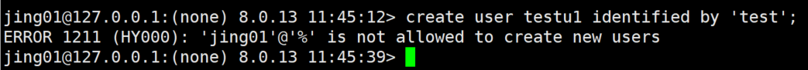

-   When creating with NULL password, it will prompt:

-   If the user name exceeds the limit, it will prompt:

-   When creating user repeatedly, it will prompt:

##### DROP USER

The statement is:

DROP USER [IF EXISTS] 'user_name'@'host_name' [,'user_name'@'host_name']...

The statement of DROP USER on the server end is:

drop user 'jingjingjing'@'%';

When DROP USER, the execution user must have super privilege.

-   When the execution user does not have super privilege, it will prompt:

-   When deleting a non-existent user, it will prompt:

##### GRANT

The statement is:

GRANT

priv_type[, priv_type ] ...

ON  priv_level TO 'user_name'@'host_name'[,'user_name'@'host_name'] ...

[WITH MAX_USER_CONNECTIONS con_num ]

**Description:**

priv_type includes：SELECT、 UPDATE、 DELETE、 INSERT 、CREATE 、DROP 、ALTER 、FILE 、 SUPER

You can use [ALL [PRIVILEGES]](https://dev.mysql.com/doc/refman/5.6/en/privileges-provided.html# priv_all) to give users all privileges (including super privilege), which is the same as MySQL.

priv_ Level includes: *  | *.*  | db_name.*  |db_name.tbl_name  | tbl_name  |

*: represents all tables in the current database (which can only be executed after "use" the LogicDB); * *: represents all tables in all databases; db_name.*: represents all tables in a certain database, db_name specifies the database name; db_name.tbl_name: a certain table in a certain database, db_name, database name, tbl_name: represents a table, tbl_name specifies the name of the table (which can only be executed after "use" the LogicDB).

The statement of GRANT on the server end is:

The global grant:

grant all on *.* to ' test_ct '@'localhost' identified by ' test_ct ' with max_user_connections 3;

The node-level grant:

grant all on test_ct.* to 'test_ct'@'localhost' identified by 'test_ct';

The table-level grant

grant update on test_ct.test_aa to 'test_ct'@'localhost' identified by 'test_ct';

Notes on GRANT:

1. The user who GRANTs must have super privilege.

2. User can be created synchronously when GRANT, but with password.

3. "super" and "file" must be granted global management privilege, and node-level and table-level grant is not supported.

4. "all" can not be used with other privileges at the same time. It can only be granted separately, which is the same as MySQL.

5. Privilege modification is only valid for the new connection and will not change the privilege of the created connection.

-   When the user who GRANTs does not have super privilege, it will prompt:

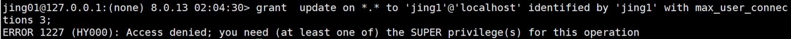

-   User is created synchronously when GRANT.

-   User is created synchronously when GRANT without password, it will prompt:

-   super must be granted global management privilege, and node-level and table-level grant is not supported.

-   file must be granted global privilege, and node-level and table-level grant is not supported.

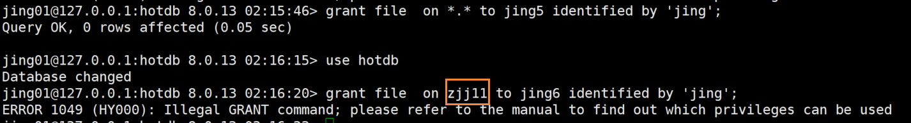

-   all can not be used with other privileges at the same time. It can only be granted separately.

##### REVOKE

The statement is:

REVOKE priv_type [, priv_type ] ...ON priv_level FROM 'user_name'@'host_name' [, 'user_name'@'host_name'] ...

The statement of REVOKE on the server end is:

revoke select,update,delete,insert,create,drop,alter,file,super on *.* from jingjing05;

Notes on REVOKE:

1. The user who REVOKE must have super privilege.

2. You can REVOKE some privileges and all privileges, and you can also REVOKE the corresponding privileges of node-level and table-level.

3. Privilege items can be REVOKEd repeatedly, but error will be reported when REVOKEing non-existent types.

4. Privilege modification is only valid for the new connection and will not change the privilege of the created connection.

-   When the user who REVOKEs does not have super privilege, it will prompt:

-   REVOKE of some privileges is supported:

-   REVOKE of all privileges is supported:

-   REVOKE of node-level privileges is supported:

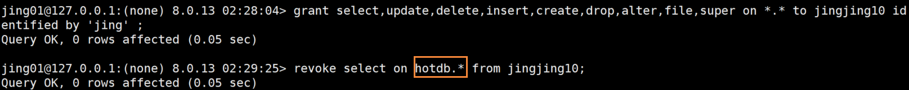

-   REVOKE of table-level privileges is supported:

-   If you REVOKE a privilege and use it again, error will be reported as follows:

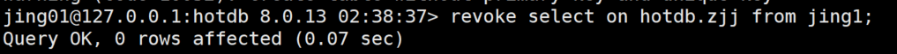

#### Table maintenance statement

| Statement type | SQL statement | Support status | Description |
| --- | --- | --- | --- |
|     | Table maintenance statement | ANALYZE TABLE | Forbidden |
|     |     | CHECK TABLE | Forbidden |
|     |     | CHECKSUM TABLE | Forbidden |
|     |     | OPTIMIZE TABLE | Forbidden |
|     |     | REPAIR TABLE | Forbidden |

#### SET statement

+--------------------+---------------------------------+--------------------+-------------------------------------------------------------------------------------------+
| **Statement type** | **SQL statement**               | **Support status** | **Description**                                                                           |
+--------------------+---------------------------------+--------------------+-------------------------------------------------------------------------------------------+
| SET statement      | SET GLOBAL                      | Not support        | 　                                                                                        |
+--------------------+---------------------------------+--------------------+-------------------------------------------------------------------------------------------+
|                    | SET SESSION                     | Partial support    | Such as: SET SESSION TRANSACTION/SET TX_READONLY/SET NAMES, etc.                          |
+--------------------+---------------------------------+--------------------+-------------------------------------------------------------------------------------------+
|                    | SET @@global.                  | Not support        | 　                                                                                        |
+--------------------+---------------------------------+--------------------+-------------------------------------------------------------------------------------------+
|                    | SET @@session.                 | Not support        | 　                                                                                        |
+--------------------+---------------------------------+--------------------+-------------------------------------------------------------------------------------------+
|                    | SET @@                          | Not support        | 　                                                                                        |
+--------------------+---------------------------------+--------------------+-------------------------------------------------------------------------------------------+
|                    | SET ROLE                        | Forbidden          | Compute node does not support new role function of MySQL8.0                               |
+--------------------+---------------------------------+--------------------+-------------------------------------------------------------------------------------------+
|                    | User Custom Variable            | Support            | Only support recall under single-node                                                     |
+--------------------+---------------------------------+--------------------+-------------------------------------------------------------------------------------------+
|                    | SET CHARACTER SET               | Support            | Only support: CHARACTER_SET_CLIENT                                                        |
|                    |                                 |                    |                                                                                           |
|                    |                                 |                    | CHARACTER_SET_CONNECTION                                                                  |
|                    |                                 |                    |                                                                                           |
|                    |                                 |                    | CHARACTER_SET_RESULTS                                                                     |
+--------------------+---------------------------------+--------------------+-------------------------------------------------------------------------------------------+
|                    | SET NAMES                       | Support            | 　                                                                                        |
+--------------------+---------------------------------+--------------------+-------------------------------------------------------------------------------------------+
|                    | SET TRANSACTION ISOLATION LEVEL | Support            | Under ordinary mode, the level supported is REPEATABLE READ, READ COMMITTED, SERIALIZABLE |
|                    |                                 |                    |                                                                                           |
|                    |                                 |                    | XA mode only supports REPEATABLE READ, SERIALIZABLE                                       |
+--------------------+---------------------------------+--------------------+-------------------------------------------------------------------------------------------+

#### SHOW statement

+--------------------+---------------------------------------------------------------------------------------+--------------------+---------------------------------------------------------------------------+
| **Statement type** | **SQL statement**                                                                     | **Support status** | **Description**                                                           |
+--------------------+---------------------------------------------------------------------------------------+--------------------+---------------------------------------------------------------------------+
| SHOW statement     | SHOW AUTHORS                                                                          | Support            | 　                                                                        |
+--------------------+---------------------------------------------------------------------------------------+--------------------+---------------------------------------------------------------------------+
|                    | SHOW BINARY LOGS                                                                      | Support            | 　                                                                        |
+--------------------+---------------------------------------------------------------------------------------+--------------------+---------------------------------------------------------------------------+
|                    | SHOW BINLOG EVENTS                                                                    | Support            | 　                                                                        |
+--------------------+---------------------------------------------------------------------------------------+--------------------+---------------------------------------------------------------------------+
|                    | SHOW CHARACTER SET                                                                    | Support            | 　                                                                        |
+--------------------+---------------------------------------------------------------------------------------+--------------------+---------------------------------------------------------------------------+
|                    | SHOW COLLATION                                                                        | Support            | 　                                                                        |
+--------------------+---------------------------------------------------------------------------------------+--------------------+---------------------------------------------------------------------------+
|                    | SHOW FIELDS FROM                                                                      | Support            | 　                                                                        |
+--------------------+---------------------------------------------------------------------------------------+--------------------+---------------------------------------------------------------------------+
|                    | SHOW COLUMNS FROM|IN tbl_name                                                        | Support            | 　                                                                        |
+--------------------+---------------------------------------------------------------------------------------+--------------------+---------------------------------------------------------------------------+
|                    | SHOW FULL COLUMNS FROM|IN tbl_name                                                   | Support            | 　                                                                        |
+--------------------+---------------------------------------------------------------------------------------+--------------------+---------------------------------------------------------------------------+
|                    | SHOW CONTRIBUTORS                                                                     | Support            | 　                                                                        |
+--------------------+---------------------------------------------------------------------------------------+--------------------+---------------------------------------------------------------------------+
|                    | SHOW CREATE DATABASE                                                                  | Support            | 　                                                                        |
+--------------------+---------------------------------------------------------------------------------------+--------------------+---------------------------------------------------------------------------+
|                    | SHOW CREATE EVENT                                                                     | Support            | 　                                                                        |
+--------------------+---------------------------------------------------------------------------------------+--------------------+---------------------------------------------------------------------------+
|                    | SHOW CREATE FUNCTION                                                                  | Support            | 　                                                                        |
+--------------------+---------------------------------------------------------------------------------------+--------------------+---------------------------------------------------------------------------+
|                    | SHOW CREATE PROCEDURE                                                                 | Support            | 　                                                                        |
+--------------------+---------------------------------------------------------------------------------------+--------------------+---------------------------------------------------------------------------+
|                    | SHOW CREATE TABLE                                                                     | Support            | 　                                                                        |
+--------------------+---------------------------------------------------------------------------------------+--------------------+---------------------------------------------------------------------------+
|                    | SHOW CREATE TRIGGER                                                                   | Support            | 　                                                                        |
+--------------------+---------------------------------------------------------------------------------------+--------------------+---------------------------------------------------------------------------+
|                    | SHOW CREATE VIEW                                                                      | Support            | 　                                                                        |
+--------------------+---------------------------------------------------------------------------------------+--------------------+---------------------------------------------------------------------------+
|                    | SHOW DATABASES                                                                        | Support            | 　                                                                        |
+--------------------+---------------------------------------------------------------------------------------+--------------------+---------------------------------------------------------------------------+
|                    | SHOW ENGINES                                                                          | Support            | 　                                                                        |
+--------------------+---------------------------------------------------------------------------------------+--------------------+---------------------------------------------------------------------------+
|                    | SHOW ERRORS                                                                           | Support            |                                                                           |
+--------------------+---------------------------------------------------------------------------------------+--------------------+---------------------------------------------------------------------------+
|                    | SHOW EVENTS                                                                           | Support            | 　                                                                        |
+--------------------+---------------------------------------------------------------------------------------+--------------------+---------------------------------------------------------------------------+
|                    | SHOW FUNCTION STATUS                                                                  | Support            | 　                                                                        |
+--------------------+---------------------------------------------------------------------------------------+--------------------+---------------------------------------------------------------------------+
|                    | SHOW GRANTS                                                                           | Support            | Show privilege control condition of the compute node                      |
+--------------------+---------------------------------------------------------------------------------------+--------------------+---------------------------------------------------------------------------+
|                    | SHOW INDEX FROM *db_name.table_name*                                                  | Support            | 　                                                                        |
+--------------------+---------------------------------------------------------------------------------------+--------------------+---------------------------------------------------------------------------+
|                    | SHOW INDEX FROM table_name WHERE...                                                   | Support            | 　                                                                        |
+--------------------+---------------------------------------------------------------------------------------+--------------------+---------------------------------------------------------------------------+
|                    | SHOW MASTER STATUS                                                                    | Support            | 　                                                                        |
+--------------------+---------------------------------------------------------------------------------------+--------------------+---------------------------------------------------------------------------+
|                    | SHOW OPEN TABLES                                                                      | Support            | Show uniform null set                                                     |
+--------------------+---------------------------------------------------------------------------------------+--------------------+---------------------------------------------------------------------------+
|                    | SHOW PLUGINS                                                                          | Support            | 　                                                                        |
+--------------------+---------------------------------------------------------------------------------------+--------------------+---------------------------------------------------------------------------+
|                    | SHOW PRIVILEGES                                                                       | Support            | 　                                                                        |
+--------------------+---------------------------------------------------------------------------------------+--------------------+---------------------------------------------------------------------------+
|                    | SHOW PROCEDURE STATUS                                                                 | Support            | 　                                                                        |
+--------------------+---------------------------------------------------------------------------------------+--------------------+---------------------------------------------------------------------------+
|                    | SHOW PROCESSLIST                                                                      | Support            | Show connection condition of the compute node                             |
+--------------------+---------------------------------------------------------------------------------------+--------------------+---------------------------------------------------------------------------+
|                    | SHOW PROFILES                                                                         | Support            | 　                                                                        |
+--------------------+---------------------------------------------------------------------------------------+--------------------+---------------------------------------------------------------------------+
|                    | SHOW RELAYLOG EVENTS [IN 'log_name'] [FROM pos] [LIMIT [offset,] row_count] | Support            | 　                                                                        |
+--------------------+---------------------------------------------------------------------------------------+--------------------+---------------------------------------------------------------------------+
|                    | SHOW SLAVE HOSTS                                                                      | Support            | 　                                                                        |
+--------------------+---------------------------------------------------------------------------------------+--------------------+---------------------------------------------------------------------------+
|                    | SHOW SLAVE STATUS                                                                     | Support            | 　                                                                        |
+--------------------+---------------------------------------------------------------------------------------+--------------------+---------------------------------------------------------------------------+
|                    | SHOW GLOBAL STATUS                                                                    | Support            | 　                                                                        |
+--------------------+---------------------------------------------------------------------------------------+--------------------+---------------------------------------------------------------------------+
|                    | SHOW SESSION STATUS                                                                   | Support            | 　                                                                        |
+--------------------+---------------------------------------------------------------------------------------+--------------------+---------------------------------------------------------------------------+
|                    | SHOW STATUS                                                                           | Support            |                                                                           |
+--------------------+---------------------------------------------------------------------------------------+--------------------+---------------------------------------------------------------------------+
|                    | SHOW TABLE STATUS                                                                     | Support            | 　                                                                        |
+--------------------+---------------------------------------------------------------------------------------+--------------------+---------------------------------------------------------------------------+
|                    | SHOW FULL TABLES                                                                      | Support            | 　                                                                        |
+--------------------+---------------------------------------------------------------------------------------+--------------------+---------------------------------------------------------------------------+
|                    | SHOW TABLES                                                                           | Support            | 　                                                                        |
+--------------------+---------------------------------------------------------------------------------------+--------------------+---------------------------------------------------------------------------+
|                    | SHOW TRIGGERS                                                                         | Support            | 　                                                                        |
+--------------------+---------------------------------------------------------------------------------------+--------------------+---------------------------------------------------------------------------+
|                    | SHOW GLOBAL|SESSION VARIABLES                                                        | Support            | 　                                                                        |
+--------------------+---------------------------------------------------------------------------------------+--------------------+---------------------------------------------------------------------------+
|                    | SHOW WARNINGS                                                                         | Support            |                                                                           |
+--------------------+---------------------------------------------------------------------------------------+--------------------+---------------------------------------------------------------------------+
|                    | Show HOTDB tables                                                                     | Support            | Support [{FROM | IN} *db_name*] [LIKE '*pattern*' | WHERE *expr*] |
|                    |                                                                                       |                    |                                                                           |
|                    |                                                                                       |                    | Show sharding information of the compute node                             |
+--------------------+---------------------------------------------------------------------------------------+--------------------+---------------------------------------------------------------------------+

#### HotDB PROFILE

| Statement type | SQL statement | Support status | Description |
| --- | --- | --- | --- |
| SET statement | set hotdb_profiling={0|1|on|off} | Support | Support set [session] hotdb_profiling |
|     | SHOW statement | show hotdb_profiles | Support |
|     | show hotdb_profile for query N [relative time|real time] | Support | N represents the SQL id executed |

**Function Description**: this function is limited to Session level only

show hotdb_profiles output is identical with MySQL:

Query_ID of the 1^st^ column is id of SQL

Duration of the 2^nd^ column is the time length of (the time point when the compute node completes writing the last Result Set to the front-end -- the time point when the compute node starts to receive the first data packet of SQL), and the unit is: ms.

Query of the 3rd column is SQL text

Instance:

mysql> show hotdb_profiles;

+----------+----------+-------------------+

| Query_ID | Duration | Query |

+----------+----------+-------------------+

| 1 | 422 | SELECT DATABASE() |

| 2 | 1962 | select * from aa |

+----------+----------+-------------------+

2 rows in set (0.01 sec)

Show hotdb_profile for query N [relative time|real time] is similar with MySQL:

Status of the 1st column, which is execution status of SQL statement

The 2^nd^ column is relative time or real time, if the type is not specified, it is relative time by default, if the request has real time, then it shall be real time

Duration of the 3^rd^ column, which is compute time of every step during SQL execution process

Instance:

mysql> show hotdb_profile for query 2 relative time;

+--------------------------------------------+---------------+----------+

| Status | Relative_time | Duration |

+--------------------------------------------+---------------+----------+

| SQL receive start time | 0 | NULL |

| SQL receive end time | 67 | 67 |

| multiquery parse end time | 125 | 58 |

| multiquery other SQL execute wait end time | 155 | 30 |

| SQL parse end time | 709 | 553 |

| backend SQL 1 request generate start time | 709 | NULL |

| backend SQL 1 request generate end time | 892 | 182 |

| backend SQL 1 request send start time | 1329 | NULL |

| backend SQL 1 request send end time | 1390 | 61 |

| backend SQL 1 result receive start time | 1733 | NULL |

| backend SQL 1 result receive end time | 1842 | 109 |

| backend SQL 1 result rewrite start time | 1733 | NULL |

| backend SQL 1 result rewrite end time | 1849 | 116 |

| result send start time | 1849 | NULL |

| result send end time | 1962 | 112 |

+--------------------------------------------+---------------+----------+

15 rows in set (0.00 sec)

Note: Description of the status column:

SQL receive start time: the time point when the compute node starts to receive the first data packet of SQL

SQL receive end time: the time point when the compute node completes receive of SQL (the SQL failed to be received will not continue to be output in later period)

multiquery parse end time: the time point when the compute node completes Multi-query parse (after parse failure, the subsequent rows will no longer be output)

multiquery other SQL execute wait end time: the time point when the compute node starts SQL parse (if there is no SQL to run ahead, then this row is unnecessary)

SQL parse end time: the time point when the compute node completes SQL parse (after parse failure, the subsequent rows will no longer be output)

backend SQL N request generate start time: the time point when the compute node starts generation of back-end SQL N (N is serial No. of back-end SQL, such as 1, 2, 3, 4...)

backend SQL N request generate end time: the time point when the compute node completes back-end SQL N

backend SQL N request send start time: the time point when the compute node starts to send the first back-end SQL N to the first MySQL

backend SQL N request send end time: the time point when the compute node completes sending the last back-end SQL N to the last MySQL

backend SQL N result receive start time: the time point when the compute node starts to receive the data packet of first SQL N Result Set from the first MySQL

backend SQL N result receive end time: the time point when the compute node completes receiving data packet of the last SQL N Result Set from the last MySQL

backend SQL N result rewrite start time: the time point when the compute node starts to rewrite the Result Set received (in case of SQL execution error or warning, this time period will contain processing time of the error or warning)

backend SQL N result rewrite end time: the time point when the compute node completes rewriting the Result Set received

result send start time: the time point when the compute node starts to send the first Result Set packet to the front-end

result send end time: the time point when the compute node completes sending the last Result Set packet to the front-end

#### Other MySQL management statement

| Statement type | SQL statement | Support status | Description |
| --- | --- | --- | --- |
|     | Other management statements | BINLOG 'str' | Forbidden |
|     |     | CACHE INDEX | Forbidden |
|     |     | KILL [CONNECTION | QUERY] | Support |
|     |     | LOAD INDEX INTO CACHE | Forbidden |
|     |     | RESET MASTER | Forbidden |
|     |     | RESET QUERY CACHE | Forbidden |
|     |     | RESET SLAVE | Forbidden |
|     | MySQL Utility Statements | DESCRIBE|DESC | Support |
|     | EXPLAIN | Support | Please refer to [EXPLAIN](#explain) |
|     |     | EXPLAIN EXTENDED | Not support |
|     |     | HELP | Not support |
|     |     | USE | Support |

The use method of KILL statement is the same with that of MySQL KILL statement. KILL will simultaneously disable the front-end connection of the compute node, and data source connection of MySQL database.

#### SHOW VARIABLES AND SHOW STATUS

HotDB Server supports show results of some of variables and status of MySQL, and you could view information of the data source variable connected by the compute node via relevant Syntax.

Show description of the parameters without special treatment: when show_dnid=1, merge_result=0, the output data has a dnid column added, and all data show original value in the in-read data source; when show_dnid=1, merge_result=1, the data sources with the same variable value will converge to be shown in the same row; when show_dnid=0, the first data source variable value will be returned if not specially specified,

The following parameter are of special processing, the for its specific show results, please see the Show description:

+--------------------------+---------------------------------------------------------------------------------------------------------------------------------------------+
| **MySQL VARIABLES**      | **Show description**                                                                                                                        |
+--------------------------+---------------------------------------------------------------------------------------------------------------------------------------------+
| BIND_ADDRESS             | *Always show*                                                                                                                             |
+--------------------------+---------------------------------------------------------------------------------------------------------------------------------------------+
| TX_ISOLATION             | REPEATABLE-READ is default. If it is session, show session's value.                                                                         |
|                          |                                                                                                                                             |
|                          | This parameter was removed in MySQL8.0, and was replaced with transaction_isolation                                                         |
+--------------------------+---------------------------------------------------------------------------------------------------------------------------------------------+
| TRANSACTION_ISOLATION    | New parameter of MySQL8.0, used for replacing tx_isalation                                                                                  |
+--------------------------+---------------------------------------------------------------------------------------------------------------------------------------------+
| AUTO_INCREMENT_OFFSET    | Show 1 at present                                                                                                                           |
+--------------------------+---------------------------------------------------------------------------------------------------------------------------------------------+
| CHARACTER_SET_CONNECTION | Only support utf8/gbk/latin1/utf8mb4 Character Set                                                                                          |
+--------------------------+---------------------------------------------------------------------------------------------------------------------------------------------+
| CHARACTER_SET_RESULTS    | Only support utf8/gbk/latin1/utf8mb4 Character Set                                                                                          |
+--------------------------+---------------------------------------------------------------------------------------------------------------------------------------------+
| MAX_CONNECTIONS          | Show according to actual configuration of the compute node                                                                                  |
+--------------------------+---------------------------------------------------------------------------------------------------------------------------------------------+
| MAX_USER_CONNECTIONS     | Show according to actual configuration of the compute node                                                                                  |
+--------------------------+---------------------------------------------------------------------------------------------------------------------------------------------+
| MAX_JOIN_SIZE            | Only support set session max_join_size=xxx, show according to set value of the compute node                                                 |
+--------------------------+---------------------------------------------------------------------------------------------------------------------------------------------+
| CHARACTER_SET_SERVER     | Only support utf8/gbk/latin1/utf8mb4 Character Set                                                                                          |
+--------------------------+---------------------------------------------------------------------------------------------------------------------------------------------+
| VERSION_COMMENT          | HotDB Server by Hotpu Tech                                                                                                                  |
+--------------------------+---------------------------------------------------------------------------------------------------------------------------------------------+
| INTERACTIVE_TIMEOUT      | 172800                                                                                                                                      |
+--------------------------+---------------------------------------------------------------------------------------------------------------------------------------------+
| SERVER_UUID              | Always show 00000000-0000-0000-0000-0000000000                                                                                              |
+--------------------------+---------------------------------------------------------------------------------------------------------------------------------------------+
| TX_READ_ONLY             | OFF is default. If it is session, show session status. This parameter was removed in MySQL8.0, and was replaced with transaction_ready_only |
+--------------------------+---------------------------------------------------------------------------------------------------------------------------------------------+
| TRANSACTION_READ_ONLY    | New parameter of MySQL8.0, used for replacing tx_read_only                                                                                  |
+--------------------------+---------------------------------------------------------------------------------------------------------------------------------------------+
| PORT                     | Show according to the configured service port value                                                                                         |
+--------------------------+---------------------------------------------------------------------------------------------------------------------------------------------+
| AUTOCOMMIT               | ON is default. If it is session, show session status.                                                                                       |
+--------------------------+---------------------------------------------------------------------------------------------------------------------------------------------+
| HOSTNAME                 | MySQL5.7, show as Hostname of the compute node server                                                                                       |
+--------------------------+---------------------------------------------------------------------------------------------------------------------------------------------+
| AUTO_INCREMENT           | Distribute to any data source of the LogicDB to take AUTO_INCREMENT value                                                                   |
+--------------------------+---------------------------------------------------------------------------------------------------------------------------------------------+
| COLLATION_DATABASE       | Only support utf8/gbk/latin1/utf8mb4 Character Set                                                                                          |
+--------------------------+---------------------------------------------------------------------------------------------------------------------------------------------+
| CHARACTER_SET_DATABASE   | Only support utf8/gbk/latin1/utf8mb4 Character Set                                                                                          |
+--------------------------+---------------------------------------------------------------------------------------------------------------------------------------------+
| PROTOCOL_VERSION         | Show according to practical Communication Protocol Version used by the compute node                                                         |
+--------------------------+---------------------------------------------------------------------------------------------------------------------------------------------+
| READ_ONLY                | Set according to the practical mode used by the compute node                                                                                |
+--------------------------+---------------------------------------------------------------------------------------------------------------------------------------------+
| VERSION                  | For MySQL Version No. - HotDB Server Version No., show according to the practical one used by the compute node                              |
+--------------------------+---------------------------------------------------------------------------------------------------------------------------------------------+
| COLLATION_SERVER         | At present, only support:                                                                                                                   |
|                          |                                                                                                                                             |
|                          | latin1_swedish_ci                                                                                                                           |
|                          |                                                                                                                                             |
|                          | latin1_bin                                                                                                                                  |
|                          |                                                                                                                                             |
|                          | gbk_chinese_ci                                                                                                                              |
|                          |                                                                                                                                             |
|                          | gbk_bin                                                                                                                                     |
|                          |                                                                                                                                             |
|                          | utf8_general_ci                                                                                                                             |
|                          |                                                                                                                                             |
|                          | utf8_bin                                                                                                                                    |
|                          |                                                                                                                                             |
|                          | utf8mb4_general_ci                                                                                                                          |
|                          |                                                                                                                                             |
|                          | utf8mb4_bin                                                                                                                                 |
+--------------------------+---------------------------------------------------------------------------------------------------------------------------------------------+
| SOCKET                   | Show Null Character String                                                                                                                  |
+--------------------------+---------------------------------------------------------------------------------------------------------------------------------------------+
| SERVER_ID                | Show 0                                                                                                                                      |
+--------------------------+---------------------------------------------------------------------------------------------------------------------------------------------+
| WAIT_TIMEOUT             | 172800                                                                                                                                      |
+--------------------------+---------------------------------------------------------------------------------------------------------------------------------------------+
| SSL_CIPHER               | Return Null Character String                                                                                                                |
+--------------------------+---------------------------------------------------------------------------------------------------------------------------------------------+
| COLLATION_CONNECTION     | At present, only support:                                                                                                                   |
|                          |                                                                                                                                             |
|                          | latin1_swedish_ci                                                                                                                           |
|                          |                                                                                                                                             |
|                          | latin1_bin                                                                                                                                  |
|                          |                                                                                                                                             |
|                          | gbk_chinese_ci                                                                                                                              |
|                          |                                                                                                                                             |
|                          | gbk_bin                                                                                                                                     |
|                          |                                                                                                                                             |
|                          | utf8_general_ci                                                                                                                             |
|                          |                                                                                                                                             |
|                          | utf8_bin                                                                                                                                    |
|                          |                                                                                                                                             |
|                          | utf8mb4_general_ci                                                                                                                          |
|                          |                                                                                                                                             |
|                          | utf8mb4_bin                                                                                                                                 |
+--------------------------+---------------------------------------------------------------------------------------------------------------------------------------------+
| FOREIGN_KEY_CHECKS       | Show ON                                                                                                                                     |
+--------------------------+---------------------------------------------------------------------------------------------------------------------------------------------+
| CHARACTER_SET_CLIENT     | Only support utf8/gbk/latin1/utf8mb4 Character Set                                                                                          |
+--------------------------+---------------------------------------------------------------------------------------------------------------------------------------------+
| TIME_ZONE                | Show SYSTEM                                                                                                                                 |
+--------------------------+---------------------------------------------------------------------------------------------------------------------------------------------+
| MAX_ALLOWED_PACKET       | Compute node control, Default: 64M                                                                                                          |
+--------------------------+---------------------------------------------------------------------------------------------------------------------------------------------+
| ADMIN_ADDRESS            | Always show Null Character String, new of MySQL8.0                                                                                          |
+--------------------------+---------------------------------------------------------------------------------------------------------------------------------------------+
| INNODB_BUFFER_POOL_SIZE  | Sum of all nodes under the LogicDB, Master/Slave node is counted as master node                                                             |
+--------------------------+---------------------------------------------------------------------------------------------------------------------------------------------+

| Status Name | Show description |
| --- | --- |
| Compression | All OFF (compute node does not support Compression Protocol for the time being) |
| Innodb_buffer_pool_dump_status | The first status which is not ended with Not Started, otherwise, take the value of the first node of LogicDB |
| Innodb_buffer_pool_load_status | The first status which is not ended with Not Started, otherwise, take the value of the first node of LogicDB |
| Innodb_have_atomic_builtins | If there is OFF among all nodes under LogicDB, then it is OFF; if there are all ON, then it is ON |
| Innodb_page_size | Take the value of the first node of LogicDB |
| Innodb_row_lock_time_avg | Take simple average of all nodes under the LogicDB |
| Innodb_row_lock_time_max | Take Max Value of all nodes under the LogicDB |
| Last_query_cost | Always 0.000000 |
| Last_query_partial_plans | Always 0 |
| Max_used_connections | Take Max Value of all nodes under the LogicDB |
| Slave_heartbeat_period | Take Max Value of all nodes under the LogicDB |
| Slave_last_heartbeat | For date type value, take Min Value of all nodes under the LogicDB; if they are all Null Character String, then it is Null Character String |
| Slave_running | If there is OFF among all nodes under LogicDB, then it is OFF, if they are all ON, then it is ON |
| Ssl_cipher | Always return Null Character String |
| Ssl_cipher_list | Always return Null Character String |
| Ssl_ctx_verify_depth | Take the value of the first node of LogicDB |
| Ssl_ctx_verify_mode | Take the value of the first node of LogicDB |
| Ssl_default_timeout | Take the value of the first node of LogicDB |
| Ssl_server_not_after | Always return Null Character String |
| Ssl_server_not_before | Always return Null Character String |
| Ssl_session_cache_mode | Take the value of the first node of LogicDB |
| Ssl_verify_depth | Take the value of the first node of LogicDB |
| Ssl_verify_mode | Take the value of the first node of LogicDB |
| Ssl_version | Take the value of the first node of LogicDB |
| Tc_log_page_size | Take the value of the first node of LogicDB |
| Uptime | Take Max Value of all nodes under the LogicDB |
| Uptime_since_flush_status | Take Max Value of all nodes under the LogicDB |
| Caching_sha2_password_rsa_public_key | Always show Null Character String, new of MySQL8.0 |
| Current_tls_ca | Always show Null Character String, new of MySQL8.0 |
| Current_tls_capath | Always show Null Character String, new of MySQL8.0 |
| Current_tls_cert | Always show Null Character String, new of MySQL8.0 |
| Current_tls_cipher | Always show Null Character String, new of MySQL8.0 |
| Current_tls_ciphersuites | Always show Null Character String, new of MySQL8.0 |
| Current_tls_crl | Always show Null Character String, new of MySQL8.0 |
| Current_tls_crlpath | Always show Null Character String, new of MySQL8.0 |
| Current_tls_key | Always show Null Character String, new of MySQL8.0 |
| Current_tls_version | Always show Null Character String, new of MySQL8.0 |
| group_replication_primary_member | Always show Null Character String, new of MySQL8.0 |
| mecab_charset | The first of LogicDB, New of MySQL8.0 |
| Performance_schema_session_connect_attrs_longest_seen | Max of LogicDB, New of MySQL8.0 |
| Rpl_semi_sync_master_clients | Always show 0, New of MySQL8.0 |
| Rpl_semi_sync_master_net_avg_wait_time | Average of LogicDB, New of MySQL8.0 |
| Rpl_semi_sync_master_status | Always show ON, New of MySQL8.0 |
| Rpl_semi_sync_master_tx_avg_wait_time | Average of LogicDB, New of MySQL8.0 |
| Rpl_semi_sync_slave_status | Always show ON, New of MySQL8.0 |
| Rsa_public_key | Always show Null Character String, New of MySQL8.0 |

### Special functions of compute node syntax

#### Create Table is Sharding

By default, the compute node could Create Table only after making appropriate Table Configuration. But in practical use process, user does not understand the compute node when contacting HotDB Server at the very beginning, and has no concept of Distributed Database; under this condition, there may be a simple method for transiting from MySQL to HotDB Server slowly and smoothly, that is: when Create Table, the function of associating node sharding by default according to LogicDB.

**Function description:** Add default node when Configure LogicDB. After Reload, Log in to compute node to Create Table directly, without needing to configure the Table Configuration Sharding Function. If LogicDB associates a node, then create Vertical Sharding Table; if LogicDB associates multiple nodes, then create Sharding Table of AUTO_CRC32 type.

**Premise for use: LogicDB sets default node**

1.  Log in to Distributed Transactional Database Management Platform, select "Configuration"->"LogicDB", set LogicDB default node

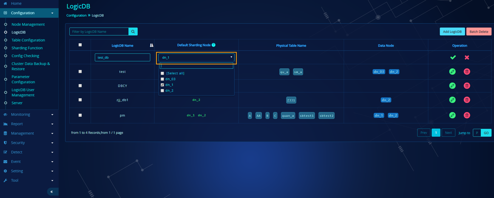

-   By default on the management platform, after Reload of LogicDB Configuration, table could be directly created by Create statement (without being defined on the management platform any longer), configuration will be generated automatically after Create Table (including table configuration and Sharding Function, etc.)

-   If LogicDB selects single node, then Vertical Sharding Table will be created by default; if it selects multiple nodes, Sharding Table with sharding type of AUTO_CRC32 will be created by default, and will give priority to select Primary Key and Unique Key as the sharding key

-   If to change the default node of LogicDB in later period, it will have no influence on tables created before change, and only applies the new LogicDB node to the new tables added after change

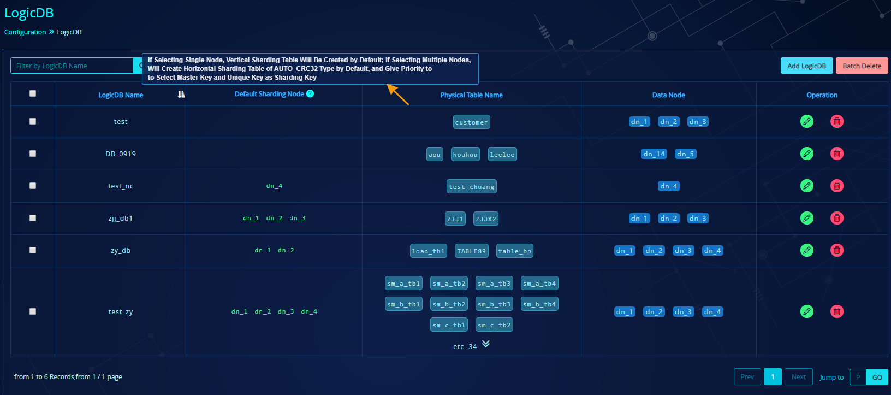

2. Log in to compute node to select "test001" LogicDB, and Create Table, create succeeded

For example, if the "test001" has only one default node, then "test01" is Vertical Sharding Table; if "test002" has multiple default nodes, then "test02" is Sharding Table

mysql> use TEST001;

Database changed

mysql> create table test01(id not null auto_increment Primary Key,a char(8),b decimal(4,2),c int);

mysql> use TEST002;

Database changed

mysql> create table test02(id not null auto_increment Primary Key,a char(8),b decimal(4,2),c int);

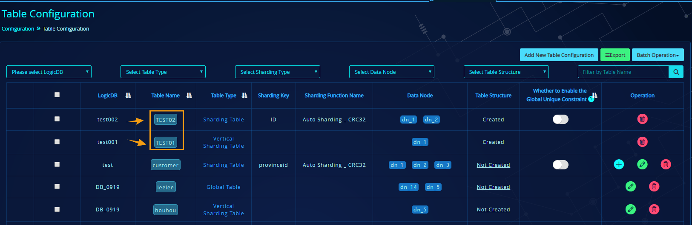

-   For Sharding Table automatically created, selection sequence of sharding key is: Primary Key Field -> Unique Key Field ->the 1^st^ Integer Field (BIGINT, INT, MEDIUMINT, SMALLINT, TINYINT) - >after taking the Integer Field, take the Character String Type Field (CHAR, VARCHAR ), and in case of no appropriate one after taking all types above, a Field will be randomly selected as the Sharding Key by default.

Notice: This function is only recommended to be used when contacting customer for the first time, and is not recommended for formal delivery and online, and Sharding shall be made according to the practical transaction scenarios;

#### Create table directly via existing Sharding Function

**Function description:** According to the added Sharding Functions on the management platform, Create Table directly via special statement on service port of the compute node, without configuring Table Sharding Information any longer. For tables created using the existing Sharding Functions, after deleting the tables according to rules, relevant tables on the management platform will be deleted synchronously.

**Premise for use:** If Sharding Functions already exist, to add Sharding Function, please refer to *Distributed Transactional Database HotDB Server [Management Platform] Function Manual*.

Add Sharding Function on the management platform, and reload.

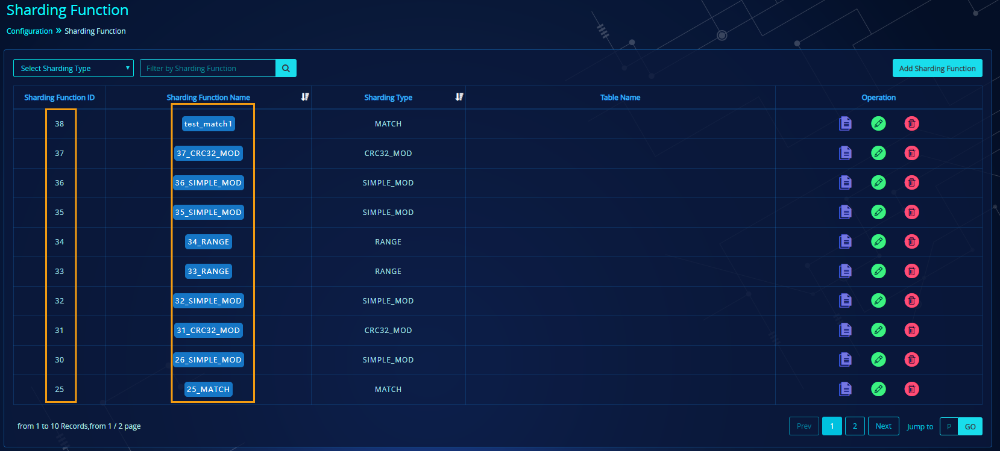

Use [service port command](#related-command-of-create-table-using-existing-sharding-function) to view functionid | functionname| functiontype| ruleid | rulename and other information of Sharding Function, and Create Table according to relevant Field information.

mysql> show hotdb functions;

+-------------+---------------------+---------------+----------------+

| Function_id | Function_name | Function_type | Auto_generated |

+-------------+---------------------+---------------+----------------+

| 1 | AUTO_CRC32_4 | AUTO_CRC32 | 0 |

| 2 | fun_range | RANGE | 0 |

| 3 | AUTO_CRC32_2 | AUTO_CRC32 | 0 |

| 4 | AUTO_GENERATE_CRC32 | AUTO_CRC32 | 1 |

| 5 | 5_CRC32_MOD | CRC32_MOD | 0 |

| 6 | AUTO_CRC32_3 | AUTO_CRC32 | 0 |

| 9 | 7_RANGE | RANGE | 0 |

| 11 | AUTO_MOD_4 | AUTO_MOD | 0 |

| 12 | AUTO_MOD_3 | AUTO_MOD | 0 |

| 13 | AUTO_CRC32_1 | AUTO_CRC32 | 0 |

| 14 | AUTO_MOD_1 | AUTO_MOD | 0 |

| 15 | 15_RANGE | MATCH | 0 |

| 17 | 16_RANGE | RANGE | 0 |

| 18 | 18_RANGE | RANGE | 0 |

| 24 | 24_SIMPLE_MOD | SIMPLE_MOD | 0 |

| 25 | 25_MATCH | MATCH | 0 |

| 30 | 26_SIMPLE_MOD | SIMPLE_MOD | 0 |

| 31 | 31_CRC32_MOD | CRC32_MOD | 0 |

| 32 | 32_SIMPLE_MOD | SIMPLE_MOD | 0 |

| 33 | 33_RANGE | RANGE | 0 |

| 34 | 34_RANGE | RANGE | 0 |

| 35 | 35_SIMPLE_MOD | SIMPLE_MOD | 0 |

| 36 | 36_SIMPLE_MOD | SIMPLE_MOD | 0 |

| 37 | 37_CRC32_MOD | CRC32_MOD | 0 |

+-------------+---------------------+---------------+----------------+

24 rows in set (0.01 sec)

mysql> show hotdb rules;

+---------+------------------------------------------------------------------+-------------+-------------+----------------+

| Rule_id | Rule_name | Rule_column | Function_id | Auto_generated |

+---------+------------------------------------------------------------------+-------------+-------------+----------------+

| 1 | hotdb-cloud_eb04c4ba-2116-4ea5-ba32-40f97ba8616d | id | 1 | 0 |

| 2 | hotdb-cloud_a3527f8c-fc7f-44d9-ad1f-243944e5c573 | id | 2 | 0 |

| 3 | hotdb-cloud_3703e424-69d7-474c-b925-03f65ec5f6c0 | a | 2 | 0 |

| 4 | hotdb-cloud_2fa6dfaa-1f82-449b-bff3-036bc0d762ce | a | 1 | 0 |

| 5 | hotdb-cloud_8bd4884f-7bca-405f-b6bf-4b11da71dd2d | id | 3 | 0 |

| 6 | AUTO_GENERATE_1_TABLEEMP_ID | ID | 4 | 1 |

| 7 | hotdb-cloud_3ceac42d-015a-4a3b-8cc7-d4edcc34a5b1 | id | 1 | 0 |

| 8 | hotdb-server_cf24a81b-6ffa-494c-b69c-28c7d8318cb8_20190905185548 | ID | 6 | 1 |

| 12 | hotdb-server_bc53bcae-139a-4238-a598-47b52f6f9787_20190909104803 | ID1 | 6 | 1 |

| 13 | hotdb-server_e662af7d-b968-4131-a7db-eac8d66c53c1_20190909134505 | NAME | 6 | 1 |

| 14 | hotdb-server_171fe946-63c9-47b9-bf52-10b9743fd064_20190909135113 | NAME | 6 | 1 |

| 15 | hotdb-server_f3f0dcc2-3d31-4536-8a5c-ec229c2983d7_20190909135444 | NAME | 6 | 1 |

| 16 | hotdb-server_261a36af-40d6-4854-9205-081e358e275d_20190909160204 | ID | 12 | 1 |

| 17 | hotdb-server_742cae4b-416f-4df4-92cf-cf45f070a2ec_20190909160303 | NAME | 12 | 1 |

| 18 | hotdb-server_e3e0db99-25e4-499c-a7b1-550919cb87aa_20190909165736 | ID1 | 12 | 1 |

| 19 | hotdb-server_604d4b31-b369-4372-86e8-ce5f1c0a61b5_20190909190106 | ID1 | 1 | 1 |

| 20 | hotdb-server_b3bb5cfd-42b6-4cde-86c3-318ddee4bc1c_20190909190906 | ID1 | 1 | 1 |

| 21 | hotdb-server_b385ebde-a28b-478a-8662-d8fbea964bfe_20190909191129 | ID1 | 1 | 1 |

| 26 | hotdb-cloud_3abf9ad2-d436-4e2d-ad32-2a60246a6102 | id | 13 | 0 |

| 27 | hotdb-server_227c12e2-0c6c-4380-8f66-bab30f521a74_20190919163004 | ID | 11 | 1 |

| 28 | hotdb-cloud_2ab203ed-885b-4cd2-9879-5e0f7191bafa | provinceid | 6 | 0 |

+---------+------------------------------------------------------------------+-------------+-------------+----------------+

21 rows in set (0.00 sec)

##### Sharding Table

Sharding table is the kind of table that splits data of the table by rows according to the sharding rules of sharding columns, and stores the data on differentdata nodes after splitting. Tables with large amount of data are suitable to be defined as sharding tables.

The syntax for creating a sharding table is as follows:

CREATE  TABLE [IF NOT EXISTS] tbl_name SHARD BY {functionid | functionname} 'functionid | functionname' USING COLUMN 'shardcolumnname' (.....

CREATE  TABLE [IF NOT EXISTS] tbl_name SHARD BY {functiontype} 'functiontype' USING COLUMN 'shardcolumnname' on datanode 'datanodeid'(.....

Besides, the keywords after SHARD BY can also be placed after the table definition (the same is true for the vertical sharding table and the global table), for example:

CREATE TABLE [IF NOT EXISTS] tbl_name （table define...） SHARD BY {functiontype} 'functiontype' USING COLUMN 'shardcolumnname' on datanode 'datanodeid'(.....);

Sharding table creating syntax description:

SHARD BY {FUNCTIONID | FUNCTIONNAME | FUNCTIONTYPE} refers to the keyword of sharding function ID, sharding function name and partition function type.

' functionid_value | functionname_value | functiontype_value ' refers to the specific value of sharding function ID, sharding function name and sharding function type.

USING COLUMN refers to the keyword of the sharding column.

'shardcolumnname' refers to the value of the sharding column.

ON DATANODE refers to the keyword of the data node.

'datanodeid' refers to the value of a specific data node. Multiple discontinuous values can be separated by commas. Multiple consecutive values can be specified in the form of intervals, such as 1, 3, 4, 5-10, 12-40.

Log in to the service port, use the LogicDB, enter Create Table statement, and execution succeeded. The management platform will show this table as defined status

mysql> use fun_zy

Database changed

mysql> CREATE TABLE match1_tb shard by functionname 'test_match1' using column 'aname' (id INT UNSIGNED NOT NULL AUTO_INCREMENT PRIMARY KEY, adnid INT DEFAULT NULL, aname VARCHAR(32) DEFAULT '', adept VARCHAR(40), adate datetime DEFAULT NULL)ENGINE =INNODB;

Query OK, 0 rows affected (0.09 sec)

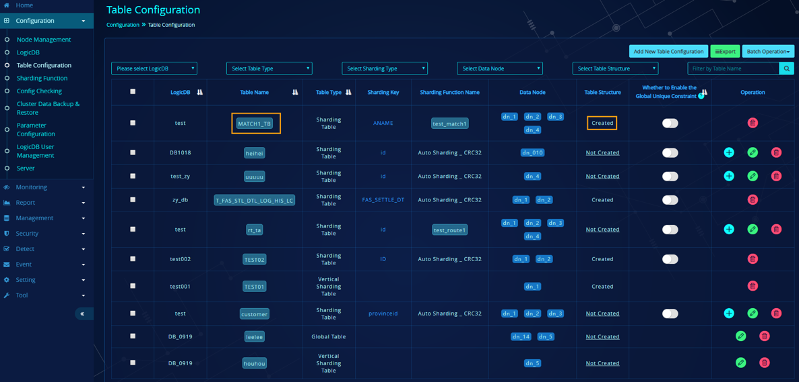

For Create Table according to this Syntax Rule, pay attention to several points below:

-   'functionid | functionname | functiontype' is specific specified Sharding Function ID, Sharding Function name and Sharding Function type

-   'shardcolumnname' is specified sharding key

-   'datanodeid' is node ID, which could be separated by comma, and support specification in interval form, such as: '1,3,4,5-10,12-40', the node ID could log in to Distributed Transactional Database Management Platform page, and select "Configuration"->" Node Management" to view, and could also log in to compute node [service port Use Command](#related-command-of-create-table-using-existing-sharding-function) to show hotdb datanodes; view:

mysql> show hotdb datanodes;

+---------------+----------------+-----------------+

| datanode_id | datanode_name | datanode_type |

+---------------+----------------+-----------------+

| 9 | dn_01 | 0 |

| 11 | dn_02 | 0 |

| 13 | dn_03 | 0 |

| 15 | dn_04 | 0 |

| 19 | dn_failover | 0 |

| 20 | dn_rmb_01 | 0 |

+---------------+----------------+-----------------+

6 rows in set (0.00 sec)

-   Function Type only support auto_crc32/auto_mod; if other types are used, it will prompt: ERROR:The fucntiontype can only be auto_crc32/auto_mod.

mysql> create table ft_match shard by functiontype 'match' using column 'id' on datanode '11,13'(id int(10) Primary Key, a char(20) not null);

ERROR 10070 (HY000): The functiontype can only by auto_crc32/auto_mode.

-   When using functionid | functionname to Create Table, if the specified function information associated function_type is auto_crc32/auto_mod, it needs to specify on datanode 'datanodes', otherwise, it will prompt: The function must be specified datanodes. If being other types, specification is unnecessary.

mysql> create table mod_ft shard by functionid '15' using column 'id'(id int(10) Primary Key, a char(20) not null);

ERROR 10090 (HY000): The function must be specified datanodes.

mysql> create table testsa shard by functionid '3' using column 'id'(id int,a int);

Query OK, 0 rows affected, 1 warning (0.10 sec)

mysql> CREATE TABLE match_tb shard by functionname 'test_match1' using column 'ananme' on datanode '1,2'(id INT UNSIGNED NOT NULL AUTO_INCREMENT PRIMARY KEY, adnid INT DEFAULT NULL, aname VARCHAR(32) DEFAULT '', adept VARCHAR(40), adate datetime DEFAULT NULL)ENGINE =INNODB;

ERROR 10090 (HY000): This rule doesn't need to specify a datanodes;

Tables with similar table structure could use the same Sharding Function, and the following Syntax could be used to make direct citation of Sharding Function to create Sharding Table

CREATE  TABLE [IF NOT EXISTS] tbl_name SHARD BY {ruleid | rulename} 'ruleid\\rulename' [on datanode 'datanodes'] (......

Log in to compute node [service port Use Command](#related-command-of-create-table-using-existing-sharding-function), show hotdb rules; and show hotdb functions; you could see the Sharding Function associated with its sharding Function

mysql> show hotdb rules;

+---------+--------------------------------------------------------+-------------+-------------+----------------+

| rule_id | rule_name | rule_column | function_id | auto_generated |

+---------+--------------------------------------------------------+-------------+-------------+----------------+

| 17 | AUTO_GENERATE_3_ROUTE1_TB | A | 1 | 1 |

+---------+--------------------------------------------------------+-------------+-------------+----------------+

21 rows in set (0.01 sec)

mysql> show hotdb functions;

+-------------+---------------------+---------------+----------------+

| function_id | function_name | **function_type** | auto_generated |

+-------------+---------------------+---------------+----------------+

| 1 | test_route1 | ROUTE | 1 |

+-------------+---------------------+---------------+----------------+

13 rows in set (0.01 sec)

The user could use ruleid/rulename to Create Table directly

mysql> CREATE TABLE rt_table shard by ruleid '30'(id INT UNSIGNED NOT NULL AUTO_INCREMENT PRIMARY KEY, adnid INT DEFAULT NULL, aname VARCHAR(32) DEFAULT '', adept VARCHAR(40), adate datetime DEFAULT NULL)ENGINE =INNODB;

Query OK, 0 rows affected (0.07 sec)

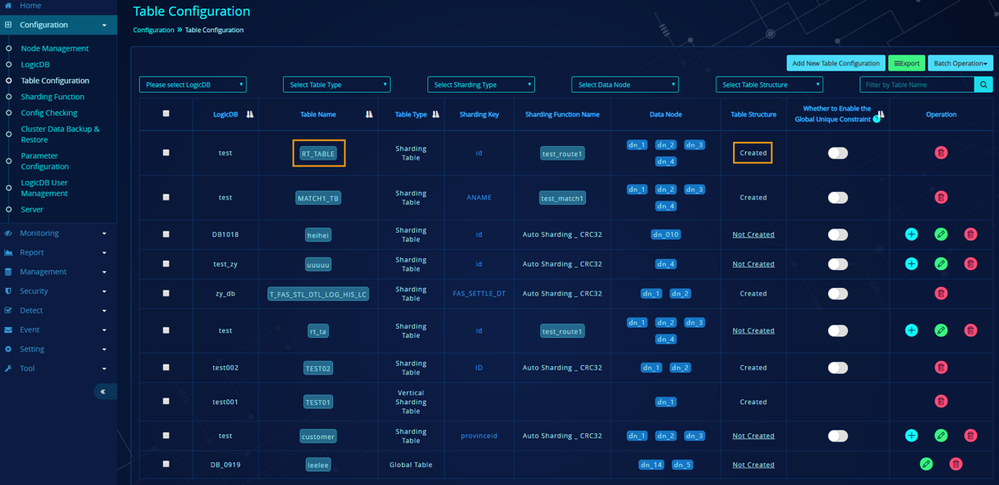

For Create Table according to this Syntax Rule, pay attention to several points below:

-   If associated function_type with specified rule is auto_crc32/auto_mod, then it needs to specify on datanode 'datanodes', if being other types, thre is no need to specify datanode.

mysql> show hotdb rules;

+---------+--------------------------------------------------------+-------------+-------------+----------------+

| rule_id | rule_name | rule_column | function_id | auto_generated |

+---------+--------------------------------------------------------+-------------+-------------+----------------+

| 17 | **AUTO_GENERATE_3_ROUTE1_TB** | A | 1 | 1 |

+---------+--------------------------------------------------------+-------------+-------------+----------------+

21 rows in set (0.01 sec)

mysql> show hotdb functions;

+-------------+---------------------+---------------+----------------+

| function_id | function_name | **function_type** | auto_generated |

+-------------+---------------------+---------------+----------------+

| 1 | test_route1 | ROUTE | 1 |

+-------------+---------------------+---------------+----------------+

13 rows in set (0.01 sec)

mysql> CREATE TABLE route2_rptb1 shard by rulename 'AUTO_GENERATE_3_ROUTE1_TB' on datanode '9,11,13'(id int not null auto_increment Primary Key,a int(10),b decimanl(5,2),c decimal(5,2),d date,e time(6),f timestamp(6) DEFAULT CURRENT_TIMESTAMP(6),g datetime(6) DEFAULT CURRENT_TIMESTAMP(6),h year,i char(20) charcter set utf8,j varchar(30) character set utf8mb4,k char(20) character set gbk,l text character set latin1, m enum('','null','1','2','3'),n set('','null','1','2','3'));

ERROR 10090 (HY000): This rule doesn't need to specify a datanodes;

-   When associated function_type with specified rule is auto_crc32/auto_mod, in case of inconsistence between specified data nodes and the parameter, then it will prompt: ERROR: The total number of datanodes must be XXX (XXX is the column_value of the practical rule id associated function info)

mysql> CREATE TABLE auto_c shard by ruleid '63' on datanode '9'(id INT UNSIGNED NOT NULL AUTO_INCREMENT PRIMARY KEY, adnid INT DEFAULT NULL, aname VARCHAR(32) DEFAULT '',adept VARCHAR(40), adate datetime DEFAULT NULL)ENGINE=INNODB;

ERROR 10090 (HY000): The total number of datanodes must be 2

mysql> CREATE TABLE auto_c shard by ruleid '63' on datanode '9,15'(id INT UNSIGNED NOT NULL AUTO_INCREMENT PRIMARY KEY, adnid INT DEFAULT NULL, aname VARCHAR(32) DEFAULT '',adept VARCHAR(40), adate datetime DEFAULT NULL)ENGINE=INNODB;

Query OK, 0 rows affected (0.13 sec)

##### Vertical Sharding Table

The vertical sharding table is a global unique total data table with no sharding, and the total data of the vertical sharding table is only stored in one data node.

The syntax for creating a vertical sharding table is as follows:

CREATE  TABLE [IF NOT EXISTS] tbl_name SHARD BY vertical on datanode 'datanodeid'(.....

Syntax description:

SHARD BY VERTICAL is a vertical sharding keyword. ON DATANODE 'datanodeid' can only specify one data node. If you do not specify any data node or specify multiple data nodes, an error will be reported.

mysql> CREATE TABLE tb_vertical shard by vertical on datanode'2'(id INT UNSIGNED NOT NULL AUTO_INCREMENT PRIMARY KEY, adnid INT DEFAULT NULL, aname VARCHAR(32) DEFAULT '', adept VARCHAR(40), adate datetime DEFAULT NULL)ENGINE =INNODB;

Query OK, 0 rows affected(0.07 sec)

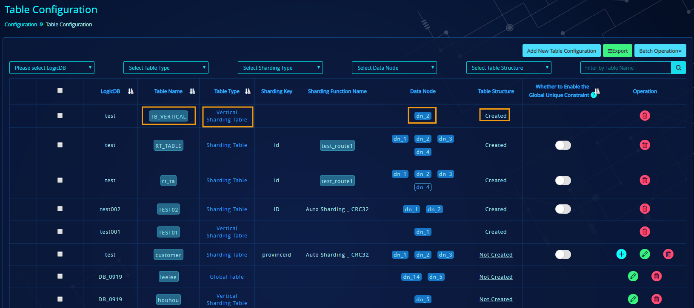

When datanode is not specified

mysql> CREATE TABLE tb1_vertical shard by vertical( id INT UNSIGNED NOT NULL AUTO_INCREMENT PRIMARY KEY, adnid INT DEFAULT NULL, aname VARCAHR(32) DEFAULT '', adept VARCHAR(40), adate DATETIME DEFAULT NULL)ENGINE=INNODB;

ERROR 10090 (HY000): This table has to specify a datanodes.

When multiple nodes are specified

mysql> CREATE TABLE tb1_vertical shard by vertical on datanode'9,11,13'( id INT UNSIGNED NOT NULL AUTO_INCREMENT PRIMARY KEY, adnid INT DEFAULT NULL, aname VARCAHR(32) DEFAULT '', adept VARCHAR(40), adate DATETIME DEFAULT NULL)ENGINE=INNODB;

ERROR 10090 (HY000): Can only specify one datanodes.

##### Global Table

Global table refers to the table stored in all data nodes under the LogicDB. The table structure and data in all data nodes are completely consistent. Tables with small amount of data, infrequent DML, and frequent JOIN operations with other tables are suitable as global tables.

The syntax for creating a global table is as follows:

CREATE  TABLE [IF NOT EXISTS] tbl_name SHARD BY global on datanode 'datanodeid'(.....

Syntax description:

SHARD BY GLOBAL is the keyword of global table.

[ON DATANODE 'datanodeid'] is the syntax for specifying a data node. When the compute node version is 2.5.6 or above, if it is not specified, the table will be created by default based on the default sharding node of the LogicDB + the union set of all the associated nodes of the tables in the logicDB; if it is specified, all data nodes must be included, errors will be reported if only some data nodes are specified.

mysql> CREATE TABLE tb_quan shard by global(id INT UNSIGNED NOT NULL AUTO_INCREMENT PRIMARY KEY, adnid INT DEFAULT NULL, aname VARCHAR(32) DEFAULT '', adept VARCHAR(40), adate datetime DEFAULT NULL)ENGINE =INNODB;

Query OK, 0 rows affected (0.07 sec)

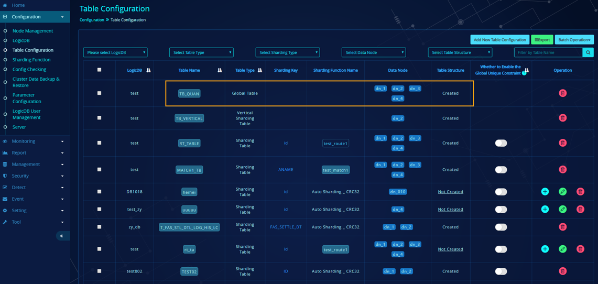

global in syntax rules means creating a global table. The 'datanodeid' is the node ID, which can be separated by English commas and can be specified in the form of interval, such as 1, 3, 4, 5-10, 12-40. The nodes of the global table with sharidng functions created by global should include all nodes under the LogicDB.

-   If there is no sharding node or defined table under the LogicDB, you need to specify the nodes of the global table distribution when creating the global table using special syntax:

mysql> CREATE TABLE tb2_quan shard by global(id int not null auto_increment primary key,a int(10),b decimanl(5,2),c decimal(5,2),d date,e time(6),f timestamp(6) DEFAULT CURRENT_TIMESTAMP(6),g datetime(6) DEFAULT CURRENT_TIMESTAMP(6),h year,i char(20) null,j varchar(30),k blob,l text, m enum('','null','1','2','3'),n set('','null','1','2','3'));

ERROR 10090 (HY000): This table has to specify a datanodes.

If a defined table already exists in the LogicDB, whenever you do not need to specify a node or need to specify a node, you need to specify the maximum number of non-duplicate nodes (that is, the union of all the selected nodes of all the table) that are included in the LogicDB. Otherwise, it will warn you of a table-creating error if some data nodes are specified:

mysql> CREATE TABLE tb1_quan shard by global on datanodes'9,11'(id int not null auto_increment primary key,a int(10),b decimanl(5,2),c decimal(5,2),d date,e time(6),f timestamp(6) DEFAULT CURRENT_TIMESTAMP(6),g datetime(6) DEFAULT CURRENT_TIMESTAMP(6),h year,i char(20) null,j varchar(30),k blob,l text, m enum('','null','1','2','3'),n set('','null','1','2','3'));

ERROR 10090 (HY000): The specified datanodes must cover all datanodes of the LogicDB.

##### Related command of create table using existing sharding function

The command introduced in this section could be executed by service port and management port of the compute node.

1. show hotdb datanodes - show the existing available nodes

This command is used for View of hotdb_datanodes table in configDB, Syntax:

mysql> show hotdb datanodes [LIKE 'pattern' | WHERE expr];

**The command contains parameters and its description:**

| Parameter | Description | Type |
| --- | --- | --- |
| pattern | Optional, Fuzzy Query Expression, Match rule_name Field | STRING |
| expr | Optional, Fuzzy Query Expression, Match Specified Field | STRING |

**The result contains Field and its Description:**

| Column name | Description | Value type/Range |
| --- | --- | --- |
| datanode_id | Node ID | INTEGER |
| datanode_name | Node name | STRING |
| datanode_type | 0: Master/Slave; 1: MGR | INTEGER |

For example:

mysql> show hotdb datanodes;

+-------------+---------------+---------------+

| datanode_id | datanode_name | datanode_type |

+-------------+---------------+---------------+

| 1 | dn_01 | 0 |

| 2 | dn_02 | 0 |

| 4 | dn_04 | 0 |

| 101 | dn_101 | 0 |

| 127 | dn_03 | 0 |

| 186 | dn_199 | 0 |

| 203 | dn_19 | 0 |

+-------------+---------------+---------------+

For another example:

mysql> show hotdb datanodes like 'dn_0%';

+-------------+---------------+---------------+

| datanode_id | datanode_name | datanode_type |

+-------------+---------------+---------------+

| 1 | dn_01 | 0 |

| 2 | dn_02 | 0 |

| 4 | dn_04 | 0 |

| 127 | dn_03 | 0 |

+-------------+---------------+---------------+

2. show hotdb functions -- show the existing available Sharding Function

This command is used for View of hotdb_function table in configDB, Syntax:

mysql> show hotdb functions;

**The command contains parameters and its description:**

| Parameter | Description | Type |
| --- | --- | --- |
| pattern | Optional, Fuzzy Query Expression, Match function_name Field | STRING |
| expr | Optional, Fuzzy Query Expression, Match function_name Field | STRING |

**The result contains Field and its Description:**

| Column name | Description | Value type/Range |
| --- | --- | --- |
| function_id | Sharding Function ID | INTEGER |
| function_name | Sharding Function name | STRING |
| function_type | Sharding Type | STRING |
| auto_generated | Auto-generated configuration of HotDB or not (1: Auto Generated, Other: Non-auto Generated) | INTEGER |

For example:

mysql> show hotdb functions;

+-------------+---------------------+---------------+----------------+

| function_id | function_name | function_type | auto_generated |

+-------------+---------------------+---------------+----------------+

...More are omitted...

| 40 | AUTO_CRC32_8 | AUTO_CRC32 | 0 |

| 41 | th_fun_range | RANGE | 0 |

| 42 | AUTO_MOD_5 | AUTO_MOD | 0 |

| 43 | 43_RANGE | RANGE | 0 |

| 44 | AUTO_CRC32_15 | AUTO_CRC32 | 0 |

| 45 | AUTO_CRC32_5 | AUTO_CRC32 | 0 |

| 46 | yds_RANGE | RANGE | 0 |

| 47 | AUTO_CRC32_11 | AUTO_CRC32 | 0 |

+-------------+---------------------+---------------+----------------+

For another example:

mysql> show hotdb functions like '%range%';

+-------------+---------------+---------------+----------------+

| function_id | function_name | function_type | auto_generated |

+-------------+---------------+---------------+----------------+

| 41 | th_fun_range | RANGE | 0 |

| 43 | 43_RANGE | RANGE | 0 |

| 46 | yds_RANGE | RANGE | 0 |

+-------------+---------------+---------------+----------------+

3 rows in set (0.00 sec)

mysql> show hotdb functions where function_name like '%range%';

+-------------+---------------+---------------+----------------+

| function_id | function_name | function_type | auto_generated |

+-------------+---------------+---------------+----------------+

| 41 | th_fun_range | RANGE | 0 |

| 43 | 43_RANGE | RANGE | 0 |

| 46 | yds_RANGE | RANGE | 0 |

+-------------+---------------+---------------+----------------+

3 rows in set (0.00 sec)

3. show hotdb function infos - show the existing available Sharding Function information

This command is used for View of hotdb_function_info table in configDB, Syntax:

mysql> show hotdb function infos [WHERE expr];

**The command contains parameters and its description:**

| Parameter | Description | Type |
| --- | --- | --- |
| expr | Optional, Fuzzy Query Expression, Match Specified Field | STRING |

**The result contains Field and its Description:**

| Column name | Description | Value type/Range |
| --- | --- | --- |
| function_id | Sharding Function ID | INTEGER |
| column_value | Sharding Key value | STRING |
| datanode_id | Data node id | INTEGER |

For example:

mysql> show hotdb function infos;

+-------------+--------------+-------------+

| function_id | column_value | datanode_id |

+-------------+--------------+-------------+

| 2 | 4 | 0 |

| 3 | 1 | 0 |

| 4 | 2 | 0 |

| 31 | '' | 4 |

| 31 | 1 | 1 |

| 31 | 2 | 2 |

| 31 | null | 127 |

| 33 | 0:1 | 1 |

| 33 | 10:10 | 191 |

| 33 | 11:11 | 186 |

| 33 | 12 | 0 |

| 33 | 2:3 | 2 |

...More are omitted...

For another example:

mysql> show hotdb function infos where function_id=38;

+-------------+--------------+-------------+

| function_id | column_value | datanode_id |

+-------------+--------------+-------------+

| 38 | 10:12 | 1 |

| 38 | 1:2 | 1 |

| 38 | 20 | 0 |

| 38 | 4:8 | 1 |

+-------------+--------------+-------------+

4 rows in set (0.00 sec)

4. show hotdb rules -- show the existing available Sharding Function

This command is used for View of hotdb_rule table in configDB, Syntax:

mysql> show hotdb rules [LIKE 'pattern' | WHERE expr];

**The command contains parameters and its description:**

| Parameter | Description | Type |
| --- | --- | --- |
| pattern | Optional, Fuzzy Query Expression, Match rule_name Field | STRING |
| expr | Optional, Fuzzy Query Expression, Match rule_name Field | STRING |

**The result contains Field and its Description:**

| Column name | Description | Value type/Range |
| --- | --- | --- |
| rule_id | Sharding Function ID | INTEGER |
| rule_name | Sharding Function name | STRING |
| rule_column | Sharding Key Name | STRING |
| function_id | Sharding Type ID | INTEGER |
| auto_generated | Auto-generated configuration of HotDB or not (1: Auto Generated, Other: Non-auto Generated) | INTEGER |

For example:

mysql> show hotdb rules;

+---------+--------------------------------------------------------+-------------+-------------+----------------+

| rule_id | rule_name | rule_column | function_id | auto_generated |

+---------+--------------------------------------------------------+-------------+-------------+----------------+

| 21 | AUTO_GENERATE_3_JOIN_A_JWY | ID | 1 | 1 |

| 22 | hotdb-cloud_0374c02e-58a7-4263-9b80-9c5b46fb42af | id | 5 | 0 |

| 25 | hotdb-cloud_f3979d19-93cb-4925-8dee-e4fbf8803c7c | id | 5 | 0 |

| 32 | hotdb-cloud_6ccd2f69-cf53-4e81-ab3d-61345134fb7a | id | 5 | 0 |

| 33 | hotdb-cloud_b5bc16e6-3481-40ed-83ff-e81d488e47a5 | ID | 4 | 0 |

...More are omitted...

For another example:

mysql> show hotdb rules like '%auto%';

+---------+----------------------------+-------------+-------------+----------------+

| rule_id | rule_name | rule_column | function_id | auto_generated |

+---------+----------------------------+-------------+-------------+----------------+

| 21 | AUTO_GENERATE_3_JOIN_A_JWY | ID | 1 | 1 |

| 50 | AUTO_GENERATE_9_FT_ADDR | ID | 26 | 1 |

| 64 | AUTO_GENERATE_23_S03 | A | 1 | 1 |

| 65 | AUTO_GENERATE_23_S04 | B | 1 | 1 |

...More are omitted...

mysql> show hotdb rules where rule_name like '%auto%';

+---------+----------------------------+-------------+-------------+----------------+

| rule_id | rule_name | rule_column | function_id | auto_generated |

+---------+----------------------------+-------------+-------------+----------------+

| 21 | AUTO_GENERATE_3_JOIN_A_JWY | ID | 1 | 1 |

| 50 | AUTO_GENERATE_9_FT_ADDR | ID | 26 | 1 |

| 64 | AUTO_GENERATE_23_S03 | A | 1 | 1 |

| 65 | AUTO_GENERATE_23_S04 | B | 1 | 1 |

...More are omitted...

#### Guarantee that the data of dropped table is not lost for a period of time

Considering the high risk of DROP TABLE, TRUNCATE TABLE, DELETE TABLE without WHERE condition statements in practical production or online environment, HotDB Server supports Guarantee that the data of dropped table is not lost for a period of time. For DELETE TABLE without WHERE condition statement, data can be retained only in auto commit, and operations within a transaction cannot be retained temporarily.

You can either modify the dropTableRetentionTime parameter in server.xml or Add the parameter "dropTableRetentionTime(h)" in Compute Node Parameter Configuration under the management platform configuration menu.

<property name=[dropTableRetentionTime](#dropTableRetentionTime)>0</property><!---the dropTableRetentionTime is 0 by default, meaning not retained-->

dropTableRetentionTime parameter is 0 by default; when dropTableRetentionTime is 0, it means that the DROP Table is not retained, DROP TABLE is to delete table; when dropTableRetentionTime is greater than 0, computed by hour, and retain the DROP Table for set time, and the table will be automatically deleted if exceeding the set time.

At present, compute node does not provide direct command of restoring the deleted table, but the user could restore the deleted table in data source by means of RENAME. Since operation is directly made on data source, therefore, this operation has risk, please use carefully. The risk includes: the data route after Restore may be different from the practical route, the original foreign key and trigger are deleted, Parent/Child Table relation does not exist, etc., and for detailed risks, please refer to [Notices for Restoration](#notices-for-restoration).

When this function is enabled, this document takes dropTableRetentionTime=24 for instance, that is to retain the DROP Table, and delete the table 24h later. If to restore the table deleted, firstly, Query hotdb_dropped_table_log in the compute node configDB, to view the mapping relation of the table deleted. For example:

mysql> select * from hotdb_dropped_table_log;

+-------------+------------+----------------------+-------------------------------+

| table_name | datanodes | drop_time | renamed_table_name |

+-------------+------------+----------------------+-------------------------------+

| TABLE25 | 11 | 2019-03-26 17:18:07 | HOTDB_TEMP_33_20190326171807 |

| TABLE30 | 11 | 2019-03-26 17:18:13 | HOTDB_TEMP_34_20190326171812 |

+-------------+------------+----------------------+-------------------------------+

2 rows in set (0.00 sec)

Including, renamed_table_name is temporary table of data of the deleted table, and the data could be restored through RENAME this temporary table.

RENAME TABLE tbl_name TO new_tbl_name

The restoration operation could either RENAME temporary table respectively under corresponding data source, or RENAME temporary table directly under the compute node via HINT statement. For operation description and notices for using HINT statement, please refer to [HINT](#hint) Chapter in this document

##### Notices for Restoration

Pay attention to the key points as following when making restoration:

-   The table created after management platform configuration, could be RENAME as the original table name directly. For the table created via Auto Create Table function, Table Configuration is not retained at the time of DROP TABLE, therefore, it can't be RENAME as the original table name directly.

-   The table created after restoring the Auto Create Table, could be RENAME as this table name after Add Configuration on the management platform. That is, the restoration operation allows to restore the deleted name to any table configured but not defined on the management platform via RENAME the table name.

-   In case of change in the Sharding Function cited by the deleted table, or configuration of different Sharding Function, after restoration, the data route will be consistent with that before Delete, that is, the practical data route will not match with the configured route. It's recommended configuring restoration according to the original Sharding Function, in order to prevent the problem of data loss or inconsistency.

-   If there is foreign key or trigger on the deleted table, then at the time of DROP TABLE, foreign key and trigger will be deleted in the temporary table. Since foreign key is deleted, after restoration, the Parent/Child Table no longer has Parent/Child Table relation.

-   The restoration operation of RENAME temporary table could take effect only after Reload. The Reload supported by the compute node at present could take effect only under the condition of change in configDB, therefore, if there is no other change in configDB except RENAME operation, the Reload will take effect only upon manual change in configDB, that is, the restored table could be viewed.

## INFORMATION_SCHEMA

INFORMATION_SCHEMA database provides information and data of the existing compute node, for example database name, Table Name, data type of a certain Column, etc.

This chapter lists the tables and its special processing contents in INFORMATION_SCHEMA supported by the compute node, as follows:

| Table name | Special processing |
| --- | --- |
| character_sets | Only return the Character Set and Collation Set data supported by the compute node |
| collations | Only return the Character Set and Collation Set data supported by the compute node |
| collation_character_set_applicability | Only return the Character Set and Collation Set data supported by the compute node |
| columns | If a table is distributed on multiple nodes, the compute node will return columns information on a selected node. The return result does not include information of system database ('mysql','information_schema','performance_schema','sys') |
| column_privileges | Return Null Set |
| engines | Only return innodb |
| events | Return Null Set |
| files | Return Null Set |
| global_status | The same as result of show global status |
| global_variables | The same as result of show global variables |
| innodb_buffer_page | Return Null Set |
| innodb_buffer_page_lru | Return Null Set |
| innodb_buffer_pool_stats | Return Null Set |
| innodb_cmp | Return Null Set |
| innodb_cmpmem | Return Null Set |
| innodb_cmpmem_reset | Return Null Set |
| innodb_cmp_per_index | Return Null Set |
| innodb_cmp_per_index_reset | Return Null Set |
| innodb_cmp_reset | Return Null Set |
| innodb_ft_being_deleted | Return Null Set |
| innodb_ft_config | Return Null Set |
| innodb_ft_default_stopword | Return Null Set |
| innodb_ft_deleted | Return Null Set |
| innodb_ft_index_cache | Return Null Set |
| innodb_ft_index_table | Return Null Set |
| innodb_locks | Return Null Set |
| innodb_lock_waits | Return Null Set |
| innodb_metrics | Return Null Set |
| innodb_sys_columns | Return Null Set |
| innodb_sys_datafiles | Return Null Set |
| innodb_sys_fields | Return Null Set |
| innodb_sys_foreign | Return Null Set |
| innodb_sys_foreign_cols | Return Null Set |
| innodb_sys_indexes | Return Null Set |
| innodb_sys_tables | Return Null Set |
| innodb_sys_tablespaces | Return Null Set |
| innodb_sys_tablestats | Return Null Set |
| innodb_trx | Return Null Set |
| key_column_usage | If a table is distributed on multiple nodes, the compute node will return columns information on a selected node. The return result does not include information of system database ('mysql','information_schema','performance_schema','sys') |
| optimizer_trace | Return Null Set |
| parameters | Return Null Set |
| partitions | If a table is distributed on multiple nodes, the compute node will return columns information on a selected node. The return result does not include information of system database ('mysql','information_schema','performance_schema','sys'). Sequencing and grouped queries of tables is supported. |
| plugins | Return Null Set |
| processlist | The returned result and server command show that processlist is consistent |
| profiling | Return Null Set |
| referential_constraints | If a table is distributed on multiple nodes, the compute node will return columns information on a selected node. The return result does not include information of system database ('mysql','information_schema','performance_schema','sys') |
| routines | Return Null Set |
| schemata | Return LogicDB related information |
| schema_privileges | Return Null Set |
| session_status | The same as the result of show session status |
| session_variables | The same as the result of show session variables |
| statistics | The compute node will show after making de-repetition or sum processing of statistics information of all nodes under the LogicDB. The return result does not include information of the system database ('mysql','information_schema','performance_schema','sys') |
| tables | If a table is distributed on multiple nodes, the compute node will return columns information on a selected node. The return result does not include information of system database ('mysql','information_schema','performance_schema','sys') |
| tablespaces | Return Null Set |
| table_constraints | If a table is distributed on multiple nodes, the compute node will return columns information on a selected node. The return result does not include information of system database ('mysql','information_schema','performance_schema','sys') |
| table_privileges | Return Null Set |
| triggers | Return Null Set |
| user_privileges | Return Null Set |
| views | Return Null Set |

In order to be compatible with the data source above MySQL 8.0, conduct the following special processing for the New contents of MySQL8.0:

| Table Name | Special processing |
| --- | --- |
| check_constraints | If a table is distributed on multiple nodes, the compute node will return columns information on a selected node. The return result does not include information of system database ('mysql','information_schema','performance_schema','sys') |
| column_statistics | If a table is distributed on multiple nodes, the compute node will return columns information on a selected node. The return result does not include information of system database ('mysql','information_schema','performance_schema','sys') |
| keywords | Return Null Set |
| resource_groups | Return Null Set |
| st_geometry_columns | If a table is distributed on multiple nodes, the compute node will return columns information on a selected node. The return result does not include information of system database ('mysql','information_schema','performance_schema','sys') |
| st_spatial_reference_systems | No special processing |
| st_units_of_measure | No special processing |
| view_table_usage | Return Null Set |
| view_routine_usage | Return Null Set |

## Instruction on use of compute node parameters

During the use process, the compute node has maintained many system configuration parameters, and this document describes how to use these parameters and the influence on function. Every parameter has a default value, which can be either modified in server.xml Config File when service starts, or modified on the Parameter Configuration page after Log in the management platform. Most of these parameters could use Reload (reload @@config) to operate dynamic modification during running, without the need to stop and restart the service. Some parameters could also be modified in Expression by means of set.

#### adaptiveProcessor

**Description of parameter:**

| Property | Value |
| --- | --- |
| Parameter value | adaptiveProcessor |
| Visible or not | Hidden |
| Description of parameters | Control whether the startup service is Automatic Adaptation or not. |
| Default value | true |
| Whether Reload is valid or not | No |
| Min Compatible Version | 2.4.5 |

**Parameter Setting:**

adaptiveProcessor parameter in Server.xml is configured as follow:

<property name=[adaptiveProcessor](#adaptiveProcessor)>true</property><!-- Control whether the startup service is Automatic Adaptation or not, true means Automatic Adaptation, false means non-Automatic Adaptation, the parameter is true by default, and is hidden -->

adaptiveProcessor parameter is true by default, that is the Automatic Adaptation startup service is enabled, and all values including [processor](#processors), [processorExecutor](#pinglogcleanperiod) and [timerExecutor](#timerexecutor) will come into Automatic Adaptation. If being false, the Automatic Adaptation startup service is disabled

**Role of parameter:**

After the Automatic Adaptation startup service is enabled, the compute node will set parameters according to the current server configuration and Automatic Adaptation Rule, that is to modify the following parameter value in server.xml, and after the startup service, the modification can't take effect, and the parameter value will still be set according to Adaptation Rule.

<property name="processors">16</property><!---number of processors-->

<property name=[processorExecutor](#processorExecutor)>4</property><!---number of threads of various processorExecutor -->

<property name=[timerExecutor](#timerExecutor)>4</property><!---number of threads of timerExecutor -->

Log in to 3325 port, execute show @@threadpool; command, view the current processor, processorExecutor and timerExecutor value. for example:

mysql> show @@threadpool;

+-----------------+-----------+--------------+-----------------+----------------+------------+

| name | pool_size | active_count | task_queue_size | completed_task | total_task |

+-----------------+-----------+--------------+-----------------+----------------+------------+

| TimerExecutor | 4 | 0 | 15 | 50376807 | 50376822 |

| $NIOExecutor-0- | 4 | 0 | 0 | 99254 | 99254 |

| $NIOExecutor-1- | 4 | 1 | 0 | 81195 | 81196 |

| $NIOExecutor-2- | 4 | 2 | 0 | 140921 | 140923 |

| $NIOExecutor-3- | 4 | 1 | 0 | 48218 | 48219 |

| $NIOExecutor-4- | 4 | 0 | 0 | 39073 | 39073 |

| $NIOExecutor-5- | 4 | 0 | 0 | 31656 | 31656 |

| $NIOExecutor-6- | 4 | 0 | 0 | 167007 | 167007 |

| $NIOExecutor-7- | 4 | 1 | 0 | 27221 | 27222 |

+-----------------+-----------+--------------+-----------------+----------------+------------+

9 rows in set (0.00 sec)

$NIOExecutor has 0-7, meaning that the current processor=8, corresponding pool_size = 4, meaning that the processorExecutor=4, corresponding pool_size of TimerExecutor = 4, meaning that the timerExecutor=4.

The following command could be used to view the number of the current logic CPU

cat /proc/cpuinfo| grep "processor"| wc -l

Notice: When starting Initialize at the very beginning, the compute node does not generate all threads, instead, it generates the threads actually used, therefore, executing show @@threadpool; command may show the result as follow:

mysql> show @@threadpool;

+-----------------+-----------+--------------+-----------------+----------------+------------+

| name | pool_size | active_count | task_queue_size | completed_task | total_task |

+-----------------+-----------+--------------+-----------------+----------------+------------+

| TimerExecutor | 4 | 0 | 14 | 73720 | 73734 |

| $NIOExecutor-0- | 1 | 0 | 0 | 1 | 1 |

| $NIOExecutor-1- | 1 | 0 | 0 | 1 | 1 |

| $NIOExecutor-2- | 1 | 0 | 0 | 1 | 1 |

| $NIOExecutor-3- | 1 | 0 | 0 | 1 | 1 |

| $NIOExecutor-4- | 2 | 0 | 0 | 2 | 2 |

| $NIOExecutor-5- | 5 | 0 | 0 | 5 | 5 |

| $NIOExecutor-6- | 1 | 0 | 0 | 1 | 1 |

| $NIOExecutor-7- | 1 | 1 | 0 | 1 | 1 |

+-----------------+-----------+--------------+-----------------+----------------+------------+

9 rows in set (0.00 sec)

Only when the compute node is under pressure could it reach the Automatic Adaptation value, that's to say, the Automatic Adaptation value is Max Value.

#### allowRCWithoutReadConsistentInXA

**Description of parameter:**

| Property | Value |
| --- | --- |
| Parameter value | allowRCWithoutReadConsistentInXA |
| Visible or not | No |
| Description of parameters | RC isolation level that does not gurantee strong read-write consistency is allowed in XA mode |
| Default value | 0 |
| Whether Reload is valid or not | Yes |
| Min Compatible Version | 2.4.9 |

**Parameter Setting:**

allowRCWithoutReadConsistentInXA in server.xml is configured as follows:

<property name=[allowRCWithoutReadConsistentInXA](#allowRCWithoutReadConsistentInXA)>1</property><!-- whether allow RC isolation level that does not gurantee strong read-write consistency in XA mode -->

**Role of parameter:**

By default, only two isolation levels, REPEATABLE READ and SERIALIZABLE, can be selected in XA mode.

When the compute node version is below 2.5.3.1 and the parameter allowRCWithoutReadConsistentInXA is set to 0, the isolation level READ COMMITTED is not allowed in XA mode; when it is set to 1, READ COMMITTED is allowed in XA mode, and the session isolation level can be modified to be READ COMMITTED. It should be noted that the current isolation level READ COMMITED is essentially between READ COMMITED and READ UNCOMMITED, which does not guarantee the strong read-write consistency.

When the compute node version is 2.5.3.1 and above, if the parameter allowRCWithoutReadConsistentInXA is set to 0, the isolation level READ COMMITTED which guarantees the read-write consistency of transactions is allowed in XA mode, which is the same as MySQL (it should be noted that when the original SQL involves cross-node queries and is split into multiple statements for multiple queries, the latest transactions will be read continuously, so single node queries should be used as much as possible in this mode);

When the parameter allowRCWithoutReadConsistentInXA is set to 1, the isolation level READ COMMITTED is also allowed in XA mode, which however does not guarantee strong read-write consistency. The isolation level READ COMMITED is essentially between READ COMMITED and READ UNCOMMITED, whose performance is better than when it is set to 0, and there will be a log prompt when starting and synchronously loading, as follows:

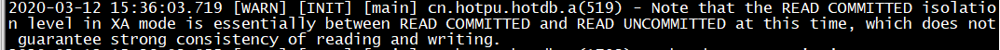

#### autoIncrement

**Description of parameter:**

+--------------------------------+---------------------------------------------------------------------------------------+
| **Property**                   | **Value**                                                                             |
+--------------------------------+---------------------------------------------------------------------------------------+
| Parameter value                | autoIncrement                                                                         |
+--------------------------------+---------------------------------------------------------------------------------------+
| Visible or not                 | Yes                                                                                   |
+--------------------------------+---------------------------------------------------------------------------------------+
| Description of parameters      | Management platform v.2.5.4 below: adopt Global Auto-Incremental serial number or not |
|                                |                                                                                       |
|                                | Management platform v.2.5.4 and above: Global Auto-Incremental serial number mode     |
+--------------------------------+---------------------------------------------------------------------------------------+
| Default value                  | 1                                                                                     |
+--------------------------------+---------------------------------------------------------------------------------------+
| Whether Reload is valid or not | Yes                                                                                   |
+--------------------------------+---------------------------------------------------------------------------------------+
| Min Compatible Version         | 2.4.3                                                                                 |
+--------------------------------+---------------------------------------------------------------------------------------+

**Role of parameter:**

To control whether Auto-Incremental sequence of the table could be Global Auto-Incremental under distributed environment. For details, please refer to the chapter Global AUTO_INCREMENT. In version 2.5.4 and above, the parameter setting range is: 0, 1, 2;

In version 2.5.3 and below, only true or false can be set. Setting as true is equivalent to setting as 1; setting as false is equivalent to setting as 0.

#### badConnAfterContinueGet

**Description of parameter:**

| Property | Value |
| --- | --- |
| Parameter value | badConnAfterContinueGet |
| Visible or not | No |
| Description of parameters | Continue to obtain connection or not |
| Default value | true |
| Whether Reload is valid or not | Yes |
| Min Compatible Version | 2.4.3 |

**Parameter Setting:**

<property name=[badConnAfterContinueGet](#badConnAfterContinueGet)>true</property><!-- Continue to obtain connection or not: true means continue to obtain connection, false means return null and not continue to obtain connection, the outer layer shall create new connection or other operation -->

**Role of parameter:**

After compute node obtaining connection from the connection pool and having conducted connection validity check and obtained an invalid connection, then when this parameter is true, the connection pool will continue to obtain available connection; when it is false, the connection pool will return null, and the outer code logic will continue the processing.

#### badConnAfterFastCheckAllIdle

**Description of parameter:**

| Property | Value |
| --- | --- |
| Parameter value | badConnAfterFastCheckAllIdle |
| Visible or not | No |
| Description of parameters | When broken back-end connection is obtained, whether to check all idle connections rapidly or not |
| Default value | true |
| Whether Reload is valid or not | Yes |
| Min Compatible Version | 2.4.3 |

**Parameter Setting:**

<property name=[badConnAfterFastCheckAllIdle](#badConnAfterFastCheckAllIdle)>true</property><!-- When broken back-end connection is obtained, whether to check all idle connections rapidly or not, true means check, false means not check, true by default-->

**Role of parameter:**

When broken back-end connection is obtained, the connection pool of the compute node will check all idle connections rapidly

#### bakUrl & bakUsername & bakPassword

**Description of parameter:**

| Property | Value |
| --- | --- |
| Parameter value | bakUrl |
| Visible or not | Yes |
| Description of parameters | Slave configDB address |
| Default value | jdbc:mysql://127.0.0.1:3306/hotdb_config |
| Whether Reload is valid or not | Yes |
| Min Compatible Version | 2.4.4 |

| Property | Value |
| --- | --- |
| Parameter value | bakUsername |
| Visible or not | Yes |
| Description of parameters | Slave configDB username |
| Default value | hotdb_config |
| Whether Reload is valid or not | Yes |
| Min Compatible Version | 2.4.4 |

| Property | Value |
| --- | --- |
| Parameter value | bakPassword |
| Visible or not | Yes |
| Description of parameters | Slave configDB password |
| Default value | hotdb_config |
| Whether Reload is valid or not | Yes |
| Min Compatible Version | 2.4.4 |

**Role of parameter:**

bakUrl and bakUsername and bakPassword are supporting parameters, and are used for the ConfigDB High Availability function. If to use ConfigDB High Availability, it shall set information of corresponding Slave configDB and guarantee normal replication relation of the master/slave configDB instance, and shall be Master/Slave mutually, it will switch to Slave configDB automatically in case of failure with the Master configDB.

In case of latency during the switch process, it will wait for the Slave configDB to catch up with replication, and then switch succeeded and it will provide service

<property name="url">jdbc:mysql://192.168.210.30:3306/hotdb_config</property><!-- Master configDB address, real IP address of the configDB service shall be specified -->

<property name="username">hotdb_config</property><!-- Master configDB username -->

<property name="password">hotdb_config</property><!-- Master configDB password -->

If not requiring Master/Slave configDB, then the configuration here shall be consistent with the master configuration information or Slave configDB shall not be configured.

property name="bakUrl">jdbc:mysql://192.168.210.31:3306/hotdb_config</property><!-- Slave configDB address, real IP address of the configDB service shall be specified -->

<property name="bakUsername">hotdb_config</property><!-- Slave configDB username -->

<property name="bakPassword">hotdb_config</property><!-- Slave configDB password -->

In case of configDB switch due to failure with the Active Master, to restore the Active Master to normal, it needs to update v value in the row hotdb_master_config_status named k in houdb_config_info table of the configDB from 0 to 1, and execute reload @@config on management port, and only in this way could the Master configDB be reused (for operating method of enabling Master configDB on the management platform, please refer to *Distributed Transactional Database HotDB Server [Management Platform] Function Manual*).

mysql> select * from hotdb_config_info\\G

***************************1.row**************************

k: hotdb_master_config_status

v: 1

description: NULL

#### checkConnLastUsedTime

**Description of parameter:**

| Property | Value |
| --- | --- |
| Parameter value | checkConnLastUsedTime |
| Visible or not | No |
| Description of parameters | Max allowed interval time of last use by the back-end connection. If exceeded, it will check whether this connection is valid or not, unit: ms |
| Default value | 3000 |
| Whether Reload is valid or not | Yes |
| Min Compatible Version | 2.4.3 |

**Parameter Setting:**

<property name=[checkConnLastUsedTime](#checkConnLastUsedTime)>false</property><!-- Max allowed interval time of last use by the back-end connection. If exceeded, it will check whether this connection is valid or not, unit: ms -->

**Role of parameter:**

Under the condition of still no Read/Write of bk_last_write_time and the timeout, the compute node will check the connection connectivity first when obtaining connection from the connection pool, in order to guarantee that the connection obtained is available

mysql> show @@session;

+-------+---------+-------------+----------+-----------+----------+---------+---------+-------+------------+----------+-----------+---------------+---------+---------+-------+----------+-------------------+--------------------+

| id | running | trx_started | trx_time | trx_query | bk_count | bk_dnid | bk_dsid | bk_id | bk_mysqlid | bk_state | bk_closed | bk_autocommit | bk_host | bk_port | bk_db | bk_query | bk_last_read_time | **bk_last_write_time** |

+-------+---------+-------------+----------+-----------+----------+---------+---------+-------+------------+----------+-----------+---------------+---------+---------+-------+----------+-------------------+--------------------+

| 60615 | FALSE | NULL | NULL | NULL | 0 | NULL | NULL | NULL | NULL | NULL | NULL | NULL | NULL | NULL | NULL | NULL | NULL | NULL |

+-------+---------+-------------+----------+-----------+----------+---------+---------+-------+------------+----------+-----------+---------------+---------+---------+-------+----------+-------------------+--------------------+

1 row in set (0.00 sec)

#### CheckConnValid

**Description of parameter:**

| Property | Value |
| --- | --- |
| Parameter value | CheckConnValid |
| Visible or not | No |
| Description of parameters | Whether to check whether the back-end connection is valid or not |
| Default value | true |
| Whether Reload is valid or not | Yes |
| Min Compatible Version | 2.4.3 |

**Parameter Setting:**

Add configuration of CheckConnValid manually in server.xml

<property name=[CheckConnValid](#CheckConnValid)>true</property>

**Role of parameter:**

When obtaining connection from the connection pool, check availability of the connection, and in case of Unavailable connection, the connection will be disabled and kicked out from the connection pool.

#### checkConnValidTimeout

**Description of parameter:**

| Property | Value |
| --- | --- |
| Parameter value | checkConnValidTimeout |
| Visible or not | No |
| Description of parameters | At the time of checking validity of back-end connection, max timeout, unit: ms |
| Default value | 500 |
| Whether Reload is valid or not | Yes |
| Min Compatible Version | 2.4.3 |

**Parameter Setting:**

<property name=[checkConnValidTimeout](#checkConnValidTimeout)>500</property><!-- At the time of checking validity of back-end connection, max timeout, unit: ms -->

**Role of parameter:**

At the time of checking validity of back-end connection, when the checking time exceeds "back-end connection timeout", the connection shall be judged invalid, and when the back-end connection is checked as timeout connection, then the connection will be kicked out from the connection pool.

#### checkMySQLParamInterval

**Description of parameter:**

+--------------------------------+--------------------------------------------------------------+
| **Property**                   | **Value**                                                    |
+--------------------------------+--------------------------------------------------------------+
| Parameter value                | checkMySQLParamInterval                                      |
+--------------------------------+--------------------------------------------------------------+
| Visible or not                 | No                                                           |
+--------------------------------+--------------------------------------------------------------+
| Description of parameters      | Interval time of checking MySQL Parameter Setting (Unit: ms) |
+--------------------------------+--------------------------------------------------------------+
| Default value                  | 600000                                                       |
+--------------------------------+--------------------------------------------------------------+
| Min value                      | 1000                                                         |
+--------------------------------+--------------------------------------------------------------+
| Max value                      | 86400000                                                     |
+--------------------------------+--------------------------------------------------------------+
| Whether Reload is valid or not | N for v.2.4.5                                                |
|                                |                                                              |
|                                | Y for v.2.4.7 and above                                      |
+--------------------------------+--------------------------------------------------------------+
| Min Compatible Version         | 2.4.3                                                        |
+--------------------------------+--------------------------------------------------------------+

**Parameter Setting:**

<property name=[checkMySQLParamInterval](#checkMySQLParamInterval)>60000</property><!---interval time of checking whether MySQL Parameter Setting is reasonable or not (Unit: ms) -->

**Role of parameter:**

Check whether interval time of MySQL Parameter Setting is reasonable or not. The checking parameters include: completion_type, nnodb_rollback_on_timeout, div_precision_increment, autocommit, read_only, tx_isolation, MAX_ALLOWED_PACKET.

#### checkUpdate

**Description of parameter:**

| Property | Value |
| --- | --- |
| Parameter value | checkUpdate |
| Visible or not | No |
| Description of parameters | Whether to intercept update operation of the sharding key or not |
| Default value | true |
| Whether Reload is valid or not | Yes |
| Min Compatible Version | 2.4.3 |

**Role of parameter:**

Control whether allow modifying the sharding key or not. Unless under special circumstances, it's not recommended modifying this parameter, otherwise, it may result in inconsistency between the data route and the configured Sharding Function, thus influencing the Query result.

If set true, after updating the sharding key, there will be prompt as follow:

mysql> update ss set id=13 where a='aa';

ERROR 1064 (HY000): sharding column's value cannot be changed.

If set false, updating the sharding key could make execution succeeded.

mysql> update ss set id=13 where a='aa';

Query OK, 1 row affected (0.01 sec)

Rows matched: 1 Changed: 1 Warnings: 0

mysql> select * from ss where a='aa';

+------+------+

| id | a |

+------+------+

| 13 | aa |

+------+------+

1 row in set (0.00 sec)

#### clientFoundRows

**Description of parameter:**

| Property | Value |
| --- | --- |
| Parameter value | clientFoundRows |
| Visible or not | No |
| Description of parameters | Use found rows to replace the affected rows in OK package |
| Default value | false |
| Whether Reload is valid or not | Yes |
| Min Compatible Version | 2.4.9（abandoned in v.2.5.5） |

**Parameter Setting:**

clientFoundRows parameter in Server.xml is configured as follow:

<property name=" clientFoundRows ">false</property><!--用found rows代替OK包中的affected rows -->

**Role of parameter:**

When the version is 2.5.5 below, this parameter is used to judge the execution status of SQL statements when performing SQL statements. If the client connection uses the parameter useAffectedRow, set clientFoundRows=false, and update returns the actual number of rows affected; set clientFoundRows=true, and update returns the number of rows matched; when the version is 2.5.5 and above, the compute node service supports self-adaption, that is, if the parameter useAffectedRows is used for client connection, the setting of the client will prevail, and the parameter will be abandoned.

For example: jdbc is committed useAffectedRows=false, the number of rows matched will be returned.

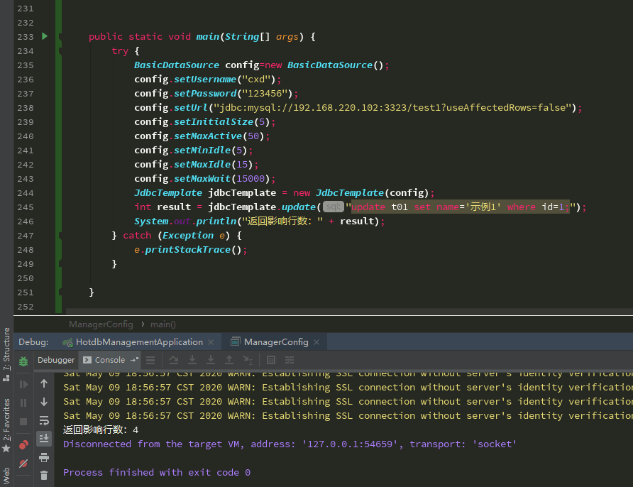

jdbc is committed useAffectedRows=true，the actual number of rows affected will be returned.

![_Q6UT]\~A6JWH9A8E83_@D71](media/image139.png)

#### clusterElectionTimeoutMs

**Description of parameter:**

| Property | Value |
| --- | --- |
| Parameter value | clusterElectionTimeoutMs |
| Visible or not | No |
| Description of parameters | Cluster Election Timeout (ms) |
| Default value | 2000 |
| Whether Reload is valid or not | Yes |
| Min Compatible Version | 2.5.3 |

**Parameter Setting:**

clusterElectionTimeoutMs parameter configuration in Server.xml is configured as follow:

<property name=[clusterElectionTimeoutMs](#clusterElectionTimeoutMs)>2000</property><!-- Cluster Election Timeout (ms) -->

**Role of parameter:**

This parameter is used for setting Cluster Election Timeout of the compute node, and generally modification is not recommended, and appropriate adjustment could be made according to the service network quality. For example, setting the parameter clusterElectionTimeoutMs as 2000ms, then if election fails, in case of failure with the master compute node in the cluster, it will wait for election within the timeout 2000ms until election succeeded, and the selection will fail if exceeding 2000ms.

#### clusterHeartbeatTimeoutMs

**Description of parameter:**

| Property | Value |
| --- | --- |
| Parameter value | clusterHeartbeatTimeoutMs |
| Visible or not | No |
| Description of parameters | Cluster Heartbeat Timeout (ms) |
| Default value | 5000 |
| Whether Reload is valid or not | Yes |
| Min Compatible Version | 2.5.3 |

**Parameter Setting:**

clusterHeartbeatTimeoutMs parameter configuration in Server.xml is configured as follow:

<property name=[clusterHeartbeatTimeoutMs](#clusterHeartbeatTimeoutMs)>5000</property><!-- Cluster Heartbeat Timeout (ms) -->

**Role of parameter:**

This parameter is used for setting Cluster Heartbeat Timeout of the compute node, and generally modification is not recommended, and appropriate adjustment could be made according to the service network quality.

#### clusterHost

**Description of parameter:**

| Property | Value |
| --- | --- |
| Parameter value | clusterHost |
| Visible or not | Yes |
| Description of parameters | IP of the current node |
| Default value | 192.168.200.1 |
| Whether Reload is valid or not | No |
| Min Compatible Version | 2.5.0 |

**Parameter Setting:**

clusterHost parameter configuration in Server.xml is configured as follow:

<property name=[clusterHost](#clusterHost)>192.168.200.1</property><!-- IP of the current node -->

**Role of parameter:**

This parameter shall be set consistent with the actual IP of the compute node (can't be replaced with 127.0.0.1), and at the time of cluster election, it shall provide communication address between this compute node and other compute nodes.

#### clusterName

**Description of parameter:**

| Property | Value |
| --- | --- |
| Parameter value | clusterName |
| Visible or not | Yes |
| Description of parameters | Cluster Group Name |
| Default value | HotDB-Cluster |
| Whether Reload is valid or not | No |
| Min Compatible Version | 2.5.0 |

**Parameter Setting:**

clusterName parameter configuration in Server.xml is configured as follow:

<property name=" HotDB-Cluster "> HotDB-Cluster </property><!-- cluster group name -->

**Role of parameter:**

Specify the name of the group added after cluster startup, and this parameter of the compute nodes within the same cluster group shall be set identical, while this parameter of the compute nodes of different cluster groups shall be set different.

#### clusterNetwork

**Description of parameter:**

| Property | Value |
| --- | --- |
| Parameter value | clusterNetwork |
| Visible or not | Yes |
| Description of parameters | Cluster Network Segment |
| Default value | 192.168.200.0/24 |
| Whether Reload is valid or not | No |
| Min Compatible Version | 2.5.0 |

**Parameter Setting:**

clusterNetwork parameter configuration in Server.xml is configured as follow:

<property name=[clusterNetwork](#clusterNetwork)>192.168.200.0/24</property><!-- Cluster Network Segment -->

**Role of parameter:**

This parameter is the network segment of the whole cluster, and it's limited that all compute nodes IP of the cluster must be within this network segment. Otherwise, even if the cluster group makes the same start, it can't join the cluster

#### clusterPacketTimeoutMs

**Description of parameter:**

| Property | Value |
| --- | --- |
| Parameter value | clusterPacketTimeoutMs |
| Visible or not | No |
| Description of parameters | Failure time of inter-cluster communication packet (ms) |
| Default value | 5000 |
| Whether Reload is valid or not | Yes |
| Min Compatible Version | 2.5.3 |

**Parameter Setting:**

clusterPacketTimeoutMs parameter configuration in Server.xml is configured as follow:

<property name=[clusterPacketTimeoutMs](#clusterPacketTimeoutMs)>5000</property><!-- Failure time of inter-cluster communication packet (ms) -->

**Role of parameter:**

This parameter is used for setting Cluster Packet Timeout, and generally modification is not recommended, and appropriate adjustment could be made according to the service network quality. Cluster packet refers to all point-to-point packets ought to be sent during normal running of the cluster, including but not limited to Heartbeat, Election, member change and other data packets.

#### clusterPort

**Description of parameter:**

| Property | Value |
| --- | --- |
| Parameter value | clusterPort |
| Visible or not | Yes |
| Description of parameters | Cluster Communication Port |
| Default value | 3326 |
| Whether Reload is valid or not | No |
| Min Compatible Version | 2.5.0 |

**Parameter Setting:**

clusterPort parameter configuration in Server.xml is configured as follow:

<property name=[clusterPort](#clusterPort)>3326</property><!-- Cluster Communication Port -->

**Role of parameter:**

The default value 3326 specifies the port of listening cluster information. This parameter is used for inter-communication within the cluster, and the communication port within the same cluster must be the same.

#### clusterSize

**Description of parameter:**

| Property | Value |
| --- | --- |
| Parameter value | clusterSize |
| Visible or not | Yes |
| Description of parameters | Total number of nodes in cluster |
| Default value | 3 |
| Whether Reload is valid or not | No |
| Min Compatible Version | 2.5.0 |

**Parameter Setting:**

clusterSize parameter configuration in Server.xml is configured as follow:

<property name=[clusterSize](#clusterSize)>3</property><!-- Total number of nodes in cluster -->

**Role of parameter:**

This parameter is total number of compute node in cluster. If haMode is set as 1 (that is the cluster mode), then it shall be configured as actual number of compute nodes of this cluster.

#### clusterStartedPacketTimeoutMs

**Description of parameter:**

| Property | Value |
| --- | --- |
| Parameter value | clusterStartedPacketTimeoutMs |
| Visible or not | No |
| Description of parameters | Failure Time of Cluster Started Broadcast Packet (ms) |
| Default value | 5000 |
| Whether Reload is valid or not | Yes |
| Min Compatible Version | 2.5.3 |

**Parameter Setting:**

clusterStartedPacketTimeoutMs parameter configuration in Server.xml is configured as follow:

<property name=[clusterStartedPacketTimeoutMs](#clusterStartedPacketTimeoutMs)>2000</property><!-- Failure Time of Cluster Started Broadcast Packet (ms) -->

**Role of parameter:**

This parameter is used for setting Cluster Started Packet Timeout, and generally modification is not recommended, and appropriate adjustment could be made according to the service network quality. Cluster Started Packet refers to a broadcast packet targeting the network segment when cluster is enabled. In case of failure with the Started Packet due to timeout, it may result that service port of this compute node can't be enabled.

#### configMGR & bak1Url & bak1Username & bak1Password

**Description of parameter:**

| Property | Value |
| --- | --- |
| Parameter value | configMGR |
| Visible or not | Yes |
| Description of parameters | Whether configDB uses MGR or not |
| Default value | false |
| Whether Reload is valid or not | YesY |
| Min Compatible Version | 2.5.0 |

+--------------------------------+----------------------+
| **Property**                   | **Value**            |
+--------------------------------+----------------------+
| Parameter value                | bak1Url              |
+--------------------------------+----------------------+
| Visible or not                 | Yes                  |
+--------------------------------+----------------------+
| Description of parameters      | MGR configDB address |
+--------------------------------+----------------------+
| Default value                  | 空                   |
|                                |                      |
|                                | Null                 |
+--------------------------------+----------------------+
| Whether Reload is valid or not | Yes                  |
+--------------------------------+----------------------+
| Min Compatible Version         | 2.5.0                |
+--------------------------------+----------------------+

| Property | Value |
| --- | --- |
| Parameter value | bak1Username |
| Visible or not | Yes |
| Description of parameters | MGR configDB username |
| Default value | Null |
| Whether Reload is valid or not | Yes |
| Min Compatible Version | 2.5.0 |

| Property | Value |
| --- | --- |
| Parameter value | bak1Password |
| Visible or not | Yes |
| Description of parameters | MGR configDB password |
| Default value | Null |
| Whether Reload is valid or not | Yes |
| Min Compatible Version | 2.5.0 |

**Role of parameter:**

configMGR and bak1Url and bak1Username and bak1Password are supporting parameters, and are used for MGR configDB function. If to use MGR configDB, it needs to be set as information of corresponding MGR configDB and guarantee normal replication relation of the MGR configDB instance, and they are MGR mutually, and in case of failure with the Master configDB, it will switch to new Master configDB automatically. At most 3 MGR configDB are supported.

<property name="configMGR">true</property> <!-- Whether configDB uses MGR or not -->

<property name="bak1Url">jdbc:mysql://192.168.210.32:3306/hotdb_config</property> <!-- MGR configDB address(if configDB uses MGR, this item must be configured), real IP address of the configDB service shall be specified -->

<property name="bak1Username">hotdb_config</property> <!-- MGR configDB username (if configDB uses MGR, this item must be configured) -->

<property name="bak1Password">hotdb_config</property> <!-- MGR configDB password (if configDB uses MGR, this item must be configured) -->

#### crossDbXa

**Description of parameter:**

| Property | Value |
| --- | --- |
| Parameter value | crossDbXa |
| Visible or not | No |
| Description of parameters | Whether XA transactions are adopted in cross-LogicDB |
| Default value | false |
| Whether Reload is valid or not | No |
| Min Compatible Version | 2.5.5 |

**Parameter Setting:**

crossDbXa is configured in server.xml as follows:

<property name=[crossDbXa](#crossDbXa)>false</property>

**Role of parameter:**

When enableXA is enabled, if there are XA transactions queries across LogicDBs, you need to enable crossDbXa to ensure strong consistency. It can also be supported when crossDbXa is not enabled, but the strong consistency of data is not guaranteed, and if a new node is added to the transaction, the query will report an error. For example:

Data preparation:

1. Enable XA

2. LogicDB A, the default node is 2, 4; and LogicDB B, the default node is 2, 3, 4

3. LogicDB A creates table a; LogicDB B creates table b; the table structure of the two tables is consistent

4. 1000 pieces of data are inserted into table a, but no data in table b

**Scenario 1: when crossDbXa is disabled, strong data consistency is not guaranteed:**

1. Open a session and execute the following SQL:

use A;begin;insert into B.b select * from A.a;commit;use B;begin;delete from b;commit;

The two transactions are executed alternately without interval;

2. Open another session and execute it repeatedly:

use A;

select count(*) from B.b;

Result: the results of Count (*) doesn't have to be all 0 or 1000

**Scenario 2: when crossDbXa is enabled, strong data consistency is guaranteed:**

1. Open a session and execute the following SQL:

use A;begin;insert into B.b select * from A.a;commit;use B;begin;delete from b;commit;

The two transactions are executed alternately without interval;

2. Open another session and execute it repeatedly:

use A;

select count(*) from B.b;

Result: the results of Count (*) be 0 or 1000

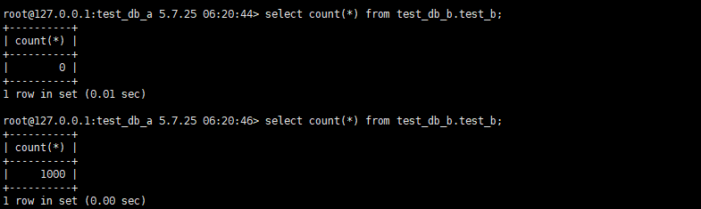

**Scenario 3: when crossDbXa is disabled, error will be reported when a node is added to the transaction:**

1. Open a session and execute the following SQL:

use A;

begin;select * from A.a;

select * from B.b;

Result: select * from B.b; error will be reported when executes

**Scenario 4: when crossDbXa is enabled, execute normally when a node is added to the transaction:**

1. Open a session and execute the following SQL:

use A;

begin;select * from A.a;select * from B.b;

Result: select * from B.b; execute normally

#### cryptMandatory

**Description of parameter:**

| Property | Value |
| --- | --- |
| Parameter value | cryptMandatory |
| Visible or not | Yes |
| Description of parameters | Mandatory password encryption or not |
| Default value | False |
| Whether Reload is valid or not | Yes |
| Min Compatible Version | 2.4.3 |

**Parameter Setting:**

<property name=[cryptMandatory](#cryptMandatory)>false</property><!-- Mandatory password encryption or not, Yes: true, No: false -->

**Role of parameter:**

It's used for setting whether to make mandatory password identification or not when the compute node reads the data source password

-   True status:

-   When the data source password is plaintext, the compute node will fail to connect to this data source

-   When the data source password is cyphertext, the compute node can connect to this data source

-   False status:

-   When the data source password is plaintext, the compute node can connect to this data source

-   When the data source password is cyphertext, the compute node will fail to connect to this data source

#### dataNodeIdleCheckPeriod

**Description of parameter:**

+--------------------------------+-----------------------------------------+
| **Property**                   | **Value**                               |
+--------------------------------+-----------------------------------------+
| Parameter value                | dataNodeIdleCheckPeriod                 |
+--------------------------------+-----------------------------------------+
| Visible or not                 | Yes                                     |
+--------------------------------+-----------------------------------------+
| Description of parameters      | Default Data Node Idle Check Period (S) |
+--------------------------------+-----------------------------------------+
| Default value                  | 120                                     |
+--------------------------------+-----------------------------------------+
| Min value                      | 1                                       |
+--------------------------------+-----------------------------------------+
| Max value                      | 3600                                    |
+--------------------------------+-----------------------------------------+
| Whether Reload is valid or not | N for v.2.4.5                           |
|                                |                                         |
|                                | Y for v.2.4.7 and above                 |
+--------------------------------+-----------------------------------------+
| Min Compatible Version         | 2.4.3                                   |
+--------------------------------+-----------------------------------------+

**Parameter Setting:**

<property name=[dataNodeIdleCheckPeriod](#dataNodeIdleCheckPeriod)>120</property><!-- Default Data Node Idle Check Period (S) -->

**Role of parameter:**

It is used for setting the periodical task period of data node idle check. The compute node will check connection condition of the back-end data source periodically, disable excessive idle connection or supplement available connections of the connection pool, guarantee that the connections can't be disabled by MySQL, and maintain normal running of the connection pool.

For example: Conduct on large concurrent insert operation on the 3323 service port, execute Show @@backend on the 3325 management port to view back-end connection. When execution of 3323 service port completed, if the compute node checks that there are idle back-end connections in the data node, the compute node will clear up these connections.

#### deadlockCheckPeriod

**Description of parameter:**

+--------------------------------+---------------------------------------------+
| **Property**                   | **Value**                                   |
+--------------------------------+---------------------------------------------+
| Parameter value                | deadlockCheckPeriod                         |
+--------------------------------+---------------------------------------------+
| Visible or not                 | Yes                                         |
+--------------------------------+---------------------------------------------+
| Description of parameters      | Deadlock Check Period (Ms), 0 means Disable |
+--------------------------------+---------------------------------------------+
| Default value                  | 3000                                        |
+--------------------------------+---------------------------------------------+
| Min value                      | 0                                           |
+--------------------------------+---------------------------------------------+
| Max value                      | 100000                                      |
+--------------------------------+---------------------------------------------+
| Whether Reload is valid or not | N for v.2.4.5                               |
|                                |                                             |
|                                | Y for v.2.4.7 and above                     |
+--------------------------------+---------------------------------------------+
| Min Compatible Version         | 2.4.3                                       |
+--------------------------------+---------------------------------------------+

**Role of parameter:**

When Deadlock Check is enabled, it will check cross-node deadlock periodically according to the set period.

When deadlock is enabled, it will check cross-node deadlock periodically according to the Deadlock Check Period, and once cross-node deadlock occurs, it will kick out the connection with the Min trx_weight, and rollback the whole transaction.

mysql> select * from autoi where id=4 for update;

ERROR 1213 (HY000): Deadlock found when trying to get lock; try restarting transaction

When deadlock is disabled, it will wait for Lock Timeout, and the Lock Timeout is set according to the innodb_lock_wait_timeout parameter value in MySQL data source.

mysql> select * from autoi where id=10 for update;

ERROR 1205 (HY000): Lock wait timeout exceeded; try restarting transaction

#### defaultMaxLimit

**Description of parameter:**

| Property | Value |
| --- | --- |
| Parameter value | defaultMaxLimit |
| Visible or not | No |
| Description of parameters | default max limit |
| Default value | 0 |
| Whether Reload is valid or not | Yes |
| Min Compatible Version | 2.4.3 |

defaultMaxLimit parameter configuration in Server.xml is configured as follow:

<property name=[defaultMaxLimit](#defaultMaxLimit)>10000</property><!-- default max limit -->

**Role of parameter:**

This parameter is related to the HotDB overload protection and is used in combination with the highCostSqlConcurrency parameter. When the front-end concurrency executes the cross-node update/delete limit n scenario, if n exceeds the defaultMaxLimit setting, the highCostSqlConcurrency parameter control will be triggered to limit the concurrency number of the high memory-consumption statements, and the related connections will be held until the previous execution is completed, thus the next batch can be executed.

Reflected in show processlist, State is Flow control, waiting for the next batch of execution. In the following graph, to facilitate testing, set defaultMaxLimit=5, highCostSqlConcurrency=10, and use 20 concurrencies to execute cross-node update limit n. It can be seen that 10 connections are being executed, and the other 10 connections have been limited.

ztm@10.10.0.207:pm 5.7.19-HotDB-2.5.1 06:10:45> show processlist;

+------+------+-------------------+------+---------+------+--------------+--------------------------------------------------------------------+

| Id | User | Host | db | Command | Time | State | Info |

+------+------+-------------------+------+---------+------+--------------+--------------------------------------------------------------------+

| 4 | ztm | 10.10.0.201:57882 | PM | Query | 0 | executing | show processlist |

| 6 | ztm | 10.10.0.201:57905 | PM | Query | 1 | Sending data | UPDATE customer_route_1 SET address = 'abcd' order by id LIMIT 20 |

| 7 | ztm | 10.10.0.201:57902 | PM | Query | 1 | Flow control | UPDATE customer_route_1 SET address = 'abcd' order by id LIMIT 20 |

| 8 | ztm | 10.10.0.201:57912 | PM | Query | 1 | Sending data | UPDATE customer_route_1 SET address = 'abcd' order by id LIMIT 20 |

| 9 | ztm | 10.10.0.201:57900 | PM | Query | 1 | Sending data | UPDATE customer_route_1 SET address = 'abcd' order by id LIMIT 20 |

| 10 | ztm | 10.10.0.201:57919 | PM | Query | 1 | Sending data | UPDATE customer_route_1 SET address = 'abcd' order by id LIMIT 20 |

| 11 | ztm | 10.10.0.201:57911 | PM | Query | 1 | Sending data | UPDATE customer_route_1 SET address = 'abcd' order by id LIMIT 20 |

| 12 | ztm | 10.10.0.201:57904 | PM | Query | 1 | Flow control | UPDATE customer_route_1 SET address = 'abcd' order by id LIMIT 20 |

| 13 | ztm | 10.10.0.201:57906 | PM | Query | 1 | Flow control | UPDATE customer_route_1 SET address = 'abcd' order by id LIMIT 20 |

| 14 | ztm | 10.10.0.201:57903 | PM | Query | 1 | Sending data | UPDATE customer_route_1 SET address = 'abcd' order by id LIMIT 20 |

| 15 | ztm | 10.10.0.201:57910 | PM | Query | 1 | Flow control | UPDATE customer_route_1 SET address = 'abcd' order by id LIMIT 20 |

| 16 | ztm | 10.10.0.201:57908 | PM | Query | 1 | Flow control | UPDATE customer_route_1 SET address = 'abcd' order by id LIMIT 20 |

| 17 | ztm | 10.10.0.201:57920 | PM | Query | 1 | Flow control | UPDATE customer_route_1 SET address = 'abcd' order by id LIMIT 20 |

| 18 | ztm | 10.10.0.201:57907 | PM | Query | 1 | Sending data | UPDATE customer_route_1 SET address = 'abcd' order by id LIMIT 20 |

| 19 | ztm | 10.10.0.201:57913 | PM | Query | 1 | Flow control | UPDATE customer_route_1 SET address = 'abcd' order by id LIMIT 20 |

| 20 | ztm | 10.10.0.201:57909 | PM | Query | 1 | Flow control | UPDATE customer_route_1 SET address = 'abcd' order by id LIMIT 20 |

| 21 | ztm | 10.10.0.201:57921 | PM | Query | 1 | Sending data | UPDATE customer_route_1 SET address = 'abcd' order by id LIMIT 20 |

| 22 | ztm | 10.10.0.201:57918 | PM | Query | 1 | Sending data | UPDATE customer_route_1 SET address = 'abcd' order by id LIMIT 20 |

| 23 | ztm | 10.10.0.201:57962 | PM | Query | 1 | Flow control | UPDATE customer_route_1 SET address = 'abcd' order by id LIMIT 20 |

| 24 | ztm | 10.10.0.201:57915 | PM | Query | 1 | Flow control | UPDATE customer_route_1 SET address = 'abcd' order by id LIMIT 20 |

| 25 | ztm | 10.10.0.201:57914 | PM | Query | 1 | Sending data | UPDATE customer_route_1 SET address = 'abcd' order by id LIMIT 20 |

+------+------+-------------------+------+---------+------+--------------+--------------------------------------------------------------------+

21 rows in set (0.01 sec)

#### dropTableRetentionTime

**Description of parameter:**

| Property | Value |
| --- | --- |
| Parameter value | dropTableRetentionTime |
| Visible or not | Yes |
| Description of parameters | dropTableRetentionTime, 0 by default, no retention |
| Default value | 0 |
| Whether Reload is valid or not | Yes |
| Min Compatible Version | 2.5.2 |

**Parameter Setting:**

dropTableRetentionTime parameter configuration in Server.xml is configured as follow:

<property name=" dropTableRetentionTime">0</property><!-- dropTableRetentionTime, 0 by default, no retention -->

**Role of parameter:**

In v.2.5.5, dropTableRetentionTime parameter is 0 by default, meaning not to retain the DROP table, and execution of DROP TABLE statement will delete the table; when dropTableRetentionTime is greater than 0, it's computed by hour, and the DROP table will be retained to the set time, and this table will be deleted automatically if exceeding the set time. For example, dropTableRetentionTime=24 means that the DROP table will be retained, and then be deleted 24h later.

#### drBakUrl & drBakUsername & drBakPassword

**Description of parameter:**

| Property | Value |
| --- | --- |
| Parameter value | drBakUrl |
| Visible or not | Yes |
| Description of parameters | Slave ConfigDB address of DR center |
| Default value | jdbc:mysql://127.0.0.1:3306/hotdb_config |
| Whether Reload is valid or not | Yes |
| Min Compatible Version | 2.5.3.1 |

| Property | Value |
| --- | --- |
| Parameter value | drBakUsername |
| Visible or not | Yes |
| Description of parameters | Slave ConfigDB username of DR center |
| Default value | hotdb_config |
| Whether Reload is valid or not | Yes |
| Min Compatible Version | 2.5.3.1 |

| Property | Value |
| --- | --- |
| Parameter value | drBakPassword |
| Visible or not | Yes |
| Description of parameters | Slave ConfigDB password of DR center |
| Default value | hotdb_config |
| Whether Reload is valid or not | Yes |
| Min Compatible Version | 2.5.3.1 |

**Role of parameter:**

drBakUrl, drBakUsername and drBakPassword are supporting parameters, which are used for the high availability functions of ConfigDB in the DR center. When the DR center is switched to be the current active center, if the ConfigDB is highly available, the information of the corresponding slave ConfigDB needs to be set and the replication relation of the master-slave ConfigDB instances should be normal, and the master-slave ConfigDB instances should be mutually standby. When the DR center is switched to be the current active center, the master ConfigDB will automatically switch to the slave ConfigDB in the case of failure. At this time, for the high availability switching of the ConfigDB, you can refer to the description of parameters [bakUrl，bakUsername，bakPassword](#bakurl-bakusername-bakpassword) of the slave ConfigDB in the master center.

<property name="drBakUrl">jdbc:mysql://192.168.240.77:3316/hotdb_config</property><!-- Slave ConfigDB address of DR center -->

<property name="drBakUsername">hotdb_config</property><!-- Slave ConfigDB username of DR center -->

<property name="drBakPassword">hotdb_config</property><!-- Slave ConfigDB password of DR center -->

#### drUrl & drUsername & drPassword

**Description of parameter:**

| Property | Value |
| --- | --- |
| Parameter value | drUrl |
| Visible or not | Yes |
| Description of parameters | ConfigDB address of DR center |
| Default value | jdbc:mysql://127.0.0.1:3306/hotdb_config |
| Whether Reload is valid or not | Yes |
| Min Compatible Version | 2.5.3.1 |

| Property | Value |
| --- | --- |
| Parameter value | drUsername |
| Visible or not | Yes |
| Description of parameters | ConfigDB usernameof DR center |
| Default value | hotdb_config |
| Whether Reload is valid or not | Yes |
| Min Compatible Version | 2.5.3.1 |

| Property | Value |
| --- | --- |
| Parameter value | drPassword |
| Visible or not | Yes |
| Description of parameters | ConfigDB passwordof DR center |
| Default value | hotdb_config |
| Whether Reload is valid or not | Yes |
| Min Compatible Version | 2.5.3.1 |

**Role of parameter:**

drUrl, drUsername and drPassword are supporting parameters, among which drUrl refers to the ConfigDB path of the compute node configuration in theDR center; drUsername and drPassword refer to the username and password connecting the database, which is used to store the configuration of the DR center. Please refer to the related parameters [url, username and password](#url-username-password) of the master center ConfigDBs.

<property name="drUrl">jdbc:mysql://192.168.240.76:3316/hotdb_config</property><!-- ConfigDB address of DR center -->

<property name="drUsername">hotdb_config</property><!-- ConfigDB username of DR center -->

<property name="drPassword">hotdb_config</property><!-- ConfigDB password of DR center -->

#### enableCursor

**Description of parameter:**

| Property | Value |
| --- | --- |
| Parameter value | enableCursor |
| Visible or not | Yes |
| Description of parameters | Allow PREPARE statement to obtain data via CURSOR or not |
| Default value | false |
| Whether Reload is valid or not | Yes |
| Min Compatible Version | 2.4.6 |

**Parameter Setting:**

enableCursor parameter in Server.xml

<property name=[enableCursor](#enableCursor)>false</property>

**Role of parameter:**

Allow PREPARE to obtain data content via Cursor or not (jdbcURl:useCursorFetch=true)

#### enableFlowControl

**Description of parameter:**

+--------------------------------+----------------------------------------+
| **Property**                   | **Value**                              |
+--------------------------------+----------------------------------------+
| Parameter value                | enableFlowControl                      |
+--------------------------------+----------------------------------------+
| Visible or not                 | Yes                                    |
+--------------------------------+----------------------------------------+
| Description of parameters      | Enable data source flow control or not |
+--------------------------------+----------------------------------------+
| Default value                  | False                                  |
+--------------------------------+----------------------------------------+
| Whether Reload is valid or not | N for v.2.4.5                          |
|                                |                                        |
|                                | Y for v.2.4.7 and above                |
+--------------------------------+----------------------------------------+
| Min Compatible Version         | 2.4.5                                  |
+--------------------------------+----------------------------------------+

**Role of parameter:**

Enable by default in Version 2.4.8 and later versions. After Enable, it will limit back-end concurrency, protect the data source, and control the data source pressure. View the control condition flow_control via show @@datasource on management port.

mysql> show @@datasource;

+------+------+------------------------------+------+--------+-----------------+------+----------------------+--------+------+------+--------------------+--------------+

| dn | ds | name | type | status | host | port | schema | active | idle | size | unavailable_reason | **flow_control** |

+------+------+------------------------------+------+--------+-----------------+------+----------------------+--------+------+------+--------------------+--------------+

| 186 | 227 | 192.168.210.68_3307_db252 | 1 | 1 | 192.168.210.68 | 3307 | db252 | 2 | 512 | 514 | NULL | 0/64 |

| 186 | 228 | 192.168.210.68_3308_db252 | 3 | 1 | 192.168.210.68 | 3308 | db252 | 1 | 512 | 513 | NULL | 0/64 |

| 1 | 7 | 192.168.210.41_3307_db252 | 1 | 1 | 192.168.210.41 | 3307 | db252 | 2 | 512 | 514 | NULL | 0/64 |

| 2 | 8 | 192.168.210.42_3307_db252 | 1 | 1 | 192.168.210.42 | 3307 | db252 | 2 | 512 | 514 | NULL | 0/16 |

| 101 | 74 | 192.168.210.41_3307_clu_db30 | 1 | 1 | 192.168.210.41 | 3307 | clu_db30 | 2 | 512 | 514 | NULL | 0/64 |

| 190 | 237 | 192.168.200.191_3307_db252 | 1 | 1 | 192.168.200.191 | 3307 | db252 | 2 | 512 | 514 | NULL | 0/64 |

| 190 | 238 | 192.168.200.190_3307_db252 | 2 | 1 | 192.168.200.190 | 3307 | db252 | 1 | 512 | 513 | NULL | 0/64 |

| 4 | 5 | 192.168.210.43_3308_db252 | 1 | 1 | 192.168.210.43 | 3308 | db252 | 2 | 32 | 34 | NULL | 0/64 |

| 4 | 77 | 192.168.210.44_3308_db252 | 3 | 1 | 192.168.210.44 | 3308 | db252 | 1 | 512 | 513 | NULL | 0/64 |

| 191 | 239 | 192.168.200.191_3308_db252 | 1 | 1 | 192.168.200.191 | 3308 | db252 | 2 | 512 | 514 | NULL | 0/64 |

| 191 | 240 | 192.168.200.190_3308_db252 | 2 | 1 | 192.168.200.190 | 3308 | db252 | 1 | 512 | 513 | NULL | 0/64 |

| 127 | 88 | 192.168.210.42_3308_db252 | 3 | 1 | 192.168.210.42 | 3308 | db252 | 1 | 512 | 513 | NULL | 0/64 |

| 127 | 87 | 192.168.210.41_3308_db252 | 1 | 1 | 192.168.210.41 | 3308 | db252 | 2 | 512 | 514 | NULL | 0/16 |

| -1 | -1 | configDatasource | 1 | 1 | 192.168.210.30 | 3307 | hotdb_config_test252 | 1 | 7 | 8 | NULL | N/A |

+------+------+------------------------------+------+--------+-----------------+------+----------------------+--------+------+------+--------------------+--------------+

14 rows in set (0.00 sec)

Note: Data source flow control is internal flow control algorithm of the compute node.

#### enableHeartbeat&heartbeatPeriod& heartbeatTimeoutMs

**Description of parameter:**

+--------------------------------+-----------------------------------------------+
| **Property**                   | **Value**                                     |
+--------------------------------+-----------------------------------------------+
| Parameter value                | enableHeartbeat                               |
+--------------------------------+-----------------------------------------------+
| Visible or not                 | Yes                                           |
+--------------------------------+-----------------------------------------------+
| Description of parameters      | Enable Heartbeat or not, Yes: true, No: false |
+--------------------------------+-----------------------------------------------+
| Default value                  | true                                          |
+--------------------------------+-----------------------------------------------+
| Whether Reload is valid or not | N for v.2.4.5                                 |
|                                |                                               |
|                                | Y for v.2.4.7 and above                       |
+--------------------------------+-----------------------------------------------+
| Min Compatible Version         | 2.4.3                                         |
+--------------------------------+-----------------------------------------------+

+--------------------------------+-------------------------+
| **Property**                   | **Value**               |
+--------------------------------+-------------------------+
| Parameter value                | heartbeatPeriod         |
+--------------------------------+-------------------------+
| Visible or not                 | Yes                     |
+--------------------------------+-------------------------+
| Description of parameters      | Heartbeat Period (S)    |
+--------------------------------+-------------------------+
| Default value                  | 2                       |
+--------------------------------+-------------------------+
| Max value                      | 60                      |
+--------------------------------+-------------------------+
| Min value                      | 1                       |
+--------------------------------+-------------------------+
| Whether Reload is valid or not | N for v.2.4.5           |
|                                |                         |
|                                | Y for v.2.4.7 and above |
+--------------------------------+-------------------------+
| Min Compatible Version         | 2.4.3                   |
+--------------------------------+-------------------------+

+--------------------------------+-------------------------+
| **Property**                   | **Value**               |
+--------------------------------+-------------------------+
| Parameter value                | heartbeatTimeoutMs      |
+--------------------------------+-------------------------+
| Visible or not                 | Yes                     |
+--------------------------------+-------------------------+
| Description of parameters      | Heartbeat Timeout (Ms)  |
+--------------------------------+-------------------------+
| Default value                  | 500                     |
+--------------------------------+-------------------------+
| Max value                      | 10000                   |
+--------------------------------+-------------------------+
| Min value                      | 100                     |
+--------------------------------+-------------------------+
| Whether Reload is valid or not | N for v.2.4.5           |
|                                |                         |
|                                | Y for v.2.4.7 and above |
+--------------------------------+-------------------------+
| Min Compatible Version         | 2.4.3                   |
+--------------------------------+-------------------------+

The default value of Heartbeat Check Period is 2s, that is Periodical Heartbeat Check is executed every 2s. The default value of Heartbeat Timeout is 500ms.

**Role of parameter:**

Detect whether the data source is available and whether there is sharing of use.

After Heartbeat Check is enabled, it will check whether the data source is normally connected or not according to Heartbeat Check Period. When the network is unreachable or data source fails, under the condition of existing Slave data source and Configuration Switching Rule, it will switch to Slave data source, and the Master data source will be set Unavailable; for data source switch logic, please refer to *Distributed Transactional Database HotDB Server [Management Platform] Function Manual*.

When a data source is cited by multiple compute node services simultaneously, then after reload, the compute node will prompt via log that: there's another HotDB using this datasource...restart heartbeat. Under the condition that Heartbeat Check is disabled, then Data Node/ConfigDB High Availability can't be realized, failover can't be made, and sharing condition of the data source can't be checked, etc.

For Heartbeat Timeout under the condition that Heartbeat is enabled, in case of data source failure or the Slave network latency, the Heartbeat failure exceeds the threshold value, then there will be log heartbeat timeout output:

2018-05-29 16:32:52.924 [WARN] [HEARTBEAT] [HeartbeatTimer] a(-1) -- Datasource:-1 128.0.0.1:3306/hotdb_config time out! Last packet sent at:2018-05-29 04:32:49:886...omitted...

Note: If the current data source is the last data source of the node, then the data source will not be set Unavailable and will try connection all the time; if being pure Slave data source, even if Heartbeat failure times have exceeded the threshold value, as long as Heartbeat could make successful connection with the data source, it will not be marked Unavailable.

#### enableLatencyCheck & latencyCheckPeriod

**Description of parameter:**

+--------------------------------+------------------------------------------+
| **Property**                   | **Value**                                |
+--------------------------------+------------------------------------------+
| Parameter value                | enableLatencyCheck                       |
+--------------------------------+------------------------------------------+
| Visible or not                 | Yes                                      |
+--------------------------------+------------------------------------------+
| Description of parameters      | Enable master/slave latency check or not |
+--------------------------------+------------------------------------------+
| Default value                  | true                                     |
+--------------------------------+------------------------------------------+
| Whether Reload is valid or not | N for v.2.4.5                            |
|                                |                                          |
|                                | Y for v.2.4.7 and above                  |
+--------------------------------+------------------------------------------+
| Min Compatible Version         | 2.4.5                                    |
+--------------------------------+------------------------------------------+

+--------------------------------+----------------------------------------+
| **Property**                   | **Value**                              |
+--------------------------------+----------------------------------------+
| Parameter value                | latencyCheckPeriod                     |
+--------------------------------+----------------------------------------+
| Visible or not                 | Yes                                    |
+--------------------------------+----------------------------------------+
| Description of parameters      | Master/Slave Latency Check Period (ms) |
+--------------------------------+----------------------------------------+
| Default value                  | 500                                    |
+--------------------------------+----------------------------------------+
| Max value                      | 1000                                   |
+--------------------------------+----------------------------------------+
| Min value                      | 100                                    |
+--------------------------------+----------------------------------------+
| Whether Reload is valid or not | N for v.2.4.5                          |
|                                |                                        |
|                                | Y for v.2.4.7 and above                |
+--------------------------------+----------------------------------------+
| Min Compatible Version         | 2.4.5                                  |
+--------------------------------+----------------------------------------+

The default value of Master/Slave Latency Check Period is 500ms, that is, the periodical check executes master/slave latency check every 500ms.

**Role of parameter:**

Latency check relies on Heartbeat table. If master/slave latency check is enabled, it will check whether the Standby Slave has replication latency, whether it catches up with replication synchronously. This parameter has a certain influence when the data source/ configDB switch and the compute node is enabled. If to conduct master/slave latency check before data source failover, there shall be Configuration Failover Rule in advance; with no Configuration Switching Rule, there will be no Master/Slave data source switch and master/slave latency check, please refer to *Distributed Transactional Database HotDB Server [Management Platform] Function Manual*.

Log in to management port, use show @@latency; and you could view the master/slave latency time.

mysql> show @@latency;

+------+----------------------------+----------------------------+---------+

| dn | info | backup_info | latency |

+------+----------------------------+----------------------------+---------+

| 186 | 192.168.210.68:3307/db252 | 192.168.210.68:3308/db252 | 501 ms |

| 4 | 192.168.210.43:3308/db252 | 192.168.210.44:3308/db252 | 0 ms |

| 190 | 192.168.200.191:3307/db252 | 192.168.200.190:3307/db252 | 0 ms |

| 191 | 192.168.200.191:3308/db252 | 192.168.200.190:3308/db252 | 0 ms |

| 127 | 192.168.210.41:3308/db252 | 192.168.210.42:3308/db252 | STOPPED |

+------+----------------------------+----------------------------+---------+

5 rows in set (0.02 sec)

#### enableListener

**Description of parameter:**

| Property | Value |
| --- | --- |
| Parameter value | enableListener |
| Visible or not | Yes |
| Description of parameters | Enable Listener mode or not. |
| Default value | false |
| Whether Reload is valid or not | Yes |
| Min Compatible Version | 2.5.5 |

**Parameter Setting:**

<property name=[enableListener](#enableListener)>false</property><!--Enable Listener mode or not-->

**Role of parameter:**

HotDB Listener is a pluggable component of compute node, which can solve the problem of linear performance expansion under the strong consistency (XA) mode of cluster. The following requirements shall be met before using the Listener: the compute node is in multi-node cluster mode with XA enabled; Listener is successfully deployed on the data source server with enableListener enabled. Executing the dynamic loading and then the following command, you can view whether the identification is successful or not and the real-time status of Listener via listener_status.

MySQL [(none)]> show @@datasource;

+------+------+-----------------------+------+--------+-------------+------+--------------+--------+------+------+--------------------+--------------+--------+-------------+-----------------+

| dn | ds | name | type | status | host | port | schema | active | idle | size | unavailable_reason | flow_control | idc_id | listener_id | listener_status |

+------+------+-----------------------+------+--------+-------------+------+--------------+--------+------+------+--------------------+--------------+--------+-------------+-----------------+

| 17 | 17 | 10.10.0.140_3313_db01 | 1 | 1 | 10.10.0.140 | 3313 | db01 | 0 | 45 | 45 | NULL | 0/64 | 1 | 8 | 1 |

| 16 | 16 | 10.10.0.140_3312_db01 | 1 | 1 | 10.10.0.140 | 3312 | db01 | 0 | 47 | 47 | NULL | 0/64 | 1 | 7 | 1 |

| 19 | 19 | 10.10.0.155_3311_db01 | 1 | 1 | 10.10.0.155 | 3311 | db01 | 0 | 49 | 49 | NULL | 0/64 | 1 | 10 | 1 |

| 18 | 18 | 10.10.0.155_3310_db01 | 1 | 1 | 10.10.0.155 | 3310 | db01 | 0 | 53 | 53 | NULL | 0/64 | 1 | 9 | 1 |

| 21 | 21 | 10.10.0.155_3313_db01 | 1 | 1 | 10.10.0.155 | 3313 | db01 | 0 | 55 | 55 | NULL | 0/64 | 1 | 12 | 1 |

| 20 | 20 | 10.10.0.155_3312_db01 | 1 | 1 | 10.10.0.155 | 3312 | db01 | 0 | 47 | 47 | NULL | 0/64 | 1 | 11 | 1 |

| 10 | 10 | 10.10.0.125_3310_db01 | 1 | 1 | 10.10.0.125 | 3310 | db01 | 0 | 44 | 44 | NULL | 0/64 | 1 | 1 | 1 |

| 11 | 11 | 10.10.0.125_3311_db01 | 1 | 1 | 10.10.0.125 | 3311 | db01 | 0 | 43 | 43 | NULL | 0/64 | 1 | 2 | 1 |

| 12 | 12 | 10.10.0.125_3312_db01 | 1 | 1 | 10.10.0.125 | 3312 | db01 | 0 | 44 | 44 | NULL | 0/64 | 1 | 3 | 1 |

| 13 | 13 | 10.10.0.125_3313_db01 | 1 | 1 | 10.10.0.125 | 3313 | db01 | 0 | 48 | 48 | NULL | 0/64 | 1 | 4 | 1 |

| 14 | 14 | 10.10.0.140_3310_db01 | 1 | 1 | 10.10.0.140 | 3310 | db01 | 0 | 44 | 44 | NULL | 0/64 | 1 | 5 | 1 |

| 15 | 15 | 10.10.0.140_3311_db01 | 1 | 1 | 10.10.0.140 | 3311 | db01 | 0 | 62 | 62 | NULL | 0/64 | 1 | 6 | 1 |

| -1 | -1 | configDatasource | 1 | 1 | 10.10.0.121 | 3306 | hotdb_config | 1 | 11 | 12 | NULL | N/A | -1 | 0 | 1 |

+------+------+-----------------------+------+--------+-------------+------+--------------+--------+------+------+--------------------+--------------+--------+-------------+-----------------+

13 rows in set (0.00 sec)

注：listener_status为1，代表Listener可用；listener_status为0，代表Listener不可用

Please refer to the description of [linear expansion](#linear-expansion) for precautions and other supporting methods.

#### enableOracleFunction

**Description of parameter:**

| Property | Value |
| --- | --- |
| Parameter value | enableOracleFunction |
| Visible or not | No |
| Description of parameters | Support oracle function or not |
| Default value | false |
| Max value | / |
| Min value | / |
| Whether Reload is valid or not | Yes |
| Min Compatible Version | 2.5.6 |

**Parameter Setting:**

enableOracleFunction is a hidden parameter. If you want to enable it, you need to add it into Server.xml. The default parameter value is false, configured as follows:

> <property name=[enableOracleFunction](#enableOracleFunction)>false</property><!-- support oracle function or not -->

**Role of parameter:**

When Oracle data is migrated to MySQL, some functions are replaced to make it run successfully and reduce the cost of migration. Besides, sequence objects and its related functions of Oracle are supported. When this parameter is enabled, it will be parsed according to Oracle mode first, otherwise it will be parsed according to MySQL mode.

-   For functions supported by Oracle but not supported by MySQL, some of them support rewriting. If you want to know functions that compute nodes support to rewrite, please refer to "HotDB Server Latest Function List".

> When it is set to true, the Oracle function parse identifies rewriting support and executes successfully. Example:
>
> root@192.168.210.202:cc 5.7.23 05:09:07> select to_char(sysdate,'yyyy-MM-dd H
>
> H24:mi:ss') from dual;
>
> +------------------------------------------+
>
> | to_char(sysdate,'yyyy-MM-dd HH24:mi:ss') |
>
> +------------------------------------------+
>
> | 2020-09-24 17:09:30 |
>
> +------------------------------------------+
>
> 1 row in set (0.01 sec)

When it is set to false, for functions not supported by MySQL, it will report "not support "or "function does not exist".

> root@192.168.210.225:cc 5.7.23 05:09:11> select to_char(sysdate,'yyyy-MM-dd H
>
> H24:mi:ss') from dual;
>
> ERROR 1305 (42000): FUNCTION db256_01.TO_CHAR does not exist

-   For Sequence related functions, please refer to "HotDB Server Latest Function List"

When it is set to true, the sequence related functions execute successfully. Example:

> root@192.168.210.202:cc 5.7.23 11:30:09> create sequence sequence_test
>
> -> minvalue 1
>
> -> maxvalue 1000
>
> -> start with 1
>
> -> increment by 10;
>
> Query OK, 1 row affected (0.04 sec)

When it is set to false, it will prompt error:

> root@192.168.210.225:cc 5.7.23 11:43:11> create sequence sequence_256
>
> -> minvalue 1
>
> -> maxvalue 1000
>
> -> start with 1
>
> -> increment by 10;
>
> ERROR 10010 (HY000): expect VIEW. lexer state: token=IDENTIFIER, sqlLeft=sequence_256

#### enableSleep

**Description of parameter:**

| Property | Value |
| --- | --- |
| Parameter value | enableSleep |
| Visible or not | Yes |
| Description of parameters | Whether SLEEP Function is allowed or not |
| Default value | false |
| Whether Reload is valid or not | Yes |
| Min Compatible Version | 2.4.3 |

**Parameter Setting:**

<property name=[enableSleep](#enableSleep)>false</property><!-- Whether SLEEP Function is allowed or not, Yes: true, No: false -->

**Role of parameter:**

It's used for setting whether execution of sleep parameter is allowed in compute node

Sleep Function is not allowed:

mysql> select sleep(2);

ERROR 1064 (HY000): forbidden function:SLEEP, go check your config file to enable it.

Sleep Function is allowed:

mysql> select sleep(2);

+------------+

| sleep(2) |

+------------+

| 0 |

+------------+

1 row in set (2.00 sec)

#### enableSSL

**Description of parameter:**

| Property | Value |
| --- | --- |
| Parameter value | enableSSL |
| Visible or not | Yes |
| Description of parameters | Whether to enable SSL connection function |
| Default value | false |
| Whether Reload is valid or not | Yes |
| Min Compatible Version | 2.5.5 |

**Role of parameter:**

<property name=[enableSSL](#enableSSL)>false</property><!-- Whether to enable SSL connection function，yes：true，no：false -->

This parameter is used to set whether the compute node is allowed to connect using SSL authentication. For details, please refer to the [TLS connection login](#tls-connection-login), and use it together with parameters [keyStore](#keystore) and [keyStorePass](#keystorepass).

#### enableSubquery

**Description of parameter:**

| Property | Value |
| --- | --- |
| Parameter value | enableSubquery |
| Visible or not | No |
| Description of parameters | Whether Subquery under special scenarios is allowed or not |
| Default value | true |
| Whether Reload is valid or not | Yes |
| Min Compatible Version | 2.4.3 |

**Role of parameter:**

Whether the table in Subquery is allowed to be Sharding Table. After Version 2.4.7, this parameter is Enabled by default, and can support Subquery under more scenarios. In the previous versions, Enabling this parameter does not guarantee accuracy of the Subquery results.

When set as false, it means that the table in Subquery is not allowed to be Sharding Table, and there will be prompt as follow:

mysql> select * from test3 where id in (select id from test31);

ERROR 1064 (HY000): Unsupported table type in subquery.

When set as false, it means that the table in Subquery is not allowed to be Sharding Table, there will be prompt as follow:

mysql> select * from test3 where id in (select id from test31);

+------+-------------+

| id | name |

+------+-------------+

| 5 | dfff56f |

| 7 | aa78bca |

| 15 | dfff56f |

...省略更多...

...More are omitted...

#### enableWatchdog

**Description of parameter:**

+--------------------------------+-------------------------+
| **Property**                   | **Value**               |
+--------------------------------+-------------------------+
| Parameter value                | enableWatchdog          |
+--------------------------------+-------------------------+
| Visible or not                 | Yes                     |
+--------------------------------+-------------------------+
| Description of parameters      | Enable Watchdog or not  |
+--------------------------------+-------------------------+
| Default value                  | False                   |
+--------------------------------+-------------------------+
| Whether Reload is valid or not | N for v.2.4.5           |
|                                |                         |
|                                | Y for v.2.4.7 and above |
+--------------------------------+-------------------------+
| Min Compatible Version         | 2.4.5                   |
+--------------------------------+-------------------------+

**Parameter Setting:**

<property name=[enableWatchdog](#enableWatchdog)>true</property><!-- Enable Watchdog or not -->

**Role of parameter:**

It's used for checking abnormal connection and other abnormal status of front-end connection and back-end connection pool of the compute node. In case of abnormality, record log and terminate the connection.

You could view log tail -f hotdb.log|grep to see whether "watchdog" has been enabled or not

root> cat hotdb.log|grep 'watchdog'

2018-06-01 18:26:50.983 [WARN] [WATCHDOG] [$NIOREACTOR-7-RW] watchdogTableCheckHandler(78) - Table TABLEB not found in watchdog table structure check in HotOB memory, but was found in MySQLConnection [node=i, id=18, threadId=199616, state=running, closed=false, autocommit=true, host=192.168.200.5q, port=3308, database=db249, localPort=51691, isClose:false, toBeclose:false]. You may need to contact HotDB administrator to get help.

2018-06-01 18:26:50.986 [WARN] [WATCHDOG] [$NIOREACTOR-7-RW] watchdogTableCheckHandler(78) - Table TESTB not found in watchdog table structure check in HotOB memory, but was found in MySQLConnection [node=i, id=18, threadId=199616, state=running, closed=false, autocommit=true, host=192.168.200.5q, port=3308, database=db249, localPort=51691, isClose:false, toBeclose:false]. You may need to contact HotDB administrator to get help.

2018-06-01 18:26:50.988 [WARN] [WATCHDOG] [$NIOREACTOR-7-RW] watchdogTableCheckHandler(78) - Table JOIN_DN02 not found in watchdog table structure check in HotOB memory, but was found in MySQLConnection [node=i, id=18, threadId=199616, state=running, closed=false, autocommit=true, host=192.168.200.5q, port=3308, database=db249, localPort=51691, isClose:false, toBeclose:false]. You may need to contact HotDB administrator to get help.

...More are omitted...

You could view inconsistency check information of the table structure and memory via log:

2018-10-3118:46:44.834 [WARN] [WATCHDOG] [$NIOREACTOR-0-RW] WatchdogTableCheckHandler(85) - Table CCC is inconsistent in watchdog table structure check between HotDB memory and MySQL: MySQLConnection [node=20, id=299, threadId=3748, state=running, closed=false, autocommit=true, host=192.168.210.41. port=3310, database=rmb0l, localPort=58808, isClose:false, toBeClose:false]. You may need to contact HOtDB administrator to get help.

You could view inconsistency check information of configDB and memory via log:

2018-10-31 17:45:39.617 [INFO] [WATCHDOG] [Watchdog] WatchDog(500) -- HotDB user config is inconsistent between config database and HotDB memory, Logic tables are not the same in FUN_RMB. you may need to reload HotDB config to bring into effect.

You could view check information of the transactions not committed within 24h via log:

2018-10-26 16:14:55.787 [INFO] [WATCHDOG] [$NIOREACTOR-0-RW] WatchDogLongTransactionCheckHandler(123) - Session [thread=Thread-5,id=1720,user=rmb,host=192.168.200.3,port=3323,localport=54330,schema=FUNTEST_RMB] has not been queryed for 839s. executed IUD5:[INSERT INTO rmb_cbc VALUES (tuanjian, 4000)]. binded connection:[MySQLConnection [node=11, id=1330, threadld=18085, state=borrowed, closed=false, autocommit=false, host=192.168.210.42, port=3307, database=db251, localPort=15722, isCiose:false, toBeClose:false] lastSQL:INSERT INTO rmb_cbc VALUES (tuanjian, 4000)]. innodb_trx:[(ds:11 trx_id:25765462 trx_state:RUNNING trx_started:2018-10-26 16:00:56 trx_requested_lock_id:NULL trx_wait_started:NULL trx_weight:2 trx_mysql._thread_id:18085 trx_query:NULL trx_operation_state:NULL trx_tables_in_use:0 trx_tables_locked:1 trx_lock_structs:1 trx_lock_memory_bytes:1136 trx_rows_locked:0 trx_rows_modified:1 trx_concurrency_tickets:0 trx_isolation_level:REPEATABLE READ trx_unique_checks:1 trx_foreign_key_checks:1 trx_last_foreign_key_error:NULL trx_adaptive_hash_latched:0 trx_adaptive_hash_timeout:0 trx_is_read_only:0 trx_autocommit_non_locking:0 )]. we will close this session now.

You could view check information of data source switch via log:

2018-10-26 19:29:01.146 [INFO] [MANAGER] [Labor-478] HotdbConfig(2164) - reload config successfully for connection:[thread=Labor-478,id=1609,user=root,host=192.168.200.2,port=3325,localport=57440.schema=null]

2018-10-26 19:30:24.384 [INFO] [FAILOVER] [$NlOExecutor-7-2] SwitchDataSource(111) - received switch datasource 24 command from Manager: [thread=$NIOExecutor-7-2,id=1609,user=root,host=192.168.200.2,port=3325,localport=57440,schema=null]

2018-10-26 19:30:24.387 [WARN] [RESPONSE] [Labor-484] InitSequenceHandler(270) - FUN_RMB.BC's sequence in Backup datasource: 25 is greater than current sequence

2018-10-26 19:30:24.387 [WARN] [RESPONSE] [Labor-474] InitSequenceHandler(270) - FUN_RMB.CBC's sequence in Backup datasource: 25 is greater than current sequence

2018-10-26 19:30:24.387 [WARN] [RESPONSE] [Labor-484] InitSequenceHandler(270) • FUN_RMB.BC's sequence in Backup datasource: 25 is greater than current sequence

2018-10-26 19:30:24.387 [WARN] [RESPONSE] [Labor-474] InitSequenceHandler(270) - FUN_RMB.CBC's sequence in Backup datasource: 25 is greater than current sequence

2018-10-26 19:30:24.407 [INFO] [FAILOVER] [Labor-464] CheckSlaveHandler(852) - DN:20(dn_rmb_01) switch datasource 24(192.168.210.41_3310_rmbol)->25(192.168.210.42_3310_rmb0l). current slave status:Slave_IO_State:Waiting for master to send event Master_Host:192.168.210.41 Master_User:hotdb_datasource Master_Port:3310 Connect_Retry:60 Master_Log_File:mysql-bin.000002 Read_Master_Log_Pos:3871570 Relay_Log_File:mysql-relay-bin.000006 Relay_Log_Pos:3871783 Relay_Master_Log_File:mysql-bin.000002 Slave_IO_Running:Yes Slave_SQL_Running:Yes Replicate_Do_DB: Replicate_Ignore_DB: Replicate_Do_Table: Replicate_Ignore_Table: Replicate_Wild_Do_Table: Replicate_Wild_Ignore_Table: Last_Errno:0 Last_Error: Skip_Counter:0 Exec_Master_Log_Pos:3871570 Relay_Log_Space:5058376 Until_Condition:None Until_Log_File: Until_Log_Pos:0 Master_SSL_Allowed:No Master_SSL_CA_File: Master_SSL_CA_Path: Master_SSL_Cert: Master_SSL_Cipher: Master_SSL_Key: Seconds_Behind_Master:0 Master_SSL_Verify_Server_Cert:No Last_IO_Errno:0 Last_IO_Error: Last_SQL_Errno:0 Last_SQL_Error: Replicate_Ignore_Server_Ids: Master_Server_Id:210413310 Master_UUID:919cbf03-9f2d-11e8-b8af-525400636cd2 Master_Info_File:mysql.slave_master_info SQL_Delay:0 SQL_Remaining_Delay:NULL Slave_SQL_Running_State:Slave has read all relay log; waiting for more updates Master_Retry_Count:86400 Master_Bind: Last_IO_Error_Timestamp: Last_SQL_Error_Timestamp: Master_SSL_Crl: Master_SSL_Crlpath: Retrieved_Gtid_Set:919cbf03-9f2d-11e8-b8af-525400636cd2:22735-1367727 Executed_Gtid_Set:1aef7172-9f2e-11e8-b62c-525400fcfb5b: 1-3281,919cbf03-9f2d-11e8-b8af-525400636cd2:1-1367727 Auto_Position:1 Replicate_Rewrite_DB: Channel_Name: Master_TLS_Version:

2018-10-26 19:30:24.407 [WARN] [FAILOVER] [Labor-484] BackendDataNode(726) - datanode 20 switch datasource 24 to 25 in failover. due to: Manual Switch by User: root

2018-10-26 19:30:24.408 [INFO] [FAILOVER] [Labor-484] BackendDataNode(762) - datasource:[id:24,nodeld:20 192.168.210.41:3310/rmb0l status:1,charset:utf8mb4] will be set to unavailable due to datanode switch datasource.

2018-10-26 19:30:24.410 [INFO] [FAILOVER] [Thread-55] BackendDataNode(834) - starting updating datasource_status in failover of datanode:20

2018-10-26 19:30:24.415 [INFO] [FAILOVER] [Labor-484] SwitchDataSource(94) - switch datasource:24 for datanode:20 successfully by Manager.

#### enableXA

**Description of parameter:**

| Property | Value |
| --- | --- |
| Parameter value | enableXA |
| Visible or not | Yes |
| Description of parameters | Apply XA TRANSACTION or not |
| Default value | False |
| Whether Reload is valid or not | No |
| Min Compatible Version | 2.4.3 |

**Role of parameter:**

XA mode refers to strong consistency mode. In distributed database system, after data sharding, the same transaction will operate multiple data nodes, and generate cross-node transactions. In cross-node transactions, after the transaction being committed, if the transaction is successfully COMMIT in one of the data node, while COMMIT fails in the other data node; for the data node with COMMIT operation completed, the data has been persistent and can no longer be modified; while for the data node whose COMMIT fails, the data has been lost, thus resulting in data inconsistency among data nodes.

Using the external XA TRANSACTION provided by MySQL, the compute node could solve data strong consistency in all cross-node transaction scenario: either COMMIT transaction of all nodes, or ROLLBACK all nodes. Please refer to the [Data Strong Consistency (XA Transaction) Chapter](#data-strong-consistency-xa-transaction)

#### errorsPermittedInTransaction

**Description of parameter:**

| Property | Value |
| --- | --- |
| Parameter value | errorsPermittedInTransaction |
| Visible or not | Yes |
| Description of parameters | Whether error is allowed in transaction or not |
| Default value | False |
| Whether Reload is valid or not | Yes |
| Min Compatible Version | 2.4.3 |

**Role of parameter:**

When set as False, execute SQL in transaction, and after MySQL returns error, the transaction is no longer allowed to be operated, and could only be rolled back. All operations which may result in transaction COMMIT will result in rollback of this transaction. When set as True, ignore the error in transaction.

When set as False, and MySQL returns error, there will be prompt as follow:

mysql> begin;

Query OK, 0 rows affected (0.00 sec)

mysql> insert into autoi values(null,'aa');

Query OK, 1 row affected (0.00 sec)

mysql> select * from autoi;

ERROR 1146 (HY000): Table 'db249.autoi' doesn't exist

mysql> select * from autoi where id=1;

ERROR 1003 (HY000): **errors occurred in transaction, you need to rollback now**

mysql> commit;

Query OK, 0 rows affected (0.00 sec)

mysql> select * from autoi where id=1;

Empty set (0.00 sec)

When set as true, even if there is error in transaction, the transaction can still be successfully committed.

mysql> begin;

Query OK, 0 rows affected (0.00 sec)

mysql> insert into autoi values(null,'aa');

Query OK, 1 row affected (0.00 sec)

mysql> select * from ss;

ERROR 1146 (HY000): Table 'db249.ss' doesn't exist

mysql> select * from ss where id=1;

+------+-----+

| id | a |

+------+-----+

| 1 | aa |

+------+-----+

1 row in set (0.01 sec)

mysql> commit;

Query OK, 0 rows affected (0.01 sec)

mysql> select * from ss where id=1;

+------+-----+

| id | a |

+------+-----+

| 1 | aa |

+------+-----+

1 row in set (0.01 sec)

#### failoverAutoresetslave

**Description of parameter:**

| Property | Value |
| --- | --- |
| Parameter value | failoverAutoresetslave |
| Visible or not | Yes |
| Description of parameters | When failover, auto reset the master/slave replication relation or not |
| Default value | false |
| Whether Reload is valid or not | No |
| Min Compatible Version | 2.5.3 |

**Parameter Setting:**

<property name=[failoverAutoresetslave](#failoverAutoresetslave)>false</property><!-- When failover, auto reset the master/slave replication relation or not -->

**Role of parameter:**

This parameter is used for guaranteeing data accuracy after data source failover. When enabled, after failover, it will suspend the IO thread between the original Master/Slave, and after the original Active Master recovers normal, check whether there is still transaction not received after the original Standby Slave (the existing Active Master) catching up with replication; if exists, then auto reset the master/slave replication relation. Please refer to [Data accuracy guarantee after failover](#data-accuracy-guarantee-after-failover) for details.

#### frontConnectionTrxIsoLevel

**Description of parameter:**

| Property | Value |
| --- | --- |
| Parameter value | frontConnectionTrxIsoLevel |
| Visible or not | No |
| Description of parameters | Front-end connection default isolation level |
| Default value | 2 |
| Whether Reload is valid or not | Yes |
| Min Compatible Version | 2.4.5 |

**Parameter Setting:**

<property name=[frontConnectionTrxIsoLevel](#frontConnectionTrxIsoLevel)>2</property>

**Role of parameter:**

It's used for setting user isolation level of front-end connection of the compute node, there are four isolation levels to be selected

0=read-uncommitted;1= read-committed;2= repeatable-read;3=serializable

#### frontWriteBlockTimeout

**Description of parameter:**

+--------------------------------+------------------------------------------+
| **Property**                   | **Value**                                |
+--------------------------------+------------------------------------------+
| Parameter value                | frontWriteBlockTimeout                   |
+--------------------------------+------------------------------------------+
| Visible or not                 | Yes                                      |
+--------------------------------+------------------------------------------+
| Description of parameters      | Front-end Connection Write Block Timeout |
+--------------------------------+------------------------------------------+
| Default value                  | 10000ms                                  |
+--------------------------------+------------------------------------------+
| Min value                      | 2000ms                                   |
+--------------------------------+------------------------------------------+
| Max value                      | 60000ms                                  |
+--------------------------------+------------------------------------------+
| Whether Reload is valid or not | N for v.2.4.5                            |
|                                |                                          |
|                                | Y for v.2.4.7 and above                  |
+--------------------------------+------------------------------------------+
| Min Compatible Version         | 2.4.5                                    |
+--------------------------------+------------------------------------------+

**Role of parameter:**

When Front-end Connection Write Block Timeout, it will disable front-end connection, and output corresponding log prompting "closed, due to write block timeout", as follow:

Great network latency or unreachable network from the compute node to the client, slow data receiving of the client, etc. may lead to front-end write block.

2018-06-14 13:46:48.355 [INFO] [] [TimerExecutor1] FrontendConnection(695) -- [thread=TimerExecutori,id=9,user=cara,host=192.168.200.82,port=8883,localport=61893,schema=TEST_LGG] closed, due to write block timeout, executing SQL: select * from customer_auto_1

#### generatePrefetchCostRatio

**Description of parameter:**

| Property | Value |
| --- | --- |
| Parameter value | generatePrefetchCostRatio |
| Visible or not | No |
| Description of parameters | 触发提前预取的已消耗比例 |
| Default value | 90 |
| Min value | 50 |
| Max value | 100 |
| Whether Reload is valid or not | Yes |
| Min Compatible Version | 2.5.4 |

**参数设置：**

<property name=[generatePrefetchCostRatio](#generatePrefetchCostRatio)>70</property>

**参数作用：**

隐藏参数，配置批次已消耗比例，已消耗比例是指当前自增值占当前批次大小的比例，例如当前自增值为89，当前批次大小为100，则已消耗比例为89%。

若批次使用率达到已消耗比例，则会触发提前预取新的批次。例如参数设置为70，若批次使用率达到70%，则开始预取下一批次。

#### globalUniqueConstraint

**Description of parameter:**

+--------------------------------+------------------------------------------------------------------------------+
| **Property**                   | **Value**                                                                    |
+--------------------------------+------------------------------------------------------------------------------+
| Parameter value                | globalUniqueConstraint                                                       |
+--------------------------------+------------------------------------------------------------------------------+
| Visible or not                 | No                                                                           |
+--------------------------------+------------------------------------------------------------------------------+
| Description of parameters      | Whether enable Global Unique Constraint for the new tables by default or not |
+--------------------------------+------------------------------------------------------------------------------+
| Default value                  | false                                                                        |
+--------------------------------+------------------------------------------------------------------------------+
| Whether Reload is valid or not | N for v.2.4.5                                                                |
|                                |                                                                              |
|                                | Y for v.2.4.7 and above                                                      |
+--------------------------------+------------------------------------------------------------------------------+
| Min Compatible Version         | 2.5.2                                                                        |
+--------------------------------+------------------------------------------------------------------------------+

**Parameter Setting:**

globalUniqueConstraint parameter configuration in Server.xml is configured as follow:

<property name=[globalUniqueConstraint](#globalUniqueConstraint)>false</property><!---Whether enable Global Unique Constraint for the new tables by default or not-->

**Role of parameter:**

This parameter is different from the 2.5.2 globalUniqueConstraint parameter function, please pay attention. The parameter in 2.5.3 means that whether enable Global Unique Constraint for the new tables by default or not. After set as true, Global Unique Constraint could be enabled by default for the added table. For details, please refer to [Global Unique Constraint](#global-unique-constraint).

To Enable Global Unique Constraint guarantees that the column with Unique Constraint (UNIQUE, PRIMARY KEY) is unique on all data nodes. Notice: after enabling this function, there may be great influence on execution efficiency of the SQL statements such as INSERT, UPDATE, DELETE, which may result in increasing latency of SQL operation; and it may also increase lock wait and deadlock.

#### haMode

**Description of parameter:**

+--------------------------------+-----------------------------------------------------------------------------------+
| **Property**                   | **Value**                                                                         |
+--------------------------------+-----------------------------------------------------------------------------------+
| Parameter value                | haMode                                                                            |
+--------------------------------+-----------------------------------------------------------------------------------+
| Visible or not                 | Yes                                                                               |
+--------------------------------+-----------------------------------------------------------------------------------+
| Description of parameters      | High-availability mode, 0:HA, 1:Cluster, 2:HA in master center, 3:HA in DR center |
|                                |                                                                                   |
|                                | 4:Cluster in master center, 5:Cluster in DR center                                |
+--------------------------------+-----------------------------------------------------------------------------------+
| Default value                  | 0                                                                                 |
+--------------------------------+-----------------------------------------------------------------------------------+
| Whether Reload is valid or not | Yes                                                                               |
+--------------------------------+-----------------------------------------------------------------------------------+
| Min Compatible Version         | 2.5.0                                                                             |
+--------------------------------+-----------------------------------------------------------------------------------+

**Parameter Setting:**

haMode parameter configuration in Server.xml is configured as follow:

<property name=[haMode](#haMode)>0</property><!-- High-availability mode, 0:HA, 1:Cluster, 2:HA in master center, 3:HA in DR center 4:Cluster in master center, 5:Cluster in DR center -->

**Role of parameter:**

In HotDB Server 2.5.3.1 and below, the default value of haMode is 0. When this parameter is set as 0, it means that the current compute node cluster uses single-node or high availability mode, and the relevant parameters of the cluster can be ignored. When this parameter is set as 1, the relevant parameters of the cluster are required and the compute node will run in cluster mode.

In HotDB Server 2.5.3.1 and above, haMode can be set as 0,1,2,3. For the compute node cluster in the single-IDC mode, the same method is used as that in the lower version. Setting the haMode as 0 or 1 represents the single node, high availability and cluster mode in the single-IDC mode. For the compute node cluster in the DR mode, setting this parameter as 2 in the master center and 3 in the DR center represents the single node or high availability mode in the DR mode. Cluster mode is not supported for compute node cluster in DR mode.

In HotDB Server 2.5.6 and above, haMode can be set to 0,1,2,3,4,5. Among them, 4 means the master center in multi-node mode after the DR mode is enabled; 5 means the DR center in multi-node mode after the DR mode is enabled.

#### haState & haNodeHost

**Description of parameter:**

+--------------------------------+----------------------+
| **Property**                   | **Value**            |
+--------------------------------+----------------------+
| Parameter value                | haState              |
+--------------------------------+----------------------+
| Visible or not                 | Yes                  |
+--------------------------------+----------------------+
| Description of parameters      | Master node: master; |
|                                |                      |
|                                | Slave node: backup   |
+--------------------------------+----------------------+
| Default value                  | master               |
+--------------------------------+----------------------+
| Whether Reload is valid or not | No                   |
+--------------------------------+----------------------+
| Min Compatible Version         | 2.4.3                |
+--------------------------------+----------------------+

| Property | Value |
| --- | --- |
| Parameter value | haNodeHost |
| Visible or not | Yes |
| Description of parameters | HA role, Other node IP:PORT |
| Default value | (Null) |
| Whether Reload is valid or not | No |
| Min Compatible Version | 2.4.3 |

hastate and haNodeHost are supporting parameters. When hastate is master node, haNodeHost is null; when hastate is slave node, haNodeHost could be configured as connection information of management port of end node, i.e. IP:PORT. This group of parameters are applicable to Compute Node High Availability environment, while this parameter could be ignored in compute node service. For details, please refer to *Distributed Transactional Database HotDB Server [Install Deploy] Function Manual*. If the cluster mode haMode is enabled as 1, then this parameter shall set other node IP:PORT; PORT is the communication port, and separate multiple nodes by comma (refer to Reference Value Setting).

**Role of parameter:**

This parameter is only valid for compute node of backup role under high availability mode. When the backup compute node is triggered online by keepalived, it will actively send offline command to the original Master service on haNodeHost, in order to reduce multi-activity scenarios as much as possible.

For example, 192.168.200.51:3325 and 192.168.200.52:3325 belong to Compute Node High Availability environment, and this group of parameters are key configuration for the user in using Compute Node High Availability relation; master compute node plays the role as master, while standby compute node as backup, and it needs to specify and configure IP and management port of master service related with it.

For example, 192.168.210.22:3326,192.168.210.23:3326 and 192.168.210.24:3326 belong to multiple compute nodes, and it needs to specify and configure IP and Communication Port of master service related with it.

<property name="haState">master</property><!---HA role, Master node: master, standby node: backup (invalid in cluster mode) -->

<property name="haNodeHost"/><!-- HA role, Other node IP:PORT (in Master/Standby mode, PORT means management port, for example: 192.168.200.2:3325) -->

<property name="haState">backup</property><!-- HA role, Master node: master, standby node: backup (invalid in cluster mode) -->

<property name="haNodeHost"/>192.168.200.51:3325<!-- HA role, Other node IP:PORT (in Master/Standby mode, PORT means management port, for example: 192.168.200.2:3325) -->

<property name="haState">backup</property><!-- HA role, Master node: master, standby node: backup (invalid in cluster mode) -->

<property name="haNodeHost"/>192.168.210.23:3326,192.168.310.24:3326<!-- HA role, Other node IP:PORT (in Master/Standby mode, PORT means management port, for example: 192.168.200.2:3325) -->

#### highCostSqlConcurrency

**Description of parameter:**

+--------------------------------+---------------------------------------------+
| **Property**                   | **Value**                                   |
+--------------------------------+---------------------------------------------+
| Parameter value                | highCostSqlConcurrency                      |
+--------------------------------+---------------------------------------------+
| Visible or not                 | No                                          |
+--------------------------------+---------------------------------------------+
| Description of parameters      | Number of high cost statement concurrencies |
+--------------------------------+---------------------------------------------+
| Default value                  | 32                                          |
+--------------------------------+---------------------------------------------+
| Min value                      | 0                                           |
+--------------------------------+---------------------------------------------+
| Max value                      | 1024                                        |
+--------------------------------+---------------------------------------------+
| Whether Reload is valid or not | N for v.2.4.5                               |
|                                |                                             |
|                                | Y for v.2.4.7 and above                     |
+--------------------------------+---------------------------------------------+
| Min Compatible Version         | 2.4.3                                       |
+--------------------------------+---------------------------------------------+

**Role of parameter:**

This parameter is the compute node overload protection related parameter, which is used for controlling number of high cost statement concurrencies (including cross-node join, union, update/delete...limit, etc.). When front-end execution concurrencies exceed the setting, relevant connection will Hold, and wait for completion of previous execution, then the next batch could be executed.

Flow control in Show processlist is in lock status, waiting for execution of the next batch.

You could view the remaining concurrencies available at present from the management port.

+------+----------------------+----------------------+------+---------+------+-------+------+

| Id | User | Host | db | Command | Time | State | Info |

+------+----------------------+----------------------+------+---------+------+-------+------+

| 150 | _HotDB_Cluster_USER_ | 192.168.210.31:51428 | TEST_LGG | Query | 0 | Sending data | select a.*,b.x from customer_auto_1 a join customer_auto_2 on ...Omitted |

| 126 | _HotDB_Cluster_USER_ | 192.168.210.31:51412 | TEST_LGG | Query | 0 | **Flow control** | select a.*,b.x from customer_auto_1 a join customer_auto_2 on ...Omitted |

| 222 | _HotDB_Cluster_USER_ | 192.168.210.32:16636 | TEST_LGG | Query | 0 | optimizing | select a.*,b.x from customer_auto_1 a join customer_auto_2 on ...Omitted |

| 174 | _HotDB_Cluster_USER_ | 192.168.210.32:16604 | TEST_LGG | Query | 0 | Sending data | select a.*,b.x from customer_auto_1 a join customer_auto_2 on ...Omitted |

| 129 | _HotDB_Cluster_USER_ | 192.168.210.31:51414 | TEST_LGG | Query | 0 | **Flow control** | select a.*,b.x from customer_auto_1 a join customer_auto_2 on ...Omitted |

...More are omitted...

mysql> show @@debug;

+--------------+-------------+

| join_limit | committing |

+--------------+-------------+

| 32 | 0 |

+--------------+-------------+

1 row in set (0.00 sec)

#### idcId & idcNodeHost

**Description of parameter:**

| Property | Value |
| --- | --- |
| Parameter value | idcId |
| Visible or not | Yes |
| Description of parameters | ID of IDC, 1:master center,2:DR center |
| Default value | 0 |
| Whether Reload is valid or not | Yes |
| Min Compatible Version | 2.5.3.1 |

| Property | Value |
| --- | --- |
| Parameter value | idcNodeHost |
| Visible or not | Yes |
| Description of parameters | connection information of another IDC |
| Default value | 192.168.200.1:3325,192.168.200.1:3325 |
| Whether Reload is valid or not | Yes |
| Min Compatible Version | 2.5.3.1 |

**Role of parameter:**

When the DR mode is enabled, the parameters idcId and idcNodeHost need to be configured. For idcId, the ID of IDC, the current default setting is 1 for the master center and 2 for the DR center; for idcNodeHost, the connection information of all compute nodes in the other IDC, the configuration format is IP:PORT. The compute nodes are separated by English commas, for example: 192.168.200.186:3325,192.168.200.187:3325.

For example, set idcId as 1 in server.xml of the master center, idcNodeHost for all the compute node information of the DR center; set idcId as 2 in server.xml of the DR center, idcNodeHost for all the compute node information of the master center.

<property name="idcId">2</property><!-- ID of IDC, 1:master center,2:DR center -->

<property name="idcNodeHost">192.168.220.188:3325,192.168.220.189:3325</property><!-- connection information of another IDC-->

#### idleTimeout

**Description of parameter:**

Property                         Value

| Parameter value | idleTimeout |
| --- | --- |
| Visible or not | No |
| Description of parameters | Front-end idle connection timeout time |
| Default value | 28800 |
| Whether Reload is valid or not | No |
| Min Compatible Version | 2.4.3 |
|     | **Parameter Setting:** |
|     | In server.xml，the parameter idleTimeout is configured as follows: |
|     | <property name=[idleTimeout](#idleTimeout)>28800</property><!-- Front-end idle connection timeout time，unit: seconds --> |
|     | **Role of parameter:** |
|     | This parameter is used to detect the timeout time of idle connections at the front end. If Time of connection in the "sleep" state at the front-end exceeds the set value, HotDB will close the idle connection. When the parameter is set to 0, it means that the current front-end idle connection never timeout. |
|     | To facilitate the demonstration, the value is set to 60 seconds in the test. |
|     | mysql > show processlist; |
|     | +------+------+-----------------------+--------------------+---------+------+-----------+------------------+ |
|     | | Id | User | Host | db | Command | Time | State | Info | |
|     | +------+------+-----------------------+--------------------+---------+------+-----------+------------------+ |
|     | | 9 | root | 192.168.220.211:26568 | NULL | Query | 0 | executing | show processlist | |
|     | | 7 | ztm | 192.168.220.211:26470 | INFORMATION_SCHEMA | Sleep | 59 | | NULL | |
|     | +------+------+-----------------------+--------------------+---------+------+-----------+------------------+ |
|     | 2 rows in set (0.00 sec) |
|     | mysql > show processlist; |
|     | +------+------+-----------------------+--------------------+---------+------+-----------+------------------+ |
|     | | Id | User | Host | db | Command | Time | State | Info | |
|     | +------+------+-----------------------+--------------------+---------+------+-----------+------------------+ |
|     | | 9 | root | 192.168.220.211:26568 | NULL | Query | 0 | executing | show processlist | |
|     | | 7 | ztm | 192.168.220.211:26470 | INFORMATION_SCHEMA | Sleep | 60 | | NULL | |
|     | +------+------+-----------------------+--------------------+---------+------+-----------+------------------+ |
|     | 2 rows in set (0.00 sec) |
|     | mysql > show processlist; |
|     | +------+------+-----------------------+------+---------+------+-----------+------------------+ |
|     | | Id | User | Host | db | Command | Time | State | Info | |
|     | +------+------+-----------------------+------+---------+------+-----------+------------------+ |
|     | | 9 | root | 192.168.220.211:26568 | NULL | Query | 0 | executing | show processlist | |
|     | +------+------+-----------------------+------+---------+------+-----------+------------------+ |
|     | 1 row in set (0.00 sec) |
|     | At this time, the front-end connection session time outs. Entering SQL in, it will prompt that the connection has been disconnected, and try to reconnect. Finally, the reconnection is successful: |
|     | msyql> show databases; |
|     | +--------------------+ |
|     | | DATABASE | |
|     | +--------------------+ |
|     | | INFORMATION_SCHEMA | |
|     | +--------------------+ |
|     | 1 row in set (0.00 sec) |
|     | mysql> show databases; |
|     | ERROR 2013 (HY000): Lost connection to MySQL server during query |
|     | ERROR 2006 (HY000): MySQL server has gone away |
|     | No connection. Trying to reconnect... |
|     | Connection id: 10 |
|     | Current database: INFORMATION_SCHEMA |
|     | If it is set to 0, the front-end idle connection will never time out, and the connection time in sleep status will increase all the time. |
|     |#### joinable |
|     | **Description of parameter:** |

**Property**                     **Value**
  Parameter value                  joinable
  Visible or not                   Yes
  Description of parameters        Allow JOIN Query or not, Yes: true, No: false
  Default value                    true
  Whether Reload is valid or not   Yes
  Min Compatible Version           2.4.3

| Role of parameter: |
| --- |
| This parameter could limit some SQL statement execution, including cross-node join queries and single-node join queries among sharding table that are judged to be distributed by sharding key. Under Global Table join and Vertical Sharding Table join, there will be no corresponding limit when this parameter is enabled. When this parameter is disabled，the execution of some join statements will be restricted, including cross-node join queries and some single-node join queries among sharding table that are judged to be distributed by sharding key. |
| Set JOIN Query as false, and execute statement under this environment. Report ERROR 1064 (HY000): joinable is not configured. |
| mysql> select * from join_cross_a_jwy a inner join join_cross_b_jwy b on a.adnid between 108 and 110; |
| ERROR 1064 (HY000): joinable is not configured. |
| mysql> select a.adept from join_a_jwy a join join_b_jwy b on a.adept=b.bdept limit 5; |
| ERROR 1064 (HY000): joinable is not configured. |
| Set JOIN Query as true, and execute the statement under this environment: |
| mysql> select a.adept from join_a_jwy a join join_b_jwy b on a.adept=b.bdept limit 5; |
| +---------+ |
| | adept | |
| +---------+ |
| | aa | |
| | bb | |
| | cc | |
| +---------+ |
| 3 rows in set (0.03 sec) |
|#### joinBatchSize |
| **Description of parameter:** |

**Property**                     **Value**
  Parameter value                  joinBatchSize
  Visible or not                   Yes
  Description of parameters        At equi-join query, record number of equi-join queries turning into IN queries per batch
  Default value                    1000
  Min value                        100
  Max value                        100000
  Whether Reload is valid or not   Yes
  Min Compatible Version           2.4.3

| Role of parameter: |
| --- |
| At equi-join query, record number of equi-join queries turning into IN queries per batch. The value exceeding the setting will be transferred in several times. This parameter belongs to optimization parameter of join Query, and it could improve the join Query speed. For example: |
| <property name=[joinBatchSize](#joinBatchSize)>3</property><!---At equi-join query, record number of equi-join queries turning into IN queries per batch --> |
| At this time, execute: |
| mysql> select b.* from customer_auto_1 a join customer_auto_3 b on a.id=b.id where a.postcode=123456; |
| View actual execution result of general_log as follow: |
| 1993 Query SELECT B.`ID`, B.`name`, B.`telephone`, B.`provinceid`, B.`province`, B.`city`, B.`address`, B.`postcode`, B.`birthday`, b.id AS `hotdb_tmp_col_alias_1` FROM customer_auto_3 AS b WHERE B.ID IN **(4064622, 4068449, 4071461)** |
| 1993 Query SELECT B.`ID`, B.`name`, B.`telephone`, B.`provinceid`, B.`province`, B.`city`, B.`address`, B.`postcode`, B.`birthday`, b.id AS `hotdb_tmp_col_alia s_1` FROM customer_auto_3 AS b WHERE B.ID IN **(4043006, 4053408, 4056542)** |
| ...More are omitted... |
| Notice: The parameter value is for illustration only, not for practical reference. |
|#### joinCacheSize |
| **Description of parameter:** |

**Property**                     **Value**
  Parameter value                  joinCacheSize
  Visible or not                   No
  Description of parameters        Off-heap memory size of JOIN cache (M)
  Default value                    32
  Min value                        0
  Max value                        128
  Whether Reload is valid or not   Yes
  Min Compatible Version           2.4.3

| Role of parameter: |
| --- |
| It presents available direct memory size of join, and could influence speed of JOIN query cache. |
| When direct memory used by join exceeds the set value, it will be stored on local disk temporarily, and after execution of join statement completed, the temporary file will be deleted automatically. |
| root> pwd |
| /usr/local/hotdb-2.4.9/hotdb-server/HotDB-TEMP |
| You have mail in /var/spool/mail/root |
| root> ll |
| -rw-r--r-- 1 root root 8778410 May 9 17:28 positions_5302007528422328273.tmp |
| -rw-r--r-- 1 root root 141868981 May 9 17:28 row_411809270296834018.tmp |
| -rw-r--r-- 1 root root 26113612 May 9 18:01 row_4342139033645193593.tmp |
|#### joinLoopSize |
| **Description of parameter:** |

**Property**                     **Value**
  Parameter value                  joinLoopSize
  Visible or not                   Yes
  Description of parameters        JOIN Query times per batch of each node when using BNL algorithm
  Default value                    1000
  Min value                        100
  Max value                        10000
  Whether Reload is valid or not   Yes
  Min Compatible Version           2.4.3

| Role of parameter: |
| --- |
| JOIN Query times per batch of each node when using BNL algorithm belongs to optimization parameter of join Query, and it could improve the join Query speed. |
| <property name=[joinLoopSize](#joinLoopSize)>1000</property><!-- 使用BNL算法做JOIN时各节点每批次查询数量 --> |
| <property name=[joinLoopSize](#joinLoopSize)>1000</property><!-- JOIN Query times per batch of each node when using BNL algorithm --> |
| For example: joinLoopSize is set as 1000. bn_a_jwy is autoSharding Table, sharding key is id; bn_b_jwy is matchSharding Table, sharding key is a; bn_c_jwy is autoSharding Table, sharding key is a, and the data amount of all the three tables is 2w. |
| mysql> select * from bn_a_Jwy as a inner join bn_b_jwy as b on a.a=b.a limit 9000; |
| View actual execution result of general_log: |
| 1187022 Query SELECT A.id, A.a, A.bchar, A.cdeci, A.dtime FROM bn_a_jwy AS a ORDER BY A.ID LIMIT 1001 |
| 1187022 Query SELECT C.id, C.a, C.bchar, C.cdeci, C.dtime FROM bn_c_jwy AS c WHERE C.id IN (0) ORDER BY C.ID LIMIT 0 , 1001 |
| 1187022 Query SELECT B.id, B.a, B.bchar, B.cdeci, B.dtime FROM bn_b_jwy AS b WHERE B.a COLLATE utf8_general_ci IN ('d') ORDER BY B.ID LIMIT 0 , 1001 ...More are omitted... |
|#### keyStore |
| **Description of parameter:** |

**Property**                     **Value**
  Parameter value                  keyStore
  Visible or not                   Yes
  Description of parameters        Path to the data certificate .jks file for TLS connection
  Default value                    /server.jks
  Whether Reload is valid or not   Yes
  Min Compatible Version           2.5.5

| Parameter setting: |
| --- |
| <property name=[keyStore](#keyStore)>/server.jks</property><!-- Path to the data certificate .jks file for TLS connection --> |
| **Role of parameter:** |
| This parameter is used to set the path to the data certificate .jks file for connection using SSL authentication. For details, please refer to the [TLS connection login](#tls-connection-login), and use it together with parameters [enableSSL](#enablessl) and [keyStorePass](#keystorepass). |
|#### keyStorePass |
| **Description of parameter:** |

**Property**                     **Value**
  Parameter value                  keyStorePass
  Visible or not                   Yes
  Description of parameters        Password of the data certificate .jks file for TLS connection
  Default value                    BB5A70F75DD5FEB214A5623DD171CEEB
  Whether Reload is valid or not   Yes
  Min Compatible Version           2.5.5

| Parameter setting: |
| --- |
| <property name=[keyStore](#keyStore)>/server.jks</property><!-- Password of the data certificate .jks file for TLS connection --> |
| **Role of parameter:** |
| This parameter is used to set the password of the data certificate .jks file for connection using SSL authentication. For details, please refer to the [TLS connection login](#tls-connection-login), and use it together with parameters [enableSSL](#enablessl) and [keyStore](#keystore). |
|#### lockWaitTimeout |
| **Description of parameter:** |

Property                         Value
  Parameter value                  lockWaitTimeout
  Visible or not                   Yes
  Description of parameters        Timeout for obtaining metadata lock (s)
  Default value                    31536000
  Whether Reload is valid or not   Yes
  Min Compatible Version           2.5.3
  Max value                        31536000
  Min value                        1

| Parameter Setting: |
| --- |
| This parameter is used to set the timeout (s) for obtaining metadata lock. The value range is 1-31536000s, and the default value is 31536000s, i.e. 365 days, representing if the metadata lock timeout exceeds 365 days, the client will prompt the lock timeout. |
| <property name=[lockWaitTimeout](#lockWaitTimeout)>31536000</property> <!-- Timeout for obtaining metadata lock --> |
| session A execute: |
|  |
| session B execute: if the set value of lockWaitTimeout is exceeded, the following prompt will be given: |
|#### masterSourceInitWaitTimeout |
| **Description of parameter:** |

**Property**                     **Value**
  Parameter value                  masterSourceInitWaitTimeout
  Visible or not                   No
  Description of parameters        When start, Master Data Source Initialization Timeout in data node
  Default value                    300
  Min value                        0
  Max value                        600
  Whether Reload is valid or not   Yes
  Min Compatible Version           2.4.3

| Role of parameter: |
| --- |
| When start, the Master data source will reconnect continuously after initial initialization failure; in case of existing standby data source and initialization timeout time of the Master data source is exceeded, it will switch to available standby data source; in case of initialization failure with all data sources of this node, then the whole node is Unavailable. If all nodes of at least one LogicDB in the compute node has Initialized successfully, then the compute node Start succeeded, otherwise, Start failed. |
| 2018-05-28 18:07:29.719 [WARN] [INIT] [main] r(-1) -- failed in connecting datasource:[id:182,nodeId:11 192.168.220.101:3306/db01 status:1,charset:utf8], exception:...omitted... |
| The last packet sent successfully to the server was 0 milliseconds ago. The driver has not received any packets from the sever. |
| 2018-05-28 18:07:31.719 [INFO] [INIT] [main] b(-1) -- try reinit datasource:[id:182,nodeId:11 192.168.220.101:3306/db01 status:1,charset:utf8] |
| Causes for data source timeout are: beyond limit of the system or database connection, authentication failure of data source user password, great network latency, etc. |
|#### maxAllowedPacket |
| **Description of parameter:** |

**Property**                     **Value**
  Parameter value                  maxAllowedPacket
  Visible or not                   No
  Description of parameters        Max data packet allowed to be received
  Default value                    65536
  Min value                        1
  Max value                        1048576
  Whether Reload is valid or not   Yes
  Min Compatible Version           2.4.5

| Role of parameter: |
| --- |
| Control packet size sent from the front-end connection. 64M by default, when the SQL statement size sent exceeds the default value 64M, the compute node will give prompt (Get a packet bigger than 'max_allowed_packet'). |
| ERROR 1153 (HY000): Get a packet bigger than 'max allowed packet' |
| Meanwhile, show variables could show the configuration value. |
| mysql> show variables like '%allowed%; |
| +--------------------------+---------------------+ |
| | variable_name | value | |
| +--------------------------+---------------------+ |
| | max_allowed_packet | 16777216 | |
| +--------------------------+---------------------+ |
|#### maxConnections & maxUserConnections |
| **Description of parameter:** |

**Property**                     **Value**
  Parameter value                  maxConnections
  Visible or not                   Yes
  Description of parameters        Front-end Max Connections
  Default value                    5000
  Min value                        300000
  Max value                        1
  Whether Reload is valid or not   Yes
  Min Compatible Version           2.4.4

**Property**                     **Value**
  Parameter value                  maxUserConnections
  Visible or not                   Yes
  Description of parameters        User Front-end Max Connections, 0 means no limit
  Default value                    0
  Min value                        300000
  Max value                        0
  Whether Reload is valid or not   Yes
  Min Compatible Version           2.4.4

| Role of parameter: |
| --- |
| The compute node supports the Front-End Connections Control function, which could provide guarantee in case of access overload. |
| maxConnections is the Max Connections allowed for user front-end connection, and is the upper limit of simultaneous sessions allowed by the compute node. The user could set maxConnections according to actual needs, adjust this value appropriately, but can't increase the set value blindly. |
| maxUserConnections is commonly known to be the Max Connections of the same account to the compute node simultaneously. User Front-end Max Connections could be null, and 0 is given by default in case of null, meaning no limit for user connections, and at this time, this connection shall be subject to the front-end Max Connections. |
| When number of connections exceeds the set value, if executing front-end connection, there will be prompt as follow: |
| root> mysql -uzy -pzy -h127.0.0.1 -P9993 |
| Warning: Using a password on the command line interface can be insecure. |
| ERROR 1040 (HY000): too many connections |
| The value of maxConnections and maxUserConnections could be modified via Set, the parameters are at GLOBAL level: |
| mysql> set global max_connections = 5000; |
| Query OK, 0 rows affected (0.00 sec) |
| mysql> show variables like '%max_connections%; |
| +--------------------------+---------------------+ |
| | variable_name | value | |
| +--------------------------+---------------------+ |
| | max_connections | 5000 | |
| +--------------------------+---------------------+ |
| mysql> set global max_user_connections = 1000; |
| Query OK, 0 rows affected (0.00 sec) |
| mysql> show variables like '%max_user_connections%; |
| +--------------------------+---------------------+ |
| | variable_name | value | |
| +--------------------------+---------------------+ |
| | max_user_connections | 1000 | |
| +--------------------------+---------------------+ |
|#### maxIdleTransactionTimeout |
| **Description of parameter:** |

**Property**                     **Value**
  Parameter value                  maxIdleTransactionTimeout
  Visible or not                   Yes
  Description of parameters        Non-committed Idle Transaction Timeout (ms)
  Default value                    86400000
  Whether Reload is valid or not   Yes
  Min Compatible Version           2.5.1

| Parameter Setting: |
| --- |
| <property name=[maxIdleTransactionTimeout](#maxIdleTransactionTimeout)>864000000</property> |
| maxIdleTransactionTimeout parameter has the default value of 86400000ms, that is 24h, which means that when the last SQL is completed in the transaction, the transaction fails to be submitted within 24h, it will be judged as timeout transaction, and HotDB records connection IP, port, username, LogicDB, lastsql, whether to autocommit or not, innodb_trx of back-end connection and other information with the mark [INFO] [WATCHDOG] WatchDogLongTransactionCheckHandler in hotdb.log, and disable the connection, and auto rollback the transaction. |
| The parameter is only valid when enableWatchdog=true. In Watchdog, maxIdleTransactionTimeout is checked every 10 mins. Idle time of the transaction connected is judged in next check of Watchdog toward maxIdleTransactionTimeout; if exceeding the set threshold value, disable the connection, therefore, the practical transaction Idle time doesn't equal to the set threshold value. |
| For example, if the transaction Idle time exceeds the set threshold value, then disable the connection, and at this time, view log: |
| 2019-07-01 18:09:24.528 [INFO] [WATCHDOG] [$NIOREACTOR-20-RW] cn.hotpu.hotdb.mysql.nio.handler.WatchDogLongTransactionCheckHandler(123) - Session [thread=Thread-13,id=1,user=ztm,host=127.0.0.1,port=3323,localport=46138,schema=PM] has not been queryed for 593s. executed IUDs:[UPDATE customer_auto_1 SET city = 'xxxx' WHERE id = 1]. binded connection:[MySQLConnection [node=2, id=59, threadId=14921, state=borrowed, closed=false, autocommit=false, host=10.10.0.202, port=3307, database=db_test251, localPort=52736, isClose:false, toBeClose:false] lastSQL:SET autocommit=0;UPDATE customer_auto_1 SET city = 'xxxx' WHERE id = 1]. innodb_trx:[(ds:2 trx_id:3435056156 trx_state:RUNNING trx_started:2019-07-01 17:59:33 trx_requested_lock_id:NULL trx_wait_started:NULL trx_weight:3 trx_mysql_thread_id:14921 trx_query:NULL trx_operation_state:NULL trx_tables_in_use:0 trx_tables_locked:1 trx_lock_structs:2 trx_lock_memory_bytes:1136 trx_rows_locked:1 trx_rows_modified:1 trx_concurrency_tickets:0 trx_isolation_level:REPEATABLE READ trx_unique_checks:1 trx_foreign_key_checks:1 trx_last_foreign_key_error:NULL trx_adaptive_hash_latched:0 trx_adaptive_hash_timeout:0 trx_is_read_only:0 trx_autocommit_non_locking:0 )]. we will close this session now. |
| When the parameter is set as 0, it means never timeout, that is, no limit for COMMIT time of the transaction. |
|#### maxJoinSize |
| **Description of parameter:** |

**Property**                     **Value**
  Parameter value                  maxJoinSize
  Visible or not                   Yes
  Description of parameters        Row limits in JOIN query cache (M: Million, K: Thousand)
  Default value                    10M
  Min value                        1K
  Max value                        1000M
  Whether Reload is valid or not   Yes
  Min Compatible Version           2.4.3

| Role of parameter: |
| --- |
| Max rows allowed for Join query cache. Computation method of JOIN query cache is: when there is no condition in SQL statement, compute the Cartesian product; when there is condition in SQL statement, compute the rows meeting join condition. |
| When the JOIN query cache has rows greater than the set value, the message will be prompted as follow: |
| mysql> select * from customer_auto_1 a join customer_auto_3 b on a.postcode=b.postcode; |
| ERROR 1104 (HY000): The SELECT would examine more than MAX_JOIN_SIZE rows; check your maxJoinSize in server.xml |
| The current session parameter value could be modified via set session max_join_size, to make the JOIN query cache within 1\~ 2124000000: |
| mysql> show variables like '%max_join_size%; |
| +--------------------------+---------------------+ |
| | variable_name | value | |
| +--------------------------+---------------------+ |
| | max_join_size | 5000 | |
| +--------------------------+---------------------+ |
| mysql> set global max_user_connections = 1000; |
| Query OK, 0 rows affected (0.00 sec) |
| mysql> show variables like '%max_user_connections%; |
| +--------------------------+---------------------+ |
| | variable_name | value | |
| +--------------------------+---------------------+ |
| | max_user_connections | 2124000000 | |
| +--------------------------+---------------------+ |
| mysql> set session max_join_size=1; |
| Query OK, 0 rows affected (0.00 sec) |
| mysql> show variables like '%max_user_connections%; |
| +--------------------------+---------------------+ |
| | variable_name | value | |
| +--------------------------+---------------------+ |
| | max_user_connections | 1 | |
| +--------------------------+---------------------+ |
| mysql> select * from bn_a_jwy a join bn_c_jwy b on a.a=b.a where a.a='d'; |
| ERROR 1104 (HY000): The SELECT would examine more than MAX_JOIN_SIZE rows; check your maxJoinSize in server.xml |
|#### maxLatencyForRWSplit |
| **Description of parameter:** |

**Property**                     **Value**
  Parameter value                  maxLatencyForRWSplit
  Visible or not                   Yes
  Description of parameters        Max Latency of Readable Standby Slave in Read/write splitting
  Default value                    1000ms
  Min value                        200
  Max value                        10000
  Whether Reload is valid or not   Yes
  Min Compatible Version           2.4.5

| Role of parameter: |
| --- |
| After Read/write splitting is enabled, when the master/slave latency is smaller than the set latency time, read the Standby Slave: |
| mysql> select * from cd; |
| +------+---------+ |
| | id | name | |
| +------+---------+ |
| | 1 | slave | |
| | 2 | slave | |
| | 3 | slave | |
| | 4 | slave | |
| | 5 | slave | |
| +------+---------+ |
| 5 rows in set (0.00 sec) |
| After Read/write splitting is enabled, when latency of readable Standby Slave exceeds the set time, it will read the Active Master: |
| mysql> select * from cd; |
| +------+----------+ |
| | id | name | |
| +------+----------+ |
| | 1 | master | |
| | 2 | master | |
| | 3 | master | |
| | 4 | master | |
| | 5 | master | |
| +------+----------+ |
| 5 rows in set (0.00 sec) |
|#### maxNotInSubquery |
| **Description of parameter:** |

**Property**                     **Value**
  Parameter value                  maxNotInSubquery
  Visible or not                   Hidden
  Description of parameters        Max number of not in in subquery
  Default value                    20000
  Whether Reload is valid or not   Yes
  Min Compatible Version           2.4.9

| Parameter Setting: |
| --- |
| maxNotInSubquery parameter in server.xml is configured as follow: |
| <property name=[maxNotInSubquery](#maxNotInSubquery)>20000</property><!-- Max number of not in in subquery --> |
| **Role of parameter:** |
| It's used to control max number of not in in subquery, which is 20000 by default, and when max number of not in in subquery of SQL statement executed exceeds the default value 20000, HotDB will limit execution of this SQL, and give ERROR prompt |
| (ERROR 1104 (HY000): The sub SELECT would examine more than maxNotInSubquery rows; check your maxNotInSubquery in server.xml）。 |
| For example: |
| (For the convenience of test, maxNotInSubquery is set as 10) |
| mysql> use pm |
| Database changed |
| mysql> show tables; |
| +------------------+ |
| | Tables_in_PM | |
| +------------------+ |
| | customer_quan_2 | |
| | customer_route_1 | |
| | customer_route_2 | |
| +------------------+ |
| 3 rows in set (0.00 sec) |
| mysql> select * from customer_route_2 a where a.postcode not in (select postcode from customer_route_1 b where b.id > 205119 limit 20); |
| ERROR 1104 (HY000): The sub SELECT would examine more than maxNotInSubquery rows; check your maxNotInSubquery in server.xml |
| The log will record corresponding information with [INFO] [SQL] mark |
| 2019-10-08 14:33:41.725 [INFO] [SQL] [$NIOExecutor-3-2] cn.hotpu.hotdb.j.h(2626) - unsupported subquery:[thread=$NIOExecutor-3-2,id=152197,user=ztm,host=127.0.0.1,port=3323,localport=49458,schema=PM] AutoCommitTransactionSession in [thread=$NIOExecutor-3-2,id=152197,user=ztm,host=127.0.0.1,port=3323,localport=49458,schema=PM], sql:select * from customer_route_2 a where a.postcode not in (select postcode from customer_route_1 b where b.id > 205119 limit 20), error code:1104, error msg:The sub SELECT would examine more than maxNotInSubquery rows; check your maxNotInSubquery in server.xml |
| Meanwhile, you could view the configured value in log and 3325 port show @@systemconfig, and this parameter after modification could be valid upon reload. |
| mysql> show @@systemconfig; |
| config | {[enableFlowControl](#enableFlowControl):"true",[recordSql](#recordSql):"false",[defaultMaxLimit](#defaultMaxLimit):"10000","bakPassword":"hotdb_config","bakUrl":"jdbc:mysql://192.168.220.138:3306/hotdb_config_249ha","management port":"3325","heartbeatPeriod":"2",[cryptMandatory](#cryptMandatory):"false","password":"hotdb_config",[enableCursor](#enableCursor):"false","username":"hotdb_config",[enableXA](#enableXA):"false",[errorsPermittedInTransaction](#errorsPermittedInTransaction):"true",[strategyForRWSplit](#strategyForRWSplit):"0",[enableWatchdog](#enableWatchdog):"false","haNodeHost":"192.168.220.139:3325",[maxJoinSize](#maxJoinSize):"9148M",[maxNotInSubquery](#maxNotInSubquery):"10",[pingLogCleanPeriodUnit](#pingLogCleanPeriodUnit):"0",[clientFoundRows](#clientFoundRows):"false",[joinCacheSize](#joinCacheSize):"236","enableHeartbeat":"true","url":"jdbc:mysql://192.168.220.138:3306/hotdb_config_249ha",[parkPeriod](#parkPeriod):"100000",[maxSqlRecordLength](#maxSqlRecordLength):"4000",[joinBatchSize](#joinBatchSize):"46000",[enableSubquery](#enableSubquery):"true","heartbeatTimeoutMs":"500",[pingPeriod](#pingPeriod):"300",[joinLoopSize](#joinLoopSize):"18500","VIP":"192.168.220.171",[joinable](#joinable):"true","maxUserConnections":"4900",[pingLogCleanPeriod](#pingLogCleanPeriod):"1",[dataNodeIdleCheckPeriod](#dataNodeIdleCheckPeriod):"120",[deadlockCheckPeriod](#deadlockCheckPeriod):"3000",[sqlTimeout](#sqlTimeout):"3600","bakUsername":"hotdb_config","enableLatencyCheck":"true",[waitSyncFinishAtStartup](#waitSyncFinishAtStartup):"true","checkVIPPeriod":"500",[statisticsUpdatePeriod](#statisticsUpdatePeriod):"0",[usingAIO](#usingAIO):"0",[showAllAffectedRowsInGlobalTable](#showAllAffectedRowsInGlobalTable):"false",[maxLatencyForRWSplit](#maxLatencyForRWSplit):"1000","maxConnections":"5000",[enableSleep](#enableSleep):"false",[waitForSlaveInFailover](#waitForSlaveInFailover):"true",[autoIncrement](#autoIncrement):"true",[processorExecutor](#processorExecutor):"4",[highCostSqlConcurrency](#highCostSqlConcurrency):"400","latencyCheckPeriod":"500","processors":"16",[weightForSlaveRWSplit](#weightForSlaveRWSplit):"50","haState":"master",[readOnly](#readOnly):"false",[timerExecutor](#timerExecutor):"4","service port":"3323",[frontWriteBlockTimeout](#frontWriteBlockTimeout):"10000",[switchoverTimeoutForTrans](#switchoverTimeoutForTrans):"3000"} |
| 1 row in set (0.01 sec) |
|#### maxReconnectConfigDBTimes |
| **Description of parameter:** |

Property                         Value
  Parameter value                  maxReconnectConfigDBTimes
  Visible or not                   No
  Description of parameters        Max times of reconnecting ConfigDB
  Default value                    3
  Max value                        1000
  Min value                        0
  Whether Reload is valid or not   Yes
  Min Compatible Version           2.5.4

| Parameter Setting: |
| --- |
| In server.xml, maxReconnectConfigDBTimes is configured as follows: |
| <property name=" maxReconnectConfigDBTimes ">3</property><!-- Max times of reconnecting ConfigDB --> |
| **Role of parameter:** |
| The parameter can prevent long time consumption for configDB connection during the compute node start, the HA switch, or reloading, and increase the reconnection times of configDB. If the max times of reconnections is exceeded (the default reconnection time is 3*2s), it will automatically switch to connecting from the ConfigDB. |
|#### maxSqlRecordLength |
| **Description of parameter:** |

**Property**                     **Value**
  Parameter value                  maxSqlRecordLength
  Visible or not                   Yes
  Description of parameters        Max length of SQL statement record in SQL execution statistics
  Default value                    1000
  Min value                        1000
  Max value                        16000
  Whether Reload is valid or not   Yes
  Min Compatible Version           2.4.5

| Role of parameter: |
| --- |
| This parameter refers to the max length of SQL statistics in Slow Query Log Analysis. |
| When the length of the executed SQL statement exceeds the set length, it will be cut out automatically, and replaced with ellipsis..., as shown in the following figure: |
| 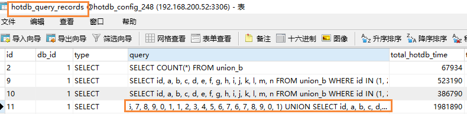 |
|#### ndbSqlAddr & ndbSqlUser & ndb SqlPass |
| **Description of parameter:** |

**Property**                     **Value**
  Parameter value                  ndbSqlAddr
  Visible or not                   Yes
  Description of parameters        NDB SQL-end IP address
  Default value                    localhost:3329
  Whether Reload is valid or not   No
  Min Compatible Version           2.5.2

**Property**                     **Value**
  Parameter value                  ndbSqlUser
  Visible or not                   Yes
  Description of parameters        NDB SQL front-end username
  Default value                    root
  Whether Reload is valid or not   No
  Min Compatible Version           2.5.2

**Property**                     **Value**
  Parameter value                  ndbSqlPass
  Visible or not                   Yes
  Description of parameters        NDB SQL front-end password
  Default value                    root
  Whether Reload is valid or not   No
  Min Compatible Version           2.5.2

| Parameter Setting: |
| --- |
| ndbSqlAddr, ndbSqlUser, ndbSqlPass are supporting parameters: ndbSqlAddr is physical address of NDB SQL node; ndbSqlUser and ndbSqlPass are respectively username and password for connecting NDB SQL node. |
| <property name="ndbSqlAddr">localhost:3329</property> |
| <property name="ndbSqlUser">root</property> |
| <property name="ndbSqlPass">root</property> |
|#### ndbSqlDataAddr |
| **Description of parameter:** |

**Property**                     **Value**
  Parameter value                  ndbSqlDataAddr
  Visible or not                   Yes
  Description of parameters        IP address and port receiving NDB SQL connection
  Default value                    127.0.0.1:3327
  Whether Reload is valid or not   No
  Min Compatible Version           2.5.2

| Parameter Setting: |
| --- |
| The connection from NDB SQL to compute node, that is the communication port from the server IP and NDB SQL where the compute node resides to the compute node, the default value is 127.0.0.1:3327. |
| property name=[ndbSqlDataAddr](#ndbSqlDataAddr)>127.0.0.1:3327</property> |
|#### ndbSqlMode |
| **Description of parameter:** |

**Property**                     **Value**
  Parameter value                  ndbSqlMode
  Visible or not                   Yes
  Description of parameters        Mode used by NDB SQL node (NDB execution mode: none: Forbidden NDB function, the default value; local: NDB SQL server and compute node server are on the same computer)
  Default value                    none
  Whether Reload is valid or not   No
  Min Compatible Version           2.5.2

| Parameter Setting: |
| --- |
| none: the default value, representing Forbidden NDB function; local: NDB SQL server and compute node server are on the same computer, execute NDB logic if meeting NDB condition. |
| <property name=[ndbSqlMode](#ndbSqlMode)>none</property> |
|#### ndbSqlVersion & ndbVersion |
| **Description of parameter:** |

**Property**                     **Value**
  Parameter value                  ndbSqlVersion
  Visible or not                   Yes
  Description of parameters        NDB SQL Version Number
  Default value                    5.7.24
  Whether Reload is valid or not   No
  Min Compatible Version           2.5.2

**Property**                     **Value**
  Parameter value                  ndbVersion
  Visible or not                   Yes
  Description of parameters        NDB Engine Version Number
  Default value                    7.5.12
  Whether Reload is valid or not   No
  Min Compatible Version           2.5.2

| Parameter Setting: |
| --- |
| ndbSqlVersion and ndbVersion are of corresponding relation, and please refer to official MySQL document for the specific corresponding relation. ndbSqlVersion is 5.7.24 by default, and ndbVersion is 7.5.12 by default. The NDB Engine Version supported by the current compute node is 7.5.4 and above, and if to use NDB version, it's required that the data source version must be 5.7.16 and above. |
| <property name="ndbSqlVersion">5.7.24</property> |
| <property name="ndbVersion">7.5.12</property> |
|#### operateMode |
| **Description of parameter:** |

Property                         Value
  Parameter value                  operateMode
  Visible or not                   No
  Description of parameters        Operating mode of compute node
  Default value                    0
  Whether Reload is valid or not   Yes
  Min Compatible Version           2.5.6

| Parameter Setting: |
| --- |
| server.xml中operateMode参数配置如下： |
| <property name=[operateMode](#operateMode)>0</property><!-- Operating mode, 0: normal mode, 1: performance mode, 2: debug mode--> |
| **Role of parameter:** |
| The parameter controls the operating mode of compute nodes, 0 is normal mode, 1 is performance mode, 2 is debug mode. In normal mode, no other parameters or functions will be changed. In performance mode, the functions related to the following parameters will be forced to disable, while in debug mode, the functions related to the following parameters will be forced to enable. |
| recordSql |
| recordSQLSyntaxError |
| recordCrossDNJoin |
| recordUNION |
| recordSubQuery |
| recordDeadLockSQL |
| recordLimitOffsetWithoutOrderby |
| recordSQLKeyConflict |
| recordSQLUnsupported |
| recordMySQLWarnings |
| recordMySQLErrors |
| recordHotDBWarnings |
| recordHotDBErrors |
| recordDDL |
| recordSQLIntercepted |
| recordAuditlog |
| recordSQLForward |
| recordSqlAuditlog |
| operateMode is a hidden parameter, and the default mode is normal mode, that is, operateMode=0. When the compute node is started, the corresponding log will be output in hotdb.log as follows: |
| 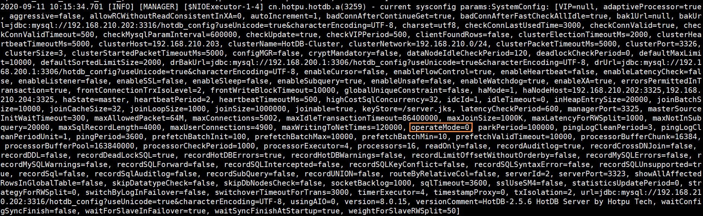 |
| In normal mode, the compute nodes will start according to the parameter configuration of server.xml, and not be affected by operateMode. |
| When it is set to performance mode, that is, modifying server.xml, adding operateMode =1 parameter configuration, then make it work by executing reload @@config in 3325 port, and the compute node will output the corresponding information in hotdb.log as follows: |
|  |
| In performance mode, the compute node will initially force to disable the parameters that affect the performance of compute nodes, for example: |
| recordSql=false,recordSQLSyntaxError=false,recordCrossDNJoin=false,recordUNION=false,recordSubQuery=false,recordDeadLockSQL=false,recordLimitOffsetWithoutOrderby=false,recordSQLKeyConflict=false,recordSQLUnsupported=false,recordMySQLWarnings=false,recordMySQLErrors=false,recordHotDBWarnings=false,recordHotDBErrors=false,recordDDL=false,recordSQLIntercepted=false,recordAuditlog=false,recordSQLForward=false,recordSqlAuditlog=false, even these parameters are configured to true in server.xml. |
| When it is debug mode, the compute node will output the corresponding information in hotdb.log, as follows: |
|  |
| In debug mode, the compute node will force to enable the parameters related to the debug function, for example: |
| recordSql=true,recordSQLSyntaxError=true,recordCrossDNJoin=true,recordUNION=true,recordSubQuery=true,recordDeadLockSQL=true,recordLimitOffsetWithoutOrderby=true,recordSQLKeyConflict=true,recordSQLUnsupported=true,recordMySQLWarnings=true,recordMySQLErrors=true,recordHotDBWarnings=true,recordHotDBErrors=true,recordDDL=true,recordSQLIntercepted=true,recordAuditlog=true,recordSQLForward=true,recordSqlAuditlog=true， even if the parameters are configured to false in server.xml. It should be noted that in debug mode, the compute node will generate more log files, so it is necessary to pay attention to the remaining available disk space to prevent the log files from occupying the disk and causing the compute node service downtime. |
|#### parkPeriod |
| **Description of parameter:** |
| +--------------------------------+----------------------------------------------------------------+ |
| | **Property** | | **Value** | | |
| +--------------------------------+----------------------------------------------------------------+ |
| | Parameter value | | parkPeriod | | |
| +--------------------------------+----------------------------------------------------------------+ |
| | Visible or not | | Yes | | |
| +--------------------------------+----------------------------------------------------------------+ |
| | Description of parameters | | Thread Dormancy Period at the idle time of Message System (ns) | |
| +--------------------------------+----------------------------------------------------------------+ |
| | Default value | | 100000 | | |
| +--------------------------------+----------------------------------------------------------------+ |
| | Min value | | 1000000 | | |
| +--------------------------------+----------------------------------------------------------------+ |
| | Max value | | 1000 | | |
| +--------------------------------+----------------------------------------------------------------+ |
| | Whether Reload is valid or not | N for v.2.4.5 | | |
| | | | | | |
| | | | Y for v.2.4.7 and above | | |
| +--------------------------------+----------------------------------------------------------------+ |
| | Min Compatible Version | | 2.4.3 | | |
| +--------------------------------+----------------------------------------------------------------+ |
| **Parameter Setting:** |
| The parkPeriod parameter in Server.xml is set as follow: |
| <property name=[parkPeriod](#parkPeriod)>100000</property> |
| **Role of parameter:** |
| This parameter is used for adjusting sleep time of cost message queue thread at the idle time of message queue of internal thread communication. |
|#### pingLogCleanPeriod |
| **Description of parameter:** |

**Property**                     **Value**
  Parameter value                  pingLogCleanPeriod
  Visible or not                   Hidden
  Description of parameters        Ping Log Clean Period, 3 by default
  Default value                    3
  Whether Reload is valid or not   Yes
  Min Compatible Version           2.4.9

| Parameter Setting: |
| --- |
| pingLogCleanPeriod parameter configuration in Server.xml is configured as follow: |
| <property name=[pingLogCleanPeriod](#pingLogCleanPeriod)>3</property><!-- Ping Log Clean Period, 3 by default --> |
| **Role of parameter:** |
| pingLogCleanPeriod parameter is 3 by default, with the optional unit being Hour, Day and Month, which shall be decided by the other parameter pingLogCleanPeriodUnit. This parameter is mainly used to control the clean period of the data stored in configDB at the time of ping check, and delete the data before specified time periodically every day. |
|#### pingLogCleanPeriodUnit |
| **Description of parameter:** |

**Property**                     **Value**
  Parameter value                  pingLogCleanPeriodUnit
  Visible or not                   Hidden
  Description of parameters        Unit of ping log clean period, 2 by default, 0: Hour, 1: Day, 2: Month
  Default value                    2
  Whether Reload is valid or not   Yes
  Min Compatible Version           2.4.9

| Parameter Setting: |
| --- |
| pingLogCleanPeriodUnit parameter configuration in Server.xml is configured as follow: |
| <property name=[pingLogCleanPeriodUnit](#pingLogCleanPeriodUnit)>2</property><!-- Unit of ping log clean period, 2 by default, 0: Hour, 1: Day, 2: Month --> |
| **Role of parameter:** |
| pingLogCleanPeriodUnit parameter is 2 by default, meaning that the unit of ping log clean period is Month, besides, the option 0 means Hour and 1 means Day. This parameter is mainly used to control the unit of ping log clean period, and is in support use with the pingLogCleanPeriod parameter. |
|#### pingPeriod |
| **Description of parameter:** |

**Property**                     **Value**
  Parameter value                  pingPeriod
  Visible or not                   Hidden
  Description of parameters        ping server period, Unit: s, 3600s by default, min 300s
  Default value                    3600
  Whether Reload is valid or not   Yes
  Min Compatible Version           2.4.9

| Parameter Setting: |
| --- |
| pingPeriod parameter configuration in Server.xml is configured as follow: |
| <property name=[pingPeriod](#pingPeriod)>3600</property><!-- ping server period, Unit: s, 3600s by default, min 300s --> |
| **Role of parameter:** |
| pingPeriod parameter is 3600 by default, Unit: s, which is mainly used to control ping check period. It's by default to ping a round of IP address of all servers connected with the HotDB Server per hour, for example, client server, configDB server, data source server, etc. Min 300s (that is 5mins) could be configured to trigger a round of check. If the previous round of check is not completed in an hour, then this round of check shall be abandoned directly. |
| In the detection process, for a certain IP address, the program will automatically use 10 packets (64 byte), 10 packets (65000 byte), which are pinged every 1 second. When the network quality is found to be failed, the interval of ping will be shortened to once per minute, and the criteria of failure judgment are as follows: |
| - | If 64-byte packets in the same IDC are not all lost, when the average delay is greater than 1 ms or the max delay is greater than 2 ms, or there is a packet loss, the time, ping type, average delay, max delay and packet loss rate will be recorded into the ConfigDB hotdb_ ping_ log。 If 65000-byte packets are not all lost, when the average delay is greater than 3 ms, or the max delay is greater than 5 ms, or there is packet loss, the time, ping type, average delay, max delay, packet loss rate will be recorded into the ConfigDB hotdb_ ping_ log table. |
| - | If 64-byte packets across the IDCs are not all lost, when the average delay is greater than 10 ms or the max delay is greater than 20 ms, or there is a packet loss, the time, ping type, average delay, max delay and packet loss rate will be recorded into the ConfigDB hotdb_ ping_ log。 If 65000-byte packets are not all lost, when the average delay is greater than 15 ms, or the max delay is greater than 30 ms, or there is packet loss, the time, ping type, average delay, max delay, packet loss rate will be recorded into the ConfigDB hotdb_ ping_ log table. |
|#### prefetchBatchInit |
| **Description of parameter:** |

Property                         Value
  Parameter value                  prefetchBatchInit
  Visible or not                   Yes
  Description of parameters        The initial value of the auto-incremental batch size
  Default value                    100
  Whether Reload is valid or not   Yes
  Min Compatible Version           2.5.4

| Parameter Setting: |
| --- |
| <property name=[prefetchBatchInit](#prefetchBatchInit)>100</property> |
| **Role of parameter:** |
| The initial value of the auto-incremental batch size. If the initial value is set as 100, the range difference of the prefetch interval is 100 by default. For example, if the prefetch starts from 123, the prefetch interval is [123, 223]. |
| The initial value can be configured within the upper and lower limits of the auto-incremental batch size actually configured (prefetchBatchMax and prefetchBatchMin). The default range is [10, 10000]. |
|#### prefetchBatchMax |
| **Description of parameter:** |

Property                         Value
  Parameter value                  prefetchBatchMax
  Visible or not                   Yes
  Description of parameters        The upper limit of the auto-incremental batch size
  Default value                    10000
  Min value                        10
  Max value                        100000
  Whether Reload is valid or not   Yes
  Min Compatible Version           2.5.4

| Parameter Setting: |
| --- |
| <property name=[prefetchBatchMax](#prefetchBatchMax)>10000</property> |
| **Role of parameter:** |
| The upper limit of the auto-incremental batch size. If 1000 is set, the maximum value of the range difference of each prefetch interval is 1000. For example, if the prefetch starts from 123, the maximum value in the prefetch interval is not more than 1123, that is, the values are within [123,1123]. |
|#### prefetchBatchMin |
| **Description of parameter:** |

**Property**                     Value
  Parameter value                  prefetchBatchMin
  Visible or not                   Yes
  Description of parameters        The lower limit of the auto-incremental batch size
  Default value                    10
  Min value                        2
  Max value                        1000
  Whether Reload is valid or not   Yes
  Min Compatible Version           2.5.4

| Parameter Setting: |
| --- |
| <property name=[prefetchBatchMin](#prefetchBatchMin)>10</property> |
| **Role of parameter:** |
| The lower limit of the auto-incremental prefetch batch size. If 100 is set, the minimum value of the range difference of each prefetch interval is 100. For example, if the prefetch starts from 123, the maximum value in the prefetch interval is not less than 223, that is, the next prefetch batch starts from 223 at least, and the next prefetch batch [>=223, 223+prefetch batch size]. |
|#### prefetchValidTimeout |
| **Description of parameter:** |

Property                         Value
  Parameter value                  prefetchValidTimeout
  Visible or not                   Yes
  Description of parameters        The valid timeout time of prefetch(seconds)
  Default value                    10
  Min value                        3
  Max value                        86400
  Whether Reload is valid or not   Yes
  Min Compatible Version           2.5.4

| Parameter Setting: |
| --- |
| <property name=[prefetchValidTimeout](#prefetchValidTimeout)>30</property> |
| **Role of parameter:** |
| The valid timeout time of prefetching the auto-incremental batch. When set as 0, it means that the auto-incremental batch is not abandoned due to the timeout. For example, if 30 seconds is set, the prefetch range is 1-100. If it is more than 30 seconds, the unused value is no longer used. |
|#### processorExecutor |
| **Description of parameter:** |

**Property**                     **Value**
  Parameter value                  processorExecutor
  Visible or not                   Yes
  Description of parameters        Number of threads of processors
  Default value                    4
  Min value                        2
  Max value                        8
  Whether Reload is valid or not   No
  Min Compatible Version           2.4.3

| Parameter Setting: |
| --- |
| <property name=[processorExecutor](#processorExecutor)>4</property><!-- Number of threads of processors --> |
| **Role of parameter:** |
| This parameter is used for setting number of threads of processors in internal thread pool model of the compute node. The parameter [adaptiveProcessor](#adaptiveprocessor) is Enabled by default, and when enabled, the compute node will make Automatic Adaptation to Max processorExecutor. |
| Log in to 3325 port, execute the show @@threadpool; command, and then you could view the current number of processorExecutor. |
|#### Processors |
| **Description of parameter:** |

**Property**                     **Value**
  Parameter value                  processors
  Visible or not                   Yes
  Description of parameters        Number of processors
  Default value                    8
  Min value                        4
  Max value                        128
  Whether Reload is valid or not   No
  Min Compatible Version           2.4.3

| Parameter Setting: |
| --- |
| <property name="processors">8</property><!---Number of processors --> |
| **Role of parameter:** |
| This parameter is used for setting number of threads in internal thread pool model of the compute node. The parameter [adaptiveProcessor](#adaptiveprocessor) is Enable by default, and when enabled, the compute node will make Automatic Adaptation to the max number of processors. |
| Log in to 3325 port, execute show @@threadpool; command, and then you could view the number of current processors. |
|#### readOnly |
| **Description of parameter:** |

**Property**                     **Value**
  Parameter value                  readOnly
  Visible or not                   No
  Description of parameters        readOnly mode or not
  Default value                    false
  Whether Reload is valid or not   Yes
  Min Compatible Version           2.4.8

| Parameter Setting: |
| --- |
| <property name=[readOnly](#readOnly)>false</property><!-- readOnly mode or not --> |
| **Role of parameter:** |
| It is used for setting the current compute node as readonly mode. In readonly mode, compute node only receives DQL (SELECT statement) operation, and SET command row and SHOW type operations, and refuses to execute DDL(CREATE TABLE/VIEW/INDEX/SYN/CLUSTER statement), DML(INSERT, UPDATE, DELETE) and DCL (GRANT, ROLLBACK [WORK] TO [SAVEPOINT], COMMIT) modification operation commands |
| **Notices:** This parameter is still provided for single compute node service, and does not allow multiple compute nodes to provide service simultaneously, that is, it does not allow enabling multiple compute nodes and providing external service at the same time |
| Enable status: |
| mysql> drop table customer; |
| ERROR 1289 (HY000): Command not allowed in Read-Only mode. |
|#### recordAuditlog |
| **Description of parameter:** |

**Property**                     **Value**
  Parameter value                  recordAuditlog
  Visible or not                   No
  Description of parameters        Record audit log
  Default value                    true
  Whether Reload is valid or not   Yes
  Min Compatible Version           2.5.0

| Parameter Setting: |
| --- |
| recordAuditlog parameter configuration in Server.xml is configured as follow: |
| <property name=[recordAuditlog](#recordAuditlog)>true</property><!---Record audit log --> |
| **Role of parameter:** |
| recordAuditlog enables audit log or not. This parameter is used for controlling whether to record the management port operation information or not. When the audit log is enabled, you could view management port operation record via Event->Audit log on the management platform. |
|#### recordCrossDNJoin |
| **Description of parameter:** |

**Property**                     **Value**
  Parameter value                  recordCrossDNJoin
  Visible or not                   No
  Description of parameters        Record cross-node JOIN in log
  Default value                    false
  Whether Reload is valid or not   Yes
  Min Compatible Version           2.4.7

| Parameter Setting: |
| --- |
| recordCrossDNJoin parameter configuration in Server.xml is configured as follow: |
| <property name=[recordCrossDNJoin](#recordCrossDNJoin)>false</property> |
| **Role of parameter:** |
| recordCrossDNJoin records cross-node join statement |
| Create Table: |
| account table auto_crc32sharding, sharding key id, node 1 |
| borrower table auto_modsharding, sharding key id, node 2 |
| Execute as follow: |
| mysql> SELECT * FROM account a JOIN borrower b; |
| View /logs/sql.log of compute node installation directory |
| 2018-05-22 16:17:11.607 [INFO] [CROSSDNJOIN] [$NIOExecutor-6-2] JoinVisitor(4947) -- SELECT * FROM account a JOIN borrower b |
|#### recordDDL |
| **Description of parameter:** |

**Property**                     **Value**
  Parameter value                  recordDDL
  Visible or not                   No
  Description of parameters        Record DDL statement in log
  Default value                    false
  Whether Reload is valid or not   Yes
  Min Compatible Version           2.4.7

| Parameter Setting: |
| --- |
| recordDDL parameter configuration in Server.xml is configured as follow: |
| <property name=[recordDDL](#recordDDL)>false</property> |
| **Role of parameter:** |
| recordDDL log records DDL statement, execute the following statement: |
| mysql> create table abc(id int); |
| View /logs/sql.log of compute node installation directory |
| 2018-05-23 14:23:52.697 [INFO] [HOTDBWARNING] [$NIOExecutor-6-2] ServerConnection(2368) -- sql: create table abc(id int), warning: {Create table without Primary Key and unique key} |
| 2018-05-23 14:23:52.698 [INFO] [DDL] [$NIOExecutor-6-2] ServerConnection(123) -- sql: create table abc(id int) |
|#### recordDeadLockSQL |
| **Description of parameter:** |

**Property**                     **Value**
  Parameter value                  recordDeadLockSQL
  Visible or not                   No
  Description of parameters        The log records the statement triggering deadlock
  Default value                    true
  Whether Reload is valid or not   Yes
  Min Compatible Version           2.4.7

| Parameter Setting: |
| --- |
| recordDeadLockSQL parameter configuration in Server.xml is configured as follow: |
| <property name=[recordDeadLockSQL](#recordDeadLockSQL)>true</property> |
| **Role of parameter:** |
| recordDeadLockSQL log records the statement triggering deadlock: |
| 1. Create deadlock scenario |
| 2. View /logs/hotdb.log of compute node installation directory: |
| 2018-05-23 14:54:30.865 [INFO] [DEADLOCK] [$NIOREACTOR-1-RW] am(-1) -- sql: INSERT INTO table2000 VALUES (3); error response from MySQLConnection [node=4, id=277, threadId=133815, state=borrowed, close=false, autocommit=false, host=192.168.220.102, port=3309, database=db249, localPort=15332, isClose:false, toBeClose:false], err: Lock wait timeout exceeded; try restarting transaction, code: 1205 |
|#### recordHotDBErrors |
| **Description of parameter:** |

**Property**                     **Value**
  Parameter value                  recordHotDBErrors
  Visible or not                   No
  Description of parameters        The log records error message returned by HotDB
  Default value                    true
  Whether Reload is valid or not   Yes
  Min Compatible Version           2.4.8

| Parameter Setting: |
| --- |
| recordHotDBErrors parameter configuration in Server.xml is configured as follow: |
| <property name=[recordHotDBErrors](#recordHotDBErrors)>true</property> |
| **Role of parameter:** |
| recordHotDBErrors log records error message returned by compute node |
| For example: when executing Create statement by user without create privilege, the prompt is as follow: |
| 2018-06-04 10:43:07.316 [INFO] [HOTDBERROR] [$NIOExecutor-3-0] ServerConnection(155) -- sql: create table a001(id int), err: [CREATE] command denied to user 'jzl' to logic database 'TEST_JZL' |
|#### recordHotDBWarnings |
| **Description of parameter:** |

**Property**                     **Value**
  Parameter value                  recordHotDBWarnings
  Visible or not                   No
  Description of parameters        The log records the warning message returned by the compute node
  Default value                    false
  Whether Reload is valid or not   Yes
  Min Compatible Version           2.4.7

| Parameter Setting: |
| --- |
| recordHotDBWarnings parameter configuration in Server.xml is configured as follow: |
| <property name=[recordHotDBWarnings](#recordHotDBWarnings)>false</property> |
| **Role of parameter:** |
| recordHotDBWarnings log records the warning message returned by the compute node, execute as follow: |
| create table abc(id int); |
| View /logs/sql.log of the compute node installation directory |
| 2018-05-23 14:23:52.697 [INFO] [HOTDBWARNING] [$NIOExecutor-6-2] ServerConnection(2368) -- sql: create table abc(id int), warning: {Create table without Primary Key and unique key} |
| 2018-05-23 14:23:52.698 [INFO] [DDL] [$NIOExecutor-6-2] ServerConnection(123) -- sql: create table abc(id int) |
|#### recordLimitOffsetWithoutOrderby |
| **Description of parameter:** |

**Property**                     **Value**
  Parameter value                  recordLimitOffsetWithoutOrderby
  Visible or not                   No
  Description of parameters        The log records the limit statement without orderby
  Default value                    false
  Whether Reload is valid or not   Yes
  Min Compatible Version           2.4.7

| Parameter Setting: |
| --- |
| recordLimitOffsetWithoutOrderby parameter configuration in Server.xml is configured as follow: |
| <property name=[recordLimitOffsetWithoutOrderby](#recordLimitOffsetWithoutOrderby)>false</property> |
| **Role of parameter:** |
| recordLimitOffsetWithoutOrderby log records the limit statement without orderby. |
| Execute as follow: |
| mysql> select * FROM account a WHERE a.Branch_name IN(SELECT b.Branch_name FROM branch b ) limit 1,3; |
| View /logs/sql.log of compute node installation directory |
| 2018-05-23 14:05:14.915 [INFO] [LIMITOFFSETWITHOUTORDERBY] [$NIOExecutor-6-l] SubqueryExecutor(97) - sql: select * FROM account a WHERE a.Branch_name IN(SELECT b.Branch_name FROM branch b) limit 1,3 |
| 2018-05-23 14:05:14.922 [INFO] [LIMITOFFSETWITHOUTORDERBY] [$NIOExecutor-2-3] BaseSession(97) - sql: SELECT A.`Balance`, A.`Branch_name`, A.`Account_number`, A.`account_date` FROM account AS a WHERE a.Branch_name IN (UNHEX('4272696768746F6E'), UNHEX('4272696768746F6E'), UNHEX('526564776F6F64'), UNHEX('50657272797269646765'), UNHEX('50657272797269646765'), UNHEX('526564776 |
| F6f64'), NULL) LIMIT 1 , 3 |
|#### recordMySQLErrors |
| **Description of parameter:** |

**Property**                     **Value**
  Parameter value                  recordMySQLErrors
  Visible or not                   No
  Description of parameters        The log records error message returned by MySQL
  Default value                    false
  Whether Reload is valid or not   Yes
  Min Compatible Version           2.4.7

| Parameter Setting: |
| --- |
| recordMySQLErrors parameter configuration in Server.xml is configured as follow: |
| <property name=[recordMySQLErrors](#recordMySQLErrors)>false</property> |
| **Role of parameter:** |
| recordMySQLErrors log records error message returned by MySQL. |
| Execute as follow: |
| msyql> select form; |
| View /logs/hotdb.log of compute node installation directory |
| 2018-05-23 14:38:55.843 [INFO] [MYSQLERROR] [$NIOREACTOR-7-RW] MySQLConnection(56) -- sql: select form, error response from MySQLConnection [node=4, id=223, threadId=118551, state=borrowed, close=false, autocommit=true, host=192.168.220.103, port=3309, database=db249, localPort=27007, isClose:false, toBeClose:false], err: Unknown column 'form' in 'field list', code: 1054 |
|#### recordMySQLWarnings |
| **Description of parameter:** |

**Property**                     **Value**
  Parameter value                  recordMySQLWarnings
  Visible or not                   Hidden
  Description of parameters        The log records the warning message returned by MySQL
  Default value                    false
  Whether Reload is valid or not   Yes
  Min Compatible Version           2.4.7

| Parameter Setting: |
| --- |
| recordMySQLWarnings parameter configuration in Server.xml is configured as follow: |
| <property name=[recordMySQLWarnings](#recordMySQLWarnings)>false</property> |
| **Role of parameter:** |
| recordMySQLWarnings log records the warning message returned by MySQL. |
| Execute as follow: |
| mysql> update account set Account_number="$!\\\''## "; |
| View /logs/sql.log of compute node installation directory, |
| 2018-06-12 10:52:07.011 [INFO] [MYSQLWARNING] |[$NIOREACTOR-3-RW] showwarninqsHandler(79) - sql: UPDATE account SET Account_number = '*$!\\\\\'\'## ', warninq from MySQLConnection [node=2, id=78814, threadId=75272, state=runninq, closed=false, autocommit=false, host=192.168.200.51, port=3309, database-db249, localPort=13317, isclose:false, toBeclose:false], warning: Data truncated for column 'Account_number' at row 1, code: 1265 |
| 2018-06-12 10:52:07.012 [INFO] [MYSQLWARNING] |[$NIOREACTOR-3-RW] showwarninqsHandler(79) - sql: UPDATE account SET Account_number = '*$!\\\\\'\'## ', warninq from MySQLConnection [node=2, id=78814, threadId=75272, state=runninq, closed=false, autocommit=false, host=192.168.200.51, port=3309, database-db249, localPort=13317, isclose:false, toBeclose:false], warning: Data truncated for column 'Account_number' at row 2, code: 1265 |
| 2018-06-12 10:52:07.012 [INFO] [MYSQLWARNING] |[$NIOREACTOR-3-RW] showwarninqsHandler(79) - sql: UPDATE account SET Account_number = '*$!\\\\\'\'## ', warninq from MySQLConnection [node=3, id=55313, threadId=166, state=runninq, closed=false, autocommit=false, host=192.168.200.52, port=3309, database-db249, localPort=13317, isclose:false, toBeclose:false], warning: Data truncated for column 'Account_number' at row 1, code: 1265 |
| 2018-06-12 10:52:07.013 [INFO] [MYSQLWARNING] |[$NIOREACTOR-3-RW] showwarninqsHandler(79) - sql: UPDATE account SET Account_number = '*$!\\\\\'\'## ', warninq from MySQLConnection [node=3, id=55313, threadId=166, state=runninq, closed=false, autocommit=false, host=192.168.200.52, port=3309, database-db249, localPort=13317, isclose:false, toBeclose:false], warning: Data truncated for column 'Account_number' at row 2, code: 1265 |
|#### recordSql |
| **Description of parameter:** |

**Property**                     **Value**
  Parameter value                  recordSql
  Visible or not                   Yes
  Description of parameters        Make statistics of SQL execution condition or not
  Default value                    false
  Whether Reload is valid or not   Yes
  Min Compatible Version           2.4.3

| Parameter Setting: |
| --- |
| <property name=[recordSql](#recordSql)>false</property><!-- Make statistics of SQL execution condition or not, Yes: true, No: false --> |
| **Role of parameter:** |
| Make statistics of SQL execution condition or not. |
| 1. | View via the Slow Query Log Analysis page on the management platform |
| - | OFF status |
|  |
| - | ON status |
| 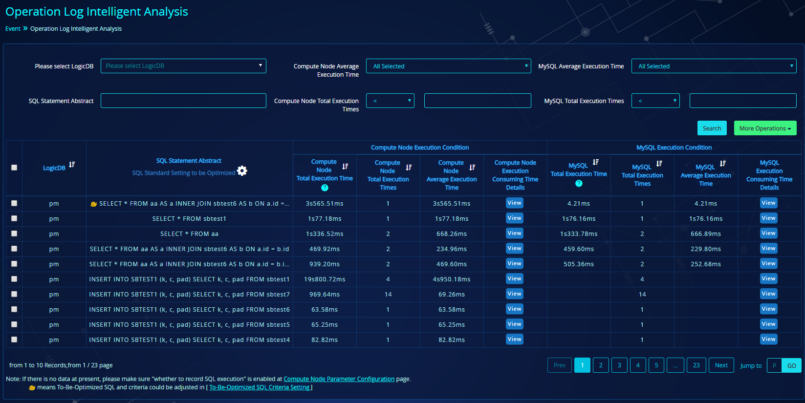 |
| 2. View statistics of SQL execution via server configDB |
| mysql> select * from hotdb_query_records order by db_id limit 1\\G |
| ******************************1. row*************************** |
| id: 2 |
| db_id: 1 |
| type: SELECT |
| query: SELECT COUNT(*) FROM union b |
| total_hotdb_time: 67934 |
| total_mysql_time: 52105 |
| hms1: 0 |
| hms10: 1 |
| hms300: 1 |
| hs1: 0 |
| hs3: 0 |
| hs10: 0 |
| hs60: 0 |
| hs600: 0 |
| hs600p: 0 |
| mmsl: 0 |
| mms10: 1 |
| mms300: 1 |
| ms1: 0 |
| ms3: 0 |
| ms10: 0 |
| ms60: 0 |
| ms600: 0 |
| ms600p: 0 |
| htime24: 67934 |
| htime48: 67934 |
| mtime24: 52105 |
| mtime48: 52105 |
| hcount24: 2 |
| hcount48: 2 |
| mcount24: 2 |
| mcount48: 2 |
| return_rows: 2 |
| last update time: 2018-05-29 11:04:31.000000 |
| crc: 321944166562 |
| 1 row in set (0.00 sec) |
|#### recordSqlAuditlog |
| **Description of parameter:** |

**Property**                     **Value**
  Parameter value                  recordSqlAuditlog
  Visible or not                   No
  Description of parameters        Record SQL audit log.
  Default value                    false
  Whether Reload is valid or not   Yes
  Min Compatible Version           2.5.5

| Parameter Setting: |
| --- |
| The parameter recordSqlAuditlog in Server.xml is configured as false by default: |
| <property name=[recordSqlAuditlog](#recordSqlAuditlog)>false</property> |
| **Role of parameter:** |
| If the parameter is set as true，DDL、DML、DQL and other operations will be recorded in logs/extra/sqlaudit/ of the compute node installation directory. |
| For example, execute DDL on the server of compute node and view the log output. |
| {"affected_rows":"0","command":"CREATE TABLE `t_sharding_01` (\\n`id` int(10) NOT NULL AUTO_INCREMENT,\\n`name` varchar(50) NOT NULL,\\n`age` int(3),\\nPRIMARY KEY (`id`)\\n) ENGINE=InnoDB DEFAULT CHARSET=utf8mb4","connection_id":"44","end_time":"2020-04-27 14:58:34.769","failed_reason":"","host":"127.0.0.1","ip":"127.0.0.1","log_id":"9524067900080128","logic_db":"CXD_DB","matched_rows":"0","port":"3323","query_rows":"0","sql_subtype":"CREATE","sql_type":"DDL","status":"1","time":"2020-04-27 14:58:34.736","user":"cxd@%"} |
| Note: the log is output in the format of json. Special characters such as double quotation marks are escaped with . The meaning of some keys in json is as follows: |
| sql_ type: the type of SQL currently executed, including DDL/DML/DQL/OTHER. |
| sql_ subtype: the subtype of SQL currently executed, among which DDL includes CREARE/ALTER/DROP/TUNCATE/RENAME; DQL includes SELECT; DML includes UPDATE/DELETE/INSERT/REPLACE/LOAD; OTHER includes SET/PREPARE/TRANSACTION/SHOW. |
| ip: the IP address of the client executing SQL. |
| time: time to execute SQL. |
| user: the user (including the host name) who connects to the compute node and executes SQL |
| host: connects to the host value specified by the compute node. |
| logic_ db: connects to the LogicDB used by the compute node to execute SQL. |
| connection_ id: the front-end connection ID used to execute SQL. |
| command: the statement that specifically executes SQL (the original SQL statement). |
| query_ rows: the number of data rows returned (mainly reflected in the SELECT operation). |
| affected_ rows: the number of rows affected by SQL execution. |
| matched_ rows: the number of rows matched by SQL execution. |
| status: whether the SQL execution status is success or failure. 0 is for failure and 1 is for success. |
| failed_ reason: the reason why SQL execution failed. |
| end_ time: end time of SQL execution. |
|#### recordSQLIntercepted |
| **Description of parameter:** |

**Property**                     **Value**
  Parameter value                  recordSQLIntercepted
  Visible or not                   No
  Description of parameters        The log records the intercepted statement
  Default value                    false
  Whether Reload is valid or not   Yes
  Min Compatible Version           2.4.7

| Parameter Setting: |
| --- |
| recordSQLIntercepted parameter configuration in Server.xml is configured as follow: |
| <property name=[recordSQLIntercepted](#recordSQLIntercepted)>true</property> |
| **Role of parameter:** |
| recordSQLIntercepted log records the intercepted statement; configuration of intercepted statement is in Middleware management platform->Safety->SQL firewall. |
| View /logs/sql.log of compute node installation directory |
| 2018-06-01 14:17:45.669 [INFO] [SQLINTERCEPTED] [$NIOExecutor-1-2] g(-1) -- sql: DELETE FROM sql_intercept_tab, user:zy, ip: 192.168.200.45, db: TEST_JZL, intercepted by filewall: not allowed to execute delete without where expression |
|#### recordSQLKeyConflict |
| **Description of parameter:** |

**Property**                     **Value**
  Parameter value                  recordSQLKeyConflict
  Visible or not                   No
  Description of parameters        The log records the statement with Primary Key conflict and violating foreign key constraint
  Default value                    false
  Whether Reload is valid or not   Yes
  Min Compatible Version           2.4.7

| Parameter Setting: |
| --- |
| recordSQLKeyConflict parameter configuration in Server.xml is configured as follow: |
| <property name=[recordSQLKeyConflict](#recordSQLKeyConflict)>false</property> |
| **Role of parameter:** |
| recordSQLKeyConflict log records the statement with Primary Key conflict and violating foreign key constraint. |
| Executed as follow: |
| Create Table: |
| mysql> CREATE TABLE `vtab001` (`id` int(11) NOT NULL,`name` varchar(255) DEFAULT NULL,PRIMARY KEY (`id`)); |
| Execute Insert statement once: |
| mysql> insert into vtab001 values(1,'aaa'); |
| Execute again, to violate the Primary Key Constraint: |
| mysql> insert into vtab001 values(1,'aaa'); |
| View /logs/sql.log of compute node installation directory |
| 2018-06-01 14:09:47.139 [INFO] [SQLKEYCONFLICT] [$NIOREACTOR-1-RW] MySQLConnection(65) -- sql: insert into vtab001 values(1,'aaa'), error response from MySQLConnection [node=1, id=19, threadId=121339, state=borrowed, closed=false, autocommit=true, host=192.168.220.102, port=3306, database-db249, localPort=56158, isclose:false, toBeclose:false], err: Duplicate entry '1' for key 'PRIMARY', CODE: 1062 |
|#### recordSQLSyntaxError |
| **Description of parameter:** |

**Property**                     **Value**
  Parameter value                  recordSQLSyntaxError
  Visible or not                   No
  Description of parameters        The log records statement with Syntax error
  Default value                    false
  Whether Reload is valid or not   Yes
  Min Compatible Version           2.4.7

| Parameter Setting: |
| --- |
| recordSQLSyntaxError parameter configuration in Server.xml is configured as follow: |
| <property name=[recordSQLSyntaxError](#recordSQLSyntaxError)>false</property> |
| **Role of parameter:** |
| recordSQLSyntaxError records statement with Syntax error. |
| For example: |
| mysql> SELECT * FROM; |
| View /logs/sql.log of compute node installation directory |
| 2018-05-22 16:12:42.686 [INFO] [SQLSYNTAXERROR] [$NIOExecutor-6-3] ServerConnection(671) - SELECT * FROM |
|#### recordSQLUnsupported |
| **Description of parameter:** |

**Property**                     **Value**
  Parameter value                  recordSQLUnsupported
  Visible or not                   No
  Description of parameters        The log records the statement not supported
  Default value                    true
  Whether Reload is valid or not   Yes
  Min Compatible Version           2.4.7

| Parameter Setting: |
| --- |
| recordSQLUnsupported parameter configuration in Server.xml is configured as follow: |
| <property name=[recordSQLUnsupported](#recordSQLUnsupported)>true</property> |
| **Role of parameter:** |
| recordSQLUnsupported log records the unsupported statement. |
| For example: |
| Create Table: mysql> CREATE TABLE `vtab001` (`id` int(11) NOT NULL,`name` varchar(255) DEFAULT NULL,PRIMARY KEY (`id`)); |
| Execute the statement not supported by HotDB for the time being: mysql> select * into vtab001_bak from vtab001; |
| View /logs/sql.log of compute node installation directory |
| 2018-05-22 14:19:54.395 [INFO] [SQLUNSUPPORTED] [$NIOExecutor-6-2] ServerConnection(110) -- sql: select * into vtab001_bak from vtab001 |
|#### recordSubQuery |
| **Description of parameter:** |

**Property**                     **Value**
  Parameter value                  recordSubQuery
  Visible or not                   No
  Description of parameters        The log records Subquery
  Default value                    false
  Whether Reload is valid or not   Yes
  Min Compatible Version           2.4.7

| Parameter Setting: |
| --- |
| recordSubQuery parameter configuration in Server.xml is configured as follow: |
| <property name=[recordSubQuery](#recordSubQuery)>false</property> |
| **Role of parameter:** |
| recordSubQuery log records Subquery. |
| For example: |
| mysql> select * FROM account a WHERE a.Branch_name IN(SELECT b.Branch_name FROM branch b ); |
| View /logs/sql.log of compute node installation directory |
| 2018-05-23 13:56:11.714 [INFO] [SUBQUERY] [$NIOExecutor-6-0] SubqueryExecutor(169) -- select * FROM account a WHERE a.Branch_name IN(SELECT b.Branch_name FROM branch b ) |
|#### recordUNION |
| **Description of parameter:** |

**Property**                     **Value**
  Parameter value                  recordUNION
  Visible or not                   No
  Description of parameters        The log records UNION
  Default value                    false
  Whether Reload is valid or not   Yes
  Min Compatible Version           2.4.7

| Parameter Setting: |
| --- |
| recordUNION parameter configuration in Server.xml is configured as follow: |
| <property name=[recordUNION](#recordUNION)>false</property> |
| **Role of parameter:** |
| recordUNION records UNION statement. |
| For example: |
| mysql> SELECT * FROM trends UNION SELECT * from trends_uint; |
| View /logs/sql.log of compute node installation directory |
| 2018-05-23 13:30:27.156 [INFO] [UNION] [$NIOREACTOR-5-RW] UnionExecutor(162) - SELECT * FROM trends UNION SELECT * from trends_uint |
|#### routeByRelativeCol |
| **Description of parameter:** |

**Property**                     **Value**
  Parameter value                  routeByRelativeCol
  Visible or not                   No
  Description of parameters        It does not include the route via Secondary Index Field at the time of sharding key
  Default value                    false
  Whether Reload is valid or not   No
  Min Compatible Version           2.5.2

| Parameter Setting: |
| --- |
| routeByRelativeCol parameter configuration in Server.xml is configured as follow: |
| <property name=[routeByRelativeCol](#routeByRelativeCol)>false</property><!-- It does not include the route via Secondary Index Field at the time of sharding key --> |
| **Role of parameter:** |
| This function is OFF by default, that is, it does not route via Secondary Index Field when the sharding key is not included, and it is ON after being modified as true. After enabled, it supports to locate to the specific node via Query Secondary Index and distribute the SELECT Query statement to specified node only instead of all nodes when the SELECT Query statement does not include sharding key but includes Unique Constraint Field. |
|#### serverId |
| **Description of parameter:** |

**Property**                     **Value**
  Parameter value                  serverId
  Visible or not                   Yes
  Description of parameters        Cluster node number 1-N (number of nodes), unique in cluster
  Default value                    1
  Whether Reload is valid or not   No
  Min Compatible Version           2.5.0

| Parameter Setting: |
| --- |
| serverId parameter configuration in Server.xml is configured as follow: |
| <property name=[serverId](#serverId)>1</property><!-- Cluster node number 1-N (number of nodes), unique in cluster --> |
| **Role of parameter:** |
| It is used for dividing connection communication ID among the nodes in the cluster, and this Parameter Setting shall be set from 1 continuously without repetition, and in case of repetition, the cluster will start abnormally. |
|#### service port & management port |
| **Description of parameter:** |

**Property**                     **Value**
  Parameter value                  service port
  Visible or not                   Yes
  Description of parameters        service port
  Default value                    3323
  Whether Reload is valid or not   No
  Min Compatible Version           2.4.3

**Property**                     **Value**
  Parameter value                  management port
  Visible or not                   Yes
  Description of parameters        management port
  Default value                    3325
  Whether Reload is valid or not   No
  Min Compatible Version           2.4.3

| Role of parameter: |
| --- |
| Service port is used to log in to the compute node to execute relevant statements, and its use is similar to that of MySQL. |
| management port is used to monitor compute node service information and monitoring statistical information, and you could view by executing relevant commands. |
|#### showAllAffectedRowsInGlobalTable |
| **Description of parameter:** |

**Property**                     **Value**
  Parameter value                  showAllAffectedRowsInGlobalTable
  Visible or not                   Yes
  Description of parameters        Whether Global Table IDU statement shows total number of AffectedRows in all nodes
  Default value                    false
  Whether Reload is valid or not   Yes
  Min Compatible Version           2.4.3

| Role of parameter: |
| --- |
| When showAllAffectedRowsInGlobalTable Parameter is set as true, Global Table will execute insert,delete,update related SQL statements, and the result will show total number of affected nodes. |
| For example: Global Table join_c06_ct associates 8 nodes; after executing this SQL statement, 1 row of the actual data will be updated; when this Parameter is set as true, the result will show that the affected number is 8 (that is: number of updated rows*number of affected nodes). |
| mysql> delete from join_us06_ct where id = 8; |
| Query OK, 8 rows affected (0.01 sec) |
| mysql> update join_us06_ct set e = 'y' where id =7; |
| Query OK, 8 rows affected (0.04 sec) |
| Rows matched: 8 Changed: 8 Warnings: 0 |
| mysql> insert into join_us06_ct values (8,6,1.3,1.4,'y','u',now(),now(),2017); |
| Query OK, 8 rows affected (0.01 sec) |
| Records: 8 Duplicates: 0 Warnings: 0 |
| When this Parameter is set as false, it will only show number of rows affected, as prompted below: |
| mysql> update join_us06_ct set e = 'm' where id =4; |
| Query OK, 1 rows affected (0.10 sec) |
| Rows matched: 1 Changed: 1 Warnings: 0 |
|#### skipDatatypeCheck |
| **Description of parameter:** |

**Property**                     **Value**
  Parameter value                  skipDatatypeCheck
  Visible or not                   No
  Description of parameters        Control whether to skip checking of column data type in table structure
  Default value                    false
  Whether Reload is valid or not   Yes
  Min Compatible Version           2.4.5

| Parameter Setting: |
| --- |
| skipDatatypeCheck parameter in Server.xml |
| <property name=[skipDatatypeCheck](#skipDatatypeCheck)>true</property> |
| **Role of parameter:** |
| When executing Create and Alter statements on Middleware server, whether to check if there is double, float, real data type or not in non-sharding key. |
| For example: |
| mysql> alter table skipDatatypeCheck add(phone double(10,3)); |
| skipDatatypeCheck=false: |
| mysql> alter table skipDatatypeCheck add(phone double(10,3)); |
| ERROR 1064 (HY000): Column type:'DOUBLE' is forbidden, you could change column:'PHONE' to type 'DECIMAL' |
| skipDatatypeCheck=true: |
| mysql> alter table skipDatatypeCheck add(phone double(10,3)); |
| Query OK, 0 rows affected (0.23 sec) |
|#### socketBacklog |
| **Description of parameter:** |

**Property**                     **Value**
  Parameter value                  socketBacklog
  Visible or not                   No
  Description of parameters        service port Socket backlog
  Default value                    1000
  Min value                        1000
  Max value                        4000
  Whether Reload is valid or not   No
  Min Compatible Version           2.4.3

| Parameter Setting: |
| --- |
| <property name=[socketBacklog](#socketBacklog)>1000</property><!-- service port Socket backlog (Unit: Ge) --> |
| **Role of parameter:** |
| Service port socket requires a certain period of time to process socket connection of the Client and has a queue to store the Client Socket haven't been processed in time; the capacity of the queue is backlog. If the queue has been fully occupied by Client socket, ServerSocket will refuse the new connections to guarantee enough queue capacity, thus there will be no connection which can't be connected due to small queue capacity. |
|#### sqlTimeout |
| **Description of parameter:** |
| +--------------------------------+---------------------------+ |
| | **Property** | | **Value** | | |
| +--------------------------------+---------------------------+ |
| | Parameter value | | sqlTimeout | | |
| +--------------------------------+---------------------------+ |
| | Visible or not | | Yes | | |
| +--------------------------------+---------------------------+ |
| | Description of parameters | | Sql Execution Timeout (S) | |
| +--------------------------------+---------------------------+ |
| | Default value | | 3600 | | |
| +--------------------------------+---------------------------+ |
| | Min value | | 1 | | |
| +--------------------------------+---------------------------+ |
| | Max value | | 28800 | | |
| +--------------------------------+---------------------------+ |
| | Whether Reload is valid or not | N for v.2.4.5 | | |
| | | | | | |
| | | | Y for v.2.4.7 and above | | |
| +--------------------------------+---------------------------+ |
| | Min Compatible Version | | 2.4.3 | | |
| +--------------------------------+---------------------------+ |
| **Role of parameter:** |
| This is the max time of compute node from sending SQL to data source to receiving SQL execution result (including single-node and cross-node). If exceeding the set time, timeout will be prompted. |
| When SQL execution time exceeds the set time, there will be prompt as follow: |
| mysql> select a.*,b.*,c.* from customer_auto_3 a join customer_auto_1 b on a.postcode=b.postcode join customer_auto_2 c on a.provinceid=c.provinceid where c.provinceid in (12,15) and b.province !='anhui' group by a.postcode order by a.birthday,a.provinceid,b.birthday,c.postcode limit 1000; |
| ERROR 1003 (HY000): query timeout, transaction rollbacked automatically and a new transaction started automatically |
|#### sslUseSM4 |
| **Description of parameter:** |

**Property**                     **Value**
  Parameter value                  sslUseSM4
  Visible or not                   No
  Description of parameters        Whether to support SM4 native cipher algorithm
  Default value                    no
  Whether Reload is valid or not   Yes
  Min Compatible Version           2.5.5

| Parameter Setting: |
| --- |
| sslUseSM4 in server.xml is configure as follows: |
| <property name=[sslUseSM4](#sslUseSM4)>true</property><!-- Whether to support SM4 native cipher algorithm --> |
| **Role of parameter:** |
| If enableSSL and sslUseSM4 in server.xml are enabled, the client can access the compute node in the encrypted state of native cipher algorithm.\ |
|  |
| For users, this function can only be viewed through packet capture. Example: if you see the number of an encrypted suite (0xff01) defined by HotDB Server SM4 in TLS handshake package through packet capture, it indicates that SM4 encryption and decryption suite has taken effect.\ |
| \ |
| 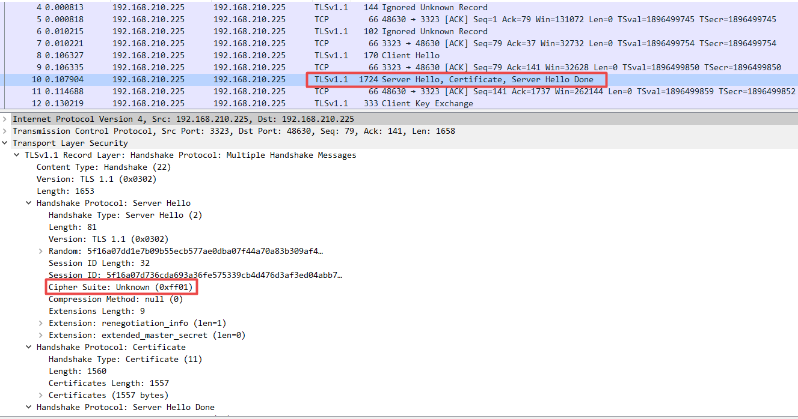 |
|#### statisticsUpdatePeriod |
| **Description of parameter:** |
| +--------------------------------+---------------------------------------+ |
| | **Property** | | **Value** | | |
| +--------------------------------+---------------------------------------+ |
| | Parameter value | | statisticsUpdatePeriod | | |
| +--------------------------------+---------------------------------------+ |
| | Visible or not | | Yes | | |
| +--------------------------------+---------------------------------------+ |
| | Description of parameters | | Command Statistics Persistence Period | |
| +--------------------------------+---------------------------------------+ |
| | Default value | | 0 Non-persistence | | |
| +--------------------------------+---------------------------------------+ |
| | Min value | | 0 | | |
| +--------------------------------+---------------------------------------+ |
| | Max value | | 3600000 | | |
| +--------------------------------+---------------------------------------+ |
| | Whether Reload is valid or not | N for v.2.4.5 | | |
| | | | | | |
| | | | Y for v.2.4.7 and above | | |
| +--------------------------------+---------------------------------------+ |
| | Min Compatible Version | | 2.4.3 | | |
| +--------------------------------+---------------------------------------+ |
| **Role of parameter:** |
| This is the period of command statistics information persistence to the configDB. |
| If set as 0, the program will exit due to abnormality, and there will be no persistence； if the configured value is greater than 0, then periodical persistence could be made to the database, and could also be accumulated upon restart. |
| When executing SQL statement on Client, relevant commands will be counted into configDB. When set as 0, none will be counted into configDB. |
| mysql> use test_ct |
| Database changed |
| mysql> select * from tid; |
| Empty set (0.03 sec) |
| 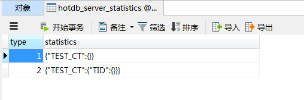 |
|#### strategyForRWSplit |
| **Description of parameter:** |

**Property**                     **Value**
  Parameter value                  strategyForRWSplit
  Visible or not                   Yes
  Description of parameters        Enable Read/write splitting or not
  Default value                    0
  Whether Reload is valid or not   Yes
  Min Compatible Version           2.4.3

| Role of parameter: |
| --- |
| When the parameter is set as 0, it means not to enable Read/write splitting, and all will be read from the host. |
| mysql> select * from ss order by id; |
| +------+---------+ |
| | id | a | |
| +------+---------+ |
| | 1 | master | |
| | 2 | master | |
| | 3 | master | |
| | 4 | master | |
| | 5 | master | |
| +------+---------+ |
| 5 rows in set (0.00 sec) |
| When the parameter is set as 1, it means that splittable Read requests are sent to all available data sources, and according to the set read proportion of the Slave, read the Slave or Master. |
| mysql> select * from ss; |
| +------+---------+ |
| | id | a | |
| +------+---------+ |
| | 1 | master | |
| | 2 | master | |
| | 3 | master | |
| | 4 | slave | |
| | 5 | slave | |
| +------+---------+ |
| 5 rows in set (0.00 sec) |
| When the parameter is set as 2, it means that splittable Read requests are sent to available Slave data sources, and all Read requests beyond the transaction are sent to the Slave data source, while the Read requests within the transaction are sent to the Master data source. |
| - | Beyond transaction: |
| mysql> select * from ss; |
| +------+---------+ |
| | id | a | |
| +------+---------+ |
| | 1 | slave | |
| | 2 | slave | |
| | 3 | slave | |
| | 4 | slave | |
| | 5 | slave | |
| +------+---------+ |
| 5 rows in set (0.00 sec) |
| - | Within transaction: |
| mysql> select * from ss order by id; |
| +------+---------+ |
| | id | a | |
| +------+---------+ |
| | 1 | master | |
| | 2 | master | |
| | 3 | master | |
| | 4 | master | |
| | 5 | master | |
| +------+---------+ |
| 5 rows in set (0.00 sec) |
| When the parameter is set as 3, it means that the Read requests in transaction before Write occurs are sent to available Slave data sources. Read requests beyond the transaction are sent to available Salve data sources. |
| mysql> begin |
| Query OK, 0 row affected (0.00 sec) |
| mysql> select * from ss; |
| +---------+---------+ |
| | id | a | |
| +---------+---------+ |
| | 4 | slave | |
| | 5 | slave | |
| | 600004 | write | |
| | 600007 | write | |
| | 600013 | write | |
| | 1 | slave | |
| | 2 | slave | |
| | 3 | slave | |
| +---------+---------+ |
| 8 rows in set (0.00 sec) |
| mysql> insert into ss values(null,'write'); |
| Query OK, 0 row affected (0.01 sec) |
| mysql> select * from ss; |
| +---------+---------+ |
| | id | a | |
| +---------+---------+ |
| | 1 | master | |
| | 2 | master | |
| | 3 | master | |
| | 600014 | write | |
| | 4 | master | |
| | 5 | master | |
| | 600004 | write | |
| | 600007 | write | |
| | 600013 | write | |
| +---------+---------+ |
| 9 rows in set (0.00 sec) |
| For details, please refer to [Read/write splitting](#high-availability-service-1). |
|#### switchByLogInFailover |
| **Description of parameter:** |

**Property**                     **Value**
  Parameter value                  switchByLogInFailover
  Visible or not                   No
  Description of parameters        When failover, control whether to determine switch priority by Master_Log_File position of various data sources under the node or not
  Default value                    false
  Whether Reload is valid or not   Yes
  Min Compatible Version           2.4.5

| Parameter Setting: |
| --- |
| <property name=[switchByLogInFailover](#switchByLogInFailover)>false</property><!---When failover, select switch priority accoriding to Read_Master_Log_Pos --> |
| **Role of parameter:** |
| True status: When failover, give priority to determining the switch priority via the Standby Slave synchronization speed, and the specific shall be determined by position of Master_Log_File and Read_Master_Log_Pos, and the switch with quicker synchronization speed will be taken in priority; if all Slave Read_Master_Log_Pos positions are the same, then match according to the set priority |
| False status: switch according to failover rule of the user |
| Note: Manual Switch operation is not under control of this parameter |
|#### switchoverTimeoutForTrans |
| **Description of parameter:** |

**Property**                     **Value**
  Parameter value                  switchoverTimeoutForTrans
  Visible or not                   Yes
  Description of parameters        When making Manual Switch, the old transaction Wait Commit Timeout (ms)
  Default value                    3000
  Min value                        1800000
  Max value                        0
  Whether Reload is valid or not   Yes
  Min Compatible Version           2.4.3

| Parameter Setting: |
| --- |
| switchoverTimeoutForTransParameter in Server.xml is set as below: |
| <property name=[switchoverTimeoutForTrans](#switchoverTimeoutForTrans)>3000</property> |
| **Role of parameter:** |
| At the time of manual Master/Slave switch, check whether there is old transaction timeout or not. |
| That is: Before manual execution of Master/Slave switch, enable Non-commit of execution transaction, then execute Manual Switch, and commit transaction with Timeout, and then transaction commit succeeded. If the timeout time is exceeded, the front-end connection will be disconnected, and transaction will roll back automatically. |
| For example: |
| 1. Set [switchoverTimeoutForTrans](#switchoverTimeoutForTrans)Timeout as 36000ms |
| 2. Enable transaction to execute Insert operation, make manual execution of Master/Slave switch, and commit transaction within 36000ms. Commit succeeded as follow: |
| mysql> begin; |
| Query OK, 0 rows affected (0.00 sec) |
| mysql> insert into TEST_001 values(1); |
| Query OK, 0 rows affected (0.00 sec) |
| mysql> commit; |
| Query OK, 0 rows affected (0.00 sec) |
| mysql> select * from TEST_001; |
| +------+ |
| | id | |
| +------+ |
| | 1 | |
| +------+ |
| 1 row in set (0.01 sec) |
| After committing the transaction, it's queried that id=1 |
| 3. Enable the transaction to execute Insert operation, make manual execution of Master/Slave switch. If the transaction is not committed within 36000 ms, then due to Commit timeout, the transaction will roll back as follow: |
| mysql> begin; |
| Query OK, 0 rows affected (0.00 sec) |
| mysql> insert into TEST_001 values(2); |
| Query OK, 0 rows affected (0.00 sec) |
| Execute Query statement one minute later: |
| mysql> select * from TEST_001; |
| ERROR 2013 (HY000): Lost connection to MySQL server during query |
| ERROR 2016 (HY000): MySQL server has gone away |
| No connection. Trying to reconnect... |
| Connection id: 40672 |
| Current database: test_jzl |
| Query after re-login, and it's found that the transaction is not committed: |
| mysql> select * from TEST_001; |
| +------+ |
| | id | |
| +------+ |
| | 1 | |
| +------+ |
| 1 row in set (0.01 sec) |
|#### timerExecutor |
| **Description of parameter:** |

**Property**                     **Value**
  Parameter value                  timerExecutor
  Visible or not                   Yes
  Description of parameters        Number of threads of timers
  Default value                    4
  Min value                        2
  Max value                        8
  Whether Reload is valid or not   No
  Min Compatible Version           2.4.3

| Parameter Setting: |
| --- |
| <property name=[timerExecutor](#timerExecutor)>4</property><!-- Number of threads of timers --> |
| **Role of parameter:** |
| The parameter [adaptiveProcessor](#adaptiveprocessor) is enabled by default, and when enabled, the compute node will make Automatic Adaptation to the Max timerExecutor. Log in to 3325 port, execute show @@threadpool; command, and you could view the number of current timerExecutor. |
|#### timestampProxy |
| **Description of parameter:** |

**Property**                     **Value**
  Parameter value                  timestampProxy
  Visible or not                   Yes
  Description of parameters        TimeProxy mode
  Default value                    0
  Whether Reload is valid or not   Yes
  Min Compatible Version           2.5.1

| Parameter Setting: |
| --- |
| When timestampProxy parameter is 0, it means auto mode, and when the compute node checks that the time difference of data source is greater than 0.5, it will be the auto Proxy of the Global Time Function. If less than 0.5, it only make Proxy of the time function of the Global Table, high-accuracy time stamp and cross-node statement. |
| <property name=[timestampProxy](#timestampProxy)>0</property> |
| When the parameter is set as 1, it means global_table_only, only in Global Table mode; the compute node only make Proxy of the time function of Global Table. |
| <property name=[timestampProxy](#timestampProxy)>1</property> |
| When the parameter is set as 2, it means all, in Global mode, and the compute node will make Proxy of the Global Time Function. **Role of parameter:** |
| <property name=[timestampProxy](#timestampProxy)>2</property> |
| **Role of parameter:** |
| This parameter is used for Complete Global Proxy of the table with on update current_timestamp property or SQL with Time Function, and for solving the problem of data abnormality and inter-node data inconsistency due to insert or update operation when the table has this property. If timestampProxy is set as 0 and the difference is great, or is set as 2, it will greatly influence execution speed and efficiency of all update statements. |
|#### url & username & password |
| **Description of parameter:** |

**Property**                     **Value**
  Parameter value                  url
  Visible or not                   Yes
  Description of parameters        configDB address
  Default value                    jdbc:mysql://127.0.0.1:3306/hotdb_config
  Whether Reload is valid or not   Yes
  Min Compatible Version           2.4.3

**Property**                     **Value**
  Parameter value                  username
  Visible or not                   Yes
  Description of parameters        configDB username
  Default value                    hotdb_config
  Whether Reload is valid or not   Yes
  Min Compatible Version           2.4.3

**Property**                     **Value**
  Parameter value                  password
  Visible or not                   Yes
  Description of parameters        configDB password
  Default value                    hotdb_config
  Whether Reload is valid or not   Yes
  Min Compatible Version           2.4.3

| Role of parameter: |
| --- |
| url, username and password are supporting parameters: url is the configDB route storing compute node configuration information; username and password are username and password for connecting this physical database. This configDB is used for storing configuration information. |
| <property name="url">jdbc:mysql://192.168.200.191:3310/hotdb_config</property><!-- Master configDB address --> |
| <property name="username">hotdb_config</property><!-- Master configDB username --> |
| <property name="password">hotdb_config</property><!-- Master configDB password --> |
| <property |
| This username and password shall be created in MySQL instance, and could log in to this configDB only after being granted with privilege. Both the username and password could be customized. |
| mysql> grant select,insert,update,delete,super on *.* to hotdb_config_9@'%' identified by 'hotdb_config_9'; |
| Query OK, 0 row affected (0.00 sec) |
| root@127.0.0.1:(none) 5.7.19-HotDB-2.5.2 04:20:08> show grants; |
| +--------------------------------------------------------------------+ |
| | Grants for root@localhost | |
| +--------------------------------------------------------------------+ |
| | GRANT ALL PRIVILEGED ON *.* TO 'root'@'localhost' WITH GRANT OPTION | |
| | GRANT PROXY ON ''@'' TO 'root'@'localhost' WITH GRANT OPTION | |
| +--------------------------------------------------------------------+ |
| 1 row in set (0.07 sec) |
| root> mysql -uhotdb_config_9 -photdb_config_9 -h127.0.0.1 -P3306 |
| mysql: [Warning] Using a password on the command line interface can be insecure. |
| Welcome to the MySQL monitor. Commands end with ; or \\g. |
| Your MySQL connection id is 16323 |
| Server version: 5.7.19-HotDB-2.5.2 HotDB Server by Hotpu Tech |
| Copyright (c) 2000, 2018, Oracle and/or its affiliates. All rights reserved. |
| Oracle is a registered trademark of Oracle Corporation and/or its |
| affiliates. Other names may be trademarks of their respective |
| owners. |
| Type 'help;' or '\\h' for help. Type '\\c' to clear the current input statement. |
| When configDB connection fails after enabling the compute node, the compute node will reconnect at interval of 3s, until connection still fails after more than 30 minutes of retry, then interrupt Enable operation. |
| The last packet set successfully to the server was 0 milliseconds ago. The driver has not received any packets from the server. |
| 2018-06-12 15:25:56.789 [ERROR] [INIT] [main] HotdbConfig(275) -- no available config datasources. retry in 3 seconds. |
|#### usingAIO |
| **Description of parameter:** |

**Property**                     **Value**
  Parameter value                  usingAIO
  Visible or not                   No
  Description of parameters        Use AIO or not, Yes
  Default value                    0
  Whether Reload is valid or not   No
  Min Compatible Version           2.4.3

| Parameter Setting: |
| --- |
| <property name=[usingAIO](#usingAIO)>0</property><!---Use AIO or not, Yes: 1, No: 0 --> |
| When the parameter is set as 0, the compute node uses NIO, and marks opposition between AIO and NIO |
| **Role of parameter:** |
| It's used for setting whether the current compute node enables AIO or not |
| AIO: Asynchronous Input/Output, and the server realization mode is to create a thread for a valid request, and all I/O requests of the Client are firstly completed by OS and then informed to the server application to enable thread for processing, IO mode is applicable to the architecture with many connections and long connections (heavy operation). Since at present, AIO hasn't been completed on Linux and optimization of AIO by compute node is far inferior to NIO, therefore, it's not recommended to enable this parameter. |
| root> tail -n 300 hotdb.log | grep 'aio' |
| 2018-06-01 13:51:18.961 [INFO] [INIT] [main] j(-1) -- using aio network handler |
| 2018-06-01 13:52:19.644 [INFO] [INIT] [main] j(-1) -- using aio network handler |
|#### version |
| **Description of parameter:** |

**Property**                     **Value**
  Parameter value                  version
  Visible or not                   No
  Description of parameters        The version number shown to the public by the compute node
  Default value                    Synchronize with result of the compute node show @@version, for example:5.6.29-HotDB-2.5.1
  Whether Reload is valid or not   Yes
  Min Compatible Version           2.4.3

| Role of parameter: |
| --- |
| The version number shown by the compute node to the public, which could be modified by Custom, and it could specify relevant connection protocol of inferior versions. |
| <property name=[version](#version)>5.6.1</property><!---Version Number --> |
| When log in to MySQL instance, you could view corresponding version number: |
| root> mysql -uct -pct -h127.0.0.1 -P2473 |
| mysql: [Warning] Using a password on the command line interface can be insecure. |
| Welcome to the MySQL monitor. Commands end with ; or \\g. |
| Your MySQL connection id is 30 |
| Server version: **5.6.1**-HotDB-2.4.7 HotDB Server by Hotpu Tech |
| Copyright (c) 2000, 2017, Oracle and/or its affiliates. All rights reserved. |
| Oracle is a registered trademark of Oracle Corporation and/or its |
| affiliates. Other names may be trademarks of their respective |
| owners. |
| Type 'help;' or '\\h' for help. Type '\\c' to clear the current input statement. |
| root@127.0.0.1:(none) 5.7.19-HotDB-2.5.2 04:20:14> select version(); |
| +--------------------+ |
| | VERSION() | |
| +--------------------+ |
| | **5.6.1**-HotDB-2.4.7 | |
| +--------------------+ |
| 1 row in set (0.03 sec) |
| Note: When min version number of all data source is inferior to or equals to Max version number supported by the compute node, then among all data sources, show the min version number to the public; when version number of the data source exceeds the Max version number supported by the compute node, then show a complete version number of the Max protocol version supported by the compute node to the public, and currently, 5.7.18 is supported at the highest. When version number of all data sources is bigger than 5.7.18, then this parameter will change the version number, otherwise, the min version among the data sources will be taken directly. |
|#### versionComment |
| **Description of parameter:** |

**Property**                     **Value**
  Parameter value                  versionComment
  Visible or not                   No
  Description of parameters        Version comment of compute node.
  Default value                    (None)
  Whether Reload is valid or not   Yes
  Min Compatible Version           2.5.5

| Parameter Setting: |
| --- |
| versionComment, the version comment of compute node for external display, can be customized and used with the parameter Version. If the parameter value is a different string, you can replace the original version comment with the configured string; if you do not want to display any comment, you can configure the parameter value as a space (and the actual display is a space); if no value is configured, HotDB-2.5.5 HotDB Server by Hotpu Tech will be displayed by default (2.5.5 is the version number of the compute node itself). |
| For example: |
| Null：<property name=[versionComment](#versionComment)></property>，connect to the compute node： |
| [root@hotdb]## mysql -uroot -proot -P3323 -h192.168.210.49 |
| mysql: [Warning] Using a password on the command line interface can be insecure. |
| Welcome to the MySQL monitor. Commands end with ; or \\g. |
| Your MySQL connection id is 235 |
| Server version: 5.7.23 HotDB-2.5.3 HotDB Server by Hotpu Tech |
| ...... |
| A space： <property name=[versionComment](#versionComment)> </property>，connect to the compute node： |
| [root@hotdb]## mysql -uroot -proot -P3323 -h192.168.210.49 |
| mysql: [Warning] Using a password on the command line interface can be insecure. |
| Welcome to the MySQL monitor. Commands end with ; or \\g. |
| Your MySQL connection id is 235 |
| Server version: 5.7.23 |
| ...... |
| A customized string： <property name=[versionComment](#versionComment)>hotpu</property>，connect to the compute node： |
| [root@hotdb]## mysql -uroot -proot -P3323 -h192.168.210.49 |
| mysql: [Warning] Using a password on the command line interface can be insecure. |
| Welcome to the MySQL monitor. Commands end with ; or \\g. |
| Your MySQL connection id is 235 |
| Server version: 5.7.23 hotpu |
| ...... |
| Note: the status result after connection and the prompt when the client is connecting the compute node will both be displayed according to the version comment. |
| ...... |
| root@192.168.210.49:(none) 5.7.23 08:41:42> status; |
| -------------- |
| mysql Ver 14.14 Distrib 5.7.21, for linux-glibc2.12 (x86_64) using EditLine wrapper |
| Connection id: 444 |
| Current database: |
| Current user: root@192.168.210.49 |
| SSL: Not in use |
| Current pager: stdout |
| Using outfile: '' |
| Using delimiter: ; |
| Server version: 5.7.23 hotpu |
| Protocol version: 10 |
| Connection: 192.168.210.49 via TCP/IP |
| ...... |
|#### VIP & checkVIPPeriod |
| **Description of parameter:** |

**Property**                     **Value**
  Parameter value                  [VIP](https://dev.mysql.com/doc/refman/5.6/en/server-system-variables.html# sysvar_back_log)
  Visible or not                   Yes
  Description of parameters        Virtual IP address
  Default value                    Null
  Whether Reload is valid or not   Yes
  Min Compatible Version           2.4.8

**Property**                     **Value**
  Parameter value                  CheckVIPPeriod
  Visible or not                   Yes
  Description of parameters        Check VIP Period
  Default value                    500ms
  Min value                        10ms
  Max value                        1000ms
  Whether Reload is valid or not   Yes
  Min Compatible Version           2.4.8

| VIP and checkVIPPeriod are supporting parameters; VIP is set as Keepalived virtual IP, and checkVIPPeriod is used for controlling check frequency of virtual IP. When the compute node enables VIP check, if the compute node in slave status founds existence of VIP, then it will execute online automatically; if compute node in master status founds that VIP does not exist, then it will auto offline. This group of parameters are applicable to Compute Node High Availability environment, and it's recommended making configuration under compute node Master/Slave node environment, and shall be set as actual virtual IP of the current Keepalived. If not set or in case of set error, there will be no processing, while this parameter could be ignored in single compute node |
| --- |
| **Parameter Setting:** |
| VIP Parameter of Server.xml is set as IP of Keepalived; CheckVIPPeriod is the check period, and the unit: ms |
| <property name="VIP">192.168.220.106</property><!-- virtual IP (Null if not filled or if the format is not IPv4) --> |
| <property name="checkVIPPeriod">500</property><!-- virtual IP check period (If VIP is valid, check VIP period, unit: ms) --> |
| View configuration script of Keepalived: |
| cat /etc/keepalived/keepalived.conf |
| Determine corresponding IP: |
| virtual_ipaddress { |
| 192.168.220.106/24 dev bond0 label bond0:1 |
| } |
| **Role of parameter:** |
| It is in Compute Node High Availability environment, and under the condition of change in root password, when making high availability switch, it will make switch by checking according to existence mode of VIP, in order to avoid switch failure after changing the password |
| 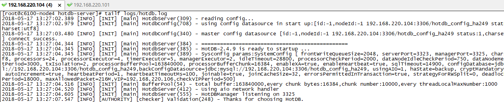 |
|  |
|#### waitConfigSyncFinish |
| **Description of parameter:** |

**Property**                     **Value**
  Parameter value                  cryptMandatory
  Visible or not                   No
  Description of parameters        When enabled, wait for configDB synchronization or not
  Default value                    false
  Whether Reload is valid or not   No
  Min Compatible Version           2.4.3

| Parameter Setting: |
| --- |
| <property name=[waitConfigSyncFinish](#waitConfigSyncFinish)>true</property><!-- When enabled, wait for configDB synchronization or not --> |
| **Role of parameter:** |
| It is used for setting whether to wait for configDB synchronization or not when enabled. Turn on the switch, in case of latency between configDB master/slave, it shall wait for the master/slave configDB to catch up with the Slave configDB, and maintain that the configDB data currently used is the latest data, only in this way could it be enabled |
| OFF status: Enable successfully when there is latency between master/slave configDB |
| 2018-06-01 16:21:14.958 [INFO] [INIT] [main] j(-1) - reading config... |
| 2018-06-01 16:21:15.170 [info] [INIT] [main] a(-1) - using config datasource in start up:[id:-1,nodeId:-1 l27.0.0.l:3306/hotdb_config_249 status:l,charset:utf8] |
| 2018-06-01 16:21:15.518 [info] [INIT] [main] a(-1) - master config datasource [id:-1,nodeId:-1 l27.0.0.l:3306/hotdb_config_249 status:l,charset:utf8] connect success. |
| 2018-06-01 16:21:16.892 [info] [INIT] [main] j(-1) - =============================================== |
| 2018-06-01 16:21:16.893 [info] [INIT] [main] j(-1) - HotDB-2.4.9 is ready to startup ... |
| 2018-06-01 16:21:16.894 [info] [INIT] [main] j(-1) - Sysconfig params:SystemConfig [ frontwriteQueueSize=2048, service port=9993, management port=999S, charset=utf8, processors=8, processorExecutor=4, timerExecutor=4, managerExecutor=2, idleTimeout=28800, processorcheckPeriod=1000, dataNodeIdleCheckPeriod=120, dataNodeHeartbeatPeriod=3000, txIsolation=2, processorBufferPool=163840000, processorBufferchunk=16384, enableXA=false, enableHeartbeat=true, sqlTimeout=42100, configDatabase=jdbc:mysql://l27.0.0.l:3306/hotdb_config_249,backConfigDatasource=jdbc:mysql://l27.0.0.l:3306/botdb_config_249, usingAIO=0, hastate=master, cryptMandatory=false, autoIncrement=true, heartbeatPeriod=1, heartbeatTimeoutMs=100, joinable=true, joincachesize=4, errorsPermittedInTransaction=true, strategyForRWSplit=3, deadlockCheckPeriod=0, maxAllowedPacket=64M,viP=nul1,checkVIPPeriod=l600] |
| 2018-06-01 16:21:17.210 [info] [INIT] [main] BufferPool(-1) - total buffer:163840000,every chunk bytes:16384,chunk number:10000,every threadLocalMaxNumber:10000 |
| 2018-06-01 16:21:17.216 [INFO] [INIT] [main] j(-1) - usinq aio network handler |
| ON status: |
| It could be enabled only after waiting for master/slave synchronization |
| 2018-07-12 14:28:52.019 [INFO] [INIT] [$NIOREACTOR-9-RW] XAInitRecoverHandler(125) -- wait for config datasource synchronizing... |
|#### waitForSlaveInFailover |
| **Description of parameter:** |

**Property**                     **Value**
  Parameter value                  waitForSlaveInFailover
  Visible or not                   Yes
  Description of parameters        In failover, whether to wait for the Slave to catch up with replication or not
  Default value                    true
  Whether Reload is valid or not   Yes
  Min Compatible Version           2.4.3

| Parameter Setting: |
| --- |
| <property name=[waitForSlaveInFailover](#waitForSlaveInFailover)>true</property><!-- In failover, whether to wait for the Slave to catch up with replication or not --> |
| **Role of parameter:** |
| It's used for setting in failover, whether to wait for the Slave to catch up with replication or not |
| ON status: |
| When the Slave has replication latency, it can't switch to the Slave, and the compute node will keep checking, and could make switch only after waiting for replication synchronization |
| mysql> show @@latency; |
| +----+----------------------------+----------------------------+---------+ |
| | dn | info | | latency | |
| +----+----------------------------+----------------------------+---------+ |
| | 4 | 192.168.200.51:3310/phy248 | 192.168.200.51:3310/phy248 | 0 ms | |
| | 5 | 192.168.200.51:3311/phy248 | 192.168.200.51:3311/phy248 | 0 ms | |
| | 6 | 192.168.200.51:3312/phy248 | 192.168.200.51:3312/phy248 | 19582 ms | |
| | 7 | 192.168.200.51:3313/phy248 | 192.168.200.51:3313/phy248 | 0 ms | |
| +----+----------------------------+----------------------------+---------+ |
| 4 rows in set (0.02 sec) |
| In the log you can see the prompt of no longer using the failed Master data source, and the data source without replication synchronization will not be enabled |
| 2018-06-08 10:36:47.921 [INFO] [FAILOVER] [Labor-1552] j(-1) - slave_sql_running is Yes in :[id:178,nodeId:6 192.168.200.52:3312/phy248 status:1,charset:utf8] during failover of datanode 6 |
| 2018-06-08 10:36:48.417 [WARN] [HEARTBEAT] [$NIOConnector] m(-1) - datasoruce 6 192.168.200.51:3312/phy248 init heartbeat failed due to：Get backend connection failed:java.net.ConnectException:connection refused |
| 2018-06-08 10:36:48.418 [WARN] [HEARTBEAT] [$NIOConnector] m(-1) - datasoruce 6 192.168.200.51:3312/phy248 init heartbeat failed due to：Get backend connection failed:cn.hotpu.hotdb.h.l:java.net.connectException: connection refused |
| 2018-06-08 10:36:48.918 [WARN] [HEARTBEAT] [$NIOConnector] m(-1) - datasoruce 6 192.168.200.51:3312/phy248 init heartbeat failed due to：Get backend connection failed:j ava.net.ConnectException: connection refused |
| 2018-06-08 10:36:48.918 [WARN] [HEARTBEAT] [$NIOConnector] m(-1) - datasoruce 6 192.168.200.51:3312/phy248 init heartbeat failed due to：Get backend connection failed:cn.hotpu.hotdb.h.l:java.net.connectException: connection refused |
| 2018-06-0810:36:48.982 [INFO] [FAILOVER] [Labor-1552] j(-1) - masterLogFile:mysql-bin.000518,readMasterLogFile:mysql-bin.000518,readMasterLogPos:384545127,execMaster LogPos:384512435,relayLogFiTe:mysql-relay-bin.000002,relayLogPos; 248414,secondBehindMaster:19,execLogchanged:true in slave: MySQLConnection [node=6, id=140, threadId=3 15945, state=borrowed, closed=false, autocommit=true, host=192.168.200.52, port=3312, database=phy248, localPort=64694, isClose:false, toBeclose:false] |
| OFF status: |
| When the master/slave data source has replication latency, it could switch to the Slave directly, without waiting for replication synchronization. |
| 2018-06-08 16:19:22.864 [INFO] [FAILOVER] [Labor-1852] bh(-1) -- switch datasource:6 for datanode:6 successfully by Manager. |
| Special note: the effect of master_delay on switching is adjusted in 2.5.6 and above. When the parameter waitForSlaveInFailover |
| (In failover, whether to wait for the Slave to catch up with replication or not) is enabled, if the delay setting is detected during switching, the setting will be automatically cancelled before catching up with the replication. After the switching, the delay setting will be restored. If it is still greater than 10s after cancelling the delay setting, switching will not be allowed, and the previously set value of master_delay will be restored.) |
|#### waitSyncFinishAtStartup |
| **Description of parameter:** |

**Property**                     **Value**
  Parameter value                  waitSyncFinishAtStartup
  Visible or not                   Yes
  Description of parameters        When enabled, wait for synchronization of the Master data source or not
  Default value                    true
  Whether Reload is valid or not   No
  Min Compatible Version           2.4.3

| Parameter Setting: |
| --- |
| <property name=[waitSyncFinishAtStartup](#waitSyncFinishAtStartup)>true</property><!-- When enabled, wait for synchronization of the Master data source or not --> |
| **Role of parameter:** |
| When enabled, wait for synchronization of the Master data source or not. Turn on the switch, wait for master/slave data source to make replication synchronization when enabling the compute node, so as to guarantee data consistency of master/slave data source |
| Precondition: |
| Under the condition of Master data source latency, enabling compute node will prompt that the replication synchronization of the current data source has not been completed, and it shall provide service only after replication synchronization completes. |
| Turn on the switch: When enable the compute node, wait for replication synchronization of master/slave data source, so as to guarantee data consistency of master/salve data source |
| 2018-06-01 17:15:12.990 [info] [INIT] [$NIOREACTOR-3-RW] k(-1) - masterLogFile:mysql-bin.000667,relayMasterLogFile:mysql-bin.000667,readMasterLogPos:4668659,execMasterLogPos:4555931,relayLogFile:mysql-relay-bin.000004,relayLogPos: 2121597,secondBehindMaster:90,execLogchanged:true in server:MySQLConnection [node=3, id=41, threadId=l7054, state=running, closed=false, autocommit=true, host=192.168.200.52, port=3310, database=db249, localPort=18965, isClose:false, toBeClose:false] |
| 2018-06-01 17:15:12.990 [info] [INIT] [$NIOREACTOR-3-RW] k(-1) - masterLogFile:mysql-bin.000667,relayMasterLogFile:mysql-bin.000667,readMasterLogPos: 4669275,execMasterLogPos:4555931,relayLogFile:mysql-relay-bin.000004,relayLogPos: 2121597,secondBehindMaster:90,execLogchanged:true in server:MySQLConnection [node=3, id=50, threadId=l7084, state=running, closed=false, autocommit=true, host=192.168.200.52, port=3310, database=db249, localPort=20329, isClose:false, toBeClose:false] |
| 2018-06-01 17:15:12.990 [info] [INIT] [$NIOREACTOR-3-RW] k(-1) - masterLogFile:mysql-bin.000667,relayMasterLogFile:mysql-bin.000667,readMasterLogPos: 4670199,execMasterLogPos: 4557471,relayLogFile:mysql-relay-bin.000004,relayLogPos: 2122521,secondBehindMaster:90,execLogchanged:true in server:MySQLConnection [node=3, id=41, threadId=l7054, state=running, closed=false, autocommit=true, host=192.168.200.52, port=3310, database=db249, localPort=18965, isClose:false, toBeClose:false] |
| Turn off the switch: No other abnormalities, the compute node could be enabled directly |
| 2018-06-01 16:21:14.958 [INFO] [INIT] [main] j(-1) - reading config... |
| 2018-06-01 16:21:15.170 [info] [INIT] [main] a(-1) - using config datasource in start up:[id:-1,nodeld:-1 l27.0.0.1:3306/hotdb_config_249 status:1,charset:utf8] |
| 2018-06-01 16:21:15.518 [info] [INIT] [main] a(-1) - master config datasource [id:-1,nodeld:-1 l27.0.0.1:3306/hotdb_config_249 status:1,charset:utf8] connect success. |
| 2018-06-01 16:21:16.892 [info] [INIT] [main] j(-1) - =============================================== |
| 2018-06-01 16:21:16.893 [info] [INIT] [main] j(-1) - HotDB-2.4.9 is ready to startup ... |
| 2018-06-01 16:21:16.894 [info] [INIT] [main] j(-1) - Sysconfig params:SystemConfig [ frontwriteQueueSize=2048, service port=9993, management port=9995, charset=utf8, processors=8, processorExecutor=4, timerExecutor=4, managerExecutor=2, idleTimeout=28800, processorcheckPeriod=1000, dataNodeIdleCheckPeriod=120, dataNodeHeartbeatPeriod=3000, txIsolation=2, processorBufferPool=163840000, processorBufferChunk=16384, enableXA=false, enableHeartbeat=true, sqlTimeout=42100, configDatabase=jdbc:mysql://127.0.0.1:3306/hotdb_config_249,backConfigDatasource=jdbc:mysql://127.0.0.l:3306/hotdb_config_249, usingAIO=o, hastate=master, cryptMandatory=false, autoIncrement=true, heartbeatPeriod=l, heartbeatTimeoutMs=l00, joinable=true, joinCacheSize=4, errorsPermittedInTransaction=true, strategyForRWSplit=3, deadlockCheckPeriod=0, maxAllowedPacket=64M,VIP=null,checkVIPPeriod=1600] |
| 2018-06-01 16:21:17.210 [info] [INIT] [main] BufferPool(-1) - total buffer:163840000,every chunk bytes:16384,chunk number:10000,every threadLocalMaxNumber:1000 |
| 2018-06-01 16:21:17.216 [info] [INIT] [main] j(-1) - usinq aio network handler |
|#### weightForSlaveRWSplit |
| **Description of parameter:** |

**Property**                     **Value**
  Parameter value                  weightForSlaveRWSplit
  Visible or not                   Yes
  Description of parameters        Read Proportion of the Slave, 50 by default (percentage)
  Default value                    50
  Whether Reload is valid or not   Yes
  Min Compatible Version           2.4.4

| Parameter Setting: |
| --- |
| weightForSlaveRWSplitParameter in server.xml is set as 50 |
| <property name=[weightForSlaveRWSplit](#weightForSlaveRWSplit)>50</property> |
| **Role of parameter:** |
| weightForSlaveRWSplit and strategyForRWSplit are supporting parameters, and only when Read/write splitting strategy is 1 (separatable Read requests are sent to all available data sources), could Read Proportion of the Slave be meaningful. If the Slave latency exceeds threshold value of readable Standby Slave, read the Active Master by default |
| Under master/slave condition: read proportion of the Slave is 50% by default |
| Under one-master and multi-slave condition (such as: one master and double slaves): read proportion of the Master is 50%, read proportion of Slave A is 25%, and read proportion of Slave B is 25% |
| For example: Active Master mark: name= Master |
| mysql> select * from vrab001; |
| +------+---------+ |
| | id | name | |
| +------+---------+ |
| | 1 | Master | |
| | 2 | Master | |
| | 3 | Master | |
| | 4 | Master | |
| +------+---------+ |
| Slave mark: name= Slave |
| mysql> select * from vrab001; |
| +------+---------+ |
| | id | name | |
| +------+---------+ |
| | 1 | slave | |
| | 2 | slave | |
| | 3 | slave | |
| | 4 | slave | |
| +------+---------+ |
| Execute select Query operation for several times, read 50% of master/slave respectively |
|## Appendix |
|### Notices for HotDB Server |
|#### Recommendation on JDBC version |
| It's recommended that the JDBC version should be mysql-connector-java-5.1.27.jar, 8.0 could be compatible at the highest. |
|#### Recommendation on JAVA database connection pool |
| It's recommended using proxool-0.9 for connection pool |
|#### Reserved field of database design |
| Compute node could specify data node according to DNID, therefore, the DNID Field name is reserved field of the database (do not use this Field name in table structure). |
| The compute node judges whether the data source is available or not via operating the hotdb_heartbeat table of the data source, therefore, hotdb_heartbeat serves as reserved field of Table Name. |