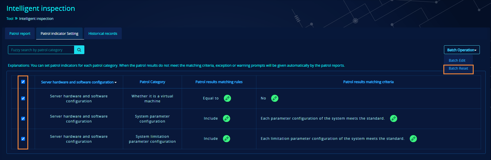

# Intelligent inspection

In order to facilitate the operation and maintenance personnel to detect whether there are hidden dangers or exceptions in the database cluster, we add the intelligent inspection function in v.2.5.6 and above. Through this function, you can carry out the day-to-day database inspection of the compute node cluster, and avoid the hidden trouble existing in the running process of the current database service in time.

**Function Entry:** log in to the common role of the management platform, and click "Tool" -\> [Intelligent inspection](#Intelligent%20inspection) to enter the intelligent inspection page.

## Premise of use

To initiate an intelligent inspection, the following preconditions shall be satisfied.

-   The current user has the privilege of "intelligent inspection".

-   SSH information of the server needs to be configured.

## Function description

Intelligent inspection mainly includes three TABs: patrol report, patrol indicator setting and historical records, among which the patrol report is displayed by default, with the latest patrol result. When there is no historical record, it will prompt: "Currently there is no patrol record. You can choose to start a patrol task immediately."

### Patrol report

#### Layout

-   Searching options includes fuzzy search by host name and search by patrol status.

-   If you check "by default, only patrol results of exception or warning are displayed when entering the page", only warnings or exceptions will be shown in the report, and this status will maintain even if you exit the page. If you cancel the checking, all items will be displayed.

-   The report is divided into basic information and detailed report. The basic information shows information about the current cluster group, and the detailed report is divided into 7 modules, namely:

-   Server hardware and software configuration

-   Server resource usage

-   Server resource reliability

-   Compute node running status and statistics

-   Data source running status and statistics

-   Data verification and detection

-   Others

#### Start a patrol

**(1) Start a patrol**

-   Click Start a patrol, the patrol object selection box will pop up.

**(2) Patrol object selection**

-   Check objects and start patrol.

**(3) On patrol**

-   After starting a patrol, you will enter the historical record page and view the patrol tasks that are currently in progress.

-   The task status column shows progress of the current patrol task, and the page is refreshed every 5s.

-   When there is a patrol task in progress, a new patrol cannot be started (based on the current group).

**(4) Patrol completed**

-   Once the patrol is completed, "Task Status" will be updated to patrol completed.

-   If there are patrol items of warnings or exceptions, "Are there exceptions or warning" will count the number of warnings or exceptions in all patrol items.

-   If there is no warnings or exceptions, "No" will be displayed in "Are there exceptions or warning".

-   When the patrol is completed, a result file and patrol report generated during the patrol process will be shown in "hotdb-management/data/Inspection".

**(5) Execution cancelled**

-   Click "Execution Cancellation" to cancel the current patrol task.

-   When the task is cancelled successfully, "Task Status" will be updated to "Patrol failed".

-   "No" will be shown in "Are there exceptions or warning".

-   When the patrol task is cancelled, no files will be generated in "hotdb-management/data/Inspection".

#### Periodical plan

In addition to manually starting patrol task, you can also add a periodical plan. Click "Periodical Plan" to manage the current periodical plans.

-   You can only add six items at most in Periodical Plan, \"Monthly\", \"Quarterly\" and \"Yearly\" can be selected in Patrol dimension.

-   For others, please refer to the manual task starting description.

-   When there is overlap in the Periodical Plan, the program will only execute one periodical plan.

-   If there are other patrol tasks are in progress during the execution of Periodical Plan, it will be retried after 1 min and wait for 10 min at most. If there are still unfinished patrol tasks, the patrol result will be set as \"patrol failed\", with the failure reason: \"there are other patrol tasks in progress at the same time\".

#### Export the report

-   Click "Export -- Export exceptions and warning data", and the downloaded report will only contain patrol items with warnings and exceptions.

-   Click "Export -- Export the whole data", and the downloaded report will contain all items.

-   After the patrol, the report will be stored in the directory hotdb-management/data/Inspection.

-   In the exported data, the \"you can download the file to view details\" will be replaced with \"details can be viewed in the downloaded files under the directory /data/Inspection/\".

-   In the exported data, if there is \"manually click the Install button to install relevant software\" in the list of historical patrol inspection results, it will be replaced with: \"please manually install relevant software\".

-   In the exported data, the \" manually click the Install button to install relevant software \" will be replaced with \"please manually install relevant software\".

### Patrol indicator setting

#### Layout

-   Displays indicators of all patrol categories, and supports fuzzy search by patrol category.

-   Patrol objects can be classified by the header "patrol objects classification".

-   You can change corresponding matching rules by clicking the Edit button of matching rules and matching criteria.

#### Server hardware and software configuration

-   Patrol categories of the server hardware and software configuration are as follows:

-   Whether it is a virtual machine

-   System parameter configuration

-   System limitation parameter configuration

-   The default value of matching rule of "Whether it is a virtual machine" is "equal to", which can be edited as: equal to, not equal to, and no attention is required; the default matching criteria is "no", which can be edited as no and yes.

-   For other patrol categories, the default matching rules is "include", which can be edited as include, not include, and no attention is required. The default matching criteria is the indicator of each patrol category, and can be edited as any value.

#### Server resource usage

-   Patrol categories of the server resource usage are as follows:

-   Average total CPU usage

-   Sys divided by the current value of the ratio of utilization

-   Wa divided by the current value of the ratio of utilization

-   Current value of the ratio of LOAD divided by the number of logic cores

-   Current value of memory usage

-   Current value of remaining free memory

-   Minimum peak value of remaining free memory

-   Current SWAP usage rate

-   Current value of disk space usage

-   Current value of remaining free disk space

-   Current value of disk IO utilization

-   Current value of network bandwidth utilization (NetIn)

-   Current value of network bandwidth utilization (NetOut)

-   The default value of matching rule of \"current value of remaining free memory\" and \"minimum peak value of remaining free memory\" is "greater than"; the default value of matching rule for other patrol categories is "less than".

-   The matching rules can be edited as follows: greater than, less than, greater than or equal to, less than or equal to, no attention is required.

-   When the matching criteria is displayed in percentage, the minimum value is 0 and the maximum value is 100.

#### Server hardware reliability

-   Patrol categories of the server hardware reliability are as follows:

-   Hardware error log

-   Memory error info.

-   Hard disk device error message

-   Hard disk array info

-   Packet loss statistics of network card

-   Network quality statistics

-   System event log info

-   Temperature voltage fan info.

-   The default value of matching rule is "include", which can be edited as: include, not include and no attention is required.

-   The default value of matching rule is 10 and the minimum value is 0; for other patrol categories, the default value is no exceptions info and can be edited as any value.

#### Compute node running status and statistics

-   Patrol categories of the compute node running status and statistics are as follows:

-   Port info

-   License info

-   Parameter Configuration

-   QPS

-   Total front-end connections

-   Total back-end connections

-   Front-End inflow rate

-   Front-End outflow rate

-   Back-End inflow rate

-   Back-End outflow rate

-   heap memory usage

-   direct memory usage

-   The cluster integrity

-   High availability status

-   DR status

-   Password security management

-   The SQL firewall

-   The IP whitelist

-   Slow query SQL records

-   ERROR level

-   WARN level

-   Description of patrol categories of port info, license info, parameter configuration, cluster integrity, high availability status, DR status, password security management and slow query SQL record.

-   The default matching rule is "include", which can be edited as: include, not include and no attention is required.

-   The default value of matching criteria of high availability status, DR status and password security management is "no exceptions" and can be edited to any value.

-   The default value of matching criteria of port info, license info, parameter configuration, cluster integrity and slow query SQL records is the indicator of each patrol category and can be edited to any value.

-   SQL firewall and IP whitelist

-   The default value of matching rule is "not equal to", which can be edited as: equal to, not equal to, and no attention is required.

-   The default value of matching criteria is "not enabled" and can be edited to any value.

-   ERROR level, WARN level

-   The default value of matching rule is "less than or equal to", which can be edited as greater than, less than, greater than or equal to, less than or equal to, no attention is required.

-   The default value of matching criteria is 0, and can be edited to any value.

-   QPS, total front-end connections, total back-end connections, front-end inflow rate, front-end outflow rate, back-end inflow rate, back-end outflow rate, heap memory usage, direct memory usage.

-   The matching rules are as follows:\--

-   The matching criteria is synchronized with the threshold value of Setting -\> Topological graph Alert Setting.

#### Data source running status and statistics

-   Patrol categories of the data source running status and statistics are as follows:

-   QPS

-   Connections

-   Replication latency

-   Slow query SQL

-   Deadlock info

-   Error log

-   Data incremental Prediction

-   Slow query SQL, data incremental prediction

-   The default value of matching rule is "not include", which can be edited as: include, not include and no attention is required.

-   The default value of matching criteria is the indicator of each patrol category, which can be edited to any values.

-   Deadlock info. and error log

-   The default value of matching rule is "include", which can be edited as: include, not include and no attention is required.

-   The default value of matching criteria is "no exceptions", which can be edited to any values.

-   QPS, connections, replication delay

-   The matching rules are as follows: \--

-   The matching criteria is synchronized with the threshold value of Setting -\> Topological graph Alert Setting.

#### Data verification and detection

-   Patrol categories of the data verification and detection are as follows:

-   Config checking

-   Master/Slave data consistency

-   Global table data consistency

-   Table structure & index

-   Sharding route correctness

-   Data unique constraint

-   Intelligent optimization of sharding plan

-   Examination score of deployment environment

-   Sharding grade

-   Validity detection of business data backup

-   Validity detection of configuration data backup

-   Consistency detection of configuration in memory

-   Examination score of deployment environment and sharding grade

-   The default value of matching rule is "greater than or equal to", which can be edited as greater than, less than, greater than or equal to, less than or equal to, and no attention is required.

-   For the matching criteria, the default value of examination score of the deployment environment is 100; the default value of sharding grade is 80. They can be edited to any integer value between \[0, 100\], unit: score.

-   Others

-   The default value of matching rule is "include", which can be edited as: include, not include and no attention is required.

-   The matching criteria: the default value of validity detection of business data backup is \"no exceptions, and data available for backup and restore is no more than 24 hours.\"; the default value of validity detection of configuration data backup is \"no exceptions, and the data available for backup and restore is no more than 72 hours\". The matching criteria of these two results should be positive integers, unit: hours.

-   The default matching criteria is "no exceptions" for patrol categories except for the above two items and can be edited to any value.

#### Others

-   Patrol categories of patrol objects are as follows:

-   Availability

-   Master-slave replication status

-   Master-slave replication latency

-   Backup and restore

-   Email alert setting

-   Periodical detection setting

-   Topological graph alert setting

-   Monitoring panel setting

-   Email sender setting

-   Audit log setting

-   Platform log

-   Master/slave replication latency

-   The default matching rule is "less than",which can be edited as greater than, less than, greater than or equal to, less than or equal to, and no attention is required.

-   The default criteria is 10s, which can be edited as 0 or any positive integer value, unit: seconds.

-   Availability and master-slave replication status

-   The default matching rule is equal to, which can be edited are: equal to, not equal to, and no attention is required.

-   The default matching criteria of availability is available; the default matching criteria of the master-slave replication status is normal, and can be edited to any value.

-   Others

-   The default matching rule is "include", which can be edited as: include, not include and no attention is required.

-   The matching criteria

1)  The default value of platform log is "no exceptions" and can be edited to any value.

2)  The default value of notification strategy is "configured" and can be edited to any value.

3)  The default value of backup and restore is \"no exceptions, and the data available for backup and restore is no more than 72 hours\". The matching criteria should be positive integers, unit: hours.

4)  For all other patrol categories, the default value of the matching criteria is \" all configured \" and can be edited to any value.

#### Batch edit

**(1) Start batch edit**

-   Check and click "Batch Operation" -\> "Batch Edit"

**(2) Fill in batches and save**

-   The corresponding matching rules and matching criteria of patrol categories display the default value, which can be edited.

#### Batch reset

-   Check and click "Batch Operation" -\> "Batch Reset".

-   After the reset, the matching rules and matching criteria will be reset to the system default value.

### Historical records

#### Layout

-   Displays all historical patrol tasks.

-   Click \"patrol time consuming\" to display in ascending or reverse order according to the patrol time consuming.

-   The \"starting type\" includes manual and automatic. The automatic type refers to the periodical plan.

#### View the details

-   Click "Operation - \> \[Details\]" to enter the detail page.

-   The page is basically consistent with the \"patrol report\" page.

-   Click the \"return\" button to return to the \"historical records\" page.

#### Delete the task

-   Click "Operation - \> \[Delete\]" to delete the patrol task.

-   When the patrol task is deleted, the corresponding file and local patrol report will be deleted too.

#### Download the report

-   Click "Operation - \> \[Download\]" to download the patrol report.

-   For the operations, you can refer to \"patrol report\" - \> \"export the complete report\".

#### Batch deletion

**(1) Start a batch deletion**

-   Click "delete inspection record" on the page \"Intelligent inspection → historical records\".

**(2) Select a period of inspection records you want to delete**

-   \"Three months ago\" is selected by default. You can also select \"delete all\" or \"customize time slot\".

-   If you check \"whether to delete the corresponding reserved inspection reports synchronously\", the files and patrol reports generated under the directory hotdb-management / data / Inspection will be deleted synchronously.

-   Click Cancel, and the batch deletion operation will be cancelled.

### Patrol details

#### Description of patrol matching logic

The matching is based on patrol results and patrol indicators:

1\. When the matching rule is \"include\"：

-   If the matching succeeds, the patrol status will be "normal".

-   If the matching fails, the corresponding patrol status and recommended measures will be output for different patrol categories according to different patrol results.

2\. When the matching rule is \"not include\":

-   If the patrol result matches the warning logic, the patrol status will be "warning".

-   Otherwise, "normal" or "abnormal" will be output according to the matching results.

3\. When matching rule is \"equal to\" or \"not equal to\":

-   If the matching succeeds, the patrol status will be "normal".

-   If the matching fails, the corresponding patrol status and recommended measures will be the output.

4\. When the matching rule is \"greater than\", \"less than\", \"greater than or equal to\", \"less than or equal to\":

-   If the matching succeeds, the patrol status will be "normal";

-   If the matching fails, the corresponding patrol status and recommended measures will be the output.

5\. When the matching rules is \"no attention is required\": the patrol status is normal and no recommended measures.

#### Description of patrol result logic

##### Server hardware and software configuration

View the patrol report on "Historical records -\>Detailed report -\>Server hardware and software configuration".

**Whether it is a virtual machine**

-   Detect whether the server is a virtual machine. If it is a virtual machine, the patrol result will be \"No\".

**System parameter configuration**

-   Compare the one-click deployment script parameters and the common parameter values from the sysctl-a command (the annotated parameters are not included).

-   If parameters from the sysctl-a command do not exist, the parameters in the one-click deployment script will be compared with parameters in files under /etc/sysctl.conf; if parameters in files under /etc/sysctl.conf do not exist either, the comparison will not be carried out.

-   You can view the inconsistent parameters by clicking the \"Download\" button in the patrol results.

-   If the parameters are all consistent, you can view all parameters of sysctl-a by clicking the \"Download\" button in the patrol results.

**System limitation parameter configuration**

-   Obtain configuration of the last three users, mysql, hotdb, and root, from /etc/security/limits.conf. Judgement: nofile＜10240(standard value), nproc\< 262140 (standard value).

-   If it is less than the standard value, it will prompt in the patrol result that the parameters are inconsistent, and the inconsistent parameters will be listed.

-   If it is greater than or equal to the standard value, it will prompt in the patrol result that the parameters meet the standard.

-   If you have no privilege to view the file, it will prompt in the patrol result that the privilege is insufficient.

Note: items not mentioned above are only displayed and do not match the patrol indicators.

##### Server resource usage

View the patrol report on "Historical records -\>Detailed report -\>Server resource usage".

-   The current value of each patrol category: the real-time value of the corresponding monitoring script.

-   The average value, maximum peak value and minimum peak value of each patrol category: the value within half an hour of the corresponding monitoring script.

##### Server hardware reliability

View the patrol report on "Historical records -\>Detailed report -\>Server hardware reliability".

**Hardware error log**

-   If mcelog is not installed, it will prompt in the patrol result that the software is not installed. You can directly install the software by clicking the \"Install\" button in the patrol result.

-   If there is info output after executing \"mcelog\", it will prompt in the patrol result that \"There is an error log. Please download the file to check the details\".

-   If there is no info output after executing \"mcelog\", it will prompt in the patrol result that \"no abnormal info\".

-   If the server is a virtual machine, it will prompt in the patrol result that \"No detection is required because the server is a virtual machine\", with the patrol status being "no patrol is required".

**Memory error info.**

-   If not all output is 0, the non-0 results will be displayed in the patrol result.

-   If all output is 0, it will prompt in the patrol result that \"no abnormal info\".

-   If you have no privilege to view the file, it will prompt in the patrol result that the privilege is insufficient.

-   If the server is a virtual machine, it will prompt in the patrol result that \"No detection is required because the server is a virtual machine\", with the patrol status being "no patrol is required".

**Hard disk device error info.**

-   If smartmontools is not installed, it will prompt in the patrol result that the software is not installed. You can directly install the software by clicking the \"Install\" button in the patrol result.

-   If SMART is not enabled on the equipment, it will prompt in the patrol result that \"Unable to detect because SMART is not enabled\"

-   If the output is empty after the command is executed, it will prompt in the patrol result that \"The result is empty after executing command smartctl \--scan\".

-   If SMART is supported in the server, check whether the SMART Health Status is OK or whether the self-assessment test result is PASSED. If it is not OK / PASSED, it will prompt in the patrol result that \"Smartctl detected that the SMART of XXX device reported abnormal status. You can download the file to view the details\".

-   If all the detections above are passed, you need to judge whether the data in the last column of "Reallocated_Sector_Ct", "Reported_Uncorrect", and "Total new blocks reassigned" is 0; if not, it will prompt in the patrol result that \"XXX is greater than 0. You can download the file to view the details, and manually intervene to determine whether there is an exception.\"

-   If all the detections are passed, it will prompt in the patrol result that \"no abnormal info.\"

-   If the server is a virtual machine, it will prompt in the patrol result that \"No detection is required because the server is a virtual machine\", with the patrol status being "no patrol is required".

**Hard disk array info.**

-   If MegaCli is not installed on the server when starting the patrol for the first time, it will be installed automatically during the patrol.

-   If the return is empty after executing the command, it will prompt in the patrol result that \"The result is empty after executing command /opt/MegaRAID/MegaCli/MegaCli64 -CfgDsply -aAll\|grep \'Error Count\' \".

-   If not all output is 0, it will prompt in the patrol result that \" MegaCli64 found an item with Error Count not 0. You can download the file to view the details \".

-   If all output is 0, it will prompt in the patrol result that \"no abnormal info\".

-   If the server is a virtual machine, it will prompt in the patrol result that \"No detection is required because the server is a virtual machine\", with the patrol status being "no patrol is required".

**Packet loss statistics of network card**

-   If there is no last patrol result, the patrol result will be \"no abnormal info\".

-   If the difference between the data of this patrol result and the previous patrol result, such as errors, dropped and overrun are greater than or equal to 1000, then the patrol result will be \"there is a record of more than 1000 times exceptional packet loss of network card from the last patrol to this patrol, you can download the file to view the details\".

-   If the difference is less than 1000, the patrol result will be \"no abnormal info\".

-   If there are exceptions in the patrol process, the patrol result will be \"unable to view the packet loss info of network card\".

**Statistics of network quality**

-   If there is no last patrol result, the patrol result will be \"no abnormal info\".

-   If no ping packets are recorded from the last patrol to the present, the patrol result will be \"no abnormal info\".

-   If ping packets are recorded from the last patrol to the present, the patrol result will be \"during the process from the last patrol to this patrol, the total number of ping small packet timeout: 0, the number of ping large packet timeout: 0, the total number of packet loss: 0, the number of times of not exceeding the configuration threshold :10\".

-   The configuration threshold of indicators is editable.

-   If the server is non-compute node server, the patrol category will not be displayed.

-   When the compute node version is lower than 2.5.5, the patrol category will not be displayed.

**System event log info**

-   If ipmitool is not installed, it will prompt in the patrol result that the software is not installed. You can directly install the software by clicking the \"Install\" button in the patrol result.

-   Execute the command to view the Last Add Time in the record. If it is later than the last patrol, the patrol result will be \"there is a new log generated from the last patrol, please download the file to view the details by clicking 'download'".

-   If no new log is generated from the last patrol to the present, the patrol result will be \"no abnormal info\".

-   If the server is a virtual machine, it will prompt in the patrol result that \"No detection is required because the server is a virtual machine\", with the patrol status being "no patrol is required".

**Temperature and voltage fan info**

-   If ipmitool is not installed, it will prompt in the patrol result that the software is not installed. You can directly install the software by clicking the \"Install\" button in the patrol result.

-   Execute the command. If there is an item in the last column that is not ok or ns, the patrol result will be \"the following indicators do not meet the patrol requirements, please intervene manually and list the unqualified items\".

-   If items are all ok or ns, the patrol result will be \"no abnormal info\".

-   If the server is a virtual machine, it will prompt in the patrol result that \"No detection is required because the server is a virtual machine\", with the patrol status being "no patrol is required".

##### Compute node running status and statistics

View the patrol report on "Historical records -\>Detailed report -\>Compute node running status and statistics".

-   **License info:** displays the remaining license authorization time and the number of authorized nodes according to the license authorization information.

-   **Heap memory:**

-   Configuration value: obtain max_memory from show @\@server

-   Current value: obtain used_memory from show @\@server

-   **Direct memory：**

-   Configuration value: obtain max\_ direct_memory from show @\@server

-   Current value: obtain used\_ direct_memory from show @\@server

-   **QPS and TPS of throughput:**

-   Current value: consistent with the current value recorded in \"Monitoring → Monitoring panel\".

-   Peak value: consistent with the original data displayed on the admin index page.

-   Average value (within half an hour): the monitoring data within half an hour before the patrol start time is taken as the collection standard.

-   **Total number of front-end connections and back-end connections:**

-   Current value: consistent with the data collected at \"Monitoring → Logic topological graph\".

-   Peak value: consistent with the original peak data of the compute node displayed on the admin index page.

-   Average value: the monitoring data within half an hour before the patrol start time is taken as the collection standard.

-   **front-end inflow rate, front-end outflow rate, back-end inflow rate, back-end outflow rate, heap memory usage, and direct memory usage:**

-   Consistent with the data collected at \"Monitoring → Logic topological graph\".

-   **Total data volume and cluster availability:** consistent with the original data displayed on the admin index page.

-   **DR status:** whether the DR mode is configured in the current compute node; if it is, check whether the current \"switching the active center\" can be verified normally.

-   **Cumulative failure time and switching times after the last patrol:** calculate the cumulative failure time, abnormal interruption time and abnormal switching times between the two patrols.

-   **Password security management:** remind whether there is password expiration according to the password setting at \"Setting → Periodical detection setting\".

-   **SQL firewall and IP whitelist:** consistent with the data of SQL firewall and IP whitelist displayed on the admin index page.

-   **Slow query SQL record:** records the total number of slow query logs on \"Events → Slow query log analysis\" page.

-   **Cumulative operation volume after the last patrol:** consistent with data on the compute node throughput page.

-   **Statistics of compute node logs of ERROR level and WARN level after the last patrol:** the statistics of compute node logs of ERROR level and WARN level between the last patrol and the current Patrol (logs of multiple compute nodes shall be counted in the cluster mode).

-   **Compute node GC statistics:** execute the command jstat -gc \[pid\] 1s 10 to obtain the result.

##### Data source running status and statistics

-   View the patrol report on "Historical records -\>Detailed report -\>Data source running status and statistics".

-   **Version info:** execute select version () under the corresponding instance port of the data source.

-   **Run time:** execute show global status like \'uptime\' under the corresponding instance port of the data source, format: year, month, day, hour, minute, second.

-   **QPS, connections and replication latency:** consistent with the current value recorded in \"Monitoring → Logic topological graph\".

-   **Data size:** the total amount of data corresponding to each data source instance.

-   **Index data volume:** the total index amount corresponding to each data source instance.

-   **Binlog space size:** statistics of the \"show binary logs;\" of all data source MySQL instances in the current cluster. It is the total size of the current file that is counted.

-   **Parameter configuration:** use show variables to view the parameter configuration.

-   **Slow query SQL:** use show global status like \'Slow\_ queries\' to view the current value of slow query SQL, and use \"show global status like \'uptime\';\" to veiw the start time of MySQL data source.

-   **Deadlock info:** execute \"show engine Innodb status \\G;\" under the corresponding data source instance to check whether there is deadlock info.

-   **Error log:** you can view the storage location of error.log via show variables like \'log\_ error \'; and check whether the latest log time is between the last patrol and this patrol.

-   **Data increment prediction:** displays the data volume of data sources within one year before the patrol time, and the compare the predicted data volume with the remaining free disk space (if the data recorded currently is less than 21 days, it will be given that \"the data recorded currently is less than 21 days, so the increment prediction is temporarily unavailable.\")

##### Data verification and detection

-   View the patrol report on "Historical records -\>Detailed report -\>Data verification and detection".

-   **Config checking:** obtain the current result of \"Configuration → Config checking→ Start checking\"

-   **Master/slave data consistency:**

-   A full data verification based on all LogicDBs (ConfigDBs are included).

-   **Global table data consistency, table structure& index detection, sharding route correctness:**

-   A full data verification based on all LogicDBs.

-   **Data unique constraint and intelligent optimization of sharding plan:**

-   A full data verification based on all the current LogicDBs. Each logicDB is marked with one verification record.

-   **Examination score of deployment environment:**

-   When the patrol starts, the examination score of deployment environment starts synchronously. You can view the examination progress details of the current deployment environment on the \"Cluster management → Deployment environment examination\" page.

-   Among all patrol objects, the longest time spent in the whole patrol process is \"data verification and detection\", while the longest time spent in the \"data verification and detection\" is the \"deployment environment examination\".

-   Whether the current cluster environment uses the physical machine or the virtual machine also directly affects the length of the physical examination (according to the current test situation, it takes about 18 minutes for a set of cluster environment with all virtual machines to conduct a patrol inspection of all patrol objects, while the time for a set of cluster environment with all physical machines for the same situation is less than 2 minutes Right).

-   Whether physical machine or virtual machine is used in the current cluster environment also directly affects the length of the examination (according to the current test, it takes about 18 minutes for a set of cluster environment with all virtual machines to conduct a patrol inspection of all patrol objects, while the time for a set of cluster environment with all physical machines for the same situation is about 2 minutes).

-   The patrol time is also affected by the number of components. The more components, the longer the time spent.

-   **Sharding grade:** view the details on the \"Detection → Sharding grade\" page.

-   **Validity detection of business data backup:** data backup with all LogicDBs as a unit. You can view the details on \"Management \> Data backup\" page.

-   **Validity detection of configuration data backup:** it is the ConfigDBs and configuration files of the current compute node that are backed up. You can view the backup details on the \"Configuration \> Cluster data backup & restore\" page.

-   **Configuration consistency check in memory:** check whether the current configuration in memory is consistent with the configuration marked in the running table of the configuration library

-   **Consistency detection of the configuration in memory：**detect whether the configuration in current memory is consistent with the configuration marked in the running table of the ConfigDB.

##### Others

View the patrol report on "Historical records -\>Detailed report -\>Others".

-   **Platform ConfigDB:** log in to the manager role and enter the \"Tool\> Platform configuration data management\" page.

-   **Availability status:** check whether the connection of ConfigDBs of the management platform is normal.

-   **Master-slave replication status and master-slave replication latency:** the master-slave replication status and replication latency between the ConfigDBs when the management platform ConfigDB is in master-slave or master-master mode.

-   **Backup and restore:** it is the ConfigDBs and configuration files of the current management platform that are backed up.

-   When the ConfigDB of management platform is in the single-instance mode, the availibility in the patrol result will be displayed as available. It will prompt that \"the platform configDB is in the single-instance mode\" in the patrol results of master-slave replication status and master-slave replication latency.

-   **Platform notification statistics**

-   **Events:** statistics of the total number of event notification messages reported from the last patrol to this patrol by the management platform.

-   **Email reminder:** statistics of the total number of email reminders from the last patrol to this patrol sent by the management platform.

-   **Execution status statistics of periodical detection tasks:** summarize and display the periodical tasks of various detection types executed by the management platform, including the execution status of all periodical detection plans on the page of \"Setting → Periodical detection setting\" and the relevant submenu under the \"detection\" menu.

-   **Audit log statistics:** statistics of the number of audit logs from the last inspection to the current inspection, including platform operation, security protection and management port operation.

-   **Notification strategy, periodical detection setting, topological graph alert setting, monitoring panel setting, email sender setting and audit log setting:** set the notification strategy on the \"Event → Email alert setting\" page, and set other items in the \"Setting\" menu.

-   **Platform log:** manually view hotdb-management.log and check whether there is a WARN or ERROR level platform log between the last patrol and the current patrol.

-   **GC statistics:** execute the command jstat -gc \[pid\] 1s 10 to obtain the result. (pid is the process ID of the management platform).