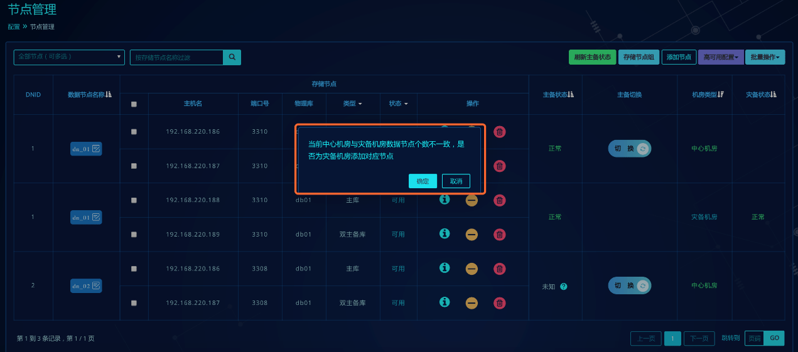
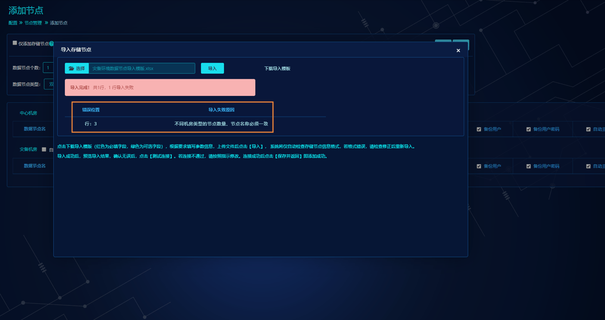
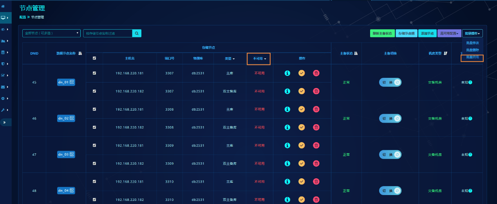

# 跨机房容灾部署

## 基本信息

此手册基于分布式事务数据库产品 HotDB Server - V2.5.6版本编写，主要讲述基于MySQL原生复制功能实现HotDB Server跨机房容灾方案所涉及的功能基本使用方法及操作流程，供使用者参考与学习。

此文档中涉及较多计算节点、管理平台相关基础功能，若需了解标准计算节点、管理平台的使用方法，请参考[管理平台](hotdb-management.md)文档和[计算节点标准操作](hotdb-server-standard-operations.md)文档。

### 背景介绍

数据是最重要的生产资料，数据丢失且不可再生对企业的影响往往是致命的。分布式事务数据库产品有完整配套的跨机房容灾解决方案可以为数据库服务带来更高的可用性和安全保障。故HotDB Server提供基于MySQL原生复制功能解决HotDB Server跨机房容灾问题的解决方案，能够实现跨机房数据同步功能以及解决跨机房分布式事务数据库服务容灾的问题。

### 容灾目标

支持跨机房数据同步传输，保障中心机房分布式事务数据库服务发生故障时，可切换到备用机房，在存储节点MySQL开启半同步复制的情况下，RPO可保证到0，且单条IUD SQL（以标准性能测试SQL为标准）操作性能吞吐量TPS可达10W+。

### 专业名词解释

| 名称             | 说明                                                                                                                                                                                                                   |
|------------------|------------------------------------------------------------------------------------------------------------------------------------------------------------------------------------------------------------------------|
| 机房类型         | 机房类型分为中心机房和容灾机房。机房类型仅用于标识区别两个机房，且不随机房服务状态改变而改变。在HotDB Server产品使用过程中，以添加计算节点集群组管理为入口可以区分中心机房和容灾机房。                                 |
| 机房状态         | 机房状态分为当前主机房和当前备机房，根据机房内的主计算节点是否提供服务（默认3323服务端口）判断机房类型。当前主计算节点提供服务的机房即为当前主机房；与当前主机房配套提供机房级别高可用服务切换的备用机房为当前备机房。 |
| 容灾模式         | 在两个机房内协调部署了具有容灾关系的完整计算节点集群运行所需组件，称这个集群为开启容灾模式的集群。                                                                                                                     |
| 单机房模式       | 未开启容灾模式的计算节点集群即为单机房模式的集群。                                                                                                                                                                     |
| 容灾数据复制关系 | 中心机房主存储节点、配置库与容灾机房主存储节点、配置库之间的复制关系，简称：容灾关系。                                                                                                                                 |
| 容灾数据复制状态 | 中心机房主存储节点、配置库与容灾机房主存储节点、配置库之间的复制状态，简称：容灾状态。                                                                                                                                 |
| 容灾数据复制时延 | 中心机房主存储节点、配置库与容灾机房主存储节点、配置库之间的复制的延时情况，简称：容灾时延。                                                                                                                           |
| 计算节点         | 即分布式事务数据库服务HotDB Server。                                                                                                                                                                                   |
| 存储节点         | 即存储数据的MySQL数据库服务，一个MySQL物理库可作为一个存储节点；一个或多个有MySQL复制关系的存储节点组成数据节点。                                                                                                      |
| 配置库           | 存放计算节点配置数据的MySQL数据库。                                                                                                                                                                                    |
| RPO              | Recovery Point Objectives，故障恢复点目标。                                                                                                                                                                            |
| RTO              | Recovery Time Objectives，故障恢复时间目标。                                                                                                                                                                           |

## 容灾模式原理及架构

### 实现原理

以数据节点下管理的存储节点为单位，搭建中心机房主存储节点到容灾机房主存储节点的主从复制关系，利用MySQL的主从复制关系原理，将中心机房存储节点的业务数据同步到容灾机房对应的存储节点上，配置库亦是如此。当中心机房发生机房级别故障时，人工发出切换机房指令后，计算节点自动根据当前存储节点、配置库复制情况、角色配置情况重建新机房的复制关系，并保证计算节点服务能够继续进行。

### 数据传输架构


用户通过中心机房主计算节点的服务端口执行业务SQL操作，计算节点对SQL语句进行解析，根据分片规则判断下发到各个数据节点对应的主存储节点上执行。

此时通过MySQL主从复制功能，将中心机房的各个主存储节点的数据分别同步到容灾机房对应的各个主存储节点中。

若容灾机房存在其他从存储节点，则根据容灾机房内部的MySQL主从复制关系同步到容灾机房其他从存储节点，由此完成跨机房数据同步。

## 安装部署

### 环境要求说明

**服务器：**生产环境推荐使用物理机，测试环境可使用虚拟机。若需要做性能测试则必须使用物理机。

**操作系统：**推荐使用64 位的CentOS 6.x、7.x或RHEL 6.x、7.x，其他操作系统暂不支持。

**依赖软件：**运行HotDB Server（分布式事务数据库）与HotDB Management（分布式事务数据库管理平台）需要依赖JAVA环境，计算节点版本低于2.5.6要求使用JDK1.7版本，高于2.5.6 需要使用JDK_1.8版本。

**网络环境：**单个机房内至少千兆网卡、跨机房服务器间网络总延迟小于 10ms。跨机房间带宽完全充足，不存在任何带宽瓶颈，无任何丢包情况。

**推荐配置：**

硬件环境配置推荐参考[硬件配置推荐](hardware-config-recommendation.md)文档。

集群运行环境配置要求与推荐参考[集群环境推荐](cluster-environment-recommendation.md)文档。

### 功能前提须知

- 开启容灾模式的计算节点集群，暂不支持存储节点或配置库为MGR复制模式。
- 容灾机房为当前备机房时，若配置库和存储节点模式配置为双主，实际的复制关系只能是主从，当容灾机房切换为当前主机房后，计算节点会为双主模式的配置库和存储节点搭建双主复制关系。
- 对于性能吞吐量指标，基于内部标准的性能测试环境，异步复制，性能可突破 10W+ TPS，半同步复制预计性能折扣 1/3。
- 推荐使用自动集群部署功能部署容灾环境，或最低限度使用一键部署安装脚本单机部署后再做后续配置工作，不推荐手动进行部署操作。
- 若计算节点开启XA模式，则存储节点必须开启半同步复制，否则无法保证数据一致性。

### 部署架构

此小节将以如下主备计算节点模式的部署架构为例进行部署相关功能说明：


各组件对应的实际连接信息，列表列举如下，部分截图内容需与之对应：

| 机房类型 | 组件类型 | 角色   | 名称代号 | 连接信息                                                       |
|----------|----------|--------|----------|----------------------------------------------------------------|
| 中心机房 | 计算节点 | 主     | HotDB-01 | 192.168.220.186_3323_3325                                      |
| ^        | ^        | 备     | HotDB-02 | 192.168.220.187_3323_3325                                      |
| ^        | 存储节点 | 主     | ds01     | 192.168.220.186_3307                                           |
| ^        | ^        | 双主备 | ds02     | 192.168.220.187_3307                                           |
| ^        | 配置库   | 主     | hc01     | 192.168.220.186_3306                                           |
| ^        | ^        | 双主备 | hc02     | 192.168.220.187_3306                                           |
| 容灾机房 | 计算节点 | 主     | HotDB-03 | 192.168.220.188_3323_3325                                      |
| ^        | ^        | 备     | HotDB-04 | 192.168.220.189_3323_3325                                      |
| ^        | 存储节点 | 主     | ds03     | 192.168.220.188_3307                                           |
| ^        | ^        | 双主备 | ds04     | 192.168.220.189_3307<br>（配置为双主，实际复制关系搭建为主从） |
| ^        | 配置库   | 主     | hc03     | 192.168.220.188_3306                                           |
| ^        | ^        | 双主备 | hc04     | 192.168.220.189_3306<br>（配置为双主，实际复制关系搭建为主从） |

> !Note
> 
> - 真实场景部署时，不建议将计算节点、存储节点部署在相同的服务器上，本次是为了方便演示。
> - 真实部署环境过程中，数据节点、存储节点个数根据实际需要进行规划，此处为方便演示，仅做单数据节点部署。

### 自动部署

自动部署可以通过管理平台提供的集群部署功能完成。按容灾模式部署的集群部署功能是以一套计算节点集群中的一个机房为单位进行，一次部署最少需要包含：计算节点、配置库、keepalived（主备节点模式需要安装），其他组件：存储节点、NTPD可根据需要安装。

此小节仅详细描述自动部署时，开启容灾模式后，相较于单机房模式，需要特殊注意的地方，其他自动部署相关内容请参考[安装部署](installation-and-deployment.md)文档。

#### 部署一套新容灾环境

##### 集群部署 -- 部署中心机房

**(1) 选择部署的模式：**

1. 通过管理用户登录管理平台后，进入"集群管理 -> 计算节点集群"，点击【集群部署】按钮进入集群部署功能页面。
2. 选择要部署的计算节点模式后，点击开启【按容灾模式部署】，选择【机房类型】为【中心机房】，点击【参数配置】进入集群部署参数配置页面。


**(2) 参数配置：**

中心机房参数配置部分与单机房模式大致相同，区别列举如下：

- 计算节点版本不支持2.4，存储节点和配置库版本不支持MySQL5.6；
- 存储节点和配置库类型不支持MGR；
- 存储节点和配置库的更多参数中，默认开启GTID和半同步复制，且GTID不允许关闭；
- 新增【时区设置】模块，增加配置操作系统的时区，以保证部署的组件时区与操作系统时区一致。可填写/usr/share/zoneinfo/系统目录下的有效时区，默认为Asia/Shanghai。


因此，中心机房参数配置参考如下（[部署架构](#部署架构)）：


**(3) 开始部署：**

1. 点击【检查并保存】，校验配置参数的合法性和完整性，并发送检测脚本到目标服务器上验证是否符合集群部署的硬件要求，不符合要求时会弹窗提示。开始部署前的集群都需要通过【检测并保存】才能进入安装。
2. 管理平台检查无误后，点击【开始部署】进入安装进程。


管理平台的安装部署进程中增加步骤【搭建容灾关系】，但在部署中心机房时，此步骤中不做额外操作。故部署中心机房的安装流程与单机房模式下的部署一个集群相同。


**(4) 集群管理：**

仅部署完成中心机房后，若没有部署或添加容灾机房，开启对此集群的监控后，此中心机房可视为一个单机房模式下的计算节点集群，皆按照单机房模式进行管理。


即，中心机房部署完成后，在集群管理页面进去该机房计算节点详情页面，可以看到此时，该集群的容灾模式为关闭状态。


此时可以选择通过集群部署功能部署对应容灾机房，也可以手动部署完成容灾机房后，在集群便捷点击【开启容灾模式】，将容灾机房信息添加至该集群管理页面。

##### 集群部署 -- 部署容灾机房

**(1) 选择部署的模式：**

1. 中心机房部署完成后，再次点击【集群部署】按钮。
2. 与部署中心机房类似，选择要部署的计算节点模式后，点击开启【按容灾模式部署】，选择【机房类型】为【容灾机房】，选择对应【中心机房所在集群名称】，即选择刚刚部署完成的中心机房集群。

> !Note
> 
> 建议在中心机房业务低峰期部署容灾机房，否则可能会影响搭建容灾关系时的数据迁移时间。


**(2) 参数配置：**{#容灾机房参数配置}

容灾机房参数配置与中心机房大致相同，但需要注意的是一些参数设置会强制要求与中心机房保持一致，即管理平台自动获取中心机房相关参数设置并自动填充后不允许修改，参数列举如下：

- 计算节点、配置库和存储节点的版本必须与中心机房保持一致；
- 配置库和存储节点的【更多参数】中的参数`--character-set-server`、`--collation-server`、`--innodb-buffer-pool-size-mb`必须与中心机房保持一致；
- 容灾机房将默认自动生成n个中心机房已有数据节点，且节点生成信息与中心机房一致（在此例子中，即自动生成一个名为dn_01的双主类型的数据节点）。可选择其他存储节点类型，点击【生成】重新生成，但数据节点个数和名称必须与中心机房保持一致；


- 时间同步地址和操作系统时区必须与中心机房保持一致。

因此，容灾机房参数配置参考如下（此处可回顾前文提到的[部署架构](#部署架构)，再做参数填写）：


**(3) 开始部署：**

1. 点击【检查并保存】检查无误后，点击【开始部署】进入安装进程。
2. 在步骤【生成基础配置】中，容灾机房的配置将同步更新到中心机房的配置库和server.xml，并完成动态加载后生效。
3. 在步骤【搭建容灾关系】中，中心机房配置库和存储节点的数据将迁移到容灾机房配置库和存储节点，并为两个机房的配置库和存储节点之间搭建容灾关系。

> !Note
> 
> 因涉及数据导入，故若中心机房存储节点数据量较大，可能会存在等待时间较长的情况。


##### 集群管理

容灾机房安装部署成功后，在集群管理页面就可以看到一个开启容灾模式且有两套机房的计算节点集群。


- 机房类型分为中心机房和容灾机房。根据机房状态，在机房类型旁用图标表示该机房类型为当前主机房；
- 两个机房拥有各自的组件配置信息和部署信息，其中当前备机房不提供【切换】和【重建】的入口，即当前备机房不允许手动切换计算节点；
- 一个集群中的两个机房暂不提供分开停止监控或开启监控，用户权限也将两个机房视作一个集群，统一管理；


- 若删除开启容灾模式的集群，则将同时删除中心机房和容灾机房；
- 在计算节点集群编辑页面，若【开启容灾模式】为开启状态，则不允许关闭；若为关闭状态， 则允许开启，并将已有集群信息作为中心机房配置信息，并可以为其添加容灾机房的配置信息。

##### 多计算节点集群模式容灾环境部署

多计算节点集群模式的容灾部署同前述章节描述的主备计算节点模式步骤大体一致，其不同点在于：

1. 多计算节点模式的容灾环境部署，必须保证计算节点版本高于（包含）2.5.6，且在集群部署入口处选择"多节点"。在此基础上，可部署容灾模式的中心机房、容灾机房。


2. 多计算节点集群也需要先部署中心机房之后，再部署容灾机房。

3. 中心机房、容灾机房内的多计算节点集群其配置同普通多计算节点集群模式部署需要填写的部署信息一致。

4. 通过管理平台自动部署的过程中，程序默认会按照中心机房、容灾机房的信息进行server.xml的配置，其中关联的配置项包括：

**中心机房集群模式单独修改项：**

```
haMode配置为4，即集群模式中心机房
idcId配置为1，即中心机房
idcNodeHost配置为容灾机房的计算节点信息：主机名（IP）+管理端口，英文逗号间隔，示例：192.168.220.112:3325,192.168.220.113:3325,192.168.220.114:3325
```

> !Note
> 
> 同一机房的集群内clusterName必须一致但中心机房与容灾机房不能一致，故中心机房可默认配置为：HotDB-Cluster-idc1-groupID（groupID为平台集群组ID，为了区别同一台服务器部署多套集群的情况）。

**容灾机房集群模式单独修改项：**

```
haMode配置为5，即集群模式容灾机房
idcID配置为2，即容灾机房
idcNodeHost配置为中心机房的计算节点信息：主机名（IP）+管理端口，英文逗号间隔，示例：192.168.210.86:3325,192.168.210.87:3325,192.168.210.88:3325
```

> !Note
> 
> 同一机房的集群内clusterName必须一致但中心机房与容灾机房不能一致。通过平台部署其默认配置为：HotDB-Cluster-idc1/idc2-groupID（groupID为平台集群组ID，为了区别同一台服务器部署多套集群的情况）。

除了上述描述的特殊修改项以外，容灾模式下的多计算节点集群部署还需注意：

1. 同一个机房内的serverID必须连续，中心机房、容灾机房各自默认按计算节点个数从1开始递增。
2. 当同机房内集群所有计算节点均部署在一台服务器上时，需要则中心机房haNodeHost配置为该机房内所有成员的集群信息：主机名（IP）+通信端口，例如：192.168.210.86:3326,192.168.210.86:3327,192.168.210.86:3328。不在同一台服务器上时，无需关注haNodeHost。
3. configMGR（配置库是否使用MGR）参数必须配置为false，多计算节点集群模式下亦不支持配置库MGR。
4. 其他与集群相关的修改项，例如：clusterSize、clusterNetwork、clusterHost、clusterPort均与普通单机房内的配置模式一致。

可以允许中心机房为多计算节点集群模式、容灾机房为主备计算节点模式或者反过来均可。不同架构之间可以兼容。

容灾机房的所有组件对应的主机名不能与中心机房一致，否则参数校验不予通过。

正常部署完成后的多计算节点集群信息，在列表中信息展示示例如下：


#### 在已运行的集群基础上部署容灾环境

管理平台的集群部署功能提供为已运行的集群部署容灾机房，但对该集群有如下要求：

- 该集群计算节点模式如果需要为主备模式，则其版本高于（包含）2.5.3.1；如果为多节点模式，则其版本需高于（包含）2.5.6；
- 该集群配置库模式不能为MGR模式；
- 该集群必须在管理平台添加了SSH信息，否则，可以在计算节点集群编辑页面添加后重试；
- 该集群的配置库或管理端口必须连接正常；
- 该集群配置库或存储节点必须开启GTID。
- 尽量确保集群所有组件全部处于正常运行状态，包括但不限于：没有被标记为不可用的配置库或存储节点、可进行高可用切换且符合配置信息的主备状态、服务器资源使用率低于报警阈值、集群吞吐量低于报警阈值等。

**部署步骤如下：**

1. 点击【集群部署】按钮后，点击开启【按容灾模式部署】后，【机房类型】选择【容灾机房】。此时，【中心机房所在集群名称】的下拉框中将出现**未开启容灾模式的已有计算节点集群**和按容灾模式部署但尚未部署容灾机房的集群。
2. 选择一个目标集群名称后，点击【参数配置】后，若中心机房是通过管理平台部署的，则管理平台同样会自动获取中心机房相关参数设置并自动填充后不允许修改，请参考[容灾机房参数配置和部署进程](#容灾机房参数配置)。若原中心机房时是线下手动部署的，则需要人工保证所填参数与中心机房配置一致。

### 手动部署

#### 部署一套新容灾环境

容灾环境的部署，中心机房、容灾机房各组件部署流程同单机房模式部署流程一致，可参考[安装部署](installation-and-deployment.md)文档的[手动部署](installation-and-deployment.md#手动部署)章节，注意需保证两边机房的数据节点个数相同，名称一一对应。此处主要讲述中心机房和容灾机房各基础组件部署完成后，配置方面需做的修改。

##### 计算节点参数配置修改

###### 主备模式

部署中心机房或容灾机房计算节点时，需要对容灾模式[新增参数](#新增参数)做相应修改。根据[部署架构](#部署架构)，若计算节点为主备模式，则两个机房计算节点参数应该分别修改如下内容：

**中心机房：**

```xml
<property name="url">jdbc:mysql://192.168.220.186:3306/hotdb_config</property><!-- 主配置库地址，需指定配置库服务所在的真实IP地址(ConfigDB address) -->
<property name="username">hotdb_config</property><!-- 主配置库用户名(ConfigDB user name) -->
<property name="password">hotdb_config</property><!-- 主配置库密码(ConfigDB password) -->
<property name="bakUrl">jdbc:mysql://192.168.220.187:3306/hotdb_config</property><!-- 从配置库地址，需指定配置库服务所在的真实IP地址(Slave ConfigDB address) -->
<property name="bakUsername">hotdb_config</property><!-- 从配置库用户名(Slave ConfigDB user name) -->
<property name="bakPassword">hotdb_config</property><!-- 从配置库密码(Slave ConfigDB password) -->
<property name="drUrl">jdbc:mysql://192.168.220.188:3306/hotdb_config</property><!-- 容灾机房配置库地址(Configuration database address in DR IDC) -->
<property name="drUsername">hotdb_config</property><!-- 容灾机房配置库用户名(Configuration database user name in DR IDC) -->
<property name="drPassword">hotdb_config</property><!-- 容灾机房配置库密码(Configuration database password in DR IDC) -->
<property name="drBakUrl">jdbc:mysql://192.168.220.189:3306/hotdb_config</property><!-- 容灾机房从配置库地址(Slave configuration database address in DR IDC) -->
<property name="drBakUsername">hotdb_config</property><!-- 容灾机房从配置库用户名(Slave configuration database user name in DR IDC) -->
<property name="drBakPassword">hotdb_config</property><!-- 容灾机房从配置库密码(Slave configuration database password in DR IDC) -->
<property name="haMode">2</property><!-- 高可用模式， 0:HA, 1:集群, 2:HA模式中心机房, 3:HA模式容灾机房(High-availability mode, 0:HA, 1:Cluster, 2:HA in Biz IDC, 3:HA in DR IDC) -->
<property name="idcId">1</property><!-- 机房ID, 1:中心机房，2:容灾机房(ID of IDC, 1:Biz IDC, 2:DR IDC) -->
<property name="idcNodeHost">192.168.220.188:3325,192.168.220.189:3325</property><!-- 另一个机房计算节点信息（Computer node info in the other IDC）-->
```

**容灾机房：**

（配置库相关与中心机房保持一致，不再赘述）

```xml
<property name="haMode">3</property><!-- 高可用模式， 0:HA, 1:集群, 2:HA模式中心机房, 3:HA模式容灾机房(High-availability mode, 0:HA, 1:Cluster, 2:HA in Biz IDC, 3:HA in DR IDC) -->
<property name="idcId">2</property><!-- 机房ID, 1:中心机房，2:容灾机房(ID of IDC, 1:Biz IDC, 2:DR IDC) -->
<property name="idcNodeHost">192.168.220.186:3325,192.168.220.187:3325</property><!-- 另一个机房计算节点信息（Computer node info in the other IDC）-->
```

###### 多计算节点集群模式

可参考[多计算节点集群模式容灾环境部署](#多计算节点集群模式容灾环境部署)相关参数调整说明，按需调整即可（重点关注第4、5 点说明）。

##### 配置库复制关系搭建

此小节将介绍配置库的复制关系搭建，部署架构如下：

| **机房类型** | **组件类型** | **角色**                         | **名称代号** | **连接信息**         |
|--------------|--------------|----------------------------------|--------------|----------------------|
| 中心机房     | 配置库       | 主                               | hc01         | 192.168.220.186_3306 |
| ^            | ^            | 双主备                           | hc02         | 192.168.220.187_3306 |
| 容灾机房     | 配置库       | 主                               | hc03         | 192.168.220.188_3306 |
| ^            | ^            | 双主备<br>（实际为主从复制关系） | hc04         | 192.168.220.189_3306 |

配置库实质上是一个标准的MySQL实例，故在此部署架构下，配置库搭建顺序应为：

1. 搭建中心机房内的配置库之间的双主复制关系；
2. 搭建中心机房主配置库和容灾机房主配置库的主从复制关系；
3. 搭建容灾机房内的配置库之间的主从复制关系；
4. 将配置库数据导入到中心机房主配置库。

参考步骤列举如下：

1. 默认此时已在这四台服务器上安装好了MySQL实例且配置参数中开启GTID。
2. 搭建服务器220.186和220.187 MySQL实例之间的双主复制关系。

> !Note
> 
> 更多要求及更详细主从复制搭建步骤可查看"[主从复制搭建建议步骤](#主从复制搭建建议步骤)"相关章节，此章节描述为不考虑额外其他因素影响条件下进行的基础操作。

在192.168.220.186_3306实例上执行：

```
mysql> change master to master_host='192.168.220.187',master_user='repl',master_password='repl',Master_Port=3306,master_auto_position=1;
mysql> start slave;
```

在192.168.220.187_3306实例上执行：

```
mysql> change master to master_host='192.168.220.186',master_user='repl',master_password='repl',Master_Port=3306,master_auto_position=1;
mysql> start slave;
```

此时在220.186和220.187上分别执行show slave status可以看到 Master_Host的关系互为双主，且Slave_IO_Running和Slave_SQL_Running状态正常，例如：

在192.168.220.186_3306实例上执行：

```
mysql> show slave status\G
*************************** 1. row ***************************
Slave_IO_State: Waiting for master to send event
Master_Host: 192.168.220.187
Master_User: repl
Master_Port: 3306
Connect_Retry: 60
Master_Log_File: mysql-bin.000001
Read_Master_Log_Pos: 57030
Relay_Log_File: mysql-relay-bin.000002
Relay_Log_Pos: 4785
Relay_Master_Log_File: mysql-bin.000001
Slave_IO_Running: Yes
Slave_SQL_Running: Yes
```

3. 搭建服务器220.186和220.188 MySQL实例之间的主从复制关系（容灾关系）。

在192.168.220.188_3306实例上执行：

```
mysql> change master to master_host='192.168.220.186',master_user='repl',master_password='repl',Master_Port=3306,master_auto_position=1;
mysql> start slave;
```

4. 搭建服务器220.188和220.189 MySQL实例之间的主从复制关系。

在192.168.220.189_3306实例上执行：

```
mysql> change master to master_host='192.168.220.188',master_user='repl',master_password='repl',Master_Port=3306,master_auto_position=1;
mysql> start slave;
```

5. 将配置库数据导入到中心机房主配置库192.168.220.186_3306。

在192.168.220.186服务器上执行：

```
root> mysql -uroot -S /data/mysql/mysqldata3306/sock/mysql.sock < /usr/local/hotdb/hotdb-server/conf/hotdb_config.sql
```

6. 此时登录到四台服务器3306实例上都可以查到导入的配置库数据，即配置库部署成功。

```
mysql> use hotdb_config;
mysql> show tables;
+------------------------------------+
| Tables_in_hotdb_config_replication |
+------------------------------------+
| hotdb_auto_failover                |
| hotdb_config_info                  |
| hotdb_config_info_running          |
| hotdb_datanode                     |
| hotdb_datanode_running             |
| hotdb_datasource                   |
…省略更多…
```

##### 存储节点复制关系搭建

从零到一地部署一套新容灾环境下，配置库和存储节点实质上都是一个标准的MySQL新实例，区别在于配置库的复制关系搭建完成后需要将配置库数据导入而存储节点复制关系搭建完成即可。因此存储节点的容灾关系搭建过程请参照[配置库容灾关系搭建](#多计算节点集群模式)，并跳过配置库数据导入步骤。

##### 计算节点集群添加

若已通过线下手动部署，将计算节点部署成功，则可以通过管理平台的集群添加功能，填入配置信息，将计算节点集群添加至管理平台。

**(1) 计算节点：**

点击【开启容灾模式】，需要填写中心机房和容灾机房两套计算节点信息，分别由两个【计算节点模式】选择器控制计算节点个数。根据不同的计算节点模式进行选择，如果是主备模式则选择主备节点，如果是集群多计算节点模式，则选择多节点。


> !Note
> 
> 1. 在多节点模式下，需添加集群通信端口的配置，若计算节点分布在不同服务器且通信端口一致，则可填写一个端口即可（默认3326），若集群模式下计算节点均部署在同一台或多台服务器上，且端口不同，则需要使用英文逗号将通信端口进行间隔，例如：3326,3327,3328。且该通信端口的顺序需要同其对应的计算节点添加的顺序一一对应。否则在保存校验时会拒绝保存并提醒"计算节点在同一服务器上，通信端口必须与计算节点个数匹配且不能重复"。
> 2. 若集群多计算节点均部署在同一台服务器上时，其通信端口+服务端口+管理端口均要彼此唯一，不能存在相同的端口组合。


当添加的计算节点集群模式与真实的计算节点模式不匹配时，配置校验会同步校验出当前状态并给予错误提醒


**(2) 配置库：**

若计算节点管理端口可连接，则管理平台会自动获取配置库信息，无需手动配置配置库；若计算节点管理端口不可连接，则管理平台无法获取配置库信息，需要手动添加配置库信息。勾选【手动设置配置库】后，分别填写两个机房的配置库信息。


**(3) 测试连接：**

点击【测试】测试计算节点连接是否正常。


连接正常示例图


连接异常示例图

相对于单机房模式下的四项检测项都增加机房标识，可以清楚标示出是哪个机房连接异常；

增加配置库的容灾状态检测，包括两项：

- 配置库复制状态：检测两个机房内部双主（主从）配置库的复制关系是否正常以及两个机房主配置库之间的容灾关系是否正常。若两个机房主配置库之间的容灾关系异常，则不再检测机房内部的配置库复制状态。
- 元数据一致：两个机房中所有配置库与中心机房当前主配置库的数据是否一致。


若中心机房故障后，容灾机房切换为当前主机房，此处的【测试】仍会以集群配置状态检测，即检测中心机房的端口连接状态、以当前主机房的当前主配置库为标准检测与其他所有配置库的数据一致性、检测机房内部与机房之间的复制状态等。

##### 各机房存储节点添加

计算节点集群添加成功后，即可切换至普通用户，在[计算节点集群选择](#计算节点集群选择)页面选择已添加的集群，在节点管理页面中点击【[添加节点](#添加节点)】，为中心机房和容灾机房同时添加数据节点和存储节点。具体可参考相关链接章节描述。

#### 在已运行的集群基础上部署容灾机房

##### 计算节点参数配置修改

在已运行的集群基础上部署容灾机房，需要对中心机房的容灾模式相关[新增参数](#新增参数)做修改，修改内容可参考部署一套新容灾环境的[计算节点参数配置修改](#计算节点参数配置修改)。

##### 配置库复制关系搭建

在已运行的集群基础上部署容灾机房时，配置库复制关系的搭建步骤与部署一套新容灾环境时大致相同，区别在于：在已运行的集群基础上部署容灾机房时，由于中心机房的配置库中已存在配置信息，故搭建容灾关系时需要先将中心机房主配置库数据迁移到容灾机房主配置库后，方能搭建。故配置库搭建顺序应为：

1. 搭建中心机房内的配置库之间的双主复制关系；
2. 将中心机房主配置库数据导入到容灾机房主配置库内；
3. 搭建中心机房主配置库和容灾机房主配置库的主从复制关系；
4. 将容灾机房主配置库数据导入到容灾机房从配置库内；
5. 搭建容灾机房内的配置库之间的主从复制关系；

**参考部署架构如下：**

| 机房类型 | 组件类型 | 角色                           | 名称代号 | 连接信息             |
|----------|----------|--------------------------------|----------|----------------------|
| 中心机房 | 配置库   | 主                             | hc01     | 192.168.220.186_3306 |
| ^        | ^        | 双主                           | hc02     | 192.168.220.187_3306 |
| 容灾机房 | 配置库   | 主                             | hc03     | 192.168.220.188_3306 |
| ^        | ^        | 双主<br>（实际为主从复制关系） | hc04     | 192.168.220.189_3306 |

**详细步骤列举如下：**

1. 默认此时中心机房配置库双主复制状态正常且数据一致，以及已在容灾机房的服务器上安装好了MySQL实例且配置参数中开启GTID。

> !Note
> 
> 更多要求及更详细主从复制搭建步骤可查看"[主从复制搭建建议步骤](#主从复制搭建建议步骤)"相关章节，此章节描述为不考虑额外其他因素影响条件下进行的基础操作。

2. 将220.186_3306 MySQL实例中的数据导入到220.188_3306 MySQL实例中。

在192.168.220.186服务器上执行：

```
root> mysqldump --no-defaults -uroot --socket=/data/mysql/mysqldata3306/sock/mysql.sock --no-tablespaces --default-character-set=utf8mb4 --all-databases --set-gtid-purged --single-transaction --events --routines --triggers --hex-blob >/usr/local/config_data.sql ;echo $?
```

若返回结果为0则数据已经导出成功。

导入的sql文件用scp命令传输到192.168.220.188：

```
root> scp /usr/local/config_data.sql <root@192.168.220.188:/usr/local/>
```

在192.168.220.188服务器上执行：

```
root> mysql --no-defaults --default-character-set=utf8mb4 --binary-mode --disable-reconnect --host=192.168.220.188 --port=3306 --uroot -proot < config_data.sql;echo $?
```

若返回结果为0则数据已经导入成功。

此时可以查看到，中心机房主配置库数据已经导入成功：

```
mysql> show tables;
+------------------------------------+
| Tables_in_hotdb_config_replication |
+------------------------------------+
| hotdb_auto_failover                |
| hotdb_config_info                  |
| hotdb_config_info_running          |
| hotdb_datanode                     |
| hotdb_datanode_running             |
| hotdb_datasource                   |
…省略更多…
```

3. 搭建服务器220.186和220.188 MySQL实例之间的主从复制关系（容灾关系）。

在192.168.220.188_3306实例上执行：

```
mysql> change master to master_host='192.168.220.186',master_user='repl',master_password='repl',Master_Port=3306,master_auto_position=1;
mysql> start slave;
```

4. 将220.188_3306 MySQL实例中的数据导入到220.189_3306 MySQL实例中。

在192.168.220.188服务器上执行：

```
root> mysqldump --no-defaults -uroot --socket=/data/mysql/mysqldata3306/sock/mysql.sock --no-tablespaces --default-character-set=utf8mb4 --all-databases --set-gtid-purged --single-transaction --events --routines --triggers --hex-blob >/usr/local/config_data.sql ;echo $?
```

若返回结果为0则数据已经导出成功。

将导入的sql文件用scp命令传输到192.168.220.189：

```
root> scp /usr/local/config_data.sql <root@192.168.220.189:/usr/local/>
```

在192.168.220.189服务器上执行：

```
root> mysql --no-defaults --default-character-set=utf8mb4 --binary-mode --disable-reconnect --host=192.168.220.189 --port=3306 --uroot -proot < config_data.sql;echo $?
```

若返回结果为0则数据已经导入成功。

5. 搭建服务器220.188和220.189 MySQL实例之间的主从复制关系。

在192.168.220.189_3306实例上执行：

```
mysql> change master to master_host='192.168.220.188',master_user='repl',master_password='repl',Master_Port=3306,master_auto_position=1;
mysql> start slave;
```

6. 此时对中心机房主配置库的数据修改将同步到两个机房的所有配置库上，即配置库部署成功。

##### 存储节点复制关系搭建

配置库和存储节点实质上都是一个标准的MySQL实例，因此复制关系的搭建步骤原理相同，都是需要将数据导入后搭建复制关系，因此可直接参考[配置库复制关系搭建](#配置库复制关系搭建)。

##### 计算节点集群添加

若已通过线下手动部署，将容灾机房的计算节点部署成功，则可以通过管理平台，修改已运行集群的容灾模式状态，填入容灾机房配置信息，将容灾机房添加至该集群。


1. 在集群管理页面中，点击一个已运行的集群名称，进入到计算节点集群编辑页面。

2. 点击【开启容灾模式】，则将已有集群信息作为中心机房配置信息，并为其添加容灾机房的配置信息，详情请参考[集群添加](#计算节点集群添加)。


##### 备机房存储节点添加

在普通用户的节点管理页面，若点击【添加节点】，管理平台会判断新添加的容灾机房，与已运行的的中心机房相比，是否存在缺失数据节点，若存在，则需要为其[添加缺失节点](#添加节点)。具体可参考相关链接章节描述。

## 管理平台相关功能说明

此章节需要结合[管理平台](hotdb-management.md)文档一起阅读。此章节仅描述管理平台管理的计算节点集群组开启容灾模式之后的功能使用说明，区别于普通未开启容灾模式的情况。同时，未特殊提及的功能页面均默认显示为当前主机房相关信息、控制当前主机房的状态。

### 计算节点集群选择

普通用户登录HotDB Management成功后进入到[计算节点集群选择](#计算节点集群选择)页面。

- 若该用户拥有对一个开启容灾模式的集群的访问或控制权限，且该集群运行正常，则当前主机房显示为绿色，当前备机房显示为蓝色。例如，中心机房为当前主机房，容灾机房为当前备机房，两个机房均连接正常，则显示如下图。


- 点击任意一个机房模块都将进入对这个集群的同一套监控信息的管理平台。未在此文档特殊提及的页面，都将显示或控制当前主机房的信息。例如，当一个机房故障无法连接并切换到另一个机房后，点击任意一个机房模块，都将进入同一套主要监控当前主机房的管理平台页面。

- 每一个机房模块都将显示自己机房的连接状态。连接状态显示情况与单机房模式的集群相同，包括：计算节点无法连接时，计算节点标红且为异常；配置库无法连接时，底部配置库连接显示异常；部分配置库无法连接时，鼠标移入"部分异常"字样显示具体配置库连接异常信息等


上图为中心机房故障，容灾机房切换为当前主机房

- 若中心机房所有计算节点都无法连接，则点击任意机房面板，显示当前中心机房无法提供服务的提示信息。请确保主机房的所有计算节点被关闭后，人工启动容灾机房。若需要启动容灾机房，请参考[中心机房故障后切换至容灾机房](#中心机房故障后切换至容灾机房)。


- 若人工介入并切换至容灾机房后，则容灾机房为当前主机房，显示为绿色。点击任意机房面板，进入监控容灾机房为当前主机房的管理平台。若人工修复中心机房后，需要重新启动中心机房，请参考[跨机房故障修复和回切](#跨机房故障修复和回切)。

- 集群模式下的计算节点集群选择页面，如下图所示，其状态与主备模式类同：


### 部署环境体检

部署环境体检不仅支持对当前主机房的部署环境进行评测，还支持对未提供服务的机房，即当前备机房的部署环境进行评测。

- 点击【发起体检】时，若选择开启容灾模式的集群，则可以继续选择对中心机房或容灾机房进行体检。


- 对当前备机房的体检项中有若干项由于无法连接服务端口而被跳过检测。被跳过的体检项列举如下：

| 体检维度 | 体检项         | 体检详情                             |
|----------|----------------|--------------------------------------|
| 软件配置 | 计算节点高可用 | 计算节点服务端口与管理端口正常可连接 |
| ^        | ^              | VIP连接计算节点服务端口正常          |
| ^        | ^              | 计算节点模式                         |
| ^        | 基础功能验证   | 存储节点高可用切换                   |
| ^        | ^              | 计算节点高可用切换                   |
| ^        | ^              | 备份程序                             |
| ^        | ^              | 10秒性能测试                         |

### 配置

#### 节点管理

节点管理页面将同时管理中心机房和容灾机房的所有数据节点和存储节点。要求中心机房与容灾机房添加的数据节点个数一致，名称一一对应。


**(1) 增加的列表信息说明：**

**机房类型：**

指该数据节点所属机房类型，中心机房或容灾机房。根据机房状态显示颜色：可用 - 绿色、备用 - 蓝色、不可用 - 红色。机房状态与[计算节点集群选择](#计算节点集群选择)页面显示的机房状态一致。

例如，集群正常运行时，中心机房显示为绿色，容灾机房显示为蓝色；又如，中心机房宕机后，所有中心机房数据节点的机房类型显示为红色。

**容灾状态：**

指中心机房当前主存储节点与容灾机房当前主存储节点之间的复制状态。

若中心机房的存储节点发生手动切换或故障切换，计算节点会重新搭建中心机房当前主存储节点与容灾机房当前主存储节点之间的复制状态。

容灾状态分为异常、未知、正常、搭建中和搭建失败，详情如下：

- **空：**中心机房的数据节点不显示容灾状态，
- **正常：**可以正常show slave status查看复制状态正常（ Slave_IO_Running: YES，Slave_SQL_Running: YES）且与容灾要求的主从关系一致
- **异常：**复制状态异常（ Slave_IO_Running: NO或者Slave_SQL_Running: NO）
- **未知：**存储节点无法连接、存储节点权限不足、检测超时（超时时间1min）、节点之间非主从复制关系（没有搭建复制，或者复制关系搭建错误）
- **搭建失败：**表示主从搭建过程中存在检测失败或搭建失败，鼠标移入"搭建失败"字样将提示具体失败信息
- **搭建中：**表示当前正在主从搭建任务，如果后台运行搭建完成刷新页面将显示正常或搭建失败

若中心机房故障后切换至容灾机房，计算节点会删除中心机房原主存储节点与容灾机房原主存储节点之间的复制状态，此时容灾状态将显示为**未知**。

**主备状态：**

中心机房的主备状态功能与单机房模式一致，根据配置显示主从复制状态

> !Note
> 
> **容灾机房的主备状态**由于需要搭建容灾关系且不允许出现多源复制，若在容灾机房且该机房为当前备机房中，数据节点类型为双主时，实际的主备关系应为主从，故此时主备状态仅检查主从复制是否正常；若容灾机房切换为当前主机房，若数据节点类型为双主时，则主备状态会显示双主复制状态的检测结果。

**存储节点状态：**

存储节点状态与单机房模式一致，但需要注意的是：当容灾机房为当前备机房时，主存储节点故障后，计算节点会将与之相关的备存储节点都置为不可用状态。启用备存储节点时，需要确认当前主存储节点为可用状态，否则将无法启用备存储节点，即启用备存储节点必须先启用主存储节点。

**(2) 页面功能说明**

当前备机房的存储节点无【切换】按钮，即中心机房或容灾机房作为当前备机房时，管理平台不提供存储节点手动切换入口。

用户可以删除单个或批量删除存储节点及数据节点，但不允许单独删除与中心机房对应的容灾机房数据节点。若删除中心机房数据节点时，则会将对应的容灾机房数据节点一同删除。

##### 添加节点

添加节点功能可为两个机房快速配置数据节点与存储节点，也可以单独为一个机房配置存储节点。因容灾模式要求两个机房添加的数据节点个数一致，名称一一对应，故管理平台在添加节点时会做相应限制。

**(1) 同时添加数据节点和存储节点：**

- 输入【数据节点个数】，例如2，中心机房和容灾机房模块下同时生成2个数据节点，且数据节点名称一一对应。
- 数据节点名称只能在中心机房模块下修改，且修改结果将同步更新到容灾机房对应节点。
- 允许删除任意机房下的存储节点，但若要删除一个数据节点，则必须删除中心机房的数据节点，此时将同时将容灾机房下的对应数据节点也删除，即不允许单独删除容灾机房下的数据节点。
- 勾选【自动搭建容灾关系】，则会自动为添加的两个机房对应数据节点之间搭建复制关系。


**(2) 仅添加存储节点：**

- 勾选【仅添加存储节点】可以为中心机房或容灾机房已存在的数据节点添加存储节点。
- 因仅添加存储节点时，不会影响两个机房数据节点的逻辑架构，故仅添加存储节点时，将不限制任意一个机房模块下的添加的存储节点个数。例如，若希望单独为中心机房的一个数据节点下添加存储节点，将容灾机房模块下自动生成的存储节点删除即可。


**(3) 添加缺失数据节点：**

点击【添加节点】，当中心机房是当前主机房时，管理平台会检测当前两个机房的逻辑架构是否一致。若检测发现存在中心机房数据节点个数比容灾机房多，则管理平台会要求用户为容灾机房也添加对应节点，否则无法使用添加节点功能。这样的场景适用于为已有的生产环境添加容灾机房后，再单独为容灾机房补全与生产环境对应的数据节点。也可以避免人为在配置库修改节点信息的情况。



点击【确定】后，管理平台将自动生成容灾机房缺失节点，节点类型与中心机房一致。可以修改【数据节点类型】或【存储节点组】后重新生成，但数据节点名称与个数不能修改，仍然与中心机房保持一致。


**(4) 导入功能：**

使用导入功能时，需要保证导入的中心机房与容灾机房的数据节点逻辑架构一致，即数据节点个数相同，名称一一对应，否则将导入失败。



##### 主从搭建

主从搭建不仅可以为单个机房内的尚未搭建复制关系的存储节点搭建复制关系，还可以为两个机房主存储节点之间搭建容灾关系。


**(1) 搭建须知：**

（仅说明容灾机房的不同，详细的搭建须知与步骤请参考[管理平台](hotdb-management.md)文档）

- 选择搭建的存储节点不能配置或存在多主的复制关系。若要搭建容灾关系，要求：容灾机房的主存储节点不是一个已搭建的复制关系中的备库；容灾机房的备存储节点若存在已搭建的复制关系，则只能是与主存储节点的复制关系。

- 选择搭建的存储节点my.cnf配置参数正确（基于binlog和基于GTID复制的则分别打开对应参数）。若要搭建容灾关系，要求搭建的存储节点必须开启GTID

**(2) 其他说明：**

搭建过程中的报错信息统一增加机房类型，标识不满足要求的存储节点属于哪个机房。


若中心机房故障，容灾机房切换成为当前主机房，容灾关系的主从搭建将不提供搭建。

##### 切换规则

配置切换规则可以为两个机房的存储节点配置高可用优先级。计算节点会定时检测存储节点的可用情况，一旦检测到存储节点发生故障，计算节点会依据配置的切换规则自动切换到备用的存储节点上。

若存储节点发生故障时，没有配置相关切换规则，则无法进行自动故障切换。

**(1) 添加切换规则：**


选择机房类型，为单个机房内的存储节点添加切换规则。

容灾机房内的存储节点仍需要配置切换规则，因当中心机房故障，容灾机房切换为当前主机房时，未配置切换规则会导致存储节点之间无法进行故障切换。

**(2) 自动适配：**


选择机房类型，为单个机房内的数据节点自动适配切换规则。自动适配规则不变。

#### 配置校验

配置校验主要为计算节点相关配置提供校验功能，防止人为错误设置或线下修改计算节点相关配置导致运行异常的问题出现。在容灾模式下，做了如下适配：


- 与存储节点相关校验的报错信息中增加机房类型，可以明确标识是哪个机房的存储节点校验不通过，由此排查问题。
- 校验项【存储节点连接正常】修改为warning级别的校验。例如，中心机房或容灾机房任意一个存储节点连接异常，会在配置校验中出现warning提醒，但不影响动态加载。当中心机房或容灾机房故障且作为当前备机房时，此校验项仍会检测两个机房内的所有存储节点是否连接正常，但不影响动态加载。
- 若该存储节点导致中心机房和容灾机房对应数据节点下无可用节点，如中心机房dn_01和容灾机房dn_01下都无可用节点，则会在配置校验中校验项【一个数据节点下必须要有可用的存储节点】中出现error提醒，动态加载将不成功。例如，若容灾机房某个数据节点下所有存储节点都连接异常，只要中心机房对应的数据节点下仍有可用存储节点，则动态加载会成功，但配置校验中有warning提醒。
- 在【存储节点表配置】中增加一项erorr级别的校验项：中心机房与容灾机房数据节点逻辑架构一致，即要求中心机房与容灾机房的数据节点个数一致，名称一一对应。
- 在【配置库】中，【配置库连接正常】修改为warning级别的校验，与【存储节点连接正常】类似，检测两个机房内的所有配置库是否连接正常。
- 在【配置库】中增加一项warning级别的校验项：配置库之间复制状态正常，即单个机房内部配置库复制状态和两个机房主配置库之间的复制状态是否正常。


#### 计算节点参数配置

计算节点参数配置可以可视化的配置两个机房的计算节点server.xml参数


- 计算节点下拉框显示中心机房与容灾机房的所有计算节点，默认将中心机房的主计算节点显示在最顶端
- 通过计算节点下拉框的计算节点列表来进行计算节点参数配置页面的切换

**(1) 参数同步：**

若勾选"同步到其它计算节点"，则修改或添加任一计算节点参数，会自动同步到其它所有计算节点。若容灾机房切换为当前主机房，则将同步容灾机房的主计算节点参数。


> !Note
> 
> 【haMode:容灾模式】、【idcId:机房ID】、【idcNodeHost:对应机房主计算节点信息】、【ServerId:集群节点编号】、【clusterHost:节点所在IP】、【hsaState:计算节点高可用模式下的主备角色配置】、【HaNodeHost：计算节点高可用模式下对应的当前主计算节点连接信息】总共七个参数不支持同步修改。

**(二)节点故障：**

若存在计算节点故障，则计算节点选择框中不再显示已经故障的计算节点


**(3) 配置库启用：**

当计算节点集群使用的配置库为主备或双主模式时，若主配置库发生故障，计算节点集群会自动将配置库连接切换到备或双主备配置库上。待人工修复主配置库后，计算节点集群并不会使用主配置库。需按以下步骤重新启用主配置库：

1. 当主配置库发生故障后，计算节点参数配置页面显示如下：


2. 若确定主配置库已恢复正常且与备配置库数据一致且最新时，可点击[计算节点参数配置](#计算节点参数配置)页面启用按钮对主配置库进行启用。

3. 点击启用按钮后，再点击【动态加载】按钮，即可将主配置库重新启用


注意事项：

- 当容灾机房为当前备机房时，容灾机房主配置库故障后，计算节点会将容灾机房的主从配置库级联置为不可用状态。
- 当容灾机房为当前备机房时，启用的从配置库时需要确认当前主配置库为可用状态，否则无法启用从配置库，即启用从配置库前必须先启用主配置库
- 若要启用两个机房中任一一个配置库，需要保证当前机房内与机房间的复制状态都正常。若任一一条复制状态存在异常，动态加载会成功但有告警信息，则如下：


**(4) 新增参数：**{#新增参数}

1. 配置容灾机房的配置库


增加容灾机房配置库配置信息，包括容灾机房主从配置库地址以及对应的用户名和密码。中心机房与容灾机房指机房类型，不随机房状态而改变。

两个机房的所有计算节点都需要在server.xml中配置中心机房和容灾机房配置库信息。

(没有标识机房类型的配置库参数代表中心机房的配置库参数)

```xml
<property name="url">jdbc:mysql://192.168.220.213:3316/hotdb_config</property><!-- 主配置库地址，需指定配置库服务所在的真实IP地址(ConfigDB address) -->
<property name="username">hotdb_config</property><!--主配置库用户名(ConfigDB user name)-->
<property name="password">hotdb_config</property><!--主配置库密码(ConfigDB password)-->
<property name="bakUrl">jdbc:mysql://192.168.220.214:3316/hotdb_config</property><!--从配置库地址，需指定配置库服务所在的真实IP地址(Slave ConfigDB address)-->
<property name="bakUsername">hotdb_config</property><!--从配置库用户名(Slave ConfigDB user name)-->
<property name="bakPassword">hotdb_config</property><!--从配置库密码(Slave ConfigDB password)-->
<property name="drUrl">jdbc:mysql://192.168.220.217:3316/hotdb_config</property><!-- 容灾机房配置库地址(ConfigDB address in DR center) -->
<property name="drUsername">hotdb_config</property><!--容灾机房配置库用户名(ConfigDB user name in DR center)-->
<property name="drPassword">hotdb_config</property><!-- 容灾机房配置库密码(ConfigDB password in DR center) -->
<property name="drBakUrl">jdbc:mysql://192.168.220.218:3316/hotdb_config</property><!-- 容灾机房从配置库地址(Slave ConfigDB address in DR center) -->
<property name="drBakUsername">hotdb_config</property><!-- 容灾机房从配置库用户名(Slave ConfigDB user name in DR center) -->
<property name="drBakPassword">hotdb_config</property><!--容灾机房从配置库密码(Slave ConfigDB password in DR center)-->
```

2. haMode增加容灾模式下的高可用

容灾模式下，无论使用高可用还是单节点的计算节点模式，都遵从对中心机房将该参数设置为2，对容灾机房将该参数设置为3；如果是多计算节点模式，中心机房该参数设置为4，容灾机房该参数设置为5。

中心机房：

```xml
<property name="haMode">2</property><!--高可用模式，0:HA,1:集群,2:HA模式中心机房, 3:HA模式容灾机房，4：集群模式中心机房，5：集群模式容灾机房-->
```

容灾机房

```xml
<property name="haMode">3</property><!--高可用模式，0:HA,1:集群,2:HA模式中心机房, 3:HA模式容灾机房，4：集群模式中心机房，5：集群模式容灾机房 -->
```

3. 增加机房ID与另一个机房计算节点信息

容灾模式下，需要配置参数idcId和idcNodeHost

idcId(机房ID)：用户需要设置一个ID值来唯一的标识机房类型，目前默认设置为1表示中心机房，设置为2表示容灾机房

idcNodeHost(另一个机房计算节点信息)：填写另一个机房的所有计算节点连接信息，配置格式为：IP:PORT

例如中心机房主计算节点连接信息为192.168.220.213:3325，备计算节点连接信息为192.168.220.214:3325；容灾机房主计算节点连接信息为192.168.220.217:3325，备计算节点连接信息为192.168.220.218:3325，则在容灾机房的server.xml中，参数idcNodeHost应配置示例如下：

容灾机房的主计算节点：

```xml
<property name="idcId">1</property><!--机房ID, 1:中心机房，2:容灾机房(ID of DC, 1:master center, 2:DR center) -->
<property name="idcNodeHost">192.168.220.213:3325,192.168.220.214:3325</property><!--另一个机房计算节点信息(Computer node info in the other IDC)-->
```

容灾机房的备计算节点：

```
<property name="idcId">2</property><!--机房ID, 1:中心机房，2:容灾机房(ID of DC, 1:master center, 2:DR center)-->
<property name="idcNodeHost">192.168.220.213:3325,192.168.220.214:3325</property><---另一个机房计算节点信息(Computer node info in the other IDC)-->
```

### 监控

#### 智能逻辑拓扑

智能逻辑拓扑不仅提供当前主机房的拓扑图（称之为主拓扑），还提供监控两个机房的组件状态、容灾状态和容灾时延等信息的容灾拓扑。

**(1) 主拓扑与2.5D主拓扑：**

1. 增加配置库的可视化监控

配置库组件始终显示在主拓扑的最左侧。


- 2.5D主拓扑同样增加配置库组件，功能与主拓扑一致。


为无状态图标，该图标连接一个或两个配置库，分别表示单节点配置库和双主配置库。在单机房模式下，若连接三个及以上的配置库，则代表MGR模式的配置库。当所有配置库不可用时，会显示为橙色。

与存储节点类似，配置库图标为红色代表存在故障，鼠标移入红色图标可显示故障原因；橙色代表存在复制状态异常，鼠标移入橙色图标可显示复制异常原因。

配置库上显示"复制时延"的监控信息。与存储节点类似，复制时延可以在"设置 ---> 拓扑图报警设置"中的配置库模块下设置复制时延的报警阈值。若当前复制时延超过报警阈值，则"复制时延"悬浮信息会标黄并用向上箭头表示。


2. 历史信息面板增加配置库监控信息

增加warning级别监控信息：配置库复制状态异常和配置库复制时延超过阈值

3. 历史信息面板增加机房切换信息

若发生机房切换，主拓扑的历史信息面板中，info、warning和error三种信息级别下都会出现一条历史信息，报告机房发生切换。

例如发生中心机房切换至容灾机房时，报告机房切换信息为：2019-11-22 12:23:32 机房发生切换，以下历史信息为中心机房信息。

机房切换的信息可以作为历史信息的分割线。此例中，在机房切换信息以前的历史信息都为中心机房历史信息，切换信息以后的为容灾机房历史信息。


**(2) 容灾拓扑：**

在主拓扑或2.5D主拓扑页面，点击【】切换至容灾拓扑，若再次点击则回切至主拓扑或2.5D主拓扑页面。

的角标代表，在容灾拓扑中，容灾机房中的当前为error状态且未修复的组件个数，也就是历史信息面板中当前存在仍未被修复的error信息数，包括实际无法连接的组件数以及两个机房之间的存储节点或配置库复制状态异常。


若中心机房故障，容灾机房切换为当前主机房，则主拓扑此时显示为容灾机房拓扑图，容灾拓扑的角标仍会显示容灾机房当前error数。

容灾拓扑中从左到右共有六层组件，从左到右1-3层依次表示中心机房的计算节点、数据节点（配置库）和存储节点（配置库）；4-6层依次表示容灾机房的存储节点（配置库）、数据节点（配置库）和计算节点


一个机房内部的连线代表含义与主拓扑一致。若容灾机房主配置库或主存储节点服务异常，则容灾机房的对应数据节点下的所有存储节点也置为红色不可用状态且连线为灰色。


W图为容灾机房配置库服务异常

W两个机房之间的连线，即中心机房当前主存储节点和容灾机房当前主存储节点之间的连线表示容灾状态。若容灾机房状态异常，则机房之间连线为灰色


图为容灾机房配置库容灾关系复制异常

中心机房和容灾机房中存在复制时延的存储节点会显示复制时延的监控信息，若复制时延为0，则不显示。复制时延与主拓扑一样，都在"设置 ---> 拓扑图报警设置"中的配置库或存储节点模块下设置报警阈值。

容灾机房的当前主计算节点，会显示容灾时延的监控信息。配置库和存储节点的容灾时延统一在容灾拓扑页面的【】中设置报警阈值。


配置库和存储节点显示顺序从上到下依次为：配置库始终显示在最上方、存储节点故障（红色）、存储节点预警（黄色）、复制时延或容灾时延出现预警的存储节点，正常节点显示最下方。

若中心机房故障，容灾机房切换为当前主机房，则容灾拓扑中，中心机房的组件（计算节点、配置库和存储节点）都为红色不可用状态，连线为灰色；容灾机房组件按实际运行状态显示。

此时不再检测中心机房主存储节点到容灾机房主存储节点之间的容灾状态，故不显示容灾状态的连线。


若为多计算节点集群模式下的容灾架构，则界面显示示例图如下，其功能同主备模式类同：


**(3) 容灾拓扑的历史信息面板：**


无论机房是否发生故障，历史信息面板都会监控两个机房的状态信息。若中心机房故障且容灾机房切换为当前主机房，则除了不再监控两个机房之间的容灾关系，仍会检测其他监控信息。

1. info监控信息

- 同时为两个机房添加存储节点和数据节点；
- 仅添加单个机房下的存储节点；
- 仅删除单个机房下的存储节点；
- 同时删除两个机房下的存储节点和数据节点。

2. warning监控信息

- 单个机房下的存储节点或配置库复制状态异常；
- 单个机房下的存储节点或配置库复制时延超过阈值；
- 两个机房存储节点之间或配置库之间的容灾时延超过阈值。

3. error监控信息

- 单个机房下存储节点、配置库或计算节点故障；
- 单个机房下存储节点、配置库或计算节点发生切换；
- 中心机房最后一个可用存储节点异常；
- 两个机房的存储节点之间或配置库之间复制状态异常；
- 机房发生切换。

#### 智能物理拓扑

物理拓扑图增加机房切换的选择器，可查看中心机房或容灾机房的组件与服务器的所属关系，以及服务器资源的使用情况和各组件服务的运行健康状态。


#### 其他监控项

**(1) 计算节点服务器资源：**

计算节点服务器资源可以选择监控中心机房或容灾机房的所有可连接管理端口的计算节点。在【添加监控项】选择要监控的中心机房或容灾机房的计算节点，默认选择当前主机房的主计算节点。


若计算节点的管理端口无法连接，例如计算节点发生故障或容灾机房计算节点没有开启管理端口时，则无法勾选并监控该计算节点。

**(2) 服务器性能：**

服务器性能可以查看两个机房中所有配置了SSH信息的服务器资源的详细信息，包括：CPU、内存、磁盘使用情况、网络流量进出。

（前提需要在"配置 -> 服务器"中配置服务器的SSH信息）


**(3) 网络质量**

可查看跨机房网络质量监控信息，跨机房网络质量拓扑与单机房网络质量拓扑有部分区别。


页面说明：

- 中心机房主计算节点服务器需要ping中心机房除自身外的所有服务器以及容灾机房的所有服务器，所以中心机房的主计算节点服务器分别放置在上图拓扑图区域的中心机房与容灾机房内（如上图标记1）；
- 跨机房网络质量拓扑图只显示：中心机房计算节点服务器（包括主备计算节点）、容灾机房计算节点服务器（包括主备计算节点）中心机房配置库服务器、中心机房存储节点服务器、容灾机房配置库服务器、容灾机房存储节点服务器；
- 如果出现服务程序共用服务器时，按照单机房网络中描述的优先级划分服务器角色；
- 跨机房间的网络复制关系需根据中心机房与容灾机房存储节点主备搭建的复制关系进行网络质量链路连接（如上图标记2）；

机房切换说明：


如果发生机房切换，即当前容灾机房的计算节点提供服务，则仅展示容灾机房的网络质量监控状态， 中心机房所有组件均置灰显示不做任何监控。且不存在容灾机房到中心机房的网络连线，同时容灾机房的网络连线关系退化成单机房一致。

**(4) 监控信息管理：**

监控信息管理是可以通过计算节点管理端口，查看两个机房的计算节点前后端连接之间的关系及其他有效管理信息等


若【查询命令】选择【服务端连接信息：show processlist】，则默认显示当前主机房的主计算节点服务端连接信息：


### 管理

#### 数据备份

管理平台不提供容灾机房的数据备份功能。若希望将当前主机房的数据备份恢复到另一个机房，可以通过【发起备份】中的【同时备份到远程路径】的勾选框，将当前机房的每个存储节点的备份文件通过scp命令全部传输到一个远程路径后，线下根据存储节点的对应情况，将备份文件一一恢复到对应存储节点。


#### 一键迁库

管理平台支持将中心机房或容灾机房的存储节点迁移到新的存储节点，并重新搭建容灾关系。


- 可以通过机房类型，选择迁移中心机房或容灾机房的存储节点，但仍需满足原来的使用迁库功能的前提，例如先需要手动把旧存储节点的数据导入到新存储节点并搭建好从旧存储节点到新存储节点的复制关系等。需要注意的是：配置的目标新数据库实例不能与容灾机房现有实例重合，即检测填写的实例不能与配置库中现有的所有存储节点实例重合。


- 在【第四步：迁库】中，会对中心机房的当前主存储节点与容灾机房的当前主存储节点搭建复制关系。例如，若中心机房的数据节点进行迁移，管理平台会为中心机房的目标主存储节点和容灾机房的当前主存储节点搭建复制关系。

### 检测

#### 主备一致性检测

主备一致性检测，可支持选择不同机房维度，并对其分别做存储节点、配置库主备数据一致性校验。


**(1) 选择机房类型：**

机房类型为多选下拉框，即可以选择中心机房或容灾机房或同时选择两个机房。


选择逻辑库维度或存储节点维度时：

- 若选择单个机房，则将该机房内所选数据节点下的存储节点与该数据节点下的主存储节点比较数据是否一致。与单机房模式下的主备一致性逻辑相同。
- 若同时选择两个机房，则将所选两个机房的数据节点下的存储节点都与当前主机房对应数据节点下的主存储节点比较数据是否一致。
  例如，**逻辑库**维度下，选择检测逻辑库logicdb01，该逻辑库关联中心机房和容灾机房的dn_01，则点击【发起检测】后，将中心机房dn_01下的当前主存储节点（ds_01）与两个机房dn_01下的所有存储节点（ds_01、ds_02、ds_03、ds_04）分别比较数据是否一致。

**(2) 增加配置库维度：**


- 选择配置库维度后，选择要检测的配置库地址，并填写并发数（默认为2）
- 点击【发起检测】，检测所选的配置库与当前主机房的主配置库的数据一致性。
- 点击【检测结果】查看检测结果详情。若存在不一致，则检测结果中将显示在哪个配置库上对哪一张配置库表的不一致详情。


### 事件

#### 通知策略

添加通知策略可以通过邮件的方式对集群运行中中心机房或容灾机房发生的故障或异常问题进行告警提示。监控范围中【故障实时监控】、【计算节点服务器资源监控】、【计算节点服务状态】、【存储节点信息监控】和【配置库信息监控】的邮件内容增加机房标识，提醒当前主机房的相关故障或异常信息；【其他服务器资源监控】和【许可证授权监控】增加机房标识，标识超过报警阈值的服务器所属机房和许可证异常的计算节点所属机房。

**(1) 邮件所属信息：**

邮件所属信息增加：是否开启容灾模式、当前主机房类型以及两个机房的计算节点信息


**(2) 存储节点信息监控：**


存储节点信息监控中，对于【复制延迟】和【存储节点复制状态】，除了提醒当前主机房内部存储节点异常情况，还增加提醒中心机房当前主存储节点和容灾机房当前主存储节点之间的容灾延迟和容灾状态异常。

**阈值设置：**

- 复制延迟仍然对应"设置 -> 拓扑图报警设置"中存储节点模块下的复制时延

- 容灾延迟对应"监控 -> [智能逻辑拓扑](#智能逻辑拓扑)"中容灾拓扑的容灾时延设置


**(3) 配置库信息监控：**


增加配置库信息监控中，提醒当前主机房内配置库之间以及两个机房的主配置库之间的复制延迟和复制异常情况

**阈值设置：**

- 复制延迟对应"设置 -> 拓扑图报警设置"中配置库模块下的复制时延
- 容灾延迟对应"监控 -> [智能逻辑拓扑](#智能逻辑拓扑)"中容灾拓扑的容灾时延设置


#### 其他

**(1) 历史事件：**

历史事件会显示管理平台记录的当前主机房所发生的历史事件。内容包括：任务执行完成通知、定时检测异常通报、平台触发预警提示等。机房类型显示为该条历史事件发生时的机房类型。


**(2) 计算节点日志：**

计算节点日志记录中心机房和容灾机房的计算节点在运行过程中产生的日志信息。默认显示当前主机房的主计算节点日志信息，可以多选或查看其他计算节点日志信息。


### 其他

#### 服务器

服务器增加机房类型的适配，管理集群中所有组件的服务器SSH信息。配置或添加服务器SSH信息时，需要选择该服务器对应的机房类型。


#### 存储节点密码

存储节点密码同样增加机房类型的适配，显示所有存储节点对应的机房类型。


#### 信息收集

管理平台的信息收集工具支持收集两个机房所有组件的用于异常分析的日志与配置文件等。


若两个机房中存在服务器无法连接，可选择跳过收集该服务器信息或取消收集任务。若两个机房中存在计算节点服务无法连接，可手动输入计算节点安装目录后继续执行收集任务。即机房故障或容灾机房计算节点服务端口未开启，都不影响信息收集任务。

#### 升级中心

升级中心同样支持跨版本或小版本升级迭代，即用户可以将低版本的计算节点升级到版本2.5.3.1，从而让已运行的低版本计算节点集群在升级完成后，可开启容灾模式。

选择需要升级的计算节点集群，若该集群开启容灾模式，则集群模式和计算节点将分别用绿色表示中心机房，蓝色表示容灾机房的集群模式和计算节点。上传升级包后点击【开始更新】即进入升级进程。


升级完成后可查看详细更新日志：


> !Note
> 
> - 若当前配置的中心机房不是当前主机房以及当前中心机房管理端口无法连接，则无法进行升级。
> - 若中心机房计算节点为主备节点模式，页面会显示"升级后是否回切"，选择"是"，则升级完毕后回切到原来的主计算节点（升级过程中会执行主备高可用切换）。
> - 若容灾机房计算节点为主备节点模式，则无论是否升级成功，升级后将只启动主计算节点管理端口，即不启动备计算节点管理端口或keepalived组件。
> - 升级流程将先升级中心机房再升级容灾机房，升级失败的集群仍会执行回滚流程，回滚流程将也将先回滚中心机房再回滚容灾机房。

## 计算节点相关功能说明

### 中心机房

容灾模式下的中心机房计算节点服务同单机房的计算节点服务在使用方面没有太大区别。正常情况下，均是中心机房主计算节点提供服务端口，备计算节点备用。

### 容灾机房

容灾机房的主备计算节点在服务未发生机房级别切换之前，均为备用状态，且仅管理端（默认端口3325）提供服务。

容灾机房的主备计算节点在服务未发生机房级别切换之前，均禁用online命令，主要为区别于中心机房的切换操作，当执行online命令时，会提示如下：

```
root@192.168.220.183:(none) 8.0.15-HotDB-2.5.3.1 07:58:26> online;
ERROR 10192 (HY000): access denied. online is not allowed in a DR HotDB Server.
```

容灾机房的主计算节点不参与中心机房HA高可用切换及选主动作，除可执行一些show命令以外，只接受人工命令：online_dr切换机房。

```
root@192.168.220.183:(none) 8.0.15-HotDB-2.5.3.1 08:12:31> online_dr;
Query OK, 1 row affected (5 min 4.35 sec)
```

容灾机房的主计算节点一旦执行online_dr该命令，将发生机房级别的计算节点服务切换，容灾机房的主计算节点将提供服务，其他情况参考[跨机房故障](#跨机房故障)相关章节详细说明。同时，容灾机房计算节点日志输出如下标记，代表容灾机房服务开始启动并启动成功：

```log
2019-12-12 19:50:47.257 [INFO] [MANAGER] [$NIOExecutor-1-0] cn.hotpu.hotdb.manager.ManagerQueryHandler(178) - online_dr by [thread=$NIOExecutor-1-0,id=8514,user=root,host=192.168.220.183,port=3325,localport=13838,schema=null]
2019-12-12 19:50:47.258 [INFO] [MANAGER] [Labor-2] cn.hotpu.hotdb.HotdbServer(2111) - DR online start
......
2019-12-12 19:50:50.587 [INFO] [MANAGER] [Labor-2] cn.hotpu.hotdb.HotdbServer(2142) - DR online end
......
2019-12-12 19:50:50.689 [INFO] [INIT] [Labor-2] cn.hotpu.hotdb.HotdbServer(1789) - HotDB-Server listening on 3323
```

容灾机房的备计算节点亦不参与中心机房HA高可用切换或选主动作，当计算节点发生机房级别切换后，即容灾机房的主计算节点提供服务时，若此时容灾机房主计算节点也发生故障，可执行enable_online；命令之后，再执行online或online_dr命令启动容灾机房备计算节点。命令执行后，容灾机房备计算节点通过启动流程判断后，可自动开启服务端口（默认3323）继续服务。

```
root@192.168.220.184:(none) 8.0.15-HotDB-2.5.3.1 08:10:31> enable_online;
Query OK, 1 row affected (11 min 5.39 sec)
root@192.168.220.184:(none) 8.0.15-HotDB-2.5.3.1 08:22:27> online;
Query OK, 1 row affected (0.01 sec)
```

> !Warning
> 
> 发生机房级别的切换且当人工在容灾主计算节点上执行进行online_dr命令后，需要同时在容灾备计算节点上执行enable_online命令，可以保证容灾机房的主计算节点故障后能自动切换到容灾机房的备计算节点。否则可能会导致容灾机房主计算节点服务故障时，无法自动切换至容灾机房的备计算节点。如果是多计算节点集群模式，则需要在容灾机房的主计算节点执行online_dr命令，才能保证容灾机房计算几点集群可以主动切换成功。

如果直接在容灾机房的备计算节点上执行online_dr命令，则也会发生机房切换，且服务端口（3323）会在当前执行容灾服务启动命令的一方开启。此时需要额外注意keepalived服务的VIP与服务端口是否在同一台服务器上。

容灾机房的主计算节点每次启动进程后都需要online_dr才能正常启动服务；主备模式下的容灾机房的备计算节点每次启动进程后都需要enable_online后才能提供高可用服务并接受后续的online命令，多计算节点集群模式下，仅需要对primary计算节点执行online_dr命令即可。

## 运维管理

本章节主要描述计算节点容灾集群运行过程中，若出现核心组件服务故障以及机房级别的故障时，计算节点的判断逻辑以及如何正确修复故障现场。

### 前提说明

为方便后续说明方便，若无特殊备注，运维管理章节的内容均以如下基础信息说明为准；

准备一套正常运行的容灾模式计算节点集群（包括主备计算节点、双主存储节点、双主配置库），为方便后续说明方便，所有组件均以简单的编号代替，其中：

中心机房主计算节点为HotDB-01、备计算节点为HotDB-02；

容灾机房主计算节点为HotDB-03、备计算节点为HotDB-04；

中心机房数据节点dn01对应主存储节点为ds01 ,双主备存储节点为ds02；

容灾机房数据节点dn01对应主存储节点为ds03，双主备存储节点为ds04；

中心机房主配置库为hc01，双主备配置库为hc02；

容灾机房主配置库为hc03，双主备配置库为hc04；

ds01与ds02之间搭建双主复制关系；ds01与ds03之间搭建主备关系，ds03为从机；ds03与ds04之间搭建主备关系，ds04为从机；

hc01与hc02之间搭建双主复制关系；hc01与hc03之间搭建主备关系，ds03为从机；hc03与hc04之间搭建主备关系，hc04为从机。

图表表示（线条箭头表示数据流向）：


所有MySQL实例版本均为5.7.25，均开启GTID，所有复制关系均默认开启半同步复制。其他参数配置、系统参数设置与默认安装部署条件等同。

各组件对应的实际连接信息，列表列举如下，部分截图内容需与之对应：

| 机房角色 | 分类     | 角色   | 名称代号 | 连接信息                                                    |
|----------|----------|--------|----------|-------------------------------------------------------------|
| 中心机房 | 计算节点 | 主     | HotDB-01 | 192.168.220.181_3323_3325                                   |
| ^        | ^        | 备     | HotDB-02 | 192.168.220.182_3323_3325                                   |
| ^        | 存储节点 | 主     | ds01     | 192.168.220.181_3307                                        |
| ^        | ^        | 双主备 | ds02     | 192.168.220.182_3307                                        |
| ^        | 配置库   | 主     | hc01     | 192.168.220.181_3306                                        |
| ^        | ^        | 双主备 | hc02     | 192.168.220.182_3306                                        |
| 容灾机房 | 计算节点 | 主     | HotDB-03 | 192.168.220.183_3323_3325                                   |
| ^        | ^        | 备     | HotDB-04 | 192.168.220.184_3323_3325                                   |
| ^        | 存储节点 | 主     | ds03     | 192.168.220.183_3307                                        |
| ^        | ^        | 双主备 | ds04     | 192.168.220.184_3307 （配置为双主，实际复制关系搭建为主从） |
| ^        | 配置库   | 主     | hc03     | 192.168.220.183_3306                                        |
| ^        | ^        | 双主备 | hc04     | 192.168.220.184_3306 （配置为双主，实际复制关系搭建为主从） |

> !Note
> 
> - 同一组具有容灾关系的存储节点其数据节点名称相同；
> - 容灾机房的存储节点、配置库默认仅搭建主库到双主备库的复制关系，不搭建回路，与实际双主备库角色区分开；
> - 真实场景部署时，不建议将计算节点、存储节点部署在相同的服务器上，本次仅为后续方便演示。
> - 所有具有主备关系的存储节点、配置库均需要提前将rpl_semi_sync_master_wait_for_slave_count值设置为正确的状态。
> - 多计算节点集群模式下，同主备模式区别不大，故此处以主备模式为准进行阐述。多计算节点模式注意在启用容灾机房时，注意在primary计算节点执行online_dr命令及根据角色替换haMode即可。

### 仅中心机房内部故障

本小节主要描述正常提供服务的集群环境下，如果仅中心机房内的核心服务组件出现高可用切换（包括手动或故障）时的功能使用说明。

#### 计算节点

##### 手动切换


进入[集群管理](#集群管理)->"计算节点集群"页面，当手动点击具有主备关系的计算节点组对应的【切换】按钮进行手动计算节点切换操作时，仅在中心机房做切换，对容灾机房计算节点服务无影响。所有中心机房计算节点服务高可用切换、重建操作逻辑同普通单机房模式逻辑一致。

##### 故障切换

当前中心机房主计算节点发生故障时，根据高可用调度组件keepalived的配置，自动切换至中心机房的备计算节点。备中心机房计算节点服务不受影响。计算节点高可用服务仅与本机房内的计算节点关联，且在当前机房内部做判断，故障重建方法同普通单机房模式一致。

#### 配置库

##### 故障切换

当中心机房的主配置库发生故障时，同[存储节点](#存储节点.故障切换)判断原理一样，双主备配置库复制追上后会自动开始服务，容灾机房主配置库会自动重置与原中心机房主配置库的复制关系，并搭建到中心机房的双主备配置库的复制关系（容灾机房主配置库为从机），即hc01与hc03主从复制关系清除，hc03会作为从机与hc02建立复制关系。

当中心机房故障的主配置库服务恢复后，若中心机房配置库双主复制关系无异常，则可以通过参数配置页面启用主配置库并执行动态加载操作，将连接切回到原故障主配置库。在此过程中，计算节点会自动重置正确的配置库复制关系，原中心机房备配置库新启用的主配置库与容灾主配置库的复制关系会重新搭建。即hc02与hc03的复制关系会清除，hc03作为从机与hc01重新搭建复制关系。

#### 存储节点

##### 手动切换

当通过管理平台[节点管理](#存储节点.故障切换)页面点击中心机房对应的【切换】按钮时，计算节点会自动校验当前中心机房主库和双主备库或从库复制关系是否正常以及复制延迟是否在10s以内，符合条件时可切换成功，同时容灾机房主存储节点会自动与切换后的中心机房双主备库或从库搭建复制关系，无需人工介入。即：ds01切换至ds02后，会将ds01与ds03的复制关系清除，ds03作为从机与ds02重新搭建复制关系。


> !Note
> 
> 若被切换的中心机房存储节点为主从复制关系，发生手动切换后，原中心机房主存储节点会置为不可用。需要搭建中心机房从存储节点到主存储节点的复制关系，且保证复制追上后，动态加载才能切回中心机房原主存储节点。且容灾关系会自动被重置，无需人工干预。即当ds01与ds02为主库、备库关系，非双主复制关系时，ds01手动切换到ds02（仅从机），ds01被置为不可用。当ds01被启用时，需要保证ds01有到ds02的复制关系，ds01为ds02的从机，且复制无延迟，无其他影响条件下，才能保证动态加载成功且ds01被启用。

##### 故障切换{#存储节点.故障切换}

主存储节点发生故障时，双主备存储节点复制追上后（是否等待复制追上受参数waitForSlaveInFailover控制，默认开启等待）会自动开始服务，容灾机房主存储节点会自动重置与原中心机房主存储节点的复制关系，并搭建到中心机房的双主备存储节点的复制关系（容灾机房主存储节点为从机）。

中心机房发生故障的存储节点复制关系为主从非双主，若想要提升原故障存储节点为当前主存储节点，则操作方式配置库主备情况一致，需要优先搭建中心机房当前复制回路，并保证复制无异常，动态加载后可回到原主存储节点。

### 仅容灾机房内部故障

本小节主要描述正常提供服务的集群环境下，如果容灾机房内的核心服务组件出现高可用切换（包括手动或故障）时的功能使用说明。

#### 计算节点

因容灾机房不提供真实的数据库服务，故建议日常运维过程中，直接将容灾机房的主备高可用组件keepalived停止，以规避容灾机房发生VIP漂移后带来不必要的恢复操作。若容灾机房keepalived高可用组件不提供服务，则当容灾机房计算节点发生故障时，不论主备，仅需要在可操作环境下重启服务即可。

若因特殊要求，需要保留容灾机房keepalived的服务，当容灾机房主计算节点故障时，keepalived检测服务可用性超时后，VIP会漂移至备计算节点所在服务器，此时若要保证主计算节点能够正常备用，则需要优先保证VIP能够回到原容灾机房主，即：将备keepavlived的服务停止，启动主计算节点，再操作主keepalived执行reload，最后启动备keepalived服务。

#### 配置库

##### 故障切换

容灾机房主配置库发生故障后，会自动将容灾机房的双主备配置库级联置为不可用。当故障恢复后，需要在管理平台"[参数配置](#计算节点参数配置)"页面点击【启用】按钮并动态加载生效。容灾机房的双主备配置库启用时，必须保证其主配置库是启用状态，否则启用无效。若仅容灾机房备配置库发生故障，则仅该备配置库会被标记为不可用，不对其他服务造成影响。

#### 存储节点

##### 故障切换

同配置库逻辑一致，容灾机房的主存储节点发生故障后，该机房内与该故障主存储节点相关的其他从存储节点也会级联被标记为不可用。即ds03发生故障被标记为不可用时，ds04也会联级被标记为不可用。服务恢复后，启用中心机房故障存储节点时，需要优先保证主存储节点是被启用的状态，才能启用备存储节点。

容灾机房主存储节点正常提供服务，但容灾机房备存储节点发生故障后，仅备存储节点及其从机会被标记为不可用，当前正在使用的存储节点不受影响。即ds04发生故障被标记为不可用时，ds03不受影响；但若ds04有其他从机ds05，那么ds05也会被标记为不可用。被标记为不可用的存储节点启用时，要保证原主从复制同步状态无异常。

故障存储节点被启用后，均动态加载之后生效。容灾机房存储节点不支持手动切换。

所有存储节点、配置库手动切换、故障切换后，计算节点会自动调整rpl_semi_sync_master_wait_for_slave_count值为正确的值。

### 跨机房故障

本小节主要描述正常提供服务的集群环境下，如果中心机房出现机房级别故障时，切换到容灾机房提供服务过程中需要注意的事项和具体功能使用说明且以主备模式的计算节点集群作为范例。本次说明主要为手动切换机房和修复机房的步骤，若用户需要通过管理平台自动进行机房切换、修复、移除机房动作，则在保证管理平台版本高于（包含）2.5.6基础上，参考[跨机房容灾管理](cross-idc-disaster-recovery-management.md)文档的描述进行操作。

#### 中心机房故障后切换至容灾机房

当中心机房的服务出现无法修复的故障时，可以由人工判断是否切换至容灾机房。当确定切换至容灾机房时，需参考如下章节的描述进行人工预判和检查，以保证切换可以成功。

##### 切换预检测

- 检查所有中心机房主备计算节点均已停止服务，进程均已退出。

- 检查容灾机房各数据节点主存储节点、主配置库服务状态无异常、机房内复制状态无异常（容灾机房计算节点服务启动时也会自动做检查，只是提前人工检查可以提高切换成功的概率）。

- 若之前有启动容灾机房keepalived服务，需要检查容灾机房keepalived的VIP是否在当前主计算节点上（若不涉及计算节点高可用，可跳过该项检查）。

##### 切换过程

切换预检测内容确认无误后，可以在容灾机房主计算节点管理端执行online_dr命令；计算节点接收到命令后会依次进行如下判断：

1. 再次向中心机房的主计算节点服务发送offline命令，以尽力规避多个计算节点服务同时运行；
2. 等待容灾机房所有主存储节点、配置库复制延迟追上；
3. 自动清除所有容灾机房与中心机房间的存储节点、配置库复制关系；
4. 将所有中心机房的存储节点、配置库标记为不可用；
5. 通过其他启动服务端口必须做的校验之后，启动容灾机房主计算节点服务端口提供服务；
6. 同时，单数据节点内的各存储节点复制关系由计算节点自动进行判断，计算节点会根据容灾机房的存储节点角色配置，对容灾机房的复制关系进行搭建或重置：
   - 若存储节点配置为"双主备库"，则会对比GTID复制位置：主存储节点比双主备存储节点GTID位置多或者相等时，则计算节点会自动搭建双主备库存储节点到主存储节点的复制关系（双主备存储节点为主机）；主存储节点比双主备库存储节点GTID位置少时（一般情况下不会出现这类情形，人为操作可能性较大），则对双主备库存储节点进行reset slave all操作且将双主备库置为不可用；
   - 若容灾机房其他存储节点配置为"从库"，则仅检查GTID复制位置，若主存储节点比从存储节点GITD少，则对容灾机房"从库"类型的存储节点执行reset slave all操作清理复制关系；
   - 其他复制架构（例如：双主带从），同上述逻辑一致，根据具体角色配置确认是否对复制关系进行搭建或重置。
7. 若当前容灾机房有搭建计算节点高可用服务，则需要继续在容灾机房的备计算节点服务管理端口执行enable_online命令，保证当前主计算节点故障时，可以通过keepalived的高可用判断逻辑进行容灾机房内的计算节点服务切换。
8. 最终检查容灾机房的keepalived状态是否正常，VIP在当前主计算节点上，主备keepalived、主备计算节点服务状态、角色状态无异常。
9. 必要时对当前正在提供服务的计算节点执行SQL操作，确认服务正常。

#### 跨机房故障修复和回切

##### 场景一：废弃原中心机房

中心机房出现故障成功切换至容灾机房后，若原中心机房数据无法恢复，必须放弃原容灾模式下中心机房、容灾机房的监控信息，重新添加单计算节点集群模式才能保证管理平台可正常监控当前主机房集群运行情况。否则会存留一些垃圾数据影响当前机房监控状态。必须进行的操作步骤如下：

第1步：备份当前正在提供服务的管理平台对应的配置库数据，以及计算节点对应的配置库数据，以便误操作后恢复所用；

第2步：通过管理平台管理员界面的[集群管理](#集群管理)->"计算节点集群"页面删除原容灾模式的集群组；


第3步：依旧通过[集群管理](#集群管理)->"计算节点集群"页面的【集群添加】操作，单独添加当前容灾切换后的新计算节点集群，并配置容灾切换后的配置库信息（默认只要计算节点管理端口当前可连接，此处无需手动再做配置）。


第4步：为普通用户添加新集群组的管理权限

第5步：普通用户角色登录管理平台，选择新添加的集群组进入

第6步：进入[配置](#配置)->[计算节点参数配置](#计算节点参数配置)页面按如下标红所示，修改相关配置参数：集群模式选择主备，机房ID选择中心机房（此处为[场景二](#场景二原中心机房作为当前容灾机房)做铺垫），配置库连接信息按实际当前配置库信息填写并保存；


第7步：进入[配置](#配置)->[节点管理](#节点管理)页面删除原中心机房存留数据（可选择按IP搜索，也可选择按不可用状态搜索，但需要注意不要误删当前主计算节点集群所用数据）


第8步：进入当前主机房主配置库，将hotdb_datasource 表内所有的机房ID都更换为1（1代表中心机房，在不开启容灾情况下，无实际意义）

```sql
update hotdb_datasource set idc_id=1;
```

第9步：进入当前主机房主配置库，检查hotdb_config_info表的结果，确认当前k列为hotdb_master_config_status的一行数据其v值为1（该行数据代表当前主配置库是否可用，发生机房级别容灾切换后不会将该行数据做更新，此处仅确认即可，以保证可以正常读取当前配置库信息），若不为1，将该行数据更新为1；

```
root@localhost:hotdb_config 5.7.25-log 07:47:19> select * From hotdb_config_info where k='hotdb_master_config_status' ;
+----------------------------+---+----------------------------------------------------------+
| k                          | v | description                                              |
+----------------------------+---+----------------------------------------------------------+
| hotdb_master_config_status | 1 | 主配置库状态(Master configuration database status)      |
+----------------------------+---+----------------------------------------------------------+
1 row in set (0.00 sec)
```

第10步：执行动态加载；

第11步：检查当前计算节点、配置库、存储节点服务状态是否符合当前实际情况。

##### 场景二：原中心机房作为当前容灾机房

原容灾机房提升为当前的中心机房后，当原中心机房组件可以恢复时，考虑将原中心机房作为当前的容灾机房，必须在[场景一](#场景一废弃原中心机房)操作完毕的基础上，手动人工进行本章节描述的后续配置修改操作，操作步骤如下（注意一定是基于场景一的描述）：

第1步：备份当前正在提供服务的管理平台对应的配置库数据，以及计算节点对应的配置库数据，以便误操作恢复时所用（尽量不要与前面的备份文件冲突）。第2步：检查原中心机房计算节点服务进程、keepalived进程是否存在，若存在可直接全部关闭（若为多计算节点集群模式，则可以无需关注keepalived，均有LVS控制），不会对当前正在提供服务的计算节点服务造成影响；主要为避免对该计算节点误操作，带来不必要的运维成本。

第3步：搭建当前中心机房与原中心机房的配置库、存储节点复制关系，将复制链路互换。互换过程中参考操作步骤如下：

- 发生容灾切换后，原容灾机房服务启动成为当前主机房时，正常情况下会自动根据当前主机房存储节点角色配置搭建双主复制关系，配置库默认均搭建双主复制关系，此处无需特殊处理；即ds03与ds04、hc03与hc04均为双主复制；

- 需要手动对原中心机房存储节点、配置库的复制关系进行清理动作，即reset slave all。同时，在原中心机房数据可放弃或[必须放弃](#什么情况下必须放弃原机房数据)的情况下，清空数据，并执行reset master操作；

- 将当前主机房存储节点各数据导出，并导入至即将要搭建复制关系的原中心机房目标主存储节点、配置库（数据导出以及搭建复制关系可参考[主从复制搭建建议步骤](#主从复制搭建建议步骤)）；

- 将当前主机房主存储节点与原中心机房的主存储节点、配置库搭建主从复制关系，原中心机房存储节点、配置库为从机。即：ds01与ds03之间搭建主从关系，ds01为从机；hc03与hc01之间搭建主备关系，hc01为从机。

- 将原中心机房内部的存储节点、配置库搭建主从复制关系，即ds01和ds02为主从复制，ds02为从机；hc01和hc02为主从复制，hc02为从机。注意：保险起见，建议搭建复制关系之前，源数据建议从原中心机房主存储节点ds01、配置库hc01中导出再导入ds02、hc02，再搭建复制关系。

- 若开启半同步复制，则根据需要手动修改当前主机房主存储节点、主配置库的rpl_semi_sync_master_wait_for_slave_count值到正确的个数，与其真实从机个数匹配，参考设置语句：`set global rpl_semi_sync_master_wait_for_slave_count=XXX`;

第4步：修改原中心机房和当前主机房配置文件server.xml 为新状态的容灾模式配置，参考如下：

**当前主机房主计算节点：**

```xml
<property name="drUrl">jdbc:mysql://192.168.220.181:3306/hotdb_config</property><!--容灾机房配置库地址(Configuration database address in DR IDC) -->
<property name="drBakUrl">jdbc:mysql://192.168.220.182:3306/hotdb_config</property><!--容灾机房从配置库地址(Slave configuration database address in DRIDC) -->
<property name="haMode">2</property><!-- 高可用模式， 0:HA, 1:集群, 2:HA模式中心机房, 3:HA模式容灾机房(High-availability mode, 0:HA, 1:Cluster, 2:HA in Biz IDC, 3:HA in DR IDC) -->
<property name="idcId">1</property><!-- 机房ID, 1:中心机房，2:容灾机房(ID of IDC, 1:Biz IDC, 2:DR IDC) -->
```

**当前主机房备计算节点：**

```xml
<property name="drUrl">jdbc:mysql://192.168.220.181:3306/hotdb_config</property><!--容灾机房配置库地址(Configuration database address in DR IDC) -->
<property name="drBakUrl">jdbc:mysql://192.168.220.182:3306/hotdb_config</property><!--容灾机房从配置库地址(Slave configuration database address in DRIDC) -->
<property name="haMode">2</property><!-- 高可用模式， 0:HA, 1:集群, 2:HA模式中心机房, 3:HA模式容灾机房(High-availability mode, 0:HA, 1:Cluster, 2:HA in Biz IDC, 3:HA in DR IDC) -->
<property name="idcId">1</property><!-- 机房ID, 1:中心机房，2:容灾机房(ID of IDC, 1:Biz IDC, 2:DR IDC) -->
```

**原中心机房主计算节点：**

```xml
<property name="url">jdbc:mysql://192.168.220.183:3306/hotdb_config</property><!-- 主配置库地址，需指定配置库服务所在的真实IP地址(ConfigDB address)-->
<property name="bakUrl">jdbc:mysql://192.168.220.184:3306/hotdb_config</property><!--从配置库地址，需指定配置库服务所在的真实IP地址(Slave ConfigDB address) -->
<property name="drUrl">jdbc:mysql://192.168.220.181:3306/hotdb_config</property><!--容灾机房配置库地址(Configuration database address in DR IDC) -->
<property name="drBakUrl">jdbc:mysql://192.168.220.182:3306/hotdb_config</property><!--容灾机房从配置库地址(Slave configuration database address in DRIDC) -->
<property name="haMode">**3**</property><!-- 高可用模式， 0:HA, 1:集群, 2:HA模式中心机房, 3:HA模式容灾机房(High-availability mode, 0:HA, 1:Cluster, 2:HA in Biz IDC, 3:HA in DR IDC) -->
<property name="idcId">**2**</property><!-- 机房ID, 1:中心机房，2:容灾机房(ID of IDC, 1:Biz IDC, 2:DR IDC) -->
```

**原中心机房备计算节点：**

```xml
<property name="url">jdbc:mysql://192.168.220.183:3306/hotdb_config</property><!-- 主配置库地址，需指定配置库服务所在的真实IP地址(ConfigDB address)-->
<property name="bakUrl">jdbc:mysql://192.168.220.184:3306/hotdb_config</property><!--从配置库地址，需指定配置库服务所在的真实IP地址(Slave ConfigDB address) -->
<property name="drUrl">jdbc:mysql://192.168.220.181:3306/hotdb_config</property><!--容灾机房配置库地址(Configuration database address in DR IDC) -->
<property name="drBakUrl">jdbc:mysql://192.168.220.182:3306/hotdb_config</property><!--容灾机房从配置库地址(Slave configuration database address in DRIDC) -->
<property name="haMode">**3**</property><!-- 高可用模式， 0:HA, 1:集群, 2:HA模式中心机房, 3:HA模式容灾机房(High-availability mode, 0:HA, 1:Cluster, 2:HA in Biz IDC, 3:HA in DR IDC) -->
<property name="idcId">**2**</property><!-- 机房ID, 1:中心机房，2:容灾机房(ID of IDC, 1:Biz IDC, 2:DR IDC) -->
```

第5步：登录当前主机房主配置库，将业务机房（即中心机房）配置库是否可用情况置为1（发生机房级别容灾切换后，计算节点会自动将中心机房配置库状态标记为不可用，此处需将其启用，才能保证动态加载后，计算节点能按当前最新的配置读取正确的配置库信息），以及按实际情况检查该表记录的其他配置库状态是否与实际可用状态一致：

**更新当前业务机房（即中心机房）配置库可用状态：**

```sql
update hotdb_config_info set v='1' where k='hotdb_biz_idc_config_ok' or k='hotdb_master_config_status';
```

**查询其他配置库可用状态：**

```
select * from hotdb_config_info limit 1,5;
+-----------------------------------+---+------------------------------------------------------------------------------------------+
| k                                 | v | description                                                                              |
+-----------------------------------+---+------------------------------------------------------------------------------------------+
| hotdb_biz_idc_config_ok           | 1 | 业务机房配置库是否可用(configuration database in Biz IDC ok or not)                     |
| hotdb_dr_idc_config_ok            | 1 | 容灾机房配置库是否可用(configuration database in DR IDC ok or not)                      |
| hotdb_dr_idc_master_config_status | 1 | 容灾机房主配置库状态(Master configuration database status in DR IDC)                    |
| hotdb_dr_idc_slave_config_ok      | 1 | 容灾机房从配置库是否可用(standby configuration database in DR IDC ok or not)            |
| hotdb_master_config_status        | 1 | 主配置库状态(Master configuration database status)                                      |
+-----------------------------------+---+------------------------------------------------------------------------------------------+
```

第6步：启动原中心机房计算节点主备服务（keepalived可以暂时无需启动，后续发生机房级别故障切换后，恢复服务时再启动）。

第7步：管理员账户登录管理平台，至[集群管理](#集群管理)->"计算节点集群"页面将容灾模式开启，并配置原中心机房计算节点为当前容灾机房计算节点。测试通过后保存。


第8步：普通账户登录管理平台，选择新添加的容灾集群。

第9步：至[配置](#配置)-> [节点管理](#节点管理)页面添加容灾机房数据节点、存储节点。


第10步：检查当前主机房复制关系以及容灾关系复制状态是否异常， 可以通过[节点管理](#节点管理)以及[配置校验](#配置校验)页面分别查看存储节点、配置库的各项复制状态是否正常。

第11步：动态加载

第12步：检查拓扑图及各项监控指标是否正常，以及通过当前主机房计算节点查看管理端`show @@heartbeat`命令出来的结果心跳是否均已在监控状态。

##### 场景三：原中心机房服务切回角色不变

当发生机房级别的故障切换，原容灾机房提升为当前的中心机房后，若原中心机房各个组件服务状态可以恢复，且需要切回原中心机房，所有机房实际角色不变，此时需要人工进行的修改如下：

- **计算节点可停机的情况下**

第1步：停止当前正在提供服务的管理平台、所有计算节点服务、keepalived服务（需要注意不论哪个机房类型，均应先停备计算节点对应的keepalived服务、备计算节点服务，再停止主keepalived服务、计算节点服务）。

第2步：等待当前中心机房存储节点复制追上，清理所有原中心机房、容灾机房存储节点、配置库复制关系。

第3步：从当前中心机房主存储节点数据导出数据，以该数据为准，按正常的中心机房与容灾机房的复制关系要求，重新搭建原中心机房存储节点至容灾机房存储节点的复制关系和容灾关系。即中心机房故障切换至容灾机房后，容灾机房成为当前主机房，复制关系为：ds01与ds02互为双主，ds03与ds04互为双主，ds03为当前主存储节点。当原中心机房恢复后，并保证其角色不发生互换，现需要按正规的主从复制搭建流程，以ds03的数据为准将复制关系还原为： ds01与ds02 互为双主，ds01与ds03互为主从（ds03为从机），ds03与ds04互为主从（ds04为从机）。所有节点复制关系均需要重建，配置库复制关系亦同。

第4步：确认存储节点、配置库复制关系无异常后，在主配置库中（此时应该是ds01）执行如下语句将业务机房（即中心机房）配置库是否可用情况置为1，以及按实际情况检查该表记录的其他配置库状态是否与实际可用状态一致：

**更新当前业务机房（即中心机房）配置库可用状态：**

```sql
update hotdb_config_info set v='1' where k='hotdb_biz_idc_config_ok' or k='hotdb_master_config_status';
```

**查询其他配置库可用状态：**

```
select * From hotdb_config_info limit 1,5;
+-----------------------------------+---+------------------------------------------------------------------------------------------+
| k                                 | v | description                                                                              |
+-----------------------------------+---+------------------------------------------------------------------------------------------+
| hotdb_biz_idc_config_ok           | 1 | 业务机房配置库是否可用(configuration database in Biz IDC ok or not)                     |
| hotdb_dr_idc_config_ok            | 1 | 容灾机房配置库是否可用(configuration database in DR IDC ok or not)                      |
```

第5步：前4步操作无误后，按正常流程启动原中心机房和容灾机房计算节点、keepalived服务；此时对于前端应用而言，中心机房已正式切回，机房角色状态无变化；

第6步：启动管理平台，检查复制关系、拓扑图状态是否正常；

- **计算节点不可停机的情况下**

参考[场景一](#场景一废弃原中心机房)、[场景二](#场景二原中心机房作为当前容灾机房)的描述步骤，需要先将当前主机房提升为中心机房，原中心机房作为容灾机房；再做一次机房切换，且重建容灾关系后服务才能回到原中心机房。 即，A、C分别为中心机房主计算节点、容灾机房主计算节点。当第一次发生机房级别故障切换后，C提升为当前主机房计算节点， 若想服务回到A且不停机，则需要先将A状态换成容灾机房，C为中心机房；再在A上执行online_dr命令，使A提升为当前主机房，再将A状态换成中心机房，C换成容灾机房。相当于把场景一、场景二描述的步骤执行两次后，再按中心机房A、容灾机房C的标准进行一次重建。

##### 场景四：不删除集群组的情况下做机房角色互换

前面章节描述的操作中，一旦发生机房切换，就必须将出现故障的机房历史监控数据丢弃，实际在使用过程中，只要中心机房数据可以恢复，可能用户并不想丢弃当前已经存在的集群组信息，但可以保证机房切换。此时必须人工对配置库数据进行修改，并将配置文件、存储节点复制关系进行重建，才能完成角色互换。参考步骤如下：

第1步：在[前提说明](#前提说明)的环境下，发生了机房级别切换，HotDB-03、HotDB-04为当前主机房主备计算节点，原中心机房数据 ds01、ds02、hc01、hc02故障可恢复。此时先保证原中心机房主备计算节点服务关闭，即HotDB-01、HotDB-02服务为关闭状态；

第2步：备份当前正在提供服务的管理平台对应的配置库数据，以及计算节点对应的配置库数据，以便误操作恢复时所用（尽量不要与前面的备份文件冲突）。第3步：检查原中心机房计算节点服务进程、keepalived进程是否存在，若存在可直接全部关闭，不会对当前正在提供服务的计算节点服务造成影响；主要为避免对该计算节点误操作，带来不必要的运维成本。

第4步：搭建当前中心机房与原中心机房的配置库、存储节点复制关系，将复制链路互换。互换过程中参考操作步骤如下：

- 发生容灾切换后，原容灾机房服务启动成为当前主机房时，正常情况下会自动根据当前主机房存储节点角色配置搭建双主复制关系，配置库默认均搭建双主复制关系，此处无需特殊处理；即ds03与ds04、hc03与hc04均为双主复制；

- 需要手动对原中心机房存储节点、配置库的复制关系进行清理动作，即reset slave all ，同时，在原中心机房数据可放弃或[必须放弃](#什么情况下必须放弃原机房数据)的情况下，执行reset master操作；（注意：上一步骤中如果不存在GTID比原容灾机房多的情况，且缺少的GTID不在原容灾机房主存储节点的gtid_purged范围中。也可不执行reset master，尝试直接搭建复制。但是添加完成、数据复制追上以后，一定要进行主从数据一致性校验，以确保数据确实主从一致。）

- 将当前主机房存储节点各数据导出，并导入至即将要搭建复制关系的原中心机房目标主存储节点、配置库（数据导出以及搭建复制关系可参考[主从复制搭建建议步骤](#主从复制搭建建议步骤)）；

- 将当前主机房主存储节点与原中心机房的主存储节点、配置库搭建主从复制关系，原中心机房存储节点、配置库为从机。即：ds01与ds03之间搭建主从关系，ds01为从机；hc03与hc01之间搭建主备关系，hc01为从机。

- 将原中心机房内部的存储节点、配置库搭建主从复制关系，即ds01和ds02为主从复制，ds02为从机；hc01和hc02为主从复制，hc02为从机。注意：保险起见，建议搭建复制关系之前，源数据是从原中心机房主存储节点ds01、配置库hc01中导出再导入ds02、hc02，再搭建复制关系。

- 若开启半同步复制，则根据须要手动修改当前主机房主存储节点、主配置库的rpl_semi_sync_master_wait_for_slave_count值到正确的个数，与其真实从机个数匹配，参考设置语句：`set global rpl_semi_sync_master_wait_for_slave_count=XXX;`

第5步：修改原中心机房和当前主机房配置文件server.xml 为新状态下的容灾模式配置，参考如下：

**当前主机房主计算节点：**

```xml
<property name="url">jdbc:mysql://192.168.220.183:3306/hotdb_config</property><!-- 主配置库地址，需指定配置库服务所在的真实IP地址(ConfigDB address)-->
<property name="bakUrl">jdbc:mysql://192.168.220.184:3306/hotdb_config</property><!--从配置库地址，需指定配置库服务所在的真实IP地址(Slave ConfigDB address) -->
<property name="drUrl">jdbc:mysql://192.168.220.181:3306/hotdb_config</property><!--容灾机房配置库地址(Configuration database address in DR IDC) -->
<property name="drBakUrl">jdbc:mysql://192.168.220.182:3306/hotdb_config</property><!--容灾机房从配置库地址(Slave configuration database address in DRIDC) -->
<property name="haMode">2</property><!-- 高可用模式， 0:HA, 1:集群, 2:HA模式中心机房, 3:HA模式容灾机房(High-availability mode, 0:HA, 1:Cluster, 2:HA in Biz IDC, 3:HA in DR IDC) -->
<property name="idcId">1</property><!-- 机房ID, 1:中心机房，2:容灾机房(ID of IDC, 1:Biz IDC, 2:DR IDC) -->
```

**当前主机房备计算节点：**

```xml
<property name="url">jdbc:mysql://192.168.220.183:3306/hotdb_config</property><!-- 主配置库地址，需指定配置库服务所在的真实IP地址(ConfigDB address)-->
<property name="bakUrl">jdbc:mysql://192.168.220.184:3306/hotdb_config</property><!--从配置库地址，需指定配置库服务所在的真实IP地址(Slave ConfigDB address) -->
<property name="drUrl">jdbc:mysql://192.168.220.181:3306/hotdb_config</property><!--容灾机房配置库地址(Configuration database address in DR IDC) -->
<property name="drBakUrl">jdbc:mysql://192.168.220.182:3306/hotdb_config</property><!--容灾机房从配置库地址(Slave configuration database address in DRIDC) -->
<property name="haMode">2</property><!-- 高可用模式， 0:HA, 1:集群, 2:HA模式中心机房, 3:HA模式容灾机房(High-availability mode, 0:HA, 1:Cluster, 2:HA in Biz IDC, 3:HA in DR IDC) -->
<property name="idcId">1</property><!-- 机房ID, 1:中心机房，2:容灾机房(ID of IDC, 1:Biz IDC, 2:DR IDC) -->
```

**原中心机房主计算节点：**

```xml
<property name="url">jdbc:mysql://192.168.220.183:3306/hotdb_config</property><!-- 主配置库地址，需指定配置库服务所在的真实IP地址(ConfigDB address)-->
<property name="bakUrl">jdbc:mysql://192.168.220.184:3306/hotdb_config</property><!--从配置库地址，需指定配置库服务所在的真实IP地址(Slave ConfigDB address) -->
<property name="drUrl">jdbc:mysql://192.168.220.181:3306/hotdb_config</property><!--容灾机房配置库地址(Configuration database address in DR IDC) -->
<property name="drBakUrl">jdbc:mysql://192.168.220.182:3306/hotdb_config</property><!--容灾机房从配置库地址(Slave configuration database address in DRIDC) -->
<property name="haMode">**3**</property><!-- 高可用模式， 0:HA, 1:集群, 2:HA模式中心机房, 3:HA模式容灾机房(High-availability mode, 0:HA, 1:Cluster, 2:HA in Biz IDC, 3:HA in DR IDC) -->
<property name="idcId">**2**</property><!-- 机房ID, 1:中心机房，2:容灾机房(ID of IDC, 1:Biz IDC, 2:DR IDC) -->
```

**原中心机房备计算节点：**

```xml
<property name="url">jdbc:mysql://192.168.220.183:3306/hotdb_config</property><!-- 主配置库地址，需指定配置库服务所在的真实IP地址(ConfigDB address)-->
<property name="bakUrl">jdbc:mysql://192.168.220.184:3306/hotdb_config</property><!--从配置库地址，需指定配置库服务所在的真实IP地址(Slave ConfigDB address) -->
<property name="drUrl">jdbc:mysql://192.168.220.181:3306/hotdb_config</property><!--容灾机房配置库地址(Configuration database address in DR IDC) -->
<property name="drBakUrl">jdbc:mysql://192.168.220.182:3306/hotdb_config</property><!--容灾机房从配置库地址(Slave configuration database address in DRIDC) -->
<property name="haMode">**3**</property><!-- 高可用模式， 0:HA, 1:集群, 2:HA模式中心机房, 3:HA模式容灾机房(High-availability mode, 0:HA, 1:Cluster, 2:HA in Biz IDC, 3:HA in DR IDC) -->
<property name="idcId">**2**</property><!-- 机房ID, 1:中心机房，2:容灾机房(ID of IDC, 1:Biz IDC, 2:DR IDC) -->
```

第6步：登录当前主机房主配置库，将业务机房配置库是否可用情况置为1，并交换机房ID：

```sql
update hotdb_config_info set v='1' where k='hotdb_biz_idc_config_ok' or k='hotdb_master_config_status';
update hotdb_datasource t1 join hotdb_datasource t2 on(t1.idc_id=1 and t2.idc_id=2) set t1.idc_id=t2.idc_id,t2.idc_id=t1.idc_id;
```

第7步：登录管理平台配置库执行如下SQL ，将历史机房ID进行互换（注意将group_id进行替换，与管理平台集群管理页面ID一致）：

```sql
UPDATE hotdb_info t1 JOIN hotdb_info t2 ON (t1.group_id = ? and t2.group_id = ? and t1.room_type=1 and t2.room_type=2) SET t1.room_type = t2.room_type,t2.room_type=t1.room_type;
UPDATE host_info t1 JOIN host_info t2 ON (t1.group_id = ? and t2.group_id = ? and t1.room_type=1 and t2.room_type=2) SET t1.room_type = t2.room_type,t2.room_type=t1.room_type;
UPDATE host_soft_info t1 JOIN host_soft_info t2 ON (t1.group_id = ? and t2.group_id = ? and t1.room_type=1 and t2.room_type=2) SET t1.room_type = t2.room_type,t2.room_type=t1.room_type;
UPDATE hotdb_config t1 JOIN hotdb_config t2 ON (t1.group_id = ? and t2.group_id = ? and t1.room_type=1 and t2.room_type=2) SET t1.room_type = t2.room_type,t2.room_type=t1.room_type;
UPDATE env_check t1 JOIN env_check t2 ON (t1.group_id = ? and t2.group_id = ? and t1.room_type=1 and t2.room_type=2) SET t1.room_type = t2.room_type,t2.room_type=t1.room_type;
UPDATE mslog t1 JOIN mslog t2 ON (t1.group_id = ? and t2.group_id = ? and t1.room_type=1 and t2.room_type=2) SET t1.room_type = t2.room_type,t2.room_type=t1.room_type;
```

替换之后的页面显示示例：


第8步：登录管理平台，将原中心机房（现容灾机房）因机房自动置为不可用存储节点进行启用：



第9步：检查当前主机房复制关系以及容灾关系复制状态是否异常， 可以通过[节点管理](#节点管理)以及[配置校验](#配置校验)页面分别查看存储节点、配置库的各项复制状态是否正常。

第10步：动态加载

第12步：检查拓扑图及各项监控指标是否正常，以及通过当前主机房计算节点查看管理端`show @@heartbeat`命令出来的结果心跳是否均已在监控状态，且`show @@configurl`、`show @@datanode `均已显示机房角色进行了互换。示例：


##### 特殊说明

- 当发生容灾机房切换时，若目标机房存在从库、双主备库类型的存储节点，hotdb.log会输出当前即将要搭建复制关系的主存储节点与从存储节点复制位置，通过复制位置，可以明确知道当前发生机房切换后的存储节点GTID执行情况：

示例1：配置库复制位置日志提醒

```
2019-12-14 19:07:58.317 [INFO] [INNER] [$I-NIOREACTOR-3-RW] cn.hotpu.hotdb.mysql.nio.handler.ChangeIDCDatasourceReplByConfig(351) - master([id:-4,nodeId:-1 192.168.220.183:3306/hotdb_config status:1,charset:utf8], Executed_Gtid_Set:46906d49-0b87-11ea-91a0-525400e2c4b6:1-2015,f629710f-0c19-11ea-bff2-525400edf2d2:1-3524,fc61739a-0c19-11ea-b887-5254007e6b1d:1-2) change master to master_standby([id:-5,nodeId:-1 192.168.220.184:3306/hotdb_config status:1,charset:utf8], Executed_Gtid_Set:46906d49-0b87-11ea-91a0-525400e2c4b6:1-2015,f629710f-0c19-11ea-bff2-525400edf2d2:1-3524,fc61739a-0c19-11ea-b887-5254007e6b1d:1-2).
```

示例2：存储节点复制位置

```
2019-12-14 19:08:00.546 [INFO] [INNER] [$NIOREACTOR-2-RW] cn.hotpu.hotdb.mysql.nio.handler.ChangeIDCDatasourceReplByConfig(351) - master([id:192,nodeId:46 192.168.220.183:3308/db2531 status:1,charset:utf8mb4], Executed_Gtid_Set:4a12db23-0c1a-11ea-a751-525400edf2d2:1-3524,a53b2400-0b87-11ea-b97e-525400e2c4b6:1-3) change master to master_standby([id:193,nodeId:46 192.168.220.184:3308/db2531 status:1,charset:utf8mb4], Executed_Gtid_Set:4a12db23-0c1a-11ea-a751-525400edf2d2:1-3524,a53b2400-0b87-11ea-b97e-525400e2c4b6:1-3).
```

示例3：从机GTID比主机多

```
2019-12-14 19:08:00.546 [WARN] [INNER] [$NIOREACTOR-2-RW] cn.hotpu.hotdb.mysql.nio.handler.ChangeIDCDatasourceReplByConfig(329) - Slave([id:189,nodeId:45 192.168.220.184:3307/db2531 status:1,charset:utf8mb4])'s Executed_Gtid_Set(1e81d24b-0c1a-11ea-b34f-525400edf2d2:1-3518,70ee41d5-0b87-11ea-85cd-525400e2c4b6:1,7afdc35d-0b87-11ea-91a3-52540073fb81:1) is **greater than** master([id:188,nodeId:45 192.168.220.183:3307/db2531 status:1,charset:utf8mb4])'s Executed_Gtid_Set(1e81d24b-0c1a-11ea-b34f-525400edf2d2:1-3518,70ee41d5-0b87-11ea-85cd-525400e2c4b6:1).
```

示例4：半同步复制状态监测

```
2019-12-14 19:07:57.820 [WARN] [INIT] [Labor-26] cn.hotpu.hotdb.backend.BackendDatasource(806) - [id:-5,nodeId:-1 192.168.220.184:3306/hotdb_config status:1,charset:utf8], Rpl_semi_sync_master_status or Rpl_semi_sync_slave_status must be 'ON' in DR mode
```

该[运维管理](#运维管理)章节所有描述均以开启GTID和半同步复制的情况做说明。若考虑主备机房内存储节点、配置库主从复制开启半同步，机房间主从容灾复制为异步复制，则建议按如下建议进行相关配置：

1. 建议将中心机房主实例（包括存储节点、配置库）设置`rpl_semi_sync_master_wait_no_slave=0`且`rpl_semi_sync_master_timeout`不要设置太长。容灾机房内主实例`rpl_semi_sync_slave_enabled`设置为disable。
2. 发生机房级别切换后，人工打开半同步复制参数时，需要进行`stop slave;start slave`一次，使它生效。
3. 容灾机房主实例故障切换后，人工关闭当前新主的`rpl_semi_sync_slave_enabled`，打开旧主实例的`rpl_semi_sync_slave_enabled`，并且两边都要执行`stop slave;start slave`一次，使它生效。

或者若完全不考虑容灾机房开启半同步复制的话，可以直接将容灾机房两个实例`rpl_semi_sync_slave_enabled`都关闭，但这样容灾机房内无需维护半同步状态。若容灾复制关系不开启半同步复制，则需要严格注意RPO无法做到为0。

## 注意事项

当开启容灾模式时，监控整个跨机房集群的各项服务状态是必不可少的工作。在此过程中，必须注意将一些必要的定时任务、监控功能开启，以提前规避风险。

#### 定时任务

建议开启配置库复制状态监测、存储节点复制状态[监控](#监控)；

建议开启定时[主备一致性检测](#主备一致性检测)任务，并检测中心机房、容灾机房的数据一致性。

#### 邮件提醒

建议将所有计算节点、存储节点的服务状态纳入邮件提醒范围，以便及时知晓各核心组件的故障信息。且此次新增配置库复制状态监控，可以在[事件](#事件)-> [通知策略](#通知策略) -> "添加通知策略"页面进行设置。例如下图配置库复制状态检测示例所示：


邮件提醒内容中，会标记具体出现问题的机房类型：


#### 健康体检

集群正常部署完成后，均建议通过管理平台管理员用户进入[集群管理](#集群管理)->[部署环境体检](#部署环境体检)页面，对中心机房、容灾机房进行环境体检，并按提示，对不合要求的配置进行优化。


#### 数据备份

当前数据备份仅支持中心机房执行备份操作，但可以将备份数据传输至远程服务器，但传输过程中需要注意大文件对网络带宽的消耗。

#### 服务重新被启用

存储节点、配置库故障组件服务被启用时，需要保证所有复制关系异常情况均已被修复。

#### 服务器SSH

建议开始使用时，就在[配置](#配置)-> [服务器](#服务器)页面，将服务器SSH权限配置上，以便通过管理平台协助完成一些简单的运维管理监控操作。


#### 主备一致性校验

任何时候出现主备数据不一致检测记录时，不论中心机房还是容灾机房都应该尽快解决，保证数据一致性；且定时对中心机房、容灾机房数据一致性做校验，若发生机房级别服务切换，则最后一次主备数据一致性检测的时间点前的历史数据可以保证无误。

#### 服务访问

不允许在中心机房运行过程中，通过online_dr命令开启容灾机房服务端口，除非确认要做机房切换；

容灾机房不得与中心机房使用相同的VIP，以规避应用直接跨机房访问的风险；

建议日常运维过程中，直接将容灾机房的主备高可用组件keepalived停止，以规避容灾机房发生VIP漂移后带来不必要的恢复操作。

#### 复制搭建

手动搭建复制关系时，必须使用GTID的模式且不能设置任何Channel通道名称；

不允许搭建多源复制，要求两个机房的MySQL实例个数相同，否则会出现多源复制；

任何时候做故障恢复之前，优先检查主从复制关系是否正常。

#### 暂不支持的重要功能

存储节点当前暂不支持MGR 复制模式；

存储节点、配置库不开启半同步复制的情况下，不保障发生机房级别切换后RPO指标为0。

## 参考说明

开启容灾模式后，在实际使用和运维过程中必须注意一些异常日志提醒以及在主从复制关系搭建过程中必须注意按正确的方式操作。此章节主要描述该类参考信息。

### 计算节点日志

- 存储节点从机半同步复制状态降级（可能RPO导致不为0）：

```
2019-12-10 12:17:00.630 [WARN] [TIMER] [$NIOExecutor-5-1] cn.hotpu.hotdb.manager.handler.LoggerHandler(25) - DR_IDC's datasource: -5([id:-5,nodeId:-1 192.168.220.184:3306/hotdb_config status:1,charset:utf8])'s RPL_SEMI_SYNC_SLAVE_STATUS is OFF
```

- 存储节点从机半同步复制设置等待从机返回ack个数与与实际个数不一致（可能导致RPO不为0）：


```
2019-12-10 12:16:00.634 [WARN] [TIMER] [$NIOExecutor-5-1] cn.hotpu.hotdb.manager.handler.LoggerHandler(25) - datasource: 169([id:169,nodeId:43 192.168.220.181:3307/db2531 status:1,charset:utf8mb4])'s RPL_SEMI_SYNC_MASTER_WAIT_FOR_SLAVE_COUNT=2, real slave count=1
```

- 实际存储节点或配置库复制关系与实际配置不一致

```
2019-12-14 19:08:00.426 [WARN] [INNER] [$NIOREACTOR-3-RW] cn.hotpu.hotdb.mysql.nio.handler.InitSlaveStatusHandler(99) - Datasource: 188's master datasource: 192.168.220.183:3307 not in datanode: 45
```

- 机房发生切换或正在提供服务的计算节点offline ,则当前与之相关的后端连接也会关闭，相关日志记录信息可参考：

```log
2019-12-14 19:08:00.978 [WARN] [CONNECTION] [$NIOREACTOR-2-RW] cn.hotpu.hotdb.net.NIOSocketWR(181) - exception(stream closed) in reading backend connection: [id:196,nodeId:47 192.168.220.181:3309/db2531 status:1,charset:utf8mb4] id=931
threadId=5801 isAuthenticated=true responseHandler=null isNetFull=false bufferInFullNet=false lastUsedTime=1576321520613 tookTime=1576321520605 sendingData=false inFlowControl=false maybeSlow=false heavyRowEof=false inFieldPacket=false
needSyncAutocommit=false syncAutocommitValue=true usingReadBuffer=false usingWriteBuffer=false readBuffer=java.nio.DirectByteBuffer[pos=0 lim=16384 cap=16384] writeBuffer=null writeQueue=0 host=192.168.220.181 port=3309 localPort=22248
connectionVars=[dsCharset=utf8mb4 autocommit=true savepointChecked=false txIsolation=2 charsetIndex=45 characterSetClient=utf8mb4 characterSetResults=utf8mb4 characterSetConnection=utf8mb4 collationConnection=utf8mb4_general_ci foreignK
eyChecks=true uniqueChecks=true txReadOnly=false] connectionStat=[startupTime=1576320655994 lastReadTime=1576321520594 lastWriteTime=1576321520594 netInBytes=5533 netOutBytes=1477] state=idle pauseTime=0 usedMemory=16384 lastSQL=[null]
readData=1576321520613 lastWritten=184 inner=false toBeClosed=false isClosed=false closeReason=null MySQLVersion=5.7.25
```

- 服务端口被关闭日志标记：

```log
2019-12-14 19:07:56.610 [INFO] [MANAGER] [$NIOExecutor-0-2] cn.hotpu.hotdb.manager.response.Offline(66) - received offline command from:[thread=$NIOExecutor-0-2,id=1056,user=root,host=192.168.220.181,port=3325,localport=16928,schema=null]
2019-12-14 19:07:56.612 [INFO] [MANAGER] [Labor-10] cn.hotpu.hotdb.HotdbServer(2149) - MANAGER offline start
```

- 容灾机房服务开始启动日志标记：

```log
2019-12-14 19:07:56.552 [INFO] [MANAGER] [Labor-26] cn.hotpu.hotdb.HotdbServer(2115) - DR online start
```

### 主从复制搭建建议步骤

#### 前提条件

- 搭建复制的相关所有MySQL实例版本号完全一致；

- 新从机实例show master status看不到gtid（没打开gtid或者gtid为空）。show slave status和show slave hosts均为空；

- 旧主机实例如果开启了GTID功能，要求show master status出来的Executed_Gtid_Set每组gitd值全部连续，不能有断点（即：任意一个gtid，都必须从1开始，直到最大，不能有中间空一段的现象）。需注意：针对开启了并行复制的旧主实例，容易看到gtid不连续，这种情况建议由人工判断是否可以继续搭建；

- 通过一键部署出来的MySQL实例，配置库实例只能和配置库实例搭建复制，存储节点实例只能和存储节点实例搭建复制，勿混搭；

- 应当在业务低谷期进行，如果数据量较大，需要预留足够的时间执行；

- 若MySQL实例是通过一键部署安装出来的，则建议导出导入数据请使用dbbackup用户或hotdb_datasource用户操作，搭建复制关系时，使用repl用户。

#### 开启GTID

如果待搭建复制关系的新实例和旧主实例的GTID功能都是打开的，即gtid_mode为on，时可参考如下方式搭建主从复制：

第1步：检查导出数据所用的目录剩余可用磁盘空间是否足够，必须保证数据所用的目录剩余空间大于当前查询出需要用到空间的1.5倍+10GB。当前数据所需空间大小参考SQL：select sum(data_length) from information_schema.tables（单位：字节b）。

第2步：使用如下参数导出旧主实例数据：

```bash
mysqldump --no-defaults --all-databases --default-character-set=utf8mb4 --single-transaction --set-gtid-purged --events --routines --triggers --hex-blob --no-tablespaces --host=xxx --port=xxx --user=xxx -pxxx > 不重名文件 ;echo $?
```

示例：

```bash
mysqldump --no-defaults --all-databases --default-character-set=utf8mb4 --single-transaction --set-gtid-purged --events --routines --triggers --hex-blob --no-tablespaces --host=127.0.0.1 --port=3306 --user=dbbackup -pdbbackup > backup_data.sql ;echo $?
mysqldump: [Warning] Using a password on the command line interface can be insecure.
```

导出命令不报错，`$?`返回值为0 （出现`mysqldump: [Warning] Using a password on the command line interface can be insecure.`这个是正常的）。

> !Note
> 
> 采取如上方式导出导入数据，默认会设置了`SET @@SESSION.SQL_LOG_BIN= 0;`，因此中心机房主实例与容灾机房的复制关系， 和容灾机房本身的复制关系搭建一定要保证千万不能采取先搭好容灾机房间的复制，再导数据的方式，必须将主实例数据先导出，再导入目标新实例之后搭建复制关系。

第3步：文件导出后，检查文件内容是否可用。将文件SCP至即将作为从机的新实例所在的服务器。SCP之前检查新实例的数据目录剩余磁盘空间是否足够，要求目标数据目录剩余磁盘空间大于导出的文件大小的2.5倍+10GB。检查新实例数据目录的命令可参考：

```sql
show global variables like 'datadir'
```

第4步：文件传输成功后，可以根据需要选择删除原主实例上的导出文件。

第5步：使用如下命令导入文件

```
mysql --no-defaults --default-character-set=utf8mb4 --binary-mode --disable-reconnect --host=xxx --port=xxx --user=xxx -pxxx < 不重名文件 ;echo $?
```

示例：

```bash
[root@hotdb-220-182 ~]# mysql --no-defaults --default-character-set=utf8mb4 --binary-mode --disable-reconnect --host=127.0.0.1 --port=3306 --user=dbbackup -pdbbackup < /data/mysql/mysqldata3306/backup_data.sql ;echo $?
mysql: [Warning] Using a password on the command line interface can be insecure.
```

命令不报错，`$?`返回值为0（出现`mysql: [Warning] Using a password on the command line interface can be insecure.`这个是正常）。

第6步：执行如下命令刷新权限，注意刷新后，如果重新连接实例，则连接的用户名密码，和旧主实例相同。

```sql
FLUSH NO_WRITE_TO_BINLOG PRIVILEGES;
```

第7步：可以考虑为所有表执行以下语句，

```sql
ANALYZE NO_WRITE_TO_BINLOG TABLE xxx;
```

第8步：根据需要删除新实例数据目录下的原数据备份文件。

第9步：使用GTID的方式搭建复制关系

```sql
change master to master_host = 'xxx',master_user='xxx',master_password='xxx', master_port=xxx,master_auto_position=1;
```

示例：

```sql
change master to master_host = '192.168.220.181',master_user='repl',master_password='repl', master_port=3306,master_auto_position=1;
```

#### 未开启GTID

> !Note
> 
> 如果计算节点集群开启容灾模式，要求所有存储节点均开启GTID，此处介绍，仅为了解所用，实际与容灾模式的运维工作无直接关联关系。
> 
> 如果待搭建复制关系的新实例和旧主实例的gtid功能都是关闭的或有其中一方关闭，此时搭建复制关系只能通过binlog复制位置的方式搭建。主流程与[开启GTID](#开启gtid)过程相同，但第2步：第5步：第9步涉及的数据导入、导出、搭建复制关系与之有差异：

第2步：导出数据参考命令：

```bash
mysqldump --no-defaults --all-databases --default-character-set=utf8mb4 --single-transaction --loose-set-gtid-purged=off --master-data=2 --events --routines --triggers --hex-blob --no-tablespaces --host=xxx --port=xxx --user=xxx -pxxx > 不重名文件 ;echo $?
```

第5步：导入数据参考命令：

```bash
mysql --no-defaults --default-character-set=utf8mb4 --binary-mode --disable-reconnect --host=xxx --port=xxx --user=xxx -pxxx < 不重名文件 ;echo $?
```

第9步：搭建复制关系参考命令：

```bash
change master to master_host = 'xxx',master_user='xxx',master_password='xxx', MASTER_LOG_FILE='mysql-bin.xxx', MASTER_LOG_POS=xxx;
```

> !Note
> 
> `MASTER_LOG_FILE='mysql-bin.xxx', MASTER_LOG_POS=xxx;`的位置为第2步数据导出时得到的位置，可以通过：head -c 4096 不重名文件 | grep -i 'change master'获得。如果有多个新实例需要搭建主从关系，而且存在二级从的关系，需要在数据导入完毕后，执行任何写入操作前，在二级从对应的主机上执行show master status获取binlog位置，不能直接拿导出位置进行复制关系搭建。

### 什么情况下必须放弃原机房数据

若发生机房级别的切换，则需要注意在以下情况下，必须废弃原中心机房的数据：

人工判断存在部分数据未同步到原容灾机房（当前主机房）时，因数据以原容灾机房（当前主机房）为准，未同步的数据不可再重新同步。

如果需要重建原中心机房，则需要将原中心机房的数据删除后再从当前主机房中导出数据，再做后续机房恢复操作，否则会导致业务上的混乱（注意，使用半同步复制依旧可能出现这样的情况，但这样的数据是发出了commit但没有收到ok的事务，业务不能简单认为这样的事务一定没提交或者一定提交了，必须通过实际查询数据判断并决策业务处理方式）。

