<!--更新中...-->
# 管理平台

## 版本2.5.6.1新功能与新特性

本章节将简单介绍在HotDB Management V2.5.7版本中新增或优化的功能，功能详细说明请跳转到具体功能菜单中查看。

- 支持可视化[性能测试](#性能测试)功能，对计算节点性能链路监控分析，以便快速定位性能瓶颈。
- 优化[主从搭建](#主从搭建)功能，支持复制搭建无需导入数据，由平台自动校验并完整性搭建复制关系。
- 支持[配置校验](#配置校验)中配置库标准型的校验、数据库用户状态与其有效期的匹配校验；
- 支持[添加逻辑库](#添加逻辑库)时指定字符集校对集，及修改库级别字符集校对集；
- 支持可视化[服务管理](#服务管理)功能，可对计算节点集群内的核心组件（计算节点、计算节点配置库、存储节点、keepalived、lvs、备份程序、监听程序）进行重启、启动、关闭服务等操作；
- 优化[数据备份](#从存储节点或灾备机房数据备份)功能，支持数据备份可以直接备份从机及灾备机房数据；
- 优化[数据恢复](#表级别数据恢复)功能，支持表级别的数据恢复；
- 优化[一键迁库](#一键迁库)功能，支持复制搭建无需提前导入数据，由平台自动校验并完整性搭建复制关系；
- 优化[导航内容](#版本显示)的版本显示，通过界面版本号处可查看详情版本信息；
- 优化[节点管理](#节点管理)功能，增加按主机名 、端口号过滤的可搜索框；
- 优化[配置校验](#配置校验)对存储节点最大连接数的检测，存储节点实例的最大连接数小于或等于配置库中存储节点的最大连接数时，给出警告提醒；
- 优化[表信息](#表信息)功能，增加表批量导入操作，支持通过Excel导入表的基础配置信息；
- 优化[数据库用户管理](#数据库用户管理)功能，增加数据库用户冻结/解冻、用户有效期管理、为用户添加读写分离策略功能，并可设置规律性的账户使用周期；
- 优化[数据唯一性检测](#数据唯一性检测)功能，增加对自增序列的唯一性检测，即对带有唯一约束、主键约束、自增序列的表进行数据唯一性检测，以便于明确数据现状；
- 优化[表结构与表索引检测](#表结构与表索引检测)功能，增加"检测类型"选项开关，使其可以根据仅执行一致性检测或同时执行一致性及表结构表索引优化建议检测，降低非必要的消耗性能；
- 优化[监控面板](#监控面板说明)相关功能，服务器网卡及磁盘的监控引入优先挂载点，可根据监控面板设置的优先级展示；
- 优化[数据分片评分](#数据分片评分-1)功能，增加评分详情页，主要针对低评分情况给到优化建议方向；
- 优化[计算节点集群管理](#计算节点集群)相关功能，引入只读计算节点高可用说明；
- 优化[在线DDL](#在线ddl)、[分片方案在线变更](#分片方案在线变更)执行过程可跳过主备数据一致性检测；
- 优化[升级中心](#升级中心)功能，增加备份程序、监听程序的升级操作；
- 优化[计算节点许可证](#计算节点许可证-生成机器指纹)功能，提供新版本授权命令获取机器指纹的入口，使低版本（2.5.5及以下）计算节点升级操作更易用；
- 优化[集群选择](#集群选择)功能，集群组页面添加VIP显示标记；
- 优化[升级中心](#升级中心)功能，兼容计算节点JAVA11版本；
- 优化[集群资源监控](#集群资源监控)功能，新增磁盘读写速率监控项；
- 优化集群部署功能，在部分出错的步骤中途可重试安装，具体可参考[安装部署](installation-and-deployment.md)文档。

## 前言

本文档为分布式事务数据库平台（以下简称HotDB Management或管理平台）的操作说明。HotDB Management是一种搭配分布式事务数据库（简称HotDB Server）使用的配置、监控、运维工具。它简单易用，能轻松完成对分布式事务数据库的库、表、分片规则等的配置工作，同时提供多维度的监控信息以及丰富的运维功能帮助用户降低使用门槛提高工作效率。

本文主要描述HotDB Management配置操作流程以及相关功能说明，目的在于减少使用过程中的疑难点、降低沟通成本。本文档基于HotDB Management当前标识版本号编写，在正常部署HotDB Server和HotDB Management的环境基础上给予说明，部分截图包含HotDB Management版本以及细节差异无需特别关注，以文档描述的版本号为准。阅读本文档，可结合配套的[计算节点标准操作](hotdb-server-standard-operations.md)文档一起阅读，可帮助快速理解功能要点。

## 使用说明

### 名词解释

HotDB Management包含较多特殊名词，使用前请提前阅读[名词解释](glossary.md)文档，熟悉各个专业名词有利于了解并使用HotDB Management。

### 管理平台架构

HotDB Management是一款B/S结构的管控产品，底层通过JDBC方式连接分布式事务数据库计算节点，为计算节点提供配置、监控、运维等服务。通过JDBC方式连接HotDB Management配置库，通过TCP/IP方式连接分布式事务数据库备份程序。浏览器的功能数据交互通过JSON方式进行传输，由HotDB Management服务层提供业务逻辑支持。


### 访问方式

使用前需要先进行HotDB Management手动部署，具体部署操作说明请阅读[安装部署](installation-and-deployment.md)文档。

对已部署且启动完成的HotDB Management，可在浏览器中输入访问地址进行登录访问。

**浏览器要求：**建议使用Chrome 49或Firefox 61及以上版本

**访问地址格式：**`http://HotDB Management服务器IP:访问端口/login.html`

例：`http://192.168.200.201:3324/login.html`

连接成功后可出现HotDB Management登录页面。


**登录用户：**初次登录可使用HotDB Management默认内置的管理用户（**账户：admin密码：admin**）进入管理端界面。

## 管理员首页

管理员首页功能主要为管理员用户提供全局视角查看所管理的集群业务数据、流量数据、峰值数据、统计数据、配置数据等。

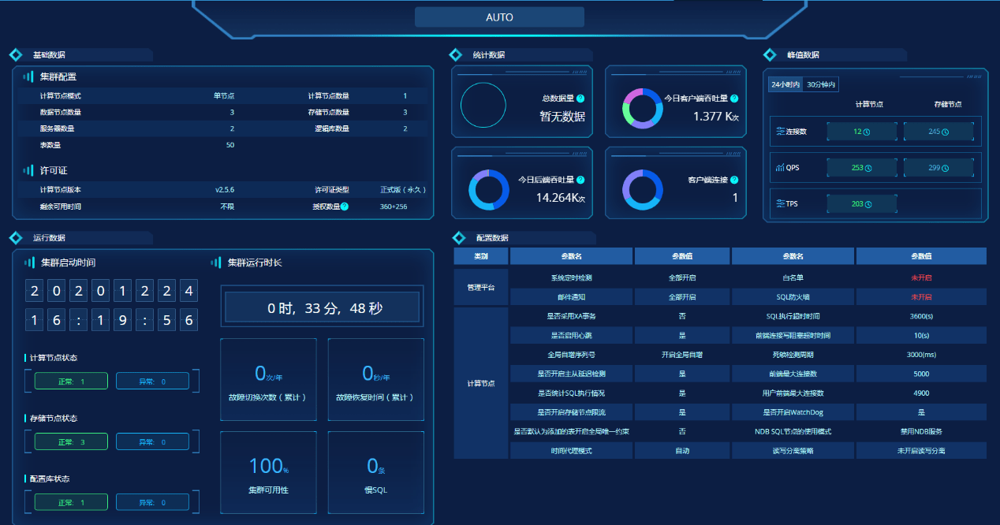

### 集群切换


管理员可在首页查看所有"已开启监控"的计算节点集群业务数据情况。

可通过点击不同集群名称tab项切换至对应集群的首页页面。当显示的集群超过3个时，可点击左右侧按钮对剩余集群进行翻页显示。

### 基础数据


基础数据为集群数据配置情况、许可证信息等。

> !Note
>
> - 表数量为当前集群所有已创建与未创建表的总数量
> - 许可证信息类型如果为永久版，则不显示剩余可用时间。若为测试版且剩余时间不足7天则会以红色字体告警提示
> - 授权数量包括可用数据节点数+可用逻辑库数，其中可用逻辑库数限制在版本高于（包含）2.5.6以上时添加

### 统计数据


- 统计数据包含：总数据量、今日客户端吞吐量、今日后端吞吐量、客户端连接。总数据量、今日客户端吞吐量、今日后端吞吐量数据获取逻辑可参考[普通用户首页](#数据量与吞吐量概览)对应内容说明
- 总数据量：显示的数值为当前集群的总数据容量，左侧的环状图为数据量TOP10的逻辑库占比情况
- 今日客户端吞吐量：显示的数据为当天零点开始至今计算节点的吞吐量，左侧环状图根据操作类型（SELECT/UPDATE/DELETE/INSERT/OHTHER）进行分别统计占比情况
- 今日后端吞吐量：显示的数据为当天零点开始至今数据节点的吞吐量，左侧环状图根据操作类型（SELECT/UPDATE/DELETE/INSERT/OHTHER）进行分别统计占比情况
- 客户端连接：显示当前计算节点前端连接个数，左侧环状图为一周内连接计算节点时长最长的TOP10应用（按客户端IP地址区分）连接占比情况

### 峰值数据


- 首页可查看24小时与30分钟两个时间范围的集群峰值数据，主要有计算节点与存储节点两个对象，以及连接数、QPS、TPS三个维度
- 峰值数据包括选择的该时间范围内出现的最高峰值数据以及出现的时间点，若存在多个时间点都出现峰值数据则取最近一次出现峰值的时间
- 管理平台定时任务每分钟采集一次计算节点与存储节点上的峰值数据，数据默认保存24小时，过期则自动清理
- 当计算节点集群为单节点或主备节点时，计算节点峰值数据只取当前主；若为多节点集群则峰值数据取所有计算节点该维度数据之和
- 存储节点的峰值数据默认取该维度下集群所有存储节点（不包括备）数据之和。存储节点无TPS数据，该维度显示为空

### 运行数据


- 运行数据中：集群启动时间、集群运行时间、故障切换次数（累计）、故障恢复时间（累计）、集群可用性、慢SQL与[普通用户首页](#首页)中对应显示逻辑一致
- 计算节点状态显示当前集群内运行正常（管理端口连接正常）与异常的计算节点个数。正常时显示为绿色，异常数大于0时显示红色，没有异常时显示蓝色
- 存储节点状态显示当前集群内运行正常（存储节点可正常连接且状态未被置为不可用）与异常的存储节点个数。颜色显示根据状态而定，具体参考计算节点状态说明
- 配置库状态显示当前集群计算节点运行正常与异常的配置库个数

### 配置数据


- 配置数据主要展示管理平台、计算节点、存储节点部分重点参数的配置情况
- 管理平台的参数配置展示可参考，[普通用户首页](#集群安全)对应参数说明。当管理平台参数未开启时，页面会红色字体警示，若未全部开启则橙色字体警示
- 计算节点参数主要来自于"[计算节点参数配置](#计算节点参数配置)"功能页面设置值。不同集群可能因计算节点版本不同，展示的参数会不一样
- 存储节点参数显示的是集群中所有存储节点实例参数设置的情况。若存在部分存储节点实例设置值不统一，页面会以红色字体警示，并展示设置不统一的值情况（此时建议用户及时修改出现不统一设置值的存储节点实例参数）
- 若部分存储节点实例在集群中无法正常连接，则展示的参数设置情况不包含无法连接的存储节点实例
- 管理平台与计算节点参数刷新页面时从配置库与server.xml文件中实时获取；存储节点参数则由管理平台定时任务每个小时检测一次，并将检测数据存入管理平内存中。管理员首页页面刷新时，存储节点参数配置情况从内存最新的检测结果中获取

## 用户管理

该功能管理的用户为使用HotDB Management平台的用户。可通过[用户管理](#用户管理)功能对平台用户进行新增、修改、删除以及记录登录用户信息等管理操作。

### 用户管理列表

用户管理列表为当前HotDB Management已添加的平台用户记录。可通过左上角搜索框对用户名和备注信息进行模糊搜索，也可以根据用户状态搜索。

**表格字段说明**

- 用户名：登录HotDB Management账户的用户名
- 角色：用户分配的角色包含管理用户、普通用户
- 计算节点集群权限：用户分配的计算节点集群的权限，拥有权限则意味着可以对计算节点集群进行访问或控制
- 状态：包含在线、离线、停用三种（注：同一个浏览器先后登录两个不同用户时，第二个用户信息会覆盖第一个，即第一个用户会失效变成离线状态）
- 最后一次登入时间：记录用户最后一次登入时间，如果用户没有登录记录，显示为空。点击"最后一次登入时间"，将会切换到用户登录流水页面
- 备注：展示用户添加或编辑时输入的备注信息
- 操作：可对用户进行"停用"、"启用""重置密码"、"编辑"、"删除"操作，超级管理员admin不能进行禁用、删除操作


### 添加用户信息

添加一个平台用户需要为其填写两部分内容信息包括：用户基本信息、用户菜单权限。

**用户基本信息：**包括用户账户名、用户角色、拥有对计算节点集群的权限等信息。

- 用户名目前没有具体限制，只要求不能与已有的名称重复即可。
- 新增用户的初始密码默认为`service_hotdb@hotdb.com`，通过新增账户在管理平台首次登录时会强制要求用户修改密码。
- 添加的用户需要赋予具体角色，默认为普通用户角色。两类角色区别如下说明：

**普通用户：**只可以在普通用户界面管理已有权限的计算节点集群

**管理用户：**可进入管理端界面，也可以在普通用户界面管理已有权限的计算节点集群。在右上角个人信息下拉框中可来回切换界面视角

- 为用户赋予计算节点集群权限则意味着，用户登录普通用户界面后可看到该集群并可进入管理。
- 计算节点集群权限有**访问**与**控制**两种，只赋予"访问权限"的用户进入该集群后只能进行查询操作，对数据有影响的操作一概提示"权限不足"。赋予"控制权限"的用户自动拥有"访问权限"并可对集群进行所有操作。
- 添加、编辑用户信息页面都可以输入"备注"信息，该备注信息非必填。


**用户菜单权限：**可为用户配置当访问普通用户界面进入集群管理时拥有的菜单权限。

- 无特殊要求时默认赋予全部菜单权限，若需要对某个用户进行菜单屏蔽则直接去除该菜单的勾选项即可。
- 如果HotDB Management进行过版本升级，则对历史平台用户的菜单权限需要进行检查是否需要将新版本中的菜单权限对其赋予。**目前介于菜单功能安全问题，新版本的新功能菜单权限不会默认赋予历史用户，需要用户自行添加。**

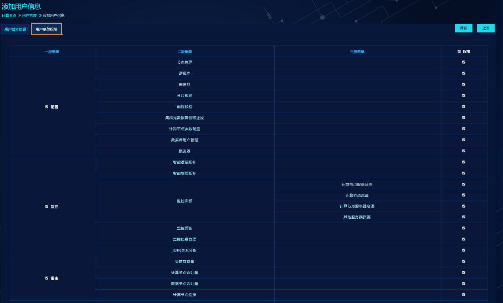

### 用户密码

**重置密码：**当用户忘记自己登录密码时可通过重置密码的方式解决。重置密码可通过[用户管理](#用户管理)界面在操作栏中"密码重置"按钮中进行，也可以在"编辑用户信息"页面点击"重置密码"。

**修改密码：**用户密码修改会在首次登录HotDB Management时要求修改，后期修改可在页面右上角"个人信息->修改用户信息"中操作。

### 用户登录流水

用户登录流水展示所有用户登入、登出管理平台的历史记录。

**功能入口：**用户管理->用户登录流水


- 用户若当前在线，管理平台登出时间为空。
- 所有用户的登录流水不会累加记录，单次登入、登出为一条记录，记录一次"共计时长"，用户登录流水最多可记录6个月以内的用户登录情况。
- 用户登录流水页面可根据用户名和登陆IP模糊搜索。
- 用户登陆时若出现主动点击"退出登陆"、"超时自动退出"、"重置用户密码自动退出"的操作，管理平台均能感知到并对应记录。

## 集群管理

### 计算节点集群

集群管理主要为用户提供对计算节点集群的部署、添加、启停监控、删除等管理操作。

#### 集群管理记录

集群管理页面显示已部署或已添加的计算节点集群信息。可以通过左上角搜索框模糊搜索计算节点集群名称进行快速查找。同时也可以通过右侧展开展开/隐藏更多按钮控制集群列表所需展示的信息内容。


**表格字段说明：**

- 集群名称：一组计算节点的集群名称，可用于区别其他计算节点集群。在整个HotDB Management中该名称是唯一的，点击集群名称可进入"编辑计算节点集群"页面
- 集群模式：目前支持计算节点集群模式有单节点、主备节点、多节点，具体详细说明可参考[名词解释](glossary.md)文档 ，模式底部显示的为计算节点的版本号
- 组件名称：计算节点名称用于表示集群内不同计算节点的区别。在主备节点模式的集群中若为计算节点配置了服务器的SSH信息，则名称旁会显示当前Keepalived虚拟IP（VIP）标志，方便用户快速了解当前集群中的主计算节点位置；若计算节点开启了只读模式，则组件名称旁显示"只读"字样

> !Tip
>
> **集群名称颜色说明：**红色代表该集群已被HotDB Management停止监控；黄色代表主备模式的群高可用环境需要进行重建；蓝色代表HotDB Management正常开启监控的集群。


- IP地址：计算节点部署的服务器IP
- 服务端口：计算节点对外提供数据服务的端口号，可在server.xml配置文件中修
- 管理端口：计算节点对外提供监控管理查询的端口，可在server.xml配置文件中修改
- 类型：主备节点模式下的计算节点集群可标识计算节点的主备角色，在单节点与多节点模式的集群中该字段意义不大
- 计算节点：该字段隶属于集群部署信息中，主要显示计算节点服务程序当前的运行状态。如果不是当前管理平台部署出来的计算节点集群，该字段显示为空
- 高可用组件：在主备节点模式的集群中该字段主要展示Keepalived组件运行状态，在多节点模式的集群中展示LVS组件运行状态；同时会展示LVS的虚拟IP地址（VIP）。如果不是当前管理平台部署出来的计算节点集群，该字段显示为空
- 配置库：显示计算节点集群所用的配置库运行状态，同样如果不是当前管理平台部署出来的计算节点集群，该字段显示为空
- NTPD时间服务：显示计算节点集群上安装的NTPD时间服务运行状态
- 存储节点：显示计算节点集群中的所有存储节点运行状态
- 部署环境得分：成功进行过"[部署环境体检](#部署环境体检)"功能的计算节点集群会显示最新体检的得分
- 集群操作：若集群是在当前管理平台通过"集群部署"功能添加的则在集群操作栏中会显示【部署拓扑】按钮，点击可查看部署集群的组件拓扑架构；若集群模式为"主备节点"则操作栏会根据集群当前高可用重建环境是否满足切换条件来显示【重建】或【切换】按钮
- 开启容灾模式并符合条件的集群，会现实【切换为主机房】、【移除机房】、【修复机房】等按钮，均可参考[跨机房容灾管理](cross-idc-disaster-recovery-management.md)文档


**功能按钮说明：**

- 集群部署：从0开始部署一整套计算节点集群，具体功能描述请参考[安装部署](installation-and-deployment.md)文档
- 集群添加：为HotDB Management手动添加计算节点集群（计算节点已在线下完成部署）信息
- 更多->开启监控：对已停止监控的计算节点集群（集群名称为红色背景显示）进行重新开启监控
- 更多->停止监控：对正在监控的计算节点集群停止监控，则HotDB Management不再对该集群进行状态监控，停止监控的集群用户登录普通用户角色页面时无法查看
- 更多->删除集群：对页面中已管理的计算节点集群进行删除
- 更多->机房切换演练：可参考[跨机房容灾管理](cross-idc-disaster-recovery-management.md)文档

#### 集群添加

针对部分用户线下手动部署出来的计算节点集群需要加入HotDB Management中进行纳管，集群管理功能提供集群添加。用户只需按填写要求将信息填入HotDB Management中即可完成对计算节点集群的管理和监控。

在集群管理页面点击【集群添加】进入"添加计算节点集群"页面。


**填写说明：**

**(1) 集群信息**

选择已部署集群的集群模式，不同模式输入的参数要求也不同

集群名称与当前已有计算节点集群名称不重复即可

集群网段只在"集群模式"为"多节点"时出现，为部署的计算节点所属网段，填写格式为：IP/子网掩码长度，例192.168.200.0/24。可在server.xml中查看或修改该参数

通信端口只在"集群模式"为"多节点"时出现，为部署的集群内多个计算节点间通信时使用的端口。可在server.xml中查看或修改该参数。

"手动设置配置库"默认不勾选即不要求填写，只有在添加的计算节点无法正常连接管理端口（一般为3325）时需要用户手动指定配置库地址

手动配置库指定需要选择配置库复制模式，然后按照已给出示例填写配置库地址，配置库用户名与配置库密码为连接配置库实例的账户与密码

> !Note
>
> 任何复制模式的配置库，都强烈要求server.xml中配置库连接地址与实际配置库所在服务器IP地址一致，不能配置为127.0.0.1或localhost，主要为避免管理平台与计算节点服务不在同一台服务器上时，管理平台获取多个配置库地址会存在误判实际地址的风险

**(2) 计算节点**

不同"集群模式"显示需要配置的计算节点记录也不同，"单节点"模式只需要配置一条记录，"主备节点"模式需要配置一主一备两条记录，"多节点"模式需要至少配置三条，最多不超过九条记录

带红色\*号的字段为必填项有：计算节点名称、主机名、用户名、密码、服务端口、管理端口

未带红色\*号的字段为非必填项，但在**计算节点集群为主备模式**时，**建议用户填写**因为后期高可用重建与高可用切换需要使用这些参数值

填写完成计算节点信息后，可通过【测试】按钮测试计算节点是否可连接。连接异常与连接成功效果如下图所示：


若当前已有的计算节点集群数量（包括停止监控和正常监控的）已经达到平台许可证授权的可用计算节点集群组数，则计算节点集群管理页面点击【集群添加】按钮时，3s即逝提醒：`"超过平台授权的可用计算节点集群组数，禁止添加"`


> !Note
>
> 其他更多容灾模式、多计算节点集群模式的添加注意事项，可查看[安装部署](installation-and-deployment.md)、[跨机房容灾部署](cross-idc-disaster-recovery-deployment.md)等其他配套文档。

#### 高可用切换

在主备模式集群中，如果集群满足高可用切换的条件，则在集群记录"集群操作"一栏中可点击【切换】按钮进行手动计算节点主备切换操作。


**高可用切换操作说明**

高可用切换主要包含：SSH与配置文件确认、切换预检测、高可用切换、完成切换四个步骤。上一步骤未完成不允许进入下一步骤，所有步骤均完成代表高可用切换成功。

**(1) SSH与配置文件位置确认**


- 此步骤主要确认主备计算节点配置的SSH连接信息与配置文件（server.xml与keepalived.conf）存放地址是否填写正确
- SSH登录方式可选择用户密码登录或免密登录，测试连接成功会自动保存连接信息
- 当前主备计算节点服务器的SSH连接用户必须为root或具有sudo操作权限的用户
- SSH登录方式若选择免密登录，HotDB Management所在服务器需预先对其启动账号设置公钥并拷贝到待访问的服务器（注：免密用户需与当前启动管理平台的服务器用户一致）
- 如果当前连接账号具有免密登录权限，即使选择用户密码登录，输入错误的密码，也会登录成功。SSH服务端优先判断是否有免密权限，有则直接略过密码的校验
- 配置文件目录需跟真实目录保持一致，否则测试连接失败
- 若在[集群添加](#集群添加)中配置了计算节点的SSH信息与配置文件地址，则该页面信息自动带出。只需点击【测试连接】即可校验信息正确性
- 只有SSH信息与配置文件地址都检测通过，【下一步】按钮才正常开放允许点击进入下一步骤

**(2) 切换预检测**


- 点击【开始检测】则对当前集群高可用环境进行检验，判断是否符合高可用切换前的要求
- 此步骤要求所有检测项都通过检测才能进行下一步骤，否则必须人工介入解决不通过项的异常问题

**(3) 高可用切换**


- 此步骤为高可用切换执行步骤，所有执行项正常完成才代表高可用切换成功
- 切换前会对备计算节点设置readonly（V2.4.8以下的不会设置），切换成功后会自动取消设置
- 页面自动勾选"切换完自动重建高可用环境"，即切换完成后程序自动重建环境。无需人工再次重建即可满足下一次高可用切换操作
- 若出现执行失败则需要人工介入查看问题并解决

**(4) 完成切换**


- 到达此步骤则代表高可用切换已完成，可查看当前VIP漂移位置以及主备计算节点服务端口开启关闭情况

#### 高可用重建

主备模式的集群主要通过server.xml以及keepalived.conf配置文件来标识主备的角色。高可用切换只能从主角色切换至备角色，当计算节点发生过故障切换或手动切换后，为了下次计算节点故障还能顺利回切，除修复故障外，还需要通过高可用重建操作使主备计算节点的配置恢复到可切换状态。


不符合高可用切换条件的主备模式集群在"集群操作"栏会显示【重建】按钮。同时集群名称会以黄色背景显示告警。

**高可用重建操作说明**

点击【重建】操作按钮进入高可用重建流程。流程分为：SSH与配置文件位置确认、环境重建检查、高可用环境重建、完成重建四个步骤

**(1) SSH与配置文件位置检测**


在配置检测前，需要注意以下要点：

- 若在[集群添加](#集群添加)中已配置过SSH登录信息或配置文件信息，高可用环境重建页面会默认填充相关信息
- SSH登录方式可选择用户密码登录或免密登录，测试连接成功会自动保存连接信息
- 当前主备计算节点服务器的SSH连接用户必须为root或具有sudo操作权限的用户
- SSH登录方式若选择免密登录，分布式事务数据库平台所在服务器需预先对其启动账号设置公钥并拷贝到待访问的服务器（注：免密用户需与当前启动管理平台的服务器用户一致）
- 如果当前连接账号具有免密登录权限，即使选择用户密码登录，输入错误的密码，也会登录成功。SSH服务端会优先判断是否有免密权限，有则直接略过密码的校验
- 配置文件目录需跟真实目录保持一致，否则测试连接失败
- 输入正确的配置信息，测试连接成功，相应的配置会同步保存到计算节点集群中，点击【下一步】，进入环境重建检测页面，若当前页面信息未测试通过，下一步操作按钮是不可触发的

**(2) 环境重建检查**


点击【开始检测】需注意事项：

- 如任意一项检测不通过则停止继续检测，检测失败原因可根据失败错误信息定位处理
- 配置校验主要检验配置是否合理以及内存中使用的配置与配置库中是否一致，若检测到不一致可通过动态加载来处理，此方法可行但不绝对
- 检测完成，点击【下一步】进入高可用环境重建页面，若当前页面信息未检测通过则【下一步】操作按钮是不可触发的

**(3) 高可用环境重建**


重建主要为修改相关配置信息具体如下说明：

- 修改主备计算节点server.xml中的（haState、haNodeHost）角色信息
- 修改主备keepalived配置文件，keepalived配置文件修改点如下：


高可用重建注意事项：

- 点击【开始执行】，如任意一项执行不通过则停止往下执行，执行失败原因可根据失败错误信息定位处理
- 重建过程对于server.xml配置的修改，若实际部署的环境管理网络和运行网络是分离的，则haNodeHost配置可能存在不正确的风险，因目前采用的是服务器连接IP，此情况需人工介入
- 重建执行完成，点击【下一步】进入完成重建页面，若当前页面信息未执行完成或执行失败则【下一步】操作按钮是不可触发的

**(4) 完成重建**


高可用重建完成，主备计算节点服务运行正常，完成重建页面可点击【立即切换】进行手动[高可用切换](#高可用切换)操作。

#### 只读计算节点高可用

只读计算节点的高可用切换和重建流程同普通模式一致，只是在切换/重建后是否会释放计算节点的只读属性根据只读计算节点的节点类型决定

* 主计算节点开启只读，执行高可用切换并重建后，备切换为单前主，原主计算节点为当前备且为只读模式

  切换前主节点为只读：

  

  切换并重建后原主节点切换为备节点依旧为只读模式：

  

* 备计算节点开启只读，执行高可用切换并重建后，备切换为当前主并释放只读属性

  切换前备节点为只读：

  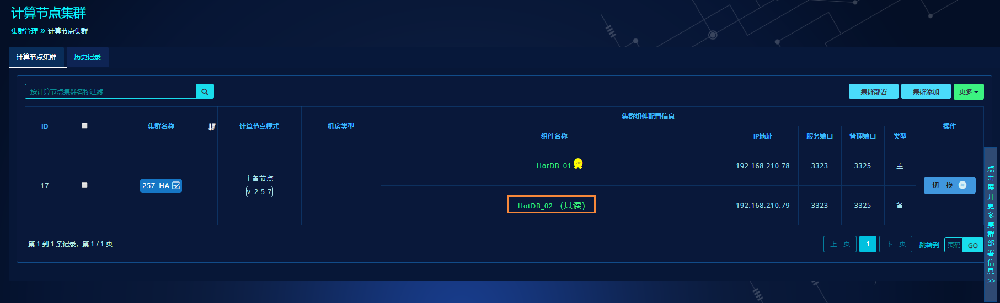

  切换并重建后原备节点切换为当前主且释放只读：

  

#### 切换、移除、修复机房

在计算节点开启容灾模式的情况下，符合条件的计算节点集群可以通过管理平台进行可视化的切换、移除、修复机房操作，因涉及内容较多，详细操作说明可参考[跨机房容灾管理](cross-idc-disaster-recovery-management.md)文档进行操作。

#### 机房切换演练

在计算节点开启容灾模式的情况下，符合条件的计算节点集群可以通过管理平台进行可视化的机房切换演练操作，因涉及内容较多，详细操作说明同样地可参考[跨机房容灾管理](cross-idc-disaster-recovery-management.md)文档进行操作。

### 单机部署

单机部署为HotDB Management为用户提供单个组件安装部署的功能，弥补集群部署功能中无法单独安装某个组件的缺陷。具体功能说明与操作步骤请参考[跨机房容灾管理](cross-idc-disaster-recovery-management.md)文档 。

### 部署环境体检

部署评分体检是一套专门为HotDB Server集群量身打造的运行环境体检评分功能。用户无论是通过手动安装还是管理平台部署的集群，都可以使用该功能对集群环境进行评测。评测后将展示出整个集群五大维度接近140个体检细分项目的体检结果，并支持导出体检结果记录。

**功能入口：**登录管理用户界面->计算节点集群->部署环境体检

**体检维度：**

| 体检维度     | 体检项             |
|--------------|--------------------|
| 硬件资源     | 服务器属性         |
| ^            | 磁盘空间           |
| ^            | 磁盘IO响应时间     |
| ^            | 内存               |
| ^            | CPU                |
| ^            | 网络质量           |
| 操作系统     | 定时调度           |
| ^            | sysctl.conf        |
| ^            | 时间同步           |
| ^            | 可连接外网         |
| ^            | 防火墙与selinux    |
| ^            | yum                |
| ^            | 时区               |
| ^            | tune               |
| ^            | limits.cnf         |
| ^            | 字符集设置         |
| ^            | SSH连接            |
| 软件部署     | 备份程序           |
| ^            | MySQL客户端        |
| ^            | MySQL服务端        |
| ^            | Java环境           |
| 软件配置     | MySQL连接          |
| ^            | MySQL高可用        |
| ^            | 计算节点启动脚本   |
| ^            | 配置库             |
| ^            | MySQL磁盘空间      |
| ^            | MySQL参数配置      |
| ^            | MySQL用户权限      |
| ^            | server.xml         |
| ^            | 计算节点高可用     |
| ^            | 监听端口           |
| 基础功能验证 | 存储节点高可用切换 |
| ^            | 计算节点高可用切换 |
| ^            | 逻辑库权限         |
| ^            | 备份程序           |
| ^            | 10秒性能测试       |

**体检面板：**


**体检面板内容说明**

体检面板显示最近一次成功体检完的集群报告概览。

- **得分：**左侧分数球为体检总得分情况。得分根据集群体检项的体检结果来计分，总分为100，体检中若对应的体检项不符合评判标准则扣除该项占比分数，符合标准的不扣分也不加分。当总分被扣完或扣除分数大于100时，体检得分为0
- **体检项：**体检项为计算节点集群在体检时所需要体检的项目个数，不同模式的计算节点集群或不同复制模式的MySQL存储节点都会影响体检项目的数量。上图中未达标为该次体检中不符合评判标准的体检项目数量，警示项为体检中不涉及扣分但是需引起关注的体检项目数量，合格项为符合评判标准的体检项目数量
- **雷达图：**雷达图展示体检中五个维度的扣分情况，若该维度扣分越少即高亮部分越接近雷达图边界代表该维度体检良好。鼠标移入雷达图内可查看每个维度的详细扣分以及该维度所有体检项的占比总分

**发起环境体检：**

在部署环境体检页面可通过点击【环境体检】按钮来发起对集群运行环境的体检任务。发起后可选择需要体检的计算节点集群（停止监控的集群不支持发起体检，集群选择下拉框会自动过滤该类集群），提交任务后会对当前集群环境进行预检测，若预检测不通过则发起任务失败。

**预检测项**

1. 集群所有服务器已配置可用的SSH信息且用户为root 或具有sudo操作权限的用户
2. 集群所有相关组件程序正常运行
3. 集群至少配置一个数据节点和一个逻辑库

> !Note
>
> 集群所有相关组件程序的状态检测依赖于频率为2分钟的定时检测任务，所以可能存在当前检测状态与实际组件状态有2分钟的检测误差。

**体检报告详情：**

成功完成的体检任务会生成一份体检报告，可通过点击任务记录中操作栏的详情按钮进入"体检报告详情页面"。

**体检报告说明**

体检报告默认筛选展示未达标与警示的体检项，可通过点击不同维度展开该维度的详细体检项信息。每个维度标题中出现的红色与橙色圆点代表该维度下存在未达标或警示的体检项，维度内的每个tab标签是该维度下的具体体检项目。Tab标签右上角的红色与橙色标识与上述圆点代表意思一致。

- 体检项：该维度下的具体体检项目
- 体检结果：体检项的体检结果包括未达标、警示、合格
- 扣分情况：该体检项实际扣分
- 异常对象：不符合该体检项评判标准的服务器或应用程序实例
- 提示：未达标或警示的体检项告知用户该项存在的风险或建议
- 评判标准：是否通过检测的程序评判标准

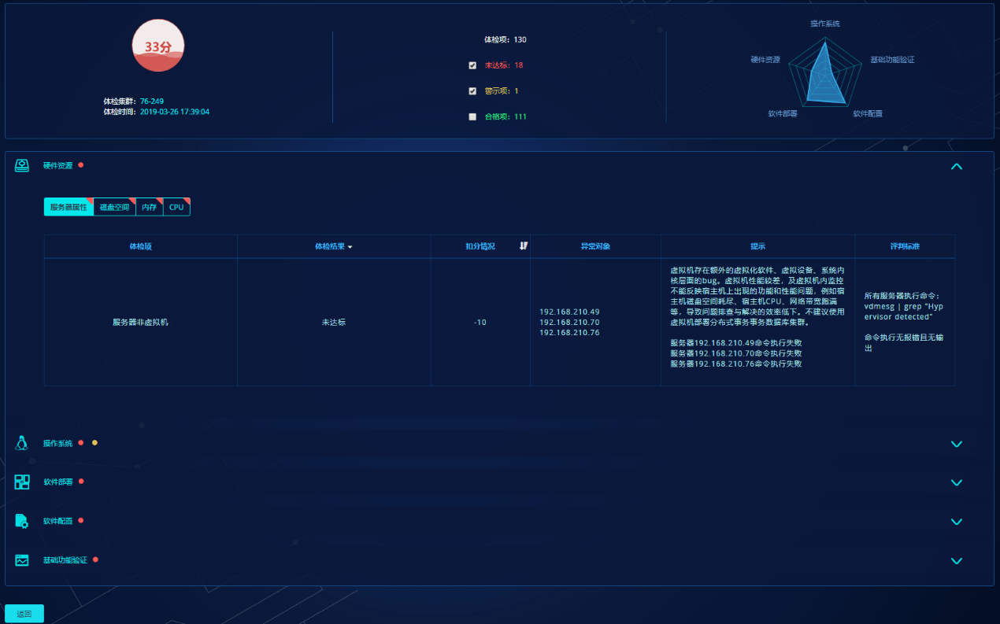

> !Note
>
> 部署环境体检功能对HotDB Server版本无要求，但体检的Server版本低于2.5.3时，不支持"10秒性能测试"、"主备或MGR配置库数据一致性"两个体检项检测。

### 服务管理

服务管理主要是对计算节点集群内的核心组件（计算节点、计算节点配置库、存储节点、keepalived、lvs、备份程序、监听程序）进行重启、启动、关闭服务的操作。

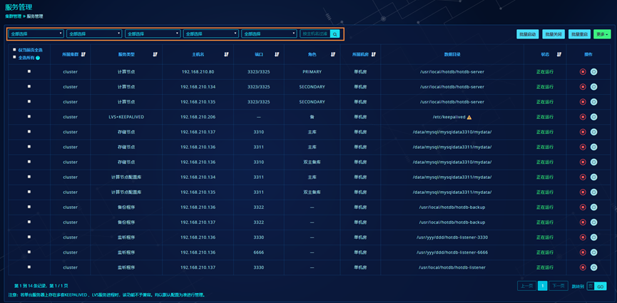

服务管理主页面显示已监控的集群的所有组件信息，并可通过服务管理列表上方的各个搜索过滤框进行数据筛选。

若存储节点、配置库、KEEPALIVED、LVS不是通过集群部署安装的，则提示当前集群存在部分组件未通过平台进行部署，请优先确认[服务管理命令](http://192.168.210.135:3324/page/javascript:;)是否配置正确，点击“服务命令管理”超链接则进入命令配置页面，点击“已确认”按钮则关闭该提示。


Ø 若组件服务器存在未配置SSH信息的情况，则会给出提醒且该服务器对应的组件状态均显示为“未知”。

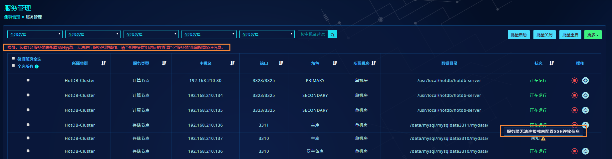

服务管理页面每页显示20条数据，超出20条则需翻页。

服务管理表格参数说明：

**全选项：**“仅当前页全选”在执行批量操作时，只执行当页操作选项；“全选所有”在执行批量操作时，所有集群的所有组件均执行（全选所有时，不支持单项取消）

**所属集群：**默认显示所有已开启监控的集群信息，管理平台及平台配置库此项为“-”，可排序。

**服务类型：**默认显示各已有的服务组件类型，集群中不存在的服务组件不显示，可排序。

**主机名：**显示各服务组件对应的服务器IP，可排序。

**端口：**显示各服务组件对应的端口号（计算节点为服务端口/管理端口、KEEPALIVED/LVS为“-”），可排序。

**角色：**显示各服务组件对应的角色类型(多节点集群模式的计算节点需显示为PRIMARY/SECONDARY,备份程序和监听程序为“-”，可排序。

**所属机房：**根据各服务组件对应机房显示为“单机房”“中心机房”“灾备机房”，管理平台及平台配置库此项为“-”，可排序。

**数据目录**：显示各服务组件对应的数据目录（组件为初次配置且SSH无法连接、KEEPALIVED\LVS非自动部署时均显示对应警告提示）。

**状态：**显示各服务组件当前运行状态，组件对应的SSH未配置或服务器无法连接时显示警告提示“服务器无法连接或未配置SSH连接信息”，可排序。

**操作：**【启动】【关闭】![img]【重启】![img]，组件不同状态下显示对应的图标按钮。

#### 关闭服务

组件关闭成功后状态变更为“停止运行”且页面3s即逝提醒：服务关闭成功。

组件非自动部署安装时，按[命令配置](#命令配置)中配置的命令执行关闭，若命令配置中未配置，则按照默认的关闭命令关闭组件服务。

##### 单次关闭

点击关闭图标按钮对需要关闭的组件服务进行关闭。

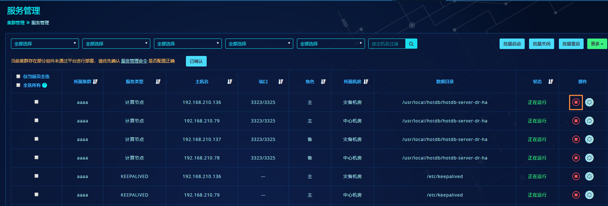

关闭组件时均给出确认提示说明，具体提示内容根据不同类型组件的不同角色类型进行提示，如关闭主计算节点提示如下：


关闭的组件实际状态为已关闭时，页面弹窗提示：操作对象服务已关闭，请刷新当前页面获取最新状态。


若关闭组件失败（此处执行关闭后，若3分钟仍未关闭成功也视为关闭失败，状态由“正在关闭...”变更回“正在运行”），关闭失败则弹窗提示，并可通过点击“[操作日志详情](#操作记录)”超链接查看失败详情信息。


##### 批量关闭

选择需要关闭的服务组件后，点击批量关闭按钮。


执行批量关闭时，需要再次确认每个选择项是否执行并给出相对应的隐患提示说明，其中计算节点配置库默认为取消执行，其余组件均默认为确认继续执行。点击“全部确认”按钮则按每个组件选择对应的策略执行关闭，点击“取消”按钮则取消当前批量操作。


若所选组件实际状态存在已关闭的情况，页面弹窗提示：部分/全部操作对象已关闭，请刷新当前页面获取最新状态。


批量关闭时，若中途存在关闭失败的组件，则后续类型的组件均停止关闭操作，报关闭失败并可通过点击弹窗中的“[操作日志详情](#操作记录)”超链接查看失败详情信息。


若所选组件均是已关闭状态的组件，则会3s即逝提醒：当前服务已经是停止运行的状态。

所有组件关闭顺序依次为keepalived、lvs、计算节点、存储节点、配置库、备份程序、监听程序。

批量关闭采用串行的方式，按照依赖关系在成功关闭当前组件后继续下一个组件，一个组件的关闭失败不影响同类型组件的操作（如关闭的组件包含计算节点、存储节点类型，在批量关闭时其中一个计算节点关闭失败了，此时不影响其他计算节点的关闭，但存储节点会直接关闭失败。

#### 启动服务

组件启动成功后状态变更为“正在运行”且页面3s即逝提醒：服务启动成功。

组件非自动部署安装时，按[命令配置](#命令配置)中配置的命令执行启动，若命令配置中未配置，则按照默认的关闭命令启动组件服务。

##### 单次启动

点击启动图标按钮对需要启动的组件服务进行启动。


存储节点、计算节点配置库、平台配置库、监听程序、备份程序、LVS均可直接启动，无需再次确认，管理平台需人工启动。

集群处于待重建状态、待修复机房状态时，计算节点需修复相关故障后才能做启动操作。

KEEPALIVED启动时，需先启动与之对应的计算节点，且在启动备的KEEPALIVED时需先启动主的KEEPALIVED。

启动的组件实际状态为已启动时，页面弹窗提示：操作对象服务已启动，请刷新当前页面获取最新状态。

启动的计算节点可能会导致双写时，需人工确认是否继续执行启动操作。


若启动组件失败（此处执行启动后，若3分钟仍未启动成功也视为启动失败，状态由“正在启动...”变更回“停止运行”），启动失败则弹窗提示，并可通过点击“[操作日志详情](#操作记录)”超链接查看失败详情信息：


##### 批量启动

选择需要启动的服务组件后，点击批量启动按钮。


执行批量启动时，需要再次确认每个选择项是否执行并在不符合启动条件时给出特殊说明，对于不符合启动条件的部分组件，启动策略默认且只能选择取消执行。点击“全部确认”按钮则按每个组件选择对应的策略执行启动，点击“取消”按钮则取消当前批量操作。


若所选组件实际状态存在已启动的情况，页面弹窗提示：部分/全部操作对象已启动，请刷新当前页面获取最新状态。

批量启动时，若中途存在启动失败的组件，则后续类型的组件均停止启动操作，报启动失败并可通过点击弹窗中的“[操作日志详情](#操作记录)”超链接查看失败详情信息：


若所选组件均是已启动状态的组件，则会3s即逝提醒：当前服务已经是启动的状态。

所有组件启动顺序依次为配置库、存储节点、监听程序、备份程序、计算节点、keepalived、lvs

批量启动采用串行的方式，按照依赖关系在成功启动当前组件后继续下一个组件，组件内的部分服务关闭失败不影响组件内的其他服务启动（如：集群内其中一个存储节点启动失败，不影响其他存储节点的启动）。

#### 重启服务

服务重启操作即为先停止服务操作，然后重新启动服务

组件重启成功后状态变更为“正在运行”且页面3s即逝提醒：服务重启成功。

组件非自动部署安装时，按[命令配置](#命令配置)中配置的命令执行启动，若命令配置中未配置，则按照默认的关闭命令启动组件服务。

##### 单次重启

点击重启图标按钮对需要重启的组件服务进行重启。

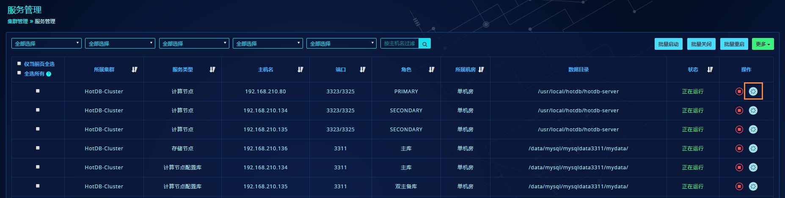

服务重启时也会根据具体需要重启的组件进行二次确认操作（由于重启时先停止服务，故二次确认提示和关闭时提示一致）


##### 批量重启

选择需要重启的服务组件后，点击批量重启按钮。

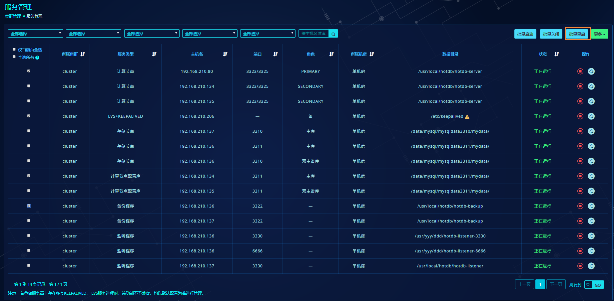

批量重启需要对各个待重启组件二次确认


批量重启实质是先对所选组件执行批量关闭，然后在执行批量启动

批量重启时，若中途存在关闭失败或启动失败的组件时，后续操作不再继续

#### 命令配置

命令配置主要对非自研（如MySQL、KEEPALIVED、LVS）及未通过集群部署功能部署的程序进行服务命令管理。以便特殊场景下，无法正确使用启动/关闭服务的命令导致功能无法使用。

命令配置入口：

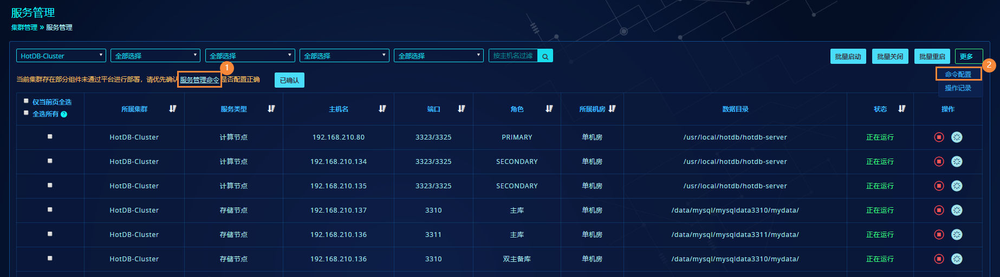

* 可通过点击“服务管理命令”超链接进入命令配置页面
* 可通过更多按钮展开的命令配置选项进入命令配置页面

命令配置页面也可通过页面上方的各项过滤搜索框过滤有效信息

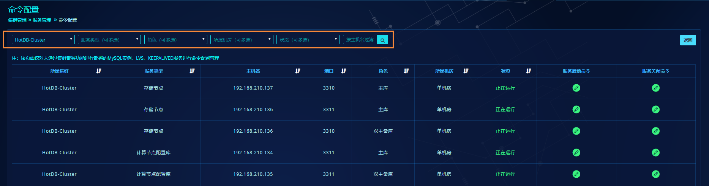

点击服务命令编辑按钮配置服务启动/关闭命令

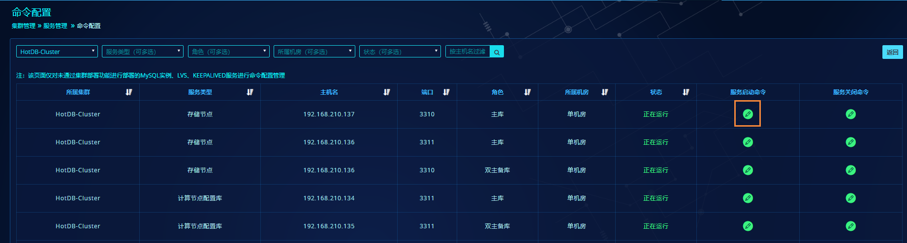

配置命令后，点击保存命令配置


勾选“仅在当前程序关联的集群组内同步”则在点击“是”后将该命令同步至该集群组内所有相关组件，若是MySQL实例则自动匹配MySQL端口号；未勾选“仅在当前程序关联的集群组内同步”时则将配置命令同步至所有集群；点击“否”则不同步任何其他程序。

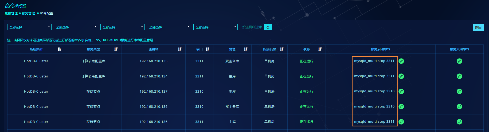

通过普通用户管理页面命令配置，无“仅在当前程序关联的集群组内同步”勾选框


#### 操作记录

操作记录列表详细记录了每次服务操作的具体信息，包含所属集群、操作对象、操作类型、操作用户、操作开始时间、操作结束时间、操作结果、操作日志。


1. 管理员页面只能查看管理员页面执行的操作记录，普通用户页面只能查看普通用户页面执行的操作记录
2. 管理员用户页面的操作记录列表包含所属集群列，而普通用户页面的操作记录列表只显示当前集群的操作记录，故没有所属集群列
3. 点击“点击查看日志详情”超链接可查看当次的服务操作详情

操作日志详情记录执行服务操作的详情信息，如执行的命令、服务启动失败原因、每个组件启动的具体时间


## 实例管理

该功能用来查看和管理所有计算节点集群中存储节点所在实例的主从关系。实例信息可以通过主机名、端口号、和MySQL版本号进行筛选。

### 实例管理信息

**功能入口：**登录管理用户界面->实例管理


实例管理信息以一个MySQL实例为单位显示一条记录，可对具体的MySQL实例进行"解除Master、添加Slave、配置高权限账号"等操作。

- **解除Master：**点击【解除Master】，程序将停止此实例的复制，并且执行清空复制信息操作（stop slave; reset slave all;）
- **添加Slave：**点击【添加Slave】可为此实例添加从机，在从机上执行"change master"操作时将此实例设置为主机。选择从机时只可以勾选没有master的实例，已经配置了master的实例需要先解除Master


- **配置高权限账号：**主要用于配置具备更改主从权限的账号用于解除master和添加slave操作。高权限账号需要拥有"super, replication slave, replication client, create user, reload"权限，如果存储节点没有具备这些权限的账户则需要去实例中添加


可点击【复制】按钮，复制添加高权限账户的SQL语句到实例中执行。

"主从复制用户名"、"主从复制密码"是高权限账户为实例搭建主从关系时自动创建的用户，默认创建复制账户`hotdb_repl`密码`hotdb_repl`且只具有`replication slave, replication client`权限。用户也可对创建的复制账户自定义用户名和密码。

## 审计日志

管理用户界面的审计日志主要用来查看管理用户对HotDB Management的操作记录，同时可查看所有纳管的计算节点集群内普通用户的基本操作。

### 管理员操作

可以查看所有管理用户在管理平台的操作。可以在页面的操作类型下拉框中按操作类型过滤查看。访问IP和操作内容支持模糊查找。

**功能入口：**登录管理用户界面->审计日志->管理员操作

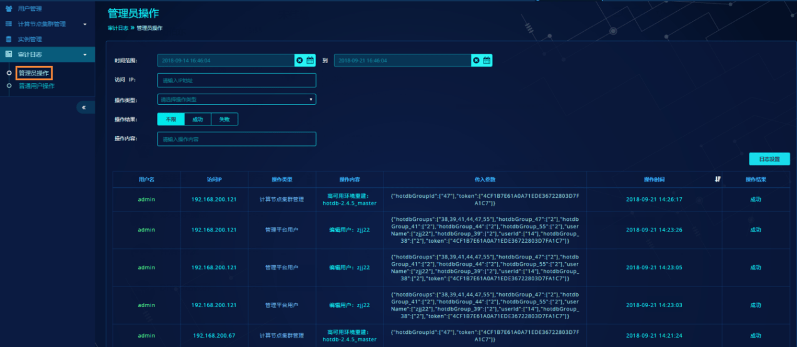

**表格信息说明：**

- 用户名：登录管理平台所用的账户
- 访问IP：登录管理平台浏览器自身所在IP。可支持模糊查询
- 操作类型：下拉框中显示所有支持的类型，勾选多选框，仅显示选中操作类型的日志
- 操作内容：记录用户真实的操作，且记录重要参数。可支持模糊查询
- 传入参数：更详细的用户操作日志，方便分析用户操作
- 操作时间：记录真实的操作时间，支持选择时间范围来显示日志记录。这里记录的时间范围由设置中的默认保留天数决定
- 操作结果：记录真实的操作结果。可根据操作结果筛选日志记录

### 普通用户操作

可以查看所有普通用户在管理平台的操作，默认显示所有计算节点组的日志记录。通过勾选下拉框，可以筛选查看哪些计算节点组的日志信息。这里分为：平台操作、安全防护、管理端口操作，与普通用户登录后查看方式一致。

**功能入口：**登录管理用户界面->审计日志->普通用户操作


#### 平台操作

可以查看所有普通用户在管理平台的操作，具体记录哪些类型的操作，可以在页面的操作类型下拉框中查看。访问IP和操作内容输入框，支持模糊查找。如果选择了计算节点组，只显示选中的计算节点组的操作记录，默认显示所有计算节点组。


**表格信息说明：**

- 组名称：查询的计算节点组名称
- 用户名：登录管理平台所用的账户
- 访问IP：登录管理平台浏览器自身所在IP。可支持模糊查询
- 操作类型：下拉框中显示所有支持的类型，勾选多选框，仅显示选中操作类型的日志
- 操作内容：记录用户真实的操作，且记录重要参数。可支持模糊查询
- 传入参数：更详细的用户操作日志，方便分析用户操作
- 操作时间：记录真实的操作时间，支持选择时间范围来显示日志记录。这里记录的时间范围由设置中的默认保留天数决定
- 操作结果：记录真实的操作结果。可根据操作结果筛选日志记录

#### 安全防护

可以查看所有数据库用户执行安全防护相关的操作日志，具体记录哪些类型的操作，可以在页面的操作类型下拉框中查看。访问IP和拦截详情输入框，支持模糊查找。如果选择了计算节点组，只显示选中的计算节点组的操作记录，默认显示所有计算节点组。可以选择具体的计算节点，默认选中所有计算节点。


**表格信息说明：**

- 组名称：查询的计算节点组名称
- 用户名：执行操作所用的账户
- 访问IP：执行操作的客户端自身所在IP。可支持模糊查询
- 拦截类型：下拉框中显示所有支持的类型，勾选多选框，仅显示选中操作类型的日志
- 拦截详情：记录执行的命令。可支持模糊查询
- 发生时间：记录真实的操作时间，支持选择时间范围来显示日志记录。这里记录的时间范围由设置中的默认保留天数决定
- 操作结果：记录真实的操作结果。可根据操作结果筛选日志记录

> !Note
>
> 若计算节点版本低于V2.5.0，页面不显示安全防护审计日志记录

#### 管理端口操作

可查看所有数据库用户在管理端口的操作记录。具体记录的操作类型，可以在页面的操作类型下拉框中查看。访问IP和拦截详情输入框，支持模糊查找。若选择了计算节点组，则只显示选中的计算节点组的操作记录，同时也可以选择具体的计算节点，默认选中所有计算节点。


**表格信息说明：**

- 组名称：查询的计算节点组名称
- 用户：登录管理端口的账号
- 访问IP：执行操作的客户端自身所在IP。可支持模糊查询
- 操作类型：下拉框中显示所有支持的类型，勾选多选框，仅显示选中操作类型的日志
- 操作命令：实际在管理端口执行的命令
- 操作时间：记录真实的操作时间，支持选择时间范围来显示日志记录。这里记录的时间范围由设置中的默认保留天数决定
- 操作结果：记录真实的操作结果。可根据操作结果筛选日志记录

> !Note
>
> 若计算节点版本低于V2.5.0，页面不显示管理端口操作审计日志记录。

## 工具

### 许可证管理

为用户提供对管理平台和计算节点的生成机器指纹、更新许可证、获取已有许可证信息等操作功能。

#### 管理平台许可证

##### 更新入口

- 管理员角色下工具菜单栏的许可证管理


- 管理平台认证标识中的[许可证管理](#许可证管理)超链接


##### 生成机器指纹{#管理平台许可证-生成机器指纹}

- 进入许可证管理页面，操作类型选择【生成许可证】，许可证类型选择【平台许可证】，点击【生成】按钮


- 点击下载指纹文件超链接下载机器指纹文件（指纹文件默认保存在hotdb-management/keys目录下，格式为：management-fingerprint-年-月日-时-分-秒）

- 填写申请单位信息及许可证属性（选填），并复制申请信息


- 点击供应商默认收件地址超链接（[service@hotdb.com](mailto:service@hotdb.com)，调用本地邮箱

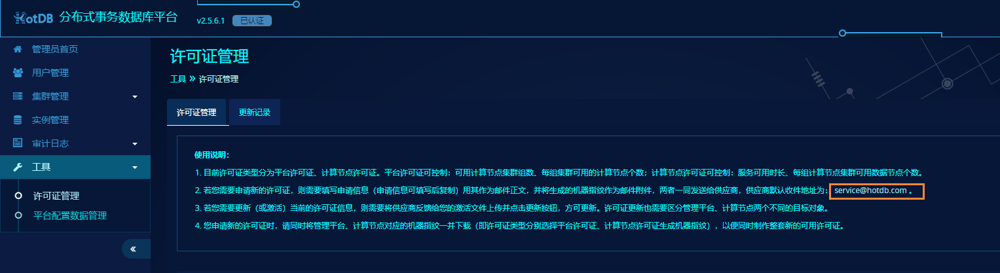

- 粘贴申请信息到邮件，并将指纹文件上传至邮件附件发送给供应商以获取新的许可证授权文件


##### 更新许可证

- 进入许可证管理页面，操作类型选择【更新许可证】，许可证类型选择【平台许可证】，点击【选择】按钮上传许可证文件

- 点击【更新】按钮更新许可证，更新后刷新页面使新的许可证生效


- 当新上传的授权文件和当前正在使用的授权文件名一致时，点击更新按钮提示当前已存在授权文件，是否替换，点击确认替换，则替换已有的许可证授权文件进入更新流程


##### 获取已有许可证信息

- 进入许可证管理页面，操作类型选择【获取已有许可证信息】，许可证类型选择【平台许可证】，点击【获取】按钮获取当前管理平台许可证信息


许可证信息含义：

- file：授权文件名
- serial number：授权文件序列号
- type：授权类型，分为 RAIL（试用版）、OFFICIAL（正式版）
- number of available compute node cluster groups：可用计算节点集群组数
- number of compute nodes available in each cluster：每组集群可用计算节点个数
- module limit：模块限制（当前暂未做功能，可暂时忽略）
- create time：创建时间
- customer info：用户信息备注

管理平台存在多个授权文件时，蓝色标记的许可证为当前使用的许可证


##### 其他说明

**(1) 供应商默认收件地址可配置**


连接管理平台配置库，首次配置SQL如下：

```sql
insert into hotdb_setting values('emailAddress',1,'your_email@xx.cn',1,1);
```

后续更改配置SQL如下：

```sql
update `hotdb_setting` set `value``key`='emailAddress'; ='new_email@xx.cn' where 
```

**(2) 更新平台许可证注意事项**

- 人工篡改许可证授权文件会使许可证失效
- 人工篡改许可证授权依赖包会导致更新许可证失败
- management/keys目录无操作权限会导致更新许可证失败
- 上传非授权文件更新会导致更新许可证失败
- 新许可证可用集群组数小于当前已有的集群组数会导致更新失败
- 新许可证每组集群可用计算节点个数小于当前已有的计算节点个数会导致更新失败
- 新的许可证更新后，旧的许可证不会删除，而是转移存放至管理平台`management/databak/keys`目录下

**(3) 平台许可证对单机部署的限制**

若当前已有的计算节点集群数量（包括停止监控和正常监控的）已经达到平台许可证授权的可用计算节点集群组数，用户开启了"自动生成基础配置开关"且被启动的列表中包括计算节点高可用搭建记录的集群，则点击单机部署页面的【一键启动】按钮时，弹窗提醒："超过平台授权的可用计算节点集群组数，禁止启动并生成基础配置"


**(4) 平台许可证对集群部署的限制**

普通模式部署，当计算节点集群组数已经达到许可证授权限制的可用计算节点集群组数，则集群部署在点击"参数配置"时会给出3s即逝提示：超过平台授权的可用计算节点集群组数，禁止通过参数配置功能添加集群


容灾模式中心机房部署和普通模式一致，即当前计算节点集群组数已达许可证限制时，不允许部署中心机房

由于容灾模式容灾机房部署和中心机房在同一集群组，故容灾机房部署不受计算节点集群组数限制，只受每组可用计算节点个数限制

容灾机房部署受限于每组集群可用的计算节点个数，当剩余可用计算节点个数小于需要部署的容灾机房的计算节点个数时，则不允许部署。


**(5) 平台许可证对集群编辑的限制**

当组内计算节点个数已经达到许可证授权限制的每组集群可用计算节点个数，则在点击添加计算节点图标按钮时提示：超过平台授权的可用计算节点个数，禁止添加


编辑集群开启容灾模式时，若组内计算节点个数超过许可证限制的每组计算节点可用个数，则在点击【保存】按钮时不保存当前集群并提示："超过平台授权的可用计算节点个数。禁止添加"


#### 计算节点许可证

##### 更新入口

- 管理员角色下工具菜单栏的许可证管理


- 普通角色下关于计算节点的许可证管理


- 普通角色下工具菜单栏的许可证管理


##### 生成机器指纹{#计算节点许可证-生成机器指纹}


**第一步：**选择许可证类型为【计算节点许可证】；

**第二步：**选择操作类型为【生成机器指纹】；

**第三步：**选择需要操作的计算节点集群和主机名。集群中所有计算节点所在服务器都需要执行一遍。然后填写对应服务器的SSH连接信息；

**第四步：**点击【测试连接】检测SSH信息可用性。只有通过SSH测试连接才能进行后续操作；

**第五步：**点击【生成】按钮来生成机器指纹；

**第六步：**机器指纹生成成功后，会在信息栏中输出对应提示信息，可点击【下载指纹文件】；

**第七步：**若需要申请自定义许可证信息，可填写申请单位信息及许可证属性（非必须）；


**第八步：**点击【复制以上申请信息】，可将填写的信息复制到剪切板；

**第九步：**点击邮箱地址所在的超链接，会自动打开本地已有的电子邮箱软件，然后将上一步复制的信息粘贴到邮件正文，并将机器指纹文件作为邮件附件，发送给供应商。


##### 更新许可证


**第一步：**选择许可证类型为【计算节点许可证】；

**第二步：**选择操作类型为【更新许可证】；

**第三步：**选择需要操作的计算节点集群和主机名。集群中所有计算节点所在服务器都需要执行一遍。然后填写对应服务器的SSH连接信息；

**第四步：**点击【测试连接】检测SSH信息可用性。只有通过SSH测试连接才能进行后续操作；

**第五步：**点击【选择】按钮来选择许可证文件；

**第六步：**点击【更新】按钮，开始验证并更新许可证；

**第七步：**信息栏中输出对应许可证更新信息；

##### 获取已有许可证信息


**第一步：**选择许可证类型为【计算节点许可证】；

**第二步：**选择操作类型为【获取已有许可证信息】；

**第三步：**选择需要操作的计算节点集群和主机名。集群中所有计算节点所在服务器都需要执行一遍。然后填写对应服务器的SSH连接信息；

**第四步：**点击【测试连接】检测SSH信息可用性。只有通过SSH测试连接才能进行后续操作；

**第五步：**点击【获取】按钮来获取已有许可证信息；

**第六步：**获取成功后，会在信息栏中输出对应计算节点所有可用的许可证信息，其中蓝色标记为当前正在使用的许可证；

##### 其他说明

- 当计算节点版本低于V2.5.6时，许可证管理按历史逻辑进行授权的激活和更新；

- 若计算节点未正常运行则需要手动指定计算节点安装目录，输入的目录需要以/结尾，然后点击【继续更新】；


- 若在计算节点安装目录key/目录下发现有同名的激活文件，则会提示是否进行替换，点击【确认替换】后会将原有的旧激活文件覆盖并将新文件放入key目录中；


- 更新许可证时会对许可证有效性进行校验，校验项包括许可证是否可用、授权节点数是否满足当前已有节点数、授权逻辑库数是否满足当前已有逻辑库数等。若新许可证不满足有效性校验，会提示本次更新无效；


- 若使用sudo方式进行许可证管理，需提前配置好sudo用户及权限，特别注意sudo用户的java环境变量也需要配置。

#### 更新记录


- 更新记录主要记录用户对计算节点、管理平台的许可证更新授权的操作历史；

- 更新失败的记录可将鼠标移入失败标志查看具体失败原因；

- 记录可查看计算节点和管理平台许可证更新前与更新后的状态信息；

- 许可证更新类型为平台许可证时，计算节点集群一栏显示"------"；

- 管理员用户可以查看所有更新记录，普通用户仅能查看自己访问的计算节点集群更新记录。

### 平台配置数据管理

管理平台的配置库支持高可用模式，当平台配置库发生故障时，可以切换至备用配置库。操作入口：管理员 -> 工具 ->平台配置数据管理


#### 配置库文件管理

管理平台配置文件`application.properties`中增加三个参数：`spring.datasource.bakurl`/`spring.datasource.bakusername`/`spring.datasource.bakpassword`。当`spring.datasource.bakurl`和`spring.datasource.url`对应相同配置库实例时，视为单库模式。高可用模式下，两个参数需分别配置为主库与双主备库或主库与备库。

备配置库若不是通过平台集群部署或单机部署添加的，主备配置库复制关系需手动搭建。平台配置数据管理页面将根据实际搭建的双主、主备复制关系显示对应类型

**配置双主或主备类型库：**

```properties
spring.datasource.url=jdbc:mysql://192.168.210.134:3308/hotdb_cloud_config134?useUnicode=true&characterEncoding=UTF-8&autoReconnect=true&connectTimeout=3000&socketTimeout=3600000&useSSL=false
spring.datasource.username=hotdb_cloud
spring.datasource.password=hotdb_cloud
spring.datasource.bakurl=jdbc:mysql://192.168.210.135:3308/hotdb_cloud_config134?useUnicode=true&characterEncoding=UTF-8&autoReconnect=true&connectTimeout=3000&socketTimeout=3600000&useSSL=false
spring.datasource.bakusername=hotdb_cloud
spring.datasource.bakpassword=hotdb_cloud
```

启动管理平台服务程序时，若主配置库不可用，重连30min后启动失败（每10s重连，超时5s判定失败）。若主库可用、备库不可用，则备库最多重连10min，若最终无法连接，则将备库置为"不可用"，以主库"可用"状态启动。

#### 平台配置库状态与操作

管理平台配置数据管理界面，可以对平台配置库进行切换、启用、停用、删除等管理操作。


**(1) 切换**

双主配置库切换后，原双主备库更新为主库，原主库更新为双主备库。对应配置文件`application.properties`里`spring.datasource.bakurl`参数会同步更新。

**双主配置库更新为：**

```properties
spring.datasource.url=jdbc:mysql://192.168.210.135:3308/hotdb_cloud_config134?useUnicode=true&characterEncoding=UTF-8&autoReconnect=true&connectTimeout=3000&socketTimeout=3600000&useSSL=false
spring.datasource.username=hotdb_cloud
spring.datasource.password=hotdb_cloud
spring.datasource.bakurl=jdbc:mysql://192.168.210.134:3308/hotdb_cloud_config134?useUnicode=true&characterEncoding=UTF-8&autoReconnect=true&connectTimeout=3000&socketTimeout=3600000&useSSL=false
spring.datasource.bakusername=hotdb_cloud
spring.datasource.bakpassword=hotdb_cloud
```

主从类型的配置库切换后，原从库变为主库，原主库变为从库，且从库状态显示为"不可用"。


**(2) 停用**

点击停用操作，配置库可用状态会更新为"不可用"并红色标识，主从复制状态为"异常"，同时停用按钮变为启用。


3**(3) 启用**

点击启用操作，可用状态、主从复制状态、操作按钮恢复之前状态。


> !Note
>
> 单库模式下，没有切换、停用、删除等操作。
>
> 备配置库不可用时，切换操作会提示没有可用备库。
>
> 复制延迟超过10秒，切换会提示"当前配置库主从复制延迟超过10秒，不允许执行手动切换"。
>
> 
>
> 启用备库时，若主备配置库数据不一致，不允许切换。
>
> 

#### 平台配置备份数据

平台配置备份数据，可以对平台配置库、配置库文件进行手动备份和定时备份。定时备份设置好定时备份计划后无需人为手动发起备份任务，由定时计划按时执行备份任务。

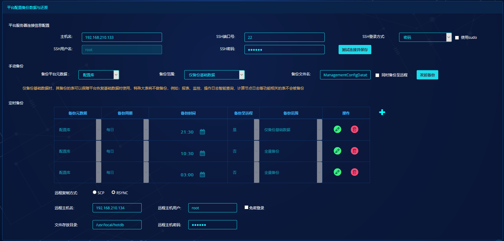

**(1) 平台服务器连接信息配置**


- 备份前需要配置连接信息，配置的服务器主机名必须和平台服务程序所运行服务器主机名一致。

- SSH支持免密和sudo方式，测试连接通过后，配置信息直接保存，下次备份无需再次填写。

**(2) 手动备份**

手动备份，默认选择备份配置库、备份范围仅备份基础数据。备份文件名称格式为ManagementConfigDatabase+年月日时分秒+备份类型。选择备份配置库或配置文件后，执行备份会生成对应备份记录。

- 仅备份基础数据时，提示"仅备份基础数据时，其备份的表可以保障平台恢复基础数据时使用，特殊大表将不做备份，例如：报表、监控、操作日志智能查询、计算节点日志等功能相关的表不会被备份"。


- 选择备份范围为全量备份，提示"全量备份时，可能耗时会比较久，需耐心等待 "：


当选择配置文件备份时，主要备份appalication.properties文件,备份文件名称格式默认为ManagemetConfigFile+年月日时分秒+备份类型。且会强制勾选同时备份至远程，鼠标悬停会给出相应提示。


**(3) 定时备份**

添加定时备份任务，定时备份平台配置库、配置文件。


备份数据可以选择配置库、配置文件。选择备份配置库时，选择备份范围、是否需要备份至远程；选择备份配置文件时，需填写远程备份服务器信息。

#### 备份记录与备份还原

手动或定时任务执行备份时，生成相应的备份记录。备份成功后，支持对备份进行还原操作。


**(1) 备份记录**

备份记录显示包括：数据类型、备份文件名称、备份范围、发起时间、耗时、备份至远程、备份状态。备份成功后，配置库备份文件保存在管理平台对应的data/HotDB_Management_Backup目录下，配置文件保存在conf目录下，如下图：

 

备份中，备份状态显示"备份中"；备份结束，备份状态显示"成功"或"失败"。当备份失败时，鼠标悬停会提示失败具体原因，可根据失败原因进行排查。若本地备份成功，远程备份失败也会给出warning提示，如下图：


**(2) 备份还原**

备份成功后，找到对应的记录点击还原，可以对此次备份进行还原操作。

> !Note
>
> 还原过程中对管理平台进行其他操作，会提示"当前正在进行管理平台配置库还原，暂时无法操作"。
>
> 还原时，若管理平台配置库发生变更，会提示"当前被还原的目标配置库同备份时的配置库不一致，是否确认继续还原"。
>
> 
>
> 还原时，如果该备份文件被删除，还原失败，提示"还原文件不存在"。

**(3) 备份删除**

点击删除操作，可以删除备份记录，删除后平台服务程序目录下对应生成的备份文件也会同时被删除。

#### 其他说明

**(1) 事件提醒**

点击顶部导航栏事件通知，点击[设置](#设置)按钮，可开启或关闭"平台配置库状态检测、平台配置数据备份情况检测"的事件提醒。


- 当配置库为单库模式时，会隐藏"平台配置库状态检测"：

- 开启事件提醒后，当配置库状态异常、主备配置库复制关系异常、以及最新一次备份记录显示配置备份异常，事件通知均给出提醒项。


- 异常恢复后，事件提醒自动消失。

- 关闭事件提醒后发生异常，均不作任何提示。

**(2) 邮件提醒**

普通用户添加了通知策略，并且勾选了配置库复制状态、复制延迟监控项，发生配置库状态异常、复制状态异常时，可以收到邮件提醒。


- 配置库复制状态异常邮件提醒内容如下：


- 配置库复制关系异常邮件提醒内容如下：


**(3) 集群部署相关**

管理平台配置库为单库模式时，集群部署参数配置页面显示"是否要为已有的平台配置库添加备库"开关；若当前配置库已经是双主备库或主备模式，则部署页面不显示此开关。


- 部署版本与已有平台配置库保持一致，不允许修改

- 正在部署的平台配置库不能与已有平台配置库、本次部署的计算节点配置库或存储节点实例冲突

- 若进行了管理平台配置库的部署，部署过程中也会校验平台配置库的复制关系以及是否搭建成功

**(4) 单机部署相关**

单机部署，选择部署计算节点或存储节点服务器时，在配置库MySQL实例选项中会显示"为已有的平台配置库添加备库"勾选框。仅在平台配置库为单库模式时才显示该勾选项且默认勾选。


单机部署成功后，可在配置库高可用搭建中进行平台配置库高可用搭建。

- 默认不显示复制类型和平台配置库实例信息，当勾选搭建平台配置库高可用复制关系时，显示选择复制类型：双主或主从；配置库实例信息。


- 搭建复制前，新的备库需要导入原主配置库的数据

- 搭建成功后，可在[平台配置数据管理](#平台配置数据管理)页面查看配置库的可用状态及复制状态，同时对应的配置文件application.properties也会同步更新。

## 升级中心

升级中心为HotDB Management对计算节点版本提供在线升级的功能。满足对单节点、主备节点、多节点和容灾模式集群的跨版本或小版本升级迭代。同时可为用户提供升级过程突发异常情况时的自动回滚保护机制，程序尽量保证将集群回滚至升级前的状态减少对线上业务的影响。

**功能入口：**登录管理用户界面->页面右上角[升级中心](#升级中心)

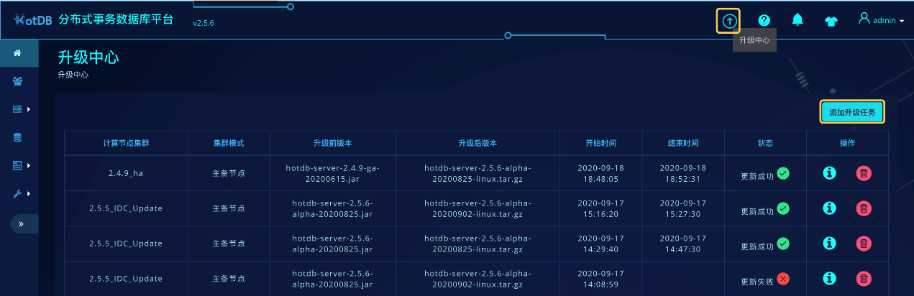

点击【添加升级任务】按钮可进入升级中心发起一次升级任务，具体如下：


- 选择需要升级的计算节点集群

选择完集群程序会自动对集群进行检测，查看是否符合升级条件：

- 集群当前没有正在执行的升级任务

- 集群的计算节点配置了可用的SSH信息

- 主备模式的集群还需校验是否配置了可用的配置文件存放地址

- 符合以上升级条件的集群会自动展示"容灾模式""集群模式"、"计算节点"、"当前版本""更新版本""状态"和"日志"等基础信息，不同的集群模式会在基础信息之外稍有不同

- 当前为单节点集群模式时：不会再展示其他信息

- 当前为主备集群模式时：会显示"升级后是否会切"信息，选择"是"，则升级完毕后回切到原来的主计算节点;若选择"否"，则保持计算节点主备互换后的状态（升级过程中会执行主备高可用切换）


- 当前为多节点集群模式时：页面会显示"等待超时设置"（多节点集群关闭计算节点服务时需要检测计算节点上的QPS，若小于100可直接关闭，大于等于100需要等待QPS下降到小于100后才执行关闭）。若设置自定义超时等待时间或强制关闭则程序可在超过自定义时间后强制关闭或不等待直接关闭计算节点服务


- 当选择的集群为容灾模式集群时，容灾模式为开启状态,否则为未开启状态

- 更新版本需要用户手动上传或选择已有的升级包。手动上传的升级包默认存放在HotDB Management服务器的安装目录/bin/upgrades下，若无该目录程序将自动创建。（升级的版本包必须不低于当前计算节点的版本且不高于当前HotDB Management的版本）

- 若上传的计算节点版本小于当前已有的计算节点版本，则会提示"更新的计算节点版本必须大于等于当前计算节点版本"


- 若上传的计算节点版本高于当前的管理平台的版本，则会提示"更新的计算节点版本不能高于当前管理平台版本"


- 【开始更新】前，"状态"都为等待更新；【开始更新】后，"状态"为正在更新；更新任务完成后"状态"为更新成功或更新失败

- 当点击【开始更新】按钮后，如果当前计算节点正在执行："高可用切换（仅限主备模式）、动态加载、数据备份、数据恢复、一键迁库、onlineDDL、分片方案在线变更、未完成的事务"等任务时，停服务前检测将不予通过，升级任务直接失败

- 满足合法的升级逻辑后，点击【开始更新】将执行升级任务，升级过程中日志框实时输出升级日志，若要查看更详细的日志信息可以下载详细更新日志


- 升级失败的集群会执行回滚流程，程序尽量保证恢复到集群最初始升级前的状态。若回滚失败则需要人工干预恢复集群。人工介入时可通过详细更新日志查看程序执行的命令与升级或回滚的阶段，帮助恢复集群


> !Note
>
> 支持对已安装NDB服务的计算节点进行版本升级，升级过程中管理平台自动将原计算节点NDB安装目录拷贝到新计算节点版本目录下。升级完成后NDB服务与之前保持一致，注意此过程不会对NDB版本进行升级。
>
> 升级过程中通过计算节点文件名检查当前将要升级的计算节点版本，是否大于等于V2.5.6且当前正在使用的版本是否小于V2.5.6，若是，版本升级时会有JDK版本和授权文件的升级入口
>
> JDK版本升级：默认手动上传，当选择"指定已有安装包存放目录"时，默认目录为/usr/local/hotdb/，用户也可以根据需要指定存放目录。当计算节点升级失败回退时，JDK版本可兼容低版本计算节点，故不会对升级后的JDK做清理
>
> 1. 当上传的计算节点更新包版本大于等于2.5.6且当前的计算节点版本小于2.5.6时，上传成功且点击“开始更新”时，跳出3秒即逝提醒“暂不允许更新，请注意JDK版本升级内容”，同时给出“JAVA8版本升级”选项
>
> 
>
>
>
> 2. JAVA8版本升级选择“手动上传”，当上传的文件不匹配“OpenJDK8U-jdk_x64_linux_hotspot_8u252b09.tar.gz” 时则提示“上传的文件不符合规范，请重新上传”
>
> 
>
> 3. 若上传的JDK文件不符合名称规范、依旧强制性点击“开始更新”按钮时，跳出3秒即逝提醒“暂不允许更新，请注意JDK版本升级内容”
>
> 
>
> 4. 若“JAVA8版本升级”选择“指定已有安装包存放目录”，当在对应的目录下没有找到JDK升级匹配文件时，点击“开始更新”按钮会跳出5秒即逝提醒“JDK版本升级对应的目录下没有找到匹配文件，请重新填写”
>
> 
>
> 5. 若上传的计算节点更新tar包文件名中带有“jdk11”关键词，且文件有效，此时给出“JAVA11版本升级”入口
> 6. JAVA11版本升级选择“手动上传”，当上传的文件不匹配“OpenJDK11U-jdk_x64_linux_hotspot_11.0.11_9.tar.gz” 时则提示“上传的文件不符合规范，请重新上传”
>
> 
>
> 7. 与JAVA8版本升级相同，JAVA11版本升级也可选择指定已有安装包存放目录，当在对应的目录下没有找到JDK升级匹配文件时，点击“开始更新”按钮会跳出5秒即逝提醒“JDK版本升级对应的目录下没有找到匹配文件，请重新填写”
>
> 
>
> - 授权文件升级：V2.5.6版本开始使用自研的授权，授权文件默认在计算节点的keys目录下。升级时需保证该授权可用且授权节点数不小于当前已有的节点数、授权逻辑库数不小于当前已有逻辑库数
>
> - 当用户上传授权文件后，若为无效授权（即该新授权不可用或者授权节点数小于当前已有的节点数、授权逻辑库数不小于当前已有逻辑库数），则页面给出提醒"计算节点上传的授权无效，请重新上传可用的新授权许可证文件"
>
> 
>
> 当上传的计算节点更新包、JDK版本和License都有效且可用时，升级界面如下：
>
> 

## OEM管理

为方便更换管理平台的产品Logo以及产品名称信息。引入"OEM管理功能"对外提供可视化更新Logo以及产品名称信息的入口。

**功能入口：**具有管理权限的用户登录平台，通过 OEM管理的超链接进入功能页面，超链接路径需要在原访问页面url的基础上添加?page=oem，示例：<http://192.168.240.147:3324/page/index.html?page=oem>


### 变更系统名称

点击系统名称编辑按钮，编辑系统名称确定保存。系统名称保存成功后，管理平台登录页面与菜单页面左上角显示的名称同步修改。


### 变更产品Logo

页面预览区域自动显示管理平台默认的Logo图片信息，如下图：


点击【上传】按钮自动弹出文件选择窗口，选择需要替换的Logo图片


> !Note
>
> 要求图片大小不超过1024KB，后缀名需为".png/.jpg/.svg"。满足图片检测要求时，预览区域自动显示上传图片的效果图，如下图所示：
>
> 
>
> 
>
> 导航栏Logo与浏览器页签Logo，有【与登录界面一致】的勾选框，默认不勾选。选择勾选后上传按钮会置灰不可操作，同时对应的Logo预览自动显示与【登录页面Logo】一致。
>
> 

### 保留原产品信息

默认开启是，管理平台登录页面及集群选择页面底部显示HotDB的Logo与版权申明信息；选择否时，管理平台登录与集群选择页面底部隐藏HotDB的Logo与版权申明信息。如下图：


点击【恢复默认】，设置成功后，会将管理平台安装logo目录下的图片文件清除。同时页面系统名称自动重置为"分布式事务数据库平台"，Logo预览图恢复管理平台的默认Logo，且保留原产品信息开关自动变更为是。


## 普通用户登录

### 登录

普通用户由管理用户在管理端界面的"[用户管理](#用户管理)"中创建，访问方式与管理用户登录方式一致。


对于首次登录的普通用户，HotDB Management强制要求修改密码，初始密码默认为`hotdb@hotpu.cn`。

### 集群选择

普通用户登录HotDB Management成功后进入到集群选择页面。若开启容灾模式，集群选择页面展示以及逻辑说明请参照[跨机房容灾部署](cross-idc-disaster-recovery-deployment.md)文档中的"计算节点集群选择"章节。

展示的计算节点集群为登录用户所拥有访问或控制权限的计算节点集群。点击具体集群可进入该集群进行查看与管理操作。当集群计算节点与配置库运行状态正常时，页面图标均为绿色（如下图），可以正常进入集群


当集群备计算节点不可连接但配置库连接正常时，该集群备计算节点标红且为异常


当配置库无法连接，计算节点运行正常时，底部配置库连接会显示异常。当部分配置库无法连接时，鼠标移入"部分异常"字样会显示具体配置库连接异常信息


当集群中所有计算节点与配置库都不可连接时，集群面板显示为全红。鼠标点击集群面板会显示"无法连接"，即无法进入集群


## 首页

HotDB Management通过数据可视方式在首页功能中实时展示计算节点集群的数据量、访问流量、集群组件状态、报警事件、安全防控等用户关心的信息。


### 集群安全


- *8邮件通知：**根据通知设置中监控开关是否打开判断，分为：全部开启、未开启、部分开启，点击跳转到通知设置页面
- **系统定时检测：**根据定时检测设置页面所有开关是否打开判断，分为：全部开启、部分开启、未开启，点击跳转到定时检测设置页面
- **白名单：**根据白名单功能实际开关状态判断，分为：开启、未开启，点击跳转到白名单页面
- **SQL防火墙：**根据SQL防火墙SQL拦截状态是否启用判断，分为：全部开启、部分开启、未开启，点击跳转到SQL防火墙页面

### 重要信息摘要


- **表：**第一行表信息为"[表信息](#表信息)"页面中所有表的数量，第二行"定义异常"为在"[表结构与表索引检测](#表结构与表索引检测)"中检测状态非正常的表数量
- **优化：**第一行"SQL日志"为HotDB Management"[操作日志智能分析](#操作日志智能分析)"功能中已记录的SQL数量。第二行"慢SQL"为HotDB Management[操作日志智能分析](#操作日志智能分析)功能中标记的SQL。（当操作日志智能分析未开启SQL统计时，"SQL日志"与"慢SQL"显示未开启）
- **备份：**第一行"备份总数"为HotDB Management"[备份任务](#数据备份)"功能中所有备份记录数，第二行"失败备份"为备份状态为"备份失败"的任务记录数
- **日志：**第一行"集群日志"为HotDB Management"[计算节点日志](#计算节点日志)"功能中的总日志数量。第二行"未读"为计算节点日志中状态为"未读"的日志数量。当日志数量大于999时，页面显示999+

### 数据节点吞吐量


显示集群中所有数据节点的实时吞吐量，吞吐类型包括：SELECT/INSERT/UPDATE/DELETE/OTHER。点击标题可跳转至"[数据节点吞吐量](#数据节点吞吐量)"报表功能页面。

### 事件通知


事件来源于HotDB Management右上角事件提醒标志的历史事件。点击【更多】可链接至"[历史事件](#历史事件)"查看更多更详细的通知内容。

### 集群吞吐量


显示集群中计算节点每秒事务数（TPS：Transactions Per Second）和每秒查询率（QPS：Query Per Second）。

- 多节点模式的集群显示的[集群吞吐量](#集群吞吐量)为所有计算节点之和
- 事务外TPS不统计SELECT操作，事务内SELECT/UPDATE/DELETE/INSERT都会统计
- QPS不统计"begin、commit"等事务语句
- 点击标题可链接至"计算节点流量"功能页面
- 页面数据刷新频率为3秒

### 数据量与吞吐量概览

#### 今日客户端吞吐量


客户端吞吐量为前端应用发往计算节点的操作（SELECT、INSERT、UPDATE、DELETE、OTHER）量统计。

- 显示集群中所有计算节点今日客户端吞吐量数据，按照自然日计算统计
- 页面刷新频率为1分钟
- 今日客户端吞吐量每日凌晨清零，若当日未做任何操作则显示为0
- 点击曲线图可链接至"[计算节点吞吐量](#计算节点吞吐量)"报表详情页面

#### 今日后端吞吐量


后端吞吐量为计算节点发往底层数据节点的操作（SELECT、INSERT、UPDATE、DELETE、OTHER）量统计。

- 显示集群中所有计算节点今日后端吞吐量数据，按照自然日计算统计
- 页面刷新频率为1分钟
- 今日客户端吞吐量每日凌晨清零，若当日未做任何操作则显示为0
- 点击曲线图可链接至[数据节点吞吐量](#数据节点吞吐量)报表详情页面

#### 今日新增数据量


今日新增数据量为集群从今日零点起至当前时间业务数据量变化展示。若为负数则代表数据量较零点时减少了。

- 页面数据1小时更新一次
- 每天凌晨自动清零
- 计算公式：集群所有表在正常存储节点中的数据量之和减去今天凌晨之前记录的数据量
- 点击曲线图可链接至"[集群数据量](#集群数据量)"报表详情页面

#### 总数据量


显示集群中所有数据节点的当前总数据量数据，即所有表在正常存储节点中的数据量之和。

- 页面数据1小时更新一次
- 只获取当前数据节点下主存储节点的数据容量
- 点击曲线图可链接至[集群数据量](#集群数据量)报表详情页面

### 数据分片评分


通过打分的方式体现集群中水平分片表的拆分优劣情况，当计算节点启动不足24小时得分无法计算，页面不予显示。点击标题处会跳转到"[数据分片评分](#数据分片评分)"详情界面。评分趋势图显示近期分片合理性评分变化情况，可以选择按天查看和按小时查看。

### 今日TOP 10表

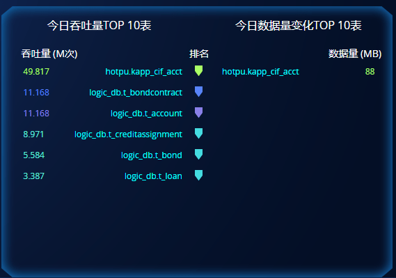

显示集群中当日数据量变化最大与吞吐量最高的前十业务表。

- 数据量变化TOP 10 按表数据新增或下降的绝对值进行前10排序
- 全局表取的数据量为各数据节点下主存储节点数据量的平均值
- 水平分片表取的数据量为所有数据节点下主存储节点数据量总和
- 点击"今日吞吐量TOP10表"区域可链接至[计算节点吞吐量](#计算节点吞吐量)报表详情页面；点击"今日数据量量TOP10表"区域可链接至[集群数据量](#集群数据量)报表详情页面

### 吞吐速率


显示前端（前端应用发往计算节点）与后端（计算节点发往数据节点）实时的SELECT、INSERT、UPDATE、DELETE的操作频率，单位（次/s）。

- 页面数据刷新频率为3秒
- 计算方式：用固定时间内操作增量除以间隔时间得出每秒操作频率
- 多节点模式集群操作增量为集群所有计算节点统计之和
- 点击"前端吞吐速率"区域可链接至[计算节点吞吐量](#计算节点吞吐量)报表详情页面；点击"后端吞吐速率"区域可链接至[数据节点吞吐量](#数据节点吞吐量)报表详情页面

### 集群概览

**主备节点模式集群概览：**


**多节点模式集群概览：**


- 集群启动时间：显示当前主计算节点的实际启动时间
- 集群运行时长：显示当前主计算节点从启动至今运行时间
- 计算节点切换次数：主备模式集群计算节点集群的高可用切换次数或多节点模式集群计算节点换主次数。按自然年进行统计
- 集群可用性：利用"故障恢复时间"除以一个自然年得出
- 故障恢复时间：集群发生高可用切换或换主时的消耗时间，即从发生故障到恢复可用的这段时间。按自然年进行累加统计
- 前端应用：显示前端应用总数、连接数最高的前端应用、QPS最高的前端应用，数据从"[智能逻辑拓扑](#智能逻辑拓扑)"中获取
- 逻辑库：显示逻辑库总数、逻辑库正常或预警状态的个数，数据量和操作量最大的逻辑库信息。数据从[智能逻辑拓扑](#智能逻辑拓扑)获取
- 数据节点：显示数据节点总数、数据节点正常或预警状态的个数、数据量和操作量最大的数据节点信息。数据从[智能逻辑拓扑](#智能逻辑拓扑)获取
- 存储节点：显示存储节点总数、存储节点正常或预警或故障状态的个数、存在复制时延的存储节点信息。数据从[智能逻辑拓扑](#智能逻辑拓扑)获取

## 配置

配置是管理平台为HotDB Server可视化配置所开发的功能，包括为HotDB Server配置数据节点、存储节点、存储节点组、逻辑库、分片规则、表信息、数据库用户、计算节点等参数。同时配套设置了配置参数的校验与备份恢复的辅助功能。

### 节点管理

节点管理菜单主要为用户提供存储节点组、数据节点、存储节点的管理，包括基本的添加、删除、修改；也可以为配置好的数据节点搭建底层存储节点的复制关系或适配高可用切换规则。

若集群开启容灾模式，节点管理功能展示与操作说明请结合[跨机房容灾部署](cross-idc-disaster-recovery-deployment.md)文档中的[节点管理](cross-idc-disaster-recovery-deployment.md#节点管理)章节。

**功能入口：**

在管理平台页面中点击[配置](#配置)->[节点管理](#节点管理)


**表格信息说明：**

- **DNID：**数据节点ID
- **数据节点名称：**点击数据节点名称中的按钮可链接至[数据节点管理](#数据节点管理)页面
- **存储节点_主机名：**存储节点所在服务器地址
- **存储节点_端口号：**存储节点MySQL实例端口号
- **存储节点_物理库：**存储节点MySQL实例下的物理库即database
- **存储节点_类型：**存储节点在数据节点下的角色；有主库、从库、双主备库、MGR
- **存储节点_状态：**存储节点是否可用；状态包含可用、不可用两种。不可用状态用红色字体显示，存储节点为主库且可用则用绿色字体显示，存储节点为从库或双主备库且可用则用蓝色字体显示，存储节点绑定的监听程序无法连接时，用橙色字体显示可用
- **操作：**从左到右依次为"详情"，"启用/停用"，"删除"
- **主备状态：**数据节点下存储节点间的复制状态，只有存储节点复制关系为双主或主从的数据节点会显示主备状态；有：搭建失败、搭建中、异常、未知、正常五种。状态的详细说明请参照"[主从搭建](#主从搭建)"章节
- **主备切换：**手动执行存储节点高可用切换操作的入口，与主备状态一样只会出现在存储节点复制关系为双主或主从的数据节点中。主备切换依赖于数据节点配置的切换规则，具体切换规则配置请参照"[切换规则](#切换规则)"章节

#### 添加存储节点组

添加存储节点组可以更方便地添加或修改一组具有相同参数值的存储节点。

**功能入口：**

在管理平台页面中点击[配置](#配置)->[节点管理](#节点管理)->"存储节点组"->"添加组"进入添加存储节点组功能页面。

**功能说明：**

勾选存储节点需要使用且参数值相同的参数项，再设置勾选参数项的参数值。点击"保存并返回"按钮完成存储节点组的添加。

**参数说明：**

- 组名：输入存储节点组命名
- 连接用户：有权限访问该物理库的用户名
- 连接用户密码：有权限访问该物理库的用户密码
- 物理库名称：存储节点中可引用的数据库名称，例如"db01"
- 备份用户：（选填）用于备份该物理库的用户名
- 备份用户密码：（选填）用于备份该物理库的用户密码
- 字符集：被连接的物理库字符集，默认utf8mb4
- 最大连接数：MySQL物理库最大连接数，默认4200
- 初始连接数：MySQL物理库初始连接数，默认32
- 最大空闲连接数：MySQL物理库最大空闲连接数，默认512
- 最小空闲连接数：MySQL物理库最小空闲连接数，默认32
- 空闲检查周期（秒）：MySQL物理库空闲检查周期，默认600


#### 添加节点

添加节点功能可为HotDB Server快速配置数据节点、存储节点、监听程序等，也可以单独配置存储节点。

**功能入口：**

在管理平台页面中点击[配置](#配置)->[节点管理](#节点管理)->[添加节点](#添加节点)进入添加节点功能页面。

**示例说明：**

以下将以添加4个数据节点（dn_01,dn_02,dn_03,dn_04）,8个存储节点（双主：ds_01,ds_02、单库：ds_03、主从：ds_04,,ds_05、MGR:ds_06,ds_07,ds_08）为例演示添加节点功能。


**生成示例数据：**

**第一步：**将数据节点个数参数值设置为4，其他生成参数利用页面默认值即可

**第二步：**点击"生成"按钮，将数据生成至表格中

**第三步：**点击"操作"栏中按钮，删除dn_02数据节点中多生成的记录

**第四步：**将dn_03数据节点下中的"存储节点类型"修改成"从库"

**第五步：**点击dn_04数据节点记录"操作"栏中按钮，在dn_04下添加一条记录

**第六步：**将dn_04三条记录下的"存储节点类型"都改成MGR


**配置存储节点数据：**

**第一步：**使用之前添加好的存储节点组并关联到每一条存储节点记录中

**第二步：**在存储节点名处去除勾选"自动生成"，并依次自定义存储节点名，注意不能有重复。一般建议使用"自动生成"

**第三步：**填写存储节点的主机名、端口、连接用户、连接密码、物理库名、备份用户、备份用户密码（连接用户与密码是计算节点连接存储节点的必填账户，备份用户与密码是存储节点数据进行备份时所用的专有账户为选填项，但推荐填写）

**第四步：**打开"自动主从搭建"，待添加完存储节点，后台程序自动为需要搭建主从或双主复制关系的数据节点进行搭建操作。若不打开，后期也可以通过"[主从搭建](#主从搭建)"功能进行操作

**第五步：**"主存储节点"都用默认值"默认"，当数据节点下为双主带从或双主多从关系时可在此处为从存储节点指定所属的主存储节点。默认则由程序自动判断主从关系

**第六步：**"操作"栏"..."更多按钮中展开的参数默认不做修改，直接使用存储节点组中的参数值或系统自带默认值即可。若有特殊要求，可点击编辑内部参数。（更多参数里若勾选"同步到其他不使用组的存储节点"，可将修改的该存储节点的更多参数使用到其他未使用存储节点组的记录中）

**第七步：**点击"测试连接"按钮，校验配置的存储节点是否可连接。若使用配置的信息连接失败则会标识对应存储节点的"主机名"、"端口"、"连接用户"、"连接用户密码"、"物理库名"输入框。若检测到存储节点可连接但物理库不存在，则提示是否为用户创建该物理库，但要求配置的连接用户拥有create权限

> !Note
>
> **备份用户测试：**备份用户的可用性测试需要依赖于存储节点所在服务器上的备份程序（HotDB Backup） ，若该存储节点所在服务器上未安装或未启动备份程序，将导致无法检测备份用户的可用性从而无法通过"测试连接"。

**第八步：**点击"保存并返回"按钮，保存配置的节点数据


#### 主从搭建

主从搭建功能可以为已配置但尚未搭建复制关系的存储节点搭建复制关系。

**功能入口：**

在管理平台页面中点击[配置](#配置)->[节点管理](#节点管理)->"高可用配置"->[主从搭建](#主从搭建)进入主从搭建功能页面。


进入主从搭建页面将自动展示需要搭建的数据节点，为空则代表没有需要搭建的数据节点。

**搭建须知：**

- 选择搭建的存储节点必须运行正常且页面"状态"字段显示可用
- 选择搭建的存储节点不能配置或存在多个目标复制关系
- 选择搭建的存储节点my.cnf配置参数正确（基于binlog文件位置和基于GTID复制的应分别打开对应参数）
- 若选择搭建的存储节点的连接用户没有create user与super权限，则程序将尝试通过账号"repl"密码"repl"进行搭建。若存储节点中repl账号不存在或密码错误则需要用户手动指定复制账号（CHANGE MASTER命令中配置的master_user和master_password）
- 复制账号必须拥有"replication slave、replication client "两个基本权限
- 选择搭建的存储节点需保证主从数据一致（mysql、information_schema、performance_schema、sys库除外）
- 选择搭建的存储节点若使用GTID方式搭建复制则要求GTID不存在断点
- 选择搭建的存储节点当前无业务流量


**主从搭建流程：**

**第一步：**选择需要搭建复制关系的数据节点并点击"开始搭建"

**第二步：**检测搭建的存储节点是否存在多个目标复制关系（存在则搭建失败）

**第三步：**检测存储节点参数是否配置正确并判断复制方式为binlog文件位置还是GTID（参数校验失败则搭建失败）

**第四步：**创建复制账户或尝试使用"repl"作为复制账户（若无法创建或尝试"repl"账户失败则弹出窗口要求手动指定可用的复制账户，若手动指定的账户仍无效则搭建失败）

**第五步：**检测主从存储节点数据一致性，若为GTID复制方式搭建则还需判断是否存在GTID断点（若存在GTID断点则搭建失败）

**第六步：**检测存储节点上是否有业务流量（存在业务流量则搭建失败）

**第七步：**搭建复制关系

**第八步：**检测是否存在延迟（存在延迟将提示具体延迟信息，但不影响搭建结果）

**其他说明：**

1. 若是双主带从的数据节点进行主从搭建 则默认从库的master为主库，如果需要设置为双主备库，则需要在"存储节点管理"中编辑 "主存储节点名"字段为双主备库，然后再搭建，具体如下图：

   

2. 搭建过程中，用户进入其他菜单页面或退出登录，主从搭建任务依旧会在后台运行。可在[节点管理](#节点管理)功能页面的"主备状态"中查看搭建情况。主备状态详细说明如下：

  - **空：**当前数据节点仅一个存储节点或为MGR类型时，则不显示任何状态
  - **正常：**可以show slave status查看主从复制状态正常（ Slave_IO_Running: YES，Slave_SQL_Running: YES）且与当前节点下存储节点配置的主从关系一致
  - **异常：**主从复制状态异常（ Slave_IO_Running: NO，Slave_SQL_Running: NO）
  - **未知：**存储节点无法连接、存储节点权限不足、检测超时（超时时间1min）、当前节点非主从复制关系（没有搭建主从，或者主从关系搭建错误）
  - **搭建失败：**表示主从搭建过程中存在检测失败或搭建失败，鼠标移入"搭建失败"字样将提示具体失败信息
  - **搭建中：**表示当前正在执行主从搭建任务，运行完成后，再刷新页面将显示正常或搭建失败

#### 切换规则

配置切换规则可为用户提供数据节点高可用性。计算节点会定时检测存储节点的可用情况，一旦检测到存储节点发生故障，计算节点会依据配置的切换规则自动切换到备用的存储节点上，以保障服务的稳定性和可靠性。用户也可以进行手动切换。

**功能入口：**

在管理平台页面中点击[配置](#配置)->[节点管理](#节点管理)->"高可用配置"->[切换规则](#切换规则)进入"数据节点切换配置"功能页面。

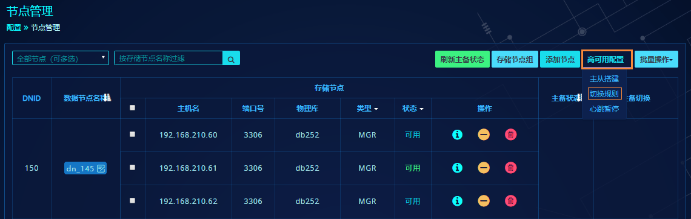

**功能说明：**

一般在[添加节点](#添加节点)时勾选了"自动适配切换规则"后，存储节点切换规则会由程序自动默认配置。未配置切换规则的可通过进入[切换规则](#切换规则)页面点击"添加切换规则"按钮自定义配置规则或点击"自动适配"按钮由程序自动适配切换规则。

**添加切换规则**

1. 点击"添加切换规则"按钮，页面将自动新增一条切换规则记录
2. 选择需要配置切换规则的数据节点
3. 选择源存储节点
4. 选择备用存储节点即源存储节点发生故障时切换的备用节点
5. 设置切换优先级，移动显示的数字越小则代表切换的优先级越高
6. 点击"√"按钮保存切换规则记录，若点击"×"按钮则代表取消保存该条记录


**自动适配操作说明**

1. 勾选"只显示没有切换配置的节点"，若未勾选则可能会将已配置的切换规则重新覆盖
2. 点击">>"全右移按钮或双击左侧显示的数据节点选择需要自动适配的选项
3. 点击"确定并返回"按钮，程序自动为所选的数据节点适配切换规则


**自动适配规则说明**

1. 当数据节点类型是"单库"时，点击"自动适配"不会生成切换规则
2. 当节点类型是"主备"时，点击"自动适配"，会新增主库到备库的切换规则（若是一主多从的情况，自动适配的是主库到任意一个从库的规则，其他从库需要人工操作）
3. 当节点类型是"双主"时，点击"自动适配"，会新增主库切换到双主备库的切换规则和双主备库切换到主库的切换规则（若是双主带从的情况，从库不会被自动适配规则，需要人工操作）
4. 当节点类型是"其他"时，判断为节点不正常（比如有两个主库），此时点击"自动适配"，不会做任何操作
5. MGR节点无需配置高可用切换规则，HotDB server跟随MySQL的主节点自动切换

#### 心跳暂停

心跳是HotDB Server对存储节点可用性进行检查的功能。计算节点会定时向存储节点发送心跳检测：若存储节点及时响应计算节点的检测操作，则计算节点认为对应存储节点状态正常；若存储节点多次没有在规定时间内响应检测操作，则计算节点认为该存储节点状态异常，进而执行数据节点高可用切换。

**心跳暂停：**当某个数据节点进行特殊的维护工作，需要暂停来自计算节点的心跳检测时，可配置在一段时间内暂停对特定节点的心跳检测操作。

**功能入口：**在管理平台页面中点击[配置](#配置)->[节点管理](#节点管理)->"高可用配置"->[心跳暂停](#心跳暂停)进入[心跳暂停](#心跳暂停)功能页面。


**功能操作说明：**

1. 勾选需要暂停的数据节点，并输入暂停秒数
2. 点击"暂停"按钮，弹出框提示："是否暂停所选数据节点的心跳检测？"点击"确定"，程序执行心跳暂停操作且页面中该条记录的"暂停状态"为"暂停成功"；点击"取消"，程序不执行心跳暂停操作，并返回上一层
3. 暂停时段过后，数据节点将自动恢复心跳检测


#### 主备切换

配置多个存储节点且已配置切换规则的数据节点，可进行数据节点主备切换。

**功能入口：**

在管理平台页面中点击[配置](#配置)->[节点管理](#节点管理)->"切换"

**使用须知：**

- 配置了数据节点高可用切换规则，且已经动态加载到计算节点
- 节点下主从、双主的复制关系已经搭建好，且复制延时时间不得超过10秒
- MGR节点不支持手动切换，primary由MySQL选举


**功能说明：**

1. 主从架构的数据节点，手动切换时按照优先级最高的切换规则进行切换，切换后HotDB Server会将主和其他直连主的从存储节点置为不可用，且不能再进行切换。
2. 双主架构的数据节点，切换后不会将主存储节点置为不可用，且可以继续手动来回切换。
3. 当切换时检测到有master_delay的延时设置，会自动取消当前master_delay数值，切换成功后恢复延时复制的设置。若取消master_delay后的复制延迟仍大于10s，则不允许切换，master_delay也会恢复之前设置的值。
   
4. 如果优先级最高的从存储节点不可用或延迟超过10秒，程序将从剩余切换规则中依次选择优先级最高的进行切换，如果均不可用或延迟超过10秒，则切换失败，提示错误（切换失败日志提示 switch datasource datasource id failed due to: no available backup found）。
5. 切换完成后，需要手动将其他存储节点置为可用，动态加载后会重新使用主库。但手动置为可用前建议先进行"主备一致性检测"保证数据一致性。
6. 在切换过程中，程序会等待从存储节点追上复制。
7. 新增"切换中..."的按钮状态，点击该按钮可以中途取消本次切换操作。
   
8. 如果成功发起了手动切换，切换时，HotDB Server会记录切换过程日志。

#### 数据节点管理

每个数据节点都有自己的详情页面，用户可以在此页面中管理该数据节点的基本信息、存储节点以及数据节点切换规则。

**功能入口：**

在管理平台页面中点击[配置](#配置)->[节点管理](#节点管理)->""

**功能说明：**

1. "选择节点"可切换查看不同数据节点的详情。
2. 点击"删除"可删除选择的数据节点，但如果该数据节点关联了存储节点则要求先清空存储节点。
3. 点击"编辑"按钮可为数据节点修改名称。
4. 点击"刷新"按钮可刷新数据节点下主备存储节点的状态。
5. 逻辑库框内显示与该数据节点存在关联的逻辑库名称。
6. 表信息框内显示在该数据节点下创建的表名称。
7. 存储节点信息为该数据节点下配置的存储节点。
8. 数据节点切换包括已在该数据节点下配置的切换规则。以及可为新配置的存储节点新增切换规则。也可以勾选"自动适配节点切换"为未来在该数据节点下新添加的存储节点自动适配切换规则。


#### 启用/停用存储节点

**停用存储节点**

当需要对某个存储节点进行特殊维护时，可通过停用存储节点的方式进行操作。

**功能入口：**

在管理平台页面中点击[配置](#配置)->[节点管理](#节点管理)->""

**功能操作：**

在存储节点管理页面，点击"停用"按钮后确认，则该存储节点被配置为停用，节点管理页面"状态"字段显示对应的存储节点为不可用。若停用的为主存储节点，动态加载后，数据节点会切换至备存储节点上。

> !Note
>
> 请不要随意停用MGR类型的存储节点，否则会导致存储节点切换异常。


**启用存储节点**

由于故障或手动将存储节点标记为不可用之后，若存储节点异常状态被修复，可以在管理平台将该存储节点重新启用。

**功能入口：**

在管理平台页面中点击[配置](#配置)->[节点管理](#节点管理)->""

**功能说明：**

1. 单库、MGR的存储节点可以直接启用。
2. 主备或者双主架构的存储节点，在单个或批量启用存储节点时，要求被启用的存储节点在最后一次被标记为不可用后，至少有一次按照存储节点维度进行主备数据一致性检测且通过的记录，无则弹出提示窗提醒用户。
   
3. 点击[发起检测](#发起检测)会跳转到主备一致性检测页面，默认选择启用的存储节点，手动点击发起检测。若选择"直接启用"则需要人为保证启用的存储节点与该数据节点下的其他存储节点数据一致。
   

### 逻辑库

**功能说明：**

逻辑库是客户端程序连接计算节点服务器后，可以访问的数据库，描述数据库表的集合，类似于直接连接MySQL实例后，看到的一个数据库。

**功能入口：**

在分布式事务数据库平台页面中选择[配置](#配置)->[逻辑库](#逻辑库)。

在逻辑库页面，输入逻辑库名称，点击"搜索"，即可搜索到相应的信息。


#### 添加逻辑库

**功能入口：**"配置->逻辑库->添加逻辑库"


逻辑库名称唯一且不为空

**默认分片节点：**用户可选择是否配置，不配置则在该逻辑库下创建（create table）表时需要先在 HotDB Management的"[表信息](#添加表信息)"页面添加表定义信息。若选择配置则可绕过HotDB Management直接在该逻辑库下执行建表语句（当配置1个默认节点时，执行建表语句默认在该逻辑库下创建垂直分片表，若配置多个时，默认创建分片类型为AUTO_CRC32的水平分片表）。

点击"√"，即可添加逻辑库配置（此时逻辑库为空库）。

当前已有逻辑库数超过授权逻辑库数时，不允许继续添加新逻辑库。


#### 编辑逻辑库

在HotDB Management中选择[配置](#配置)->[逻辑库](#逻辑库)->[编辑逻辑库](#编辑逻辑库)，更改逻辑库名称会提示："修改名称可能导致该逻辑库相关的用户权限变更"，所以应该谨慎修改逻辑库名称。

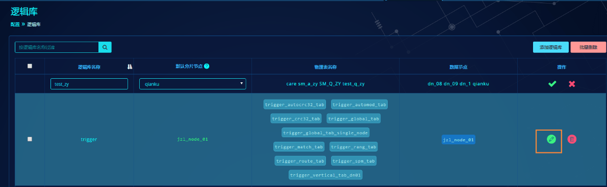

点击"√"，逻辑库即编辑完成，但要生效到计算节点必须点击[动态加载](#动态加载)按钮才算编辑成功。

#### 删除逻辑库


删除逻辑库会将逻辑库下所有未创建表结构的表信息一起删除，但如果有任何一张表结构为"已创建"的表，则会弹窗提示无法删除逻辑库。

### 表信息

**功能说明：**

管理平台为HotDB Server集群提供业务表的可视化配置功能。一般在连接计算节点3323服务端口进行业务表的创建前需要在管理平台[表信息](#表信息)功能中先定义对应的表，再动态加载成功后，才能正常创建表结构并使用。

**功能入口：**

在分布式事务数据库平台页面中选择[配置](#配置)->[表信息](#表信息)

**表类型：**

全局表、子表、水平分片表、垂直分片表


#### 添加表信息

目前支持添加：水平分片表、垂直分片表、全局表、子表。以下将以自动分片和高级分片两种分片方式演示添加水平分片表。

##### 自动分片方式添加水平分片表：

自动分片可引用AUTO_CRC32，AUTO_MOD分片类型进行水平分片表添加，页面默认使用AUTO_CRC32分片类型，两者用法区别可参考页面给予的"方式说明"。更详细介绍可参照"[分片规则](#分片规则)"章节。


**第一步：**选择创建的水平分片表所属的逻辑库


**第二步：**填写水平分片表使用的分片字段

**第三步：**"开启全局唯一约束"勾选框初始状态根据"[计算节点参数配置](#计算节点参数配置)"中"是否默认为添加的表开启全局唯一约束"参数是否打开而决定是否勾选。关于全局唯一约束具体说明请参照[计算节点标准操作](hotdb-server-standard-operations.md)文档的章节说明

**第四步：**选择分片方式，默认为自动分片方式

**第五步：**选择分片类型为"AUTO_CRC32"

**第六步：**选择添加的水平分片表拆分路由的数据节点（"该逻辑库下所有数据节点"默认勾选，且匹配该逻辑库"默认分片节点"栏数据，当默认分片节点栏未配置时，匹配"数据节点"栏数据，当数据节点栏也为空时，则该逻辑库被选中时提示"当前逻辑库下没有关联数据节点"）

**第七步：**填写表名称，支持批量添加表名称，可选择换行、英文逗号、英文空格任一方式对表进行分隔。若批量添加的表使用的分片字段一致则只添加表名即可，若不一致可在输入框内使用"表名:分片字段"的方式指定，例如：test:id,test1:name

**第八步：**点击"生成预览"按钮查看预添加的表信息。未预览的表不允许直接"保存"

**第九步：**点击"保存"按钮将表信息新增到配置库中。若需要立即生效到计算节点中还需要执行[动态加载](#动态加载)

##### 高级分片方式添加水平分片表：

**操作步骤简述：**

选择逻辑库、填写默认分片字段、分片方式选择"高级分片"、选择分片规则（如果没有分片规则则参考[新增分片规则](#分片规则)）、填写表名称、点击"生成预览"、点击"保存"、[动态加载](#动态加载)。


可以一次性同时新增多张相同规则的表。

#### 新增子表

**子表：**子表为关联表，是一组特殊的分片表集合，包括一张父表与至少一张子表，子表数据所属的数据节点由父表数据所属的数据节点决定。

**子表的用途：**在计算节点不支持跨库JOIN操作的早期，计算节点设计了父子表的模式以支持相关使用场景。子表记录的存储位置依据于父表记录的存储位置，在JOIN条件为关联字段的情况下能有效解决跨数据节点JOIN操作的效率和性能问题。

**子表的建议：**目前由于计算节点已支持跨库JOIN操作，父子表的模式后期将不再进行更新，所以不推荐使用子表。

**添加子表方式：**管理平台中可以直接新增子表，也可以在表信息页面父表记录下新增子表

**直接新增子表：**

1. 在分布式事务数据库平台页面中选择[配置](#配置)->[表信息](#表信息)->"添加表"。在添加表信息页面，选择子表。
2. 在子表下，选择逻辑库、父表，输入父表关联字段，和所需要添加的子表数量，点击"+"号，即可生成带有逻辑库、父表、父表关联字段的输入栏。
   
3. 然后输入子表的名称、子表关联字段，点击"保存"，即添加了子表的配置信息。

**表信息页面父表记录下添加子表：**

1. 在表信息页面，选择表类型是"水平分片表"且表结构为"未创建"的记录。
2. 点击"+"号，然后输入子表名称、子表关联字段、父表关联字段。
3. 点击"√"，即添加了子表的配置信息。

> !Note
>
> 假如该父表下需要添加多张子表，则填写的父表关联字段必须一致。表结构已创建的父表不允许添加子表。


#### 编辑表信息

**功能入口：**

在分布式事务数据库平台页面中选择[配置](#配置)->[表信息](#表信息)点击"编辑"按钮或点击表名称进入[编辑表信息](#编辑表信息)页面

表分为已创建和未创建两种状态，当表结构类型是未创建时可以编辑表名称、逻辑库、分片字段、分片方式、数据节点等信息


点击"保存"，则编辑表信息配置成功。当表结构类型是已创建时，则不允许再修改表定义，但支持通过"修改表结构"或"修改表配置"来变更表。


点击"修改表结构"将跳转至"[在线DDL](#在线ddl)"功能页面，点击"修改表配置"将跳转至"[分片方案在线变更](#分片方案在线变更)"功能页面。

#### 表记录导出


点击表信息页面"导出"按钮，即可对勾选的记录进行导出。若未勾选则默认导出所有表信息记录。

若勾选"已创建的表导出表结构"，则导出的内容中自动加入"表结构详情"一列，展示已创建表的"建表语句"。

导出记录中的"表结构详情"从计算节点管理端口（3325）中的`show @@ddl`命令中获取，水平分片表与全局表取所属数据节点中DNID最小的结果。若当前主3325端口无法连接则"表结构"、"表结构详情"两列内容为空。

#### 删除表

**功能入口：**

在分布式事务数据库平台页面中选择[配置](#配置)->[表信息](#表信息)->"删除"

**功能说明：**

点击"删除"按钮，弹出框提示："确认要删除吗？"，点击"确定"，则未创建的表的表信息配置删除成功。


> !Note
>
> 表结构未创建的表可以直接删除表信息配置。
>
> 删除已创建的表会弹出提示："xxx表在server端还存在，删除表失败。请在server端drop后再删除"。

#### 历史兼容说明

在V2.4.6之后的版本HotDB Server弃用了HASH（包括HASH23）与AUTO分片规则。后续新增表时不再支持使用已废弃的分片规则，但历史已使用HASH（包括HASH23）与AUTO的表仍可继续使用。但需要注意："SQL中若使用字符串类型的分片字段操作，需注意大小写敏感问题（即保证SQL中分片字段大小写与数据存入时一致）"。同时管理平台若检测到系统中存在引用HASH（包括HASH23）与AUTO的表，表信息、表添加、表编辑页面会有相应提示信息。具体如下图所示：


**数据迁移说明：**

若系统存在引用历史分片规则HASH（包括HASH23）与AUTO的表，建议将表数据迁移到新的分片规则表中。表数据迁移可通过[分片方案在线变更](#分片方案在线变更)功能进行操作。

### 分片规则

分片规则功能为表的水平拆分配置某种路由方式及算法。目前计算节点支持分片规则类型有：五种高级分片类型（ROUTE、RANGE、MATCH、SIMPLE_MOD、CRC32_MOD）、两种自动分片类型（AUTO_MOD、AUTO_CRC32）。其中AUTO_MOD，AUTO_CRC32类型可参考[新增水平分片表](#添加表信息)章节。

**功能入口：**

在分布式事务数据库平台页面中选择[配置](#配置)->[分片规则](#分片规则)

**以下为七种分片类型的详细介绍：**


**分片规则的历史变迁说明：**

HASH（2.4.6版本之后开始弃用）、CRC32_MOD（2.4.7版本新增）、AUTO（2.4.6版本之后使用AUTO_MOD代替）、 AUTO_CRC32（2.4.7版本新增）。

#### MATCH

以下将以自动设置与手动设置两种方式为例，演示添加以MATCH为分片类型的分片规则。

##### 自动设置方式添加MATCH类型的分片规则

**功能演示：**

**第一步：**默认勾选"自动生成分片规则名"（自动生成规则：已有分片规则最大ID+1_分片类型名称），如有自定义名称需求则取消勾选

**第二步：**选择"分片类型"为[MATCH](#match)

**第三步：**设置方式选用默认的"自动设置"

**第四步：**选择分片规则需要用的数据节点

**第五步：**选择默认勾选"NULL值，自动分配路由节点"和"空白串，自动分配路由节点"，即当插入的数据中分片字段值为NULL或空白串时，程序将自动选择路由数据节点

在计算节点版本高于（包含）2.5.6时，增加"开启按位数匹配"勾选项，适合一些需要使用前/中/后缀分片的场景，当勾选"是否按位数匹配"（默认不勾选）并填写匹配规则后。根据填写的情况，将自动生成对应的路由规则。计算节点对符合匹配情况的数据进行路由时，按照"左起"、"右起"对应的规则进行匹配，而不是根据原字符串全匹配路由

**示例：**


例如快递单号，需要按单号"YTQSXXXX4587XXX"的前四位YTQS开始匹配，那么可以设置匹配规则为左起第1位开始匹配4位数，输入值填写YTQS。如果需要从末尾倒数"4587"开始匹配，则可以设置匹配规则为右起倒数第7位开始向后匹配4位数，输入值填写4587。

开启按位数匹配规则时，其输入值的位数必须与匹配位数一致，否则预览时，会给出提示不允许进行预览保存。例如下图：匹配位数为2，输入值填写有超过2位数的值，则不允许保存。


**第六步：**输入每个数据节点匹配的值，可用换行、英文逗号、英文空格任一方式隔开

> !Tip
>
> 若匹配的值中包含"英文逗号或空格"，建议将其替换成其他符号。以免与以上格式冲突，无法正常配置

**第七步：**点击"预览"查看分片规则效果

**第八步：**点击"保存并返回"按钮将新增分片规则保存至配置库。若需要立即生效到计算节点中还需要执行[动态加载](#动态加载)


##### 手动设置方式添加MATCH类型的分片规则

**操作步骤简述：**

默认选择"自动生成分片规则名"、选择MATCH分片类型、设置"手动设置"方式、选择是否按位数匹配并填写匹配规则、点击"+"添加记录、选择数据节点与匹配的值、点击"保存并返回"、[动态加载](#动态加载)


> !Note
>
> 手动设置输入值支持输入多个，但需要用英文逗号或英文空格隔开。

#### RANGE

以下将以自动设置与手动设置两种方式为例，演示添加以RANGE为分片类型的分片规则。

##### 自动设置方式添加RANGE类型的分片规则

**功能演示：**

**第一步：**默认勾选"自动生成分片规则名"（自动生成规则：已有分片规则最大ID+1_分片类型名称），如有自定义名称需求则取消勾选

**第二步：**选择"分片类型"为[RANGE](#range)

**第三步：**设置方式选用默认的"自动设置"

**第四步：**选择分片规则需要用的数据节点

**第五步：**选择默认勾选"NULL值，自动分配路由节点"，即当插入的数据中分片字段值为NULL时，程序将自动选择路由数据节点

在计算节点版本高于（包含）2.5.6时，增加"自动为最大/最小边界值分配路由节点"勾选项（默认不勾选），若勾选将自动按用户填写的值范围生成最大最小值边界。例如：填写1--100， 且勾选"自动为最大/最小边界值分配路由节点"，则小于1，大于100 的边界数据会自动进行分片，无需担心边界值出现无法路由的情况


**第六步：**输入值范围即分片字段值的范围（只允许输入整数）

**第七步：**默认选用生成的步长（步长计算公式：值范围中较大的减去较小的再对选择的数据节点个数整除），若需要自定义步长则修改默认生成数值即可

**第八步：**点击"预览"按钮查看分片效果

**第九步：**点击"保存并返回"按钮，将分片规则保存至配置库中，若需要立即生效到计算节点中还需要执行[动态加载](#动态加载)


##### 手动设置方式添加RANGE类型的分片规则

**操作步骤简述：**

默认选择"自动生成分片规则名"、选择RANGE分片类型、设置"手动设置"方式、选择数据节点与匹配的值范围（值范围用英文冒号表示如 10:20）、点击"+"添加记录、点击"保存并返回"


> !Note
>
> 手动设置输入值支持输入多个，但需要用英文逗号或英文空格隔开。同时计算节点版本高于（包含）2.5.6时，值范围也可以输入大于、小于以区分最大最小值边界。

#### ROUTE

以下将以自动设置与手动设置两种方式为例，演示添加以ROUTE为分片类型的分片规则。

##### 自动设置方式添加ROUTE类型的分片规则

**功能演示：**

**第一步：**默认勾选"自动生成分片规则名"（自动生成规则：已有分片规则最大ID+1_分片类型名称），如有自定义名称需求则取消勾选

**第二步：**选择"分片类型"为[ROUTE](#route)

**第三步：**设置方式选用默认的"自动设置"

**第四步：**选择分片规则需要用的数据节点

**第五步：**选择默认勾选"NULL值，自动分配路由节点"，即当插入的数据中分片字段值为NULL时，程序将自动选择路由数据节点

同MATCH分片规则一样，当计算节点版本高于（包含）2.5.6时，同样可选择"是否按位数匹配"（默认不勾选），填写匹配规则。根据填写的情况，将自动生成对应的路由规则。此处ROUTE适合一些数值类的需要使用前/中/后缀分片的场景。计算节点对符合匹配情况的数据进行路由时，按照"左起"、"右起"对应的规则进行匹配，而不是根据原字符串全匹配路由

**第六步：**输入值范围即分片字段值的范围（只允许输入整数）

**第七步：**默认选用生成的步长1，若需要自定义步长则修改默认生成数值即可

**第八步：**点击"预览"按钮查看分片效果

**第九步：**点击"保存并返回"按钮，将分片规则保存至配置库中，若需要立即生效到计算节点中还需要执行[动态加载](#动态加载)


##### 手动设置方式添加ROUTE类型的分片规则

**操作步骤简述：**

默认选择"自动生成分片规则名"、选择ROUTE分片类型、设置"手动设置"方式、选择是否按位数匹配并填写匹配规则、选择数据节点与匹配的值、点击"+"添加记录、点击"保存并返回"


> !Note
>
> 手动设置输入值支持输入多个，但需要用英文逗号或英文空格隔开

#### SIMPLE_MOD

以下将以自动设置与手动设置两种方式为例，演示添加以SIMPLE_MOD为分片类型的分片规则。

##### 自动设置方式添加SIMPLE_MOD类型的分片规则

**功能演示：**

**第一步：**默认勾选"自动生成分片规则名"（自动生成规则：已有分片规则最大ID+1_分片类型名称），如有自定义名称需求则取消勾选

**第二步：**选择"分片类型"为[SIMPLE_MOD](#simple_mod)

**第三步：**设置方式选用默认的"自动设置"

**第四步：**选择分片规则需要用的数据节点

**第五步：**选择默认勾选"NULL值，自动分配路由节点"，即当插入的数据中分片字段值为NULL时，程序将自动选择路由数据节点

**第六步：**输入模值（只允许输入正整数），模值为分片字段值与输入的模值做取余运算的参数，最终根据所得余数选择路由到对应的数据节点

**第七步：**点击"预览"按钮查看分片效果

**第八步：**点击"保存并返回"按钮，将分片规则保存至配置库中，若需要立即生效到计算节点中还需要执行[动态加载](#动态加载)


##### 手动设置方式添加SIMPLE_MOD类型的分片规则

**操作步骤简述：**

默认选择"自动生成分片规则名"、选择SIMPLE_MOD分片类型、设置"手动设置"方式、设置模值、选择数据节点与匹配的值、点击"+"添加记录、点击"保存并返回"


> !Note
>
> 手动设置输入值支持输入多个，但需要用英文逗号或英文空格隔开

#### CRC32_MOD

以下将以自动设置与手动设置两种方式为例，演示添加以CRC32_MOD为分片类型的分片规则。

##### 自动设置方式添加CRC32_MOD类型的分片规则

**功能演示：**

**第一步：**默认勾选"自动生成分片规则名"（自动生成规则：已有分片规则最大ID+1_分片类型名称），如有自定义名称需求则取消勾选

**第二步：**选择"分片类型"为[CRC32_MOD](#crc32_mod)

**第三步：**设置方式选用默认的"自动设置"

**第四步：**选择分片规则需要用的数据节点

**第五步：**选择默认勾选"NULL值，自动分配路由节点"，即当插入的数据中分片字段值为NULL时，程序将自动选择路由数据节点

**第六步：**输入模值（只允许输入正整数），模值为分片字段值与输入的模值做取余运算的参数，最终根据所得余数选择路由到对应的数据节点

**第七步：**点击"预览"按钮查看分片效果

**第八步：**点击"保存并返回"按钮，将分片规则保存至配置库中，若需要立即生效到计算节点中还需要执行[动态加载](#动态加载)


##### 手动设置方式添加CRC32_MOD类型的分片规则

**操作步骤简述：**

默认选择"自动生成分片规则名"、选择CRC32_MOD分片类型、设置"手动设置"方式、设置模值、选择数据节点与匹配的值、点击"+"添加记录、点击"保存并返回"。

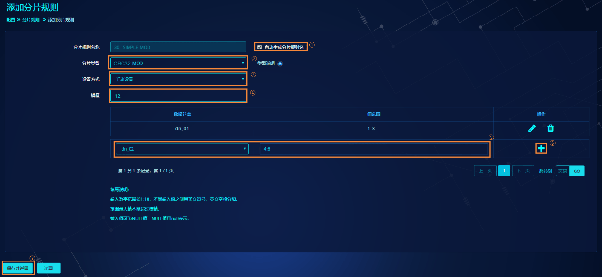

> !Note
>
> 手动设置输入值支持输入多个，但需要用英文逗号或英文空格隔开

#### 编辑分片规则

**功能入口：**

在分布式事务数据库平台页面中选择[配置](#配置)->[分片规则](#分片规则)->"编辑分片规则"

**功能操作：**

在编辑分片规则页面，更改分片规则名称、分片类型、设置方式等信息，点击"保存并返回"，则分片规则配置信息编辑完成。


**修改注意事项：**

- 分片规则名称不允许重复
- 分片规则名称不允许为空
- 关联表结构已创建的表的分片规则修改：
  - AUTO（历史版本）、HASH（历史版本），SIMPLE_MOD类型不允许做任何修改；
  - RANGE、ROUTE、MATCH类型允许新增分片函数参数（如新增节点需要手动在该节点创建表），但不允许修改原有的分片函数参数。
  - 父子表：父表一旦定义，则分片规则不允许做任何修改。

#### 删除分片规则

**功能入口：**

在分布式事务数据库平台页面中选择[配置](#配置)->[分片规则](#分片规则)->"删除"
**功能说明：**

点击"删除"按钮弹出框提示："确认要删除吗？" 点击"确认"，则分片规则配置信息删除。


> !Note
>
> 已经被表引用的分片规则不可删除

#### 复制分片规则

**功能入口：**

在分布式事务数据库平台页面中选择[配置](#配置)->[分片规则](#分片规则)->"复制"

**功能说明：**

在分片规则页面，点击"复制"按钮，弹出新分片规则名称输入框，输入新规则名称点击"确认"，则复制分片规则成功。


**复制注意事项：**

- 新分片规则名称不允许为空
- 新分片规则名称不允许重复

#### 特殊说明

当分片字段为字符串类型且分片类型为AUTO或HASH时，HotDB Server对字符串大小写路由结果不同，即分片字段为字符串类型时对大小写敏感。SQL中使用分片字段时需保持与数据存入时的大小写一致才能查询出对应数据，故AUTO、HASH分片类型在2.4.7版本中已弃用。新版本建议用CRC32_MOD/AUTO_CRC32等分片类型代替HASH/AUTO分片类型。从平稳过渡角度出发，新版本容许采用HASH/AUTO分片类型的分片表，当历史数据含有AUTO、HASH相关分片方式时，页面会给出如下提示，使用时需注意。


### 配置校验

配置校验主要为计算节点相关配置提供校验功能，防止人为错误设置或线下修改计算节点相关配置导致运行异常等问题出现。

容灾模式说明：集群开启容灾模式时，配置校验相关逻辑说明请结合[跨机房容灾部署](cross-idc-disaster-recovery-deployment.md)文档中的[配置校验](#配置校验)章节。

**功能入口：**

在分布式事务数据库平台页面中选择[配置](#配置)->[配置校验](#配置校验)：


**操作说明：**

点击【开始校验】按钮可直接发起配置校验，当校验结果全部通过时，则代表校验成功，当前配置没有发现问题。当校验信息报错时，则校验失败，用户需要根据提示，修改后再进行配置校验。

**校验提示说明：**

配置校验失败分两种类型：ERROR（红色字体显示）、WARNING（橙色字体显示）。出现ERROR级别信息需要用户立即修改解决相关问题，否则无法进行[动态加载](#动态加载)操作。当出现WARNING信息时，则代表需要关注，但不影响计算节点运行。


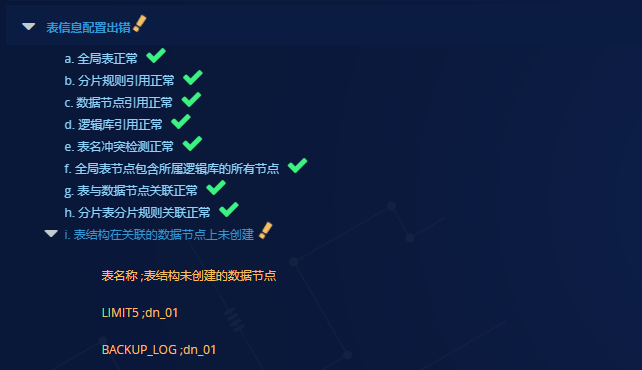

**配置检验项：**

| 类型               | 校验内容                                                                                                                                                                                                                                                                                                                                                |
|--------------------|---------------------------------------------------------------------------------------------------------------------------------------------------------------------------------------------------------------------------------------------------------------------------------------------------------------------------------------------------------|
| 存储节点表配置     | 数据节点引用是否正常                                                                                                                                                                                                                                                                                                                                    |
| ^                  | 存储节点物理库不重复                                                                                                                                                                                                                                                                                                                                    |
| ^                  | 存储节点连接是否正常                                                                                                                                                                                                                                                                                                                                    |
| ^                  | 数据节点必须要有存储节点                                                                                                                                                                                                                                                                                                                                |
| ^                  | 一个数据节点下必须要有可用的存储节点                                                                                                                                                                                                                                                                                                                    |
| ^                  | 一个数据节点只有一个主库（存储节点）                                                                                                                                                                                                                                                                                                                    |
| ^                  | 一个数据节点下面只能有一个主库类型的存储节点                                                                                                                                                                                                                                                                                                            |
| ^                  | 存储节点的字符集必须一致                                                                                                                                                                                                                                                                                                                                |
| ^                  | 非MGR数据节点不能引用MGR类型存储节点                                                                                                                                                                                                                                                                                                                    |
| ^                  | MGR数据节点不能引用普通主从存储节点                                                                                                                                                                                                                                                                                                                     |
| ^                  | 配置库不能添加成存储节点                                                                                                                                                                                                                                                                                                                                |
| ^                  | 存储节点用户不能与配置库用户共用同一个                                                                                                                                                                                                                                                                                                                  |
| ^                  | 中心机房与容灾机房数据节点逻辑架构一致                                                                                                                                                                                                                                                                                                                  |
| ^                  | 节点切换规则表配置   存储节点引用是否正常                                                                                                                                                                                                                                                                                                               |
| ^                  | 存储节点和备用存储节点不能相同                                                                                                                                                                                                                                                                                                                          |
| ^                  | 存储节点和备用存储节点必须属于同一个数据节点                                                                                                                                                                                                                                                                                                            |
| ^                  | 是否配置切换规则                                                                                                                                                                                                                                                                                                                                        |
| 逻辑库表配置       | 数据节点引用正常                                                                                                                                                                                                                                                                                                                                        |
| 分片函数参数表配置 | 分片规则引用是否正常                                                                                                                                                                                                                                                                                                                                    |
| ^                  | 数据节点引用是否正常                                                                                                                                                                                                                                                                                                                                    |
| ^                  | RANGE或者HASH路由方法的column_value必须为区间形式,形如:a:b,且要求a,b都为数字,a<=b                                                                                                                                                                                                                                                                       |
| ^                  | HASH路由方法的分片参数值区间范围不能包含负数                                                                                                                                                                                                                                                                                                            |
| ^                  | 自动分片路由方法的分片参数值须为正整数                                                                                                                                                                                                                                                                                                                  |
| ^                  | ROUTE路由方法的分片参数值须为整数                                                                                                                                                                                                                                                                                                                       |
| ^                  | 分片规则参数是否正常                                                                                                                                                                                                                                                                                                                                    |
| ^                  | RANGE或者HASH的分片区间无重叠                                                                                                                                                                                                                                                                                                                           |
| ^                  | SIMPLE_MOD或者CRC32_MOD路由方法的column_value可以单独是一个大于等于0的数字也可以是区间形式,形如:a:b,且要求a,b都为数字,a>=0,b>=0,a<=b                                                                                                                                                                                                                    |
| ^                  | SIMPLE_MOD或者CRC32_MOD必须配置模值                                                                                                                                                                                                                                                                                                                     |
| ^                  | SIMPLE_MOD或者CRC32_MOD的模值必须在2 -- 2147483647范围内                                                                                                                                                                                                                                                                                                |
| ^                  | SIMPLE_MOD或者CRC32_MOD的分片参数值区间无重叠                                                                                                                                                                                                                                                                                                           |
| 分片规则表配置     | 分片规则引用是否正常                                                                                                                                                                                                                                                                                                                                    |
| 表信息配置         | 全局表是否正常                                                                                                                                                                                                                                                                                                                                          |
| ^                  | 分片规则引用是否正常                                                                                                                                                                                                                                                                                                                                    |
| ^                  | 数据节点引用是否正常                                                                                                                                                                                                                                                                                                                                    |
| ^                  | 逻辑库引用正常                                                                                                                                                                                                                                                                                                                                          |
| ^                  | 表名冲突检测是否正常                                                                                                                                                                                                                                                                                                                                    |
| ^                  | 全局表节点必须包含所属逻辑库的所有节点                                                                                                                                                                                                                                                                                                                  |
| ^                  | 表与数据节点关联是否正常                                                                                                                                                                                                                                                                                                                                |
| ^                  | 分片表分片规则关联是否正常                                                                                                                                                                                                                                                                                                                              |
| ^                  | 垂直分片表只所属一个节点                                                                                                                                                                                                                                                                                                                                |
| ^                  | 开启全局自增且唯一配置后，表中的自增序列仅允许为bigint类型                                                                                                                                                                                                                                                                                              |
| 子表信息配置       | 父表引用是否正常                                                                                                                                                                                                                                                                                                                                        |
| ^                  | 父表分片类型是否正常                                                                                                                                                                                                                                                                                                                                    |
| ^                  | 单父表多子表关联是否正常                                                                                                                                                                                                                                                                                                                                |
| ^                  | 子表父表关系是否正常                                                                                                                                                                                                                                                                                                                                    |
| ^                  | 子表与父表名称无冲突                                                                                                                                                                                                                                                                                                                                    |
| 许可证管理         | 节点数限制校验正常                                                                                                                                                                                                                                                                                                                                      |
| ^                  | 逻辑库数限制校验正常                                                                                                                                                                                                                                                                                                                                    |
| 存储节点配置       | 存储节点配置是否正确                                                                                                                                                                                                                                                                                                                                    |
| ^                  | 动态加载要求可用的主存储节点与原主存储节点复制延迟不能超过10秒                                                                                                                                                                                                                                                                                          |
| ^                  | 动态加载要求可用的主存储节点与原主存储节点复制状态正常                                                                                                                                                                                                                                                                                                  |
| 配置库状态         | 配置库连接正常                                                                                                                                                                                                                                                                                                                                          |
| ^                  | 配置库复制状态正常                                                                                                                                                                                                                                                                                                                                      |
| 用户权限配置       | 存储节点连接用户权限配置正常（权限不低于：select,insert,update,delete,create,drop,index,alter,process,references,super,reload（仅计算节点版本大于等于V2.5.3时要求）,lock tables,replication slave,replication client,trigger,show view,create view,create routine,**xa_recover_admin**（仅限8.0及以上版本的存储节点实例）,alter routine,execute,event） |
| ^                  | 配置库连接用户权限配置正常（权限不低于：select,insert,update,delete,create,drop,index,alter,create temporary tables,references,super,reload（仅计算节点版本大于等于V2.5.3时要求）,lock tables,replication slave,replication client）                                                                                                                    |
| 计算节点配置       | 当前配置的计算节点模式与真实的计算节点模式是否匹配                                                                                                                                                                                                                                                                                                      |

> !Note
>
> 开启全局自增且唯一配置后，表中的自增序列仅允许为bigint类型"为2.5.5版本及以上的管理平台增加校验规则，如下图：
>
> 
>
> 在集群模式且autoIncrement参数设置为2（自增仅唯一）时，若存在历史数据自增序列为smallint、tinyint 、mediumin、int类型的，会影响动态加载且提示"开启全局自增且唯一"配置后，自增序列仅允许为bigint类型。如下图：
>
> 
>
> 该校验规则仅在计算节点参数"全局自增序列号"设置为2即"全局自增仅唯一"且计算节点模式为多节点集群时，对所有逻辑库下所有开启自增列的表进行校验。展示信息包括：不符合校验表所属的逻辑库、表名称、自增列字段名称、自增列当前类型。

### 集群元数据备份还原

集群元数据指的是计算节点配置库数据与配置文件。HotDB Management提供为计算节点手动或定时备份元数据的功能，以防重要配置数据丢失或损坏导致无法恢复。

#### 集群元数据备份


**手动备份**


备份元数据可选择"配置库"或"配置文件"。配置库为计算节点当前使用的主配置库中的数据；配置文件为当前主计算节点中的bin、conf、lib目录下的所有文件，主备模式集群还包括备份`keepalived.conf`文件

点击【发起备份】按钮后，HotDB Management下达备份命令。配置库MySQL实例采用mysqldump方式执行备份并将备份文件存在HotDB Management安装目录`data`下。配置文件则从主计算节点服务器中直接备份到HotDB Management安装目录`data`下

备份"配置文件"需要提前在"配置->服务器"菜单页面配置计算节点所在服务器的SSH连接信息且保证可正常连接，同时还需保证集群中主计算节点运行正常。此外配置的SSH连接用户还需拥有查看计算节点运行线程信息的权限。不满足以上要求都无法正常备份配置文件

**远程备份**


为提高备份的元数据的安全性，本功能还提供将备份的元数据同时拷贝到远程服务器中。手动发起备份时只需勾选"同时备份至远程"即可。定时备份时在计划中选择备份至远程为"是"。

使用远程备份功能需要配置远程服务器相关参数：

- **远程复制方式：**支持SCP与RSYNC两种。如果选择RSYNC复制方式，需要提前在所有计算节点服务器与远程服务器上安装好RSYNC工具
- **免密登录：**若需要使用免密方式连接远程服务器，则要求所有计算节点服务器与远程服务器建立免密通道。建立免密通道可参考文档[安装部署](installation-and-deployment.md)文档中的"实现免密通道说明"章节
- **远程主机名：**远程服务器的IP地址
- **远程主机用户/密码：**连接远程服务器的SSH信息
- **远程存放目录：**备份的元数据在远程服务器中的存放目录，必须是存在且远程连接账户拥有文件写入权限的目录

**定时备份**


定时备份时间可以设置3种：每日，每周，每月，但HotDB Management中[集群元数据备份还原](#集群元数据备份还原)功能最多只能添加6条定时备份计划

定时任务可选择定时备份配置库或配置文件，如果有元数据类型相同且备份时间刚好冲突的备份计划，将只执行其中一个

#### 集群元数据还原

**集群元数据还原**


目前只支持对配置库数据进行还原操作，配置文件还原需要手动进行

在已备份的记录中可选择还原时间点对应的备份记录，点击【还原】按钮对配置库数据进行还原操作

还原前HotDB Management会自动对当前配置库做一次备份操作，防止误操后，没有最新数据的备份。因还原进行的自动备份文件自动命名为"备份时间+restoreBackup"

### 计算节点参数配置

计算节点参数配置是管理平台为用户提供可视化配置计算节点server.xml参数的功能。

容灾模式说明：集群开启容灾模式时，计算节点参数配置相关逻辑说明也可结合[跨机房容灾部署](cross-idc-disaster-recovery-deployment.md)文档中的[计算节点参数配置](#计算节点参数配置)章节一起使用。

**功能入口：**登陆管理平台，进入[配置](#配置)->[计算节点参数配置](#计算节点参数配置)页面

#### 基础功能及注意事项说明


通过计算节点下拉框可以查看当前集群内的所有计算节点，当前主计算节点显示在下拉框的最顶端，其它计算节点依次展示在下拉框中，格式为：计算节点名称（IP当前主），其它计算节点格式：计算节点名称（IP）。同步框"参数自动同步到备计算节点"默认勾选，添加或修改参数会自动同步到其他备计算节点（单计算节点模式无该同步操作），其中：【haMode:容灾模式】、【idcId:机房ID】、【idcNodeHost:对应机房主计算节点信息】、【ServerId:集群节点编号】、【clusterHost:节点所在IP】、【hsaState:计算节点高可用模式下的主备角色配置】、【HaNodeHost：计算节点高可用模式下对应的当前主计算节点连接信息】总共七个参数由各自计算节点控制，不会同步修改。

对于列表可按参数名称、参数说明搜索，也可按照"基础配置、高可用配置、数据库特性、SQL语法与功能、数据库特性、数据库运维"类型进行筛选，如下图：


同时可对参数进行修改、重置、批量修改、批量重置操作，操作完毕后参数状态为未生效，此时可通过动态加载或重启服务的方式生效（参照生效方式列说明）


点击参数名超链接，会跳转到"参数详情说明"页并定位到该参数，该页面对该参数进行了详细说明。


点击右上角"添加参数"按钮，跳转至添加参数页面，展示计算节点所有不常用参数，不常用参数需按实际需求调整添加。


> !Note
>
> Keepalived虚拟IP参数建议在集群模式为主备计算节点时配置（单计算节点忽略该参数），且需要设置为当前实际的Keepalived虚拟IP。
>
> 部分参数修改时，会有悬浮提示信息，如下：
>
> - maxIdleTransactionTimeout -> 0为永不超时
> - statisticsUpdatePeriod-> 0为不进行持久化
> - dropTableRetentionTime-> 0为不保留
> - deadlockCheckPeriod-> 0为不启用
> - maxUserConnections-> 0为不限制
> - VIP-> 不填或格式不为IPv4表示此项为空
>
> 对于frontConnectionTrxIsoLevel参数，若enableXA参数设置为true，则该参数下拉框会置灰且不可选择READ UNCOMMITTED选项
>
> 若存在计算节点故障，则计算节点选择框中不显示故障的计算节点
>
> 容灾模式下，需配置参数idcId、idcNodeHost。idcId配置机房ID，当前默认设置为1表示中心机房，设置为2表示容灾机房
>
> 参数haMode未开启容灾模式情况下，计算节点为单计算节点或主备计算节点时该参数显示"主备"，为多计算节点时该参数显示"集群"

#### 主配置库的启用

当计算节点集群使用的配置库为主备或双主模式时，若主配置库发生故障，计算节点集群会自动将配置库连接切换到双主备配置库上。待人工修复主配置库后，计算节点集群并不会自动直接使用主配置库。需按以下步骤重新启用主配置库：

1. 当主配置库发生故障后，计算节点参数配置页面显示如下：


2.若确定主配置库已恢复正常且与备配置库数据一致且最新时，可点击[计算节点参数配置](#计算节点参数配置)页面启用按钮对主配置库进行启用。

3.点击启用按钮后，再点击【动态加载】按钮，即可将主配置库重新启用


但针对容灾模式需注意 :

- 当容灾机房为当前备机房时，主配置库故障后，计算节点会将容灾机房主从配置库级联置为不可用状态。
- 当容灾机房为当前备机房时，启用容灾机房从配置库时需要确认当前主配置库为可用状态，否则无法启用容灾机房从配置库，即启用容灾机房从配置库前必须先启用容灾机房主配置库。
- 若要启用两个机房中任意一个配置库，需要保证当前机房内与机房间的复制状态都正常。若任一一条复制状态存在异常，动态加载会成功但有告警信息，则如下：

### 数据库用户管理

HotDB Server对计算节点用户权限控制到表级别，支持配置计算节点数据库用户拥有逻辑库或表的SELECT、UPDATE、DELETE、INSERT、CREATE、DROP、ALTER、FILE中一种或多种权限；具体权限由HotDB Management用户管理。其中FILE权限为全局权限，其他权限可进行逻辑库或表级配置。

#### 数据库用户管理信息


页面显示已添加的计算节点数据库用户记录，可通过用户名或者主机名的方式进行模糊查找

页面中的"root"账户为HotDB Management安装初始化时内置的用户，该用户不能被删除（HotDB Management用root账户连接访问计算节点）

#### 添加新用户

点击【添加新用户】按钮，进入添加用户信息页面。添加用户信息有三个模块，分别为"基本信息"、"逻辑库权限"、"表级权限"，分三个Tab展示 。


**(1) 基本信息：**包含必填项"用户名"、"密码"，选填项"主机"、"用户最大连接数"、"super权限"、"全局权限"。

- "用户名"、"密码"为登录计算节点时所用的数据库账户信息，"用户名"要求不能带有中文，密码必须符合规范


- "主机"为选填项，为空时默认为"%"，即任意IP可连接。若开启白名单限制，连接时，客户端IP需要同时在用户主机范围和"安全->[白名单](#白名单)"设置的IP范围内

- "用户最大连接数"为选填项，为空时默认为"0"，即不限制用户连接数。所有用户的最大连接数上限以"前端最大连接数"为准

- super权限包括用户登录管理端口（默认为3325）的权限；在服务端口（默认为3323）使用强制主从与强制dnid类别的HINT、set global max_connections等权限

- 全局权限为可选设置，设置全局权限，则对所有逻辑库下的所有对象具备所勾选的操作权限。例如：勾选全局权限：SELECT，UPDATE，INSERT，CREATE并保存，动态加载后则当前用户可对所有逻辑库及表进行SELECT，UPDATE，INSERT，CREATE操作

- 用户名和主机可确定用户的唯一性，即用户名+主机代表一个独立的用户。此规则与MySQL权限体系一致

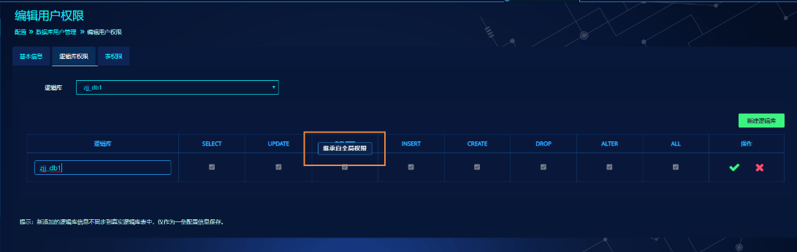

（二）**逻辑库权限：**选择对应逻辑库设置相应权限，或者新建逻辑库并赋予权限。

- 若基本信息中设置了全局权限，则逻辑库级别的相关权限跟随全局权限不可更改，鼠标悬停会提示"继承全局权限"

- 选择或添加逻辑库赋权时，页面会自动勾选基本权限项"SELECT，UPDATE，INSERT，DELETE"

- 勾选"ALL"权限代表可对该逻辑库进行所有权限操作。若后期需要对已赋予"ALL"权限的逻辑库进行权限调整，需先取消ALL选项的勾选

- 若新增逻辑库并设置对应权限，该新增的逻辑库信息不同步到逻辑库配置信息中，仅作为一条配置好的权限信息保存

- 此功能页面的逻辑库删除只删除当前逻辑库对应的权限记录，不影响逻辑库页面配置的信息

> !Note
>
> 修改逻辑库名称可能导致某些用户已添加的逻辑库权限与表权限配置失效，故逻辑库表格页面修改逻辑库名需慎用。

**(3) 表权限：**用户表级权限分为两个部分：表级允许权限、表级拒绝权限。允许权限即用户可以操作表的权限，拒绝权限即用户不能操作表的权限。

**表允许权限**

选择已存在的表配置权限或添加新的表信息并配置权限。选择逻辑库后再从下拉框中选择需要配置的表或输入新增表的名称。点击【确定】页面将生成一条配置记录。

- 若当前逻辑库有设置过权限或已设置过全局权限，则表相关权限跟随逻辑库权限不可更改，鼠标悬停会提示"继承自逻辑库权限"

- 配置一条表权限记录，页面会默认勾选基本权限项"SELECT/UPDATE/DELETE/INSERT"。

- 勾选"ALL"权限代表可对该表进行所有权限操作，若需要对赋予"ALL"权限的表进行调整，需要先去除勾选"ALL"选项

- 若采用新增表设置对应权限，该新增的表不同步到表信息中，仅做为一条预先配置的信息，该表创建后直接匹配对应的权限

- 此功能页面的表删除只删除当前表对应的权限记录，不影响表信息页面配置的表信息

**表拒绝权限**

表拒绝权限可为某用户配置不允许对某张表执行相关动作，配置方法同表允许权限一致。使用时，需注意表拒绝权限优先级大于全局权限、逻辑库权限、表级允许权限。

- 表拒绝权限与全局权限和逻辑库权限无关，也不会默认勾选任何权限

- 若采用新增表设置对应权限，该新增的表不同步到表信息中，仅做为一条预先配置的拒绝权限信息，该表创建后直接匹配对应的权限

- 表删除只删除当前表对应的拒绝权限记录，不影响表信息页面配置的表信息

**权限匹配注意事项：**

登录服务端匹配用户表时，首先以最具体的Host值排序（主机名和IP最为具体的），有相同Host值的条目再以最具体的用户名匹配。例如: 添加两个用户，用户名相同Host不同，如下图：


用户test通过主机192.168.200.51登录，执行INSERT/ALTER操作，由于匹配最具体的Host，ALTER无权限操作被拒绝，如下图：

```
test@192.168.220.104 : TEST_ZY 08:54:51> insert into join_cross_a_jwy(adnid) value (101);
Query OK, 1 row affected (0.05 sec)

test@192.168.220.104 : TEST_ZY 08:56:11> alter table join_cross_a_jwy add column apassword int after aname;
ERROR 1045 (HY000): [ALTER] command denied to user 'test' to logic database 'TEST_ZY'
```

配置的表级拒绝权限与全局、逻辑库、表级允许权限不冲突且优先级高于全部，例如：test用户设置了全局权限ALL，如下图：


test用户设置了test_ct.test_temp表拒绝权限DELETE,DROP


用户test登录服务端口对test_temp表进行DELETE,DROP操作被拒绝，示例如下：

```
test@192.168.200.51 : (none) 08:53:25> use test_ct

Database changed
test@192.168.200.51 : test_ct 08:53:32> insert into test_temp(a) values(30);
Query OK, 1 row affected (0.09 sec)

test@192.168.200.51 : test_ct 08:53:51> delete from test_temp where a=30;
ERROR 1045 (HY000): [DELETE] command refused to user 'test' to table 'TEST_TEMP' of logic database 'TEST_CT'
```

### 服务器

服务器菜单可配置集群中所有服务器的SSH信息，方便HotDB Management对服务器进行各种状态监控。此外也支持添加集群外的服务器到HotDB Management中进行监控。


#### 自动获取服务器IP

服务器页面会自动显示集群内所有的服务器IP以及服务器中关联的服务程序。

**单节点集群模式**


HotDB Management自动获取：计算节点、存储节点、配置库组件的服务器IP信息。

**主备节点模式集群**


HotDB Management自动获取：计算节点、存储节点、配置库、keepalived组件的服务器IP信息。

**多节点模式集群**


HotDB Management自动获取：计算节点、存储节点、配置库组件的服务器IP信息。如果该集群是手动添加的，页面底部增加提示：程序无法获取LVS组件的服务器IP，请用户自行在【添加服务器】中配置。

#### 添加服务器

点击添加服务器按钮，可以添加集群外的服务器。


- 登录方式：密码、免密，若选择免密登录需要提前设置免密通道，具体可参照[安装部署](installation-and-deployment.md)文档的"免密实现说明"模块
- 主机名：服务器IP地址
- 端口：sshd的端口，默认22
- 用户名：SSH登录的用户名
- 密码：SSH登录的密码；选择免密登录时无需配置
- LVS服务器：若选择"是"，点击【测试】按钮会检测服务器中LVS服务是否正常，当测试通过后，才能保存成功。此选项只针对多计算节点集群环境，单计算节点、主备计算节点无此项目
- 也可以选择"批量操作->批量添加"快速添加多台服务器

#### 配置SSH

默认获取的服务器的SSH连接状态为"未连接"，需要用户手动配置SSH信息，配置完成后将自动开启监控。


配置SSH信息只需填写：端口（默认22）、用户名、密码（免密则不用输入）

选择LVS服务器为"是"则代表该服务器中存在集群组件LVS

配置完的服务器自动开启监控（由HotDB Management发送监控脚本至开启监控的服务器）

#### 其他说明

点击【移除】可将已添加的服务器记录进行删除。若移除的记录为集群组件所在服务器，则只能移除配置的SSH信息

点击【停止监控】则不再定期在服务器中执行监控脚本。但该操作会使HotDB Management无法掌握集群服务器的健康状态，存在一定隐患

"停止监控"的服务器不会在"监控->监控面板->[其他服务器](#集群资源监控)"中展示服务器资源状况。在"监控->[物理逻辑拓扑](#智能逻辑拓扑)"功能中未监控的服务器也无法查看服务器的详细情况

## 监控

### 智能逻辑拓扑

HotDB Management通过可视化方式将集群中前端应用、逻辑库、计算节点、数据节点、存储节点等物理与逻辑上的组件完整展示。并通过前端应用连接池与后端数据库连接池信息动态生成组件上的QPS与连接数信息。通过[智能逻辑拓扑](#智能逻辑拓扑)用户可以快速了解整个集群的运行状态，帮助用户实现高效运维。

容灾模式说明：集群开启容灾模式时，智能逻辑拓扑图相关逻辑说明请结合[跨机房容灾部署](cross-idc-disaster-recovery-deployment.md)文档中的"智能逻辑拓扑图"章节。

#### 拓扑图组件说明


拓扑图由五层组件组成，按从上到下的位置分别为：前端应用、逻辑库、计算节点、数据节点、存储节点。

**(1) 前端应用**

前端应用，即连接计算节点的客户端，应用程序通过IP、端口、用户密码连接（连接方式与连接MySQL一致）至指定逻辑库，即可在拓扑图中看到相关连接信息。前端应用的实时连接数、QPS若超出设置阈值，拓扑图会以橙色向上箭头显示告警信息。

**(2) 逻辑库**

- 逻辑库层在物理上属于虚拟的一层，逻辑库是HotDB Server产品虚拟出来的概念。通过拓扑图可查看整个集群中存在的所有逻辑库
- 逻辑库图标上展示与之相关的"连接数"、"QPS"
- "连接数"为连接当前逻辑库的所有前端应用连接数的总和
- "QPS"为连接逻辑库的所有前端应用QPS的总和（逻辑库QPS偶尔会因数据获取时间的差等原因与总和数存在个位数偏差）
- 当"QPS"与"连接数"超出设置阈值时，页面会通过橙色箭头显示告警
- 当逻辑库下存在使用的数据节点中最后一个存储节点不可用时，该逻辑库图标会被标为黄色；表示该逻辑库存在部分数据暂时无法提供服务

**(3) 计算节点**

- 计算节点为整个集群的核心组件，提供数据查询等服务
- 在拓扑图中会根据集群模式显示对应数量的计算节点图标，单节点模式显示一个，主备模式显示两个，多节点模式以配置计算节点的个数为准
- 默认绿色代表当前主计算节点，蓝色代表当前备计算节点。出现红色则代表该计算节点存在异常无法连接，出现橙色则代表计算节点状态参数超过设定阈值
- 主备或多节点模式的集群会在当前主计算节点上标记"皇冠"代表当前集群的主
- 鼠标悬停在计算节点图标时，显示后端连接数总数、直接内存使用率、前端连接数总数、堆内存使用率、后端进流量速率、后端出流量速率、前端进流量速率、端出流量速率、QPS，当数据超过报警阈值时，会变橙色并加向上的箭头标记

**(4) 数据节点**

- 数据节点是HotDB Server虚拟出来的概念，在物理层面实际上并不存在
- 数据节点可以将一组具备复制关系的存储节点放到一起进行管理，方便查看和后期运维
- 数据节点信息"复制状态"：在双主、主从存储节点显示的复制状态参数。复制状态包括：正常、异常、未知。复制状态与节点管理页面中的"[主从状态](#节点管理)"保持一致
- 若数据节点下最后一个可用的存储节点运行异常，该数据节点图标会被标黄显示。表示该数据节点下的数据暂时无法提供服务。
- 当复制状态为未知时，备存储节点用黄色显示且闪烁，鼠标移入显示未知原因信息。未知原因与节点管理中[主从状态](#节点管理)未知提示的原因保持一致，未知分四种情况：存储节点无法连接，存储节点权限不足、检测超时（超时时间1分钟）、当前节点非主从复制关系。除上述情况外，针对双主带从的情况，如果配置了master_id而主从关系匹配不上，也是"未知"状态，提示："当前节点主从关系与配置不一致"
- 数据节点信息"数据容量"：数据容量以数据节点下的当前主库数据容量为准。即当前主库数据量 = 数据节点显示的数据容量。(数据量单位用K、M、G表示)
- 数据节点信息"故障切换时间"：为备库正式接管服务的时间
- 数据节点信息"故障切换耗时"：为从主库发生故障开始，备库等待追平然后连接切换至备库，到备库开始正常提供服务为故障切换耗时。只在切换成功时显示此参数；如果运行正常或者切换失败或者切换过程中，主库又重新恢复时，该参数不显示时间，只用"- -"代替显示。切换耗时的时间单位用：ms、s、min、h显示
- 数据节点信息"主备数据一致"：当节点类型为双主、主备、一主多从类型时标识多个存储节点上的数据和对象是否一致，该值有"--，正常和异常"三种状态，对应状态根据菜单"检测->主备数据一致性检测"的最新检测结果进行展示。

1. 当所选节点未进行主备数据一致性检测时：主备数据一致显示为"--"


2. 当所选节点检测结果为"无法检测"或"不一致"时：主备数据一致显示"异常"且为橙色超链接，点击超链接跳转至主备一致性检测结果详情页


3. 当所选节点检测结果为"一致"时：主备数据一致显示为"正常"


4. 当所选节点检测结果为"一致"且有"存在无法检测的情况"时（即多个检测节点）：主备数据一致根据实际的检测结果匹配，检测结果一致的节点显示为"正常"，无法检测的节点显示"异常"且为橙色超链接

- 数据节点信息"连接数"：由数据节点下所有存储节点上的连接数相加获得
- 数据节点信息 "QPS"： 由数据节点下所有存储节点上的QPS相加获得

**(5) 存储节点**

- 业务数据真实的存储层，由MySQL实例组成
- 默认绿色带"M"字样的为当前主存储节点，蓝色带"S"字样的为备存储节点，双主备库为蓝色带"M"字样，带"MGR"字样的为MGR类型的存储节点
- 若图标为红色则代表存在故障，鼠标移入故障存储节点图标可显示故障原因，橙色代表存在复制延迟或数据节点下最后一个存储节点不可用
- 存储节点会显示"复制延迟"（主从或双主关系的存储节点才会显示，延迟数据从show salve status中获取）、"连接数"（根据后端MySQL连接池动态生成）、"QPS"

**(6) 配置库**

- 在存储层左侧始终显示集群中计算节点配置库组件
- 为无状态图标，该图标连接一个或两个配置库，分别表示单节点配置库和双主配置库。在单机房模式下，若连接三个及以上的配置库，则代表MGR模式的配置库。当所有配置库不可用时，会显示为橙色
- 与存储节点类似，配置库图标为红色代表存在故障，鼠标移入红色图标可显示故障原因；橙色代表存在复制状态异常，鼠标移入橙色图标可显示复制异常原因
- 配置库上显示"复制时延"的监控信息。与存储节点类似，复制时延可以在"设置 ---> 拓扑图报警设置"中的配置库模块下设置复制时延的报警阈值

**其他说明**

- 关于组件更详细介绍请参照［名词解释］(glossary.md)文档
- 拓扑图中组件显示的参数报警信息阈值可在"设置->[拓扑图报警设置](#拓扑图报警设置)"中配置
- 数据节点图标右键可直接进行主备切换，切换逻辑同"节点管理->[主备切换](#主备切换)"（单库或MGR类型的数据节点无该操作入口）
- 存储节点图标右键可快速复制存储节点连接命令行，复制内容如：`mysql -uhotdb_datasource -p -P3306 -h192.168.220.232 -Ddb05`。（因安全问题连接密码不给出）

#### 界面调整功能


**(1) 视觉切换**

- 可通过界面【2.5D】按钮将拓扑图视觉效果切换到"2.5D"，点击【2D】可切回普通视觉效果

**(2) 拓扑图设置**

- 可选择隐藏或展示各组件显示的"QPS"、"连接"信息
- 若拓扑图页面逻辑库太多，可通过设置中的逻辑库筛选进行针对性的查看
- 因在拓扑图"普通视图"中各组件可拖动，为了将拖乱的组件重新归位可点击【重置组件排列】将各组件位置复原

**(3) 拓扑图信息面板**

- 鼠标移入【<】按钮中可唤出拓扑图信息面板，信息面板主要记录拓扑图中INFO（页面组件的加入或退出）、WARNING（各组件报警参数超出阈值的信息）、ERROR（组件发生异常时的信息）等信息
- 拓扑图信息面板记录的信息无法被手动删除，但可以在信息面板右上角的【设置】按钮中设置记录信息的窗口期（本地保留时间），同时为了减少WARNING级别的信息，可设置报警次数连续达到三次才记录信息

#### D拓扑图

2.5D拓扑图是在原有基础拓扑图上进行视觉升级的功能。该功能显示的组件与组件信息与上述"普通视觉"拓扑图一致，功能也大致相似。


**2.5D拓扑图特殊说明：**

- 2.5D拓扑不支持任意部件拖动，所有部件位置固定
- 计算节点发生故障后，故障的计算节点显示在主计算节点的右边
- 页面所有应用服务器、逻辑库、计算节点、数据节点、存储节点的显示状态，均与单机房模式一致
- 右上角切换、设置、信息弹出面板功能和单机房模式保持一致
- 支持通过鼠标滚动方式或页面放大缩小按钮对视图实现放缩，支持页面拖动

### 智能物理拓扑

物理拓扑图主要以服务器为视角展示集群组件与服务器的所属关系，同时可查看服务器资源的使用情况以及各集群组件服务运行状态。使用前需保证为集群服务器配置了可用的SSH连接信息，否则只能查看当前服务器与集群组件的所属关系，无法查看服务器与组件程序的状态。

容灾模式说明：集群开启容灾模式时，智能物理拓扑图相关逻辑说明请结合[跨机房容灾部署](cross-idc-disaster-recovery-deployment.md)文档中的"智能物理拓扑图"章节。

**(1) 智能物理拓扑总览**


- 服务器总数：集群中所有组件使用的服务器个数
- 服务器健康状态：状态有正常、预警、故障，统计图中分别对应绿色、橙色、红色显示。服务器故障原因有：服务器SSH连接信息有误、服务器网络连接异常、服务器无法正常连接；服务器预警原因有：服务器资源使用参数值达到"设置-监控面板设置-[计算节点/其他服务器资源设置](#监控面板设置)"的阈值
- 服务程序总数："配置->服务器"页面显示的"关联服务程序"个数总和
- 服务程序类型：计算节点、存储节点、配置库、keepalived（主备模式集群）、LVS（多节点模式集群）
- 服务程序健康状态：对应的服务程序运行状态。计算节点有：故障（无法连接）、预警（超出阈值）、正常（服务正常运行）。其他服务程序只有正常（正常运行）、故障（运行异常）两种状态。鼠标移入故障或异常状态的区域可查看详情信息

**(2) 智能物理拓扑图页面**


**页面说明：**

- 显示服务器与服务程序关系。服务器以方块表示，每一层代表一个服务程序类型，最底层右下角显示服务器IP。正常、预警、故障，分别对应蓝色、橙色、红色方块显示。无法监控的服务器，透明显示
- 服务器上对应的服务程序全部显示，以层层叠加的方式显示。服务程序类型及个数与总览中显示一致
- 在"配置->服务器"功能页面中未配置SSH连接信息或未开启监控的服务器在图中显示为透明，点击服务器弹出对应"SSH未配置或服务器未开启监控"提示
- 在"配置->服务器"功能页面中已配置但SSH，但后期修改变更导致SSH信息不可用的服务器在图中显示为透明，点击服务器弹出对应"SSH信息不可用"提示

**(3) 服务器详情面板**


**服务器资源详情：**

- CPU使用率：显示当前CPU的使用率情况，鼠标移入显示具体详情，若有超出阈值则在提示中出现预警信息
- 内存使用率：展示当前内存情况，鼠标移入显示具体详情：（总内存、已用内存、剩余内存、内存使用率）；内存统一用GB为单位显示。内存量若有小数则精确到小数点后两位
- 磁盘空间使用率：显示对应挂载点的总磁盘空间使用率情况，鼠标移入显示具体详情：（挂载点名称、磁盘空间总量、已用磁盘空间、剩余内存、磁盘空间使用率）统一用GB为单位显示，可切换底部挂载点展示对应挂载点的监控数据
- 流量：显示当前网络进流量与网络出流量情况，鼠标移入显示具体详情,单位根据实际情况显示KBps、MBps

**服务程序详情：**

显示该服务器中具体安装的组件信息，包括组件当前的状态情况。

### 监控面板

监控面板为用户提供计算节点、服务器相关的监控功能，包含：计算节点服务状态、计算节点流量、计算节点服务器资源、其他服务器资源。

**数据采集说明：**

监控面板显示24小时内采集的数据（需要放大显示，正常视图仅显示半小时内的数据），系统每5分钟采集一次数据记录在HotDB Management部署的服务器内存中，如果管理平台重启，内存中存储的数据会清空。

#### 添加与设置监控项


- 首次进入该功能需要先【添加监控项】
- 若想对已监控的项目进行调整或者选择展示其他计算节点（多计算节点集群模式下）的监控信息可在【切换】按钮中进行设置


- 在多节点模式集群中可选择"切换计算节点监控显示"，默认展示集群主计算节点的监控数据。单节点与主备节点模式集群只能查看当前主计算节点监控数据
- 用户可根据实际情况勾选展示的监控项，默认全部勾选展示。（去除勾选不会对监控数据造成影响）
- 实时数据量可按监控维度设置展示多个，默认展示"监控整个服务"的数据量情况即整个集群数据量变化情况
- 其他监控项设置与上述说明类似，具体调整参照上述描述即可

#### 监控面板说明

**(1) 计算节点服务状态**


- **客户端连接总数：**显示当前"前端应用"连接到计算节点实际建立连接的数量，单位：个
- **计算节点线程使用情况：**显示当前连接到计算节点的连接使用的线程总数、占用线程、空闲线程，单位：个
- **后端连接状态：**显示计算节点连接到后端存储节点的连接状态，有连接总数、占用连接、空闲连接，单位：个
- **计算节点直接内存使用率：**显示计算节点配置的直接内存当前的使用情况，用百分比显示
- **实时数据量：**显示集群中数据量的监控情况，统计方式支持行和数据容量两种。行的单位为1、K、M自动进位，数据容量的单位为1byte、KB、MB、GB自动进位
- **计算节点堆内存使用率：**显示计算节点配置的堆内存当前的使用情况，用百分比显示

**(2) 计算节点流量**


- **网络流量监控：**显示整个集群的流量进出情况，包括前端进出流量与后端进出流量，用Bps表示。
- **TPS：**显示整个集群每秒执行事务数量，单位：个。
- **QPS：**显示整个集群每秒查询数，单位：个。
- **客户端操作速率：**显示客户端对操作计算节点的吞吐量，单位为次/s。
- **后端操作速率：**显示计算节点操作后端存储节点吞吐量，单位为次/s。

**(3) 计算节点服务器资源**


- **服务器内存使用情况：**显示计算节点所在服务器当前内存使用情况，可查看内存总量、已使用量、剩余量。
- **服务器磁盘空间使用情况：**显示计算节点所在服务器当前磁盘空间使用情况，可查看磁盘空间总量、已使用磁盘空间量、剩余磁盘空间量。
- **服务器CPU负载情况：**显示计算节点所在服务器CPU负载情况，具体可展示1、5、15分钟负载平均值。
- **服务器CPU/CPU0使用率/状态信息：**显示计算节点所在服务器CPU/CPU0的使用率/状态信息情况，默认监控主计算节点CPU使用率情况。用户可点击"服务器CPU使用率"监控面板右上角【设置】按钮切换监控对象与监控视角。
  
- **服务器磁盘读写情况：**显示计算节点所在服务器的磁盘IO读写情况。
- **服务器网络流量进出情况：**显示计算节点所在服务器的网络进出流量情况，用KBps显示。
- **服务器磁盘IO带宽利用率：**显示计算节点所在服务器磁盘IO带宽利用率，用百分号表示。

#### 数据增量预测

管理平台可通过智能科学预测的方法评估出存储节点、配置库等组件的数据容量增长趋势，为扩容缩容提供参考依据。

**(1) 页面信息说明**

每日凌晨两点收集配置库和数据节点（当前主配置库和主存储节点）的数据总量，记录在管理平台的配置库中。历史数据记录满足21天后，依据历史数据记录采用多项式拟合方法，从而描绘出未来增量数据的曲线图。


如果计算节点配置库和管理平台配置库以及所有数据节点的历史数据记录均没有满足21天，将不会生成预测曲线，页面给出橙色提醒。


**(2) 选择预测时间**

用户可以选择预测时间，最小单位为日。曲线图根据选择的预测时间来显示预测曲线的时间轴。


默认选择预测时间为一年后的今天。

时间范围：仅允许选择今天日期以后的日期，最多只能选择3年后，例如今天是2020.05.15，仅允许选择2020.05.16到2023.05.15之间的日期（不包括2020.05.15）。其他的日期会置灰显示。

**(3) 预测数据展示**

页面展示分为3个部分：数据节点，存储节点，增量预测。单页显示5条信息后分页展示。按照预测数据量降序排列，若有的数据节点或者配置库记录满21天，有的没满，则没满21天的数据节点或配置库如下图显示，并排序排在最后：


- 数据节点显示：数据节点/配置库名称+预测结果，鼠标悬浮至整个板块，显示超链接效果，点击整个板块，可跳转至该数据节点详情页面。配置库板块鼠标悬浮无特殊效果，点击后不会跳转。预测结果为当前选择的预测时间的预测值。
- 存储节点显示：IP_端口_存储节点名称，显示数据节点下所有的存储节点，并标识当前主存储节点。若存储节点个数超过5个，则仅显示5个并显示超链接">>查看更多"，点击后可跳转到该数据节点详情页面。
  
- 增量预测：由管理平台根据当前主存储节点或主配置库的总数据量和时间计算得出预测曲线。

**(4) 预测曲线**

预测曲线有两个部分，一个是实际每天采集的历史数据容量，以蓝色散点形式展示；一个是根据采集的历史数据拟合生成的曲线图，以绿色实线展示。


- X轴：对应预测时间。由两年内的历史数据开始记录时间为起始时间，至选择预测时间加6个月为结束时间。例如：2019-02-06开始记录数据，今天是2020-01-23，选择预测时间为2020-12-23，加6个月后是2021-06-23，最终这个时间轴的长度为2019-02-06到2021-06-23。
- Y轴：对应数据容量值。单位大小由B到TB，单位根据数值大小自动变更。
- 历史数据记录：以蓝色散点展示，鼠标放置散点位置时，显示数据采集的时间和对应的数据容量。
  
- 增量预测曲线：以绿色实线展示，鼠标放置曲线上，显示具体时间和对应的预测值。曲线图下发有滚动条，方便查看具体时间段。点击右上方的放大按钮，可将图表全屏展示。
  
- 点击查看当前按钮，曲线只显示当前预测时间对应的预测值，与数据节点显示的预测结果一致。
  

> !Note
>
> 当前采用的预测方法预测出来的容量值仅为参考数据，实际还需人工结合实际进一步决策判断。数据采集时间越多、预测结果越准确。

#### 集群资源监控

##### 服务器性能

在"配置->[服务器](#服务器)"页面配置了服务器SSH信息且开启监控的情况下，在此监控面板中可监控到服务器的资源详细信息；当[服务器](#服务器)页面停止"或者"移除"SSH配置后，此监控页面去除该服务器的监控图表。监控信息分页显示，每页显示5条记录。

**页面信息说明**


- 当在"配置->[服务器](#服务器)"页面有未配置SSH信息的服务器记录时，监控页面会

有提醒，并且可以点击超链接到[服务器](#服务器)配置页面开启服务器监控

- 监控状态面板含所有纳入监控的服务器的详细监控信息，包括：CPU、内存、磁盘使用情况（可切换监控的盘符）、网络流量进出（可切换监控的网卡）

- 页面默认置顶显示故障、预警的记录，且优先级故障大于异常

- 通过[服务器](#服务器)筛选下拉框的模糊搜索框，可多选服务器；也可以通过状态筛选服务器，筛选项有："正常、预警、故障"


- 点击"状态框"可进入详情页面，如上图所示

- 点击监控模块右上角【放大】按钮可放大查看监控数据

##### 网络质量

管理平台可对集群运行链路中的网络质量进行监控，根据检测数据分别展示运行网络质量、复制网络、跨机房网络等。

###### 网络质量拓扑


**(1) 页面信息说明**

手动触发网络质量检测，会获取此次执行网络质量的检测数据。当勾选【定时刷新】会定时（10s/次）检测网络质量数据并展示，且最新检测时间同步更新

筛选服务器搜索框的多选下拉框。下拉框选项中为当前集群内的所有服务器（关联集群服务程序的服务器）。当前主计算节点的服务器勾选框默认勾选且置灰不可编辑。如下图：


**网络状态说明：**

- 不限：最近一次检测的数据结果
- 正常：最近一次检测的数据未超过阈值
- 最新检测异常：最近一次检测的数据超过阈值、无法ping通或者丢包率100%
- 24小时内异常：从当前时间往前推24小时，有出现过数据超过阈值、无法ping通或者丢包率100%

**拓扑图说明：**

网络质量监控为当前主计算节点服务器向外ping所有集群的服务器

若出现集群服务程序共用的情况，则按照以下优先级划分该服务器属性：主计算节点>备计算节点>LVS>配置库>存储节点

数据超过阈值（连接线橙色）、无法ping通或者丢包率100%（连接线红色）

右键每台服务器可以查看服务器详情，点击跳转至"监控->物理智能拓扑"，可查看对应服务器的资源情况

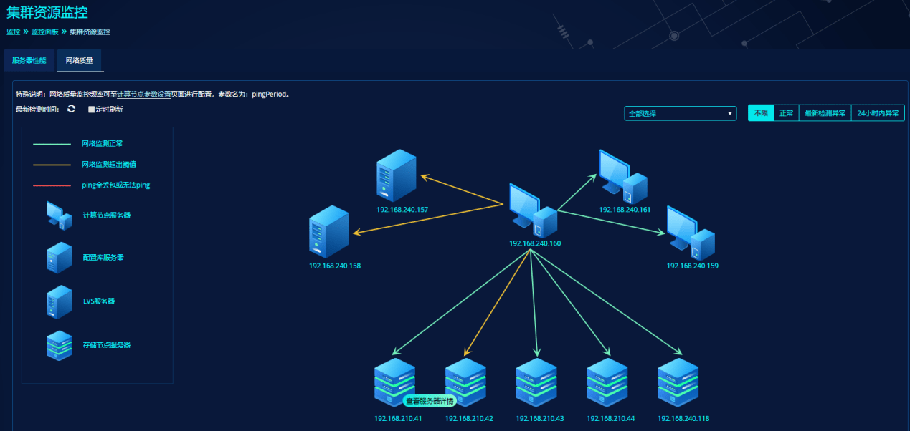

###### 网络质量概览

默认首次进入网络质量页面时，概览展示服务器网络质量状况优先级分别是：故障>预警>正常，且无论是手动刷新检测、切换拓扑图上的状态筛选标签、筛选服务器等操作，概览面板上的数据都不会自动刷新，除非点击对应的服务器，才会展示主计算节点到该服务器的网络质量情况。


概览说明：

- IP：前面为主计算节点IP，后面为被ping集群服务器IP，该IP有正常（绿色）、异常（橙色/红色）两种状态。异常判定条件：最近一次检测数据超过阈值（橙色）、无法ping通达或者丢包率100%（红色）
- 网络质量数据为最近一次检测数据与24小时内的数据统计，分为ping小包与ping大包两类。最近一次检测数据显示最大延迟、平均延迟、丢包率。若丢包率为100%即全丢包，max、avg为"-"显示；最大延迟、平均延迟、丢包率任意一值超过管理平台设置阈值则红色显示。24小时内的数据统计显示最大延迟>2ms、平均延迟>1ms、丢包率>0%在24小时内超过阈值的次数。
- 若最新一次检测网络质量时出现异常，则点击异常的服务器，可自动带出最新一次检测异常的时间，显示在监控质量概览页面，颜色呈"橙色"；若最近一次检测网络质量时为正常状态，也会带出该次检测时间，颜色呈"蓝色"。


###### 网络质量面板

网络质量面板显示对应的网络质量检测数据，默认展示当前24小时内的数据，不满24小时会隐藏拖动块，左右拖动可控制展示7天内的数据，鼠标移入折线图内可查看具体时间点的数据展示。点击左上角单选按钮，可切换ping包类型的数据展示，默认选择"ping小包"，点击"丢包率"、"平均延迟"、"最大延迟"进行隐藏或显示。该监控面板的数据采集频率与计算节点server.xml参数pingPeriod参数控制的采集频率一致，同时在网络质量故障的场景下，采集频率会自动提升为1分钟一次（网络质量故障的标准可参考pingPeriod相关参数功能描述）。


> !Note
>
> 网络质量监控显示的阈值数据，需根据[监控面板](#监控面板)设置->[集群资源监控](#集群资源监控)->网络质量进行设置，该开关默认关闭，关闭的情况下不进行数据阈值预警展示，若开关开启，页面展示依据阈值设置中的具体值进行显示以及判断，如下图：
>
> 
>
> 

###### 跨机房网络质量

跨机房网络质量概览、网络质量面板与单机房相同，不再赘述。

跨机房网络质量拓扑与单机房网络质量拓扑有区别。


**页面说明：**

中心机房主计算节点服务器需要ping中心机房除自身外的所有服务器以及容灾机房的所有服务器，所以中心机房的主计算节点服务器分别放置在上图拓扑图区域的中心机房与容灾机房内（如上图标记1）；

跨机房网络质量拓扑图只显示：中心机房计算节点服务器（包括主备计算节点）、容灾机房计算节点服务器（包括主备计算节点）中心机房配置库服务器、中心机房存储节点服务器、容灾机房配置库服务器、容灾机房存储节点服务器；

如果出现服务程序共用服务器时，按照单机房网络中描述的优先级划分服务器角色；

跨机房间的网络复制关系需根据中心机房与容灾机房存储节点主备搭建的复制关系进行网络质量链路连接（如上图标记2）；

中心机房当前主存储节点/配置库到容灾机房的目标备存储节点/配置库之间的网络质量情况，需配置SSH权限之后才能获取监控数据，页面提示如下；

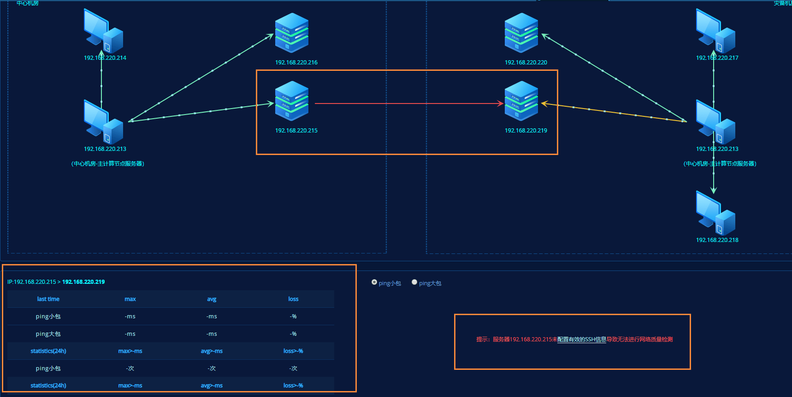

*8机房切换说明：**


如果发生机房切换，即当前容灾机房的计算节点提供服务，则仅展示容灾机房的网络质量监控状态， 中心机房所有组件均置灰显示不做任何监控。且不存在容灾机房到中心机房的网络连线，同时容灾机房的网络连线关系退化成单机房一致。

###### 网络质量邮件提醒

事件->通知策略->添加通知策略中新增网络质量监控项，在邮件设置中开启集群资源监控，设置监控项的通知频率，网络质量超过设置的阈值，将会发出异常邮件。


###### 网络质量信息收集

工具->信息收集功能增加网络质量检测数据。


检测的数据追加到对应服务器中的"服务器相关信息.txt"文件中，如下图：


### 监控信息管理

"监控信息管理功能"可通过管理平台执行计算节点管理端口（默认3325）相关命令，查看计算节点前后端连接之间的关系及其他有效管理信息等。

#### 使用前说明


多节点模式集群可选择执行查询命令的范围，默认选择全部计算节点。单节点与主备节点模式集群无需选择计算节点，默认在当前主计算节点上执行

命令需要在"查询命令"中选择才能执行。首次进入功能页面选择"查询命令"后，为了集群安全，需要使用具有SUPER权限的"[计算节点数据库用户](#数据库用户管理)"登录管理端口，登录成功后才能执行命令（show processlist命令除外）

使用的登录用户配置的"主机"必须包含管理平台所在服务器IP地址，否则无法登录

目前可在线查询的命令只包括实际管理端口命令中的一部分，具体可执行的命令以下拉框显示为准


登录后可以将命令下发到3323或3325端口执行，查询结果在页面中显示，并可以通过【刷新】按钮实时获取最新数据

#### 监控信息命令说明

##### 服务端连接信息`show processlist`

功能和MySQL的`show processlist`功能类似，用来查看当前计算节点服务端连接处理情况。


- 点击【刷新】则重新执行一次选中的查询命令，如果新增筛选条件则刷新会显示符合筛选条件的记录

- 可通过筛选项来过滤，筛选项user、db、command、state为精确匹配； host、info为模糊匹配。精确匹配搜索需要填写完整的匹配条件值。

  如user为jing01,user输入框需要填写完整的搜索条件jing01来筛选。

  

  若输入jing则筛选不到user为jing01的记录信息。

  

- 输入框填写搜索条件后，点击【搜索】按钮触发筛选查询。点击【重置】按钮自动将搜索框输入内容清除。

- `show processlist`查询后，鼠标移入表头会显示具体字段的解释信息

- 操作栏中的connection链接：鼠标悬停提示如下图所示，点击链接将取该连接的ID到命令`show @@connection`[（即前端链接状态）](#前端连接状态show-connection)中做筛选查询，注意：计算节点用户的登录信息若过期，需要重新登录

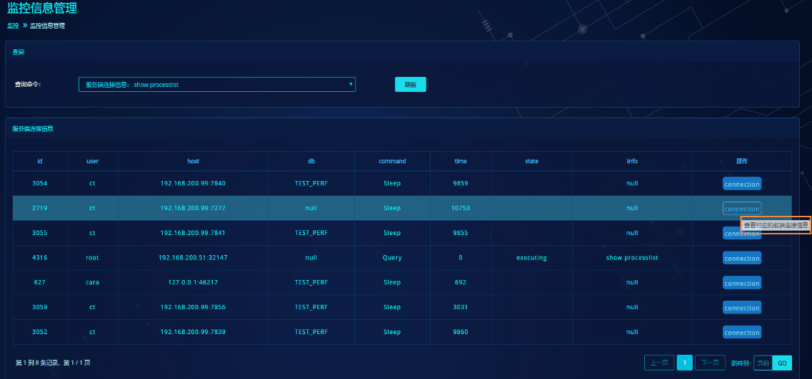

##### 前端连接状态`show @@connection`

显示计算节点前端连接（包括服务端、管理端）的连接状态。


- 该命令完成查询后，可选择连接ID，通过【关闭连接】按钮手动关闭对应连接

- 操作栏session链接：鼠标悬停显示提示如下图，可查看该connection ID的[当前会话信息show @@session](#当前会话信息show-session)，点击链接取该连接的connection ID值跳转到会话信息查看窗口


- 筛选的输入框与下拉框填充条件值后点击【搜索】按钮触发筛选动作，多个筛选都以and拼接

- 输入框内如果提示"模糊搜索"则后端用模糊匹配，如果提示"搜索"则为精准匹配


- 点击【重置】按钮，清空所有筛选框的值


- 点击【更多搜索】可扩展更多搜索字段：


##### 当前会话信息show @@session

显示计算节点当前会话处理信息。

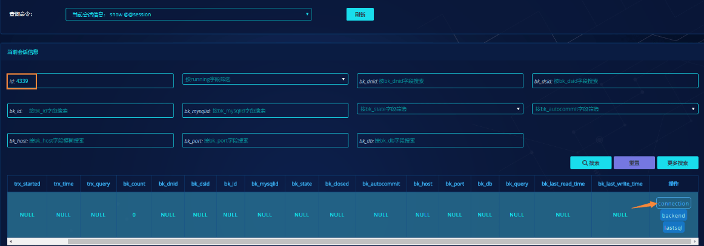

- 操作栏中connection、backend、lastsql链接：鼠标悬停提示："查看该会话ID对应的[前端连接状态](#前端连接状态show-connection)、[后端连接状态](#后端连接状态show-backend)、[最后执行的SQL](#borrowed连接最后执行的sql信息)。点击链接取该会话的关联信息跳转到对应查询命令

- 点击connection取该记录的id值跳转到`show @@connection`


- 点击backend取bk_id字段值跳转到`show @@backend`


- 点击lastsql取bk_id字段值跳转到`show @@lastsql`


##### 后端连接状态`show @@backend`

显示计算节点的后端（即计算节点与存储节点之间）的连接情况。


- 该命令执行后，可通过面板中【重建连接池】按钮重建后端连接，同管理端`rebuild @@pool`命令，执行后提示："重建成功/失败"

- 操作栏中session、lastsql链接：鼠标悬停提示提示："查看对应的会话信息、查看最后执行SQL"，点击链接取该后端连接的id字段值到命令`show @@session`、`show @@lastsql`中进行筛选。（`show @@session`记录中bk_id与之对应、`show @@lastsql`记录中id与之对应）。点击操作栏中session按钮：


- 点击操作栏中lastsql按钮：


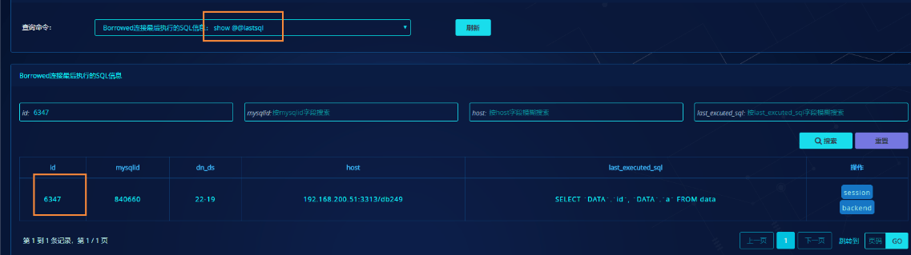

##### 数据节点信息`show @@datanode`

显示当前集群中所有数据节点的信息：查询结果信息包含："节点的当前数据源信息"、"活动的连接数"、"节点状态"等信息。


##### 存储节点信息`show @@datasource`

显示当前集群中所有存储节点的信息：查询结果包含："主机IP地址"、"端口"、"物理数据库名"、"数据源不可用原因"等。


##### 后端心跳状态`show @@heartbeat`

显示当前集群后端心跳状态：查询结果数据源类型、主机地址、物理数据库名、心跳状态、心跳周期等。


##### 同步延迟情况`show @@latency`

显示同步延迟情况，查询结果包含 "当前数据源路径"、"备库数据源路径"、"同步延迟时间(单位ms)"。


##### 缓冲池状态`show @@bufferpool`

查询缓冲池状态，查询结果包含 "线程名"、"缓冲池大小"、"线程从本地缓存池申请缓存次数"等。


##### 处理线程信息`show @@processor`

显示当前处理线程信息：查询结果包含 "线程名"、"前/后端接收字节数"、"前/后端发送字节数"等 。


##### 线程池状态`show @@threadpool`

显示当前线程池状态：查询结果包含 "线程池名称"、"线程池大小"、"活跃线程数"等,鼠标移动到列名上会有中文提示。


##### 长事物信息`show @@longtransaction`

显示长事务信息，查询结果包含 "主机IP地址"、"端口"、"长事物id"等,鼠标移动到列名上会有中文提示。

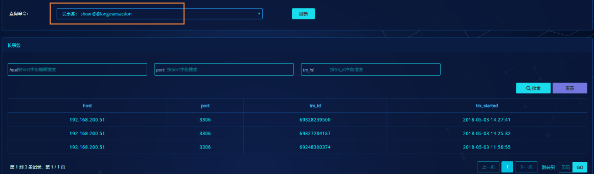

##### 计算节点服务器状态`show @@server

显示计算节点服务器状态：查询结果包含计算节点服务器的运行启动信息，有："内存使用情况"、"读写模式"、"启动用时"、"高可用使用角色"等,鼠标移动到列名上会有中文提示。


##### Borrowed连接最后执行的SQL信息

查询Borrowed连接最后执行的SQL信息，通常用于查看连接异常信息时使用，结果包含："最后执行的SQL语句"、"后端mysql连接id"、"主机信息"、"节点信息"等。


##### 获取conf目录下文件及最后修改的时间说明

显示配置文件的修改记录。


### JOIN关系分析

"JOIN关系分析功能"是通过解析查询日志（即[操作日志智能分析](#操作日志智能分析)表格数据）中的SQL语句，绘制出当前业务场景中的表的JOIN关系图，从而让用户对当前业务的JOIN情况有一个全局的掌控。同时提供跨库有交叉JOIN关系图，用户可关注当前跨库有交叉JOIN情况,针对性优化分片方案或改写SQL查询语句。

#### 使用前提

查看JOIN关系图需要满足如下前提：

- 当前用户拥有[操作日志智能分析](#操作日志智能分析)菜单权限
- 当前计算节点参数"允许JOIN查询"为开启状态
- 当前计算节点参数"统计SQL执行情况"为开启状态

#### JOIN关系图

选择一个逻辑库和表名称后，可查看所有JOIN关系图（如下图）或跨库有交叉JOIN关系图。管理平台在每天零点刷新解析结果，也可点击手动刷新解析结果。

**JOIN关系图中的顶点与边说明：**

顶点表示表，根据表类型分为四种颜色（）

顶点A到顶点B之间的边表示表A与表B之间的所有／跨库有交叉JOIN（根据过滤选项）关系；黄色的边表示表之间存在因关联字段不是分片字段等原因，属于跨库有交叉JOIN的查询语句

表的总JOIN查询次数越多，顶点的圆圈越大；鼠标在顶点上悬停时显示表名称与总所有／跨库有交叉JOIN（根据过滤选项）次数

鼠标滚轮缩放JOIN关系图，图上始终跟随顶点显示总JOIN次数最多的十个表的表名称

暂无JOIN关系的表以散点的形式显示在图上：假设当前选择的逻辑库下的表都没有JOIN查询或跨库有交叉JOIN查询（根据过滤选项）时，则选择的表会以散点形式显示

点击顶点显示[JOIN关系详情](#join关系详情)


**跨库有交叉JOIN查询判断逻辑：**

不满足以下条件的JOIN查询，被判断为跨库有交叉JOIN查询（如下图）：

- 若JOIN查询含两个以上水平分片表，这些表必须分片类型相同，节点分布相同，且关联条件中存在使用各自的分片字段进行等值关联，如a.shardkey_a=b.shardkey_b，这些表被这样的等值关联联通
- 父子表之间的JOIN查询必须存在用join_key进行关联的等值关联条件
- JOIN查询中存在全局表，这些全局表所在节点必须包含所有其他分片表、子表所在的节点
- 若一个JOIN查询中仅有垂直分片表，这些表的节点都必须在同一个节点中


> !Note
>
> 管理平台的判断逻辑当前属于简化逻辑，和具体某个版本的HotDB server相比，在复杂、特殊的情况下判断结果可能不同。例如以下两类JOIN查询，管理平台统一判断为跨库有交叉JOIN查询，但根据值范围可能会是单库查询：

1. 关联字段包含所有表的分片字段，且为等值判断，例如：

   ```sql
   select * from table01 join table02 on table01.shardcol=1 and table02.shardcol=2
   ```

   shardcol为两表的分片字段，若数据值table01.shardcol=1与table02.shardcol=2存储的节点相同，则该JOIN查询为单库查询。

2. 两表关联查询时，其中一个表为垂直分片表，且正好存储在另一个表关联查询条件节点上，例如：

   ```sql
   select * from table01 join table02 on table02.i=10;
   ```

   若table02.i=10的所有数据存放在数据节点dn_01上，table01为垂直分片表，且也存储于dn_01上，则该JOIN查询为单库查询。

**跨库有交叉与跨库无交叉的区别：**

- 跨库有交叉：JOIN查询需要跨数据节点做匹配计算
- 跨库无交叉：JOIN查询需要下发到多个数据节点，但是只需在数据节点内做计算，无需数据节点与数据节点间的交叉计算

#### JOIN关系详情

点击顶点显示所有／跨库有交叉JOIN关系详情。此文档以所有JOIN关系详情为例，表格信息格式说明如下：

- **JOIN关系表：**与当前表有JOIN关系的表。表名称颜色根据表类型与顶点颜色一致（）。点击表名称，跳转到该表的JOIN关系详情页面
- **当前表关联字段：**JOIN查询语句中当前表的关联字段。多个关联字段用括号表示如（a,b,c）
- **JOIN关系表关联字段：**JOIN查询语句中JOIN关系表的关联字段。多个关联字段用括号表示如（a,b,c）
- **执行情况：**合并显示JOIN关系表、当前表关联字段和JOIN关系表关联字段完全相同的JOIN查询语句。点击【点击展开】查看被折叠的所有JOIN查询语句的执行详情
- **总查询次数：**同类JOIN查询语句累加的总查询次数
- **橙色的角标：**此关联字段或此组关联字段没有添加索引，请综合此字段数值分布、字段类型和长度、查询执行频率、查询过滤条件、表中现有索引等因素，决定是否调整索引

> !Note
>
> **关联字段说明：**该表中用于JOIN关联查询的字段，例如：SELECT * FROM Persons INNER JOIN Orders ON Persons.id = Orders.oid，则id为Persons的关联字段，oid为Orders的关联字段


点击【点击展开】查看被折叠的所有JOIN查询语句的执行详情。点击计算节点平均时间下的查看详情将跳转到[操作日志智能分析页面](#操作日志智能分析)。


## 报表

将集群数据量报表和吞吐量报表、连接情况报表进行可视化的展示。提供图形模式和表格模式，可通过不同维度查看数据报表。

### 集群数据量

显示集群中所有成员的数据节点、逻辑库和表的数据量大小分布，有图形模式和报表模式。

#### 图形模式

图形模式有四个维度，默认显示集群中所有成员的数据量报表，也可以选择显示数据节点、逻辑库和表的数据量报表。


- 默认显示计算节点集群中所有成员的数据量，分为4个图形区。4个图形区数据统计方式统一，统计单位可选择[数据行数或数据容量](#统计单位说明)。

**(1) 集群数据量变化趋势图**


- 此图展示整个计算节点集群中数据量在一定时间内的变化趋势
- 图形为折线图，两个坐标轴分别为时间和数据量
- 时间范围选项有最近一年、最近三个月、最近一个月、最近一周、最近一天、自定义。 当时间范围小于7天时，趋势图是以每小时采集的数据显示，超过7天时以每天23点采集的数据显示
- 集群数据量变化趋势图可以放大显示

**(2) 集群数据量分布图**


- 此图展示某个时间点时，整个计算节点集群中数据量在数据节点维度上的分布情况
- 图形支持柱图和饼图，可以选择切换。坐标轴为数据节点和数据量
- 支持放大图形到全屏
- 允许筛选节点
- 点击图上某个柱形或者扇形，可以进入对应数据节点层面的数据量报表
- 柱状图支持排序功能，可以选择升序或降序

**(3) 逻辑库数据量分布图**


- 此图展示某个时间点时，整个计算节点集群中数据量在逻辑库维度上的分布情况
- 图形支持柱图和饼图，可以选择切换。坐标轴为逻辑库和数据量
- 支持放大图形到全屏
- 允许筛选逻辑库
- 点击图上某个柱形或者扇形，进入对应逻辑库层面的数据量报表
- 柱状图支持排序功能，可以选择升序或降序

**(4) 集群表数据量分布图**

[](assets/hotdb-management/image336.png)


- 此图展示某个时间点时，整个计算节点集群中数据量在表维度上的分布情况
- 图形支持柱图和饼图，可以选择切换
- 表名以`[逻辑库名].[表名]`的方式显示，通常比较长，因此柱图采用横向
- 支持放大图形到全屏
- 允许筛选表
- 点击图上某个柱形或者扇形，进入对应表层面的数据量报表
- 柱状图支持排序功能，可以选择升序或降序

#### 表格模式

集群数据量除了使用[图形模式](#图形模式)表示外，还可以通过[表格模式](#表格模式)查看整个集群中每张表在每个数据节点下的数据分布情况。


- 界面记录可通过【导出】按钮将表数据量信息导出到本地，目前支持导出格式为"CSV"或"XLS"的文件
- 统计方式分为：[数据行数或数据容量](#统计单位说明)。统计方式为数据行数时1K=1000,1M=1000*1000；统计方式为数据容量时 1KB = 1024B，1MB = 1024B * 1024以此类推
- 数据量统计时，若涉及全局表，以逻辑库为维度计算时，统计所有数据节点数据量之和，以数据节点为维度计算时，各个数据节点数据量分别统计，以表为维度计算时，统计该表所在数据节点的平均数据量

#### 统计单位说明

目前集群数据量支持数据行数和数据量两种统计单位。数据行数统计来源于information_schema.tables中的table_rows行数总和，因MySQL该参数自身即为估计值，故数据行数也非精确数据；数据量统计来源于information_schema.tables中的data_length数据量总和，因该参数是基于已分配的数据块，受数据块中数据填充率变化的影响，故不能绝对精确的反映真实数据量。

若需要知道真实数据行所占大小，需要用户根据数据类型不同，自行计算每行大小，再相加。这样的计算方式需要全表扫描所有数据，成本较高，存在影响数据库运行的可能性。

### 计算节点吞吐量

计算节点吞吐量为前端应用发往计算节点的操作量统计，一般用SELECT、UPDATE、DELETE、INSERT、OTHER五种类型分类用户操作。

#### 图形模式

图形模式有四个维度，可显示整个集群的吞吐量情况，也可以选择显示操作类型、逻辑库和表的吞吐量情况。


- 各吞吐量图表的统计刻度与统计方式一致
- 统计刻度可选择：月、日、小时、分
- 统计方式可选择：总吞吐量、平均吞吐速率

**(1) 计算节点吞吐量变化趋势图**


- 展示整个计算节点集群中吞吐量在一定时间内的变化趋势。以及各个操作在总吞吐量中的占比
- 图为堆积图，两个坐标轴分别为时间和吞吐量。面积中不同色条表示不同操作的吞吐量
- 时间范围包含：最近一个月、最近三个月、自定义
- 鼠标悬停在某个点时，显示各个操作的吞吐量数据，单击图上某个点时，将后三张图的时间点与该时间点设置成一致

**(2) 计算节点吞吐类型对比图**


- 描绘某个时间段内，整个计算节点集群吞吐量中各个操作的占比情况
- 支持柱图和饼图，默认为饼图，可以选择切换。坐标轴为操作类型和吞吐量
- 饼图同时显示百分比和具体数字
- 支持放大图形到全屏
- 柱状图支持排序功能，可以选择升序或降序

**(3) 逻辑库吞吐量对比图**


- 展示某个时间段内，整个计算节点集群中吞吐量在逻辑库维度上的对比情况
- 图为堆积柱图，各个层均显示数值。坐标轴为逻辑库和吞吐量
- 支持放大图形到全屏
- 允许筛选逻辑库
- 点击图上某个柱型时，进入对应[逻辑库维度的吞吐量报表](#逻辑库维度吞吐量报表)
- 柱状图支持排序功能，可以选择升序或降序，可以按照各个吞吐类型进行排序

**(4) 表吞吐量对比图**


- 展示某个时间段内，整个计算节点集群中吞吐量在表维度上的对比情况
- 图为堆积柱图，各个层均显示数值。坐标轴为表和吞吐量
- 表名以`[逻辑库名].[表名]`的方式显示
- 支持放大图形到全屏，允许进行筛选表显示
- 柱状图支持排序功能，可以选择升序或降序，可以按照各个吞吐类型进行排序
- 点击图上某个表柱型时，进入对应[表维度的吞吐量报表](#表维度吞吐量报表)

#### 逻辑库维度吞吐量报表


逻辑库维度分为3个图形区。3个图形区统计时间刻度和统计方式一致，支持逻辑库筛选，右上角有【返回计算节点视图】吞吐量报表按钮

#### 表维度吞吐量报表


表维度分为3个图形区。3个图形区统计时间刻度和统计方式一致，支持通过选框切换表和逻辑库，切换逻辑库时默认切换到该逻辑库下id最小的表，右上角有返回计算节点视图维度吞吐量报表按钮

#### 表格模式

计算节点吞吐量除了使用[图形模式](#图形模式)展示外，还可以通过[表格模式](#表格模式)查看。包括整个集群每张表的SELECT、UPDATE、DELETE、INSERT、OTHER五种类型的操作次数。


- 统计方式包含：总吞吐量、平均吞吐速率
- 统计刻度：月、日、小时、分
- 统一单位包含：自适应、次、K、M、G
- 导出文件支持CSV、XLS
- 表名以`[逻辑库名].[表名]`的方式显示

### 数据节点吞吐量

数据节点吞吐量为计算节点发往存储节点的操作量统计，一般用SELECT、UPDATE、DELETE、INSERT、OTHER五种类型分类计算节点操作。

#### 图形模式

数据节点吞吐量图形模式包含数据节点吞吐总量对比图、数据节点吞吐量变化趋势、集群吞吐类型对比图、逻辑库吞吐量对比图、表吞吐量对比图五个维度。


**(1) 数据节点吞吐总量对比图**


- 展示各个节点吞吐总量，只计算当前数据节点下主存储节点的吞吐量
- 操作量从计算节点启动开始累计，数据存储在管理平台配置库内。默认数据保留365天，也可以在管理平台配置文件application.properties中调整"hotdb.management.dataExpired.day"参数
- 可选择操作类型，查看各个节点不同操作类型的吞吐量
- 支持放大图形到全屏

**(2) 数据节点吞吐量变化趋势**

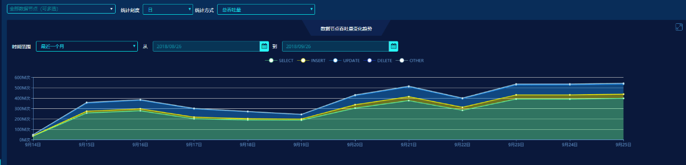

- 展示所有数据节点吞吐量在一定时间内的变化趋势，以及各个操作在总吞吐量中的占比
- 图为堆积图，两个坐标轴分别为时间和吞吐量。面积中不同色条表示不同操作的吞吐量
- 时间范围包含：最近一个月、最近三个月、自定义
- 支持放大图形到全屏
- 鼠标悬停在某个点时，显示各个操作的吞吐量数据

**(3) 集群吞吐类型对比图**

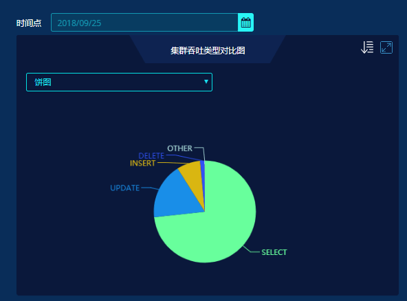

- 展示某个时间段内所有数据节点的吞吐量中各个操作的占比情况
- 支持柱图和饼图，默认为饼图，可以选择切换。坐标轴为操作类型和吞吐量
- 饼图同时显示百分比和具体数字
- 支持放大图形到全屏
- 柱状图支持排序功能，可以选择升序或降序

**(4) 逻辑库吞吐量对比图**


- 展示某个时间段内所有数据节点节点的吞吐量在逻辑库维度上的对比情况
- 图为堆积柱图，各个层均显示数值。坐标轴为逻辑库和吞吐量
- 超过8个左右的逻辑库，会显示拖拉框
- 支持放大图形到全屏
- 允许筛选逻辑库
- 柱状图支持排序功能，可以选择升序或降序，可以按照各个操作类型进行排序

**(5) 表吞吐量对比图**

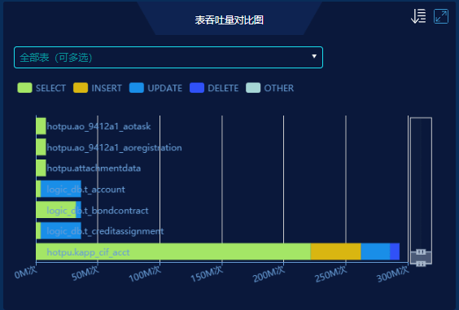

- 展示某个时间段内所有数据节点的吞吐量在表维度上的对比情况
- 图为堆积柱图，各个层均显示数值。坐标轴为表和吞吐量
- 表名以`[逻辑库名].[表名]`的方式显示
- 支持放大图形到全屏
- 允许筛选表
- 全局表SELECT吞吐量只统计一个节点，INSERT、UPDATE、DELETE操作统计所有节点
- 柱状图支持排序功能，可以选择升序或降序，可以按照各个操作类型进行排序

#### 表格模式

数据节点吞吐量除了使用[图形模式](#图形模式)展示外，还可以通过[表格模式](#表格模式)查看。包括整个集群每张表在每个节点中的SELECT、UPDATE、DELETE、INSERT、OTHER五种类型的操作次数。


- 统计方式包含：总吞吐量、平均吞吐速率
- 统计刻度：月、日、小时、分
- 统一单位包含：自适应、次、K、M、G
- 导出文件支持CSV、XLS
- 与全局表相关的吞吐量根据吞吐类型分别计数，SELECT仅统计一个节点，INSERT、UPDATE、DELETE吞吐统计所有节点，若一条语句涉及跨节点吞吐，则各个节点吞吐次数都统计

### 计算节点连接

计算节点连接报表功能可查看所有与计算节点相关的连接的信息。记录了前端应用程序和用户访问的相关信息，例如连接次数，连接时长，操作次数信息。

#### 图形模式

图形模式主要显示当前计算节点总应用连接数、三个TOP1连接（连接时长最长的连接、操作次数最多的连接、连接次数最多的连接）、连接总时长占比、连接总次数占比、操作次数占比、连接前端应用IP分布图、连接用户分布图、连接逻辑库分布图。


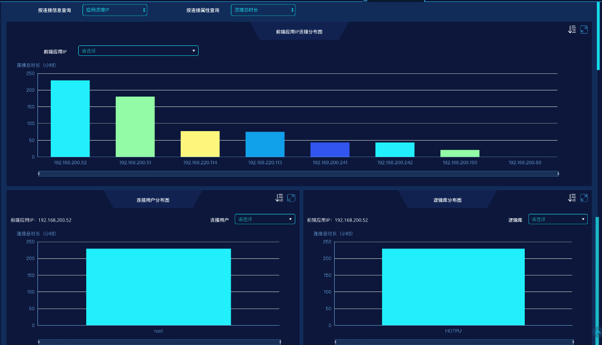

可按时间范围筛选所选范围内的连接情况，默认显示最近三个月的所有连接信息。该时间范围对图形模式下所有图标有效

**(1) 总应用连接数**

显示当前连接计算节点的应用连接个数，由前端应用IP+连接用户+逻辑库（真实use了逻辑库）确定一条连接信息

**(2) 连接时长最长的连接**

展示当前所有连接中连接计算节点时长最长的一条连接信息

时长计算方式：在筛选时间范围内对相同的连接（IP+连接用户+逻辑库,一致的）进行连接时长累加。若存在某条连接在查询时段范围内仍未结束连接则取查询范围结束的那个时间作为该连接的临时结束时间进行统计

> !Note
>
> 因统计单位以IP+逻辑库+连接用户为一致的算作一个连接，所以可能出现A连接时长（该连接同时有1000个并发且每个并发连接时长为1分钟）会大于B连接时长（该连接只有一个并发且这个并发连接时长为一小时）的情况

**(3) 操作次数最多的连接**

展示当前所有连接中操作次数（发往计算节点的SQL操作）最多的连接信息

操作次数计算方式：在筛选时间范围内对相同的连接（IP+连接用户+逻辑库,一致的）进行操作次数累加。若存在某条连接在查询时段范围内仍未结束连接则取查询范围结束的那个时间作为该连接的临时结束时间进行统计

**(4) 连接次数最多的连接**

展示当前所有连接中连接计算节点（连接从建立到结束为1次）次数最多的连接信息

连接次数计算方式：在筛选时间范围内对相同的连接（IP+连接用户+逻辑库,一致的）进行累加，得出连接次数最多的连接信息。若存在某条连接在查询时段范围内仍未结束连接则该条连接仍会作为1次被统计进来

**(5) 连接总时长占比**

展示在查询时间范围内不同连接时长范围内的连接数量占比情况

连接总时长占比计算方式：在查询时间范围内的连接数据中取连接时长（相同连接累加值）最高和最低记录的，再用最高纪录的时长数减去最低纪录的时长数得出的差值再均分5份，计算每个区间内连接相对总连接数的占比情况

> **例如：**
>
>
> 时间区间选择：2018-10-10 10：00 \~ 2018-10-11 10：00 ，
>
> 相同连接信息合并后，总应用连接数：50
>
> 最大连接时长，40s ，最小连接时长：5s， 其差值5份均分（5-11s ，12-18s，19-25s，26-32s，33-40s），即5个等比例的维度（最大连接次数、最大操作次数亦同，其差值5份均分）,
>
> 5-11s 连接：5个，占比5➗50=10%
>
> 12-18s，20个，占比20➗50=40%
>
> 19-25s：8个，占比8➗50=16%
>
> 26-32s：7个，占比7➗50=14%
>
> 33-40s：10个，占比20➗50=20%
>
> 以此类推，根据每个连接信息的属性，得出占比

**(6) 连接总次数占比**

展示在查询时间范围内不同连接次数范围内的连接数占比情况

连接次数占比计算方式：在查询时间范围内的连接数据中取连接次数（相同连接累加值）最多和最少记录的，再用最多纪录的次数减去最少纪录的差值再均分5份，计算每个区间内连接数的占比情况

**(7) 操作次数占比**

展示在查询时间范围内不同操作次数范围内的连接数占比情况

操作次数长占比计算方式：在查询时间范围内的连接数据中取操作次数（相同连接累加值）最多和最少记录的，再用最多纪录的次数减去最少纪录的差值再均分5份，计算每个区间内连接数的占比情况

**(8) 前端应用IP连接分布图**

展示查询时间范围内连接过计算节点的应用连接IP。当IP地址过多时可通过底部拖动条进行拖动。支持通过放大按钮全屏查看以及排序查看IP分布信息

X轴默认显示"应用连接IP"，可通过"按连接信息查询"筛选框将横坐标切换成"连接用户"或[逻辑库](#逻辑库)维度查看。修改X轴查看维度时，图表的标题也会对应进行切换

Y轴默认显示"连接总时长"，可通过"按连接属性查询"筛选框将纵坐标切换成"连接总次数"或"操作次数"维度查看。切换筛选框会联动变化底部二级图表Y轴显示维度

鼠标点击图标中的具体柱体可联动底部二级图表"连接用户分布图"、"逻辑库分布图"展示效果。例如点击应用连接IP"192.168.200.30"，则底部"连接用户分布图"显示选定IP使用过的连接用户，"逻辑库分布图"显示选定IP，USE过的逻辑库

**(9) 连接用户分布图**

默认展示第一个应用连接IP（当页面第一个柱状图X轴为"应用连接IP"维度时）的用户分布情况。若想查看其它应用连接IP用户分布情况可点击上方具体IP的柱形

可对显示的连接用户进行筛选查看，也可通过排序放大的方式展示想要查看的信息

此模块图表标题会随筛选框"按连接信息查询"的切换而变化

**(10) 逻辑库分布图**

默认展示第一个应用连接IP（当页面第一个柱状图X轴为"应用连接IP"维度时）的逻辑库分布情况，即选定IP连接过的逻辑库

可对显示的连接用户进行筛选查看，也可通过排序放大的方式展示想要查看的信息

此模块图表标题会随筛选框"按连接信息查询"的切换而变化

#### 表格模式

除了通过图形模式展示连接信息以外，还可以通过表格模式查看每一条连接信息的详细情况，并支持导出到本地保存


- 显示的记录为具体每一组连接计算节点的前端应用信息（IP+连接用户+逻辑库标识），相同的连接信息会聚合显示成一条
- 多节点模式集群支持查询每个连接，具体是通过哪个计算节点服务连接到逻辑库的
- 报表中所有数据默认最多保存一年，超过1年的连接数据信息会被自动清除。
- 表格模式中可以查看到每条连接当前存活状态

## 管理

管理菜单主要囊括对业务数据进行管理的功能，例如对数据的备份恢复或执行业务表的DDL语句等操作。

### 数据备份

数据备份为对业务数据进行备份的功能，以在数据丢失或损坏的情况下有数据备份能还原。目前数据备份功能需要依赖于热璞数据库自研的备份工具HotDB Backup，且目前只支持逻辑备份。

容灾模式说明：集群开启容灾模式时，数据备份相关逻辑说明请结合[跨机房容灾部署](cross-idc-disaster-recovery-deployment.md)文档中的[数据备份](#数据备份)章节。

#### HotDB Backup介绍

MySQL自身的mysqldump工具是通过单线程工作依次导出多个表，缺乏并行的机制，这就使得它无法迅速地备份数据。mydumper 作为一个实用工具，能够良好支持多线程工作，且可以在并行多线程的表中读入数据并同时写到不同的文件里，这使得它在处理速度方面快于传统的mysqldump 。mydumper的特征之一是在处理过程中需要对表加以锁定，因此如果我们需要在工作时段执行备份工作，就会引起 DML 阻塞。在HotDB Server中也有一个类似于mydumper的本地程序，每个数据节点使用该程序，监听来自HotDB-Management的请求并完成数据备份，该程序叫："HotDB Backup"。

#### 安装说明

使用HotDB Management的数据备份功能需要在被备份的存储节点所在服务器上安装HotDB Backup程序。关于HotDB Backup的安装部署请参照[安装部署](installation-and-deployment.md)文档中的备份程序部署章节说明。

#### 手动备份

**(1) 发起备份**


点击"管理->数据备份->备份任务->【发起备份】"可手动发起一次备份任务

**(2) 选择备份方式**


- **逻辑库：**备份以逻辑库为单位进行备份，可一次选择一个或多个逻辑库进行备份
- **备份类型：**分为完整备份和增量备份。"完整备份"是备份当前逻辑库中的所有数据，"增量备份"是在上一次完整或增量备份的基础上继续备份新的binlog。注意：第一次增量备份时，必须保证选择备份的逻辑库之前已有完整备份，否则无法发起增量备份
- **同时备份配置库：**即发起备份时连带做一次配置库数据备份，效果同在"[集群元数据备份和还原](#集群元数据备份还原)"中的手动备份
- **是否计算文件的MD5值：**默认勾选，主要记录备份文件的MD5值，方便在数据恢复时对比文件MD5值来校验数据的完整性与一致性。

**(3) 备份设置**


- **同时备份上一次备份到现在的binlog：**默认勾选，用于备份上一次完整备份到当前完整备份的binlog。注意：这是一个保险措施，但在第一次进行完整备份时会找不到上一次完整备份，故该选项第一次完整备份时无意义
- **本地备份根目录：**即备份文件存储在各个存储节点所在服务器的本地目录，该目录需要提前在各个节点所在的服务器创建好，且要求各个服务器目录一致，否则备份失败，备份失败信息提示：Failed to create backup directory

> !Tip
>
> 当服务器因为硬件规格、配置方式不同等原因，备份实际存储的目录不同时，可以利用软链接统一备份使用的目录

- **压缩方式：**控制备份文件是否压缩与选择压缩方式，选项分为：不压缩、ZLIB流式压缩、LZ4压缩。LZ4压缩为先输出文件再调用系统命令执行压缩操作
- **加密方式：**控制备份文件是否加密与选择加密方式，选项分为：不加密、3DES、AES。选择某种加密方式时，需自行输入加密密码，该密码用于数据恢复时解密备份文件
- **备份文件格式：**控制备份文件的数据格式，分为SQL、MySQL CSV、标准CSV，默认使用SQL形式。注意：标准CSV格式主要用于和其他系统进行数据交换，例如导出数据到Hadoop，该格式暂不支持恢复
- **备份语句选项：**当备份文件格式为SQL时，可以选择备份的SQL是insert 、insert ignore还是 replace形式
- **同时备份到远程路径：**可将备份文件传送至远程服务器中。默认不勾选。备份到远程服务器时会将所有备份文件汇合传到远程服务器指定目录中
- **远程复制方式分为：**SCP 、RSYNC，推荐使用SCP方式。如果使用RSYNC，需要自行在远程服务器上部署
- **远程复制IP、用户、密码：**需按实际远程服务器已有信息填写
- **远程备份文件根目录：**存放备份文件的目录，需按实际填写并需要提前创建好

**(4) 备份任务记录**


已完成或正在执行的备份任务会显示在"备份任务"页面

- **备份序号：**每次备份任务的唯一标识
- **任务类型：**显示备份任务是手动备份还是定时备份
- **备份类型：**显示备份任务是增量备份还是完整备份
- **逻辑库：**显示备份任务是哪几个逻辑库
- **开始时间：**显示备份任务开始时间
- **结束时间：**显示备份任务结束时间，若备份任务未完成，则会显示预计完成时间
- **总耗时：**显示备份任务耗时时间
- **备份状态：**显示当前备份任务的进行状态，分备份失败、备份失效、备份完成、备份中、取消中、手动取消、自动取消、延迟完成。正在执行的备份任务，会以进度条的形式显示备份进度
- **操作：**点击"详情"，可显示当前备份任务的备份详情，失败原因等

备份失败、备份失效会在备份表格分别以、 标记显示，鼠标悬停后会显示具体原因

点击【删除记录】可删除页面的备份记录，也可以勾选是否同时删除服务器中的备份文件，但不会删除远程服务器上的备份文件

#### 备份计划

备份计划可为HotDB Management设置定时备份任务，设置好定时备份计划后无需人为手动发起备份任务，由定时计划按时执行备份任务。


**(1) 添加备份计划**


点击HotDB Management中"管理->数据备份->备份计划->【添加新计划】"可进入添加备份计划页面

- **备份计划名称：**用户可自行设定，只要求不与已有备份计划重名即可
- **逻辑库：**定时备份时需要备份的逻辑库，可选择单个或多个逻辑库备份
- **完整备份周期：**用户可根据实际业务需要选择完整备份的周期
  选择完"完整备份周期"后，可对完整备份进行详细设置如"周期时间：具体完整备份的日期"、"备份窗口期：备份发起的时间范围"、"超时时间：指备份任务超过设置时间未完成备份后自动取消备份，需要勾选后才能生效"
- **增量备份周期：**默认勾选，不勾选则备份计划只执行完整备份，无增量备份
  可设置增量备份执行时间，默认完整备份4个小时后执行一次增量备份
- **备份文件保留：**可设置已备份的文件在服务器目录中的存放时长，默认7天

> **"备份文件保留"注意事项：**
>
> 1. 文件保留周期只对定时备份任务生效（即手动发起的备份，备份文件不会删）
> 2. 文件保留周期只是备份文件的保留时间，删除时备份列表记录不会自动删
> 3. 该定时任务每天零点执行，备份删除时会保留一个全备，即不完全符合时间（如：保留周期为24小时，则会找一个大于等于24小时的完整备份A，删除A之前所有的自动备份文件）

- **是否添加例外：**可在定时备份计划中设置不进行备份的例外情况。例如：定时计划每天凌晨执行一次完整备份，每4小时执行一次增量备份，但如果设置x年x月x号为例外，则该日不执行备份计划
- **备份设置：**具体说明请参照"[手动备份](#手动备份)"中的"备份设置"描述

**(2) 备份计划特殊设置说明**

备份计划可设置超时取消，或添加例外（不执行备份计划）

已添加的备份计划，可对"下一次执行的备份任务"进行推迟进行。点击"管理->数据备份->备份计划->页面记录【延迟下一次备份任务时间】"即可设置延迟执行时间

设置完【延迟下一次备份任务时间】后程序会自动校验"上一个备份任务完成时间至下一个任务延迟时间之间是否有间隔备份任务"，如果没有间隔则直接提示修改成功，若有间隔备份会弹出信息告示用户 如下图：


点击【统一延迟并保存】则后台将间隔任务设置为延迟状态，当执行完延迟的备份任务后，间隔任务按照设置的备份周期时间依次执行，点击【自动取消并保存】后间隔任务默认取消，后台不执行备份任务

延迟的备份任务到点执行后页面记录的备份类型为 "延迟完成"

#### 备份特殊说明

备份任务开启时，如果被备份的存储节点中存在长事务（即长时间未提交的事务及执行时间很久的操作语句），则备份不会立即发起，将尝试等待以规避此类情况，或重试到一定次数后再进行备份

若当前存储节点页面未配置备份用户账号，备份会使用存储节点连接账户进行备份，备份完成则会提示："当前备份使用的是连接账户，请在存储节点配置页面添加专用的备份账户"

备份用户创建语句参考：

```sql
GRANT SELECT,INSERT,UPDATE,DELETE,CREATE,DROP,INDEX,ALTER,RELOAD,PROCESS,REFERENCES, SUPER,LOCK TABLES,REPLICATION SLAVE,REPLICATION CLIENT,TRIGGER,SHOW VIEW,CREATE VIEW,CREATE ROUTINE,ALTER ROUTINE,EVENT ON *.* TO 'DBBACKUP'@'127.0.0.1' IDENTIFIED BY 'DBBACKUP';
```

> !Note
>
> 使用HotDB Management部署的存储节点实例默认会生成DBBACKUP用户，无需特殊创建。

所有备份文件以备份任务ID区分存于备份目录下，文件目录依次为：备份任务ID -> 存储节点名称 -> 物理库名称 -> 表数据/表定义语句。每次备份除数据外，会同步备份`my.cnf`、账户和权限数据，存放在存储节点同级目录下，数据与表定义语句拆分存于存储节点下级目录下

备份任务在当前节点正在使用的主存储节点进行，存储节点发生切换时，备份对象会随着切换。但是由于只对主库进行了备份，从库没有备份，故从库上的增量备份无法进行，需要等到有完整备份后才可以增量备份

`my.cnf`文件如果备份，需保证该文件存在于如下任一路径中：`/etc/my.cnf`、`/etc/mysql/my.cnf`、`/usr/etc/my.cnf`，否则无法备份该配置文件

HotDB-Management关闭或重启，无需重启HotDB-Backup

导致备份失败的原因包括但不限于：

- 备份文件目录不存在
- HotDB-Backup程序未部署或未启动
- 备份使用的存储节点用户权限不足
- 有其他备份任务正在进行
- 远程备份的用户、密码、服务器IP信息错误
- 被备份节点所在的服务器未安装RSYNC
- 被备份服务器无可用磁盘空间或磁盘空间不够
- 存储节点无法连接

导致备份失效的原因包括但不限于：

- 修改存储节点名称，主机名，端口号，物理库
- 对未定义的表修改表名称，逻辑库，表类型，分片字段，分片方式，数据节点
- 修改已运用在表上的分片规则，增加路由信息（即修改已定义／未定义表的分片规则）
- 修改逻辑库的默认节点（即影响自动建表的默认节点）
- 添加新表，且该表引入之前备份未包含的节点
- 通过分片方案在线变更修改了已定义的表
- 通过自动建表语法或逻辑库设置默认数据节点绕过管理平台直接建表的表执行的DDL
- CREATE/ALTER/DROP/TRUNCATE/RENAME操作

#### 备份日志说明

- `Start backup` - 备份任务发起
- `Backup is stopped` - 备份任务结束
- `Connected to server successfully!` - 备份程序与Management正常建立连接
- `Got a quit signal from user, will quit after backup is finished` - 备份程序正常退出

### 数据恢复

当业务数据遭受损坏或丢失时，可使用数据恢复功能将已备份的数据重新还原到损坏或丢失的逻辑库中。

**数据恢复时序图：**


#### 发起恢复


**(1) 发起说明**

点击"数据管理->数据恢复->【发起恢复】"即可跳转到数据恢复页面

恢复发起前，出于数据安全性考虑，若超过3小时没有数据备份，则会告知用户是否要立即进行一次备份，确定则会跳转到备份窗口先进行[手动备份](#手动备份)

**(2) 页面说明**

- **逻辑库：**需要进行恢复的逻辑库，可选择单个或多个进行恢复
- **可恢复的时间点：**能恢复的备份时间点。HotDB Management根据记录的对应逻辑库的备份文件信息计算出当前可恢复到的目标时间区间，即逻辑库备份成功且未被清理的时间点（排除因修改配置库导致失效的备份）
  也可以勾选"恢复到自定义时间点"后选择恢复到可恢复的任意时间点，详情请参考[(3) 恢复到自定义时间点](#恢复到自定义时间点)
- **将使用的完整备份：**可用于恢复的文件信息，默认选择其中最新的完整备份文件，已被删除或已失效的文件不显示（备份文件需要与逻辑库完全吻合）
- **将应用于恢复的增量备份：**根据选择的恢复时间点，和用户选择要使用的完整备份，计算需要应用的增量备份。若有多个增量备份，默认显示最新的增量备份
- **恢复前是否对被恢复的表进行drop操作：**默认勾选，若不勾选，需手动对被恢复的表进行删除，若没勾选也没手动删除直接执行恢复，会提示表已存在
- **完整备份文件加密方式：**未加密、3DES、AES。默认会根据完整备份时使用的加密方式自动填充
- **完整备份文件加密密钥：**加密方式为未加密时无此项；如果备份文件加密了，需要在此处填写加密密钥

**(3) 恢复到自定义时间点**{#恢复到自定义时间点}


勾选"恢复到自定义时间点"后，通过秒级别的时间选择器，选择可恢复时间范围内的任意时间点。可恢复时间范围指当前逻辑库备份成功且未被清理的最早时间点到最晚时间点

若选择的时间点虽然在可恢复时间范围内，但只能对应一份完整备份，则只能恢复至完整备份时的时间，无法恢复到指定时间

非XA集群，自定义时间点恢复时，不保证数据一致，可能存在半个事务的现象，并且恢复终点是各个节点的本地时间而不是计算节点的时间。建议只在开启XA事务的集群使用此功能

选择自定义时间后，将自动填充恢复所使用的完整备份与增量备份。点击【开始恢复】即可恢复到自定义时间点

#### 执行数据恢复说明


恢复页面输入正确的恢复信息，提交恢复任务后跳转到恢复页面，任务状态显示恢复中且有进度更新显示，此时若触发删除操作，则提示"恢复执行中不能删除"

恢复期间计算节点会暂停服务，待恢复完成后会自动重启服务。（若中途恢复失败则需手动启动计算节点服务）

恢复时，停止计算节点服务前，会对所有正在进行的事务进行回滚

恢复任务会对数据库下对应表做解析，排除恢复之外的表（备份的逻辑库存在存储节点交叉），并对心跳表进行恢复

恢复中途出现了SQL执行错误的数据节点，对应数据节点下的所有存储节点会置为不可用，待DBA人工介入处理

所有备份均跟随当前正在使用的存储节点进行，如果恢复过程中，存储节点发生切换，当前恢复任务会标记为失败，在没有新的完整备份的情况下，只能待原故障存储节点恢复后，才能进行数据恢复

备份时有进行配置库的备份，在恢复操作时暂不做配置库的恢复

#### 恢复任务详情说明


已完成的数据恢复任务可查看恢复任务详情

- **逻辑库：**此次恢复所包括的逻辑库
- **操作人：**发起恢复任务的HotDB Management用户
- **任务状态：**包括恢复中、恢复成功、恢复失败
- **恢复采用完整备份：**恢复采用的完整备份信息，点击时间链接可前往对应备份任务详情页
- **恢复采用增量备份：**恢复采用的增量备份信息，点击时间链接可前往对应增量备份任务详情页
- **恢复目标时间点：**显示恢复的目标时间点
- **开始恢复时间：**恢复任务开始的时间
- **结束时间：**恢复任务结束/失败的时间，进行中的任务不显示时间
- **恢复耗时：**恢复任务耗时
- **涉及恢复的节点：**此次恢复影响到的数据节点，显示数据节点名称表格
- **恢复成功的节点：**此次恢复成功的数据节点，显示数据节点名称表格
- **恢复失败的节点：**此次恢复失败的数据节点，显示数据节点名称表格，恢复失败的数据节点底下的存储节点将被置为不可用
- **详细日志：**恢复日志页面显示恢复信息详情，若恢复中存在错误，显示错误明细

若该任务为进行中任务，则定期刷新数据，刷新频率为30s/次

#### 数据恢复特殊说明

恢复操作需注意存储节点用户权限，权限不足会导致恢复失败

执行恢复，若当前有备份正在运行或者有恢复正在运行，系统会拒绝提交恢复操作，需待正在执行的备份或恢复完成后再操作

多个集群的计算节点共用一个存储节点时，恢复会提示心跳表重复，原因：恢复前是会删心跳表的，但如果有另一个集群计算节点一直在做心跳检测会重建心跳表，导致冲突，恢复就会报心跳表已存在

恢复过程中如果有恢复失败的数据节点，则计算节点服务端口不会自动重启

恢复失败，重启计算节点服务后再次执行备份或恢复操作，若提示类似于"...recovery(id:xxx)is running"，则需要对应重启HotDB Backup，原因：恢复虽然失败，恢复程序进程有可能未关闭

若是因为数据恢复时insert values数据量超过MySQL设置的max_allowed_packet最大值导致的恢复失败问题，建议将备份程序更新至"hotdb-backup-3.0-20190916"及以上版本

#### 恢复日志说明


- `Connected to server successfully!` - 程序与Management正常建立连接
- `Got a quit signal from user, will quit after recovery is finished` - 恢复完成后退出
- `Start recovery` - 恢复任务发起
- `Start full recovery on datasource: 192.168.200.51/3306/ct05, backup id: 101135` - 正在执行的恢复文件
- `Recovery is stopped` - 恢复任务结束

### 一键迁库

当集群中存在某个存储节点需要进行版本升级或服务器配置升级，需要将存储节点数据迁移至新的存储节点时，可通过人工将旧存储节点的数据复制到新存储节点上并且建立好复制之后，再使用一键迁库功能对存储节点进行迁移操作。

容灾模式说明：集群开启容灾模式时，一键迁库相关逻辑说明请结合[跨机房容灾部署](cross-idc-disaster-recovery-deployment.md)文档中的[一键迁库](cross-idc-disaster-recovery-deployment.md#一键迁库)章节。

#### 迁库前准备


点击HotDB Management"管理->一键迁库"进入[一键迁库](#一键迁库)功能页面。使用迁库功能前需要注意以下几点：

- 事先需要手动把旧存储节点的数据导入到新存储节点
- 搭建好从旧存储节点到新存储节点的复制关系

如果存在多个数据节点下的存储节点为同一个实例中的不同库，在搭建新旧存储节点的复制关系时，需要加上过滤条件：Replicate_Wild_Do_Table，Replicate_Wild_Ignore_Table。

例如场景：数据节点zjj0_qianku所搭建的存储节点为192.168.210.45/192.168.210.46:3308实例下的不同物理库。若迁库前只复制zjj_qianku这个物理库的数据到目标存储节点，在搭建新旧存储节点复制关系时，会出现异常。


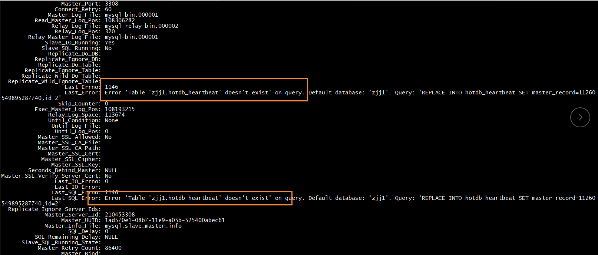

这时候，需要在搭建实例复制关系时加上Replicate_Wild_Do_Table，Replicate_Wild_Ignore_Table参数过滤掉其他库的复制，确保只复制当前使用的物理库。


新存储节点的参数需要同旧存储节点的参数保持一致，在迁库前最好做一次动态加载，配置库中修改的数据没有动态加载可能导致迁库失败

配置的目标新数据库实例不能与现有的数据库实例重合

#### 源数据节点和目标存储节点


选择要迁移的数据节点，选择完源数据节点，界面会自动显示出该节点下的所有存储节点

设置对所选数据节点迁库完成后原有存储节点的处理方式。目前支持3种方式：删除源存储节点、将源存储节点设置为双主备库、将源存储节点设置为从库。（设置为从库时，需要选择是从主库复制还是从双主备库复制）

填写目标存储节点信息：数据节点、主机名、端口、数据库用户名、数据库密码、物理库名称、存储节点类型。填完后点击【测试连接】确保存储节点信息正确

点击【下一步】将对上述信息进行以下校验，需要全部通过才能进入下一步

> 每个新的目标数据节点必须有且仅有一个主库，双主备库最多只能有一个。
>
> 目标数据节点不能为单库类型，必须有一个双主备库或从库。
>
> 新目标存储节点不能与任何现有存储节点重合。
>
> 各个新存储节点能正常连接。
>
> 新主库的master必须是老节点的主库或者双主备库。

#### 迁库资料准备


"由系统执行change master"：可选择是否由计算节点执行change master操作。勾选此选项将由计算节点执行复制搭建操作，计算节点会根据主从关系计算出需要执行change master的存储节点，也可以手动进行配置。（执行复制的用户需要有Reload操作权限，可以使用和存储节点相同的用户，也可以自行填写其他用户，自行填写的必须保证所有存储节点的用户名和密码相同）

不勾选此项，则计算节点不会进行change master操作，需要用户手动去存储节点实例中执行复制搭建

选择迁库完成后是否由计算节点自动配置切换规则，勾选此项，计算节点会自动根据主从关系创建切换规则，不勾选则需要用户手动配置[切换规则](#切换规则)

选择迁库完成后是否删除旧存储节点上的物理库，勾选此项计算节点会删除旧存储节点上的物理库，但是需要保证旧存储节点到新存储节点的复制已断开，因此需要计算节点执行change master，不勾选此项则不对旧存储节点进行操作

#### 预检测


预检测会校验以下信息，如果校验未通过，需要根据提示修改配置信息，通过后才能进行迁库。

> **a.配置库检测**
>
> 检查当前配置库内配置是否正确，同配置校验操作，有配置错误则报错，无法进行迁库操作。
>
> **b.目标存储节点连接状态**
>
> 各个目标存储节点能否用填写的存储节点帐号正常连接。如果有任何一个目标存储节点无法用填写的存储节点帐号连接，报错。
>
> **c.目标存储节点复制关系**
>
> 各个目标存储节点应该有DBA提前搭建好新目标存储节点的相关关系，确保每一个节点的目标存储节点应该和源存储节点的主库/双主备库先搭建成一个不含环的有向连通图。目标存储节点双主现状态只能是主从。
>
> **d.源存储节点和目标存储节点复制延迟检测**
>
> 对复制延迟进行侦测，确保所有新存储节点的，计算节点机制的延迟，必须均小于10秒。不满足此条件需要提示报错（xx存储节点到xx存储节点延迟过大），必须等待复制延迟追上后，才可以使用自动迁库功能。确保可能存在的多个新纯从库，全部从新主库/新双主从库的集合复制数据，不满足此条件不允许进行自动迁库。
>
> **e.目标存储节点用户权限检测**
>
> 勾选了由计算节点执行change master的情况下，判断需要change master的存储节点，检查对应帐号权限，如果是使用目标存储节点用户名密码，则检查该帐号是否有replication slave,replication client权限；如果选择了指定新的存储节点用户名、密码，如果该用户名已存在，则检查密码是否正确，是否拥有replication权限，如果该用户名不存在，报错。
>
> **f.现有存储节点复制关系**
>
> 对需要迁库的每一个节点分别进行复制方向的侦测（侦测范围为有效的新旧存储节点），不满足条件不允许进行自动迁库。
>
> **g.心跳表不能有id值为3或4的记录**
>
> **h.数据节点不能正在切换中**

#### 执行迁库


校验通过后点击【开始迁库】，计算节点开始执行迁库任务。执行过程中显示正在迁库中，执行完成后会提示迁库成功，如果发生异常，会给出相应提示，需要人工进行处理

迁库完成信息同时也会在[事件通知](#事件通知)中显示

### 表结构变更

HotDB Management通过[表结构变更](#表结构变更)功能为用户提供在线执行DDL语句的入口。同时对表数据量大的业务表进行DDL操作时还可以选择在线DDL方式。

#### 普通DDL

普通DDL即直接执行数据定义类型语句，例如CREATE/DROP/TRUNCATE/RENAME等。


进入"管理->表结构变更->普通DDL"进入普通DDL操作界面

在普通DDL操作界面中，输入用户名，密码（用户名密码为计算节点数据库用户）

> !Note
>
> 选择登陆的计算节点数据库用户，设置的"主机"范围必须包括当前HotDB Management所属服务器的IP地址，否则无法连接计算节点。

选择对应操作的逻辑库后即可执行相关DDL语句

目前界面执行建表语句单张表的列数不能超过4096列，输入框的输入最大字节不超过65535

普通DDL页面点击【导入】按钮，可导入外部txt或sql类型的文件，文件导入输入框后需要手动点击执行，执行效果和手动输入DDL语句效果一致


所有执行的普通变更记录均可以在普通变更历史记录内查看到

#### 在线DDL

在线DDL即在HotDB Management的管理端（默认3325）使用Online DDL算法执行的变更语句，变更期间保证不影响执行IUD（INSERT、UPDATE、DELETE）语句，对系统冲击小，不影响业务，且可以使从机延迟的概率减小。但在线DDL的执行速度远远慢于普通DDL，对于大表，执行时间可能需要数十到数百小时。


通过"数据管理->表结构变更->在线DDL"进入在线DDL操作界面

在线DDL功能只能执行以`alter table`开头的DDL语句

与普通DDL一样，需要输入用户名、密码连接具体计算节点的逻辑库

目前界面执行建表语句单张表的列数不能超过4096列，输入框的输入最大字节不超过65535

勾选“执行过程跳过主备数据一致性检测”，则执行在线DDL前，不会进行主备一致性检测，默认不勾选


所有执行的在线变更记录均可以在"在线变更历史记录"内查看到："当前正在执行的在线变更语句"用于查看正在执行的在线DDL任务，同时可以看到该任务正在执行的进度。"在线变更语句执行历史记录"，用于查看已经执行完成的在线DDL情况

当有正在执行的在线DDL语句时候，可点击筛选按钮查看历史记录中与当前正在执行的表的相关的变更操作

### SQL路由计划查看{#SQL路由计划查看}

在HotDB Management中可通过[SQL路由计划查看](#SQL路由计划查看)功能解析在计算节点执行的SQL语句的路由下发情况。


输入正确的用户名、密码，选择执行SQL的表所在的逻辑库

输入需要解析的SQL语句，点击【执行】即可查看

该功能同在服务端（默认3323）中执行EXPLAIN命令效果

### 分片方案在线变更

提供对业务表的表类型、分片规则、分片字段、分片所属数据节点四个维度进行在线变更的支持。业务表在变更期间不会锁表，业务可对表进行正常的IUD操作。

#### 分片方案在线变更记录


页面显示已执行完成或正在执行的变更任务记录，正在变更的任务允许通过【取消执行】来取消并回滚操作

正在执行的任务可实时查看执行进度，每3秒刷新一次

可通过[逻辑库](#逻辑库)、"表名称"、"状态"来筛选查看任务记录

任务记录"**状态**"通常有9种，依次为：

1. 成功：任务正常完成且未出现数据不一致情况。
2. 成功：任务正常完成但出现部分数据不一致且由程序自动修复。警告标志显示："变更后数据一致性检测发现少量数据不一致，程序已自动修复"。
3. 成功：任务正常完成且由程序修复了不一致的数据，但仍然还有部分数据不一致，用户选择忽略不一致的数据完成变更任务。告警标记提示："程序自动修复不一致数据后数据仍然存在不一致，用户选择允许部分数据不一致情况"。
4. 失败：任务失败结束，原因为用户手动取消执行任务。错误标记提示："手动取消变更任务执行"。
5. 失败：任务失败结束，原因为程序自动修复后仍出现数据不一致，用户选择放弃此任务。错误标记提示："程序自动修复不一致数据后数据仍然存在不一致，用户选择放弃本次变更任务"
6. 失败：任务失败结束，原因为变更完成后发现数据不一致，程序自动修复后依旧含有不一致数据，需要用户做出确认，用户未在设定等待时间处理导致任务失败。错误标记提示："未在设置时间范围内对数据不一致情况作出处理，变更任务自动失败"
7. 失败：任务失败结束，原因为批量发起任务后，变更方案未通过[变更方案预检](#变更方案预检)检查导致失败。错误标记提示："批量发起任务后，变更方案未通过预检测阶段导致任务失败"
8. 等待：任务未完成，处于数据不一致时需要用户做出确认处理。告警标志提示："程序自动修复不一致数据后依旧存在不一致数据，等待用户确认处理"
9. 暂停：任务发起后，由于用户设置了暂停复制时段，任务进入该时段后，页面显示该任务状态为暂停，且鼠标移入后提示："变更任务处于暂停数据复制时段"

#### 发起变更任务


点击"管理->分片方案在线变更"页面的【发起变更任务】按钮，进入[发起变更任务](#发起变更任务)配置页面

#### 填写变更方案


选择变更表所在逻辑库，以及需要变更的表名称。（不支持选择父表或未创建表结构的表）

"源表信息"中显示已从逻辑库选择的表的原本信息，包括(表类型、节点信息、分片规则、分片字段)

变更方案可选择需要变更成的"表类型"（目前不支持变更成子表）、"分片字段"（表类型为水平分片表时）、"分片方式"（表类型为水平分片表时）、"数据节点"

若勾选"开启全局唯一约束"则需要保证源表中唯一约束字段值必须都唯一

勾选“执行过程跳过主备数据一致性检测”，则变更方案预检，会跳过主备一致性检测，默认不勾选

#### 变更方案预检

变更方案预检主要是为源表检测预选的变更方案是否符合变更要求以及能否保证数据一致性。点击【开始检测】进行变更方案预检。


**特殊预检项说明**

- **源表数据主备一致性检测结果一致**

在24小时内有该源表所在的逻辑库已发起过主备一致性检测且校验结果为一致的，会弹出提示框提示是继续检测，还是跳过检测。（否则需要执行一次该表的主备数据一致性检测）。

- **新的分片方案不会导致数据丢失**

分片规则的变更、分片字段的变更可能导致数据的不一致，系统将会根据分片规则和字段进行判断，是否有产生数据不一致的可能。

- **开启全局唯一约束后，源表唯一约束字段的历史数据唯一**

若在[填写变更方案](#填写变更方案)中勾选"开启全局唯一约束"则变更方案预检会检测源表唯一约束字段的历史数据是否唯一。若未勾选或变更的表类型不为水平分片表则该检测项直接通过，不进行检测。

> !Note
>
> 变更成全局表或垂直分片表类型时，预检项"分片字段为表结构包含的字段"、"变更方案的分片规则与分片字段与源表不一致"、"分片字段为当前分片函数推荐的字段类型"将会略过检测。

#### 变更方案确认

检查变更表信息与变更方案信息，同时可设置变更任务在执行时的特殊设定。

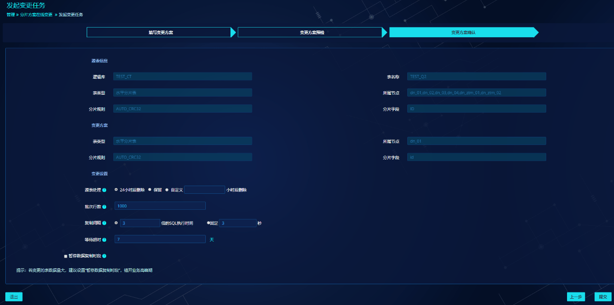

源表信息与变更方案信息都不能修改，如果需要修改可点击【上一步】返回[填写变更方案](#填写变更方案)中，修改完还需要执行一次检测

变更设置：

- **源表处理：**选择24小时后删除或自定义时间删除，则根据设置时间自动删除源表；如选择保留，则源表以源表名+roYYMMDDHHMMSS形式存在。变更任务失败时源表不会被处理。保留的表可在逻辑库中查看到，同时[表信息](#表信息)页面也会正常显示
- **批次行数：**数据复制过程中每批次复制的数据行数。最大不超过10000，最小不低于1
- **复制间隔：**数据复制过程中每批次间的间隔时间。选择"x倍SQL执行时间"即间隔时间为x倍的每批次复制数据插入新表的执行时间，选择"固定x秒"则每批次复制间隔时间是固定的x秒。倍数输入范围【0.1-100000】，秒数输入范围【0.001-100】
- **等待超时：**在变更导致数据不一致情况时，等待用户作出处理的时间，超出设置时间未确认则变更任务自动失败，默认7天可编辑修改，输入框只允许输入正整数且范围在【1-30】
- **暂停数据复制时段：**在选择的时间范围内，不进行新旧表之间的数据复制，为暂停状态，时间段过后再继续分片变更任务。（若变更的表数据量大，建议设置"暂停数据复制时段"，错开业务高峰期）

点击【提交】按钮后，系统将分片变更任务提交到计算节点后台执行。可在分片方案在线变更页面查看当前执行情况。任务执行完可通过点击"查看结果"按钮查看任务执行详情。

#### 批量发起变更

**(1) 发起方式**


可在[分片方案在线变更](#分片方案在线变更)页面点击"【批量操作】->【批量发起变更任务】"，或在"[数据分片方案推荐](#数据分片方案推荐)"功能中选中多个分片推荐方案记录进行【在线修改】批量发起变更。

**(2) 批量发起填写说明**


批量发起的任务中，如果某个任务预检测失败则整个任务失败。预检测过程中，如果源表所在逻辑库在24小时内已发起过主备一致性检测且结果一致，则该表预检测不再执行"主备数据一致性"检测项

批量发起变更中"源表处理"、"复制间隔"设置无法自定义输入值，只支持下拉框选项

**(3) 执行批量任务**


如果批量发起的多个任务中任意一个任务被手动取消执行，其他任务即使没有发生异常，也会变成失败状态，并提示"因同一批次发起的任务中存在某一任务被人为取消导致当前任务自动被取消"

如果批量发起的多个任务中任意一个任务预检测失败（或者大量数据丢失/超出/不一致等异常导致失败），其他任务即使没有发生异常，也会变成失败状态，并提示"同一批次发起的任务中存在某一任务出现异常情况导致该任务自动被置为失败"

#### 分片方案变更异常情况处理

在分片方案变更任务完成时，发现变更后的新表与源表存在数据不一致的情况，需要根据异常情况做出处理

- 当变更过程中出现少量数据丢失时，HotDB Management会提示丢失的数据所在的区间范围，并自动弥补丢失的数据，如下图：


- 当变更过程中出现多出少量数据时，HotDB Management会提示多出的数据所在的区间范围，并自动删除多出的数据，如下图：


- 当变更过程中出现少量数据不一致时，HotDB Management会提示不一致的数据所在的区间范围，并自动修复不一致的数据，如下图：


- 当变更过程中出现大量数据不一致时，HotDB Management会提示不一致的数据所在的区间范围，但不会修复大量不一致的数据，如下图：


- 当变更过程中第一次出现少量数据不一致（或缺失、超出）时，HotDB Management会主动修复不一致的数据，如果在修复完成后再出现数据不一致，HotDB Management会提示自动修复后依旧不一致，给出不一致（或缺失、超出）数据所在的区间范围，且不会再自动修复，同时等待用户选择：【忽略不一致】或者【放弃变更】


选择【放弃变更】，则变更任务失败，并提示"程序自动修复不一致数据后数据仍然不一致，用户选择放弃本次变更任务"，如下图：


选择【忽略不一致】，则任务成功但存在部分不一致数据，并提示"在线变更完成，用户选择允许变更后部分数据不一致"，如下图：


### 表回收站

表回收站功能，是指在开启表保留参数（dropTableRetentionTime）情况下，服务端（默认3323）操作DROP、TRUNCATE、DELETE不带WHERE条件(自动提交)的表，会进入回收站。管理平台在保留时间内支持可视化数据闪回操作，另外还包括查看可还原数据列表、还原（闪回）数据、删除数据、查看历史记录等功能。

#### 使用前提

使用表回收站功能需要满足如下前提：

- 当前用户拥有[表回收站](#表回收站)菜单权限
- 当前计算节点参数"被删除表保留时长"不为0
- 在服务端（默认3323）执行DROP、TRUNCATE、DELETE不带WHERE条件（自动提交）操作的表。

#### 表回收站


页面显示服务端（默认3323）执行3种操作后进入回收站的临时表

可通过[逻辑库](#逻辑库)、"原表名称"、"执行语句"来筛选查看表回收站记录

超过表保留时间后，回收站表自动删除，且不记录至历史记录

#### 表还原

**(1) 点击还原**


- 点击"管理->表回收站"页面中需要还原临时表，弹出填写连接信息输入框。

**(2) 填写连接信息**


- 选择数据库用户
- 输入数据库用户密码
- 还原后的表名称，默认显示原表名称，可修改

**(3) 确认还原**


- 表还原后，显示执行结果，包括成功数量，失败数量，历史记录
- 点击历史记录，可跳转至历史记录页面

#### 表删除

**(1) 点击删除**


- 点击"管理->表回收站"页面中需要删除的临时表，弹出删除提示确认框，点击确定，弹出填写连接信息输入框。

**(2) 填写连接信息**


- 选择数据库用户
- 输入数据库用户密码

**(3) 确认删除**


- 表删除后，显示执行结果，包括成功数量，失败数量，历史记录
- 点击历史记录，可跳转至历史记录页面

#### 表批量还原

**(1) 发起批量还原**


- 进入"管理->表回收站"页面，勾选需要还原的表，点击"【批量操作】->【批量还原】"。

**(2) 批量还原连接信息**


- 若勾选的表都属于一个逻辑库，则只需要填写一份连接信息
- 若勾选的表属于多个逻辑库，则需要分别填写连接信息
- 存在一个连接信息错误，则全都无法还原
- 默认显示原表名称，可修改

**(3) 确认还原**


- 表还原后，显示执行结果，包括成功数量，失败数量，历史记录
- 点击历史记录，可跳转至历史记录页面

#### 表批量删除

**(1) 发起批量删除**


- 进入"管理->表回收站"页面，勾选需要删除的表，点击"【批量操作】->【批量删除】"。

**(2) 批量删除连接信息**


- 若勾选的表都属于一个逻辑库，则只需要填写一份连接信息；若勾选的表属于多个逻辑库，则需要分别填写连接信息
- 存在一个连接信息错误，则全都无法删除

**(3) 确认删除**


- 表删除后，显示执行结果，包括成功数量，失败数量，历史记录
- 点击历史记录，可跳转至历史记录页面

#### 表回收站特殊情况说明

表回收站可能出现的一些特殊情况，统一在此说明。

- 引用高级分片规则的表，进入回收站后，删除管理平台表配置信息，分片规则仍无法编辑或者删除，需要把回收站中的表删除后，才可编辑或删除。分片规则页面，该分片规则显示临时表，点击临时表跳转至表回收站页面。如下图：


- 还原失败包括，但可能不限于：

- 原表与还原后的表配置信息不一致的（包括表类型、分片字段、分片方式、数据节点）。如下图：


- 原表与还原后的表逻辑库不一致的。如下图：


- 原表还原成其他表名时，其他表已创建的。如下图：

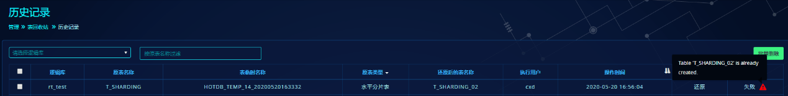

- 父子表关系的两张表，子表还原时，父表已被删除的。如下图：


- 父子表关系的两张表，子表还原时，父表删除部分子表关联数据的。如下图：


- 外键关系的表，子表还原时，父表被删除的。如下图：


- 外键关系的表，子表还原时，父表删除部分子表关联数据的。如下图：

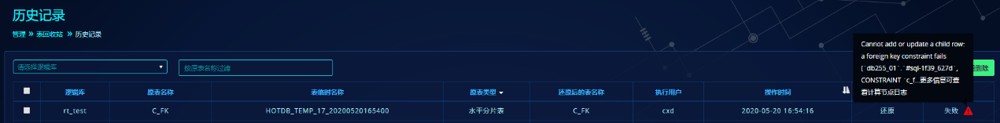

- 若还原后的表已创建，则在还原时，弹出提示框"被还原的表当前已被定义，是否先删除已存在的表再进行还原操作"，点击确认，自动删除已存在的表并进入回收站，如下图：


- 存在外键关系的表，数据正常情况下，还原后，重新建立外键关系。

#### 历史记录


- 进入"管理->表回收站"页面，点击[历史记录](#历史记录)。进入表回收站操作历史记录页面。
- 可通过[逻辑库](#逻辑库)、"原表名称"来筛选查看历史记录

#### 删除历史记录

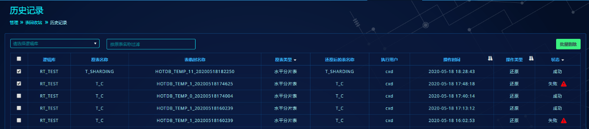

- 勾选需要删除的历史记录，点击批量删除

## 安全

安全菜单中主要为对计算节点连接与执行的安全防护，以及对相关组件密码的安全管理，提升业务系统的安全性。

### 白名单

HotDB Management支持白名单功能，可限制白名单之外的主机连接计算节点服务。


使用白名单功能需要先在"安全->白名单"中开启白名单开关

开启和关闭白名单开关或添加、修改、删除白名单信息都需要通过"[动态加载](#动态加载)"才能生效

添加可以访问计算节点的主机，则白名单之外的主机连接计算节点时都会被拦截。拦截记录可以在"事件->审计日志->[安全防护](#安全防护)"中查看

> !Important
>
> 目前只能配置IP格式的主机，暂不支持域名格式
>
> HotDB Management会默认在白名单功能中内置一个"组名"为"MANAGEMENT"的白名单组，内部包含当前HotDB Management所在服务器IP地址。该白名单组不能在页面中进行删除、修改
>
> 当计算节点集群要更换HotDB Management时，必须先将新的HotDB Management服务器IP加入到计算节点白名单中，否则新HotDB Management的IP不在白名单范围内会导致新HotDB Management无法连接计算节点

### SQL防火墙

HotDB Management提供的[SQL防火墙](#sql防火墙)功能可为用户拦截高危SQL、误操作SQL等，提升系统安全性。


SQL防火墙功能目前只支持开启HotDB Management提供的可拦截SQL模板，暂不支持自定义SQL

可单个或批量启用拦截规则，启用或关闭都需要[动态加载](#动态加载)后才能生效。生效后在计算节点中执行已拦截的SQL会提示`"ERROR 10029 (HY000): You are using SQL_Firewall, this sql isn't allowed"`

目前HotDB Management提供31条可拦截SQL模板，对具体拦截过的SQL可在"事件->审计日志->安全防护"中查看

在计算节点版本为2.5.5 及以上时，SQL防火墙功能中增加一条拦截规则，支持对where子句中不带分片字段的SQL语句进行拦截，提升系统查询效率。

管理平台在安全->SQL防火墙对应显示" 不允许where条件不带分片字段"SQL防火墙规则，如下图：


该规则默认关闭，打开后需动态加载生效且状态变为"拦截中"：


若该规则拦截中，则在计算节点服务端执行的所有where条件未带分片字段（子表为关联字段）的SQL且操作的表为水平分片表或子表时都会拦截。

**示例：**

创建水平分片表teacher，分片字段为id，当该规则拦截中，where条件不带分片字段如下图：


同时事件->审计日志->安全防护界面可以看到相关拦截日志:


### 密码安全管理

密码安全管理为用户提供了对计算节点数据库用户与存储节点的连接用户、备份用户的密码有效期监控提醒。到期后自动提示用户修改密码以提升系统的安全性。

#### 数据库用户密码

**页面为空说明：**当进入"安全->密码安全管理->数据库用户密码"页面时，如果不显示记录需要检查是否开启"设置->[定时设置](#定时检测设置)"中的"数据库用户密码过期提醒"。若开关已开启，页面仍为空，则说明当前数据库用户密码有效期未到提前提醒时间。

**过期提醒方式：**当开启"数据库用户密码过期提醒"时，密码有效期到达"提前提醒时间"，默认通过站内弹窗提醒提示（登录HotDB Management成功后，若有过期用户则弹窗提示）；此外也可以通过邮件提醒的方式通知数据库用户密码过期（此种方式需要在"事件->[通知策略](#通知策略)"中配置）。

**(1) 站内提醒说明**


当有数据库用户密码过期时，登录页面会弹出提醒窗口提示当前有多少个用户需要及时修改密码，且右上角的"[事件提醒](#事件通知)"中也会给出相应提醒。

用户可点击【立即修改】，跳转至"安全->密码安全管理->数据库用户密码"页面中修改已过期或将过期的密码。

用户也可以点击【不再提醒】按钮关闭弹窗，下次登录则不会弹窗提示（若有新的数据库用户密码过期记录出现，则弹窗会再次提示）。

**(2) 密码修改**


页面默认只出现"已过期"或"将过期"的数据库用户记录。已过期的记录在"用户名"字段右上角会显示红色已过期标志，将过期的记录显示黄色将过期标志

点击"操作"栏中密码修改按钮，可修改数据库用户密码

点击【历史记录】可查看修改成功或失败的记录

修改HotDB Management连接计算节点的专属用户**root账户**密码时会要求自动执行"[动态加载](#动态加载)"操作。若动态加载失败则密码修改操作也同步失败

#### 存储节点密码

**页面为空说明：**参照"[数据库用户密码](#数据库用户密码)"章节页面为空说明。

**过期提醒方式：**参照"[数据库用户密码](#数据库用户密码)"章节页面为空说明。

**(1) 站内提醒说明**


当存在密码将过期或已过期的存储节点用户时，用户登录HotDB Management选择计算节点集群进入首页后，会弹出提示窗口，且右上角的"[事件提醒](#事件通知)"中也会给出相应提醒

用户可点击【立即修改】，跳转至"安全->密码安全管理->存储节点密码"页面中修改已过期或将过期的密码

用户也可以点击【不再提醒】按钮关闭弹窗，下次登录则不会弹窗提示（若有新的存储节点密码过期，则弹窗会再次提示）

**(2) 密码修改**


**显示说明**

- 页面中按照存储节点实例为单位显示一条记录，若多个存储节点的实例为同一个则会聚合展示

- 用户名显示存储节点配置在HotDB Management中的"连接用户"、"备份用户"（备份用户实际以配置为准）

**单个修改**

- 点击每条记录"操作"栏【修改】按钮可对存储节点的相关用户密码进行修改。修改完页面不再显示该条记录的信息

**批量修改**

批量修改分为勾选页面记录一次性修改多条存储节点用户密码，与一键设置勾选的或全部（默认）的"已过期"与"将过期"记录为一个相同的密码

批量执行修改密码任务后，会弹出修改结果，包括修改成功与失败的记录。失败的记录可在页面【历史记录】中查看具体失败原因

**(3) 特殊说明**

- 当存储节点无法正常连接时，修改密码操作会直接失败
- 若存在多个计算节点集群使用同一个存储节点现象，会提示不允许修改
- 当配置库实例与存储节点共用一个实例且所用账户也一致时，修改该用户会直接失败

## 检测

### 主备数据一致性检测

当存储节点以"双主"或"主从"架构运行时，可能存在因复制延迟或其他异常问题导致主从存储节点数据不一致的问题。HotDB Management支持通过"主备一致性检测"工具发现数据不一致的隐蔽问题。

**容灾模式说明：**集群开启容灾模式时，主备数据一致性检测相关逻辑说明请结合[跨机房容灾部署](cross-idc-disaster-recovery-deployment.md)中的[主备数据一致性检测](#主备数据一致性检测)章节。

#### 发起检测任务


**第一步：**选择检测维度，默认为逻辑库维度。

- 逻辑库维度：检测与该逻辑库相关数据节点下的主备存储节点数据一致性，且支持到表级别检测
- 存储节点维度：指定数据节点下的存储节点进行数据一致性检测
- 配置库维度：检测计算节点配置库（主从或双主复制架构）中主备配置库数据一致性

**第二步：**选择需要检测的逻辑库与表或数据节点与存储节点。

**第三步：**配置存储节点并发数，即存储节点内可同时检测的表的个数，默认为8，最大不能超过32。

**第四步：**点击【发起检测】按钮，将检测任务提交到计算节点后端执行。可在页面中查看任务执行进度。

**查看结果**


任务执行完可点击【查看结果】查看具体检测详情，如果检测结果不一致则会展示不一致的数据结果记录，若出现大量不一致记录，则通过数据区间的形式展示不一致情况。若不一致的数量超过100000行则需要人工手动定位

用户可根据检测执行详情对不一致的数据进行手动修复

表结构未创建或没有定义主键或唯一键的表，无法进行主备一致性检测

在检测维度为存储节点时，若选择检测的存储节点为当前数据节点下的主存储节点，则检测结果将永远为一致（主备一致性检测永远以当前主库为标准进行检测）

检测的表所在的数据节点未配置对应的[切换规则](#切换规则)或所在的存储节点不可用时，该表无法进行主备一致性检测


#### 定时计划{#主备数据一致性检测.定时计划}

除了手动发起主备一致性检测任务外，也可以通过添加定时任务自动执行检测。点击【定时计划】可管理当前的定时计划任务。


- 定时计划最多只能加六条，可按照检测周期选择"每日"、"每周"、"每月"

- 其他选项可参照手动发起任务的说明

- 当定时计划中选择的逻辑库一致且检测周期与检测时间都重叠时，程序只会执行一个定时计划任务

- 定时计划推荐与"事件->[通知策略](#通知策略)"功能相结合。通过添加邮件报警提醒策略，可在定时计划执行完成时对执行结果异常的进行报警。

#### 特殊说明

若出现实际主备存在数据不一致，但检测结果显示一致的情况，请检查：

- 检测的表是否包含主键或唯一键
- 检测的数据节点下的主备存储节点是否配置了"[切换规则](#切换规则)"
- 检测的数据节点下的主备存储节点是否存在延迟。（3325管理端执行show @@latency命令查看）
- 配置是否已动态加载

### 全局表数据检测

可检测集群中所有的全局表在各个数据节点上的表结构与表数据是否一致。提供对不一致的数据在线修复的功能。

#### 发起检测任务


**第一步：**选择需要检测的逻辑库以及逻辑库下的全局表。

**第二步：**设置检测并发数，为空时默认为8，最大不能超过32。

**第三步：**点击【开始校验】按钮，将检测任务提交到计算节点后端执行。可在页面上查看正在执行的任务进度，也可以点击【强制取消】按钮取消任务执行。

#### 查看检测详情


- 点击检测任务的【查看检测详情】按钮可查看检测任务的详情结果。

- 检测结果分为：数据一致、数据存在不一致、无法检测三种情况。

**数据一致：**全局表在所有数据节点中的数据全部一致。

**数据存在不一致：**全局表在数据节点中存在数据不一致，可根据操作栏中是否有【数据修复】按钮判断是否可以在线修复不一致的数据。

**无法检测：**因某种异常原因导致表无法检测，包括但不限于以下几种原因

- 表无索引无法检测

- 存在数据节点未创建被检测表的表结构，无法检测

- 表结构未创建，无法检测

- 计算节点服务状态异常，无法检测

- 其他原因，无法检测

- 记录中若"修复状态"为"未修复"的，可通过【数据修复】功能在线修复不一致的数据；若状态为"已失效"，则代表不能再进行修复

**已失效说明：**已经检测过的全局表，若重新检测，则上一次的检测结果将会失效，点击【数据修复】的时候会提示"数据已失效，请重新检测"。再点击【刷新检测列表】记录的"检测状态"为"已失效"。

**特殊情况：**如果对已检测的全局表进行重新检测，但检测任务被手动取消或因异常导致失败，则上一次的检测结果不会被置为失效，数据修复入口依然可用，且刷新检测列表修复状态不会变化。

#### 数据修复


数据修复目前支持修复以下七类数据不一致类型的情况：

- **A类：**少数节点（小于二分之一节点数）数据缺失，剩余所有节点数据相同，且第一个数据节点有数据，可以自动修复。
- **B类：**少数节点（小于二分之一节点数）数据缺失，剩余所有节点数据相同，且第一个数据节点没有数据。
- **C类：**多数节点（大于等于二分之一节点数）缺失数据，剩余所有节点数据相同
- **D类：**仅一个节点多出数据
- **E类：**超过一个节点间数据不一致
- **F类：**仅有一个节点数据不一致
- **G类：**数据缺失且不一致

数据修复时会展示表中存在不一致的数据内容，可根据实际业务情况选择以哪个版本为准，确定后勾选"版本选择"中的勾选框，选择【同步】或【删除】，再点击【按所选修复策略批量提交】即可修复不一致的数据

修复时最好先将本页面显示的所有不一致的数据选择好修复策略以及版本后统一提交，然后再修复下一页的不一致数据记录

修复完，页面自动刷新并隐藏已修复好的记录，可点击【返回检测结果列表】按钮到该页面中查看"修复状态"，正常情况该状态为"已修复"

#### 定时计划

全局表数据检测定时计划请参考[主备数据一致性检测](#主备数据一致性检测)中[定时计划](#主备数据一致性检测.定时计划)说明。

### 表结构与表索引检测

表结构与表索引检测可用于对比计算节点中表结构与索引定义在各个数据节点中是否一致。同时，通过检测表结构以及与表相关的SQL语句的执行计划、执行时间等，提供表结构或表索引的优化建议。


#### 发起检测

点击【发起检测】发起一次检测。

也可通过添加定时计划，自动执行检测任务。定时计划介绍请参考[主备数据一致性检测](#主备数据一致性检测)中[定时计划](#主备数据一致性检测.定时计划)说明。

#### 页面说明

可根据逻辑库和表名称过滤表记录；

可筛选查看表状态为"正常"、"表结构定义异常"、"表索引定义异常"、"表结构未定义"、"表索引未定义"的表；

仅对表状态为"正常"或"表索引未定义"的表提供表结构或表索引优化建议，表状态为"表结构定义异常"、"表索引定义异常"、"表结构未定义" 的表将在优化建议中给出具体在哪个数据节点上定义异常：


表结构优化建议列举如下：

- 字段名，此字段不存在NULL数据，建议修改为NOT NULL；
- 字段名，此字段定义长度与实际最大长度相差大于256个字符，建议查看表结构后修改定义长度；
- 字段名，此字符串字段是text类型但实际长度长度小于3000字符，建议修改为varchar/varbinary类型或mediumtext/mediumblob类型；
- 字段名，此字符串字段可能为状态标志位字段，建议修改为enum/set类型；
- 字段名，此字段为timestamp类型且最大时间大于2030年，建议修改为datatime类型；
- 当前表中存在字段字符集不统一，建议统一字符集且推荐为latin1和utf8mb4；
- 当前表中超过一半字段没有默认值，建议添加默认值；
- 当前表中超过一半字段没有注释，建议添加注释。

表索引优化建议列举如下：

- 索引名（字段名），此索引检测时未被使用，建议检查后优化此索引；
- 索引名（字段名）、索引名（字段名），此组索引为重复索引，建议仅保留一条索引；
- 索引名（字段名），此索引字段基数小于100或基数除以总行数小于0.001，且此表总行数小于200，建议创建其它高效的索引或组合索引替代；
- 索引名（字段名），此索引字节长度大于256字节且字段前缀就能达到较理想的选择性，建议修改索引，取合理长度前缀，例如修改为(此字段的合理长度前缀)；
- 索引名（字段名，字段名），此组合索引存在两个字段基数相差10倍以上，建议交换顺序，将基数低的字段放在后面，例如修改为索引名（字段名，字段名）；
- 索引名（字段名）、索引名（字段名），此组索引超过70%情况组合出现，建议合理建立一个或多个组合索引，删除不被单独使用单列索引；
- 当前表结构没有主键唯一键，建议添加自增字段的主键；
- 当前表结构的主键为长字符串，最大字节长度大于32字节，建议添加自增字段主键，现有主键改为唯一索引；
- 存在非复杂SQL的总执行消耗超过7200秒，且无高效索引，建议添加合理索引；
- 字段名，此字段曾用于跨库JOIN查询的关联字段，建议为此字段添加索引；
- 字段名，此分片字段基数较高，基数除以总行数大于0.1，建议为此字段添加索引；
- 字段名，此字段在95%以上的where条件中使用，具体值可以定位到小于0.01%且小于1000行的数据或平均少于10行的数据，建议为其添加索引；
- 字段名，字段名，为where条件中的多个AND组合，单独一个字段无高效索引，但多个字段加在一起选择性很高，建议为其添加组合索引；
- 组合字段（字段名，字段名），组合字段（字段名，字段名），在where条件中可以作为高效索引，建议为其添加组合索引；
- 索引名（字段名），此索引字段为长字符串字段，长度大于64字符，建议将字段长度定义为"X"（X默认由管理平台自动计算得出）；
- 索引名（字段名），此索引字段为时间字段且该索引为低效索引，未定位到小于0.01%且小于1000行的数据或未被经常使用，建议删除此索引。

> !Note
>
> 在多计算节点集群模式下且autoIncrement参数设置为2（自增仅唯一），若表中有自增序列且类型是smallint、tinyint 、mediumin、int类型时，则表状态列会定义为"表结构定义异常"，同时表结构优化建议列提示"开启全局自增且唯一配置后，表中的自增序列仅允许为bigint类型，建议自增列字段id类型由tinyint改为bigint",点击"全局自增且唯一"可跳转至计算节点参数配置页面，如下图：


- 该校验规则仅在计算节点参数"全局自增序列号"设置为2即"全局自增仅唯一"且计算节点模式为多节点集群时，对所有逻辑库下所有开启自增列的表进行校验。

#### 表结构明细


- 在[表结构与表索引检测](#表结构与表索引检测)页面点击"查看表结构"的【详情】按钮可查看表结构明细

- 明细包括：表定义状态、表所属数据节点、建表语句，索引详情、表字段说明等信息

- 可通过页面右上角【复制】按钮复制建表语句

- 针对在各数据节点下表结构不一致的表，页面会显示各数据节点下建表语句，并用红色字体标识出不一致的部分

### 数据分片评分

数据分片评分功能对某张表拆分得是否合理进行打分，也可根据逻辑库和多张表进行统计获取平均得分，帮助运维人员及时发现拆分不合理的分片表。

#### 评分维度说明


**数据分片评分分五个维度进行：**

- **数据量分布均匀评分**

根据各个节点数据量分布是否均匀、增长量是否均匀计算评分

- **跨库事务占比评分**

根据跨节点事务查询次数占比计算评分

- **SELECT操作均匀评分**

根据各个节点查询总量是否均匀、跨库join查询比例、单库查询比例、因无法路由到指定节点而路由到所有节点的查询比例计算评分

- **IUD操作均匀评分**

根据各个节点IUD操作量是否均匀、单库IUD操作比例计算评分

- **其他维度评分**

根据查询无法找到节点的次数、分片字段定义是否合理计算评分

**统计说明**

- 由计算节点负责分数的统计与计算，每次从计算节点启动后开始计算，若计算节点服务重启则之前的统计数据清零

- 计算节点需要启动时间满24小时后才能进行分数的统计展示，否则提示"计算节点启动不足24小时无法计算"

- 若主备模式集群的计算节点发生了高可用切换，则切换后的24小时内会无法计算

> !Note
>
> 非水平分片类型的表或表结构未创建时将不进行评分。

#### 记录导出


- 点击[数据分片评分](#数据分片评分)页面"导出"按钮对页面记录进行导出

- 勾选"导出表的分片规则、分片字段、所属数据节点"则在每张表评分记录后加入[分片规则](#分片规则)、"分片字段"、"所属数据节点"列内容

- 默认导出页面显示的所有记录，可通过条件筛选框对页面记录进行筛选后再导出

### 数据分片方案推荐

为了更好地帮助用户通过实际业务场景找到合适的表分片方案，HotDB Management支持通过仿真压测环境生成的SQL日志交予计算节点进行分片方案推荐计算，最终可为用户生成符合实际生产环境的业务表分片参考方案。

#### 发起推荐

**(1) 发起前须知**

- 数据分片方案推荐功能只能在全仿真压测后使用

**全仿真压测：**根据业务真实情况模拟连接计算节点进行业务操作。执行的业务操作需要尽量模拟生产环境业务。

- 全仿真压测前必须打开"配置->[计算节点参数](#计算节点参数配置)"中的"统计SQL执行情况"参数开关，同时将"SQL执行统计中SQL语句记录的最大长度"尽可能设置大，防止SQL记录时被截断

- 全仿真压测前建议在"事件->[操作日志智能分析](#操作日志智能分析)"功能中清除历史记录日志，避免旧数据干扰全仿真压测SQL记录。清除历史操作日志记录后，需要在计算节点执行正式的业务SQL，并刷新至操作日志页面，作为仿真初始化数据

- 分片方案智能推荐功能计算过程中，"事件->操作日志智能分析"的SQL记录开关将暂时关闭

**(2) 发起推荐步骤**


- 点击【发起任务】按钮可发起一次数据分片方案推荐任务，但如果在"事件->操作日志智能分析"中未记录任何SQL日志，则无法发起任务。

- 若当前存在未完成的推荐任务，则不允许再次发起


- 发起任务时默认将计算推荐集群所有逻辑库中的所有表，可根据实际需要选择过滤不需要计算推荐的表

- 表的"仿真压测行数"为该表在执行全仿真压测时的实际数据行数情况，全局表的仿真压测行数，是表的实际行数*节点数

- 发起任务前需要对每张表配置"倍乘数"或"生产预估行数"。设置此参数是为了计算时更加接近业务的真实执行场景

**倍乘数：**

仿真压测行数 * 倍乘数 = 生产预估行数

示例一：在仿真压测环境模拟100万用户在10天的操作，但实际生产环境有1000万用户操作且要求保留90天数据，则与该业务相关的表倍乘数应当设置为90\

示例二：针对配置表等类型的元信息表，用户可以单独调整这些表的倍乘数为1

**行数：**

生产预估行数即模拟表在生成环境中达到的行数规模

示例一：在仿真压测环境中的某业务表行数有1000，但实际生产环境中该表预估能达到9900行，则可以将该表对应的行数单独设置为9900

- 选择"参数模式"后直接在右边输入框输入相应值，点击【批量设置】的【设置选中】（已勾选需要被设置的表）或【设置所有】（无需勾选记录直接全部设置）

- 对已设置但还需要单独调整的表可通过参数旁的【编辑】按钮进行单独修改。单独修改过的记录会高亮显示

- 点击【开始计算】即可发起对所选择以及设置的表的分片方案推荐任务。页面自动展示当前任务的实时执行情况

- 执行过程中也可以点击【终止计算】，但显示的推荐结果可能不太准确，需慎重采纳

#### 分片方案推荐结果


页面展示最近计算成功的推荐结果，新发起的任务结果会覆盖之前记录的结果

点击"更多"按钮可通过"仿真压测行数"与"生成预估行数"条件来筛选页面记录

可通过页面筛选条件筛选出需要查看的表。也可以通过勾选"原分片方案与生成方案去重显示"来过滤原分片方案与生成方案重复的记录

默认生成三套推荐方案，一般情况下第一个方案是最优的，后面两个方案为备选方案

生成的方案中，包括推荐的表类型：分片表（代表水平分片表）+分片字段、全局表。推荐为分片表时，方案中暂不包括分片规则，需要用户自己选择

针对于"表状态"为"未压测（未经过全仿真压测）"的记录，页面会高亮展示，此类型表的推荐方案因没有经过仿真压测，所以**不建议采纳**

页面中的记录支持直接导出到本地，可选择勾选需要导出的记录或者导出全部记录。点击【导出】按钮即可

对需要修改表分片方案的表可直接通过点击【在线修改】来完成分片方案变更

**在线修改时注意：**

- 点击【在线修改】需要勾选需要变更的表记录，点击后直接链接到"管理->[分片方案在线变更](#分片方案在线变更)"功能页面。
- 若勾选的记录存在表类型为父表、表结构未创建、表已被删除的情况，则无法在线修改。
- 若要采用生成的分片方案，建议全部表使用**其中一套方案**，推荐方案与备选方案不可交替采用。
- 具有join关系的表进行在线修改分片方案时，建议批量一次性修改
- 变更分片方案时，勾选“执行过程跳过主备数据一致性检测”，则分片方案变更会跳过主备一致性检测，默认不勾选

选择推荐方案时，需要关注某方案可能会导致对应部分SQL无法执行，点击【不支持SQL】按钮，可查看该方案中无法执行的SQL

#### 分片方案推荐的影响因素

同一张表，不同的行数，不同的SQL种类与数量都可能导致最后推荐的结果不一样。

**如下因素会影响到分片方案推荐的结果：**

- 压测时，相应表制造的数据量大小,设置的预估生产环境倍数或行数

- 查询语句中，带有聚合函数、单/多节点join语句、跨库join、不支持的join语句、跨库/下发union语句都会大幅度影响分片推荐结果

- 查询或者插入语句中，字段的长度、外键引用字段、主键字段、字段的数据类型，均会影响到分片推荐结果

### 数据分片路由检测

如何验证分片规则的正确性，插入的数据是否按照正确的分片规则进行路由，由其他分布式环境导入至集群的分片数据是否会有不一致的情况。通过数据分片路由正确性校验功能，这些问题通通能快速得到解决。

#### 发起检测


- 选择需要检测的逻辑库与分片表（不包含表类型为子表的表），点击【发起检测】按钮即可立即进行检测

- 已完成的检测任务若"检测结果"为"正常"，则操作栏中无【检测详情】按钮；为"异常"时可点击【检测详情】进入[检测记录详情](#检测记录详情)页面

#### 检测记录详情


- [检测记录详情](#检测记录详情)主要展示该检测任务中所有检测表的检测记录情况，默认显示"检测结果"为异常的表记录

- 关于具体表路由异常信息可点击【详情】进入[路由异常详情](#路由异常详情)页面查看

- 路由异常的表可通过点击【导出记录】按钮将信息保存至本地。

> !Note
>
> 导出功能目前只导出检测结果异常的数据行信息**


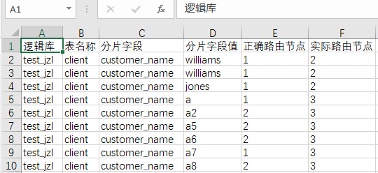

#### 路由异常详情


- 表格中正确路由节点与实际路由节点以"节点ID值"形式显示

- 点击按钮【加载更多】可显示更多未显示的记录，每次加载页面新增50条，如全部加载完则该按钮隐藏

- 点击【返回检测记录详情】页面跳转至[检测记录详情](#检测记录详情)

### 数据唯一约束检测

数据唯一约束检测，可对已创建的水平分片表或子表的历史数据进行唯一性校验。可帮助用户检测出定义了唯一约束的列在分布式环境中是否存在数据冲突。

#### 发起检测


**发起检测流程**

- 选择需要检测的逻辑库与分片表。被检测的分片表只能为已创建的水平分片表或子表
- 检测并发数默认为8，可根据实际需要调整，但最大值不超过32
- 点击【发起检测】可对需要检测的表进行唯一性约束检查

**发起检测失败原因**

一般发起检测失败的原因包括但不限于以下几类情况：

- 计算节点服务发生故障
- 未完成的检测任务，因管理平台服务停止而被中断
- 人为手动取消检测任务
- 其他异常（具体可查看异常标志内的提示说明）

点击【删除记录】按钮可删除页面中历史检测记录。若该记录存在检测时产生的结果文件（当检测结果详情超过2048字节时，结果以文件的形式保存），会一并删除对应文件。

#### 检测详情


1. 检测记录详情展示检测任务中对应表的检测结果，默认只展示"检测结果"异常的表记录。
2. 展示记录中"唯一键"列会显示该表中具有唯一约束的字段。当存在多个唯一键时会使用逗号隔开；若存在唯一约束由多个字段联合组成，则用括号显示。
3. 检测详情为被检测表的具体结果描述，若"检测结果"异常则该列会展示唯一约束字段以及重复的数据；若结果正常则该列为空。
4. 当表的检测详情内容超过2048字节时，检测详情列将不再展示具体重复的数据，而是提示具体详情需下载文件查看。
5. 点击右侧【查看表信息】按钮可进入具体表的详细说明页面。若表的检测详情内容超过2048字节时，操作栏中会出现【下载】按钮。点击按钮可获取对应的文件（文件由计算节点检测完根据需要产生，默认保存在计算节点安装目录中的`HotDB-TEMP`目录下）。
6. 点击【导出记录】支持导出全部或页面中选中的部分记录，需注意的是导出记录中不包括"检测结果"正常的记录信息。
7. 若表内设置唯一约束为前缀索引，在计算节点版本高于（包含）2.5.6时，仍旧可以被检测出。


## 事件

### 历史事件

历史事件是记录与展示HotDB Management平台级的历史信息的功能，包括：任务执行完成通知、定时检测异常通报、平台触发预警提示等。


#### 报警类型说明

##### 服务器时间差异

HotDB Management会定时检测存储节点服务器与计算节点服务器的时间差，若出现时间差，HotDB Management会将结果保存在历史事件中，并在页面右上角[事件通知](#事件通知)提示用户。

**警告级别：**时间差异为0.5秒-3秒的，事件级别为WARNING；3秒以上的，事件级别为ERROR。

##### 参数感知

存储节点MySQL的参数影响计算节点对一些命令的处理方式，因此HotDB Management会定时检测每个存储节点的参数是否一致且符合要求，不一致或不符合要求将记录警告。

##### 存储节点被共用

检测到存储节点被多个计算节点使用时，HotDB Management会给出警告信息。具体检测机制在计算节点中完成，HotDB Management在检测到存储节点被共用时记录历史事件，并通知用户。

##### 主备一致性检测

记录主备一致性检测的结果。在此处显示被检测的主备存储节点中的表结构、索引及记录是否一致。

##### 一键迁库

当HotDB Management执行一键迁库时，将记录一个历史事件，记录迁库是成功、失败还是有警告。

##### 数据库用户密码定期修改检测

当开启数据库用户密码过期提醒时，如果检测到数据库用户密码即将或者已经过期，HotDB Management将给出提醒警告，可在历史事件中查看详细信息。

##### 存储节点用户密码定期修改检测

当开启存储节点密码过期提醒时，如果检测到存储节点用户密码即将或者已经过期，HotDB Management将给出提醒警告，可在历史事件中查看详细信息。

##### 表结构与表索引检测异常

当HotDB Management执行"[表结构与表索引检测](#表结构与表索引检测)"任务时，若检测结果存在异常，HotDB Management会将异常检测结果记录为一个历史事件。

##### 配置修改备份失效

在HotDB Management配置菜单下修改某些配置库信息时，可能会对相关逻辑库的备份文件产生影响。历史事件将记录因配置修改导致相关逻辑库备份文件失效的信息。该事件类型的级别为WARNING。

##### 分片方案在线变更

"[分片方案在线变更](#分片方案在线变更)"任务执行完成时，历史事件会记录任务的执行情况。该事件类型的级别分别为WARNING、ERROR、INFO。

##### 全局唯一约束异常

当已创建的表开启全局唯一约束未能生效或关闭全局唯一约束但删除辅助索引失败时记录历史事件。该数据类型的级别为WARNING。

##### 计算节点服务状态

当计算节点管理端口（默认3325）或服务端口（默认3323）连接异常时记录历史事件，该事件类型为ERROR；当集群模式下的计算节点发生切换或重新选举时记录历史事件,该事件类型为WARNING

### 计算节点日志

记录计算节点在运行过程中产生的日志信息，帮助用户实时了解当前计算节点的运行状况。


#### 日志查看

- 选择"计算节点"可切换查看集群中其他计算节点的日志。默认展示当前主计算节点的日志

- 页面默认展示最近一周的日志，可通过"时间范围"调整查看日志

- 可按照日志类型筛选查看日志

- 可按照日志级别筛选查看，目前日志类型分为：ERROR、WARNING、INFO三个级别

- 可通过"日志内容"输入框，输入关键字模糊查询日志信息

- 页面默认高亮展示高级别日志，即ERROR级别日志信息

- 可点击【查看详情】获取更详细的日志信息

#### 日志获取说明

- HotDB Management每隔10分钟从计算节点取一次日志文件，保存至HotDB Management配置库中

- 计算节点日志默认存放在计算节点安装目录中logs目录下，一般为hotdb.log。若日志文件太大，会以日期的形式保存历史日志文件

- HotDB Management默认设置获取ERROR级别的日志信息保存至配置库中，若需要获取WARNING或INFO级别日志，可在页面点击【日志设置】进行调整。

- 点击【刷新日志】可在配置库中获取最新的日志信息

- 点击【下载日志文件】可将计算节点日志保存至本地

#### 日志类型说明

以下为所有计算节点日志类型说明：

| 日志类型                  | 类型说明                                                                                                            |
|---------------------------|---------------------------------------------------------------------------------------------------------------------|
| AUDIT                     | 记录所有审计日志相关的日志信息                                                                                      |
| AUTHORITY                 | 记录与许可证相关的日志信息，例如检测当前数据节点数量是否超出许可证所包含的节点限制等                                |
| BUFFER                    | 记录与缓存相关的日志信息，例如无法创建直接缓存、申请的缓存大小大于设置的chunksize等报错信息                         |
| CCCONFIG                  | 记录NDB配置信息相关的日志信息，例如NDB服务模式不支持的报错信息等                                                    |
| CCMETADATA                | 记录NDB元数据相关的日志信息                                                                                         |
| CCONNECTION               | 记录NDB连接相关的日志信息，例如检测发现达到最大连接数的报错信息等                                                   |
| CCPARSER                  | 记录NDB对SQL语句解析相关的日志信息，例如不支持的SQL语句的报错信息等                                                 |
| CCRECORDRW                | 记录读写NDB数据时，不支持的列类型或字符集类型等相关报错信息                                                         |
| CCSIGNAL                  | 记录NDB信号解析相关日志信息，例如信号量不支持压缩的报错信息等                                                       |
| CCSQLBUILD                | 记录NDB协议解析为SQL语句时的日志信息                                                                                |
| CLUSTER                   | 记录与集群相关的日志信息，例如集群间的心跳检测信息、集群广播包超时信息等                                            |
| CONNECTION                | 记录与连接相关的日志信息，例如因在绑定的会话中请求了新连接导致前端连接关闭的INFO信息等                              |
| CONNECTIONCLOSED          | 记录前端连接关闭时的日志信息                                                                                        |
| CROSSDNJOIN               | 记录是跨库JOIN查询的SQL语句                                                                                         |
| DDL                       | 记录与DDL相关的日志信息，例如记录所有的DDL操作等                                                                    |
| DEADLOCK                  | 记录与死锁相关的日志信息，例如死锁检测中的异常信息等                                                                |
| DISKSPACE                 | 记录磁盘空间相关的日志信息，例如检测发现由于写临时文件导致磁盘空间不足的报错信息等                                  |
| EXIT                      | 记录计算节点关闭前的日志信息，例如关闭前会清除数据一致性的检测结果和创建的临时表等                                  |
| FAILOVER                  | 记录与存储节点切换相关的日志信息，例如由于无可用的备存储节点导致存储节点手动切换失败等                              |
| HEARTBEAT                 | 记录与心跳检测相关的日志信息，例如获取存储节点后端连接失败导致心跳检测失败、心跳检测初始化异常等                    |
| HOLD                      | 记录与HOLD操作相关的日志信息，例如显示发送HOLD命令的客户端信息、HOLD成功或失败等                                    |
| HOTDBERROR                | 记录计算节点自定义的ERROR错误，详情请参考[计算节点错误码](error-codes.md)文档                                       |
| HOTDBWARNING              | 记录计算节点自定义的WARNING警告，详情请参考[计算节点错误码](error-codes.md)文档                                     |
| INIT                      | 记录与计算节点初始化相关的日志信息，例如初始化时，计算节点开始监听管理端口等                                        |
| INNER                     | 记录计算节点内部运算相关的日志信息，例如清除数据节点、创建表配置失败等                                              |
| JOIN                      | 记录与JOIN查询相关的日志信息，例如JOIN查询时的报错信息等                                                            |
| LIMITOFFSETWITHOUTORDERBY | 记录使用LIMIT但没有排序的SQL语句                                                                                    |
| MANAGER                   | 与管理端相关的日志信息，例如接收RELOAD命令时的连接信息等                                                            |
| MYSQLERROR                | 记录某个连接中出现的MySQL的ERROR错误信息，不包括死锁、锁超时、主键或唯一键冲突和违反外键约束                        |
| MYSQLWARNING              | 记录某个连接中出现的MySQL的WARNING警告信息                                                                          |
| NDB                       | 记录与NDB相关的日志信息                                                                                             |
| ONLINEDDL                 | 记录与OnlineDDL相关的日志信息，例如进行OnlineDDL操作时引发的报错信息等                                              |
| RELATIVE                  | 记录与父子表的辅助表相关的日志信息，例如更新父子表相关表配置（auxs列）的报错信息                                    |
| RESPONSE                  | 记录发起后端请求时后端响应相关的日志信息，例如发起后端请求后发现表结构不存在等                                      |
| ROUTE                     | 记录与路由相关的日志信息，例如分片字段类型不符合路由条件等                                                          |
| SQL                       | 记录与执行SQL语句相关的日志信息，例如执行某条SQL语句后的报错信息等                                                  |
| SQLFORWARD                | 记录备计算节点向主计算节点转发SQL的日志信息                                                                         |
| SQLINTERCEPTED            | 记录被SQL防火墙拦截的语句                                                                                           |
| SQLKEYCONFLICT            | 记录主键或唯一键冲突的MySQL的ERROR信息                                                                              |
| SQLSYNTAXERROR            | 记录与执行的SQL语法错误相关的日志信息                                                                               |
| SQLUNSUPPORTED            | 记录计算节点不支持的SQL语句，例如不支持的全局函数索引等                                                             |
| SUBQUERY                  | 记录是子查询的SQL语句                                                                                               |
| SWITCHSOURCE              | 记录故障切换后的数据正确性保障相关的日志信息，详情请参考[计算节点标准操作](hotdb-server-standard-operations.md)文档中的"故障切换后的数据正确性保障"章节 |
| TIMER                     | 记录与定时器相关的日志信息，例如延时检测的报错信息、记录checkVIP定时器执行ONLINE操作完成等                          |
| TRANSFER                  | 记录与一键迁库相关的日志信息，例如检测一键迁库的UUID是否为空或是否已经被使用等                                      |
| UNION                     | 记录是UNION查询的SQL语句                                                                                            |
| UNKNOWN                   | 记录除了其他日志类型以外的所有日志信息                                                                              |
| WATCHDOG                  | 记录与WATCHDOG相关的计算节点服务内部状况监测的日志信息，例如检测计算节点内容是否有死锁等                            |

### 操作日志智能分析

HotDB Management提供统计：select、insert、update、delete、事务开启、提交、回滚的，SQL语句执行耗时及次数统计的操作日志智能分析功能。可自动通过内部算法分析出需要优化的SQL语句，并标记待优化标志或给出SQL优化建议提醒用户。运维人员也可以通过查询页面统计结果自行分析SQL执行的效率以及哪些 SQL语句需要优化。还可以通过SQL性能追踪页面查看SQL语句执行计划，帮助系统提升性能。

**日志记录开启：**若页面不显示记录，建议检查是否开启了SQL日志统计开关。可在"配置->[计算节点参数配置](#计算节点参数配置)"页面，打开"统计SQL执行情况"开关。

#### 操作日志记录说明


**(1) 操作日志表格字段说明**

**逻辑库：**

执行SQL时使用的逻辑库名称

**SQL语句摘要：**

HotDB采用了类似mysqldumpslow的摘要方式，对相似的SQL语句分组，此处为摘要后的SQL

**SQL语句摘要说明：**

摘要后相同的SQL语句累计统计

SQL的where条件中，默认对常量字符串用"S"代替，常量数值用"N"代替；SQL的where条件中若常量数值小于10或存在"Y"、"N"等特殊含义常量则不进行替换，仍按照原值保留

SQL语句在计算节点层执行失败（例如拦截或不支持SQL）则操作日志不会记录；若SQL在发送至存储节点执行后出现失败，此时操作日志仍会记录该SQL执行信息

insert/replace的values子句2列表、insert set/insert onduplicate set的set子句列表、update set子句列表中，不判断常量数值是否小于10或"Y"、"N"等特殊含义常量**（在V2.5.3及以上版本中生效）**

**总执行次数：**

所有该类型SQL的SQL语句在计算节点中执行次数的总和

**计算节点平均执行时间：**

计算节点总执行时间除以总执行次数。计算节点执行时间指：从计算节点接收到第一个SQL语句数据包，到计算节点发出该SQL的最后一个结果包的执行时间。而计算节点总执行时间为所有该类型SQL的SQL语句执行时间总和

**存储节点平均执行时间：**

存储节点总执行时间除以总执行次数。存储节点执行时间指：从计算节点向后端发出第一个SQL语句数据包，到计算节点收到最慢的一个数据节点的最后一个SQL结果包的处理时间。若一个SQL被拆成N个SQL执行则时间累积计算，但不包含中间计算节点的处理时间。而存储节点总执行时间为所有该类型SQL的SQL语句执行时间总和

**存储节点执行时间占比：**

存储节点平均执行时间占计算节点平均执行时间的百分比，结果保留三位小数

**耗时分布详情：**

可查看所有该类型SQL的SQL语句在计算节点或存储节点中的执行时间分布情况

**SQL查询优化建议：**

根据内部算法，针对SQL查询给出优化建议

**(2) 查询耗时分布**


可点击【查看耗时分布】了解在计算节点或后端存储节点中该类型SQL语句的执行时间分布情况

执行耗时分布情况采用柱状图形式表示，可查看执行时间占比最多的耗时区间

**(3) 待优化SQL**


待优化SQL语句为页面中带有黄色蜗牛标志的SQL。一般带此标志的SQL语句需要重视，并分析具体执行情况，尽力优化

评判SQL语句是否需要优化的标准可点击【待优化SQL标准设置】按钮，查看或编辑


**(4) SQL查询优化建议**


根据管理平台内部算法，检查SQL语句结构、执行时间、执行计划等，筛选出不合理的SQL语句，并给出优化建议

点击勾选框"仅查看SQL查询优化建议"可筛选出所有建议优化的SQL语句

SQL建议内容列举如下：

- 子查询嵌套超过三层，建议根据业务需要改写SQL
- 使用union或union all对同一张表查询超过三次的，建议合理使用case when 等条件判断减少union次数
- 建议根据业务需要使用union all 而非union
- 当前查询的表为水平分片表，建议where过滤条件含有分片字段
- 此条查询为跨库JOIN查询，建议关联字段为分片字段

例如：此条跨库SQL JOIN查询未使用分片字段作为关联字段，在这样的情况下，计算节点需要跨数据节点交叉比对数据，耗时较大，因此对此类SQL语句给出建议。


**(5) 平均执行时间过长的告警**

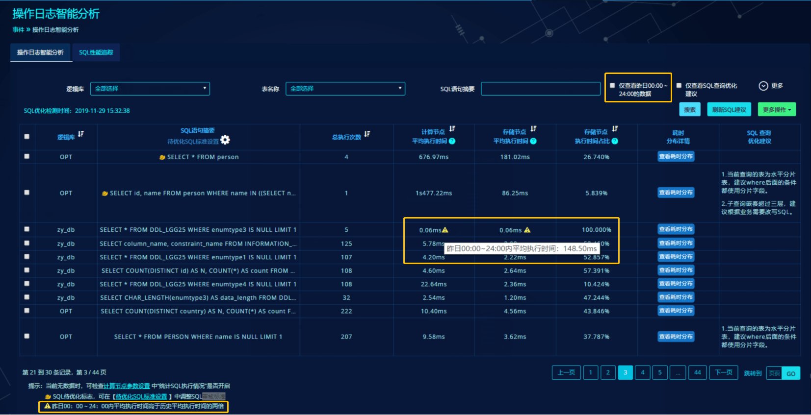

针对计算节点平均执行时间或存储节点平均执行时间，若发现昨日00：00 ~ 24：00内平均执行时间高于历史平均执行时间的两倍，会出现三角标识的提示信息

点击勾选框"仅查看昨日00：00 ~ 24：00的数据"可刷新显示昨日00：00 ~ 24：00的SQL执行情况

#### SQL性能追踪

HotDB Management提供SQL性能追踪功能，可视化地展示SQL语句的执行计划（HotDB Profiles）。可用于对比查看一条SQL语句在优化前和优化后的执行计划，也可单独查看一条SQL的执行计划。


输入用户名，密码（用户名密码为计算节点[数据库用户](#数据库用户管理)），并选择需要查询的逻辑库。

> !Note
>
> 选择登录的计算节点数据库用户，设置的"主机"范围必须包括当前HotDB Management所属服务器的IP地址，否则无法连接计算节点。

输入SQL查询语句，一次可输入最多三条，点击【执行】查看性能追踪对比结果。若输入的SQL语句不是SELECT语句或执行失败，则显示报错信息

执行计划将显示每一个步骤的相对时间点和耗时（μs为单位），详情请参[计算节点标准操作](hotdb-server-standard-operations.md)文档的HotDB Profiles相关章节


点击【查看执行时间图解】查看执行计划可视化结果。每次只能查看一条执行时间图解


### 通知策略

HotDB Management支持通过邮件的方式对集群运行中发生的故障或异常问题进行告警提示。目前邮件提醒的监控范围包括：计算节点与存储节点故障或切换、计算节点服务资源状态、计算节点服务器状态、存储节点相关监测、系统定时任务检测、许可证授权监控。

容灾模式说明：集群开启容灾模式时，通知策略相关逻辑说明请结合[跨机房容灾部署](cross-idc-disaster-recovery-deployment.md)文档中的[通知策略](#通知策略)章节。

#### 添加通知策略


**添加通知策略参数说明**

- **收件人：**多个收件人用英文分号隔开
- **抄送：**选填项
- **监控项：**邮件提醒中监控项不能为空，监控项勾选父项，子项会自动全选
- **监控项设置注意事项：**
  1. 要进行相应项的邮件提醒，需先确保监控项已在[设置](#设置)中打开，否则没有该监控项的报警通知（监控项可在[设置](#设置)菜单中打开并自定义对应项的预警值）
  2. 若通知设置【设置-->[通知设置](#通知设置)】中对应项的通知频率开关关闭，即使当前子项勾选也不会进行邮件提醒，通知设置开关开启是邮件发送的前提
  3. 添加通知策略需提前完成[发件箱参数设置](#发件箱参数设置)的配置,若未完成发件箱参数设置的配置，则保存通知策略时会提示需要先设置发件箱参数
  4. 满足以上三点，且已配置通知策略时：若设置的父项中有任何勾选的子项存在异常或超出阈值的情况，邮件会根据设置的通知频率进行邮件提醒（邮件提醒依赖于后台相关定时任务）
  5. 邮件提醒中监控项数据取通知频率期间最近的一次报警情况

#### 监控项说明

##### 故障实时监控

故障状态监控项取通知频率期间检测到的最新一次的异常情况，进行邮件提醒。若故障未恢复邮件将重复提醒，恢复正常后将不再提醒。


**邮件示例：**计算节点服务发生故障或切换，提示信息如下:


**邮件示例：**存储节点服务发生故障或切换，提示信息如下:


##### 计算节点服务资源监控

计算节点服务器资源监控项的数据取通知频率期间最近一次超出阈值的情况。

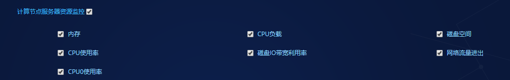

**阈值设置：**要进行计算节点服务器资源相应项的监控，需先在"设置->[监控面板设置](#监控面板设置)"中打开监控项并设置相应的阈值，如下图：


> !Note
>
> 以上阈值为测试环境便于制造报警信息而设置，请勿套用在生产环境。

**邮件示例：**计算节点服务器资源实时监控报警提醒，提示信息如下:

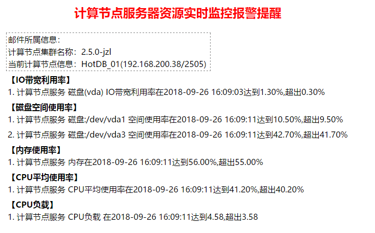

##### 计算节点件服务状态

计算节点服务状态监控项的数据取通知频率期间最近一次超出阈值的情况。


**阈值设置：**要进行计算节点服务状态相应项的监控，需先在"设置->[拓扑图报警设置](#拓扑图报警设置)"中打开监控项并设置相应的阈值，如下图：

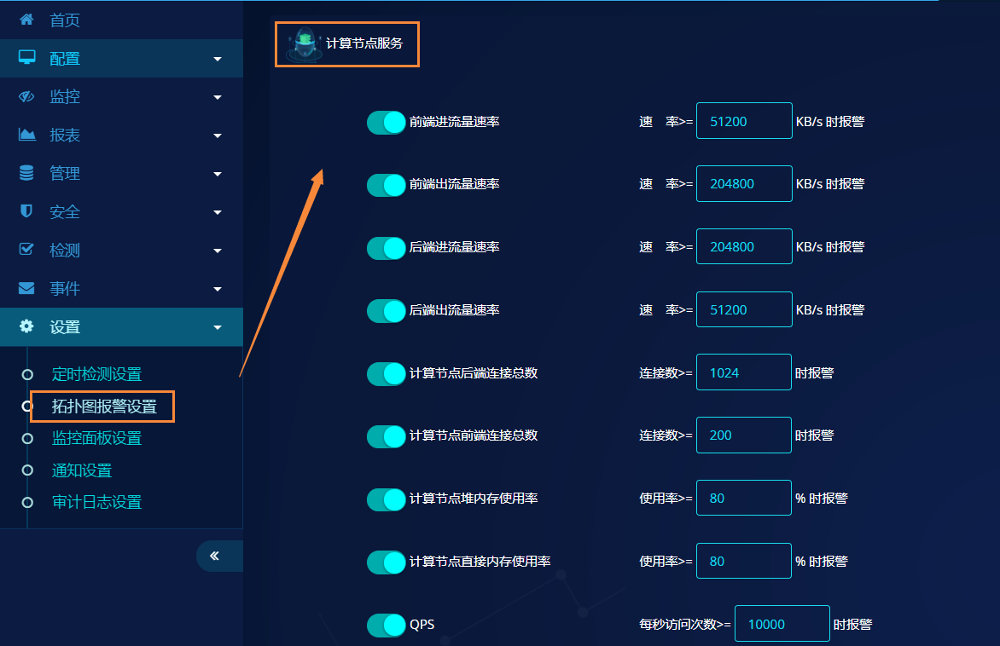

> !Note
>
> 以上阈值为测试环境设置，仅供参考，生产环境切勿套用。

**邮件示例：**计算节点服务状态监控报警提醒，提示信息如下:


##### 其他服务器资源监控

[其他服务器资源](#集群资源监控)监控项数据取通知频率期间最近一次超出阈值的情况。


**阈值设置：**要进行其他服务器资源相应项的监控，需先在"设置->监控面板设置"中打开监控项并设置相应的阈值，如下图：


> !Note
>
> 以上阈值为测试环境便于制造报警信息而设置，请勿套用在生产环境。

**邮件示例：**其他服务器资源监控异常提醒，提示信息如下:

> 

##### 存储节点相关监控

存储节点相关监控项数据取通知频率期间最近一次的异常情况。


**阈值设置：**要进行存储节点相应项的监控，需先在"设置->[定时检测设置](#定时检测设置)"与"设置->[拓扑图报警设置](#拓扑图报警设置)"中打开监控项并设置相应的阈值，如下所示：


> !Note
>
> 以上阈值为测试环境便于制造报警信息而设置，请勿套用在生产环境。

**邮件示例：**存储节点相关监控报警提醒，提示信息如下:


##### 定时检测异常监控

定时检测异常监控通知取通知频率期间最近一次的异常情况（备份/还原失败除外）


**阈值设置：**要进行存储节点相应项的监控，需先在"设置->[定时检测设置](#定时检测设置)"

中打开监控项并设置相应的阈值


> !Note
>
> 备份/还原在通知时间范围内失败即提醒，该提醒只包含正常备份/还原发起后，异常情况引起的失败。

##### 配置库相关监控

配置库相关监控通知取通知时间内最近一次的异常情况。


**阈值设置：**要进行配置库相应项的监控，需先确保监控项在"设置->[拓扑图报警设置](#拓扑图报警设置)"中打开且已设置相应的阈值如下所示：


> !Note
>
> 以上阈值为测试环境设置，仅供参考。

**邮件示例：**配置库相关监控报警提醒，提示信息如下:


##### 许可证授权监控

检测计算节点许可证授权是否即将过期。在检测开关打开时，如果授权检测符合提醒条件，会按照设置的提醒频率发送邮件。


**许可证授权监控说明：**

"许可证授权到期"及"许可证授权检测异常"检测出异常后，均有3种通知方式：页面弹窗提示；顶部信息栏提示（许可证状态默认显示）；邮件提醒（需设置收发件信息，未设置则无邮件提示）。

> !Note
>
> 弹窗提示及顶部信息栏提示不受邮件设置影响。

许可证授权到期是指当前许可证是有一定期限的许可证，其许可期限已到。系统会根据[通知设置](#通知设置)的许可证授权监控开关状态、[定时检测设置](#通知频率设置)中通知频率以及提前通知天数的设置，判断是否发送许可证授权到期提醒的邮件。

**邮件示例：**许可证授权到期邮件提醒内容如下：


若当前许可证有限期为永久，则"许可证授权到期"勾选框不会显示


若当前许可证为已过期的许可证，则HotDB Server将停止服务


点击【我知道了】按钮弹窗关闭，若刷新当前页面会再次激活弹窗。

rr- 许可证授权检测异常包含"获取许可证信息发生异常"和"许可证授权信息无法更新"两种异常（当"获取许可证信息发生异常"和"许可证授权信息无法更新"两种异常同时存在时，"获取许可证信息发生异常"会在弹窗中优先展示）

**许可证授权过期提醒弹窗提示如下：**


**获取许可证信息发生异常弹窗提示如下：**


**许可证授权信息无法更新弹窗如下：**


**按钮说明：**

点击弹窗右上角【取消】按钮，弹窗消失，再次登录或刷新页面会再次激活弹窗

点击【我知道了】按钮，弹窗消失，再次登录或刷新页面会再次激活弹窗

点击【不再提示】按钮，弹窗消失，再次登录或刷新页面则不在弹出弹窗（除非新增新的异常）

**邮件示例：**获取许可证信息发生异常邮件提醒内容如下：


**邮件示例：**许可证授权信息无法更新异常邮件提醒内容如下：


### 审计日志

审计日志主要可查看HotDB Management用户在平台的操作记录，同时可查看集群内计算节点的安全防护拦截记录以及在管理端口（默认3325）中的操作。安全防护与管理端操作审计功能仅支持在计算节点版本大于等于V2.5.0时使用。

#### 平台操作

可以查看集群内所有普通用户在管理平台的操作。该功能具体记录哪些类型的操作，可以在页面的操作类型下拉框中查看。访问IP和操作内容输入框，支持模糊查找。


**表格信息说明：**

- 用户名：登录管理平台所用的账户
- 访问IP：登录管理平台本机所在IP。支持模糊查询
- 操作类型：下拉框中列出了所有支持的类型。勾选多选框，可筛选显示选中操作类型的日志
- 操作内容：记录用户真实的操作，且记录重要参数。支持模糊查询
- 传入参数：更详细的用户操作日志，方便分析用户操作
- 操作时间：记录用户真实的功能使用时间，且支持按时间范围来筛选日志记录
- 操作结果：记录真实的操作结果。可根据操作结果筛选日志记录

#### 安全防护

可以查看计算节点安全防护相关的拦截日志具体被拦截的原因类型，可以在页面的拦截类型下拉框中查看。访问IP和拦截详情输入框，支持模糊查找


**表格信息说明：**

- 计算节点：进行拦截操作的计算节点
- 用户名：请求操作所用的账户
- 访问IP：请求操作本机所在IP。可支持模糊查询
- 拦截类型：下拉框中列出了所有支持的类型。勾选多选框，可筛选显示选中拦截类型的日志
- 拦截详情：记录具体请求详情或者通过猜测重新构造出来的请求命令行。可支持模糊查询
- 发生时间：记录真实的请求时间。支持选择时间范围来筛选日志记录
- 拦截结果：记录真实的拦截结果。可根据拦截结果筛选日志记录

#### 管理端口操作

可以查看所有计算节点数据库用户（含管理平台使用计算节点数据库用户时）在管理端口的操作。该功能具体记录哪些类型的操作，可以在页面的操作类型下拉框中查看。访问IP和拦截详情输入框，支持模糊查找。如果选择了计算节点组，只显示选中的计算节点组的操作记录。可以选择具体的计算节点，默认选中所有计算节点。


**表格信息说明：**

- 计算节点：记录所属的计算节点
- 用户名：登录管理端口的账号
- 访问IP：登录管理端口的客户端所在IP
- 操作类型：下拉框中列出了所有支持的类型。勾选多选框，可筛选显示选中操作类型的日志
- 操作命令：实际在管理端口执行的命令
- 操作时间：记录真实的操作时间，支持选择时间范围来筛选日志记录
- 操作结果：记录真实的操作结果。可根据操作结果筛选日志记录

#### 审计日志设置

审计日志的审计对象可在"设置->[审计日志设置](#审计日志设置)"中配置，默认审计所有支持的审计对象。

## 设置

### 定时检测设置

#### 定时检测设置

定时检测设置是HotDB Management为后台定时任务提供开关控制与相关参数设定的功能。


打开按钮（按钮圆点靠右为打开）可开启后台定时检测线程，关闭则不执行。

打开检测项后可设置具体检测频率或检测到异常时提醒时间。

此处定时检测任务若关闭将导致"事件->[通知策略](#通知策略)"中对应项的邮件报警失效。

#### 定时计划

此处提供集中设置定时计划任务的入口设置后的效果与原功能中定时计划入口一致。目前提供：集群元数据定时备份计划、全局表数据定时检测计划、主备数据一致性定时检测计划、表结构与表索引定时检测计划、数据分片路由定时检测计划、数据唯一约束定时检测计划。具体设置方式可参照对应功能章节中的说明。


### 拓扑图报警设置

可以对"监控->[智能逻辑拓扑](#智能逻辑拓扑)"中每一层监控项进行报警的阈值设置，当超出阈值时，拓扑图将显示对应的警告信息。 重置按钮点击可恢复默认报警设置。


### 监控面板设置

对应"监控->[监控面板](#监控面板)"中"计算节点服务状态"、"计算节点流量"、"计算节点服务器资源"、"其他服务器资源"各大面板的监控项开关。还可以设置数据刷新频率以及服务器参数的报警阈值。


- 每个监控项都可以选择是否开启该监控
- 允许设置刷新频率
- 允许重置
- 按钮关闭时，监控面板将提示需要开启监控才可以使用


### 通知设置

为"事件->[通知策略](#通知策略)"中的邮件报警功能设置发件箱参数，以及设置监控项的通知开关和通知频率。

#### 发件箱参数设置

发件箱设置，可输入发件箱参数并测试连接，如下图：


**发件箱参数说明**

- **发信名称：**发信人的备注信息
- **发信人邮箱地址：**发信人的完整电子邮箱地址
- **采用SSL与SMTP服务器端口：**如果勾选采用SSL的勾选框，则SMTP服务器端口默认为 465；如果未勾选则SMTP服务器端口默认为 25，SMTP服务器端口也可编辑
- **SMTP服务器地址：**邮件服务器所在的地址，例如：smtp.exmail.qq.com
- **SMTP验证：**SMTP服务器是否要求验证，默认勾选。如果勾选------>SMTP用户名及SMTP密码为必填项；如果未勾选------>SMTP用户名、SMTP密码不可编辑（如果管理平台在邮箱服务器免密范围内，可不勾选SMTP验证）
- **SMTP用户名：**一般为发信人邮箱地址@的左侧部分，部分邮箱厂商要求填写完整的电子邮箱地址
- **密码：**SMTP用户密码，用于验证SMTP服务器用户的身份

**测试邮件发送**

- 输入正确的参数并点击测试校验，弹出邮件测试窗口，如下图所示：


- **邮箱：**收件箱地址（内网则需要填写对应的内网收件箱地址）。点击【发送测试邮件】按钮会对发件箱参数设置及收件箱参数进行校验。参数填写有误时弹窗提示"测试邮件发送失败"；各类设置无误时提示"邮件发送成功，请注意查收"；若填写的邮件验证码有误时弹窗显示错误信息，如下图所示：


- 测试邮件内容如下图所示：


- **邮箱验证码：**正确填写收到的邮箱验证码，点击确定按钮将保存配置并提示"验证通过"；填写错误则提示"验证码错误"（验证码不区分大小写，但需注意输入是否有空格）

#### 通知频率设置

监控通知频率控制邮件报警中对应项的邮件发送间隔时间（也可理解为邮件报警检测频率），如下图：


关闭对应监控项会导致"事件->[通知策略](#通知策略)"中对应项的邮件报警不会报警。关闭前请检查是否有勾选了该监控项的通知策略。

### 审计日志设置

可设置"事件->[审计日志](#审计日志)"中审计日志记录的操作功能菜单，以及审计日志记录的保留时间。


## 工具

### 信息收集

HotDB Server集群组件较多，运行机制较为复杂。当出现异常问题或故障的时候问题排查比较困难。利用信息收集工具可快速搜集异常分析所需要的日志与配置文件等，从而提高问题排查速度。

**功能入口：**在管理平台中点击[工具](#工具)->[信息收集](#信息收集)进入[信息收集](#信息收集)页面


**收集场景：**

信息收集按照收集场景划分为："集群运行状况"、"性能测试"两种。

- **集群运行状况：**针对集群在运行过程中出现故障、异常、运行卡顿等问题时的信息搜集场景。该场景下收集的信息会包括整个集群运行组件的运行日志，配置文件，服务器状况等信息
- **性能测试：**针对HotDB Server进行性能测试后，需要对性能测试结果分析或寻找性能瓶颈的场景。该场景下收集的信息主要集中在计算节点、存储节点、配置库以及服务器相关信息

**收集清单：**

收集清单为信息收集时需要打包的文件，不同的集群模式收集的清单也会不同。如计算节点为主备模式时，收集清单会增加收集keepalived组件相关信息；为多节点负载均衡模式时，收集清单会增加收集LVS组件相关信息，具体以页面展示清单为主

> !Note
>
> 在"集群运行状况"场景下收集信息时，如果配置库或存储节点实例版本为MySQL8.0及上，则会根据实际情况收集`mysqld_auto.cnf`文件。该文件暂不展示在页面清单中，只根据实际版本情况进行收集

**功能说明：**

进行信息收集主要关注以下步骤和事项

1. 按实际收集需求选择好场景

2. 根据实际情况选择打开或关闭收集设置

   **计算节点服务器导出整个JVM内存信息：**该开关为在"集群运行状况"场景收集时需要注意的，页面默认关闭。若打开需要考虑可能导致的full GC问题，生产环境不建议打开该开关。若打开，则在收集计算节点相关信息时会执行：`jmap -dump:live,format=b,file=dump.bin [pid] 2>&1`（注：pid为计算节点进程ID）

   **允许使用smartctl与MegaCli命令搜集服务器相关信息：**该开关为在"性能测试"场景收集时需要注意的，页面默认打开。若在执行smartctl与MegaCli命令时发现服务器未安装对应组件，程序将通过yum方式自动安装对应命令

3. 点击"一键收集"按钮

   **发起收集任务前需要注意：**

   1.当前管理平台没有其他计算节点组正在执行信息收集任务，若有，则此次发起的收集任务失败。需要等待其他任务完成后才能正常执行"一键收集"
   2.发起任务的计算节点集群需要在[配置](#配置)->[服务器](#服务器)菜单页面为所有服务器配置可用的SSH信息，否则收集过程中可能因SSH连接失败导致部分服务器信息无法收集
   3.尽量保证计算节点服务正常运行。若检测到计算节点无法正常连接，则需要手动提供计算节点日志所在位置信息

4. 关注[工具](#工具)->[信息收集](#信息收集)->"记录"页面的收集任务执行情况

5. 收集完的任务会自动将收集到的信息以压缩包的形式下载到管理平台本地，用户也可以后期在管理平台记录页面重新下载历史任务的文件

6. 任务收集的文件默认存放在管理平台服务器/opt目录下，若手动删除该目录下文件，则页面对应文件无法下载。

7. 存放在管理平台服务器上的收集文件，管理平台默认保留30天。对过期文件，程序会在每天凌晨以及设置文件窗口期时执行删除任务。

   

8. 删除页面记录，程序也会对应删除在管理平台服务器/opt目录下的文件内容

9. 收集文件的压缩包主要按照集群组件类型进行划分；每种组件类型文件夹打开又以服务器IP或服务器IP+标识端口进行划分。

10. 对于无法收集或收集异常的信息，压缩包内统一用"任务收集异常报告.txt"记录：

    

### 许可证管理

此功能同admin端中"[许可证管理](#许可证管理)"功能，具体说明请参照相关章节。

### 业务数据汇报

业务数据汇报为用户提供集群年报，可对集群业务数据进行汇总统计，支持用户了解集群运行至今对企业产生的实际效益同时提供集群运行的缺陷不足。

**功能入口：**登录管理平台[工具](#工具)->[业务数据汇报](#业务数据汇报)进入业务数据汇报页面,如下图：


页面每次进入时，自动获取业务数据，默认按照统计周期："按月份"选择"当前月份"数据展示，统计周期可选择："按月份、按季度、按年度"。

- 按月份：选择范围为起始时间的月份至当前月份，格式为"年份+月份"
- 按季度：选择范围为起始时间所在的季度至当前季度，格式为"年份+季度"
- 按年度：选择范围为起始时间所在的年度至当前年度，格式为"年份+年度"


在重新选择时间范围进行业务数据统计时，页面会自动刷新匹配数据。点击【导出】按钮，可进行数据报表的导出，导出的数据格式可选PDF/WORD文件，导出的文件名称为：集群名称+业务数据汇报+时间维度（即筛选的时间维度）

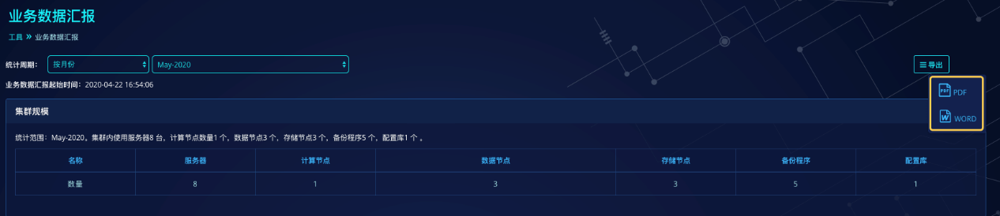

#### 集群规模

集群规模展示集群中服务器以及各集群组件的数量，以图文结合的方式进行展示，文字显示在筛选时间范围段内（根据筛选下拉框显示）当前各组件的名称及数量的具体统计信息。

- **服务器：**当前计算节点集群的服务器数量，数据从"配置->服务器"获取
- **计算节点：**当前计算节点集群总的计算节点个数
- **数据节点：**当前计算节点集群总的数据节点个数
- **存储节点：**当前计算节点集群总的存储节点个数
- **备份程序：**位于存储节点服务器上且处于启动状态的备份程序个数
- **配置库：**当前计算节点配置库个数
- **LVS：**集群模式下LVS服务器的个数

集群规模的数据每天凌晨进行定时更新，如下图：


> !Note
>
> 初始系统还未进行数据统计时，所有组件数量均会以"---"展示

#### 集群数据

集群数据包括分四部分：集群数据量、单日数据新增峰值曲线、数据容量规划预测和数据操作，其中每个部分都以图文结合的方式进行展示

**(1) 集群数据量**

- **总数据量：**当前计算节点集群所有数据节点下表的总数据量
- **最大逻辑库：**当前计算节点集群数据量最大的逻辑库
- **最大数据节点：**当前计算节点集群数据量最大的数据节点
- **最大表：**当前计算节点集群数据量最大的表

数据每天零点进行定时更新，进行统计和展示。页面显示包括：集群总数据容量、数据量最大的逻辑库及其数据量、数据量最大的数据节点及其数据量、数据量最大的表及其数据量，如下图：


> !Note
>
> 初始系统还未进行数据统计时，所有数据均会以"---"展示

**(2) 单日数据新增峰值曲线**

数据每天零点进行定时更新，统计范围内单日数据新增峰值量最大的日期和对应的数据量及其前后一天的数据进行展示，如果前后一天之内没有对应的数据，那么会依次顺延，选取离峰值数据最近的日期和其数据进行展示，如下图：


如果在筛选的时间范围内出现多个峰值相同的时间点，会优先筛取离当前筛选时间最近的一次数据作为展示

> !Note
>
> 初始系统还未进行数据统计时，页面显示暂无数据

**(3) 数据容量规划预测：**

数据容量规划预测包括：集群数据量未来一年增长预测、计算节点配置库未来一年增长预测和管理平台配置库未来一年增长预测。默认将当前时间往后推一年，与当前用户选择的具体时间范围无关。

数据每天凌点定时更新，将当天的集群数据量、计算节点配置库数据量和管理平台配置库数据量进行分别统计，若当前增量预测中的统计数据未满21天，则提示："当前数据记录尚未满21天，暂时无法进行增量预测"，如下图：


点击曲线图右上方的放大图标，可对曲线图进行全屏查看，当鼠标悬浮到曲线图上时，会具体显示当前对应日期及其历史容量统计和容量趋势预测数据量，再次点击放大缩小按钮可以回退到业务数据汇报页面，如下图：


> !Note
>
> 初始系统还未进行数据统计时，页面显示暂无数据

- **数据操作：**数据操作包含：集群完成有效备份次数、成功完成数据恢复次数、成功执行普通DDL语句的条数、执行在线DDL语句的条数，数据会进行实时获取和展示。
- **数据备份：**管理->数据备份列表，备份状态为备份完成的备份任务都会进行实时统计。
- **数据恢复：**管理->数据恢复列表，恢复成功的数据都会实时统计。
- **普通DDL：**管理->表结构变更->普通DDL，执行普通DDL操作，每一次成功的DDL操作都会实时统计。
- **在线DDL操作：**管理->表结构变更->在线DDL，执行在线DDL操作，每一次成功的在线DDL操作都会实时统计。

当前会按照月份分别统计不同操作的执行次数，当月的操作次数会进行累加，至新一个月时，会重新开始进行操作次数的累加统计，如下图：


> !Note
>
> 初始系统还未进行数据统计时，页面显示暂无数据

#### 集群性能

集群性能显示的数据为筛选时间范围内计算节点的峰值及时间，包括两部分的数据：计算节点的QPS、TPS、连接数，存储节点的QPS、连接数。数据每天凌点定时更新，如下图：


> !Note
>
> 初始系统还未进行数据统计时，均会以"--"展示

#### 集群保障

集群保障分别统计当前集群的计算节点、数据节点和配置库的高可用数据，高可用数据包括故障累计时间、故障累计次数和可靠性。数据每天凌点定时更新，并以图文结合的方式在管理平台端进行展示。

**(1) 故障累计时间**

- **计算节点故障累计时间：**在筛选时间范围段内，该集群的计算节点发生的所有高可用切换从故障发生到切换完成的累计时间, 单位秒。
- **数据节点故障累计时间：**在筛选时间范围段内，该集群中所有数据节点发生的"存储节点高可用切换时间"累计之和, 单位秒。
- **配置库故障累计时间：**在筛选时间范围段内，该集群的计算节点配置库发生的[高可用切换](#高可用切换)累计时间之和, 单位秒。

**(2) 切换累计次数**

- **计算节点切换累计次数：**在筛选的时间范围段内，该集群的所有计算节点总共发生过的高可用切换的次数。
- **数据节点切换累计次数：**在筛选的时间范围段内，该集群的所有数据节点总共发生过的高可用切换的次数。
- **配置库切换累计次数：**在筛选时间范围内，所有配置库发生高可用切换的总次数。

**(3) 可靠性**

**可靠性** = （1-（筛选范围内故障累计时间/ 筛选范围的总时间））* 100%。若故障累计时间为0，则可靠性不计算直接为100%。


> !Note
>
> 初始系统还未进行数据统计时，均会以"---"展示。当计算节点/数据节点/配置库为单节点/单库时，展示：单节点/单库，暂无统计，如下图：


#### 集群运维

集群运维包括数据检测、部署升级、告警优化和安全防护。

**(1) 数据检测**

包含主备数据一致性检测、全局表数据检测、表结构与表索引检测、路由正确性校验、数据唯一约束检总共5种类型的检测，以图文结合的方式展示。

1. 异常表占比 = （异常表数量 / 检测表总数量 ） * 100%
2. 检测子菜单中，可以进行主备数据一致性检测、全局表数据检测、表结构与表索引检测，路由正确性校验和数据唯一约束检测，检测数据实时统计并进行展示，如下图：

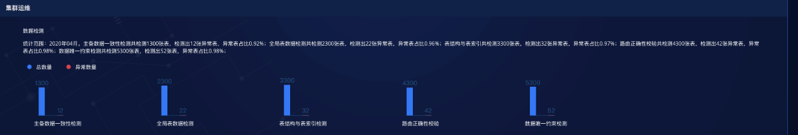

**(2) 部署升级**

展示在筛选时间范围内，成功完成的集群升级次数和许可证更新次数，当有升级和更新操作发生时，数据进行实时统计和展示，如下图：


**(3) 告警优化**

展示在筛选时间范围内，成功发送的告警邮件数、慢查询优化的条数以及分片方案变更的表数目。数据进行实时统计和展示，如下图：


**(4) 安全防护**

展示在筛选时间范围内拦截IP的个数、拦截SQL的条数以及错误密码的登陆次数（登录服务端/管理端的错误密码），如下图：


> !Note
>
> 初始系统还未进行数据统计时，均会以"--"或暂无数据展示

### 智能巡检

为方便运维人员及时知晓数据库集群内部是否存在隐患或异常，在管理平台版本高于（包含）2.5.6时新增了智能巡检功能，通过该功能可以对计算节点集群进行日常数据库巡检工作，及时规避当前数据库服务在运行过程中存在的隐患问题。

因该项内容较多，占用篇幅过大，可转移至[智能巡检](intelligent-inspection.md)文档查看使用详情说明。

## 导航内容

导航内容在HotDB Management顶部，始终显示其内容。对其中功能目前暂不支持菜单权限控制。


### 版本显示


显示目前所选计算节点集群基本信息：集群名称、计算节点版本号，许可证授权信息（许可证类型：测试版或永久、剩余时间）、节点限制数、逻辑库数限制。

点击"[许可证管理](#许可证管理)"可跳转至"[许可证管理](#许可证管理)"功能中。

**许可证信息说明：**

当计算节点无法连接时，该处会有红色小圆点标识，点击"版本信息"会提示"无法连接到计算节点"。如下图所示：


**许可证状态检测：**

当许可证信息出现异常时，信息栏显示相应的异常提醒信息（橙色小圆点提示），如下图所示：


**许可证异常的其他形式通知：**

许可证信息检测时发现异常，除了在顶部信息栏中会有相应的提示外，在用户登录管理平台或刷新首页时也会弹出异常信息提示。另外用户也可配置邮件[通知策略](#通知策略)，当许可证信息异常时可收到邮件提醒。在计算节点日志中也会记录相关异常信息。

> !Important
>
> 目前许可证信息发生异常不会导致计算节点服务的停止，但需要引起关注，并在业务低峰期时重启计算节点服务来解决。

### 计算节点集群切换

在导航栏中，点击【返回计算节点集群选择】按钮，进入计算节点集群选择页面。


### 帮助中心

#### 新手导航

在导航栏处，点击帮助中心，选择【新手导航】可进入新手导航指引页面。


#### API接口说明

在导航栏处，点击帮助中心，选择【API接口说明】可进入API使用说明页面。


API使用说明包含平台角色说明，格式接口说明，平台接入说明，状态码说明，管理平台用户认证。


> !Note
>
> 在管理平台V 2.5.3及以后版本，用户登录认证统一采取加密传输的方式进行。

### 动态加载

#### 动态加载说明

当HotDB Management中修改了计算节点相关配置或参数时，如需要立即生效，可通过[动态加载](#动态加载)功能将修改的配置或参数同步到计算节点内存中。目前只有部分参数支持动态加载生效。

**动态加载提示说明：**

在管理平台中进行了需要动态加载的修改后，【动态加载】按钮上出现待加载的标志。用户点击【动态加载】并提示"同步完成"后，待加载标志自动消失。该提示计算节点集群为单位，不同用户进入同一计算节点集群，待加载标志都会按需显示。具体如下图显示：


**动态加载特殊场景说明：**

动态加载过程中，如果遇到主备配置库、主备存储节点切换，页面会提示用户并提供【强制停止切换】和【取消动态加载】两种选择方案。具体如下图所示：


点击【确定】按钮则强制取消当前切换并进行同步加载，成功后提示同步加载成功；点击【取消】按钮则取消本次同步加载操作。

#### 功能演练


**第一步：**在导航栏处点击【动态加载】按钮，页面弹出框提示："是否确认将配置数据同步到计算节点"？


**第二步：**点击【确定】会先检测"配置->[配置校验](#配置校验)"模块下内容是否有错误。当全部检测通过时，将实际执行动态加载，成功将提示："同步成功"。当有错误时，则提示："配置校验失败"。


**第三步（异常情况时）：**当配置校验失败后，点击【检查配置】则会跳转到"配置->[配置校验](#配置校验)"模块下，可查看具体报错信息。


#### 需要动态加载以生效的场景


需要动态加载以生效的功能操作如下：

- 节点管理：添加、修改、删除
- 切换:添加、修改、删除
- 存储节点组：添加、修改、删除（如果该存储节点组有关联存储节点则需要，否则不需要）
- 逻辑库：添加、修改、删除、批量删除
- 表信息：快速添加表信息、新增表、修改表、删除、批量删除（也包括子表的增删改）
- 分片规则：添加、修改、删除、复制
- 计算节点参数配置：修改参数
- 数据库用户管理：添加、修改、删除、批量删除
- 白名单：添加、修改、开关、删除、添加白名单
- SQL防火墙：批量启用、启用、批量停用、停用
- 数据库用户密码：修改成功密码
- 存储节点密码：单个修改、批量修改、一键设置（设置选中、设置所有）

### 事件通知

展示各种报警通知及其他事件通知。有通知信息时右上角显示通知总条数，没有则不显示；


事件通知内容与[首页](#首页)的[事件通知](#事件通知)内容一致。

点击事件通知中的具体事件可跳转至"事件->[历史事件](#历史事件)"或具体功能查看详细情况。

事件通知内容分为三个等级：ERROR、WARNING、INFO；图标分别为、、

可在事件通知中点击【设置】按钮，为相应事件设置是否显示提示。

### 主题切换

在导航栏处，点击【主题切换】可更换当前HotDB Management的主题风格。


### 用户信息

#### 切换用户视角

HotDB Management当前用户如果为"管理用户"，可在普通用户视角右上角选择切换到管理用户视角。也可在管理用户视角右上角选择切换到普通用户视角。

#### 修改用户信息

修改用户信息中只能修改个人的密码，查看自己的用户名和计算节点集群权限。在导航栏处，点击【修改用户信息】进入个人信息页面。


在个人信息页面，输入当前密码，输入新密码及确认新密码，点击【保存】可修改用户密码。

新密码不能与当前密码一样。

若忘记密码，请联系超级管理员重置密码。


高危操作验证开关的打开或关闭都需要进行口令校验。


如果高危操作验证开关开启，用户进行危险操作时需要高级密码的确认。如：存储节点密码修改、普通DDL与在线DDL执行的SQL中包含"DROP"、"TRUNCATE"等危险操作指令时。


### 退出登录

在导航栏处，点击【退出登录】可以退出账号。账号退出成功后，跳转到登录页面。


### 语言切换

管理平台支持中、英文显示，默认初始化为中文环境。若需要使用英文显示，可在管理平台安装目录下修改`conf/application.properties`中的language参数。


Language参数目前只支持Chinese与English两种。

修改完参数后，需要重启管理平台服务才能生效。

### HTTPS安全访问

管理平台支持使用HTTPS的方式进行安全加密访问。

#### 使用默认配置启动

HTTPS配置信息，在管理平台安装目录下的`conf/application.properties中`，默认是注释掉的，如需开启，去掉注释，重启管理平台。


HTTPS参数代表的含义如下：

- `https.port` - HTTPS访问端口，默认`4322`。
- `https.keystore-password` - 生成jks文件时的密码，管理平台默认密码为：`zjsWg6977DwK6HBD`。
- `https.keystore-file` - 生成的jks文件的文件名,管理平台默认jks文件名为：`hotdb.jks`，文件地址默认在`conf`目录下。

#### 自定义HTTPS配置

管理平台支持通过JDK的方式自定义的jks文件名和密码，操作步骤如下：

1. 在管理平台安装目录下的`conf`路径下，执行命令：

```bash
# 可使用以下两个方式生成。

# 分阶段生成：
keytool -genkey -alias test -keypass 123456 -keyalg RSA -keysize 1024 -validity 365 -keystore hotdbtest.jks -storepass 123456
# 回车输入相关信息即可。

# 一次性生成：
keytool -genkey -alias test -keypass 123456 -keyalg RSA -keysize 1024 -validity 365 -keystore hotdbtest.jks -storepass 123456 -dname "CN=tester,OU=hotdb,O=hotdb,L=shanghai,ST=shanghai,C=CHINA"
# 注：因jks文件需要放在管理平台安装目录下的/conf目录中，所以最好在/conf路径下执行命令（或者文件生成后，放至/conf目录中）

# JDK中keytool常用命令含义如下：
# -genkey：在用户主目录中创建一个默认文件".keystore",还会产生一个mykey的别名，mykey中包含用户的公钥、私钥和证书 (在没有指定生成位置的情况下，.keystore会存在用户系统默认目录)
# -alias：产生别名
# -keystore：指定密钥库的名称(产生的各类信息将不在.keystore文件中)
# -keyalg：指定密钥的算法（如RSA DSA）
# -validity：指定创建的证书有效期，单位为天
# -keysize：指定密钥的长度
# -storepass：指定密钥库的密码
# -keypass：指定别名条目的密码
# -dname：指定证书拥有者信息，例如："CN=名字与姓氏,OU=组织单位名称,O=组织名称,L=城市或区域名称,ST=州或省份名称,C=单位的两字母国家代码"
# -v：显示密钥库中的证书详细信息

# 注：更多命令，可以使用：keytool --help查看。
```

2. 在`application.xml`中修改`https.keystore-password`和`https.keystore-file`为新生成的值，重启管理平台，即可使用HTTPS方式访问管理平台。


