# 数据迁移

## 前言

此手册基于分布式事务数据库产品 HotDB Server-V2.5.8版本编写，对数据迁移功能进行详细说明。

数据迁移，即可视化迁移计算节点集群数据至另外一套计算节点集群或单机MySQL实例，可对同构、异构场景进行适配，以降低运维成本。通过该功能可以完成逻辑库级别的数据迁移任务，其任务类型分为：同构迁移至另一套计算节点集群、异构迁移至另一套计算节点集群、迁移至单机MySQL实例。

支持备份程序`Hotdb-Backup`及`mysqldump`两种数据来源方式进行数据迁移，同时新增数据迁移相关历史记录页面方便查看历史迁移的操作详情。

数据迁移对源集群和目标集群的计算节点和数据节点可用状态要求较高，为确保顺利完成数据迁移，建议在业务低峰期进行。

## 数据迁移

**功能入口：** 管理平台普通角色登录，点击“管理”-\>“数据迁移”，进入数据迁移页面。

目标服务对象为计算节点集群时，支持同构迁移和异构迁移，其中同构迁移需满足数据节点一对一配置迁移，即目标集群数据节点数需大于等于源集群数据节点数。反之则为异构迁移，即目标集群数据节点非一对一配置迁移，目标集群数据节点数小于源集群数据节点数。目标服务对象为单机MySQL实例时，无需考虑同构或异构。

数据迁移包含五大步骤，分别为数据迁移对象设置、数据迁移预检测、数据重备份并最终预检、正式迁移数据和完成数据迁移。

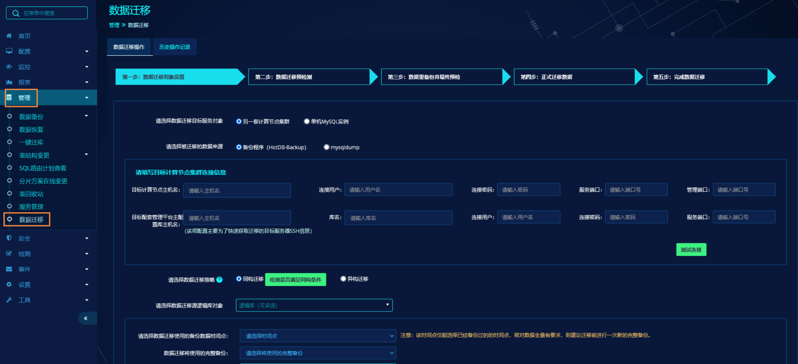

### 数据来源HotDB-Backup

下面以同构迁移到另一个计算节点集群，数据来源选择备份程序（HotDB-Backup）为例，介绍数据迁移的各个步骤。

#### 迁移对象设置

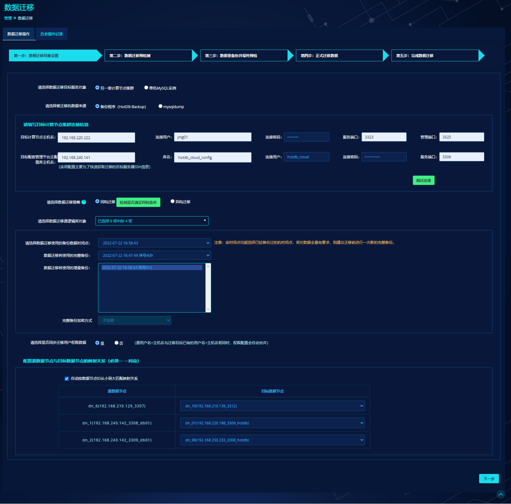

- **选择数据迁移目标服务对象：** 默认选择另一套计算节点集群，可选单机MySQL实例；

- **选择被迁移的数据来源：** 默认选择备份程序，可选mysqldump；

- **填写目标计算节点集群信息：** 若数据迁移目标对象选择计算节点集群，则需要填写目标计算节点配置信息以及目标配套管理平台配置信息；若数据迁移目标对象选择单机MySQL实例，则仅需填写目标MySQL实例连接信息；

>**Note** 
>
>填写目标计算节点集群信息时，需保证该集群服务端口与管理端口正常访问。目标计算节点主机名需填写主计算节点所在服务器真实IP，不可填写VIP；

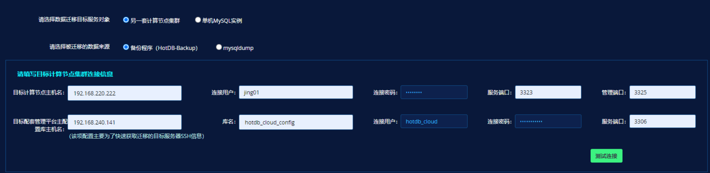

- **选择数据迁移策略**：默认同构迁移，可选异构迁移，当数据迁移目标服务对象为单机MySQL实例时，不显示该项；

- **检测是否满足同构条件：** 点击检测按钮前，需要选择迁移逻辑库对象，否则提示“请选择数据迁移源逻辑库对象”。当选择同构迁移时，需点击“检测是否满足同构条件”按钮来检测目标集群的架构，不管数据节点是物理库级别还是实例级别，当目标集群数据节点数大于等于源集群数据节点数，则满足同构条件。当不满足同构条件时，可以选择异构迁移策略；

> **Note** 
>
> 同构迁移源集群/目标集群的存储节点形式必须保持一致，即不支持实例级别迁移至物理库级别或物理库级别迁移至实例级别。异构不限制。

- **选择数据迁移源逻辑库对象**：点击下拉框选择源逻辑库对象，可多选；

- **数据迁移使用的备份数据时间点：** 根据选择的逻辑库对象，查看是否有对应的备份时间点。同构迁移可以选择完整备份和增量备份；异构迁移和迁移到单机MySQL实例均只支持完整备份时间点数据的迁移；

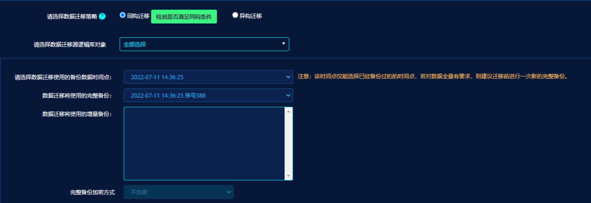
- 当选择异构迁移时，页面将有如下提示：

- 当迁移到单机MySQL实例时，页面将有如下提示：

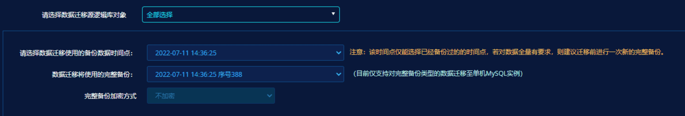

- **完整备份加密方式：** 当备份时选择了加密，需要输入对应加密密码。若密码错误，在正式迁移步骤中会再次校验，错误密码会导致数据迁移任务无法继续进行；

- **请选择是否同步迁移用户权限数据：** 默认是，可选否，当数据迁移目标服务对象为单机MySQL实例时，不显示该项。当源集群用户名与目标集群已有的用户名相同时，权限配置会自动合并处理；

- **配置源数据节点与目标数据节点的映射关系：** 仅当选择同构迁移时显示该项。在目标数据节点列点击下拉框选择目标数据节点，一一对应，且不可重复选择，若数据节点较多时，点击下方“下一页”进行选择。当勾选“自动按数据节点ID从小到大匹配映射关系”后，目标数据节点默认按从ID从小到大自动一一对应进行匹配，无需手动选择，若需要修改，可选择对应目标数据节点下拉框重新选择即可；

待页面信息填写完毕后，点击下一步，即可进入数据迁移预检测。

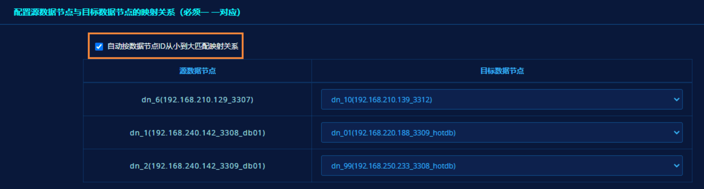

#### 数据迁移预检测

**同构迁移检测项：**

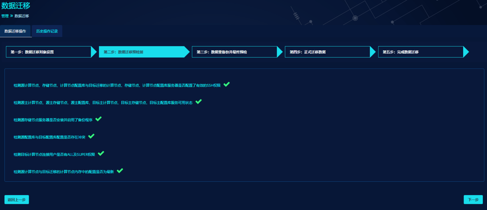

**异构迁移检测项：**

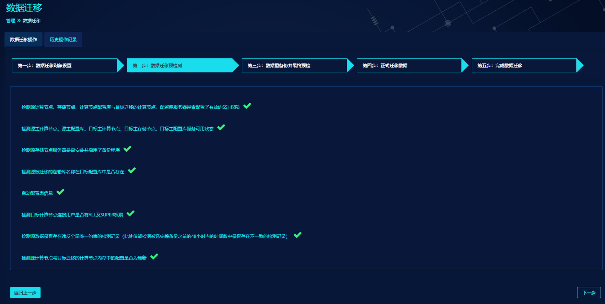

检测过程中发生计算节点或数据节点切换操作：

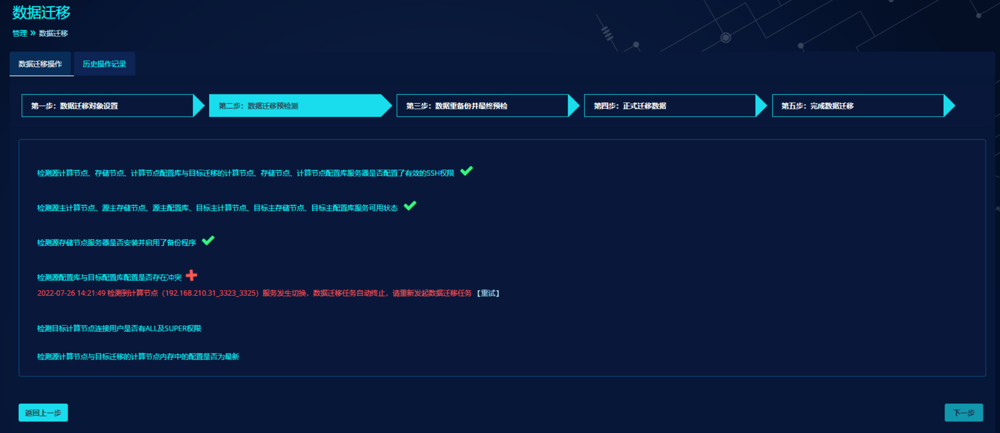

- **检测源计算节点、存储节点、计算节点配置库与目标迁移的计算节点，存储节点，及计算节点配置库服务器是否配置了有效的SSH权限：** 目标集群和源集群检测的均是主计算节点、主存储节点、主配置库服务器SSH连接。可在目标集群和源集群对应的管理平台，配置-服务器页面配置SSH信息；

- **检测源主计算节点、源主存储节点、源主配置库、目标主计算节点、目标主存储节点、目标主配置服务器可用状态：** 目标集群和源集群检测的均是主计算节点、主存储节点、主配置库服务器的可用状态。可用状态以实际计算节点服务程序、关联的存储节点实例是否运行正常来判定；

注意以上两项检测均有：

1.  不是迁移对象设置页面选择的逻辑库对象关联的源集群存储节点不检测

2.  不是迁移对象设置页面选择的目标集群数据节点不检测

- **检测源存储节点服务器是否安装并启用了备份程序：** 当前只检测源集群的存储节点服务器；

- **检测源配置库与目标配置库配置是否存在冲突（异构迁移无此项）：** 同构迁移时，目标集群不允许出现与迁移对象同名的逻辑库、表、高级分片规则；

- **检测源被迁移的逻辑库名称在目标配置库中是否存在（同构迁移无此项）：** 异构迁移时，需要在目标集群提前配置好逻辑库、表、高级分片规则。自动分片表和自动分片规则无需配置；

- **自动配置表信息（同构迁移无此项）：** 管理平台根据源集群分片表的字段及目标集群配置的节点对分片表进行分片，自动分片的表由程序分配到逻辑库配置的所有节点；高级分片的表需用户提前在目标集群配置；垂直表由程序自动分配到逻辑库配置的最小id的节点；全局表分配到逻辑库所有的默认节点；子表将根据原有关联字段分配到父表节点。若源集群的表配置信息已在目标集群存在，则自动跳过；若出现无法自动配置的表或按规则配置时节点中存在重名表，则跳过该表并继续配置其余表。最终无法自动配置的表会给出提示，可在手动配置成功后再次重试；

- **检测目标计算节点连接用户是否有ALL及SUPER权限：** 若权限不满足可忽略进行下一步检测，页面会给出warning提醒；

- **源数据是否存在违反全局唯一约束的检测记录（同构迁移无此项）：** 48小时非当前时间点开始计算的前48小时，是选择的备份开始时间点前48小时内有全局唯一约束检测结果为异常的记录；

- **检测源计算节点与目标迁移的计算节点内存中的配置是否为最新：** 若源集群和目标集群计算节点当前不是最新配置，则页面会给出error报错提示。可在源集群或目标集群手动执行同步加载后，再次重试。

#### 数据重备份并最终预检

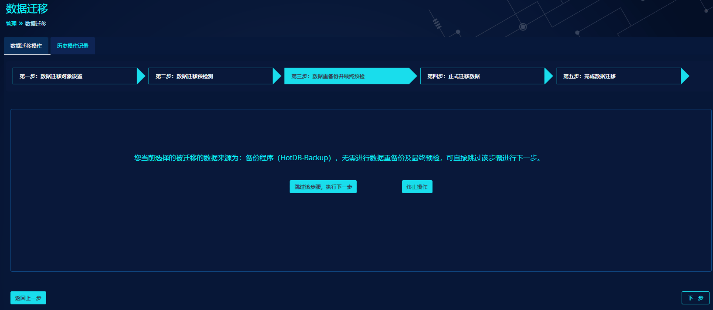

点击终止操作，则返回第一步配置页面；点击跳过该步骤，执行下一步，进入第四步正式迁移。

#### 正式迁移数据

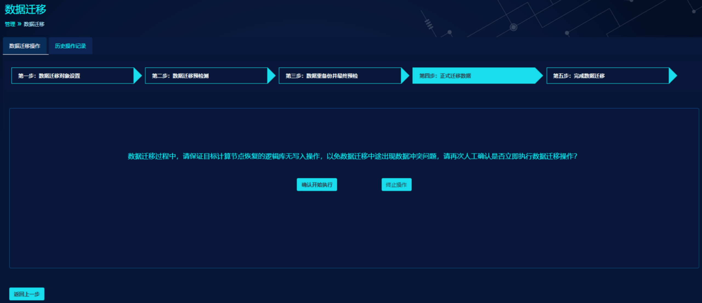

进入正式迁移数据步骤时，会将目标计算节点相关的逻辑库设置为只读状态。因此需人工确认是否需要继续执行，点击确认开始执行，进入正式迁移步骤。

**同构正式迁移：**

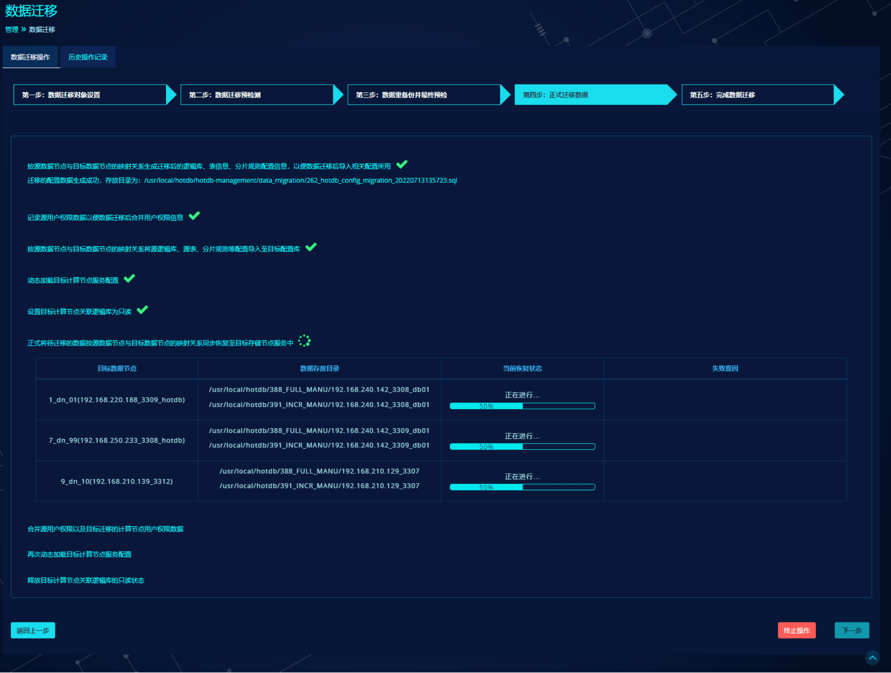

**异构正式迁移：**

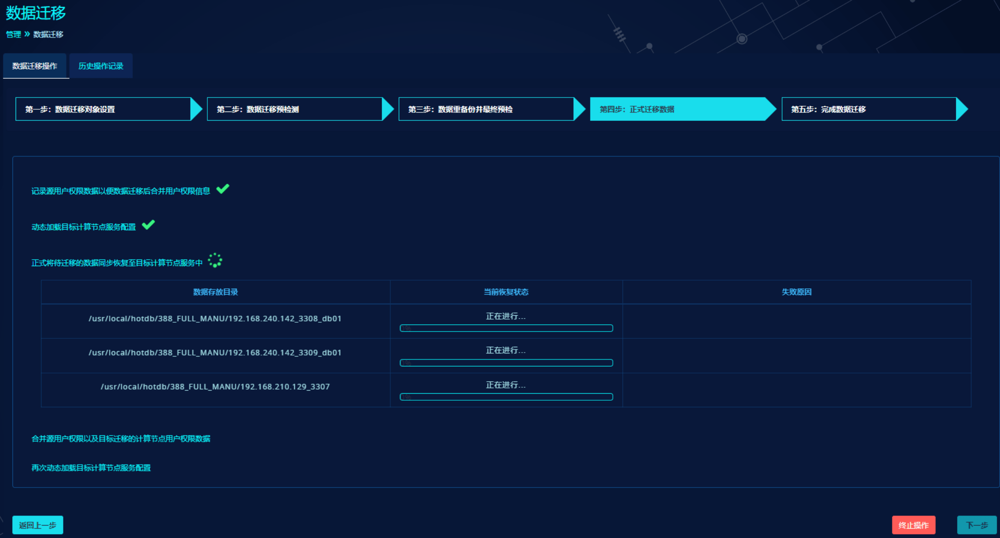

> **Note**
>
> “记录源用户权限数据以便数据迁移后合并用户权限信息”、“合并源用户权限以及目标迁移的计算节点用户权限数据”，这两项在[第一步数据迁移对象设置](#迁移对象设置)页面，用户是否选择“同步迁移用户权限数据”，若选择否则不显示。

为确保数据迁移顺利完成，在正式数据迁移期间，请停止对目标集群（尤其是高可用HA集群）计算节点和数据节点进行切换操作，否则会迁移失败。

正式迁移过程中发生计算节点或数据节点切换操作：

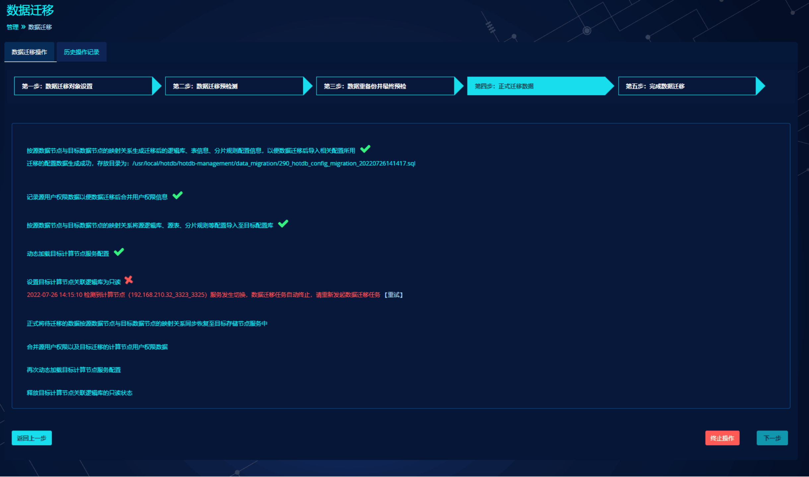

#### 完成数据迁移

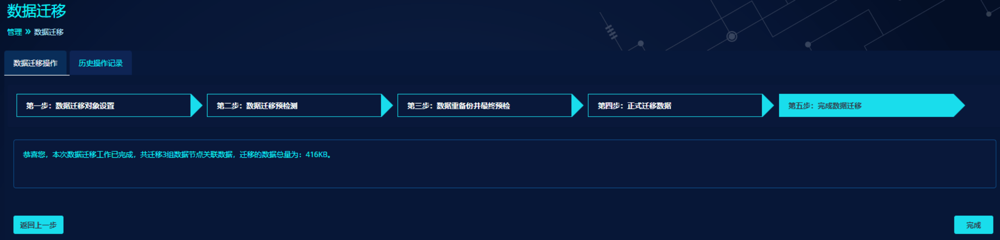

- 展示本次数据迁移的数据节点组数以及数据总量；

- 未创建的表不会被迁移；

- 迁移没有主键的表时，请确保没有开启相关拦截的防火墙开关；

- 点击“完成”按钮结束本次数据迁移任务，转跳到“历史操作记录”页面

- 迁移完成后，在管理-数据恢复页面，会生成一条恢复记录信息。

### 数据来源mysqldump

下面以同构迁移到另一个计算节点集群，数据来源选择mysqldump为例，介绍数据迁移的各个步骤。

#### 迁移对象设置

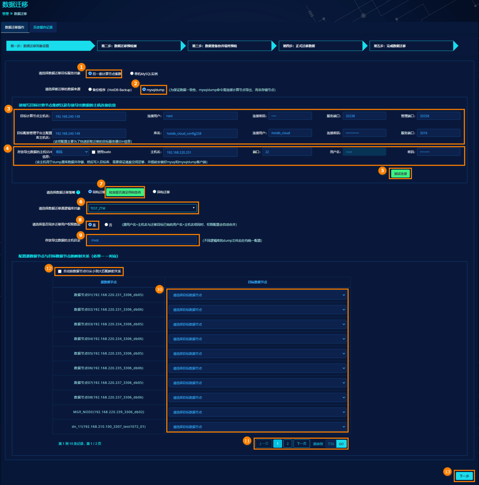

mysqldump同HotDB-Backup迁移对象配置大致相同，此处仅说明差异，相同的不再赘述。

- **填写存放导出数据的主机SSH信息**：当选择数据来源为mysqldump时，需要填写存放导出数据的主机SSH信息。注意：存放导出数据的主机可以是任意服务器，需确保该服务器已安装并配置mysql和mysqldump环境变量，可在任意目录下执行mysql和mysqldump命令；

- **填写存放导出数据的主机目录**：仅当数据迁移来源为mysqldump时才需填写该项。注意：存放目录必须是已存在的且赋予755权限，若不存在请提前手动创建目录并赋权，需确保该存放目录磁盘空间充足；

>**Note**
>
> 为确保数据迁移顺利完成，若集群内存在MGR类型数据节点，需确保所有存储节点对应MySQL版本高于5.7.19。

#### 数据迁移预检测

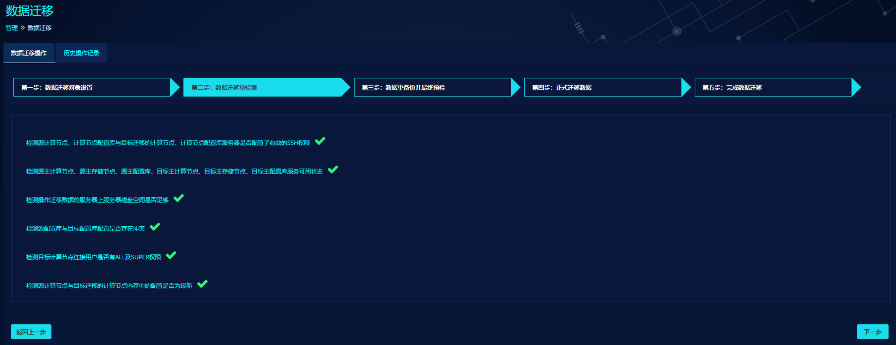

依次对源计算节点和目标集群的配置、服务、磁盘空间、连接用户等进行一系列检测，检测异常的项目可按照提示信息进行手动调整并点击重试按钮重新检测。待全部检测项通过后，点击下一步，进入数据重备份并最终预检。

#### 数据重备份并最终预检

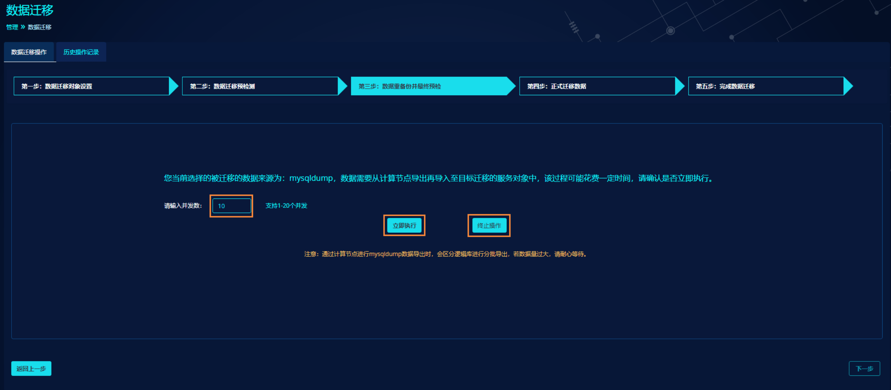

- 进入到第三步数据重备份并最终预检页，若数据来源选择mysqldump时，支持按逻辑库级别并发执行mysqldump备份，可自定义并发数，默认10，支持1-20并发；

- 通过计算节点进行mysqldump数据导出时，会区分逻辑库进行分批导出，导出文件按照`dumpdata_源计算节点信息_逻辑库名称_时间戳.sql`格式保存；

- 若数据量过大，请耐心等待；

- 点击终止操作，则终止本次数据迁移操作，不保存任何数据和记录；

- 点击立即执行，则开始执行数据备份和最终检测；

>**Note** 
>
>在数据重备份期间，请停止对本次数据迁移的源集群逻辑库及库内表进行数据操作，避免数据备份不完整。

待所有执行项和检测项通过后，点击下一步，进入正式迁移数据。

#### 正式迁移数据

- 进入到第四步正式迁移数据页，页面提示“数据迁移过程中，会自动将目标计算节点相关逻辑库置为只读状态，迁移完成后恢复。请再次人工确认是否立即执行数据迁移操作？”。点击终止操作，则终止本次数据迁移操作，不保存任何数据和记录。点击确认开始执行，则开始正式迁移数据；

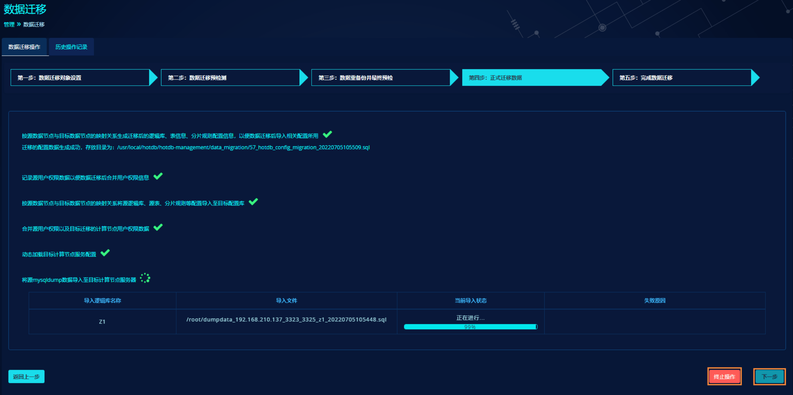

待全部执行项成功执行后，点击下一步，进入完成数据迁移。

>**Note** 
>
>为确保数据迁移顺利完成，在正式数据迁移期间，请停止对目标集群（尤其是高可用HA集群）计算节点和数据节点进行切换操作。

#### 完成数据迁移

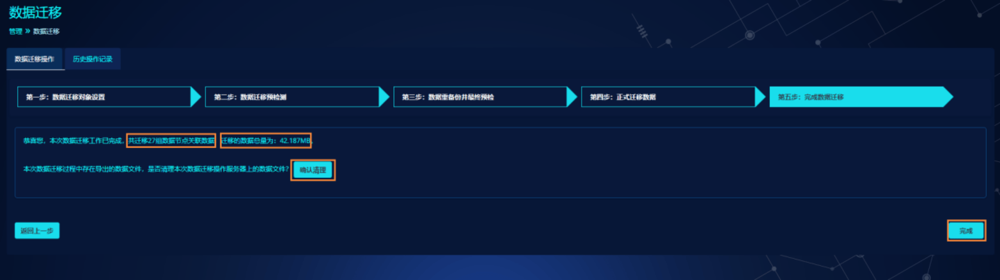

- 展示本次数据迁移的源计算节点集群数据节点组数以及数据总量；

- 点击“确认清理”按钮来清理本次数据迁移产生的dump文件，若选择保留dump文件，请注意存放目录的磁盘空间剩余情况；

- 点击“完成”按钮结束本次数据迁移任务，转跳到“历史操作记录”页面。

### 历史操作记录

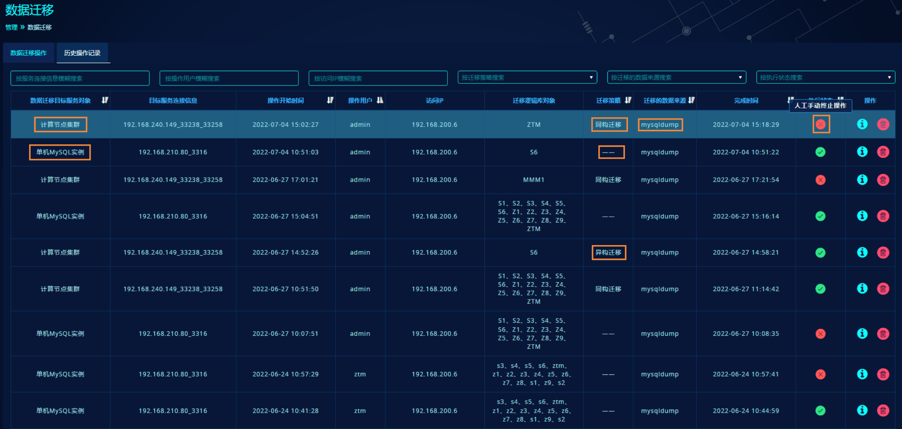

- 历史操作记录主要记录用户执行数据迁移的详细操作历史数据，点击操作栏--详情按钮查看该数据迁移任务的详细情况，点击操作栏--删除按钮即删除该条数据迁移记录

- 数据迁移失败的记录可将鼠标移入失败标志查看具体失败原因

- 正在进行的数据迁移任务，会显示“进行中...”

- 可通过“目标服务连接信息”、“操作用户”、“访问IP”、“迁移策略”、“数据来源”、“执行状态”关键词模糊查询历史记录
