# 智能巡检

## 智能巡检

为方便运维人员及时知晓数据库集群内部是否存在隐患或异常，在管理平台版本高于（包含）2.5.6时新增了智能巡检功能，通过该功能可以对计算节点集群进行日常数据库巡检工作，及时规避当前数据库服务在运行过程中存在的隐患问题。

**功能入口：** 管理平台普通角色登录，点击“工具”-\>“智能巡检”，进入智能巡检页面。

### 使用前提

发起智能巡检，需要满足如下前提：

- 当前用户拥有“智能巡检”菜单权限

- 需要配置服务器SSH信息

- 巡检项依赖管理平台监控脚本，若待巡检服务器`/usr/local/hotdb`目录下没有监控脚本时，需要在“配置”-\>“服务器”列表开启监控；若已存在监控脚本，则无须开启监控，只需要配置服务器SSH

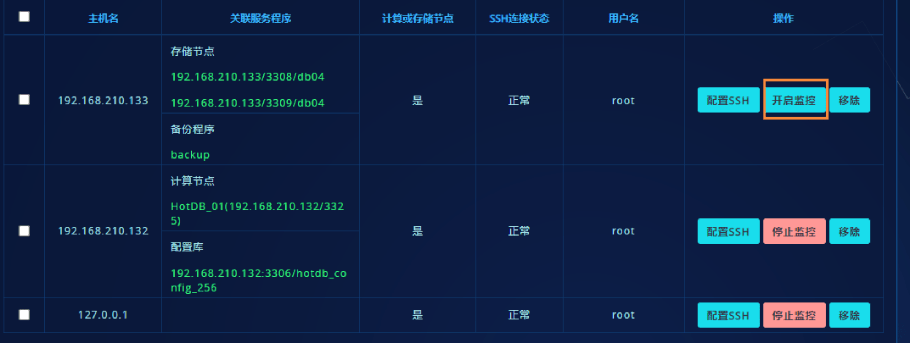

### 功能介绍

智能巡检主要包括：巡检结果报告、巡检指标设置、历史巡检记录三个TAB，默认展示巡检结果报告页，且显示最新一次的巡检结果。当无历史巡检结果时，提示：“当前暂无任何巡检记录信息，您可以选择立即发起一次巡检任务”。

#### 巡检结果报告

##### 页面展示

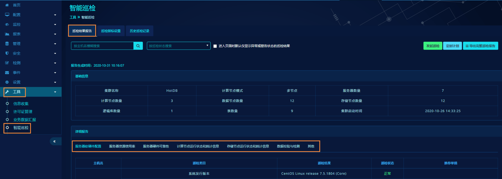

- 页面搜索选项，包括：按主机名模糊搜索、按巡检状态搜索

- 勾选“进入页面时默认仅显示异常或警告状态的巡检结果”后，报告只显示警告或异常的巡检项，退出页面，状态保留。取消勾选后，显示全部巡检项

- 报告展示分为基础信息和详细报告。其中基础信息显示当前集群组的相关信息，详细报告又分为7大模块，分别为：

  - 服务器软硬件配置

  - 服务器资源使用率

  - 服务器硬件可靠性

  - 计算节点运行状态和统计信息

  - 存储节点运行状态和统计信息

  - 数据校验与检测

  - 其他

##### 发起巡检

**（一）发起巡检**

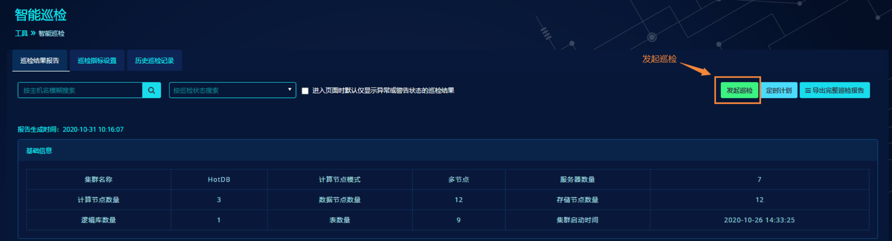

- 点击发起巡检，弹出巡检对象选择框

**（二）巡检对象选择**

- 勾选需要发起巡检的对象，发起巡检（全选，可快速勾选所有巡检对象）

**（三）正在巡检**

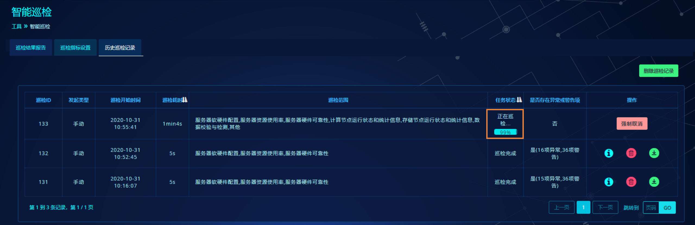

- 发起巡检后，会跳转至历史巡检记录页面，并显示当前正在巡检的任务

- 任务状态列显示当前巡检任务的进度，页面每5s刷新

- 当前有正在进行巡检任务时，无法继续发起新的巡检（基于当前组）

**（四）巡检完成**

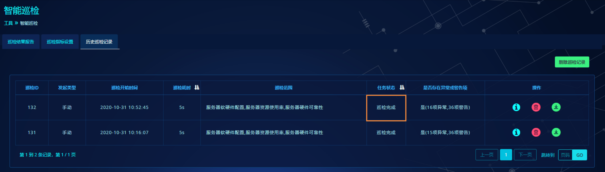

- 巡检完成后，『任务状态』会更新为巡检完成

- 如存在警告或异常的巡检项，『是否存在异常或警告』统计所有巡检项的警告或异常项的数量

- 如不存在警告或异常的巡检项，『是否存在异常或警告』显示为否

- 巡检完成后，会在`hotdb-management/data/Inspection`目录下生成巡检过程中产生的结果文件和巡检报告

**（五）取消巡检**

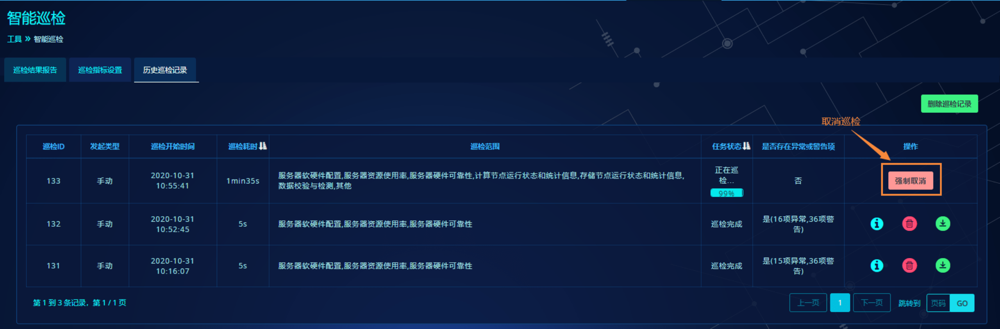

- 点击强制取消，可取消当前正在巡检的任务

- 取消成功后，『任务状态』更新为巡检失败

- 『是否存在异常或警告』显示为否

- 取消后的巡检任务，不会在`hotdb-management/data/Inspection`目录下生成文件

##### 定时计划

除手动发起巡检任务外，也可以通过添加定时任务自动执行检测。点击『定时计划』可管理当前的定时计划任务。

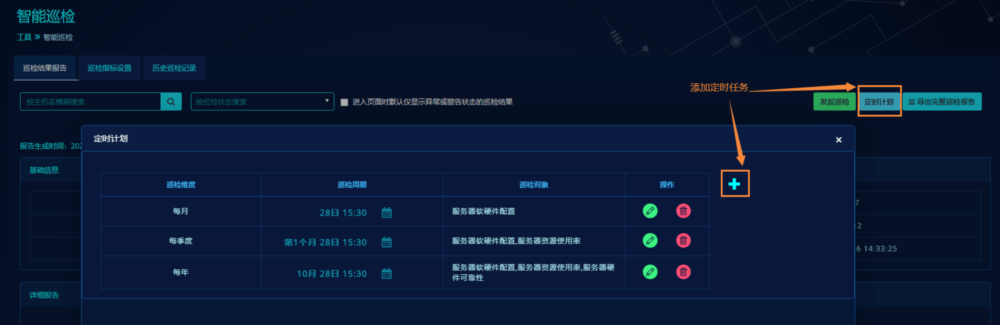

- 定时计划最多只能加六条，可按照检测周期选择“每月”、“每季度”、“每年”

- 其他选项可参照手动发起任务的说明

- 当定时计划中巡检任务重叠，程序只会执行一个定时计划任务

- 当定时计划执行时，有其他的巡检任务正在进行，则间隔1min重试一次，重试最多等待10min，若依旧存在未完成的巡检任务，则该次巡检结果置为“巡检失败”，失败原因提示：“同一时间有其他巡检任务正在执行”。

##### 导出报告

- 点击“导出完整巡检报告-仅导出异常或警告数据”，下载的报告只包含警告和异常巡检项

- 点击“导出完整巡检报告-导出全部完整数据”，下载的报告包含所有已巡检的项

- 巡检完成后，报告会存放在`hotdb-management/data/Inspection`目录下

- 导出数据中，若列表历史巡检结果有“可下载文件查看详情”，均会替换为 “可至hotdb-management/data/Inspection目录下载文件查看详情”

- 导出数据中，若列表历史巡检结果有“人工点击安装按钮进行相关软件安装”，均会替换为：“请人工进行相关软件的安装”。

#### 巡检指标设置

##### 页面展示

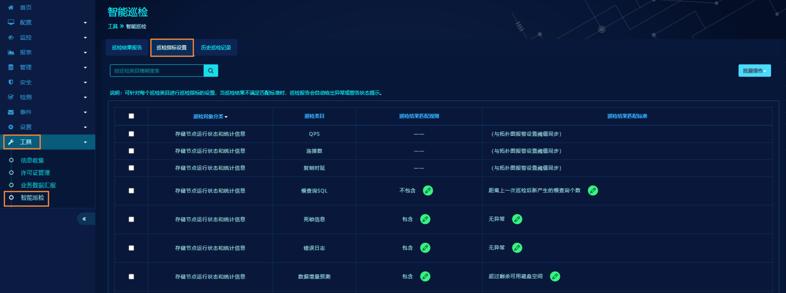

- 显示所有巡检类目的指标，可根据巡检类目模糊匹配搜索

- 可按巡检对象分类列头，进行分类显示

- 点击巡检结果匹配规则、巡检结果匹配标准的编辑按钮，可变更对应匹配规则

##### 服务器软硬件配置

- 服务器软硬件配置，存在可配置指标的巡检类目分别为：

  - 是否为虚拟机

  - 系统参数配置

  - 系统限制参数配置

- “是否为虚拟机”的巡检结果匹配规则默认为等于，可编辑的规则为：等于、不等于、无需关注；巡检结果匹配标准默认为否，可编辑为：否、是

- 其余巡检类目，巡检结果匹配规则默认为包含，可编辑的规则为：包含、不包含、不包含、无需关注；巡检结果匹配标准默认为各巡检类目的指标，可编辑为任意值

##### 服务器资源使用率

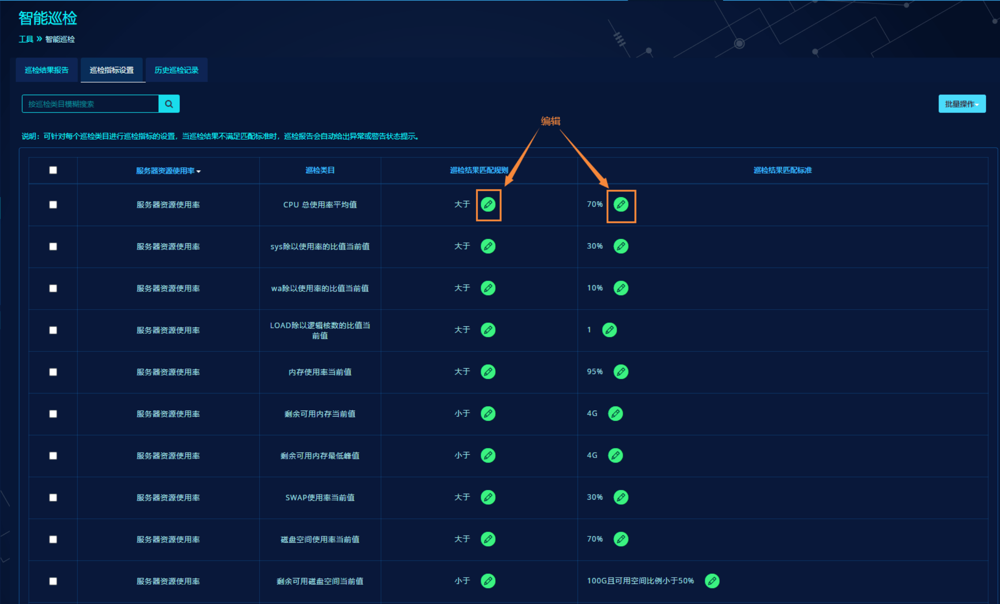

- 服务器软资源使用率，存在可配置指标的巡检类目分别为：

  - CPU 总使用率平均值

  - sys除以使用率的比值当前值

  - wa除以使用率的比值当前值

  - LOAD除以逻辑核数的比值当前值

  - 内存使用率当前值

  - 剩余可用内存当前值

  - 剩余可用内存最低峰值

  - SWAP使用率当前值

  - 磁盘空间使用率当前值

  - 剩余可用磁盘空间当前值

  - 磁盘IO使用率当前值

  - 网络带宽使用率进（NetIn）当前值

  - 网络带宽使用率出（NetOut）当前值  

- “剩余可用内存当前值”、“剩余可用内存最低峰值”的巡检结果匹配规则默认为大于；其余巡检类目的巡检结果匹配规则默认为小于

- 巡检结果匹配规则可编辑的匹配规则为：大于、小于、大于或等于、小于或等于、无需关注

- 巡检结果匹配标准为百分比的，最小值为0，最大值为100

##### 服务器硬件可靠性

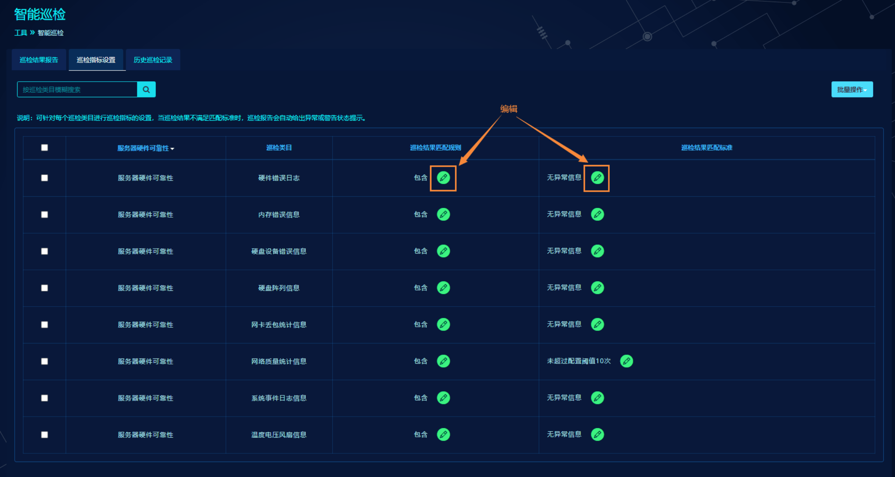

- 服务器软资源使用率，存在可配置指标的巡检类目分别为：

  - 硬件错误日志

  - 内存错误信息

  - 硬盘设备错误信息

  - 硬盘阵列信息

  - 网卡丢包统计信息

  - 网络质量统计信息

  - 系统事件日志信息

  - 温度电压风扇信息

- 巡检结果匹配规则默认都为包含，可编辑的规则为：包含、不包含、无需关注

- “巡检结果匹配规则”的巡检结果匹配标准默认为10，最小值为0；其余巡检类型，默认值都为无异常信息，可编辑为任意值

##### 计算节点运行状态和统计信息

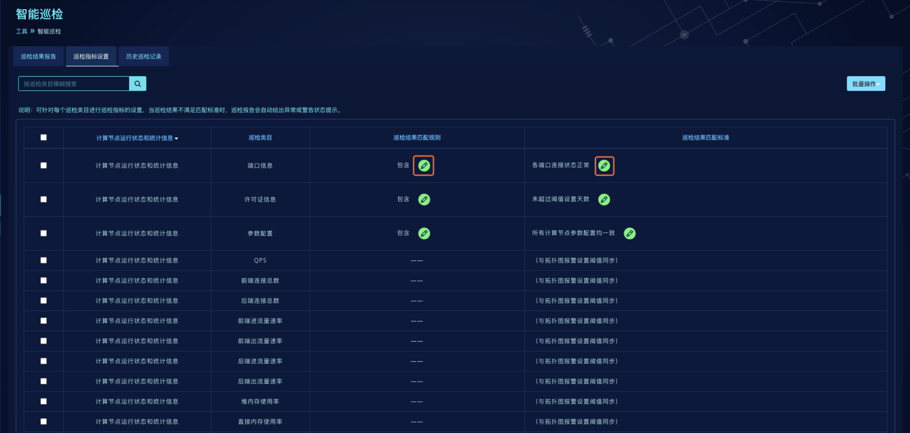

- 计算节点运行状态和统计信息，存在可配置指标的巡检类目分别为：

  - 端口信息

  - 许可证信息

  - 参数配置

  - QPS

  - 前端连接总数

  - 后端连接总数

  - 前端进流量速率

  - 前端出流量速率

  - 后端进流量速率

  - 后端出流量速率

  - 堆内存使用率

  - 直接内存使用率
    
  - 集群完整性

  - 高可用状态

  - 灾备状态

  - 密码安全管理

  - SQL防火墙

  - IP白名单

  - 慢查询SQL记录

  - ERROR级别

  - WARN级别

- 端口信息、许可证信息、参数配置、集群完整性、高可用状态、灾备状态、密码安全管理和慢查询SQL记录巡检类目说明

  - 巡检结果匹配规则默认为包含，可编辑的规则为：包含、不包含、无需关注

  - 高可用状态、灾备状态、密码安全管理这三项巡检结果匹配标准默认为无异常，可编辑为任意值

  - 端口信息、许可证信息、参数配置、集群完整性、慢查询SQL记录五项巡检结果匹配标准默认为各巡检类目的指标，可编辑为任意值

- SQL防火墙、IP白名单

  - 巡检结果匹配规则默认为不等于，可编辑的规则为：等于、不等于、无需关注

  - 巡检结果匹配标准默认为未开启，可编辑为任意值

- ERROR级别、WARN级别

  - 巡检结果匹配规则默认为小于或等于，可编辑的规则为：大于、小于、大于或等于、小于或等于、无需关注

  - 巡检结果匹配标准默认为0条，可允许将0数据编辑为任意值

- QPS、前端连接总数、后端连接总数、前端进流量速率、前端出流量速率、后端进流量速率、后端出流量速率、堆内存使用率和直接内存使用率

  - 巡检结果匹配规则为：--

  - 巡检结果匹配标准为：与设置-\>拓扑图报警设置处的阈值同步

##### 存储节点运行状态和统计信息

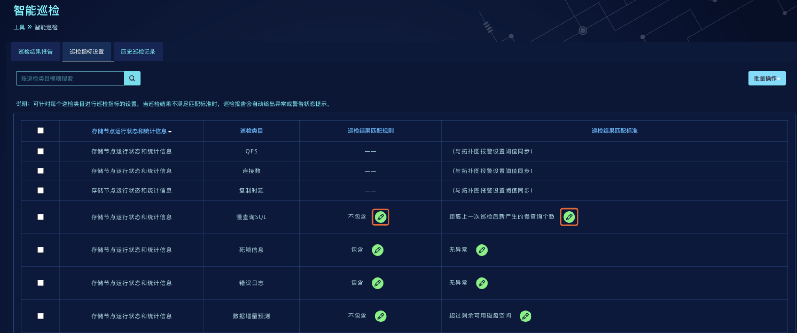

- 存储节点运行状态和统计信息，存在可配置指标的巡检类目分别为：

  - QPS

  - 连接数

  - 复制时延

  - 慢查询SQL

  - 死锁信息
    
  - 错误日志

  - 数据增量预测

- 慢查询SQL、数据增量预测

  - 巡检结果匹配规则默认为不包含，可编辑的规则为：包含、不包含、无需关注

  - 巡检结果匹配标准默认为各巡检类目的指标，可编辑为任意值

- 死锁信息、错误日志

  - 巡检结果匹配规则默认为包含，可编辑的规则为：包含、不包含、无需关注

  - 巡检结果匹配标准默认为无异常，可编辑为任意值

- QPS、连接数、复制时延

  - 巡检结果匹配规则为：--

  - 巡检结果匹配标准为：与设置-\>拓扑图报警设置处的阈值同步

##### 数据校验与检测

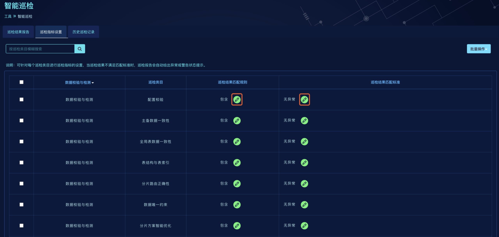

- 数据校验与检测，存在可配置指标的巡检类目分别为：

  - 配置校验

  - 主备数据一致性

  - 全局表数据一致性

  - 表结构与表索引

  - 分片路由正确性

  - 数据唯一约束

  - 分片方案智能优化

  - 部署环境体检评分

  - 数据分片评分

  - 业务数据备份有效性检查

  - 配置数据备份有效性检查

  - 内存中的配置一致性检查

- 部署环境体检评分和数据分片评分

  - 巡检结果匹配规则默认为大于或等于，可编辑的规则为：大于、小于、大于或等于、小于或等于、无需关注

  - 巡检结果匹配标准：部署环境体检评分默认值为100，数据分片评分默认值为80，可将对应巡检结果匹配标准编辑为\[0,100\]之间的任意整数值,单位为分。

- 其余所有的巡检类目项

  - 巡检结果匹配规则默认为包含，可编辑的规则为：包含、不包含、无需关注

  - 巡检结果匹配标准：业务数据备份有效性检查默认值为“无异常，且可用备份恢复的数据不超过24小时”；配置数据备份有效性检查默认值为 “无异常，且可用备份恢复的数据不超过72小时”。这两项结果匹配标准需为正整数值，单位固定为小时

  - 除上面两项之外的巡检类目，巡检结果匹配标准默认为无异常，可编辑为任意值

##### 其他

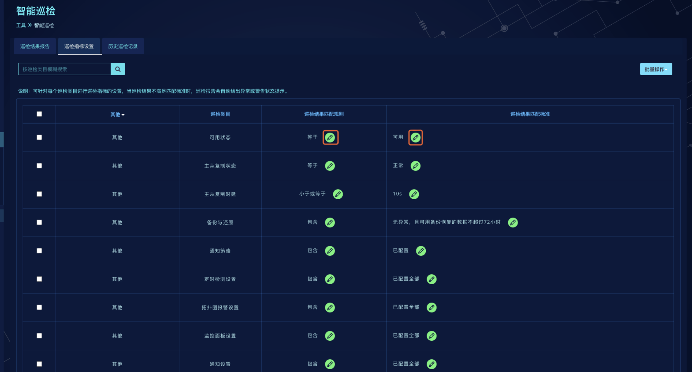

- 其他，存在可配置指标的巡检类目分别为：

  - 可用状态

  - 主从复制状态

  - 主从复制时延

  - 备份与还原

  - 通知策略

  - 定时检测设置

  - 拓扑图报警设置

  - 监控面板设置

  - 通知设置

  - 审计日志设置

  - 平台日志

- 主从复制时延

  - 巡检结果匹配规则默认为小于，可编辑的规则为：大于、小于、大于或等于、小于或等于、无需关注

  - 巡检结果匹配标准默认为10s,可编辑为0或任意正整数值，单位为秒

- 可用状态、主从复制状态
  
  - 巡检结果匹配规则默认为等于，可编辑的规则为：等于、不等于、无需关注

  - 巡检结果匹配标准：可用状态默认为可用，主从复制状态默认为正常，可编辑为任意值

- 其余所有的巡检类目项

  - 巡检结果匹配规则默认为包含，可编辑的规则为：包含、不包含、无需关注

  - 巡检结果匹配标准

  1)  平台日志默认为无异常，可编辑为任意值

  2)  通知策略默认为已配置，可编辑为任意值

  3)  备份与还原默认值为“无异常，且可用备份恢复的数据不超过72小时”，结果匹配标准需为正整数值，单位固定为小时

  4)  其余所有的巡检类目，默认为“已配置全部”，可编辑为任意值

##### 批量修改

**（一）发起批量修改**

- 勾选需要修改的巡检类目，点击“【批量操作】-\>【批量修改】”

**（二）批量填写并保存**

- 批量修改，巡检类目对应的巡检结果匹配规则、巡检结果匹配标准按系统默认值显示，可进行调整

##### 批量重置

- 勾选需要重置的巡检类目，点击“【批量操作】-\>【批量重置】”

- 重置成功后，巡检类目巡检结果匹配规则、巡检结果匹配标准都会重置为系统默认值

#### 历史巡检记录

##### 页面展示

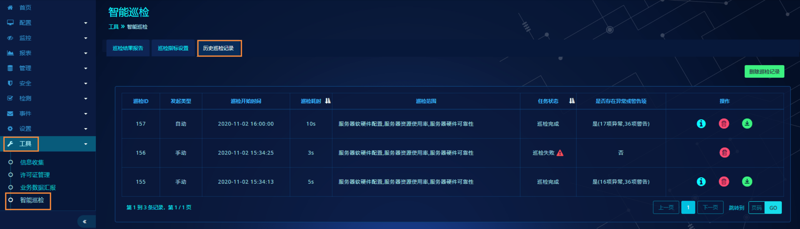

- 显示所有历史巡检任务

- 点击『巡检耗时』，可根据检测时长，升序或倒序排列显示

- 『发起类型』分为手动和自动，定时器发起的巡检任务为自动

##### 查看详情

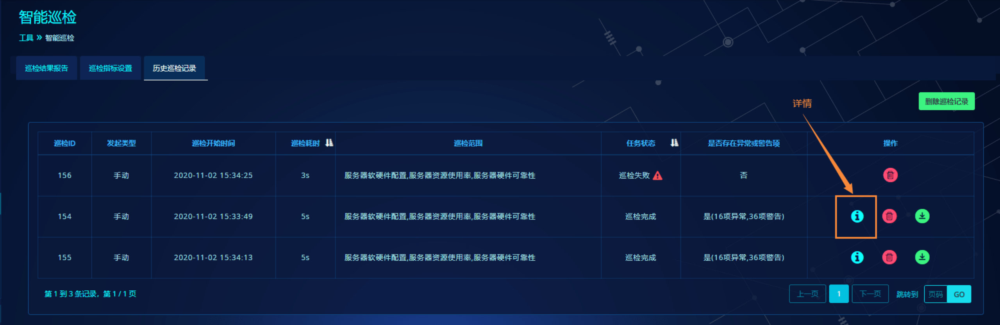

- 点击巡检任务列表“【操作】-\>【详情】”按钮，进入巡检详情页

- 页面显示与[巡检结果报告](#巡检结果报告)页面基本一致

- 点击“返回”按钮，可返回至[历史巡检记录](#历史巡检记录)页面

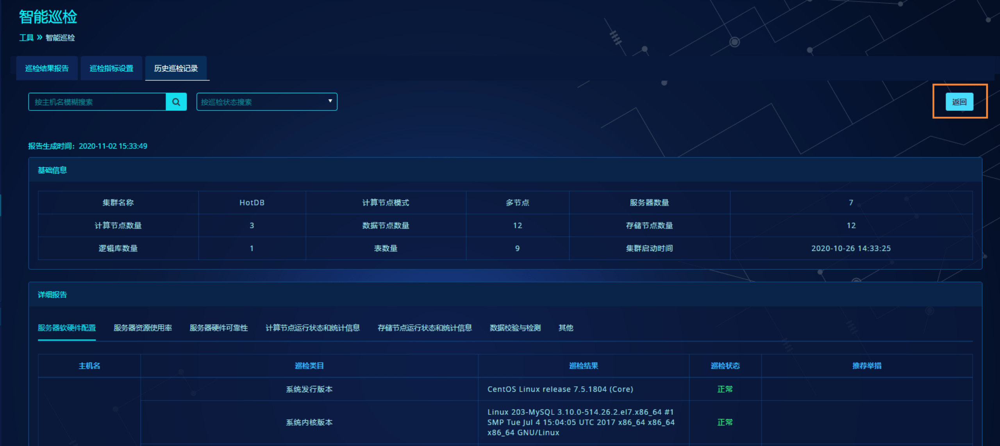

##### 删除任务

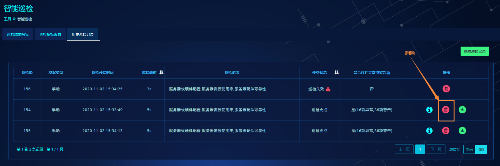

- 点击巡检任务列表“【操作】-\>【删除】”按钮，删除巡检任务

- 页面操作删除时会同步删除该巡检任务本地对应的文件和巡检报告

##### 下载报告

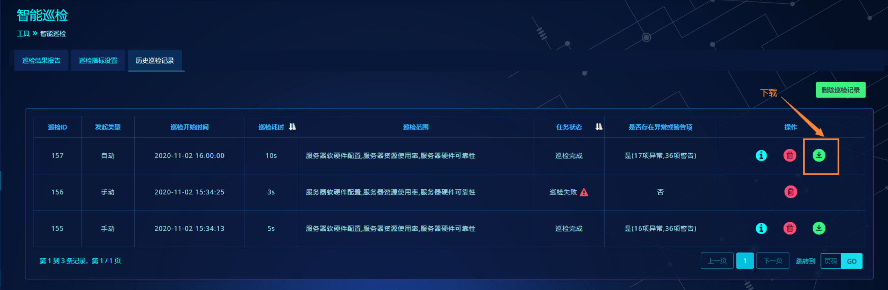

- 点击巡检任务列表“【操作】-\>【下载】”按钮，下载巡检报告

- 下载操作同“巡检结果报告”-\> “导出完整巡检报告”操作一致

##### 批量删除

**（一）发起批量删除**

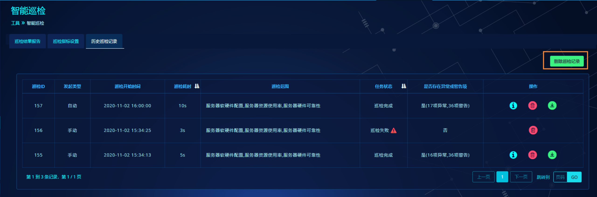

- 进入“智能巡检-\>历史巡检记录”页面，点击“删除巡检记录”

**（二）选择巡检记录删除时间段**

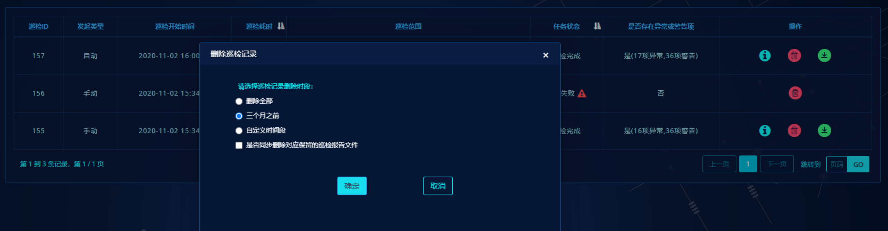

- 默认选中“三个月之前”，可选择“删除全部”、“自定义时间段”

- 勾选“是否同步删除对应保留的巡检报告文件”，会同步删除`hotdb-management/data/Inspection`目录生成的文件和巡检报告
  
- 点击取消，会取消批量删除操作

#### 巡检详情

##### 巡检匹配逻辑说明

根据巡检场景得出巡检结果，使用巡检结果和巡检指标进行匹配：

1.  如果巡检结果匹配规则为“包含”：

- 匹配成功，则巡检状态为正常

- 匹配失败，不同巡检类目根据不同巡检结果，输出对应巡检状态和推荐举措

2.  如果巡检结果匹配规则为“不包含”：

- 巡检结果匹配到警告逻辑，则巡检状态为警告

- 否则，根据匹配结果，输出正常或者异常状态

3. 如果巡检结果匹配规则为“等于”或者“不等于”：

- 匹配成功，则巡检状态为正常；

- 匹配失败，则输出对应巡检状态和推荐举措

4. 如果巡检结果匹配规则为“大于”、“小于”、“大于或等于”、“小于或等于”：

- 匹配成功，则巡检状态为正常

- 匹配失败，则输出对应的巡检状态和推荐举措

5. 如果巡检结果匹配规则为“无需关注”：巡检状态为正常，无推荐举措

##### 巡检结果逻辑说明

###### 服务器软硬件配置

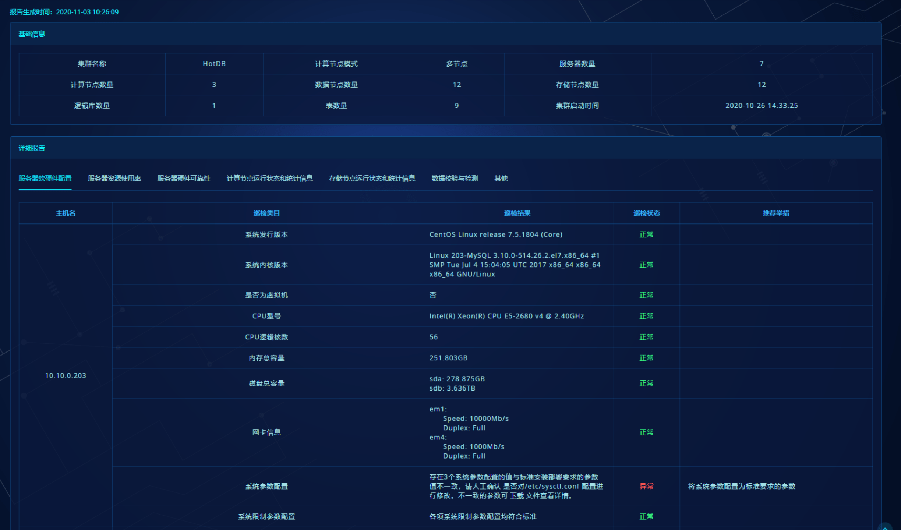

进入“历史巡检记录-\>详情-\>服务器软硬件配置”TAB，查看巡检报告

**是否为虚拟机**

- 检测服务器是否为虚拟机，如果是虚拟机，巡检结果为“否”

**系统参数配置**

- 一键部署脚本参数和`sysctl –a`命令出来的共有参数值进行比较（被注释的参数不比较）

- 如果一键部署脚本中的参数存在，`sysctl –a`命令出来的参数不存在，则会与`/etc/sysctl.conf`文件中的参数比较；如果仍不存在，则不比较

- 不一致的参数，可在巡检结果中，点击“下载”按钮进行查看

- 如果全一致，可在巡检结果中，点击“下载”按钮，查看`sysctl –a`的所有参数

**系统限制参数配置**

- 拿到`/etc/security/limits.conf`中最后出现的mysql hotdb root三个用户的配置 ，判断：`nofile＜10240（标准值）`， `nproc＜262140（标准值）`

- 若小于标准值，则巡检结果提示参数存在不一致，并会列出不一致的参数

- 若大于等于标准值，则巡检结果提示参数符合标准

- 若没有权限查看文件，则巡检结果提示权限不足

>**Note**
>
>以上未说明的都只做展示，不与巡检指标匹配

###### 服务器资源使用率

- 进入“历史巡检记录-\>详情-\>服务器资源使用率”TAB页，查看巡检报告

- 各巡检类目当前值：取对应监控脚本的实时值

- 各巡检类目平均值、最高峰值、最低峰值：取对应监控脚本半小时之内的值

###### 服务器硬件可靠性

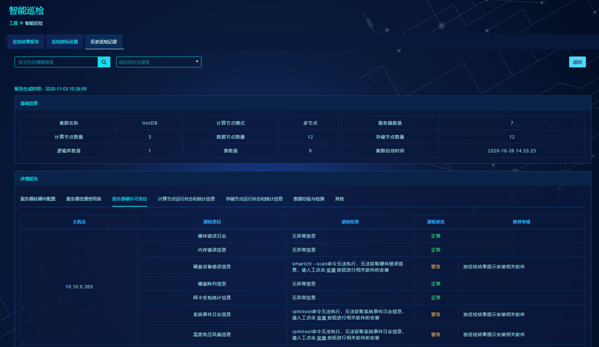

- 进入“历史巡检记录-\>详情-\>服务器硬件可靠性”TAB页，查看巡检报告

**硬件错误日志**

- 如果未安装`mcelog`，则巡检结果提示未安装软件，点击巡检结果中的“安装”按钮，直接安装软件

- 若执行`mcelog`有信息输出，则巡检结果提示“存在异常错误日志，请下载文件查看详情”

- 若执行`mcelog`无信息输出，则巡检结果提示“无异常信息”

- 若服务器为虚拟机，则巡检结果提示“服务器为虚拟机，无需检测”，巡检状态为：无需巡检

**内存错误信息**

- 执行命令，输出结果存在不为0的项，则显示在巡检结果中

- 若输出结果都为0，则巡检结果提示“无异常信息”

- 若没有权限查看文件，则巡检结果提示权限不足

- 若服务器为虚拟机，则巡检结果提示“服务器为虚拟机，无需检测”，巡检状态为：无需巡检

**硬盘设备错误信息**

- 如果未安装`smartmontools`，则巡检结果提示未安装软件，点击巡检结果中的“安装”按钮，直接安装软件

- 如果设备未开启SMART，则巡检结果提示“设备未开启SMART，无法检查”

- 执行命令，输出为空，则巡检结果提示“执行命令 smartctl --scan 结果为空”

- 若服务器支持SMART，则查看`SMART Health Status`是否为OK 或`self-assessment test result`是否为PASSED，若不为OK/PASSED，则巡检结果提示“smartctl检查到XXX设备SMART报告状态异常，可下载文件查看详情”

- 若上述检测都通过，需要判断`Reallocated_Sector_Ct`、`Reported_Uncorrect`、`Total new blocks reassigned`末尾一列的数据是否为0，若不为0，则巡检结果提示“xxx大于0，可下载文件查看详情，并人工介入判断是否存在异常”

- 若检测都通过，则巡检结果提示“无异常信息”

- 若服务器为虚拟机，则巡检结果提示“服务器为虚拟机，无需检测”，巡检状态为：无需巡检

**硬盘阵列信息**

- 第一次发起巡检，如果服务器未安装MegaCli，则会在巡检时自动安装

- 执行命令，若返回为空，则巡检结果提示“执行命令 /opt/MegaRAID/MegaCli/MegaCli64 -CfgDsply -aAll\|grep 'Error Count' 结果为空”

- 执行命令，若返回结果中存在不为0的项，则巡检结果提示“MegaCli64发现有Error Count不为0的项目，可下载文件查看详情”

- 执行命令，若返回结果中都为0，则巡检结果提示“无异常信息”

- 若服务器为虚拟机，则巡检结果提示“服务器为虚拟机，无需检测”，巡检状态为：无需巡检

**网卡丢包统计信息**

- 若没有上一次巡检结果，则本次巡检结果为“无异常信息”

- 若本次结果与上一次巡检结果，errors 、dropped、overrun数据差值大于等于1000，则巡检结果为“从上一次巡检到本次巡检的过程中出现网卡异常丢包信息大于1000次的记录，可下载文件查看详情”

- 若差值小于1000，则巡检结果为“无异常信息”

- 若巡检过程中存在异常情况，则巡检结果为“无法查看网卡丢包信息”

**网络质量统计信息**

- 若没有上一次巡检结果，则巡检结果为“无异常信息”

- 若上一次巡检到现在，未记录到ping包记录，则巡检结果为“无异常信息”

- 若上一次巡检到现在，记录到ping包记录，则巡检结果为“从上一次巡检到本次巡检的过程中，共累计记录ping小包超时次数：0次，ping大包超时次数：0次，全丢包次数：0次，未超过配置阈值10次”

- 配置阈值在指标中是可配置的

- 非计算节点服务器，巡检类目不显示

- 计算节点版本小于2.5.5时，巡检类目不显示

**系统事件日志信息**

- 如果未安装`ipmitool`，则巡检结果提示未安装软件，点击巡检结果中的“安装”按钮，直接安装软件

- 执行命令，查看记录中的Last Add Time，如果晚于上一次巡检时间，则巡检结果为“距离上一次巡检时间有新的日志产生，请下载文件查看详情”，点击“下载”，可以将日志下载到本地查看

- 若上一次巡检到现在，未产生新日志，则巡检结果为“无异常信息”

- 若服务器为虚拟机，则巡检结果提示“服务器为虚拟机，无需检测”，巡检状态为：无需巡检

**温度电压风扇信息**

- 如果未安装`ipmitool`，则巡检结果提示未安装软件，点击巡检结果中的“安装”按钮，直接安装软件

- 执行命令，若存在最后一列不是ok或ns的项，则巡检结果为“存在以下指标不符合巡检要求，请人工介入处理，并列出不合要求的项目”

- 若均为ok或ns的项,则巡检结果为“无异常信息”

- 若服务器为虚拟机，则巡检结果提示“服务器为虚拟机，无需检测”，巡检状态为：无需巡检

###### 计算节点运行状态和统计信息

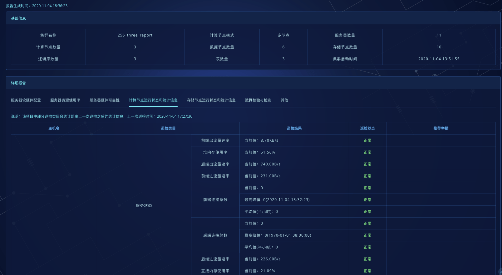

进入“历史巡检记录-\>详情-\>计算节点运行状态和统计信息”TAB页查看

- **许可证信息**：按许可证授权信息显示许可证授权剩余时间和授权节点数

- **堆内存**：

  - 配置值：从`show @@server` 中获取 `max_memory`

  - 当前值：从`show @@server` 中获取 `used_memory`

- **直接内存**：
  - 配置值：从`show @@server` 中获取 `max_direct_memory`
  
  - 当前值：从`show @@server` 中获取 `used_direct_memory`
  
- **吞吐量的QPS和TPS**：

  - 当前值：跟随“监控-\>监控面板”记录的当前值

  - 最高峰值：跟随管理员首页原有数据展示

  - 平均值（半小时内）：以距离巡检开始时间前半小时以内的监控数据作为采集标准

- **前端连接总数和后端连接总数**：

  - 当前值：同“监控-\>智能逻辑拓扑”处采集的数据一致

  - 最高峰值：跟随管理员首页原有计算节点峰值数据展示

  - 平均值：以距离巡检开始时间前半小时以内的监控数据作为采集标准，与监控面板数据同步，仅展示

- **前端进流量速率、前端出流量速率、后端进流量速率、后端出流量速率、堆内存使用率和直接内存使用率**：

  - 同“监控-\>智能逻辑拓扑”处采集的数据一致

- **集群总数据量和集群可用性**：跟随管理员首页原有数据展示

- **灾备状态**：当前计算节点是否配置了灾备模式，若配置了灾备模式，则检查当前“切换主机房”是否可以正常校验通过

- **距离上一次巡检后的累积故障时间和累积切换次数**：计算两次巡检之间的累计故障时间，计算节点异常中断的时间和异常切换的次数

- **密码安全管理**：根据“设置-\>定时检测设置”中的密码设置情况提醒是否存在密码过期情况

- **SQL防火墙和IP白名单**：同管理员首页SQL防火墙和IP白名单接口数据一致

- **慢查询SQL记录**：记录“事件-\>操作日志智能分析”页面累计共多少条慢查询日志

- **距离上一次巡检后的累计操作量**：与计算节点吞吐量页面统计数据一致，计算上一次巡检时间到本次巡检时间中间所有的操作量累计值，仅展示

- **距离上一次巡检后ERROR级别和WARN级别计算节点日志统计信息**：记录上一次巡检到本次巡检之间，出现ERROR级别和WARN级别计算节点日志的统计条数（集群模式需要多个计算节点累加）

- **计算节点GC情况统计**：使用命令`jstat -gc \[pid\] 1s 10`拿到结果

###### 存储节点运行状态和统计信息

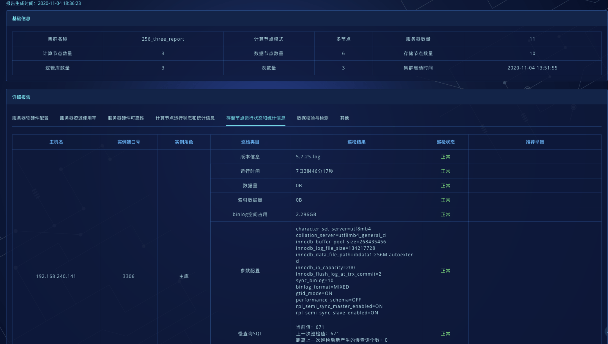

进入“历史巡检记录-\>详情-\>存储节点运行状态和统计信息”TAB页查看

- **版本信息**：存储节点对应实例端口下执行`select version()`

- **运行时间**：存储节点对应实例端口下执行`show global status like 'uptime'`，结果需换算成年月日时分秒

- **QPS、连接数和复制时延**：跟随“监控-\>智能逻辑拓扑”记录的当前值

- **数据量**：各个存储节点实例对应的数据量总量

- **索引数据量**：各个存储节点实例对应的索引量总量

- **Binlog空间占用**：计算当前集群下所有存储节点MySQL实例的`show binary logs;`，计算的是当前文件大小总和

- **参数配置**：使用show variables查看参数设置

- **慢查询SQL**：使用`show global status like 'Slow_queries'`查看慢查询SQL当前值，再通过`show global status like 'uptime'; `查看MySQL存储节点的启动时间

- **死锁信息**：对应存储节点实例下执行`show engine innodb status \G;`查看是否有死锁信息

- **错误日志**：通过`show variables like 'log_error'`;查看`error.log`的存放位置， 通过位置找到对应的`error.log`，查看最新的log时间是否在上一次巡检到本次巡检之间

- **数据增量预测**：跟随数据增量预测的结果，显示距离本次巡检时间一年后的存储节点数据量情况，同时将预测数据量与剩余可用磁盘空间进行对比（若当前数据记录未满21天则给出“数据记录未满21天无法预测”）

######  数据校验与检测

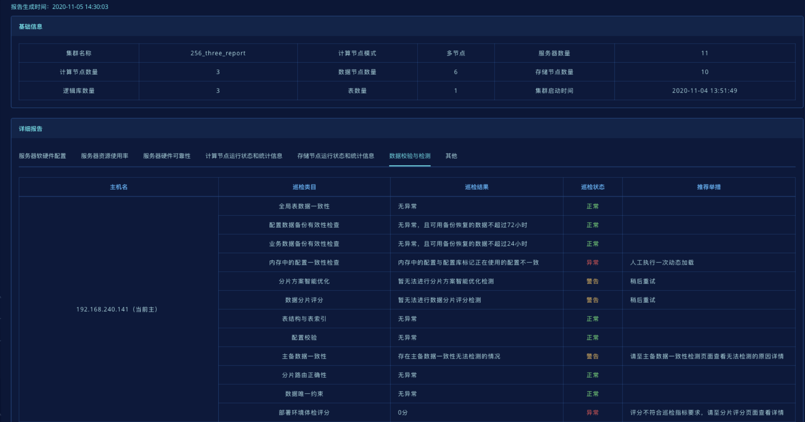

进入“历史巡检记录-\>详情-\>数据校验与检测”TAB页查看

- **配置校验**：获取“配置-\>配置校验-\>开始校验”当前结果

- **主备数据一致性**：

  - 以所有逻辑库（包括配置库）为准发起一次全量的数据校验

- **全局表数据一致性、表结构与表索引检测、分片路由正确性**：

  - 以所有逻辑库为准发起一次全量的数据校验

- **数据唯一约束、分片方案智能优化**：

  - 以当前所有逻辑库为准发起一次全量的数据校验，每个逻辑库一条校验记录，记录多条

- **部署环境体检评分**：

  - 巡检开始后，部署环境体检评分同步开始，可以进入“集群管理-\>部署环境体检”页面查看当前部署环境体检进度详情；

  - 巡检对象选择所有时，整个巡检过程花费时间最长的是[数据校验与检测](#数据校验与检测)，而在[数据校验与检测](#数据校验与检测)这个巡检对象里面花费时间最长的是“部署环境体检评分”这个巡检类目

  - 当前集群环境使用的是物理机还是虚拟机也直接影响着体检时间的长短（根据当前测试情况来看，一套全部是虚拟机的集群环境进行一次所有巡检对象的巡检花费的时间是在18分钟左右，而一套全部是物理机的集群环境进行同样情形的巡检花费的时间是在2分钟左右）。

  - 巡检时间也受组件多少的影响，组件越多，花费时间越久。

- **数据分片评分**：去“检测-\>数据分片评分”页面查看详情

- **业务数据备份有效性检查**：以所有逻辑库为单位发起一次数据备份，可以在“管理-\>数据备份”页面查看备份数据详情

- **配置数据备份有效性检查**：备份的是当前计算节点的配置库和配置文件，在“配置-\>集群元数据备份与还原”页面查看备份详情

- **内存中的配置一致性检查**：检查当前内存中的配置是否与配置库running表中标记正在使用的配置一致

######  其他

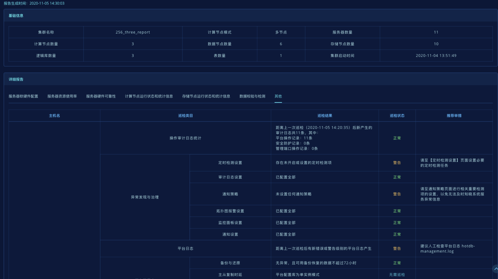

- 进入“历史巡检记录-\>详情-\>其他”TAB页查看

- **平台配置库**：管理角色下进入“工具-\>平台配置数据管理”页面

  - **可用状态**：查看管理平台配置库的连接状态是否正常

  - **主从复制状态和主从复制时延**：管理平台配置库为主从或双主模式时，配置库之间的主从复制状态和时延

  - **备份与还原**：备份的是当前管理平台的配置库和配置文件

  - 当管理平台配置库为单实例模式时，可用状态巡检结果为可用，主从复制状态和主从复制时延的巡检结果都提示“平台配置库为单实例模式” 

- **平台通知信息统计**

  - **事件通知**：分等级统计上一次巡检到本次巡检管理平台总计报告了多少次事件通知消息。

  - **邮件通知**：分邮件通知类型统计上一次巡检到本次巡检管理平台总计发出了多少次邮件提醒消息

- **平台定时任务执行情况信息统计**：对管理平台执行的各种检测类型的定时任务的情况进行一个汇总展示，包括“设置-\>定时检测设置”页面和“检测”菜单下相关子菜单所有的定时检测计划的执行情况

- **操作审计日志统计**：统计上一次巡检到当前巡检中途的审计日志条数，包括平台操作、安全防护和管理端口操作总共3类

- **通知策略、定时检测设置、拓扑图报警设置、监控面板设置、通知设置和审计日志设置**：在“事件-\>通知策略”页面进行通知策略的设置，在“设置”菜单下进行其他几项的设置

- **平台日志**：人工检查管理平台日志`hotdb-management.log`,查看上一次巡检到本次巡检之间是否有WARN或者ERROR级别的平台日志出现

- **GC情况统计**：使用命令`jstat -gc \[pid\] 1s 10` (pid为管理平台的进程ID)拿到结果
