# 管理端命令

## V2.5.8版本新增命令

- 增加SQL审计功能相关接口信息 [reload @@recordsqlauditlog](#reload-recordsqlauditlog)，[flush sqlaudit logs](#flush-sqlaudit-log)；

- 优化[unique @@create](#unique-create)命令，增加并发数的指定（向下同步至V2.5.6）；

- 优化[show @@longtransaction](#show-longtransaction)，增加mysqlid记录（向下同步至V2.5.6）；

- 优化[check @@datasource_config](#check-datasource_config)，增加灾备模式的时间差异的检测（向下同步至V2.5.6）；

- 增加[show @@topflow_front_in](#show-topflow_front_in)、[show @@topflow_front_out](#show-topflow_front_out)、[show @@topflow_backend_in](#show-topflow_backend_in)、[show @@topflow_backend_out](#show-topflow_backend_out)命令展示前后端进出流量最大的连接信息（向下同步至V2.5.6）；

- 增加[show @@globalconsistencycheckstatus](#show-globalconsistencycheckstatus)

- 增加[show @@msconsistencycheckstatus](#show-msconsistencycheckstatus)

- 增加[show @@onlineddlinfo](#show-onlineddlinfo)命令，显示正在运行的onlineddl任务状态；

- 增加[stop @@onlineddl](#show-onlineddl)命令， 用于取消正在执行的onlineddl任务；

- 增加[clear @@tablelock](#clear-tablelock)命令，用于清除内存中存在的onlineddl任务信息；

## 数据检测语句

### 计算节点集群运行相关

#### `show @@backend` - 显示后端连接情况

此命令用于查看HotDB Server与存储节点之间的连接状态，例如：

```sql
show @@backend;
```
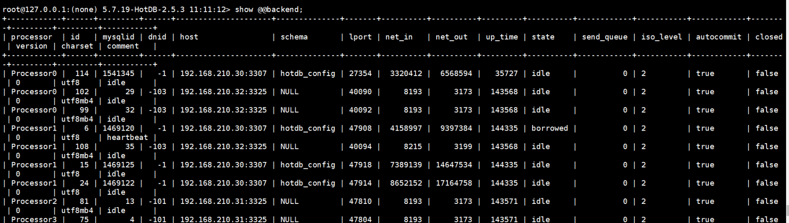

或像查询一张普通表一样查询backend：

```sql
select * from backend where MYSQLID=198865;
```

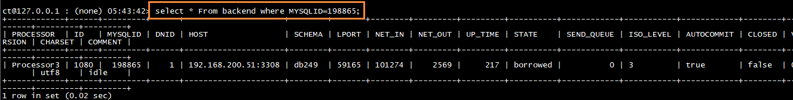

或使用HINT语法：

```sql
/*!hotdb:dnid=all*/select * from information_schema.processlist where info!='NULL' and id=198865;
```

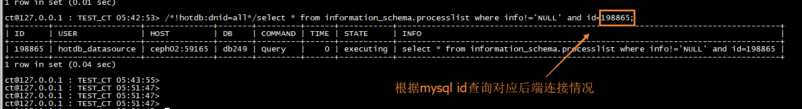

**结果包含字段及其说明：**

| **列名**     | **说明**          | **值类型/范围**                                              |
| ------------ | ----------------- | ------------------------------------------------------------ |
| `processor`  | 所属的processor   | `STRING/[“Processor”number]`                                 |
| `id`         | 后端连接号        | `LONG/[number]`                                              |
| `mysqlid`    | 对应的MySQL连接号 | `LONG/[number]`                                              |
| `dnid`       | 数据节点id        | `INT/[number]`                                               |
| `host`       | 主机信息          | `STRING/[host:port]`                                         |
| `schema`     | 物理数据库名      | `STRING/[database]`                                          |
| `lport`      | 本地端口号        | `INT/[number]`                                               |
| `net_in`     | 接收的字节数      | `LONG/[number]`                                              |
| `net_out`    | 发送的字节数      | `LONG/[number]`                                              |
| `up_time`    | 启动时长（秒）    | `LONG/[number]`                                              |
| `state`      | 链路状态          | `connecting`-主动去连接服务器的过程，发起了socket建立请求，还没有建立成功 |
| ^            | ^                 | `authenticating`-握手认证过程                                |
| ^            | ^                 | `idle`-空闲可用状态                                          |
| ^            | ^                 | `borrowed`-租用状态:存在事务场景下，即使后端没有执行sql，但连接会被保持，直到提交commit、rollback后才会释放 |
| ^            | ^                 | `running`-发送了请求，等待应答或者正在处理应答的状态         |
| ^            | ^                 | `closed`-链路关闭                                            |
| `send_queue` | 发送队列大小      | `INT/[number]`                                               |
| `iso_level`  | 事务隔离级别      | `0`-读未提交                                                 |
| ^            | ^                 | `1`-读已提交                                                 |
| ^            | ^                 | `2`-可重复读                                                 |
| ^            | ^                 | `3`-可串行化                                                 |
| `autocommit` | 是否自动提交      | `BOOLEAN/[true/false]`                                       |
| `closed`     | 是否已关闭        | `BOOLEAN/[true/false]`                                       |
| `version`    | 连接池版本号      | `INT/[number]`                                               |
| `charset`    | 结果字符集        | `STRING/[charset]`                                           |
| `comment`    | 备注              | `heartbeat`-心跳使用的连接                                   |
| ^            | ^                 | `latency check`-延迟检测使用的连接                           |
| ^            | ^                 | `idle`-空闲状态的连接                                        |
| ^            | ^                 | `querying`-正在执行查询的连接                                |

#### `show @@bufferpool` - 显示缓冲池状态

此命令用于查看缓冲池状态，例如：

```sql
show @@bufferpool;
```


**结果包含字段及其说明：**

| **列名**              | **说明**                   | **值类型/范围**                                                              |
| --------------------- | -------------------------- | ---------------------------------------------------------------------------- |
| `thread`              | 线程名                     | `STRING/ [“$NIOREACTOR-“[number]”-RW”, “$NIOExecutor-“[number]”-“ [number]]` |
| `pool_size`           | 缓冲池大小                 | `INT/[number]`                                                               |
| `local_allocate_opts` | 本地缓存线程申请buffer次数 | `LONG /[number]`                                                             |
| `queue_recycle_opts`  | 本地缓存线程回收buffer次数 | `LONG/[number]`                                                              |
| `other_allocate_opts` | 其他线程申请buffer次数     | `INT/[number]`                                                               |
| `other_recycle_opts`  | 其他线程回收buffer次数     | `INT/[number]`                                                               |

#### `show @@clientquery` - 当前客户端查询统计

该命令用于显示当前客户端查询统计，例如：

```sql
show @@clientquery;
```

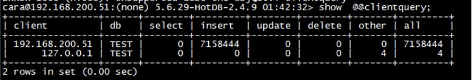

**结果包含字段及其说明：**

| **列名** | **说明**     | **值类型/范围**     |
| -------- | ------------ | ------------------- |
| `client` | 客户端信息   | `STRING/[host]`     |
| `db`     | 逻辑库名     | `STRING/[database]` |
| `select` | 查询次数     | `LONG /[number]`    |
| `insert` | 插入次数     | `LONG /[number]`    |
| `update` | 更新次数     | `LONG /[number]`    |
| `delete` | 删除次数     | `LONG /[number]`    |
| `other`  | 其它操作次数 | `LONG /[number]`    |
| `all`    | 总和         | `LONG/[number]`     |

> **Note**
>
> other统计的是当前客户端执行DDL语句的次数

#### `show @@cluster` - 显示集群成员信息

此命令用于查看当前集群成员状态。该命令只用于查看集群成员状态，对于单节点及主备节点，该参数不具备参考意义，例如：

```sql
show @@cluster;
```

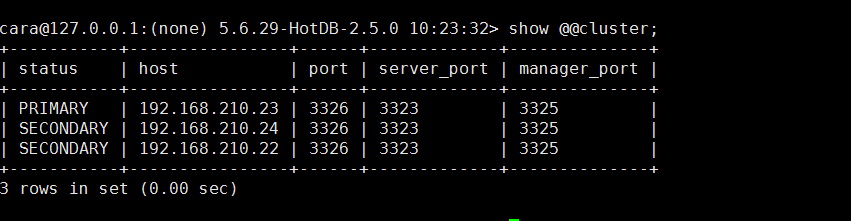

**结果包含字段及其说明：**

| **列名**       | **说明**         | **值类型/范围**  |
| -------------- | ---------------- | ---------------- |
| `status`       | 成员状态         | `STRING`         |
| `host`         | 成员Host         | `STRING/[host]`  |
| `port`         | 集群通信端口     | `INTEGER/[port]` |
| `server_port`  | 集群节点服务端口 | `INTEGER/[port]` |
| `manager_port` | 集群节点管理端口 | `INTEGER/[port]` |

#### `show @@connection` - 显示前端连接状态

该命令用于获取HotDB Server的前端连接状态，例如：

```sql
show @@connection;
```

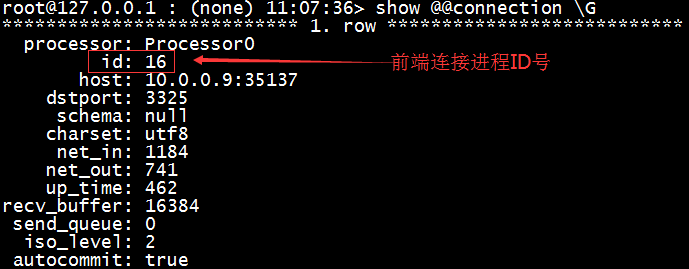

**结果包含字段及其说明：**

| **列名**      | **说明**             | **值类型/范围**              |
| ------------- | -------------------- | ---------------------------- |
| `processor`   | processor名称        | `STRING/[“Processor”number]` |
| `id`          | 前端连接ID           | `LONG/[number]`              |
| `host`        | 客户端信息           | `STRING/[host:port]`         |
| `dstport`     | 目标端口号           | `INT/[number]`               |
| `schema`      | 目标数据库名         | `STRING/[database]`          |
| `charset`     | 字符集               | `STRING/[charset]`           |
| `net_in`      | 接收的字节数         | `LONG/[number]`              |
| `net_out`     | 发送的字节数         | `LONG/[number]`              |
| `up_time`     | 启动时长（秒）       | `INT/[number]`               |
| `recv_buffer` | 接收队列大小（字节） | `LONG/[number]`              |
| `send_queue`  | 发送队列大小（字节） | `LONG/[number]`              |
| `iso_level`   | 事务隔离级别         | `0`-读未提交                 |
| ^             | ^                    | `1`-读已提交                 |
| ^             | ^                    | `2`-可重复读                 |
| ^             | ^                    | `3`-可串行化                 |
| `autocommit`  | 是否自动提交         | `BOOLEAN/[true/false]`       |

#### `show @@connection_statistics` - 显示当前存活的前端连接信息

该命令用于获取HotDB Server当前存活的前端连接信息，例如：

```sql
show @@connection_statistics;
```

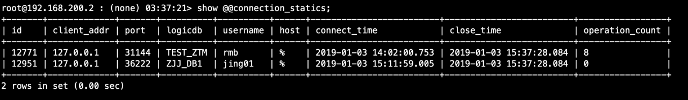

**结果包含字段及其说明：**

| **列名**          | **说明**         | **值类型/范围**     |
| ----------------- | ---------------- | ------------------- |
| `id`              | 连接id           | `INTEGER/[number]`  |
| `client_addr`     | 客户端IP地址     | `STRING/[host]`     |
| `port`            | 客户端连接端口   | `INTEGER/[number]`  |
| `logicdb`         | 使用的逻辑库     | `STRING/[database]` |
| `username`        | 用户名           | `STRING`            |
| `host`            | 客户端匹配的host | `STRING`            |
| `connect_time`    | 连接建立时间     | `STRING/[date]`     |
| `close_time`      | 当前连接时间     | `STRING/[date]`     |
| `operation_count` | 本次连接操作次数 | `INTEGER/[number]`  |

#### `show @@database` - 显示当前可用逻辑库信息

该命令用于显示当前可用逻辑库信息，等同于MySQL下的show databases命令，例如：

```sql
show @@database;
```


**结果包含字段及其说明：**

| **列名**   | **说明** | **值类型/范围**     |
| ---------- | -------- | ------------------- |
| `database` | 逻辑库   | `STRING/[database]` |

#### `show @@datanode` - 显示数据节点信息

该命令用于显示当前物理库的节点信息，例如：

```sql
show @@datanode;
```

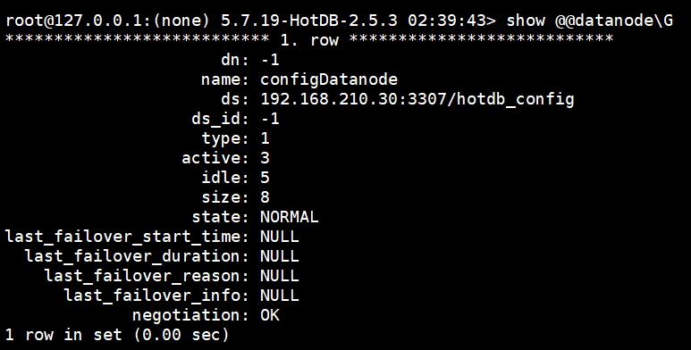

**结果包含字段及其说明：**

| 列名                       | 说明                                                          | 值类型/范围                        |
| -------------------------- | ------------------------------------------------------------- | ---------------------------------- |
| `dn`                       | 数据节点号（可使用`restart @@heartbeat`指令进行恢复心跳检测） | `INT/[number]`                     |
| `ds`                       | 当前存储节点信息                                              | `STRING/[host:port/database]`      |
| `ds_id`                    | 当前存储节点号                                                | `INT/[number]`                     |
| `type`                     | 当前存储节点类型                                              | `1`-主库                           |
| ^                          | ^                                                             | `2`-主从库                         |
| ^                          | ^                                                             | `3`-从库                           |
| ^                          | ^                                                             | `4`-MGR                            |
| `active`                   | 活动连接数                                                    | `INT/[number]`                     |
| `idle`                     | 空闲连接数                                                    | `INT/[number]`                     |
| `size`                     | 总连接数                                                      | `INT/[number]`                     |
| `state`                    | 节点状态                                                      | `normal:`-正常                     |
| ^                          | ^                                                             | `Failover`-故障转移                |
| `last_failover_start_time` | 上一次故障切换开始时间                                        | `STRING/[yyyy-MM-dd HH:mm:ss.SSS]` |
| `last_failover_duration`   | 上一次故障切换持续时间(ms)                                    | `STRING/[number]`                  |
| `last_failover_reason`     | 上一次故障切换原因                                            | `STRING`                           |
| `last_failover_info`       | 上一次故障切换信息                                            | `STRING`                           |
| `negotiation`              | MGR节点协商状态                                               | `OK`-正常                          |
| ^                          | ^                                                             | `ERROR`-异常                       |
| ^                          | ^                                                             | `NULL`-非MGR                       |

#### `show @@datasource` - 显示存储节点信息

该命令用于查看当前存储节点配置信息及状态，例如：

```sql
show @@datasource;
```

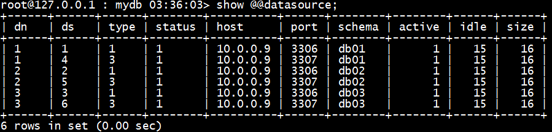

**结果包含字段及其说明：**

| **列名**             | **说明**                                                      | **值类型/范围**               |
| -------------------- | ------------------------------------------------------------- | ----------------------------- |
| `dn`                 | 数据节点号（可使用`restart @@heartbeat`指令进行恢复心跳检测） | `INT/[number]`                |
| `ds`                 | 当前存储节点信息                                              | `STRING/[host:port/database]` |
| `type`               | 当前存储节点类型                                              | `1`-主库                      |
| ^                    | ^                                                             | `2`-主从库                    |
| ^                    | ^                                                             | `3`-从库                      |
| ^                    | ^                                                             | `4`-MGR                       |
| `status`             | 存储节点状态                                                  | `0`-不可用                    |
| ^                    | ^                                                             | `1`-可用                      |
| ^                    | ^                                                             | `2`-最后一个存储节点异常      |
| `host`               | 主机地址                                                      | `STRING/[IP]`                 |
| `port`               | 主机端口                                                      | `STRING /[port]`              |
| `schema`             | 物理数据库名                                                  | `STRING/[database]`           |
| `active`             | 活动连接数                                                    | `INT/[number]`                |
| `idle`               | 空闲连接数                                                    | `INT/[number]`                |
| `size`               | 总连接数                                                      | `INT/[number]`                |
| `unavailable_reason` | 存储节点不可用原因                                            | `STRING`                      |
| `flow_control`       | 剩余可用计数                                                  | `INT/[number]`                |

#### `show @@globaltableconsistency` - 全局表一致性检测

该命令用于检测全局表是否一致，例如：

```sql
show @@globaltableconsistency;
```


**结果包含字段及其说明：**

| 列名                                             | 说明                                         | 值类型/范围                   |
| ------------------------------------------------ | -------------------------------------------- | ----------------------------- |
| `db`                                             | 逻辑库名                                     | `STRING/[database]`           |
| `table`                                          | 全局表名                                     | `STRING/[host:port/database]` |
| `status`                                         | 状态                                         | `0`-无法检测                  |
| ^                                                | ^                                            | `1`-一致                      |
| ^                                                | ^                                            | `-1`-不一致                   |
| `result`                                         | 检测结果                                     | `STRING`                      |
| `less_half_dn_lost_and_first_dn_exsitdata_count` | 小于二分之一节点缺失且第一节点有数据的行数   | `INT/[number]`                |
| `repair`                                         | 恢复状态                                     | `STRING`                      |
| `less_half_dn_lost_and_first_dn_nodata_count`    | 小于二分之一节点缺失且第一节点没有数据的行数 | `INT/[number]`                |
| `greater_half_dn_lost_count`                     | 大于二分之一节点缺失的行数                   | `INT/[number]`                |
| `only_one_dn_not_lost_row_count`                 | 仅有一个节点未丢失的数据的行数               | `INT/[number]`                |
| `inconsist_row_count`                            | 大于一个节点不一致                           | `INT/[number]                 |
| `only_one_dn_inconsist_row_count`                | 仅有一个节点不一致且无缺失的行数             | `INT/[number]`                |
| `inconsist_and_lost_count`                       | 同时存在不一致和缺失行数                     | `INT/[number]`                |
| `version`                                        | 检测版本                                     | `INT/[number]`                |

#### `show @@globalconsistencycheckstatus` – 显示全局表一致性检测任务{#show-globalconsistencycheckstatus}

该命令用于显示正在执行的全局表一致性检测任务信息，例如：

```sql
show @@globalconsistencycheckstatus;
```

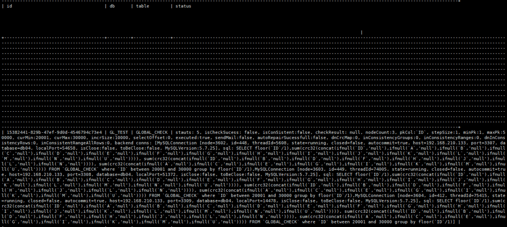

当全局表一致性检测任务正在执行时，管理端执行命令，可查询出对应表的检测任务。

**结果包含字段及其说明：**

| **列名** | **说明**                   | **值类型/范围**  |
| -------- | -------------------------- | ---------------- |
| `id`     | 连接编号或检测时指定的uuid | `STRING`         |
| `db`     | 逻辑库名                   | `STRING`         |
| `table`  | 表名                       | `STRING/[table]` |
| `status` | 节点检测信息               | `STRING`         |

#### `show @@heartbeat` - 显示后端心跳状态

该命令用于报告心跳状态，例如：

```sql
show @@heartbeat;
```

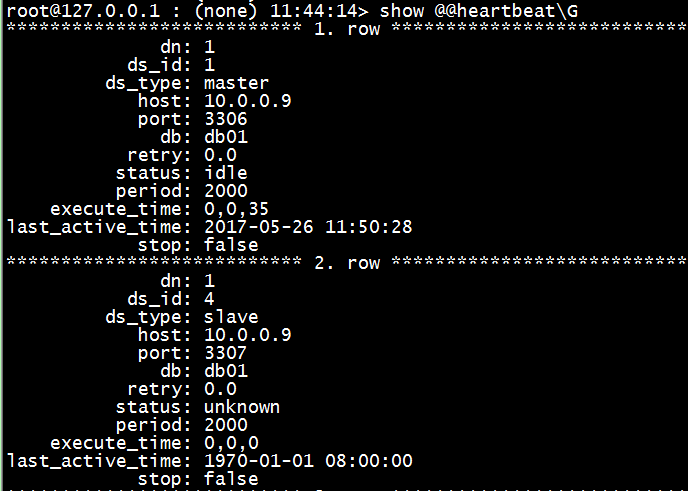

**结果包含字段及其说明：**

| **列名**           | **说明**                                       | **值类型/范围**                     |
| ------------------ | ---------------------------------------------- | ----------------------------------- |
| `dn`               | 数据节点id                                     | `INT/[number]`                      |
| `ds_id`            | 存储节点id                                     | `INT/[number]`                      |
| `ds_type`          | 存储节点类型                                   | `STRING/[master/slave]`             |
| `host`             | 主机地址                                       | `STRING/[ip]`                       |
| `port`             | 主机端口                                       | `INT/[port]`                        |
| `db`               | 物理库名                                       | `STRING/[database]`                 |
| `retry`            | 重试次数                                       | `INT/[number]`                      |
| `status`           | 心跳状态                                       | `checking`-校验中                   |
| ^                  | ^                                              | `idle`-正常开启心跳检测             |
| ^                  | ^                                              | `stopped`-停止                      |
| ^                  | ^                                              | `paused`-暂停心跳检测               |
| ^                  | ^                                              | `unknown`-心跳检测功能未开启        |
| `period`           | 心跳周期                                       | `INT/[number]`                      |
| `execute_time`     | 最近10秒,1分钟,5分钟的心跳平均响应时间（毫秒） | `STRING/[number],[number],[number]` |
| `last_active_time` | 最新心跳成功时间                               | `DATETIME/[yyyy-MM-dd HH:mm:ss]`    |
| `stop`             | 心跳是否停止                                   | `BOOLEAN/[true/false]`              |

> **Note**
>
> dn为-1代表配置库

#### `show @@latency` - 显示同步延迟情况

此命令用于查看主从数据库同步是否有延时情况（需要配置故障切换规则才会显示该值），当主从数据发生延时，例如此处设置从机的SQL_DELAY时间：


```sql
show @@latency;
```


无延迟则显示：

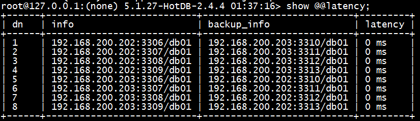

**结果包含字段及其说明：**

| **列名**      | **说明**                                                                                                                                                                                                                 | **值类型/范围**                                                                                                                       |
| ------------- | ------------------------------------------------------------------------------------------------------------------------------------------------------------------------------------------------------------------------ | ------------------------------------------------------------------------------------------------------------------------------------- |
| `dn`          | 数据节点id                                                                                                                                                                                                               | `INT/[number]`                                                                                                                        |
| `info`        | 当前存储节点路径                                                                                                                                                                                                         | `STRING/[ip]:[port]/[database]`                                                                                                       |
| `backup_info` | 备库存储节点路径                                                                                                                                                                                                         | `STRING/[ip]:[port]/[database]`                                                                                                       |
| `latency`     | 如可用则显示同步延迟（ms）；如不可用或存储节点被暂停显示`”STOPPED”`；如无同步延迟，则显示`“ERROR! Check your replication.”`；如同步延迟无效，则显示`“ERROR! Check your replication.(datasource may have just switched)”` | `STRING/[number] ms,”STOPPED”, “ERROR! Check your replication.”, “ERROR! Check your replication.(datasource may have just switched)”` |

#### `show @@longtransaction` - 显示长事务信息{#show-longtransaction}

此命令用于查看长事务信息，例如：

```sql
show @@longtransaction;
```

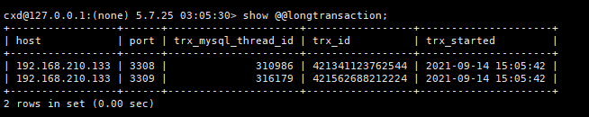

长事务判断依据：事务执行时间超过10s,都会判断为长事务，参考规则：

```sql
select trx_id, trx_started from information_schema.innodb_trx where trx_started\<=date_sub(now(),interval 10 second);
```

**结果包含字段及其说明：**

| **列名**              | **说明**    | **值类型/范围**   |
| --------------------- | ----------- | ----------------- |
| `host`                | 主机地址    | `STRING/[IP]`     |
| `port`                | 主机端口号  | `INT/[PORT]`      |
| `trx_mysql_thread_id` | MySQL连接ID | `STRING/[number]` |
| `trx_id`              | 事务标识    | `STRING/[number]` |

#### `show @@masterslaveconsistency` - 主从数据一致性检测

该命令用于显示表在主库和从库上是否一致，例如：

```sql
show @@masterslaveconsistency;
```

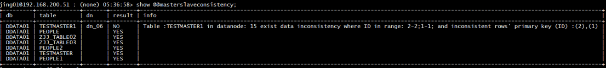

上图结果中显示DN_06节点的主从数据检测不一致。

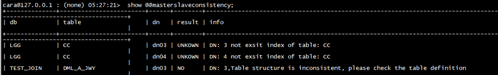

又如上图结果中显示逻辑库LGG中的CC表未定义索引，无法进行一致性检测；DML_A\_JWY表结构不一致。

**结果包含字段及其说明：**

| **列名** | **说明**     | **值类型/范围**                  |
| -------- | ------------ | -------------------------------- |
| `db`     | 逻辑库名     | `STRING/[database]`              |
| `table`  | 表名         | `STRING/[table]`                 |
| `dn`     | 数据节点名称 | `STRING`                         |
| `result` | 是否一致     | `STRING/[“YES”,“NO” ,“UNKNOWN”]` |
| `info`   | 一致性结果   | `STRING`                         |

#### `show @@msconsistencycheckstatus` – 显示主从数据一致性检测任务{#show-msconsistencycheckstatus}

该命令用于显示正在执行的主从数据一致性检测任务信息，例如：

```sql
show @@msconsistencycheckstatus;
```

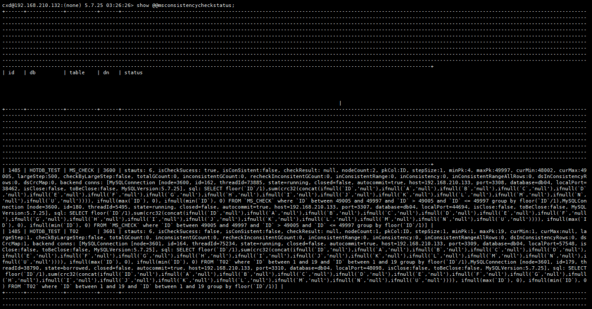

当主从一致性检测任务正在执行时，管理端执行命令，可查询出对应数据节点的检测任务。

**结果包含字段及其说明：**

| **列名** | **说明**                   | **值类型/范围**  |
| -------- | -------------------------- | ---------------- |
| `id`     | 连接编号或检测时指定的uuid | `STRING`         |
| `db`     | 逻辑库名                   | `STRING`         |
| `table`  | 表名                       | `STRING/[table]` |
| `dn`     | 数据节点名称               | `STRING`         |
| `status` | 节点检测信息               | `STRING`         |

#### `show @@operation` - 显示详细的命令执行统计情况

该命令用于显示实际使用的存储节点，后端执行命令次数的统计情况，例如前端执行插入操作：

```sql
insert into tid values(10),(2);
insert into tid values(1677870),(233333333);
```


查询结果显示为后端当前使用存储节点表的执行情况:

```sql
select * from operation where `TABLE` like '%tid%';
```


**结果包含字段及其说明：**

| **列名**  | **说明**                                         | **值类型/范围**     |
| --------- | ------------------------------------------------ | ------------------- |
| `schema`  | 逻辑库名                                         | `STRING/[database]` |
| `dn`      | 数据节点id                                       | `INT/[number]`      |
| `ds`      | 存储节点id                                       | `INT/[number]`      |
| `host`    | 存储节点所在主机IP                               | `STRING/[IP]`       |
| `port`    | 存储节点的端口                                   | `INT/[number]`      |
| `db`      | 物理库                                           | `STRING/[database]` |
| `table`   | 表名                                             | `STRING/[table]`    |
| `select`  | 对\[table\]表select操作次数                      | `LONG/[number]`     |
| `insert`  | 对\[table\]表insert操作次数                      | `LONG /[number]`    |
| `update`  | 对\[table\]表insert操作次数                      | `LONG /[number]`    |
| `delete`  | 对\[table\]表delete操作次数                      | `LONG /[number]`    |
| `replace` | 对\[table\]表replace操作次数                     | `LONG /[number]`    |
| `other`   | 对\[table\]表的其它操作次数（执行DDL语句的次数） | `LONG /[number]`    |
| `all`     | 对以上操作的统计                                 | `LONG /[number]`    |

#### `show @@operation_db` - 显示逻辑库为单位的命令执行情况

该命令用于显示以逻辑库为单位的命令执行统计情况，例如：

```sql
show @@operation_db;
```


**结果包含字段及其说明：**

| **列名**  | **说明**                                         | **值类型/范围**     |
| --------- | ------------------------------------------------ | ------------------- |
| `db`      | 逻辑库名                                         | `STRING/[database]` |
| `select`  | 对\[table\]表select操作次数                      | `LONG /[number]`    |
| `insert`  | 对\[table\]表insert操作次数                      | `LONG /[number]`    |
| `update`  | 对\[table\]表insert操作次数                      | `LONG /[number]`    |
| `delete`  | 对\[table\]表delete操作次数                      | `LONG /[number]`    |
| `replace` | 对\[table\]表replace操作次数                     | `LONG /[number]`    |
| `other`   | 对\[table\]表的其它操作次数（执行DDL语句的次数） | `LONG /[number]`    |
| `all`     | 对以上操作的统计                                 | `LONG /[number]`    |

#### `show @@operation_dn` - 显示数据节点为单位的命令执行情况

该命令用于显示以数据节点为单位的命令执行统计情况，例如：

```sql
show @@operation_dn;
```

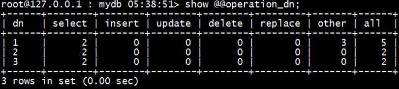

**结果包含字段及其说明：**

| **列名**  | **说明**                                         | **值类型/范围**  |
| --------- | ------------------------------------------------ | ---------------- |
| `dn`      | 数据库节点id                                     | `INT/[number]`   |
| `select`  | 对\[table\]表select操作次数                      | `LONG/[number]`  |
| `insert`  | 对\[table\]表insert操作次数                      | `LONG/[number]`  |
| `update`  | 对\[table\]表insert操作次数                      | `LONG/[number]`  |
| `delete`  | 对\[table\]表delete操作次数                      | `LONG /[number]` |
| `replace` | 对\[table\]表replace操作次数                     | `LONG /[number]` |
| `other`   | 对\[table\]表的其它操作次数（执行DDL语句的次数） | `LONG /[number]` |
| `all`     | 对以上操作的统计                                 | `LONG/[number]`  |

> **Note**
>
> 与全局表相关的操作量根据操作类型分别计数：SELECT仅统计一个节点，INSERT、UPDATE、DELETE操作统计所有节点

#### `show @@operation_ds` - 显示存储节点为单位的命令执行情况

该命令用于显示以存储节点为单位的命令执行统计情况，例如：

```sql
show @@operation_ds;
```

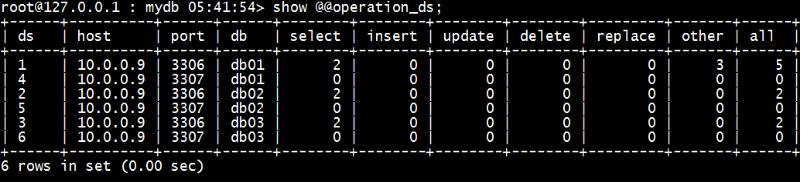

**结果包含字段及其说明：**

| **列名**  | **说明**                                         | **值类型/范围**     |
| --------- | ------------------------------------------------ | ------------------- |
| `ds`      | 存储节点id                                       | `INT/[number]`      |
| `host`    | 存储节点所在主机IP                               | `STRING/[IP]`       |
| `port`    | 存储节点的端口                                   | `INT/[number]`      |
| `db`      | 物理库                                           | `STRING/[database]` |
| `select`  | 对\[table\]表select操作次数                      | `LONG /[number]`    |
| `insert`  | 对\[table\]表insert操作次数`                     | `LONG /[number]`    |
| `update`  | 对\[table\]表insert操作次数                      | `LONG /[number]`    |
| `delete`  | 对\[table\]表delete操作次数                      | `LONG /[number]`    |
| `replace` | 对\[table\]表replace操作次数                     | `LONG /[number]`    |
| `other`   | 对\[table\]表的其它操作次数（执行DDL语句的次数） | `LONG /[number]`    |
| `all`     | 对以上操作的统计                                 | `LONG /[number]`    |

#### `show @@operation_table` - 显示表为单位的命令执行情况

该命令用于显示以逻辑数据表为单位的命令执行统计情况，例如：

```sql
show @@operation_table;
```


**结果包含字段及其说明：**

| **列名**  | **说明**                                       | **值类型/范围**  |
| --------- | ---------------------------------------------- | ---------------- |
| `table`   | 表名                                           | `STRING/[table]` |
| `select`  | 对[table]表select操作次数                      | `LONG /[number]` |
| `insert`  | 对[table]表insert操作次数                      | `LONG /[number]` |
| `update`  | 对[table]表insert操作次数                      | `LONG /[number]` |
| `delete`  | 对[table]表delete操作次数                      | `LONG /[number]` |
| `replace` | 对[table]表replace操作次数                     | `LONG /[number]` |
| `other`   | 对[table]表的其它操作次数（执行DDL语句的次数） | `LONG /[number]` |
| `all`     | 对以上操作的统计                               | `LONG /[number]` |

#### `show @@processor` - 显示处理线程信息

此命令用于查看当前线程处理信息，例如：

```sql
show @@processor;
```


**结果包含字段及其说明：**

| **列名**          | **说明**       | **值类型/范围**              |
| ----------------- | -------------- | ---------------------------- |
| `name`            | processor名称  | `STRING/[“Processor”number]` |
| `front_net_in`    | 前端接受字节数 | `LONG/[number]`              |
| `front_net_out`   | 前端发送字节数 | `LONG/[number]`              |
| `backend_net_in`  | 后端接受字节数 | `LONG/[number]`              |
| `backend_net_out` | 后端发送字节数 | `LONG/[number]`              |
| `frontends`       | 前端连接数     | `LONG /[number]`             |
| `backends`        | 后端连接数     | `LONG /[number]`             |
| `w_queue`         | 写队列大小     | `LONG /[number]`             |

#### `show @@query` - 显示前端查询统计

该命令用于显示前端命令统计情况（不包含管理端），例如：

```sql
show @@query;
```

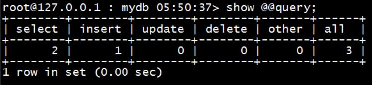

**结果包含字段及其说明：**

| **列名** | **说明**                                        | **值类型/范围**  |
| -------- | ----------------------------------------------- | ---------------- |
| `select` | 调用本服务的select操作的次数                    | `LONG /[number]` |
| `insert` | 调用本服务的insert操作的次数                    | `LONG /[number]` |
| `update` | 调用本服务的update操作的次数                    | `LONG /[number]` |
| `delete` | 调用本服务的delete操作的次数                    | `LONG /[number]` |
| `other`  | 调用本服务的其它操作的次数（执行DDL语句的次数） | `LONG /[number]` |
| `all`    | 对以上操作的统计                                | `LONG /[number]` |

#### `show @@query_db` - 显示逻辑库前端查询统计

该命令用于显示每个逻辑库执行命令统计情况，例如：

```sql
show @@query_db;
```

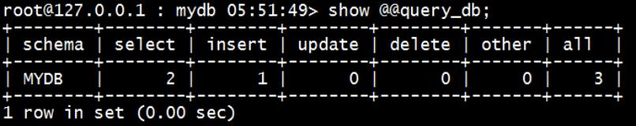

**结果包含字段及其说明：**

| **列名** | **说明**                                              | **值类型/范围**     |
| -------- | ----------------------------------------------------- | ------------------- |
| `schema` | 逻辑库                                                | `STRING/[database]` |
| `select` | 对逻辑库[schema]的select操作的次数                    | `LONG /[number]`    |
| `insert` | 对逻辑库[schema]的insert操作的次数                    | `LONG /[number]`    |
| `update` | 对逻辑库[schema]的update操作的次数                    | `LONG /[number]`    |
| `delete` | 对逻辑库[schema]的delete操作的次数                    | `LONG /[number]`    |
| `other`  | 对逻辑库[schema]的其它操作的次数（执行DDL语句的次数） | `LONG /[number]`    |
| `all`    | 对以上操作的统计                                      | `LONG /[number]`    |

#### `show @@query_tb` - 显示表级前端查询统计

该命令用于显示每个数据表据执行命令统计情况，例如：

```sql
show @@query_tb;
```

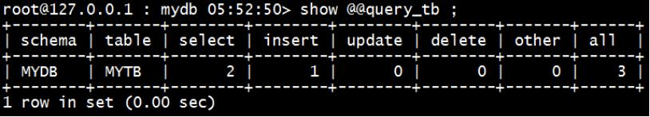

**结果包含字段及其说明：**

| **列名** | **说明**                                                           | **值类型/范围**     |
| -------- | ------------------------------------------------------------------ | ------------------- |
| `schema` | 逻辑库                                                             | `STRING/[database]` |
| `table`  | 表名                                                               | `STRING/[table]`    |
| `select` | 对逻辑库`[schema]`下的[table]表的select操作的次数                  | `LONG /[number]`    |
| `insert` | 对逻辑库`[schema]`下的[table]表的insert操作的次数                  | `LONG /[number]`    |
| `update` | 对逻辑库`[schema]`下的[table]表的update操作的次数                  | `LONG /[number]`    |
| `delete` | 对逻辑库`[schema]`下的[table]表的delete操作的次数                  | `LONG /[number]`    |
| `other`  | 对逻辑库`[schema]`下的[table]表的其它操作的次数（执行DDL语句的次数） | `LONG /[number]`    |
| `all`  |对以上操作的统计|`LONG /[number]`|

#### `show @@session` - 显示当前会话信息

该命令用于显示当前会话信息，例如：

```sql
show @@session;
```


**结果包含字段及其说明：**

| **列名**             | **说明**                  | **值类型/范围**                    |
| -------------------- | ------------------------- | ---------------------------------- |
| `id`                 | 当前会话号                | `INT/[number]`                     |
| `running`            | 是否正在执行SQL           | `BOOLEAN/[TRUE/FALSE]`             |
| `trx_started`        | 事务开始的时间            | `STRING/[yyyy-MM-dd HH:mm:ss.SSS]` |
| `trx_time`           | 事务持续的时间（秒）      | `INT/[number]`                     |
| `trx_query`          | 最后一次执行的SQL         | `STRING/[SQL]`                     |
| `bk_count`           | 后端连接总数              | `INT/[number]`                     |
| `bk_dnid`            | 后端连接节点号            | `INT/[number]`                     |
| `bk_dsid`            | 后端连接存储节点号        | `INT/[number]`                     |
| `bk_id`              | 后端连接ID                | `INT/[number]`                     |
| `bk_mysqlid`         | 后端连接MySQL ID          | `INT/[number]`                     |
| `bk_state`           | 后端连接状态              | `STRING`                           |
| `bk_closed`          | 后端连接是否关闭          | `BOOLEAN/[TRUE/FALSE]`             |
| `bk_autocommit`      | 后端连接是否自动提交      | `BOOLEAN/[TRUE/FALSE]`             |
| `bk_host`            | 后端连接Host              | `STRING/[host]`                    |
| `bk_port`            | 后端连接Port              | `INT/[port]`                       |
| `bk_db`              | 后端连接物理库名          | `STRING/[DATABASE]`                |
| `bk_query`           | 后端连接最后一次执行的SQL | `STRING/[SQL]`                     |
| `bk_last_read_time`  | 后端连接最后读包时间      | `STRING/[yyyy-MM-dd HH:mm:ss.SSS]` |
| `bk_last_write_time` | 后端连接最后写包时间      | `STRING/[yyyy-MM-dd HH:mm:ss.SSS]` |

#### `show @@tableinfo` - 显示表的数据信息

该命令用于查看每个数据表的数据信息，例如：

```sql
show @@tableinfo;
```

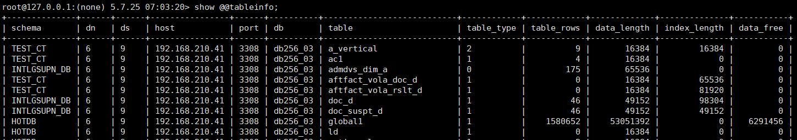

**结果包含字段及其说明：**

| **列名**       | **说明**           | **值类型/范围**     |
| -------------- | ------------------ | ------------------- |
| `schema`       | 逻辑库             | `STRING/[database]` |
| `dn`           | 数据节点id         | `INT/[number]`      |
| `ds`           | 存储节点id         | `INT/[number]`      |
| `host`         | 存储节点所在主机IP | `STRING/[IP]`       |
| `port`         | 存储节点的端口     | `INT/[PORT]`        |
| `db`           | 物理库             | `STRING/[DATABASE]` |
| `table`        | 物理表表名         | `STRING/[number]`   |
| `table_type`   | 表类型             | `0`-全局表          |
| ^              | ^                  | `1`-分片表          |
| `table_rows`   | 物理表行数         | `INT/[number]`      |
| `data_length`  | 数据长度(字节)     | `LONG /[number]`    |
| `index_length` | 索引长度(字节)     | `LONG /[number]`    |
| `data_free`    | 空闲页大小(字节)   | `LONG /[number]`    |

#### `show @@tableinfo_db` - 显示以逻辑库为单位的表数据信息

该命令用于查看以逻辑数据库为单位的表的数据信息，例如：

```sql
show @@tableinfo_db;
```

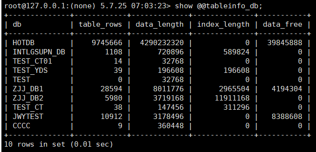

**结果包含字段及其说明：**

| **列名**       | **说明**                  | **值类型/范围**     |
| -------------- | ------------------------- | ------------------- |
| `db`           | 逻辑库名                  | `STRING/[database]` |
| `table_rows`   | 对[table]表select操作次数 | `LONG/[number]`     |
| `data_length`  | 对[table]表insert操作次数 | `LONG /[number] `   |
| `index_length` | 索引长度(字节)            | `LONG/[number] `    |
| `data_free`    | 空闲页大小(字节)          | `LONG/[number] `    |

#### `show @@tableinfo_dn` - 显示数据节点为单位的表数据信息

该命令用于查看以数据节点为单位的表的数据信息，仅统计当前使用存储节点的表信息。例如：

```sql
show @@tableinfo_dn
```

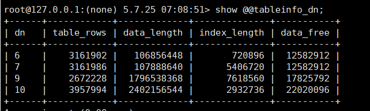

**结果包含字段及其说明：**

| **列名**       | **说明**                    | **值类型/范围**  |
| -------------- | --------------------------- | ---------------- |
| `dn`           | 数据节点id                  | `INT/[number]`   |
| `table_rows`   | 对\[table\]表select操作次数 | `LONG/[number] ` |
| `data_length`  | 对\[table\]表insert操作次数 | `LONG/[number] ` |
| `index_length` | 索引长度(字节)              | `LONG/[number] ` |
| `data_free`    | 空闲页大小(字节)            | `LONG/[number] ` |

#### `show @@tableinfo_ds` - 显示存储节点为单位的表数据信息

该命令用于显示以存储节点为单位的表的数据信息，包含当前所有存储节点信息（不可用存储节点也统计在内）。例如：

```sql
show @@tableinfo_ds
```

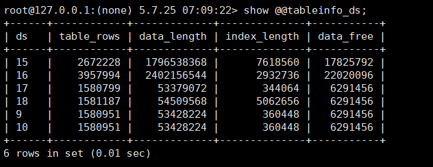

**结果包含字段及其说明：**

| **列名**       | **说明**                    | **值类型/范围**  |
| -------------- | --------------------------- | ---------------- |
| `ds`           | 数据源id                    | `INT/[number]`   |
| `table_rows`   | 对\[table\]表select操作次数 | `LONG/[number] ` |
| `data_length`  | 对\[table\]表insert操作次数 | `LONG/[number] ` |
| `index_length` | 索引长度(字节)              | `LONG/[number] ` |
| `data_free`    | 空闲页大小(字节)            | `LONG/[number] ` |

#### `show @@tableinfo_table` - 显示表级的表数据信息

该命令用于显示以逻辑数据表为单位的表的数据信息，例如：

```sql
show @@tableinfo_table;
```

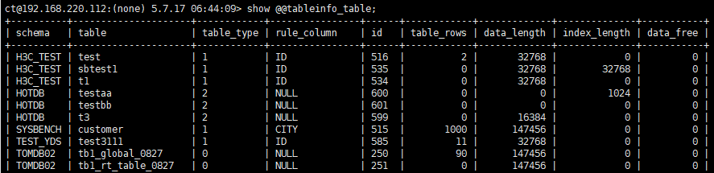

**结果包含字段及其说明：**

| **列名**       | **说明**                    | **值类型/范围**  |
| -------------- | --------------------------- | ---------------- |
| `schema`       | 逻辑库                      | `STRING/[table]` |
| `table`        | 表名                        | `STRING/[table]` |
| `table_type`   | 表类型                      | `STRING/[table]` |
| `rule_column`  | 分片规则字段                | `STRING/[table]` |
| `id`           | 表ID                        | `INT/[number]`   |
| `table_rows`   | 对\[table\]表select操作次数 | `LONG/[number] ` |
| `data_length`  | 对\[table\]表insert操作次数 | `LONG/[number] ` |
| `index_length` | 索引长度(字节)              | `LONG/[number] ` |
| `data_free`    | 空闲页大小(字节)            | `LONG/[number] ` |

#### `show @@threadpool` - 显示线程池状态

此命令用于查看线程池状态，例如：

```sql
show @@threadpool;
```


**结果包含字段及其说明：**

| **列名**          | **说明**     | **值类型/范围**                         |
| ----------------- | ------------ | --------------------------------------- |
| `name`            | 线程池名称   | `STRING/"TimeExecutor","$NIOExecutor-"` |
| `pool_size`       | 线程池大小   | +number+"-"`INT/[number]`               |
| `active_count`    | 活跃线程数   | ``LONG/[number] ``                      |
| `task_queue_size` | 任务队列大小 | `LONG/[number] `                        |
| `completed_task`  | 完成任务数   | `LONG/[number] `                        |
| `total_task`      | 总任务书     | `LONG/[number] `                        |

#### `show @@transaction` - 显示事务数

此命令用于查看每个逻辑库，统计当前已完成的自动提交及非自动提交的事务数，例如：

```sql
show @@transaction;
```

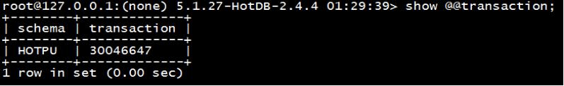

**结果包含字段及其说明：**

| **列名**      | **说明** | **值类型/范围**     |
| ------------- | -------- | ------------------- |
| `schema`      | 逻辑库   | `STRING/[database]` |
| `transaction` | 事务数   | `LONG/[number]`     |

#### `show @@topflow_front_in` - 显示前端进流量最大连接{#show-topflow_front_in}

该命令用于查看前端进流量最大的连接，默认按进流量大小排序，进流量越大则查询结果越靠前，最多显示100条前端连接信息，例如：

```sql
show @@topflow_front_in;
```

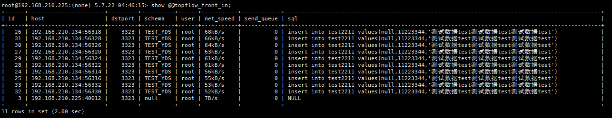

#### `show @@topflow_front_out` - 显示前端出流量最大连接{#show-topflow_front_out}

该命令用于查看前端出流量最大的连接，默认按出流量大小排序，出流量越大则查询结果越靠前，最多显示100条前端连接信息，例如：

```sql
show @@topflow_front_out;
```

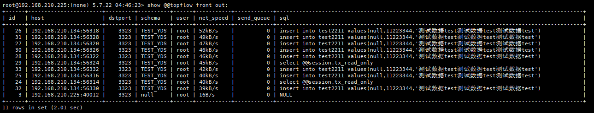

#### `show @@topflow_backend_in` - 显示后端进流量最大连接{#show-topflow_backend_in}

该命令用于查看后端进流量最大的连接，默认按进流量大小排序，进流量越大则查询结果越靠前，最多显示200条后端连接信息，例如：

```sql
show @@topflow_backend_in;
```

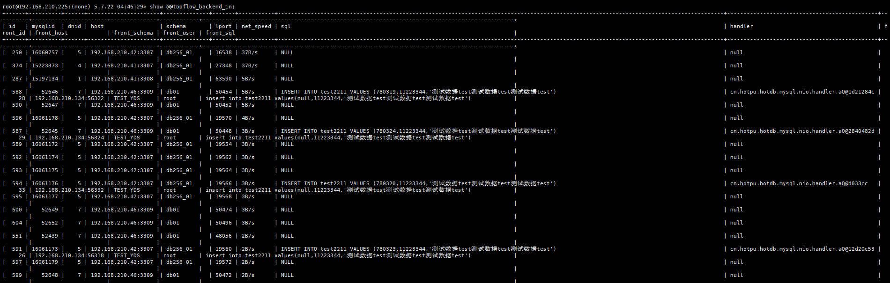

#### `show @@topflow_backend_out` - 显示后端出流量最大连接{#show-topflow_backend_out}

该命令用于查看后端出流量最大的连接，默认按出流量大小排序，出流量越大则查询结果越靠前，最多显示200条后端连接信息，例如：

```sql
show @@topflow_backend_out;
```

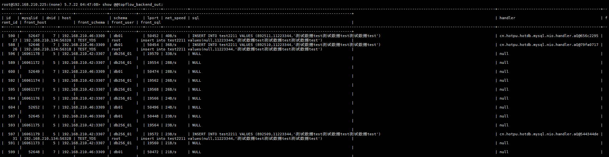

#### `show @@trxsql? connectionID` – 显示非XA模式下IUD语句

此命令用于查看非XA模式下正在执行的`INSERT/UPDATE/DELETE`语句情况，使用时需同步开启`server.xml`的`recordIUDInNonXaTrx`参数用于缓存语句。

```sql
<property name="recordIUDInNonXaTrx">true</property><!-- 是否缓存非XA模式跨库事务中的IUD语句并在发生部分提交时进行输出(Whether to cache IUD statements in cross-datanode Non-XA-transactions and log them when partial commit occurs) -->
```

非XA模式下开启该参数后可以通过管理端执行`show @@trxsql? connection_id`命令查看当前正在执行的事务SQL，connection_id为前端连接ID，示例如下：

```sql
show @@trxsql? connection_id
```

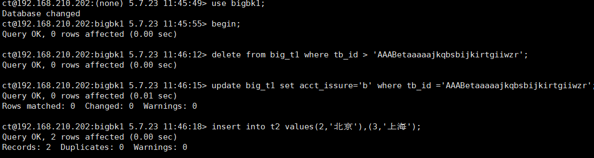

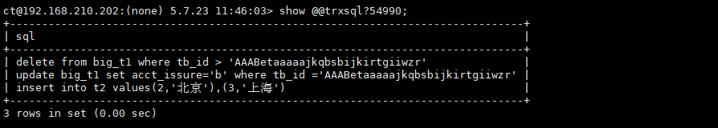

#### `show hotdb datanode`s - 显示当前可用的节点

此命令用于查看配置库中hotdb_datanodes表，语法：

```sql
show hotdb datanodes [LIKE 'pattern' | WHERE expr];
```

参数说明:

| **参数**  | **说明**                                  | **类型** |
| --------- | ----------------------------------------- | -------- |
| `pattern` | 可选，模糊查询表达式，匹配`rule_name`字段 | `STRING` |
| `expr`    | 可选，模糊查询表达式，匹配指定字段        | `STRING` |

例如：

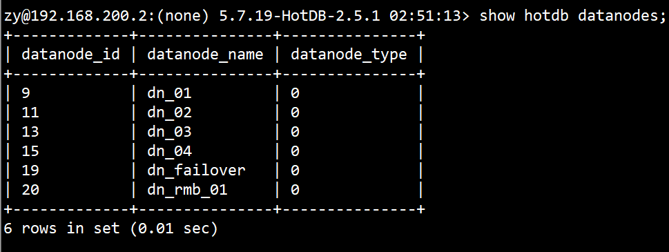

又如：

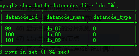

**结果包含字段及其说明：**

| 列名            | 说明            | 值类型/范围 |
| --------------- | --------------- | ----------- |
| `datanode_id`   | 节点ID          | `INTEGER`   |
| `datanode_name` | 节点名称        | `STRING`    |
| `datanode_type` | 0：主备；1：MGR | `INTEGER`   |

#### `show hotdb functions` - 显示当前可用的分片函数

此命令用于查看配置库中hotdb_function 表，语法：

```sql
show hotdb functions;
```

参数说明:

| 参数      | 说明                                          | 类型     |
| --------- | --------------------------------------------- | -------- |
| `pattern` | 可选，模糊查询表达式，匹配`function_name`字段 | `STRING` |
| `expr`    | 可选，模糊查询表达式，匹配`function_name`字段 | `STRING` |

例如：

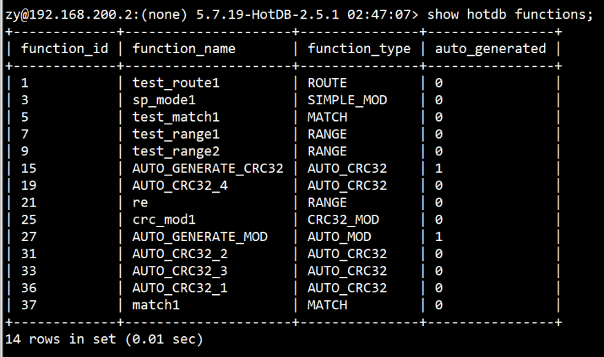

又如：

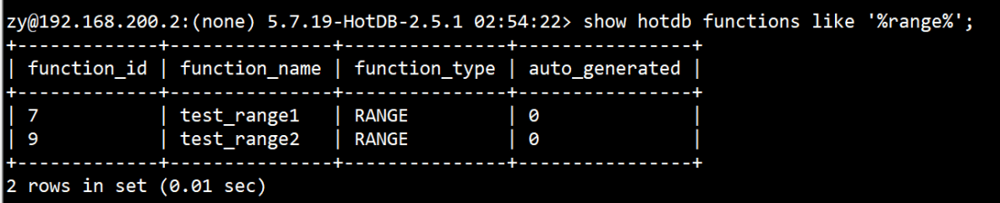

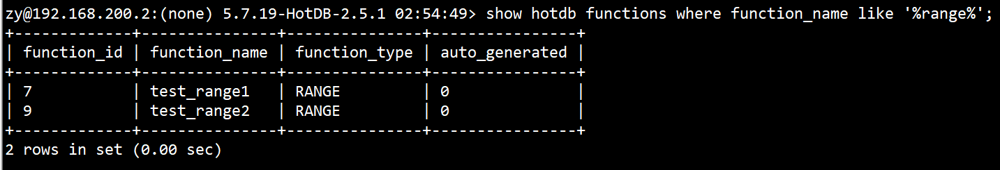

**结果包含字段及其说明：**

| 列名             | 说明                                                    | 值类型/范围 |
| ---------------- | ------------------------------------------------------- | ----------- |
| `function_id`    | 分片函数ID                                              | `INTEGER`   |
| `function_name`  | 分片函数名称                                            | `STRING`    |
| `function_type`  | 分片类型                                                | `STRING`    |
| `auto_generated` | 是否为HotDB自动生成的配置(1:自动生成，其他：非自动生成) | `INTEGER`   |

#### `show hotdb function infos` - 显示当前可用的分片函数信息

此命令用于查看配置库中`hotdb_function_info`表，语法：

```sql
show hotdb function infos [WHERE expr];
```

**参数说明:**

| 参数   | 说明                               | 类型     |
| ------ | ---------------------------------- | -------- |
| `expr` | 可选，模糊查询表达式，匹配指定字段 | `STRING` |

例如：

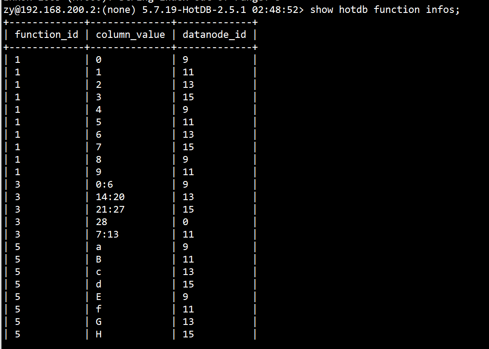

又如：

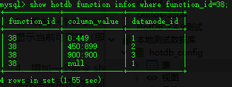

**结果包含字段及其说明：**

| 列名           | 说明         | 值类型/范围 |
| -------------- | ------------ | ----------- |
| `function_id`  | 分片函数ID   | `INTEGER`   |
| `column_value` | 分片字段的值 | `STRING`    |
| `datanode_id`  | 数据节点id   | `INTEGER`   |

#### `show hotdb rules` - 显示当前可用的分片规则

此命令用于查看配置库中hotdb_rule 表，语法：

```sql
show hotdb rules [LIKE 'pattern' | WHERE expr];
```

参数说明:

| 参数      | 说明                                      | 类型     |
| --------- | ----------------------------------------- | -------- |
| `pattern` | 可选，模糊查询表达式，匹配`rule_name`字段 | `STRING` |
| `expr`    | 可选，模糊查询表达式，匹配`rule_name`字段 | `STRING` |

例如：


又如：

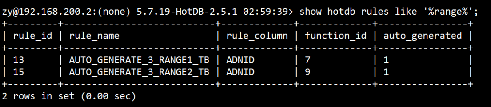

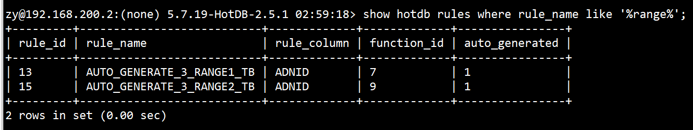

**结果包含字段及其说明：**

| 列名             | 说明                                                    | 值类型/范围 |
| ---------------- | ------------------------------------------------------- | ----------- |
| `rule_id`        | 分片规则ID                                              | `INTEGER`   |
| `rule_name`      | 分片规则名称                                            | `STRING`    |
| `rule_column`    | 分片字段名称                                            | `STRING`    |
| `function_id`    | 分片类型ID                                              | `INTEGER`   |
| `auto_generated` | 是否为HotDB自动生成的配置(1:自动生成，其他：非自动生成) | `INTEGER`   |

#### `show backupmasterdelay [DNID]` - 显示指定数据节点中主备复制延迟大小

此命令用于查看指定数据节点`[DNID]`主备的复制延迟大小，语法：

```sql
show backupmasterdelay [DNID];
```

参数说明:

| 参数   | 说明       | 类型      |
| ------ | ---------- | --------- |
| `DNID` | 数据节点id | `INTEGER` |

例如：


**结果包含字段及其说明：**

| 列名                | 说明                         | 值类型/范围 |
| ------------------- | ---------------------------- | ----------- |
| `datasource_id`     | 存储节点id                   | `INTEGER`   |
| `sql_delay`         | 复制延迟大小（秒）           | LONG        |
| `slave_io_running`  | 备`io_thread`的状态(Yes/No)  | `STRING`    |
| `slave_sql_running` | 备`sql_thread`状态（Yes/No） | `STRING`    |

### 计算节点服务相关

#### `show @@config_master_status` - 返回当前使用的配置库的show master status

该命令用于显示当前正在使用的配置库`show master status`信息。

例如：

```sql
show @@config_master_status;
```


**结果包含字段及其说明：**

| 列名                | 说明               | 值类型/范围 |
| ------------------- | ------------------ | ----------- |
| `file`              | Binlog文件         | `STRING`    |
| `position`          | Binlog位置         | `INTEGER`   |
| `binlog_do_db`      | Binlog需要记录的库 | `STRING`    |
| `binlog_ignore_db`  | Binlog需要过滤的库 | `STRING`    |
| `executed_gtid_set` | 已经执行的GTID     | `STRING`    |

#### `show @@server` - 显示计算节点服务器状态

该命令用于显示当前HotDB Server服务器运行状态。内存符合配置`./bin/hotdb-server`中设置的值。


例如：

```sql
show @@server;
```

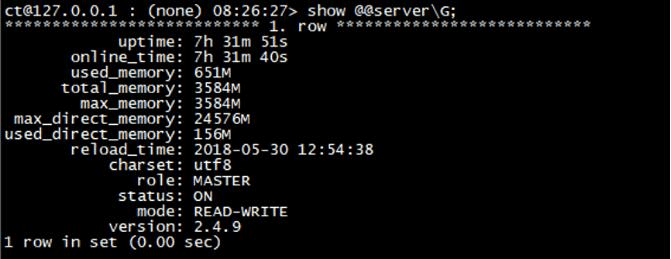

**结果包含字段及其说明：**

| 列名                 | 说明                | 值类型/范围                              |
| -------------------- | ------------------- | ---------------------------------------- |
| `uptime`             | HotDB实例已创建时间 | `STRING/[number"h" number"m" number"s"]` |
| `online_time`        | HotDB已启动时间     | `STRING/[number"h" number"m" number"s"]` |
| `used_memory`        | 已用内存            | `STRING/[number + "M"]`                  |
| `total_memory`       | 总内存              | `STRING/[number + "M"]`                  |
| `max_memory`         | 最大内存            | `STRING/[number + "M"]`                  |
| `max_direct_memory`  | 最大直接内存        | `STRING/[number + "M"]`                  |
| `used_direct_memory` | 已用直接内存        | `STRING/[number + "M"]`                  |
| `reload_time`        | 上次重读配置时间    | `STRING/[yyyy-MM-dd hh:mm:ss]`           |
| `charset`            | 字符集              | `STRING/[charset]`                       |
| `role`               | 主备角色            | `MASTER` - 主                            |
| ^                    | ^                   | `BACKUP` - 备                            |
| `status`             | HotDB状态           | `ON` - 开启                              |
| ^                    | ^                   | `OFF` - 关闭                             |
| `mode`               | HotDB读写模式       | `STRING/["READ-ONLY"，"READ-WRITE"]`     |
| `version`            | HotDB版本号         | `STRING/[number.number.number.number]`   |

#### `show @@serversourceusage` - 当前服务器的资源使用情况

该命令用于查看当前HotDB Server服务器的资源使用情况，例如：

```sql
show @@serversourceusage;
```


**结果包含字段及其说明：**

| 列名           | 说明                  | 值类型/范围                    |
| -------------- | --------------------- | ------------------------------ |
| `used_memory`  | 已用内存(MB)          | `STRING/[number]`              |
| `total_memory` | 总内存(MB)            | `STRING/[number]`              |
| `disk`         | 磁盘使用情况          | `STRING/[path number,...]`     |
| `cpu_load`     | CPU负载               | `FLOAT/[float]`                |
| `cpu_usage`    | CPU使用率             | `STRING/[number,number,...]`   |
| `net_in`       | 网络流动速度(bytes/s) | `LONG/[number]`                |
| `net_out`      | 网络流动速度(bytes/s) | `LONG/[number]`                |
| `cores`        | CPU总核数             | `INT/[number]`                 |
| `io`           | 磁盘读写速度(kB/s)    | `STRING/["sda" number number]` |

#### `show @@systemconfig_memory` - 当前计算节点服务内存中的参数

该命令用于查看当前计算节点的内存参数使用情况，例如：

```sql
show @@systemconfig_memory;
```


**结果包含字段及其说明：**

| **列名** | **说明** | **值类型/范围**   |
| -------- | -------- | ----------------- |
| `config` | 配置信息 | `STRING/[number]` |

#### `show @@time_current` - 显示当前时间

此命令用于查看当前时间，例如：

```sql
show @@time_current;
```


**结果包含字段及其说明：**

| **列名**    | **说明**               | **值类型/范围** |
| ----------- | ---------------------- | --------------- |
| `timestamp` | 计算节点服务器当前时间 | `STRING`        |

#### `show @@time_startup` - 显示HotDB启动时间

此命令用于查看HotDB Server启动时间，例如：

```sql
show @@time_startup;
```


**结果包含字段及其说明：**

| **列名**    | **说明**               | **值类型/范围**                 |
| ----------- | ---------------------- | ------------------------------- |
| `timestamp` | 计算节点服务器当前时间 | `STRING/[ yyyy-MM-dd HH:mm:ss]` |

#### `show @@usbkey` - 显示USB-KEY状态

该命令用于显示USB-KEY状态（即授权情况）和检测授权是否有异常信息，例如：

```sql
show @@usbkey;
```

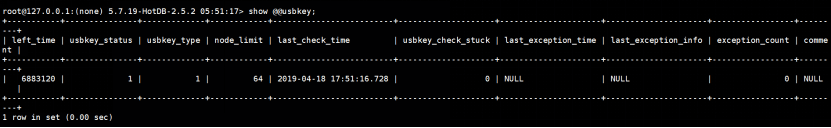

**结果包含字段及其说明：**

| 列名                  | 说明                 | 值类型/范围                      |
| --------------------- | -------------------- | -------------------------------- |
| `left_time`           | 剩余时间(s)          | `LONG/[number]`                  |
| `usbkey_status`       | USB_KEY状态          | `0` - 异常                       |
| ^                     | ^                    | `1` - 正常                       |
| `usbkey_type`         | USB_KEY类型          | `1` - 试用                       |
| ^                     | ^                    | `2` - 有期限                     |
| ^                     | ^                    | `3` - 永久                       |
| `node_limit`          | 节点数限制           | `INT/[number]`                   |
| `last_check_time`     | 上次检测结束时间     | `STRING/[ yyyy-MM-dd HH:mm:sss]` |
| `usbkey_check_stuck`  | USB_KEY检测是否卡住  | `0` - 未被卡住                   |
| ^                     | ^                    | `1` - 卡住                       |
| `last_exception_time` | 上次检测抛出异常时间 | `STRING/[ yyyy-MM-dd HH:mm:sss]` |
| `last_exception_info` | 上次检测抛出异常信息 | `STRING`                         |
| `exception_count`     | 累计检测抛出异常次数 | `INT/[number]`                   |
| `comment`             | 备注信息             | `STRING`                         |

> **Note**
>
>  left_time=0代表永久或作废；

`usbkey_check_stuck=1`代表检测到线程被卡住。当检测到线程被卡住或累计检测抛出异常次数超过10000时，提示：

```
It is recommended to restart the HotDB server during the low peak period of business
```

#### `show @@version` - 显示HotDB Server版本信息

此命令用于查看HotDB Server版本说明，例如：

```sql
show @@version;
```

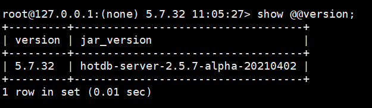

**结果包含字段及其说明：**

| **列名**      | **说明**      | **值类型/范围** |
| ------------- | ------------- | --------------- |
| `version`     | HotDB版本号   | `STRING`        |
| `jar_version` | Jar包版本说明 | `STRING`        |

### 存储节点服务相关

#### `show @@ddl` - 显示表的DDL语句

该命令用于显示表的DDL语句常信息，例如：

```sql
show @@ddl;
```

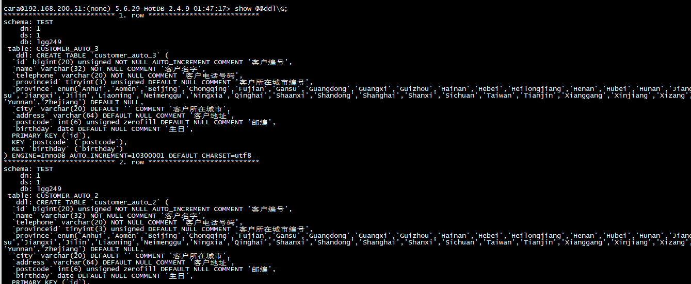

**结果包含字段及其说明：**

| 列名     | 说明        | 值类型/范围         |
| -------- | ----------- | ------------------- |
| `schema` | 逻辑库      | `STRING/[database]` |
| `dn`     | 数据节点id  | `INT/[number]`      |
| `ds`     | 数据源id    | `INT/[number]`      |
| `db`     | 物理库      | `STRING/[database]` |
| `table`  | 表名        | `STRING/[table]`    |
| `ddl`    | 表的DDL语句 | `STRING/[sql]`      |

#### `show @@lastsql` - borrowed状态连接上一次执行的sql

此命令用于查看Borrowed连接最后执行的SQL信息，例如：

```sql
show @@lastsql;
```


**结果包含字段及其说明：**

| 列名                | 说明                                     | 值类型/范围                 |
| ------------------- | ---------------------------------------- | --------------------------- |
| `id`                | 后端id                                   | `LONG/[number]`             |
| `mysqlid`           | 数据节点id                               | `LONG/[number]`             |
| `dn_ds`             | 数据节点id - 数据源id                    | `STRING/[number_number]`    |
| `host`              | 数据源                                   | `STRING/[ip:port/database]` |
| `last_executed_sql` | 在数据源\[host]上执行的最后一条MySQL语句 | `STRING/[sql]`              |

#### `show @@onlineddl` - 显示正在运行的onlineddl语句{#show-onlineddl}

该命令显示当前正在运行的OnlineDDL语句及语句执行速度，progress按百分比显示语句执行进度，speed显示当前onlineDDL语句执行的速度(单位:行/ms)，例如：

```sql
show @@onlineddl;
```

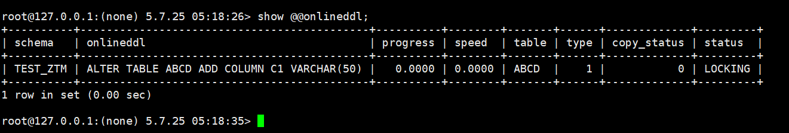

也可以查询指定表名称的OnlineDDL进度：

```sql
show @@onlineddl?tbs=db1.tb1,db2.tb2…;
```

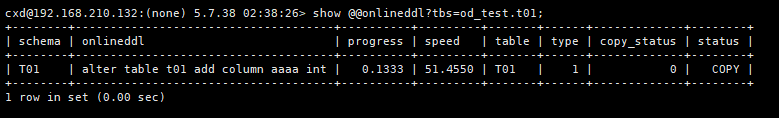

**结果包含字段及其说明：**

| **列名**      | **说明**      | **值类型/范围**                                          |
| ------------- | ------------- | -------------------------------------------------------- |
| `schema`      | 逻辑库        | `STRING/[database]`                                      |
| `onlineddl`   | 语句          | `STRING/[SQL]`                                           |
| `progress`    | 进度          | `LONG/[number]`                                          |
| `speed`       | 速度（行/ms） | `LONG/[number]`                                          |
| `table`       | 表名          | `STRING/[table]`                                         |
| `type`        | 变更类型      | `LONG/[number]`                                          |
| `copy_status` | 复制状态      | `LONG/[number]`                                          |
| `status`      | 状态          | `STRING/CHECK、READY、COPY、REINIT_AUX、RENAME、LOCKING` |

#### `show @@onlineddlinfo` - 显示正在运行的onlineddl任务状态{#show-onlineddlinfo}

该命令显示当前正在运行的OnlineDDL任务涉及的库、原表、目标表及触发器相关信息，语法如下：

```sql
show @@onlineddlinfo?tbs=db1.tb1,db2.tb2…;
```

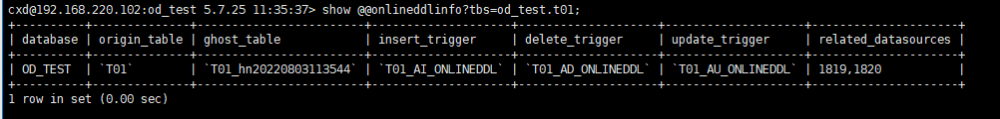

**结果包含字段及其说明：**

| **列名**              | **说明**       |
| --------------------- | -------------- |
| `database`            | `逻辑库`       |
| `origin_table`        | `表名称`       |
| `ghost_table`         | `镜像表名称`   |
| `insert_trigger`      | `insert触发器` |
| `delete_trigger`      | `delete触发器` |
| `update_trigger`      | `update触发器` |
| `related_datasources` | `存储节点ID`   |

#### `show @@tableindex` - 显示表的索引结构

该命令用于显示每个数据表的索引结构，例如：

```sql
show @@tableindex;
```

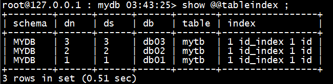

**结果包含字段及其说明：**

| 列名     | 说明       | 值类型/范围         |
| -------- | ---------- | ------------------- |
| `schema` | 逻辑库     | `STRING/[database]` |
| `dn`     | 数据节点id | `INT/[number]`      |
| `ds`     | 存储节点id | `INT/[number]`      |
| `db`     | 物理库     | `STRING/[database]` |
| `table`  | 物理表表名 | `STRING/[number]`   |
| `index`  | 表索引结构 | `STRING`            |

### 分片在线变更运行相关

此小节内容是管理端口在线变更分片方案的命令，需要如下几步：

- 第一步、变更方案预检（[onlinemodifyrulecheck](#onlinemodifyrulecheck)）

- 第二步、分片方案变更（[onlinemodifyrule](#onlinemodifyrule)）
- 第三步、查看变更进度（[onlinemodifyruleprogress](#onlinemodifyruleprogress)）
- 是否继续执行变更（[onlinemodifyrulecontinue](#onlinemodifyrulecontinue)）、取消当前正在进行的任务（[onlinemodifyrulecancel](#onlinemodifyrulecancel)）为非必须操作项可根据实际进行选择

以上步骤需依次执行，否则无法保证结果变更成功。

#### `onlinemodifyrulecheck`

此命令用于分片方案在线变更的预检相关，例如：

```sql
onlinemodifyrulecheck db.tablename\[=functionid,rulecol:datanodes:checkconsistency(是否检查主备一致性 1\|0)\]:globalunique(是否检查全局唯一 1\|0)
```

**命令包含字段及其说明：**

| 参数               | 说明                                                     |
| ------------------ | -------------------------------------------------------- |
| `db`               | 逻辑库                                                   |
| `tablename`        | 表名                                                     |
| `functionid`       | 分片规则id，参考`hotdb_config`配置库的`hotdb_function`表 |
| `rulecol`          | 分片字段                                                 |
| `datanodes`        | 数据节点，参考`hotdb_config`配置库的`hotdb_datanode`表   |
| `checkconsistency` | 是否检查主备一致性 1 0                                   |
| `globalunique`     | 是否检查全局唯一 1\|0                                    |

有两种用法：

1\. 用于预检时，检测分片规则变更的相关项是否通过，检测项ID和对应的检测项如下表：

| 检测项ID | 对应字段            | 预检项说明                               |
| -------- | ------------------- | ---------------------------------------- |
| 1        | `tbNameLess45`      | 源表名长度不超过45个字符                 |
| 2        | `running`           | 源表没有正在执行分片方案变更任务         |
| 3        | `validCol`          | 分片字段为表结构包含的字段               |
| 4        | `diffrule`          | 变更方案的分片规则与分片字段与源表不一致 |
| 5        | `existUniqueKey`    | 源表有主键或者唯一键                     |
| 6        | `recommendColType`  | 分片字段为当前分片函数推荐的字段类型     |
| 7        | `lostData`          | 新的分片方案不会导致数据丢失             |
| 8        | `trigger`           | 源表上无触发器                           |
| 9        | `refByTrigger`      | 源表没有被其他触发器关联                 |
| 10       | `foreignConstraint` | 源表无外键约束                           |
| 11       | `consistency`       | 源表数据主备一致性检测结果一致           |
| 12       | `globalunique`      | 源表数据是否满足全局唯一                 |

预检测命令的检测结果（result值）若为1，表示该项检测不通过，变更结果可能会有错误。

如下图所示：`cpd_test`是逻辑库，`zx_cvset_signin_result`是表名，`4`是`functionid`，`id`是分片字段，`[1,2]`是数据节点，`1`是检查主备一致性。

```mysql
onlinemodifyrulecheck cpd_test. zx_cvset_signin_result=4,id:1,2:1;
```

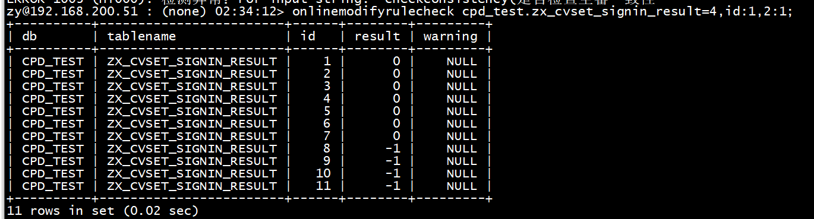

多表同时进行变更预检时，表与表之间的信息用空格隔开，例如：

```mysql
onlinemodifyrulecheck db.tablename=functionid,rulecol:datanodes:checkconsistency [db.tablename=functionid,rulecol:datanodes:checkconsistency:globalunique..]
```

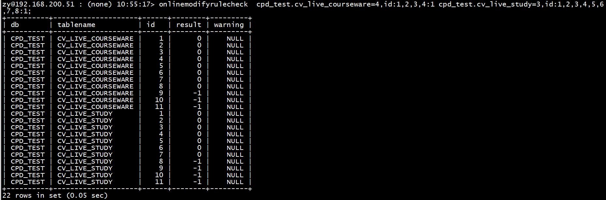

1.  用于分片方案在线变更的预检之后，查看预检测结果的命令，例如：

```
onlinemodifyrulecheck db.tablename [db.tablename…]
```

**结果包含字段及其说明：**

| **列名**    | **说明**                         |
| ----------- | -------------------------------- |
| `db`        | 逻辑库                           |
| `tablename` | 表名称                           |
| `id`        | 检测项ID                         |
| `result`    | 结果（0通过，1不通过，-1检测中） |
| `warning`   | 错误提示信息                     |

查看一下检测是否结束（result值是-1则未结束），或者检测是否有不通过的项（result值是1则未通过），如果result结果全为0，此时可以执行分片方案变更。

如下图所示：`cpd_test`是逻辑库，`zx_cvset_signin_result`是表名。

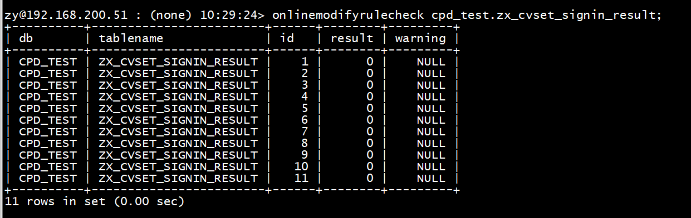

同时查看多张表的检测结果，表与表之间用空格隔开。


####  `onlinemodifyrule`

此命令用于分片方案变更。执行该命令返回结果：OK或者MySQLException。

```sql
nlinemodifyrule db.tablename=functionid,rulecol:datanodes:源表处理(小时:0为保留):批次行数(1000):复制间隔 (T3/I0.3):等待超时(天):全局唯一（0/1）:暂停数据复制时段:复制线程数;
```

**命令包含字段及其说明：**

| **参数**           | **说明**                                                                                                     |
| ------------------ | ------------------------------------------------------------------------------------------------------------ |
| `db`               | 逻辑库                                                                                                       |
| `tablename`        | 表名                                                                                                         |
| `functionid`       | 分片规则id，参考`hotdb_config`配置库的`hotdb_function`表                                                     |
| `rulecol`          | 分片字段                                                                                                     |
| ``datanodes`       | 数据节点，参考`hotdb_config`配置库的`hotdb_datanode`表                                                       |
| `源表处理`         | 分片方案成功后对源表的处理方式（保留n个小时，0为不保留）                                                     |
| `批次行数`         | 限制复制数据阶段每次读写行大小                                                                               |
| `复制间隔`         | 每次读写行的间隔时间（T3：3倍SQL执行时间、I0.3：固定时间0.3s）                                               |
| `等待超时`         | 在变更导致数据不一致的情况时，等待用户做出处理的时间，超出设置时间未确认则变更任务自动失败，设置范围\[1,30\] |
| `全局唯一`         | 变更后是否开启全局唯一                                                                                       |
| `暂停数据复制时段` | 在设置时段范围内变更任务自动暂停数据复制工作，时段以逗号分隔，例如：0700-2210,0300-0559                      |
| `复制线程数`       | 执行变更时的线程数                                                                                           |

如下图所示：`cpd_test`是逻辑库，`zx_cvset_signin_result`是表名，`4`是functionid，`id`是分片字段，`[1,2]`是数据节点，`24`是是指源表24小时后删除，`1000`是指批次行数，`T3`是指3倍的SQL执行时间，`7`是指等待超时7天，`1`是指变更后开启全局唯一，`0`是指不设置暂停数据复制时段，`4`是指复制线程数为4个线程。

```sql
onlinemodifyrule cpd_test. zx_cvset_signin_result=4,id:1,2:24:1000:T3:7:1:0:4;
```

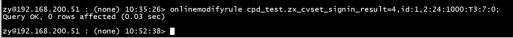

多表同时变更时，表与表之间用空格隔开。

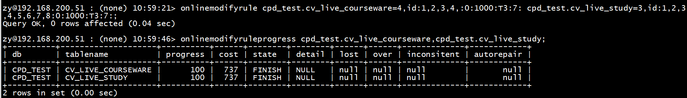

分片方案变更所采用的`functionid`可在配置库的hotdb_function表里查看。

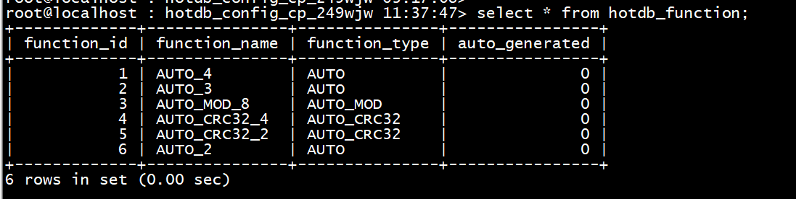

特殊说明：

- 执行的变更分片规则需要的`functionid`已经存在于配置库的`hotdb_function`表中；

- 使用将要变更的分片规则，需要保证指定的数据节点数目要与`function_id`对应的数据节点数一致；

- 源表必须有主键或者唯一键，无触发器，无外键约束，否则会导致变更结果有误；

- 变更的时候源表处理该参数填写是0，则会在表信息里保留历史表，命名格式：`"源表名+roYYMMDDHHMMSS"`；

- 同一批次某张表发起的分片规则变更失败，则该批次的所有表变更都失败；

- 执行该命令的时候不能重启server，否则会导致变更失败，但是会保留原表。

####  `onlinemodifyruleprogress`

此命令用于查看分片方案变更进度，一个表会有一行数据，如下图所示：

```sql
onlinemodifyruleprogress db.tablename[,db1.tablename1,..]
```

**命令包含字段及其说明：**

| **参数**    | **说明** |
| ----------- | -------- |
| `db`        | 逻辑库   |
| `tablename` | 表名     |

如下图所示：`cpd_test`是逻辑库，`cv_live_courseware`和`cv_live_study`是表名。

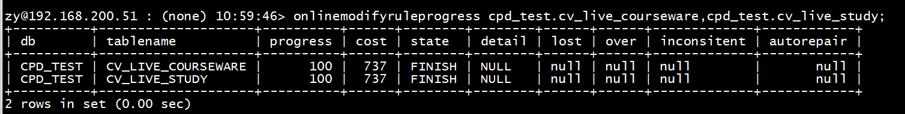

**结果包含字段及其说明：**

| **字段名**    | **说明**                                                                                                    |
| ------------- | ----------------------------------------------------------------------------------------------------------- |
| `db`          | 逻辑库                                                                                                      |
| `tablename`   | 表名称                                                                                                      |
| `progress`    | 0-100，整数                                                                                                 |
| `cost`        | 执行时长（ms）                                                                                              |
| `state`       | stopping(非执行窗口)、running(正在执行)、waiting(不一致，等待用户确认是否继续)、finish(已完成)、error(失败) |
| `detail`      | 其他错误信息                                                                                                |
| `lost`        | 数据缺失                                                                                                    |
| `over`        | 数据超出                                                                                                    |
| `inconsitent` | 数据不一致                                                                                                  |
| `autorepair`  | 自动修复（1/0）：1是已修复，0是未修复                                                                       |

如果state的返回是waitting,需要用户确认继续执行，忽略不一致的数据，或者取消变更。

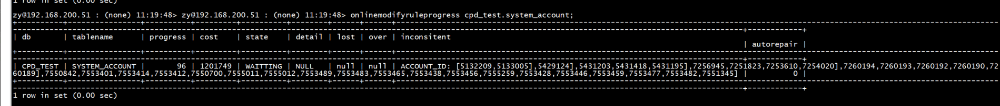

#### `onlinemodifyrulecontinue`

当分片方案的变更进度 ，state状态是WAITTING，并且inconsitent返回数据不一致，可以用该命令继续执行变更，如下图所示：

```sql
onlinemodifyrulecontinue db.tablename;
```

**命令包含字段及其说明：**

| **参数**    | **说明** |
| ----------- | -------- |
| `db`        | 逻辑库   |
| `tablename` | 表名     |

如下图所示：执行变更分片方案的过程中，当state是waitting，且存在数据不一致，使用该命令继续执行变更，再次去查看进度的时候是100且state的状态为finish。

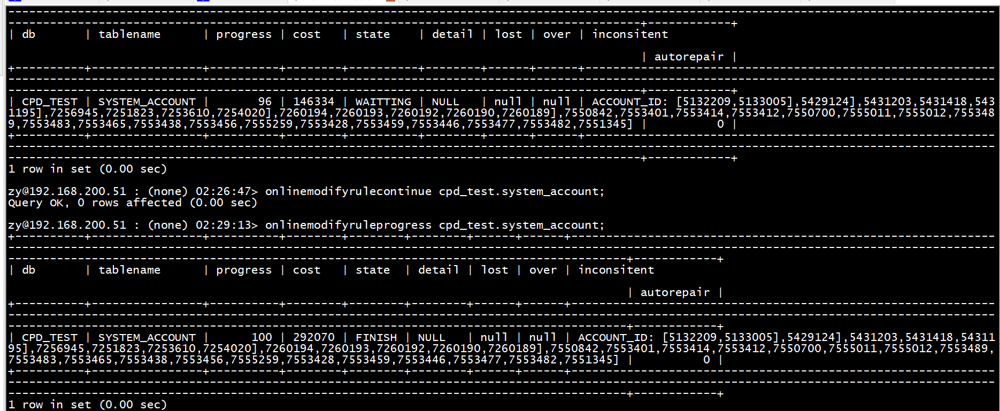

忽略掉这些不一致的数据，可能会导致数据错误，如下图所示：变更之后数据变少了。

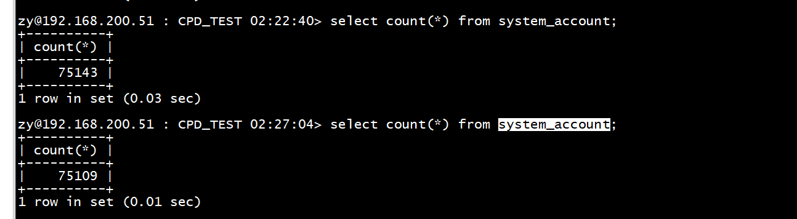

#### `onlinemodifyrulecancel`

此命令用于取消当前正在进行的任务：

```sql
onlinemodifyrulecancel db.tablename;
```

如果同一批次的某张表被取消变更，则该批次的所有表都会被取消分片方案的变更，如下图所示：

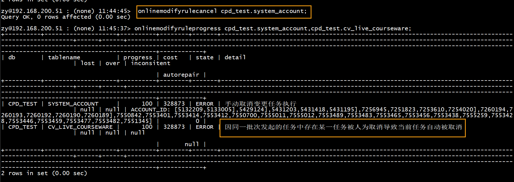

## 管理控制语句

### `check @@datasource_config `- 检查MySQL参数配置信息{#check-datasource_config}

该命令用于检查服务MySQL存储节点特定参数配置信息是否一致，若有参数与HotDB Server要求不同，执行命令后系统会有提示信息输出，例如：

```sql
check @@datasource_config;
```

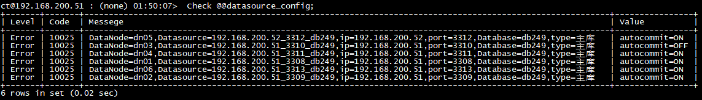

对于灾备模式的时间差异的检测，增加了当前主计算节点，到中心机房、灾备机房存储节点间的时间差异检测

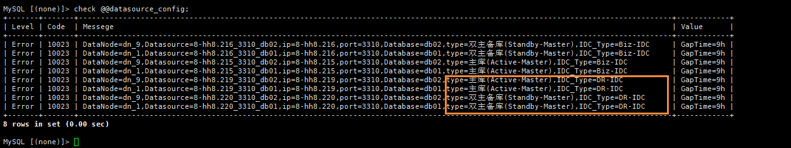

**结果包含字段及其说明：**

| **列名**  | **说明**                     | **值类型/范围**              |
| --------- | ---------------------------- | ---------------------------- |
| `Level`   | 异常信息级别(Warning, Error) | `STRING/["Error","Warning"]` |
| `Code`    | 异常编号                     | `INT/[number]`               |
| `Message` | 错误信息                     | `STRING`                     |
| `Value`   | 与错误或警告相关的数值说明   | `STRING`                     |

以下参数或配置需要所有存储节点设置一致，且符合参数配置标准：

```
存储节点与HOTDB时间差异低于3s
Read-only
Completion_type必须为NO_CHAN
Div_precision_increment
Innodb_rollback_on_timeout要求为ON
Autocommit
Tx_isolation
MAX_ALLOWED_PACKET
```

详细使用方法及要求请参考[计算节点标准操作](hotdb-server-standard-operations.md)文档的MySQL服务端参数校验章节。

### `check @@datasource_config_new` 检查MySQL参数配置信息

该命令功能与`check @@datasource_config`相似，区别是

`check @@datasource_config_new`是从非running表中读取数据节点信息并进行检查，并且不记录历史检查状态。

```sql
check @@datasource_config*_new*;
```


使用方法和说明可参照[check @@datasource_config](#check-datasource_config)

### `check @@route` - 路由检测

该命令用于检测分片表数据路由的正确性，语法：

```sql
check @@route [db_name.tb_name | tb_name];
```

参数说明：

| **参数**  | **说明** | **类型** |
| --------- | -------- | -------- |
| `db_name` | 数据库名 | `STRING` |
| `tb_name` | 表名     | `STRING` |

数据路由一致结果：


数据路由不一致结果：

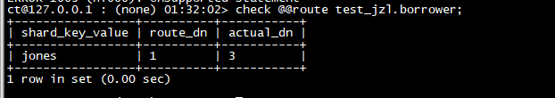

**结果包含字段及其说明：**

| **列名**          | **说明**       | **值类型/范围** |
| ----------------- | -------------- | --------------- |
| `shard_key_value` | 路由字段的值   | `STRING`        |
| `route_dn`        | 应去的路由节点 | `INT/[number]`  |
| `actual_dn`       | 实际存储的节点 | `INT/[number]`  |

### `kill @@connection` - 将某个指定的连接关闭

该命令用于关闭指定的前端连接，可以同时关闭多个连接，语法：

```sql
kill @@connection [id1,id2,id3…idn];
```

参数说明：

| **参数**        | **说明** | **类型**                                 |
| --------------- | -------- | ---------------------------------------- |
| `connection_id` | 连接的id | `INTEGER/通过[show @connection]命令获取` |

例如：

```
mysql> kill @@connection 7;
Query OK, 1 rows affected (0.00 sec)
```

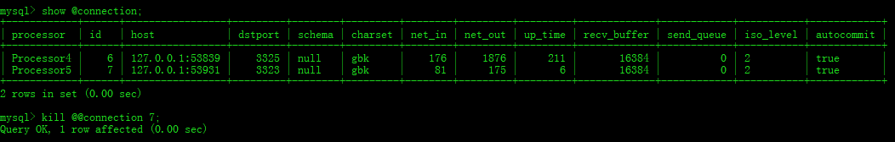

### `offline` - HotDB 下线

此命令会关闭HotDB Server服务端口，断开服务端3323前端连接，例如：

```sql
offline;
```

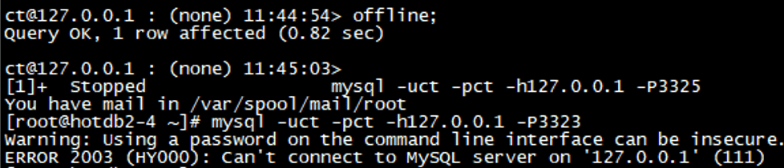

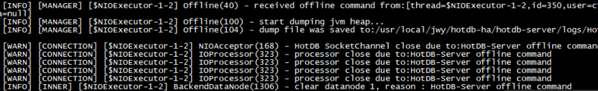

### `online` - HotDB 上线

若需要启动HotDB Server服务端口，需要在管理端运行online，该命令适用于HotDB Server启动服务端口或发生高可用切换场景，语法：

```sql
online;
```

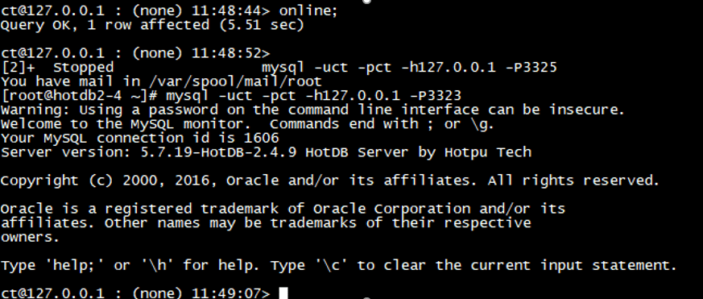

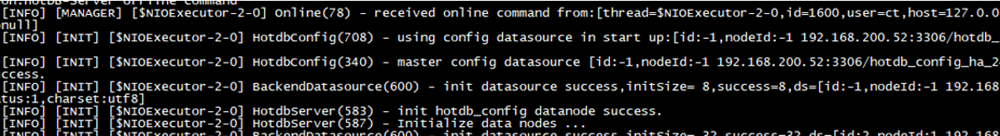

在一个完整且正常的HotDB Server高可用环境，如果手动向备计算节点发送online命令，会导致备计算节点启动3323，并且向主计算节点发送offline命令，进而主计算节点服务端口3323关闭。但是在当前的状态下，keepalived不会发生vip飘移（因为主管理端口3325还可用），这将导致计算节点数据服务实质上变得不可用。因此，如果用户在不清楚高可用体系的运作方式、或者不知道此缺陷的存在的情况下，手动操作备计算节点的online，有很大风险导致业务故障！

开启容灾模式下，容灾机房的主备计算节点在服务未发生机房级别切换之前，均为备用状态，且仅管理端（默认端口3325）提供服务。因此容灾机房的主备计算节点在服务未发生机房级别切换之前，均禁用online命令。为区别于中心机房的切换操作，当执行online命令时，会提示如下：

```sql
root@192.168.220.183:(none) 8.0.15-HotDB-2.5.3.1 07:58:26> online;
ERROR 10192 (HY000): access denied. online is not allowed in a DR HotDB Server.
```

### `force_set_to_primary` - 强制指定primary

当集群仅剩一个计算节点且状态为异常时人工强制指定其成为primary，语法为：

```sql
jing01@127.0.0.1:(none) 8.0.15 06:00:14\> force_set_to_primary;
Query OK, 1 row affected (0.00 sec)
```

当集群只剩下最后一个计算节点时，如果这个节点不是primary状态，可以通过`force_set_to_primary`命令强制指定为primary。注意这个命令只在剩一个计算节点时执行。

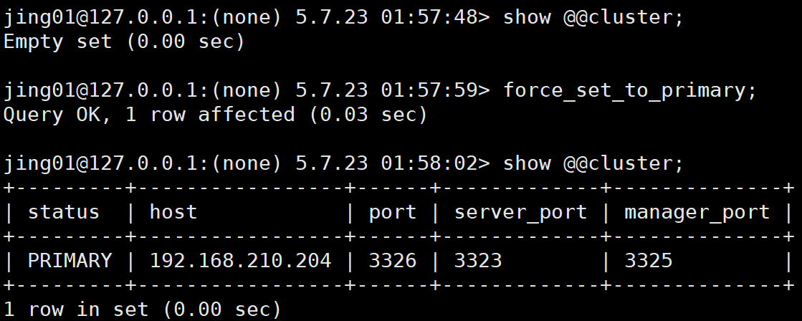

### `online_dr` – 切换机房

开启容灾模式下，容灾机房的主计算节点不参与中心机房HA高可用切换，除可执行一些show命令以外，只能执行此命令切换机房：

```sql
root@192.168.220.183:(none) 8.0.15-HotDB-2.5.3.1 08:12:31> online_dr;
Query OK, 1 row affected (5 min 4.35 sec)
```

当计算节点发生机房级别切换后，即容灾机房的主计算节点提供服务时，若此时容灾机房主计算节点也发生故障，可执行enable_online；命令之后，再执行online_dr命令启动容灾机房备计算节点。此时容灾机房备计算节点可自动开启服务端口（默认3323）继续服务。

```sql
root@192.168.220.184:(none) 8.0.15-HotDB-2.5.3.1 08:10:31> enable_online;
Query OK, 1 row affected (11 min 5.39 sec)

root@192.168.220.184:(none) 8.0.15-HotDB-2.5.3.1 08:22:27> online_dr;
Query OK, 1 row affected (0.01 sec)
```

### `rebuild @@pool` - 重建所有节点当前可用数据源

该命令用于重建当前HotDB Server的后端连接及存储节点的连接信息，语法：

```sql
rebuild @@pool;
Query OK, 1 row affected (0.24 sec)
```

### `reload @@config` - 重新读取配置信息

该命令用于更新配置，例如更新server.xml文件及内存使用的配置，在命令行窗口输入该命令，可不用重启HotDB Server服务即进行配置参数更新，此命令与管理平台动态加载功能相同。运行结果参考如下：#不是所有参数可以用这命令

```sql
reload @@config;
Query OK, 1 row affected (2.31 sec)
Reload config success
```

### `reset @@reloading `- 强制释放正在进行的reload状态

该命令用于强制释放正在进行的reload状态，即手动强制取消正在进行的动态加载操作。注意，执行此命令，仅当确认完全没有任何影响后，可用于在动态加载卡住时重置动态加载，其他任何情况都不建议使用。

例如执行动态加载卡住时：

```sql
root> reload @@config;
…卡住无返回结果…
```

此时确认强制释放正在进行的reload状态无影响后，可执行此命令强制取消动态加载：

```sql
root> reset @@reloading;
Query OK, 1 row affected (0.00 sec)
Reset reloading success
```

此时之前动态加载被卡住的状态会被取消，转变为显示如下信息：

```sql
root> reload @@config;
ERROR 1003 (HY000): Reload config failure, Reloading was set to false manually.
```

并且计算节点日志记录如下：

```sql
2019-07-19 17:49:57.626 [WARN] [MANAGER] [$NIOExecutor-3-0] ResetHandler(27) - received reset @@reloading from [thread=$NIOExecutor-3-0,id=780,user=re,host=127.0.0.1,port=2475,localport=28613,schema=null], reloading will be set to false.

2019-07-19 17:50:04.336 [WARN] [MANAGER] [Labor-181] HotdbConfig(1331) - Reload config failure, Reloading was set to false manually.
```

### `restart @@heartbeat` - 恢复指定数据节点上的心跳检测

该命令用于恢复指定节点指定数据节点上的心跳检测功能，语法：

```
restart @@heartbeat [datanode_id];
```

参数说明:

| **参数**      | **说明**   | **类型** |
| ------------- | ---------- | -------- |
| `datanode_id` | 数据节点id | `INT`    |

例如：

```sql
restart @@heartbeat 1; #恢复1节点的心跳检测功能
Query OK, 2 rows affected (0.00 sec)
```

### `stop @@heartbeat` - 将指定数据节点上的心跳暂停一段时间

该命令用于将指定数据节点上的心跳暂停一段时间。当time为-1时，系统会取消指定节点的暂停状态。语法：

```
stop @@heartbeat [datanode_id:time(s)]
```

参数说明:

| **参数**      | **说明**       | **类型** |
| ------------- | -------------- | -------- |
| `datanode_id` | 数据节点id     | `INT`    |
| `time`        | 暂停时间（秒） | `INT`    |

例如：

```sql
stop @@heartbeat 1:60; #将节点1暂停60秒
Query OK, 1 row affected (0.01 sec)

stop @@heartbeat 1:-1;
Query OK, 1 row affected (0.00 sec)
```

### `switch @@datasource` - 将指定存储节点切换为备用存储节点

该命令用于将指定数据节点的存储节点切换为下一个备用存储节点，语法：

```sql
switch @@datasource [datanode_id];
```

例如：

```sql
switch @@datasource 3;  
Query OK, 1 row affected (1.34 sec)
```

此时数据节点ID为3的关联存储节点，会发生高可用切换，可用备库接管服务。

若待接管的备库与切换前的主库存在复制延迟（非master_delay设置）且超过10s时，会提示无法切换，示例如下：

```sql
switch @@datasource 11;  

ERROR 10038 (HY000): switch datasource 21 failed due to:found no available backup:
[id:20,nodeId:11 192.168.210.43:3309/zjj1 status:1,charset:utf8mb4] replication latency is more than 10s:11s.
```

### `online_readonly` - 开启计算节点只读模式

该命令用于开启计算节点的只读模式

```sql
root@192.168.210.135:(none) 5.7.32 11:04:33> online_readonly;
Query OK, 1 row affected, 1 warning (0.01 sec)

Info (Code 10260): Online_readOnly command executed successfully and the instanceReadOnly parameter has been set to 1.
```

开启计算节点只读后无法执行修改数据的操作类型语句（DDL\DQL\DCL等）

```sql
root@192.168.210.135:hotdb 5.7.32 11:09:37> create table test (id int);
ERROR 1289 (HY000): Command CREATE_TABLE not allowed in Read-Only mode.
```


### `online_readwrite` - 关闭计算节点只读模式

该命令用于关闭计算节点的只读模式，其执行效果在HA模式下等同于online（只读的备计算节点执行`online_readwrite`后会发生高可用切换）。

在HA灾备模式下，灾备机房主计算节点执行效果等同于`online_dr`（只读的灾备机房主计算节点执行会触发机房切换）；灾备机房备计算节点不可使用`online_readwrite`来关闭，否则会出现中心机房和灾备机房均有服务端3323运行的情况，此操作关闭只读需修改计算节点参数配置`instanceReadOnly`后重启计算节点。

在多节点集群灾备模式下，灾备机房任意计算节点执行`online_readwrite`均会直接触发机房切换。

需注意：备计算节点关闭只读不能直接使用`online_readwrite`，需通过修改计算节点参数配置`instanceReadOnly`后重启计算节点，否正会触发计算节点切换

```sql
root@192.168.210.135:(none) 5.7.32 11:33:24> online_readwrite;
Query OK, 1 row affected, 1 warning (0.01 sec)

Info (Code 10260): Online_readwrite command executed successfully and the instanceReadOnly parameter has been set to 0.
```

关闭计算节点只读后，计算节点可正常执行读写操作

```sql
root@192.168.210.135:hotdb 5.7.32 11:45:10> create table test(id int);
Query OK, 0 rows affected (0.06 sec)
```

### `cluster_freeze` - 停止计算节点选举

此命令用于停止计算节点选举，执行命令后，集群不在发起选举，例如：

```sql
cluster_freeze;
```

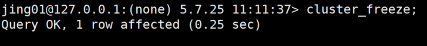

> **Note**
>
> 此命令只能在primary计算节点上执行。

### `cluster_unfreeze` – 取消停止计算节点选举

此命令用于结束停止计算节点选举，执行命令后，集群正常进行选举，例如：

```sql
cluster_unfreeze;
```

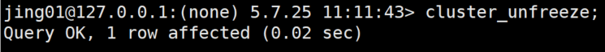

> **Note**
>
> 此命令只能在primary计算节点上执行。

## 容灾模式机房切换相关控制语句

该章节下描述的命令，用户只需知晓即可，主要用于管理平台进行切换机房过程中与计算节点服务做交互判断时所用。日常使用过程中，禁止人工调用。

### `disable_election`不允许集群选举

```sql
disable_election;
Query OK, 1 row affected (0.01 sec)
```

一般在容灾模式下切换机房时会用到，用于控制正在提供服务的机房内部计算节点集群不做选举，以免发生计算节点切换，影响机房切换最终结果。

### `enable_election`允许集群选举

```sql
enable_election;
Query OK, 1 row affected (0.01 sec)
```

### `disable_non_query_command`仅允许查询命令

```sql
disable_non_query_command;
Query OK, 1 row affected (0.01 sec)
```

此命令为容灾模式下机房切换时的内部调用命令，一旦调用，则计算节点实例仅允许查询，切换成功后再释放非查询命令。

### `enable_non_query_command`允许非查询命令

```sql
enable_non_query_command;
Query OK, 1 row affected (0.01 sec)
```

### `offline_to_dr`执行offline并且不允许online

```sql
offline_to_dr;
Query OK, 1 row affected (0.01 sec)
```

### `exchangeconfig`交换机房配置

```sql
exchangeconfig;
Query OK, 1 row affected (0.01 sec)
```

### `exchangememoryconfig`交换内存中的机房配置

```sql
exchangememoryconfig;
Query OK, 1 row affected (0.01 sec)
```

### `online_dr_check`机房切换检查

```sql
online_dr_check;
Query OK, 1 row affected (0.01 sec)
```

### `online_dr_process`机房切换进度

该命令用于查看容灾模式中在切换中的机房的切换进度，例如：


**结果包含字段及其说明：**

| **列名**     | **说明**                                                                                                                                                                                                  | **值类型/范围** |
| ------------ | --------------------------------------------------------------------------------------------------------------------------------------------------------------------------------------------------------- | --------------- |
| `process`    | 处理过程，0-8                                                                                                                                                                                             | `INTEGER`       |
| `error`      | 错误信息（错误格式：srcDs1:dstDs1,srcDs2:dstDs2,...;errormsg或者ds,ds:ds,...;errormsg，存储节点格式(datanodeID_datasourceID_datasourceIP_port_dbname)，如果包含：则src代表原中心机房，dst代表原容灾机房） | `STRING`        |
| `error_code` | 错误码 status 状态，1表示完成，0表示未完成                                                                                                                                                                | `INTEGER`       |
| `status`     | 状态，1代表完成，0表示未完成                                                                                                                                                                              | `INTEGER`       |

### `reset dberrorcount`将所有逻辑库报错信息清空

```sql
reset dberrorcount;
Query OK, 1 row affected (0.01 sec)
```

## 功能处理语句

### `dbremapping @@add@` - 增加数据库映射关系

此命令用于增加数据库映射关系，语法：

```sql
dbremapping @@add@[database_name]:[database_name],[database_name]:[database_name]…;
```

例如：

```sql
dbremapping @@add@db01:logic_db01,db02:logic_db02; #添加多条映射关系
Query OK, 0 rows affected (0.00 sec)
```

增加数据库db01到逻辑库logic_db的映射关系，从而执行SQL语句USE db01相当于执行USE logic_db:

```sql
 dbremapping @@add@db01:logic_db;
```

> **Note**
>
> 若为同名的物理库添加映射关系到不同逻辑库，将会覆盖之前的映射关系。允许不同的物理库添加映射关系到相同的逻辑库。

例如，先执行命令添加db01到logic_db01的映射关系：

```sql
dbremapping @@add@db01:logic_db01
```

再执行添加db01到logic_db02的映射关系:

```sql
dbremapping @@add@db01:logic_db02
```

第二条命令将会覆盖第一条，即最终的结果只有db01到logic_db02的映射关系。可到计算节点配置库的hotdb_config_info表的dbremapping行中查看现有的映射关系：

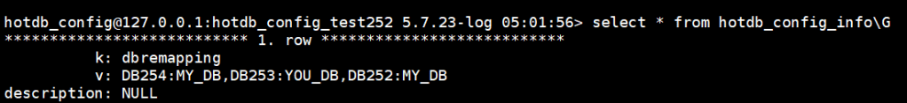

### `dbremapping @@remove@` - 移除数据库映射关系

此命令用于移除[dbremapping @@add@](#dbremapping-add)所添加的数据库映射关系，语法：

```sql
dbremapping @@remove@[database_name]:[database_name],[database_name]:[database_name]…;
```

例如：

```sql
dbremapping @@remove@db01:logic_db01,db02:logic_db02; #移除多条映射关系
Query OK, 0 rows affected (0.00 sec)
```

### `onlineddl` - OnlineDDL操作

此命令保证了在对数据表结构修改时，不会堵塞线上业务的读写，数据库依然可以提供正常的数据访问服务，语法：

```sql
onlineddl "[DDLSTATEMENT]";
```

例如：

```sql
onlineddl "alter table mytb add column cl1 varchar(90) default '1'";
```

> **Note**
>
> 在线修改表结构时，各分片上的数据表结构需要一致，并且需要修改的数据表有唯一索引。

### `stop @@onlineddl` – 取消OnlineDDL操作

此命令用于取消正在执行的onlineddl任务，取消维度可以分为逻辑库维护和表维护。

逻辑库维度取消：

```sql
stop @@onlineddl?dbs=db1,db2,db3…;
```

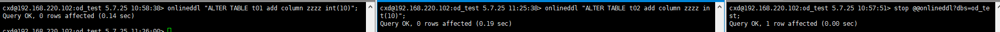

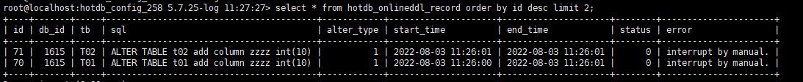

表维度取消：

```sql
stop @@onlineddl?tbs=db1.tb1,db2.tb2…;
```

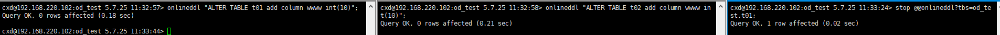

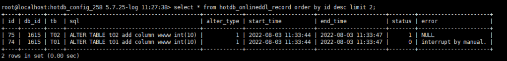

### `clear @@tablelock` –清除OnlineDDL内存任务{#clear-tablelock}

此命令用于清除内存中存在的onlineddl任务信息，可以清除指定表内存任务信息，语法如下：

```sql
clear @@tablelock.onlineddl.db.tb;
```


> **Note**
>
> 如果出现程序异常，执行onlineddl任务都报如下错误，则需要执行clear命令：

```sql
Can’t execute onlineddl on db.tb before complete previous onlineddl
```

### `onlineddl_nocheck` - OnlineDDL操作前不进行主备一致性检测

此命令保证了在对数据表结构修改时，不会堵塞线上业务的读写，数据库依然可以提供正常的数据访问服务，但在执行前，不进行主备一致性检测，语法：

```sql
onlineddl_nocheck "[DDLSTATEMENT]";
```

例如：

```sql
onlineddl_nocheck "alter table mytb add column cl1 varchar(90) default '1'";
```

> **Note**
>
> 在线修改表结构时，各分片上的数据表结构需要一致，并且需要修改的数据表有唯一索引。

### `check @@commandstatus cmd` - 检测是否支持接口

此命令用于查看 \$cmd 是否被server支持，例如：

```sql
check @@commandstatus onlineddl_nocheck;
```

**结果包含字段及其说明：**

| 列名      | 说明     | 值类型/范围              |
| --------- | -------- | ------------------------ |
| `support` | 是否支持 | 0表示不支持<br>1表示支持 |

### `file @@list` - 获取conf目录下文件及其最后修改时间

此命令用于查看获取conf目录下的文件及最后修改时间，例如：

```sql
file @@list;
```


**结果包含字段及其说明：**

| **列名** | **说明**                 | **值类型/范围**                                   |
| -------- | ------------------------ | ------------------------------------------------- |
| `DATA`   | conf目录下相关文件的信息 | `STRING/[number:file "time":yyyy-MM-dd hh:mm:ss]` |

### `hold commit` - 将所有客户端的连接状态置为HOLD_ALL_COMMIT

在HotDB Server的命令行监控窗口执行`hold commit`，服务端口事务的提交会被HOLD住（含事务提交及普通的自动提交）。例如自动提交事务类型时：

```sql
hold commit;

Query OK, 1 row affected (0.02 sec)
```


### `hold ddl` - 将所有客户端的连接状态置为HOLD_DDL

在HotDB Server的命令行监控窗口执行hold ddl，服务端口执行相关的ddl语句将暂时被HOLD住，例如：

```sql
hold ddl;

Query OK, 1 row affected (0.02 sec)
```


### `releasehold commit` – 将HOLD_ALL_COMMIT的连接状态释放

执行完[hold commit](#hold-commit)后，使用此命令解除HOLD状态，事务提交成功。例如：

```sql
releasehold commit;

Query OK, 1 row affected (0.00 sec)
```


### `releasehold ddl` – 将HOLD_DDL的连接状态置为UNHOLD

执行完[hold ddl](#hold-ddl)后，使用此命令解除HOLD状态，语句执行成功。例如：

```sql
releasehold ddl;

Query OK, 1 row affected (0.00 sec)
```


### 全局唯一性相关

若要了解关于全局唯一约束相关内容，请参考[计算节点标准操作](hotdb-server-standard-operations.md)文档。

#### `check @@history_unique` – 检查唯一键历史数据的唯一性

该命令用于检测指定表的唯一性的历史数据是否唯一，语法：

```sql
check @@history_unique [db_name.tb_name];
```

1\. 不指定表名：检测所有表，它们带唯一约束、主键约束、自增序列的历史数据是否唯一。若都唯一，则会返回空集：

```sql
check @@history_unique;

Empty set (0.01 sec)
```

若存在少量冲突的数据，则会提示冲突值：

```
mysql> check @@history_unique;
+---------+----------+-------------+------+-------------------------+----------+
| db_name | tb_name | keys | type | messege | key_type |
+---------+----------+-------------+------+-------------------------+----------+
| DB1 | test1 | (NAME1,ID1) | 1 | duplicate data in unique constraint: ID1:[2] | 2 |
| ZJJ_DB1 | UNIQUET1 | (NAME1,ID1) | 1 | (wqwrqw,13),(wqwrqw,14) | 2 |
| ZJJ_DB1 | UNIQUET1 | ID1 | 1 | 13,14 | 5 |
+---------+----------+-------------+------+-------------------------+----------+
```

若存在大量冲突，长度超过2048个字符，则会提示下载文件查看：

```
mysq\> check @@history_unique;
+---------+---------+-------------------------------------------------------------------------------------------------------------------+
| ZJJ_DB1 | UCON1 | (NAME1,ID1) | 1 | duplicate data in unique constraint, for more information,please download: ZJJ_DB1_UCON1_duplicates_1561353006576 |2 |
+---------+---------+-------------------------------------------------------------------------------------------------------------------+
```

2\. 指定表名：检测指定表唯一性的历史数据是否唯一，例如：

```sql
check @@history_unique db01.table01,db01.table02,db01.table03
```

**部分结果字段说明：**

| **列名**   | **说明**   | **值类型/范围**                                             |
| ---------- | ---------- | ----------------------------------------------------------- |
| `keys`     | 唯一键     |                                                             |
| `type`     | 表类型     | `1`-分片表                                                  |
| `messege`  | 检测详情   | 具体唯一键类型及重复的数据                                  |
| `key_type` | 唯一键类型 | `1`-主键；`2`-唯一键；`4`-自增；自增,复合类型为单独类型之和 |

#### `unique @@create` – 创建辅助索引{#unique-create}

该命令用于检测指定表的唯一约束键历史数据唯一后，为其创建辅助索引，语法：

```sql
unique @@create [db_name.tb_name];
```

1\. 不指定表名：检测所有表的唯一约束键是否唯一，若唯一，则为其创建辅助索引，例如：

```
mysql> unique @@create;
+------------------+-------------+---------+-----------------------------+
| db_name | tb_name | result | messege |
+------------------+-------------+---------+-----------------------------+
| HOTDB_SERVER_253 | ORDERFORM | fail | global_unique is turned off |
| HOTDB_SERVER_253 | CLIENT | success | |
| HOTDB_SERVER_253 | KEEVEY01 | success | |
+------------------+-------------+---------+-----------------------------+
```

- 若辅助索引创建成功，则result结果为success；

- 若此表的全局唯一约束为关闭状态，则result结果为fail，并显示信息：global_unique is turned off；

- 若检测历史数据唯一，但创建辅助索引失败，则result结果为fail，并显示error信息；

- 若检测历史数据不唯一，则result结果为fail，并显示不一致结果，同命令[check @@history_unique](#check-history_unique)。


2\. 指定表名：检测指定表的唯一约束键历史数据是否唯一，例如：

```sql
unique @@create db01.table01,db01.table02,db01.table03
```

此命令若包含已经创建过辅助索引的表，执行此命令后将删除已有的辅助索引重新创建。

3\. 指定并发数：参数concurrency指同时创建索引表的并发数，`InTableConcurrency`指单个表创建索引表的并发数，例如：

```sql
unique @@create?concurrency=42?InTableConcurrency=4;
```

若不指定并发数，实际参数默认值min(8,cpu核数）。当需要创建大量索引表时，可以根据服务器性能指定并发参数。

#### `unique @@drop` – 删除辅助索引

该命令用于为指定表删除辅助索引，语法：

```sql
unique @@drop [db_name.tb_name];
```

例如：

```
mysql> unique @@drop HOTDB_SERVER_253.beyond1,HOTDB_SERVER_253.test1,HOTDB_SERVER_253.keevey01;
+------------------+----------+---------+---------+
| db_name          | tb_name  | result  | messege |
+------------------+----------+---------+---------+
| HOTDB_SERVER_253 | BEYOND1  | success |         |
| HOTDB_SERVER_253 | KEEVEY01 | success |         |
| HOTDB_SERVER_253 | TEST1    | success |         |
+------------------+----------+-------------------+
```

- 若辅助索引删除成功，则result结果为success；

- 若辅助索引删除失败，则result结果为fail，并显示error信息。

#### `unique @@valid` – 检测全局唯一表索引表是否创建

该命令用于检测全局唯一表索引表是否创建，语法：

```sql
unique @@valid [db_name.tb_name];
```

例如：

```
mysql> unique @@valid zjj_db1.ll1,zjj_db1.kk1;

+---------+---------+--------+
| db_name | tb_name | result |
+---------+---------+--------+
| ZJJ_DB1 | LL1     | 0      |
| ZJJ_DB1 | KK1     | 1      |
+---------+---------+--------+     
```

- 若全局唯一表索引表已创建，则result结果为1；

- 若全局唯一表索引表未创建，则result结果为0。此时建议手动执行unique @@create db.tb来单独为这个表创建索引表否则再次执行unique @@create 语句时，会删除所有唯一约束索引表并重新初始化，此过程可能会耗费较长时间。

### SQL审计日志相关

#### `reload @@recordsqlauditlog` – 重新读取recordSqlAuditlog参数信息{#reload-recordsqlauditlog}

该命令用于重新读取recordSqlAuditlog参数信息，若为“是”，则记录SQL审计日志信息，若为“否”，则不记录SQL审计日志信息。语法：

```sql
reload @@recordsqlauditlog;
```

例如：

```sql
root@127.0.0.1:(none) 5.7.35 04:37:55> reload @@recordsqlauditlog;

Query OK, 1 row affected (0.19 sec)
```

#### `flush sqlaudit logs` – 刷新审计日志记录文件{#flush-sqlaudit-log}

该命令用于刷新审计日志记录文件，执行后，将审计日志当前记录的文件终止并重新生成新的审计日志文件进行记录。语法：

```sql
flush sqlaudit logs;
```

例如：

```sql
root@127.0.0.1:(none) 5.7.35 04:38:08> flush sqlaudit logs;

Query OK, 0 rows affected (0.01 sec)
```

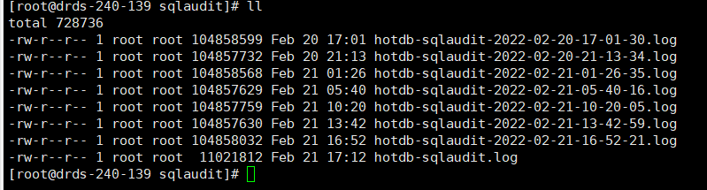

计算节点的`logs/extra/sqlaudi`t目录下，将当前`hotdb-sqlaudit.log`重命名为`hotdb-sqlaudit-2022-02-21-16-52-21.log`并新生成`hotdb-sqlaudit.log`
