# 性能测试

## 前言

### 测试目标

客户POC环境通常具有测试服务器资源较少，测试时间资源较短的特点，为了探索在测试资源有限的条件下，采用何种部署方式、何种分片算法以及何种测试方法能使分布式事务数据库HotDB Server v2.5.7（下称“HotDB”）达到极致性能，本次性能测试采用BenchmarkSQL-TPCC-5.0作为测试工具，测试多种部署方式，总体分为计算节点和存储节点单点部署，以及计算节点和存储节点混合部署，测试过程中均最大化压榨测试服务器硬件资源，验证HotDB的极致性能最佳实践方案。

### 参考资料

- 分布式事务数据库HotDB Server [计算节点标准操作](hotdb-server-standard-operations.md)文档

- 分布式事务数据库HotDB Server [安装部署](installation-and-deployment.md)文档

## 测试环境的软硬配置

### 硬件设备配置表

| 服务器编号 | 服务器IP    | 物理服务器配置信息                                                                                                                             |
| ---------- | ----------- | ---------------------------------------------------------------------------------------------------------------------------------------------- |
| 1          | 10.10.0.201 | CPU：Intel Xeon E5-2660 2.00GHz 14*2*2<br />内存：125GB<br />网卡：万兆网卡<br />硬盘：600GB 10K SAS HDD *2块 RAID 1 480GB SATA SSD *2块RAID 0 |
| 2          | 10.10.0.202 | CPU：Intel Xeon E5-2680 2.40GHz 14*2*2<br />内存：125GB<br />网卡：万兆网卡<br />硬盘：300GB 15K SAS HDD *2块 RAID 1800GB SATA SSD *6块 RAID 5 |
| 3          | 10.10.0.203 | CPU：Intel Xeon E5-2680 2.40GHz 14*2*2<br />内存：125GB<br />网卡：万兆网卡<br />硬盘：300GB 15K SAS HDD *2块 RAID 1800GB SATA SSD *6块 RAID 5 |
| 4          | 10.10.0.204 | CPU：Intel Xeon E5-2680 2.40GHz 14*2*2<br />内存：125GB<br />网卡：万兆网卡<br />硬盘：300GB 15K SAS HDD *2块 RAID 1800GB SATA SSD *6块 RAID 5 |
| 5          | 10.10.0.208 | CPU：Intel Xeon 8173M 2.00GHz 28*2*2<br />内存：93GB<br />网卡：双万兆网卡<br />硬盘：512G SSD * 2块 RAID 1                                    |
| 6          | 10.10.0.209 | CPU：Intel Xeon 8173M 2.00GHz 28*2*2<br />内存：85GB<br />网卡：双万兆网卡<br />硬盘：512G SSD * 2块 RAID 1                                    |
| 7          | 10.10.0.206 | CPU：Intel Xeon 4314 2.40GHz 16*2*2<br />内存：125GB<br />网卡：万兆网卡<br />硬盘：480G INTEL SSDSC2KB480G8                                   |
| 8          | 10.10.0.207 | CPU：Intel Xeon 8173M 2.00GHz 28*2*2<br />内存：93GB<br />网卡：双万兆网卡<br />硬盘：160GB INTEL SSDSA2BW160G3L                               |


### 操作系统配置表

| **服务器编号** | **服务器IP** | **操作系统版本** | **内核版本**                |
| -------------- | ------------ | ---------------- | --------------------------- |
| 1              | 10.10.0.201  | CentOS 7.8.2003  | 3.10.0-1160.76.1.el7.x86_64 |
| 2              | 10.10.0.202  | CentOS 7.5.1804  | 3.10.0-514.26.2.el7.x86_64  |
| 3              | 10.10.0.203  | CentOS 7.5.1804  | 3.10.0-514.26.2.el7.x86_64  |
| 4              | 10.10.0.204  | CentOS 7.5.1804  | 3.10.0-514.26.2.el7.x86_64  |
| 5              | 10.10.0.208  | CentOS 7.6.1810  | 3.10.0-1160.76.1.el7.x86_64 |
| 6              | 10.10.0.209  | CentOS 7.6.1810  | 3.10.0-1062.el7.x86_64      |
| 7              | 10.10.0.206  | CentOS 7.6.1810  | 3.10.0-1160.76.1.el7.x86_64 |
| 8              | 10.10.0.207  | CentOS 7.7.1908  | 3.10.0-1160.76.1.el7.x86_64 |

## 测试环境的部署架构

### 单点部署

#### 使用lvs负载均衡

| 访问流向：压力机->负载均衡服务器->计算节点服务器->存储节点服务器 | <              | <            | <                            |
| ---------------------------------------------------------------- | -------------- | ------------ | ---------------------------- |
| **服务器用途**                                                   | **服务器数量** | **服务器IP** | **部署详情**                 |
| 压力机                                                           | 1台            | 10.10.0.201  | 1个压力进程/台               |
| 负载均衡服务器                                                   | 1台            | 10.10.0.206  | 1个负载均衡服务进程/台       |
| 计算节点服务器                                                   | 3台            | 10.10.0.207  | 1个计算节点服务进程/台       |
| ^                                                                | ^              | 10.10.0.208  | 1个计算节点服务进程/台       |
| ^                                                                | ^              | 10.10.0.209  | 1个计算节点服务进程/台       |
| 存储节点服务器                                                   | 3台            | 10.10.0.202  | 4个存储节点的引擎服务进程/台 |
| ^                                                                | ^              | 10.10.0.203  | 4个存储节点的引擎服务进程/台 |
| ^                                                                | ^              | 10.10.0.204  | 4个存储节点的引擎服务进程/台 |

使用1台压力机对负载均衡服务器发送测试数据来施加压力，负载均衡服务器将压力分发到3个计算节点服务器，计算节点服务器连接3个存储节点服务器，每个存储节点服务器包含4个数据节点，根据不同场景来处理测试数据并返回结果。

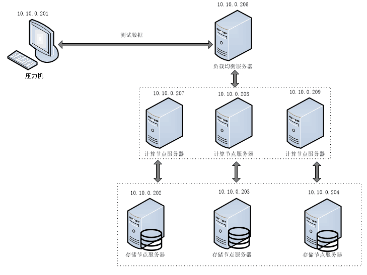

#### 使用jdbc:loadbalance负载均衡

| 访问流向：压力机->计算节点服务器->存储节点服务器 | <              | <            | <                            |
| ------------------------------------------------ | -------------- | ------------ | ---------------------------- |
| **服务器用途**                                   | **服务器数量** | **服务器IP** | **部署详情**                 |
| 压力机                                           | 1台            | 10.10.0.201  | 1个压力进程/台               |
| 计算节点服务器                                   | 3台            | 10.10.0.207  | 1个计算节点服务进程/台       |
| ^                                                | ^              | 10.10.0.208  | 1个计算节点服务进程/台       |
| ^                                                | ^              | 10.10.0.209  | 1个计算节点服务进程/台       |
| 存储节点服务器                                   | 3台            | 10.10.0.202  | 4个存储节点的引擎服务进程/台 |
| ^                                                | ^              | 10.10.0.203  | 4个存储节点的引擎服务进程/台 |
| ^                                                | ^              | 10.10.0.204  | 4个存储节点的引擎服务进程/台 |

在1台压力机上配置prop.mysql文件使用jdbc:loadbalance负载均衡方式压测3个计算节点服务器，计算节点服务器连接3个存储节点服务器，每个存储节点服务器包含4个数据节点，根据不同场景来处理测试数据并返回结果。

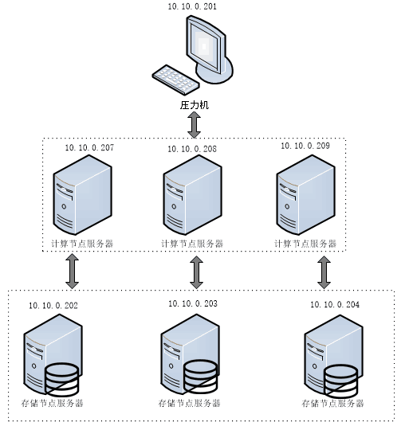

### 混合部署

#### 三台CPU核数最多的服务器混合部署

| 访问流向：压力机->负载均衡服务器->计算节点+存储节点 | <              | <            | <                                                         |
| --------------------------------------------------- | -------------- | ------------ | --------------------------------------------------------- |
| **服务器用途**                                      | **服务器数量** | **服务器IP** | **部署详情**                                              |
| 压力机                                              | 1台            | 10.10.0.201  | 1个压力进程/台                                            |
| 负载均衡服务器                                      | 1台            | 10.10.0.206   | 1个负载均衡服务进程/台                                    |
| 计算节点+存储节点                                   | 3台            | 10.10.0.207  | 1个计算节点服务进程/台 </br> 3个存储节点的引擎服务进程/台 |
| ^                                                   | ^              | 10.10.0.208  | 1个计算节点服务进程/台 </br> 3个存储节点的引擎服务进程/台 |
| ^                                                   | ^              | 10.10.0.209  | 1个计算节点服务进程/台 </br> 3个存储节点的引擎服务进程/台 |


计算节点和存储节点混合部署，HotDB集群内共有3个计算节点和9个存储节点，压力机通过lvs负载均衡方式对HotDB发送测试数据来施加压力，根据不同场景来处理测试数据并返回结果。

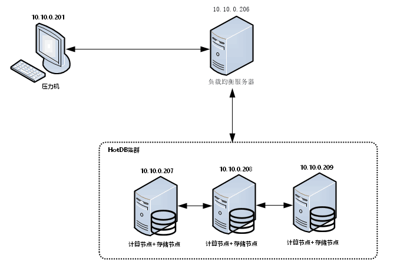

#### 三台内存最多的服务器混合部署

| 访问流向：压力机->计算节点+存储节点 | <              | <            | <                                                         |
| --------------------------------------------------- | -------------- | ------------ | --------------------------------------------------------- |
| **服务器用途**                                      | **服务器数量** | **服务器IP** | **部署详情**                                              |
| 压力机                                              | 1台            | 10.10.0.201  | 1个压力进程/台                                            |
| 计算节点+存储节点                                   | 3台            | 10.10.0.202  | 1个计算节点服务进程/台 </br> 4个存储节点的引擎服务进程/台 |
| ^                                                   | ^              | 10.10.0.203  | 1个计算节点服务进程/台 </br> 4个存储节点的引擎服务进程/台 |
| ^                                                   | ^              | 10.10.0.204  | 1个计算节点服务进程/台 </br> 4个存储节点的引擎服务进程/台 |

计算节点和存储节点混合部署，HotDB集群内共有3个计算节点和12个存储节点，在1台压力机上配置prop.mysql文件使用jdbc:loadbalance负载均衡方式对HotDB发送测试数据来施加压力，根据不同场景来处理测试数据并返回结果。

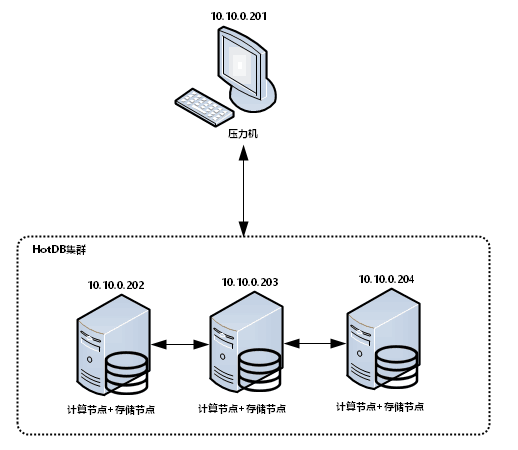

#### 六台服务器混合部署（调整数据节点数量）

| 访问流向：压力机->计算节点+存储节点 | <              | <            | <                                                         |
| --------------------------------------------------- | -------------- | ------------ | --------------------------------------------------------- |
| **服务器用途**                                      | **服务器数量** | **服务器IP** | **部署详情**                                              |
| 压力机                                              | 1台            | 10.10.0.201  | 1个压力进程/台                                            |
| 计算节点+存储节点                                   | 6台            | 10.10.0.202  | 1个计算节点服务进程/台 </br> 4个存储节点的引擎服务进程/台 |
| ^                                                   | ^              | 10.10.0.203  | 1个计算节点服务进程/台 </br> 4个存储节点的引擎服务进程/台 |
| ^                                                   | ^              | 10.10.0.204  | 1个计算节点服务进程/台 </br> 4个存储节点的引擎服务进程/台 |
|  ^                             | ^| 10.10.0.207  | 1个计算节点服务进程/台 </br> 3个存储节点的引擎服务进程/台 |
| ^                                                   | ^              | 10.10.0.208  | 1个计算节点服务进程/台 </br> 3个存储节点的引擎服务进程/台 |
| ^                                                   | ^              | 10.10.0.209  | 1个计算节点服务进程/台 </br> 3个存储节点的引擎服务进程/台 |


计算节点和存储节点混合部署，HotDB集群内共有6个计算节点和18个存储节点，在1台压力机上配置`prop.mysql`文件使用`jdbc:loadbalance`负载均衡方式对HotDB发送测试数据来施加压力，根据不同场景来处理测试数据并返回结果。


#### 六台服务器混合部署（调整垃圾回收器和jvm）

| 访问流向：压力机->计算节点+存储节点 | <              | <            | <                                                         |
| --------------------------------------------------- | -------------- | ------------ | --------------------------------------------------------- |
| **服务器用途**                                      | **服务器数量** | **服务器IP** | **部署详情**                                              |
| 压力机                                              | 1台            | 10.10.0.201  | 1个压力进程/台                                            |
| 计算节点+存储节点                                   | 6台            | 10.10.0.202  | 1个计算节点服务进程/台 </br> 4个存储节点的引擎服务进程/台 |
| ^                                                   | ^              | 10.10.0.203  | 1个计算节点服务进程/台 </br> 4个存储节点的引擎服务进程/台 |
| ^                                                   | ^              | 10.10.0.204  | 1个计算节点服务进程/台 </br> 4个存储节点的引擎服务进程/台 |
|  ^                             | ^| 10.10.0.207  | 1个计算节点服务进程/台 </br> 3个存储节点的引擎服务进程/台 |
| ^                                                   | ^              | 10.10.0.208  | 1个计算节点服务进程/台 </br> 3个存储节点的引擎服务进程/台 |
| ^                                                   | ^              | 10.10.0.209  | 1个计算节点服务进程/台 </br> 3个存储节点的引擎服务进程/台 |

计算节点和存储节点混合部署，HotDB集群内共有6个计算节点和18个存储节点，在1台压力机上配置`prop.mysql`文件使用`jdbc:loadbalance`负载均衡方式对HotDB发送测试数据来施加压力，根据不同场景来处理测试数据并返回结果。

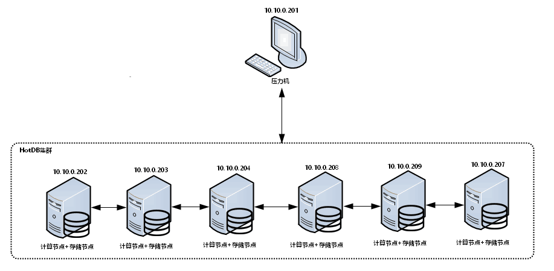

#### 两台压力机各启动一个压力进程同时压测五台服务器混合部署（分开压测）

| 访问流向：压力机->计算节点+存储节点 | <              | <            | <                                                         |
| --------------------------------------------------- | -------------- | ------------ | --------------------------------------------------------- |
| **服务器用途**                                      | **服务器数量** | **服务器IP** | **部署详情**                                              |
| 压力机                                              | 2台            | 10.10.0.201  | 1个压力进程/台                                            |
| ^                                              | ^            | 10.10.0.206  | 1个压力进程/台                                            |
| 计算节点+存储节点                                   | 5台            | 10.10.0.202  | 1个计算节点服务进程/台 </br> 4个存储节点的引擎服务进程/台 |
| ^                                                   | ^              | 10.10.0.203  | 1个计算节点服务进程/台 </br> 4个存储节点的引擎服务进程/台 |
| ^                                                   | ^              | 10.10.0.204  | 1个计算节点服务进程/台 </br> 4个存储节点的引擎服务进程/台 |
| ^                                                   | ^              | 10.10.0.208  | 1个计算节点服务进程/台 </br> 3个存储节点的引擎服务进程/台 |
| ^                                                   | ^              | 10.10.0.209  | 1个计算节点服务进程/台 </br> 3个存储节点的引擎服务进程/台 |

计算节点和存储节点混合部署，HotDB集群内共有5个计算节点和18个存储节点，在2台压力机上分别配置`prop.mysql`文件使用`jdbc:loadbalance`负载均衡方式对HotDB发送测试数据来施加压力，其中压力机10.10.0.201负责压测10.10.0.202/203/204共3个计算节点，压力机10.10.0.206负责压测10.10.0.208/209共2个计算节点，根据不同场景来处理测试数据并返回结果。

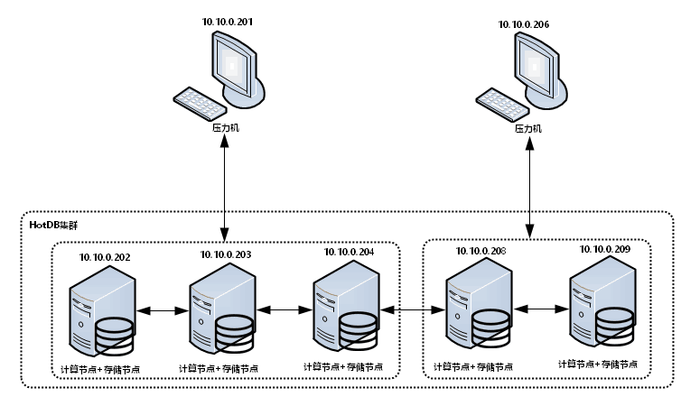

#### 两台压力机各启动一个压力进程同时压测六台服务器混合部署（集中压测）

| 访问流向：压力机->计算节点+存储节点 | <              | <            | <                                                         |
| --------------------------------------------------- | -------------- | ------------ | --------------------------------------------------------- |
| **服务器用途**                                      | **服务器数量** | **服务器IP** | **部署详情**                                              |
| 压力机                                              | 2台            | 10.10.0.201  | 1个压力进程/台                                            |
| ^                                              | ^            | 10.10.0.206  | 1个压力进程/台                                            |
| 计算节点+存储节点                                   | 6台            | 10.10.0.202  | 1个计算节点服务进程/台 </br> 4个存储节点的引擎服务进程/台 |
| ^                                                   | ^              | 10.10.0.203  | 1个计算节点服务进程/台 </br> 4个存储节点的引擎服务进程/台 |
| ^                                                   | ^              | 10.10.0.204  | 1个计算节点服务进程/台 </br> 4个存储节点的引擎服务进程/台 |
| ^                                                   | ^              | 10.10.0.207  | 1个计算节点服务进程/台 |
| ^                                                   | ^              | 10.10.0.208  | 1个计算节点服务进程/台 </br> 3个存储节点的引擎服务进程/台 |
| ^                                                   | ^              | 10.10.0.209  | 1个计算节点服务进程/台 </br> 3个存储节点的引擎服务进程/台 |


计算节点和存储节点混合部署，HotDB集群内共有6个计算节点和18个存储节点，在2台压力机上分别配置`prop.mysql`文件使用`jdbc:loadbalance`负载均衡方式集中对HotDB发送测试数据来施加压力，根据不同场景来处理测试数据并返回结果。

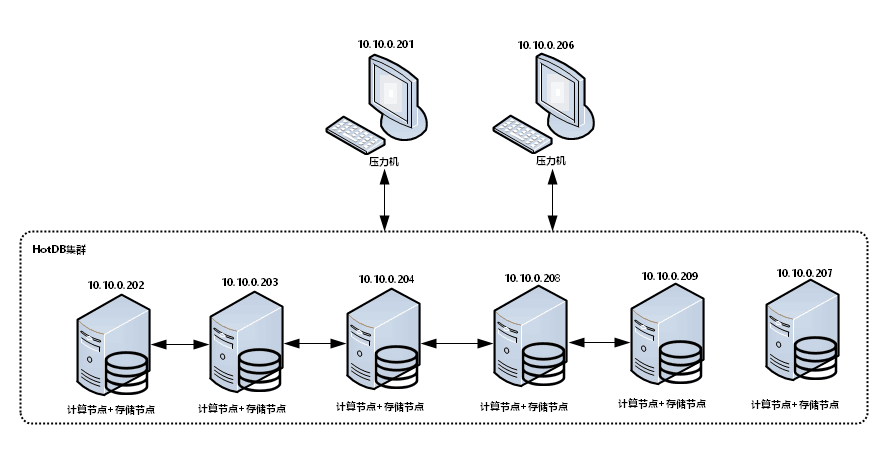

#### 两台压力机各启动一个压力进程同时压测六台服务器混合部署（分开压测）

| 访问流向：压力机->计算节点+存储节点 | <              | <            | <                                                         |
| --------------------------------------------------- | -------------- | ------------ | --------------------------------------------------------- |
| **服务器用途**                                      | **服务器数量** | **服务器IP** | **部署详情**                                              |
| 压力机                                              | 2台            | 10.10.0.201  | 1个压力进程/台                                            |
| ^                                              | ^            | 10.10.0.207  | 1个压力进程/台                                            |
| 计算节点+存储节点                                   | 6台            | 10.10.0.201  | 1个计算节点服务进程/台 </br> 4个存储节点的引擎服务进程/台 |
| ^                                | ^           | 10.10.0.202  | 1个计算节点服务进程/台 </br> 4个存储节点的引擎服务进程/台 |
| ^                                                   | ^              | 10.10.0.203  | 1个计算节点服务进程/台 </br> 4个存储节点的引擎服务进程/台 |
| ^                                                   | ^              | 10.10.0.204  | 1个计算节点服务进程/台 </br> 4个存储节点的引擎服务进程/台 |
| ^                                                   | ^              | 10.10.0.208  | 1个计算节点服务进程/台 </br> 3个存储节点的引擎服务进程/台 |
| ^                                                   | ^              | 10.10.0.209  | 1个计算节点服务进程/台 </br> 3个存储节点的引擎服务进程/台 |

计算节点和存储节点混合部署，HotDB集群内共有6个计算节点和22个存储节点，在2台压力机上分别配置`prop.mysql`文件使用`jdbc:loadbalance`负载均衡方式对HotDB发送测试数据来施加压力，其中压力机10.10.0.206负责压测10.10.0.201/202/203/204共4个计算节点，压力机10.10.0.207负责压测10.10.0.208/209共2个计算节点，根据不同场景来处理测试数据并返回结果。

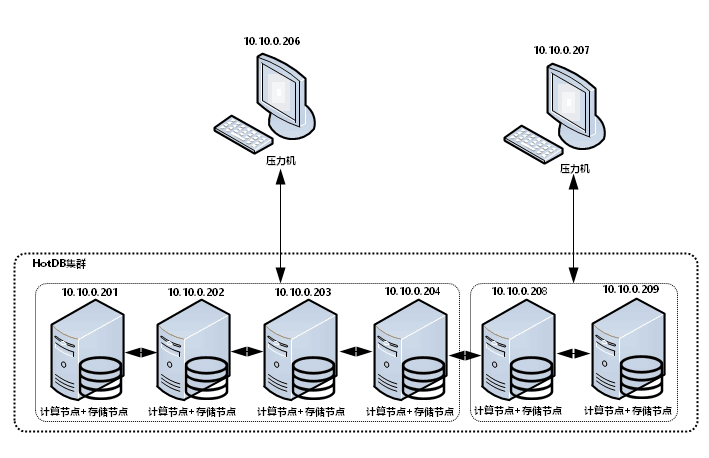

#### 两台压力机各启动两个压力进程同时压测六台服务器混合部署（分开测压不绑核）

| 访问流向：压力机->计算节点+存储节点 | <              | <            | <                                                         |
| --------------------------------------------------- | -------------- | ------------ | --------------------------------------------------------- |
| **服务器用途**                                      | **服务器数量** | **服务器IP** | **部署详情**                                              |
| 压力机                                              | 2台            | 10.10.0.206  | 2个压力进程/台                                            |
| ^                                              | ^            | 10.10.0.207  | 2个压力进程/台                                            |
| 计算节点+存储节点                                   | 6台            | 10.10.0.201  | 1个计算节点服务进程/台 </br> 4个存储节点的引擎服务进程/台 |
| ^                                | ^           | 10.10.0.202  | 1个计算节点服务进程/台 </br> 4个存储节点的引擎服务进程/台 |
| ^                                                   | ^              | 10.10.0.203  | 1个计算节点服务进程/台 </br> 4个存储节点的引擎服务进程/台 |
| ^                                                   | ^              | 10.10.0.204  | 1个计算节点服务进程/台 </br> 4个存储节点的引擎服务进程/台 |
| ^                                                   | ^              | 10.10.0.208  | 1个计算节点服务进程/台 </br> 3个存储节点的引擎服务进程/台 |
| ^                                                   | ^              | 10.10.0.209  | 1个计算节点服务进程/台 </br> 3个存储节点的引擎服务进程/台 |

计算节点和存储节点混合部署，HotDB集群内共有6个计算节点和22个存储节点，在2台压力机上各启动2个压力进程，分别配置`prop.mysql`文件使用`jdbc:loadbalance`负载均衡方式对HotDB发送测试数据来施加压力，其中压力机10.10.0.206上A压力进程负责压测10.10.0.201/202/203/204共4个计算节点，B压力进程负责压测10.10.0.208/209共2个计算节点，压力机10.10.0.207上C压力进程负责压测10.10.0.201/202/203/204共4个计算节点，D压力进程负责压测10.10.0.208/209共2个计算节点，根据不同场景来处理测试数据并返回结果。

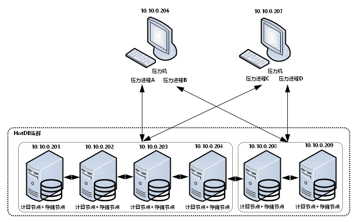

#### 两台压力机各启动两个压力进程同时压测六台服务器混合部署（分开压测绑核）

| 访问流向：压力机->计算节点+存储节点 | <              | <            | <                                                         |
| --------------------------------------------------- | -------------- | ------------ | --------------------------------------------------------- |
| **服务器用途**                                      | **服务器数量** | **服务器IP** | **部署详情**                                              |
| 压力机                                              | 2台            | 10.10.0.206  | 2个压力进程/台                                            |
| ^                                              | ^            | 10.10.0.207  | 2个压力进程/台                                            |
| 计算节点+存储节点                                   | 6台            | 10.10.0.201  | 1个计算节点服务进程/台 </br> 4个存储节点的引擎服务进程/台 |
| ^                                | ^           | 10.10.0.202  | 1个计算节点服务进程/台 </br> 4个存储节点的引擎服务进程/台 |
| ^                                                   | ^              | 10.10.0.203  | 1个计算节点服务进程/台 </br> 4个存储节点的引擎服务进程/台 |
| ^                                                   | ^              | 10.10.0.204  | 1个计算节点服务进程/台 </br> 4个存储节点的引擎服务进程/台 |
| ^                                                   | ^              | 10.10.0.208  | 1个计算节点服务进程/台 </br> 3个存储节点的引擎服务进程/台 |
| ^                                                   | ^              | 10.10.0.209  | 1个计算节点服务进程/台 </br> 3个存储节点的引擎服务进程/台 |

计算节点和存储节点混合部署，HotDB集群内共有6个计算节点和22个存储节点，在2台压力机上各启动2个压力进程，在每台压力机上执行numactl给2个压力进程各自绑定服务器一半的CPU核数，分别配置`prop.mysql`文件使用`jdbc:loadbalance`负载均衡方式对HotDB发送测试数据来施加压力，其中压力机10.10.0.206上A压力进程负责压测10.10.0.201/202/203/204共4个计算节点，B压力进程负责压测10.10.0.208/209共2个计算节点，压力机10.10.0.207上C压力进程负责压测10.10.0.201/202/203/204共4个计算节点，D压力进程负责压测10.10.0.208/209共2个计算节点，根据不同场景来处理测试数据并返回结果。


## 测试环境的数据分片策略

### 单点部署

#### 采用AUTO_CRC32分片

在可视化管理平台上创建10张性能测试用途的表对象，详细如下：

| **表名称**       | **表类型** | **分片字段** | **分片算法** | **数据节点** |
| ---------------- | ---------- | ------------ | ------------ | ------------ |
| BMSQL_NEW_ORDER  | 水平分片表 | NO_W\_ID     | AUTO_CRC32   | DN01\~DN12   |
| BMSQL_OORDER     | 水平分片表 | O_W\_ID      | AUTO_CRC32   | DN01\~DN12   |
| BMSQL_STOCK      | 水平分片表 | S_W\_ID      | AUTO_CRC32   | DN01\~DN12   |
| BMSQL_ORDER_LINE | 水平分片表 | OL_W\_ID     | AUTO_CRC32   | DN01\~DN12   |
| BMSQL_HISTORY    | 水平分片表 | H_W\_ID      | AUTO_CRC32   | DN01\~DN12   |
| BMSQL_CUSTOMER   | 水平分片表 | C_W\_ID      | AUTO_CRC32   | DN01\~DN12   |
| BMSQL_DISTRICT   | 水平分片表 | D_W\_ID      | AUTO_CRC32   | DN01\~DN12   |
| BMSQL_WAREHOUSE  | 水平分片表 | W_ID         | AUTO_CRC32   | DN01\~DN12   |
| BMSQL_ITEM       | 全局表     | \-           | \-           | DN01\~DN12   |
| BMSQL_CONFIG     | 全局表     | \-           | \-           | DN01\~DN12   |

#### 采用AUTO_MOD分片

在可视化管理平台上创建10张性能测试用途的表对象，详细如下：

| **表名称**       | **表类型** | **分片字段** | **分片算法** | **数据节点** |
| ---------------- | ---------- | ------------ | ------------ | ------------ |
| BMSQL_NEW_ORDER  | 水平分片表 | NO_W\_ID     | AUTO_MOD     | DN01\~DN09   |
| BMSQL_OORDER     | 水平分片表 | O_W\_ID      | AUTO_MOD     | DN01\~DN09   |
| BMSQL_STOCK      | 水平分片表 | S_W\_ID      | AUTO_MOD     | DN01\~DN09   |
| BMSQL_ORDER_LINE | 水平分片表 | OL_W\_ID     | AUTO_MOD     | DN01\~DN09   |
| BMSQL_HISTORY    | 水平分片表 | H_W\_ID      | AUTO_MOD     | DN01\~DN09   |
| BMSQL_CUSTOMER   | 水平分片表 | C_W\_ID      | AUTO_MOD     | DN01\~DN09   |
| BMSQL_DISTRICT   | 水平分片表 | D_W\_ID      | AUTO_MOD     | DN01\~DN09   |
| BMSQL_WAREHOUSE  | 水平分片表 | W_ID         | AUTO_MOD     | DN01\~DN09   |
| BMSQL_ITEM       | 全局表     | \-           | \-           | DN01\~DN09   |
| BMSQL_CONFIG     | 全局表     | \-           | \-           | DN01\~DN09   |

### **混合部署**

#### 采用AUTO_CRC32分片

在可视化管理平台上创建10张性能测试用途的表对象，详细如下：

| **表名称**       | **表类型** | **分片字段** | **分片算法** | **数据节点** |
| ---------------- | ---------- | ------------ | ------------ | ------------ |
| BMSQL_NEW_ORDER  | 水平分片表 | NO_W\_ID     | AUTO_CRC32   | DN01\~DN09   |
| BMSQL_OORDER     | 水平分片表 | O_W\_ID      | AUTO_CRC32   | DN01\~DN09   |
| BMSQL_STOCK      | 水平分片表 | S_W\_ID      | AUTO_CRC32   | DN01\~DN09   |
| BMSQL_ORDER_LINE | 水平分片表 | OL_W\_ID     | AUTO_CRC32   | DN01\~DN09   |
| BMSQL_HISTORY    | 水平分片表 | H_W\_ID      | AUTO_CRC32   | DN01\~DN09   |
| BMSQL_CUSTOMER   | 水平分片表 | C_W\_ID      | AUTO_CRC32   | DN01\~DN09   |
| BMSQL_DISTRICT   | 水平分片表 | D_W\_ID      | AUTO_CRC32   | DN01\~DN09   |
| BMSQL_WAREHOUSE  | 水平分片表 | W_ID         | AUTO_CRC32   | DN01\~DN09   |
| BMSQL_ITEM       | 全局表     | \-           | \-           | DN01\~DN09   |
| BMSQL_CONFIG     | 全局表     | \-           | \-           | DN01\~DN09   |

#### **采用AUTO_MOD分片**

在可视化管理平台上创建10张性能测试用途的表对象，混合部署架构下所有测试方案分片策略相同，只有数据节点数量的差异，篇幅有限不一一列举，详细如下：

| **表名称**       | **表类型** | **分片字段** | **分片算法** | **数据节点** |
| ---------------- | ---------- | ------------ | ------------ | ------------ |
| BMSQL_NEW_ORDER  | 水平分片表 | NO_W\_ID     | AUTO_MOD     | DN01\~DN22   |
| BMSQL_OORDER     | 水平分片表 | O_W\_ID      | AUTO_MOD     | DN01\~DN22   |
| BMSQL_STOCK      | 水平分片表 | S_W\_ID      | AUTO_MOD     | DN01\~DN22   |
| BMSQL_ORDER_LINE | 水平分片表 | OL_W\_ID     | AUTO_MOD     | DN01\~DN22   |
| BMSQL_HISTORY    | 水平分片表 | H_W\_ID      | AUTO_MOD     | DN01\~DN22   |
| BMSQL_CUSTOMER   | 水平分片表 | C_W\_ID      | AUTO_MOD     | DN01\~DN22   |
| BMSQL_DISTRICT   | 水平分片表 | D_W\_ID      | AUTO_MOD     | DN01\~DN22   |
| BMSQL_WAREHOUSE  | 水平分片表 | W_ID         | AUTO_MOD     | DN01\~DN22   |
| BMSQL_ITEM       | 全局表     | \-           | \-           | DN01\~DN22   |
| BMSQL_CONFIG     | 全局表     | \-           | \-           | DN01\~DN22   |

## 测试环境的表对象结构

使用BenchmarkSQL-TPCC测试工具自带的脚本，即可自动完成表对象结构创建及造数工作，造数完毕后自动添加索引和外键约束，执行命令示例如下：

```
./runDatabaseBuild.sh prop.mysql
```

其中建表语句如下：

```sql
create table bmsql_warehouse (
w_id integer not null,
w_ytd decimal(12,2),
w_tax decimal(4,4),
w_name varchar(10),
w_street_1 varchar(20),
w_street_2 varchar(20),
w_city varchar(20),
w_state char(2),
w_zip char(9)
);
```

具体表结构及索引、外键约束请查看附件：


## 性能测试的业务场景

模拟在线联机交易业务，包括创建订单，支付订单，查询订单，发货，查询库存五种核心交易,其中仅关注创建订单业务，对应用例编号如下表：

| **业务名称**     | **部署架构** | **对应用例编号** |
| ---------------- | ------------ | ---------------- |
| 模拟在线联机交易 | 单点部署     | T1-1             |
|    ^              |     ^         | T1-2             |
|           ^       | 混合部署     | T2-1             |
|     ^             |  ^            | T2-2             |
|      ^            |   ^           | T2-3             |
|       ^           |    ^          | T2-4             |
|        ^          |     ^         | T2-5             |
|         ^         |      ^        | T2-6             |
|          ^        |       ^       | T2-7             |
|           ^       |        ^      | T2-8             |
|            ^      |         ^     | T2-9             |

模拟在线联机交易业务的处理逻辑如下：

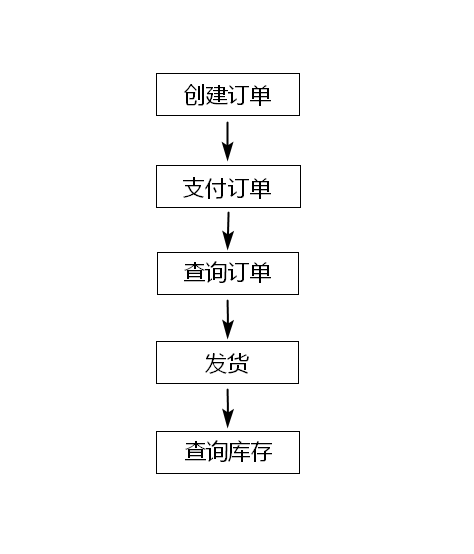

## 测试用例

| 用例编号 | 部署架构 | 计算节点数量 | 区别                                      | 各压力机上并发数                     | 测试脚本        |
| -------- | -------- | ------------ | ----------------------------------------- | ------------------------------------ | --------------- |
| T1-1     | 单点部署 | 3个          | 1个压力进程，使用lvs负载均衡              | 1/8/16/64/128/256/512/1000/1024/2048 | runBenchmark.sh |
| T1-2     | ^        | 3个          | 1个压力进程，使用jdbc:loadbalance负载均衡 | 1/8/16/64/128/256/512/1000/1024/2048 | runBenchmark.sh |
| T2-1     | 混合部署 | 3个          | 1个压力进程，CPU核数最多                  | 1/8/16/64/128/256/512/1000/1024/2048 | runBenchmark.sh |
| T2-2     | ^        | 3个          | 1个压力进程，内存最多                     | 1/8/16/64/128/256/512/1000/1024/2048 | runBenchmark.sh |
| T2-3     | ^        | 6个          | 1个压力进程，调整数据节点数量             | 1/8/16/64/128/256/512/1000/1024/2048 | runBenchmark.sh |
| T2-4     | ^        | 6个          | 1个压力进程，调整垃圾回收器和jvm          | 1/8/16/64/128/256/512/1000/1024/2048 | runBenchmark.sh |
| T2-5     | ^        | 5个          | 2个压力进程，分开压测                     | 1/8/16/64/128/256/512/1000/1024/2048 | runBenchmark.sh |
| T2-6     | ^        | 6个          | 2个压力进程，集中压测                     | 1/8/16/64/128/256/512/1000/1024/2048 | runBenchmark.sh |
| T2-7     | ^        | 6个          | 2个压力进程，分开压测                     | 1/8/16/64/128/256/512/1000/1024/2048 | runBenchmark.sh |
| T2-8     | ^        | 6个          | 4个压力进程，分开压测不绑核               | 1/8/16/64/128/256/512/1000/1024/2048 | runBenchmark.sh |
| T2-9     | ^        | 6个          | 4个压力进程，分开压测绑核                 | 1/8/16/64/128/256/512/1000/1024/2048 | runBenchmark.sh |

## 测试工具

| **工具名称**      | **版本号** | **本次采用** |
| ----------------- | ---------- | ------------ |
| LoadRunner        | 11.0       | \-           |
| JMeter            | 5.0        | \-           |
| sysbench          | 1.0.8      | \-           |
| BenchmarkSQL-TPCC | 5.0        | √            |

## 配置参数

### 操作系统相关参数配置

| 服务器名       | 参数                   | 配置                                                         |
| -------------- | ---------------------- | ------------------------------------------------------------ |
| 计算节点服务器 | kdump                  | 关闭                                                         |
| ^              | bios                   | 高性能                                                       |
| ^              | NUMA                   | 关闭                                                         |
| ^              | Scrub                  | 关闭                                                         |
| ^              | EFI                    | 启用                                                         |
| ^              | 虚拟化                 | 关闭                                                         |
| ^              | RAID卡                 | 条带大小都选64K 回写开预读开 磁盘缓存关闭 巡读关闭           |
| ^              | 文件系统               | xfs                                                          |
| ^              | SSD                    | 使用noop                                                     |
| ^              | intel_idle.max_cstate  | 0                                                            |
| ^              | processor.max_cstate   | 0                                                            |
| ^              | tuned                  | 关闭                                                         |
| ^              | irqbalance             | 关闭                                                         |
| ^              | x86_energy_perf_policy | performance                                                  |
| 存储节点服务器 | kdump                  | 关闭                                                         |
| ^              | bios                   | 高性能                                                       |
| ^              | NUMA                   | MySQL各自绑定到一个NUMA节点                                  |
| ^              | CoD                    | 启用                                                         |
| ^              | Scrub                  | 关闭                                                         |
| ^              | EFI                    | 启用                                                         |
| ^              | 虚拟化                 | 关闭                                                         |
| ^              | RAID卡                 | SSD 6块 RAID5条带大小都选64K 回写开预读关 磁盘缓存关闭 巡读关闭 |
| ^              | 文件系统               | xfs                                                          |
| ^              | SSD                    | 使用noop                                                     |
| ^              | intel_idle.max_cstate  | 0                                                            |
| ^              | processor.max_cstate   | 0                                                            |
| ^              | tuned                  | 关闭                                                         |
| ^              | irqbalance             | 关闭                                                         |
| ^              | x86_energy_perf_policy | performance                                                  |


### 内核参数相关参数配置

| **参数**                          | **配置** |
| --------------------------------- | -------- |
| `net.core.netdev_budget`          | 100      |
| `net.ipv4.tcp_fastopen`           | 3        |
| `net.ipv4.tcp_low_latency`        | 1        |
| `net.ipv4.tcp_congestion_control` | htcp     |

### 存储引擎相关参数配置

| **参数**                         | **配置** |
| -------------------------------- | -------- |
| `binlog`                         | 关闭     |
| `innodb-buffer-pool-size`        | 20G      |
| `innodb-io-capacity`             | 200      |
| `innodb-log-file-size`           | 16G      |
| `character-set-server`           | utf8mb4  |
| `sync-binlog`                    | 0        |
| `innodb-flush-log-at-trx-commit` | 0        |
| `large-pages`                    | 启用     |
| `innodb_flush_neighbors`         | 0        |
| `innodb_thread_concurrency`      | 16       |

更多my.cnf配置请查看文件


### 计算引擎相关参数配置

| **参数**                     | **配置** |
| ---------------------------- | -------- |
| `adaptiveProcessor`          | true     |
| `aggressive`                 | false    |
| `autoIncrement`              | 2        |
| `enableFlowControl`          | true     |
| `enableXA`                   | false    |
| `frontConnectionTrxIsoLevel` | 1        |
| `globalUniqueConstraint`     | false    |
| `operateMode`                | 1        |
| `ZGC`                        | 16G      |

## 测试环境的软件版本

| **名称** | **版本号**                               | **部署方式**       |
| -------- | ---------------------------------------- | ------------------ |
| 计算引擎 | hotdb-server-2.5.7-ga-20221107-jdk11.jar | 单点部署和混合部署 |
| 存储引擎 | 5.7.40                                   |   ^                 |
| 管理平台 | hotdb-management-2.5.7-ga-20221116.jar   | \-                 |

## 测试用例的结果分析

### 单点部署

#### 使用lvs负载均衡（常规方案）

| 用例编号     | T1-1                                                         |
| ------------ | ------------------------------------------------------------ |
| **测试目标** | 测试计算引擎在该场景下的tpmC，CPU使用率，网络使用情况        |
| **场景说明** | 1台压力机，启动1个压力进程，使用lvs负载均衡方式，执行1/8/16/64/128/256/512/1000/1024/2048并发下模拟在线联机交易的场景 |
| **测试步骤** | 1. 在可视化管理平台创建表对象，表采用AUTO_CRC32分片策略，分布12个数据节点  <br />2. 执行./runDatabaseBuild.sh prop.mysql命令创建表结构及造数  <br />3. 预置1000仓测试数据  <br />4. 执行`./runBenchmark.sh prop.mysql`命令进行压测  <br />5. 分别发起1/8/16/64/128/256/512/1000/1024/2048并发的2分钟压力测试6. 记录测试完毕后测试工具输出的数据 |
| **测试脚本** | `runBenchmark.sh`                                            |

**测试结果**

| 并发数 | tpmC (NewOrders) | tpmTOTAL  | TPS   | 事务成功率 |
| ------ | ---------------- | --------- | ----- | ---------- |
| 1      | 3173.41          | 7080.61   | 118   | 100.00%    |
| 8      | 25438.50         | 56507.88  | 941   | 100.00%    |
| 16     | 46743.59         | 104009.81 | 1733  | 100.00%    |
| 64     | 137248.08        | 305078.86 | 5088  | 100.00%    |
| 128    | 229260.78        | 509433.25 | 8492  | 100.00%    |
| 256    | 336666.63        | 748417.19 | 12476 | 100.00%    |
| 512    | 378048.74        | 840242.27 | 14011 | 100.00%    |
| 1000   | 379832.12        | 844465.90 | 14098 | 100.00%    |
| 1024   | 381009.08        | 846268.82 | 14122 | 100.00%    |
| 2048   | 377625.61        | 839402.85 | 14010 | 100.00%    |

**各服务器硬件资源使用情况**

| **并发数** | **服务器用途** | **服务器IP** | **CPU使用率** | **网卡接收速率** | **网卡发送速率** |
| ---------- | -------------- | ------------ | ------------- | ---------------- | ---------------- |
| 1          | 计算节点服务器 | 10.10.0.207  | 10%           | 28KB/S           | 16KB/S           |
| ^          | ^              | 10.10.0.208  | 1%            | 8KB/S            | 9KB/S            |
| ^          | ^              | 10.10.0.209  | 1%            | 2655KB/S         | 2647KB/S         |
| ^          | 存储节点服务器 | 10.10.0.202  | 0%            | 12KB/S           | 13KB/S           |
| ^          | ^              | 10.10.0.203  | 0%            | 11KB/S           | 12KB/S           |
| ^          | ^              | 10.10.0.204  | 0%            | 1605KB/S         | 720KB/S          |
| ^          | 压力机         | 10.10.0.201  | 0%            | 1022KB/S         | 1933KB/S         |
| ^          | 负载均衡服务器 | 10.10.0.206  | 3%            | 1029KB/S         | 1050KB/S         |
| 8          | 计算节点服务器 | 10.10.0.207  | 11%           | 4580KB/S         | 4560KB/S         |
| ^          | ^              | 10.10.0.208  | 1%            | 8078KB/S         | 8053KB/S         |
| ^          | ^              | 10.10.0.209  | 1%            | 8505KB/S         | 8476KB/S         |
| ^          | 存储节点服务器 | 10.10.0.202  | 2%            | 7769KB/S         | 3476KB/S         |
| ^          | ^              | 10.10.0.203  | 0%            | 1592KB/S         | 731KB/S          |
| ^          | ^              | 10.10.0.204  | 1%            | 3542KB/S         | 1580KB/S         |
| ^          | 压力机         | 10.10.0.201  | 1%            | 8183KB/S         | 15432KB/S        |
| ^          | 负载均衡服务器 | 10.10.0.206  | 0%            | 8147KB/S         | 8152KB/S         |
| 16         | 计算节点服务器 | 10.10.0.207  | 11%           | 11761KB/S        | 11715KB/S        |
| ^          | ^              | 10.10.0.208  | 2%            | 15050KB/S        | 14998KB/S        |
| ^          | ^              | 10.10.0.209  | 2%            | 12053KB/S        | 12012KB/S        |
| ^          | 存储节点服务器 | 10.10.0.202  | 2%            | 7462KB/S         | 3353KB/S         |
| ^          | ^              | 10.10.0.203  | 3%            | 10548KB/S        | 4715KB/S         |
| ^          | ^              | 10.10.0.204  | 2%            | 5640KB/S         | 2548KB/S         |
| ^          | 压力机         | 10.10.0.201  | 3%            | 15044KB/S        | 28302KB/S        |
| ^          | 负载均衡服务器 | 10.10.0.206  | 0%            | 14980KB/S        | 14985KB/S        |
| 64         | 计算节点服务器 | 10.10.0.207  | 13%           | 18924KB/S        | 18863KB/S        |
| ^          | ^              | 10.10.0.208  | 5%            | 46951KB/S        | 46834KB/S        |
| ^          | ^              | 10.10.0.209  | 5%            | 47892KB/S        | 47769KB/S        |
| ^          | 存储节点服务器 | 10.10.0.202  | 7%            | 21923KB/S        | 9847KB/S         |
| ^          | ^              | 10.10.0.203  | 5%            | 18124KB/S        | 8073KB/S         |
| ^          | ^              | 10.10.0.204  | 9%            | 29294KB/S        | 13061KB/S        |
| ^          | 压力机         | 10.10.0.201  | 9%            | 44086KB/S        | 82901KB/S        |
| ^          | 负载均衡服务器 | 10.10.0.206  | 0%            | 43969KB/S        | 43974KB/S        |
| 128        | 计算节点服务器 | 10.10.0.207  | 13%           | 20124KB/S        | 20069KB/S        |
| ^          | ^              | 10.10.0.208  | 9%            | 85106KB/S        | 84950KB/S        |
| ^          | ^              | 10.10.0.209  | 9%            | 85258KB/S        | 85107KB/S        |
| ^          | 存储节点服务器 | 10.10.0.202  | 13%           | 40394KB/S        | 17951KB/S        |
| ^          | ^              | 10.10.0.203  | 14%           | 44060KB/S        | 19508KB/S        |
| ^          | ^              | 10.10.0.204  | 10%           | 31887KB/S        | 14059KB/S        |
| ^          | 压力机         | 10.10.0.201  | 16%           | 73503KB/S        | 138892KB/S       |
| ^          | 负载均衡服务器 | 10.10.0.206  | 0%            | 73346KB/S        | 73349KB/S        |
| 256        | 计算节点服务器 | 10.10.0.207  | 13%           | 19604KB/S        | 19529KB/S        |
| ^          | ^              | 10.10.0.208  | 16%           | 133310KB/S       | 133110KB/S       |
| ^          | ^              | 10.10.0.209  | 15%           | 128599KB/S       | 128396KB/S       |
| ^          | 存储节点服务器 | 10.10.0.202  | 27%           | 75939KB/S        | 33121KB/S        |
| ^          | ^              | 10.10.0.203  | 15%           | 47127KB/S        | 20727KB/S        |
| ^          | ^              | 10.10.0.204  | 16%           | 49453KB/S        | 21664KB/S        |
| ^          | 压力机         | 10.10.0.201  | 28%           | 107846KB/S       | 205624KB/S       |
| ^          | 负载均衡服务器 | 10.10.0.206  | 0%            | 107622KB/S       | 107627KB/S       |
| 512        | 计算节点服务器 | 10.10.0.207  | 13%           | 18348KB/S        | 18245KB/S        |
| ^          | ^              | 10.10.0.208  | 19%           | 148322KB/S       | 148106KB/S       |
| ^          | ^              | 10.10.0.209  | 19%           | 151716KB/S       | 151503KB/S       |
| ^          | 存储节点服务器 | 10.10.0.202  | 25%           | 71181KB/S        | 30591KB/S        |
| ^          | ^              | 10.10.0.203  | 22%           | 63348KB/S        | 27584KB/S        |
| ^          | ^              | 10.10.0.204  | 21%           | 61106KB/S        | 26486KB/S        |
| ^          | 压力机         | 10.10.0.201  | 33%           | 120940KB/S       | 232778KB/S       |
| ^          | 负载均衡服务器 | 10.10.0.206  | 0%            | 120681KB/S       | 120686KB/S       |
| 1000       | 计算节点服务器 | 10.10.0.207  | 14%           | 16173KB/S        | 16026KB/S        |
| ^          | ^              | 10.10.0.208  | 19%           | 152294KB/S       | 152102KB/S       |
| ^          | ^              | 10.10.0.209  | 20%           | 157349KB/S       | 157164KB/S       |
| ^          | 存储节点服务器 | 10.10.0.202  | 28%           | 75523KB/S        | 31954KB/S        |
| ^          | ^              | 10.10.0.203  | 24%           | 67087KB/S        | 28499KB/S        |
| ^          | ^              | 10.10.0.204  | 20%           | 57475KB/S        | 24399KB/S        |
| ^          | 压力机         | 10.10.0.201  | 34%           | 121271KB/S       | 237359KB/S       |
| ^          | 负载均衡服务器 | 10.10.0.206  | 0%            | 121012KB/S       | 121016KB/S       |
| 1024       | 计算节点服务器 | 10.10.0.207  | 14%           | 16711KB/S        | 16558KB/S        |
| ^          | ^              | 10.10.0.208  | 19%           | 153442KB/S       | 153246KB/S       |
| ^          | ^              | 10.10.0.209  | 20%           | 158529KB/S       | 158339KB/S       |
| ^          | 存储节点服务器 | 10.10.0.202  | 24%           | 69278KB/S        | 28793KB/S        |
| ^          | ^              | 10.10.0.203  | 24%           | 67716KB/S        | 28275KB/S        |
| ^          | ^              | 10.10.0.204  | 24%           | 67344KB/S        | 27975KB/S        |
| ^          | 压力机         | 10.10.0.201  | 35%           | 121529KB/S       | 241719KB/S       |
| ^          | 负载均衡服务器 | 10.10.0.206  | 0%            | 121264KB/S       | 121269KB/S       |
| 2048       | 计算节点服务器 | 10.10.0.207  | 21%           | 18249KB/S        | 17995KB/S        |
| ^          | ^              | 10.10.0.208  | 19%           | 155387KB/S       | 155275KB/S       |
| ^          | ^              | 10.10.0.209  | 20%           | 159924KB/S       | 159811KB/S       |
| ^          | 存储节点服务器 | 10.10.0.202  | 27%           | 75756KB/S        | 30492KB/S        |
| ^          | ^              | 10.10.0.203  | 26%           | 74021KB/S        | 29847KB/S        |
| ^          | ^              | 10.10.0.204  | 19%           | 57925KB/S        | 23342KB/S        |
| ^          | 压力机         | 10.10.0.201  | 35%           | 119737KB/S       | 244606KB/S       |
| ^          | 负载均衡服务器 | 10.10.0.206  | 0%            | 119480KB/S       | 119484KB/S       |

**吞吐量趋势与CPU使用情况**


**吞吐量趋势与网卡使用情况**

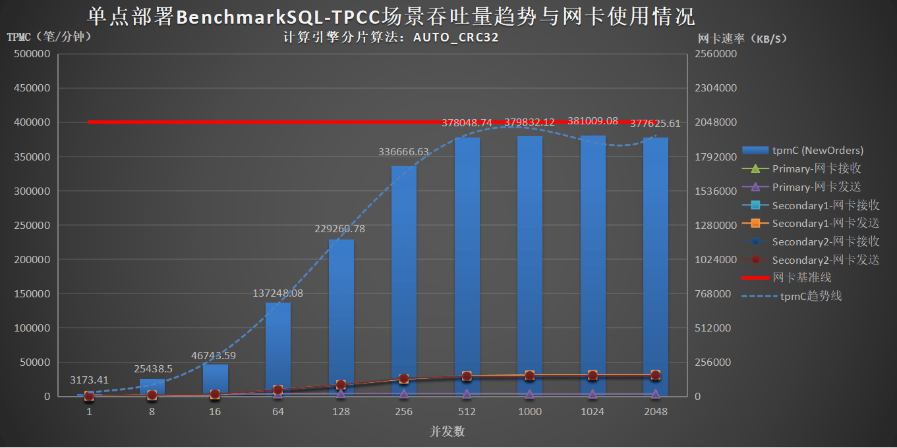

根据图表可知，单点部署架构下：

- 1台压力机使用lvs负载均衡方式压测BenchmarkSQL-TPCC场景中，计算引擎在1024并发时tpmC (NewOrders)达到最大值381009.08笔/分钟，后续开始缓慢下降；

- 各服务器CPU和网卡使用率均低于80%。

#### 使用jdbc:loadbalance负载均衡

| 用例编号     | T1-2                                                         |
| ------------ | ------------------------------------------------------------ |
| **测试目标** | 测试计算引擎在该场景下的tpmC，CPU使用率，网络使用情况        |
| **场景说明** | 1台压力机，启动1个压力进程，使用jdbc:loadbalance负载均衡方式，执行1/8/16/64/128/256/512/1000/1024/2048并发下模拟在线联机交易的场景 |
| **测试步骤** | 1. 在可视化管理平台创建表对象，表采用AUTO_MOD分片策略，分别测试表分布3个数据节点和9个数据节点的情况<br />2. 执行`./runDatabaseBuild.sh prop.mysql`命令创建表结构及造数<br />3. 预置1000仓测试数据<br />4. 执行`./runBenchmark.sh prop.mysql`命令进行压测<br />5. 分别发起1/8/16/64/128/256/512/1000/1024/2048并发的2分钟压力测试6. 记录测试完毕后测试工具输出的数据 |
| **测试脚本** | `runBenchmark.sh`                                            |

**测试结果**

| 数据节点数量 | 3                    | 9                    | 事务成功率 |
| ------------ | -------------------- | -------------------- | ---------- |
| **并发数**   | **tpmC (NewOrders)** | **tpmC (NewOrders)** | ^          |
| 1            | 4503.23              | 4527.84              | 100.00%    |
| 8            | 36665.94             | 36061.59             | 100.00%    |
| 16           | 71031.38             | 70684.45             | 100.00%    |
| 64           | 248096.90            | 249996.91            | 100.00%    |
| 128          | 424766.53            | 431716.77            | 100.00%    |
| 256          | 530228.57            | 533243.03            | 100.00%    |
| 512          | 530417.98            | 533773.71            | 100.00%    |
| 1000         | 518780.00            | 528717.15            | 100.00%    |
| 1024         | 521426.44            | 528376.86            | 100.00%    |
| 2048         | 422602.41            | 502111.52            | 100.00%    |

> **Note**
>
> 重点关注tpmC，暂未收集统计服务器资源使用情况数据，仅在测试过程中监视，其中存储节点服务器10.10.0.202/203/204的CPU使用率均已超过80%。


根据对比数据可知，单点部署架构下：

- 1台压力机使用`jdbc:loadbalance`负载均衡方式压测BenchmarkSQL-TPCC场景中，测试表分布3个数据节点时计算引擎在512并发下tpmC (NewOrders)达到最大值530417.98笔/分钟；

- 测试表分布9个数据节点时计算引擎在512并发下tpmC (NewOrders)达到最大值533773.71笔/分钟；

- 在存储节点服务器CPU使用率已超过80%的情况下，增加数据节点的数量对性能的提升不明显。

### 混合部署

#### 三台CPU核数最多的服务器混合部署

| 用例编号     | T2-1                                                         |
| ------------ | ------------------------------------------------------------ |
| **测试目标** | 测试计算引擎在该场景下的tpmC，CPU使用率，网络使用情况        |
| **场景说明** | 1台压力机，启动1个压力进程，使用lvs负载均衡方式，执行1/8/16/64/128/256/512/1000/1024/2048并发压测模拟在线联机交易的场景 |
| **测试步骤** | 1. 在可视化管理平台创建表对象，测试表采用AUTO_CRC32分片，分布9个数据节点<br />2. 执行`./runDatabaseBuild.sh prop.mysql`命令创建表结构及造数<br />3. 预置1000仓测试数据<br />4. 执行`./runBenchmark.sh prop.mysql`命令进行压测<br />5. 1台压力机发起1/8/16/64/128/256/512/1000/1024/2048并发的2分钟压力测试<br />6. 记录测试完毕后测试工具输出的数据 |
| **测试脚本** | `runBenchmark.sh`                                            |

**测试结果**

| 并发数 | tpmC (NewOrders) | 事务成功率 |
| ------ | ---------------- | ---------- |
| 1      | 3474.94          | 100.00%    |
| 8      | 24841.59         | 100.00%    |
| 16     | 46869.65         | 100.00%    |
| 64     | 160552.20        | 100.00%    |
| 128    | 224225.30        | 100.00%    |
| 256    | 277017.24        | 100.00%    |
| 512    | 199374.95        | 100.00%    |
| 1000   | 194766.88        | 100.00%    |
| 1024   | 147466.15        | 100.00%    |
| 2048   | 198215.11        | 100.00%    |

> **Note**
>
> 重点关注tpmC，暂未收集统计服务器资源使用情况数据，仅在测试过程中监视，其中服务器10.10.0.207/208的硬盘使用率达到100%，服务器10.10.0.207的await数值远大于svctm数值，经排查，该服务器硬盘性能较差。

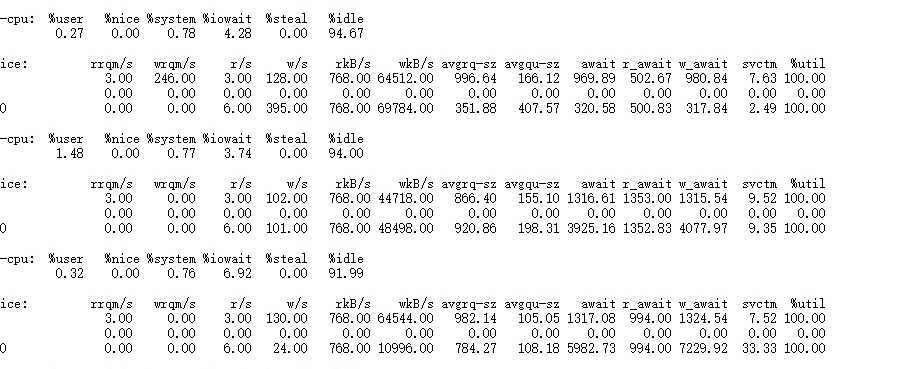

根据数据可知，三台CPU核数最多的服务器混合部署架构下：

- 1台压力机使用lvs负载均衡方式压测BenchmarkSQL-TPCC场景中，计算引擎在256并发时tpmC (NewOrders)达到最大值277017.24笔/分钟，后续开始下降；

- 在服务器硬盘性能较差产生明显性能瓶颈的情况下，无法发挥CPU核数最多的服务器的优势。

  ### 三台内存最多的服务器混合部署

| 用例编号     | T2-2                                                         |
| ------------ | ------------------------------------------------------------ |
| **测试目标** | 测试计算引擎在该场景下的tpmC，CPU使用率，网络使用情况        |
| **场景说明** | 1台压力机，启动1个压力进程，分别测试使用lvs负载均衡方式和使用`jdbc:loadbalance`负载均衡方式，执行1/8/16/64/128/256/512/1000/1024/2048并发压测模拟在线联机交易的场景 |
| **测试步骤** | 1. 在可视化管理平台创建表对象，测试表分别采用AUTO_CRC32分片和AUTO_MOD分片，分别测试表分布3个数据节点、9个数据节点、18个数据节点、27个数据节点<br />2. 执行`./runDatabaseBuild.sh prop.mysql`命令创建表结构及造数<br />3. 预置1000仓测试数据<br />4. 修改`prop.mysql`配置文件，分别测试使用lvs负载均衡和使用`jdbc:loadbalance`负载均衡，执行`./runBenchmark.sh prop.mysql`命令进行压测<br />5. 1台压力机发起1/8/16/64/128/256/512/1000/1024/2048并发的2分钟压力测试<br />6. 记录测试完毕后测试工具输出的数据 |
| **测试脚本** | `runBenchmark.sh`                                            |

**测试结果**

| 负载均衡方式     | lvs                  | <                    | jdbc:loadbalance     | <                    | <                    | 事务成功率 |
| ---------------- | -------------------- | -------------------- | -------------------- | -------------------- | -------------------- | ---------- |
| **分片算法**     | **AUTO_CRC32**       | <                    | **AUTO_MOD**         | <                    | <                    | ^          |
| **数据节点数量** | **9**                | **3**                | **9**                | **18**               | **27**               | ^          |
| **并发数**       | **tpmC (NewOrders)** | **tpmC (NewOrders)** | **tpmC (NewOrders)** | **tpmC (NewOrders)** | **tpmC (NewOrders)** | ^          |
| 1                | 3048.96              | 4358.70              | 4491.08              | 4372.74              | 4421.02              | 100.00%    |
| 8                | 23202.36             | 33510.06             | 33506.47             | 33896.61             | 33429.08             | 100.00%    |
| 16               | 43099.55             | 64155.23             | 62297.48             | 64117.19             | 63035.81             | 100.00%    |
| 64               | 148972.20            | 204498.44            | 203411.56            | 204249.33            | 203963.21            | 100.00%    |
| 128              | 247990.44            | 325021.82            | 318865.39            | 324622.22            | 320359.07            | 100.00%    |
| 256              | 298203.74            | 412318.31            | 406870.70            | 409034.30            | 403216.95            | 100.00%    |
| 512              | 332978.56            | 439923.73            | 428798.76            | 434462.73            | 430602.55            | 100.00%    |
| 1000             | 335847.14            | 407398.83            | 392548.93            | 416019.10            | 405160.49            | 100.00%    |
| 1024             | 334769.07            | 407226.76            | 393970.23            | 414712.06            | 397346.25            | 100.00%    |
| 2048             | 351671.34            | 341952.57            | 374472.51            | 386034.45            | 364853.63            | 100.00%    |

> **Note**
>
> 重点关注tpmC，暂未收集统计服务器资源使用情况数据，仅在测试过程中监视，其中服务器10.10.0.202/203/204的CPU使用率均已超过80%。

根据对比数据可知，三台内存最多的服务器混合部署架构下：

- 1台压力机使用lvs负载均衡方式压测BenchmarkSQL-TPCC场景中，测试表采用AUTO_CRC32分片，分布9个数据节点时计算引擎在2048并发下tpmC (NewOrders)达到最大值351671.34笔/分钟；

- 1台压力机使用lvs负载均衡方式压测BenchmarkSQL-TPCC场景中，测试表采用AUTO_CRC32分片，分布3个数据节点时计算引擎在512并发下tpmC (NewOrders)达到最大值439923.73笔/分钟；

- 1台压力机使用jdbc:loadbalance负载均衡方式压测BenchmarkSQL-TPCC场景中，测试表均采用AUTO_MOD分片，分布9个数据节点时计算引擎在512并发下tpmC (NewOrders)达到最大值428798.76笔/分钟；

- 1台压力机使用jdbc:loadbalance负载均衡方式压测BenchmarkSQL-TPCC场景中，测试表均采用AUTO_MOD分片，分布18个数据节点时计算引擎在512并发下tpmC (NewOrders)达到最大值434462.73笔/分钟；

- 1台压力机使用jdbc:loadbalance负载均衡方式压测BenchmarkSQL-TPCC场景中，测试表均采用AUTO_MOD分片，分布27个数据节点时计算引擎在512并发下tpmC (NewOrders)达到最大值430602.55笔/分钟；

- 在服务器CPU使用率已超过80%的情况下，AUOT_CRC32分片和AUTO_MOD分片的性能差异较小，经测试验证，AUTO_MOD分片可使数据分布更加均匀；

- 在服务器CPU使用率已超过80%的情况下，增加数据节点的数量对性能的提升不明显。

#### 六台服务器混合部署（调整数据节点数量）

| 用例编号     | T2-3                                                         |
| ------------ | ------------------------------------------------------------ |
| **测试目标** | 测试计算引擎在该场景下的tpmC，CPU使用率，网络使用情况        |
| **场景说明** | 1台压力机，启动1个压力进程，使用`jdbc:loadbalance`负载均衡方式，执行1/8/16/64/128/256/512/1000/1024/2048并发压测模拟在线联机交易的场景 |
| **测试步骤** | 1. 在可视化管理平台创建表对象，测试表AUTO_MOD分片，分别测试表分布3个数据节点、9个数据节点、15个数据节点、18个数据节点<br />2. 执行`./runDatabaseBuild.sh prop.mysql`命令创建表结构及造数<br />3. 预置1000仓测试数据<br />4. 修改prop.mysql配置文件，使用jdbc:loadbalance负载均衡方式，执行`./runBenchmark.sh prop.mysql`命令进行压测<br />5. 1台压力机发起1/8/16/64/128/256/512/1000/1024/2048并发的2分钟压力测试<br >6. 记录测试完毕后测试工具输出的数据 |
| **测试脚本** | `runBenchmark.sh`                                            |

**测试结果**

| **数据节点数量** | **3**                | **9**                | **15**               | **18**               | **事务成功率** |
| ---------------------- | -------------------------- | -------------------------- | -------------------------- | -------------------------- | -------------------- |
| **并发数**       | **tpmC (NewOrders)** | **tpmC (NewOrders)** | **tpmC (NewOrders)** | **tpmC (NewOrders)** |                      |
| 1                      | 4272.07                    | 4710.84                    | 4495.35                    | 4437.81                    | 100.00%              |
| 8                      | 34986.20                   | 36347.32                   | 36432.64                   | 35680.06                   | 100.00%              |
| 16                     | 68950.53                   | 70041.99                   | 70111.81                   | 68980.50                   | 100.00%              |
| 64                     | 235286.72                  | 238627.06                  | 238259.42                  | 238081.88                  | 100.00%              |
| 128                    | 396680.80                  | 402127.89                  | 406525.59                  | 406311.60                  | 100.00%              |
| 256                    | 545666.54                  | 556434.04                  | 577444.46                  | 575546.96                  | 100.00%              |
| 512                    | 577041.58                  | 589523.72                  | 593150.92                  | 593461.05                  | 100.00%              |
| 1000                   | 496489.38                  | 584540.09                  | 585288.47                  | 584742.08                  | 100.00%              |
| 1024                   | 484917.41                  | 582903.57                  | 579992.51                  | 581613.17                  | 100.00%              |
| 2048                   | 376530.30                  | 556789.56                  | 556245.77                  | 559680.19                  | 100.00%              |

> **Note**
>
> 重点关注tpmC，暂未收集统计服务器资源使用情况数据，仅在测试过程中监视，其中服务器10.10.0.202/203/204的CPU使用率均已超过80%。

根据对比数据可知，五台服务器混合部署架构下：

- 1台压力机使用jdbc:loadbalance负载均衡方式压测BenchmarkSQL-TPCC场景中，测试表采用AUTO_MOD分片，分布3个数据节点时计算引擎在512并发下tpmC (NewOrders)达到最大值577041.58笔/分钟；

- 1台压力机使用jdbc:loadbalance负载均衡方式压测BenchmarkSQL-TPCC场景中，测试表采用AUTO_MOD分片，分布9个数据节点时计算引擎在512并发下tpmC (NewOrders)达到最大值589523.72笔/分钟；

- 1台压力机使用jdbc:loadbalance负载均衡方式压测BenchmarkSQL-TPCC场景中，测试表采用AUTO_MOD分片，分布15个数据节点时计算引擎在512并发下tpmC (NewOrders)达到最大值593150.92笔/分钟；

- 1台压力机使用jdbc:loadbalance负载均衡方式压测BenchmarkSQL-TPCC场景中，测试表采用AUTO_MOD分片，分布18个数据节点时计算引擎在512并发下tpmC (NewOrders)达到最大值593461.05笔/分钟；

- 在HotDB集群内存在服务器CPU使用率已超过80%的情况下，增加数据节点的数量对性能的提升不明显。

#### 六台服务器混合部署（调整垃圾回收器和jvm）

| 用例编号 | T2-4                                                         |
| ------------------ | ------------------------------------------------------------ |
| **测试目标** | 测试计算引擎在该场景下的tpmC，CPU使用率，网络使用情况        |
| **场景说明** | 1台压力机，启动1个压力进程，使用`jdbc:loadbalance`负载均衡方式，执行1/8/16/64/128/256/512/1000/1024/2048并发压测模拟在线联机交易的场景 |
| **测试步骤** | 1. 在可视化管理平台创建表对象，测试表AUTO_MOD分片，分布18个数据节点，分别测试计算节点使用ZGC 8G和16G，使用G1 8G和16G的情况<br />2. 执行`./runDatabaseBuild.sh prop.mysql`命令创建表结构及造数<br />3. 预置1000仓测试数据<br />4. 修改`prop.mysql`配置文件，使用`jdbc:loadbalance`负载均衡方式，执行`./runBenchmark.sh prop.mysql`命令进行压测<br />5. 1台压力机发起1/8/16/64/128/256/512/1000/1024/2048并发的2分钟压力测试<br />6. 记录测试完毕后测试工具输出的数据 |
| **测试脚本** | `runBenchmark.sh`                                            |

**测试结果**

| **数据节点数量** | **18**               |      <  |<                            |       <                     |    **事务成功率**     |
| ---------------------- | -------------------------- | -------------------------- | -------------------------- | -------------------------- | ------- |
| **垃圾回收器**   | **ZGC**              |    <           |        **G1**                     |         <                   |     ^    |
| **jvm大小**      | **8G**               | **16G**              | **8G**               | **16G**              |      ^   |
| **并发数**       | **tpmC (NewOrders)** | **tpmC (NewOrders)** | **tpmC (NewOrders)** | **tpmC (NewOrders)** |     ^    |
| 1                      | 4748.80                    | 4437.81                    | 4457.27                    | 4387.81                    | 100.00% |
| 8                      | 36776.24                   | 35680.06                   | 37169.49                   | 36012.39                   | 100.00% |
| 16                     | 70474.31                   | 68980.50                   | 71317.11                   | 70663.63                   | 100.00% |
| 64                     | 238646.79                  | 238081.88                  | 240759.77                  | 234460.29                  | 100.00% |
| 128                    | 410577.89                  | 406311.60                  | 407273.46                  | 412112.47                  | 100.00% |
| 256                    | 576042.78                  | 575546.96                  | 575523.71                  | 575456.43                  | 100.00% |
| 512                    | 591271.67                  | 593461.05                  | 589003.42                  | 591713.69                  | 100.00% |
| 1000                   | 579150.29                  | 584742.08                  | 580919.48                  | 581190.34                  | 100.00% |
| 1024                   | 581203.64                  | 581613.17                  | 581743.53                  | 582597.11                  | 100.00% |
| 2048                   | 556128.50                  | 559680.19                  | 559023.03                  | 556260.64                  | 100.00% |

> **Note**
>
> 重点关注tpmC，暂未收集统计服务器资源使用情况数据，仅在测试过程中监视，其中服务器10.10.0.202/203/204的CPU使用率均已超过80%。

根据对比数据可知，五台服务器混合部署架构下：

- 1台压力机使用jdbc:loadbalance负载均衡方式压测BenchmarkSQL-TPCC场景中，测试表采用AUTO_MOD分片，分布18个数据节点，使用ZGC垃圾回收器和jvm大小8G时计算引擎在512并发下tpmC (NewOrders)达到最大值591271.67笔/分钟；

- 1台压力机使用jdbc:loadbalance负载均衡方式压测BenchmarkSQL-TPCC场景中，测试表采用AUTO_MOD分片，分布18个数据节点，使用ZGC垃圾回收器和jvm大小16G时计算引擎在512并发下tpmC (NewOrders)达到最大值593461.05笔/分钟；

- 1台压力机使用jdbc:loadbalance负载均衡方式压测BenchmarkSQL-TPCC场景中，测试表采用AUTO_MOD分片，分布18个数据节点，使用G1垃圾回收器和jvm大小8G时计算引擎在512并发下tpmC (NewOrders)达到最大值589003.42笔/分钟；

- 1台压力机使用jdbc:loadbalance负载均衡方式压测BenchmarkSQL-TPCC场景中，测试表采用AUTO_MOD分片，分布18个数据节点，使用G1垃圾回收器和jvm大小16G时计算引擎在512并发下tpmC (NewOrders)达到最大值591713.69笔/分钟；

- HotDB集群内存在服务器CPU使用率已超过80%的情况下，调整计算节点的垃圾回收器和jvm大小对性能的提升不明显。

#### 两台压力机各启动一个压力进程同时压测五台服务器混合部署（分开压测）

| **用例编号** | T2-5                                                         |
| ------------------ | ------------------------------------------------------------ |
| **测试目标** | 测试计算引擎在该场景下的tpmC，CPU使用率，网络使用情况        |
| **场景说明** | 2台压力机，各启动1个压力进程，使用jdbc:loadbalance负载均衡方式，执行1/8/16/64/128/256/512/1000/1024/2048并发压测模拟在线联机交易的场景 |
| **测试步骤** | 1. 在可视化管理平台创建表对象，测试表AUTO_MOD分片，分布18个数据节点，分别测试压力机10.10.0.201压测HotDB集群10.10.0.208/209计算节点、压力机10.10.0.206压测HotDB集群10.10.0.202/203/204计算节点，与压力机10.10.0.206压测HotDB集群10.10.0.208/209计算节点、压力机10.10.0.201压测HotDB集群10.10.0.202/203/204计算节点的情况<br />2. 执行`./runDatabaseBuild.sh prop.mysql`命令创建表结构及造数<br />3. 预置1000仓测试数据<br />4. 修改prop.mysql配置文件，使用`jdbc:loadbalance`负载均衡方式，执行`./runBenchmark.sh prop.mysql`命令进行压测<br />5. 2台压力机同时发起1/8/16/64/128/256/512/1000/1024/2048并发的2分钟压力测试<br />6. 记录测试完毕后测试工具输出的数据 |
| **测试脚本** | `runBenchmark.sh`                                            |

**测试结果**

| **压力机分配**         | **201压测208/209**   | **206压测202/203/204** | **总tpmC (NewOrders)** | **201压测202/203/204** | **206压测208/209**   | **总tpmC (NewOrders)** |
| ---------------------------- | -------------------------- | ---------------------------- | ---------------------------- | ---------------------------- | -------------------------- | ---------------------------- |
| **各压力机上的并发数** | **tpmC (NewOrders)** | **tpmC (NewOrders)**   | ^                            | **tpmC (NewOrders)**   | **tpmC (NewOrders)** | ^                            |
| 1                            | 4352.35                    | 3322.91                      | 7675.26                      | 4309.85                      | 3167.63                    | 7477.48                      |
| 8                            | 33604.67                   | 23121.52                     | 56726.19                     | 33667.19                     | 22672.26                   | 56339.45                     |
| 16                           | 65166.96                   | 39040.54                     | 104207.50                    | 62779.89                     | 38679.04                   | 101458.93                    |
| 64                           | 209125.18                  | 174458.26                    | 383583.44                    | 196999.55                    | 190576.68                  | 387576.23                    |
| 128                          | 337215.71                  | 301807.96                    | 639023.67                    | 292942.49                    | 341380.72                  | 634323.21                    |
| 256                          | 460415.49                  | 357844.61                    | 818260.10                    | 339421.34                    | 490393.53                  | 829814.87                    |
| 512                          | 480465.01                  | 389918.6                     | 870383.61                    | 359066.36                    | 570863.43                  | 929929.79                    |
| 1000                         | 476357.69                  | 364401.29                    | 840758.98                    | 335917.45                    | 585301.49                  | 921218.94                    |
| 1024                         | 473528.88                  | 374979.80                    | 848508.68                    | 330385.68                    | 588953.90                  | 919339.58                    |
| 2048                         | 461280.59                  | 330449.03                    | 791729.62                    | 311537.90                    | 550193.32                  | 861731.22                    |

> **Note**
>
> 重点关注tpmC，暂未收集统计服务器资源使用情况数据，仅在测试过程中监视，其中服务器10.10.0.202/203/204的CPU使用率均已超过80%。

根据对比数据可知，两台压力机各启动一个压力进程同时压测五台服务器混合部署架构下：

- 2台压力机使用`jdbc:loadbalance`负载均衡方式压测BenchmarkSQL-TPCC场景中，测试表采用AUTO_MOD分片，分布18个数据节点，压力机10.10.0.201压测HotDB集群10.10.0.208/209计算节点、压力机10.10.0.206压测HotDB集群10.10.0.202/203/204计算节点时计算引擎在各压力机上512并发下总tpmC (NewOrders)达到最大值870383.61笔/分钟；

- 2台压力机使用`jdbc:loadbalance`负载均衡方式压测BenchmarkSQL-TPCC场景中，测试表采用AUTO_MOD分片，分布18个数据节点，压力机10.10.0.206压测HotDB集群10.10.0.208/209计算节点、压力机10.10.0.201压测HotDB集群10.10.0.202/203/204计算节点时计算引擎在各压力机上512并发下总tpmC (NewOrders)达到最大值929929.79笔/分钟；

- HotDB集群内服务器208/209的CPU核数均为112，服务器202/203/204的CPU核数均为56，压力机10.10.0.206的CPU核数为64，主频为2.40GHz，而压力机10.10.0.201的CPU核数为56，主频为2.00GHz，由于206的CPU性能高于201，在调换位置后由206压测208/209后能取得更高的总tpmC值；

#### 两台压力机各启动一个压力进程同时压测六台服务器混合部署（集中压测）

| 用例编号 | T2-6                                                         |
| ------------------ | ------------------------------------------------------------ |
| **测试目标** | 测试计算引擎在该场景下的tpmC，CPU使用率，网络使用情况        |
| **场景说明** | 2台压力机，各启动1个压力进程，分别使用`jdbc:loadbalance`负载均衡方式，同时执行1/8/16/64/128/256/512/1000/1024/2048并发压测模拟在线联机交易的场景 |
| **测试步骤** | 1. 在可视化管理平台创建表对象，测试表采用AUTO_MOD分片，分布18个数据节点<br />2. 执行`./runDatabaseBuild.sh prop.mysql`命令创建表结构及造数<br />3. 预置1000仓测试数据<br />4. 修改`prop.mysql`配置文件，使用`jdbc:loadbalance`进行负载均衡，2台压力机同时执行`./runBenchmark.sh prop.mysql`命令进行集中压测<br />5. 2台压力机同时发起1/8/16/64/128/256/512/1000/1024/2048并发的2分钟压力测试<br />6. 记录测试完毕后测试工具输出的数据 |
| **测试脚本** | `runBenchmark.sh`                                            |

**测试结果**

| **各压力机上的并发数** | **压力机10.10.0.201的tpmC (NewOrders)** | **压力机10.10.0.206的tpmC (NewOrders)** | **总tpmC (NewOrders)** | **事务成功率** |
| -------------------------------------- | --------------------------------------------- | --------------------------------------------- | ---------------------------- | -------------------- |
| 1                                      | 4545.39                                       | 3213.78                                       | 7759.17                      | 100.00%              |
| 8                                      | 34787.60                                      | 24434.53                                      | 59222.13                     | 100.00%              |
| 16                                     | 66633.56                                      | 42311.69                                      | 108945.25                    | 100.00%              |
| 64                                     | 211110.72                                     | 175105.37                                     | 386216.09                    | 100.00%              |
| 128                                    | 318054.83                                     | 313675.97                                     | 631730.80                    | 100.00%              |
| 256                                    | 375089.44                                     | 379518.30                                     | 754607.74                    | 100.00%              |
| 512                                    | 389282.90                                     | 392331.67                                     | 781614.57                    | 100.00%              |
| 1000                                   | 352687.26                                     | 337962.74                                     | 690650.00                    | 100.00%              |
| 1024                                   | 350780.65                                     | 333181.64                                     | 683962.29                    | 100.00%              |
| 2048                                   | 358443.19                                     | 322081.75                                     | 680524.94                    | 100.00%              |

> **Note**
>
> 重点关注tpmC，暂未收集统计服务器资源使用情况数据，仅在测试过程中监视，其中服务器10.10.0.202/203/204的CPU使用率均已超过80%。

根据数据可知，两台压力机各启动一个压力进程同时集中压测六台服务器混合部署架构下：

- 2台压力机使用jdbc:loadbalance负载均衡方式同时集中压测BenchmarkSQL-TPCC场景中，计算引擎在各压力机上512并发时总tpmC (NewOrders)达到最大值781614.57笔/分钟，后续开始缓慢下降；

- 在HotDB集群内存在服务器CPU使用率已超过80%的情况下，增加并发数对性能的提升不明显，反而会逐渐下降。

#### 两台压力机各启动一个压力进程同时压测六台服务器混合部署（分开压测）

| 用例编号 | T2-7                                                         |
| ------------------ | ------------------------------------------------------------ |
| **测试目标** | 测试计算引擎在该场景下的tpmC，CPU使用率，网络使用情况        |
| **场景说明** | 2台压力机，各启动1个压力进程，分别使用`jdbc:loadbalance`负载均衡方式，同时执行1/8/16/64/128/256/512/1000/1024/2048并发压测模拟在线联机交易的场景 |
| **测试步骤** | 1. 在可视化管理平台创建表对象，测试表采用AUTO_MOD分片，分布22个数据节点<br />2. 执行`./runDatabaseBuild.sh prop.mysql`命令创建表结构及造数<br />3. 预置1000仓测试数据<br />4. 修改`prop.mysql`配置文件，使用`jdbc:loadbalance`进行负载均衡，1台压力机压测集群内4个计算节点，另外1台压力机压测集群内剩下2个计算节点，2台压力机同时执行`./runBenchmark.sh prop.mysql`命令进行分开压测<br />5. 2台压力机同时发起1/8/16/64/128/256/512/1000/1024/2048并发的2分钟压力测试<br />6. 记录测试完毕后测试工具输出的数据 |
| **测试脚本** | `runBenchmark.sh`                                            |

**测试结果**

| **各压力机上的并发数** | **压力机10.10.0.206的tpmC (NewOrders)** | **压力机10.10.0.207的tpmC (NewOrders)** | **总tpmC (NewOrders)** | **事务成功率** |
| -------------------------------------- | --------------------------------------------- | --------------------------------------------- | ---------------------------- | -------------------- |
| 1                                      | 3007.92                                       | 4301.49                                       | 7309.41                      | 100.00%              |
| 8                                      | 21744.06                                      | 33902.97                                      | 55647.03                     | 100.00%              |
| 16                                     | 38203.22                                      | 65058.86                                      | 103262.08                    | 100.00%              |
| 64                                     | 167077.53                                     | 222160.63                                     | 389238.16                    | 100.00%              |
| 128                                    | 290067.04                                     | 360245.37                                     | 650312.41                    | 100.00%              |
| 256                                    | 364389.42                                     | 512585.78                                     | 876975.20                    | 100.00%              |
| 512                                    | 396330.43                                     | 596827.41                                     | 993157.84                    | 100.00%              |
| 1000                                   | 439416.62                                     | 619561.89                                     | 1058978.51                   | 100.00%              |
| 1024                                   | 443768.12                                     | 598804.47                                     | 1042572.59                   | 100.00%              |
| 2048                                   | 404805.96                                     | 604240.15                                     | 1009046.11                   | 100.00%              |

**各服务器硬件资源使用情况**

| **各压力机上的并发数** | **服务器用途**    | **服务器IP** | **CPU使用率** | **网卡接收速率** | **网卡发送速率** |
| ---------------------- | ----------------- | ------------ | ------------- | ---------------- | ---------------- |
| 1                      | 计算节点+存储节点 | 10.10.0.201  | 1%            | 637KB/S          | 628KB/S          |
| ^                      | ^                 | 10.10.0.202  | 1%            | 711KB/S          | 725KB/S          |
| ^                      | ^                 | 10.10.0.203  | 1%            | 1395KB/S         | 3483KB/S         |
| ^                      | ^                 | 10.10.0.204  | 1%            | 702KB/S          | 1763KB/S         |
| ^                      | ^                 | 10.10.0.208  | 1%            | 2393KB/S         | 2393KB/S         |
| ^                      | ^                 | 10.10.0.209  | 1%            | 1663KB/S         | 1692KB/S         |
| ^                      | 压力机            | 10.10.0.206  | 1%            | 1886KB/S         | 756KB/S          |
| ^                      | ^                 | 10.10.0.207  | 1%            | 3171KB/S         | 1073KB/S         |
| 8                      | 计算节点+存储节点 | 10.10.0.201  | 5%            | 6015KB/S         | 9817KB/S         |
| ^                      | ^                 | 10.10.0.202  | 3%            | 6262KB/S         | 9719KB/S         |
| ^                      | ^                 | 10.10.0.203  | 4%            | 5521KB/S         | 10240KB/S        |
| ^                      | ^                 | 10.10.0.204  | 2%            | 5024KB/S         | 6658KB/S         |
| ^                      | ^                 | 10.10.0.208  | 2%            | 14336KB/S        | 15360KB/S        |
| ^                      | ^                 | 10.10.0.209  | 2%            | 12288KB/S        | 15360KB/S        |
| ^                      | 压力机            | 10.10.0.206  | 2%            | 13312KB/S        | 5426KB/S         |
| ^                      | ^                 | 10.10.0.207  | 1%            | 20480KB/S        | 9342KB/S         |
| 16                     | 计算节点+存储节点 | 10.10.0.201  | 11%           | 13312KB/S        | 23552KB/S        |
| ^                      | ^                 | 10.10.0.202  | 3%            | 7515KB/S         | 11264KB/S        |
| ^                      | ^                 | 10.10.0.203  | 5%            | 10240KB/S        | 17408KB/S        |
| ^                      | ^                 | 10.10.0.204  | 6%            | 12288KB/S        | 20480KB/S        |
| ^                      | ^                 | 10.10.0.208  | 3%            | 28672KB/S        | 29696KB/S        |
| ^                      | ^                 | 10.10.0.209  | 3%            | 26624KB/S        | 29696KB/S        |
| ^                      | 压力机            | 10.10.0.206  | 3%            | 21504KB/S        | 9565KB/S         |
| ^                      | ^                 | 10.10.0.207  | 1%            | 38912KB/S        | 18432KB/S        |
| 64                     | 计算节点+存储节点 | 10.10.0.201  | 22%           | 43008KB/S        | 56320KB/S        |
| ^                      | ^                 | 10.10.0.202  | 20%           | 39936KB/S        | 59392KB/S        |
| ^                      | ^                 | 10.10.0.203  | 24%           | 39936KB/S        | 64512KB/S        |
| ^                      | ^                 | 10.10.0.204  | 31%           | 49152KB/S        | 82944KB/S        |
| ^                      | ^                 | 10.10.0.208  | 15%           | 90112KB/S        | 109568KB/S       |
| ^                      | ^                 | 10.10.0.209  | 15%           | 96256KB/S        | 113664KB/S       |
| ^                      | 压力机            | 10.10.0.206  | 8%            | 96256KB/S        | 41984KB/S        |
| ^                      | ^                 | 10.10.0.207  | 5%            | 134144KB/S       | 61440KB/S        |
| 128                    | 计算节点+存储节点 | 10.10.0.201  | 71%           | 75776KB/S        | 113664KB/S       |
| ^                      | ^                 | 10.10.0.202  | 41%           | 71680KB/S        | 105472KB/S       |
| ^                      | ^                 | 10.10.0.203  | 46%           | 74752KB/S        | 114688KB/S       |
| ^                      | ^                 | 10.10.0.204  | 46%           | 74752KB/S        | 114688KB/S       |
| ^                      | ^                 | 10.10.0.208  | 30%           | 150528KB/S       | 184320KB/S       |
| ^                      | ^                 | 10.10.0.209  | 27%           | 147456KB/S       | 179200KB/S       |
| ^                      | 压力机            | 10.10.0.206  | 10%           | 171008KB/S       | 73728KB/S        |
| ^                      | ^                 | 10.10.0.207  | 9%            | 222208KB/S       | 99328KB/S        |
| 256                    | 计算节点+存储节点 | 10.10.0.201  | 82%           | 89088KB/S        | 130048KB/S       |
| ^                      | ^                 | 10.10.0.202  | 67%           | 89088KB/S        | 141312KB/S       |
| ^                      | ^                 | 10.10.0.203  | 66%           | 96256KB/S        | 147456KB/S       |
| ^                      | ^                 | 10.10.0.204  | 70%           | 101376KB/S       | 153600KB/S       |
| ^                      | ^                 | 10.10.0.208  | 46%           | 212992KB/S       | 248832KB/S       |
| ^                      | ^                 | 10.10.0.209  | 53%           | 206848KB/S       | 242688KB/S       |
| ^                      | 压力机            | 10.10.0.206  | 16%           | 198656KB/S       | 90112KB/S        |
| ^                      | ^                 | 10.10.0.207  | 15%           | 305152KB/S       | 145408KB/S       |
| 512                    | 计算节点+存储节点 | 10.10.0.201  | 87%           | 98304KB/S        | 144384KB/S       |
| ^                      | ^                 | 10.10.0.202  | 78%           | 106496KB/S       | 162816KB/S       |
| ^                      | ^                 | 10.10.0.203  | 78%           | 104448KB/S       | 163840KB/S       |
| ^                      | ^                 | 10.10.0.204  | 73%           | 108544KB/S       | 159744KB/S       |
| ^                      | ^                 | 10.10.0.208  | 63%           | 240640KB/S       | 284672KB/S       |
| ^                      | ^                 | 10.10.0.209  | 76%           | 240640KB/S       | 282624KB/S       |
| ^                      | 压力机            | 10.10.0.206  | 21%           | 221184KB/S       | 101376KB/S       |
| ^                      | ^                 | 10.10.0.207  | 18%           | 348160KB/S       | 167936KB/S       |
| 1000                   | 计算节点+存储节点 | 10.10.0.201  | 90%           | 112640KB/S       | 157696KB/S       |
| ^                      | ^                 | 10.10.0.202  | 92%           | 118784KB/S       | 180224KB/S       |
| ^                      | ^                 | 10.10.0.203  | 86%           | 113664KB/S       | 171008KB/S       |
| ^                      | ^                 | 10.10.0.204  | 89%           | 116736KB/S       | 173056KB/S       |
| ^                      | ^                 | 10.10.0.208  | 72%           | 247808KB/S       | 293888KB/S       |
| ^                      | ^                 | 10.10.0.209  | 80%           | 242688KB/S       | 288768KB/S       |
| ^                      | 压力机            | 10.10.0.206  | 31%           | 244736KB/S       | 113664KB/S       |
| ^                      | ^                 | 10.10.0.207  | 19%           | 350208KB/S       | 173056KB/S       |
| 1024                   | 计算节点+存储节点 | 10.10.0.201  | 92%           | 113664KB/S       | 161792KB/S       |
| ^                      | ^                 | 10.10.0.202  | 87%           | 114688KB/S       | 173056KB/S       |
| ^                      | ^                 | 10.10.0.203  | 90%           | 117760KB/S       | 179200KB/S       |
| ^                      | ^                 | 10.10.0.204  | 87%           | 117760KB/S       | 174080KB/S       |
| ^                      | ^                 | 10.10.0.208  | 70%           | 244736KB/S       | 293888KB/S       |
| ^                      | ^                 | 10.10.0.209  | 80%           | 238592KB/S       | 285696KB/S       |
| ^                      | 压力机            | 10.10.0.206  | 31%           | 260096KB/S       | 118784KB/S       |
| ^                      | ^                 | 10.10.0.207  | 19%           | 347136KB/S       | 166912KB/S       |
| 2048                   | 计算节点+存储节点 | 10.10.0.201  | 92%           | 106496KB/S       | 154624KB/S       |
| ^                      | ^                 | 10.10.0.202  | 91%           | 109568KB/S       | 166912KB/S       |
| ^                      | ^                 | 10.10.0.203  | 94%           | 110592KB/S       | 167936KB/S       |
| ^                      | ^                 | 10.10.0.204  | 93%           | 108544KB/S       | 165888KB/S       |
| ^                      | ^                 | 10.10.0.208  | 80%           | 241664KB/S       | 292864KB/S       |
| ^                      | ^                 | 10.10.0.209  | 81%           | 246784KB/S       | 291840KB/S       |
| ^                      | 压力机            | 10.10.0.206  | 45%           | 239616KB/S       | 107520KB/S       |
| ^                      | ^                 | 10.10.0.207  | 21%           | 356352KB/S       | 168960KB/S       |

**吞吐量趋势与CPU使用情况**

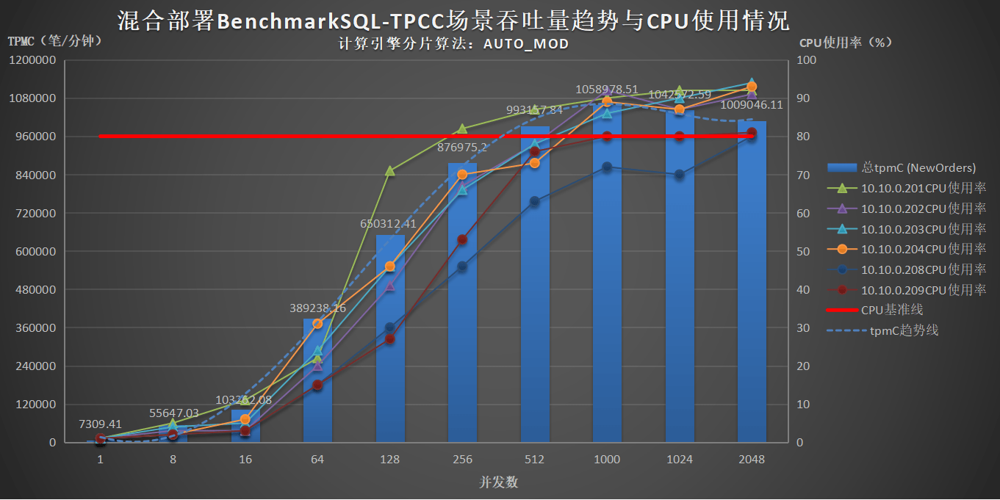

**吞吐量趋势与网卡使用情况**

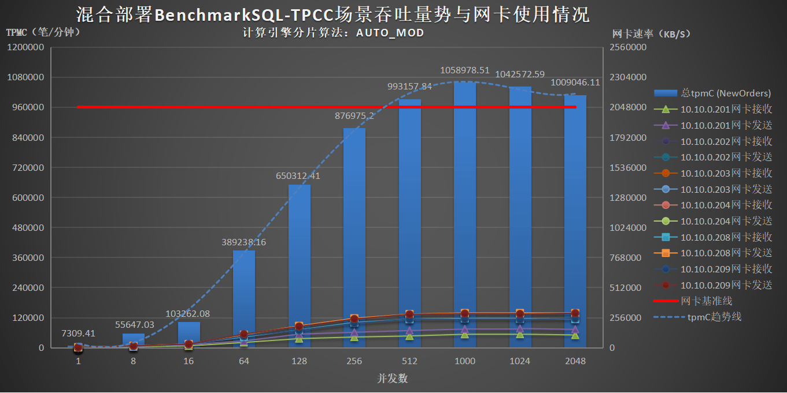

根据图表可知，两台压力机各启动一个压力进程同时分开压测六台服务器混合部署架构下：

- 2台压力机使用jdbc:loadbalance负载均衡方式同时分开压测BenchmarkSQL-TPCC场景中，计算引擎在各压力机上1000并发时总tpmC (NewOrders)达到最大值1058978.51笔/分钟，后续开始缓慢下降；

- 在256并发时服务器10.10.0.201的CPU使用率达到82%，在1000并发时服务器10.10.0.201,10.10.0.202,10.10.0.203,10.10.0.204的CPU使用率均超过80%，在2048并发时所有计算节点和存储节点服务器的CPU使用率均超过80%，最高达到94%。

- 在HotDB集群内存在服务器CPU使用率已超过80%的情况下，增加并发数对性能的提升不明显，反而会逐渐下降。

#### 两台压力机各启动两个压力进程同时压测六台服务器混合部署（分开压测不绑核）

| **用例编号** | T2-8                                                         |
| ------------------ | ------------------------------------------------------------ |
| **测试目标** | 测试计算引擎在该场景下的tpmC，CPU使用率，网络使用情况        |
| **场景说明** | 2台压力机，各启动2个压力进程，分别使用`jdbc:loadbalance`负载均衡方式，同时执行1/8/16/64/128/256/512/1000/1024/2048并发压测模拟在线联机交易的场景 |
| **测试步骤** | 1. 在可视化管理平台创建表对象，测试表采用AUTO_MOD分片，分别22个数据节点<br /> 2. 执行`./runDatabaseBuild.sh prop.mysql`命令创建表结构及造数<br /> 3. 预置1000仓测试数据<br /> 4. 修改prop.mysql配置文件，使用jdbc:loadbalance进行负载均衡，1台压力机上压力进程A压测集群内4个计算节点，压力进程B压测集群内剩下2个计算节点，另外1台压力机压力进程C压测集群内4个计算节点。压力进程D压测集群内剩下2个计算节点，2台压力机上共4个压力进程同时执行`./runBenchmark.sh prop.mysql`命令进行分开压测<br /> 5. 2台压力机共4个压力进程同时发起1/8/16/64/128/256/512/1000/1024/2048并发的2分钟压力测试<br /> 6. 记录测试完毕后测试工具输出的数据 |
| **测试脚本** | `runBenchmark.sh`                                              |

**测试结果**

| **压力机分配**                   | **10.10.0.206**      | <                          | **10.10.0.207**            | <                          | **总tpmC (NewOrders)** |
| -------------------------------------- | -------------------------- | -------------------------- | -------------------------- | -------------------------- | ---------------------------- |
| ^                                      | **压力进程A**        | **压力进程B**        | **压力进程C**        | **压力进程D**        | ^                            |
| **各压力机上的并发数** | **tpmC (NewOrders)** | **tpmC (NewOrders)** | **tpmC (NewOrders)** | **tpmC (NewOrders)** | ^                            |
| 1                                      | 3163.23                    | 3150.84                    | 3951.17                    | 4522.23                    | 14787.47                     |
| 8                                      | 18303.21                   | 18315.44                   | 31250.81                   | 32015.39                   | 99884.85                     |
| 16                                     | 36973.74                   | 35980.50                   | 61217.61                   | 61310.74                   | 195482.59                    |
| 64                                     | 152903.58                  | 168334.97                  | 157414.22                  | 180920.94                  | 659573.71                    |
| 128                                    | 168974.65                  | 242967.66                  | 171773.86                  | 235322.15                  | 819038.32                    |
| 256                                    | 192264.56                  | 279534.42                  | 192644.74                  | 274213.72                  | 938657.44                    |
| 512                                    | 218794.63                  | 293922.71                  | 221226.31                  | 309416.37                  | 1043360.02                   |
| 1000                                   | 188826.00                  | 299673.62                  | 187646.14                  | 301522.14                  | 977667.90                    |
| 1024                                   | 189674.82                  | 300680.88                  | 191333.81                  | 299802.54                  | 981492.05                    |
| 2048                                   | 172259.28                  | 290180.21                  | 174874.82                  | 292015.85                  | 929330.16                    |

> **Note**
>
> 备注：重点关注tpmC，暂未收集统计服务器资源使用情况数据，仅在测试过程中监视，其中服务器10.10.0.201/202/203/204的CPU使用率均已超过80%。

根据数据可知，两台压力机各启动两个压力进程同时分开压测且不绑核六台服务器混合部署架构下：

- 2台压力机各启动2个压力进程，使用jdbc:loadbalance负载均衡方式同时分开压测且不绑核BenchmarkSQL-TPCC场景中，计算引擎在各压力机上各压力进程使用512并发时总tpmC (NewOrders)达到最大值1043360.02笔/分钟；

- 在HotDB集群内存在服务器CPU使用率已超过80%的情况下，增加并发数对性能的提升不明显，反而会逐渐下降。

#### 两台压力机各启动两个压力进程同时压测六台服务器混合部署（分开压测绑核）

| **用例编号** | T2-9                                                         |
| ------------------ | ------------------------------------------------------------ |
| **测试目标** | 测试计算引擎在该场景下的tpmC，CPU使用率，网络使用情况        |
| **场景说明** | 2台压力机，各启动2个压力进程，分别使用jdbc:loadbalance负载均衡方式，同时执行1/8/16/64/128/256/512/1000/1024/2048并发压测模拟在线联机交易的场景 |
| **测试步骤** | 1. 在可视化管理平台创建表对象，测试表采用AUTO_MOD分片，分别22个数据节点<br />2. 执行./runDatabaseBuild.sh prop.mysql命令创建表结构及造数<br />3. 预置1000仓测试数据<br />4. 修改prop.mysql配置文件，使用jdbc:loadbalance进行负载均衡，2台压力机各启动2个压力进程，执行numactl对2个压力进程各自绑定服务器一半的CPU核数<br />5. 1台压力机上压力进程A压测集群内4个计算节点，压力进程B压测集群内剩下2个计算节点，另外1台压力机压力进程C压测集群内4个计算节点，压力进程D压测集群内剩下2个计算节点，2台压力机上共4个压力进程同时执行./runBenchmark.sh prop.mysql命令进行分开压测<br />6. 2台压力机共4个压力进程同时发起1/8/16/64/128/256/512/1000/1024/2048并发的2分钟压力测试<br />7. 记录测试完毕后测试工具输出的数据 |
| **测试脚本** | `runBenchmark.sh`                                            |

**测试结果**

| **压力机分配**                   | **10.10.0.206**      | <                          | **10.10.0.207**      | <                          | **总tpmC (NewOrders)** |
| -------------------------------------- | -------------------------- | -------------------------- | -------------------------- | -------------------------- | ---------------------------- |
| ^                                      | **压力进程A**        | **压力进程B**        | **压力进程C**        | **压力进程D**        | ^                            |
| **各压力机上的并发数** | **tpmC (NewOrders)** | **tpmC (NewOrders)** | **tpmC (NewOrders)** | **tpmC (NewOrders)** | ^                            |
| 1                                      | 2779.26                    | 2647.62                    | 4820.67                    | 4670.14                    | 14917.69                     |
| 8                                      | 19477.96                   | 18637.20                   | 33403.10                   | 34391.55                   | 105909.81                    |
| 16                                     | 36649.36                   | 37554.79                   | 62682.07                   | 62843.95                   | 199730.17                    |
| 64                                     | 159328.84                  | 177104.89                  | 165718.49                  | 185106.82                  | 687259.04                    |
| 128                                    | 185785.17                  | 245421.02                  | 188544.22                  | 261749.21                  | 881499.62                    |
| 256                                    | 187746.49                  | 292057.92                  | 198029.07                  | 306508.97                  | 984342.45                    |
| 512                                    | 216194.69                  | 305897.80                  | 218938.58                  | 305768.66                  | 1046799.73                   |
| 1000                                   | 196525.62                  | 301127.08                  | 200513.96                  | 321928.27                  | 1020094.93                   |
| 1024                                   | 205942.02                  | 296956.51                  | 208241.32                  | 317211.62                  | 1028351.47                   |
| 2048                                   | 198687.08                  | 285771.73                  | 206174.65                  | 344627.78                  | 1035261.24                   |

> **Note**
>
> 重点关注tpmC，暂未收集统计服务器资源使用情况数据，仅在测试过程中监视，其中服务器10.10.0.202/203/204的CPU使用率均已超过80%。

根据数据可知，两台压力机各启动两个压力进程同时分开压测且绑核六台服务器混合部署架构下：

- 2台压力机各启动2个压力进程，使用jdbc:loadbalance负载均衡方式同时分开压测且绑核BenchmarkSQL-TPCC场景中，计算引擎在各压力机上各压力进程使用512并发时总tpmC (NewOrders)达到最大值1046799.73笔/分钟；

- 在HotDB集群内存在服务器CPU使用率已超过80%的情况下，增加并发数对性能的提升不明显，反而会逐渐下降。

## 测试用例性能对比

### lvs与jdbc:loadbalance对比

| 部署方式          | 单点部署         | 单点部署         | 混合部署         | 混合部署         |
| ---------------------- | ---------------- | ---------------- | ---------------- | ---------------- |
| **服务器总数量**       | 8台              | 7台              | 5台              | 4台              |
| **计算节点数量**       | 3台 * 1个/台    | 3台 * 1个/台    | 3台 * 1个/台    | 3台 * 1个/台    |
| **存储节点数量**       | 3台 * 4个/台    | 3台 * 3个/台    | 3台 * 3个/台    | 3台 * 3个/台    |
| **压力机数量**         | 1台              | 1台              | 1台              | 1台              |
| **负载均衡数量**       | 1台              | 0台              | 1台              | 0台              |
| **分片算法**           | AUTO_CRC32       | AUTO_MOD         | AUTO_CRC32       | AUTO_MOD         |
| **负载均衡方式**       | lvs              | jdbc:loadbalance | lvs              | jdbc:loadbalance |
| **各压力机上的并发数** | tpmC (NewOrders) | tpmC (NewOrders) | tpmC (NewOrders) | tpmC (NewOrders) |
| 1                      | 3173.41          | 4527.84          | 3048.96          | 4491.08          |
| 8                      | 25438.50         | 36061.59         | 23202.36         | 33506.47         |
| 16                     | 46743.59         | 70684.45         | 43099.55         | 62297.48         |
| 64                     | 137248.08        | 249996.91        | 148972.20        | 203411.56        |
| 128                    | 229260.78        | 431716.77        | 247990.44        | 318865.39        |
| 256                    | 336666.63        | 533243.03        | 298203.74        | 406870.70        |
| 512                    | 378048.74        | 533773.71        | 332978.56        | 428798.76        |
| 1000                   | 379832.12        | 528717.15        | 335847.14        | 392548.93        |
| 1024                   | 381009.08        | 528376.86        | 334769.07        | 393970.23        |
| 2048                   | 377625.61        | 502111.52        | 351671.34        | 374472.51        |

根据上述对比数据可知：

- 在单点部署架构下，使用jdbc:loadbalance负载均衡方式能获得更高的tpmC值，在混合部署架构下同理，说明使用jdbc:loadbalance负载均衡方式能有效减少网络损耗，有助于提升性能；

- 服务器较少时采取混合部署获得的tpmC值与服务器较多时采取单点部署获得的tpmC值相差不大，说明服务器数量较少时采取混合部署也能取得较高的tpmC值，体现了混合部署的优势。

### AUTO_CRC32与AUTO_MOD对比

| 部署方式          | 混合部署         | 混合部署         |
| ---------------------- | ---------------- | ---------------- |
| **服务器总数量**       | 5台              | 4台              |
| **计算节点数量**       | 3台 * 1个/台    | 3台 * 1个/台    |
| **存储节点数量**       | 3台 * 1个/台    | 3台 * 3个/台    |
| **压力机数量**         | 1台              | 1台              |
| **负载均衡数量**       | 1台              | 0台              |
| **分片算法**           | AUTO_CRC32       | AUTO_MOD         |
| **负载均衡方式**       | lvs              | jdbc:loadbalance |
| **各压力机上的并发数** | tpmC (NewOrders) | tpmC (NewOrders) |
| 1                      | 4358.70          | 4491.08          |
| 8                      | 33510.06         | 33506.47         |
| 16                     | 64155.23         | 62297.48         |
| 64                     | 204498.44        | 203411.56        |
| 128                    | 325021.82        | 318865.39        |
| 256                    | 412318.31        | 406870.70        |
| 512                    | 439923.73        | 428798.76        |
| 1000                   | 407398.83        | 392548.93        |
| 1024                   | 407226.76        | 393970.23        |
| 2048                   | 341952.57        | 374472.51        |

根据上述对比数据可知：

- 在服务器CPU使用率超过80%的情况下，AUOT_CRC32分片和AUTO_MOD分片的性能差异较小；

- 经测试验证，AUTO_MOD分片可使数据分布更加均匀。

### 调整计算节点数量对比

| 部署方式             | 单点部署         | 混合部署                             |
| ---------------------------- | ---------------- | ------------------------------------ |
| **服务器总数量**         | 7台              | 7台                                  |
| **计算节点数量**       | 3台 * 1个/台     | 6台 * 1个/台                         |
| **存储节点数量**       | 3台 * 4个/台     | 3台 * 4个/台2台 * 3个/台1台 * 0个/台 |
| **压力机数量**        | 1台              | 1台                                  |
| **负载均衡方式**         | jdbc:loadbalance | jdbc:loadbalance                     |
| **分片算法**            | AUTO_MOD         | AUTO_MOD                             |
| **各压力机上的并发数**  | tpmC (NewOrders) | tpmC (NewOrders)                     |
| 1                            | 4527.84          | 4437.81                              |
| 8                            | 36061.59         | 35680.06                             |
| 16                           | 70684.45         | 68980.50                             |
| 64                           | 249996.91        | 238081.88                            |
| 128                          | 431716.77        | 406311.60                            |
| 256                          | 533243.03        | 575546.96                            |
| 512                          | 533773.71        | 593461.05                            |
| 1000                         | 528717.15        | 584742.08                            |
| 1024                         | 528376.86        | 581613.17                            |
| 2048                         | 502111.52        | 559680.19                            |

根据上述数据对比可知：

- 在服务器CPU使用率已超过80%的情况下，即使通过混合部署来增加计算节点的数量，整体对性能提升不明显。

### 调整数据节点数量对比

| 部署方式             | 混合部署         | 混合部署         | 混合部署         | 混合部署                 |
| ---------------------------- | ---------------- | ---------------- | ---------------- | ------------------------ |
| **服务器总数量**        | 7台              | 7台              | 7台              | 7台                      |
| **计算节点数量**        | 6台 * 1个/台     | 6台 * 1个/台     | 6台 * 1个/台     | 6台 * 1个/台             |
| **压力机数量**         | 1台              | 1台              | 1台              | 1台                      |
| **负载均衡方式**      | jdbc:loadbalance | jdbc:loadbalance | jdbc:loadbalance | jdbc:loadbalance         |
| **分片算法**           | AUTO_MOD         | AUTO_MOD         | AUTO_MOD         | AUTO_MOD                 |
| **存储节点数量**       | 3台 * 1个/台     | 3台 * 3个/台     | 5台 * 3个/台     | 3台 * 4个/台2台 * 3个/台 |
| **各压力机上的并发数** | tpmC (NewOrders) | tpmC (NewOrders) | tpmC (NewOrders) | tpmC (NewOrders)         |
| 1                            | 4272.07          | 4710.84          | 4495.35          | 4437.81                  |
| 8                            | 34986.20         | 36347.32         | 36432.64         | 35680.06                 |
| 16                           | 68950.53         | 70041.99         | 70111.81         | 68980.50                 |
| 64                           | 235286.72        | 238627.06        | 238259.42        | 238081.88                |
| 128                          | 396680.80        | 402127.89        | 406525.59        | 406311.60                |
| 256                          | 545666.54        | 556434.04        | 577444.46        | 575546.96                |
| 512                          | 577041.58        | 589523.72        | 593150.92        | 593461.05                |
| 1000                         | 496489.38        | 584540.09        | 585288.47        | 584742.08                |
| 1024                         | 484917.41        | 582903.57        | 579992.51        | 581613.17                |
| 2048                         | 376530.30        | 556789.56        | 556245.77        | 559680.19                |

根据上述数据对比可知：

- 在混合部署架构下，由于存储节点服务器CPU使用率已超过80%，增加数据节点的数量对性能的提升不明显。

### 调整压力机数量对比

| 部署方式           | 混合部署                 | 混合部署                 |
| ---------------------------- | ------------------------ | ------------------------ |
| **服务器总数量**        | 7台                      | 8台                      |
| **计算节点数量**      | 6台 * 1个/台             | 6台 * 1个/台             |
|**存储节点数量**        | 3台 * 4个/台2台 * 3个/台 | 3台 * 4个/台2台 * 3个/台 |
| **负载均衡方式**       | jdbc:loadbalance         | jdbc:loadbalance         |
| **压力机数量**          | 1台                      | 2台                      |
| **各压力机上的并发数** | tpmC (NewOrders)         | 总tpmC (NewOrders)       |
| 1                            | 4437.81                  | 7309.41                  |
| 8                            | 35680.06                 | 55647.03                 |
| 16                           | 68980.50                 | 103262.08                |
| 64                           | 238081.88                | 389238.16                |
| 128                          | 406311.60                | 650312.41                |
| 256                          | 575546.96                | 876975.20                |
| 512                          | 593461.05                | 993157.84                |
| 1000                         | 584742.08                | 1058978.51               |
| 1024                         | 581613.17                | 1042572.59               |
| 2048                         | 559680.19                | 1009046.11               |

根据上述数据对比可知：

- 在混合部署架构下，2台压力机同时压测能获得更高的tpmC值。

### 调整计算节点垃圾回收器和jvm对比

| 部署方式           | 混合部署                 | 混合部署                 | 混合部署                 | 混合部署                 |
| ---------------------------- | ------------------------ | ------------------------ | ------------------------ | ------------------------ |
| **服务器总数量**       | 7台                      | 7台                      | 7台                      | 7台                      |
| **计算节点数量**       | 6台 * 1个/台             | 6台 * 1个/台             | 6台 * 1个/台             | 6台 * 1个/台             |
| **存储节点数量**       | 3台 * 4个/台2台 * 3个/台 | 3台 * 4个/台2台 * 3个/台 | 3台 * 4个/台2台 * 3个/台 | 3台 * 4个/台2台 * 3个/台 |
| **负载均衡方式**       | jdbc:loadbalance         | jdbc:loadbalance         | jdbc:loadbalance         | jdbc:loadbalance         |
| **压力机数量**         | 1台                      | 1台                      | 1台                      | 1台                      |
| **垃圾回收器**         | ZGC                      | ZGC                      | G1                       | G1                       |
| **jvm大小**            | 8G                       | 16G                      | 8G                       | 16G                      |
| **各压力机上的并发数** | tpmC (NewOrders)         | tpmC (NewOrders)         | tpmC (NewOrders)         | tpmC (NewOrders)         |
| 1                            | 4748.80                  | 4437.81                  | 4457.27                  | 4387.81                  |
| 8                            | 36776.24                 | 35680.06                 | 37169.49                 | 36012.39                 |
| 16                           | 70474.31                 | 68980.50                 | 71317.11                 | 70663.63                 |
| 64                           | 238646.79                | 238081.88                | 240759.77                | 234460.29                |
| 128                          | 410577.89                | 406311.60                | 407273.46                | 412112.47                |
| 256                          | 576042.78                | 575546.96                | 575523.71                | 575456.43                |
| 512                          | 591271.67                | 593461.05                | 589003.42                | 591713.69                |
| 1000                         | 579150.29                | 584742.08                | 580919.48                | 581190.34                |
| 1024                         | 581203.64                | 581613.17                | 581743.53                | 582597.11                |
| 2048                         | 556128.50                | 559680.19                | 559023.03                | 556260.64                |

根据上述数据对比可知：

- 在混合部署架构下，由于HotDB集群内存在服务器CPU使用率已超过80%的情况，调整计算节点的垃圾回收器和jvm大小对性能的提升不明显。

### 计算节点存储节点服务器硬件性能对比

| **部署方式**               | 混合部署                                                     | 混合部署                                                     |
| -------------------------------- | ------------------------------------------------------------ | ------------------------------------------------------------ |
| **服务器总数量**           | 4台                                                          | 4台                                                          |
| **计算节点数量**           | 3台 * 1个/台                                                 | 3台 * 1个/台                                                 |
| **存储节点数量**           | 3台 * 3个/台                                                 | 3台 * 3个/台                                                 |
| **压力机数量**             | 1台                                                          | 1台                                                          |
| **负载均衡方式**           | lvs                                                          | jdbc:loadbalance                                             |
| **计算节点服务器硬件配置** | 服务器IP：10.10.0.207/208/209CPU：Intel Xeon 8173M 2.00GHz 28*2*2内存：93GB和85GB网卡：双万兆网卡硬盘：512G SSD * 2块 RAID 1160GB INTEL SSDSA2BW160G3L | 服务器IP：10.10.0.202/203/204CPU：Intel Xeon E5-2680 2.40GHz 14*2*2内存：125GB网卡：万兆网卡硬盘：300GB 15K SAS HDD *2块 RAID 1800GB SATA SSD *6块 RAID 5 |
| **分片算法**               | AUTO_CRC32                                                   | AUTO_MOD                                                     |
| **各压力机上的并发数**     | tpmC (NewOrders)                                             | tpmC (NewOrders)                                             |
| 1                                | 3474.94                                                      | 4491.08                                                      |
| 8                                | 24841.59                                                     | 33506.47                                                     |
| 16                               | 46869.65                                                     | 62297.48                                                     |
| 64                               | 160552.20                                                    | 203411.56                                                    |
| 128                              | 224225.30                                                    | 318865.39                                                    |
| 256                              | 277017.24                                                    | 406870.70                                                    |
| 512                              | 199374.95                                                    | 428798.76                                                    |
| 1000                             | 194766.88                                                    | 392548.93                                                    |
| 1024                             | 147466.15                                                    | 393970.23                                                    |
| 2048                             | 198215.11                                                    | 374472.51                                                    |

根据上述数据对比可知：

- 在混合部署架构下，硬盘性能好的计算节点存储节点服务器能获得更高的tpmC值；服务器硬盘性能较差会形成明显的性能瓶颈，即使该服务器CPU性能较好，整体无法获得较高的tpmC值。

### 压力机服务器硬件性能对比

| 部署方式          | 混合部署                                                     | 混合部署                                                     |
| ---------------------------- | ------------------------------------------------------------ | ------------------------------------------------------------ |
| **服务器总数量**       | 7台                                                          | 7台                                                          |
| **计算节点数量**       | 5台 * 1个/台                                                 | 5台 * 1个/台                                                 |
| **存储节点数量**       | 3台 * 4个/台2台 * 3个/台                                     | 3台 * 4个/台2台 * 3个/台                                     |
| **负载均衡方式**       | jdbc:loadbalance                                             | jdbc:loadbalance                                             |
| **压力机数量**         | 2台                                                          | 2台                                                          |
| **分片算法**           | AUTO_MOD                                                     | AUTO_MOD                                                     |
| **压力机硬件配置**     | 服务器IP：10.10.0.201CPU：Intel Xeon E5-2660 2.00GHz 14*2*2内存：125GB网卡：万兆网卡硬盘：600GB 10K SAS HDD *2块 RAID 1 480GB SATA SSD *2块RAID 0 | 服务器IP：10.10.0.206CPU：Intel Xeon 4314 2.40GHz 16*2*2内存：125GB网卡：万兆网卡硬盘：480G INTEL SSDSC2KB480G8 |
| **压力机分配**         | 201压测208/209206压测202/203/204                             | 201压测202/203/204206压测208/209                             |
| **各压力机上的并发数** | 总tpmC (NewOrders)                                           | 总tpmC (NewOrders)                                           |
| 1                            | 7675.26                                                      | 7477.48                                                      |
| 8                            | 56726.19                                                     | 56339.45                                                     |
| 16                           | 104207.50                                                    | 101458.93                                                    |
| 64                           | 383583.44                                                    | 387576.23                                                    |
| 128                          | 639023.67                                                    | 634323.21                                                    |
| 256                          | 818260.10                                                    | 829814.87                                                    |
| 512                          | 870383.61                                                    | 929929.79                                                    |
| 1000                         | 840758.98                                                    | 921218.94                                                    |
| 1024                         | 848508.68                                                    | 919339.58                                                    |
| 2048                         | 791729.62                                                    | 861731.22                                                    |

根据上述数据对比可知：

- 在混合部署架构下，HotDB集群内服务器208/209的CPU核数均为112，服务器202/203/204的CPU核数均为56，压力机10.10.0.206的CPU核数为64，主频为2.40GHz，而压力机10.10.0.201的CPU核数为56，主频为2.00GHz，由于206的CPU性能高于201，在调换位置后由206压测208/209后能取得更高的总tpmC值。

### 压力机集中压测和分开压测对比

| 部署方式         | 混合部署                 | 混合部署                 |
| ---------------------------- | ------------------------ | ------------------------ |
| **服务器总数量**       | 8台                      | 8台                      |
| **计算节点数量**       | 6台 * 1个/台             | 6台 * 1个/台             |
| **存储节点数量**       | 3台 * 4个/台2台 * 3个/台 | 4台 * 4个/台2台 * 3个/台 |
| **负载均衡方式**       | jdbc:loadbalance         | jdbc:loadbalance         |
| **压力机数量**         | 2台                      | 2台                      |
| **分片算法**           | AUTO_MOD                 | AUTO_MOD                 |
| **压测方式**           | 集中压测                 | 分开压测                 |
| **各压力机上的并发数** | 总tpmC (NewOrders)       | 总tpmC (NewOrders)       |
| 1                            | 7759.17                  | 7309.41                  |
| 8                            | 59222.13                 | 55647.03                 |
| 16                           | 108945.25                | 103262.08                |
| 64                           | 386216.09                | 389238.16                |
| 128                          | 631730.80                | 650312.41                |
| 256                          | 754607.74                | 876975.20                |
| 512                          | 781614.57                | 993157.84                |
| 1000                         | 690650.00                | 1058978.51               |
| 1024                         | 683962.29                | 1042572.59               |
| 2048                         | 680524.94                | 1009046.11               |

根据上述数据对比可知：

- 在混合部署架构下，2台压力机分开压测能获得更高的tpmC值。

### 增加压力进程数量对比

| 部署方式          | 混合部署                 | 混合部署                 |
| ---------------------------- | ------------------------ | ------------------------ |
| **服务器总数量**       | 8台                      | 8台                      |
| **计算节点数量**       | 6台 * 1个/台             | 6台 * 1个/台             |
| **存储节点数量**       | 4台 * 4个/台2台 * 3个/台 | 4台 * 4个/台2台 * 3个/台 |
| **负载均衡方式**       | jdbc:loadbalance         | jdbc:loadbalance         |
| **压力机数量**         | 2台                      | 2台                      |
| **分片算法**           | AUTO_MOD                 | AUTO_MOD                 |
| **压力进程数量**       | 2台 * 1个/台             | 2台 * 2个/台             |
| **各压力机上的并发数** | 总tpmC (NewOrders)       | 总tpmC (NewOrders)       |
| 1                            | 7309.41                  | 14787.47                 |
| 8                            | 55647.03                 | 99884.85                 |
| 16                           | 103262.08                | 195482.59                |
| 64                           | 389238.16                | 659573.71                |
| 128                          | 650312.41                | 819038.32                |
| 256                          | 876975.20                | 938657.44                |
| 512                          | 993157.84                | 1043360.02               |
| 1000                         | 1058978.51               | 977667.90                |
| 1024                         | 1042572.59               | 981492.05                |
| 2048                         | 1009046.11               | 929330.16                |

根据上述数据对比可知：

- 在混合部署架构下，由于HotDB集群内存在服务器CPU使用率已超过80%的情况，单台压力机上启动1个压力进程与启动多个压力进程的tpmC值差异不明显。

### 压力进程不绑核与绑核差异对比

| 部署方式          | 混合部署                 |      <              |
| ---------------------------- | ------------------------ | ------------------ |
| **服务器总数量**       | 8台                      |           <         |
| **计算节点数量**       | 6台 * 1个/台             |            <        |
| **存储节点数量**       | 4台 * 4个/台2台 * 3个/台 |            <        |
| **负载均衡方式**       | jdbc:loadbalance         |             <       |
| **压力机数量**         | 2台                      |              <      |
| **分片算法**           | AUTO_MOD                 |               <     |
| **压力进程数量**       | 2台 * 2个/台             |               <     |
| **压力进程是否绑核**   | 分开压测不绑核           | 分开压测绑核       |
| **各压力机上的并发数** | 总tpmC (NewOrders)       | 总tpmC (NewOrders) |
| 1                            | 14787.47                 | 14917.69           |
| 8                            | 99884.85                 | 105909.81          |
| 16                           | 195482.59                | 199730.17          |
| 64                           | 659573.71                | 687259.04          |
| 128                          | 819038.32                | 881499.62          |
| 256                          | 938657.44                | 984342.45          |
| 512                          | 1043360.02               | 1046799.73         |
| 1000                         | 977667.90                | 1020094.93         |
| 1024                         | 981492.05                | 1028351.47         |
| 2048                         | 929330.16                | 1035261.24         |

根据上述数据对比可知：

- 在混合部署架构下，2台压力机各启动2个压力进程，分开压测时，由于HotDB集群内存在服务器CPU使用率已超过80%的情况，绑核与不绑核获得的tpmC值差异不明显。

## 最佳实践总结

- 在单点部署架构下，使用`jdbc:loadbalance`负载均衡方式能获得更高的tpmC值，在混合部署架构下同理，说明使用`jdbc:loadbalance`负载均衡方式能有效减少网络损耗，有助于提升性能；

- 在服务器CPU使用率超过80%的情况下，AUOT_CRC32分片和AUTO_MOD分片的性能差异较小，与此同时，经测试验证，AUTO_MOD分片可使数据分布更加均匀；

- 在服务器CPU使用率已超过80%的情况下，即使通过混合部署来增加计算节点的数量，整体对性能提升不明显，同理，增加数据节点的数量对性能的提升也不明显，调整计算节点的垃圾回收器和jvm大小对性能的提升也不明显；

- 在混合部署架构下，硬盘性能好的计算节点存储节点服务器能获得更高的tpmC值；服务器硬盘性能较差会产生明显的性能瓶颈，即使该服务器CPU性能较好，整体无法获得较高的tpmC值；

- 在混合部署架构下，压力机的数量对tpmC值有影响，2台压力机同时压测能获得更高的tpmC值，与此同时，经测试验证，压力机的CPU性能也影响tpmC值，在HotDB集群配置固定的条件下，压力机CPU性能越高，获得的tpmC值也越高。如果HotDB集群内存在服务器CPU使用率已超过80%的情况，单台压力机上启动1个压力进程与启动多个压力进程的tpmC值差异不明显；

- 在混合部署架构下，多个压力机的分配方案对tpmC值有影响，2台压力机分开压测能获得更高的tpmC值。如果2台压力机各启动2个压力进程，分开压测时，如果HotDB集群内存在服务器CPU使用率已超过80%的情况，绑核与不绑核获得的tpmC值差异不明显；

- 重点关注测试过程中各服务器cpu0的si%使用率，若此值异常高时，建议在所有服务器执行tune脚本进行优化配置，经测试验证，执行tune脚本后测试结果有明显提升；

- 关于jdbc驱动版本：BenchmarkSQL-TPCC-5.0压测程序默认内置jdbc5.1.27版本，经测试验证，更新jdbc5.1.49版本且在prop.mysql配置文件中添加参数：`?useLocalSessionState=true&useConfigs=maxPerformance&useSSL=false`，相同场景下测试结果显示，使用jdbc5.1.49可提升3%\~6%的性能，建议后续使用`mysql-connector-java-5.1.49.jar`进行测试；

- 关于warehouses仓库数：本次所有测试方案均在1000仓数据基础上进行，经测试验证，在100仓或者1000仓下测试的tpmC值差异不大；由于BenchmarkSQL-TPCC-5.0压测程序默认限制最大terminals数不得超过10倍warehouses数（超过则报Invalid number of terminals!），若存在terminals数超过1001的测试需求，则建议配置warehouses数为1000可满足绝大部分测试场景；

- 本次最佳实践验证测试中，在6台服务器混合部署的架构下，HotDB集群内共有6个计算节点和22个存储节点，预置1000仓数据，使用2台压力机各启动1个压力进程，使用`jdbc:loadbalance`负载均衡方式同时分开压测BenchmarkSQL-TPCC场景，计算引擎在各压力机上1000并发时总tpmC (NewOrders)达到最大值1058978.51笔/分钟，在当前已有8台测试服务器资源的条件下属最佳部署和测试方案。

