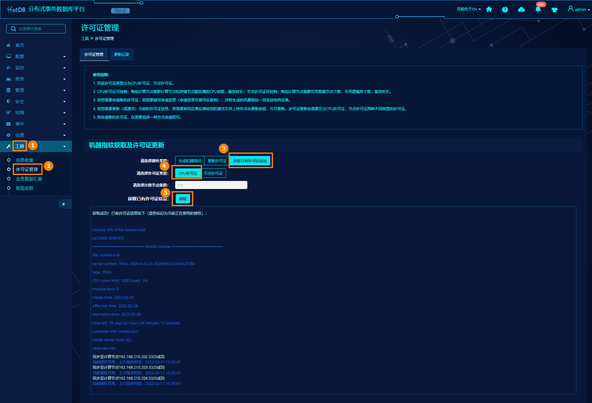
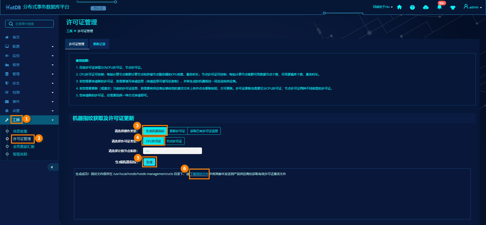
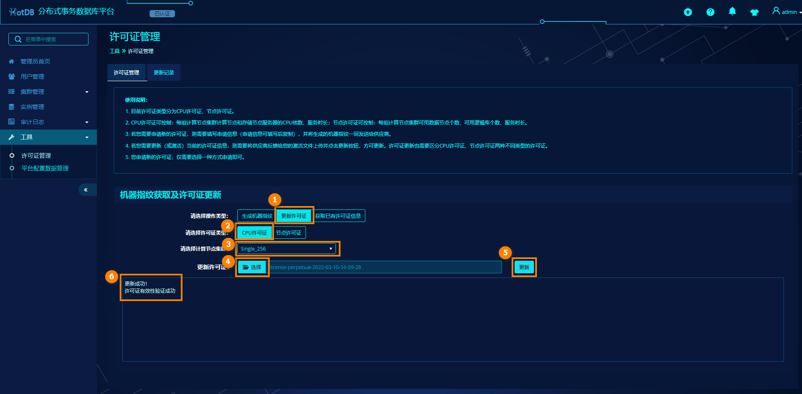
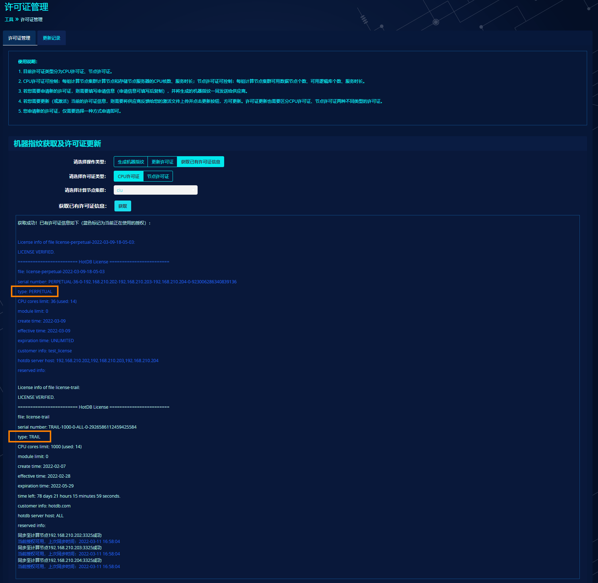
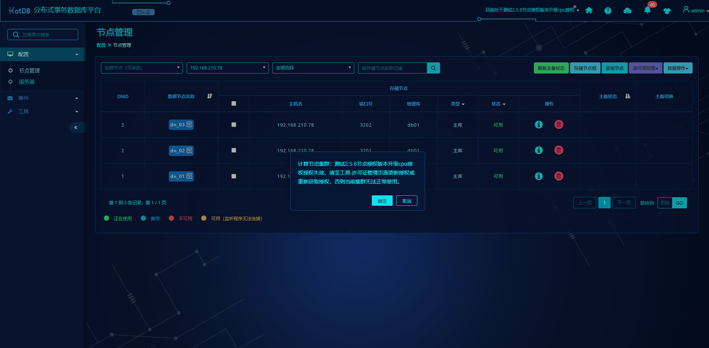

# 服务授权

## 前言

从HotDB Management V2.5.6.1版本起，分布式事务数据库平台无需授权激活，可直接使用，不再限制添加或部署的集群组数以及集群内可用的计算节点数（包括灾备模式），出厂默认内置授权CPU核数1000个，有效期90天的计算节点集群试用CPU许可证。

HotDB Server能正常提供服务，需要使用热璞科技正规的授权许可证进行激活。从HotDB Server V2.5.6版本起，计算节点启用新自研的加密许可证授权管理功能，本文档基于新自研的加密许可证授权功能进行说明。若您使用的计算节点版本低于（不包含）V2.5.6时，仍旧参考历史与其配套的服务授权使用说明文档进行操作。

从HotDB Server V2.5.6版本起，计算节点支持两种授权许可证：节点许可证和CPU许可证。节点许可证控制集群内单个计算节点的授权有效期、授权节点数、授权逻辑库数，CPU许可证控制整个集群的授权有效期、授权CPU核数。

新自研加密许可证只有软锁，没有硬锁。软锁又分为“正式软锁许可证（简称为正式许可证）”与“试用许可证”，正式许可证可以控制有效期、节点数、逻辑库数和CPU核数，且唯一机器指纹对应唯一正式软锁；试用许可证无需机器指纹即可在任意机器上激活，可控制节点数、逻辑库数和CPU核数，且有效期90天。目前仅允许使用一次试用许可证，若要更新需申请正式许可证。

当服务器上同时存在试用许可证和正式许可证时，对于节点许可证而言，优先使用授权节点数更多的许可证；若授权节点数相同，优先使用授权逻辑库数更多的许可证；若授权逻辑库数相同，优先使用授权有效期更长的许可证。对于CPU许可证而言，优先使用授权CPU核数更多的许可证；若授权CPU核数相同，优先使用授权有效期更长的许可证。

## CPU许可证

若使用分布式事务数据库平台集群部署安装计算节点，管理平台keys目录下默认附带一个授权CPU核数1000个，有效期90天的计算节点集群试用CPU许可证，文件名为`license-trail`，如下所示：

```
[root@localhost ~]# cd /usr/local/hotdb/hotdb-management/keys
[root@localhost keys]# ll
total 4
-rw-r--r-- 1 root root 1403 Feb 18 16:58 **license-trail**
```

### 试用CPU许可证

试用CPU许可证无需额外激活步骤，在管理平台上部署或添加计算节点集群后，启动计算节点即可自动激活。

#### 查看试用CPU许可证

若需要查看试用许可证详细信息，可登录管理平台，进入对应集群，点击左侧菜单栏--工具--许可证管理进入许可证管理页面，选择操作类型为【获取已有许可证信息】，选择许可证类型为【CPU许可证】，点击获取即可查看。



### 正式CPU许可证

当试用CPU授权过期或者授权CPU核数不够时，需要申请正式CPU许可证。正式CPU许可证按照授权有效期不同分为有期限和永久，更新步骤相同。

更新正式CPU许可证需要先获取计算节点集群机器指纹，唯一机器指纹对应唯一正式软锁，因此正式CPU许可证有且仅能在对应计算节点集群上激活和使用。

#### 生成机器指纹

登录管理平台，进入对应集群，点击左侧菜单栏--工具--许可证管理进入许可证管理页面，选择操作类型为【生成机器指纹】，选择许可证类型为【CPU许可证】，点击生成，即可下载机器指纹文件。



或者登录管理平台所在服务器，进入管理平台安装路径utils目录下，例如`/usr/local/hotdb/hotdb-management/utils`，执行以下命令即可生成对应计算节点集群的机器指纹：

```
[root@localhost ~]# cd /usr/local/hotdb/hotdb-management/utils
[root@localhost utils]# java -jar hotdb_management_license.jar -f -s192.168.210.130,192.168.210.131,192.168.210.132

trying to generate fingerprint on Linux amd64

The fingerprint file was successfully generated in ./management-fingerprint-2022-03-11-17-29-39

[root@localhost utils]# ll
total 176
-rw-r--r-- 1 root root 145807 Feb 15 15:31 hotdb_management_license.jar
-rw-r--r-- 1 root root 2049 Mar 11 17:29 **management-fingerprint-2022-03-11-17-29-39**
```


#### 申请正式CPU许可证

登录管理平台，进入对应集群，点击左侧菜单栏--工具--许可证管理进入许可证管理页面，在【申请单位信息及许可证属性填写】栏填写好申请信息，点击复制以上申请信息，登录电子邮箱，粘贴申请信息到邮件正文，将生成的机器指纹文件作为附件，发送授权申请邮件给供应商，由供应商相关对接人协助授权并获取正式CPU许可证文件。

- 填写授权申请信息


- 发送授权申请邮件


#### 更新正式CPU许可证

下文以正式CPU许可证文件`license-perpetual-2022-03-10-14-59-28`为例，登录管理平台，进入对应集群，点击左侧菜单栏--工具--许可证管理进入许可证管理页面，进行CPU许可证更新操作。



**第一步**：选择操作类型为【更新许可证】；

**第二步**：选择许可证类型为【CPU许可证】；

**第三步**：选择需要操作的计算节点集群；

**第四步**：点击【选择】按钮来选择许可证文件；

**第五步**：点击【更新】按钮，开始验证并更新许可证；

**第六步**：信息栏中输出对应许可证更新信息；

#### 激活正式CPU许可证

CPU许可证更新后自动激活，若管理平台关于计算节点处授权信息未更新，重新进入集群即可。

#### 查看正式CPU许可证

请参考[查看试用CPU许可证](#试用cpu许可证)

### 查看正在使用的CPU许可证

请参考[查看试用CPU许可证](#试用cpu许可证)操作进行查看正在使用的CPU许可证信息。

需要注意的是，如果当前计算节点集群同时存在默认试用CPU许可证和正式CPU许可证，只要正式CPU许可证可用，那么优先使用正式CPU许可证，不管正式CPU许可证的授权CPU核数和授权有效期是否少于默认试用CPU许可证。



获取已有CPU许可证信息中的类型如下：

- 如果是试用CPU许可证，查看许可证信息时可见type: TRAIL；

- 如果是有期限的正式CPU许可证，查看许可证信息时可见type: EXPIRATION；

- 如果是永久的正式CPU许可证，查看许可证信息时可见type: PERPETUAL。

**CPU核数统计说明：**

- CPU核数的统计，按物理核数来计算；

- CPU核数的统计通过SSH信息获取，因此管理平台服务器页面SSH服务器信息必须配置；

- 当前CPU授权总核数仅统计计算节点和存储节点服务器；

- 灾备模式下，CPU核数仅统计当前中心机房相关服务器。

## 节点许可证

### 试用节点许可证

从HotDB Server V2.5.6版本起，计算节点出厂不再附带并使用试用节点许可证，手动部署的计算节点集群启动时默认不匹配授权，73小时内允许reload操作。计算节点集群超过73小时未添加到管理平台或者未收到管理平台授权指令，则按照授权失效处理，无法reload，出现如下错误提示：

```
ERROR 10190 (HY000): Reload config failure, License update failed more than 3 days. For more details, please check the log
```

### 正式节点许可证

管理平台上添加和部署的计算节点集群，默认使用管理平台keys目录下附带的授权CPU核数1000个，有效期90天的计算节点集群试用CPU许可证，当想使用节点授权时，需要申请正式节点许可证。正式节点许可证按照授权有效期分为有期限正式许可证和永久正式许可证，更新和激活步骤相同。

更新正式节点许可证需要获取计算节点服务器机器指纹，唯一机器指纹对应唯一正式软锁，因此正式节点许可证有且仅能在对应计算节点服务器上激活和使用。

#### 生成机器指纹

进入hotdb-server/utils目录下，执行以下命令生成机器指纹：

```
[root@localhost util\]# **java -jar hotdb_license.jar -f**
trying to generate fingerprint on Linux amd64

The fingerprint file was successfully generated in ./fingerprint-192.168.210.52-2020-09-15-14-41-53

[root@localhost utils]# ll
total 136
-rw-r--r-- 1 root root 2049 Sep 15 14:41 fingerprint-192.168.210.52-2020-09-15-14-41-53
-rw-r--r-- 1 root root 98165 Aug 25 14:43 hotdb_license.jar
-rw-r--r-- 1 root root 34976 Aug 25 14:43 SM4-1.0.jar
```

> **Note**  
> 
> 生成指纹时可通过-f -i\<information\>手动增加指纹信息，若未加-i参数，则机器指纹文件生成时默认会带上IP信息*

#### 申请正式节点许可证

将生成的机器指纹`fingerprint-192.168.210.52-2020-09-15-14-41-53`文件作为附件，发送授权申请邮件给热璞，由热璞相关对接人协助授权并获取正式许可证文件。

#### 更新正式节点许可证

下文以正式许可证文件`license-expiration-2020-09-15-14-53-39`为例。上传正式许可证文件至hotdb-server/keys目录下即可。

#### 激活正式节点许可证

从HotDB Server V2.5.6版本起，启动计算节点优先使用CPU许可证。在CPU许可证不存在或者不可用的情况下，则自动激活正式节点许可证。若计算节点已处于running状态，默认5分钟检测一次节点许可证状态，当检测到新节点许可证时会自动激活，或者也可以在3325端口执行`show @@usbkey`命令手动触发一次许可证检测以激活新节点许可证。

#### 查看正式节点许可证

若需要查看正式节点许可证详细信息，可在`hotdb-server/keys`目录下执行以下命令：

```
[root@localhost keys]# **java -jar ../utils/hotdb_license.jar -l license-expiration-2020-09-15-14-53-39**

License info of file license-expiration-2020-09-15-14-53-39:
LICENSE VERIFIED.

======================== HotDB License ========================

file: license-expiration-2020-09-15-14-53-39
serial number: EXPIRATION-64-0-1600704000000-4148973046739213858
type: EXPIRATION
datanode limit: 64
module limit: 0
logicdb limit: 20
create time: 2020-09-15
effective time: 2020-09-15
expire time: 2020-09-22
time left: 6 days 9 hours 5 minutes 8 seconds.
customer info: license_for_test
```

或者在`hotdb.log`日志文件中查看许可证信息，如下所示：

```
2020-09-15 15:00:03.706 [INFO] [AUTHORITY] [checker-1] cn.hotpu.hotdb.util.V(262) - Thanks for chooising HotDB.
2020-09-15 15:00:03.710 [INFO] [AUTHORITY] [checker-1] cn.hotpu.hotdb.util.V(269) - HotDB license expire time: 2020-09-22, datanode limit to: 64, logic database limit to: 20
2020-09-15 15:00:03.710 [INFO] [AUTHORITY] [checker-1] cn.hotpu.hotdb.util.V(274) - HotDB trial expires in 6 days 8 hours 59 minutes 56 seconds.
```

或者登录3325端口执行`show @@usbkey\G`也可查看许可证信息，如下所示：

```
root@127.0.0.1:(none) 5.7.22 03:00:56\> show @@usbkey\G
*************************** 1. row ***************************
left_time: 550796
usbkey_status: 1
usbkey_type: 2
node_limit: 64
logicdb_limit: 20
last_check_time: 2020-09-15 15:00:03.710
usbkey_check_stuck: 0
last_exception_time: NULL
last_exception_info: NULL
exception_count: 0
comment: NULL
1 row in set (0.02 sec)
```

### 查看正在使用的节点许可证

若`hotdb-server/keys`目录下存在多个节点许可证时，可执行以下命令查看当前正在使用的节点许可证：

```
[root@localhost keys]# **java -jar ../utils/hotdb_license.jar -i**
The License currently in use is:
======================== HotDB License ========================
file: license-trail
serial number: TRAIL-64-0-1609344000000-8283391465276724534
type: TRAIL
datanode limit: 64
module limit: 0
logicdb limit: 2
create time: 2020-04-23
effective time: 2020-09-15
expire time: 2020-12-14
time left: 89 days 22 hours 55 minutes 48 seconds.
```

- 如果是试用节点许可证，查看许可证信息时可见`type: TRAIL`；

- 如果是有期限的正式节点许可证，查看许可证信息时可见`type: EXPIRATION`；

- 如果是永久的正式节点许可证，查看许可证信息时可见`type: PERPETUAL`。

## 注意事项

由于新自研加密许可证与老版本（V2.5.5版本及以下）存在巨大差异，使用时需要注意以下事项。

### 机器指纹

机器指纹由计算节点服务器多种硬件设备的信息组成，例如CPUID、硬盘序列号、内存序列号、网卡MAC地址、根分区的UUID和系统\虚拟机UUID、服务器IP地址等，在更新并使用正式许可证后，应避免改动服务器硬件信息，此操作会导致许可证失效。

### 正式许可证文件

拿到正式许可证文件时，应妥善保管，避免人为改动文件内容，此操作会导致许可证失效。

### 许可证过期

#### 节点许可证过期

计算节点启动后，默认5分钟检测一次节点许可证状态。

当节点许可证过期时，计算节点服务不会立刻停止，但会限制节点数为0，3325端口不允许执行`reload @@config`，3323端口不允许执行任意SQL，同时日志文件`hotdb.log中`也会间隔5分钟输出一次许可证过期警告信息，如下所示：

```
2020-12-15 00:02:52.113 [ERROR] [AUTHORITY] [checker-1] cn.hotpu.hotdb.util.V(163) - no matched license detected. Datanode limit to 0.
2020-12-15 00:02:52.114 [ERROR] [AUTHORITY] [checker-1] cn.hotpu.hotdb.a(5540) - Number of Datanodes Exceeded Maximum Size Limit. expect:4 limit:0
```

此时在3325端口执行`reload @@config`会报失败：

```
root@127.0.0.1:(none) 5.7.22 12:06:55> reload @@config;
ERROR 10190 (HY000): Reload config failure, Number of Datanodes Exceeded Maximum Size Limit. For more details, please check the log
```

当节点许可证过期后，人为手动重启计算节点服务，此时服务将无法启动，报无可用许可证，如下所示：

```
2020-12-15 00:10:47.388 [ERROR] [AUTHORITY] [checker-1] cn.hotpu.hotdb.util.V(158) - no available matched license detected. we will shutdown now.
2020-12-15 00:10:47.389 [INFO] [EXIT[ FLOW ]] [ShutdownHook] cn.hotpu.hotdb.c(770) - begin to exit...
```

因此，当节点许可证有效期不足时，应尽快申请并更新节点许可证。

#### CPU许可证过期

当CPU许可证过期时，计算节点服务仍可提供正常服务，但管理平台会在每天凌晨0点定时检测计算节点集群CPU许可证是否可用，只要在0点定时检测到过期后，计算节点服务不会立刻停止，3325端口不允许执行reload @@config。

在管理平台0点定时检测到CPU许可证过期时，计算节点hotdb.log日志会输出如下内容（如下时间戳后的参数为0则表示许可证失效）：

```
2022-03-11 00:00:00.201 [INFO] [AUTHORITY] [$I-NIOExecutor-3-1] [INFO] [AUTHORITY] [$I-NIOExecutor-2-3] cn.hotpu.hotdb.manager.handler.k(37) - received license_update command [license_update **1646986093770_0**_3_0_07FD2534FB78F6B...] from [thread=$I-NIOExecutor-3-1,id=70747,user=root,host=192.168.171.20,port=3325,localport=33380,schema=null,isEtl=false]
```

此时在3325端口执行reload @@config会报失败：

```
root@127.0.0.1:(none) 5.7.35 12:00:23> reload @@config;
ERROR 10161 (HY000): Reload is not allowed with invalid license, due to: Number of Logic Database Exceeded Maximum Size Limit. expect:1 limit:-1
```

同时，在计算节点重启及reload操作后均会触发一次CPU许可证的检测，并同步到集群的所有计算节点（含灾备）。因此，当CPU许可证有效期不足时，应尽快申请并更新CPU许可证。

#### CPU许可证过期后切换到节点许可证

当CPU许可证和节点许可证同时存在时，管理平台会优先使用CPU许可证。当CPU许可证过期后，恰好计算节点keys目录下存在可用的节点许可证，若想切换到节点许可证，可在CPU许可证过期后关闭管理平台服务，在73小时后计算节点检测到可用的节点许可证后，自动切换到节点许可证模式，切换完毕后方可启动管理平台服务。

### 许可证授权功能超过限制

#### 节点许可证

当计算节点重启时，若节点许可证授权节点数、逻辑库数小于当前配置的数据节点数、逻辑库数，则计算节点会启动成功，但无法正常使用，会提示`Wrong HotDB Config`，直到更新了可用授权或修改配置且被计算节点识别为止（间隔5分钟定时任务识别或修改当前配置的节点数/逻辑库数动态加载）。

授权逻辑库数超过已有配置限制提醒示例：

```
root> show databases;
ERROR 10161 (HY000): Wrong HotDB Config, due to: Number of Logic Database Exceeded Maximum Size Limit. expect:3 limit:2
```

日志提醒示例：  
```
2020-12-22 14:13:06.231 [ERROR] [AUTHORITY] [checker-1] cn.hotpu.hotdb.a(5844) - Number of Logic Database Exceeded Maximum Size Limit. expect:3 limit:2
```

当计算节点使用过程中，节点许可证授权节点数、逻辑库数小于当前配置的数据节点数、逻辑库数，则不允许动态加载，提示示例如下：

```
root> reload @@config;
ERROR 10190 (HY000): Reload config failure, Number of Logic Database Exceeded Maximum Size Limit. For more details, please check the log
```

#### CPU许可证

当计算节点集群CPU许可证授权CPU核数小于当前集群所有计算节点服务器和存储节点服务器的逻辑CPU核数之和时，在管理平台上更新许可证会提示更新失败，新授权的许可证，其可用计算节点/存储节点服务器CPU核数小于当前已有的计算节点/存储节点服务器CPU核数，本次更新无效。

在管理平台上每次进入该集群都会提示CPU许可证授权失效，限制左侧菜单栏访问权限，并且执行动态加载会失败。



### 许可证优先级

- 当计算节点集群同时存在CPU许可证和节点许可证时，优先使用可用的CPU许可证；

- 若CPU许可证授权失效后，计算节点keys目录下有可用的节点许可证，在计算节点管理端口执行show @@usbkey命令，或者重启计算节点，或者等待计算节点每5分钟一次定时授权检测，均可以自动切换到节点许可证授权状态；

- 若CPU许可证授权失效后，计算节点已切换到节点许可证授权状态，需手动删除管理平台keys目录下对应已失效的CPU许可证，否则在管理平台上该集群会一直处于CPU许可证授权失效状态，无法正常操作。

### 版本升级相关

- 对于管理平台、计算节点同步升级操作，需注意移掉管理平台keys目录下的cpu授权文件，以兼容原有的节点授权。

- 若手动升级计算节点版本，除常规操作外，需同步注意还原原`hotdb-server/keys`目录下的授权文件，以兼容原有的节点授权。

- 2.5.6以上自研节点授权升级，保留原有授权即可，如果要申请CPU授权，则升级过后再申请并通过授权管理页面替换。

- 2.5.5以下三方节点授权升级至2.5.6及以上版本，按照原有逻辑申请新的节点授权，如果有用户需要使用CPU授权，则直接申请CPU授权，然后到授权管理页面更新即可。

### 服务器时间

新自研加密许可证高度依赖服务器当前时间，因此需保持服务器时间与网络时间同步。若遇到许可证突然提示不可用，首先应检查服务器时间是否被篡改。

### 使用限制

- 同一管理平台管理的所有计算节点组授权模式建议相同，即节点授权和CPU授权不混用；同一计算节点组内的授权模式必须相同。

- 更新许可证，当涉及到授权模式的更新（如原CPU授权更新为节点授权），需重启计算节点生效。
