# 安装部署

## 部署环境

HotDB Server集群部署对服务器、操作系统、依赖软件等有一定要求，不符合要求的环境部署出来的集群可能无法使用或不满足使用要求。建议部署前详细了解HotDB Server集群部署对环境的[要求说明](#环境说明)。

此文档将详细描述普通模式下，如何部署一套HotDB Server集群。若要了解开启灾备模式后，相较于普通模式，需要特殊注意的地方，请参考[跨机房灾备](cross-idc-disaster-recovery.md)文档中的[安装部署](cross-idc-disaster-recovery.md#安装部署)章节。

### 部署架构示意图


集群HA（主备）模式部署架构示意图

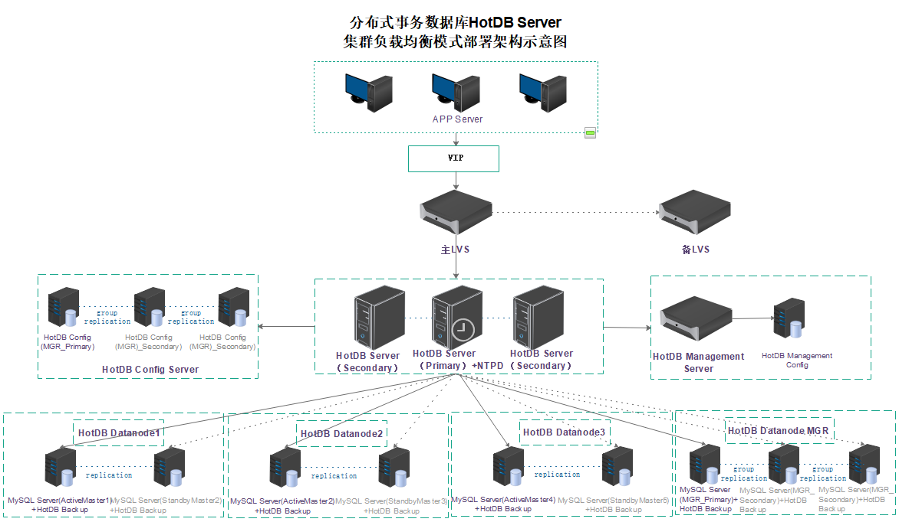

集群负载均衡模式部署架构示意图

> !!!NOTE
> 
> 集群单节点模式部署架构示意图请参考"图 1-1 集群HA（主备）模式部署架构示意图"，单节点模式中无"HotDB Server （standby）、VIP"部分，其余与HA模式示意图一致。

### 环境说明

**服务器：**生产环境推荐使用物理机，测试环境可使用虚拟机。若需要做性能测试则必须使用物理机。

**操作系统：**推荐使用64 位的CentOS 6.x、7.x或RHEL 6.x、7.x，其他操作系统暂不支持。

**依赖软件：**运行HotDB Server（分布式事务数据库）与HotDB Management（分布式事务数据库管理平台）需要依赖JAVA环境。推荐在部署HotDB Server或HotDB Management的服务器上安装JDK1.7.0_80版本的环境。

**推荐配置：**

硬件环境配置推荐参考[硬件环境配置推荐](hardware-config-recommendation.md)文档。

集群运行环境配置要求与推荐参考[集群环境要求](cluster-environment-requirement.md)文档。

## 部署

部署HotDB Server 集群可通过线下手动安装，也可以通过管理平台[集群部署](#集群部署)或[单机部署](#单机部署)功能进行自动安装。

### 手动部署

以下将分别介绍单计算节点、HA（主备）模式的计算节点集群手动部署方法，负载均衡模式的多计算节点集群推荐使用"[集群部署](#集群部署)"功能自动部署。

#### 单节点模式集群部署

单节点部署教程所用环境以及部署组件说明如下所示：

**部署环境：**

| 项目 | 名称 |
|---------|--------------------------------------|
| 服务器属性 | 虚拟机 |
| 操作系统 | CentOS Linux release 7.6.1810 (Core) |
| MySQL版本 | MySQL 5.7.25 |
| JDK | JDK1.7_80 |

**部署组件：**

| 组件名称 | 安装数量 |
|------|------|
| 计算节点 | 1 |
| 管理平台 | 1 |
| 配置库 | 1 |
| 存储节点 | 4 |

> !!!NOTE
> 
> 各组件名称说明可参考[名词解释](glossary.md)文档。

##### 计算节点

若计算节点版本为V2.5.6（不包含）版本以下，则需要安装JDK版本为1.7；

若计算节点版本为V2.5.6（包含）版本以上，则需要安装JDK版本为1.8。

JDK1.7的安装，推荐使用64位的JDK1.7_80。从JAVA官方网站获取JDK 的 RPM 安装包，并上传至服务器也可联系热璞数据库供应商获取。

```bash
# 执行下列命令，将 JDK 安装到/usr/local/目录下：
rpm -ivh jdk-7u80-linux-x64.rpm --prefix=/usr/java/

# 配置JDK环境变量
# 打开并编辑/etc/profile文件：
vi /etc/profile
# 在文件末尾加入下列信息：
export JAVA_HOME=/usr/java/jdk1.7.0_80
export PATH=\$JAVA_HOME/bin:\$PATH
# 执行source命令，使新增的环境变量生效：
source /etc/profile
```

JDK1.8的安装，推荐使用OpenJDK8安装包，其操作步骤推荐如下：

```bash
# 上传OpenJDK8安装包
# 可使用rz命令或ftp文件传输工具上传OpenJDK8U-jdk_x64_linux_hotspot_8u252b09.tar.gz安装包，该安装包可联系热璞数据库索要

# 解压安装包即可
mkdir -p /usr/local/jdk8
tar -xvf OpenJDK8U-jdk_x64_linux_hotspot_8u252b09.tar.gz -C /usr/local/jdk8
```

1. **检测glibc**

计算节点的服务授权需要安装加密锁的驱动包，该驱动包依赖于32位的glibc。所以在安装计算节点之前必须检测服务器中是否包含32位的glibc。检测出未安装时需要手动安装完成后再往下操作。

```bash
# 查看服务器glibc安装情况（有输出glibc版本信息为正常）
rpm -q glibc |egrep 'glibc.*i.86.*'
```

2. **安装配置库**

配置库可与计算节点安装在同一台服务器上，也可以分开单独安装。具体步骤参照[配置库安装说明](#配置库)。

3. **服务授权**

HotDB Server能正常启动并提供服务需要通过热璞数据库正规的授权许可，可理解为需要license。具体服务授权说明请参考[服务授权](service-license.md)文档。

4. **安装计算节点**

安装计算节点，需要解压计算节点安装包，修改计算节点配置文件`server.xml`，再导入配置库表结构到安装好的MySQL配置库实例中。

```bash
# 将hotdb-server-2.5.0-xxx.tar.gz二进制包上传至服务器，创建HotDB Server的安装目录，并将HotDB Server解压到安装目录。
mkdir /usr/local/hotdb
tar -zxvf hotdb-server-2.5.0-xxx.tar.gz -C /usr/local/hotdb/

# 配置库表结构在计算节点的安装目录conf下，使用下列命令可导入表结构到配置库中。（导入表结构，会创建配置库hotdb_config）
mysql --uroot --socket=/data/mysqldata3306/sock/mysql.sock < /usr/local/hotdb/hotdb-server/conf/hotdb_config.sql
```

5. **添加配置库账户**

计算节点访问配置库，需要在配置库MySQL实例中添加访问账号。登录配置库执行下列MySQL语句，创建配置库账户`hotdb_config`。

```sql
# 创建hotdb_config账户
create user 'hotdb_config'@'%' identified by 'hotdb_config';

# 赋予权限
GRANT select,insert,update,delete,create,drop,index,alter,reload,references,create temporary tables,super,lock tables,replication slave,replication client ON *.* TO 'hotdb_config'@'%';
```

6. **修改计算节点配置文件**

需要修改的配置文件`server.xml`在计算节点的安装目录`conf`下。需要设置计算节点连接配置库与端口号（若无特殊要求可直接用默认端口号）等参数。

编辑配置文件：

```bash
vi /usr/local/hotdb/hotdb-server/conf/server.xml
```

修改参数信息：

```xml
<property name="url">jdbc:mysql://192.168.200.1:3306/hotdb_config</property><!-- 配置库地址 -->
<property name="username">hotdb_config</property><!-- 配置库用户名 -->
<property name="password">hotdb_config</property><!-- 配置库密码 -->
<property name="serverPort">3323</property><!-- 服务端口 -->
<property name="managerPort">3325</property><!-- 管理端口 -->
```

> !!!NOTE
> 
> 若配置库与计算节点安装在同一服务器上，`server.xml`中的配置库IP地址也需要写具体的IP值，不可用`127.0.0.1`代替。

7. **启动与停止计算节点**

计算节点的启动脚本`hotdb_server`在计算节点的安装目录`bin`下。执行下列命令即可启动或关闭

```bash
# 启动计算节点服务
cd /usr/local/hotdb/hotdb-server/bin
sh hotdb_server start

# 查看计算节点是否启动成功
jps | grep -i HotdbStartup
# 19833 HotdbStartup

# 停止计算节点服务
kill 19833
# 或者：sh hotdb_server stop
```

> !!!TIP
> 

- 启动时若出现异常，可在安装目录`logs`下查看计算节点日志`hotdb.log`。执行日志查看命令：`tail -f /usr/local/hotdb/hotdb-server/logs/hotdb.log`。
- 若服务器未授权，或安装的计算节点服务未经授权许可都会导致计算节点服务启动失败。

##### 管理平台

管理平台在部署之前，也需要同步安装JDK，同计算节点一样，若版本为V2.5.6（不包含）版本以下，则需要安装JDK版本为1.7；若版本为V2.5.6（包含）版本以上，则需要安装JDK版本为1.8。安装步骤同2.1.1.1章节描述一致。

1. **解压管理平台安装包**

将`hotdb-management-2.x.x-xxx.tar.gz`二进制包上传至服务器安装目录，并执行以下命令。

```bash
cd /usr/local/hotdb
tar -zxvf hotdb-management-2.x.x-xxx.tar.gz
```

2. **导入管理平台配置库表结构**

管理平台配置库可与计算节点配置库共用一个MySQL实例，但生产环境中不建议共用。管理平台配置库表结构在其安装目录doc下，使用导入配置命令前需要先在配置库中创建管理平台连接配置库的账户`hotdb_cloud`。

```sql
# 创建hotdb_cloud账户
create user 'hotdb_cloud'@'%' identified by 'hotdb_cloud';

# 赋予权限
GRANT select,insert,update,delete,create,drop,index,alter,references ON *.* TO 'hotdb_cloud'@'%';

# 导入管理平台配置到配置库中
#mysql -uroot --socket=/data/mysqldata3306/sock/mysql.sock < /usr/local/hotdb/hotdb-management/doc/hotdb_cloud_config.sql
```

3. **修改管理平台配置文件**

修改的配置文件在管理平台安装目录`conf`下为`application.properties`，主要修改管理平台对配置库的连接信息,使用端口以及管理平台的语言设置（若无特殊要求可直接用默认端口号和默认语言）。

编辑配置文件：

```bash
vi /usr/local/hotdb/hotdb-management/conf/application.properties
```

修改参数信息：

```properties
# 管理平台监听端口
server.port=3324
# Hotdb Backup备份程序监听端口
server.backup.port=3322
#HotDB Management配置库地址
spring.datasource.url=jdbc:mysql://192.168.200.1:3306/hotdb_cloud_config?useUnicode=true&characterEncoding=UTF-8&autoReconnect=true&connectTimeout=3000
#HotDB Management配置库用户名
spring.datasource.username=hotdb_cloud
#HotDB Management配置库密码
spring.datasource.password=hotdb_cloud
#HotDB Management语言设置，默认为英语，若需要使用中文，则将其设置为Chinese
language=English/Chinese
```

4. **启动与停止管理平台**

管理平台的启动脚本hotdb_management其安装目录bin下。执行下列命令即可启动或停止管理平台服务。

```bash
# 进入启动脚本目录
cd /usr/local/hotdb/hotdb-management/bin

# 启动管理平台服务
sh hotdb_management start

# 查看服务是否启动成功（启动成功后可在浏览器中打开并登陆管理平台）
jps | grep -i hotdb-management
# 6595 hotdb-management-xxx.jar

# 关闭管理平台服务
kill 6595
# 或者：sh hotdb_management stop
```

##### 配置库

配置库实质上是一个标准的MySQL实例，用途主要为计算节点或管理平台存储相关配置信息。目前配置库支持以单库、双主、MGR三种形式运行。

> !!!TIP
> 
> 以下将以RPM方式安装一个端口号为3306的MySQL实例作为配置库。其他方式安装请参考MySQL官方安装说明。

1. **下载MySQL rpm包**

从MySQL的官网下载MySQL5.6.32的版本到服务器，以下版本针对centos6.x系统推荐，其他系统可参考官方说明下载相应版本。

```
http://dev.mysql.com/get/Downloads/MySQL-5.6/MySQL-shared-compat-5.6.32-1.el6.x86_64.rpm
http://dev.mysql.com/get/Downloads/MySQL-5.6/MySQL-devel-5.6.32-1.el6.x86_64.rpm
http://dev.mysql.com/get/Downloads/MySQL-5.6/MySQL-client-5.6.32-1.el6.x86_64.rpm
http://dev.mysql.com/get/Downloads/MySQL-5.6/MySQL-server-5.6.32-1.el6.x86_64.rpm
http://dev.mysql.com/get/Downloads/MySQL-5.6/MySQL-shared-5.6.32-1.el6.x86_64.rpm
```

2. **卸载MariaDB**

若操作系统中已安装有MariaDB则需要卸载后才能安装MySQL。查询MariaDB安装情况与卸载参照如下：

```bash
# 查看是否安装命令：
rpm -qa|grep mariadb
# mariadb-libs-5.5.44-2.el7.centos.x86_64

# 卸载MariaDB命令：
yum remove mariadb-libs-5.5.44-2.el7.centos.x86_64
```

3. **安装MySQL rpm包**

```bash
# 上传MySQL rpm包到服务器并执行rpm命令安装MySQL
yum -y localinstall --nogpgcheck MySQL-server-5.6.32-1.el6.x86_64.rpm MySQL-shared-compat-5.6.32-1.el6.x86_64.rpm MySQL-devel-5.6.32-1.el6.x86_64.rpm MySQL-client-5.6.32-1.el6.x86_64.rpm MySQL-shared-5.6.32-1.el6.x86_64.rpm

# 或者可以执行
yum -y localinstall MySQL-*.rpm
```

4. **MySQL配置文件**

将下列内容复制并替换服务器的`/etc/my.cnf`文件中的原有内容

```ini
[client]
default-character-set=utf8

[mysqld_safe]
ledir=/usr/sbin
user=mysql
open-files-limit=8192

[mysqld_multi]
mysqld = /usr/bin/mysqld_safe
user = root
log = /data/multi.log

[mysqld]
#***********************************common parameters******************************
basedir=/usr
skip-federated
skip-blackhole
skip-name-resolve
skip_external_locking
flush=OFF
performance_schema=0
event-scheduler=ON
default-storage-engine=InnoDB
character_set_server=utf8
collation_server=utf8_general_ci
lower_case_table_names=1
explicit_defaults_for_timestamp
sql_mode='STRICT_TRANS_TABLES,NO_ENGINE_SUBSTITUTION'
user=mysql
port=3306
pid-file=/data/mysqldata3306/sock/mysql.pid
socket=/data/mysqldata3306/sock/mysql.sock
datadir=/data/mysqldata3306/mydata
tmpdir=/data/mysqldata3306/tmpdir
group_concat_max_len=1048576
back_log=1000
max_connections=8000
max_user_connections=7900
thread_cache_size=128
max_connect_errors=99999
wait_timeout=172800
interactive_timeout=172800
net_buffer_length=8K
max_allowed_packet=64M
max_heap_table_size=1G
tmp_table_size=2M
sort_buffer_size=8M
max_length_for_sort_data=16k
join_buffer_size=4M #bka
read_rnd_buffer_size=8M #mrr
table_open_cache=1024
table_open_cache_instances=16
query_cache_type=0
query_cache_size=0
#query_cache_limit=1M
#******************************* Logs related settings ***************************
#general_log
general_log_file=/data/mysqldata3306/log/general.log
log-error=/data/mysqldata3306/log/error.log
long_query_time=1
slow_query_log
slow_query_log_file=/data/mysqldata3306/log/slow-query.log
#log_queries_not_using_indexes
log_warnings = 2
log-bin-index=/data/mysqldata3306/binlog/mysql-bin.index
log-bin=/data/mysqldata3306/binlog/mysql-bin
relay-log-index=/data/mysqldata3306/relaylog/mysql-relay-bin.index
relay-log=/data/mysqldata3306/relaylog/mysql-relay-bin
binlog_cache_size=256K
max_binlog_size=512M
binlog-format=MIXED
binlog-checksum=CRC32
sync_binlog=0
expire_logs_days=10
#******************************* Replication related settings *********************
server-id= 3306
#skip-slave-start
log_slave_updates=1
log_bin_trust_function_creators=1
auto_increment_increment=1
auto_increment_offset=1
allow-suspicious-udfs
innodb_support_xa=1
sysdate-is-now
#******************************* MyISAM Specific options ***************************
key_buffer_size=8M
bulk_insert_buffer_size=16M
myisam_sort_buffer_size=64M
myisam_max_sort_file_size=10G
myisam_repair_threads=1
myisam-recover-options=default
read_buffer_size=1M
#***************************** INNODB Specific options ****************************
innodb_use_sys_malloc=1
#innodb_additional_mem_pool_size=32M
innodb_buffer_pool_size=4G
innodb_buffer_pool_instances=2
innodb_max_dirty_pages_pct=40
innodb_sort_buffer_size=16M
innodb_data_home_dir=/data/mysqldata3306/innodb_ts
innodb_data_file_path=ibdata1:1024M:autoextend
innodb_autoextend_increment=128
innodb_file_per_table
innodb_open_files=7168
innodb_file_format=Barracuda
innodb_file_format_check=1
innodb_fast_shutdown=1
innodb_force_recovery=0
innodb_flush_log_at_trx_commit=2
innodb_log_buffer_size=64M
innodb_log_file_size=1G
innodb_log_files_in_group=2
innodb_log_group_home_dir=/data/mysqldata3306/innodb_log
innodb_adaptive_flushing_lwm=30
innodb_read_io_threads=8
innodb_write_io_threads=8
innodb_io_capacity=200
innodb_flush_method=O_DIRECT
innodb_flush_neighbors=0
innodb_lru_scan_depth=1024
innodb_change_buffering=all
innodb_purge_threads
innodb_commit_concurrency=0
innodb_thread_concurrency=0
innodb_concurrency_tickets=1024
innodb_autoinc_lock_mode=1
innodb_stats_on_metadata=0
innodb_lock_wait_timeout=120
innodb_rollback_on_timeout=1

[mysqldump]
quick
max_allowed_packet=2G
default-character-set=utf8

[mysql]
no-auto-rehash
prompt="//u@//h : //d //r://m://s> "
default-character-set=utf8
show-warnings

[myisamchk]
key_buffer=512M
sort_buffer_size=512M
read_buffer=8M
write_buffer=8M

[mysqlhotcopy]
interactive-timeout
```

5. **创建MySQL目录**

根据my.cnf配置文件的目录参数，创建MySQL数据目录，并设置数据目录的所有者用户。

```bash
mkdir -p /data/mysqldata3306
mkdir -p /data/mysqldata3306/mydata
mkdir -p /data/mysqldata3306/binlog
mkdir -p /data/mysqldata3306/innodb_ts
mkdir -p /data/mysqldata3306/innodb_log
mkdir -p /data/mysqldata3306/relaylog
mkdir -p /data/mysqldata3306/tmpdir
mkdir -p /data/mysqldata3306/log
mkdir -p /data/mysqldata3306/sock
chown -R mysql:mysql /data/mysqldata3306
```

6. **初始化数据库**

执行mysql_install_db初始系统数据库到指定目录。

```bash
mysql_install_db --defaults-file=/etc/my.cnf --user=mysql --datadir=/data/mysqldata3306/mydata
```

7. **启动配置库MySQL实例**

使用mysql的启动脚本启动数据库。

```bash
# 启动MySQL服务
/etc/rc.d/init.d/mysql start

# 使用netstat命令检测MySQL是否启动成功
netstat -npl |grep mysql

# 命令有输出即代表启动成功
# 注意：安装完成后请及时修改root用户密码
```

##### 存储节点

存储节点实质上是一个标准的MySQL实例，用途为整套集群提供底层业务数据的存储。安装数量与搭建复制关系根据实际业务场景而定。

> !!!TIP
> 
> 存储节点的手动安装过程请参照[配置库](#配置库)说明。批量安装存储节点建议使用管理平台[单机部署](#单机部署)或[集群部署](#集群部署)功能。

**物理库：**

存储节点是由IP+实例端口+物理库确定的。所以在管理平台上配置的存储节点需要填写物理库名称。一般手动安装的存储节点实例需要手动创建物理库，方便后期添加到管理平台中供集群使用。

```sql
# 在存储节点实例中创建物理库
create database db01;
```

**连接用户：**

通过手动安装部署的存储节点，还需创建用于计算节点连接存储节点实例的数据库用户。

```sql
# 创建数据库用户
#create user 'hotdb_datasource'@'%' identified by 'hotdb_datasource';

# 用户赋权
#GRANT select,insert,update,delete,create,drop,index,alter,process,references,super,reload,lock tables,replication slave,replication client,trigger,show view,create view,create routine,create temporary tables,alter routine,execute,event ON *.* TO 'hotdb_datasource'@'%';

# 注意：当存储节点的MySQL版本大于等于8.0时，需要多加一个权限"xa_recover_admin"
```

**备份用户：**

通过手动安装部署的存储节点，若需要使用数据备份功能，还需要创建用于数据备份的数据库用户。

```sql
# 创建数据库用户
create user 'dbbackup'@'%' identified by ' dbbackup';

# 用户赋权
GRANT select,insert,update,delete,create,drop,index,alter,reload,process,references,super,lock tables,replication slave,replication client,trigger,show view,create view,create routine,alter routine,event ON *.* TO 'dbbackup'@'127.0.0.1';
```

##### 备份程序

备份程序（HotDB Backup）为热璞数据库自主研发的分布式数据库备份工具。通常部署在集群的存储节点服务器上，监听来自管理平台的数据备份请求。一台存储节点服务器只需部署一个备份程序即可。

> !!!NOTE
>  <!--使用须知-->
>
> - 仅支持备份MySQL 5.6及以上版本的数据。
> - 被备份的存储节点实例必须开启binlog。
> - HotDB Management所在的服务器，必须安装MySQL Client,否则会影响备份。

1. **解压备份程序安装包**

将`hotdb_backup-2.0-xxxxxxxx.tar.gz`二进制包上传至服务器。创建备份程序的安装目录，并将备份程序解压到安装目录。

```bash
mkdir /usr/local/hotdb/
tar -zxvf hotdb_backup-2.0-20190109.tar.gz -C /usr/local/hotdb/
```

2. **启动与停止备份程序**

启动备份服务程序

```bash
cd /usr/local/hotdb/hotdb_backup
sh bin/hotdb_backup start -h 192.168.220.104 -p 3322
```

`-h`后面加管理平台服务器的ip，`-p`后面加管理平台监听备份程序端口（一般为`3322`,具体可在管理平台配置文件`application.properties`中查看参数`server.backup.port`）。

启动成功后会打印以下日志

```log
INFO: Start HotDB-backup ...
INFO: HotDB-backup start successed.
```

停止备份服务程序

```bash
sh bin/hotdb_backup stop
```

关闭成功后会打印以下日志

```log
INFO: Stopping HotDB-backup ...
INFO: HotDB-backup stopped success.
```

查看HotDB-Backup运行状态

```bash
sh bin/hotdb_backup status
```

```log
# 已运行提示
INFO: HotDB-backup service already running (PID: 11709).

# 未运行提示
INFO: HotDB-backup service not running.
```

查看HotDB-Backup日志

```
#cat logs/hotdb_backup.log
```

HotDB Backup常见日志

```
Start backup # 备份任务发起
Backup is stopped # 备份任务结束
Connected to server successfully! # 备份程序与HotDB Management正常建立连接
Got a quit signal from user, will quit after backup is finished # 备份程序正常退出
```

#### HA（主备）模式集群部署

主备节点模式集群部署教程所用环境以及部署组件说明如下所示：

**部署环境：**

| 项目 | 名称 |
|---------|--------------------------------------|
| 服务器属性 | 物理机 |
| 操作系统 | CentOS Linux release 7.6.1810 (Core) |
| MySQL版本 | MySQL 5.7.25 |
| JDK | JDK1.7_80 |

**部署组件：**

| 组件名称 | 安装数量 |
|------------|------|
| 计算节点 | 2 |
| Keepalived | 2 |
| 管理平台 | 1 |
| 配置库 | 1 |
| 存储节点 | 4 |

> !!!NOTE
> 
> 各组件名称说明可参考[名词解释](glossary.md)文档。

> !!!INFO
> 
> 本章主要介绍在HA集群模式下的计算节点server.xml配置、Keepalived安装与配置、启动说明、高可用切换等。计算节点、管理平台、配置库、存储节点的安装步骤本章不再赘述，具体参照上一章：[单节点模式集群部署](#单节点模式集群部署)。

**部署规划：**

| 实例 | IP | 服务端口 | 管理端口 | HA角色 |
|-------|-----------------|------|------|--------|
| 主计算节点 | 192.168.200.190 | 3323 | 3325 | Master |
| 备计算节点 | 192.168.200.191 | 3323 | 3325 | Slave |

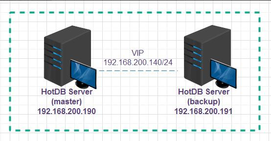

HA计算节点部署示意图

> !!!NOTE
> 
> 主备计算节点服务器上再分别安装keepalived程序，选用VIP为：192.168.200.140

##### 计算节点

1. **安装主备计算节点**

分别在192.168.220.190、192.168.200.191安装计算节点服务，安装过程参照上一章节"[计算节点](#计算节点)"说明。

2. **修改主备计算节点配置文件**

部署好的主备计算节点需要修改对应的配置文件`server.xml`，具体修改如下所示：

主计算节点192.168.200.190上`server.xml`配置修改

```xml
<property name="haState">master</property>< HA 角色，主节点：master，备节点：backup>
<property name="haNodeHost"></property><HA 角色，其他节点 IP:PORT>
<property name="VIP">192.168.200.140</property><虚拟IP地址>
```

备计算节点192.168.200.191上server.xml配置修改

```xml
<property name="haState">backup</property>< HA 角色，主节点：master，备节点：backup>
<property name="haNodeHost">192.168.200.190:3325</property><HA 角色，其他节点 IP:PORT>
<property name="VIP">192.168.200.140</property><虚拟IP地址>
```

> !!!INFO
> 
>
> - 配置文件中的haNodeHost为主计算节点的IP+管理端口，只需在备计算节点上配置该参数即可。
> - 启动主备服务时，如果haState的角色为master则会开启服务端口（3323）、管理端口（3325）；如果是 Backup 角色，则只会开启管理端口（3325）。
> - 当master服务故障后，keepalived 检测到服务不可用，会自动切换 vip 到 backup 所在的服务器，并启用 backup 的服务端口（3323），保证服务不中断。

##### Keepalived

1. **安装keepalived**

可用yum方式安装keepalived，也可在[keepalived官网](https://www.keepalived.org/download.html)下载安装tar包。

```bash
# yum方式安装keepalived（主备计算节点所在服务器上执行keepalived安装命令）
yum -y install keepalived

# 启动或关闭keepalived
service keepalived start / server keepalived stop

# 查看keepalived运行状态
service keepalived status
```

2. **修改keepalived配置文件**

Keepalived配置文件默认存放在`/etc`目录下为`keepalived.conf`，将下列实例内容复制替换到对应的keepalived配置文件中，并按照标红位置进行实际修改（标准的HotDB Server 安装包中对应的`conf`目录下也有keepalived主备模式的配置文件，也可将其直接复制到`/etc`目录下，进行自定义修改）。

主计算节点：192.168.200.190的keepalived配置信息：

```
! Configuration File for keepalived
global_defs {
  router_id HotDB Server-ha
}
vrrp_script check_HotDB Server_process {
  script "/bin/bash /usr/local/hotdb/hotdb-server/bin/check_hotdb_p
  rocess.sh process"
  interval 5
  fall 2
  rise 1
  weight -10
}
vrrp_script check_HotDB Server_connect_state {
  state
  code
  script "/bin/bash /usr/local/hotdb/hotdb-server/bin/check_hotdb_p
  rocess.sh connect_master"
  interval 5
  fall 3
  rise 1
  timeout 5
  weight -10
}
vrrp_instance VI_1 {
  state BACKUP
  interface eth1
  virtual_router_id 89
  nopreempt
  priority 100
  advert_int 1
  authentication {
    auth_type PASS
    auth_pass 1111
  }
  track_script {
    check_HotDB Server_process
    check_HotDB Server_connect_state
  }
  #be careful in red hat
  track_interface {
    eth1
  }
  virtual_ipaddress {
    192.168.200.140/24 dev eth1 label eth1:1
  }
  notify_master "/bin/bash /usr/local/hotdb/hotdb-server/bin/chec
  k_hotdb_process.sh master_notify_master"
  notify_backup "/bin/bash /usr/local/hotdb/hotdb-server/bin/chec
  k_hotdb_process.sh master_notify_backup"
  notify_fault "/bin/bash /usr/local/hotdb/hotdb-server/bin/check_hotdb_process.sh master_notify_backup"
}
```

备计算节点：192.168.200.191的keepalived配置信息：

```
! Configuration File for keepalived
global_defs {
  router_id HotDB Server-ha
}
vrrp_script check_HotDB Server_process {
  script "/bin/bash /usr/local/hotdb/hotdb-server/bin/check_hotdb_p
  rocess.sh process"
  interval 5
  fall 2
  rise 1
  weight -10
}
vrrp_script check_HotDB Server_connect_state {
  state
  code
  script "/bin/bash /usr/local/hotdb/hotdb-server/bin/check_hotdb_p
  rocess.sh connect_backup"
  interval 5
  fall 3
  rise 1
  timeout 5
  weight -10
}
vrrp_instance VI_1 {
  state BACKUP
  interface eth0
  virtual_router_id 89
  priority 95
  advert_int 1
  authentication {
    auth_type PASS
    auth_pass 1111
  }
  track_script {
    check_HotDB Server_process
    check_HotDB Server_connect_state
  }
  #be careful in red hat
  track_interface {
    eth0
  }
  virtual_ipaddress {
    192.168.200.140/24 dev eth0 label eth0:1
  }
  notify_master "/bin/bash /usr/local/hotdb/hotdb-server/bin/chec
  k_hotdb_process.sh backup_notify_master"
  notify_backup "/bin/bash /usr/local/hotdb/hotdb-server/bin/chec
  k_hotdb_process.sh backup_notify_backup"
  notify_fault "/bin/bash /usr/local/hotdb/hotdb-server/bin/check_hotdb_process.sh backup_notify_backup"
}
```

> !!!NOTE
> 
> 主备 keepalived 的相关配置也可参考计算节点安装目录 conf 目录下的keepalived.conf.master, keepalived.conf.backup 脚本，红色区域需要根据实际信息修改其他使用默认即可。

**关于自定义修改内容说明：**

- script 脚本路径为计算节点实际安装路径，调用的 master/backup 脚本根据实际的主备角色进行配置
- interface：绑定的网卡
- nopreempt：设置是否开启抢占模式。添加此参数，将不开启抢占模式；否则开启抢占模式。例如主的参数值是 priority 100，备的参数值是 priority 95, 该参数只需要在主 keepalived 配置脚本设置
- priority：优先级，优先级高的为 master
- virtual_ipaddress：instance 绑定的 vip（vip 需与计算节点所在的ip 同网段）
- Label：给本地网卡起一个虚拟名称，用于绑定虚拟网卡 IP ，例如把虚拟网卡 eth0:1 绑定到本地网卡 eth0 上
- Script：判断服务是否正常的脚本路径，通常存放在 HotDB Server 的 bin目录下， 例如：/usr/local/hotdb/hotdb-server/bin/check_hotdb_process.sh，该脚本可检查 HotDB Serve 主备服务的进程是否存在，主备 HotDB Serve 的 3323端口和 3325 端口的状态是否正常

3. **启动说明**

由于两台机器上的HotDB Server互为主备关系，在服务启动的时，需要注意启动的顺序问题，如下为标准启动顺序：

先启动主（192.168.200.190）的keepalived，**待ping通vip**后再启动主计算节点服务

```bash
# 启动主keepalived服务
service keepalived start

# Ping通vip后再启动主计算节点服务
sh /usr/local/hotdb/hotdb-server/bin/hotdb_server start
```

`ip a`可查看当前主的keepalived VIP是已绑定成功


主计算节点服务启动完**等待20秒**后再启动备（192.168.200.191）的keepalived，keepalived启动完成后**等待10秒**再启动备计算节点服务

```
# 启动备keepalived服务
#service keepalived start

# 启动备计算节点服务

sh /usr/local/hotdb/hotdb-server/bin/hotdb_server start
```

##### 高可用切换说明

当主机192.168.200.190服务上的计算节点服务故障时，检测脚本(vrrp_scripts)检测到计算节点主服务端口不可访问或 hacheck 连续失败超过 3 次时，主keepalived优先级会进行自动调整，变成 90(weight -10)，备机 192.168.200.191服务上的 keepalived 收到比自己优先级低的 vrrp 包(192.168.200.191 上优先级为 95)后，将切换到 master 状态，抢占 vip(192.168.200.140)，同时在进入 master 状态后，执行 notify_master 脚本，访问备服务 3325 端口执行online 命令启动并初始化备计算节点服务端口，若 192.168.200.191 的计算节点启动成功，则主备切换成功后继续提供服务。如下图：

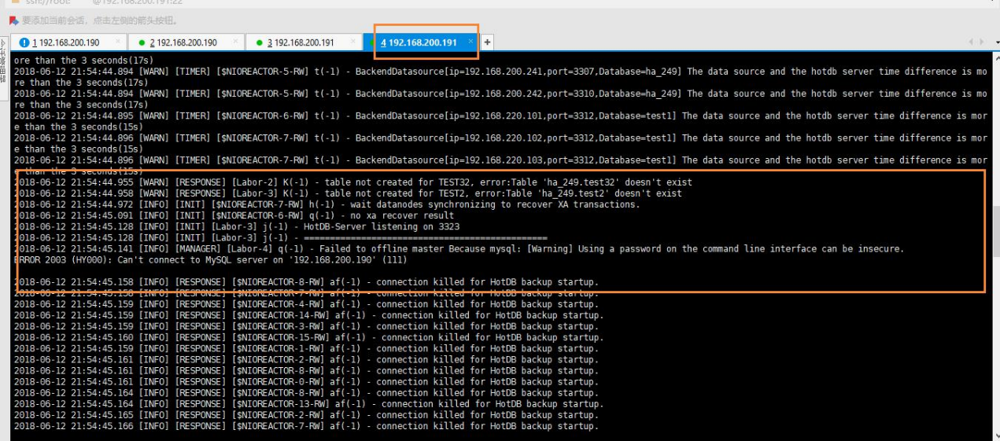

Keepalived 的 VIP 此时已在192.168.200.191服务器上

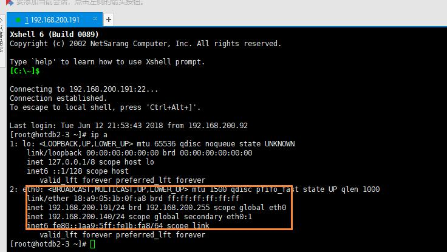

##### 高可用重建说明

具体可参考[管理平台](hotdb-management.md)文档中的高可用重建章节，通过该功能可实现：当192.168.200.190服务器上计算节点发生故障切换后，手动触发计算节点高可用重建功能，即可修复 192.168.200.190 服务器上计算节点服务及主备关系，当 192.168.200.191 服务器上计算节点再发生故障时，可自动进行回切到 192.168.200.190上。

#### NDB SQL服务

NDB SQL服务可用于在分布式环境下帮助计算节点完成相对复杂的SQL查询语句计算。关于NDB SQL服务详细介绍可参考[标准](standard.md)文档中说明。目前NDB SQL服务支持使用一键部署安装脚本方式与管理平台的[集群部署](#集群部署)、[单机部署](#单机部署)功能自动部署方式进行安装。以下将介绍通过脚本方式对NDB SQL服务的安装部署。

1. **手动安装前须知**

- NDB SQL服务与计算节点服务是一一对应的，即每台计算节点所在服务器如果需要使用NDB SQL服务支持都需部署该服务程序。
- 与NDB SQL服务对应的计算节点版本必须是V2.5.2及以上版本，否则不支持NDB SQL服务
- 推荐NDB SQL服务与计算节点一次性跟随部署，若目前已有计算节点需要追加NDB SQL服务则需要严格注意：--install-ntpd、--ntpdate-server-ip、--ntpdate-server-host传参问题，需要同当前部署的集群同步时间配置一致。

2. **计算节点与NDB SQL一同部署过程说明**

当前以主备模式集群为例演示使用脚本安装计算节点与NDB SQL服务，具体步骤说明如下：

- 登录每台计算节点服务器，进入一键部署资源包目录Install_Package下执行安装命令。

- 登录主计算节点服务器，进入一键部署默认安装目录执行：

```bash
sh hotdbinstall_v2.42.sh --install-hotdb-server=yes --hotdb-version=2.5 --install-ndbsql=yes --install-ntpd=yes --ntpdate-server-host=182.92.12.11
```

- 登录备计算节点服务器，进入一键部署默认安装目录执行：

```bash
sh hotdbinstal_v2.42.sh --install-hotdb-server=yes --hotdb-version=2.5 --install-ndbsql=yes --ntpdate-server-host=主计算节点服务器IP地址
```

3. **单独部署NDB SQL过程说明**

若已安装好计算节点，但后期需要追加安装NDB SQL服务则可通过脚本单独部署NDB SQL方式进行操作，或通过管理平台"[单机部署](#单机部署安装ndb-sql)"功能实现。本示例以单节点集群为例说明后期追加部署NDB SQL服务的操作。

登录计算节点服务器，进入一键部署资源包目录Install_Package下执行安装命令。

```bash
sh hotdbinstall_v2.xx.sh --install-ndbsql=yes --ntpdate-server-host=182.92.12.11
```

> !!!NOTE
> 
>
> - 安装NDB SQL指定服务器时间同步地址时使用的时间同步参数需要与上一次安装计算节点时保持一致，即当时使用的是`ntpdate-server-ip`还是`ntpdate-server-host`参数，两次必须一致
> - 时间同步地址参数值需与上一次安装计算节点时使用的时间同步地址一致，如果集群内已有NTP服务则参数值应该是NTP服务所在服务器的IP地址。

4. **NDB SQL配置说明**

NDB SQL服务安装完成后需要在对应的计算节点安装conf目录下修改server.xml文件配置。需将配置文件中的ndbSqlMode修改为local。具体如下所示：

```xml
<property name="ndbSqlMode">none</property><!-- NDB执行模式：none：禁用NDB功能，为默认值；local：NDB SQL服务器和hotdb服务器在同一计算机上(NDB mode. Disable(by default): none; NDB and HotDB in same machine: local) -->
<property name="ndbSqlVersion">5.7.24</property><!-- NDB SQL版本号(Version of NDB) -->
<property name="ndbVersion">7.5.12</property><!-- NDB引擎版本号(Engine verion of NDB) -->
<property name="ndbSqlAddr">localhost:3329</property><!-- NDB SQL端IP地址(NDB SQL node address) -->
<property name="ndbSqlUser">root</property><!-- NDB SQL前端用户名(NDB SQL node user name) -->
<property name="ndbSqlPass">root</property><!-- NDB SQL前端密码(NDB SQL node password) -->
<property name="ndbSqlDataAddr">127.0.0.1:3327</property><!-- 接收NDB SQL连接的IP地址和端口(NDB Data node address) -->
```

5. **NDB SQL启动关闭说明**

NDB SQL服务不需要单独启动关闭，启动计算节点时会同时启动NDB SQL服务，关闭计算节点时也会同步关闭NDB SQL服务。

#### HotDB Listener组件

HotDB Listener是计算节点一个可拔插组件，开启后可解决集群强一致模式下的性能线性扩展问题。要使用Listener需满足：计算节点是多节点集群模式并开启XA、在存储节点服务器上成功部署Listener并启用enableListener参数。此处仅说明手动单独部署Listener的操作方法，一键部署方式可参考自动部署对应章节进行统一安装。

HotDB Listener由JDK1.7.0_80进行编译，对操作系统和Java环境的要求和HotDB Server保持一致。HotDB Listener目前仅支持IPV4。

##### 解压一键部署安装包

将一键部署安装包auto_hotdbinstall_HotDB2.5.5_v1.0_20200422.tar.gz（2.5.5为版本号，不同版本其编号不同，注意同步替换）上传至存储节点服务器/usr/local/hotdb目录下，执行下列命令解压：

```bash
cd /usr/local/hotdb
tar -zxvf auto_hotdbinstall_HotDB2.5.5_v1.0_20200422.tar.gz
```

##### 安装Listener

一键部署安装包内置Listener安装包。执行下列命令，将Listener安装在/usr/local/hotdb目录下：

```
cd /usr/local/hotdb/Install_Package
#tar -zxvf hotdb-listener-0.0.1-alpha-20200420-linux.tar.gz -C /usr/local/hotdb/
```

##### 配置Listener

在启动之前，先根据服务器可用内存空间，调整Listener的堆内存大小。

```
cd /usr/local/hotdb/hotdb-listener/bin
vi hotdb_listener
```

将第24行堆内存大小设置为合理范围。

若服务器内存较大，可根据需求使用G1算法及相应配置。

接着配置Listener启动端口（若无特殊需求，此步可省略）

```bash
cd /usr/local/hotdb/hotdb-listener/conf
vi config.properties
```

host默认0.0.0.0，无需修改；port默认3330，不建议修改，除非被占用。

##### 启动Listener

执行下列命令即可启动Listener：

```bash
cd /usr/local/hotdb/hotdb-listener/bin
sh hotdb_listener start
```

启动成功窗口会提示"HotDB-Listener start successed."

除了start外，还有其他参数可以使用，使用方法如下：

```bash
sh hotdb_listener
# Usage: sh hotdb_listener [start|stop|restart]
# example:
# HotDB-Listener start : sh hotdb_listener start
# HotDB-Listener stop : sh hotdb_listener stop
# HotDB-Listener restart : sh hotdb_listener restart

# 启动完毕，可切换到logs目录查看日志输出，可查看到Listener的相关信息。

tailf listener.log
# 2020-05-25 12:09:54.089 [INFO] [INIT] [main] cn.hotpu.hotdb.ListenerServer(158) - Listener-Manager start listening on host 0.0.0.0 port 3330
```

### 自动部署

自动部署为管理平台在界面中支持自动化安装部署计算节点集群的功能。目前管理平台从V2.5.0及以后拥有[集群部署](#集群部署)、[单机部署](#单机部署)两个自动化安装功能。**集群部署**适合从0开始一次性部署整套计算节点集群的场景，**单机部署**适合再已部署好的集群上新增个别集群组件的场景。

#### 集群部署

集群部署每次部署任务是以一套集群为单位进行，一次部署最少需要包含：计算节点、配置库、keepalived（主备节点模式需要安装），其他组件：存储节点、LVS（多节点模式）、NTPD可根据需要安装。支持"单节点、主备节点、多节点"不同集群模式的安装。安装完的集群自动根据配置搭建好高可用、自动启动。

##### 术语说明

集群部署相关术语请参照[名词解释](glossary.md)文档。

##### 功能使用须知

- 集群部署只支持CentOS6/7 RHEL6/7，MySQL 5.6/5.7/8.0，HotDB-Server2.4，HotDB-Server2.5；
- 超过2EB的硬盘可能会出现计算错误；
- 不支持一台服务器上安装多个计算节点或多个管理平台或多个备份程序；
- 建议添加干净的操作系统环境服务器；
- 服务器的SSH信息须使用root权限的用户进行配置；
- 添加的服务器要求已配置可用的yum源或安装脚本目录下有对应操作系统版本的iso镜像文件；
- 安装部署包名称默认以`auto_hotdbinstall`开头，请不要随意更改服务器下部署包名称；
- 程序默认上传部署包存放路径为`/usr/local/hotdb`；
- MySQL默认可安装5.6.41、5.7.25、8.0.16版本，如需要安装其他版本，自行在安装目录下替换相关安装包即可；
- 管理平台在部署集群前需确认在管理平台服务器以下任一目录中存在集群安装部署包资源。集群部署时会在以下目录寻找资源包上传至目标服务器`/usr/local/hotdb`路径下。（查找优先级按以下为准）
  - `opt`
  - `opt/hotdb`
  - `usr/local`
  - `usr/local/hotdb`
- 一键部署安装包下载过程中可能存在一些损坏，此时进行部署可能导致部署出错。故在管理平台版本为2.5.6.1（包含）版本以上，增加了完整性校验功能，对上传的安装包进行MD5值校验。即在上传部署安装包时，需同步上传当前安装包对应的MD5值文件至服务器相同目录下，如下图：

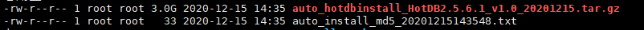

##### 部署管理平台

1. **将部署安装包和对应MD5值文件上传至服务器，并解压到指定目录**

```bash
mkdir /usr/local/hotdb
tar -zxvf auto_hotdbinstall_HotDB2.*.tar.gz -C /usr/local/hotdb/
```

2. **执行安装脚本安装管理平台**

```bash
cd /usr/local/hotdb/Install_Package/
sh hotdbinstall_v*.sh --ntpdate-server-ip=182.92.12.11 --mysql-version=5.7 --hotdb-config-port=3316 --hotdb-version=2.5 --install-hotdb-server-management=yes
```

3. **查看安装日志获取安装进度**

```bash
tail -f /usr/local/hotdb/Install_Package/hotdbinstall.log
```

4. **日志打印如下标记则为安装成功正常结束**

```log
[INFO] hotdbinstall finished without error, but you should check if there is any warnings
```

5. **启动管理平台**

```bash
sh /usr/local/hotdb/hotdb-management/bin/hotdb_management start
```

6. **浏览器打开管理平台**

启动成功后，打开浏览器输入：`http://<服务器的IP地址>:3324/page/index.html`。

成功打开页面后登录账号到管理员界面。（管理员用户名密码默认为 admin/admin）

##### 集群部署功能说明

> !!!INFO
> 
> 本次以"多节点"模式的集群部署为例，展示集群部署中的完整过程以及对应说明。

###### 添加集群部署任务

admin用户登录管理平台后进入"集群管理->计算节点集群"，点击【集群部署】按钮进入集群部署功能页面。


###### 选择部署的集群模式

集群分为单节点、主备节点、多节点三种模式，选择好集群模式后点击【参数配置】按钮进入集群部署参数配置页面。


**集群模式说明：**

- 单节点：单节点指整个集群中只有一个计算节点的集群模式。无需安装Keepalived或LVS等高可用组件。

  

- 主备节点：主备模式也称HA模式，即通过Keepalived组件进行高可用搭建的集群模式。在集群中存在主、备两个计算节点。

  

  1. 主备节点模式的集群，需要填写2台服务器的配置信息。
  2. Keepalived的virtual_ipaddress（简称VIP）要求为没有被服务器或其他应用所占用且和计算节点服务器在相同网段上。格式为VIP+子网掩码长度，例：192.168.200.120/24。
  3. virtual_router_id的值可自行在范围【1-255】选定一个值，但该值要求在集群使用的网段内是唯一的，即不与其他应用服务选择的值冲突。
  4. 主备Keepalived服务器网关设备名称是Keepalived所在服务器的网卡设备名称，该名称必须填写正确，格式为网卡名称+ :1 例："eth0:1"。（网关设备名称可通过"ip a"命令查看）

- 多节点：多节点模式也叫作负载均衡模式，是通过LVS组件或其他负载均衡组件来控制分发业务流量到集群中的多个计算节点上的一种架构模式。多节点模式中计算节点个数不能低于3个或超过9个。

  

  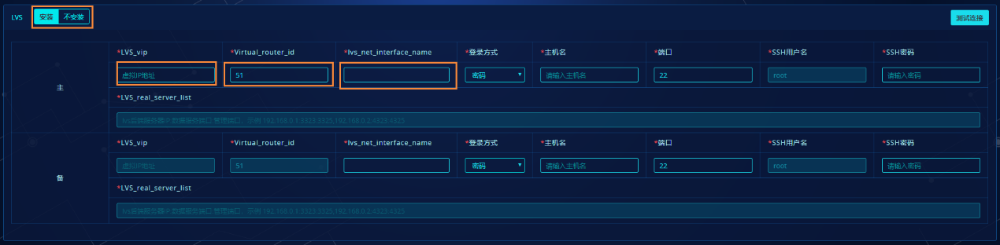

  1. 多节点模式中，计算节点个数默认为3个，且计算节点版本必须为2.5。
  2. 集群网段为计算节点安装服务器所在网段，格式为：网段+子网掩码长度，例：192.168.200.0/24。
  3. 通信端口为集群内各计算节点进行通信时所用端口，默认为3326.无特殊要求时不建议修改。
  4. LVS是多节点模式中实现负载均衡的组件，也可以关闭【安装】选择其他负载均衡方式代替LVS。
  5. LVS_vip为LVS组件中所配置的虚拟IP地址（简称VIP），要求必须为没有被服务器或其他应用所占用且和计算节点服务器在相同网段上。格式为VIP+子网掩码长度，例：192.168.200.120/24。
  6. virtual_router_id的值可自行在范围【1-255】选定一个值，但该值要求在集群使用的网段内是唯一的，即不与其他应用服务选择的值冲突。
  7. lvs_net_interface_name是LVS组件所在服务器的网卡名称，该名称必须填写正确，格式为网卡名称+ :2 例："eth0:2"。（网关设备名称可通过"ip a"命令查看）。

###### 集群部署参数配置

**(一)计算节点参数**

以下将以计算节点集群模式为多节点为例介绍计算节点的参数配置。


1. 计算节点个数默认为3，设置时不能小于3或大于7个。
2. 集群名称会自动生成，格式为：Group+四位随机数，可根据实际情况修改。
3. 可根据实际需要查看是否要安装NDB SQL服务，如果安装则要求计算节点版本必须大于等于V2.5.2。
4. 集群网段为计算节点所在服务器的网段范围，格式为：网段+子网掩码长度，例：192.168.200.0/24。
5. 通信端口为集群内各计算节点进行通信时所用端口，默认为3326，无特殊要求不建议修改。
6. 计算节点名称会自动生成，格式为：计算节点+编号,可根据实际情况修改。
7. 登录方式为管理平台连接部署目标服务器的方式，默认使用"密码"方式登录，如果使用"免密"方式则要求管理平台服务器与目标部署服务器之间需要打通免密通道，具体实现方式可参照"[实现免密登录说明](#实现免密登录说明)"。
8. 当"登录方式"为"密码"方式时需要输入连接目标服务器的SSH信息包括：SSH用户、SSH密码。端口号默认为22，无特殊要求一般无需修改。
9. 堆内存默认为4G，当设置大于8G时，会提示要求开启"G1垃圾回收器"。该参数输入范围【1-64】G。
10. 直接内存默认为24G，参数输入范围【1-64】G。
11. 服务端口与管理端口默认为"3323,3325"，无特殊要求可直接使用默认值。若修改且安装成功后计算节点的server.xml配置文件对应参数也会同步修改。
12. 点击【测试连接】可测试目标服务器的连接是否正常，判断输入的SSH信息是否可用。

**（二）配置库参数**


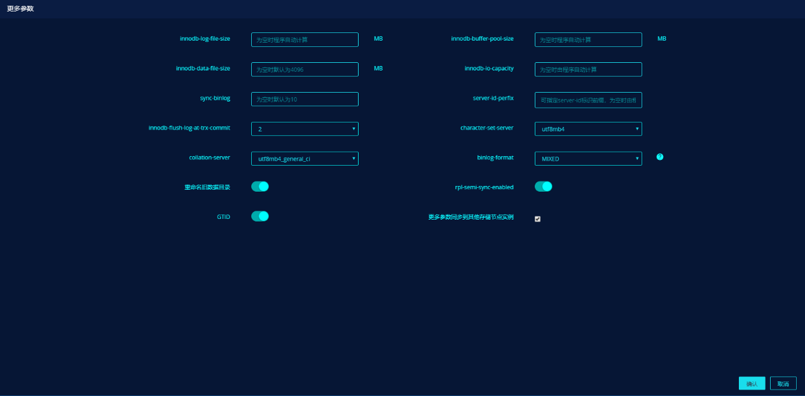

1. 安装的配置库实例可选择模式有：单库、双主、MGR，以选择MGR模式为例。

2. 配置库版本会因模式而变动，选择MGR模式时版本必须为5.7，选择其他模 式时可选择5.6或5.7的MySQL实例版本。

3. 选择MGR模式时可编辑MGR模式下的实例数量，默认3个，编辑时不能少于3个或大于9个。选择其他模式则无数量限制。

4. 创建高权限用户开关，开关默认打开即配置库MySQL实例安装成功后会默认生成一个"hotdb_root"的账户，该账户拥有MySQL实例的所有权限。

5. 实例端口号默认为3306，可根据实际情况自行修改。

6. "磁盘设备名称"与"数据目录"参数为选填项，为空时程序会自动为"磁盘设备名称"赋予空值，"数据目录"赋予默认值"/data"。关于参数详细说明，可参照"[集群部署脚本参数说明](#部署脚本说明)"。

7. 【更多参数】可为当前部署的MySQL实例设置更多选项参数，当参数的输入框为空时安装脚本会自行计算处理并给予默认值，无特殊要求时不建议修改。若需要使修改的参数适用到其他部署的配置库实例上可勾选"更多参数同步到其他配置库实例中"选项。

**（三）LVS参数**


1. 集群部署支持不安装LVS相关组件，当选择到不安装时，则不需要填写LVS配置参数

2. "LVS_vip"填写的IP，要求必须为没有被服务器或其他应用所占用的且和计算节点服务器在相同网段上。格式为VIP+子网掩码长度，例：192.168.200.120/24

3. "virtual_router_id的值可自行在范围【1-255】选定一个值，但该值必须在集群使用的网段内是唯一的，即没有与其他服务程序选取的值冲突。

4. 主备lvs_net_interface_name是LVS所在服务器的网关设备名称，该名称必须与实际服务器上显示的一致（可通过 ip a命令查看）,格式为：网关设备名称+ ":2" 例如："eth0:2"。

**（四）存储节点参数**

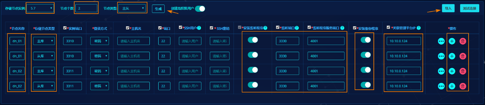


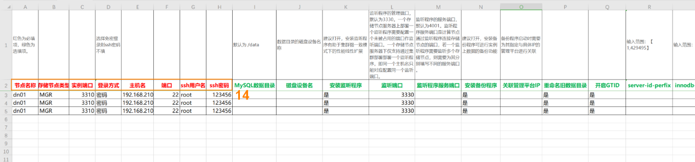

1. 存储节点的版本可选择"5.6、5.7"，默认为5.7。

2. 节点个数为集群中的数据节点个数，设置时不能超过128。

3. 节点类型为数据节点下关联的存储节点复制关系类型包含：单库、主从、双主、MGR。

4. 点击【生成】按钮可快速按照选填写的参数生成存储节点配置信息。

5. "创建高权限用户"请参照配置库该处说明。

6. "节点名称"为数据节点名称，默认根据"节点个数"自动生成，用户可自行修改。

7. "存储节点类型"默认根据选择的"节点类型"进行生成。例："节点类型"为"主从"，则在每个数据节点下分别生成一个"主库"、一个"从库"类型的存储节点记录。

8. "安装监听程序"开关默认打开，即在存储节点所在服务器上安装HotDB Listener组件。安装监听程序可用于解决计算节点集群模式的性能线性扩展问题。若用户暂不使用监听程序，可手动关闭。

9. "监听端口"即监听程序启动端口，默认值为3330，可手动修改。一个存储节点服务器上部署一个监听程序需要配置一个未被占用的端口作监听端口。一个存储节点服务器下仅支持通过集群部署部署一个监听程序，即同一个主机名只能对应配置同一个监听端口。若关闭"安装监听程序"，会联级置灰"监听端口"，不可编辑。

10. "监听程序服务端口"即计算节点通过监听程序连接存储节点的端口，默认值为4001，若一个监听程序需要监听多个存储节点，则需要为其分别填写不同的服务端口。若关闭"安装监听程序"，会联级置灰"监听程序服务端口"，不可编辑。

11. "安装备份程序"开关默认打开，即在存储节点所在服务器上安装HotDB Backup备份程序。

12. "关联管理平台IP"，默认填充当前执行集群部署任务的管理平台地址。该地址为备份程序启动时需要指定所服务的管理平台地址。

13. 点击操作中的"增加"、"删除"可新增或去除一行存储节点配置记录。

14. 存储节点数量过多时可考虑使用"导入"方式进行配置。导入前须先下载模板，再按照模板说明进行填写配置信息，完成后再导入管理平台中。若填写有误时，程序会显示导入失败与失败详细信息。

**（五）时间同步参数设置**


1. 时间同步主要是为集群所有服务器指定NTP时间服务地址，保证集群中的服务器时间保持一致。

2. 默认在主计算节点或多节点中的第一个计算节点所在服务器上安装NTP服务程序。若集群中已有可用的NTP服务，则可取消安装。

3. 集群中其他服务器时间同步地址默认指向已安装有NTP服务器的计算节点服务器地址，若计算节点不安装NTP服务器则其他服务器与计算节点服务器所指向的时间同步地址保持一致。

Tips: 在实际应用场景中，除了软件方面的时钟同步配置以外，还需要关注硬件时钟是否同步，可使用hwclock查看（一般在虚拟机环境中存在差异的可能性较大）。

###### 参数校验并保存


1. 仅保存：点击【仅保存】按钮，程序不会验证配置参数输入的合法性和完整性，仅校验必填项是否已填写。

2. 检查并保存：点击【检查并保存】按钮，程序会校验配置参数的合法性和完整性，并推送一键部署安装包和对应的MD5值文件到目标服务器上以验证是否符合集群部署的要求，不符合要求时会弹窗提示。开始部署前的集群都必须通过【检查并保存】才能进入安装环节。

> !!!NOTE
> 
> 若安装包在下载或推送过程中发生了损坏、变更，在"检查并保存"时会检测到安装包当前的MD5值和原对应的MD5值不一致，会弹窗提示"一键部署包完整性校验失败，请人工介入"，如下图：


3. 若集群配置参数检测未通过，需要根据报错情况进行相应的修改，然后再进行校验。

4. 如果因为服务器硬件配置不满足要求导致未通过检测的，建议先将配置参数通过【仅保存】按钮先保存下来，然后根据提示调整目标服务器的硬件配置或更换目标服务器，然后再进行校验。


5. 已保存但未开始安装的集群在"集群管理"页面显示时是未开启监控的，且集群部署信息各栏信息显示"已配置"字样。

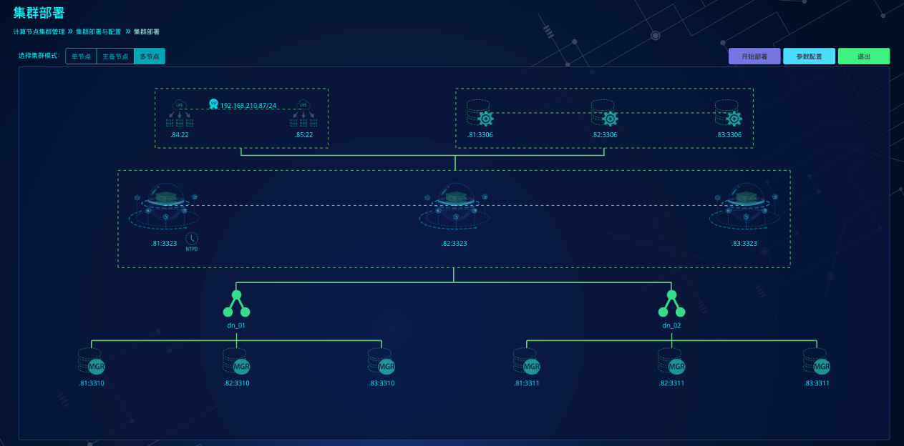

6. 已保存但未开始安装的集群，通过"部署拓扑"按钮进入后，显示如上图所示。虚线图标代表已配置好但未开始安装的组件。

###### 开始部署


1. 点击【开始部署】进入安装进程

- 若未通过校验的集群点击【开始部署】则提示不允许进入部署

- 通过"检查并保存"的集群，若在【开始部署】时计算节点集群中任一服务器上的安装包发生了损坏，即检测到安装包当前的MD5值和原MD5值不一致，也会弹窗提示：


2. 通过部署进度条查看当前部署状态。

3. 部署日志会实时输出到控制台中，总控制台可查看所有服务器部署完成情况。具体每台服务器控制台可单独查看对应服务器部署时的脚本执行日志信息。

4. 可点击右上角放大按钮，全屏查看。

5. 安装完成后可在总控制台中看到"集群部署成功"字样。

###### 部署完成


1. 部署成功的集群在"集群管理"页面中会自动开启监控，"集群部署信息"各栏显示各组件的运行状态信息。

2. 点击【部署拓扑】按钮进入部署拓扑图页面可查看到拓扑图中的图标都变成实线。

###### 实例密码修改

已部署完成的集群安装的配置库与存储节点实例都会自动生成一些账户。具体如下：配置库实例生成 hotdb_config、dbbackup、repl、hotdb_root(视是否开启创建高权限账户开关而定)；存储节点实例生成hotdb_datasource、dbbackup、repl、hotdb_root(视是否开启创建高权限账户而定)。

因为生成的账户的密码与账号一致，所以**建议部署完成后立即进行实例密码修改**，以提升集群的安全性。

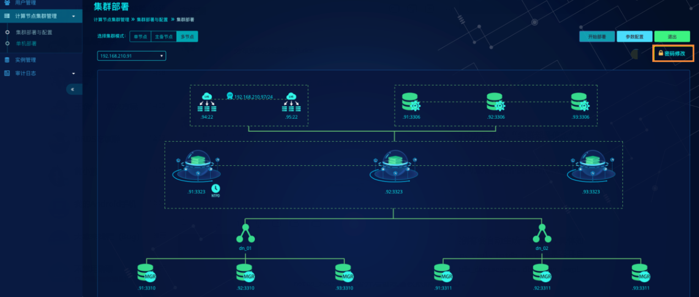


1. 实例密码修改分为：配置库实例密码修改、存储节点实例密码修改两部分。

2. 可通过点击操作栏中【密码修改】按钮进行单个用户密码修改，也可以通过【一键修改密码】按钮批量修改用户密码。

3. 批量修改用户密码是按照用户角色进行划分显示，例如配置库实例中对repl账户修改密码，则配置库所有实例中的repl账户密码都同步修改。存储节点也如此。

4. 对于具有复制关系的实例，修改用户的密码会将与其有复制关系的实例的用密码一同修改，例如具有MGR关系的存储节点实例（192.168.210.81：3311，192.168.210.82：3311，192.168.210.83：3311），修改192.168.210.81：3311实例上的hotdb_root用户密码为admin，程序会将另外两个实例的hotdb_root用户修改为admin。

5. 提交密码修改后实例密码修改页面会进行页面加载，此时请勿刷新页面或进行其他操作。

#### 单机部署

单机部署功能可以为用户在已有集群中继续添加新的组件。此外它也可以从零开始部署一套新的集群，因为除安装功能以外它还提供高可用搭建、一键启动等功能，但相对"[集群部署](#集群部署功能说明)"功能来说[单机部署](#单机部署)更适合部署单个组件。

##### 术语说明

单机部署相关术语请参照[名词解释](glossary.md)文档。

##### 功能使用须知

单机部署功能使用须知同[集群部署功能使用须知](#功能使用须知)一致，参照该描述即可。

##### 部署管理平台

单机部署属于管理平台中的功能，在使用前需要先安装好管理平台。安装步骤说明请参照[集群部署功能管理平台部署说明](#部署管理平台)。

##### 单机部署组件安装

> !!!INFO
> 
> 本次将通过[单机部署](#单机部署)功能为大家展示部署一个主备模式的集群。Keepalived虚拟地址（VIP）使用"192.168.200.112"；主备计算节点服务分别安装在"192.168.200.45、192.168.200.46"服务器上。同时在服务器"192.168.200.47、192.168.200.48"中各安装4个存储节点MySQL实例。

###### 添加部署任务

通过admin用户登录到管理平台后，选择"计算节点集群->单机部署"点击【添加部署任务】


###### 部署计算节点与配置库


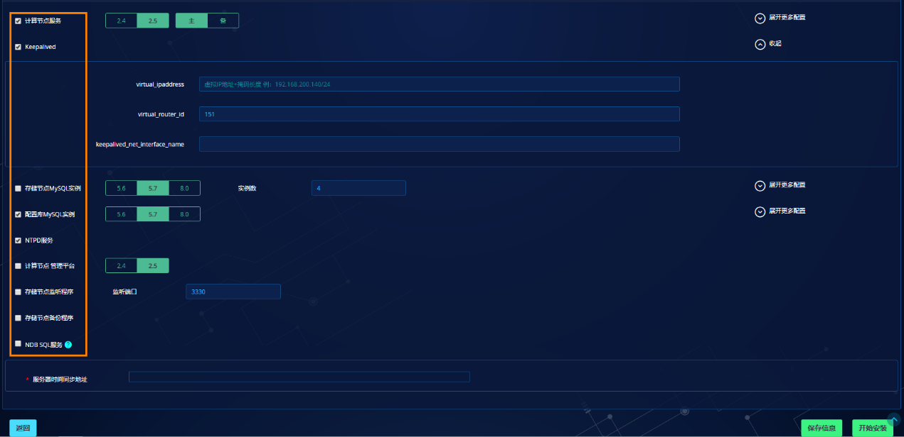

1. 服务器角色选择[计算节点](#计算节点)时，"软件安装信息及配置信息"中默认自动勾选"计算节点服务、Keepalived、配置库MySQL实例、NTPD服务"。该角色选择只为引导安装对实际安装不会产生影响，用户也可根据实际情况选择其他组件。

2. 目标部署服务器可通过"密码、免密"两种方式登录，若使用免密则需要提前手动建立服务器间的免密通道，具体参见"[实现免密登录说明](#实现免密登录说明)"。使用"密码"方式登录则需要输入SSH连接用户名与密码。

3. 点击【测试连接】可测试管理平台服务器与目标部署服务器间是否正常可连接。

4. 使用密码方式登录时，为了保障SSH信息安全管理平台只会保存24小时，过期后若需要重新连接目标服务器则需要点击【编辑】重新保存。

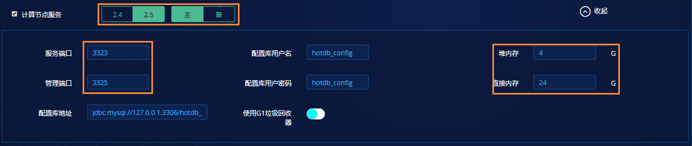

1. 计算节点可选择版本有"2.4、2.5"，2.4代表安装2.4.X版本的计算节点，具体版本号需以安装包内提供的为准。用户可根据实际情况进行选择。

2. 计算节点的主备选择需要根据当前规划的实际情况，主备模式中需要有一个主计算节点服务，一个备计算节点服务。

3. 服务端口与管理端口默认为"3323、3325"，如无特殊要求可直接使用默认值。

4. 若计算节点与配置库安装在同一台服务器，则配置库相关信息可以直接使用默认值但配置库地址IP需要填写实际值；若计算节点与配置库不在同一台服务器，则配置库信息需要根据实际情况做修改。

5. 堆内存与直接内存默认为"4G、24G"，用户也可以根据实际情况进行调整但输入范围不得超过【1-64】G。当堆内存大于8G时，建议打开G1垃圾回收器。

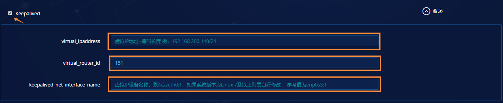

1. 主备模式的集群，在计算节点服务器上必须安装Keepalived组件，否则计算节点无法搭建高可用。

2. Keepalived的virtual_ipaddress（简称VIP）要求为没有被内网服务器或其他应用所占用且和计算节点服务器在相同网段上。格式为VIP+子网掩码长度，例：192.168.200.120/24。此处我们填写之前规划的VIP地址"192.168.200.112/24"。

3. virtual_router_id的值可自行在范围【1-255】选定一个值，但该值必须在集群使用的网段内是唯一的，即未与其他服务程序选取的值产生冲突。

4. keepalived_net_interface_name是Keepalived所在服务器的网卡名称，该名称必须填写正确，格式为网卡名称+ :1 例："eth0:1"。（网关设备名称可通过"ip a"命令查看）。


1. 配置库MySQL实例可与计算节点安装在同一台服务器上，也可以分开安装。默认与计算节点安装在一台服务器上。

2. 版本为配置库MySQL实例的版本号，可选择"5.6、5.7"。

3. MySQL安装参数中需要关注"MySQL实例端口"，默认3306，若该默认值被占用需要修改端口。

4. 其他参数如无特殊要求可直接使用默认值，为空的输入框程序会根据服务器情况自动计算并给出默认值。

5. 若同一台服务器上同时安装配置库与存储节点，则配置库参数配置只能修改 "MySQL实例端口"参数，其他更多参数只能在存储节点中设置。（原因：一台服务器只能设置一份MySQL参数）


1. 当服务器中安装了主计算节点服务时，"NTPD服务"会自动勾选安装，若已有NTP时间服务器，此处可去除勾选安装。

2. 每台目标部署服务器都需要指定时间同步地址。

- 若该服务器上安装NTPD服务则服务器时间同步地址建议填写阿里云时间同步地址"182.92.12.11"

- 若该服务器上未安装NTPD服务则服务器时间同步地址应当指定为内网中已安装NTPD服务的服务器地址

3. 点击【保存信息】则将配置信息保存可供后期安装、点击【开始安装】则直接进入安装进程。

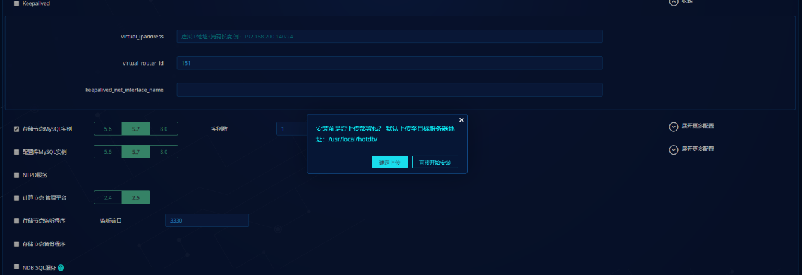

1. 首次安装时需要将一键部署安装包和其对应的MD5值文件从管理平台服务器上传至目标部署服务器，所以必须点击【确定上传】。关于管理平台服务器存放资源包说明请参照"[集群部署的功能使用须知](#功能使用须知)"最后一条

- 若安装包在上传过程中发生了损坏，在"确定上传"时会检测到安装包当前的MD5值和其对应的MD5值不一致，会跳出弹窗提示：


2. 若手动将一键部署安装包和其对应的MD5值文件上传至目标服务器/usr/local/hotdb中或之前已完成包资源上传，则可点击【开始安装】跳过上传安装包的动作，但手动上传包需保证包的完整性


1. 进入安装进程后，页面底部会实时输出安装日志与安装结果。安装日志"hotdbinstall.log"在目标服务器"/usr/local/hotdb/ Install_Package"目录下。

2. 安装过程中如果有error信息会用红色字体标识，warning信息用橙色标识。出现error信息则意味着此次安装任务失败，需要根据提示信息进行修改再尝试安装。

3. 成功安装完成可以根据安装日志是否出现："hotdbinstall finished without error, but you should check if there is any warnings"字样判断。也可以根据右侧安装结果判断。


1. 正在安装的任务可放至后台运行，继续添加新的安装任务，待安装任务完成后刷新页面即可看到安装的组件完成状态。

2. 已保存或已安装的任务都可以进行"克隆"，点击【克隆】即将该任务的所有配置参数复制到一个新的部署任务中，可适当减少重复配置。


1. 备计算节点的安装可通过克隆之前主计算节点的安装任务，然后修改"主机名"、"计算节点角色"等参数。其他参数视实际情况进行修改。

2. 注意安装备计算节点时无需勾选"NTPD服务"只需将"服务器时间同步地址"填写成主计算节点服务器IP地址即可或指向内网中已安装NTPD服务的IP地址。

###### 部署存储节点实例


1. 选择"服务器角色"为存储节点服务器，并填写存储节点的目标安装服务器SSH信息。

2. 根据角色，安装组件将自动勾选"存储节点MySQL实例、存储节点监听程序、存储节点备份程序"。

3. 存储节点监听程序默认端口为3330，可自行调整。若不安装监听程序，可手动取消勾选。后续以取消勾选安装监听程序为示例。

4. 根据部署要求在192.168.200.48中安装4个存储节点MySQL实例，所以"实例数"选择4。

5. 服务器时间同步地址填写主计算节点服务器IP（192.168.200.45）。


1. 点击【开始安装】并上传安装包及其对应的MD5值文件至存储节点目标部署服务器中。

2. 可查看日志安装的实时进度。

3. 通过【克隆】按钮将部署存储节点的任务克隆到"192.168.200.48"中，修改SSH信息即可进入安装。

##### 单机部署高可用搭建

高可用搭建可在单机部署功能中为已安装好的组件进行高可用自动搭建服务，包括计算节点高可用、存储节点高可用、配置库高可用搭建。

###### 计算节点高可用搭建


1. 点击【高可用搭建】按钮进入高可用搭建页面，在[计算节点高可用搭建](#计算节点高可用搭建)模块点击【添加】可弹出添加计算节点高可用的配置窗口。

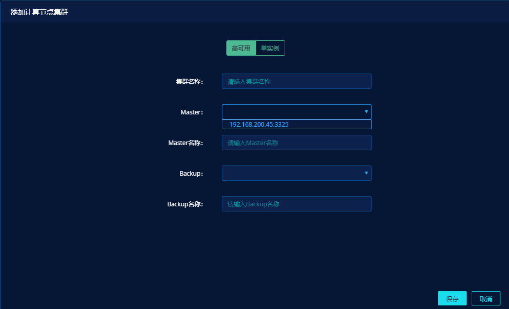

2. 弹窗中选择"高可用"则为计算节点搭建HA高可用关系，若选择"单实例"则表示计算节点为单节点模式。
3. 集群名称为主备计算节点所在集群的名称，此处可自定义命名但不允许与已有集群名称重复。
4. Master为主计算节点，若之前主计算节点安装成功且未经过搭建的则下拉框会显示出来。
5. Backup为备计算节点，若顶部选择的为"单实例"则Backup无需选择。
6. Master名称与Backup名称为计算节点的备注名称，可自定义命名但不允许与已有的计算节点重名。
7. 点击【保存】即开始为主备计算节点搭建高可用关系。

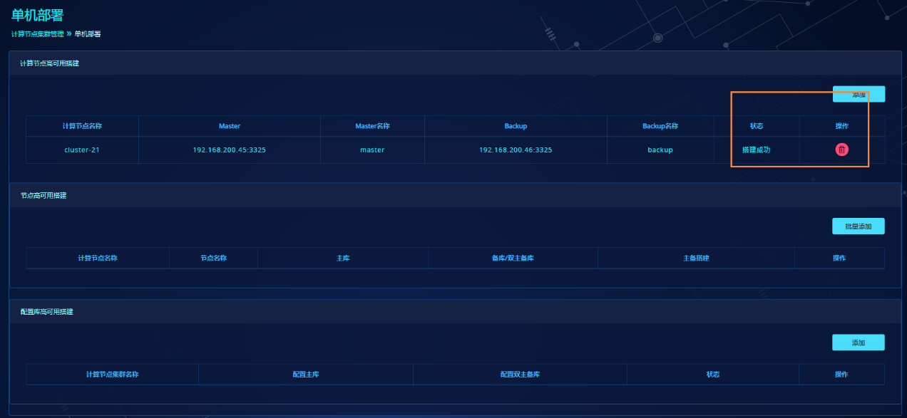

###### 存储节点高可用搭建


1. 点击"节点高可用搭建"模块中【批量添加】按钮，若计算节点高可用未搭建或没有搭建的历史记录，则点击【批量搭建】会提示"请先搭建一个计算节点集群"（因为存储节点高可用搭建需要选择所属哪个计算节点集群）。

2. 添加存储节点高可用配置需要先选择"计算节点集群"，可选择刚搭建好的计算节点集群。

3. 节点名称为存储节点所属的数据节点名称（dataNode）,可自定义命名但不能与已有数据节点重名。

4. 复制模式指在同一数据节点下的存储节点以何种方式存在，目前支持数据节点下的存储节点可以为"单库、主从、双主"三种复制形式。

5. 添加多条节点高可用记录时，点击"+"即可新增配置记录。

6. 填写好节点高可用配置后，点击【开始搭建】则自动为存储节点搭建高可用复制关系。


1. 存储节点搭建完成会以数据节点为单位进行记录显示，对于搭建失败的记录可以点击【编辑】按钮重新修改参数再进行搭建。

###### 配置库高可用搭建


1. 选择已安装好的配置库实例，并选择所属集群，点击【搭建】按钮开始搭建。

2. 搭建完成后，程序会将具有双主关系的配置库地址修改到server.xml文件中。


##### 单机部署启动程序

启动程序主要为已安装好的组件或已搭建好高可用的集群进行一键启动服务。目前可启动的服务主要有："计算节点、Keepalived、备份程序、管理平台"。"存储节点MySQL实例、配置库MySQL实例、NTPD服务"在程序安装完成后会直接启动，无需再次启动。


1. 进入启动程序页面可通过单机部署页面中的【启动程序】按钮，也可以在高可用搭建完成后右下角直接点击【启动程序】。


1. 启动程序页面显示部署任务页面中所有安装成功的服务器记录，同时根据高可用搭建历史记录对已搭建主备的服务器做合并显示。

2. 勾选可选择需要启动的组件，去除勾选则不进行启动。

3. 第一组记录为具有计算节点高可用搭建记录的集群，进行启动时若打开"自动生成基础配置"开关则一键启动程序会将计算节点集群、数据节点、存储节点以及默认生成的记录信息写入管理平台的配置库中，用户登录管理平台后便可直接查看无需重新添加配置。

4. 第二、三组为无计算节点高可用搭建记录的集群，进行启动时不会生成任何配置信息（因为没有配置所属的计算节点集群，所以无法生成信息，**启动好后需用户手动添加**到管理平台内）。


1. 若启动项中包含存储节点备份程序即"HotDB Backup"，则会有"启动参数设置"的弹窗让用户指定备份程序启动时关联的管理平台IP地址。

2. "备份程序IP"为需要启动的备份程序所在服务器IP地址，"管理平台IP地址"为备份程序启动时关联的管理平台IP地址（可选择当前正在使用的管理平台IP地址）。


1. 点击【一键启动】进入程序启动与配置生成进程。

##### 单机部署安装NDB SQL

若已安装好计算节点，但后期需要追加安装NDB SQL服务则可通过单机部署功能进行操作。相关操作步骤以及注意事项如下所述：

**使用须知：**

- 使用单机部署功能为已有计算节点单独安装NDB SQL需满足集群中的计算节点是通过线下手动方式进行部署的，而未使用集群部署或单机部署功能。

- 若计算节点是通过集群部署或单机部署方式进行部署的，后期需要追加NDB SQL功能目前只能通过[线下手动安装](#ndb-sql服务)的方式进行。

- NDB SQL必须与计算节点安装在同一台服务器上且计算节点版本不低于V 2.5.2。

**操作步骤：**


- 填写计算节点的服务器地址以及SSH连接信息。

- 勾选NDB SQL服务，并注意红色字体提示。

- 填写与计算节点安装时指定的时间同步地址一致的值

#### 实现免密登录说明

免密登录需要在两台服务器之间建立免密通道，具体操作如下：

以192.168.190.186与192.168.190.187实现免密连接为例

1. 在192.168.190.186的服务器上执行ssh-keygen,连续按3次回车，完成生成公钥和私钥,其中id_rsa为私钥，id_rsa_pub为公钥，到/root/.ssh目录下可看到刚刚命令生成的私钥和公钥文件。

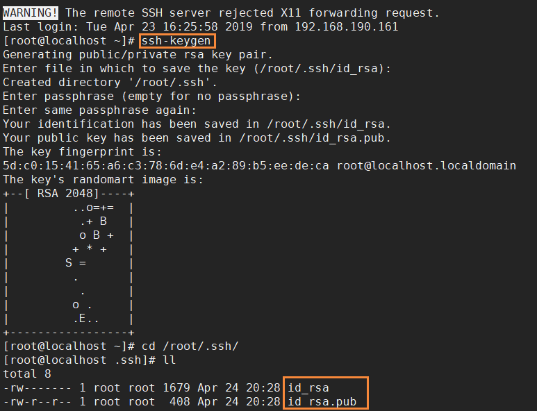

2. 输入ssh-copy-id目标服务器的IP，再输入目标服务器的密码，就可以将公钥传到目标服务器

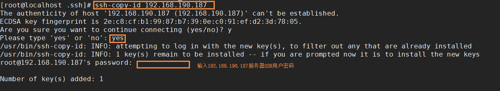

3. 在192.168.190.187服务器上查看从192.168.190.186服务器上传送过来的公钥文件"authorized_key"。

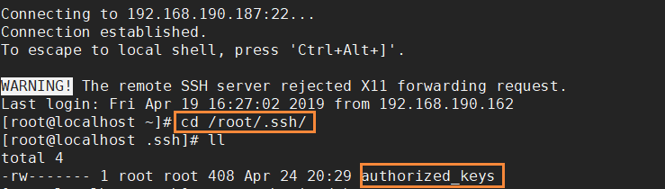

4. 测试不需要输入密码直接从192.168.190.186服务器ssh 到192.168.190.187服务器是否能够成功登录。

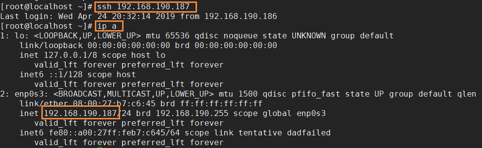

#### 部署脚本说明

脱离管理平台您也可以直接使用安装脚本进行安装，在hotdbinstall.sh脚本后添加--xxx=xxx的方式使用

##### 脚本参数说明

| 参数名称 | 参数说明 |
|-----------------------------------|--------------------------------------------------------------------------------------------------------------------------------------------------------------------------------------------------------------------------|
| dry-run | 只做检查，不做任何修改，可选范围"yes" "no"，默认"no" |
| hotdb-version | 指定HotDB大版本号，可选范围"2.3" "2.4" "zabbix"，默认"2.4" |
| install-hotdb-server | 是否安装HotDB-server，可选范围"yes" "no"，默认"no" |
| install-ndbsql | 是否安装ndbsql，可选范围"yes" "no"，默认"no" |
| install-hotdb-listener | 是否安装HotDB-listener，可选范围"yes" "no"，默认"no" |
| --listener-heap-mem-size-gb | 如果指定，会帮助将HotDB Listener启动脚本中堆内存大小由4G修改为指定值，默认不修改 |
| --listener-max-direct-mem-size-gb | 如果指定，会帮助将HotDB Listener启动脚本中直接内存大小由24G修改为指定值，默认不修改 |
| hotdb-use-g1 | 如果指定，会帮助将hotdb启动脚本修改为使用G1垃圾回收器，默认不修改 |
| hotdb-heap-mem-size-gb | 如果指定，会帮助将hotdb启动脚本中堆内存大小由4G修改为指定值，默认不修改 |
| hotdb-max-direct-mem-size-gb | 如果指定，会帮助将hotdb启动脚本中直接内存大小由24G修改为指定值，默认不修改 |
| install-hotdb-server-management | 是否安装HotDB-server-management，可选范围"yes" "no"，默认"no" |
| install-hotdb-backup | 是否安装HotDB-backup，可选范围"yes" "no"，默认"no" |
| mysql-version | 指定MySQL大版本号，可选范围"5.6" "5.7"，默认"5.6" |
| mysql-port-list | 指定要安装的MySQL数据源端口列表，逗号分隔，要求递增顺序排列，示例："3306,3307,3308,3309"，默认为空 |
| hotdb-config-port | 指定要安装的配置库端口列表，不可以和MySQL数据源端口冲突，默认为空 |
| hotdb-config-init | 是否要在hotdb-config-port指定的实例初始化hotdb_config库，可选范围"yes" "no"，默认安装HotDB-server时为yes，不安装HotDB-server时为no。 |
| mysql-data-diskname | 指定用于MySQL数据目录的磁盘设备名称，如果该设备没有挂载，且没有被格式化过，将自动格式化此设备并挂载到数据目录，默认为空 |
| mysql-data-rootdir | 指定要使用的MySQL数据目录根目录，默认"/data"，必须是绝对路径 |
| rename-datadir-before-initdb | 指定在初始化数据库前，是否重命名可能存在的旧数据目录，默认为"yes" |
| server-id-perfix | 指定server-id使用的前缀，要求为小于429496的数字，默认自动计算，但不保证绝对无冲突 |
| character-set-server | 指定字符集，可选范围"latin1" "gbk" "utf8" "utf8mb4"，默认"utf8mb4" |
| collation-server | 指定校对集，可选范围"latin1_swedish_ci" "latin1_bin" "gbk_chinese_ci" "gbk_bin" "utf8_general_ci","utf8_bin" "utf8mb4_general_ci" "utf8mb4_bin"，默认值为配置的字符集的默认校对集 |
| innodb-buffer-pool-size-mb | 单位为MB的innodb-buffer-pool-size大小，默认自动计算 |
| innodb-log-file-size-mb | 单位为MB的innodb-log-file-size大小，默认自动计算 |
| innodb-data-file-size-mb | 单位为MB的ibdata文件大小，默认"4096" |
| innodb-io-capacity | 指定innodb-io-capacity的大小，默认自动计算 |
| innodb-flush-log-at-trx-commit | 指定innodb-flush-log-at-trx-commit设置，默认"2" |
| sync-binlog | 指定sync-binlog的设置，默认"10" |
| binlog-format | 指定binlog-format的设置，可选范围"MIXED" "ROW"，默认"MIXED" |
| gtid-mode | 是否启用gtid，可选范围"on" "off"，默认"on" |
| rpl-semi-sync-enabled | 是否启动半同步复制，可选范围"on" "off"，默认"on" |
| mgr-group-name-list | MySQL端口号:MGR组UUID:MGR本地端口号列表，逗号分隔，如果提供该参数，将为对应端口打开MGR，例如"3306:540c2b46-5d73-11e8-ad9b-00a0c9000000:33060,3308:5f5c1e2d-5d73-11e8-ad9b-00a0c9000000:33080"，默认为空。（注意，仍然需要在mysql-port-list、hotdb-config-port中指定欲创建的MySQL实例） |
| mgr-group-local-ip | MGR本地端口绑定的本地IP地址，默认自动计算。 |
| mgr-group-seeds-list | MySQL端口号:MGR组成员IP:端口逗号分隔列表，斜杠分隔，如果提供该参数，将在my.cnf文件中对应端口添加该值，默认为空，例如"3306:192.168.200.101:33060,192.168.200.102:33060,192.168.200.103:33060/3308:192.168.200.101:33080,192.168.200.102:33080,192.168.200.103:33080" |
| creat-hotdbroot-in-mysql | 是否在MySQL中创建hotdb_root用户，用户拥有所有权限，并且可以从任意位置连接，默认密码hotdb_root，可选范围"yes" "no"，默认"no" |
| install-keepalived | 是否安装keepalive，可选范围"master" "backup" "no"，默认"no" |
| keepalived-vip-with-perfix | 如果指定，会帮助将keepalive配置中的vip由192.168.200.140/24替换为该值，默认不修改 |
| keepalived-virtual-router-id | 如果指定，会帮助将keepalive配置中的virtual-router-id由151替换为该值，默认不修改 |
| keepalived-net-interface-name | 如果指定，会帮助将keepalive配置中的vip设备名称由eth0:1替换为该值，默认不修改 |
| install-lvs | 是否安装lvs服务端，可选范围"master" "backup" "no"，默认"no" |
| lvs-vip-with-perfix | 如果指定，会帮助将lvs配置中的vip由192.168.56.203/24替换为该值，默认不修改 |
| lvs-port | 如果指定，会帮助将lvs配置中的监听端口由3306替换为该值，默认不修改，端口需要和HotDB集群的数据服务端口相同 |
| lvs-virtual-router-id | 如果指定，会帮助将lvs配置中的virtual-router-id由51替换为该值，默认不修改 |
| lvs-net-interface-name | 如果指定，会帮助将lvs配置中的vip设备名称由eth1:2替换为该值，默认不修改 |
| lvs-real-server-list | lvs后端HotDB服务器IP:数据服务端口:管理端口列表，逗号分隔，例如"192.168.0.1:3323:3325,192.168.0.2:4323:4325"，默认为空 |
| lvs-real-server-user | lvs健康检查脚本连接后端HotDB服务器管理端口使用的用户名，默认"root" |
| lvs-real-server-password | lvs健康检查脚本连接后端HotDB服务器管理端口使用的用密码，默认"root" |
| lvs-real-server-startup-type | 作为lvs的realserver时，服务器相关调整的配置方式，可选范围"no" "config" "service" 默认"no" |
| install-ntpd | 是否安装ntpd，可选范围"yes" "no"，如果安装HotDB，则默认安装ntpd，否则默认不安装。注意，一个HotDB集群里面，应当只有一个ntpd；HotDB备机应当向HotDB主机同步时间。如果内网有ntp源，则不必安装ntpd。 |
| ntpdate-server-ip | 配置时间同步的ip地址，该参数与ntpdate-server-host必须指定其中一个且只能指定其中一个。如果本机安装ntpd，则应当指定为HotDB集群外的时间源；如果本机不安装ntpd，则应当指定为HotDB集群内部的ntpd服务所在的服务器地址（如果主HotDB安装了ntpd服务的话），或内网中的ntpd服务器地址，不应该选择外网地址。 |
| ntpdate-server-host | 配置时间同步的主机地址，允许为域名或ip，脚本不会对该参数做任何处理与检查，需要依赖调用者保证正确性，该参数与ntpdate-server-ip必须指定其中一个且只能指定其中一个。如果本机安装ntpd，则应当指定为HotDB集群外的时间源；如果本机不安装ntpd，则应当指定为HotDB集群内部的ntpd服务所在的服务器地址（如果主HotDB安装了ntpd服务的话），或内网中的ntpd服务器地址，不应该选择外网地址。 |

##### 参数使用说明

参数的组合使用：参数名=值+空格+参数名=值 ，例如：

```
--hotdb-heap-mem-size-gb=1 --hotdb-max-direct-mem-size-gb=1 --ntpdate-server-ip=192
.168.200.140 --rpl-semi-sync-enabled=on --mysql-version=5.7 --hotdb-config-port=3316 --install-ntpd=yes --install-hotdb-server=yes --hotdb-version=2.5 --install-hotdb-backup=yes --mysql-port-list=3307,3308 --install-hotdb-server-management=yes
```

脚本安装存储节点监听程序：

```
--hotdb-heap-mem-size-gb=1 --hotdb-max-direct-mem-size-gb=1 --ntpdate-server-ip=192
.168.200.140 --rpl-semi-sync-enabled=on --mysql-version=5.7 --hotdb-config-port=3316 --install-ntpd=yes --install-hotdb-server=yes --install-hotdb-listener=yes --hotdb-version=2.5 --install-hotdb-backup=yes --mysql-port-list=3307,3308 --install-hotdb-server-management=yes
```

运行脚本使用方法：

```
sh -x 脚本名称.sh+空格+参数串
sh -x hotdbinstall_v*.sh --hotdb-heap-mem-size-gb=1 --hotdb-max-direct-mem-size-gb=1
--ntpdate-server-ip=192.168.200.140 --rpl-semi-sync-enabled=on --mysql-version=5.6 --hotdb-config-port=3316 --install-ntpd=yes --install-hotdb-server=yes --hotdb-version=2.4 --install-hotdb-backup=yes --mysql-port-list=3307,3308 --install-hotdb-server-management=yes
```

##### 脚本其他说明

1. 因当前一键部署安装脚本需要执行tune脚本，tune脚本中会修改网卡相关硬件参数，可能导致网卡短暂失去响应或网卡内部重启。已知在配置了Bond的环境下，可能因为操作系统响应不够快或交换机响应不够快，导致短时间内的网络连接中断，进而导致SSH终端断连或HotDB连接中断，部分情况可通过缩短Bond 配置参数miimon=100缓解。

2. 安装前建议关闭服务器自带的防火墙与selinux功能（selinux重启生效）。

