# 标准

## 基本信息

此手册基于**分布式事务数据库产品 HotDB Server - V2.5.6版本**编写，主要说明计算节点的基本使用方法及操作流程，供使用者参考与学习。

此手册中部分功能可结合分布式事务数据库平台（以下简称管理平台）共同使用，若需了解管理平台的使用方法，请参考[管理平台](hotdb-management.md)文档。

HotDB Server在2.5.3.1及以上版本时提供基于MySQL原生复制功能解决HotDB Server跨机房灾备问题的解决方案，能够实现跨机房数据同步以及解决跨机房分布式事务数据库服务灾备的问题。此标准文档仅详细介绍HotDB Server在单机房模式的功能与特性，若要了解灾备模式下的功能与特性，请参考[跨机房灾备](cross-idc-disaster-recovery.md)文档。

部分截图的版本细节差异无需特别关注，以文档描述的版本号为准。文档内容较多，建议开启文档结构图，方便阅读。

### HotDB Server 简述

HotDB Server是一款实现数据容量和性能横向扩展的分布式事务数据库产品，可解决实时交易业务系统的"两大三高"（即大规模用户、大规模数据、高可用、高并发、高吞吐）问题。

HotDB Server能在数据存储分布式化的环境下为应用提供集中式数据库的操作体验，同时提供数据安全、数据容灾、数据恢复、不停机在线扩容、集群监控、智能拓扑、智能大屏等整套解决方案。

HotDB Server支持将一张表水平切分成多份，分别存入不同的数据库来实现数据的水平分片，此外也支持垂直拆分和全局表。HotDB Server提供多种表数据分片规则，用户可根据业务需要，使用合适的数据分片规则。

HotDB Server基于Java NIO、MySQL协议研发，支持数据库连接的多路复用，具有更好的并发性能。

HotDB Server提供数据库服务自动切换功能，可有效地解决数据库单点故障问题。

与计算节点配套使用的管理平台（也称为HotDB Management）也是产品重要组成部分。

#### HotDB Server组件架构

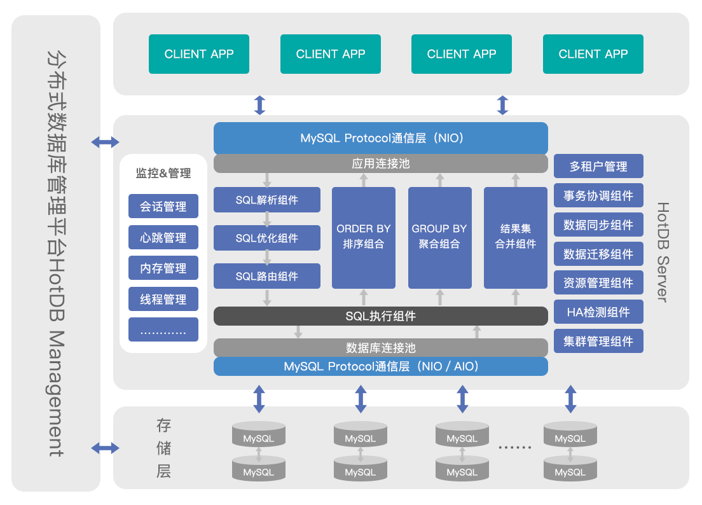

图 1.1.1-1 HotDB Server的功能组件架构图

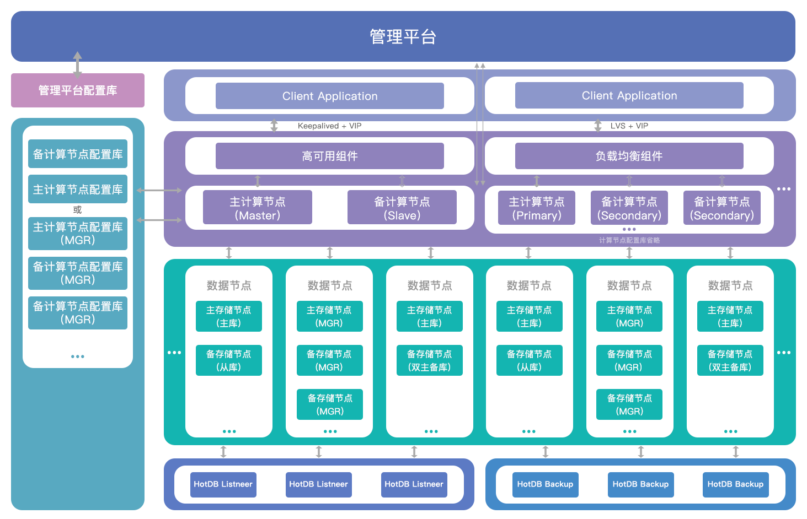

图1.1.1-2 HotDB Server的组件架构图

分布式事务数据库HotDB Server集群是由一组计算节点、存储节点、管理平台、配置库组成的数据库管理系统。

**[计算节点](#计算节点)：**计算节点是分布式事务数据库HotDB Server集群体系的核心，主要提供SQL解析、路由分发、结果集合并等分布式事务数据库的核心控制功能,是整个分布式服务的命脉所在。

**存储节点：**存储节点依赖MySQL数据库提供数据的存储功能，一个MySQL实例(IP+端口+物理库)即为一个存储节点。为了实现高可用和数据多副本功能，HotDB中将具有相同数据副本的一组（多个）存储节点称为一个**数据节点**。

**数据节点：**数据节点是一组具有相同数据副本的存储节点的统称。数据节点可以是一个MySQL MGR集群，也可以是一个MySQL主从复制集群。数据节点管理一组存储节点（具有相同数据副本）的复制关系。数据节点在HotDB中作为一个分片数据存在，所有的数据节点一起构成HotDB的全量数据。

**[管理平台](#管理平台)：**分布式事务数据库管理平台（以下简称管理平台）又称为HotDB Management，可实现对计算节点数据库用户、数据节点、表类型、分片规则等信息的易用性配置，同时可提供计算节点服务状态监控、异常事件提醒、报表查看、任务管理等智能运维相关服务。

**配置库：**负责存储计算节点与管理平台相关配置信息。配置库可通过主从或MGR进行高可用配置。

**高可用：**HotDB Server的计算节点可通过Keepalived实现高可用。Keepalived负责计算节点的主、备切换和VIP漂移。

**负载均衡：**HotDB Server的计算节点集群模式可通过LVS/F5实现高可用和负载均衡。应用通过LVS的VIP访问HotDB Server的分布式事务数据库服务，分布式事务数据库服务对应用程序透明，计算节点集群中单个或多个节点故障对应用程序无影响。

**HotDB Backup：**热璞数据库自研的分布式事务数据库备份程序，负责业务数据的备份。

**HotDB Listener：**热璞数据库自研的一个可拔插组件，需要单独进行部署，并以独立的进程运行，从而解决集群强一致（XA）模式下的性能线性扩展问题。

#### 专业名词解释

若想要了解HotDB Server集群体系相关术语及关系，请参考[名词解释](glossary.md)文档。

#### 计算节点

计算节点是数据服务提供端，默认服务端口为3323，登录命令如下：

```bash
mysql -uroot -proot -h127.0.0.1 -P3323
```

登陆后使用方法与使用MySQL数据库一致，例如：

```
root> mysql -uroot -proot -h127.0.0.1 -P3323
mysql: [Warning] Using a password on the command line interface can be insecure.
Welcome to the MySQL monitor. Commands end with ; or g.
Your MySQL connection id is 515
Server version: 5.1.27-HotDB-2.5.0 HotDB Server by Hotpu Tech
Copyright (c) 2000, 2016, Oracle and/or its affiliates. All rights reserved.
Oracle is a registered trademark of Oracle Corporation and/or its affiliates. Other names may be trademarks of their respective owners.
Type 'help;' or 'h' for help. Type 'c' to clear the current input statement.

mysql> show databases;
+-----------------+
| DATABASE        |
+-----------------+
| CLASSIC_LOGICDB |
| HotDB           |
+-----------------+
2 rows in set (0.01 sec)

mysql> use CLASSIC_LOGICDB
Database changed

mysql> show tables;
+---------------------------+
| Tables_in_CLASSIC_LOGICDB |
+---------------------------+
| customer                  |
+---------------------------+
1 row in set (0.03 sec)
```

应用程序连接计算节点与连接MySQL一致，只需修改应用中数据库配置文件的host、port、database、user、password信息即可。HotDB Server支持不同开发平台下的MySQL数据库驱动、连接池，比如JAVA开发平台的JDBC，c3p0、DHCP、DRUID连接池。下面是c3p0连接池的配置举例：

```xml
<!-- 数据库映射 -->
<!-- com.mchange.v2.c3p0.ComboPooledDataSource, org.apache.commons.dbcp.BasicDataSource -->
<bean id="dataSource1" class="com.mchange.v2.c3p0.ComboPooledDataSource" destroy-method="close">
  <property name="driverClass" value="com.mysql.jdbc.Driver" />
  <property name="jdbcUrl" value="jdbc:mysql://192.168.137.101:**3323**/cloth?useLocalSessionState=true" /> <!--其中3323端口位置要修改为计算节点服务端口-->
  <property name="user" value="root" />
  <property name="password" value="$root" />
  <property name="initialPoolSize" value="10" />
  <property name="maxPoolSize" value="256" />
  <property name="minPoolSize" value="10" />
  <property name="maxIdleTime" value="1800" />
  <property name="maxStatements" value="1000" />
</bean>
```

同时，计算节点默认管理端口为3325，在管理端口中可使用命令对当前服务进行监控与管理。若需要了解更多信息，请参考[管理端信息监控](#管理端信息监控)。

#### 管理平台

管理平台为计算节点提供用户信息、节点信息、表信息、分片等信息的配置，默认端口为3324，在浏览器中输入HTTP链接地址，即可访问管理平台（建议使用Chrome或者FireFox浏览器）

如：`http://192.168.200.191:3324/login`，访问页面如下所示：


管理员用户名与密码都默认为：admin，其他用户账号由管理员创建，初始密码为`service_hotdb@hotdb.com`。

如果需要了解管理平台详细使用方法，请参考[管理平台](hotdb-management.md)文档。

### 版本2.5.6新功能与新特性

本章节将简单介绍在HotDB Server -- V2.5.6中新增、禁止或删除的功能概要，详细功能使用方法可点击超链接查看详情：

- 支持[计算节点服务数量在线水平扩容/缩容](#计算节点水平弹性伸缩)功能，即在线扩展计算节点实例个数；
- 基于MySQL复制的跨机房灾备功能支持多计算节点集群模式，详情可查看[跨机房灾备](cross-idc-disaster-recovery.md)文档。
- 支持直接解析识别部分[Oracle函数以及Sequence语法](#enableoraclefunction)，以减少Oracle迁移至HotDB Server时的业务代码修改量；
- 支持客户端连接使用SSL+[SM4国密](#sslusesm4)认证安全通道；
- 优化根据默认分片节点创建[全局表](#全局表)的功能；
- 新增[operateMode](#operatemode)参数，满足一键配置不同需求场景下的参数组合，如性能最大化、调试模式等；
- 支持直接通过SQL语句[修改分片字段](#在线修改分片字段)（alter table ... change shard column ...）；
- 优化[死锁检测](#死锁检测)逻辑：发生死锁根据MySQL版本号控制是否回滚事务并新开事务；
- 优化[XA模式](#使用xa事务)下连接断开的日志记录，可通过日志分析是否需要重做事务；
- 优化[存储节点](#数据节点高可用)/[配置库](#配置库高可用)故障或手动切换后，其角色进行互换的逻辑及动态加载不改变原有主库服务的逻辑；
- 优化[存储节点](#数据节点高可用)/[配置库](#配置库高可用)故障或手动切换逻辑，兼容[master_delay](#waitforslaveinfailover)参数设置，防止因master_delay参数设置导致切换一直不成功的情况；
- 优化根据已有[分片规则建表](#已有分片规则建表)，其分片属性可以写在表定义之后；
- 支持使用SQL语句[创建/删除用户且为用户赋权/解权](#用户管理语句)；
- 支持直接使用SQL语句[创建逻辑库](#create语句)；
- 支持使用SQL语句创建/删除/修改 VIEW (视图)。

### 版本2.5.6新计算节点参数

此小节将介绍在计算节点-- V2.5.6中优化与新增的计算节点参数，列举如下：

| 计算节点参数名 | 计算节点参数说明 | 默认值 | 动态加载是否生效 | 支持版本 |
|----------------|------------------|--------|------------------|----------|
| [enableOracleFunction](#enableoraclefunction) | 是否优先解析oracle函数 | false | N | 2.5.6 |
| [lockWaitTimeout](#lockwaittimeout) | 获取元数据锁的超时时间（s） | 31536000 | Y | 向下同步至2.5.3 |
| [operateMode](#operatemode) | 计算节点工作模式 | 0 | Y | 2.5.6新增 |
| [maxReconnectConfigDBTimes](#maxreconnectconfigdbtimes) | 最大重试连接配置库次数 | 3 | Y | 2.5.6 |
| [sslUseSM4](#sslusesm4) | 是否支持国密算法 | False | Y | 向下同步至2.5.5 |
| [haMode](#hamode) | 新增了状态：4：集群模式中心机房5：集群模式灾备机房 | 0 | N | 2.5.6 |
| [crossDbXa](#crossdbxa) | 跨逻辑库是否采用XA事务 | false | N | 2.5.5 |

## HotDB Server安装部署与升级

### 服务授权

HotDB Server需要获取正规的授权许可证，方能正常提供服务。如果需要了解如何获取服务授权，请参考[服务授权](service-license.md)文档。

### 安装部署与升级

部署HotDB Server，需要安装JDK（JAVA运行环境）、MySQL数据库软件、USB KEY驱动包、计算节点、管理平台，并配置一个MySQL实例作为计算节点的配置库。部署用的服务器，操作系统，推荐使用64位的CentOS 6.x。若需要了解HotDB Server的安装、部署与升级，请参考[安装部署](installation-and-deployment.md)文档。

### 配置文件

计算节点的配置文件位于安装目录下的conf目录，文件名称为server.xml。如果需要了解HotDB Server参数，请参考[计算节点参数使用说明](#计算节点参数使用说明)。

server.xml的部分参数修改后需要重新启动计算节点才能生效，部分参数修改后可通过"[动态加载](#动态加载reload)"生效。

如果第14章[计算节点参数使用说明](#计算节点参数使用说明)中所列参数在server.xml中不存在，则说明该参数使用了默认值；如果想要调整某个参数值或增加某个参数，请在server.xml中增加如下代码，也可以通过管理平台的"配置"->"计算节点参数"页面添加。

```xml
<property name=" dropTableRetentionTime">0</property><!--被删除表保留时长,默认为0,不保留-->
```

## 快速配置HotDB Server

本节将描述快速配置分布式事务数据HotDB Server的方法。本节仅介绍必要的配置功能，用于达到快速入门的目的。如果需要了解更多的配置功能，请参考[管理平台](hotdb-management.md)文档。

在下面的例子中，将配置一个3个节点的数据分片，该分片使用名称为"test"的逻辑库，分片表名称为"customer"，分片字段为"provinceid"，自动分片表。

在配置HotDB Server前，请确保管理平台与计算节点已经正常启动，并且已经准备好了6个MySQL数据库实例（此例子中，将以配置双主类型的数据节点为例，若只需要单库的数据节点，只需要准备3个实例即可）。

若需要了解更多关于HotDB Server与管理平台的安装部署，请参考[安装部署](installation-and-deployment.md)文档。

### 登录管理平台

在浏览器中输入管理平台的HTTP链接地址，并登录到管理平台；HTTP链接地址通常为部署管理平台的服务器IP，端口默认为3324，如`http://192.168.200.89:3324/login.html`。

管理平台提供了两类用户角色：超级管理员与普通用户，超级管理员默认初始用户名和密码都为：`admin`；普通用户由超级管理员创建，默认密码为：`hotdb@hotpu.cn`。

超级管理员登录后主要有"计算节点集群管理"、"用户管理"功能，管理员可以创建、编辑计算节点集群，并配置计算节点连接信息，添加管理平台用户以及为用户添加权限等。

### 添加计算节点集群

计算节点集群为一组具有高可用关系的计算节点服务，添加计算节点集群是为了将已经部署好的计算节点添加到管理平台进行管理，若要从头部署一套计算节点集群需要使用集群部署功能，请参考[安装部署](installation-and-deployment.md)文档。

在计算节点集群管理页面点击"集群部署与配置"->[添加计算节点集群](#添加计算节点集群)，输入计算节点所在的服务器IP 服务端口、管理端口、连接管理端口的用户名、密码即可创建单计算节点，选择主备节点或多节点后可添加一组高可用的计算节点。

输入完成后，点击测试，连接成功后则可以将此计算节点集群分配给管理平台用户来配置管理。


### 添加管理平台用户

管理平台用户是管理、配置、监控、检测计算节点集群的用户,它有两种权限，一种为访问权限（只能查看部分页面），一种为控制权限（可编辑操作）。

管理员在创建管理平台用户时将计算节点集群分配给管理平台用户，同时分配控制权限，创建成功后，以管理平台用户登录，就可以管理、配置、监控计算节点集群了。

登录管理平台，在管理平台用户页面点击 "添加新用户" 输入用户名称，分配计算节点集群的控制权限。添加完成后，该用户登录后可以对计算节点进行管理。


### 创建MySQL数据库与存储节点用户

分别在6个MySQL 数据库实例上（存储节点）创建数据库与用户，登录MySQL，执行以下语句：

```sql
set session sql_log_bin=0;

//执行此语句是为了防止创建物理库和用户时同时操作了主备存储节点，如果开启gtid，然后后续又搭建复制，操作不当的情况下可能导致一定的复制中断或主从不一致的风险。
CREATE DATABASE db01 CHARACTER SET 'utf8' COLLATE 'utf8_general_ci';
GRANT SELECT,INSERT,UPDATE,DELETE,CREATE,DROP,INDEX,ALTER,PROCESS,REFERENCES,SUPER,LOCK TABLES,REPLICATION SLAVE,REPLICATION CLIENT,TRIGGER,SHOW VIEW,CREATE VIEW,CREATE ROUTINE,ALTER ROUTINE,EXECUTE,EVENT,RELOAD,CREATE TEMPORARY TABLES ON *.* TO 'hotdb_datasource'@'%' IDENTIFIED BY 'hotdb_datasource';

set session sql_log_bin=1;
```

> !Note
>
> 如果存储节点是MySQL8.0版本，授权语句需要增加XA_RECOVER_ADMIN权限。

`hotdb_datasource`账户是HotDB连接各个MySQL实例的唯一账户，所有添加的平台用户都是通过映射到`hotdb_datasource`账户来连接MySQL实例，各平台用户只作用在前端业务连接和用户访问控制。

通常在MySQL中`create database`创建的数据库称为"逻辑库"，但是在分布式事务数据库系统中称呼有所区别，一般因为其是实际保存数据的原因称为"物理库"，或者称为"某个分片数据库"。

为了配置方便，6个MySQL 数据库实例上创建的数据库和用户需要保持一致。

### 添加逻辑库

通常在MySQL中`create database`创建的数据库称为"逻辑库"，一个"逻辑库"可以为一个应用或一个微服务提供数据库服务。为了保持一致性，分布式事务数据库系统同样通过"逻辑库"为一个应用或一个微服务提供数据库服务，但是分布式事务数据库系统由多套MySQL实例组成（本例是6套），所以在HotDB Server中"逻辑库"是"全局逻辑库"，即6套MySQL实例中"逻辑库"的集合，在HotDB Server中仍称为逻辑库。

逻辑库是计算节点中的虚拟数据库，用MySQL命令登录计算节点后，通过如下语句显示逻辑库列表：

```sql
show databases;
```

登录管理平台页面，选择"配置"->"逻辑库"->[添加逻辑库](#添加逻辑库)，输入"test"逻辑库名称，点击"**√**"，保存配置，逻辑库即添加成功。


### 赋予用户逻辑库权限

只有被赋予逻辑库权限的用户才能使用逻辑库。

登录管理平台页面，选择"配置"->"数据库用户管理"，选择root用户，并点击"编辑"按钮。跳转到"编辑用户权限"页面，在下拉框中勾选创建好的逻辑库"test"，点击"保存"，权限赋予成功。

> !Note
>
> 管理平台安装后，系统默认创建一个平台用户root（密码root）。


### 添加存储节点组

添加存储节点组可以更方便地添加或修改一组具有相同参数值的存储节点。

登录分布式事务数据库平台页面，选择"配置"->"节点管理"->"存储节点组"->"添加组"：


参数包括：

- 组名：输入存储节点组命名；
- 连接用户：有权限访问该物理库的用户名（上节添加的用户名）；
- 连接用户密码：有权限访问该物理库的用户密码；
- 物理库名：存储节点中可引用的数据库名称，例如"db01"（3.4节添加的物理库）；
- 备份用户：（选填）用于备份该物理库的用户名；
- 备份用户密码：（选填）用于备份该物理库的用户密码；
- 字符集：被连接的物理库字符集，默认utf8mb4；
- 最大连接数：MySQL物理库[最大连接数](#后端连接池管理)，默认4200；
- 初始连接数：MySQL物理库[初始连接数](#后端连接池管理)，默认32；
- 最大空闲连接数：MySQL物理库[最大空闲连接数](#后端连接池管理)，默认512；
- 最小空闲连接数：MySQL物理库[最小空闲连接数](#后端连接池管理)，默认32；
- 空闲检查周期（秒）：MySQL物理库空闲检查周期，默认600。当连接长时间没有向服务器发请求的时候，定时断开这个连接，避免对数据库连接的浪费；

根据业务场景选择相同参数值设置为一个存储节点组，例如在本例中，下图中勾并输入的参数值组成一个存储节点组。

在添加节点时应用在若干个存储节点上，会自动填充组内预设的参数值；修改组内某一参数时，组内所有存储节点的该条参数被批量修改。


### 添加数据节点与存储节点

在本案例中，将6个MySQL实例分成3组(3分片)，每组两个MySQL实例（一主一备）。上述描述对应到分布式事务数据库系统为：全量数据由3个数据节点组成，每个数据节点下各有2个存储节点。我们需要在平台做如下操作：添加3个数据节点，并为这3个数据节点分别添加2个存储节点。

登录管理平台页面，选择"配置"->"节点管理"->"添加节点":


可以批量添加新的数据节点与其对应存储节点，也可以为已有的数据节点添加存储节点，此处仅介绍批量添加新的数据节点和存储节点，操作演示如下：

1. 填写数据节点参数：在此例子中，需要添加数据节点个数为3个，数据节点类型为双主（也可以选择其他类型）。此例子中，存储节点组选择不使用组，你也可以在下拉菜单中选择使用上小节添加的[存储节点组](#添加存储节点组)，以此批量添加或修改相似参数。没有特殊要求时，节点前缀、编码位数、起始编码可使用默认值。填入参数后点击【生成】。


2. 根据提示信息填写存储节点配置参数


参数包括：

- 数据节点：默认根据之前填写的参数生成，可修改
- 存储节点类型：默认根据之前填写的参数生成，可修改
- 存储节点组：默认根据之前填写的参数生成，可修改
- 存储节点名称：默认勾选自动生成，也可以取消勾选后在文本框中输入存储节点命名，例如"ds_01"；
- 主机名：输入MySQL数据库的主机IP。
- 端口号：输入MySQL数据库端口。
- 连接用户：有权限访问该物理库的用户名（3.4节添加的[用户名](#创建mysql数据库与存储节点用户)）；
- 连接用户密码：有权限访问该物理库的用户密码；
- 物理库名：存储节点中可引用的数据库名称，例如"db01" （3.4节添加的物理库）；
- 备份用户：（选填）用于备份该物理库的用户名；
- 备份用户密码：（选填）用于备份该物理库的用户密码；
- 监听程序主机名：（选填）即HotDB Listener。安装监听程序可用于解决计算节点集群模式的性能线性扩展问题。默认存储节点所在服务器的主机名；
- 监听端口：（选填）用于设置监听程序启动端口；
- 监听程序服务端口：（选填）监听程序服务端口是计算节点通过监听程序连接存储节点的端口，若一个监听程序需要监听多个存储节点，则需要为其分别填写不同的服务端口；
- 自动主从搭建：选择后，管理平台会自动根据配置信息为相应的存储节点搭建复制关系。
- 主存储节点：仅在需要搭建双主带从或多级从的复制关系时才需要填写此参数。可将当前存储节点需要搭建复制关系的主存储节点名称复制后粘贴于此。默认时为系统根据配置自动判断。

点击【...】展开更多参数，包括：


3. 填写完参数后，点击【测试连接】验证输入无误且所有存储节点连接成功后，点击【保存并返回】，成功添加3个数据节点及其分别对应的6个存储节点。


### 添加分片规则

添加分片规则的目的是为表的水平拆分提供手动设置的路由方法及算法，如果希望使用自动分片方式创建表信息，则可跳过此步骤。

登录管理平台页面，选择"配置"->"分片规则"->[添加分片规则](#添加分片规则)。

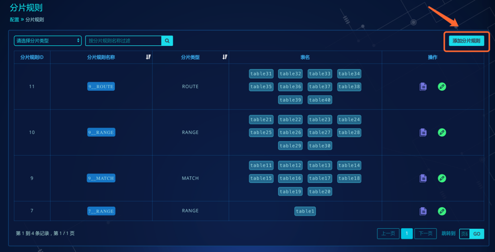

根据业务场景，输入配置参数，包括：

- 分片规则名称：默认生成，取消勾选后可修改
- 分片类型：包括ROUTE，RANGE，MATCH，SIMPLE_MOD，CRC32_MOD。以RANGE为例，若要了解更多分片规则可以查看更详细的功能说明文档，请参考[管理平台](hotdb-management.md)文档。
- 设置方式：包括自动设置和手动设置，以自动设置为例。选择自动设置，管理平台根据配置参数自动计算值范围并自动划分数据节点；选择手动设置可以手动输入数据节点对应落入的值范围。
- 数据节点：选择分片的数据节点
- 值范围：输入分片字段的全部值范围，管理平台结合选择的节点数自动计算步长


点击【预览】查看生成结果，点击【修改】可修改值范围或数据节点，以解决数据倾斜问题。


点击【保存并返回】添加分片规则。

### 添加表信息

登录管理平台页面，选择"配置"->"表信息"->[添加表信息](#添加表信息)

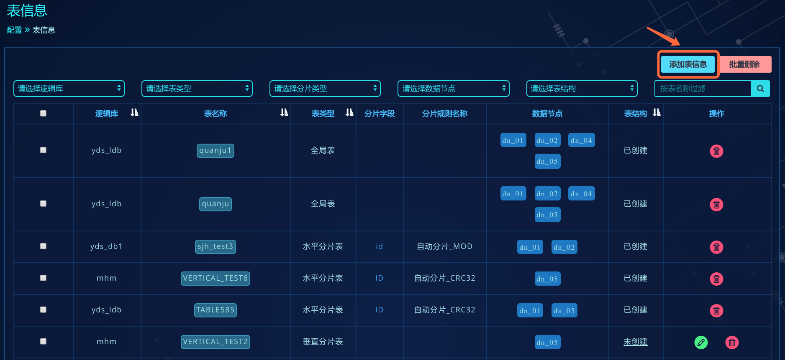

根据业务场景，选择表类型后输入配置参数，在此例子中，在水平分片表页面下，添加参数配置如下：

- 逻辑库：下拉菜单中选择上节添加的[逻辑库](#添加逻辑库)test。
- 默认分片字段：在填写表名称时，表名称与其对应的分片字段应使用英文冒号间隔，若未填写分片字段，则取默认分片字段。所以此处填写"provinceid"
- 分片方式：在此例子中，选择自动分片，也可以选择上节添加的[分片规则](#添加分片规则)应用于此
- 数据节点：选择分片的数据节点，此例子中，选择3.8节添加的[数据节点](#添加数据节点与存储节点)
- 请填写表名称：输入"customer"，添加多表但不同分片字段时，可以输入"customer:provinceid"表示。


点击【保存】，成功添加customer自动分片表。注：该表引用的分片规则是AUTO_CRC32类型(AUTO_MOD 与 AUTO_CRC32分片类型区别可查看页面中的"方式说明")。

### 校验并动态加载配置信息

登录管理平台页面，对计算节点数据库用户，逻辑库，数据节点，存储节点，故障切换，分片规则，表信息，子表信息做的任何修改，都需要进行"动态加载"，新的配置信息才能生效。

若计算节点未启动，将不能执行动态加载，因此需先启动计算节点。

登录管理平台页面，选择"配置"->[配置校验](#配置校验)，在页面中点击"开始校验"，若没有出现配置错误的提示，则表示配置信息无误。

在页面中点击"动态加载"，若页面提示"动态加载成功"，则配置信息在计算节点中已经成功生效：


### 登录计算节点并开始使用

使用MySQL命令行，指定实际的IP地址，登录到计算节点：

```bash
mysql -uroot -proot -h127.0.0.1 -P3323 -Dtest
```

例如：

```
root> mysql -h127.0.0.1 -uroot -proot -P3323 -Dtest
mysql: [Warning] Using a password on the command line interface can be insecure.
Welcome to the MySQL monitor. Commands end with ; or g.
Your MySQL connection id is 100728
Server version: 5.7.19-HotDB-2.5.2 HotDB Server by Hotpu Tech
Copyright (c) 2000, 2018, Oracle and/or its affiliates. All rights reserved.
Oracle is a registered trademark of Oracle Corporation and/or its
affiliates. Other names may be trademarks of their respective
owners.
Type 'help;' or 'h' for help. Type 'c' to clear the current input statement.
```

执行customer的建表语句：

```sql
CREATE TABLE `customer`(
  `id` BIGINT UNSIGNED NOT NULL AUTO_INCREMENT,
  `name` VARCHAR(32) NOT NULL,
  `telephone` VARCHAR(16) NOT NULL,
  `provinceid` TINYINT UNSIGNED NOT NULL DEFAULT 0,
  `province` ENUM ('Anhui','Aomen','Beijing','Chongqing','Fujian','Gansu','Guangdong','Guangxi','Guizhou','Hainan','Hebei','Heilongjiang','Henan','Hubei','Hunan','Jiangsu','Jiangxi','Jilin','Liaoning','Neimenggu','Ningxia','Qinghai','Shaanxi','Shandong','Shanghai','Shanxi','Sichuan','Taiwan','Tianjin','Xianggang','Xinjiang','Xizang','Yunnan','Zhejiang') NULL,
  `city` VARCHAR(16) NULL default '',
  `address` VARCHAR(64) NULL,
  PRIMARY KEY(`id`),
  UNIQUE KEY(`telephone`)
) ENGINE=InnoDB DEFAULT CHARSET=utf8;
```

计算节点将在各个数据节点创建customer表。可以登录到各个MySQL存储节点上，验证customer是否已经被创建。

或在管理平台"配置"->"表信息"页面，找到上节添加的[表配置](#添加表信息)，在表结构一列中点击【未创建】跳转到普通DDL页面。


输入[数据库用户名密码](#赋予用户逻辑库权限)，并选择test逻辑库后，输入建表语句，点击【执行】添加表结构。

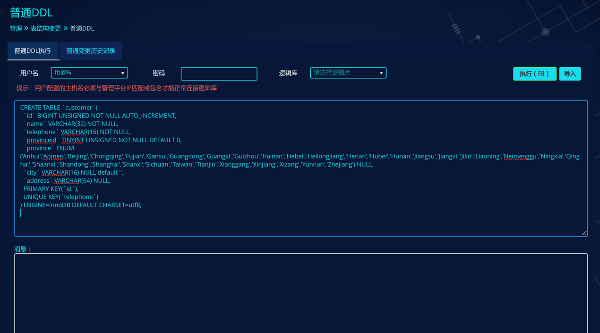

分片表customer创建成功后，可以连接计算节点执行下面的SQL语句，操作数据：

```sql
INSERT INTO customer VALUES (21,'何重庆','13912340021',4,'Chongqing','重庆','某某街某某号');
INSERT INTO customer VALUES (22,'吕重庆','13912340022',4,'Chongqing','重庆','某某街某某号');
INSERT INTO customer VALUES (25,'孔福州','13912340025',5,'Fujian','福州','某某街某某号');
INSERT INTO customer VALUES (26,'曹兰州','13912340026',6,'Gansu','兰州','某某街某某号');
INSERT INTO customer VALUES (67,'岑南昌','13912340067',17,'Jiangxi','南昌','某某街某某号');
INSERT INTO customer VALUES (68,'薛长春','13912340068',18,'Jilin','长春','某某街某某号');
INSERT INTO customer VALUES (69,'雷沈阳','13912340069',19,'Liaoning','沈阳','某某街某某号');
INSERT INTO customer VALUES (70,'贺呼和浩特','13912340070',20,'Neimenggu','呼和浩特','某某街某某号');
INSERT INTO customer VALUES (71,'倪银川','13912340071',21,'Ningxia','银川','某某街某某号');
INSERT INTO customer VALUES (72,'汤西宁','13912340072',22,'Qinghai','西宁','某某街某某号');
INSERT INTO customer VALUES (73,'滕西安','13912340073',23,'Shaanxi','西安','某某街某某号');
INSERT INTO customer VALUES (74,'殷济南','13912340074',24,'Shandong','济南','某某街某某号');
INSERT INTO customer VALUES (93,'顾台北','13912340093',28,'Taiwan','台北','某某街某某号');
INSERT INTO customer VALUES (94,'孟天津','13912340094',29,'Tianjin','天津','某某街某某号');
INSERT INTO customer VALUES (95,'平香港','13912340095',30,'Xianggang','香港','某某街某某号');
INSERT INTO customer VALUES (96,'黄乌鲁木齐','13912340096',31,'Xinjiang','乌鲁木齐','某某街某某号');
INSERT INTO customer VALUES (99,'萧杭州','13912340099',34,'Zhejiang','杭州','某某街某某号');
INSERT INTO customer VALUES (100,'尹杭州','13912340100',34,'Zhejiang','杭州','某某街某某号');
```

也可对customer分片表执行DELETE、UPDATE、SELECT等操作。

## HotDB Server运行相关

### 计算节点启动说明

- 启动计算节点，可以切换到`/usr/local/hotdb/hotdb-server/bin`目录下，再运行启动脚本，或者直接加上路径:`sh /usr/local/hotdb/hotdb-server/bin/hotdb_server start`；
- 配置库复制同步状态会影响计算节点启动，计算节点启动或者发生高可用切换Online时配置库必须保证复制追上；
- 存储节点复制同步状态会影响计算节点启动，通过在`server.xml`中配置参数[waitSyncFinishAtStartup](#waitsyncfinishatstartup) 的true/false属性控制计算节点启动时是否等待存储节点复制追上，默认需等待；
- 启动计算节点时,若存储节点连接状态异常，可通过修改`server.xml`中的配置参数[masterSourceInitWaitTimeout](#lockwaittimeout)，控制数据节点中主存储节点是否重新初始化及初始化超时时间，具体控制逻辑参考[计算节点启动时对逻辑库可用的判断](#计算节点启动时对逻辑库可用的判断)。
- 影响计算节点启动失败的原因可能是多种多样的，包括但不限于：
- 软硬件环境异常：例如脚本校验无法通过，磁盘空间不足，可用内存不足，Java版本不匹配等
- 配置库异常：例如配置库无法连接，配置错误等
- 节点异常：例如数据节点无法正常连接或无法正常初始化等
- 授权异常：例如USB-Key服务异常，授权节点超出限制，授权过期等
- XA异常：例如XA RECOVER失败等
- 端口被占用：例如端口已被其他程序占用，或者启动了多个HotDB服务等
- 复制异常：例如配置了启动时等待复制追上，实际数据节点的复制一直存在延迟，无法追上等
- 集群异常：例如集群无法达成共识，启动时存在网络分区，各节点时间不同步等

#### 计算节点启动时对逻辑库可用的判断

为保证垂直拆分场景下，出现数据节点不可用状态时，与之不相关的不同逻辑库之间的业务场景不受影响，计算节点在启动时，对所有逻辑库的可用状态做了特殊判断处理，说明如下：

- 若配置的主存储节点为可用状态，实际该存储节点无法连接，则计算节点启动时，会等待[masterSourceInitWaitTimeout](#lockwaittimeout)配置的时间（默认：300s）,判断该存储节点是否真实不可连接，若在此期间，该存储节点重连无异常，则该节点初始化成功；

- 如果数据节点初始化失败且无可用逻辑库，或数据节点下无存储节点，则计算节点无法启动，日志提示：`04/13 10:50:54.644 ERROR [main] (HotdbServer.java:436) -datanodes:[3] init failed. System exit.`

- 只要存在某个逻辑库对应的数据节点均可用，则可以启动计算节点，对应逻辑下的表可以正常操作。如果其他逻辑库下有不可用的节点，则该逻辑库下的表不能正常读写，客户端提示：`ERROR 1003 (HY000): DATABASE is unavailable when datanodes:[datanode_id] unavailable.`

  例如：A逻辑库包含1,2两个节点，B逻辑库包含3,4两个节点。如果1、2节点不可用，3、4节点可用，则计算节点可以启动，B逻辑库下的表可以正常操作，A逻辑库下的表无法进行读写；如果1、3节点不可用，则计算节点无法启动。

- 判断某个节点是否可用，跟存储节点在配置库的状态以及存储节点实际可用状态有关，要求配置状态与存储节点状态要一致，否则会影响计算节点的启动。计算节点启动时连接配置库配置的可用存储节点，如果均能连接，则视为可用。如果某个配置为可用的存储节点无法连接，且该数据节点下所有其他存储节点都配置为不可用或配置为可用但实则无法连接，则视为该数据节点不可用。每个节点至少应配置一个可用存储节点，否则无法启动计算节点。具体情况如下：

> 1.主从存储节点均配置为可用
>
> 如果主从存储节点均可以连接，则该节点可用。如果主库无法连接，从库可连接，则会发生切换，将主库置为不可用，并且使用从库。如果主库可以连接，从库无法连接，则使用主库，从库会置为不可用。如果主从数据库均无法连接，则该节点不可用。
>
> 2.主库配置不可用，从库配置可用
>
> 如果从库可以连接，则使用从库，此节点可用。如果从库无法连接，则该节点不可用
>
> 3.主库配置可用，从库配置不可用
>
> 如果主库可以连接，则使用主库，此节点可用。如果主库无法连接，则该节点不可用

### MySQL服务端参数校验

为了保证数据的一致性，计算节点在启动的时候，将对MySQL存储节点实例的参数进行校验。针对不同的参数，如果参数配置不符合校验规则，计算节点将报告警告信息，或者不能启动。计算节点对MySQL存储节点实例的参数要求有两种：一种是所有的存储节点实例的参数需一致；另一种是所有的存储节点实例的参数必须为固定值。

#### 要求设置为固定值的参数

对于下列MySQL存储节点实例的参数，计算节点要求设置为统一的固定值：

1. **completion_type必须为NO_CHAN**, 如果出现该参数不符合规范，则动态加载失败；

2. **innodb_rollback_on_timeout需要为ON**，且任何时候`SHOW [GLOBAL|SESSION] VARIABLES`显示出来的innodb_rollback_on_timeout参数都为on，说明如下：

   - 如果innodb_rollback_on_timeout参数全为off， 则计算节点允许加载成功，但计算节点的行为将等同于innodb_rollback_on_timeout参数为on时的事务回滚方式，且配置校验时给出如下提示：

   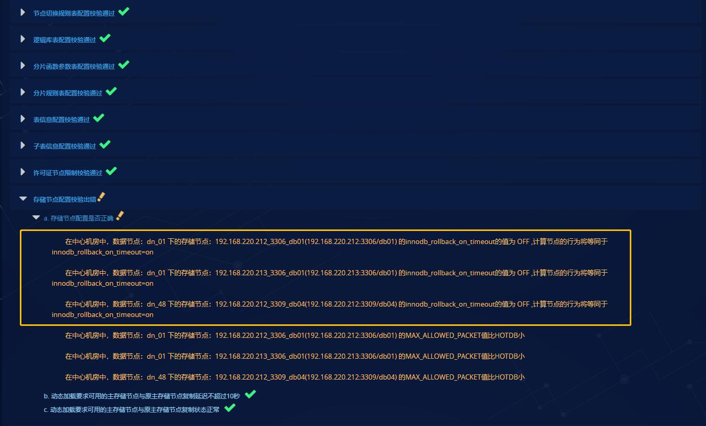

   且动态加载时日志输出：innodb_rollback_on_timeout=off is not supported, HotDB behavior will be equivalent to innodb_rollback_on_timeout = on.

   - 如果innodb_rollback_on_timeout参数存储节点间不一致，动态加载失败，且配置校验时提示如下:

   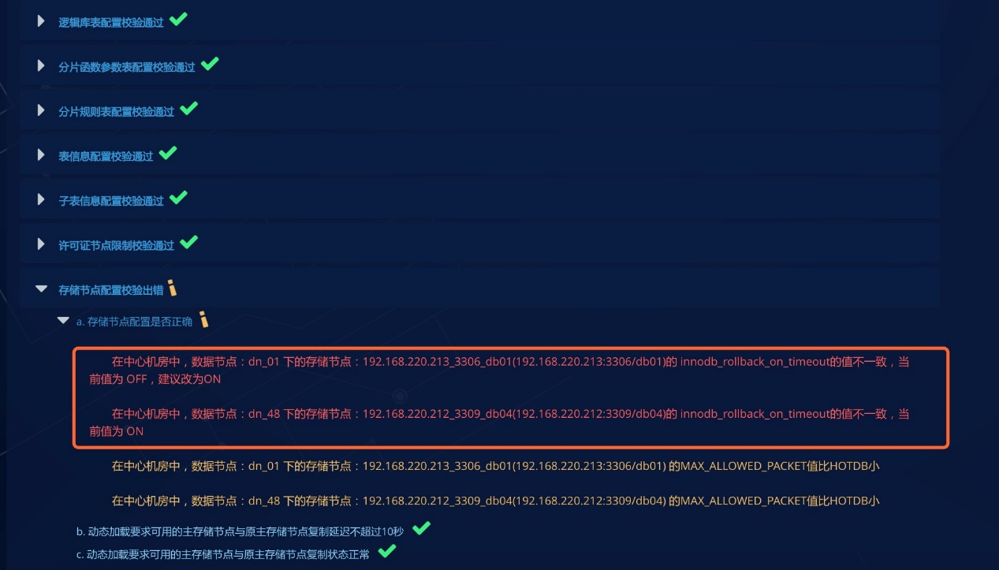

   且动态加载时，为off的存储节点日志输出，MySQL variables 'innodb_rollback_on_timeout' is not consistent,the current value is OFF ,neet to bu changed to ON , 为on的存储节点日志输出MySQL variables 'innodb_rollback_on_timeout' is not consistent,the current value is ON

3. **read_only**，参数说明如下：

   - 如果主存储节点的参数read_only=1，计算节点将拒绝启动，动态加载失败。

   - 如果从机的参数read_only=1且配置了切换到该从机的配置规则，计算节点可以启动，RELOAD失败。

   - 如果从机的参数read_only=1且没有配置切换到该从机的配置规则，计算节点可以启动，reload如果无其它错误则成功。

#### 要求所有节点配置一致的参数

对于下列MySQL存储节点实例的参数，计算节点要求存储节点间的参数值设置为一致：

- autocommit
- transaction_isolation
- div_precision_increment

若以上参数在存储节点间配置不一致，计算节点将给出警告信息。对于transaction_isolation参数，计算节点以设置的最高隔离级别为准，若最高配置的值高于REPEATABLE-READ，将使用SERIALIZABLE；若最低配置的值低于REPEATABLE-READ，计算节点将使用REPEATABLE-READ模式。

#### 要求不能超过计算节点配置的参数

考虑到客户端发送超大SQL会有威胁到HotDB Server的可能（目前尚未发现实际案例），HotDB Server可以同MySQL一样配置MAX_ALLOWED_PACKET，控制客户端发送给计算节点的SQL最大包大小，该参数可在server.xml中通过参数名maxAllowedPacket预置，如果计算节点的maxAllowedPacket默认值比MySQL大，日志会给warning提示，且管理平台配置校验会给出提示：


### 管理端信息监控

HotDB Server为客户提供了一套功能完善、操作便捷的信息监控、统计与服务管理功能。用户可以通过MySQL Client登录计算节点的监控管理端查看详细信息，详细说明请参考[管理端命令](management-port-command.md)文档。

#### 管理端命令

用户可以登录管理端（默认端口：3325）使用`show @@help`命令查看支持的管理端命令和相应的作用。

```
root> mysql -uroot -proot -P3325 -h192.168.200.201

mysql: [Warning] Using a password on the command line interface can be insecure.
Welcome to the MySQL monitor. Commands end with ; or g.
Your MySQL connection id is 992081
Server version: 5.1.27-HotDB-2.5.0 HotDB Manager by Hotpu Tech
Copyright (c) 2000, 2016, Oracle and/or its affiliates. All rights reserved.
Oracle is a registered trademark of Oracle Corporation and/or its
affiliates. Other names may be trademarks of their respective
owners.
Type 'help;' or 'h' for help. Type 'c' to clear the current input statement.
mysql> show @@help;
+-------------------------------------------+------------------------------+
| statement                                 | description                  |
+-------------------------------------------+------------------------------+
| check @@datasource_config                 | 检查MySQL参数配置信息        |
| check @@route [db_name.tb_name | tb_name] | 检测分片表数据路由正确性     |
| kill @@connection [connection_id]         | 将某个指定的连接关闭         |
| onlineddl "[DDLSTATEMENT]"                | 执行onlineddl                |
| rebuild @@pool                            | 重建所有节点当前可用存储节点 |
| reload @@config                           | 重新读取配置信息             |
...省略更多内容，可自行登陆查看...
```

#### 管理端操作

用户可以输入相应的命令以监控计算节点的服务情况，如显示存储节点信息：

```
mysql> show @@datasource;
|----+----+-----------------------+------+--------+-------------+------+--------+--------+------+------+--------------------+--------------+--------+-------------+-----------------+
| dn | ds | name                  | type | status | host        | port | schema | active | idle | size | unavailable_reason | flow_control | idc_id | listener_id | listener_status |
|----|----|-----------------------|------|--------|-------------|------|--------|--------|------|------|--------------------|--------------|--------|-------------|-----------------|
| 17 | 17 | 10.10.0.140_3313_db01 | 1    | 1      | 10.10.0.140 | 3313 | db01   | 0      | 45   | 45   | NULL               | 0/64         | 1      | 8           | 1               |
...省略更多内容，可自行登陆查看...
```

`show @@`命令后接的为一个表的表名，例如上个例子中，`show @@datasource;`，datasource为一个表的表名。

用户也可以对`show @@`命令后的表名进行DESC操作以查看该表各个字段的含义，如查看存储节点信息中各个字段的含义：

```
mysql> desc datasource;
+--------------------+------------------------------------------------------------+
| filedname          | description                                                |
+--------------------+------------------------------------------------------------|
| dn                 | 数据节点号(Datanode)                                      |
| ds                 | 数据源号(Datasource)                                      |
| name               | 数据源名称(Datasource name)                               |
| type               | 数据源类型(Datasource type)                               |
| status             | 数据源状态(Datasource status)                             |
| host               | 主机地址(Host)                                            |
| port               | 主机端口(Port)                                            |
| schema             | 物理数据库名(Physical database name)                      |
| active             | 活动连接数(Active connections)                            |
| idle               | 空闲连接数(Idle connections)                              |
| size               | 总连接数(Total connections)                               |
| unavailable_reason | 数据源不可用原因(Reason for datasource unavailable)       |
| flow_control       | 剩余可用计数(Remaining available quantity in flow control) |
| idc_id             | 机房ID(ID of IDC)                                         |
| listener_id        | LISTENER ID(ID of LISTENER)                               |
| listener_status    | LISTENER STATUS(STATUS of LISTENER)                       |
+--------------------+------------------------------------------------------------+
16 rows in set (0.00 sec)
```

用户还可以对show @@命令后的表名进行SELECT操作以进行任意条件的SQL查询，如查看11号数据节点上的存储节点：

```
mysql> select * from datasource where dn=11;
+----+----+-----------------------+------+--------+-------------+------+--------+--------+------+------+--------------------+--------------+--------+-------------+-----------------+
| dn | ds | name                  | type | status | host        | port | schema | active | idle | size | unavailable_reason | flow_control | idc_id | listener_id | listener_status |
+----+----+-----------------------+------+--------+-------------+------+--------+--------+------+------+--------------------+--------------+--------+-------------+-----------------+
| 11 | 11 | 10.10.0.125_3311_db01 | 1    | 1      | 10.10.0.125 | 3311 | db01   | 0      | 43   | 43   | NULL               | 0/64         | 1      | 2           | 1               |
+----+----+-----------------------+------+--------+-------------+------+--------+--------+------+------+--------------------+--------------+--------+-------------+-----------------+
1 row in set (0.00 sec)
```

### 前端连接数限制

计算节点支持限制前端连接数功能，出现访问过载时可辅助限制流量，功能同MySQL。使用方法为：在server.xml中进行配置：

```xml
<property name="maxConnections">5000</property><!-- 前端最大连接数 -->
<property name="maxUserConnections">0</property><!--用户前端最大连接数, 0为不限制-->
```

- `maxConnections`为前端最大连接数，默认5000；
- `maxUserConnections`为前端最大用户连接数，默认0为不限制；

同时支持具有super权限的用户在服务端口`set global max_connections=1; set global max_user_connections=0;`进行修改。

可以用`SHOW VARIABLES`来查看当前的连接数限制情况。

### 后端连接池管理

计算节点启动及运行过程中会与存储节点之间建立连接，在[添加存储节点](#添加存储节点组)时，可通过四个配置控制连接数：

- 最大连接数：计算节点与存储节点（即MySQL物理库）之间可建立的最大连接数，超过即SQL无法正常执行；
- 初始连接数：计算节点与存储节点之间建立的初始连接数；
- 最小空闲连接数：计算节点与存储节点之间建立的最小空闲连接数；
- 最大空闲连接数：计算节点与存储节点之间建立的最大空闲连接数。

当定时检测线程发现连接池里面空闲连接小于最小空闲，创建连接；大于最大空闲，关闭连接。即：最小空闲≤连接池的空闲连接个数≤最大空闲，最大、最小空闲连接数主要控制连接池内的空闲连接数在一定范围内。

例如：

以单个计算节点举例（多计算节点服务各自限制连接数，也即极端情况下，存储节点连接数可能达到N倍），HotDB Server 存储节点配置： 最大连接数4200，初始化连接数是32， 最小空闲连接数64 ，最大空闲连接数：512

那么HotDB Server 计算节点在启动的时候，会与每个存储节点建立32个后端连接，定时检测线程检测时发现当前连接数不够最小空闲即增加到最小空闲连接64个；

此时若有一个2048并发的场景对计算节点压测，会发现连接池可用连接数不够用，计算节点会自动增加与存储节点的连接数。

当压测结束后，这些连接不会立即销毁，会等到空闲检测周期检测：如果空闲状态（即管理端show @@backend标记为Idle状态）的连接大于512 ，则销毁多余的连接到512个；如果小于512 就保持原样。

若需要空闲连接状态回到初始化状态，可以在计算节点运行过程中，参考[管理端命令](management-port-command.md)文档重建连接池rebuild @@pool 相关章节重建连接池，即恢复到初始连接状态。

### 磁盘空间使用限制

因磁盘空间不足会导致计算节点无法正常运行等诸多问题，计算节点在自动部署时会检测HotDB Server安装目录所在磁盘的剩余空间是否大于10G，同时，在写临时文件时也会检测磁盘的剩余空间，具体如下：

用户创建会话后执行例如复杂跨库JOIN等操作时，必要时会在HotDB Server安装目录下写入临时文件。写入临时文件的同时，计算节点若检测发现安装目录所在磁盘的剩余空间不足，则终止当前会话并报错与记录日志。

计算节点日志记录error级别日志如下，终止会话时提示信息与之相同：

```
2019-06-10 18:03:24.423 [ERROR] [DISKSPACE] [Employee-2] cn.hotpu.hotdb.mysql.nio.handler.MultiNodeHandler(88) - session[1606] was killed,due to less than 1G space left on device,and the size of temp-file is larger than the usable space.
```

### 错误码

若要了解计算节点错误码详情，请参考[计算节点错误码](error-codes.md)文档。

若要了解管理平台错误码详情，可以点击"帮助中心">>"API接口说明"页面中的【状态码】查看错误码详情。


### 动态加载（RELOAD）

计算节点可在不重启服务的情况下，在线加载配置信息。通过"动态加载"功能可立即生效的参数请参考[计算节点参数使用说明](#计算节点参数使用说明)。

动态加载有两种方式，一种是登录[管理端（3325）](#管理端信息监控)执行：`reload @@config`命令；一种是登录管理平台，点击菜单栏右上角"动态加载"按钮，将新增配置项目动态加载到计算节点中进行使用。如下图所示：


为了保证计算节点正确加载配置信息，在执行动态加载前，可先校验配置信息。动态加载过程中，若遇到主备配置库、主备存储节点切换，提示用户并提供强制停止切换并动态加载和取消动态加载两种选择方案。


### 配置校验

登录管理平台，选择"配置"->[配置校验](#配置校验)进入配置校验面板，点击"开始校验"按钮，将校验分布式事务数据库平台中[配置校验](#配置校验)菜单中的配置项。如下图所示：


上图显示，所有配置都正常通过。

若有配置项不正确，可根据错误提示，修改相应的配置：


通过计算节点管理端执行reload @@config命令动态加载时，默认也会先进行配置校验，校验通过后才允许动态加载。

### 死锁检测

在分布式事务数据库系统中，若死锁发生在两个数据节点下的存储节点间，MySQL的死锁检测机制将无法检测到死锁。

下面表格中的操作，描述了在分布式系统中，两个数据节点产生死锁的过程。会话一与会话二分别在两个数据节点上执行DELETE操作：

| 会话一 | 会话二 |
|--------|--------|
| 会话一开启事务 | `start transaction;` |
| 会话二开启事务 | `start transaction;` |
| 会话一在DNID为15的数据节点上执行DELETE语句 | `delete from customer where dnid=15 and id=1;` |
| 会话二在DNID为13的数据节点上执行DELETE 语句 | `delete from customer where dnid=13 and id=4;` |
| 会话一在DNID为13的数据节点上执行DELETE语句；DELETE操作将被会话二阻塞 | `delete from customer where dnid=13 and id=4;` |
| 会话二在DNID为15的数据节点上执行DELETE语句；此操作将被会话一阻塞；因会话一被会话二阻塞，会话二也被会话一阻塞，此时将产生死锁 | `delete from customer where dnid=15 and id=1;` |

上述情况中，会话一与会话二互相被阻塞，将产生死锁。因是在两个数据节点下的存储节点间，MySQL无法检测到死锁的存在。

在HotDB Server分布式事务数据库系统中，计算节点可检测到多个数据节点下的存储节点间的死锁，并回滚开销最少的事务。

在计算节点的配置文件server.xml中，将死锁检测周期设置为大于0的值，将开启死锁的自动检测功能。默认情况下，死锁检测是开启状态，检测周期为3000ms。

```xml
<property name=" deadlockCheckPeriod ">3000</property>
```

当deadlockCheckPeriod值设置为0时，将不启动死锁检测功能。

在开启计算节点的死锁检测时，再次执行上述的DELETE操作：

会话一，开启事务：

```
mysql> start transaction;
Query OK, 0 rows affected (0.00 sec)
```

会话二，开启事务：

```
mysql> start transaction;
Query OK, 0 rows affected (0.00 sec)
```

会话一，在DNID为15的数据节点上执行DELETE语句：

```
mysql> delete from customer where dnid=15 and id=1;
Query OK, 1 row affected (0.00 sec)
```

会话二，在DNID为13的数据节点上执行DELETE 语句

```
mysql> delete from customer where dnid=13 and id=4;
Query OK, 1 row affected (0.00 sec)
```

会话一，在DNID为13的数据节点上执行DELETE语句；DELETE操作将被会话二阻塞：

```
mysql> delete from customer where dnid=13 and id=4;
```

会话二，在DNID为15的数据节点上执行DELETE语句；此操作将被会话一阻塞；因会话一被会话二阻塞，会话二也被会话一阻塞，此时将产生死锁。

```
mysql> delete from customer where dnid=15 and id=1;
Query OK, 1 row affected (1.59 sec)
```

计算节点检测到死锁，回滚了会话一的事务：

```
mysql> delete from customer where dnid=13 and id=4;
ERROR 1213 (HY000): Deadlock found when trying to get lock; try restarting transaction
```

> !Note
>
> 由于MySQL5.7及以上版本，事务中出现死锁回滚后，不会立即开启新事务。参考官方BUG链接：<https://bugs.mysql.com/bug.php?id=98133>。HotDB Server针对上述BUG做了兼容处理：对锁超时、死锁检测、后端连接断开，MySQL5.7及以上版本会根据前端连接autocommit判断是否要开启新事务。

### SQL报错日志记录

若执行SQL时返回以下情况的报错信息，计算节点会将其记录到计算节点日志（hotdb-unusualsql.log）中：

- 主键唯一键冲突或外键约束不满足导致的ERROR信息（即MySQL错误码1062、1216、1217、1451、1452、1557、1761、1762、3008）
- 数据溢出（即MySQL错误码1264、1690、3155、3669）和数据类型转换或隐式转换导致数据截断（即MySQL错误码1265、1292、1366）的情况
- 涉及binlog不安全语句（即MySQL错误码1418、1592、1663、1668、1669、1671、1673、1674、1675、1693、1714、1715、1716、1719、1722、1724、1727、1785、3006、3199、3570、3571、MY-010908、MY-013098）
- 对分片字段不是自增字段的分片表做INSERT操作时，由外部指定自增值的INSERT的情况
- UPDATE语句中出现MATCH和AFFECT不相符的情况
- DELETE出现删除0行的情况
- UPDATE或DELETE AFFECT超过10000行的情况
- 在HINT语句中使用了INSERT、UPDATE、DELETE和DDL语句的情况
- DDL语句执行出现报错信息的情况；除此之外，在以下两种情况下会有额外日志记录：1. CREATE TABLE或ALTER TABLE时指定的表的字符集或字段的字符集，与存储节点的字符集或连接使用的字符集不一致时；2. CREATE TABLE或ALTER TABLE分片表，主键或唯一键不包含分片字段，且没有使用全局唯一约束来保证字段唯一性时
- 发生部分提交的情况，即部分节点已经发出COMMIT后，其余节点没有发出COMMIT但连接断开的情况，或其余部分后端连接发出COMMIT后无响应且连接断开的情况，会记录整个事务到计算节点日志
- 发生语法错误的情况
- 执行因缺少路由规则无法路由的SQL的情况，例如INSERT不存在的ROUTE规则
- 执行被SQL防火墙拦截的SQL的情况
- 执行超时的SQL的情况
- 发生死锁被杀的事务的情况
- 发生因存储节点切换等原因被杀掉的事务的情况
- 执行锁超时回滚的SQL的情况
- 执行KILL命令后KILL掉的SQL的情况
- 发生被ROLLBACK的SQL的情况
- 前端连接异常断开回滚的SQL的情况
- 后端连接异常断开或其它异常导致回滚的情况
- 计算节点意外抛异常的情况
- 如果上述记录的SQL过长导致SQL语句被截取，还会额外记录WARNING信息

例如，执行一条出现主键冲突的SQL如下：

```
mysql> insert into table01 (id,title,author,submission_date) values (3,"apple", "apple pie", '2019-10-11-20-05');
ERROR 1062 (23000): Duplicate entry '3' for key 'PRIMARY'
```

查看计算节点日志（`hotdb-unusualsql.log`）：

```
2019-10-12 15:27:45.051 [INFO] **[UNUSUALSQL]** [$NIOREACTOR-7-RW] cn.hotpu.hotdb.mysql.nio.MySQLConnection(415) - ERROR 1062:Duplicate entry '3' for key 'PRIMARY' [frontend:[thread=$NIOREACTOR-7-RW,id=453,user=root,host=192.168.210.225,port=3323,localport=65442,schema=DBY]; backend:null; frontend_sql:insert into table01 (id,title,author,submission_date) values (3,"apple", "apple pie", '2019-10-11-20-05');backend_sql:null]
```

又如，执行一条被SQL防火墙拦截SQL如下：

```
mysql> select * from test;

ERROR 1064 (HY000): Intercepted by sql firewall, because: not allowed to execute select without where expression
```

查看计算节点日志（`hotdb-unusualsql.log`）：

```
2019-10-14 15:41:42.246 [INFO] **[UNUSUALSQL]** [$NIOExecutor-1-2] cn.hotpu.hotdb.route.RouteService(415) - ERROR 10029:not pass sql firewall [frontend:[thread=$NIOExecutor-1-2,id=1433,user=root,host=192.168.210.225,port=3323,localport=64658,schema=DBY]; backend:null; frontend_sql:null; backend_sql:null] [DBY.count]=33
```

> !Note
>
> MySQL错误码解释可参考官方文档：<https://dev.mysql.com/doc/refman/8.0/en/server-error-reference.html>

该类日志信息默认保存在HotDB Server安装目录`logs/extra/unusualsql`目录下的`hotdb_unusualsql.log`文件中。若日志未记录至文件，可检查HotDB Server安装目录`conf`目录下的`log4j2.xml`下，是否存在以下配置：

```xml
  <RollingFile
    name="Unusualsql"
    filename="${sys:HOTDB_HOME}/logs/extra/unusualsql/hotdb-unusualsql.log"
    filepattern="${sys:HOTDB_HOME}/logs/extra/unusualsql/hotdb-unusualsql-%d{yyyy-MM-dd-HH-mm-ss}.log">
    <PatternLayout pattern="%d{yyyy-MM-dd HH:mm:ss.SSS} [%-4p] [%marker] [%t] %c(%L) - %msg%n"/>
    <Policies>
      <SizeBasedTriggeringPolicy size="100 MB"/>
    </Policies>
    <!-- 只记录 unusual sql 日志 -->
    <filters>
      <MarkerFilter marker="UNUSUALSQL" onMatch="ACCEPT" onMismatch="DENY"></MarkerFilter>
    </filters>
    <DefaultRolloverStrategy max="1000"/>
  </RollingFile>
</Appenders>
<Loggers>
  <Root level="info">
	<AppenderRef ref="Unusualsql"/>
  </Root>
</Loggers>
```

## 安全

### 用户与权限

HotDB Server有两类用户，一类是计算节点数据库用户，用于操作数据，执行SELECT，UPDATE，DELETE，INSERT等SQL语句。另一类是分布式事务数据库平台用户，用于管理配置信息。此章节将着重介绍计算节点用户相关内容。

计算节点数据库用户必须被赋予逻辑库的权限，才能访问逻辑库。计算节点提供了类似于MySQL的操作权限，如下：

| 权限类型 | 可执行的SQL语句 |
|----------|-----------------|
| CREATE | CREATE TABLE,CREATE INDEX |
| DROP | DROP TABLE,DROP INDEX,TRUNCATE TABLE,RENAME TABLE |
| ALTER | ALTER TABLE,RENAME TABLE |
| SELECT | SELECT,INSERT...SELECT |
| UPDATE | UPDATE |
| DELETE | DELETE,REPLACE |
| INSERT | INSERT,REPLACE,INSERT...SELECT |
| SUPER | 管理端的语句, /*!HotDB:dnid=?*/ |
| FILE | SELECT...INTO OUTFILE,LOAD DATA |

**SUPER权限说明：**

具有SUPER权限的user，可以登录计算节点的3325端口，可执行管理端的所有SQL语句；否则，不能登录管理端与执行管理端的SQL语句。

拥有SUPER权限的user，可在3323端口执行HINT语句。如:

```sql
/*!hotdb:dnid=1*/select * from table;
```

**权限范围：**

为计算节点数据库用户赋予权限时，除SUPER权限外，可指定user对逻辑库或表的操作权限。权限范围分为全局权限、逻辑库权限及表权限：

- 全局权限：拥有全局权限的user对所有逻辑库下的所有对象都拥有指定的权限。例如：勾选全局权限：SELECT，UPDATE，INSERT，CREATE，点击保存则当前用户可对所有逻辑库及表进行S/U/I/C操作。


- 逻辑库权限：拥有逻辑库权限的user对该逻辑库下的所有对象拥有指定权限。

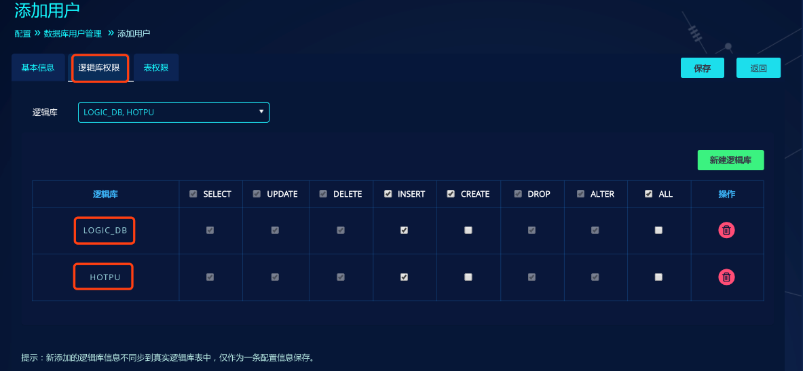

- 表权限：表权限又分为表允许权限和表拒绝权限。拥有表允许权限的用户对该表拥有勾选的权限；拥有表拒绝权限的用户将拒绝勾选的权限，对于没有勾选的权限，需要在表允许权限下勾选后方能拥有。拥有表拒绝权限的用户对该表拥有除了勾选的权限以外的其他所有权限；例如：勾选表拒绝权限：SELECT，UPDATE，INSERT，CREATE，点击保存则当前用户不可对该表进行S/U/I/C操作，若该用户勾选了表允许权限：DELETE,DROP，则当前用户拥有DELETE和DROP权限。


SUPER权限不指定特定逻辑库。只有持有SUPER权限的user可以执行管理端的语句，管理端具体功能可参考[管理端信息监控](#管理端信息监控)章节。

权限之间相互独立，拥有表的UPDATE权限，并不代表拥有该表的SELECT权限；拥有SUPER权限，并不代表拥有表的操作权限。另，TRIGGER相关的权限目前未单独维护，遵循权限规则为：CREATE TRIGGER 需要 CREATE 权限、DROP TRIGGER 需要 DROP权限、TRIGGER内部语句不验证权限、DEFINER 相关全去除、SHOW TRIGGERS时相关字段为当前用户。

### SSL认证

简介：SSL（Secure Socket Layer 安全套接层）是HTTPS下的一个协议加密层，有1、2、3三个版本，目前只使用SSL 3.0。IETF对SSL进行标准化后，在3.0版本的基础上发布了TLS1.0（Transport Layer Security 安全传输层协议）。TLS协议目前有1.0、1.1、1.2、1.3四个版本。

HotDB-Server 2.5.5版本开始支持SSL加密连接方式登录计算节点。

#### 生成TLS秘钥

##### 生成证书和密钥文件

可参考[MySQL官方文档](https://dev.mysql.com/doc/refman/5.7/en/creating-ssl-rsa-files.html)生成自签名的秘钥。例如：可以用MySQL自带的命令mysql_ssl_rsa_setup来生成证书和密钥文件。

```bash
mysql_ssl_rsa_setup --datadir=/usr/local/crt/
```

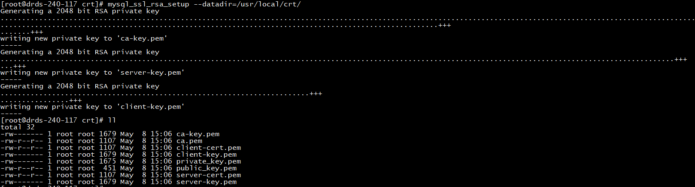

其中，客户端需要的秘钥有：ca.pem、client-cert.pem、client-key.pem；

服务端(HotDB)需要的秘钥有：ca.pem、server-cert.pem、server-key.pem；

> !Note
>
> MySQL自带命令生成的证书无法进行CA认证，参考链接：<https://dev.mysql.com/doc/refman/5.7/en/using-encrypted-connections.html>

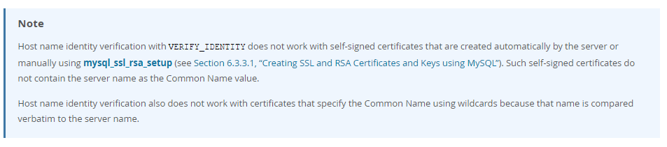

如果需要生成能够进行CA认证的自签名证书，需要使用openssl工具，可参考下列步骤进行：

1. 生成CA根证书私钥：`openssl genrsa 2048 > ca-key.pem`
2. 

生成CA根证书：`openssl req -new -x509 -nodes -days 3600 -key ca-key.pem -out ca.pem`，注意信息填写步骤中Common Name最好填入有效域名，并且不能与签发的证书中的Common Name一样，这里我们填写127.0.0.1

3. 生成服务器证书请求文件：`openssl req -newkey rsa:2048 -days 3600 -nodes -keyout server-key.pem -out server-req.pem`，注意信息填写步骤中Common Name需要填入HotDB-Server所监听的IP地址/域名，客户端将用此IP进行服务的连接，注意不能和CA证书中的信息一样
4. 用openssl rsa命令处理秘钥以删除密码：`openssl rsa -in server-key.pem -out server-key.pem`
5. 为服务端生成自签名证书：`openssl x509 -req -in server-req.pem -days 3600 -CA ca.pem -CAkey ca-key.pem -set_serial 01 -out server-cert.pem`
6. 生成客户端证书请求文件：`openssl req -newkey rsa:2048 -days 3600 -nodes -keyout client-key.pem -out client-req.pem`，注意信息填写步骤中Common Name不能和CA证书中的信息一样
7. 用openssl rsa命令处理秘钥以删除密码：`openssl rsa -in client-key.pem -out client-key.pem`
8. 为客户端生成自签名证书：`openssl x509 -req -in client-req.pem -days 3600 -CA ca.pem -CAkey ca-key.pem -set_serial 01 -out client-cert.pem`

##### 生成server.jks文件

对于计算节点来说，需要将秘钥转为Java标准的KeyStore文件。即下文中提到的.jks。生成步骤为：

1. 先使用openssl工具将cert和key文件合成pfx文件：

本次样例中密码输入SDcrtest（程序自带的密钥文件其密码为hotdb.com，可直接使用，此处示例为需要另外重新生成秘钥时使用）

```bash
openssl pkcs12 -export -out server.pfx -inkey server-key.pem -in server-cert.pem -CAfile ca.pem
```

输入密码SDcrtest

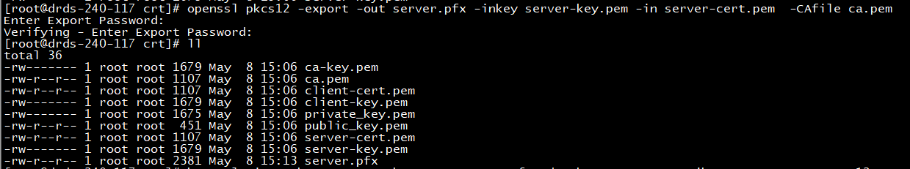

2. 用Java提供的keytool工具将pfx转换为jks文件：

```bash
keytool -importkeystore -srckeystore server.pfx -destkeystore server.jks -srcstoretype PKCS12
```

输入密码SDcrtest

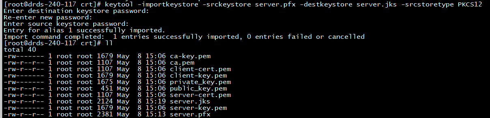

#### 配置TLS秘钥

生成好TLS秘钥后，将相应的秘钥文件分别传输到计算节点服务端和客户端所在的服务器上，并在计算节点中按要求配置如下三个参数之后才能使用：

```xml
<property name="enableSSL">false</property><!-- 是否开启SSL连接功能(Enable SSL connection or not) -->
```

参数说明：true代表开启SSL功能，false代表关闭SSL功能，默认值为false

```xml
<property name="keyStore">/server.jks</property><!-- 用于TLS连接的数据证书.jks文件的路径(Path to the data certificate .jks file for TLS connection) -->
```

参数说明: 计算节点在conf目录下默认提供了一套server.jks和client相关的pem文件，其密码为hotdb.com，可用于进行简单的连接测试。当选择使用自己生成 TLS证书或者使用付费的TLS证书进行连接，需根据实际的路径和名称来填写。例如：/usr/local/crt/server.jks。

```xml
<property name="keyStorePass">BB5A70F75DD5FEB214A5623DD171CEEB</property><!-- 用于TLS连接的数据证书.jks文件的密码(Password of the data certificate .jks file for TLS connection) -->
```

参数说明：程序自带的密钥文件中密码是`hotdb.com`，通过`select hex(aes_encrypt('hotdb.com',unhex(md5('Hotpu@2013#shanghai#'))))`s加密得到默认keyStorePass：BB5A70F75DD5FEB214A5623DD171CEEB。若使用自己生成的密钥文件，需根据实际输入的密码来填写。例如：前文输入密码SDcrtest，通过`select hex(aes_encrypt('SDcrtest',unhex(md5('Hotpu@2013#shanghai#'))))`查询到keyStorePass值，然后填写C43BD9DDE9C908FEE7683AED7A301E33。

配置好的参数如下图：


参数的修改无需重启计算节点服务， 动态加载时会重新读取`server.jks`文件。若SSL相关逻辑初始化失败，动态加载不会失败，但后续的SSL连接无法正常建立，非SSL连接不受影响。

> !Note
>
> - 若计算节点找不到任何可用的`server.jks`文件，则启动或同步加载时会输出以下报错信息
>
> 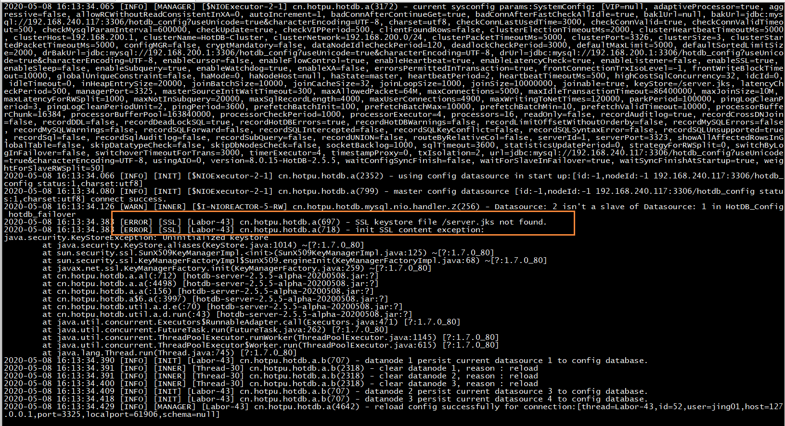
>
> - 若`keyStorePass`配置错误，则启动或者同步加载时输出以下报错信息
>
> 
>
> - 若证书配置错误，登录时会输出以下报错信息
>
> 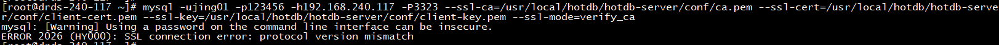

#### TLS连接登录

##### MySQL客户端方式

对于普通的MySQL客户端来说，可以使用如下方式指定秘钥文件进行连接：

```bash
mysql -ujing01 -p123456 -h192.168.240.117 -P3323 --ssl-ca=/usr/local/crt/ca.pem --ssl-cert=/usr/local/crt/client-cert.pem --ssl-key=/usr/local/crt/client-key.pem --ssl-mode=verify_ca
```

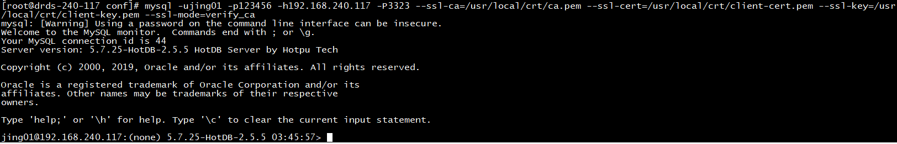

查看SSl是否开启：

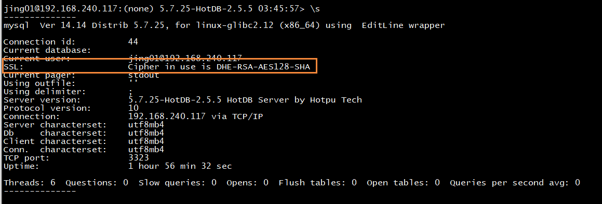

##### JDBC方式

对于JDBC来说，也需要相应的秘钥文件。操作方式可参考[MySQL官方手册](https://dev.mysql.com/doc/connector-j/5.1/en/connector-j-reference-using-ssl.html)，这里可通过两种方式：

1. 可通过将CA导入Java信任库的方式：

```bash
keytool -importcert -alias MySQLCACert -file ca.pem -keystore truststore
```

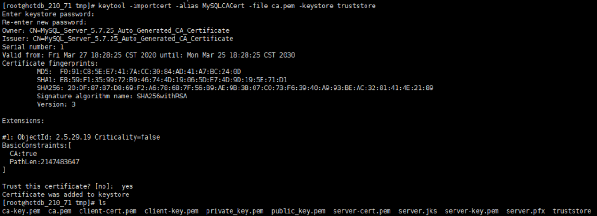

则JDBC连接时使用truststore文件， 例如：

```properties
jdbc:mysql://192.168.240.117:3323/smoketest?clientCertificateKeyStoreUrl=file:/usr/local/crt/truststore&clientCertificateKeyStorePassword=hotdb.com&verifyServerCertificate=true
```

2. 可通过使用证书的方式：

```bash
openssl pkcs12 -export -in client-cert.pem -inkey client-key.pem -name "mysqlclient" -out client-keystore.p12
keytool -importkeystore -srckeystore client-keystore.p12 -srcstoretype pkcs12 -destkeystore keystore -deststoretype JKS
```

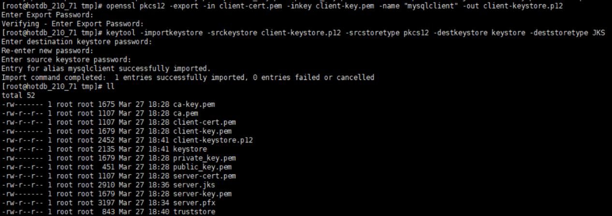
则JDBC连接时使用keystore文件， 例如：

```properties
jdbc:mysql://192.168.240.117:3323/smoketest?clientCertificateKeyStoreUrl=file:/usr/local/crt/keystore&clientCertificateKeyStorePassword=hotdb.com
```

##### Navicat等类似的客户端方式

对于Navicat等类似的客户端， 可以在客户端设置中配置相关的文件位置进行连接：

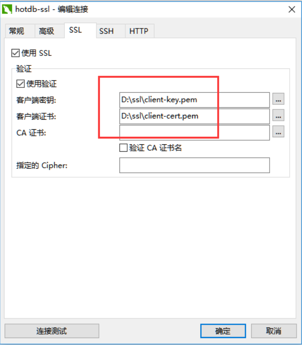

> !Note
>
> 对于某些版本的Navicat可能在勾选验证CA证书名后无法连接，比如提示错误："2026 SSL connection error: ASN: bad other signature confirmation"，这可能是该版本的动态链接库不兼容，需要将其目录下的`libmysql.dll`替换为MySQL Workbench中的同名文件，或者更新到更高的版本，参考[链接](https://www.heidisql.com/forum.php?t=19494)。

## 数据迁移、备份与恢复

### 使用mysqldump备份

#### mysqldump - 数据库备份程序

HotDB Server支持mysqldump功能，用法同MySQL一样。

使用mysqldump从计算节点导出数据时，要求指定添加如下参数：

```
--set-gtid-purged=OFF --no-tablespaces --skip-triggers --single-transaction --default-character-set=utf8mb4 --complete-insert --compact --skip-tz-utc [--replace|--insert-ignore] [--hex-blob] [--where=xxx]
```

使用mysqldump从MySQL导出数据，再导入计算节点时，要求添加如下参数：

```
--no-defaults --no-tablespaces --complete-insert --default-character-set=utf8mb4 --hex-blob --master-data=2 --no-create-db --set-gtid-purged=OFF --single-transaction --skip-add-locks --skip-disable-keys --skip-triggers --skip-tz-utc [--replace|--insert-ignore] [--no-create-info|--no-data] [--where=xxx] --databases xxx
```

> !Note
>
> `default-character-set`参数的值请根据实际情况填写，例如utf8或utf8mb4等。

若未使用指定参数，可能会出现时间差的问题，以及对于部分不支持的功能命令会报错。

### 使用二进制日志（增量）恢复

#### mysqlbinlog - 处理二进制日志文件的实用程序

计算节点支持mysqlbinlog命令，mysqlbinlog命令能够解析binlog文件用于同步增量数据，从而减少了将单机MySQL数据迁移至计算节点时的停机时间。使用mysqlbinlog连接远程mysql实例获取binlog文件并解析出其中的SQL语句，然后交由计算节点执行，从而将某个数据库的增量数据导入到计算节点某个逻辑库下。首先，登入到[管理端口](#管理端信息监控)（默认端口为3325），执行dbremapping命令添加数据库映射关系，关于dbremapping命令用法，请参考[管理端命令](management-port-command.md)文档。

```sql
dbremapping @@add@期望被导入的数据库名:逻辑库名
```

然后使用mysqlbinlog语句执行选中部分的binlog中SQL语句，要求使用如下语法与参数：

```
mysqlbinlog -R -h主机名 -P端口号 -v --base64-output=decode-rows --skip-gtids --to-last-log --stop-never --database=数据库名 --start-position=binlog起始位置 binlog文件名 | mysql -u用户名 -p密码 -h服务器 -P服务端口 -c --show-warnings=false
```

> !Note
>
> `--to-last-log`可替换为`--stop-position`，指定binlog终止位置而非执行到最新的binlog位置。此命令需要跟远程连接的MySQL实例同版本。

例如希望将192.168.200.77:3306中的物理库db01导入计算节点192.168.210.30中的逻辑库logicdb01：

1. 先至192.168.210.30登入到[管理端口3325](#数据一致性保障)，执行：

```sql
dbremapping @@add@db01:logicdb01
```

2. 然后在192.168.210.30服务器上执行如下命令：

```bash
mysqlbinlog -R -h 192.168.200.77 -P3306 -v --base64-output=decode-rows --skip-gtids --to-last-log --stop-never --database=db01 --start-position=0 mysql-bin.000009 | mysql -uroot -proot --h192.168.210.30 --P3323 -c -A
```

#### mysqldump与mysqlbinlog的实际应用

此小节将展示如何在实际应用场景中，结合mysqldump的完整备份与mysqlbinlog的增量备份，将数据从源端单机MySQL中迁移到HotDB Server中。

> !Note
>
> 整个操作过程中，不建议在数据迁移的源端或计算节点执行任何的DDL、参数变更等等非常规的操作动作。由于单线程操作且受网络延迟制约，此方式追数据的执行速度会慢于MySQL复制的执行速度，因此不保证计算节点的执行速度能够满足实时追上的要求，有可能存在数据延迟不断增大的现象，此时需要寻找业务低谷重试，或者另外规划方案。

场景描述：希望将源端192.168.210.45:3309（该实例为有生产数据的普通MySQL实例）中的物理库db01导入计算节点192.168.210.32中的逻辑库logicdb01，参考步骤如下：

1. 使用mysqldump从数据迁移的源端（即192.168.210.45:3309）导出表结构，在192.168.210.45服务器上执行如下命令（必须添加如下参数）：

```bash
mysqldump --no-defaults -h127.0.0.1 -P3309 -uhotdb_datasource -photdb_datasource **--no-data** --skip-triggers --set-gtid-purged=OFF --no-tablespaces --single-transaction --default-character-set=utf8mb4 --hex-blob --no-create-db --skip-add-locks --skip-disable-keys --skip-tz-utc --databases db01 >db01.sql
```

2. 将表结构的SQL文件上传至计算节点所在服务器，即192.168.210.32后，登录到计算节点上执行如下命令，导入表结构成功：

```sql
source /root/db01.sql
```

3. 使用mysqldump从数据迁移的源端（即192.168.210.45:3309）导出表数据，在192.168.210.45服务器上执行如下命令（必须添加如下参数）：

```bash
mysqldump --no-defaults -h127.0.0.1 -P3309 -uhotdb_datasource -photdb_datasource **--no-create-info** --skip-triggers --set-gtid-purged=OFF --no-tablespaces --single-transaction --default-character-set=utf8mb4 --hex-blob --master-data=2 --no-create-db --skip-add-locks --skip-disable-keys --skip-tz-utc --databases db01 >db01-1.sql
```

4. 打开表数据的导出文件，查看当前binlog位置，如下显示则binlog位置为2410，binlog文件为mysql-bin.000076：

```sql
CHANGE MASTER TO MASTER_LOG_FILE='mysql-bin.000076', MASTER_LOG_POS=2410;
```

5. 将表数据的SQL文件上传至计算节点所在服务器，即192.168.210.32后，登录到计算节点上执行如下命令，导入表数据成功：

```sql
source /root/db01.sql
```

特别注意，如果使用了外键，需要额外执行以下命令：

```sql
set foreign_key_checks=0
source /root/db01.sql
```

执行过程中，应密切关注是否出现警告或错误，否则可能会出现数据会不一致的问题。

> !Tip
>
> 果业务数据没有数据乱码问题，可以考虑split切分文件，并行导入计算节点以加快处理速度。

6. 使用mysqlbinlog做增量数据同步。若源端数据库名与计算节点的逻辑库名不相同，则需要在管理端口先添加数据库映射关系，例如：

```sql
dbremapping @@add@db01:logicdb01
```

然后到计算节点（192.168.210.32）所在服务器上执行如下命令，binlog开始位置为第四步记录的位置（此例子中为2410，binlog文件为mysql-bin.000076）：

```bash
mysqlbinlog -R -h192.168.210.45 -P3309 -uhotdb_datasource -photdb_datasource -v --base64-output=decode-rows --skip-gtids --to-last-log --stop-never --database=db01 **--start-position=2410 mysql-bin.000076** | mysql -uroot -proot --h192.168.210.32 --P3323 -c -A
```

为了加快追数据的速度，建议执行mysqlbinlog命令的服务器就是计算节点所在服务器，这样节省了MySQL命令行客户端执行SQL时SQL和ok包通过网络来回的时间开销，可以极大提高计算节点单线程执行SQL的速度。

7. 核对数据同步的正确性：此时需要进行必要的短时停服，中断业务系统向数据库的写入操作。通过人工在源端执行一条特殊数据后查看该条数据是否已经同步。等到确认计算节点已经追完最新数据后，停止mysqlbinlog命令，若需要的话，取消数据库名称映射。

> !Tip
>
> 可以在源端都执行如下命令后，将执行结果中出现的SQL语句复制后，在源端和计算节点都执行一遍，查看执行结果是否一致来大致地判断数据是否一致

```sql
use xxx # 逻辑库名
set session group_concat_max_len=1048576;
set @mytablename='xxx'; # 表名
set @mydbname=database();
select concat('select sum(crc32(concat(ifnull(',group_concat(column_name separator ','NULL'),ifnull('),','NULL')))) as sum from ',table_name,';') as sqltext from information_schema.columns where table_schema=@mydbname and table_name=@mytablename G
```

若执行结果一致，则表数据大概率一致。

例如在源端（192.168.200.77）MySQL实例中执行如下：

```
mysql> use db01
Database changed
mysql> set session group_concat_max_len=1048576;
Query OK, 0 rows affected (0.00 sec)
mysql> set @mytablename='table02';
Query OK, 0 rows affected (0.00 sec)
mysql> set @mydbname=database();
Query OK, 0 rows affected (0.00 sec)
mysql> select concat('select sum(crc32(concat(ifnull(',group_concat(column_name separator ',\'NULL\'),ifnull('),',\'NULL\')))) as sum from ',table_name,';') as sqltext from information_schema.columns where table_schema=@mydbname and table_name=@mytablename \\G
*************************** 1. row ***************************
sqltext: select sum(crc32(concat(ifnull(id,'NULL'),ifnull(name,'NULL')))) as sum from table02;
1 row in set (0.00 sec)
msyql> select sum(crc32(concat(ifnull(id,'NULL'),ifnull(name,'NULL')))) as sum from table02;
+------------+
| sum        |
+------------+
| 1812521567 |
+------------+
1 row in set (0.00 sec)
```

其结果（1812521567）与在计算节点执行结果一致，则table02表数据大概率一致。

## 数据一致性保障

### 主从数据一致性检查

HotDB Server提供数据节点中的主从存储节点一致性校验的功能。需要校验的主备存储节点属于同一个数据节点。

主从数据一致性检查，可校验主库与从库各个表的表结构是否相同，表数据是否一致，主从是否延迟。当表数据在主库与从库间仅有少量的数据不一致时，主从数据一致性检查可定位到不一致的数据行主键值。

登录计算节点的[管理端(3325端口)](#管理端信息监控)，执行`show @@masterslaveconsistency`命令，即可查看表在主库和备库上是否一致：

```
mysql> show @@masterslaveconsistency;

+------+------------+-------+--------+-----------------------------------------------------------------------------------------------------+
| db   | table      | dn    | result | info                                                                                                |
+------+------------+-------+--------+-----------------------------------------------------------------------------------------------------+
| DB_T | FB_STUDENT | dn_04 | NO     | 存在数据不一致, 因为 存储节点: 5, 表: FB_STUDENT, MySQL错误: Table 'db252.fb_student' doesn't exist |
| DB_A | SP         | dn_04 | NO     | 表: SP在节点: 4存在数据不一致，列: ID, 分布区间为: 0-17;, 并且不一致行唯一键为: (ID) :(2),(1)       |
| DB_T | JOIN_Z     |       | YES    |                                                                                                     |
+------+------------+-------+--------+-----------------------------------------------------------------------------------------------------+
3 row in set (0.07 sec)
```

结果中显示逻辑库DB_T中的JOIN_Z表，在所有节点的主备存储节点之间，数据是一致的。表结构如下：

- db：逻辑库名称。
- table：表名称。
- dn：数据节点名称；当表在主备存储节点不一致时，此列会显示数据节点名称；
- result：校验结果为YES，表示该表在主备存储节点之间是一致的；为NO，表示该表在主备存储节点之间不一致，同时会在info输出不一致的信息；UNKNOWN，表示未知错误，可能存在表结构不一致的情况，主从复制中断都可能出现UNKNOWN。
- info：当主从数据一致时，无信息输出；当主从数据不一致时，会有以下几种信息：

| 名称 | 信息　|
|--------------------|------------------------------------------------------------------------|
| 表的大量数据不一致 | `Table: ... in datanode: ... exist a large amount of data inconsistency` |
| 表的部分数据不一致 | `Table : ... in datanode: ... exist data inconsistency where ID in range:...;and inconsistent rows' primary key (...)` |
| 从库表不存在 | `exist data inconsistency, because DS: ... Table '...' doesn't exist` |
| 表索引不存在 | `DN: ... not exsit index of table:...` |
| 主从故障检测（例如从机Slave_SQL_Running: NO状态） | `DN: ... ERROR! Check your replication.` |
| 主从延迟超过10S | `DN：... delay too much,can't check master-slave data consistency` |
| 延迟超过2S | `Replication latency is more than 2s, Master-Slave consistency detection result may be incorrect or cannot be detected in datanode:` |

### 全局AUTO_INCREMENT

全局AUTO_INCREMENT，是指表的AUTO_INCREMENT列在整个分布式系统中的各个节点间有序自增。HotDB Server提供全局AUTO_INCREMENT的支持，当表中包含AUTO_INCREMENT列，并且在server.xml文件中，将参数[autoIncrement](#allowrcwithoutreadconsistentinxa)设置为非0（1或2)）时，即可以像使用MySQL的AUTO_INCRMENT一样使用计算节点的全局AUTO_INCREMENT。配置示例如：

```xml
<property name="autoIncrement">1</property>
```

#### 参数设置为0

若将参数[autoIncrement](#autoincrement)设置为0，则自增字段在存储节点MySQL内维护；在表类型为分片表时，表现较明显，可能存在同一分片表，不同存储节点间自增序列重复的情况。

例如：customer为auto分片表，分片字段为id，且name定义为自增序列。则name的自增特性由各个存储节点控制：

```
mysql> create table customer(id int ,name int auto_increment primary key);
mysql> insert into customer values (1,null),(2,null),(3,null),(4,null);
Query OK, 4 rows affected (0.01 sec)
Records: 4 Duplicates:0 Warnings: 0
mysql> select * from customer;
+----+------+----- +
| id | name | DNID |
+----+------+----- +
| 4  | 1    | 1001 |
| 2  | 1    | 1006 |
| 3  | 1    | 1004 |
| 1  | 1    | 1008 |
+----+------+----- +
4 rows in set (0.00 sec)
```

#### 参数设置为1

若将参数[autoIncrement](#autoincrement)设置为1，则由计算节点接管所有表的自增，可以保证全局自增。

```xml
<property name="autoIncrement">1</property>
```

例如：customer为auto分片表，分片字段为id，且name定义为自增序列。则name的自增特性由计算节点控制，可实现全局自增：

```
mysql> create table customer(id int ,name int auto_increment primary key);
mysql> insert into customer values (1,null),(2,null),(3,null),(4,null);
Query OK, 4 rows affected (0.01 sec)
Records: 4 Duplicates: 0 Warnings: 0
mysql> select * From customer order by id;
+----+------+------+
| id | name | DNID |
+----+------+------+
| 1  | 1    | 1008 |
| 2  | 2    | 1006 |
| 3  | 3    | 1004 |
| 4  | 4    | 1001 |
+----+------+------+
4 rows in set (0.00 sec)
```

若将参数[autoIncrement](#autoincrement)设置为1，自增字段类型必须为INT或BIGINT，否则建表提示warning：

```
mysql> create table table_test(id tinyint auto_increment primary key);
Query OK, 0 rows affected, 1 warning (0.05 sec)
Warning (Code 10212): auto_increment column must be bigint or int
```

自增序列1模式可保证全局唯一且严格正向增长，但不保证自增连续性。

#### 参数设置为2

若将参数[autoIncrement](#autoincrement)设置为2，则由计算节点接管所有表的自增。在此模式下，当计算节点模式为集群模式且表中包含自增序列时，仅保证自增序列全局唯一与长期看相对递增且递增，但不保证自增的连续性（短时间内不同节点间自增值会交错）。计算节点智能控制自增特性，进而帮助提升集群模式下计算节点的性能。若计算节点模式为高可用或单节点模式，则设置为2与设置为1的结果相同。

例如：若现有Primary计算节点A，Secondary计算节点B和Secondary计算节点C，设置批次大小（[prefetchBatchInit](#prefetchbatchinit)）初始值为100，则计算节点A的自增序列预取区间为\[1,100]，计算节点B的预取区间为\[101,200]以及计算节点C的预取区间为\[201,300]，即：

```
mysql> create table test(id int auto_increment primary key,num int);
```

在计算节点A上执行：

```
mysql> insert into test values(null,1),(null,2),(null,3),(null,4);
mysql> select * from test order by id;
+----+-----+
| id | num |
+----+-----+
| 1  | 1   |
| 2  | 2   |
| 3  | 3   |
| 4  | 4   |
+----+-----+
```

> !Tip
>
> 自增序列预取范围为\[1,100]

在计算节点B上执行：

```
mysql> insert into test values(null,1),(null,2),(null,3),(null,4);
mysql> select * from test order by id;
+-----+-----+
| id  | num |
+-----+-----+
| 1   | 1   |
| 2   | 2   |
| 3   | 3   |
| 4   | 4   |
| 101 | 1   |
| 102 | 2   |
| 103 | 3   |
| 104 | 4   |
+-----+-----+
```

> !Tip
>
> 自增序列预取范围为\[101,200]

在计算节点C上执行：

```
mysql> insert into test values(null,1),(null,2),(null,3),(null,4);
mysql> select * from test order by id;
+-----+-----+
| id  | num |
+-----+-----+
| 1   | 1   |
| 2   | 2   |
| 3   | 3   |
| 4   | 4   |
| 101 | 1   |
| 102 | 2   |
| 103 | 3   |
| 104 | 4   |
| 201 | 1   |
| 202 | 2   |
| 203 | 3   |
| 204 | 4   |
+-----+-----+
```

> !Tip
>
> 自增序列预取范围为\[201,300]

在以下两种情况会判断是否重新预取批次并重新计算下一批次大小，由此来调整合适当前业务环境的批次大小：

1. 若当前批次使用率达到隐藏参数[generatePrefetchCostRatio](#generateprefetchcostratio)配置的已消耗比例，则开始预取下一批次。例如若已消耗比例为90%，当前批次大小为100，现自增值已经达到90，则此时开始预取下一批次。
2. 从取到批次时间开始计算，若已经到达超时废弃时间[prefetchValidTimeout](#prefetchvalidtimeout)，则根据当前批次使用率判断是否预取下一批次。例如若设置已消耗比例为90%，当前批次大小为100，现自增值已经达到80，此时达到超时时间且当前批次使用率达到配置的已消耗比例的50%，则开始预取下一批次。

当前允许用户插入指定自增值，无论自增值的大小是否大于批次大小，都能保证自增值的全局有序递增。例如当前批次大小为100，插入小于批次大小的自增值：

在计算节点A上执行：

```
mysql> insert into test values(null,1);
mysql> insert into test values (11,5);
mysql> insert into test values(null,1);
mysql> select * from test order by id;
+----+-----+
| id | num |
+----+-----+
| 1  | 1   |
| 11 | 5   |
| 12 | 1   |
+----+-----+
```

在计算节点B上执行：

```
mysql> insert into test values(null,1);
+-----+-----+
| id  | num |
+-----+-----+
| 1   | 1   |
| 11  | 5   |
| 12  | 1   |
| 101 | 1   |
+-----+-----+
```

> !Note
>
> 自增序列2模式可保证全局唯一且长时间范围看是大致正向增长，不保证自增连续性；
>
> 对于自增序列的字段类型范围计算节点也可以感知，超过范围计算节点行为同MySQL一致；
>
> 若将参数[autoIncrement](#autoincrement)设置为2，自增字段类型必须为bigint，否则建表失败：
>
> ```
> mysql> create table table_test(id tinyint auto_increment primary key);
> ERROR 10212 (HY000): auto_increment column must be bigint
> ```

### 数据强一致性（XA事务）

在分布式事务数据库系统中，数据被拆分后，同一个事务可能会操作多个数据节点，产生跨库事务。在跨库事务中，事务被提交后，若事务在其中一个数据节点COMMIT成功，而另一个数据节点COMMIT失败；已经完成COMMIT操作的数据节点，数据已被持久化，无法再修改；而COMMIT操作失败的数据节点，数据已丢失，这种情况会导致数据节点间的数据不一致。

HotDB Server利用MySQL提供的外部XA事务，可解决跨库事务场景中，数据的强一致性：要么所有节点的事务都COMMIT，要么所有的节点都ROLLBACK，以及提供完全正确的SERIALIZABLE和REPEATABLE-READ隔离级别支持。

#### 使用XA事务

在计算节点中，默认情况下，XA事务是关闭的。要使用XA事务，需在server.xml文件中，将属性enableXA设置为TRUE：

```xml
<property name="enableXA">true</property>
```

重新启动计算节点后方能生效。若XA事务开关被修改后，未重启计算节点直接进行动态加载，修改结果不会生效且会在计算节点日志中有INFO信息：

Can't reset XA in reloading, please restart the hotdb to enable XA

计算节点在开启XA事务功能后，对于应用程序或者客户端MySQL命令操作都是透明的，SQL命令，事务流程没有任何变化，可像普通事务一样使用。用START TRANSACTION或者BEGIN，SET AUTOCOMMIT=0开启事务， COMMIT或ROLLBACK提交或者回滚事务；开启自动提交也同样支持。

在系统中使用计算节点的XA事务，为保证事务的强一致性，需注意以下几点：

- MySQL版本必须为5.7.17及以上。因为5.7.17之前的版本，MySQL在处理XA事务时，存在缺陷。因此在开启XA模式下，若计算节点启动时检测到存在任意存储节点MySQL版本低于5.7.17则计算节点启动失败；若启动计算节点后添加低于5.7.17的存储节点，动态加载将失败；若启动计算节点前低于5.7.17的存储节点无法连接，即使启动后重新连接成功，该存储节点仍然为不可用且动态加载将失败。以上情况都将输出ERROR级别的日志提示：Currently in XA mode, MySQL version is not allowed to be lower than 5.7.17.
- 存储节点及配置库需开启半同步复制（**额外注意：开启XA模式时，不允许使用MySQL Group Replication复制模式**），当开启半同步复制时，不建议开双1（innodb_flush_log_at_trx_commit = 1,sync_binlog = 1）模式，两者同时开启也会影响性能；
- 部署和使用XA强一致模式，需配置数据节点的高可用，并注意在主机故障切换从机后，原主机不可重用，不可直接在计算节点中标记其为可用，后续必须重新部署原主机，才可标记为可用。
- XA事务的完整支持serializable、repeatable read、read committed，暂不支持read uncommitted，但当前端隔离级别设置为read committed时，需参考参数[allowRCWithoutReadConsistentInXA](#allowrcwithoutreadconsistentinxa)说明， 注意避免读写强一致性的问题。
- 开启XA模式，使用HINT后，因计算节点无法控制HINT语句修改的内容，后续跟这个连接相关的任何操作计算节点都不再控制隔离级别的正确性。

> !Important
>
> XA模式下：参照SQL99标准，beginstart transaction会立即开启一个事务。也即在XA模式打开的情况下，beginstart transaction将等同于start transaction with consistent snapshot。

在计算节点版本高于2.5.6 （包含）时，XA模式下前端连接断开时会将事务的状态记录到日志及配置库中，也可以直接通过服务端口执行SHOW ABNORMAL_XA_TRX查看是否需要重做事务。

```
2020-10-30 15:42:29.857 [WARN] [MANAGER] [$NIOExecutor-2-10] cn.hotpu.hotdb.manager.response.v(39) - [thread=$NIOExecutor-2-10,id=17,user=root,host=127.0.0.1,port=3323,localport=58902,schema=TEST_CT]killed by manager
2020-10-30 15:42:29.857 [INFO] [INNER] [$NIOExecutor-2-10] cn.hotpu.hotdb.server.d.c(1066) - XATransactionSession in [thread=$NIOExecutor-2-10,id=17,user=root,host=127.0.0.1,port=3323,localport=58902,schema=TEST_CT]'s query will be killed due to a kill command, current sql:null
2020-10-30 15:42:29.859 [INFO] [CONNECTION] [$NIOExecutor-2-10] cn.hotpu.hotdb.server.b(3599) - [thread=$NIOExecutor-2-10,id=17,user=root,host=127.0.0.1,port=3323,localport=58902,schema=TEST_CT] will be closed because a kill command.
```

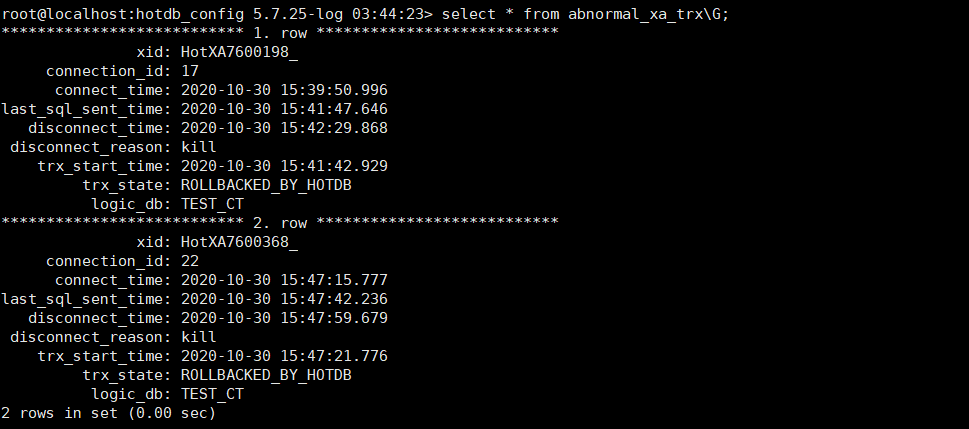

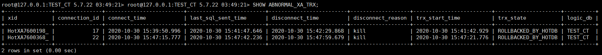

> !Important
>
> 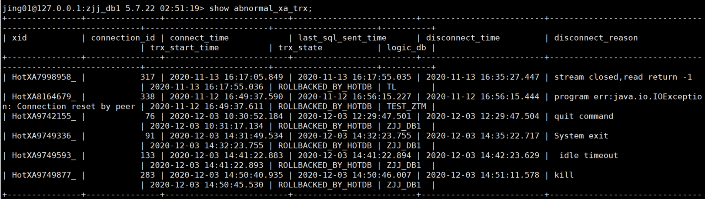
>
> - **disconnect_reason：**连接断开原因，如kill前端连接（kill）、TCP连接断开（program err:java.io.IOException: Connection reset by peer）、SQL执行超时（stream closed,read return -1）、空闲超时（idle timeout）等。
> - **trx_state：**连接断开时的事务状态，包括：
>   1.ROLLBACKED_BY_HOTDB：在事务中且事务被计算节点回滚（对应非自动提交时应用程序未发出commit命令或commit命令中途丢失）；
>   2.COMMITED_BY_HOTDB：在事务中且事务被计算节点提交（对应非自动提交时，计算节点收到了commit并成功提交，但是在commit中途前端连接断开，因此计算节点未能成功发出ok包）。

#### XA事务与读写分离的关系

XA模式下，当开启读写分离时：只有非事务内的单节点的读请求是可分离的，且模式3退化成模式2；

XA模式下，当开启读写分离时：无法保证隔离级别正确性，但能保证数据不丢，且不出现部分提交/部分回滚；

同时使用时，计算节点日志会输出相关Warning提醒。

### 非确定性函数代理

非确定性函数在使用中，会带来一系列问题，尤其是全局表的数据一致性问题，为此HotDB Server提供非确定性函数代理的功能。非确定性函数大致分为两类，一类是已知值的时间类函数，如CURDATE()、CURRENT_TIMESTAMP()等，一类是未知值的随机值函数、唯一值函数，如RAND()、UUID()等。

1. 对于时间类函数，计算节点进行统一代理。
   - 当表的字段类型有DATETIME（或者TIMESTAMP）且无默认值时，由参数[timestampProxy](#timestampproxy)控制计算节点的代理范围（默认为自动模式，可选全局处理/自动检测），将此类函数代理为具体值插入到表中；
   - 当SELECT/INSERT/UPDATE/DELETE语句中出现curdate()、curtime()等函数时，计算节点将函数代理为具体值插入到表中；
2. 对于随机值函数，计算节点针对不同的SQL语句进行不同的代理办法。
3. 对于唯一值函数，计算节点进行统一代理。
   - 当SELECT/INSERT/UPDATE/DELETE语句中出现uuid()或uuid_short()时，计算节点按照标准的UUIDv1算法代理唯一值；
   - 当存储节点和配置库的server_id冲突时，计算节点自动禁用uuid_short()并告知用户手动调整server_id。可参考MySQL官网说明：<https://dev.mysql.com/doc/refman/5.7/en/replication-options.html>。

### 全局时区支持

为保证数据的正确性，针对不同存储节点服务器存在设置不同时区，导致数据库中时间类型的数据错误的问题，HotDB Server 提供对全局时区的支持，包括：

当time_zone参数为具体的相同值或者全为SYSTEM并且system_time_zone全为相同的具体值时，HotDB Server不做特殊处理，否则HotDB Server会统一将time_zone设置为固定值："+8:00"且会记录警告级别的日志（The datasources' time_zones are not consistent）；

如登入服务端口后输入命令：

```sql
set time_zone = '+0:00';
show variables like '%time_zone';
```

仍会显示time_zone为'+8:00':

```
mysql> set time_zone='+0:00';
mysql> show variables like '%time_zone';

+--------------------+-------+
| Variable_name      | Value |
+--------------------+-------+
| system_time_zone   | CST   |
| time_zone+08:00    |       |
+--------------------+-------+
2 rows in set (0.09 sec)
```

备份与恢复时，HotDB Server能保证恢复后时间类型的数据与备份前一致。

### 全局唯一约束

若开启全局唯一约束功能，HotDB Server可以保证拥有唯一约束（UNIQUE、PRIMARY KEY）的列在所有节点都是唯一的，包括但不限于以下场景：

- 唯一约束键不是分片字段或不包含分片字段
- 父子表下，子表与父表的关联字段与子表的唯一约束键不是同一列

HotDB Server 2.5.3将全局唯一约束优化精确到表级别，默认为所有未来添加的表关闭全局唯一约束，也可以手动在添加表时为某些表单独关闭／开启全局唯一约束。

可以通过修改server.xml中的如下参数或在管理平台计算节点参数配置中修改此参数。修改参数只为未来添加的表设置全局唯一的默认值，但并不影响历史数据表的全局唯一性。

```
<property name="globalUniqueConstraint">false</property><!--全局唯一约束-->
```


> !Note
>
> 开启该功能后，可能对SQL语句INSERT、UPDATE、DELETE的执行效率有较大影响，可能导致SQL操作延迟增大；还可能导致锁等待和死锁的情况增加。请酌情考虑后注意取舍。

#### 创建表时的表级别控制

添加表信息时可以为某张表单独开启／关闭全局唯一约束

1. 在管理平台上添加表信息时，根据计算节点参数默认显示全局唯一约束开关状态，可手动修改：


垂直分片表与全局表没有此入口，因为不需要对唯一约束做额外处理。添加完表配置后即可使用建表语句添加表结构后使用。

2.使用自动建表功能，可通过`table option GLOBAL_UNIQUE [=] {0 | 1}`设置全局唯一约束的开关。例如：

```sql
create table test02(id not null auto_increment primary key,a char(8),b decimal(4,2),c int) GLOBAL_UNIQUE=0;
create table test03(id int primary key,id1 int) GLOBAL_UNIQUE =1;
```

若不使用`GLOBAL_UNIQUE [=] {0|1}`，则默认根据计算节点参数配置的默认值或在管理平台上添加的表配置设置开启或关闭；若GLOBAL_UNIQUE=1则判断为开启；若GLOBAL_UNIQUE=0则判断为关闭。

- 若GLOBAL_UNIQUE设置与默认值不同，则以GLOBAL_UNIQUE为准；
- 若GLOBAL_UNIQUE设置与管理平台中此表的全局唯一约束配置不同，则会建表失败，并给出error提醒，例如管理平台添加test01时关闭了全局唯一约束：

```
mysql> create table test01(id int)global_unique=1;

ERROR 10172 (HY000): CREATE TABLE FAILED due to generated table config already in HotDB config datasource. You may need to check config datasource or reload HotDB config.
```

- 若在垂直分片表或全局表的建表语句中使用GLOBAL_UNIQUE，则会建表成功，但会给出warning信息，因为不需要对其唯一约束做额外处理，例如test03是一张垂直分片表：

```
mysql> create table test03(id int)**global_unique=1**;

Query OK, 0 rows affected, 2 warnings (0.09 sec)
Warning (Code 10032): Create table without primary key and unique key
Note (Code 10210): Global_unique is not applicable to vertical-sharding tables or global tables.
```

为了满足MySQL的兼容性，例如使用mysqldump时不用担心GLOBAL_UNIQUE对备份结果造成干扰，将GLOBAL_UNIQUE语法解析为注释格式，例如：

```
mysql> create table test02(id int) GLOBAL_UNIQUE=1;
mysql> show create table test02
+-------+---------------------------------------------------------------+
| Table | Create Table                                                  |
+-------+---------------------------------------------------------------+
| test3 | CREATE TABLE `test3` (
  `id` int(11) DEFAULT NULL
) ENGINE=InnoDB DEFAULT CHARSET=utf8mb4/*hotdb:020503 global_unique=1*/ |
+-------+---------------------------------------------------------------+
1 row in set (0.00 sec)
```

将含有GLOBAL_UNIQUE语法的建表语句导入MySQL不会对结果有影响。在计算节点也可以直接用注释语法操作GLOBAL_UNIQUE，使用-c作为MySQL登陆参数允许执行注释。

```bash
mysql -c -uroot -proot -h127.0.0.1 -P3323
```

例如执行如下语句，表示在HotDB Server版本高于2.5.3时会执行GLOBAL_UNIQUE=0：

```sql
create table test02(id not null auto_increment primary key,a char(8),b decimal(4,2),c int) /*hotdb:020503 GLOBAL_UNIQUE=0*/;
```

#### 修改表时的表级别控制

1. 可以在管理平台的表信息管理页面修改表配置：


若表结构为已创建的表，全局唯一约束修改为开启状态后，点击动态加载并刷新页面，若出现如下图提示，说明需要到管理端口执行unique @@create，检查此表唯一约束键的历史数据，返回结果是唯一后，计算节点自动创建辅助索引，全局唯一约束方能生效，此命令详情请参考[管理端命令](management-port-command.md)文档：


2. 在计算节点通过ALTER TABLE使用GLOBAL_UNIQUE语法，开启全局唯一，同理，出现warning信息说明需要执行`unique @@create`后方能生效：

```
mysql> alter table keevey01 global_unique=1;
Query OK, 0 rows affected, 1 warning (0.01 sec)
mysql> show warnings;
+-------+-------+--------------------------------------------------------------------------------------------------------------------------------------+
| Level | Code  | Message                                                                                                                              |
+-------+-------+--------------------------------------------------------------------------------------------------------------------------------------+
| Note  | 10210 | please go to HotDB Server manager port and execute this command: unique @@create, otherwise this global_unique setting doesn't work. |
+-------+-------+--------------------------------------------------------------------------------------------------------------------------------------+
1 row in set (0.00 sec)
```

#### 分片方案在线变更

分片方案在线变更时也可以为变更后的表手动开启或关闭全局唯一约束。


开启后，在变更方案预检会检测此表唯一约束键的历史数据是否唯一，若唯一，则通过测试。


#### 查询时通过辅助索引定位

此功能还支持在SELECT查询语句中不包含分片字段但包含唯一约束字段时，通过查询辅助索引定位到固定节点，将SELECT查询语句仅下发到指定的节点而非所有节点。

```xml
<property name="routeByRelativeCol">false</property><!--不包含分片字段时通过辅助索引字段路由-->
```

此项功能默认关闭，可通过修改server.xml中的routeByRelativeCol参数或在管理平台配置菜单下的计算节点参数配置中添加参数"不包含分片字段时是否开启通过辅助索引字段路由"。

此参数开启后，作用举例如下：现有一个水平分片表table01，分片字段为id，分片规则为auto_mod，执行如下查询语句时：

```sql
SELECT * FROM table01 WHERE unique_col = 100; # unique_col是唯一约束列
```

此查询语句将只下发到 unique_col = 100 的那一个数据节点，而不是所有数据节点

### 故障切换后的数据正确性保障

无论是异步复制还是半同步复制，都可能会存在这样一种情况：在故障切换全部完成后，原主库恢复，新主库（原从库）复制IO线程可能自动重连并获取到切换前没有获取到的事务，而这样的事务在切换的处理过程中，已经是被认定没有提交成功的事务，不能再继续复制，否则会有数据混乱的风险。

因此增加计算节点参数[failoverAutoresetslave](#failoverautoresetslave)，默认关闭。

```xml
<property name="failoverAutoresetslave">false</property><!-- 故障切换时，是否自动重置主从复制关系 -->
```

故障切换后，会暂停原主从之间IO线程，并对原主库每分钟进行一次心跳检测直到原主库恢复正常。原主库恢复正常后，对比原主库的binlog位置，检测原从库（现主库）是否存在切换前没有获取到的事务，若存在，开启此参数则自动重置主从复制关系。若不存在未接收的事务，则重新开启IO线程并不再做任何处理。

> !Note
>
> 检测是否有未接收的事务的前提是主从库都需要开启GTID，否则此参数开启时，故障切换完成会自动重置主从复制关系。
>
> 若原主库在心跳检测时重试超过10080次，仍然为不可用状态，此时，参数为开启状态，也会自动重置主从复制关系。
>
> 若发生自动重置复制关系后，计算节点记录warning级别的报警日志如下：
> `you should decide whether to manually execute the unexecuted part of binlog or rebuild the replication according to the actual situation.`，
>
> 且管理平台中的主备状态会显示异常，鼠标悬浮显示如图提示信息：
>
> 
>
> 若故障切换完成后，主从库未开启GTID或存在未接收的事务，但此参数为关闭状态，计算节点也会记录warning级别的报警日志如下：
> `DBA is required to deal with the new master, which is the original slave before switching and decide whether to stop replication or continue replication regardless. In addition, there is risk of data error caused by automatic reconnection of replication after manual or unexpected restart of the new master.`

### 注意事项

以下场景中，可能会出现数据不一致的情况，包括主从存储节点的数据不一致，和数据节点之间的数据不一致：

**(1) 人为操作**

1. 人为或应用程序直接操作存储节点，可能导致任意类型的不一致；
2. 使用HINT语句操作数据，可能导致任意类型的不一致；
3. 未正确使用外键约束；在不支持的场景下使用存储过程、触发器、视图；未正确使用event等。对于计算节点来说，这些操作相当于"人为或应用程序直接操作存储节点"；
4. 强行修改表的配置规则而没有对应调整数据路由，或使用过去遗留的有BUG的分片规则等，可能导致路由不正确；
5. 设置server.xml 参数checkUpdate=false时，即允许更新分片字段，可能导致路由不正确，进而导致数据操作时存在与预期不一致的问题；
6. 未use逻辑库的情况下，执行了连接绑定语句（包括HINT、`set [session] foreign_key_checks=0、START TRANSACTION /*!40100 WITH CONSISTENT SNAPSHOT */、set [session] UNIQUE_CHECKS=0`等），导致其SQL语句均直接下发至存储节点执行，进而可能导致任意类型的不一致；

**(2) 环境配置**

1. 存储节点所在服务器时间不一致，在低于2.5.1版本时，会存在导致全局表timestamp类型数据不一致的问题、事务内时间不一致问题；在大于等于2.5.1版本，则参考[timestampProxy](#timestampproxy)设置的模式与场景；
2. 存储节点搭建从机方法不当，例如使用extrabackup备份恢复数据的方式搭建从机；
3. 主从存储节点MySQL发行分支、版本不一致；
4. 不合理的存储节点MySQL参数设置、复制架构等导致不一致，包括但不限于：使用语句格式的binlog、部分复制、多主复制、配置不正确的二级从、主从或节点间字符集、时区配置不一致等；
5. 在没有开启全局唯一约束的情况下，不含分片字段的唯一键无法保证全局唯一；

**(3) 异常情况**

1. 在做DDL操作时存储节点故障、后端连接异常中断导致存储节点间表结构不一致，表结构不一致在部分时候可能带来更多不一致的数据；
2. 故障切换后，业务上数据正确，但无法完全保证故障的主与切换到的从的数据一。同时，被标记为"不可用"的存储节点如果操作不当，例如在未校验数据一致性的情况下将其重新标记为"可用"并加入数据节点，会导致不一致；
3. 非XA模式下：计算节点被强杀、存储节点故障、后端连接异常中断导致连接断开所产生的部分提交；
4. 计算节点高可用（HA）模式下，多个服务端口（3323）开启提供服务；
5. 服务器（包括计算节点、存储节点等）磁盘已满等操作系统故障；
6. 计算节点/MySQL OOM等服务异常；
7. 备份恢复数据时出现异常，例如部分节点backup服务关闭，存储节点出现故障等 ，可能导致数据出现不一致；

**(4) 其他**

1. MySQL自身BUG，可能导致任意类型的数据不一致。应尽量使用稳定的MySQL版本与功能，不能盲目追求MySQL新功能；
2. 计算节点自身BUG，或者设计上还有遗漏的地方，可能导致任意类型的数据不一致。应及时更新至计算节点最新版本；
3. 非XA模式下读到半个事务，主从读写分离读到旧数据等非永久性的不一致。

## 高可用服务

此章节主要描述了单机房模式下的计算节点集群的高可用服务，若要了解灾备模式下的高可用服务，请参考[跨机房灾备](cross-idc-disaster-recovery.md)文档。

### 高可用服务

HotDB Server提供数据节点内的MySQL高可用，当主存储节点不可用时，计算节点将自动切换到从存储节点。

若要使用数据节点高可用，需满足以下前提：

- 在数据节点内配置主从存储节点与故障切换优先级规则；
- 主从存储节点之间必须已配置主从或双主的复制关系；
- 在计算节点配置文件中开启心跳功能。

#### 数据节点高可用

MySQL数据库主从的配置方式，请参考MySQL的官方网站（注意对应版本的官方文档，例如：<http://dev.mysql.com/doc/refman/5.6/en/replication.html>）

默认情况下，计算节点心跳功能是开启的：

```xml
<property name="enableHeartbeat">true</property>
```

假设192.168.200.202的3309实例与192.168.200.203的3313实例为一对主从复制的MySQL数据库。

配置同一个节点内的主从存储节点，可以在管理平台中的"添加节点"页面或者"存储节点更新"页面中设置。

在管理平台页面中选择"配置"->"节点管理"->"添加节点"，跳转到"添加节点"页面：

在下述操作中，生成一个数据节点"dn_08"，并为该数据节点添加了一个主存储节点"ds_failover_master"和一个从存储节点"ds_failover_slave"：


可直接勾选"自动适配切换规则"，添加节点同时自动适配故障切换优先级。或在管理平台页面中选择"配置"->"节点管理"->"高可用配置"->"切换规则"->"添加切换规则"，在数据节点下拉框中选择"dn_08"，在存储节点的下拉框中选择主存储节点"ds_failover_master，在备用存储节点下拉框中选择"ds_failover_slave"，在故障切换优先级选择高：


或点击"自动适配"，选择dn_08节点，保存即可。


主从复制关系搭建：

虽然在节点dn_08下添加了一对主从存储节点，但若这2个存储节点实际并没有搭建主从复制关系，此时可以在"配置"->"节点管理"->"高可用配置"->"主从搭建"中，选择"dn_08"节点。


点击"开始搭建"后，系统会自动对存储节点搭建主从复制关系。当搭建成功后，列表中主从状态会正常显示:


##### 手动切换

在"配置"->"节点管理"，点击某个数据节点的切换即可完成：


如果是主从，选择优先级最高的进行切换，切换后计算节点会将原主机和原主机的其他从机置为不可用，不能再进行切换。

如果是双主，切换后不会将原主库置为不可用，可以继续手动来回切换。

如果优先级最高从库不可用或延迟超过10s，依次选择剩余从库中优先级较高的进行切换，如果均不可用或存在延迟超过10s，则不切换，提示错误（切换失败日志提示`switch datasource datasourceid failed due to:no available backup found`）

在计算节点版本高于2.5.6 （包含）手动切换时，会先检查当前的hotdb_datanode/hotdb_datasource/hotdb_failover表是否与running 表中一致，若不一致会提示："当前存储节点的配置信息与内存中的配置信息不一致，无法进行切换，请动态加载后重试"；若校验通过，在新备存储节点接管前，会将被接管的存储节点更新为主库，原主库更新为双主备库或从库（注：若为主从关系，原主库及其相关的从节点均被级联置为不可用，且切换时会同步清理原复制关系，将原主库与原从库的故障切换规则进行互换，待人工进行线下的复制关系重建）

切换成功时，计算节点记录切换过程日志：

```log
INFO [pool-1-thread-1064] (SwitchDataSource.java:78) -received switch datasourceid command from Manager : [连接信息]
WARN [pool-1-thread-1339] (BackendDataNode.java:263) -datanode id switch datasource:id to datasource:id in failover. due to: Manual Switch by User: username
INFO [pool-1-thread-1339] (SwitchDataSource.java:68) -switch datasource:id for datanode:id successfully by Manager.
```

在没有配置切换规则时，不会进行切换，提示错误: `switch datasource id failed due to:found no backup information）

##### 故障切换

故障切换一般是因存储节点发生故障后自动产生的切换，说明如下：

- 不论是双主还是主从，主库发生故障并切换后，都会将主库置为不可用，不能再进行切换。需要人工去恢复主库，主库正常后，手动将主库置为可用，动态加载后会将主库恢复为可用状态。
- 如果从库状态为不可用，则不切换，计算节点记录日志

```
WARN [pool-1-thread-2614] datanode id failover failed due to found no available backup
```

- 在server.xml可以配置参数waitForSlaveInFailover控制切换是否等待从库追上复制，该参数默认为true等待，在切换过程中，会等待从库追上复制，如果设置为false不等待，则会立即切换。（立即切换存在数据丢失的风险，不建议设置）。
- 一主多从的情况下，计算节点选择优先级最高的从库进行切换，如果优先级最高从库不可用，依次选择剩余从库中优先级较高的进行切换，如果均不可用，则不切换，计算节点记录日志`WARN [pool-1-thread-2614] -datanode id failover failed due to found no available backup`；
- 在HotDB Server 版本高于2.5.6 （包含）故障切换时，在新备存储节点接管前会将被接管的存储节点更新为主库，原主库更新为双主备库或从库，并置为不可用，原主库相关的从节点均被级联置为不可用（注：若为主从关系，切换时会同步清理原复制关系，且将原主库与原从库的故障切换规则进行互换，待人工进行线下的复制关系重建）
- 故障切换过程中，主库心跳不停，如果连续两次成功，则放弃切换，计算节点记录日志

```
INFO [$NIOREACTOR-6-RW] (Heartbeat.java:502) -heartbeat continue success twice for datasource 5 192.168.200.52:3310/phy243_05, give up failover.
```

- 切换成功时，计算节点记录日志，并记录切换原因：

如果是网络故障、服务器宕机，掉电等，则记录Network is unreachable

如果网络可达，MySQL服务停止，没有响应，则记录MySQL Service Stopped

如果MySQL服务开启，但是响应出现异常，则记录MySQL Service Exception

例如：存储节点服务关掉时，整个切换过程提示如下：

```log
02/21 15:57:29.342 INFO [HeartbeatTimer] (BackendDataNode.java:396) -start failover for datanode:5
02/21 15:57:29.344 INFO [HeartbeatTimer] (BackendDataNode.java:405) -found candidate backup for datanode 5 :[id:9,nodeId:5 192.168.200.51:331001_3310_ms status:1] in failover, start checking slave status.
02/21 15:57:29.344 WARN [$NIOREACTOR-0-RW] (HeartbeatInitHandler.java:44) -datasoruce 5 192.168.200.52:331001_3310_ms init heartbeat failed due to:MySQL Error Packet{length=36,id=1}
02/21 15:57:29.344 INFO [pool-1-thread-1020] (CheckSlaveHandler.java:241) -slave_sql_running is Yes in :[id:9,nodeId:5 192.168.200.51:331001_3310_ms status:1] during failover of datanode 5
02/21 15:57:29.424 WARN [pool-1-thread-1066] (BackendDataNode.java:847) -datanode 5 switch datasource 5 to 9 in failover. due to: MySQL Service Stopped
02/21 15:57:29.429 WARN [pool-1-thread-1066] (Heartbeat.java:416) -datasource 5 192.168.200.52:331001_3310_ms heartbeat failed and will be no longer used.
```

- 在没有配置切换规则时，不会进行切换，计算节点记录日志

```log
WARN [pool-1-thread-177] (?:?) -datanode id failover failed due to found no backup information
```

- 在存储节点发生故障切换后，不论主从还是双主，我们统一要求，手动将存储节点置为可用的前提是操作人员必须清楚当前主从服务无异常，数据同步无异常，特别是主从模式，要保证期间备提供服务时的数据同步到了主存储节点。存储节点启用时，我们要养成习惯，不要跳过主备一致性检测。

#### 配置库高可用

配置库、部分存储节点部署在同一MySQL实例或同一服务器时，若该实例出现故障，故障信息无法记入配置库，故计算节点支持配置库高可用功能，保证配置库可正常使用。

1. 在server.xml里配置主从配置库的连接信息，保证主从关系正常

```xml
<property name="url">jdbc:mysql://192.168.200.191:3310/hotdb_config</property><!-- 主配置库地址 -->
<property name="username">hotdb_config</property><!-- 主配置库用户名 -->
<property name="password">hotdb_config</property><!-- 主配置库密码 -->
<property name="bakUrl">jdbc:mysql://192.168.200.190:3310/hotdb_config</property><!-- 从配置库地址 -->
<property name="bakUsername">hotdb_config</property><!-- 从配置库用户名 -->
<property name="bakPassword">hotdb_config</property><!-- 从配置库密码 -->
```

- 当主配置库发生故障时会自动切换到从配置库。切换过程中若存在延迟会等待从配置库复制延迟追上后切换成功并提供服务。

- 在计算节点版本高于2.5.6 （包含）时主配置库发生故障，在从配置库接管前会将被接管的从配置库更新为主库，原主配置库更新为从库，且会同步调整server.xml配置文件，如下图：

```xml
<property name="url">jdbc:mysql://192.168.200.190:3310/hotdb_config</property><!-- 主配置库地址 -->
<property name="username">hotdb_config</property><!-- 主配置库用户名 -->
<property name="password">hotdb_config</property><!-- 主配置库密码 -->
<property name="bakUrl">jdbc:mysql://192.168.200.191:3310/hotdb_config</property><!-- 从配置库地址 -->
<property name="bakUsername">hotdb_config</property><!-- 从配置库用户名 -->
<property name="bakPassword">hotdb_config</property><!-- 从配置库密码 -->
```

- 若计算节点高可用服务涉及配置库的主从关系，需保证server.xml中一组计算节点高可用的主从配置库的配置完全相同，不能交错配置。

2. 配置库同时支持MGR配置库(MySQL必须是5.7以上，配置库MGR暂时只支持三个节点)，在server.xml中配置具有MGR关系的配置库信息，并且保证MGR关系正常。MGR关系不正确的情况下，配置库可能会无法正常提供服务，以及可能造成启动不成功。

```xml
<property name="url">jdbc:mysql://192.168.210.22:3308/hotdb_config_test250</property><!-- 配置库地址 -->
<property name="username">hotdb_config</property><!-- 配置库用户名 -->
<property name="password">hotdb_config</property><!-- 配置库密码 -->
<property name="bakUrl">jdbc:mysql://192.168.210.23:3308/hotdb_config_test250</property><!-- 从配置库地址(如配置库使用MGR,必须配置此项) -->
<property name="bakUsername">hotdb_config</property><!-- 从配置库用户名(如配置库使用MGR,必须配置此项) -->
<property name="bakPassword">hotdb_config</property><!-- 从配置库密码(如配置库使用MGR,必须配置此项) -->
<property name="configMGR">true</property><!-- 配置库是否使用MGR -->
<property name="bak1Url">jdbc:mysql://192.168.210.24:3308/hotdb_config_test250</property><!-- MGR配置库地址(如配置库使用MGR,必须配置此项) -->
<property name="bak1Username">hotdb_config</property><!-- MGR配置库用户名(如配置库使用MGR,必须配置此项) -->
<property name="bak1Password">hotdb_config</property><!-- MGR配置库密码(如配置库使用MGR,必须配置此项) -->
```

MGR配置库在主库发生故障时，根据实际MySQL的重新选主逻辑，在选出新的主库时，会及时切换到新的主配置库。

#### 计算节点高可用

HotDB Server支持高可用架构部署，利用keepalived高可用服务原理搭建主备服务关系，可保证在主计算节点(即Active计算节点) 服务故障后，自动切换到备计算节点 (即Standby计算节点)，应用层面可借助Keepalived的VIP 访问数据库服务，保证服务不间断。

##### 启动说明

在启动高可用架构下的主备计算节点服务时，需要注意启动的顺序问题，如下为标准启动顺序：

1. 先启动主计算节点，再启动主计算节点所在服务器上的Keepalived：

查看计算节点日志：

```log
2018-06-13 09:40:04.408 [INFO] [INIT] [Labor-3] j(-1) -- HotDB-Manager listening on 3325
2018-06-13 09:40:04.412 [INFO] [INIT] [Labor-3] j(-1) -- HotDB-Server listening on 3323
```

查看端口监听状态：

```
root> ss -npl | grep 3323
LISTEN 0 1000 *:3323 *:* users:(("java",12639,87))
root> ps -aux |grep hotdb
Warning: bad syntax, perhaps a bogus '-'? See /usr/share/doc/procps-3.2.8/FAQ
root 12639 60.7 34.0 4194112 2032134 ? Sl Jun04 7043:58 /usr/java/jdk1.7.0_80/bin/java -DHOTDB_HOME=/usr/local/hotdb-2.4/hotdb-server -classpath /usr/local/hotdb-2.4/hotdb-server/conf: ...省略更多... -Xdebug -Xrunjdwp:transport=dt_socket,address=8065,server=y,suspend=n -Djava.net.preferIPv4Stack=true cn.hotpu.hotdb.HotdbStartup
```

使用命令"ip a"可查看当前主计算节点的Keepalived VIP是否已绑定成功，如下例子中，192.168.200.190为主计算节点所在服务器地址；192.168.200.140为配置的VIP地址

```
root> ip a
1: lo: <LOOPBACK,UP,LOWER_UP> mtu 65536 qdisc noqueue state UNKNOWN
link/loopback 00:00:00:00:00:00 brd 00:00:00:00:00:00
inet 127.0.0.1/8 scope host lo
inet6 ::1/128 scope host
valid_lft forever preferred_lft forever
2: eth1: <BROADCAST,MULTICAST,UP,LOWER_UP> mtu 1500 qdisc pfifo_fast state UNKNOWN qlen 1000
link/ether 00:1d:0f:14:8b:fa brd ff:ff:ff:ff:ff:ff
inet 192.168.200.190/24 brd 192.168.200.255 scope global eth1
inet 192.168.200.140/24 scope global secondary eth1:1
inet6 fe80::21d:ff:fe14:8bfa/64 scope link
valid_lft forever preferred_lft forever
```

2. 再启动备计算节点，再启动备计算节点所在服务器上的Keepalived：

查看计算节点日志：

```log
2018-06-04 18:14:32:321 [INFO] [INIT] [main] j(-1) -- Using nio network handler
2018-06-04 18:14:32:356 [INFO] [INIT] [main] j(-1) -- HotDB-Manager listening on 3325
2018-06-04 18:14:32:356 [INFO] [AUTHORITY] [checker] Z(-1) -- Thanks for choosing HotDB
```

查看端口监听状态：

```
root> ss -npl | grep 3325
LISTEN 0 1000 *:3325 *:* users:(("java",11603,83))
root> ps -aux |grep hotdb
Warning: bad syntax, perhaps a bogus '-'? See /usr/share/doc/procps-3.2.8/FAQ
root 11603 12.0 13.6 3788976 1086196 ? Sl Jun04 1389:44 /usr/java/jdk1.7.0_80/bin/java -DHOTDB_HOME=/usr/local/hotdb-2.4/hotdb-server -classpath /usr/local/hotdb-2.4/hotdb-server/conf: ...省略更多... -Xdebug -Xrunjdwp:transport=dt_socket,address=8065,server=y,suspend=n -Djava.net.preferIPv4Stack=true cn.hotpu.hotdb.HotdbStartup
```

##### 高可用切换说明

当主计算节点（以192.168.200.190为例）服务故障时，检测脚本(vrrp_scripts)检测到主计算节点服务端口不可访问或hacheck连续失败超过3次，优先级会进行调整，变成 90(weight -10)。

备计算节点（以192.168.200.191为例）服务上的 keepalived 收到比自己优先级低的 vrrp 包(192.168.200.191上优先级为 95)后，将切换到 master 状态，抢占 vip(以192.168.200.140为例)。同时在进入 master 状态后，执行 notify_master 脚本，访问192.168.200.191上的计算节点管理端口执行 `online` 命令启动并初始化192.168.200.191上的计算节点服务端口。若该计算节点启动成功，则主备切换成功继续提供服务。192.168.200.191上的计算节点日志如下：

```log
2018-06-12 21:54:45.128 [INFO] [INIT] [Labor-3] j(-1) -- HotDB-Server listening on 3323
2018-06-12 21:54:45.128 [INFO] [INIT] [Labor-3] j(-1) -- =============================================
2018-06-12 21:54:45.141 [INFO] [MANAGER] [Labor-4] q(-1) -- Failed to offline master Because mysql: [Warning] Using a password on the command line interface can be insecure.
ERROR 2003 (HY000): Can't connect to MySQL server on '192.168.200.190' (111)
2018-06-12 21:54:45.141 [INFO] [RESPONSE] [$NIOREACTOR-8-RW] af(-1) -- connection killed for HotDB backup startup
...省略更多...
```

Keepalived的VIP已在192.168.200.191服务器上:

```
root> ip a
1: lo: <LOOPBACK,UP,LOWER_UP> mtu 65536 qdisc noqueue state UNKNOWN
link/loopback 00:00:00:00:00:00 brd 00:00:00:00:00:00
inet 127.0.0.1/8 scope host lo
inet6 ::1/128 scope host
valid_lft forever preferred_lft forever
2: eth0: <BROADCAST,MULTICAST,UP,LOWER_UP> mtu 1500 qdisc pfifo_fast state UP qlen 1000
link/ether 18:a9:05:1b:0f:a8 brd ff:ff:ff:ff:ff:ff
inet 192.168.200.191/24 brd 192.168.200.255 scope global eth0
inet 192.168.200.140/24 scope global secondary eth0:1
inet6 fe80::1aa9:5ff:fe1b:fa8/64 scope link
valid_lft forever preferred_lft forever
```

> !Note
>
> 若通过管理平台手动切换，切换成功的会修改server.xml中的（haState、haNodeHost）的配置，将主备的信息互换，故障切换不会修改配置。

##### 高可用重建

主备模式的计算节点主要通过server.xml以及keepalived.conf配置文件来标识主备的角色。高可用切换只能从主服务切换至备服务，当计算节点发生过故障切换或手动切换后，为保证下次计算节点故障还能顺利回切，需要通过高可用重建操作配置主备计算节点的相应。

例如，通过该功能可实现：当主计算节点（以192.168.200.190为例）发生故障切换，切换到备计算节点（以192.168.200.191为例）后，手动触发计算节点高可用重建功能，可重新配置两台服务器上计算节点服务的主备关系，其中192.168.200.191为主，192.168.200.190为备。当192.168.200.191服务器上计算节点再发生故障时，可自动进行回切到192.168.200.190。关于高可用重建详情请参考[管理平台](hotdb-management.md)文档。

#### 计算节点负载均衡

HotDB Server支持多计算节点集群的节点自治。以下简称计算节点集群中Primary状态的计算节点为Primary计算节点；计算节点集群中Secondary状态的计算节点为Secondary计算节点。Primary和Secondary计算节点的数据服务完全对等，均支持所有类型的数据操作且保证数据的一致性。集群中一个或多个（不支持多数计算节点同一时间故障）节点发生故障后，只要还有一个或更多节点可用，则整体数据服务依旧可用。

HotDB Server支持负载均衡：可选择使用LVS等方式，进行SQL请求的分发。应用端可借助LVS的VIP访问HotDB Server的数据库服务，同时保证使用透明与服务不间断。也可使用其余负载均衡方案进行处理，例如F5加自定义检测；应用直连计算节点，但发生异常时更换节点等方式。

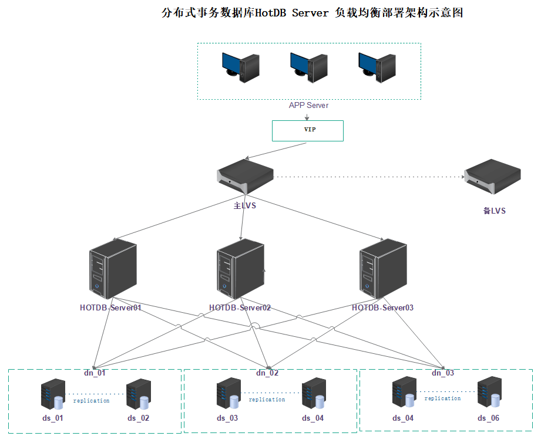

##### 启动说明

在计算节点集群环境部署成功后，启动计算节点：

```bash
cd /usr/local/hotdb-2.5.0/hotdb-server/bin
sh hotdb_server start
```

查看HotDB Server启动状态：

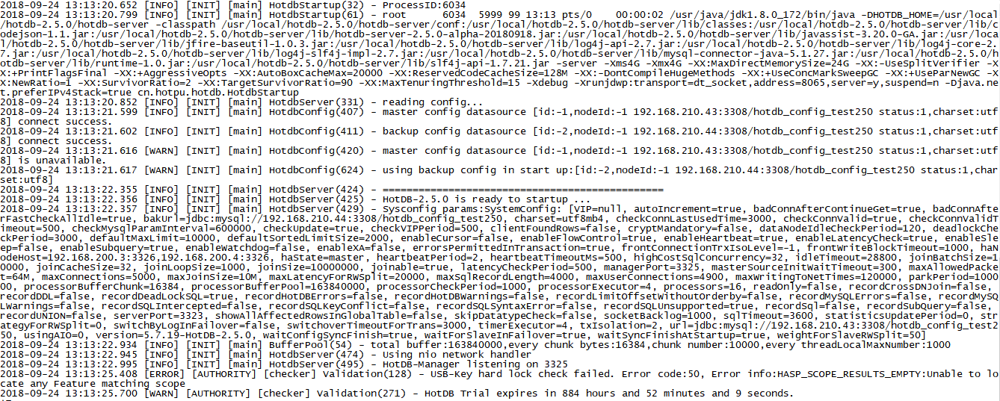

计算节点启动后不开放服务端口，会暂时将自己的角色状态设置为Started。当集群中所有计算节点都启动后，有一个计算节点会变为Primary,其余计算节点变为Secondary，且所有计算节点均开放数据服务端口，整个集群进入正常运行状态，示例：

Primary节点：

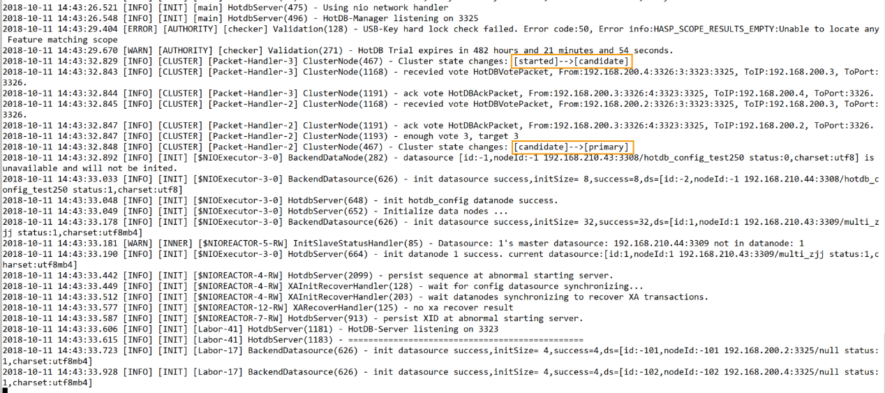

Secondary节点：

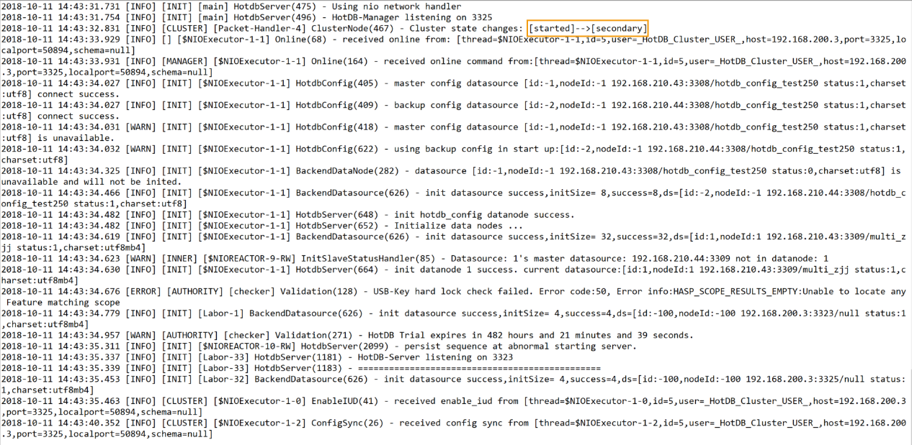

管理端3325状态查看：

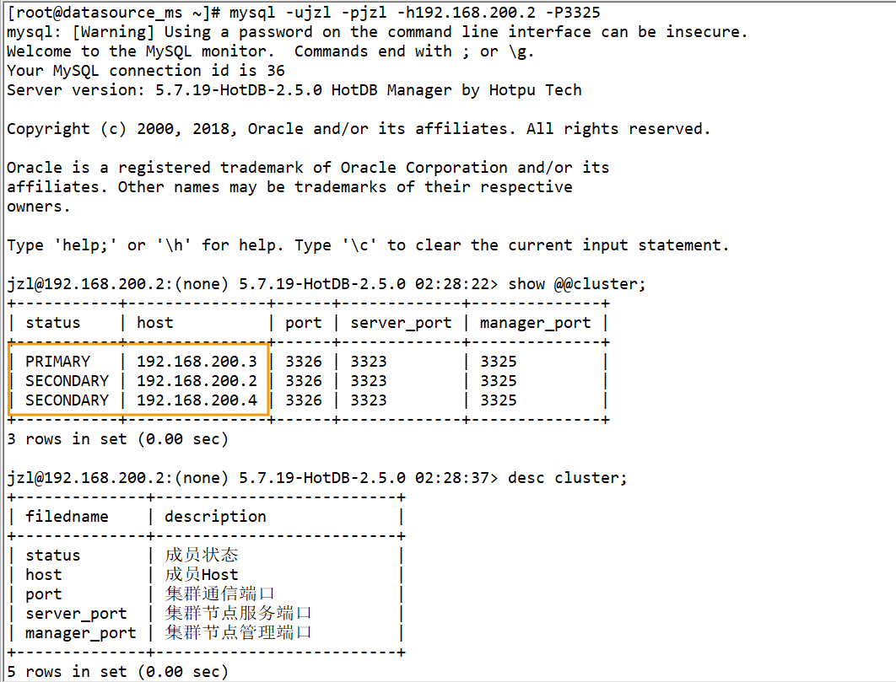

当Primary服务异常时，剩余Secondary中的一个会变为新的Primary，原Primary会被踢出集群。

原Primary：

```bash
cd /usr/local/hotdb-2.5.0/hotdb-server/bin
sh hotdb_server stop
```

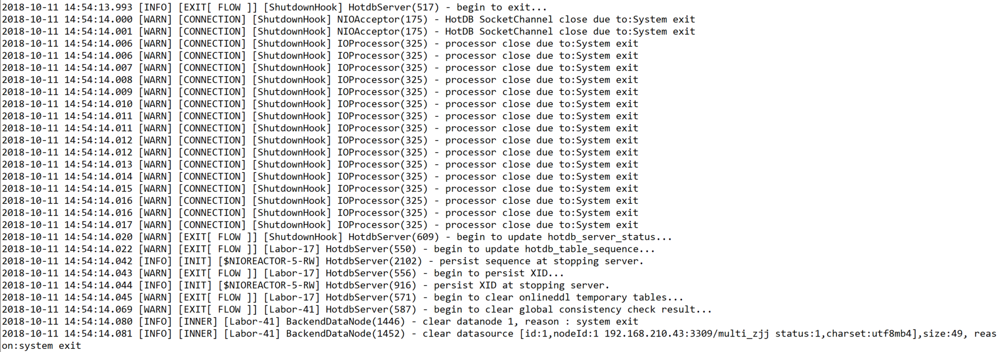

新Primary：

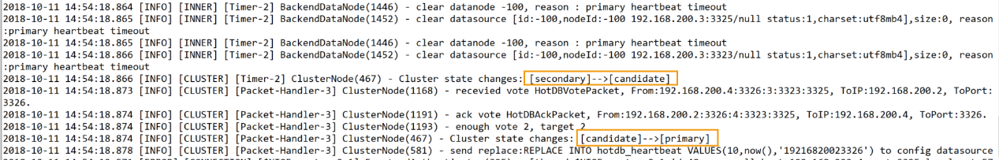

管理端状态查看：


若原Primary服务重新启动（相当于新节点加入），当前Primary发现Started的节点，新节点会加入该集群变为Secondary。

原Primary：

```bash
cd /usr/local/hotdb-2.5.0/hotdb-server/bin
sh hotdb_server start
```

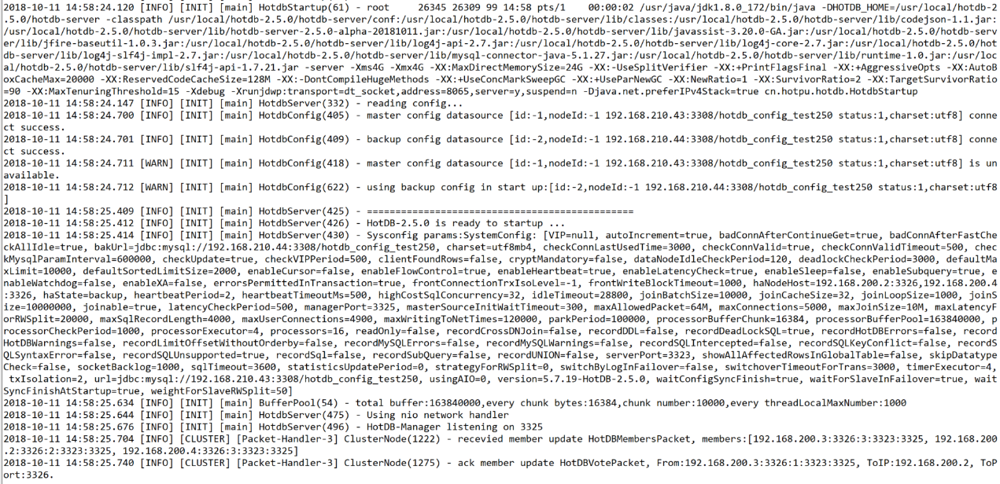

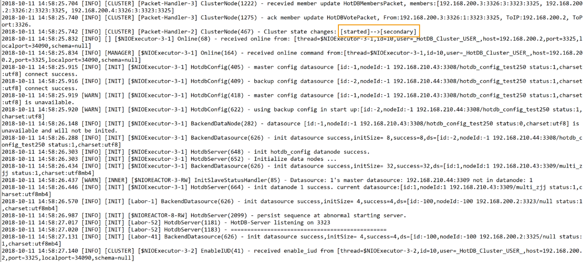

管理端状态查看：


多计算节点集群启动后通过VIP访问数据库服务，即可实现透明的负载均衡，可保证服务不间断。

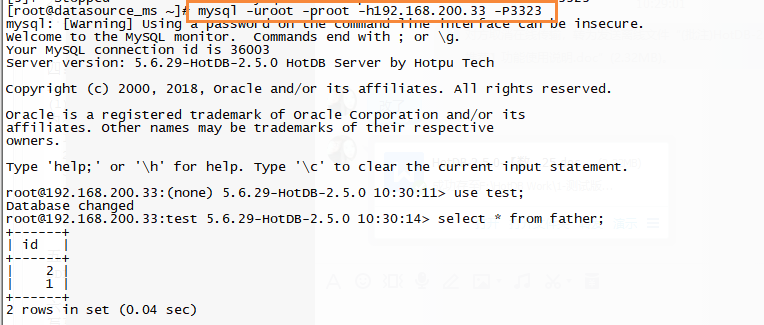

多计算节点集群注意事项：

1.  计算节点集群启动时Primary具有随机性，但主配置库所在的服务器上的计算节点不会成为Primary；
2.  故障的计算节点经过一段时间，会自行关闭服务端口变为Started状态；
3.  Secondary发现Primary失去响应且自己不在主配置库服务器上，会发起新选举，收到多数投票变为新Primary；
4.  新节点加入，Primary发现新Started的节点加入，会添加新发现的节点；Primary发现Secondary失去响应，则会剔除该节点；
5.  集群环境升级版本，如果不影响业务，建议关闭集群升级后再启动；
6.  集群中各节点的server.xml配置，除集群相关的参数都必须一致；
7.  各计算节点服务器时间差异需小于1s；
8.  计算节点服务器之间要求任何时候网络延迟均小于1s；建议计算节点间计算节点与存储节点间存储节点间的延迟均低于1ms，以便使用时获得良好的响应时间性能；
9.  建议一个局域网网段内，只部署一套多计算节点集群（只是建议，不是强制要求，建议的理由是为以后扩容预留较大空间）；
10. 配置库IP需配置实际IP。

##### 线性扩展

在多计算节点集群模式下，若想要实现强一致（XA）模式下的性能吞吐量随计算节点个数的扩展性能实现线性增长，可使用HotDB Listener组件。

HotDB-Listener是HotDB Server的一个可拔插组件，使用JAVA语言开发，它需要单独进行部署，并以独立的进程运行。HotDB Listener作为Agent，部署在每个存储节点实例的本地环境中，代理相关存储节点服务的连接和请求。

###### 部署Listener

可参考[安装部署](installation-and-deployment.md)文档进行Listener组件的部署。

###### 使用Listener

使用Listener需要计算节点满足必要条件：

- 计算节点版本为2.5.5及以上
- 计算节点为多计算节点集群模式
- 开启XA模式
- 将server.xml中[enableListener](#enablelistener)参数设置为true。

####### 添加节点配置Listener

当Listener部署完成后，可在数据节点页面引入Listener 的配置信息。

以添加1组双主类型的数据节点为例：


步骤1~4按照以往规则填写存储节点的主机名和端口号，连接用户和密码，物理库等。若该组存储节点需要绑定Listener，在步骤5中，填写好监听程序相关信息（Listener中文为监听程序）。


填写规则如下：

- 监听程序主机名：默认填写"默认"，无需修改
- 监听端口：即Listener的启动端口，默认3330
- 监听程序服务端口：即Listener向HotDB Server提供服务的端口，默认4001。若同一台存储节点服务器上有多个MySQL实例需要绑定Listener，服务端口需要保持唯一。

填写完毕后，点击测试连接，测试通过后点击保存并返回。

执行动态加载，若节点管理列表的状态列为绿色可用，代表监听程序可以连接；若状态为橙色可用，代表监听程序无法连接，需检查：enableXA是否为true，enableListener是否为true。

验证Listener服务是否被启用：在3325端口执行show @@datasource即可查看。

####### 编辑存储节点配置Listener

此方法适用于在已有数据节点的基础上添加Listener的配置信息。

在节点管理页面，以dn_26数据节点为例：


点击操作栏中的i图标，即详情，进入该存储节点管理页。

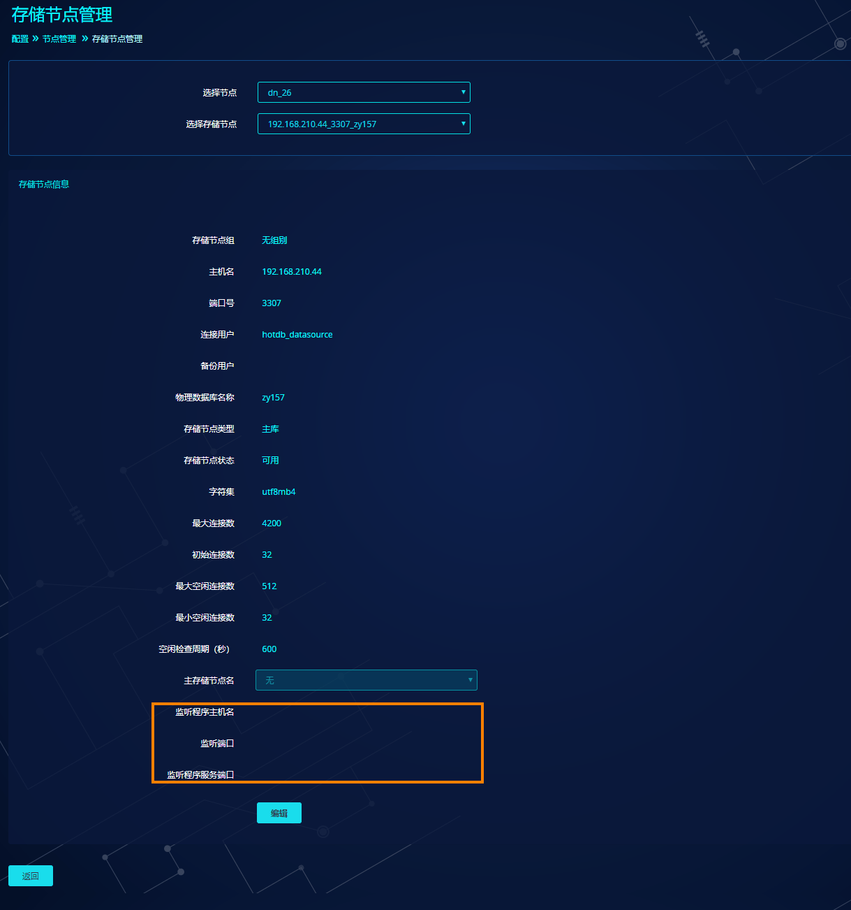

对于未绑定监听程序的存储节点，最后三项信息默认为空。

点击编辑，添加监听程序相关信息。

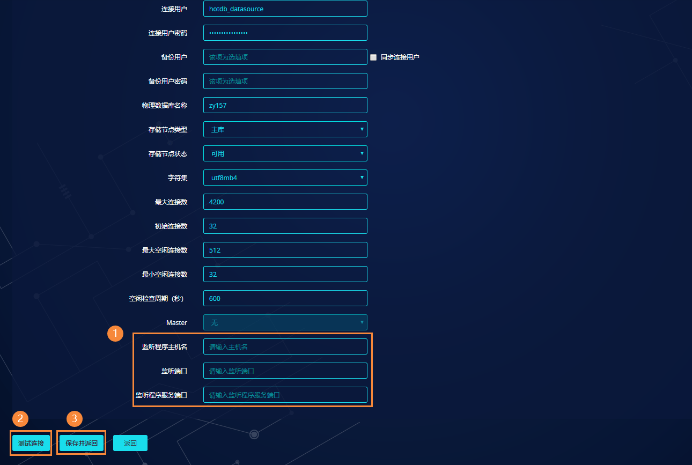

填写规则如下：

- 监听程序主机名：填写该存储节点的主机名
- 监听端口：即Listener的启动端口，默认3330
- 监听程序服务端口：即Listener向HotDB Server提供服务的端口，默认4001。若同一台存储节点服务器上有多个MySQL实例需要绑定Listener，服务端口需要保持唯一

填写完毕后，点击测试连接，测试通过后点击保存并返回。

执行动态加载，若节点管理列表的状态列为绿色可用，代表监听程序可以连接；若状态为橙色可用，代表监听程序无法连接，需检查：enableXA是否为true，enableListener是否为true。

验证Listener服务是否被启用：在3325端口执行show @@datasource即可查看。

###### 注意事项

1. Listener只需部署完成并正确识别即可，日常计算节点操作过程中可无需关注。
2. Listener组件尽可能和存储节点安装在同一台服务器上；
3. 若一个监听程序需要监听多个存储节点，则需要为其分别填写不同的服务端口；
4. 当某个存储节点取消被Listener监听时，已分配的监听程序服务端口会一直存在，原存储节点可再次使用该监听程序服务端口绑定Listener。
5. 当某个存储节点取消被Listener监听时，已分配的监听程序服务端口会一直存在，此时其他存储节点使用该监听程序服务端口，Listener日志会报错：端口冲突，端口已存在。因此需要重启Listener后才能使用该监听程序服务端口。
6. 当集群需要重启时，建议Listener组件也一同重启，重启顺序为：先重启Listener，后重启集群，以便集群更快的识别Listener；
7. Listener作为可插拔组件，当Listener不可用时，集群和存储节点仍然可以正常提供服务。
8. 若Listener单独重启，则需至少等待2分钟，计算节点会自动与Listener再次重连。

#### 计算节点水平弹性伸缩

为满足业务发展和应用数据增长的需求，HotDB Server V2.5.6版本支持计算节点在线水平扩容/缩容功能，通过手动调整计算节点server.xml相关参数并动态加载的方式实现计算节点扩容/缩容。例如单节点模式，可以扩展到 HA模式，也可以扩展到集群模式，同时集群模式可以缩减到HA或单节点模式。

##### 计算节点扩容

###### 参数介绍

涉及的参数如下:

| 参数值 | 参数说明 | 参考值 | 动态加载是否生效 |
|--------|----------|--------|------------------|
| haMode | 高可用模式：0：主备；1：集群 | 集群环境下参数值为1 | 是 |
| serverId | 集群节点编号1-N（节点数)，集群内唯一且N<=集群节点总数 | serverID要从1开始，且集群内连续不重复 | 是 |
| clusterName | 集群组名称 | HotDB-Cluster | 是 |
| clusterSize | 集群节点总数 | 默认值3，根据实际节点数配置 | 是 |
| clusterNetwork | 集群所在网段 | 192.168.200.0/24，跟集群IP同网段 | 是 |
| clusterHost | 本节点所在IP | 192.168.200.1，根据具体IP匹配 | 是 |
| clusterPort | 集群通信端口 | 默认3326 | 是 |

###### HA模式扩展集群多节点

HA模式扩展到集群多节点，主要在于如何将keepalived切换到LVS，此小节将主要描述HA到集群的扩容操作，涉及的组件信息如下:

| 角色 | 连接信息 | 名称 |
|------|----------|------|
| 主计算节点 | 192.168.210.67_3323_3325 | HotDB_01 |
| 备计算节点 | 192.168.210.68_3325 | HotDB_02 |
| LVS服务 | 192.168.210.136 | VIP:192.168.210.218 |
| 新计算节点 | 192.168.210.134 | HotDB_03 |


**第一步：停备计算节点/备keepalived服务**

停止HotDB_02的keepalived和计算节点服务。


**第二步：部署并启动LVS**

此处以单LVS服务为例，选定192.168.210.136做LVS服务器，VIP使用192.68.210.218。

1. LVS服务器部署LVS服务

```bash
cd /usr/local/hotdb/Install_Package
sh hotdbinstall_v*.sh --dry-run=no --install-lvs=master --lvs-vip-with-perfix=192.168.210.218/24 --lvs-port=3323 --lvs-virtual-router-id=44 --lvs-net-interface-name=eth0:1 --lvs-real-server-list=192.168.210.134:3323:3325,192.168.210.67:3323:3325,192.168.210.68:3323:3325 --ntpdate-server-ip=182.92.12.11
```

2. 计算节点服务器（HotDB_01/HotDB_02/HotDB_03）配置LVS服务

**HotDB_01/HotDB_02/HotDB_03服务器分别执行脚本：**

```bash
cd /usr/local/hotdb/Install_Package
sh hotdbinstall_v*.sh --dry-run=no --lvs-real-server-startup-type=service --lvs-vip-with-perfix=192.168.210.218/24 --install-ntpd=yes --ntpdate-server-host=182.92.12.11
```

3. LVS服务器启动LVS服务

```bash
service keepalived start
```

**第三步：调整参数并启动集群服务**

1. 计算节点（HotDB_01/HotDB_02/HotDB_03）的server.xml依据[相关参数](#计算节点扩容)进行调整，如下图：

HotDB_01的参数参考框选区域的配置：

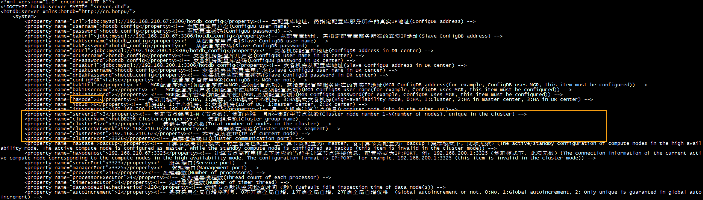

HotDB_02的参数参考框选区域的配置：


HotDB_03的参数参考框选区域的配置：


2. HotDB_01管理端执行reload @@config操作，show @@cluster可看到HotDB_01作为PRIMARY角色加入集群。

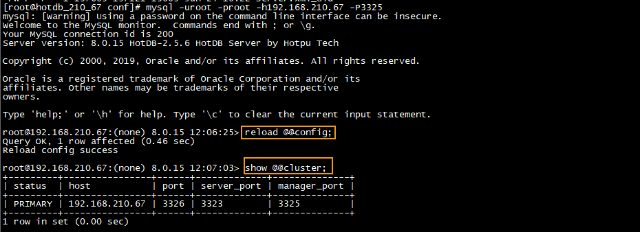

（3）停止HotDB_01服务器keepalived服务

```bash
service keepalived stop
```

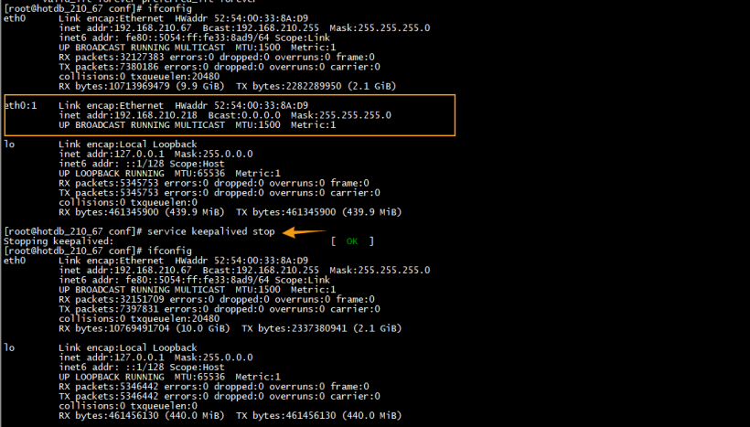

3. 启动HotDB_02、HotDB_03，然后在HotDB_01管理端执行show @@cluster;可看到集群成员全部加入。

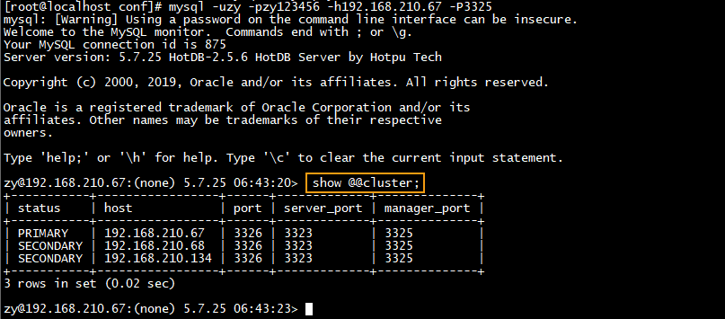

**第四步：管理平台适配调整**

适配方式同"集群模式扩展计算节点"一致，编辑计算节点集群将新引入的计算节点纳入管理，使其HA模式转换成集群模式，如下图：


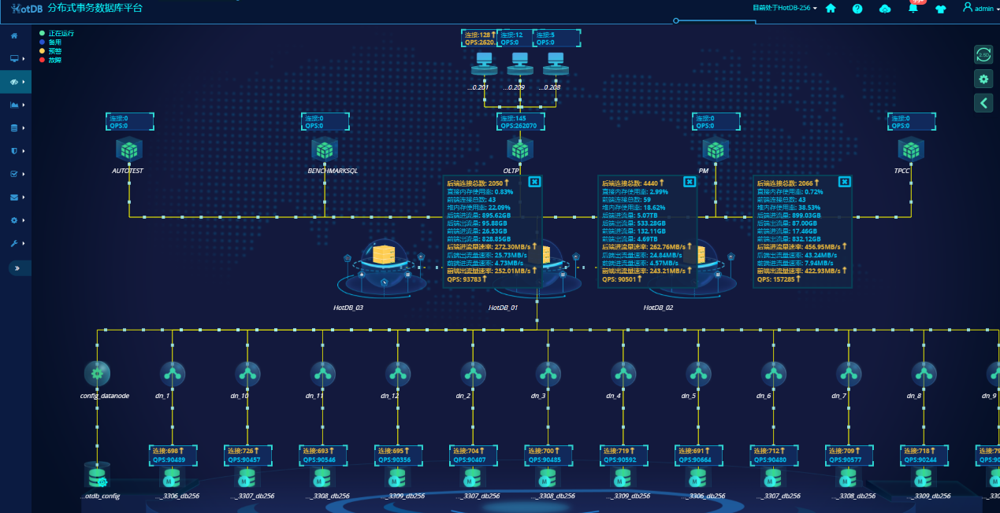

###### 集群模式扩展更多计算节点

此小节将描述集群模式下进行计算节点扩容相关操作，涉及的组件信息如下:

| 角色 | 连接信息 | 名称 |
|------|----------|------|
| 主计算节点 | 192.168.210.157_3323_3325 | HotDB_01 |
| 备计算节点 | 192.168.210.156_3323_3325 | HotDB_02 |
| 备计算节点 | 192.168.210.155_3323_3325 | HotDB_03 |
| 主/备LVS | 192.168.210.135/137 | VIP:192.168.210.216 |
| 新计算节点 | 192.168.210.134 | HotDB_04 |

**第一步：LVS服务器添加新计算节点**

（1）主/备 LVS服务器上添加HotDB_04的虚拟服务

```bash
ipvsadm -a -t 192.168.210.216:3323 -r 192.168.210.134
```

（2）主备LVS配置文件keepalived.conf中添加HotDB_04的服务信息，如下图：


**第二步：新计算节点服务器配置LVS**

在HotDB_04服务器执行部署脚本，配置LVS：

```bash
cd /usr/local/hotdb/Install_Package/
sh hotdbinstall_v*.sh --dry-run=no --lvs-real-server-startup-type=service --lvs-vip-with-perfix=192.168.210.216/24 --install-ntpd=no --ntpdate-server-host=182.92.12.11
```

**说明：**`--lvs-vip-with-perfix`：当前集群的VIP

**第三步：调整参数并启动新集群成员**

1. 修改所有计算节点服务器（HotDB_01/HotDB_02/HotDB_03/HotDB_04）server.xml的ClusterSize参数值，保证ClusterSize等于实际集群成员个数（此处为4）。其他参数无需调整，但需注意clusterName、clusterSize、clusterNetwork、clusterPort在同一集群内参数值一致。

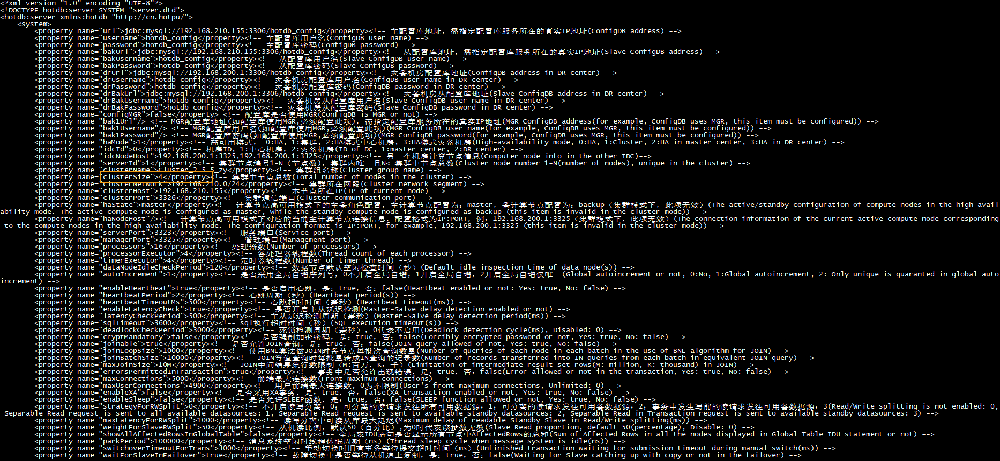

2. 新计算节点服务器（HotDB_04）调整server.xml中其他集群参数并启动服务，如下图：

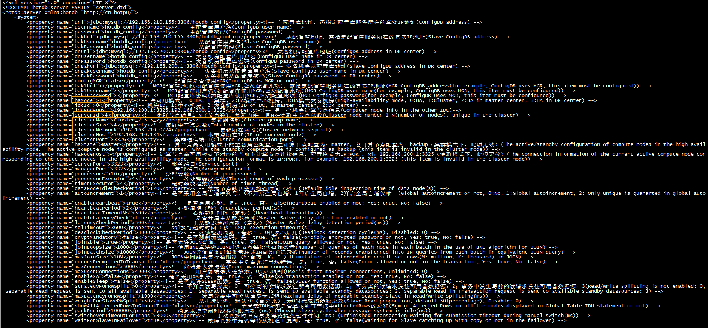

**第四步：Reload操作使配置生效**

主计算节点（HotDB_01）管理端执行reload @@config，可看到HotDB_04加入集群：

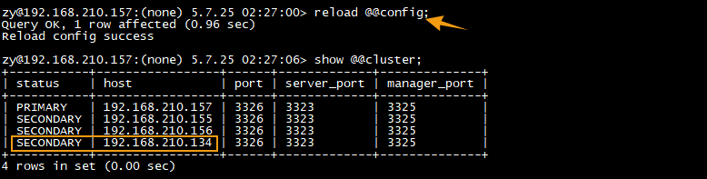

**第五步：管理平台适配调整**

进入"集群管理"->"计算节点集群"页面，将新引入的计算节点纳入管理。

编辑计算节点集群，通过计算节点右侧操作栏的"+"按钮可添加新引入的计算节点，保存后管理平台会根据计算节点个数自动识别计算节点模式，如下图：


> !Note
>
> - 若集群继续引入新计算节点，按第一步开始重复操作；
> - 若计算节点的clusterSize、haMode值与实际配置的集群不匹配，第四步reload @@config会失败，需保证配置与实际情况吻合；
> - 新计算节点的参数serverId需保证编号唯一不重复且跟原集群连续不间断，否则会导致启动异常；

##### 计算节点缩容

通过计算节点缩容功能，可以完成计算节点数量的缩减。计算节点停止后，可直接通过修改集群内其他多计算节点相关配置，动态加载后即可根据新配置缩减计算节点个数。

###### 参数介绍

涉及的参数配置如下:

| 参数值 | 参数说明 | 参考值 | 动态加载是否生效 |
|--------|----------|--------|------------------|
| haMode | 高可用模式：0：主备；1：集群 | 集群环境下参数值为1 | 是 |
| HaState | 计算节点HA模式下的主备角色配置 | 主计算节点配置：master<br>备计算节点配置：backup | 是 |
| haNodeHost | 计算节点高可用模式下对应的当前主计算节点连接信息 | 配置格式为IP:PORT<br>192.168.200.1:3325 | 是 |

###### 集群模式缩容为HA模式

本小节主要描述正常提供服务的集群缩减为HA的操作，涉及的组件同[HA模式扩展集群多节点模式](#ha模式扩展集群多节点)一致


**第一步：关闭集群备计算节点服务**

依次关闭HotDB_02、HotDB_03计算节点服务，此过程会触发集群选举，若此时有压测任务，将出现闪断，几秒后恢复正常。


**第二步：部署keepalived并调整计算节点配置**

1. HotDB_01、HotDB_02服务器分别部署主备keepalived（对应VIP与LVS的VIP可相同，但virtual_router_id不能相同）

**HotDB_01服务器执行脚本：**

```bash
cd /usr/local/hotdb/Install_Package
sh hotdbinstall_v*.sh --dry-run=no --install-keepalived=master --keepalived-vip-with-prefix=192.168.210.218/24 --keepalived-virtual-router-id=218 --keepalived-net-interface-name=eth0:1 --ntpdate-server-host=182.92.12.11 --install-ntpd=yes
```

**HotDB_02服务器执行脚本：**

```bash
cd /usr/local/hotdb/Install_Package
sh hotdbinstall_v*.sh --dry-run=no --install-keepalived=backup --keepalived-vip-with-prefix=192.168.210.218/24 --keepalived-virtual-router-id=218 --keepalived-net-interface-name=eth0:1 --ntpdate-server-host=182.92.12.11 --install-ntpd=yes
```

2. 修改HotDB_01、HotDB_02服务器的`keepalived.conf`配置，内容参考[安装部署](installation-and-deployment.md)文档的第2.1.2.2章节。

3. 修改HotDB_01、HotDB_02计算节点的`server.xml`，相关参数配置成HA模式，如下图：

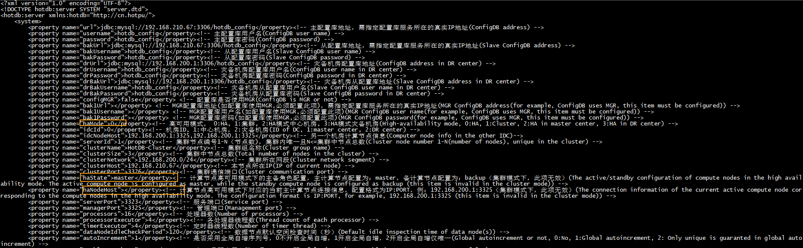

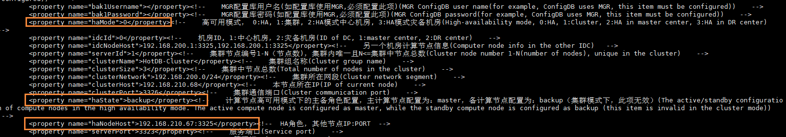

4. 启动HotDB_01服务器的keepalived，直到keepalived的VIP挂载好。

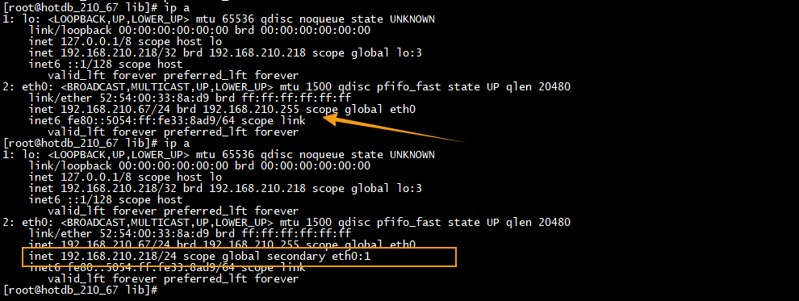

5. HotDB_01服务器管理端执行reload @@config操作，使当前剩余的计算节点成为HA主计算节点。


此时若有压测任务，会出现闪断，几秒后恢复正常。


**第三步：停掉LVS服务器的LVS服务**

LVS服务器停止LVS服务

```bash
systemctl stop keepalived.service
```

**第四步：清理计算节点服务器LVS配置**

1. HotDB_01、HotDB_02、HotDB_03停止lvsrs

```bash
/etc/init.d/lvsrs stop
```

2. HotDB_01、HotDB_02、HotDB_03删除lvsrs

```bash
cd /etc/init.d
rm -rf lvsrs
```

**第五步：启动备计算节点/备keepalived服务**

启动HotDB_02计算节点和keepalived服务


**第六步：管理平台适配调整**

适配方式同"集群模式扩展计算节点"一致，编辑计算节点集群将缩容的计算节点进行删除，使其集群模式转换成HA模式，如下图：


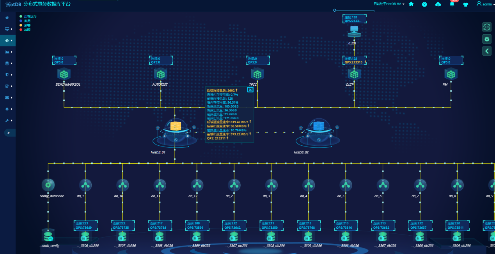

**注意事项**

若需要做集群计算节点在线缩减，需先关闭待关闭的计算节点，再修改集群成员总数和成员serverId后动态加载。

### 读写分离

HotDB Server支持读写分离功能，并且支持配置读写分离权重

#### 读写分离功能说明

要使用读写分离功能，需在数据节点中配置主备存储节点。

读写分离功能默认设置为关闭。开启读写分离功能，可在计算节点的配置文件server.xml中，将strategyForRWSplit属性设置为大于0的值。例如：

```xml
<property name="strategyForRWSplit">1</property>
```

strategyForRWSplit允许设置的值为0，1，2，3。当设置为0时，读写操作都在主存储节点，也即关闭读写分离。当设置为1时，代表可分离的读请求发往所有可用存储节点（包含主存储节点），写操作与不可分离的读请求在主存储节点上进行。当设置为2时，代表可分离的读请求发往可用的备存储节点，写操作与不可分离的读请求在主存储节点上进行。当设置为3时，代表事务（非XA模式）中发生写前的读请求与自动提交的读请求发往可用的备存储节点。其余请求在主存储节点上进行。

`server.xml`中可以配置读写分离中可读从库最大延迟时间，参数名：maxLatencyForRWSplit，单位ms，默认配置的延迟时间为1秒。当存储节点数据同步延迟大于设置的延迟时间或者出现故障时计算节点会摘除该存储节点并阻止参与读操作，此时由其他正常存储节点承担可分离的读任务，直至延迟重新追上才将摘除的存储节点加回读集群。

当开启读写分离时，即使心跳未开启，也会强制进行延迟检测。延迟检测周期可在`server.xml`中通过参数latencyCheckPeriod配置。

HotDB Server读写分离对应用研发者和数据库管理员完全透明，不要求研发者在SQL执行时添加HINT或某些注解；当然，也支持使用[HINT](#hint)的方式显式指定读取主机或从机。

指定SQL语句在主存储节点上执行：

```sql
/*!hotdb:rw=master*/select * from customer;
```

指定SQL语句在从库存储节点上执行：

```sql
/*!hotdb:rw=slave*/select * from customer;
```

#### 读写分离权重配置

计算节点支持读写分离的同时，可以通过`server.xml`中配置参数控制主从读的比例。进入计算节点的安装目录的`conf`目录下，并编辑`server.xml`，修改如下相关设置：

```xml
<property name="strategyForRWSplit">0</property><!-- 不开启读写分离：0；可分离的读请求发往所有可用数据源：1；可分离的读请求发往可用备数据源：2；事务中发生写前的读请求发往可用备数据源：3-->
<property name="weightForSlaveRWSplit">50</property><!-- 从机读比例，默认50（百分比）,为0时代表该参数无效-->
```

- 读写分离策略strategyForRWSplit参数为0时读写操作都在主存储节点，也即关闭读写分离。
- 读写分离策略strategyForRWSplit参数设置为1时，代表可分离的读请求发往所有可用存储节点（包含主存储节点），写操作与不可分离的读请求在主存储节点上进行。
  strategyForRWSplit参数为1时可设置主备存储节点的读比例，设置备存储节点读比例后数据节点下的所有备存储节点均分该比例的读任务。例如：设置weightForSlaveRWSplit值为60%，假设节点为一主两从架构，则可分离的读中，主机读40%，剩余两从机各读30%；
- 读写分离策略strategyForRWSplit参数为2时，代表可分离的读请求发往可用的备存储节点，写操作与不可分离的读请求在主存储节点上进行。
  strategyForRWSplit参数为2时数据节点上的所有可分离的读任务会自动均分至该数据节点下的所有备存储节点上，若无备存储节点则由主存储节点全部承担。
- 读写分离策略strategyForRWSplit参数为3时，代表事务（非XA模式）中发生写前的读请求与自动提交的读请求发往可用的备存储节点。其余请求在主存储节点上进行。

> !Note
>
> 在未使用HINT做读写分离的情况下， "可分离的读请求"主要指：自动提交的读请求与显式只读事务中的读请求。其余读请求均为"不可分离的读请求"。例如非自动提交事务中的读请求。

## HotDB Server 特色功能

HotDB Server在基于分布式事务数据库设计的基础上，提供了一些扩展的功能，方便进行使用和管理。

### DNID

DNID是数据节点DATANODE_ID的缩写

在计算节点上可以使用DNID作为WHERE子句中的过滤条件，以及在SELECT语句中作为查询项；也可以在结果集中显示每行结果的DNID（数据节点）。

**(1) 在SELECT、UPDATE、DELETE子句中，使用DNID字段**

```sql
SELECT * FROM customer WHERE dnid=1;
```

执行该SELECT语句，计算节点将会返回分片表customer在数据节点ID为1上的数据。

```sql
DELETE FROM customer WHERE dnid=1 AND id=3;
```

执行该DELETE语句，计算节点将会删除分片表customer在数据节点ID为1，字段ID等于3的数据。

```sql
UPDATE customer SET id=4 WHERE dnid=1 AND name='a';
```

执行该DELETE语句，计算节点将会修改分片表customer在数据节点ID为1，字段name等于'a'的数据。

**(2) 执行SELECT语句使用DNID作为查询项**

```sql
SELECT *,dnid FROM tab_name;
```

执行该SELECT语句，计算节点将会在结果集里显示所有结果的dnid值／

**(3) 在结果集中显示DNID**

登录到计算节点以后，执行SET SHOW_DNID=1语句，计算节点将会在SELECT语句中返回每一行结果的DNID（数据节点ID）。

```
mysql> set show_dnid=1;
Query OK, 0 rows affected (0.00 sec)

mysql> select * from customer where id in (77,67,52,20);
+----+--------+-------------+------------+-----------+------+-------------+------+
| id | name   | telephone   | provinceid | province  | city | address     | DNID |
+----+--------+-------------+------------+-----------+------+-------------+------+
| 52 | 马深圳 | 13912340052 | 7          | Guangdong | 深圳 | 某某街某某号| 13   |
| 77 | 郝上海 | 13912340077 | 25         | Shanghai  | 上海 | 某某街某某号| 14   |
| 20 | 许重庆 | 13912340020 | 4          | Chongqing | 重庆 | 某某街某某号| 12   |
| 67 | 岑南昌 | 13912340067 | 17         | Jiangxi   | 南昌 | 某某街某某号| 15   |
+----+--------+-------------+------------+-----------+------+-------------+------+
4 rows in set (0.00 sec)
```

图中结果分别显示了数据节点ID为12，13，14，15的数据行。

执行SET SHOW_DNID=1语句，查询全局表时，计算节点将会在SELECT语句中返回每一行结果的DNID（GLOBAL）。

```
mysql> set show_dnid=1;
Query OK, 0 rows affected (0.00 sec)

mysql> select * from tb_quan;
+----+---+------+--------+
| id | a | b    | DNID   |
+----+---+------+--------+
| 1  | 1 | 1.10 | GLOBAL |
| 2  | 2 | 1.20 | GLOBAL |
| 3  | 3 | 1.30 | GLOBAL |
+----+---+------+--------+
```

SET SHOW_DNID=0，将取消在结果集中显示DNID列。

```
mysql> set show_dnid=0;

Query OK, 0 rows affected (0.00 sec)

mysql> select * from customer where id in (77,67,52,20);
+----+--------+-------------+------------+-----------+------+-------------+
| id | name   | telephone   | provinceid | province  | city | address     |
+----+--------+-------------+------------+-----------+------+-------------+
| 52 | 马深圳 | 13912340052 | 7          | Guangdong | 深圳 | 某某街某某号|
| 77 | 郝上海 | 13912340077 | 25         | Shanghai  | 上海 | 某某街某某号|
| 20 | 许重庆 | 13912340020 | 4          | Chongqing | 重庆 | 某某街某某号|
| 67 | 岑南昌 | 13912340067 | 17         | Jiangxi   | 南昌 | 某某街某某号|
+----+--------+-------------+------------+-----------+------+-------------+
4 rows in set (0.00 sec)
```

**(4) DNID的限制**

DNID字段为计算节点的保留字段，禁止在业务表中使用DNID字段，在SQL语句中使用DNID作为别名。

DNID只适用于SELECT，UPDATE，DELETE的简单单表语句；并且，DNID只能作为WHERE子句的过滤条件，不能在ORDER BY，GROUP BY，HAVING中使用DNID字段；同样，不支持在JOIN语句、UNION/UNION ALL、子查询中使用DNID；不支持在函数，表达式中使用DNID字段。

执行set show_dnid=1之后，不支持where 条件带dnid。

### HINT

在计算节点使用HINT语法，可绕过HotDB Server解析器，直接在指定数据节点上执行MySQL的任意SQL语句。计算节点支持两种方式的HINT语法：

**(5) 在HINT中使用DNID(数据节点ID)：**

语法：

```sql
/*!hotdb:dnid = dnid_value*/ 要执行的SQL
```

> !Note
>
> dnid_value的值为某个数据节点的ID号。用户可以替换dnid_value的值来指定具体的分片节点。

例如：

```sql
/*!hotdb:dnid = 1*/select * from customer where age > 20;
```

该语句将在数据库节点1上执行。用户可以通过分布式事务数据库平台中的"数据节点"页面，找到数据节点ID为1的存储节点名称，并在"存储节点"页面中搜索指定的存储节点名称，即可定位到实际的MySQL数据库。

**(6) 在HINT中使用DSID(存储节点ID)：**

HINT语句支持指定datasource_id跳过计算节点直接向存储节点发送语句。可利用[服务端口命令](#使用已有分片规则建表相关命令)查看存储节点datasource_id：

语法：

```
SHOW [full] HOTDB ｛datasources｝ [LIKE 'pattern' | WHERE expr]
```

示例：

```
hotdb> show hotdb datasources where datasource_id like '22';

+-------------+---------------+------------------------------+-----------------+-------------------+----------------+------+----------+--------+
| DATANODE_ID | DATASOURCE_ID | DATASOURCE_NAME              | DATASOURCE_TYPE | DATASOURCE_STATUS | HOST           | PORT | SCHEMA   | IDC_ID |
+-------------+---------------+------------------------------+-----------------+-------------------+----------------+------+----------+--------+
| 23          | 22            | 192.168.210.41_3308_hotdb157 | 1               | 1                 | 192.168.210.41 | 3308 | hotdb157 | 1      |
+-------------+---------------+------------------------------+-----------------+-------------------+----------------+------+----------+--------+
```

- 指定具体datasource_id且不写binlog：

```sql
/*!hotdb:dsid=nobinlog:datasource_id*/要执行的SQL
```

> !Note
>
> datasource_id的值为某个存储节点的ID，可以指定多个节点用英文","隔开。此语法不会将执行的语句记入存储节点二进制日志文件binlog中，若使用不当，可能存在导致双主数据不一致、GTID位置错乱的情况，使用时需谨慎。

示例：

在datasource_id=22的存储节点上创建用户hpt，并且不写binlog

```
hotdb> /*!hotdb:dsid=nobinlog:22*/create user 'hpt'@'%' identified by '123456';

Query OK, 0 rows affected (0.00 sec)
```

在datasource_id=22的存储节点上设置参数

```
hotdb> /*!hotdb:dsid=nobinlog:22*/set wait_timeout=1200;

Query OK, 0 rows affected (0.01 sec)

hotdb> /*!hotdb:dsid=nobinlog:22*/show variables like 'wait_timeout';

+---------------+-------+
| Variable_name | Value |
+---------------+-------+
| wait_timeout  | 1200  |
+---------------+-------+
1 row in set (0.01 sec)
```

- 指定所有datasource_id且不写binlog：

```sql
/*!hotdb:dsid=nobinlog:all*/要执行的SQL
```

> !Note
>
> all为所有存储节点(包括灾备模式下灾备机房存储节点)，此语法不会将执行的语句记入二进制日志文件binlog中。

示例：

在所有存储节点上更新table1表且不写binlog：

```sql
/*!hotdb:dsid=nobinlog:all*/update table1 set name='hotdb' where id=100;
```

在所有存储节点上设置参数。

```
hotdb> /*!hotdb:dsid=nobinlog:all*/set wait_timeout=1200;

Query OK, 0 rows affected (0.00 sec)

hotdb> /*!hotdb:dsid=nobinlog:all*/show variables like 'wait_timeout';

+---------------+-------+
| Variable_name | Value |
+---------------+-------+
| wait_timeout  | 1200  |
| wait_timeout  | 1200  |
| wait_timeout  | 1200  |
| wait_timeout  | 1200  |
| wait_timeout  | 1200  |
| wait_timeout  | 1200  |
| wait_timeout  | 1200  |
| wait_timeout  | 1200  |
+---------------+-------+
8 rows in set (0.00 sec)
```

- 指定具体datasource_id且写binlog的语法：

```sql
/*!hotdb:dsid=datasource_id*/要执行的SQL
```

> !Note
>
> 此语法会将执行的语句记入对应存储节点的二进制日志文件binlog中。同时操作具有复制关系的存储节点时需要谨慎处理，以免导致主从复制同步异常。

- 指定所有datasource_id且写binlog的语法：

```sql
/*!hotdb:dsid=all*/要执行的SQL
```

> !Note
>
> all为所有存储节点(包括灾备模式下灾备机房存储节点)，此语法会将执行的语句记入二进制日志文件binlog中，同时写binlog可能存在导致具有复制关系的存储节点复制异常、GTID位置错乱的情况，使用时需谨慎。

> !Note
>
> 若多个存储节点分布在同实例上，使用HINT中datasource_id也需单独指定存储节点执行。

**(7) 在HINT中使用分片字段：**

语法：

```sql
/!hotdb:table = table_name:column_value*/ 要执行的SQL
```

> !Note
>
> table_name即某个分片表的表名；column_value即该表上分片字段某个值。用户可以替换table_name的值指定相应的拆分规则，通过替换column_value的值来指定使用该分片字段的值对应的分片节点。

例如：

```sql
/*!hotdb: table = customer:10001*/select * from customer where age > 20;
```

使用方法：

连接计算节点(参考[登录计算节点并开始使用](#登录计算节点并开始使用))，选择设置的逻辑库（这里使用`test`逻辑库），然后使用上述方式执行指定的语句(这里举例说明,使用时可以按需编写SQL)。

在dn_id=2的分片节点上查找cutomer表

```
mysql> /*!hotdb: dnid=2*/ select count(*) from customer;
+----------+
| count(*) |
+----------+
| 50       |
+----------+
1 row in set (0.00 sec)
```

查找customer表上provinceid为1的分片节点的customer表

```
mysql> /*!hotdb: table=customer:1*/ select count(*) from customer;
+----------+
| count(*) |
+----------+
| 11       |
+----------+
1 row in set (0.00 sec)
```

注意事项：

业务层面不建议HINT直接操作存储节点，因为使用HINT之后，存储节点的数据和状态将不受计算节点控制。同时使用HINT操作后，计算节点会自动进行连接绑定操作，需要注意[连接绑定](#连接绑定)后的使用说明。

### 连接绑定

为了防止连接池被污染，当使用HINT操作后，计算节点会绑定当前HINT查询使用的逻辑库关联的后端连接（即计算节点与存储节点的连接），所有涉及到后端的操作均在绑定的连接范围内被允许。故当HINT使用完毕后，建议重建新的前端连接以保证新的会话连接状态干净稳定。若不重建连接，当HINT使用后，有其他操作涉及到与原逻辑库绑定的后端连接之外的新的数据节点时，之前绑定的后端连接会失效，前端连接会被自动重建。

涉及到连接绑定的语句除了HINT，还包括如下语句：

```sql
set [session] foreign_key_checks=0;
START TRANSACTION /*!40100 WITH CONSISTENT SNAPSHOT */
set [session] UNIQUE_CHECKS=0;
```

计算节点在这种连接被绑定的SQL执行后，会输出Warning及日志提醒：

如执行如下语句时会有warning提示：

```
mysql> use db_a

Database changed

mysql> /*!hotdb:dnid=all*/select * From tba;
+----+---+
| id | a |
+----+---+
| 1  | 1 |
| 2  | 2 |
| 3  | 3 |
| 4  | 4 |
| 5  | 5 |
+----+---+
5 rows in set, 1 warning (0.01 sec)
Warning (Code 10041): The current session has been bound to the backend connection associated with the current LogicDB. It is recommended to rebuild the session after use.
```

同时日志会有info信息：

```
2019-04-01 19:11:29.662 [INFO] [CONNECTION] [$NIOEecutor-3-1] ServerConnection(1565) -- 31 has been bound to the backend connection:[2,1]
```

当操作涉及到与原逻辑库绑定的后端连接之外的新的数据节点时,SHOW WARNINGS会有如下提示且连接会断开：

```
mysql> use db_b
Database changed

mysql> show warnings;
+-------+-------+----------------------------------------------------------------------------------------------------------------------+
| Level | Code  | Message                                                                                                              |
+-------+-------+----------------------------------------------------------------------------------------------------------------------+
| Note  | 10042 | The connection in current LogicDB was a binded connection, operations under current LogicDB may cause connect abort. |
+-------+-------+----------------------------------------------------------------------------------------------------------------------+
1 row in set (0.00 sec)

mysql> select * from tbb;
ERROR 2013 (HY000): Lost connection to MySQL server during query
ERROR 2016 (HY000): MySQL server has gone away
No connection. Trying to reconnect...
Connection id: 63
Current database: db_b
```

在HotDB Server版本低于2.5.5（不包含）版本时，在没有USE逻辑库的情况下，计算节点默认绑定所有后端存储节点连接，执行了连接绑定的语句后的其他SQL语句均直接下发执行，可能导致原存储节点的历史数据被修改或覆盖的问题。

例如：登录服务端口，未use逻辑库，执行连接绑定语句：

```sql
set [session] foreign_key_checks=0;
```

之后直接执行

```sql
DROP TABLE IF EXISTS table_test;
```

此时DROP语句会直接下发到所有存储节点执行，进而删除原本不相关的数据。

故使用连接绑定的语句时，需要额外注意：INSERT/REPLACE/UPDATE/DELETE/LOAD DATA/CREATE TABLE/ALTER TABLE/DROP TABLE/TRUNCATE TABLE/RENAME TABLE等会修改数据的操作需要提前use逻辑库。

在HotDB Server 版本高于2.5.5 （包含）时，对该类场景做了进一步优化，支持对连接绑定中的内容进行解析。

连接绑定中，无论是否USE逻辑库，都不允许执行对存储节点存在破坏性的SQL（注意HINT本身对如下类型的SQL是不做限制的）：

CREATE | ALTER | DROP DATABASE/SET SESSION SQL_LOG_BIN | GTID_NEXT/SET GLOBAL/RESET MASTER | SLAVE/CHANGE MASTER/START | STOP SLAVE | GROUP_REPLICATION/CREATE | ALTER | DROP | RENAME USER | ROLE/GRANT/REVOKE/SET PASSWORD/SET DEFAULT ROLE/CLONE等SQL类型。

例如：执行绑定连接语句，再执行DROP DATABASE操作:

```
mysql> set foreign_key_checks=0;

Query OK, 0 rows affected, 1 warning (0.02 sec)
Warning (Code 10195): The current session has been bound to the backend connection associated with the current LogicDB. It is recommended to rebuild the session after use.

mysql> drop database TEST_DB;

ERROR 1289 (HY000): Command '{CREATE | ALTER | DROP} {DATABASE | SCHEMA}' is forbidden
```

在没有USE逻辑库的情况下，执行绑定连接语句后，可以执行带逻辑库.且限定单一逻辑库的SQL:SELECT/INSERT/REPLACE/UPDATE/DELETE/LOAD/CREATE TABLE/ALTER TABLE/DROP TABLE/TRUNCATE TABLE/RENAME TABLE/PREPARE/EXECUTE/DEALLOCATE，也可执行：SET SESSION（不包括SQL_LOG_BIN|GTID_NEXT）、SHOW 、非XA模式下开启事务的语句、SAVEPOINT、提交事务、回滚事务等语句。

例如：执行绑定连接语句不USE逻辑库，再执行带逻辑库名的CREATE TABLE语句，将被允许；执行不带逻辑库名的CREATE TABLE语句，将被拒绝:

```
mysql> set foreign_key_checks=0;

Query OK, 0 rows affected, 1 warning (0.02 sec)
Warning (Code 10195): The current session has been bound to the backend connection associated with the current LogicDB. It is recommended to rebuild the session after use.

mysql> create table logic_db1.table_test (id int);

Query OK, 0 rows affected, 1 warning (0.18 sec)

mysql> create table table_test2 (id int);

ERROR 1289 (HY000): Command 'create table table_test2 (id int)' is forbidden when sql don't use database with table or use multi database, because he current session has been bound to the backend connection.
```

### EXPLAIN

在计算节点中，EXPLAIN语句用于显示SQL语句的路由计划。

```
mysql> explain select id,name,telephone from customer;

+----------+------------------------------------------+
| DATANODE | SQL                                      |
+----------+------------------------------------------+
| 1        | SELECT id, name, telephone FROM customer |
| 2        | SELECT id, name, telephone FROM customer |
| 3        | SELECT id, name, telephone FROM customer |
| 4        | SELECT id, name, telephone FROM customer |
| 5        | SELECT id, name, telephone FROM customer |
+----------+------------------------------------------+
5 rows in set (0.01 sec)
```

DATANODE列为数据节点ID，上述结果显示，该SQL语句将在ID为1，2，3，4，5的数据节点上执行。

若要在EXPLAIN中显示MySQL的执行计划，可以结合计算节点的[HINT](#hint)功能：

```
mysql> /*!hotdb:dnid=13*/explain select * from customer;

+----+-------------+----------+------+---------------+------+---------+------+------+-------+
| id | select_type | table    | type | possible_keys | key  | key_len | ref  | rows | Extra |
+----+-------------+----------+------+---------------+------+---------+------+------+-------+
| 1  | SIMPLE      | customer | NULL | NULL          | NULL | NULL    | NULL | 53   | NULL  |
+----+-------------+----------+------+---------------+------+---------+------+------+-------+
1 row in set (0.00 sec)
```

**EXPLAIN的限制**

EXPLAIN语句只适用于INSERT，SELECT，UPDATE，DELETE的简单单表语句。不支持EXPLAIN显示JOIN语句、UNION/UNION ALL、子查询语句的路由计划。

### OnlineDDL

计算节点[管理端（3325）](#管理端信息监控)支持OnlineDDL功能，保证了在进行表变更时，不会阻塞线上业务读写，库依然能正常对外提供访问，具体使用方法如下：

- 登录3325端管理端口，使用`onlineddl "[DDLSTATEMENT]"`语法可以执行onlineddl语句，例如：`onlineddl "alter table customer add column testddl varchar(20) default '测试onlineddl'"`;
- 执行`show @@onlineddl`语句，即可显示当前正在运行的OnlineDDL语句及语句执行速度，progress显示当前DDL执行进度（单位：%），speed显示为当前DDL运行速度（单位：行/ms），例如：

```
mysql> show @@onlineddl;
+--------------+-------------------------------------------------------------------------------+----------+---------+
| schema       | onlineddl                                                                     | progress | speed   |
+--------------+-------------------------------------------------------------------------------+----------+---------+
| TEST_DML_JWY | ALTER TABLE CUSTOMER ADD COLUMN TESTDDL VARCHAR(20) DEFAULT '测试ONLINEDDL'   |   0.2300 | 23.3561 |
+--------------+-------------------------------------------------------------------------------+----------+---------+
```

> !Note
>
> onlineddl 语句不是执行下去就代表DDL完成， 返回了"Query OK, 0 rows affected "仅代表DDL语句可以执行， 如果想看是否执行完成，要查看`show @@onlineddl`中progress 显示的进度。`show @@onlineddl`结果为空时，代表所有DDL执行完毕且当前无其他DDL任务，如果中途因为网络或其他异常DDL中断，会回滚整个DDL。

### NDB Cluster SQL节点服务

计算节点V2.5.2以下的版本对SELECT 查询类型的SQL语句支持不完全，特别是子查询类型的SQL，故引入NDB Cluster SQL节点服务（以下简称NDB SQL）。该服务利用NDB Cluster的SQL节点对计算节点不支持的SQL做兼容，用于在分布式环境下完成相对复杂的查询语句的计算。若要了解如何安装部署NDB Cluster SQL节点服务，请参考[安装部署](installation-and-deployment.md)文档的NDB Cluster SQL节点服务部署章节。

#### NDB使用限制

在NDB SQL模式开启时，需要同时满足以下条件才会走NDB SQL逻辑：

- 全局唯一不开启的情况下，必须有主键或者唯一键，主键和唯一键必须为分片字段或自增；
- 全局唯一开启的情况下，必须有主键或者唯一键；
- 上述两条中的主键，唯一键必须是单字段数值类型；
- 执行计算节点原不支持的查询语句。

如下SQL类型的语句计算节点本身是不支持的，当开启NDB SQL后支持查询

| MySQL语句类型 | 子句类型 | 功能 | 说明 |
|---------------|----------|------|------|
| SELECT | INNER/LEFT JOIN/RIGHT JOIN WHERE | 运算表达式 | column1+column2、column1-column2、column1\*column2、column1/column2 |
| ^ | ^ | ^ | <=>或<> |
| ^ | ^ | % 或 MOD | 仅支持column%常量；不支持column1%column2 |
| ^ | ^ | RAND() | 2.3不支持rand()相关的所有语法，包括`GROUP BY rand()`，`ORDER BY rand()` |
| ^ | ^ | / 或 DIV | 仅支持column DIV 常量；不支持column1 DIV column2 |
| ^ | ^ | INNER/LEFT JOIN/RIGHT JOIN ON | IN/IS NOT NULL/IS NULL/BETWEEN...AND/LIKE |
| ^ | ^ | ^ | <=>或<> |
| ^ | ^ | ^ | XOR |
| ^ | ^ | ^ | CAST() |
| ^ | ^ | CONCAT() | 不支持CONCAT()在运算表达式中做JOIN条件（ON子句条件），或WHERE子句中的关联条件 |
| ^ | ^ | CASE...WHEN...END | 仅支持CASE WHEN判断的是单个表的字段；不支持多表字段的条件判断如：CASE WHEN column_name1=xx THEN column_name2 END ；CASE WHEN必须使用表别名 |
| ^ | 函数 | MIN(MIN(column_name)) | 函数嵌套不支持 |
| ^ | ^ | ^ | ABS(MAX()) |
| ^ | 多表(三表及以上)查询 | 混合的LEFT/INNER/NATURAL JOIN | 计算节点自身支持多表查询中的单种LEFT、单种JOIN INNER、混合JOIN LEFT/INNER/RIGHT JOIN以及TABLE a ... JOIN(TABLE b,TABLE c)...语法。开启NDB后可额外支持混合LEFT/INNER/NATURAL JOIN以及单种NATURAL JOIN。 |
| ^ | ^ | ^ | 单种NATURAL JOIN |
| ^ | ^ | 子查询 | 查询运算条件（ANY,ALL） |
| ^ | ^ | ^ | 嵌套多层关联子查询 |

表结构中若有非geometry类型的空间类型字段、json类型的字段，原不支持的查询SQL依旧无法支持；

原不支持的查询SQL的WHERE条件中字段类型仅支持：所有整形、DECIMAL、CHAR、ENUM、VARCHAR类型。

### 在线修改分片字段

计算节点版本高于2.5.6 （包含）支持在服务端口直接使用SQL语句进行在线修改分片字段的操作，业务表在变更期间不会锁表，业务可对原表进行正常的SIUD操作。

#### 使用方法

alter修改分片字段语法如下：

```sql
alter table table_name change shard column new_column；
```

例如将源表sbtest1分片字段id修改为k，执行：

```
mysql> alter table sbtest1 change shard column k;
Query OK, 0 rows affected (2 min 2.27 sec)
```

#### 使用限制

- 源表必须具有主键或者唯一键，且表名长度不能超过45个字符；
- 源表上不能有触发器，或源表不能被其他触发器关联；
- 源表不能有外键约束；
- 新的分片字段必须是表结构包含的字段，且不能是表当前正在使用的分片字段；
- 新的分片字段数据类型不能是BIT、TINYTEXT、TEXT、MEDIUMTEXT、LONGTEXT、TINYBLOB、BLOB、MEDIUMBLOB、LONGBLOB、GEOMETRY、POINT、LINESTRING、POLYGON、MULTIPOINT、MULTILINESTRING、MULTIPOLYGON、GEOMETRYCOLLECTION、JSON；
- 不支持全局表、垂直分片表、父表、子表，仅支持对水平分片表使用alter修改分片字段；
- 水平分片表中，不支持RANGE、MATCH、ROUTE分片规则的源表进行alter修改分片字段；
- 进行alter修改分片字段时，源表不能有正在进行的分片方案变更任务；
- 若源表出现主备数据不一致情况，使用alter修改分片字段时会直接跳过检测依旧执行（建议执行前人工通过管理平台进行主备数据一致性检测）；
- 源表开启全局唯一约束后，使用alter修改分片字段时要求源表唯一约束字段的历史数据必须唯一；

## 数据类型与字符集支持

### 计算节点对数据类型的支持

#### 数值类型

| MySQL数据类型 | 支持状态 | 说明 |
|---------------|----------|------|
| BIT | 限制支持 | DDL语句中可支持BIT类型，不支持在跨库的DML语句中对BIT类型的操作。 |
| TINYINT | 支持 |   |
| SMALLINT | 支持 |   |
| MEDIUMINT | 支持 |   |
| INT | 支持 |   |
| INTEGER | 支持 |   |
| BIGINT | 支持 |   |
| SERIAL | 支持 | 与BIGINT UNSIGNED NOT NULL AUTO_INCREMENT UNIQUE 同义 |
| SERIAL DEFAULT VALUE | 支持 | 与NOT NULL AUTO_INCREMENT UNIQUE同义 |
| REAL | 不支持 | 禁止设置为分片字段与父子表关联字段类型 |
| DOUBLE | 不支持 | 禁止设置为分片字段与父子表关联字段类型 |
| FLOAT | 不支持 | 禁止设置为分片字段与父子表关联字段类型 |
| DECIMAL | 支持 |   |
| NUMERIC | 支持 |   |

#### 日期与时间类型

| MySQL数据类型 | 支持状态 | 说明 |
|---------------|----------|------|
| DATE | 支持 |   |
| TIME | 支持 |   |
| TIMESTAMP | 支持 |   |
| DATETIME | 支持 |   |
| YEAR | 支持 |   |

#### 字符串类型

| MySQL数据类型 | 支持状态 | 说明 |
|---------------|----------|------|
| CHAR | 支持 |   |
| VARCHAR | 支持 |   |
| BINARY | 支持 |   |
| VARBINARY | 支持 |   |
| TINYBLOB | 支持 | 禁止设置为分片字段与父子表关联字段类型 |
| BLOB | 支持 | 禁止设置为分片字段与父子表关联字段类型 |
| MEDIUMBLOB | 支持 | 禁止设置为分片字段与父子表关联字段类型 |
| LONGBLOB | 支持 | 禁止设置为分片字段与父子表关联字段类型 |
| TINYTEXT | 支持 | 禁止设置为分片字段与父子表关联字段类型 |
| TEXT | 支持 | 禁止设置为分片字段与父子表关联字段类型 |
| MEDIUMTEXT | 支持 | 禁止设置为分片字段与父子表关联字段类型 |
| LONGTEXT | 支持 | 禁止设置为分片字段与父子表关联字段类型 |
| ENUM | 支持 |   |
| SET | 支持 |   |

#### 空间类型

计算节点支持在创建表时，使用空间类型spatial_type；支持在单库的SQL语句中使用spatial_type；不支持在跨库的SQL语句中，对spatial_type的二次计算。

#### 其他类型

| MySQL数据类型 | 支持状态 | 说明 |
|---------------|----------|------|
| JSON | 支持 | 　禁止使用其作为分片字段、父子表关联字段，禁止使用其作为JOIN字段 |

### 计算节点对字符集的支持

计算节点支持字符集相关设置，目前可支持的字符集及校对集如下：

| Collation | Charset |
|-----------|---------|
| latin1_swedish_ci | latin1 |
| latin1_bin | latin1 |
| gbk_chinese_ci | gbk |
| gbk_bin | gbk |
| utf8_general_ci | utf8 |
| utf8_bin | utf8 |
| utf8mb4_general_ci | utf8mb4 |
| utf8mb4_bin | utf8mb4 |

与字符集相关的语法如下，HotDB Server也可同步支持，功能同MySQL一致：

| 功能分类 | 语法相关 |
|----------|----------|
| CREATE TABLE | `col_name {CHAR|VARCHAR|TEXT} (col_length) [CHARACTER SET charset_name] [COLLATE collation_name] col_name {ENUM | SET} (val_list) [CHARACTER SET charset_name] [COLLATE collation_name]` |
| `ALTER TABLE` | `ALTER TABLE tbl_name CONVERT TO CHARACTER SET charset_name [COLLATE collation_name];` |
| ^ | `ALTER TABLE tbl_name DEFAULT CHARACTER SET charset_name [COLLATE collation_name];` |
| ^ | `ALTER TABLE tbl_name MODIFY col_name column_definition CHARACTER SET charset_name [COLLATE collation_name];` |
| SET | `SET NAMES 'charset_name' [COLLATE 'collation_name']` |
| ^ | `SET CHARACTER SET charset_name` |
| ^ | `set [session] {character_set_client|character_set_results|character_set_connection|collation_connection} = xxx;` |
| WITH | `With ORDER BY: SELECT k FROM t1 ORDER BY k COLLATE latin1_swedish_ci;` |
| ^ | `With AS: SELECT k COLLATE latin1_swedish_ci AS k1 FROM t1 ORDER BY k1;` |
| ^ | `With GROUP BY: SELECT k FROM t1 GROUP BY k COLLATE latin1_swedish_ci;` |
| ^ | `With aggregate functions: SELECT MAX(k COLLATE latin1_swedish_ci) FROM t1;` |
| ^ | `With DISTINCT: SELECT DISTINCT k COLLATE latin1_swedish_ci FROM t1;` |
| ^ | `With WHERE: SELECT * FROM k WHERE a='a' COLLATE utf8_bin;` |
| ^ | `With HAVING: SELECT * FROM k WHERE a='a' having a='a' COLLATE utf8_bin order by id;` |

## 函数与操作符支持

### 计算节点对函数的支持

此文档仅列出部分经特殊处理的函数，若需要了解所有计算节点支持的函数，请向官方获取《HotDB Server最新功能清单》。

| 函数名称 | 支持状态 | 是否拦截 | 说明 |
|----------|----------|----------|------|
| [ABS()](http://dev.mysql.com/doc/refman/5.6/en/mathematical-functions.html) | 支持 | 否 |   |
| [ACOS()](http://dev.mysql.com/doc/refman/5.6/en/mathematical-functions.html) | 支持 | 否 |   |
| [ADDDATE()](http://dev.mysql.com/doc/refman/5.6/en/date-and-time-functions.html) | 支持 | 否 |   |
| [ADDTIME()](http://dev.mysql.com/doc/refman/5.6/en/date-and-time-functions.html) | 支持 | 否 |   |
| [AES_DECRYPT()](http://dev.mysql.com/doc/refman/5.6/en/encryption-functions.html) | 支持 | 否 |   |
| [AES_ENCRYPT()](http://dev.mysql.com/doc/refman/5.6/en/encryption-functions.html) | 支持 | 否 |   |
| [AND, &&](http://dev.mysql.com/doc/refman/5.6/en/logical-operators.html) | 支持 | 否 |   |
| [Area()](http://dev.mysql.com/doc/refman/5.6/en/gis-polygon-property-functions.html) | 支持 | 否 |   |
| [AsBinary(), AsWKB()](http://dev.mysql.com/doc/refman/5.6/en/gis-format-conversion-functions.html) | 支持 | 否 |   |
| [ASCII()](http://dev.mysql.com/doc/refman/5.6/en/string-functions.html) | 支持 | 否 |   |
| [ASIN()](http://dev.mysql.com/doc/refman/5.6/en/mathematical-functions.html) | 支持 | 否 |   |
| [=](http://dev.mysql.com/doc/refman/5.6/en/assignment-operators.html) | 支持 | 否 |   |
| [:=](http://dev.mysql.com/doc/refman/5.6/en/assignment-operators.html) | 不支持 | 是 |   |
| [AsText(), AsWKT()](http://dev.mysql.com/doc/refman/5.6/en/gis-format-conversion-functions.html) | 支持 | 否 |   |
| [ATAN2(), ATAN()](http://dev.mysql.com/doc/refman/5.6/en/mathematical-functions.html) | 支持 | 否 |   |
| [ATAN()](http://dev.mysql.com/doc/refman/5.6/en/mathematical-functions.html) | 支持 | 否 |   |
| [AVG()](http://dev.mysql.com/doc/refman/5.6/en/group-by-functions.html) | 支持 | 否 |   |
| [BENCHMARK()](http://dev.mysql.com/doc/refman/5.6/en/information-functions.html) | 不支持 | 是 |   |
| [BETWEEN ... AND ...](http://dev.mysql.com/doc/refman/5.6/en/comparison-operators.html) | 支持 | 否 |   |
| [BIN()](http://dev.mysql.com/doc/refman/5.6/en/string-functions.html) | 支持 | 否 |   |
| [BINARY](http://dev.mysql.com/doc/refman/5.6/en/cast-functions.html) | 支持 | 否 |   |
| [BIT_AND()](http://dev.mysql.com/doc/refman/5.6/en/group-by-functions.html) | 不支持 | 是 |   |
| [BIT_COUNT()](http://dev.mysql.com/doc/refman/5.6/en/bit-functions.html) | 支持 | 否 |   |
| [BIT_LENGTH()](http://dev.mysql.com/doc/refman/5.6/en/string-functions.html) | 支持 | 否 |   |
| [BIT_OR()](http://dev.mysql.com/doc/refman/5.6/en/group-by-functions.html) | 不支持 | 是 |   |
| [BIT_XOR()](http://dev.mysql.com/doc/refman/5.6/en/group-by-functions.html) | 不支持 | 是 |   |
| [&](http://dev.mysql.com/doc/refman/5.6/en/bit-functions.html) | 支持 | 否 |   |
| [~](http://dev.mysql.com/doc/refman/5.6/en/bit-functions.html) | 支持 | 否 |   |
| [|](http://dev.mysql.com/doc/refman/5.6/en/bit-functions.html) | 支持 | 否 |   |
| [^](http://dev.mysql.com/doc/refman/5.6/en/bit-functions.html) | 支持 | 否 |   |
| [Buffer()](http://dev.mysql.com/doc/refman/5.6/en/spatial-operator-functions.html) | 支持 | 否 |   |
| [CASE](http://dev.mysql.com/doc/refman/5.6/en/control-flow-functions.html) | 支持 | 否 |   |
| [CAST()](http://dev.mysql.com/doc/refman/5.6/en/cast-functions.html) | 支持 | 否 |   |
| [CEIL()](http://dev.mysql.com/doc/refman/5.6/en/mathematical-functions.html) | 支持 | 否 |   |
| [CEILING()](http://dev.mysql.com/doc/refman/5.6/en/mathematical-functions.html) | 支持 | 否 |   |
| [Centroid()](http://dev.mysql.com/doc/refman/5.6/en/gis-multipolygon-property-functions.html) | 支持 | 否 |   |
| [CHAR_LENGTH()](http://dev.mysql.com/doc/refman/5.6/en/string-functions.html) | 支持 | 否 |   |
| [CHAR()](http://dev.mysql.com/doc/refman/5.6/en/string-functions.html) | 支持 | 否 |   |
| [CHARACTER_LENGTH()](http://dev.mysql.com/doc/refman/5.6/en/string-functions.html) | 支持 | 否 |   |
| [CHARSET()](http://dev.mysql.com/doc/refman/5.6/en/information-functions.html) | 支持 | 否 |   |
| [COALESCE()](http://dev.mysql.com/doc/refman/5.6/en/comparison-operators.html) | 支持 | 否 |   |
| [COERCIBILITY()](http://dev.mysql.com/doc/refman/5.6/en/information-functions.html) | 支持 | 否 |   |
| [COLLATION()](http://dev.mysql.com/doc/refman/5.6/en/information-functions.html) | 支持 | 否 |   |
| [COMPRESS()](http://dev.mysql.com/doc/refman/5.6/en/encryption-functions.html) | 支持 | 否 |   |
| [CONCAT_WS()](http://dev.mysql.com/doc/refman/5.6/en/string-functions.html) | 支持 | 否 |   |
| [CONCAT()](http://dev.mysql.com/doc/refman/5.6/en/string-functions.html) | 支持 | 否 |   |
| [CONNECTION_ID()](http://dev.mysql.com/doc/refman/5.6/en/information-functions.html) | 支持 | 否 | 前端session连接计算节点的connection_id |
| [Contains()](http://dev.mysql.com/doc/refman/5.6/en/spatial-relation-functions-mbr.html) | 支持 | 否 |   |
| [CONV()](http://dev.mysql.com/doc/refman/5.6/en/mathematical-functions.html) | 支持 | 否 |   |
| [CONVERT_TZ()](http://dev.mysql.com/doc/refman/5.6/en/date-and-time-functions.html) | 支持 | 否 |   |
| [CONVERT()](http://dev.mysql.com/doc/refman/5.6/en/cast-functions.html) | 支持 | 否 | 计算节点不论分片表或全局表，都不支持CONVERT(value, type)写法，只支持CONVERT(value using 字符集); |
| [COS()](http://dev.mysql.com/doc/refman/5.6/en/mathematical-functions.html) | 支持 | 否 |   |
| [COT()](http://dev.mysql.com/doc/refman/5.6/en/mathematical-functions.html) | 支持 | 否 |   |
| [COUNT()](http://dev.mysql.com/doc/refman/5.6/en/group-by-functions.html) | 支持 | 否 |   |
| COUNT(DISTINCT) | 支持 | 否 |   |
| [CRC32()](http://dev.mysql.com/doc/refman/5.6/en/mathematical-functions.html) | 支持 | 否 |   |
| [Crosses()](http://dev.mysql.com/doc/refman/5.6/en/spatial-relation-functions-object-shapes.html) | 支持 | 否 |   |
| CURDATE() | 支持 | 否 |   |
| [CURDATE(), CURRENT_DATE](http://dev.mysql.com/doc/refman/5.6/en/date-and-time-functions.html) | 支持 | 否 |   |
| [CURRENT_ROLE()](https://dev.mysql.com/doc/refman/8.0/en/information-functions.html) | 不支持 | 是 | 计算节点不支持MySQL8.0新增角色功能 |
| [CURRENT_TIME(), CURRENT_TIME](http://dev.mysql.com/doc/refman/5.6/en/date-and-time-functions.html) | 支持 | 否 |   |
| [CURRENT_TIMESTAMP(),CURRENT_TIMESTAMP](http://dev.mysql.com/doc/refman/5.6/en/date-and-time-functions.html) | 支持 | 否 |   |
| [CURRENT_USER(), CURRENT_USER](http://dev.mysql.com/doc/refman/5.6/en/information-functions.html) | 支持 | 否 | 返回当前计算节点数据库用户 |
| [CURTIME()](http://dev.mysql.com/doc/refman/5.6/en/date-and-time-functions.html) | 支持 | 否 |   |
| [DATABASE()](http://dev.mysql.com/doc/refman/5.6/en/information-functions.html) | 支持 | 否 | 返回当前逻辑库名称 |
| [DATE_ADD()](http://dev.mysql.com/doc/refman/5.6/en/date-and-time-functions.html) | 支持 | 否 |   |
| [DATE_FORMAT()](http://dev.mysql.com/doc/refman/5.6/en/date-and-time-functions.html) | 支持 | 否 |   |
| [DATE_SUB()](http://dev.mysql.com/doc/refman/5.6/en/date-and-time-functions.html) | 支持 | 否 |   |
| [DATE()](http://dev.mysql.com/doc/refman/5.6/en/date-and-time-functions.html) | 支持 | 否 |   |
| [DATEDIFF()](http://dev.mysql.com/doc/refman/5.6/en/date-and-time-functions.html) | 支持 | 否 |   |
| [DAY()](http://dev.mysql.com/doc/refman/5.6/en/date-and-time-functions.html) | 支持 | 否 |   |
| [DAYNAME()](http://dev.mysql.com/doc/refman/5.6/en/date-and-time-functions.html) | 支持 | 否 |   |
| [DAYOFMONTH()](http://dev.mysql.com/doc/refman/5.6/en/date-and-time-functions.html) | 支持 | 否 |   |
| [DAYOFWEEK()](http://dev.mysql.com/doc/refman/5.6/en/date-and-time-functions.html) | 支持 | 否 |   |
| [DAYOFYEAR()](http://dev.mysql.com/doc/refman/5.6/en/date-and-time-functions.html) | 支持 | 否 |   |
| [DECODE()](http://dev.mysql.com/doc/refman/5.6/en/encryption-functions.html) | 支持 | 否 |   |
| [DEFAULT()](http://dev.mysql.com/doc/refman/5.6/en/miscellaneous-functions.html) | 支持 | 否 |   |
| [DEGREES()](http://dev.mysql.com/doc/refman/5.6/en/mathematical-functions.html) | 支持 | 否 |   |
| [DES_DECRYPT() (deprecated 5.7.6)](http://dev.mysql.com/doc/refman/5.6/en/encryption-functions.html) | 支持 | 否 |   |
| [DES_ENCRYPT() (deprecated 5.7.6)](http://dev.mysql.com/doc/refman/5.6/en/encryption-functions.html) | 支持 | 否 |   |
| [Dimension()](http://dev.mysql.com/doc/refman/5.6/en/gis-general-property-functions.html) | 支持 | 否 |   |
| [Disjoint()](http://dev.mysql.com/doc/refman/5.6/en/spatial-relation-functions-mbr.html) | 支持 | 否 |   |
| [DIV](http://dev.mysql.com/doc/refman/5.6/en/arithmetic-functions.html) | 支持 | 否 |   |
| [/](http://dev.mysql.com/doc/refman/5.6/en/arithmetic-functions.html) | 支持 | 否 |   |
| [ELT()](http://dev.mysql.com/doc/refman/5.6/en/string-functions.html) | 支持 | 否 |   |
| [ENCODE()](http://dev.mysql.com/doc/refman/5.6/en/encryption-functions.html) | 支持 | 否 |   |
| [ENCRYPT() (deprecated 5.7.6)](http://dev.mysql.com/doc/refman/5.6/en/encryption-functions.html) | 支持 | 否 |   |
| [EndPoint()](http://dev.mysql.com/doc/refman/5.6/en/gis-linestring-property-functions.html) | 支持 | 否 |   |
| [Envelope()](http://dev.mysql.com/doc/refman/5.6/en/gis-general-property-functions.html) | 支持 | 否 |   |
| [<=>](http://dev.mysql.com/doc/refman/5.6/en/comparison-operators.html) | 限制支持 | 是 |   |
| [=](http://dev.mysql.com/doc/refman/5.6/en/comparison-operators.html) | 支持 | 否 |   |
| [Equals()](http://dev.mysql.com/doc/refman/5.6/en/spatial-relation-functions-mbr.html) | 支持 | 否 |   |
| [EXP()](http://dev.mysql.com/doc/refman/5.6/en/mathematical-functions.html) | 支持 | 否 |   |
| [EXPORT_SET()](http://dev.mysql.com/doc/refman/5.6/en/string-functions.html) | 支持 | 否 |   |
| [ExteriorRing()](http://dev.mysql.com/doc/refman/5.6/en/gis-polygon-property-functions.html) | 支持 | 否 |   |
| [EXTRACT()](http://dev.mysql.com/doc/refman/5.6/en/date-and-time-functions.html) | 支持 | 否 |   |
| [ExtractValue()](http://dev.mysql.com/doc/refman/5.6/en/xml-functions.html) | 支持 | 否 |   |
| [FIELD()](http://dev.mysql.com/doc/refman/5.6/en/string-functions.html) | 支持 | 否 |   |
| [FIND_IN_SET()](http://dev.mysql.com/doc/refman/5.6/en/string-functions.html) | 支持 | 否 |   |
| [FLOOR()](http://dev.mysql.com/doc/refman/5.6/en/mathematical-functions.html) | 支持 | 否 |   |
| [FORMAT()](http://dev.mysql.com/doc/refman/5.6/en/string-functions.html) | 支持 | 否 |   |
| [FOUND_ROWS()](http://dev.mysql.com/doc/refman/5.6/en/information-functions.html) | 不支持 | 是 |   |
| [FROM_BASE64()](http://dev.mysql.com/doc/refman/5.6/en/string-functions.html) | 支持 | 否 |   |
| [FROM_DAYS()](http://dev.mysql.com/doc/refman/5.6/en/date-and-time-functions.html) | 支持 | 否 |   |
| [FROM_UNIXTIME()](http://dev.mysql.com/doc/refman/5.6/en/date-and-time-functions.html) | 支持 | 否 |   |
| [GeomCollFromText(),GeometryCollectionFromText()](http://dev.mysql.com/doc/refman/5.6/en/gis-wkt-functions.html) | 支持 | 否 |   |
| [GeomCollFromWKB(),GeometryCollectionFromWKB()](http://dev.mysql.com/doc/refman/5.6/en/gis-wkb-functions.html) | 支持 | 否 |   |
| [GeometryCollection()](http://dev.mysql.com/doc/refman/5.6/en/gis-mysql-specific-functions.html) | 支持 | 否 |   |
| [GeometryN()](http://dev.mysql.com/doc/refman/5.6/en/gis-geometrycollection-property-functions.html) | 支持 | 否 |   |
| [GeometryType()](http://dev.mysql.com/doc/refman/5.6/en/gis-general-property-functions.html) | 支持 | 否 |   |
| [GeomFromText(), GeometryFromText()](http://dev.mysql.com/doc/refman/5.6/en/gis-wkt-functions.html) | 支持 | 否 |   |
| [GeomFromWKB()](http://dev.mysql.com/doc/refman/5.6/en/gis-wkb-functions.html) | 支持 | 否 |   |
| [GET_FORMAT()](http://dev.mysql.com/doc/refman/5.6/en/date-and-time-functions.html) | 支持 | 否 |   |
| [GET_LOCK()](http://dev.mysql.com/doc/refman/5.6/en/miscellaneous-functions.html) | 不支持 | 是 |   |
| [GLength()](http://dev.mysql.com/doc/refman/5.6/en/gis-linestring-property-functions.html) | 支持 | 否 |   |
| [>=](http://dev.mysql.com/doc/refman/5.6/en/comparison-operators.html) | 支持 | 否 |   |
| [>](http://dev.mysql.com/doc/refman/5.6/en/comparison-operators.html) | 支持 | 否 |   |
| [GREATEST()](http://dev.mysql.com/doc/refman/5.6/en/comparison-operators.html) | 支持 | 否 |   |
| [GROUP_CONCAT()](http://dev.mysql.com/doc/refman/5.6/en/group-by-functions.html) | 支持 | 否 |   |
| [GROUPING()](https://dev.mysql.com/doc/refman/8.0/en/miscellaneous-functions.html) | 不支持 | 是 | MySQL8.0新增功能 |
| [GTID_SUBSET()](http://dev.mysql.com/doc/refman/5.6/en/gtid-functions.html) | 支持 | 否 |   |
| [GTID_SUBTRACT()](http://dev.mysql.com/doc/refman/5.6/en/gtid-functions.html) | 支持 | 否 |   |
| [HEX()](http://dev.mysql.com/doc/refman/5.6/en/string-functions.html) | 支持 | 否 |   |
| [HOUR()](http://dev.mysql.com/doc/refman/5.6/en/date-and-time-functions.html) | 支持 | 否 |   |
| [IF()](http://dev.mysql.com/doc/refman/5.6/en/control-flow-functions.html) | 支持 | 否 |   |
| [IFNULL()](http://dev.mysql.com/doc/refman/5.6/en/control-flow-functions.html) | 支持 | 否 |   |
| [IN()](http://dev.mysql.com/doc/refman/5.6/en/comparison-operators.html) | 支持 | 否 |   |
| [INET_ATON()](http://dev.mysql.com/doc/refman/5.6/en/miscellaneous-functions.html) | 支持 | 否 |   |
| [INET_NTOA()](http://dev.mysql.com/doc/refman/5.6/en/miscellaneous-functions.html) | 支持 | 否 |   |
| [INET6_ATON()](http://dev.mysql.com/doc/refman/5.6/en/miscellaneous-functions.html) | 支持 | 否 |   |
| [INET6_NTOA()](http://dev.mysql.com/doc/refman/5.6/en/miscellaneous-functions.html) | 支持 | 否 |   |
| [INSERT()](http://dev.mysql.com/doc/refman/5.6/en/string-functions.html) | 支持 | 否 |   |
| [INSTR()](http://dev.mysql.com/doc/refman/5.6/en/string-functions.html) | 支持 | 否 |   |
| [InteriorRingN()](http://dev.mysql.com/doc/refman/5.6/en/gis-polygon-property-functions.html) | 支持 | 否 |   |
| [Intersects()](http://dev.mysql.com/doc/refman/5.6/en/spatial-relation-functions-mbr.html) | 支持 | 否 |   |
| [INTERVAL()](http://dev.mysql.com/doc/refman/5.6/en/comparison-operators.html) | 支持 | 否 |   |
| [IS_FREE_LOCK()](http://dev.mysql.com/doc/refman/5.6/en/miscellaneous-functions.html) | 不支持 | 是 |   |
| [IS_IPV4_COMPAT()](http://dev.mysql.com/doc/refman/5.6/en/miscellaneous-functions.html) | 支持 | 否 |   |
| [IS_IPV4_MAPPED()](http://dev.mysql.com/doc/refman/5.6/en/miscellaneous-functions.html) | 支持 | 否 |   |
| [IS_IPV4()](http://dev.mysql.com/doc/refman/5.6/en/miscellaneous-functions.html) | 支持 | 否 |   |
| [IS_IPV6()](http://dev.mysql.com/doc/refman/5.6/en/miscellaneous-functions.html) | 支持 | 否 |   |
| [IS NOT NULL](http://dev.mysql.com/doc/refman/5.6/en/comparison-operators.html) | 支持 | 否 |   |
| [IS NOT](http://dev.mysql.com/doc/refman/5.6/en/comparison-operators.html) | 支持 | 否 |   |
| [IS NULL](http://dev.mysql.com/doc/refman/5.6/en/comparison-operators.html) | 支持 | 否 |   |
| [IS_USED_LOCK()](http://dev.mysql.com/doc/refman/5.6/en/miscellaneous-functions.html) | 不支持 | 是 |   |
| [IS](http://dev.mysql.com/doc/refman/5.6/en/comparison-operators.html) | 支持 | 否 |   |
| [IsClosed()](http://dev.mysql.com/doc/refman/5.6/en/gis-linestring-property-functions.html) | 支持 | 否 |   |
| [IsEmpty()](http://dev.mysql.com/doc/refman/5.6/en/gis-general-property-functions.html) | 支持 | 否 |   |
| [ISNULL()](http://dev.mysql.com/doc/refman/5.6/en/comparison-operators.html) | 支持 | 否 |   |
| [IsSimple()](http://dev.mysql.com/doc/refman/5.6/en/gis-general-property-functions.html) | 支持 | 否 |   |
| [JSON_ARRAYAGG(col_or_expr) [over_clause]](https://dev.mysql.com/doc/refman/8.0/en/group-by-functions.html#function_json-arrayagg) | 不支持 | 是 | MySQL8.0与5.7新增功能 |
| [JSON_OBJECTAGG(key, value) [over_clause]](https://dev.mysql.com/doc/refman/8.0/en/group-by-functions.html#function_json-arrayagg) | 不支持 | 是 | MySQL8.0与5.7新增功能 |
| [JSON_PRETTY(json_val)](https://dev.mysql.com/doc/refman/8.0/en/json-utility-functions.html#function_json-pretty) | 不支持 | 是 | MySQL8.0与5.7新增功能 |
| [JSON_STORAGE_FREE(json_val)](https://dev.mysql.com/doc/refman/8.0/en/json-utility-functions.html#function_json-storage-free) | 不支持 | 是 | MySQL8.0新增功能 |
| [JSON_STORAGE_SIZE(json_val)](https://dev.mysql.com/doc/refman/8.0/en/json-utility-functions.html#function_json-storage-free) | 不支持 | 是 | MySQL8.0与5.7新增功能 |
| [JSON_MERGE_PATCH(json_doc, json_doc[, json_doc] ...)](https://dev.mysql.com/doc/refman/8.0/en/json-modification-functions.html#function_json-merge-patch) | 不支持 | 是 | MySQL8.0与5.7新增功能 |
| [JSON_TABLE(expr, path COLUMNS (column_list) [AS] alias)](https://dev.mysql.com/doc/refman/8.0/en/json-table-functions.html#function_json-table) | 不支持 | 是 | MySQL8.0新增功能 |
| [LAST_DAY](http://dev.mysql.com/doc/refman/5.6/en/date-and-time-functions.html) | 支持 | 否 |   |
| [LAST_INSERT_ID()](http://dev.mysql.com/doc/refman/5.6/en/information-functions.html) | 支持 | 否 |   |
| [LCASE()](http://dev.mysql.com/doc/refman/5.6/en/string-functions.html) | 支持 | 否 |   |
| [LEAST()](http://dev.mysql.com/doc/refman/5.6/en/comparison-operators.html) | 支持 | 否 |   |
| [<<](http://dev.mysql.com/doc/refman/5.6/en/bit-functions.html) | 支持 | 否 |   |
| [LEFT()](http://dev.mysql.com/doc/refman/5.6/en/string-functions.html) | 支持 | 否 |   |
| [LENGTH()](http://dev.mysql.com/doc/refman/5.6/en/string-functions.html) | 支持 | 否 |   |
| [<=](http://dev.mysql.com/doc/refman/5.6/en/comparison-operators.html) | 支持 | 否 |   |
| [<](http://dev.mysql.com/doc/refman/5.6/en/comparison-operators.html) | 支持 | 否 |   |
| [LIKE](http://dev.mysql.com/doc/refman/5.6/en/string-comparison-functions.html) | 支持 | 否 |   |
| [LineFromText()](http://dev.mysql.com/doc/refman/5.6/en/gis-wkt-functions.html) | 支持 | 否 |   |
| [LineFromWKB(), LineStringFromWKB()](http://dev.mysql.com/doc/refman/5.6/en/gis-wkb-functions.html) | 支持 | 否 |   |
| [LineString()](http://dev.mysql.com/doc/refman/5.6/en/gis-mysql-specific-functions.html) | 支持 | 否 |   |
| [LN()](http://dev.mysql.com/doc/refman/5.6/en/mathematical-functions.html) | 支持 | 否 |   |
| [LOAD_FILE()](http://dev.mysql.com/doc/refman/5.6/en/string-functions.html) | 不支持 | 是 |   |
| [LOCALTIME(), LOCALTIME](http://dev.mysql.com/doc/refman/5.6/en/date-and-time-functions.html) | 支持 | 否 |   |
| [LOCALTIMESTAMP, LOCALTIMESTAMP()](http://dev.mysql.com/doc/refman/5.6/en/date-and-time-functions.html) | 支持 | 否 |   |
| [LOCATE()](http://dev.mysql.com/doc/refman/5.6/en/string-functions.html) | 支持 | 否 |   |
| [LOG10()](http://dev.mysql.com/doc/refman/5.6/en/mathematical-functions.html) | 支持 | 否 |   |
| [LOG2()](http://dev.mysql.com/doc/refman/5.6/en/mathematical-functions.html) | 支持 | 否 |   |
| [LOG()](http://dev.mysql.com/doc/refman/5.6/en/mathematical-functions.html) | 支持 | 否 |   |
| [LOWER()](http://dev.mysql.com/doc/refman/5.6/en/string-functions.html) | 支持 | 否 |   |
| [LPAD()](http://dev.mysql.com/doc/refman/5.6/en/string-functions.html) | 支持 | 否 |   |
| [LTRIM()](http://dev.mysql.com/doc/refman/5.6/en/string-functions.html) | 支持 | 否 |   |
| [MAKE_SET()](http://dev.mysql.com/doc/refman/5.6/en/string-functions.html) | 支持 | 否 |   |
| [MAKEDATE()](http://dev.mysql.com/doc/refman/5.6/en/date-and-time-functions.html) | 支持 | 否 |   |
| [MAKETIME()](http://dev.mysql.com/doc/refman/5.6/en/date-and-time-functions.html) | 支持 | 否 |   |
| [MASTER_POS_WAIT()](http://dev.mysql.com/doc/refman/5.6/en/miscellaneous-functions.html) | 不支持 | 是 |   |
| [MATCH](http://dev.mysql.com/doc/refman/5.6/en/fulltext-search.html) | 支持 | 否 |   |
| [MAX()](http://dev.mysql.com/doc/refman/5.6/en/group-by-functions.html) | 支持 | 否 |   |
| [MBRContains()](http://dev.mysql.com/doc/refman/5.6/en/spatial-relation-functions-mysql-specific.html) | 支持 | 否 |   |
| [MBRDisjoint()](http://dev.mysql.com/doc/refman/5.6/en/spatial-relation-functions-mysql-specific.html) | 支持 | 否 |   |
| [MBREqual() (deprecated 5.7.6)](http://dev.mysql.com/doc/refman/5.6/en/spatial-relation-functions-mysql-specific.html) | 支持 | 否 |   |
| [MBRIntersects()](http://dev.mysql.com/doc/refman/5.6/en/spatial-relation-functions-mysql-specific.html) | 支持 | 否 |   |
| [MBROverlaps()](http://dev.mysql.com/doc/refman/5.6/en/spatial-relation-functions-mysql-specific.html) | 支持 | 否 |   |
| [MBRTouches()](http://dev.mysql.com/doc/refman/5.6/en/spatial-relation-functions-mysql-specific.html) | 支持 | 否 |   |
| [MBRWithin()](http://dev.mysql.com/doc/refman/5.6/en/spatial-relation-functions-mysql-specific.html) | 支持 | 否 |   |
| [MD5()](http://dev.mysql.com/doc/refman/5.6/en/encryption-functions.html) | 支持 | 否 |   |
| [MICROSECOND()](http://dev.mysql.com/doc/refman/5.6/en/date-and-time-functions.html) | 支持 | 否 |   |
| [MID()](http://dev.mysql.com/doc/refman/5.6/en/string-functions.html) | 支持 | 否 |   |
| [-](http://dev.mysql.com/doc/refman/5.6/en/arithmetic-functions.html) | 支持 | 否 |   |
| [MIN()](http://dev.mysql.com/doc/refman/5.6/en/group-by-functions.html) | 支持 | 否 |   |
| [MINUTE()](http://dev.mysql.com/doc/refman/5.6/en/date-and-time-functions.html) | 支持 | 否 |   |
| [MLineFromText(),MultiLineStringFromText()](http://dev.mysql.com/doc/refman/5.6/en/gis-wkt-functions.html) | 支持 | 否 |   |
| [MLineFromWKB(),MultiLineStringFromWKB()](http://dev.mysql.com/doc/refman/5.6/en/gis-wkb-functions.html) | 支持 | 否 |   |
| [MOD()](http://dev.mysql.com/doc/refman/5.6/en/mathematical-functions.html) | 支持 | 否 |   |
| [% or MOD](http://dev.mysql.com/doc/refman/5.6/en/arithmetic-functions.html) | 支持 | 否 |   |
| [MONTH()](http://dev.mysql.com/doc/refman/5.6/en/date-and-time-functions.html) | 支持 | 否 |   |
| [MONTHNAME()](http://dev.mysql.com/doc/refman/5.6/en/date-and-time-functions.html) | 支持 | 否 |   |
| [MPointFromText(),MultiPointFromText()](http://dev.mysql.com/doc/refman/5.6/en/gis-wkt-functions.html) | 支持 | 否 |   |
| [MPointFromWKB(), MultiPointFromWKB()](http://dev.mysql.com/doc/refman/5.6/en/gis-wkb-functions.html) | 支持 | 否 |   |
| [MPolyFromText(),MultiPolygonFromText()](http://dev.mysql.com/doc/refman/5.6/en/gis-wkt-functions.html) | 支持 | 否 |   |
| [MPolyFromWKB(),MultiPolygonFromWKB()](http://dev.mysql.com/doc/refman/5.6/en/gis-wkb-functions.html) | 支持 | 否 |   |
| [MultiLineString()](http://dev.mysql.com/doc/refman/5.6/en/gis-mysql-specific-functions.html) | 支持 | 否 |   |
| [MultiPoint()](http://dev.mysql.com/doc/refman/5.6/en/gis-mysql-specific-functions.html) | 支持 | 否 |   |
| [MultiPolygon()](http://dev.mysql.com/doc/refman/5.6/en/gis-mysql-specific-functions.html) | 支持 | 否 |   |
| [NAME_CONST()](http://dev.mysql.com/doc/refman/5.6/en/miscellaneous-functions.html) | 支持 | 否 |   |
| [NOT BETWEEN ... AND ...](http://dev.mysql.com/doc/refman/5.6/en/comparison-operators.html) | 支持 | 否 |   |
| [!=, <>](http://dev.mysql.com/doc/refman/5.6/en/comparison-operators.html) | 支持 | 否 |   |
| [NOT IN()](http://dev.mysql.com/doc/refman/5.6/en/comparison-operators.html) | 支持 | 否 |   |
| [NOT LIKE](http://dev.mysql.com/doc/refman/5.6/en/string-comparison-functions.html) | 支持 | 否 |   |
| [NOT REGEXP](http://dev.mysql.com/doc/refman/5.6/en/regexp.html) | 支持 | 否 |   |
| [NOT, !](http://dev.mysql.com/doc/refman/5.6/en/logical-operators.html) | 支持 | 否 |   |
| [NOW()](http://dev.mysql.com/doc/refman/5.6/en/date-and-time-functions.html) | 支持 | 否 |   |
| [NULLIF()](http://dev.mysql.com/doc/refman/5.6/en/control-flow-functions.html) | 支持 | 否 |   |
| [NumGeometries()](http://dev.mysql.com/doc/refman/5.6/en/gis-geometrycollection-property-functions.html) | 支持 | 否 |   |
| [NumInteriorRings()](http://dev.mysql.com/doc/refman/5.6/en/gis-polygon-property-functions.html) | 支持 | 否 |   |
| [NumPoints()](http://dev.mysql.com/doc/refman/5.6/en/gis-linestring-property-functions.html) | 支持 | 否 |   |
| [OCT()](http://dev.mysql.com/doc/refman/5.6/en/string-functions.html) | 支持 | 否 |   |
| [OCTET_LENGTH()](http://dev.mysql.com/doc/refman/5.6/en/string-functions.html) | 支持 | 否 |   |
| [OLD_PASSWORD() (deprecated 5.6.5)](http://dev.mysql.com/doc/refman/5.6/en/encryption-functions.html) | 支持 | 否 |   |
| [\|\|, OR](http://dev.mysql.com/doc/refman/5.6/en/logical-operators.html) | 支持 | 否 |   |
| [ORD()](http://dev.mysql.com/doc/refman/5.6/en/string-functions.html) | 支持 | 否 |   |
| [Overlaps()](http://dev.mysql.com/doc/refman/5.6/en/spatial-relation-functions-mbr.html) | 支持 | 否 |   |
| [PASSWORD()](http://dev.mysql.com/doc/refman/5.6/en/encryption-functions.html) | 支持 | 否 |   |
| [PERIOD_ADD()](http://dev.mysql.com/doc/refman/5.6/en/date-and-time-functions.html) | 支持 | 否 |   |
| [PERIOD_DIFF()](http://dev.mysql.com/doc/refman/5.6/en/date-and-time-functions.html) | 支持 | 否 |   |
| [PI()](http://dev.mysql.com/doc/refman/5.6/en/mathematical-functions.html) | 支持 | 否 |   |
| [+](http://dev.mysql.com/doc/refman/5.6/en/arithmetic-functions.html) | 支持 | 否 |   |
| [Point()](http://dev.mysql.com/doc/refman/5.6/en/gis-mysql-specific-functions.html) | 支持 | 否 |   |
| [PointFromText()](http://dev.mysql.com/doc/refman/5.6/en/gis-wkt-functions.html) | 支持 | 否 |   |
| [PointFromWKB()](http://dev.mysql.com/doc/refman/5.6/en/gis-wkb-functions.html) | 支持 | 否 |   |
| [PointN()](http://dev.mysql.com/doc/refman/5.6/en/gis-linestring-property-functions.html) | 支持 | 否 |   |
| [PolyFromText(), PolygonFromText()](http://dev.mysql.com/doc/refman/5.6/en/gis-wkt-functions.html) | 支持 | 否 |   |
| [PolyFromWKB(), PolygonFromWKB()](http://dev.mysql.com/doc/refman/5.6/en/gis-wkb-functions.html) | 支持 | 否 |   |
| [Polygon()](http://dev.mysql.com/doc/refman/5.6/en/gis-mysql-specific-functions.html) | 支持 | 否 |   |
| [POSITION()](http://dev.mysql.com/doc/refman/5.6/en/string-functions.html) | 支持 | 否 |   |
| [POW()](http://dev.mysql.com/doc/refman/5.6/en/mathematical-functions.html) | 支持 | 否 |   |
| [POWER()](http://dev.mysql.com/doc/refman/5.6/en/mathematical-functions.html) | 支持 | 否 |   |
| [PROCEDURE ANALYSE()](http://dev.mysql.com/doc/refman/5.6/en/procedure-analyse.html) | 不支持 | 是 |   |
| [PS_CURRENT_THREAD_ID()](https://dev.mysql.com/doc/refman/8.0/en/performance-schema-functions.html) | 不支持 | 是 | MySQL8.0新增功能 |
| [PS_THREAD_ID(connection_id)](https://dev.mysql.com/doc/refman/8.0/en/performance-schema-functions.html) | 不支持 | 是 | MySQL8.0新增功能 |
| [QUARTER()](http://dev.mysql.com/doc/refman/5.6/en/date-and-time-functions.html) | 支持 | 否 |   |
| [QUOTE()](http://dev.mysql.com/doc/refman/5.6/en/string-functions.html) | 支持 | 否 |   |
| [RADIANS()](http://dev.mysql.com/doc/refman/5.6/en/mathematical-functions.html) | 支持 | 否 |   |
| [RAND()](http://dev.mysql.com/doc/refman/5.6/en/mathematical-functions.html) | 支持 | 否 | JOIN查询中分片表不支持RAND任何语法 |
| [RANDOM_BYTES()](http://dev.mysql.com/doc/refman/5.6/en/encryption-functions.html) | 支持 | 否 |   |
| [REGEXP](http://dev.mysql.com/doc/refman/5.6/en/regexp.html) | 支持 | 否 |   |
| [RELEASE_LOCK()](http://dev.mysql.com/doc/refman/5.6/en/miscellaneous-functions.html) | 不支持 | 是 |   |
| [REPEAT()](http://dev.mysql.com/doc/refman/5.6/en/string-functions.html) | 支持 | 否 |   |
| [REPLACE()](http://dev.mysql.com/doc/refman/5.6/en/string-functions.html) | 支持 | 否 |   |
| [REVERSE()](http://dev.mysql.com/doc/refman/5.6/en/string-functions.html) | 支持 | 否 |   |
| [>>](http://dev.mysql.com/doc/refman/5.6/en/bit-functions.html) | 支持 | 否 |   |
| [RIGHT()](http://dev.mysql.com/doc/refman/5.6/en/string-functions.html) | 支持 | 否 |   |
| [RLIKE](http://dev.mysql.com/doc/refman/5.6/en/regexp.html) | 支持 | 否 |   |
| [ROLES_GRAPHML()](https://dev.mysql.com/doc/refman/8.0/en/information-functions.html) | 不支持 | 是 | MySQL8.0新增功能 |
| [ROUND()](http://dev.mysql.com/doc/refman/5.6/en/mathematical-functions.html) | 支持 | 否 |   |
| [ROW_COUNT()](http://dev.mysql.com/doc/refman/5.6/en/information-functions.html) | 不支持 | 是 |   |
| [RPAD()](http://dev.mysql.com/doc/refman/5.6/en/string-functions.html) | 支持 | 否 |   |
| [RTRIM()](http://dev.mysql.com/doc/refman/5.6/en/string-functions.html) | 支持 | 否 |   |
| [SCHEMA()](http://dev.mysql.com/doc/refman/5.6/en/information-functions.html) | 支持 | 否 | `select schema()`返回逻辑库名称 |
| [SEC_TO_TIME()](http://dev.mysql.com/doc/refman/5.6/en/date-and-time-functions.html) | 支持 | 否 |   |
| [SECOND()](http://dev.mysql.com/doc/refman/5.6/en/date-and-time-functions.html) | 支持 | 否 |   |
| [SESSION_USER()](http://dev.mysql.com/doc/refman/5.6/en/information-functions.html) | 支持 | 否 | `select session_user()`显示为当前登录的计算节点数据库用户信息 |
| [SHA1(), SHA()](http://dev.mysql.com/doc/refman/5.6/en/encryption-functions.html) | 支持 | 否 |   |
| [SHA2()](http://dev.mysql.com/doc/refman/5.6/en/encryption-functions.html) | 支持 | 否 |   |
| [SIGN()](http://dev.mysql.com/doc/refman/5.6/en/mathematical-functions.html) | 支持 | 否 |   |
| [SIN()](http://dev.mysql.com/doc/refman/5.6/en/mathematical-functions.html) | 支持 | 否 |   |
| [SLEEP()](http://dev.mysql.com/doc/refman/5.6/en/miscellaneous-functions.html) | 不支持 | 是 | 可配置参数[是否允许SLEEP函数](#enablesleep)，默认不允许 |
| [SOUNDEX()](http://dev.mysql.com/doc/refman/5.6/en/string-functions.html) | 支持 | 否 |   |
| [SOUNDS LIKE](http://dev.mysql.com/doc/refman/5.6/en/string-functions.html) | 支持 | 否 |   |
| [SPACE()](http://dev.mysql.com/doc/refman/5.6/en/string-functions.html) | 支持 | 否 |   |
| [SQL_THREAD_WAIT_AFTER_GTIDS()(deprecated 5.6.9)](http://dev.mysql.com/doc/refman/5.6/en/gtid-functions.html) | 不支持 | 是 |   |
| [SQRT()](http://dev.mysql.com/doc/refman/5.6/en/mathematical-functions.html) | 支持 | 否 |   |
| [SRID()](http://dev.mysql.com/doc/refman/5.6/en/gis-general-property-functions.html) | 支持 | 否 |   |
| [StartPoint()](http://dev.mysql.com/doc/refman/5.6/en/gis-linestring-property-functions.html) | 支持 | 否 |   |
| [STD()](http://dev.mysql.com/doc/refman/5.6/en/group-by-functions.html) | 不支持 | 是 |   |
| [STDDEV_POP()](http://dev.mysql.com/doc/refman/5.6/en/group-by-functions.html) | 不支持 | 是 |   |
| [STDDEV_SAMP()](http://dev.mysql.com/doc/refman/5.6/en/group-by-functions.html) | 不支持 | 是 |   |
| [STDDEV()](http://dev.mysql.com/doc/refman/5.6/en/group-by-functions.html) | 不支持 | 是 |   |
| [STR_TO_DATE()](http://dev.mysql.com/doc/refman/5.6/en/date-and-time-functions.html) | 支持 | 否 |   |
| [STRCMP()](http://dev.mysql.com/doc/refman/5.6/en/string-comparison-functions.html) | 支持 | 否 |   |
| [SUBDATE()](http://dev.mysql.com/doc/refman/5.6/en/date-and-time-functions.html) | 支持 | 否 |   |
| [SUBSTR()](http://dev.mysql.com/doc/refman/5.6/en/string-functions.html) | 支持 | 否 |   |
| [SUBSTRING_INDEX()](http://dev.mysql.com/doc/refman/5.6/en/string-functions.html) | 支持 | 否 |   |
| [SUBSTRING()](http://dev.mysql.com/doc/refman/5.6/en/string-functions.html) | 支持 | 否 |   |
| [SUBTIME()](http://dev.mysql.com/doc/refman/5.6/en/date-and-time-functions.html) | 支持 | 否 |   |
| [SUM()](http://dev.mysql.com/doc/refman/5.6/en/group-by-functions.html) | 支持 | 否 |   |
| [SYSDATE()](http://dev.mysql.com/doc/refman/5.6/en/date-and-time-functions.html) | 支持 | 否 | （注意：测试服务器的SYSDATE加了参数，使其等于NOW() 所以不会有延迟的区别，为了规避主从库数据不一致等风险） |
| [SYSTEM_USER()](http://dev.mysql.com/doc/refman/5.6/en/information-functions.html) | 支持 | 否 | 显示为当前登录的计算节点数据库用户信息 |
| [TAN()](http://dev.mysql.com/doc/refman/5.6/en/mathematical-functions.html) | 支持 | 否 |   |
| [TIME_FORMAT()](http://dev.mysql.com/doc/refman/5.6/en/date-and-time-functions.html) | 支持 | 否 |   |
| [TIME_TO_SEC()](http://dev.mysql.com/doc/refman/5.6/en/date-and-time-functions.html) | 支持 | 否 |   |
| [TIME()](http://dev.mysql.com/doc/refman/5.6/en/date-and-time-functions.html) | 支持 | 否 |   |
| [TIMEDIFF()](http://dev.mysql.com/doc/refman/5.6/en/date-and-time-functions.html) | 支持 | 否 |   |
| [*](http://dev.mysql.com/doc/refman/5.6/en/arithmetic-functions.html) | 支持 | 否 |   |
| [TIMESTAMP()](http://dev.mysql.com/doc/refman/5.6/en/date-and-time-functions.html) | 支持 | 否 |   |
| [TIMESTAMPADD()](http://dev.mysql.com/doc/refman/5.6/en/date-and-time-functions.html) | 支持 | 否 |   |
| [TIMESTAMPDIFF()](http://dev.mysql.com/doc/refman/5.6/en/date-and-time-functions.html) | 支持 | 否 |   |
| [TO_BASE64()](http://dev.mysql.com/doc/refman/5.6/en/string-functions.html) | 支持 | 否 |   |
| [TO_DAYS()](http://dev.mysql.com/doc/refman/5.6/en/date-and-time-functions.html) | 支持 | 否 |   |
| [TO_SECONDS()](http://dev.mysql.com/doc/refman/5.6/en/date-and-time-functions.html) | 支持 | 否 |   |
| [Touches()](http://dev.mysql.com/doc/refman/5.6/en/spatial-relation-functions-object-shapes.html) | 支持 | 否 |   |
| [TRIM()](http://dev.mysql.com/doc/refman/5.6/en/string-functions.html) | 支持 | 否 |   |
| [TRUNCATE()](http://dev.mysql.com/doc/refman/5.6/en/mathematical-functions.html) | 支持 | 否 |   |
| [UCASE()](http://dev.mysql.com/doc/refman/5.6/en/string-functions.html) | 支持 | 否 |   |
| [-](http://dev.mysql.com/doc/refman/5.6/en/arithmetic-functions.html) | 支持 | 否 |   |
| [UNCOMPRESS()](http://dev.mysql.com/doc/refman/5.6/en/encryption-functions.html) | 支持 | 否 |   |
| [UNCOMPRESSED_LENGTH()](http://dev.mysql.com/doc/refman/5.6/en/encryption-functions.html) | 支持 | 否 |   |
| [UNHEX()](http://dev.mysql.com/doc/refman/5.6/en/string-functions.html) | 支持 | 否 |   |
| [UNIX_TIMESTAMP()](http://dev.mysql.com/doc/refman/5.6/en/date-and-time-functions.html) | 支持 | 否 |   |
| [UpdateXML()](http://dev.mysql.com/doc/refman/5.6/en/xml-functions.html) | 支持 | 否 |   |
| [UPPER()](http://dev.mysql.com/doc/refman/5.6/en/string-functions.html) | 支持 | 否 |   |
| [USER()](http://dev.mysql.com/doc/refman/5.6/en/information-functions.html) | 支持 | 否 | SELECT user();查询出来的是当前登录的计算节点数据库用户 |
| [UTC_DATE()](http://dev.mysql.com/doc/refman/5.6/en/date-and-time-functions.html) | 支持 | 否 |   |
| [UTC_TIME()](http://dev.mysql.com/doc/refman/5.6/en/date-and-time-functions.html) | 支持 | 否 |   |
| [UTC_TIMESTAMP()](http://dev.mysql.com/doc/refman/5.6/en/date-and-time-functions.html) | 支持 | 否 |   |
| [UUID_SHORT()](http://dev.mysql.com/doc/refman/5.6/en/miscellaneous-functions.html) | 支持 | 否 |   |
| [UUID()](http://dev.mysql.com/doc/refman/5.6/en/miscellaneous-functions.html) | 支持 | 否 |   |
| [VALIDATE_PASSWORD_STRENGTH()](http://dev.mysql.com/doc/refman/5.6/en/encryption-functions.html) | 支持 | 否 |   |
| [VALUES()](http://dev.mysql.com/doc/refman/5.6/en/miscellaneous-functions.html) | 支持 | 否 |   |
| [VAR_POP()](http://dev.mysql.com/doc/refman/5.6/en/group-by-functions.html) | 不支持 | 是 |   |
| [VAR_SAMP()](http://dev.mysql.com/doc/refman/5.6/en/group-by-functions.html) | 不支持 | 是 |   |
| [VARIANCE()](http://dev.mysql.com/doc/refman/5.6/en/group-by-functions.html) | 不支持 | 是 |   |
| [VERSION()](http://dev.mysql.com/doc/refman/5.6/en/information-functions.html) | 支持 | 否 | 查询结果显示计算节点的version |
| [WAIT_UNTIL_SQL_THREAD_AFTER_GTIDS()](http://dev.mysql.com/doc/refman/5.6/en/gtid-functions.html) | 不支持 | 是 |   |
| [WEEK()](http://dev.mysql.com/doc/refman/5.6/en/date-and-time-functions.html) | 支持 | 否 |   |
| [WEEKDAY()](http://dev.mysql.com/doc/refman/5.6/en/date-and-time-functions.html) | 支持 | 否 |   |
| [WEEKOFYEAR()](http://dev.mysql.com/doc/refman/5.6/en/date-and-time-functions.html) | 支持 | 否 |   |
| [WEIGHT_STRING()](http://dev.mysql.com/doc/refman/5.6/en/string-functions.html) | 支持 | 否 |   |
| [窗口函数](https://dev.mysql.com/doc/refman/8.0/en/window-functions.html) | 不支持 | 是 | MySQL8.0新增功能 |
| [Within()](http://dev.mysql.com/doc/refman/5.6/en/spatial-relation-functions-mbr.html) | 支持 | 否 |   |
| [X()](http://dev.mysql.com/doc/refman/5.6/en/gis-point-property-functions.html) | 支持 | 否 |   |
| [XOR](http://dev.mysql.com/doc/refman/5.6/en/logical-operators.html) | 支持 | 否 |   |
| [Y()](http://dev.mysql.com/doc/refman/5.6/en/gis-point-property-functions.html) | 支持 | 否 |   |
| [YEAR()](http://dev.mysql.com/doc/refman/5.6/en/date-and-time-functions.html) | 支持 | 否 |   |
| [YEARWEEK()](http://dev.mysql.com/doc/refman/5.6/en/date-and-time-functions.html) | 支持 | 否 |   |

### 聚合结果集合并（MERGE_RESULT）

MERGE_RESULT控制计算节点对聚合函数的结果是否进行合并。当该值设置为1时，计算节点将合并聚合函数的结果；当该值设置为0时，计算节点将不合并聚合函数的结果。

默认情况下，MERGE_RESULT值为1。

MERGE_RESULT=0时，含有聚合函数的SQL语句，计算节点将不合并结果集，每个数据节点的查询结果单独返回：

```
mysql> select count(*) from customer;
+----------+
| COUNT(*) |
+----------+
| 23       |
| 11       |
| 13       |
| 53       |
+----------+
4 rows in set (0.00 sec)
```

SET MERGE_RESULT=0 和SET SHOW_DNID=1，可用于统计业务表在各个数据节点上的分布情况：

```
mysql> set MERGE_RESULT=0;
mysql> set show_dnid=1;
mysql> select count(*) from customer;
+----------+------+
| COUNT(*) | DNID |
+----------+------+
| 13       | 12   |
| 11       | 15   |
| 53       | 13   |
| 23       | 14   |
+----------+------+
4 rows in set (0.00 sec)
```

结果集中的DNID列显示了每个数据节点的唯一标识ID。结果中，非常直观的显示了customer表在各个数据节点上的实际数据量。

MERGE_RESULT=1时，含有聚合函数的SQL语句，计算节点将所有数据节点的结果按SQL语义返回查询结果：

```
mysql> set show_dnid=0;
mysql> set MERGE_RESULT=1;
mysql> select count(*) from customer;
+----------+
| COUNT(*) |
+----------+
| 100      |
+----------+
1 row in set (0.00 sec)
```

## SQL语法支持

### DML语句

在分布式事务数据库中，DML语句的逻辑将变的更为复杂。计算节点将DML语句分为两大类：单库DML语句与跨库DML语句。

单库DML语句，指SQL语句只需在一个节点上运行，即可计算出正确结果。假设分片表customer分片字段为provinceid，则下列语句为单库SELECT，因为该条语句只会在provinceid=1所路由的那个节点上运行：

```sql
SELECT * FROM customer WHERE provinceid=1;
```

跨库DML语句，指SQL语句需要多个数据节点的数据，经过计算节点的二次处理，才能整合计算出最终的结果。假设分片表customer分片字段为provinceid，则下面的SELECT语句为跨库语句，因为 id>10的数据可能分布在多个节点，为了整合并排序得出最终结果，需要获取多个节点的数据：

```sql
SELECT * FROM customer WHERE id>10 ORDER BY id;
```

显然，单库的SQL语句要比跨库的SQL语句性能高。在使用计算节点的时候，尽量使用单库的DML语句。

上面的例子，描述的仅仅是简单单表的SELECT单库与跨库查询。那么在JOIN中，需要多个数据节点的数据时，称之为跨库JOIN；只需要单个数据节点的数据时，称之为单库JOIN。

对于子查询语句，需要查询多个数据节点的数据时，称之为跨库子查询；只需要单个数据节点的数据时，称之为单库子查询。

计算节点对单库JOIN的查询支持功能，与单库SELECT语句支持功能一样。计算节点对跨库JOIN语句的支持，请参考[跨库JOIN](#跨库join)

#### DELETE语句

MySQL5.6.2开始，DELETE语句支持删除指定分区（partition）中的数据。如有表名称t与分区名称p0，下面语句将删除分区p0所有的数据：

```sql
DELETE FROM t PARTITION(p0);
```

##### 单库的DELETE语句

| MySQL语句类型 | 子句类型 | 功能 | 支持状态 | 说明 |
|---------------|----------|------|----------|------|
| DELETE | PARTITION | 　 | 支持 |   |
| ^ | ORDER BY | 　 | 支持 |   |
| ^ | LIMIT | 　 | 支持 |   |
| ^ | WHERE | dnid | 支持 | 在where条件中指定分片节点 |
| ^ | ^ | 函数 | 支持 |   |
| ^ | 多表DELETE | 　 | 支持 |   |

##### 跨库的DELETE语句

| MySQL语句类型 | 子句类型 | 功能 | 支持状态 | 说明 |
|---------------|----------|------|----------|------|
| DELETE | PARTITION | 　 | 支持 |   |
| ^ | ORDER BY DESC | ASC | 　 | 支持 |   |
| ^ | LIMIT | 　 | 支持 |   |
| ^ | ORDER BY ... LIMIT ... | 　 | 支持 | 父子表不支持 |
| ^ | ORDER BY字段值大小写敏感 | 　 | 支持 |   |
| ^ | WHERE | WHERE中的函数 | 支持 |   |
| ^ | JOIN | 　 | 支持 | 含临时表场景不支持 |

在跨库的DELETE中语句，下面的多表语句不被支持：

```sql
DELETE [LOW_PRIORITY] [QUICK] [IGNORE]
tbl_name[.*] [, tbl_name[.*]] ...
FROM table_references
[WHERE where_condition]
```

或者：

```sql
DELETE [LOW_PRIORITY] [QUICK] [IGNORE]
FROM tbl_name[.*] [, tbl_name[.*]] ...
USING table_references
[WHERE where_condition]
```

#### INSERT语句

##### 单库INSERT语句

| MySQL语句类型 | 子句类型 | 功能 | 支持状态 | 说明 |
|---------------|----------|------|----------|------|
| INSERT | INSERT ... SELECT ... |   | 支持 |   |
| ^ | IGNORE | 　 | 支持 |   |
| ^ | PARTITION | 　 | 支持 |   |
| ^ | ON DUPLICATE KEY UPDATE | 　 | 支持 |   |
| ^ | INSERT INTO table_name(columns... ) VALUES(values...) | 　 | 支持 |   |
| ^ | INSERT INTO ... VALUES() | 　 | 支持 |   |
| ^ | INSERT INTO ... SET | 　 | 支持 |   |
| ^ | 分片表无拆分字段值 | 　 | 不支持 |   |
| ^ | 分片表拆分字段值为NULL | 　 | 支持 | 需要在分片函数参数中配置NULL值参数 |
| ^ | 子表无关联字段值 | 　 | 不支持 | 子表数据的INSERT操作必须满足外键条件 |
| ^ | 子表关联字段值为NULL | 　 | 不支持 | 子表数据的INSERT操作必须满足外键条件 |
| ^ | INSERT BATCH | 分片表 | 支持 |   |
| ^ | ^ | 全局表 | 支持 |   |
| ^ | ^ | 子表 | 条件限制 | 父表的关联字段不是分片字段时不支持。 |

- INSERT INTO...SELECT...

对于INSERT INTO...SELECT...语句，若SELECT子句为不支持的语句，则INSERT INTO... SELECT...亦无法支持，其他情况均可执行。

- INSERT IGNORE

在计算节点上，INSERT IGNORE保留了MySQL原有的特性。当出现主键/唯一键冲突时，将忽略数据与冲突信息。

```
mysql> create table test(id int not null primary key,provinceid int)engine=innodb;
Query OK, 0 rows affected (0.02 sec)
mysql> insert into test set id = 1,provinceid=2;
Query OK, 1 row affected (0.00 sec)
mysql> select * from test;
+----+------------+
| id | provinceid |
+----+------------+
| 1  | 2          |
+----+------------+
1 row in set (0.00 sec)
mysql> insert ignore into test set id = 1,provinceid=2; --主键id为1的记录已经存在，数据被忽略。
Query OK, 0 rows affected (0.00 sec)
```

对分片表INSERT IGORE语句的操作，若INSERT语句中，没有给出分片字段与分片字段值，计算节点将根据是否开启全局唯一约束判断是否忽略SQL语句。

例如 test 表为分片表，id 为分片字段

```
mysql> CREATE TABLE `test2` (
  `id` bigint(20) unsigned NOT NULL AUTO_INCREMENT,
  `name` varchar(20) DEFAULT NULL,
  UNIQUE KEY `id` (`id`),
  UNIQUE KEY `name` (`name`)
) ENGINE=InnoDB;

mysql> insert ignore into test2(name) values ('e');
mysql> insert ignore into test2(name) values ('e');
```

当关闭表全局唯一约束时，插入第2条时，如果id 列1、2 值路由到同一个节点，则第2条SQL 会忽略，若不是同一节点，则第2条会插入成功。

当开启表全局唯一约束时，插入第2条时，如果id 列1、2 值路由到同一个节点，则第2条SQL 会忽略，若不是同一节点，则第2条SQL也会忽略。

- INSERT 无分片字段

若INSERT 从句中没有指定分片字段的值时：

若分片字段有default 默认值，默认按照default值路由；

若分片字段没有default 默认值，会填充null , 若null值配置了路由规则即可插入；未配置路由规则则不允许插入（例如range match 这类需要单独配置null 分片规则；auto_crc32 这类，根据null自动路由）。

##### 跨库INSERT语句

在分布式事务数据库中，INSERT语句只有在INSERT... SELECT与INSERT BATCH两种情况下，才会产生跨库INSERT语句。

INSERT BATCH指的是单条INSERT语句，写入多行记录的方式：

```sql
INSERT INTO ... table_name VALUES(),VALUES(),VALUES();
```

| MySQL语句类型 | 子句类型 | 功能 | 支持状态 | 说明 |
|---------------|----------|------|----------|------|
| ^ | INSERT | INSERT ... SELECT ... | 支持 | 　SELECT 子句中若存在不支持的语句，亦无法进行INSERT ... SELECT ... |
| ^ | INSERT BATCH | 子表 | 支持 | 父表的JOIN字段不是分片字段时不支持。 |
| ^ | ^ | 全局表 | 支持 |   |
| ^ | ^ | 分片表 | 支持 |   |

**批量INSERT (INSERT BATCH）的情况特殊说明：**

事务中的批量INSERT，部分成功部分失败，会自动回滚至上一个SAVEPOINT。

#### LOAD DATA语句

| MySQL语句类型 | 子句类型 | 功能 | 支持状态 | 说明 |
|---------------|----------|------|----------|------|
| LOAD DATA | LOAD DATA ... INFILE ... INTO TABLE | ^ | 支持 | 1. 要求执行语句的计算节点数据库用户拥有FILE权限 |
| ^ | ^ | ^ | ^ | 2. 当计算节点为集群模式时，无论在集群中哪台服务器上执行此语法，导入文件都必须上传至当前主计算节点服务器上的固定路径：`/usr/local/hotdb/hotdb-server/HotDB-TEMP` |
| ^ | LOW_PRIORITY |   | 不支持 |   |
| ^ | CONCURRENT |   | 不支持 |   |
| ^ | LOCAL |   | 不支持 |   |
| ^ | REPLACE |   | 支持 |   |
| ^ | IGNORE |   | 支持 |   |
| ^ | PARTITION |   | 不支持 |   |
| ^ | CHARACTER SET |   | 不支持 |   |
| ^ | {FIELDS \| COLUMNS} \[TERMINATED BY 'string'] \[\[OPTIONALLY] ENCLOSED BY 'char'] \[ESCAPED BY 'char'] |   | 支持 |   |
| ^ | LINES STARTING BY 'string' |   | 不支持 |   |
| ^ | LINES TERMINATED BY 'string' |   | 支持 |   |
| ^ | 导入指定字段 |   | 支持 |   |
| ^ | SET |   | 支持 |   |
| ^ | IGNORE number {LINES | ROWS} |   | 支持 |   |

#### REPLACE语句

##### 单库REPLACE语句

| MySQL语句类型 | 子句类型 | 功能 | 支持状态 | 说明 |
|---------------|----------|------|----------|------|
| REPALCE | REPLACE ... SELECT ... | 单库简单单表查询 | 支持 |   |
| ^ | 单库JOIN | 支持 |   |   |
| ^ | 单库子查询 | 支持 |   |   |
| ^ | 单库UNION/UNION ALL | 支持 |   |   |
| ^ | PARTITION | 　 | 支持 |   |
| ^ | ON DUPLICATE KEY UPDATE | 　 | 支持 |   |
| ^ | REPLACE INTO table_name(columns... ) VALUES(values...) | 　 | 支持 |   |
| ^ | REPALCE INTO ... VALUES() | 　 | 支持 |   |
| ^ | REPLACE INTO ... SET | 　 | 支持 |   |
| ^ | 分片表无拆分字段值 | 　 | 不支持 |   |
| ^ | 分片表拆分字段值为NULL | 　 | 支持 | 需要在分片函数参数中配置NULL值参数 |
| ^ | 子表无关联字段值 | 　 | 不支持 | 子表数据的INSERT操作必须满足外键条件 |
| ^ | 子表关联字段值为NULL | 　 | 不支持 | 子表数据的INSERT操作必须满足外键条件 |
| ^ | REPLACE BATCH | 分片表 | 支持 |   |
| ^ | ^ | 全局表 | 支持 |   |
| ^ | ^ | 子表 | 条件限制 | 父表的关联字段不是分片字段时不支持。 |

##### 跨库REPLACE语句

在分布式事务数据库中，REPLACE语句只有在REPLACE ... SELECT与REPLACE BATCH两种情况下，才会产生跨库REPLACE语句。

REPLACE BATCH指的是单条REPLACE语句，写入多行记录的方式：

```sql
REPLACE INTO ... table_name VALUES(),VALUES(),VALUES();
```

| MySQL语句类型 | 子句类型 | 功能 | 支持状态 | 说明 |   |
|---------------|----------|------|----------|------|---|
| REPLACE | REPLACE ... SELECT ... | 跨库简单单表查询 | 支持 |   |   |
| ^ | ^ | 跨库JOIN | 不支持 |   |   |
| ^ | ^ | 跨库UNION | 不支持 |   |   |
| ^ | REPLACE BATCH | 子表 | 支持 | 父表的JOIN字段不是分片字段时不支持。 |   |
| ^ | ^ | ^ | 全局表 | 支持 |   |
| ^ | ^ | ^ | 分片表 | 支持 |   |

#### SELECT语句

##### 单库SELECT语句

| MySQL语句类型 | 子句类型 | 功能 | 支持状态 | 说明 |
|---------------|----------|------|----------|------|
| SELECT | JOIN | LEFT JOIN | 支持 |   |
| ^ | ^ | INNER JOIN | 支持 |   |
| ^ | ^ | RIGHT JOIN | 支持 |   |
| ^ | ^ | CROSS JOIN | 支持 |   |
| ^ | ^ | 普通JOIN（无JOIN关键字的多表查询） | 支持 |   |
| ^ | ^ | PARTITION分区表 | 支持 | 　 |
| ^ | ^ | 单种表类型的混合JOIN | 支持 | 　 |
| ^ | ^ | 多表类型的混合JOIN | 支持 | 　 |
| ^ | 子查询 | JOIN | 支持 | 　 |
| ^ | ^ | IFNULL/NULLIF | 支持 | 　 |
| ^ | ^ | UNION/UNION ALL | 支持 |   |
| ^ | ^ | IS NULL/IS NOT NULL | 支持 |   |
| ^ | ^ | PARTITION分区表 | 支持 | 　 |
| ^ | ^ | Select from where表达式 | 支持 |   |
| ^ | ^ | Select select表达式 | 支持 |   |
| ^ | ^ | SELECT FROM SELECT表达式 | 支持 | 需使用NDB且满足NDB限制条件的场景支持 |
| ^ | UNION/UNION ALL | 简单单表查询 | 支持 |   |
| ^ | ^ | JOIN | 支持 |   |
| ^ | ^ | 子查询 | 支持 | 同子查询的支持语法相同 |
| ^ | ^ | Having聚合函数 | 支持 |   |
| ^ | ^ | PARTITION分区表 | 支持 | 　 |
| ^ | DISTINCTROW | 　 | 支持 | 　 |
| ^ | DISTINCT | 　 | 支持 |   |
| ^ | SELECT INTO | 　 | 不支持 | 　 |
| ^ | STRAIGHT_JOIN | 　 | 支持 | 　 |
| ^ | SQL_NO_CACHE | 　 | 支持 | 　 |
| ^ | PARTITION | 　 | 支持 | 　 |
| ^ | WHERE | dnid | 支持 | 1. `SET show_dnid=1`之后，不支持WHERE 条件带dnid |
| ^ | ^     |   ^  |   ^  | 2. dnid与其他条件用or关联，仅取dnid条 |
| ^ |  ^     |   ^ |  ^   | 3. 不支持SELECT子句中跟dnid表达式，例如：`SELECT dnid=4 FROM dml_a_jwy` |
| ^ | ^ | 函数 | 支持 | 请参考函数说明 |
| ^ | GROUP BY ASC|DESC WITH ROLLUP | 　 | 支持 |   |
| ^ | HAVING | 　 | 支持 | 　 |
| ^ | ORDER BY ASC|DESC | 　 | 支持 | 　 |
| ^ | LIMIT n,m | 　 | 支持 | 　 |
| ^ | PROCEDURE | 　 | 不支持 | 　 |
| ^ | INTO OUTFILE | 　 | 支持 | 1. 要求执行语句的计算节点数据库用户拥有FILE权限 |
| ^ | ^ | ^ | ^ | 2. 当计算节点为集群模式时，无论在集群中哪台服务器上执行此语法，输出文件都将保存在当前主计算节点服务器上的固定路径：/usr/local/hotdb/hotdb-server/HotDB-TEMP |
| ^ | ^ | ^ | ^ | 3. 若输出时集群发生切换，仍能保证数据输出正常 |
| ^ | INTO DUMPFILE | 　 | 不支持 | 　 |
| ^ | INTO 变量 | 　 | 不支持 | 　 |
| ^ | FOR UPDATE | 　 | 支持 | 不支持与NOWAIT或SKIP LOCKED连用 |
| ^ | LOCK IN SHARE MODE | 　 | 支持 | 与MySQL8.0的FOR SHARE功能相同，为保证向下兼容，仍保留支持 |
| ^ | FOR SHARE |   | 支持 | 支持在MySQL8.0及以上存储节点使用； 不支持与NOWAIT或SKIP LOCKED连用 |
| ^ | 函数 | 包括聚合函数 | 支持 | 支持单表聚合函数括号外的复杂运算 |
| ^ | DUAL | 　 | 支持 | 　 |
| ^ | FORCE INDEX | 　 | 支持 | 　 |
| ^ | USING INDEX | 　 | 支持 | 　 |
| ^ | IGNORE INDEX | 　 | 支持 | 　 |

##### 跨库SELECT语句

| MySQL语句类型 | 子句类型 | 功能 | 状态 | 说明 |
|---------------|----------|------|------|------|
| SELECT | LIMIT n,m | 　 | 支持 | 　 |
| ^ | ORDER BY | 　 | 支持 | 　 |
| ^ | ORDER BY LIMIT n,m | 　 | 支持 | 　 |
| ^ | GROUP BY ASC|DESC WITH ROLLUP | 　 | 支持 | 　 |
| ^ | GROUP BY ORDER BY LIMIT m,n | 　 | 支持 | 　 |
| ^ | GROUP BY/ORDER BY字段值大小写敏感 | 　 | 支持 | 　 |
| ^ | 聚合函数 | SELECT子句中的聚合函数 | 支持 | 　 |
| ^ | ^ | HAVING子句中的聚合函数 | 支持 | 　 |
| ^ | ^ | COUNT(DISTINCT) | 支持 | 　 |
| ^ | DISTINCT | 　 | 支持 | 　 |
| ^ | INTO | 　 | 不支持 | 　 |
| ^ | WHERE | 函数 | 支持 | 　 |
| ^ | PARTITION | 　 | 支持 | 　 |
| ^ | HAVING | 　 | 支持 | 　 |
| ^ | PROCEDURE | 　 | 不支持 | 　 |
| ^ | INTO OUTFILE | 　 | 支持 | 1. 要求执行语句的计算节点数据库用户拥有FILE权限。 |
| ^ | ^ | ^ | ^ | 2. 当计算节点为集群模式时，无论在集群中哪台服务器上执行此语法，输出文件都将保存在当前主计算节点服务器上的固定路径：`/usr/local/hotdb/hotdb-server/HotDB-TEMP` |
| ^ | ^ | ^ | ^ | 3. 若输出时集群发生切换，仍能保证数据输出正常。 |
| ^ | INTO DUMPFILE | 　 | 不支持 | 　 |
| ^ | INTO 变量 | 　 | 不支持 | 　 |
| ^ | FOR UPDATE | 　 | 支持 | 　 |
| ^ | LOCK IN SHARE MODE | 　 | 支持 | 　 |
| ^ | FORCE INDEX | 　 | 支持 | 　 |
| ^ | USING INDEX | 　 | 支持 | 　 |
| ^ | IGNORE INDEX | 　 | 支持 | 　 |
| ^ | STRAIGHT_JOIN | 　 | 支持 | 　 |
| ^ | JOIN | 　 | 限制支持 | 请参考[跨库JOIN](#跨库join)；部分不支持的使用NDB且满足NDB限制的支持 |
| ^ | 子查询 | JOIN | 支持 | 　 |
| ^ | ^ | IFNULL/NULLIF | 支持 |   |
| ^ | ^ | UNION/UNION ALL | 支持 |   |
| ^ | ^ | IS NULL /IS NOT NULL | 支持 |   |
| ^ | ^ | PARTITION分区表 | 支持 |   |
| ^ | ^ | AVG/SUM/MIN/MAX函数 | 支持 |   |
| ^ | ^ | 横向派生表 | 不支持 | MySQL8.0新功能 |
| ^ | UNION/UNION ALL | join | 支持 |   |

#### UPDATE语句

##### 单库UPDATE语句

| MySQL语句类型 | 子句类型 | 功能 | 支持状态 | 说明 |
|---------------|----------|------|----------|------|
| UPDATE | LOW_PRIORITY | 　 | 支持 | 　 |
| ^ | IGNORE | 　 | 支持 | 　 |
| ^ | ORDER BY | 　 | 支持 | 　 |
| ^ | LIMIT n | 　 | 支持 | 　 |
| ^ | SET | ^ | 支持 | 1.允许更新分片字段，但要求分片字段值的变更不会影响数据路由，即修改后的分片字段值与修改前的值路由到相同节点，否则执行不成功 |
| ^ | ^ | ^ | ^ | 2.父子表不允许使用表达式语法更新父子表的关联字段，即使分片字段值的变更不会影响数据路由，例如`SET id=id`或`SET id=id+3` |
| ^ | ^ | ^ | ^ | 3.不支持一条语句多次更新分片字段，例如：`UPDATE table1 SET id =31,id=41 WHERE id =1;` |
| ^ | WHERE | dnid | 支持 | DML WHERE条件里dnid作为OR条件时，仅判断dnid条件，其他限制条件忽略 |
| ^ | ^ | 函数 | 支持 | 　 |
| ^ | 函数 | 　 | 支持 | 　 |
| ^ | 多表关联 | 　 | 支持 | 　 |

##### 跨库UPDATE语句

| MySQL语句类型 | 子句类型 | 功能 | 支持状态 | 说明 |
|---------------|----------|------|----------|------|
| UPDATE | ORDER BY DESC|ASC | 　 | 支持 | 　 |
| ^ | LIMIT n | 　 | 支持 | 　 |
| ^ | ORDER BY DESC|ASC LIMIT n,m | 　 | 支持 | 父子表不支持 |
| ^ | ORDER BY字段值大小写敏感 | 　 | 支持 | 　 |
| ^ | WHERE | 　 | 支持 | 　 |
| ^ | SET | ^ | 支持 | 1.允许更新分片字段，但要求分片字段值的变更不会影响数据路由，即修改后的分片字段值与修改前的值路由到相同节点，否则执行不成功 |
| ^ | ^ | ^ | ^ | 2.父子表不允许使用表达式语法更新父子表关联字段，即使关联字段值的变更不会影响数据路由，例如`SET id=id`或`SET id=id+3` |
| ^ | ^ | ^ | ^ | 3. 不支持一条语句多次更新分片字段，例如：`UPDATE table1 SET id =31,id=41 WHERE id =1;` |
| ^ | ^ | 子句中的函数 | 支持 | 　 |
| ^ | WHERE中的函数 | 　 | 限制支持 | 例如：UPDATE更新父子表关联字段，更新值是函数；UPDATE SET或者WHERE包含不支持的子查询；UPDATE包含不支持的JOIN。 但若引入NDB均可支持 |
| ^ | PARTITION | 　 | 支持 | 　 |
| ^ | JOIN | 　 | 支持 | 　 |

#### 跨库JOIN

| 一级功能 | 二级功能 | 三级功能 | 支持状态 | 说明 |
|----------|----------|----------|----------|------|
| INNER/LEFT JON | UNION ALL | 　 | 支持 | 　 |
| ^ | UNION | 　 | 支持 | 　 |
| ^ | HAVING | 无条件字段 | 不支持 | SELECT子句必须包含HAVING过滤字段，MySQL也一样 |
| ^ | ^ | COUNT(*) | 支持 |   |
| ^ | ^ | AVG() | 支持 |   |
| ^ | ^ | MAX() | 支持 |   |
| ^ | ^ | MIN() | 支持 |   |
| ^ | ^ | SUM() | 支持 |   |
| ^ | ^ | 别名 | 支持 | 　 |
| ^ | ORDER BY | 单字段 | 支持 | 　 |
| ^ | ^ | 多字段相同顺序 | 支持 | `order by column_name1 desc, column_name2 desc` |
| ^ | ^ | 多字段不同顺序 | 支持 | `order by column_name1 desc, column_name2 asc` |
| ^ | ^ | 字段别名 | 支持 | 别名不能与表中的字段名称相同 |
| ^ | ^ | 字段值大小写敏感 | 支持 | 　 |
| ^ | ^ | ENUM类型 | 支持 |   |
| ^ | ^ | 函数 | 支持 |   |
| ^ | OR | ^ | 限制支持 | 跨库JOIN支持能转换成in条件的情况； 不支持的部分使用NDB且满足NDB限制的支持 |
| ^ | WHERE | 不同字段OR条件 | 限制支持 | 类似 a=x and b=x or c=x的形式不支持；仅支持OR表达式为AND表达式的子节点的情况以及不限OR个数的情况，例如：`select xxx from a,b where (a.c1 OR a.c2) and b.c1=100 and (a.c4 OR a.c6)`: 其中OR子句中每个条件(c1、c2等)仅支持`table.column [=|<|<=|>|>=|!=] value`或`IS [NOT] NULL`或具体的值(0/1/TRUE/FALSE/字符串等)； 不支持的部分使用NDB且满足NDB限制的支持 |
| ^ | ^ | 单个字段的or条件 | 限制支持 | left join中的or表达式不为and表达式子节点的不支持； 不支持的部分使用NDB且满足NDB限制的支持 |
| ^ | ^ | IN | 支持 | 　 |
| ^ | ^ | AND | 支持 | 　 |
| ^ | ^ | IS NOT NULL | 支持 | 　 |
| ^ | ^ | IS NULL | 支持 | 　 |
| ^ | ^ | BETWEEN ... AND ... | 支持 | 　 |
| ^ | ^ | >、>= 、< 、<= | 支持 | 　 |
| ^ | ^ | NOW()等常量表达式 | 支持 | column1 > NOW() 或 column1 > DATE_ADD(NOW(), INTERVAL +3 day ) |
| ^ | ^ | 运算表达式 | 特殊支持 | column1=column2+1（使用NDB且满足NDB限制的支持） |
| ^ | ^ | LIKE | 支持 | 　 |
| ^ | GROUP BY | 单字段 | 支持 | 　 |
| ^ | ^ | 多字段 | 支持 | 　 |
| ^ | ^ | ORDER BY NULL | 支持 | 　 |
| ^ | ^ | WITH ROLLUP | 支持 | 　 |
| ^ | ^ | 字段别名 | 支持 | 别名不能与表名中的字段名称相同 |
| ^ | ^ | 字段值大小写 | 支持 | 　 |
| ^ | FORCE INDEX | ^ | 支持 | 　 |
| ^ | USING INDEX | ^ | 支持 | 　 |
| ^ | IGNORE INDEX | ^ | 支持 | 　 |
| ^ | AVG | AVG() | 支持 | 不支持函数嵌套,`AVG(SUM(column_name))` |
| ^ | ^ | AVG(IFNULL()) | 支持 | 　 |
| ^ | ^ | AVG(column1-column2) | 支持 | 仅支持单表的column做运算，多表字段不支持;已拦截多表字段的运算 |
| ^ | COUNT | COUNT() | 支持 | 函数嵌套不支持 |
| ^ | ^ | COUNT DISTINCT | 支持 |   |
| ^ | ^ | COUNT(\*) | 支持 |   |
| ^ | ^ | COUNT(1) | 支持 |   |
| ^ | MIN | MIN() | 支持 | 函数嵌套不支持 |
| ^ | MAX | MAX() | 支持 | 函数嵌套不支持 |
| ^ | SUM | SUM() | 支持 | 函数嵌套不支持 |
| ^ | ^ | SUM(CASE ... WHEN...) | 支持 | 仅支持CASE WHEN判断的是单个表的字段，且CASE WHEN字段必须带表别名 |
| ^ | ^ | SUM(IFNULL()) | 支持 |   |
| ^ | ^ | SUM(column1-column2) | 支持 | 仅支持单表的column做运算，多表字段不支持;已拦截多表字段的运算 |
| ^ | INTO OUTFILE | ^ | 支持 | 1. 要求执行语句的计算节点数据库用户拥有FILE权限|
| ^ | ^ | ^ | ^ |2. 当计算节点为集群模式时，无论在集群中哪台服务器上执行此语法，输出文件都将保存在当前主计算节点服务器上的固定路径：`/usr/local/hotdb/hotdb-server/HotDB-TEMP` |
| ^ | ^ | ^ | ^ |3. 若输出时集群发生切换，仍能保证数据输出正常 |
| ^ | FOR UPDATE | ^ | 不支持 | 　 |
| ^ | LOCK IN SHARE MODE | ^ | 不支持 | 　 |
| ^ | 子查询 | ^ | 支持 | 详情请参考《HotDB Server -v2.5.4 最新功能清单》子查询相关 |
| ^ | 表别名 | ^ | 支持 | 支持使用表别名WHERE a.column或者SELECT a.column |
| ^ | ON子句 | 单个= | 支持 | 　 |
| ^ | ^ | <=> | 特殊支持 | 使用NDB且满足NDB限制的支持 |
| ^ | ^ | != <> | 支持 | 　 |
| ^ | ^ | >= > <= < | 支持 | 　 |
| ^ | ^ | 多个>= > <= <条件 | 支持 | 　 |
| ^ | ^ | 多个 and = 条件 | 支持 | 　 |
| ^ | ^ | IN | 支持 | LEFT JOIN时不支持ON条件中，左表字段使用IN条件过滤 |
| ^ | ^ | IS NOT NULL | 支持 | LEFT JOIN时不支持ON条件中，左表字段使用IS NOT NULL条件过滤 |
| ^ | ^ | IS NULL | 支持 | LEFT JOIN时不支持ON条件中，左表或者右表字段使用IS NULL条件过滤 |
| ^ | ^ | BETWEEN ... AND ... | 支持 | LEFT JOIN时不支持ON条件中，左表字段使用BETWEEN ... AND ...条件过滤 |
| ^ | ^ | LIKE | 支持 | LEFT JOIN时不支持ON条件中，左表字段使用LIKE条件过滤 |
| ^ | ^ | or条件 | 特殊支持 | 使用NDB且满足NDB限制的支持 |
| ^ | ^ | 数学表达式 | 特殊支持 | 使用NDB且满足NDB限制的支持，如：column1=column2+1 |
| ^ | SELECT子句 | 显示空列 | 支持 | `SELECT '' AS A FROM ...` 查询结果中能正确显示空列 |
| ^ | ^ | STRAIGHT_JOIN | 支持 |   |
| ^ | 函数 | UNIX_TIMESTAMP() | 支持 |   |
| ^ | ^ | NOW() | 支持 |   |
| ^ | ^ | DATE_FORMAT() | 支持 |   |
| ^ | ^ | DATE_ADD() | 支持 |   |
| ^ | ^ | DATEDIFF() | 支持 |   |
| ^ | ^ | FROM_UNIXTIME() | 支持 |   |
| ^ | ^ | CONVERT | 支持 |   |
| ^ | ^ | SUBSTRING_INDEX() | 支持 |   |
| ^ | ^ | SUBSTRING() | 支持 | 　 |
| ^ | ^ | TRIM() | 支持 | 　 |
| ^ | ^ | RTRIM() | 支持 | 　 |
| ^ | ^ | LTRIM() | 支持 | 　 |
| ^ | ^ | UCASE() | 支持 | 　 |
| ^ | ^ | UPPER() | 支持 | 　 |
| ^ | ^ | FLOOR() | 支持 | 　 |
| ^ | ^ | % 或 MOD | 支持 | 仅支持column%常量；不支持column1%column2 |
| ^ | ^ | RAND() | 特殊支持 | 使用NDB且满足NDB限制的支持 |
| ^ | ^ | TRUNCATE() | 支持 | 　 |
| ^ | ^ | / 或 DIV | 支持 | 仅支持column DIV 常量；不支持column1 DIV column2 |
| ^ | ^ | ABS() | 支持 | 　 |
| ^ | ^ | LENGTH() | 支持 | 　 |
| ^ | ^ | CONCAT() | 支持 | 不支持CONCAT()在运算表达式中做JOIN条件（on子句条件），或WHERE子句中的关联条件 |
| ^ | ^ | CAST() | 支持 | 　 |
| ^ | ^ | IF() | 支持 | 　 |
| ^ | ^ | IFNULL | 支持 | 　 |
| ^ | ^ | CASE...WHEN...END | 支持 | 仅支持CASE WHEN判断的是单个表的字段；不支持多表字段的条件判断如：`CASE WHEN column_name1=xx THEN column_name2 END` CASE WHEN必须使用表别名 |
| ^ | ^ | DISTINCT | 支持 | 　 |
| ^ | USING(column) | ^ | 支持 |   |
| ^ | PARTITION | ^ | 支持 | 　 |
| ^ | LIMIT | LIMIT n,m | 支持 | 　 |
| ^ | ^ | LIMIT n | 支持 | 　 |
| ^ | 多表(三表及以上)查询 | 单种LEFT JOIN | 支持 | 　 |
| ^ | ^ | 单种INNER JION | 支持 | 　 |
| ^ | ^ | 单种NATURAL JOIN | 特殊支持 | 使用NDB且满足NDB限制的支持 |
| ^ | ^ | 混合的LEFT/INNER JOIN/RIGHT JOIN | 支持 | 　 |
| ^ | ^ | 混合的LEFT/INNER/NATURAL JOIN | 特殊支持 | 使用NDB且满足NDB限制的支持 |
| ^ | ^ | TABLE a ... JOIN (TABLE b,TABLE c) ... | 支持 | LEFT JOIN,RIGHT JOIN不支持ON条件的IN |
| ^ | NATURAL JOIN | ^ | 特殊支持 | 使用NDB且满足NDB限制的支持 |
| ^ | 不同节点的表JOIN | ^ | 支持 |   |
| JOIN | UPDATE ... JOIN | ^ | 支持 | 　 |
| ^ | DELETE ... JOIN | ^ | 支持 | 　 |

### DDL语句

#### ALTER语句

| MySQL语句类型 | 子句类型 | 支持状态 | 说明 |
|---------------|----------|----------|------|
| `ALTER TABLE` | `ADD COLUMN` | 支持 | 　 |
| ^ | `ADD PRIMARY KEY/UNIQUE/FOREIGN KEY/FULLTEXT/INDEX/KEY` | 支持 | 支持`ADD UNIQUE [index_name][index_type]index_col_name` |
| ^ | 父子表的`ADD FOREIGN KEY` | 限制支持 | 非分片字段作为外键关联字段时，无法跨节点保证父子表数据关联性。 |
| ^ | ^ | ^ | 即在MySQL中，若父表与子表的外键值相等，则可匹配后插入数据，但在分布式环境中，当非分片字段作为外键关联字段时，由于子表外键关联字段路由的节点与父表分片字段的路由节点不一致，导致子表最终路由的存储节点中找不到父表所对应的外键值，故插入失败： |
| ^ | ^ | ^ | ERROR 1452 (23000): Cannot add or update a child row: a foreign key constraint fails |
| ^ | `ADD SPATIAL [INDEX|KEY]` | 支持 | 　 |
| ^ | `ADD CONSTRAINT [CONSTRAINT [symbol]] PRIMARY KEY/UNIQUE KEY/FOREIGN KEY` | 支持 | 　 |
| ^ | 父子表的`ADD CONSTRAINT [CONSTRAINT [symbol]] FOREIGN KEY` | 限制支持 | 非字段作为外键关联字段时，无法跨节点保证父子表数据关联性。 |
| ^ | ^ | ^ | 即在MySQL中，若父表与子表的外键值相等，则可匹配后插入数据，但在分布式父子表环境中，当非关联字段作为外键关联字段时，由于子表外键关联字段路由的节点与父表分片字段的路由节点不一致，导致子表最终路由的存储节点中找不到父表所对应的外键值，故插入失败： |
| ^ | ^ | ^ | ERROR 1452 (23000): Cannot add or update a child row: a foreign key constraint fails |
| ^ | `ALGORITHM` | 支持 | MySQL8.0新增INSTANT，且默认使用INSTANT |
| ^ | `ALTER COLUMN` | 支持 | 　 |
| ^ | `LOCK` | 支持 | 　 |
| ^ | `MODIFY/CHANGE [COLUMN]` | 支持 | 　 |
| ^ | `DROP COLUMN` | 支持 | 　 |
| ^ | `DROP PRIMARY KEY/KEY/INDEX/FOREIGN KEY` | 支持 | 　 |
| ^ | `DISABLE KEYS` | 支持 | 　 |
| ^ | `ENABLE KEYS` | 支持 | 　 |
| ^ | `DISCARD TABLESPACE` | 不支持 | 　 |
| ^ | `IMPORT TABLESPACE` | 不支持 | 　 |
| ^ | `ADD/DROP/TRUNCATE PARTITION` | 支持 | 　 |
| ^ | `GENERATED COLUMNS` | 支持 | MySQL8.0与5.7新增功能 |
| ^ | `SECONDARY INDEXES` | 支持 | MySQL8.0与5.7新增功能 |
| ^ | `CHECK` | 支持 | MySQL8.0新增功能 |
| `ALTER` | `VIEW` | 支持 | 计算节点版本高于（包含）2.5.6时支持 |

#### CREATE语句

| MySQL语句类型 | 子句类型 | 支持状态 | 说明 |
|---------------|----------|----------|------|
| `CREATE DATABASE` | 　 | 支持 | V2.5.6版本以上可支持直接创建逻辑库，功能使用说明可见表格下方补充描述。　 |
| `CREATE EVENT` | 　 | 禁用 | 　 |
| `CREATE FUNCTION` | 　 | 限制支持 | 　单库场景下可支持 |
| `CREATE INDEX` | FOREIGN KEY | 支持 | 　 |
| ^ | `UNIQUE` | 支持 |   |
| ^ | 父子表的`FOREIGN KEY` | 限制支持 | 非分片字段作为外键关联字段时，无法跨节点保证父子表数据关联性。 |
| ^ | ^ | ^ | 即在MySQL中，若父表与子表的外键值相等，则可匹配后插入数据，但在分布式父子表环境中，当非关联字段作为外键关联字段时，由于子表外键关联字段路由的节点与父表分片字段的路由节点不一致，导致子表最终路由的存储节点中找不到父表所对应的外键值，故插入失败： |
| ^ | ^ | ^ | ERROR 1452 (23000): Cannot add or update a child row: a foreign key constraint fails |
| ^ | `FULLTEXT` | 支持 | 　 |
| ^ | `SPATIAL` | 支持 | 　 |
| ^ | `ALGORITHM` | 支持 | 　 |
| ^ | `LOCK` | 支持 | 　 |
| ^ | `FUNCTIONAL KEYS` | 支持 | MySQL8.0新增功能 |
| `CREATE TABLE` | `CREATE TEMPORARY TABLE` | 禁用 |   |
| ^ | `CREATE TABLE [IF NOT EXISTS]` | 支持 | 　 |
| ^ | `CREATE TABLE LIKE` | 支持 | 　 |
| ^ | `CREATE TABLE AS SELECT ...` | 支持 | 1.要求存储节点用户拥有CREATE TEMPORARY TABLE权限。 |
| ^ | ^ | ^ | 2. 要求CREATE的表和SELECT的表关联至少一个相同的数据节点，否则执行不成功：`ERROR 10215 (HY000): [LOADTEST1] no overlapping datanode` |
| ^ | ^ | ^ | 3. 不支持CREATE TABLE ... IGNORE SELECT 和 CREATE TABLE ... REPLACE SELECT |
| ^ | `GENERATED COLUMNS` | 支持 | MySQL8.0与5.7新增功能 |
| ^ | `SECONDARY INDEXES` | 支持 | MySQL8.0与5.7新增功能 |
| ^ | `CHECK` | 支持 | MySQL8.0新增功能 |
| `CREATE TRIGGER` | 　 | 支持 | 　目前仅支持单库，且需要赋予CREATE权限，内部语句不验证权限，DEFINER相关目前不支持，show trrigers时相关字段显示当前用户 |
| `CREATE VIEW` | 　 | 支持 | 　计算节点版本高于（包含）2.5.6时支持 |

CREATE DATABASE 在计算节点使用时对应为创建逻辑库的功能，语法使用说明如下：

```sql
CREATE {DATABASE | SCHEMA} [IF NOT EXISTS] db_name [create_option] ... [DEFAULT DATANODE 'datanodeid']
```

> !Info
>
> ```sql
> create_option: [DEFAULT] { CHARACTER SET [=] charset_name | COLLATE [=] collation_name }
> ```
>
> `[DEFAULT DATANODE 'datanodeid']`可以指定默认分片节点。当不单独指定时，默认关联所有数据节点；当指定时，按指定数据节点关联成逻辑库默认分片节点；当指定的datanodeid不存在时，提示：datanodeid not exists。

服务端创建逻辑库语法示例：

```sql
create database if not exists zjj_d3 default datanode '1,4';
```

- 关联不存在的数据节点

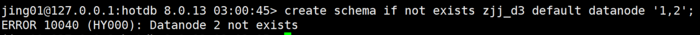

- 指定字符集时，给出warning提醒如下

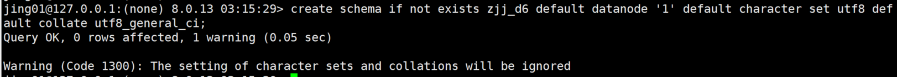

> !Note
>
> 指定字符集校对集时，会给出warning提示，因对于计算节点来说设置库级别字符集校对集实际无效，都是跟随存储节点本身默认的配置来识别的。

#### DROP语句

| MySQL语句类型 | 子句类型 | 支持状态 | 说明 |
|---------------|----------|----------|------|
| `DROP DATABASE` | 　 | 禁用 |   |
| `DROP EVENT` | 　 | 禁用 |   |
| `DROP FUNCTION` | 　 | 禁用 |   |
| `DROP INDEX` | `UNIQUE` | 支持 |   |
| ^ | 普通索引`KEY` | 支持 |   |
| ^ | `FOREIGN KEY` | 支持 |   |
| ^ | `FULLTEXT` | 支持 |   |
| ^ | `SPATIAL` | 支持 |   |
| ^ | `ALGORITHM` | 支持 |   |
| ^ | `LOCK` | 支持 |   |
| `DROP TABLE` | `DROP [TEMPORARY] TABLE [IF EXISTS]` | 禁用 |   |
| ^ | `DROP TABLE` | 支持 |   |
| ^ | `DROP TABLE` 多表 | 支持 | 必须保证多表在相同节点 |
| ^ | `DROP TABLE table_name [RESTRICT | CASCADE]` | 支持 |   |
| `DROP TRIGGER` | 　 | 支持 | 需要赋予DROP权限 |
| `DROP VIEW` | 　 | 支持 |   |

#### TRUNCATE与RENAME语句

| MySQL语句类型 | 子句类型 | 支持状态 | 说明 |
|---------------|----------|----------|------|
| `RENAME TABLE` | ^ | 支持 | 1. 支持RENAME多张表，但要求这些表都在相同节点，否则将执行失败并报错：`ERROR 10042 (HY000): unsupported to rename multi table with different datanodes` |
| ^ | ^ | ^ | 2. RENAME中的目标表不需要提前添加表配置，若添加新表的表配置，需要保证新表表配置与原表一致，否则RENAME将不成功 |
| ^ | ^ | ^ | 注意：计算节点数据库用户需要对旧表拥有ALTER和DROP权限，以及对新表拥有CREATE和INSERT权限 |
| `TRUNCATE TABLE` | 　 | 支持 | 　 |

### 事务管理与锁语句

| 语句类型 | 事务语句 | 语句参数 | 状态 | 说明 |
|----------|----------|----------|------|------|
| 事务管理 | `START TRANSACTION` | 无参数 | 支持 |   |
| ^ | ^ | `WITH CONSISTENT SNAPSHOT` | 支持 |   |
| ^ | ^ | `READ WRITE` | 支持 |   |
| ^ | ^ | `READ ONLY` | 支持 |   |
| ^ | `BEGIN` |   | 支持 |   |
| ^ | `COMMIT` |   | 支持 |   |
| ^ | `COMMIT` | `[AND [NO] CHAIN] [[NO] RELEASE]` | 支持 |   |
| ^ | `ROLLBACK` |   | 支持 |   |
| ^ | `ROLLBACK` | `[AND [NO] CHAIN] [[NO] RELEASE]` | 支持 |   |
| ^ | `SET autocommit` | `0|1` | 支持 |   |
| `SAVEPOINT` | `SAVEPOINT` |   | 支持 |   |
| ^ | `ROLLBACK ... TO ...` |   | 支持 |   |
| ^ | `RELEASE SAVEPOINT` |   | 支持 |   |
| `LOCK` | `LOCK TABLES` | `READ [LOCAL]` | 禁用 |   |
| ^ | ^ | `[LOW_PRIORITY] WRITE` | 禁用 |   |
| ^ | `UNLOCK TABLES` | ^ | 禁用 |   |
| ^ | `LOCK INSTANCE FOR BACKUP` | ^ | 禁用 |   |
| ^ | `UNLOCK INSTANCE;` | ^ | 禁用 |   |
| 事务隔离级别语句 | `SET SESSION TRANSACTION` | `REPEATABLE READ` | 支持 | XA模式可完整支持， 普通模式下会存在读到部分提交的情况 |
| ^ | ^ | `READ COMMITTED` | 支持 | 普通模式下会存在读写不一致的问题； XA模式下，2.5.5版本以下不支持，2.5.5版本及以上支持，但跨库多次查询的情况下不保证读写强一致；即：对select 、insert select 这类SQL，如果出现一个SQL转成多个SQL执行的SQL语句，则SQL执行结果在该隔离级别下可能不正确。可参考[数据强一致性（XA事务）](#数据强一致性xa事务)章节描述 |
| ^ | ^ | `READ UNCOMMITTED` | 不支持 |   |
| ^ | ^ | `SERIALIZABLE` | 支持 | XA模式可完整支持， 普通模式下会存在读到部分提交的情况 |
| ^ | `SET GLOBAL TRANSACTION` | `REPEATABLE READ` | 不支持 | 不支持SET GLOBAL的方式，只支持SET SESSION |
| ^ | ^ | `READ COMMITTED` | 不支持 | 不支持SET GLOBAL的方式，只支持SET SESSION |
| ^ | ^ | `READ UNCOMMITTED` | 不支持 |   |
| ^ | ^ | `SERIALIZABLE` | 不支持 |   |
| ^ | `SET SESSION TRANSACTION` | `READ ONLY` | 支持 |   |
| ^ | ^ | `READ WRITE` | 支持 |   |
| ^ | `SET GLOBAL TRANSACTION` | `READ ONLY` | 不支持 |   |
| ^ | ^ | `READ WRITE` | 不支持 |   |
| 分布式事务 | `XA START|BEGIN ...` | `[JOIN|RESUME]` | 禁用 |   |
| ^ | `XA END` | `[SUSPEND [FOR MIGRATE]]` | 禁用 |   |
| ^ | `XA PREPARE` | ^ | 禁用 |   |
| ^ | `XA COMMIT` | `[ONE PHASE]` | 禁用 |   |
| ^ | `XA ROLLBACK` | ^ | 禁用 |   |
| ^ | `XA RECOVER` | ^ | 禁用 |   |
| ^ | `XA RECOVER` | `[CONVERT XID]` | 禁用 | 5.7新增参数 |

### 其他MySQL语句

#### 存储过程、自定义函数等语句

HotDB Server当前仅支持垂直库（即逻辑库仅关联一个数据节点）场景下下使用存储过程，自定义函数等语句。

| 语句类型 | SQL语句 | 支持状态 | 说明 |
|----------|---------|----------|------|
| 存储过程 | `BEGIN ... END ...` | 限制支持 | 垂直库下可使用，下同 |
| ^ | `DECLARE` | 限制支持 |   |
| ^ | `CASE` | 限制支持 |   |
| ^ | `IF` | 限制支持 |   |
| ^ | `ITRATE` | 限制支持 |   |
| ^ | `LEAVE` | 限制支持 |   |
| ^ | `LOOP` | 限制支持 |   |
| ^ | `REPEAT` | 限制支持 |   |
| ^ | `RETURN` | 限制支持 |   |
| ^ | `WHILE` | 限制支持 |   |
| ^ | `CURSOR` | 限制支持 |   |
| ^ | `DECLARE ... CONDITION...` | 限制支持 |   |
| ^ | `DECLARE ... HANDLER ...` | 限制支持 |   |
| ^ | `GET DIAGNOSTICS` | 限制支持 |   |
| ^ | `RESIGNAL` | 限制支持 |   |
| ^ | `SIGNAL` | 限制支持 |   |
| 插件和UDF语句 | `CREATE [AGGREGATE] FUNCTION function_name RETURNS {STRING|INTEGER|REAL|DECIMAL}` | 限制支持 |   |
| ^ | `SONAME shared_library_name` | ^ |   |
| ^ | `DROP FUNCTION` | 限制支持 |   |
| ^ | `INSTALL PLUGIN` | 禁用 |   |
| ^ | `UNINSTALL PLUGIN` | 禁用 |   |

#### Prepare SQL Statement

| 语句类型 | SQL语句 | 支持状态 | 说明 |
|----------|---------|----------|------|
| ^ | `Prepare SQL Statement | PREPARE ... FROM ...` | 支持 |   |
| ^ | `EXECUTE ...` | 支持 |   |
| ^ | `{DEALLOCATE | DROP} PREPARE` | 支持 |   |

#### 用户管理语句

HotDB Server实现了一套自己的用户名与权限管理的系统，可以优先在分布式事务数据库平台页面上操作即可。若使用同MySQL数据库用户管理类同的SQL语句，部分可以支持。

| 语句类型 | SQL语句 | 支持状态 | 说明 |
|----------|---------|----------|------|
| 用户管理语句 | `ALTER USER` | 禁用 | 通过平台操作可支持 |
| ^ | `CREATE USER` | 支持 | 使用说明详见表格下方详细描述 |
| ^ | `DROP USER` | 支持 | 使用说明详见表格下方详细描述 |
| ^ | `GRANT` | 支持 | 使用说明详见表格下方详细描述 |
| ^ | `RENAME USER` | 禁用 | 通过平台操作可支持 |
| ^ | `REVOKE` | 支持 | 使用说明详见表格下方详细描述 |
| ^ | `SET PASSWORD` | 禁用 | 通过平台操作可支持 |

计算节点版本高于2.5.6版本时，支持使用SQL语句创建/删除用户，并给用户赋权/解权。

##### 创建用户

创建用户语法：

```sql
CREATE USER [IF NOT EXISTS] 'user_name'@'host_name'   IDENTIFIED BY  'password_auth_string'[,'user_name'@'host_name'   IDENTIFIED BY  'password_auth_string']...
```

服务端创建用户语法示例：

```sql
create user 'jingjingjing'@'%' identified by 'jing' with max_user_connections 3;
```

创建用户时执行用户必须具有super权限且不支持空密码创建，用户名最大长度限制64字符，密码暂未限制。

- 执行用户不具有super权限创建用户，提示如下：


- 空密码创建时，提示如下：

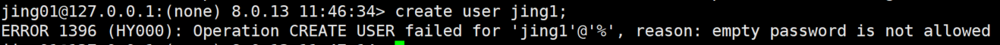

- 用户名超过限制，提示如下：

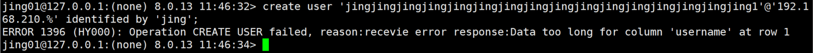

- 重复创建用户，提示如下：

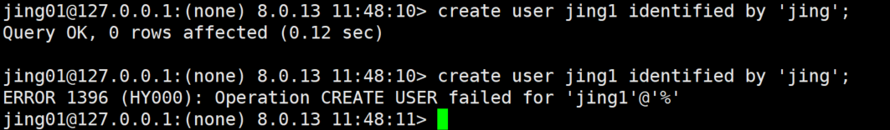

##### 删除用户

删除用户语法：

```sql
DROP USER [IF EXISTS] 'user_name'@'host_name' [,'user_name'@'host_name']...
```

服务端删除用户语法示例：

```sql
drop user 'jingjingjing'@'%';
```

删除用户时执行用户必须具有super权限。

- 执行用户不具有super权限删除用户，提示如下：

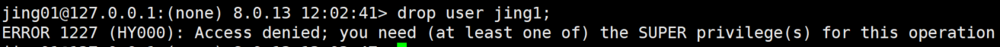

- 删除不存在的用户时，提示如下：

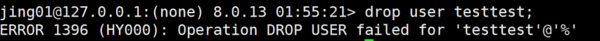

##### GRANT赋权

GRANT赋权语法：

```sql
GRANT
priv_type[, priv_type] ...
ON priv_level TO 'user_name'@'host_name'[,'user_name'@'host_name'] ...
[WITH MAX_USER_CONNECTIONS con_num]
```

> !Tip
>
> 可授权的权限类型priv_type 包括：SELECT、 UPDATE、 DELETE、 INSERT 、CREATE 、DROP 、ALTER 、FILE 、 SUPER

可使用[ALL [PRIVILEGES]](https://dev.mysql.com/doc/refman/5.6/en/privileges-provided.html#priv_all) 为用户赋予所有权限（包括SUPER权限）在内，用法等同MySQL。

可授权的权限范围priv_level包括： `*` | `*.*`  | `db_name.*` | `db_name.tbl_name`  | `tbl_name`

- `*`：表示当前数据库中的所有表(必须use 逻辑库之后才能执行)；
- `*.*`：表示所有数据库中的所有表；
- `db_name.*`：表示某个数据库中的所有表，db_name 指定数据库名；
- `db_name.tbl_name`：表示某个数据库中的某个表，db_name 数据库名，tbl_name 表名；
- `tbl_name`：表示某个表，tbl_name 指定表名(必须use 逻辑库之后才能执行)

服务端GRANT语法示例：

全局权限：

```sql
grant all on *.* to ' test_ct '@'localhost' identified by ' test_ct ' with max_user_connections 3;
```

库级权限：

```sql
grant all on test_ct.* to 'test_ct'@'localhost' identified by 'test_ct';
```

表级权限：

```sql
grant update on test_ct.test_aa to 'test_ct'@'localhost' identified by 'test_ct';
```

赋权注意事项：

1. 执行赋权操作的用户本身必须有super权限。
2. 可在赋权时同步创建用户但需带上密码。
3. super和file必须赋全局管理权限，不支持库和表级别授权。
4. all权限不能与其他权限同时使用只能单独赋权，同MySQL。
5. 权限修改后只对新连接生效，不会改变已创建的连接权限。

- 执行赋权操作的用户不具有super权限，提示如下：


- 赋权时同步创建用户

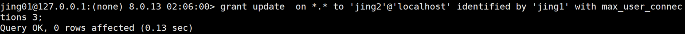

- 赋权时同步创建用户不带密码，提示如下：

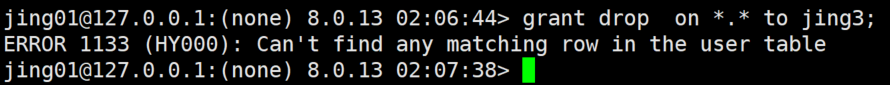

- super只能赋全局权限，不支持库和表级别授权，如下图：

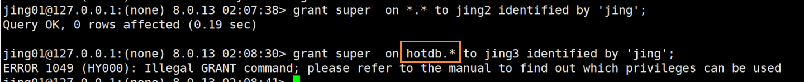

- file权限只能赋全局权限，不支持库和表级别授权


- all权限只能单独授权，不能和其他权限项同时授权

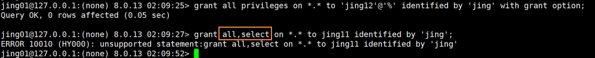

##### REVOKE删除权限

REVOKE删除权限语法：

```sql
REVOKE priv_type [, priv_type] ...ON priv_level FROM 'user_name'@'host_name' [, 'user_name'@'host_name'] ...
```

服务端REVOKE语法示例：

```sql
revoke select,update,delete,insert,create,drop,alter,file,super on *.* from jingjing05;
```

解权注意事项：

1. 执行删除权限操作的用户本身必须有super权限。
2. 可以移除部分权限和所有权限，可以移除对应库、表级别的权限。
3. 权限项可重复移除，但移除不存在的类型会报语法错误。
4. 权限修改后只对新连接生效，不会改变已创建的连接权限。

- 执行用户没有super权限时删除权限，提示如下：

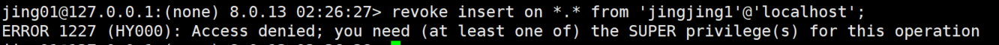

- 支持移除部分权限

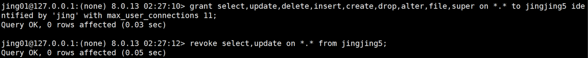

- 支持移除所有权限

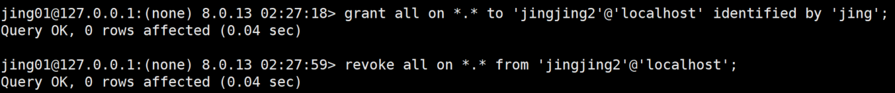

- 支持移除库级别权限


- 支持移除表级别权限


- 移除权限后再次使用该权限，报错提示如下

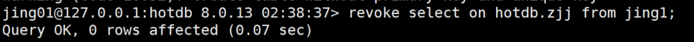

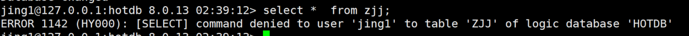

#### 表维护语句

| 语句类型 | SQL语句 | 支持状态 | 说明 |
|----------|---------|----------|------|
| 表维护语句 | `ANALYZE TABLE` | 禁用 |   |
| ^ | `CHECK TABLE` | 禁用 |   |
| ^ | `CHECKSUM TABLE` | 禁用 |   |
| ^ | `OPTIMIZE TABLE` | 禁用 |   |
| ^ | `REPAIR TABLE` | 禁用 |   |

#### SET语句

| 语句类型 | SQL语句 | 支持状态 | 说明 |
|----------|---------|----------|------|
| SET语句 | `SET GLOBAL` | 不支持 | 　 |
| ^ | `SET SESSION` | 部分支持 | 如:`SET SESSION TRANSACTION/SET TX_READONLY/SET NAMES`等 |
| ^ | `SET @@global.` | 不支持 | 　 |
| ^ | `SET @@session.` | 部分支持 | 例如支持设置字符集相关（连接字符集、查询结果字符集、字符集校对规则），最大连接数、是否进行外键约束等 |
| ^ | `SET @@` | 不支持 | 　 |
| ^ | `SET ROLE` | 禁用 | 计算节点不支持MySQL8.0新增角色功能 |
| ^ | 用户自定义变量 | 支持 | 仅支持单库下调用 |
|   | `SET CHARACTER SET` | 支持 | 仅支持：`CHARACTER_SET_CLIENT`、`CHARACTER_SET_CONNECTION`、`CHARACTER_SET_RESULTS` |
|   | `SET NAMES` | 支持 | 　 |
|   | `SET TRANSACTION ISOLATION LEVEL` | 支持 | 普通模式下支持的级别为`REPEATABLE READ`，`READ COMMITTED`，`SERIALIZABLE`<br>XA 模式只支持`REPEATABLE READ`、`SERIALIZABLE` |

#### SHOW语句

| 语句类型 | SQL语句 | 支持状态 | 说明 |
|----------|---------|----------|------|
| SHOW语句 | `SHOW AUTHORS` | 支持 | 返回空集 |
| ^ | `SHOW BINARY LOGS` | 支持 | 返回空集 |
| ^ | `SHOW BINLOG EVENTS` | 支持 | 返回空集 |
| ^ | `SHOW CHARACTER SET` | 支持 | 　 |
| ^ | `SHOW COLLATION` | 支持 | 　 |
| ^ | `SHOW FIELDS FROM ` | 支持 | 　 |
| ^ | `SHOW COLUMNS FROM|IN tbl_name` | 支持 | 　 |
| ^ | `SHOW FULL COLUMNS FROM|IN tbl_name` | 支持 | 　 |
| ^ | `SHOW CONTRIBUTORS` | 支持 | 返回空集 |
| ^ | `SHOW CREATE DATABASE` | 支持 | 　 |
| ^ | `SHOW CREATE EVENT` | 支持 | 返回空集 |
| ^ | `SHOW CREATE FUNCTION` | 支持 | 返回空集 |
| ^ | `SHOW CREATE PROCEDURE` | 支持 | 返回空集 |
| ^ | `SHOW CREATE TABLE` | 支持 | 　 |
| ^ | `SHOW CREATE TRIGGER` | 支持 | 返回空集 |
| ^ | `SHOW CREATE VIEW` | 支持 | 返回空集 |
| ^ | `SHOW DATABASES` | 支持 | 　 |
| ^ | `SHOW ENGINES` | 支持 | 返回空集 |
| ^ | `SHOW ERRORS` | 支持 |   |
| ^ | `SHOW EVENTS` | 支持 | 返回空集 |
| ^ | `SHOW FUNCTION STATUS` | 支持 | 返回空集 |
| ^ | `SHOW GRANTS` | 支持 | 显示计算节点的权限控制情况 |
| ^ | `SHOW INDEX FROM db_name.table_name` | 支持 | 　 |
| ^ | `SHOW INDEX FROM table_name WHERE...` | 支持 | 　 |
| ^ | `SHOW MASTER STATUS` | 支持 | 返回空集 |
| ^ | `SHOW OPEN TABLES` | 支持 | 返回空集 |
| ^ | `SHOW PLUGINS` | 支持 | 返回空集 |
| ^ | `SHOW PRIVILEGES` | 支持 | 返回空集 |
| ^ | `SHOW PROCEDURE STATUS` | 支持 | 返回空集 |
| ^ | `SHOW PROCESSLIST` | 支持 | 显示计算节点的连接情况 |
| ^ | `SHOW PROFILES` | 支持 | 返回空集 |
| ^ | `SHOW RELAYLOG EVENTS [IN 'log_name'] [FROM pos] [LIMIT [offset,] row_count]` | 支持 | 返回空集 |
| ^ | `SHOW SLAVE HOSTS` | 支持 | 返回空集 |
| ^ | `SHOW SLAVE STATUS` | 支持 | 返回空集 |
| ^ | `SHOW GLOBAL STATUS` | 支持 | 　 |
| ^ | `SHOW SESSION STATUS` | 支持 | 　 |
| ^ | `SHOW STATUS` | 支持 |   |
| ^ | `SHOW TABLE STATUS` | 支持 | 　 |
| ^ | `SHOW FULL TABLES` | 支持 | 　 |
| ^ | `SHOW TABLES` | 支持 | 　 |
| ^ | `SHOW TRIGGERS` | 支持 | 返回空集　 |
| ^ | `SHOW GLOBAL|SESSION VARIABLES` | 支持 | 　 |
| ^ | `SHOW WARNINGS` | 支持 |   |
| ^ | `SHOW HOTDB TABLES` | 支持 | 支持`[{FROM | IN} *db_name*] [LIKE '*pattern*' | WHERE *expr*]` |
| ^ | ^ | ^ | 显示计算节点的分片信息 |

#### HotDB PROFILE

| 语句类型 | SQL语句 | 支持状态 | 说明 |
|----------|---------|----------|------|
| SET语句 | `SET hotdb_profiling={0|1|on|off}` | 支持 | 支持`set [session] hotdb_profiling` |
| SHOW语句 | `SHOW HOTDB_PROFILES` | 支持 |   |
| ^ | `SHOW HOTDB_PROFILE FOR QUERY N [relative time|real time]` | 支持 | N代表执行的SQL id |

**功能说明：**该功能仅限session级别

`SHOW HOTDB_PROFILES`输出与MySQL相同：

- 第一列Query_ID为SQL的id
- 第二列Duration为（计算节点完成向前端写出最后一个结果集的时间-计算节点开始接收SQL第一个数据包时的时间点）的时长，单位：ms。
- 第三列Query 为SQL文本

示例：

```
mysql> show hotdb_profiles;
+----------+----------+-------------------+
| Query_ID | Duration | Query             |
+----------+----------+-------------------+
| 1        | 422      | SELECT DATABASE() |
| 2        | 1962     | select * from aa  |
+----------+----------+-------------------+
2 rows in set (0.01 sec)
```

`SHOW HOTDB_PROFILE FOR QUERY N [relative time|real time]`与MySQL相似：

- 第一列Status，即SQL 语句执行的状态；
- 第二列为relative time或real time，若不指定则默认relative time；
- 第三列Duration，即SQL执行过程中每一个步骤的耗时。

示例：

```
mysql> show hotdb_profile for query 2 relative time;
+--------------------------------------------+---------------+----------+
| Status                                     | Relative_time | Duration |
+--------------------------------------------+---------------+----------+
| SQL receive start time                     | 0             | NULL     |
| SQL receive end time                       | 67            | 67       |
| multiquery parse end time                  | 125           | 58       |
| multiquery other SQL execute wait end time | 155           | 30       |
| SQL parse end time                         | 709           | 553      |
| backend SQL 1 request generate start time  | 709           | NULL     |
| backend SQL 1 request generate end time    | 892           | 182      |
| backend SQL 1 request send start time      | 1329          | NULL     |
| backend SQL 1 request send end time        | 1390          | 61       |
| backend SQL 1 result receive start time    | 1733          | NULL     |
| backend SQL 1 result receive end time      | 1842          | 109      |
| backend SQL 1 result rewrite start time    | 1733          | NULL     |
| backend SQL 1 result rewrite end time      | 1849          | 116      |
| result send start time                     | 1849          | NULL     |
| result send end time                       | 1962          | 112      |
+--------------------------------------------+---------------+----------+
15 rows in set (0.00 sec)
```

status列说明：

- `SQL recive start time`：计算节点开始接收SQL第一个数据包的时间点
- `SQL recive end time`：计算节点完成SQL接收的时间点（接收失败的SQL，后续不再继续输出）
- `multiquery parse end time`：计算节点完成Multi query解析的时间点（发生解析失败后续行不再继续输出）
- `multiquery other SQL execute wait end time`：计算节点开始SQL解析的时间点 （如果前面没有SQL要跑，则不需要此行）
- `SQL parse end time`：计算节点完成SQL解析的时间点（发生解析失败后续行不再继续输出）
- `backend SQL N request generate start time`：计算节点开始后端SQL N 生成的时间点(N为后端SQL的序列号1，2，3，4...)
- `backend SQL N request generate end time`：计算节点完成后端SQL N 的时间点
- `backend SQL N request send start time`：计算节点开始向第一个MySQL发送第一个后端SQL N的时间
- `backend SQL N request send end time`：计算节点完成向最后一个MySQL发出最后一个后端SQL N的时间
- `backend SQL N result recive start time`：计算节点开始从第一个MySQL接收到第一个SQL N结果集数据包的时间
- `backend SQL N result recive end time`：计算节点完成从最后一个MySQL接收完成最后一个SQL N结果集数据包的时间
- `backend SQL N result rewrite start time`：计算节点开始对收到的结果集进行改写处理的时间（如果SQL执行报错或报warning，这一段时间会包含error或warning的处理时间）
- `backend SQL N result rewrite end time`：计算节点完成对收到的结果集进行改写处理的时间
- `result send start time`：计算节点开始向前端写出第一个结果集包的时间
- `result send end time`：计算节点完成向前端写出最后一个结果集的时间

#### 其他MySQL管理语句

| 语句类型 | SQL语句 | 支持状态 | 说明 |
|----------|---------|----------|------|
| 其他管理语句 | `BINLOG 'str'` | 禁用 |   |
| ^ | `CACHE INDEX` | 禁用 |   |
| ^ | `KILL [CONNECTION | QUERY]` | 支持 |   |
| ^ | `LOAD INDEX INTO CACHE` | 禁用 |   |
| ^ | `RESET MASTER` | 禁用 |   |
| ^ | `RESET QUERY CACHE` | 禁用 |   |
| ^ | `RESET SLAVE` | 禁用 |   |
| MySQL Utility Statements | `DESCRIBE|DESC` | 支持 |   |
| ^ | `EXPLAIN` | 支持 | 请参考[EXPLAIN](#explain) |
| ^ | `EXPLAIN EXTENDED` | 不支持 |   |
| ^ | `HELP` | 不支持 |   |
| ^ | `USE` | 支持 |   |

KILL语句与MySQL KILL语句用法一样。KILL会同时关闭计算节点前端连接与存储节点的MySQL数据库的连接。

#### SHOW VARIABLES 和SHOW STATUS

HotDB Server对MySQL部分variables及status的显示结果做了支持，可通过相关语法查看计算节点连接的存储节点变量信息。

无特殊处理的参数显示说明：当show_dnid=1，merge_result=0时，输出数据增加dnid一列，所有数据显示在读存储节点中的原始值；当show_dnid=1，merge_result=1时，变量值相同的存储节点会聚合为一行显示；当show_dnid=0时，没有特殊说明都是返回第一个存储节点变量值，

以下参数特殊处理，具体显示结果，见显示说明：

| bianling | 显示说明 |
|----------|----------|
| `BIND_ADDRESS` | **始终显示** |
| `TX_ISOLATION` | 根据server.xml中配置的隔离级别设置，默认REPEATABLE-READ,session也按照server.xml中配置显示 此参数在MySQL8.0时被移除，用transaction_isolation代替此参数 |
| `TRANSACTION_ISOLATION` | MySQL8.0新增参数，用于代替tx_isolation |
| `AUTO_INCREMENT_OFFSET` | 目前显示 1 |
| `CHARACTER_SET_CONNECTION` | 仅支持utf8/gbk/latin1/utf8mb4字符集 |
| `CHARACTER_SET_RESULTS` | 仅支持utf8/gbk/latin1/utf8mb4字符集 |
| `MAX_CONNECTIONS` | 按计算节点实际配置显示 |
| `MAX_USER_CONNECTIONS` | 按计算节点实际配置显示 |
| `MAX_JOIN_SIZE` | 仅支持set session max_join_size=xxx , 按照计算节点设置的值显示, global的按照server.xml中[JOIN中间结果集行数](#maxjoinsize)参数设置 |
| `CHARACTER_SET_SERVER` | 仅支持utf8/gbk/latin1/utf8mb4字符集 |
| `VERSION_COMMENT` | HotDB Server by Hotpu Tech |
| `INTERACTIVE_TIMEOUT` | 172800 |
| `SERVER_UUID` | 始终显示00000000-0000-0000-0000-0000000000 |
| `TX_READ_ONLY` | 默认OFF， session的按照session的显示 此参数在MySQL8.0时被移除，用transaction_ready_only代替 |
| `TRANSACTION_READ_ONLY` | MySQL8.0新增参数，用于代替tx_read_only |
| `PORT` | 按照配置的服务端口值显示 |
| `AUTOCOMMIT` | 默认ON，session级别的按照session的显示 |
| `HOSTNAME` | MySQL5.7,显示为计算节点服务器的主机名 |
| `COLLATION_DATABASE` | 仅支持utf8/gbk/latin1/utf8mb4字符集 |
| `CHARACTER_SET_DATABASE` | 仅支持utf8/gbk/latin1/utf8mb4字符集 |
| `PROTOCOL_VERSION` | 按照计算节点实际使用的通讯协议版本显示 |
| `READ_ONLY` | 按照计算节点实际使用的模式设置 |
| `VERSION` | MySQL版本号-HotDB Server版本号，按照计算节点实际使用的显示 |
| `COLLATION_SERVER` | 目前仅支持：latin1_swedish_ci latin1_bin gbk_chinese_ci gbk_bin utf8_general_ci utf8_bin utf8mb4_general_ci utf8mb4_bin |
| `SOCKET` | 显示空字符串 |
| `SERVER_ID` | 显示0 |
| `WAIT_TIMEOUT` | 172800 |
| `SSL_CIPHER` | 返回空字符串 |
| `COLLATION_CONNECTION` | 目前仅支持：latin1_swedish_ci latin1_bin gbk_chinese_ci gbk_bin utf8_general_ci utf8_bin utf8mb4_general_ci utf8mb4_bin |
| `FOREIGN_KEY_CHECKS` | 显示ON |
| `CHARACTER_SET_CLIENT` | 仅支持utf8/gbk/latin1/utf8mb4字符集 |
| `TIME_ZONE` | time_zone参数为具体的相同值，或全为SYSTEM并且system_time_zone全相同的具体值。计算节点在`SHOW [GLOBAL] VARIABLES`时，将time_zone统一显示为+08:00这个字符串 |
| `MAX_ALLOWED_PACKET` | 计算节点控制，默认：64M |
| `ADMIN_ADDRESS` | 始终显示空字符串，MySQL8.0新增 |
| `INNODB_BUFFER_POOL_SIZE` | 逻辑库下所有节点总和，主备节点按主节点算 |

| 状态名 | 显示说明 |
|--------|----------|
| `Compression` | 一律为OFF（计算节点暂不支持压缩协议） |
| `Innodb_buffer_pool_dump_status` | 第一个不以not started结尾的状态，否则取逻辑库的第一个节点的值 |
| `Innodb_buffer_pool_load_status` | 第一个不以not started结尾的状态，否则取逻辑库的第一个节点的值 |
| `Innodb_have_atomic_builtins` | 如果逻辑库有一个节点为OFF则为OFF，全为ON则为ON |
| `Innodb_page_size` | 取逻辑库的第一个节点的值 |
| `Innodb_row_lock_time_avg` | 逻辑库的所有节点取简单平均 |
| `Innodb_row_lock_time_max` | 逻辑库的所有节点取最大值 |
| `Last_query_cost` | 始终0.000000 |
| `Last_query_partial_plans` | 始终0 |
| `Max_used_connections` | 逻辑库的所有节点取最大值 |
| `Slave_heartbeat_period` | 逻辑库的所有节点取最大值 |
| `Slave_last_heartbeat` | 日期型，逻辑库的所有节点取最小值，如果全为空字符串则为空字符串 |
| `Slave_running` | 如果逻辑库有一个节点为OFF则为OFF，全为ON则为ON |
| `Ssl_cipher` | 始终返回空字符串 |
| `Ssl_cipher_list` | 始终返回空字符串 |
| `Ssl_ctx_verify_depth` | 取逻辑库的第一个节点的值 |
| `Ssl_ctx_verify_mode` | 取逻辑库的第一个节点的值 |
| `Ssl_default_timeout` | 取逻辑库的第一个节点的值 |
| `Ssl_server_not_after` | 始终返回空字符串 |
| `Ssl_server_not_before` | 始终返回空字符串 |
| `Ssl_session_cache_mode` | 取逻辑库的第一个节点的值 |
| `Ssl_verify_depth` | 取逻辑库的第一个节点的值 |
| `Ssl_verify_mode` | 取逻辑库的第一个节点的值 |
| `Ssl_version` | 取逻辑库的第一个节点的值 |
| `Tc_log_page_size` | 取逻辑库的第一个节点的值 |
| `Uptime` | 逻辑库的所有节点取最大值 |
| `Uptime_since_flush_status` | 逻辑库的所有节点取最大值 |
| `Caching_sha2_password_rsa_public_key` | 始终显示空字符串，MySQL8.0新增 |
| `Current_tls_ca` | 始终显示空字符串，MySQL8.0新增 |
| `Current_tls_capath` | 始终显示空字符串，MySQL8.0新增 |
| `Current_tls_cert` | 始终显示空字符串，MySQL8.0新增 |
| `Current_tls_cipher` | 始终显示空字符串，MySQL8.0新增 |
| `Current_tls_ciphersuites` | 始终显示空字符串，MySQL8.0新增 |
| `Current_tls_crl` | 始终显示空字符串，MySQL8.0新增 |
| `Current_tls_crlpath` | 始终显示空字符串，MySQL8.0新增 |
| `Current_tls_key` | 始终显示空字符串，MySQL8.0新增 |
| `Current_tls_version` | 始终显示空字符串，MySQL8.0新增 |
| `group_replication_primary_member` | 始终显示空字符串，MySQL8.0新增 |
| `mecab_charset` | 逻辑库第一个，MySQL8.0新增 |
| `Performance_schema_session_connect_attrs_longest_seen` | 逻辑库取最大，MySQL8.0新增 |
| `Rpl_semi_sync_master_clients` | 始终显示0，MySQL8.0新增 |
| `Rpl_semi_sync_master_net_avg_wait_time` | 逻辑库求平均，MySQL8.0新增 |
| `Rpl_semi_sync_master_status` | 始终显示ON，MySQL8.0新增 |
| `Rpl_semi_sync_master_tx_avg_wait_time` | 逻辑库求平均，MySQL8.0新增 |
| `Rpl_semi_sync_slave_status` | 始终显示ON，MySQL8.0新增 |
| `Rsa_public_key` | 始终显示空字符串，MySQL8.0新增 |

### 计算节点语法特殊功能

#### 默认分片规则建表

在使用分片数据库时，需要先将表的分片规则信息配置好之后才能创建表。实际使用过程中，用户可能对分片数据库及分片规则不了解，这就需要一种能直接从MySQL过渡到分片数据库HotDB Server的方案，该方案能根据逻辑库关联的分片节点数量自动对表生成分片规则，称为默认分片规则。

**使用前提：**逻辑库已设置分片节点。为逻辑库设置分片节点的方法如下：登录分布式事务数据库管理平台,选择"配置"->"逻辑库"，给逻辑库设置默认分片节点，然后点动态加载。


**功能说明：**为逻辑库设置默认分片节点后，登录计算节点可以直接建表，HotDB Server将根据分片节点的数量为创建的表自动设置分片规则信息。具体的分片规则如下：

如果逻辑库只设置了一个分片节点，则HotDB Server对创建的表不做分片处理（和MySQL原生的表一致），在HotDB Server中将此类表称为创建垂直分片表。

如果逻辑库设置了多个分片节点，则HotDB Server对创建的表进行水平分片，分片算法是对每行数据分片字段的值进行AUTO_CRC32从而确定该行数据应被存储在哪个分片节点中，分片字段选取顺序：主键字段 -> 唯一键字段 ->第一个整型字段（BIGINT、INT、MEDIUMINT、SMALLINT、TINYINT） ->没有整型字段时取字符串类型字段（CHAR、VARCHAR），以上类型全部没有时默认随机选择一个字段作为分片字段。

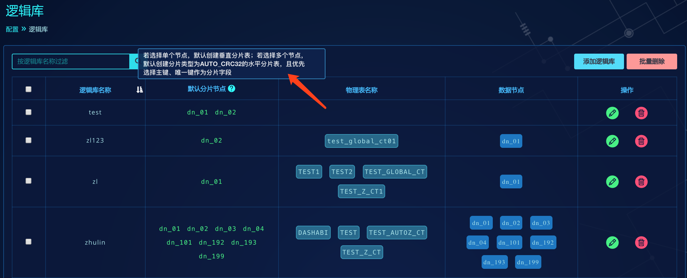

**注意：**

此功能仅推荐在初次接触HotDB Server的时候使用，正式交付以及上线不推荐，需要根据实际业务场景做分片。

若后期对逻辑库默认节点进行更改，对更改之前创建的表无影响，只对后续新增的表生效。

HotDB Server中对表分为三类：全局表、水平分片表、垂直分片表。

- 全局表：在HotDB Server中如果一个表被定义为全局表，则该表存储在逻辑库下的所有分片节点中，且每个分片节点中该表的数据都是完全一致的全量数据。
- 水平分片表：在HotDB Server中如果一个表被定义为水平分片表，则该表存储在逻辑库下的所有分片节点中，且每个分片节点中该表的数据都只是部分行数据，所有分片节点中该表的数据合在一起才是该表的全量数据。
- 垂直分片表：在HotDB Server中如果一个表被定义为垂直分片表，则该表仅存储在逻辑库下的一个分片节点中（其余分片节点无该表信息），且该分片节点中存储该表的全量数据。HotDB Server中垂直分片表与一般垂直分片表概念不同，不是按列进行分片存储的。

**例子：**

假设"test001"逻辑库配置了一个默认分片节点，则"test01"表为垂直分片表；假设"test002"逻辑库配置了两个默认分片节点，则"test02"表为水平分片表。

```
mysql> use TEST001;
Database changed

mysql> create table test01(id not null auto_increment primary key,a char(8),b decimal(4,2),c int);
mysql> use TEST002;

Database changed
mysql> create table test02(id not null auto_increment primary key,a char(8),b decimal(4,2),c int);
```

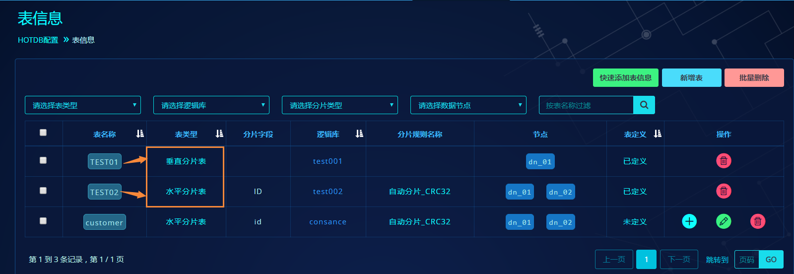

#### 已有分片规则建表

**使用前提：**在管理平台上已创建了分片规则，并进行了动态加载。添加分片规则请参考[管理平台](hotdb-management.md)文档。

**功能说明：**根据管理平台已添加好的分片规则，在计算节点服务端利用特殊语句直接建表，无需再配置表分片信息。利用已有分片规则所建的表，删除表后，管理平台相关表配置信息会同步被删除。

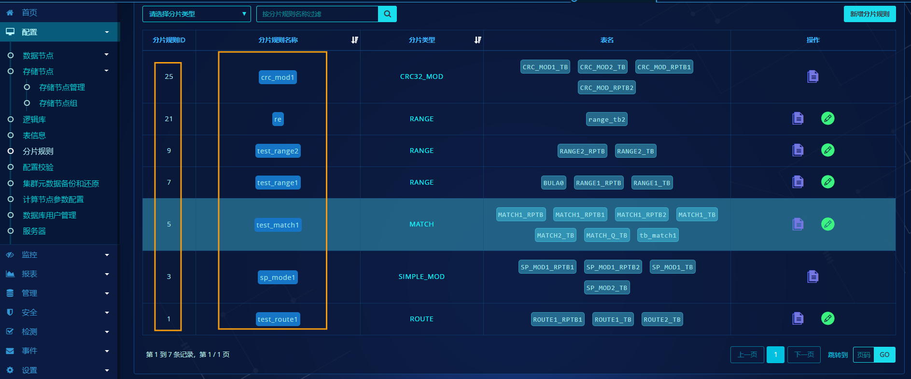

利用[服务端口命令](#使用已有分片规则建表相关命令)查看分片规则的functionid | functionname| functiontype| ruleid | rulename等信息，根据相关字段信息创建表。

```
mysql> show hotdb functions;
+-------------+---------------------+---------------+----------------+
| function_id | function_name       | function_type | auto_generated |
+-------------+---------------------+---------------+----------------+
| 1           | AUTO_GENERATE_CRC32 | AUTO_CRC2     | 1              |
| 2           | AUTO_CRC32_4        | AUTO_CRC32    | 0              |
| 3           | AUTO_CRC32_1        | AUTO_CRC32    | 0              |
| 26          | AUTO_GENERATE_MOD   | AUTO_MOD      | 1              |
| 31          | 29__MATCH1          | MATCH         | 0              |
| 33          | 32_SIMPLE_MOD       | SIMPLE_MOD    | 0              |
| 36          | 36_SIMPLE_MOD       | SIMPLE_MOD    | 0              |
| 37          | 37_CRC32_MOD        | CRC32_MOD     | 0              |
+-------------+---------------------+---------------+----------------+
8 rows in set (0.01 sec)

mysql> show hotdb rules;
+---------+--------------------------------------------------+-------------+-------------+----------------+
| rule_id | rule_name                                        | rule_column | function_id | auto_generated |
+---------+--------------------------------------------------+-------------+-------------+----------------+
| 4       | hotdb-cloud_555f9d00-27c3-4eaa-860c-309312672908 | id          | 3           | 0              |
| 12      | hotdb-cloud_8b7d9b8d-f711-476c-aa33-a4e2af184ab5 | adnid       | 2           | 0              |
| 13      | hotdb-cloud_7f8fff18-6016-47f1-ab0a-1912f5b75523 | adnid       | 2           | 0              |
| 21      | AUTO_GENERATE_3_JOIN_A_JWY                       | ID          | 1           | 1              |
| 50      | AUTO_GENERATE_9_FT_ADDR                          | ID          | 26          | 1              |
| 64      | AUTO_GENERATE_23_S03                             | A           | 1           | 1              |
+---------+--------------------------------------------------+-------------+-------------+----------------+
6 rows in set (0.01 sec)
```

##### 水平分片表

水平分片表是指将表的数据按行以分片列的分片规则进行拆分，拆分后的分片数据存储不同的数据节点。数据量大的表适合定义为水平分片表。

水平分片表创建语法如下：

```sql
CREATE  TABLE [IF NOT EXISTS] tbl_name SHARD BY {functionid | functionname} 'functionid | functionname' USING COLUMN 'shardcolumnname' **（table define...）**
CREATE  TABLE [IF NOT EXISTS] tbl_name SHARD BY {functiontype} 'functiontype' USING COLUMN 'shardcolumnname' on datanode 'datanodeid' **（table define...）**
```

同时也可以将SHARD BY 之后的关键字放置表定义之后（垂直分片表、全局表亦同），示例：

```sql
CREATE TABLE [IF NOT EXISTS] tbl_name (table define...) SHARD BY {functiontype} 'functiontype' USING COLUMN 'shardcolumnname' on datanode 'datanodeid'(.....);
```

水平分片表创建语法说明：

```sql
SHARD BY {FUNCTIONID | FUNCTIONNAME | FUNCTIONTYPE}：指分片函数ID、分片函数名称、分片函数类型的关键字。
```

- `functionid_value | functionname_value | functiontype_value` - 指具体的分片函数ID、分片函数名称、分片函数类型的值。
- `USING COLUMN` - 指分片列的关键字。
- `shardcolumnname` - 指具体的分片列的列名。
- `ON DATANODE` - 指数据节点的关键字。
- `datanodeid` - 指具体的数据节点的值，多个不连续的值可以用逗号间隔，多个连续的值可以使用区间形式指定，如:'1,3,4,5-10,12-40'。

登录服务端，切换逻辑库，输入建表语句并执行。

```
mysql> use fun_zy
Database changed

mysql> CREATE TABLE match1_tb shard by functionname 'test_match1' using column 'aname' (id INT UNSIGNED NOT NULL AUTO_INCREMENT PRIMARY KEY, adnid INT DEFAULT NULL, aname VARCHAR(32) DEFAULT '', adept VARCHAR(40), adate datetime DEFAULT NULL)ENGINE =INNODB;
Query OK, 0 rows affected (0.09 sec)
```

执行成功，管理平台会显示该表为已定义状态：


对于此语法规则建表，需要注意以下几点:

- `functionid | functionname | functiontype` - 为具体指定的分片函数ID、分片函数名称、分片函数类型
- `shardcolumnname` - 为指定的分片字段
- `datanodeid` - 节点ID，可以逗号间隔，且支持区间形式指定，如:'1,3,4,5-10,12-40'，节点ID可登录分布式事务数据库平台页面，选择"配置"->"节点管理"查看，也可以登录计算节点[服务端口使用命令](#使用已有分片规则建表相关命令)show hotdb datanodes;查看：

```
mysql> show hotdb datanodes;

+-------------+---------------+---------------+
| datanode_id | datanode_name | datanode_type |
+-------------+---------------+---------------+
| 9           | dn_01         | 0             |
| 11          | dn_02         | 0             |
| 13          | dn_03         | 0             |
| 15          | dn_04         | 0             |
| 19          | dn_failover   | 0             |
| 20          | dn_rmb_01     | 0             |
+-------------+---------------+---------------+
6 rows in set (0.00 sec)
```

- functiontype 只支持 auto_crc32/auto_mod, 若使用了其他类型会提示：ERROR:The fucntiontype can only be auto_crc32/auto_mod.

```
mysql> create table ft_match shard by functiontype 'match' using column 'id' on datanode '11,13'(id int(10) primary key, a char(20) not null);

ERROR 10070 (HY000): The functiontype can only by auto_crc32/auto_mode.
```

- 使用functionid | functionname建表时，当指定的function信息关联的function_type 是auto_crc32/auto_mod 时，需要指定on datanode 'datanodes' ，否则会提示：The function must be specified datanodes。 如果是其他类型，则无需指定。

```
mysql> create table mod_ft shard by functionid '15' using column 'id'(id int(10) primary key, a char(20) not null);

ERROR 10090 (HY000): The function must be specified datanodes.

mysql> create table testsa shard by functionid '3' using column 'id'(id int,a int);

Query OK, 0 rows affected, 1 warning (0.10 sec)

mysql> CREATE TABLE match_tb shard by functionname 'test_match1' using column 'ananme' on datanode '1,2'(id INT UNSIGNED NOT NULL AUTO_INCREMENT PRIMARY KEY, adnid INT DEFAULT NULL, aname VARCHAR(32) DEFAULT '', adept VARCHAR(40), adate datetime DEFAULT NULL)ENGINE =INNODB;

ERROR 10090 (HY000): This rule doesn't need to specify a datanodes;
```

表结构类似的表可以使用相同的分片规则，使用如下语法可直接引用分片规则创建水平分片表：

```sql
CREATE  TABLE [IF NOT EXISTS] tbl_name SHARD BY {ruleid | rulename} 'ruleidrulename' [on datanode 'datanodes'] (......
```

登录计算节点[服务端口使用命令](#使用已有分片规则建表相关命令)，show hotdb rules;和show hotdb functions;可以看到与之分片函数关联的分片规则：

```
mysql> show hotdb rules;
+---------+---------------------------+-------------+-------------+----------------+
| rule_id | rule_name                 | rule_column | function_id | auto_generated |
+---------+---------------------------+-------------+-------------+----------------+
| 17      | AUTO_GENERATE_3_ROUTE1_TB | A           | 1           | 1              |
+---------+---------------------------+-------------+-------------+----------------+
21 rows in set (0.01 sec)

mysql> show hotdb functions;
+-------------+---------------+--------------+----------------+
| function_id | function_name | function_typ | auto_generated |
+-------------+---------------+--------------+----------------+
| 1           | test_route1   | ROUTE        | 1              |
+-------------+---------------+--------------+----------------+
13 rows in set (0.01 sec)
```

用户可用ruleid/rulename来直接创建表：

```
mysql> CREATE TABLE rt_table shard by ruleid '17'(id int not null auto_increment primary key,a int(10),b decimanl(5,2),c decimal(5,2),d date,e time(6),f timestamp(6) DEFAULT CURRENT_TIMESTAMP(6),g datetime(6) DEFAULT CURRENT_TIMESTAMP(6),h year,I char(20) charcter set utf8,j varchar(30) character set utf8mb4,k char(20) character set gbk,l text character set latin1, m enum('','null','1','2','3'),n set('','null','1','2','3'));

Query OK, 0 rows affected (0.07 sec)
```

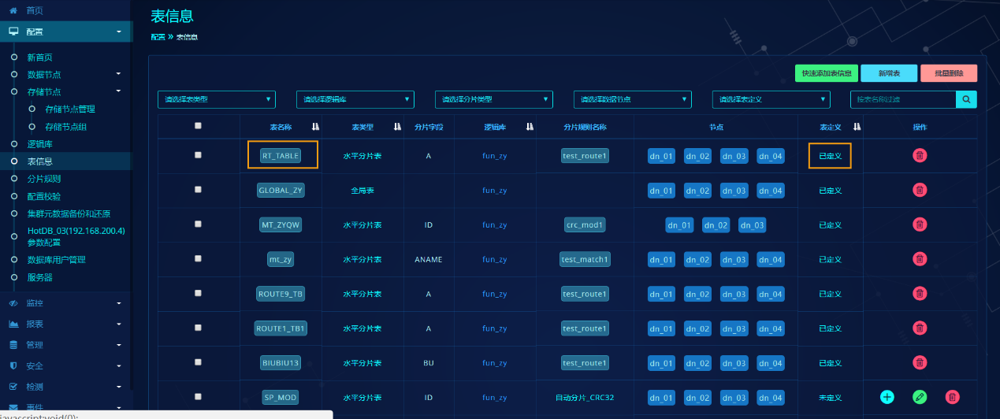

对于此语法规则建表，需要注意以下几点：

- 当指定的rule关联的function_type是auto_crc32/auto_mod 时，需要指定on datanode 'datanodes'；如果是其他类型，则无需指定datanode。

```
mysql> show hotdb rules
+---------+---------------------------+-------------+-------------+----------------+
| rule_id | rule_name                 | rule_column | function_id | auto_generated |
+---------+---------------------------+-------------+-------------+----------------+
| 17      | AUTO_GENERATE_3_ROUTE1_TB | A           | 1           | 1              |
+---------+---------------------------+-------------+-------------+----------------+
21 rows in set (0.01 sec)

mysql> show hotdb functions;
+-------------+---------------+---------------+----------------+
| function_id | function_name | function_type | auto_generated |
+-------------+---------------+---------------+----------------+
| 1           | test_route1   | ROUTE         | 1              |
+-------------+---------------+---------------+----------------+
13 rows in set (0.01 sec)

mysql> CREATE TABLE route2_rptb1 shard by rulename 'AUTO_GENERATE_3_ROUTE1_TB' on datanode '9,11,13'(id int not null auto_increment primary key,a int(10),b decimanl(5,2),c decimal(5,2),d date,e time(6),f timestamp(6) DEFAULT CURRENT_TIMESTAMP(6),g datetime(6) DEFAULT CURRENT_TIMESTAMP(6),h year,i char(20) charcter set utf8,j varchar(30) character set utf8mb4,k char(20) character set gbk,l text character set latin1, m enum('','null','1','2','3'),n set('','null','1','2','3'));

ERROR 10090 (HY000): This rule doesn't need to specify a datanodes;
```

- 当指定的rule关联的function_type是auto_crc32/auto_mod 时， 指定的datanode 个数与参数不符时，则会提示：ERROR:The total number of datanodes must be XXX（XXX为实际ruleid 关联的 function info的 column_value值）：

```
mysql> CREATE TABLE auto_c shard by ruleid '63' on datanode '9'(id INT UNSIGNED NOT NULL AUTO_INCREMENT PRIMARY KEY, adnid INT DEFAULT NULL, aname VARCHAR(32) DEFAULT '',adept VARCHAR(40), adate datetime DEFAULT NULL)ENGINE=INNODB;
ERROR 10090 (HY000): The total number of datanodes must be 2

mysql> CREATE TABLE auto_c shard by ruleid '63' on datanode '9,15'(id INT UNSIGNED NOT NULL AUTO_INCREMENT PRIMARY KEY, adnid INT DEFAULT NULL, aname VARCHAR(32) DEFAULT '',adept VARCHAR(40), adate datetime DEFAULT NULL)ENGINE=INNODB;
Query OK, 0 rows affected (0.13 sec)
```

##### 垂直分片表

垂直分片表是一个全局唯一且不分片的全量表，垂直分片表的全量数据仅存储在一个数据节点。

创建垂直分片表语法：

```
CREATE  TABLE [IF NOT EXISTS] tbl_name SHARD BY vertical on datanode 'datanodeid'(.....
```

语法说明：

- `SHARD BY VERTICAL`是垂直分片关键字
- `ON DATANODE 'datanodeid'`只能指定一个数据节点，不指定数据节点或指定多个数据节点都会报错。

```
mysql> CREATE TABLE tb_vertical shard by vertical on datanode'9'( id INT UNSIGNED NOT NULL AUTO_INCREMENT PRIMARY KEY, adnid INT DEFAULT NULL, aname VARCAHR(32) DEFAULT '', adept VARCHAR(40), adate DATETIME DEFAULT NULL)ENGINE=INNODB;
Query OK, 0 rows affected(0.07 sec)
```

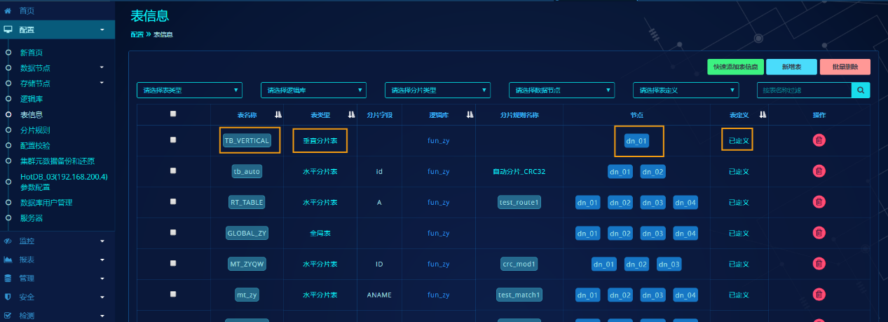

未指定datanode：

```
mysql> CREATE TABLE tb1_vertical shard by vertical( id INT UNSIGNED NOT NULL AUTO_INCREMENT PRIMARY KEY, adnid INT DEFAULT NULL, aname VARCAHR(32) DEFAULT '', adept VARCHAR(40), adate DATETIME DEFAULT NULL)ENGINE=INNODB;
ERROR 10090 (HY000): This table has to specify a datanodes.
```

指定多个节点：

```
mysql> CREATE TABLE tb1_vertical shard by vertical on datanode'9,11,13'( id INT UNSIGNED NOT NULL AUTO_INCREMENT PRIMARY KEY, adnid INT DEFAULT NULL, aname VARCAHR(32) DEFAULT '', adept VARCHAR(40), adate DATETIME DEFAULT NULL)ENGINE=INNODB;
ERROR 10090 (HY000): Can only specify one datanodes.
```

##### 全局表

全局表是指在该逻辑库下的所有数据节点中都存储的表，所有数据节点中该表的表结构和数据都完全一致。数据量小、不会频繁DML、经常与其他表发生JOIN 操作的表适合作为全局表。

创建全局表语法如下：

```sql
CREATE  TABLE [IF NOT EXISTS] tbl_name SHARD BY global on datanode 'datanodeid'(.....
```

语法说明：

- `SHARD BY GLOBAL`是全局表关键字。
- `[ON DATANODE 'datanodeid']`是指定数据节点的语法。计算节点版本高于（包含）2.5.6时，不指定datanodeid则默认按逻辑库默认分片节点+逻辑库下所有表关联节点的并集建表；指定则必须包括全部数据节点，指定部分数据节点会报错。

```
mysql> CREATE TABLE tb_quan shard by global(id int not null auto_increment primary key,a int(10),b decimanl(5,2),c decimal(5,2),d date,e time(6),f timestamp(6) DEFAULT CURRENT_TIMESTAMP(6),g datetime(6) DEFAULT CURRENT_TIMESTAMP(6),h year,I char(20) null,j varchar(30),k blob,l text, m enum('','null','1','2','3'),n set('','null','1','2','3'));
Query OK, 0 rows affected (0.07 sec)
```

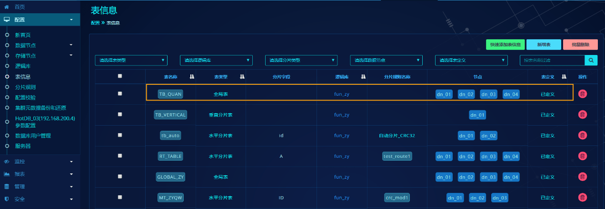

语法规则里的global是创建全局表的标志，'datanodeid'为节点ID，可以逗号间隔，且支持区间形式指定，如:'1,3,4,5-10,12-40'，使用该语法创建分片规则的全局表，该表的节点应该包括逻辑库下所有节点。

如果逻辑库下没有默认分片节点也没有已经定义的表，则使用特殊语法进行全局表的创建时，需要指定全局表分布的节点：

```
mysql> CREATE TABLE tb2_quan shard by global(id int not null auto_increment primary key,a int(10),b decimanl(5,2),c decimal(5,2),d date,e time(6),f timestamp(6) DEFAULT CURRENT_TIMESTAMP(6),g datetime(6) DEFAULT CURRENT_TIMESTAMP(6),h year,i char(20) null,j varchar(30),k blob,l text, m enum('','null','1','2','3'),n set('','null','1','2','3'));
ERROR 10090 (HY000): This table has to specify a datanodes.
```

如果逻辑库下存在已经定义的表，则可以不指定节点或指定节点的时候，需要为该逻辑库下包含节点的最大非重复个数（即所有表所选节点的并集），否则指定部分数据节点会提示建表错误：

```
mysql> CREATE TABLE tb1_quan shard by global on datanodes'9,11'(id int not null auto_increment primary key,a int(10),b decimanl(5,2),c decimal(5,2),d date,e time(6),f timestamp(6) DEFAULT CURRENT_TIMESTAMP(6),g datetime(6) DEFAULT CURRENT_TIMESTAMP(6),h year,i char(20) null,j varchar(30),k blob,l text, m enum('','null','1','2','3'),n set('','null','1','2','3'));
ERROR 10090 (HY000): The specified datanodes must cover all datanodes of the logical database.
```

##### 使用已有分片规则建表相关命令

此小节介绍的命令登录到计算节点服务端口、管理端口均可执行。

1. `show hotdb datanodes` -- 显示当前可用的节点：

此命令用于查看配置库中hotdb_datanodes表，语法：

```
mysql> show hotdb datanodes [LIKE 'pattern' | WHERE expr];
```

**命令包含参数及其说明：**

| 参数 | 说明 | 类型 |
|------|------|------|
| pattern | 可选，模糊查询表达式，匹配datanode_name字段 | STRING |
| expr | 可选，where条件表达式 | STRING |

**结果包含字段及其说明：**

| 列名 | 说明 | 值类型/范围 |
|------|------|-------------|
| datanode_id | 节点ID | INTEGER |
| datanode_name | 节点名称 | STRING |
| datanode_type | 0：主备；1：MGR | INTEGER |

例子：

```
mysql> show hotdb datanodes;
+-------------+---------------+---------------+
| datanode_id | datanode_name | datanode_type |
+-------------|---------------|---------------+
| 1           | dn_01         | 0             |
| 2           | dn_02         | 0             |
| 4           | dn_04         | 0             |
| 101         | dn_101        | 0             |
| 127         | dn_03         | 0             |
| 186         | dn_199        | 0             |
| 203         | dn_19         | 0             |
+-------------+---------------+---------------+
```

例子：

```
mysql> show hotdb datanodes like 'dn_0%';
+-------------+---------------+---------------+
| datanode_id | datanode_name | datanode_type |
+-------------+---------------+---------------+
| 1           | dn_01         | 0             |
| 2           | dn_02         | 0             |
| 4           | dn_04         | 0             |
| 127         | dn_03         | 0             |
+-------------+---------------+---------------+
```

2. show hotdb functions -- 显示当前可用的分片函数：

此命令用于查看配置库中hotdb_function表，语法：

```
mysql> show hotdb functions;
```

**命令包含参数及其说明：**

| 参数 | 说明 | 类型 |
|------|------|------|
| `pattern` | 可选，模糊查询表达式，匹配function_name字段 | STRING |
| `expr` | 可选，where条件表达式 | STRING |

**结果包含字段及其说明：**

| 列名 | 说明 | 值类型/范围 |
|------|------|-------------|
| `function_id` | 分片函数ID | INTEGER |
| `function_name` | 分片函数名称 | STRING |
| `function_type` | 分片类型 | STRING |
| `auto_generated` | 是否为HotDB自动生成的配置(1:自动生成，其他：非自动生成) | INTEGER |

例子：

```
mysql> show hotdb functions;
+-------------+---------------+---------------+----------------+
| function_id | function_name | function_type | auto_generated |
+-------------+---------------+---------------+----------------+
...省略更多...
| 40          | AUTO_CRC32_8  | AUTO_CRC32    | 0              |
| 41          | th_fun_range  | RANGE         | 0              |
| 42          | AUTO_MOD_5    | AUTO_MOD      | 0              |
| 43          | 43_RANGE      | RANGE         | 0              |
| 44          | AUTO_CRC32_15 | AUTO_CRC32    | 0              |
| 45          | AUTO_CRC32_5  | AUTO_CRC32    | 0              |
| 46          | yds_RANGE     | RANGE         | 0              |
| 47          | AUTO_CRC32_11 | AUTO_CRC32    | 0              |
+-------------+---------------+---------------+----------------+
```

例子：

```
mysql> show hotdb functions like '%range%';
+-------------+---------------+---------------+----------------+
| function_id | function_name | function_type | auto_generated |
+-------------+---------------+---------------+----------------+
| 41          | th_fun_range  | RANGE         | 0              |
| 43          | 43_RANGE      | RANGE         | 0              |
| 46          | yds_RANGE     | RANGE         | 0              |
+-------------+---------------+---------------+----------------+
3 rows in set (0.00 sec)

mysql> show hotdb functions where function_name like '%range%';
+-------------+---------------+---------------+----------------+
| function_id | function_name | function_type | auto_generated |
+-------------+---------------+---------------+----------------+
| 41          | th_fun_range  | RANGE         | 0              |
| 43          | 43_RANGE      | RANGE         | 0              |
| 46          | yds_RANGE     | RANGE         | 0              |
+-------------+---------------+---------------+----------------+
3 rows in set (0.00 sec)
```

3. `show hotdb function infos` - 显示当前可用的分片函数信息：

此命令用于查看配置库中hotdb_function_info 表，语法：

```
mysql> show hotdb function infos [WHERE expr];
```

**命令包含参数及其说明：**

| 参数 | 说明 | 类型 |
|------|------|------|
| `expr` | 可选，where条件表达式 | STRING |

**结果包含字段及其说明：**

| 列名 | 说明 | 值类型/范围 |
|------|------|-------------|
| `function_id` | 分片函数ID | INTEGER |
| `column_value` | 分片字段的值 | STRING |
| `datanode_id` | 数据节点id | INTEGER |

例子：

```
mysql> show hotdb function infos;
+-------------+--------------+-------------+
| function_id | column_value | datanode_id |
+-------------+--------------+-------------+
| 2           | 4            | 0           |
| 3           | 1            | 0           |
| 4           | 2            | 0           |
| 31          | ''           | 4           |
| 31          | 1            | 1           |
| 31          | 2            | 2           |
| 31          | null         | 127         |
| 33          | 0:1          | 1           |
| 33          | 10:10        | 191         |
| 33          | 11:11        | 186         |
| 33          | 12           | 0           |
| 33          | 2:3          | 2           |
...省略更多...
```

例子：

```
mysql> show hotdb function infos where function_id=38;
+-------------+--------------+-------------+
| function_id | column_value | datanode_id |
+-------------+--------------+-------------+
| 38          | 10:12        | 1           |
| 38          | 1:2          | 1           |
| 38          | 20           | 0           |
| 38          | 4:8          | 1           |
+-------------+--------------+-------------+
4 rows in set (0.00 sec)
```

4. `show hotdb rules` -- 显示当前可用的分片规则：

此命令用于查看配置库中hotdb_rule 表，语法：

```
mysql> show hotdb rules [LIKE 'pattern' | WHERE expr];
```

**命令包含参数及其说明：**

| 参数 | 说明 | 类型 |
|------|------|------|
| `pattern` | 可选，模糊查询表达式，匹配rule_name字段 | STRING |
| `expr` | 可选，where条件表达式 | STRING |

**结果包含字段及其说明：**

| 列名 | 说明 | 值类型/范围 |
|------|------|-------------|
| `rule_id` | 分片规则ID | INTEGER |
| `rule_name` | 分片规则名称 | STRING |
| `rule_column` | 分片字段名称 | STRING |
| `function_id` | 分片类型ID | INTEGER |
| `auto_generated` | 是否为HotDB自动生成的配置(1:自动生成，其他：非自动生成) | INTEGER |

例子：

```
mysql> show hotdb rules;
+---------+--------------------------------------------------+-------------+-------------+----------------+
| rule_id | rule_name                                        | rule_column | function_id | auto_generated |
+---------+--------------------------------------------------+-------------+-------------+----------------+
| 21      | AUTO_GENERATE_3_JOIN_A_JWY                       | ID          | 1           | 1              |
| 22      | hotdb-cloud_0374c02e-58a7-4263-9b80-9c5b46fb42af | id          | 5           | 0              |
| 25      | hotdb-cloud_f3979d19-93cb-4925-8dee-e4fbf8803c7c | id          | 5           | 0              |
| 32      | hotdb-cloud_6ccd2f69-cf53-4e81-ab3d-61345134fb7a | id          | 5           | 0              |
| 33      | hotdb-cloud_b5bc16e6-3481-40ed-83ff-e81d488e47a5 | ID          | 4           | 0              |
...省略更多...
```

例子：

```
mysql> show hotdb rules like '%auto%';
+---------+----------------------------+-------------+-------------+----------------+
| rule_id | rule_name                  | rule_column | function_id | auto_generated |
+---------+----------------------------+-------------+-------------+----------------+
| 21      | AUTO_GENERATE_3_JOIN_A_JWY | ID          | 1           | 1              |
| 50      | AUTO_GENERATE_9_FT_ADDR    | ID          | 26          | 1              |
| 64      | AUTO_GENERATE_23_S03       | A           | 1           | 1              |
| 65      | AUTO_GENERATE_23_S04       | B           | 1           | 1              |
...省略更多...

mysql> show hotdb rules where rule_name like '%auto%';
+---------+----------------------------+-------------+-------------+----------------+
| rule_id | rule_name                  | rule_column | function_id | auto_generated |
+---------+----------------------------+-------------+-------------+----------------+
| 21      | AUTO_GENERATE_3_JOIN_A_JWY | ID          | 1           | 1              |
| 50      | AUTO_GENERATE_9_FT_ADDR    | ID          | 26          | 1              |
| 64      | AUTO_GENERATE_23_S03       | A           | 1           | 1              |
| 65      | AUTO_GENERATE_23_S04       | B           | 1           | 1              |
...省略更多...
```

#### 暂时保留被删除的表数据

考虑到DROP TABLE、TRUNCATE TABLE 、DELETE TABLE 不带WHERE条件的语句在实际生产或线上环境执行时的较高风险，HotDB Server支持保留被DROP的表一段时间后再删除。其中，DELETE TABLE 不带WHERE条件的场景仅支持语句在自动提交的情况下可保留数据，事务内的操作暂无法保留数据。

可通过修改server.xml中的dropTableRetentionTime参数或在管理平台配置菜单下的计算节点参数配置中添加参数"被删除表保留时长(小时)"。

```xml
<property name="dropTableRetentionTime">0</property><!--被删除表保留时长,默认为0,不保留-->
```

dropTableRetentionTime参数默认为0，表示不保留被删除的表数据，例如DROP TABLE立即会删除表无法瞬间恢复；dropTableRetentionTime大于0时，单位以小时计算，保留被删除的表数据到设置时长，超过设置时长后自动删除被保留的表。

计算节点暂不提供还原被删除的表的直接命令，但是用户可以在存储节点通过RENAME的方式还原被删除的表。因直接在存储节点上进行操作，故此操作存在风险，请谨慎使用。风险包括还原后数据路由可能与实际路由不同、原有的外健和触发器被删除、父子表关系不存在等，详细风险参考[还原注意事项](#还原注意事项)。

当该功能开启时，以dropTableRetentionTime=24为例，将保留被DROP的表，24小时后删除被保留的表。若想要还原被DROP的表，首先查询计算节点配置库中的hotdb_dropped_table_log，查看被DROP的表的映射关系。例如：

```
mysql> select * from hotdb_dropped_table_log;
+------------+-----------+---------------------+------------------------------+
| table_name | datanodes | drop_time           | renamed_table_name           |
+------------+-----------+---------------------+------------------------------+
| TABLE25    | 11        | 2019-03-26 17:18:07 | HOTDB_TEMP_33_20190326171807 |
| TABLE30    | 11        | 2019-03-26 17:18:13 | HOTDB_TEMP_34_20190326171812 |
+------------+-----------+---------------------+------------------------------+
2 rows in set (0.00 sec)
```

其中，renamed_table_name即为保留被DROP的表的临时表，可以通过RENAME该临时表来还原数据。

```sql
RENAME TABLE tbl_name TO new_tbl_name
```

还原操作可以在对应的存储节点下分别RENAME临时表，也可以直接在计算节点下通过HINT语句RENAME临时表。使用HINT语句的操作说明及注意事项请参考此文档的[HINT](#hint)章节。

##### 还原注意事项

还原时需要注意以下要点：

- 通过管理平台配置后创建的表，可以直接RENAME成原表名。通过自动建表功能创建的表，DROP TABLE时不保留表配置，因此不能直接RENAME成原表名。
- 还原自动建表创建的表可以通过在管理平台上添加配置后RENAME成该表表名。也就是说，还原操作允许通过RENAME表名，将被删除的表还原成任何在管理平台上已配置但未定义的表。
- 若被删除的表引用的分片规则发生修改，或配置了不同的分片规则，还原后，数据不会按照新的分片规则自动迁移，即实际数据路由将与配置的路由不匹配。建议按照原来的分片规则配置还原，以防出现数据丢失或不一致的问题。
- 若被删除的表上存在外键或触发器，DROP TABLE时将会在临时表中删除外键与触发器。有外键约束的表因外键被删除，还原后没有相关约束，以及有可能表内数据已经不再满足相关约束。
- RENAME临时表的还原操作需要动态加载（reload）后才会生效。当前计算节点的动态加载功能在配置库有变更的情况下才生效，所以若除RENAME操作，配置库无其他变更，需要进行一些变更后，执行动态加载才会生效，生效后可查看到还原的表。

## INFORMATION_SCHEMA

INFORMATION_SCHEMA库提供当前计算节点的信息与数据，例如数据库名称、表名称、某列的数据类型等。

此章节列出计算节点支持的INFORMATION_SCHEMA中的表与其特殊处理内容如下：

| 表名称 | 特殊处理 |
|--------|----------|
| `character_sets` | 仅返回计算节点支持的字符集与校对集数据 |
| `collations` | 仅返回计算节点支持的字符集与校对集数据 |
| `collation_character_set_applicability` | 仅返回计算节点支持的字符集与校对集数据 |
| `columns` | 返回逻辑库中表的列信息 |
| `column_privileges` | 返回空集 |
| `engines` | 仅返回innodb |
| `events` | 返回空集 |
| `files` | 返回空集 |
| `global_status` | 与SHOW GLOBAL STATUS结果相同 |
| `global_variables` | 与SHOW GLOBAL VARIABLES结果相同 |
| `innodb_buffer_page` | 返回空集 |
| `innodb_buffer_page_lru` | 返回空集 |
| `innodb_buffer_pool_stats` | 返回空集 |
| `innodb_cmp` | 返回空集 |
| `innodb_cmpmem` | 返回空集 |
| `innodb_cmpmem_reset` | 返回空集 |
| `innodb_cmp_per_index` | 返回空集 |
| `innodb_cmp_per_index_reset` | 返回空集 |
| `innodb_cmp_reset` | 返回空集 |
| `innodb_ft_being_deleted` | 返回空集 |
| `innodb_ft_config` | 返回空集 |
| `innodb_ft_default_stopword` | 返回空集 |
| `innodb_ft_deleted` | 返回空集 |
| `innodb_ft_index_cache` | 返回空集 |
| `innodb_ft_index_table` | 返回空集 |
| `innodb_locks` | 返回空集 |
| `innodb_lock_waits` | 返回空集 |
| `innodb_metrics` | 返回空集 |
| `innodb_sys_columns` | 返回空集 |
| `innodb_sys_datafiles` | 返回空集 |
| `innodb_sys_fields` | 返回空集 |
| `innodb_sys_foreign` | 返回空集 |
| `innodb_sys_foreign_cols` | 返回空集 |
| `innodb_sys_indexes` | 返回空集 |
| `innodb_sys_tables` | 返回空集 |
| `innodb_sys_tablespaces` | 返回空集 |
| `innodb_sys_tablestats` | 返回空集 |
| `innodb_trx` | 返回空集 |
| `key_column_usage` | 返回索引的约束信息。 |
| `optimizer_trace` | 返回空集 |
| `parameters` | 返回空集 |
| `partitions` | 返回逻辑库中表的分区信息，可支持对该表进行排序、分组查询。 |
| `plugins` | 返回空集 |
| `processlist` | 返回的结果与服务端命令show processlist一致 |
| `profiling` | 返回空集 |
| `referential_constraints` | 返回逻辑库中表的外键信息 |
| `routines` | 返回空集 |
| `schemata` | 返回逻辑库相关信息 |
| `schema_privileges` | 返回空集 |
| `session_status` | 与SHOW SESSION STATUS结果相同 |
| `session_variables` | 与SHOW SESSION VARIABLES结果相同 |
| `statistics` | 返回逻辑库中表的索引统计信息 |
| `tables` | 返回逻辑库中表信息 |
| `tablespaces` | 返回空集 |
| `table_constraints` | 返回逻辑库中表的约束信息 |
| `table_privileges` | 返回空集 |
| `triggers` | 返回空集 |
| `user_privileges` | 返回空集 |
| `views` | 返回空集 |

为兼容MySQL版本高于8.0的存储节点，对于MySQL8.0新增的表做如下特殊处理：

| 表名称 | 特殊处理 |
|--------|----------|
| `check_constraints` | 返回CHECK约束信息 |
| `column_statistics` | 返回索引的直方图统计信息 |
| `keywords` | 返回空集 |
| `resource_groups` | 返回空集 |
| `st_geometry_columns` | 返回逻辑库中表的空间列信息 |
| `st_spatial_reference_systems` | 不做特殊处理 |
| `st_units_of_measure` | 不做特殊处理 |
| `view_table_usage` | 返回空集 |
| `view_routine_usage` | 返回空集 |

## 计算节点参数使用说明

计算节点使用过程中，维护了许多系统配置参数，本文描述这些参数如何使用以及对功能带来什么影响。每个参数都有一个默认值，可以在服务启动时在server.xml配置文件中修改，也可以登录管理平台在参数配置页面进行修改。这些参数大多数可以在运行时使用动态加载（reload @@config）操作动态更改，无需停止并重新启动服务。部分参数也可以使用set方式修改。

#### adaptiveProcessor

**参数说明：**

| Property | Value |
|----------|-------|
| 参数值 | adaptiveProcessor |
| 是否可见 | 隐藏不显示 |
| 参数说明 | 控制启动服务时是否自动适配 |
| 默认值 | true |
| Reload是否生效 | 否 |
| 最低兼容版本 | 2.4.5 |

**参数设置：**

server.xml中adaptiveProcessor参数配置 如下配置：

```xml
<property name="adaptiveProcessor">true</property><!--控制启动服务时是否自动适配-->
```

adaptiveProcessor参数默认为true，即开启自动适配，包括[processor](#processors)、[processorExecutor](#pinglogcleanperiod)和[timerExecutor](#timerexecutor)值都将自动适配。为false时则关闭自动适配。

**参数作用：**

开启自动适配后，计算节点会根据当前服务器配置和自动适配规则设定参数，即使在server.xml中对以下参数值进行配置，也不会生效，仍然会按照适配规则设置参数值。

```xml
<property name="processors">16</property><!--处理器数-->
<property name="processorExecutor">4</property><!--各处理器线程数-->
<property name="timerExecutor">4</property><!--定时器线程数-->
```

登录3325端口，执行`show @@threadpool`命令，查看当前processor、processorExecutor和timerExecutor值。例如：

```
mysql> show @@threadpool;

+-----------------+-----------+--------------+-----------------+----------------+------------+
| name            | pool_size | active_count | task_queue_size | completed_task | total_task |
+-----------------+-----------+--------------+-----------------+----------------+------------+
| TimerExecutor   | 4         | 0            | 15              | 50376807       | 50376822   |
| $NIOExecutor-0- | 4         | 0            | 0               | 99254          | 99254      |
| $NIOExecutor-1- | 4         | 1            | 0               | 81195          | 81196      |
| $NIOExecutor-2- | 4         | 2            | 0               | 140921         | 140923     |
| $NIOExecutor-3- | 4         | 1            | 0               | 48218          | 48219      |
| $NIOExecutor-4- | 4         | 0            | 0               | 39073          | 39073      |
| $NIOExecutor-5- | 4         | 0            | 0               | 31656          | 31656      |
| $NIOExecutor-6- | 4         | 0            | 0               | 167007         | 167007     |
| $NIOExecutor-7- | 4         | 1            | 0               | 27221          | 27222      |
+-----------------+-----------+--------------+-----------------+----------------+------------+
9 rows in set (0.00 sec)
```

$NIOExecutor有0到7，表示当前processor=8，对应的pool_size为4，表示processorExecutor=4，TimerExecutor对应的pool_size为4，表示timerExecutor=4。

```bash
cat /proc/cpuinfo| grep "processor"| wc -l
```

> !Note
>
> 计算节点在刚刚启动时并不会生成所有线程，而是用多少创建多少，因此执行show @@threadpool;命令，可能会显示如下图：

```
mysql> show @@threadpool;

+-----------------+-----------+--------------+-----------------+----------------+------------+
| name            | pool_size | active_count | task_queue_size | completed_task | total_task |
+-----------------+-----------+--------------+-----------------+----------------+------------+
| TimerExecutor   | 4         | 0            | 14              | 73720          | 73734      |
| $NIOExecutor-0- | 1         | 0            | 0               | 1              | 1          |
| $NIOExecutor-1- | 1         | 0            | 0               | 1              | 1          |
| $NIOExecutor-2- | 1         | 0            | 0               | 1              | 1          |
| $NIOExecutor-3- | 1         | 0            | 0               | 1              | 1          |
| $NIOExecutor-4- | 2         | 0            | 0               | 2              | 2          |
| $NIOExecutor-5- | 5         | 0            | 0               | 5              | 5          |
| $NIOExecutor-6- | 1         | 0            | 0               | 1              | 1          |
| $NIOExecutor-7- | 1         | 1            | 0               | 1              | 1          |
+-----------------+-----------+--------------+-----------------+----------------+------------+
9 rows in set (0.00 sec)
```

直到计算节点受到足够压力时才会达到自动适配的值，也就是说，自动适配的值为最大值。

#### allowRCWithoutReadConsistentInXA

**参数说明：**

| Property | Value |
|----------|-------|
| 参数值 | allowRCWithoutReadConsistentInXA |
| 是否可见 | 否 |
| 参数说明 | 允许XA模式下使用不保证读写强一致性的RC隔离级别 |
| 默认值 | 0 |
| Reload是否生效 | 是 |
| 最低兼容版本 | 2.4.9 |

**参数设置：**

server.xml中allowRCWithoutReadConsistentInXA参数配置 如下配置：

```xml
<property name="allowRCWithoutReadConsistentInXA">0</property><!-- 是否允许XA模式下使用不保证读写强一致性的RC隔离级别，0为是，1为否 -->
```

**参数作用：**

默认XA模式下只能选择REPEATABLE READ、SERIALIZABLE两种隔离级别。

当计算节点版本低于2.5.3.1时，参数allowRCWithoutReadConsistentInXA设置为0，XA模式下不允许使用READ COMMITTED隔离级别；设置为1时，XA模式下允许使用READ COMMITTED隔离级别，以及可修改会话隔离级别为READ COMMITTED，但须注意此时READ COMMITED隔离级别实质介于READ COMMITED和READ UNCOMMITED之间，不保证读写强一致性。

当计算节点版本高于（包含）2.5.3.1时，若参数allowRCWithoutReadConsistentInXA设置成0，XA模式下允许使用保证事务读写一致性的READ COMMITTED隔离级别，其行为等同于MySQL（但须注意原SQL涉及跨库查询被拆分多条语句多次查询时，会不停读到最新事务，故该模式下需尽量使用单库查询） ；若参数allowRCWithoutReadConsistentInXA设置成1，也允许XA模式下使用READ COMMITTED隔离级别，但是不能保证事务读写一致性，隔离级别实质介于READ COMMITED和READ UNCOMMITED之间，其性能优于设置成0的情况，且启动和同步加载时时会有日志提示，如下：

```log
2020-03-12 15:36:03.719 [WARN][INIT][main] cn.hotpu.hotdb.a(519) -- Note that the READ COMMITTED isolation level in XA mode is essentially between READ COMMITTED and READ UNCOMMITTED at this time, which does not guarantee strong consistency of reading and writing.
```

#### autoIncrement

**参数说明：**

| Property | Value |
|----------|-------|
| 参数值 | autoIncrement |
| 是否可见 | 是 |
| 参数说明 | 2.5.4以下版本代表：是否采用全局自增序列。 2.5.4及以上版本代表：全局自增序列模式。 |
| 默认值 | 1 |
| Reload是否生效 | 是 |
| 最低兼容版本 | 2.4.3 |

**参数作用：**

控制表的自增序列是否可以在分布式环境下全局自增，功能参见具体[全局自增](#全局auto_increment)章节描述。在2.5.4及以上版本，该参数设置范围为：0、1、2；

在2.5.3及以下版本，只能设置为true或false。设置为true等同于设置为1；设置为false等同于设置为0。

#### badConnAfterContinueGet

**参数说明：**

| Property | Value |
|----------|-------|
| 参数值 | badConnAfterContinueGet |
| 是否可见 | 否 |
| 参数说明 | 是否继续获取连接 |
| 默认值 | true |
| Reload是否生效 | 是 |
| 最低兼容版本 | 2.4.3 |

**参数设置：**

```xml
<property name="badConnAfterContinueGet">true</property><!-- 是否继续获取连接 true 为继续获取连接，false 为返回null，不继续获取，由外层创建新连接或其他操作 -->
```

**参数作用：**

计算节点从连接池获取连接后时，如果进行了连接有效性检验并获取到了一个失效的连接，当该参数为true，连接池将继续获取可用连接，为false，连接池将返回null，由外部代码逻辑继续进行处理。

#### badConnAfterFastCheckAllIdle

**参数说明：**

| Property | Value |
|----------|-------|
| 参数值 | badConnAfterFastCheckAllIdle |
| 是否可见 | 否 |
| 参数说明 | 当获取坏的后端连接时，是否快速检测所有空闲连接 |
| 默认值 | true |
| Reload是否生效 | 是 |
| 最低兼容版本 | 2.4.3 |

**参数设置：**

```xml
<property name="badConnAfterFastCheckAllIdle">true</property><!-- 当获取坏的后端连接时，是否快速检测所有空闲连接，true为检测，false为不检测，默认为true-->
```

**参数作用：**

当获取到坏的后端连接，计算节点连接池是否快速检测全部的空闲连接。

#### bakUrl & bakUsername & bakPassword{#bakUrl-bakUsername-bakPassword}

**参数说明：**

| Property | Value |
|----------|-------|
| 参数值 | bakUrl |
| 是否可见 | 是 |
| 参数说明 | 从配置库地址 |
| 默认值 | jdbc:mysql://127.0.0.1:3306/hotdb_config |
| Reload是否生效 | 是 |
| 最低兼容版本 | 2.4.4 |

| Property | Value |
|----------|-------|
| 参数值 | bakUsername |
| 是否可见 | 是 |
| 参数说明 | 从配置库用户名 |
| 默认值 | hotdb_config |
| Reload是否生效 | 是 |
| 最低兼容版本 | 2.4.4 |

| Property | Value |
|----------|-------|
| 参数值 | bakPassword |
| 是否可见 | 是 |
| 参数说明 | 从配置库密码 |
| 默认值 | hotdb_config |
| Reload是否生效 | 是 |
| 最低兼容版本 | 2.4.4 |

**参数作用：**

bakUrl和bakUsername以及bakPassword属于配套参数，用于配置库高可用功能。若使用配置库高可用，则需要设置为对应从配置库的信息且保证主从配置库实例的复制关系正常，且互为主备，当主配置库发生故障时会自动切换到从配置库。

切换过程中，若存在复制延迟，会等待从配置库复制延迟追上后切换并提供服务。

若不需要主备配置库，则这里配置为跟主配置库信息一致或不配置从配置库即可。

```xml
<property name="bakUrl">jdbc:mysql://192.168.210.31:3306/hotdb_config</property><!-- 从配置库地址，需指定配置库服务所在的真实IP地址 -->
<property name="bakUsername">hotdb_config</property><!-- 从配置库用户名 -->
<property name="bakPassword">hotdb_config</property><!-- 从配置库密码 -->
```

当配置库因主库故障发生切换后，主库恢复正常且检测过数据主从一致，此时可恢复主备配置库重新到可切换状态，需要将配置库里的houdb_config_info表里k字段为hotdb_master_config_status这一行的v值从0更新为1，并在管理端执行reload @@config，才会重新使用主配置库（使用管理平台启用主配置库的操作方法请参考[管理平台](hotdb-management.md)文档）。

```
mysql> select * from hotdb_config_infoG

***************************1.row**************************
k: hotdb_master_config_status
v: 1
description: NULL
```

#### checkConnLastUsedTime

**参数说明：**

| Property | Value |
|----------|-------|
| 参数值 | checkConnLastUsedTime |
| 是否可见 | 否 |
| 参数说明 | 后端连接最后一次使用最大允许间隔时间，超过将校验该连接是否有效 单位：毫秒 |
| 默认值 | 3000 |
| 最小值 | 0 |
| 最大值 | 600000 |
| Reload是否生效 | 是 |
| 最低兼容版本 | 2.4.3 |

**参数设置：**

```xml
<property name="checkConnLastUsedTime">false</property><!-- 后端连接最后一次使用最大允许间隔时间，超过将校验该连接是否有效 单位：毫秒 -->
```

**参数作用：**

后端连接超过此参数配置的时长没有被使用过，计算节点从连接池获取连接时会先校验该连接的连通性，保证获取到的连接可用。

```
mysql> show @@session;

+-------+---------+-------------+----------+-----------+----------+---------+---------+-------+------------+----------+-----------+---------------+---------+---------+-------+----------+-------------------+--------------------+
| id    | running | trx_started | trx_time | trx_query | bk_count | bk_dnid | bk_dsid | bk_id | bk_mysqlid | bk_state | bk_closed | bk_autocommit | bk_host | bk_port | bk_db | bk_query | bk_last_read_time | bk_last_write_time |
+-------+---------+-------------+----------+-----------+----------+---------+---------+-------+------------+----------+-----------+---------------+---------+---------+-------+----------+-------------------+--------------------+
| 60615 | FALSE   | NULL        | NULL     | NULL      | 0        | NULL    | NULL    | NULL  | NULL       | NULL     | NULL      | NULL          | NULL    | NULL    | NULL  | NULL     | NULL              | NULL               |
+-------+---------+-------------+----------+-----------+----------+---------+---------+-------+------------+----------+-----------+---------------+---------+---------+-------+----------+-------------------+--------------------+
1 row in set (0.00 sec)
```

#### CheckConnValid

**参数说明：**

| Property | Value |
|----------|-------|
| 参数值 | CheckConnValid |
| 是否可见 | 否 |
| 参数说明 | 是否检查后端连接有效 |
| 默认值 | true |
| Reload是否生效 | 是 |
| 最低兼容版本 | 2.4.3 |

**参数设置：**

server.xml中手动添加一条checkConnValid的配置

```xml
<property name="CheckConnValid">true</property>
```

**参数作用：**

从连接池获取连接的时候检查连接的可用性，如有不可用的连接会关闭连接，从连接池清除。

#### checkConnValidTimeout

**参数说明：**

| Property | Value |
|----------|-------|
| 参数值 | checkConnValidTimeout |
| 是否可见 | 否 |
| 参数说明 | 后端连接有效校验时，最大超时时间 单位：毫秒 |
| 默认值 | 500 |
| Reload是否生效 | 是 |
| 最低兼容版本 | 2.4.3 |

**参数设置：**

```xml
<property name="checkConnValidTimeout">500</property><!-- 后端连接有效校验时，最大超时时间 单位：毫秒 -->
```

**参数作用：**

后端连接有效校验时，当检测时间超过"后端连接超时时间"，则判断为无效的连接，当检测后端连接属于超时连接时，会把该连接从连接池中清除。

#### checkMySQLParamInterval

**参数说明：**

| Property | Value |
|----------|-------|
| 参数值 | checkMySQLParamInterval |
| 是否可见 | 否 |
| 参数说明 | 检查MySQL参数设置 间隔时间（单位:毫秒） |
| 默认值 | 600000 |
| 最小值 | 1000 |
| 最大值 | 86400000 |
| Reload是否生效 | 2.4.5版本为N，2.4.7及以上为Y |
| 最低兼容版本 | 2.4.3 |

**参数设置：**

```xml
<property name="checkMySQLParamInterval">60000</property><!-- 检查MySQL参数设置是否合理的间隔时间（单位:毫秒） -->
```

**参数作用：**

检查MySQL参数设置是否合理的间隔时间。其中，检查参数包括：completion_type、innodb_rollback_on_timeout、div_precision_increment、autocommit、read_only、tx_isolation、max_allowed_packet。

#### checkUpdate

**参数说明：**

| Property | Value |
|----------|-------|
| 参数值 | checkUpdate |
| 是否可见 | 否 |
| 参数说明 | 是否拦截对分片字段的更新操作 |
| 默认值 | true |
| Reload是否生效 | 是 |
| 最低兼容版本 | 2.4.3 |

**参数作用：**

控制是否允许修改分片字段。非特殊情况，建议不要修改该参数，否则可能导致数据路由与配置的分片规则不相符，影响查询结果。

设置为true的情况，更新分片字段会有如下提示：

```
mysql> update ss set id=13 where a='aa';

ERROR 1064 (HY000): sharding column's value cannot be changed.
```

设置为false的情况，更新分片字段可以执行成功。

```
mysql> update ss set id=13 where a='aa';

Query OK, 1 row affected (0.01 sec)
Rows matched: 1 Changed: 1 Warnings: 0

mysql> select * from ss where a='aa';

+----+----+
| id | a  |
+----+----+
| 13 | aa |
+----+----+
1 row in set (0.00 sec)
```

#### clientFoundRows

**参数说明：**

| Property | Value |
|----------|-------|
| 参数值 | clientFoundRows |
| 是否可见 | 否 |
| 参数说明 | 用found rows代替OK包中的affected rows |
| 默认值 | false |
| Reload是否生效 | 是 |
| 最低兼容版本 | 2.4.9 （2.5.5版本废弃） |

**参数设置：**

server.xml中clientFoundRows参数配置 如下配置：

```xml
<property name="clientFoundRows">false</property><!--用found rows代替OK包中的affected rows -->
```

**参数作用：**

在2.5.5版本以下时，该参数用于操作SQL语句时判断语句的执行情况，若客户端连接使用了useAffectedRows参数，设置clientFoundRows=false ，update返回的是实际影响行数；设置clientFoundRows=true，update返回的是匹配行数；在2.5.5 及以上版本计算节点服务支持了自适应，即客户端连接使用了useAffectedRows参数则会以客户端设置为准，该参数废弃。

如：jdbc传入useAffectedRows=false，返回匹配行数


jdbc传入useAffectedRows=true，返回影响行数

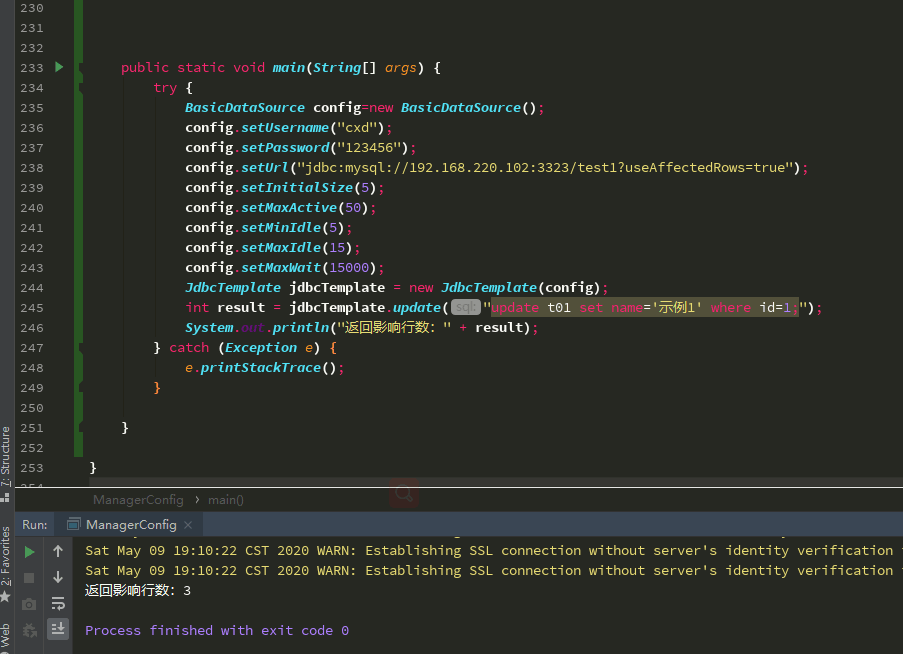

#### clusterElectionTimeoutMs

**参数说明：**

| Property | Value |
|----------|-------|
| 参数值 | clusterElectionTimeoutMs |
| 是否可见 | 否 |
| 参数说明 | 集群选举超时时间(ms) |
| 默认值 | 2000 |
| Reload是否生效 | 是 |
| 最低兼容版本 | 2.5.3 |

**参数设置：**

server.xml中clusterElectionTimeoutMs参数配置 如下配置：

```xml
<property name="clusterElectionTimeoutMs">2000</property><!-- 集群选举超时时间(ms) -->
```

**参数作用：**

该参数用于设置计算节点集群选举超时时间，一般不建议修改，可根据实际网络质量情况进行适度调整。例如将参数clusterElectionTimeoutMs设置为2000ms，则集群中的主计算节点发生故障后，新的候选节点会在超时时间内一直等待选举，直至选举成功或超过2000ms选举失败。

#### clusterHeartbeatTimeoutMs

**参数说明：**

| Property | Value |
|----------|-------|
| 参数值 | clusterHeartbeatTimeoutMs |
| 是否可见 | 否 |
| 参数说明 | 集群心跳超时时间(ms) |
| 默认值 | 5000 |
| Reload是否生效 | 是 |
| 最低兼容版本 | 2.5.3 |

**参数设置：**

server.xml中clusterHeartbeatTimeoutMs参数配置 如下配置：

```xml
<property name="clusterHeartbeatTimeoutMs">5000</property><!-- 集群心跳超时时间(ms) -->
```

**参数作用：**

该参数用于设置计算节点集群心跳超时时间，一般不建议修改，可根据实际网络质量情况进行适度调整。

#### clusterHost

**参数说明：**

| Property | Value |
|----------|-------|
| 参数值 | clusterHost |
| 是否可见 | 是 |
| 参数说明 | 本节点所在IP |
| 默认值 | 192.168.200.1 |
| Reload是否生效 | 否 |
| 最低兼容版本 | 2.5.0 |

**参数设置：**

server.xml中clusterHost参数配置 如下配置：

```xml
<property name="clusterHost">192.168.200.1</property><!-- 本节点所在IP -->
```

**参数作用：**

该参数需设置和实际计算节点所在的IP一致（不能用127.0.0.1代替），集群选举时该计算节点用于与其他计算节点通信的地址。

#### clusterName

**参数说明：**

| Property | Value |
|----------|-------|
| 参数值 | clusterName |
| 是否可见 | 是 |
| 参数说明 | 集群组名称 |
| 默认值 | HotDB-Cluster |
| Reload是否生效 | 否 |
| 最低兼容版本 | 2.5.0 |

**参数设置：**

server.xml中clusterName参数配置 如下配置：

```xml
<property name="clusterName">HotDB-Cluster</property><!-- 集群组名称 -->
```

**参数作用：**

指定集群启动后加入的组名称，同一个集群内的计算节点的该参数必须相同，不同集群的计算节点的该参数必须设置不同。

#### clusterNetwork

**参数说明：**

| Property | Value |
|----------|-------|
| 参数值 | clusterNetwork |
| 是否可见 | 是 |
| 参数说明 | 集群所在网段 |
| 默认值 | 192.168.200.0/24 |
| Reload是否生效 | 否 |
| 最低兼容版本 | 2.5.0 |

**参数设置：**

server.xml中clusterNetwork参数配置 如下配置：

```xml
<property name="clusterNetwork">192.168.200.0/24</property><!-- 集群所在网段 -->
```

**参数作用：**

该参数为整个集群所在的网段，限定集群内的所有计算节点IP必须在该网段内。否则即使集群组相同启动后也不会加入集群。

#### clusterPacketTimeoutMs

**参数说明：**

| Property | Value |
|----------|-------|
| 参数值 | clusterPacketTimeoutMs |
| 是否可见 | 否 |
| 参数说明 | 集群间通讯包失效时间(ms) |
| 默认值 | 5000 |
| Reload是否生效 | 是 |
| 最低兼容版本 | 2.5.3 |

**参数设置：**

server.xml中clusterPacketTimeoutMs参数配置 如下配置：

```xml
<property name="clusterPacketTimeoutMs">5000</property><!-- 集群间通讯包失效时间(ms) -->
```

**参数作用：**

该参数用于设置集群间通讯包失效时间，一般不建议修改，可根据实际网络质量情况进行适度调整。集群间通讯包指在集群正常运行时需要发送的所有点对点的通讯包，包括且不限于心跳、选举、成员变更等数据包。

#### clusterPort

**参数说明：**

| Property | Value |
|----------|-------|
| 参数值 | clusterPort |
| 是否可见 | 是 |
| 参数说明 | 集群通信端口 |
| 默认值 | 3326 |
| Reload是否生效 | 否 |
| 最低兼容版本 | 2.5.0 |

**参数设置：**

server.xml中clusterPort参数配置 如下配置：

```xml
<property name="clusterPort">3326</property><!-- 集群通信端口 -->
```

**参数作用：**

默认值3326，指定监听集群信息的端口。该参数用于集群内通讯，同一集群通信的端口必须相同。

#### clusterSize

**参数说明：**

| Property | Value |
|----------|-------|
| 参数值 | clusterSize |
| 是否可见 | 是 |
| 参数说明 | 集群中节点总数 |
| 默认值 | 3 |
| Reload是否生效 | 否 |
| 最低兼容版本 | 2.5.0 |

**参数设置：**

server.xml中clusterSize参数配置 如下配置：

```xml
<property name="clusterSize">3</property><!-- 集群中节点总数 -->
```

**参数作用：**

该参数为集群内计算节点的总个数，若haMode设置为1（即集群模式），需配置成该集群的实际计算节点数。

#### clusterStartedPacketTimeoutMs

**参数说明：**

| Property | Value |
|----------|-------|
| 参数值 | clusterStartedPacketTimeoutMs |
| 是否可见 | 否 |
| 参数说明 | 集群Started广播包失效时间(ms) |
| 默认值 | 5000 |
| Reload是否生效 | 是 |
| 最低兼容版本 | 2.5.3 |

**参数设置：**

server.xml中clusterStartedPacketTimeoutMs参数配置 如下配置：

```xml
<property name="clusterStartedPacketTimeoutMs">5000</property><!-- 集群Started广播包失效时间(ms) -->
```

**参数作用：**

该参数用于设置集群Started广播包失效时间，一般不建议修改，可根据实际网络质量情况进行适度调整。集群Started广播包是指在集群启动时的一个针对网段广播的包。

#### configMGR & bak1Url & bak1Username & bak1Password

**参数说明：**

| Property | Value |
|----------|-------|
| 参数值 | configMGR |
| 是否可见 | 是 |
| 参数说明 | 配置库是否使用MGR |
| 默认值 | false |
| Reload是否生效 | 是 |
| 最低兼容版本 | 2.5.0 |

| Property | Value |
|----------|-------|
| 参数值 | bak1Url |
| 是否可见 | 是 |
| 参数说明 | MGR配置库地址 |
| 默认值 | 空 |
| Reload是否生效 | 是 |
| 最低兼容版本 | 2.5.0 |

| Property | Value |
|----------|-------|
| 参数值 | bak1Username |
| 是否可见 | 是 |
| 参数说明 | MGR配置库用户名 |
| 默认值 | 空 |
| Reload是否生效 | 是 |
| 最低兼容版本 | 2.5.0 |

| Property | Value |
|----------|-------|
| 参数值 | bak1Password |
| 是否可见 | 是 |
| 参数说明 | MGR配置库密码 |
| 默认值 | 空 |
| Reload是否生效 | 是 |
| 最低兼容版本 | 2.5.0 |

**参数作用：**

configMGR和bak1Url和bak1Username以及bak1Password属于配套参数，用于MGR配置库功能。若使用MGR配置库，则需要设置为对应MGR配置库的信息且保证MGR配置库实例的复制关系正常，且互为MGR，当主配置库发生故障时会自动切换到新的主配置库。MGR配置库最多支持3个。

```xml
<property name="configMGR">true</property> <!-- 配置库是否使用MGR -->
<property name="bak1Url">jdbc:mysql://192.168.210.32:3306/hotdb_config</property> <!-- MGR配置库地址(如配置库使用MGR,必须配置此项)，需指定配置库服务所在的真实IP地址 -->
<property name="bak1Username">hotdb_config</property> <!-- MGR配置库用户名(如配置库使用MGR,必须配置此项) -->
<property name="bak1Password">hotdb_config</property> <!-- MGR配置库密码(如配置库使用MGR,必须配置此项) -->
```

#### crossDbXa

**参数说明：**

| Property | Value |
|----------|-------|
| 参数值 | crossDbXa |
| 是否可见 | 否 |
| 参数说明 | 跨逻辑库是否采用XA事务 |
| 默认值 | false |
| Reload是否生效 | 否 |
| 最低兼容版本 | 2.5.5 |

**参数设置：**

server.xml中crossDbXa参数如下配置：

```xml
<property name="crossDbXa">false</property>
```

**参数作用：**

开启enableXA时，如果存在跨逻辑库查询的XA事务，需要开启crossDbXa才能保证强一致性。当crossDbXa未开启时也可以支持，但不保证数据的强一致，且事务内加入新节点，查询会报错。以下四个场景举例说明：

**数据准备：**

1. 开启XA
2. 逻辑库A，默认节点为1，2；逻辑库B，默认节点为2,3,4
3. 逻辑库A创建表a；逻辑库B创建表b；两张表的表结构一致
4. 表a中插入1000条数据；表b无数据

**场景一、crossDbXa 关闭时，不保证数据强一致：**

1. 开启一个session，执行如下SQL：

```sql
use A;
begin;
insert into B.b select * from A.a;
commit;
use B;
begin;
delete from b;
commit;
```

两个事务反复交替执行，无间隔时间；2. 开启另外一个session，反复执行：

```sql
use A;
select count(*) from B.b;
```

结果：`count (*)`得出的结果不一定全为0或1000


**场景二、crossDbXa 开启时，保证数据强一致：**

1. 开启一个session，执行如下SQL：

```sql
use A;
begin;
insert into B.b select * from A.a;
commit;
use B;
begin;
delete from b;
commit;
```

两个事务反复交替执行，无间隔时间；2. 开启另外一个session，反复执行：

```
use A;
select count(*) from B.b;
```

结果：Count (*)得出的结果为0或1000

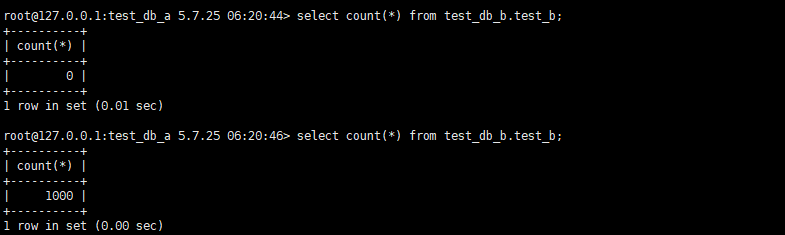

**场景三、crossDbXa 关闭时，事务内加入节点会报错：**

1. 开启一个session，执行如下SQL：

```sql
use A;
begin;
select * from A.a;
select * from B.b;
```

结果：`select * from B.b;`执行会报错


**场景四、crossDbXa 开启时，事务内加入节点正常执行：**

1. 开启一个session，执行如下SQL：

```sql
use A;
begin;
select * from A.a;
select * from B.b;
```

结果：`select * from B.b;`正常执行


#### cryptMandatory

**参数说明：**

| Property | Value |
|----------|-------|
| 参数值 | cryptMandatory |
| 是否可见 | 是 |
| 参数说明 | 是否强制加密密码 |
| 默认值 | False |
| Reload是否生效 | 是 |
| 最低兼容版本 | 2.4.3 |

**参数设置：**

```xml
<property name="cryptMandatory">false</property><!-- 是否强制加密密码，是：true，否：false -->
```

**参数作用：**

用于设置计算节点是否可以读取加密后的存储节点密码。

- True状态：
  - 存储节点密码为明文的时候，计算节点会无法连接该存储节点
  - 存储节点密码为密文的时候，计算节点能够连接该存储节点
- False状态：
  - 存储节点密码为明文的时候，计算节点能够连接该存储节点
  - 存储节点密码为密文的时候，计算节点能够连接该存储节点

#### dataNodeIdleCheckPeriod

**参数说明：**

| Property | Value |
|----------|-------|
| 参数值 | dataNodeIdleCheckPeriod |
| 是否可见 | 是 |
| 参数说明 | 数据节点默认空闲检查时间（秒） |
| 默认值 | 120 |
| 最小值 | 1 |
| 最大值 | 3600 |
| Reload是否生效 | 2.4.5版本为N，2.4.7及以上为Y |
| 最低兼容版本 | 2.4.3 |

**参数设置：**

```xml
<property name="dataNodeIdleCheckPeriod">120</property><!-- 数据节点默认空闲检查时间（秒） -->
```

**参数作用：**

用于设置数据节点空闲检查的定时任务的时间。计算节点会定时检查后端存储节点连接情况，关闭多余的空闲连接或者补足连接池的可用连接，保持连接不被MySQL关闭，维护连接池的正常运作。

例如：在3323服务端口进行大并发的插入操作，在3325管理端口执行Show @@backend监控后端连接数量，大并发操作执行完毕以后，当计算节点检测到数据节点有超过配置数量的处于空闲的后端连接，计算节点会去清理掉这些连接。

#### deadlockCheckPeriod

**参数说明：**

| Property | Value |
|----------|-------|
| 参数值 | deadlockCheckPeriod |
| 是否可见 | 是 |
| 参数说明 | 死锁检测周期（毫秒），0代表不启用 |
| 默认值 | 3000 |
| 最小值 | 0 |
| 最大值 | 100000 |
| Reload是否生效 | 2.4.5版本为N，>2.4.7及以上为Y |
| 最低兼容版本 | 2.4.3 |

**参数作用：**

开启死锁检测时，会根据设置的周期定时检测跨库死锁。如果发现跨库死锁，会杀掉其中trx_weight最小的事务。

```
mysql> select * from autoi where id=4 for update;

ERROR 1213 (HY000): Deadlock found when trying to get lock; try restarting transaction
```

不开启死锁检测，发生死锁时会一直等待到锁超时，锁超时时间依据MySQL存储节点中的innodb_lock_wait_timeout参数值。

```
mysql> select * from autoi where id=10 for update;

ERROR 1205 (HY000): Lock wait timeout exceeded; try restarting transaction
```

#### defaultMaxLimit

**参数说明：**

| Property | Value |
|----------|-------|
| 参数值 | defaultMaxLimit |
| 是否可见 | 否 |
| 参数说明 | 默认最大有序数量 |
| 默认值 | 10000 |
| 最小值 | 1 |
| 最大值 | 10000000 |
| Reload是否生效 | 是 |
| 最低兼容版本 | 2.4.3 |

server.xml中defaultMaxLimit参数配置 如下配置：

```xml
<property name="defaultMaxLimit">10000</property><!--默认最大有序数量-->
```

**参数作用：**

此参数为HotDB过载保护相关参数，与highCostSqlConcurrency参数配套使用。当前端并发执行跨库update/delete limit n场景时，若n超过defaultMaxLimit设置时，就会触发highCostSqlConcurrency参数控制，限制高内存消耗语句并发数量，相关连接会被hold住，等待前面执行完后，才能执行下一批。

体现在show processlist中State为Flow control，等待下一批执行。下图为方便测试，设置defaultMaxLimit=5，highCostSqlConcurrency=10，采用20并发执行跨库update limit n场景，可见10个连接在执行，另外的10个连接已经被限制。

```
mysql> show processlist;
+----+------+-------------------+----+---------+------+--------------+-------------------------------------------------------------------+
| Id | User | Host              | db | Command | Time | State        | Info                                                              |
+----+------+-------------------+----+---------+------+--------------+-------------------------------------------------------------------+
| 4  | ztm  | 10.10.0.201:57882 | PM | Query   | 0    | executing    | show processlist                                                  |
| 6  | ztm  | 10.10.0.201:57905 | PM | Query   | 1    | Sending data | UPDATE customer_route_1 SET address = 'abcd' order by id LIMIT 20 |
| 7  | ztm  | 10.10.0.201:57902 | PM | Query   | 1    | Flow control | UPDATE customer_route_1 SET address = 'abcd' order by id LIMIT 20 |
| 8  | ztm  | 10.10.0.201:57912 | PM | Query   | 1    | Sending data | UPDATE customer_route_1 SET address = 'abcd' order by id LIMIT 20 |
| 9  | ztm  | 10.10.0.201:57900 | PM | Query   | 1    | Sending data | UPDATE customer_route_1 SET address = 'abcd' order by id LIMIT 20 |
| 10 | ztm  | 10.10.0.201:57919 | PM | Query   | 1    | Sending data | UPDATE customer_route_1 SET address = 'abcd' order by id LIMIT 20 |
| 11 | ztm  | 10.10.0.201:57911 | PM | Query   | 1    | Sending data | UPDATE customer_route_1 SET address = 'abcd' order by id LIMIT 20 |
| 12 | ztm  | 10.10.0.201:57904 | PM | Query   | 1    | Flow control | UPDATE customer_route_1 SET address = 'abcd' order by id LIMIT 20 |
| 13 | ztm  | 10.10.0.201:57906 | PM | Query   | 1    | Flow control | UPDATE customer_route_1 SET address = 'abcd' order by id LIMIT 20 |
| 14 | ztm  | 10.10.0.201:57903 | PM | Query   | 1    | Sending data | UPDATE customer_route_1 SET address = 'abcd' order by id LIMIT 20 |
| 15 | ztm  | 10.10.0.201:57910 | PM | Query   | 1    | Flow control | UPDATE customer_route_1 SET address = 'abcd' order by id LIMIT 20 |
| 16 | ztm  | 10.10.0.201:57908 | PM | Query   | 1    | Flow control | UPDATE customer_route_1 SET address = 'abcd' order by id LIMIT 20 |
| 17 | ztm  | 10.10.0.201:57920 | PM | Query   | 1    | Flow control | UPDATE customer_route_1 SET address = 'abcd' order by id LIMIT 20 |
| 18 | ztm  | 10.10.0.201:57907 | PM | Query   | 1    | Sending data | UPDATE customer_route_1 SET address = 'abcd' order by id LIMIT 20 |
| 19 | ztm  | 10.10.0.201:57913 | PM | Query   | 1    | Flow control | UPDATE customer_route_1 SET address = 'abcd' order by id LIMIT 20 |
| 20 | ztm  | 10.10.0.201:57909 | PM | Query   | 1    | Flow control | UPDATE customer_route_1 SET address = 'abcd' order by id LIMIT 20 |
| 21 | ztm  | 10.10.0.201:57921 | PM | Query   | 1    | Sending data | UPDATE customer_route_1 SET address = 'abcd' order by id LIMIT 20 |
| 22 | ztm  | 10.10.0.201:57918 | PM | Query   | 1    | Sending data | UPDATE customer_route_1 SET address = 'abcd' order by id LIMIT 20 |
| 23 | ztm  | 10.10.0.201:57962 | PM | Query   | 1    | Flow control | UPDATE customer_route_1 SET address = 'abcd' order by id LIMIT 20 |
| 24 | ztm  | 10.10.0.201:57915 | PM | Query   | 1    | Flow control | UPDATE customer_route_1 SET address = 'abcd' order by id LIMIT 20 |
| 25 | ztm  | 10.10.0.201:57914 | PM | Query   | 1    | Sending data | UPDATE customer_route_1 SET address = 'abcd' order by id LIMIT 20 |
+----+------+-------------------+----+---------+------+--------------+-------------------------------------------------------------------+
21 rows in set (0.01 sec)
```

#### dropTableRetentionTime

**参数说明：**

| Property | Value |
|----------|-------|
| 参数值 | dropTableRetentionTime |
| 是否可见 | 是 |
| 参数说明 | 被删除表保留时长,默认为0,不保留 |
| 默认值 | 0（小时） |
| 最小值 | 0 |
| 最大值 | 87600 |
| Reload是否生效 | 是 |
| 最低兼容版本 | 2.5.2 |

**参数设置：**

server.xml中dropTableRetentionTime参数配置：

```xml
<property name=" dropTableRetentionTime">0</property><!--被删除表保留时长,默认为0,不保留-->
```

**参数作用：**

2.5.5，dropTableRetentionTime参数默认为0，表示不保留被DROP的表，执行DROP TABLE语句将立即删除表；dropTableRetentionTime大于0时，单位以小时计算，保留被DROP的表到设置时长，超过设置时长后自动删除被保留的表。例如dropTableRetentionTime=24表示保留被DROP的表，24小时后再删除被保留的表。

#### drBakUrl & drBakUsername & drBakPassword

**参数说明：**

| Property | Value |
|----------|-------|
| 参数值 | drBakUrl |
| 是否可见 | 是 |
| 参数说明 | 灾备机房从配置库地址 |
| 默认值 | jdbc:mysql://127.0.0.1:3306/hotdb_config |
| Reload是否生效 | 是 |
| 最低兼容版本 | 2.5.3.1 |

| Property | Value |
|----------|-------|
| 参数值 | drBakUsername |
| 是否可见 | 是 |
| 参数说明 | 灾备机房从配置库用户名 |
| 默认值 | hotdb_config |
| Reload是否生效 | 是 |
| 最低兼容版本 | 2.5.3.1 |

| Property | Value |
|----------|-------|
| 参数值 | drBakPassword |
| 是否可见 | 是 |
| 参数说明 | 灾备机房从配置库密码 |
| 默认值 | hotdb_config |
| Reload是否生效 | 是 |
| 最低兼容版本 | 2.5.3.1 |

**参数作用：**

drBakUrl和drBakUsername以及drBakPassword属于配套参数，用于灾备机房配置库高可用功能。当灾备机房切换为当前主机房时，若使用配置库高可用，则需要设置为对应从配置库的信息且保证主从配置库实例的复制关系正常，且互为主备。当灾备机房切换为当前主机房时，主配置库发生故障时会自动切换到从配置库，此时配置库的高可用切换可参考中心机房从配置库参数[bakUrl & bakUsername & bakPassword](#bakUrl-bakUsername-bakPassword)的描述。

```xml
<property name="drBakUrl">jdbc:mysql://192.168.240.77:3316/hotdb_config</property><!-- 灾备机房从配置库地址 -->
<property name="drBakUsername">hotdb_config</property><!-- 灾备机房从配置库用户名 -->
<property name="drBakPassword">hotdb_config</property><!-- 灾备机房从配置库密码 -->
```

#### drUrl & drUsername & drPassword

**参数说明：**

| Property | Value |
|----------|-------|
| 参数值 | drUrl |
| 是否可见 | 是 |
| 参数说明 | 灾备机房配置库地址 |
| 默认值 | jdbc:mysql://127.0.0.1:3306/hotdb_config |
| Reload是否生效 | 是 |
| 最低兼容版本 | 2.5.3.1 |

| Property | Value |
|----------|-------|
| 参数值 | drUsername |
| 是否可见 | 是 |
| 参数说明 | 灾备机房配置库用户名 |
| 默认值 | hotdb_config |
| Reload是否生效 | 是 |
| 最低兼容版本 | 2.5.3.1 |

| Property | Value |
|----------|-------|
| 参数值 | drPassword |
| 是否可见 | 是 |
| 参数说明 | 灾备机房配置库密码 |
| 默认值 | hotdb_config |
| Reload是否生效 | 是 |
| 最低兼容版本 | 2.5.3.1 |

**参数作用：**

drUrl,drUsername,drPassword属于配套参数，,drUrl是指灾备机房计算节点配置信息的配置库路径，drUsername,drPassword是指连接该物理库的用户名密码，该配置库用于存储灾备机房配置信息。可参考与中心机房配置库相关参数[url & username & password](#url-username-password)。

```xml
<property name="drUrl">jdbc:mysql://192.168.240.76:3316/hotdb_config</property><!-- 灾备机房配置库地址 -->
<property name="drUsername">hotdb_config</property><!-- 灾备机房配置库用户名 -->
<property name="drPassword">hotdb_config</property><!-- 灾备机房配置库密码 -->
```

#### enableCursor

**参数说明：**

| Property | Value |
|----------|-------|
| 参数值 | enableCursor |
| 是否可见 | 是 |
| 参数说明 | 是否允许PREPARE语句通过CURSOR获取数据 |
| 默认值 | false |
| Reload是否生效 | 是 |
| 最低兼容版本 | 2.4.6 |

**参数设置：**

server.xml的enableCursor参数：

```xml
<property name="enableCursor">false</property>
```

**参数作用：**

是否允许PREPARE通过游标获取数据内容(jdbcURl:useCursorFetch=true)。

#### enableFlowControl

**参数说明：**

| Property | Value |
|----------|-------|
| 参数值 | enableFlowControl |
| 是否可见 | 是 |
| 参数说明 | 是否开启存储节点流控 |
| 默认值 | False |
| Reload是否生效 | 2.4.5版本为N，2.4.7及以上为Y |
| 最低兼容版本 | 2.4.5 |

**参数作用：**

在2.4.8版本以后默认开启，开启后将智能控制后端流量，可以控制存储节点的压力，使存储节点在最佳状态下运行。通过管理端show @@datasource查看流控状态flow_control。

```
mysql> show @@datasource;

+----+----+-----------------------+------+--------+-------------+------+--------------+--------+------+------+--------------------+--------------+--------+-------------+-----------------+
| dn | ds | name                  | type | status | host        | port | schema       | active | idle | size | unavailable_reason | flow_control | idc_id | listener_id | listener_status |
+----+----+-----------------------+------+--------+-------------+------+--------------+--------+------+------+--------------------+--------------+--------+-------------+-----------------+
| 17 | 17 | 10.10.0.140_3313_db01 | 1    | 1      | 10.10.0.140 | 3313 | db01         | 0      | 45   | 45   | NULL               | 0/64         | 1      | 8           | 1               |
| 16 | 16 | 10.10.0.140_3312_db01 | 1    | 1      | 10.10.0.140 | 3312 | db01         | 0      | 47   | 47   | NULL               | 0/64         | 1      | 7           | 1               |
| 19 | 19 | 10.10.0.155_3311_db01 | 1    | 1      | 10.10.0.155 | 3311 | db01         | 0      | 49   | 49   | NULL               | 0/64         | 1      | 10          | 1               |
| 18 | 18 | 10.10.0.155_3310_db01 | 1    | 1      | 10.10.0.155 | 3310 | db01         | 0      | 53   | 53   | NULL               | 0/64         | 1      | 9           | 1               |
| 21 | 21 | 10.10.0.155_3313_db01 | 1    | 1      | 10.10.0.155 | 3313 | db01         | 0      | 55   | 55   | NULL               | 0/64         | 1      | 12          | 1               |
| 20 | 20 | 10.10.0.155_3312_db01 | 1    | 1      | 10.10.0.155 | 3312 | db01         | 0      | 47   | 47   | NULL               | 0/64         | 1      | 11          | 1               |
| 10 | 10 | 10.10.0.125_3310_db01 | 1    | 1      | 10.10.0.125 | 3310 | db01         | 0      | 44   | 44   | NULL               | 0/64         | 1      | 1           | 1               |
| 11 | 11 | 10.10.0.125_3311_db01 | 1    | 1      | 10.10.0.125 | 3311 | db01         | 0      | 43   | 43   | NULL               | 0/64         | 1      | 2           | 1               |
| 12 | 12 | 10.10.0.125_3312_db01 | 1    | 1      | 10.10.0.125 | 3312 | db01         | 0      | 44   | 44   | NULL               | 0/64         | 1      | 3           | 1               |
| 13 | 13 | 10.10.0.125_3313_db01 | 1    | 1      | 10.10.0.125 | 3313 | db01         | 0      | 48   | 48   | NULL               | 0/64         | 1      | 4           | 1               |
| 14 | 14 | 10.10.0.140_3310_db01 | 1    | 1      | 10.10.0.140 | 3310 | db01         | 0      | 44   | 44   | NULL               | 0/64         | 1      | 5           | 1               |
| 15 | 15 | 10.10.0.140_3311_db01 | 1    | 1      | 10.10.0.140 | 3311 | db01         | 0      | 62   | 62   | NULL               | 0/64         | 1      | 6           | 1               |
| -1 | -1 | configDatasource      | 1    | 1      | 10.10.0.121 | 3306 | hotdb_config | 1      | 11   | 12   | NULL               | N/A          | -1     | 0           | 1               |
+----+----+-----------------------+------+--------+-------------+------+--------------+--------+------+------+--------------------+--------------+--------+-------------+-----------------+
```

> !Note
>
> 存储节点流控是计算节点内部控制算法。

#### enableHeartbeat&heartbeatPeriod& heartbeatTimeoutMs

**参数说明：**

| Property | Value |
|----------|-------|
| 参数值 | enableHeartbeat |
| 是否可见 | 是 |
| 参数说明 | 是否启用心跳，是：true，否：false |
| 默认值 | true |
| Reload是否生效 | 2.4.5版本为N，2.4.7及以上为Y |
| 最低兼容版本 | 2.4.3 |

| Property | Value |
|----------|-------|
| 参数值 | heartbeatPeriod |
| 是否可见 | 是 |
| 参数说明 | 心跳周期（秒） |
| 默认值 | 2 |
| 最大值 | 60 |
| 最小值 | 1 |
| Reload是否生效 | 2.4.5版本为N，2.4.7及以上为Y |
| 最低兼容版本 | 2.4.3 |

| Property | Value |
|----------|-------|
| 参数值 | heartbeatTimeoutMs |
| 是否可见 | 是 |
| 参数说明 | 心跳超时时间（毫秒） |
| 默认值 | 500 |
| 最大值 | 10000 |
| 最小值 | 100 |
| Reload是否生效 | 2.4.5版本为N，2.4.7及以上为Y |
| 最低兼容版本 | 2.4.3 |

enableHeartbeat设置是否启用心跳检测。heartbeatPeriod设置心跳检测周期，默认值为2s，即心跳定时检测每2秒执行一次。heartbeatTimeoutMs设置心跳超时时间，默认值为500ms。

**参数作用：**

检测存储节点是否可用及是否存在共用的情况。

启用心跳检测后，会根据心跳检测周期去检测存储节点是否正常。当网络不可达或存储节点故障时，存在备存储节点且配置了切换规则的情况下，会切换到备存储节点，主存储节点会被置为不可用；存储节点切换逻辑请参考[管理平台](hotdb-management.md)文档。

当一个存储节点同时被多个计算节点服务使用时，计算节点通过日志提示：there's another HotDB using this datasource...restart heartbeat. 不启用心跳检测的情况下，则数据节点/配置库高可用无法实现，无法进行故障切换，无法检测出存储节点共用等情况。

心跳超时时间：心跳开启的情况下，出现存储节点故障或心跳操作执行过慢超出阈值，会有日志heartbeat time out输出:

```
2018-05-29 16:32:52.924 [WARN] [HEARTBEAT] [HeartbeatTimer] a(-1) -- Datasource:-1 128.0.0.1:3306/hotdb_config time out! Last packet sent at:2018-05-29 04:32:49:886...省略...
```

> !Note
>
> 若当前存储节点为数据节点最后一个存储节点，存储节点不会置为不可用。且会尝试一直连接；若为纯备存储节点，即使心跳失败次数已经超过阈值，只要心跳检测时能够连接存储节点成功就不标记为不可用。

#### enableLatencyCheck & latencyCheckPeriod

**参数说明：**

| Property | Value |
|----------|-------|
| 参数值 | enableLatencyCheck |
| 是否可见 | 是 |
| 参数说明 | 是否开启主从延迟检测 |
| 默认值 | true |
| Reload是否生效 | 2.4.5版本为N，2.4.7及以上为Y |
| 最低兼容版本 | 2.4.5 |

| Property | Value |
|----------|-------|
| 参数值 | latencyCheckPeriod |
| 是否可见 | 是 |
| 参数说明 | 主从延迟检测周期(ms) |
| 默认值 | 500 |
| 最大值 | 1000 |
| 最小值 | 100 |
| Reload是否生效 | 2.4.5版本为N，2.4.7及以上为Y |
| 最低兼容版本 | 2.4.5 |

设置主从延迟检测周期，默认值为500ms，即定时检测每500ms秒执行一次主从延迟检测。

**参数作用：**

延迟检测依赖于心跳表。启用主从延迟检测，检测从库是否存在复制延迟，是否同步追上复制。此参数在存储节点/配置库切换时、计算节点启动时具有一定影响作用，例如，在存储节点故障切换之前要进行主从延迟校验（前提是需要配置故障切换规则，若没有配置切换规则，则不会进行主备存储节点之间的切换以及主从延迟校验），请参考[管理平台](hotdb-management.md)文档。

登录管理端口，使用show @@latency; 可以查看主从延迟时间。

```
mysql> show @@latency;
+-----+----------------------------+----------------------------+---------+
| dn  | info                       | backup_info                | latency |
+-----+----------------------------+----------------------------+---------+
| 186 | 192.168.210.68:3307/db252  | 192.168.210.68:3308/db252  | 501 ms  |
| 4   | 192.168.210.43:3308/db252  | 192.168.210.44:3308/db252  | 0 ms    |
| 190 | 192.168.200.191:3307/db252 | 192.168.200.190:3307/db252 | 0 ms    |
| 191 | 192.168.200.191:3308/db252 | 192.168.200.190:3308/db252 | 0 ms    |
| 127 | 192.168.210.41:3308/db252  | 192.168.210.42:3308/db252  | STOPPED |
+-----+----------------------------+----------------------------+---------+
5 rows in set (0.02 sec)
```

#### enableListener

**参数说明：**

| Property | Value |
|----------|-------|
| 参数值 | enableListener |
| 是否可见 | 是 |
| 参数说明 | 启用Listener模式 |
| 默认值 | false |
| Reload是否生效 | 是 |
| 最低兼容版本 | 2.5.5 |

**参数设置：**

```xml
<property name="enableListener">false</property><!--启用Listener模式(Enable Listener mode or not)-->
```

**参数作用：**

HotDB Listener是计算节点一个可拔插组件，开启后可解决集群强一致模式下的性能线性扩展问题。要使用Listener需满足：计算节点是多节点集群模式并开启XA、在存储节点服务器上成功部署Listener并启用enableListener参数。执行动态加载，在计算节点管理端执行以下命令可通过listener_status一列查看是否识别成功以及Listener的实时状态。

```
mysql> show @@datasource;
+----+----+-----------------------+------+--------+-------------+------+--------------+--------+------+------+--------------------+--------------+--------+-------------+-----------------+
| dn | ds | name                  | type | status | host        | port | schema       | active | idle | size | unavailable_reason | flow_control | idc_id | listener_id | listener_status |
+----+----+-----------------------+------+--------+-------------+------+--------------+--------+------+------+--------------------+--------------+--------+-------------+-----------------+
| 17 | 17 | 10.10.0.140_3313_db01 | 1    | 1      | 10.10.0.140 | 3313 | db01         | 0      | 45   | 45   | NULL               | 0/64         | 1      | 8           | 1               |
| 16 | 16 | 10.10.0.140_3312_db01 | 1    | 1      | 10.10.0.140 | 3312 | db01         | 0      | 47   | 47   | NULL               | 0/64         | 1      | 7           | 1               |
| 19 | 19 | 10.10.0.155_3311_db01 | 1    | 1      | 10.10.0.155 | 3311 | db01         | 0      | 49   | 49   | NULL               | 0/64         | 1      | 10          | 1               |
| 18 | 18 | 10.10.0.155_3310_db01 | 1    | 1      | 10.10.0.155 | 3310 | db01         | 0      | 53   | 53   | NULL               | 0/64         | 1      | 9           | 1               |
| 21 | 21 | 10.10.0.155_3313_db01 | 1    | 1      | 10.10.0.155 | 3313 | db01         | 0      | 55   | 55   | NULL               | 0/64         | 1      | 12          | 1               |
| 20 | 20 | 10.10.0.155_3312_db01 | 1    | 1      | 10.10.0.155 | 3312 | db01         | 0      | 47   | 47   | NULL               | 0/64         | 1      | 11          | 1               |
| 10 | 10 | 10.10.0.125_3310_db01 | 1    | 1      | 10.10.0.125 | 3310 | db01         | 0      | 44   | 44   | NULL               | 0/64         | 1      | 1           | 1               |
| 11 | 11 | 10.10.0.125_3311_db01 | 1    | 1      | 10.10.0.125 | 3311 | db01         | 0      | 43   | 43   | NULL               | 0/64         | 1      | 2           | 1               |
| 12 | 12 | 10.10.0.125_3312_db01 | 1    | 1      | 10.10.0.125 | 3312 | db01         | 0      | 44   | 44   | NULL               | 0/64         | 1      | 3           | 1               |
| 13 | 13 | 10.10.0.125_3313_db01 | 1    | 1      | 10.10.0.125 | 3313 | db01         | 0      | 48   | 48   | NULL               | 0/64         | 1      | 4           | 1               |
| 14 | 14 | 10.10.0.140_3310_db01 | 1    | 1      | 10.10.0.140 | 3310 | db01         | 0      | 44   | 44   | NULL               | 0/64         | 1      | 5           | 1               |
| 15 | 15 | 10.10.0.140_3311_db01 | 1    | 1      | 10.10.0.140 | 3311 | db01         | 0      | 62   | 62   | NULL               | 0/64         | 1      | 6           | 1               |
| -1 | -1 | configDatasource      | 1    | 1      | 10.10.0.121 | 3306 | hotdb_config | 1      | 11   | 12   | NULL               | N/A          | -1     | 0           | 1               |
+----+----+-----------------------+------+--------+-------------+------+--------------+--------+------+------+--------------------+--------------+--------+-------------+-----------------+
13 rows in set (0.00 sec)
```

> !Note
>
> listener_status为1，代表Listener可用；listener_status为0，代表Listener不可用

注意事项及其他配套使用方法可参考[线性扩展](#线性扩展)章节的描述。

#### enableOracleFunction

**参数说明：**

| Property | Value |
|----------|-------|
| 参数值 | enableOracleFunction |
| 是否可见 | 否 |
| 参数说明 | 是否优先解析oracle函数 |
| 默认值 | false |
| 最大值 | / |
| 最小值 | / |
| Reload是否生效 | 是 |
| 最低兼容版本 | 2.5.6 |

**参数设置**

enableOracleFunction属隐藏参数，若要开启，需添加到server.xml中。参数默认值false，如下配置：

```xml
<property name="enableOracleFunction">false</property><!-- 是否优先解析oracle函数(support oracle function or not) -->
```

**参数作用：**

当Oracle数据迁移至MySQL时，替换部分函数使其能执行成功，降低迁移成本。同时支持Oracle的sequence对象及其相关功能。当该参数开启时优先按Oracle模式进行解析处理，不开启则按MySQL模式解析处理Oracle支持而MySQL不支持的函数，部分支持改写。若需要了解计算节点支持改写的函数，可参考《HotDB Server最新功能清单》。

设置为true时，Oracle函数解析识别支持改写，执行成功。示例：

```
mysql> select to_char(sysdate,'yyyy-MM-dd HH24:mi:ss') from dual;
+------------------------------------------+
| to_char(sysdate,'yyyy-MM-dd HH24:mi:ss') |
+------------------------------------------+
| 2020-09-24 17:09:30                      |
+------------------------------------------+
1 row in set (0.01 sec)
```

设置为false时，对于MySQL不支持的函数报不支持或函数不存在

```
mysql> select to_char(sysdate,'yyyy-MM-dd HH24:mi:ss') from dual;

ERROR 1305 (42000): FUNCTION db256_01.TO_CHAR does not exist
```

Sequence相关功能亦可参考《HotDB Server最新功能清单》

设置为true时，sequence相关能执行成功。示例：

```
mysql> create sequence sequence_test
    -> minvalue 1
    -> maxvalue 1000
    -> start with 1
    -> increment by 10;
```

Query OK, 1 row affected (0.04 sec)

设置为false时，当前是提示语法错误：

```
mysql> create sequence sequence_256
    -> minvalue 1
    -> maxvalue 1000
    -> start with 1
    -> increment by 10;
ERROR 10010 (HY000): expect VIEW. lexer state: token=IDENTIFIER, sqlLeft=sequence_256
```

#### enableSleep

**参数说明：**

| Property | Value |
|----------|-------|
| 参数值 | enableSleep |
| 是否可见 | 是 |
| 参数说明 | 是否允许SLEEP函数 |
| 默认值 | false |
| Reload是否生效 | 是 |
| 最低兼容版本 | 2.4.3 |

**参数设置：**

```xml
<property name="enableSleep">false</property><!-- 是否允许SLEEP函数，是：true，否：false -->
```

**参数作用：**

用于设置计算节点是否允许sleep函数执行。

不允许sleep 函数：

```
mysql> select sleep(2);

ERROR 1064 (HY000): forbidden function:SLEEP, go check your config file to enable it.
```

允许执行sleep 函数:

```
mysql> select sleep(2);
+----------+
| sleep(2) |
+----------+
| 0        |
+----------+
1 row in set (2.00 sec)
```

#### enableSSL

**参数说明：**

| Property | Value |
|----------|-------|
| 参数值 | enableSSL |
| 是否可见 | 是 |
| 参数说明 | 是否开启SSL连接功能 |
| 默认值 | false |
| Reload是否生效 | 是 |
| 最低兼容版本 | 2.5.5 |

**参数设置：**

```xml
<property name="enableSSL">false</property><!-- 是否开启SSL连接功能，是：true，否：false -->
```

**参数作用：**

用于设置计算节点是否允许使用SSL安全认证方式连接，具体可参考[TLS连接登录](#tls连接登录)章节描述，并配合keyStore、keyStorePass参数一起使用。

#### enableSubquery

**参数说明：**

| Property | Value |
|----------|-------|
| 参数值 | enableSubquery |
| 是否可见 | 否 |
| 参数说明 | 是否允许特殊场景下的子查询通过 |
| 默认值 | true |
| Reload是否生效 | 是 |
| 最低兼容版本 | 2.4.3 |

**参数作用：**

是否允许子查询里的表为分片表，在2.4.7版本之后，该参数默认开启，且可以支持更多场景下的子查询。在此之前的版本，开启这个参数并不保证子查询的结果准确性。

当设置为false时，即表示不允许子查询里面的表是分片表，会有如下提示：

```
mysql> select * from test3 where id in (select id from test31);

ERROR 1064 (HY000): Unsupported table type in subquery.
```

当设置为true时，表示支持子查询里面的表是分片表。

```
mysql> select * from test3 where id in (select id from test31);
+----+---------+
| id | name    |
+----+---------+
| 5  | dfff56f |
| 7  | aa78bca |
| 15 | dfff56f |
...省略更多...
```

#### enableWatchdog

**参数说明：**

| Property | Value |
|----------|-------|
| 参数值 | enableWatchdog |
| 是否可见 | 是 |
| 参数说明 | 是否开启Watchdog |
| 默认值 | False |
| Reload是否生效 | 2.4.5版本为N，2.4.7及以上为Y |
| 最低兼容版本 | 2.4.5 |

**参数设置：**

```xml
<property name="enableWatchdog">true</property><!-- 是否开启Watchdog -->
```

**参数作用：**

用于检测计算节点前端连接、后端连接池的异常连接及其他异常状态，检测异常后记录日志并终止连接。

可以通过`tail -f hotdb.log|grep "watchdog"`查看日志是否已经开启：

```log
2018-06-01 18:26:50.983 [WARN] [WATCHDOG] [$NIOREACTOR-7-RW] watchdogTableCheckHandler(78) - Table TABLEB not found in watchdog table structure check in HotOB memory, but was found in MySQLConnection [node=i, id=18, threadId=199616, state=running, closed=false, autocommit=true, host=192.168.200.5q, port=3308, database=db249, localPort=51691, isClose:false, toBeclose:false]. You may need to contact HotDB administrator to get help.
2018-06-01 18:26:50.986 [WARN] [WATCHDOG] [$NIOREACTOR-7-RW] watchdogTableCheckHandler(78) - Table TESTB not found in watchdog table structure check in HotOB memory, but was found in MySQLConnection [node=i, id=18, threadId=199616, state=running, closed=false, autocommit=true, host=192.168.200.5q, port=3308, database=db249, localPort=51691, isClose:false, toBeclose:false]. You may need to contact HotDB administrator to get help.
2018-06-01 18:26:50.988 [WARN] [WATCHDOG] [$NIOREACTOR-7-RW] watchdogTableCheckHandler(78) - Table JOIN_DN02 not found in watchdog table structure check in HotOB memory, but was found in MySQLConnection [node=i, id=18, threadId=199616, state=running, closed=false, autocommit=true, host=192.168.200.5q, port=3308, database=db249, localPort=51691, isClose:false, toBeclose:false]. You may need to contact HotDB administrator to get help.
...省略更多...
```

可以通过日志查看表结构与内存中不一致检测信息：

```log
2018-10-3118:46:44.834 [WARN] [WATCHDOG] [$NIOREACTOR-0-RW] WatchdogTableCheckHandler(85) - Table CCC is inconsistent in watchdog table structure check between HotDB memory and MySQL: MySQLConnection [node=20, id=299, threadId=3748, state=running, closed=false, autocommit=true, host=192.168.210.41. port=3310, database=rmb0l, localPort=58808, isClose:false, toBeClose:false]. You may need to contact HOtDB administrator to get help.
```

可以通过日志查看配置库与内存中不一致检测信息：

```log
2018-10-31 17:45:39.617 [INFO] [WATCHDOG] [Watchdog] WatchDog(500) -- HotDB user config is inconsistent between config database and HotDB memory, Logic tables are not the same in FUN_RMB. you may need to reload HotDB config to bring into effect.
```

可以通过日志查看超过24小时未提交的事务检测信息：

```log
2018-10-26 16:14:55.787 [INFO] [WATCHDOG] [$NIOREACTOR-0-RW] WatchDogLongTransactionCheckHandler(123) - Session [thread=Thread-5,id=1720,user=rmb,host=192.168.200.3,port=3323,localport=54330,schema=FUNTEST_RMB] has not been queryed for 839s. executed IUD5:[INSERT INTO rmb_cbc VALUES (tuanjian, 4000)]. binded connection:[MySQLConnection [node=11, id=1330, threadld=18085, state=borrowed, closed=false, autocommit=false, host=192.168.210.42, port=3307, database=db251, localPort=15722, isCiose:false, toBeClose:false] lastSQL:INSERT INTO rmb_cbc VALUES (tuanjian, 4000)]. innodb_trx:[(ds:11 trx_id:25765462 trx_state:RUNNING trx_started:2018-10-26 16:00:56 trx_requested_lock_id:NULL trx_wait_started:NULL trx_weight:2 trx_mysql._thread_id:18085 trx_query:NULL trx_operation_state:NULL trx_tables_in_use:0 trx_tables_locked:1 trx_lock_structs:1 trx_lock_memory_bytes:1136 trx_rows_locked:0 trx_rows_modified:1 trx_concurrency_tickets:0 trx_isolation_level:REPEATABLE READ trx_unique_checks:1 trx_foreign_key_checks:1 trx_last_foreign_key_error:NULL trx_adaptive_hash_latched:0 trx_adaptive_hash_timeout:0 trx_is_read_only:0 trx_autocommit_non_locking:0 )]. we will close this session now.
```

可以通过日志查看存储节点切换检测信息：

```log
2018-10-26 19:29:01.146 [INFO] [MANAGER] [Labor-478] HotdbConfig(2164) - reload config successfully for connection:[thread=Labor-478,id=1609,user=root,host=192.168.200.2,port=3325,localport=57440.schema=null]
2018-10-26 19:30:24.384 [INFO] [FAILOVER] [$NlOExecutor-7-2] SwitchDataSource(111) - received switch datasource 24 command from Manager: [thread=$NIOExecutor-7-2,id=1609,user=root,host=192.168.200.2,port=3325,localport=57440,schema=null]
2018-10-26 19:30:24.387 [WARN] [RESPONSE] [Labor-484] InitSequenceHandler(270) - FUN_RMB.BC's sequence in Backup datasource: 25 is greater than current sequence
2018-10-26 19:30:24.387 [WARN] [RESPONSE] [Labor-474] InitSequenceHandler(270) - FUN_RMB.CBC's sequence in Backup datasource: 25 is greater than current sequence
2018-10-26 19:30:24.387 [WARN] [RESPONSE] [Labor-484] InitSequenceHandler(270) • FUN_RMB.BC's sequence in Backup datasource: 25 is greater than current sequence
2018-10-26 19:30:24.387 [WARN] [RESPONSE] [Labor-474] InitSequenceHandler(270) - FUN_RMB.CBC's sequence in Backup datasource: 25 is greater than current sequence
2018-10-26 19:30:24.407 [INFO] [FAILOVER] [Labor-464] CheckSlaveHandler(852) - DN:20(dn_rmb_01) switch datasource 24(192.168.210.41_3310_rmbol)->25(192.168.210.42_3310_rmb0l). current slave status:Slave_IO_State:Waiting for master to send event Master_Host:192.168.210.41 Master_User:hotdb_datasource Master_Port:3310 Connect_Retry:60 Master_Log_File:mysql-bin.000002 Read_Master_Log_Pos:3871570 Relay_Log_File:mysql-relay-bin.000006 Relay_Log_Pos:3871783 Relay_Master_Log_File:mysql-bin.000002 Slave_IO_Running:Yes Slave_SQL_Running:Yes Replicate_Do_DB: Replicate_Ignore_DB: Replicate_Do_Table: Replicate_Ignore_Table: Replicate_Wild_Do_Table: Replicate_Wild_Ignore_Table: Last_Errno:0 Last_Error: Skip_Counter:0 Exec_Master_Log_Pos:3871570 Relay_Log_Space:5058376 Until_Condition:None Until_Log_File: Until_Log_Pos:0 Master_SSL_Allowed:No Master_SSL_CA_File: Master_SSL_CA_Path: Master_SSL_Cert: Master_SSL_Cipher: Master_SSL_Key: Seconds_Behind_Master:0 Master_SSL_Verify_Server_Cert:No Last_IO_Errno:0 Last_IO_Error: Last_SQL_Errno:0 Last_SQL_Error: Replicate_Ignore_Server_Ids: Master_Server_Id:210413310 Master_UUID:919cbf03-9f2d-11e8-b8af-525400636cd2 Master_Info_File:mysql.slave_master_info SQL_Delay:0 SQL_Remaining_Delay:NULL Slave_SQL_Running_State:Slave has read all relay log; waiting for more updates Master_Retry_Count:86400 Master_Bind: Last_IO_Error_Timestamp: Last_SQL_Error_Timestamp: Master_SSL_Crl: Master_SSL_Crlpath: Retrieved_Gtid_Set:919cbf03-9f2d-11e8-b8af-525400636cd2:22735-1367727 Executed_Gtid_Set:1aef7172-9f2e-11e8-b62c-525400fcfb5b: 1-3281,919cbf03-9f2d-11e8-b8af-525400636cd2:1-1367727 Auto_Position:1 Replicate_Rewrite_DB: Channel_Name: Master_TLS_Version:
2018-10-26 19:30:24.407 [WARN] [FAILOVER] [Labor-484] BackendDataNode(726) - datanode 20 switch datasource 24 to 25 in failover. due to: Manual Switch by User: root
2018-10-26 19:30:24.408 [INFO] [FAILOVER] [Labor-484] BackendDataNode(762) - datasource:[id:24,nodeld:20 192.168.210.41:3310/rmb0l status:1,charset:utf8mb4] will be set to unavailable due to datanode switch datasource.
2018-10-26 19:30:24.410 [INFO] [FAILOVER] [Thread-55] BackendDataNode(834) - starting updating datasource_status in failover of datanode:20
2018-10-26 19:30:24.415 [INFO] [FAILOVER] [Labor-484] SwitchDataSource(94) - switch datasource:24 for datanode:20 successfully by Manager.
```

#### enableXA

**参数说明：**

| Property | Value |
|----------|-------|
| 参数值 | enableXA |
| 是否可见 | 是 |
| 参数说明 | 是否采用XA事务 |
| 默认值 | False |
| Reload是否生效 | 否 |
| 最低兼容版本 | 2.4.3 |

**参数作用：**

XA模式指强一致模式。在分布式事务数据库系统中，数据被拆分后，同一个事务会操作多个数据节点，产生跨库事务。在跨库事务中，事务被提交后，若事务在其中一个数据节点COMMIT成功，而在另一个数据节点COMMIT失败；已经完成COMMIT操作的数据节点，数据已被持久化，无法再修改；而COMMIT操作失败的数据节点，数据已丢失，导致数据节点间的数据不一致。

计算节点利用MySQL提供的外部XA事务，可解决跨库事务场景中，数据的强一致性：要么所有节点的事务都COMMIT，要么所有的节点都ROLLBACK，以及提供完全正确的SERIALIZABLE和REPEATABLE-READ隔离级别支持。请参考[数据强一致性(XA事务)章节](#数据强一致性xa事务)

#### errorsPermittedInTransaction

**参数说明：**

| Property | Value |
|----------|-------|
| 参数值 | errorsPermittedInTransaction |
| 是否可见 | 是 |
| 参数说明 | 事务中是否允许出现错误 |
| 默认值 | true |
| Reload是否生效 | 是 |
| 最低兼容版本 | 2.4.3 |

**参数作用：**

在设置为False时，事务中执行SQL，MySQL返回错误后事务不再允许继续进行操作，只能进行回滚。所有可能导致事务提交的操作也都会造成该事务的回滚。设置为True时，则即使事务中曾有报错，也可以提交。

设置为False时，当MySQL返回错误时，会有如下提示：

```
mysql> begin;

Query OK, 0 rows affected (0.00 sec)

mysql> insert into autoi values(null,'aa');

Query OK, 1 row affected (0.00 sec)

mysql> select * from autoi;

ERROR 1146 (HY000): Table 'db249.autoi' doesn't exist

mysql> select * from autoi where id=1;

ERROR 1003 (HY000): errors occurred in transaction, you need to rollback now

mysql> commit;

Query OK, 0 rows affected (0.00 sec)

mysql> select * from autoi where id=1;

Empty set (0.00 sec)
```

设置为true时，事务内出现错误，事务仍然可以提交成功。

```
mysql> begin;

Query OK, 0 rows affected (0.00 sec)

mysql> insert into autoi values(null,'aa');

Query OK, 1 row affected (0.00 sec)

mysql> select * from ss;

ERROR 1146 (HY000): Table 'db249.ss' doesn't exist

mysql> select * from ss where id=1;

+----+----+
| id | a  |
+----+----+
| 1  | aa |
+----+----+
1 row in set (0.01 sec)

mysql> commit;

Query OK, 0 rows affected (0.01 sec)

mysql> select * from ss where id=1;

+----+----+
| id | a  |
+----+----+
| 1  | aa |
+----+----+
1 row in set (0.01 sec)
```

#### failoverAutoresetslave

**参数说明：**

| Property | Value |
|----------|-------|
| 参数值 | failoverAutoresetslave |
| 是否可见 | 是 |
| 参数说明 | 故障切换时，是否自动重置主从复制关系 |
| 默认值 | false |
| Reload是否生效 | 否 |
| 最低兼容版本 | 2.5.3 |

**参数设置：**

```xml
<property name="failoverAutoresetslave">false</property><!-- 故障切换时，是否自动重置主从复制关系 -->
```

**参数作用：**

此参数用于保障存储节点发生故障切换后的数据正确性。开启参数，故障切换后，会暂停原主从之间IO线程，等原主库恢复正常后，检测原从库（现主库）是否仍存在未接收的事务，若存在，则自动重置主从复制关系。详情请参考[故障切换后的数据正确性保障](#故障切换后的数据正确性保障)。

#### frontConnectionTrxIsoLevel

**参数说明：**

| Property | Value |
|----------|-------|
| 参数值 | frontConnectionTrxIsoLevel |
| 是否可见 | 否 |
| 参数说明 | 前端连接默认隔离级别 |
| 默认值 | 2 |
| Reload是否生效 | 是 |
| 最低兼容版本 | 2.4.5 |

**参数设置：**

```xml
<property name="frontConnectionTrxIsoLevel">2</property>
```

**参数作用：**

用于设置计算节点的前端连接的默认初始时的隔离级别，四种隔离级别选择：

```
0=read-uncommitted; 1=read-committed; 2=repeatable-read; 3=serializable
```

#### frontWriteBlockTimeout

**参数说明：**

| Property | Value |
|----------|-------|
| 参数值 | frontWriteBlockTimeout |
| 是否可见 | 是 |
| 参数说明 | 前端连接写阻塞超时时间 |
| 默认值 | 10000ms |
| 最小值 | 2000ms |
| 最大值 | 600000ms |
| Reload是否生效 | 2.4.5版本为N，2.4.7及以上为Y |
| 最低兼容版本 | 2.4.5 |

**参数作用：**

在计算节点到客户端存在网络延迟过大或者网络不可达，客户端接收数据慢等情况下，可能会出现前端写阻塞。

前端连接写阻塞超时时，会关闭前端连接，然后输出对应的日志提示" closed, due to write block timeout"，如下：

```log
2018-06-14 13:46:48.355 [INFO] [] [TimerExecutor1] FrontendConnection(695) -- [thread=TimerExecutori,id=9,user=cara,host=192.168.200.82,port=8883,localport=61893,schema=TEST_LGG] closed, due to write block timeout, executing SQL: select * from customer_auto_1
```

#### generatePrefetchCostRatio

**参数说明：**

| Property | Value |
|----------|-------|
| 参数值 | generatePrefetchCostRatio |
| 是否可见 | 否 |
| 参数说明 | 触发提前预取的已消耗比例 |
| 默认值 | 90 |
| 最小值 | 50 |
| 最大值 | 100 |
| Reload是否生效 | 是 |
| 最低兼容版本 | 2.5.4 |

**参数设置：**

```xml
<property name="generatePrefetchCostRatio">70</property>
```

**参数作用：**

隐藏参数，配置批次已消耗比例，已消耗比例是指当前自增值占当前批次大小的比例，例如当前自增值为89，当前批次大小为100，则已消耗比例为89%。

若批次使用率达到已消耗比例，则会触发提前预取新的批次。例如参数设置为70，若批次使用率达到70%，则开始预取下一批次。

#### globalUniqueConstraint

**参数说明：**

| Property | Value |
|----------|-------|
| 参数值 | globalUniqueConstraint |
| 是否可见 | 否 |
| 参数说明 | 新增表是否默认开启全局唯一约束 |
| 默认值 | false |
| Reload是否生效 | 是 |
| 最低兼容版本 | 2.5.2 |

**参数设置：**

server.xml中globalUniqueConstraint参数配置 如下配置：

```xml
<property name="globalUniqueConstraint">false</property><!--新增表是否默认开启全局唯一约束-->
```

**参数作用：**

此参数与2.5.2的globalUniqueConstraint参数功能有所不同，注意区分。2.5.3此参数代表：新增表是否默认开启全局唯一约束，修改为true后可默认为添加的表开启全局唯一约束。若要了解使用详情，请参考[全局唯一约束](#全局唯一约束)。

开启全局唯一约束保证有唯一约束（UNIQUE、PRIMARY KEY）的列在所有数据节点上唯一。注意：开启该功能后，可能对SQL语句INSERT、UPDATE、DELETE执行效率有较大影响，可能导致SQL操作延迟增大；还可能导致锁等待和死锁的情况增加。

#### haMode

**参数说明：**

| Property | Value |
|----------|-------|
| 参数值 | haMode |
| 是否可见 | 是 |
| 参数说明 | 高可用模式， 0:HA, 1:集群, 2:HA模式中心机房, 3:HA模式灾备机房，4：集群模式中心机房，5：集群模式灾备机房 |
| 默认值 | 0 |
| Reload是否生效 | 是 |
| 最低兼容版本 | 2.5.0 |

**参数设置：**

server.xml中haMode参数配置 如下配置：

```xml
<property name="haMode">0</property><!-- 高可用模式， 0:HA, 1:集群, 2:HA模式中心机房, 3:HA模式灾备机房，4：集群模式中心机房，5：集群模式灾备机房 -->
```

**参数作用：**

在HotDB Server 2.5.3.1以下版本中，haMode默认为0。该参数设置为0时，表示当前计算节点集群使用单节点或高可用模式，而集群的相关参数可忽略。该参数设置为1时，集群的相关参数必填且计算节点将以集群模式运行。

在HotDB Server 2.5.3.1及以上版本中，haMode可设置为0,1,2,3。对于单机房模式下的计算节点集群，与低版本的使用方法相同，将haMode设置为0或1，表示单机房模式下的单节点、高可用以及集群模式。对于灾备模式下的计算节点集群，在中心机房将此参数设置为2，在灾备机房将此参数设置为3，表示灾备模式下的单节点或高可用模式。灾备模式的计算节点集群不支持集群模式。

在HotDB Server 2.5.6及以上版本中，haMode可设置为0,1,2,3,4,5。其中4为开启灾备模式后，计算节点为多计算节点集群模式的中心机房；5为开启灾备模式后，计算节点为多计算节点集群模式的灾备机房。

#### haState & haNodeHost

**参数说明：**

| Property | Value |
|----------|-------|
| 参数值 | haState |
| 是否可见 | 是 |
| 参数说明 | 计算节点高可用模式下的主备角色配置，主计算节点配置为：master，备计算节点配置为：backup（集群模式下，此项无效） |
| 默认值 | master |
| Reload是否生效 | 否 |
| 最低兼容版本 | 2.4.3 |

| Property | Value |
|----------|-------|
| 参数值 | haNodeHost |
| 是否可见 | 是 |
| 参数说明 | 2.5.6以下版本：计算节点高可用模式下对应的当前主计算节点连接信息 |
| ^ | 2.5.6及以上版本：计算节点高可用模式下需配置当前主计算节点管理端口连接信息；集群模式下，需配置所有成员的集群通信端口连接信息（集群在同一网段且集群端口相同时，可以不配置该参数）。 |
| 默认值 | (空) |
| Reload是否生效 | 否 |
| 最低兼容版本 | 2.4.3 |

**参数设置：**

`server.xml`中`haMode`参数配置，如下配置：

```xml
<property name="haState">master</property>!-- 计算节点高可用模式下的主备角色配置，主计算节点配置为：master，备计算节点配置为：backup（集群模式下，此项无效） -->
<property name="haNodeHost"></property><!-- 计算节点高可用模式下需配置当前主计算节点管理端口连接信息；集群模式下，需配置所有成员的集群通信端口连接信息，且集群模式下，只有当集群内所有计算节点在同一网段且集群端口相同时，可以不配置该参数，否则必须配置所有成员的集群通信信息。例：192.168.220.1:3326,192.168.200.1:3327,192.168.200.1:3328 -->
```

**参数作用：**

haState与haNodeHost属于配套参数。

当计算节点为高可用模式时，haState为主节点(master)角色，haNodeHost配置为空；haState为备节点（backup）角色，haNodeHost可配置为对端当前主计算节点管理端连接信息，即IP:PORT，此处PORT为管理端口；当backup角色的计算节点被keepalived触发启动（online）时，会主动往haNodeHost上的原master服务发送offline命令以尽可能减少多活场景的出现。例如192.168.200.51:3325与192.168.200.52:3325属于计算节点高可用的环境，该组参数是用户使用计算节点高可用关系的关键配置，主计算节点haState角色为master, 备计算节点haState角色为backup , 并且haNodeHost需要指定配置与之关联的主服务的IP和管理端口。

当计算节点为多节点集群模式时，haState无实际意义，但haNodeHost需要注意：只有当集群内所有计算节点在同一网段且集群端口相同时，可以不配置该参数（此时需要正确配置clusterNetwork参数），否则必须配置所有成员的集群通信信息。例如：192.168.220.1:3326,192.168.200.1:3327,192.168.200.1:3328属于多计算节点，需要指定配置该集群的所有计算节点的IP和通信端口。

单计算节点服务可忽略该参数。

详细使用方法可参考[安装部署](installation-and-deployment.md)文档。

高可用模式主节点示例：

```xml
<property name="haState">master</property><!-- 计算节点高可用模式下的主备角色配置，主计算节点配置为：master，备计算节点配置为：backup（集群模式下，此项无效） -->
<property name="haNodeHost"/><!-- 当前主计算节点节点连接信息，IP:PORT （主备模式下使用，PORT表示管理端口，例：192.168.200.2:3325）-->
```

高可用模式备节点示例：

```xml
<property name="haState">backup</property><!-- 计算节点高可用模式下的主备角色配置，主计算节点配置为：master，备计算节点配置为：backup（集群模式下，此项无效） -->
<property name="haNodeHost"/>192.168.200.51:3325<!-- HA角色，其他节点IP:PORT （主备模式下使用，PORT表示管理端口，例：192.168.200.2:3325）-->
```

集群模式实例：

```xml
<property name="haState">backup</property><!-- 集群模式下，此项无实际意义-->
<property name="haNodeHost"/>192.168.220.1:3326,192.168.220.1:3327,192.168.200.1:3328<! 集群模式下，若集群所有成员在同一网段且集群端口相同时，可以不配置该参数，否则必须配置所有成员的连接信息，IP:PORT 逗号间隔，此处PORT为监听端口-->
```

#### highCostSqlConcurrency

**参数说明：**

| Property | Value |
|----------|-------|
| 参数值 | highCostSqlConcurrency |
| 是否可见 | 否 |
| 参数说明 | 高消耗语句的并发数 |
| 默认值 | 32 |
| 最小值 | 1 |
| 最大值 | 2048 |
| Reload是否生效 | 2.4.5版本为N，2.4.7及以上为Y |
| 最低兼容版本 | 2.4.3 |

**参数作用：**

此参数为计算节点过载保护相关参数，用于控制高消耗语句的并发数（包括跨库join、union、update/delete...limit等），当前端执行并发数超过设置时，相关连接会被hold住，等待前面执行完后，才能执行下一批。

Show processlist中的flow control为lock状态，等待下一批执行。

可从管理端口中查看当前剩余可用的并发数。

```
+-----+----------------------+----------------------+----------+---------+------+--------------+-----------------------------------------------------------------------+
| Id  | User                 | Host                 | db       | Command | Time | State        | Info                                                                  |
+-----+----------------------+----------------------+----------+---------+------+--------------+-----------------------------------------------------------------------+
| 150 | _HotDB_Cluster_USER_| 192.168.210.31:51428 | TEST_LGG | Query   | 0    | Sending data | select a.*,b.x from customer_auto_1 a join customer_auto_2 on ...省略 |
| 126 | _HotDB_Cluster_USER_| 192.168.210.31:51412 | TEST_LGG | Query   | 0    | Flow control | select a.*,b.x from customer_auto_1 a join customer_auto_2 on ...省略 |
| 222 | _HotDB_Cluster_USER_| 192.168.210.32:16636 | TEST_LGG | Query   | 0    | optimizing   | select a.*,b.x from customer_auto_1 a join customer_auto_2 on ...省略 |
| 174 | _HotDB_Cluster_USER_| 192.168.210.32:16604 | TEST_LGG | Query   | 0    | Sending data | select a.*,b.x from customer_auto_1 a join customer_auto_2 on ...省略 |
| 129 | _HotDB_Cluster_USER_| 192.168.210.31:51414 | TEST_LGG | Query   | 0    | Flow control | select a.*,b.x from customer_auto_1 a join customer_auto_2 on ...省略 |
...省略更多...

mysql> show @@debug;
+------------+------------+
| join_limit | committing |
+------------+------------+
| 32         | 0          |
+------------+------------+
1 row in set (0.00 sec)
```

#### idcId & idcNodeHost

**参数说明：**

| Property | Value |
|----------|-------|
| 参数值 | idcId |
| 是否可见 | 是 |
| 参数说明 | 机房ID, 1:中心机房，2:灾备机房 |
| 默认值 | 0 |
| Reload是否生效 | 是 |
| 最低兼容版本 | 2.5.3.1 |

| Property | Value |
|----------|-------|
| 参数值 | idcNodeHost |
| 是否可见 | 是 |
| 参数说明 | 另一个机房的连接信息 |
| 默认值 | 192.168.200.1:3325,192.168.200.1:3325 |
| Reload是否生效 | 是 |
| 最低兼容版本 | 2.5.3.1 |

**参数作用：**

当开启灾备模式后，则需要配置参数idcId和idcNodeHost。idcId配置机房ID，当前默认设置为1表示中心机房，设置为2表示灾备机房。idcNodeHost填写另一个机房的所有计算节点连接信息，配置格式为IP:PORT，计算节点之间以英文逗号分隔，例：192.168.200.186:3325,192.168.200.187:3325。

例如，在中心机房server.xml中设置idcId为1，idcNodeHost填写灾备机房所有计算节点信息；在灾备机房server.xml中设置idcId为2，idcNodeHost填写中心机房所有计算节点信息。

```xml
<property name="idcId">2</property><!-- 机房ID, 1:中心机房，2:灾备机房 -->
<property name="idcNodeHost">192.168.220.188:3325,192.168.220.189:3325</property><!-- 另一个机房的连接信息（Computer node info in the other IDC）-->
```

#### idleTimeout

**参数说明：**

| Property | Value |
|----------|-------|
| 参数值 | idleTimeout |
| 是否可见 | 否 |
| 参数说明 | 前端空闲连接超时时间 |
| 默认值 | 28800（s） |
| 最小值 | 0 |
| 最大值 | 31536000 |
| Reload是否生效 | 否 |
| 最低兼容版本 | 2.4.3 |

**参数设置：**

server.xml中idleTimeout参数配置如下：

```xml
<property name="idleTimeout">28800</property><!-- 前端空闲连接超时时间，单位：秒-->
```

**参数作用：**

此参数为检测前端空闲连接超时时间，当前端连接处于"sleep"状态的"Time"超过设定值，HotDB会关闭该空闲连接。当参数设置为0时，代表当前前端空闲连接永不超市。

为方便演示，测试中设定该值为60秒。

```
mysql > show processlist;
+----+------+-----------------------+--------------------+---------+------+-----------+------------------+
| Id | User | Host                  | db                 | Command | Time | State     | Info             |
+----+------+-----------------------+--------------------+---------+------+-----------+------------------+
| 9  | root | 192.168.220.211:26568 | NULL               | Query   | 0    | executing | show processlist |
| 7  | ztm  | 192.168.220.211:26470 | INFORMATION_SCHEMA | Sleep   | 59   |           | NULL             |
+----+------+-----------------------+--------------------+---------+------+-----------+------------------+
2 rows in set (0.00 sec)

mysql > show processlist;
+----+------+-----------------------+--------------------+---------+------+-----------+------------------+
| Id | User | Host                  | db                 | Command | Time | State     | Info             |
+----+------+-----------------------+--------------------+---------+------+-----------+------------------+
| 9  | root | 192.168.220.211:26568 | NULL               | Query   | 0    | executing | show processlist |
| 7  | ztm  | 192.168.220.211:26470 | INFORMATION_SCHEMA | Sleep   | 60   |           | NULL             |
+----+------+-----------------------+--------------------+---------+------+-----------+------------------+
2 rows in set (0.00 sec)

mysql > show processlist;
+----+------+-----------------------+------+---------+------+-----------+------------------+
| Id | User | Host                  | db   | Command | Time | State     | Info             |
+----+------+-----------------------+------+---------+------+-----------+------------------+
| 9  | root | 192.168.220.211:26568 | NULL | Query   | 0    | executing | show processlist |
+----+------+-----------------------+------+---------+------+-----------+------------------+
1 row in set (0.00 sec)
```

此时前端连接会话超时输入SQL会提示已断开连接，并尝试重连，最终重连成功：

```
msyql> show databases;
+--------------------+
| DATABASE           |
+--------------------+
| INFORMATION_SCHEMA |
+--------------------+
1 row in set (0.00 sec)

mysql> show databases;
ERROR 2013 (HY000): Lost connection to MySQL server during query
ERROR 2006 (HY000): MySQL server has gone away
No connection. Trying to reconnect...
Connection id: 10
Current database: INFORMATION_SCHEMA
```

如果设置成0，则前端空闲连接永不超时，sleep状态的连接Time时间会一直增加。

#### joinable

**参数说明：**

| Property | Value |
|----------|-------|
| 参数值 | joinable |
| 是否可见 | 是 |
| 参数说明 | 是否允许JOIN查询，是：true，否：false |
| 默认值 | true |
| Reload是否生效 | 是 |
| 最低兼容版本 | 2.4.3 |

**参数作用：**

该参数可以控制分片表之间的JOIN等，通过关联条件与分片字段的信息，可判断出不是可以直接下发的单库JOIN查询时，相关的JOIN语句是否可执行。在全局表JOIN和垂直分片表JOIN的情况下，这个参数开启不会有对应限制。

将joinable设置为false，在该环境下执行语句，报错`ERROR 1064 (HY000): joinable is not configured`.

```
mysql> select * from join_cross_a_jwy a inner join join_cross_b_jwy b on a.adnid between 108 and 110;

ERROR 1064 (HY000): joinable is not configured.

mysql> select a.adept from join_a_jwy a join join_b_jwy b on a.adept=b.bdept limit 5;

ERROR 1064 (HY000): joinable is not configured.
```

将joinable设置为true，在该环境下执行语句:

```
mysql> select a.adept from join_a_jwy a join join_b_jwy b on a.adept=b.bdept limit 5;
+-------+
| adept |
+-------+
| aa    |
| bb    |
| cc    |
+-------+
3 rows in set (0.03 sec)
```

#### joinBatchSize

**参数说明：**

| Property | Value |
|----------|-------|
| 参数值 | joinBatchSize |
| 是否可见 | 是 |
| 参数说明 | JOIN等值查询时每批量转成IN查询的记录数 |
| 默认值 | 1000 |
| 最小值 | 100 |
| 最大值 | 100000 |
| Reload是否生效 | 是 |
| 最低兼容版本 | 2.4.3 |

**参数作用：**

跨库有交叉结果集的JOIN等值查询，批量转成IN查询的每批次的最大值，需查询的行数超过设置的值会分多次转成IN。该参数属于JOIN查询优化参数，可以提升JOIN查询速度。例如：

```xml
<property name="joinBatchSize">3</property><!---JOIN等值查询时每批量转成IN查询的记录数 -->
```

此时执行：

```sql
select b.* from customer_auto_1 a join customer_auto_3 b on a.id=b.id where a.postcode=123456;
```

查看general_log实际执行效果如下：

```
1993 Query SELECT B.`ID`, B.`name`, B.`telephone`, B.`provinceid`, B.`province`, B.`city`, B.`address`, B.`postcode`, B.`birthday`, b.id AS `hotdb_tmp_col_alias_1` FROM customer_auto_3 AS b WHERE B.ID IN **(4064622, 4068449, 4071461)**
1993 Query SELECT B.`ID`, B.`name`, B.`telephone`, B.`provinceid`, B.`province`, B.`city`, B.`address`, B.`postcode`, B.`birthday`, b.id AS `hotdb_tmp_col_alia s_1` FROM customer_auto_3 AS b WHERE B.ID IN **(4043006, 4053408, 4056542)**
...省略更多...
```

> !Note
>
> 参数值仅作举例说明，不做实际参考。

#### joinCacheSize

**参数说明：**

| Property | Value |
|----------|-------|
| 参数值 | joinCacheSize |
| 是否可见 | 否 |
| 参数说明 | JOIN缓存的堆外内存占用大小（M） |
| 默认值 | 32 |
| 最小值 | 0 |
| 最大值 | 128 |
| Reload是否生效 | 是 |
| 最低兼容版本 | 2.4.3 |

**参数作用：**

JOIN操作可使用的直接内存大小，可影响大中间结果集的JOIN的速度。

当JOIN使用的直接内存超过设置值时，将会被临时存放到本地磁盘, JOIN语句执行完后临时文件自动删除。

```
root> pwd

/usr/local/hotdb-2.4.9/hotdb-server/HotDB-TEMP
You have mail in /var/spool/mail/root

root> ll

-rw-r--r-- 1 root root 8778410 May 9 17:28 positions_5302007528422328273.tmp
-rw-r--r-- 1 root root 141868981 May 9 17:28 row_411809270296834018.tmp
-rw-r--r-- 1 root root 26113612 May 9 18:01 row_4342139033645193593.tmp
```

#### joinLoopSize

**参数说明：**

| Property | Value |
|----------|-------|
| 参数值 | joinLoopSize |
| 是否可见 | 是 |
| 参数说明 | 使用BNL算法做JOIN时各节点每批次查询数量 |
| 默认值 | 1000 |
| 最小值 | 100 |
| 最大值 | 10000 |
| Reload是否生效 | 是 |
| 最低兼容版本 | 2.4.3 |

**参数作用：**

使用BNL算法执行JOIN时各节点每批次下发查询的数量。该参数属于JOIN查询优化参数，可提升JOIN查询速度。

```xml
<property name="joinLoopSize">1000</property><!-- 使用BNL算法做JOIN时各节点每批次查询数量 -->
```

例如： joinLoopSize设置为1000。bn_a_jwy为auto分片表，分片字段为id，bn_b_jwy为match分片表，分片字段为a，bn_c_jwy为auto分片表，分片字段为a，三张表的数据量都为2w。

```sql
select * from bn_a_Jwy as a inner join bn_b_jwy as b on a.a=b.a limit 9000;
```

查看实际general_log执行效果：

```
1187022 Query SELECT A.id, A.a, A.bchar, A.cdeci, A.dtime FROM bn_a_jwy AS a ORDER BY A.ID LIMIT 1001
1187022 Query SELECT C.id, C.a, C.bchar, C.cdeci, C.dtime FROM bn_c_jwy AS c WHERE C.id IN (0) ORDER BY C.ID LIMIT 0 , 1001
1187022 Query SELECT B.id, B.a, B.bchar, B.cdeci, B.dtime FROM bn_b_jwy AS b WHERE B.a COLLATE utf8_general_ci IN ('d') ORDER BY B.ID LIMIT 0 , 1001 ...省略更多...
```

#### keyStore

**参数说明：**

| Property | Value |
|----------|-------|
| 参数值 | keyStore |
| 是否可见 | 是 |
| 参数说明 | 用于TLS连接的数据证书.jks文件的路径 |
| 默认值 | /server.jks |
| Reload是否生效 | 是 |
| 最低兼容版本 | 2.5.5 |

**参数设置：**

```xml
<property name="keyStore">/server.jks</property><!-- 指定用于TLS连接的数据证书.jks文件的路径 -->
```

**参数作用：**

用于设置计算节点是允许使用SSL安全认证方式连接时，其使用的证书存放的位置，具体可参考[TLS连接登录](#tls连接登录)章节描述，并配合[enableSSL](#enablessl)、[keyStorePass](#keystorepass)参数一起使用。

#### keyStorePass

**参数说明：**

| Property | Value |
|----------|-------|
| 参数值 | keyStorePass |
| 是否可见 | 是 |
| 参数说明 | 指定用于TLS连接的数据证书.jks文件的密码 |
| 默认值 | BB5A70F75DD5FEB214A5623DD171CEEB |
| Reload是否生效 | 是 |
| 最低兼容版本 | 2.5.5 |

**参数设置：**

```xml
<property name="keyStorePass">BB5A70F75DD5FEB214A5623DD171CEEB</property><!-- 指定用于TLS连接的数据证书.jks文件的密码 -->
```

**参数作用：**

用于设置计算节点是允许使用SSL安全认证方式连接时，其使用TLS连接的数据证书.jks文件的密码，具体可参考[TLS连接登录](#tls连接登录)章节描述，并配合[enableSSL](#enablessl)、[keyStore](#keystore)参数一起使用。

#### lockWaitTimeout

**参数说明：**

| Property | Value |
|----------|-------|
| 参数值 | lockWaitTimeout |
| 是否可见 | 是 |
| 参数说明 | 获取元数据锁的超时时间（s） |
| 默认值 | 31536000 |
| Reload是否生效 | 是 |
| 最低兼容版本 | 2.5.3 |
| 最大值 | 31536000 |
| 最小值 | 1 |

**参数设置：**

lockWaitTimeout此参数指获取元数据锁的超时时间(s)，允许值1-31536000s，默认值31536000s，即365天，代表发生元数据锁超时超过365天，则客户端提示锁超时。

```xml
<property name="lockWaitTimeout">31536000</property> <!-- 元数据锁超时时间 -->
```

session A执行：


session B执行：等待超过lockWaitTimeout设置参数值，则给出如下提示：

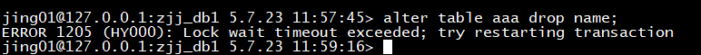

#### masterSourceInitWaitTimeout

**参数说明：**

| Property | Value |
|----------|-------|
| 参数值 | masterSourceInitWaitTimeout |
| 是否可见 | 否 |
| 参数说明 | 启动时数据节点中主存储节点初始化超时时间 |
| 默认值 | 300 |
| 最小值 | 0 |
| 最大值 | 600 |
| Reload是否生效 | 是 |
| 最低兼容版本 | 2.4.3 |

**参数作用：**

启动时，主存储节点在首次初始化失败后，会一直重连；若存在备存储节点且超过主存储节点初始化超时时间，则会切换到可用的备存储节点，若该节点所有存储节点都初始化失败，则整个节点不可用。如果数据节点初始化失败且无可用逻辑库，或数据节点下无存储节点，则计算节点无法启动。

```log
2018-05-28 18:07:29.719 [WARN] [INIT] [main] r(-1) -- failed in connecting datasource:[id:182,nodeId:11 192.168.220.101:3306/db01 status:1,charset:utf8], exception:...省略...
The last packet sent successfully to the server was 0 milliseconds ago. The driver has not received any packets from the sever.
2018-05-28 18:07:31.719 [INFO] [INIT] [main] b(-1) -- try reinit datasource:[id:182,nodeId:11 192.168.220.101:3306/db01 status:1,charset:utf8]
```

引起存储节点超时的原因有：超出系统或者数据库连接限制、存储节点用户密码认证失败、网络延迟过大等。

#### maxAllowedPacket

**参数说明：**

| Property | Value |
|----------|-------|
| 参数值 | maxAllowedPacket |
| 是否可见 | 否 |
| 参数说明 | 接收最大数据包限制 |
| 默认值 | 65536（KB） |
| 最小值 | 1 |
| 最大值 | 1048576 |
| Reload是否生效 | 是 |
| 最低兼容版本 | 2.4.5 |

**参数作用：**

控制前端连接发送的包大小。默认64M，当发送SQL语句的大小超过默认值64M时，计算节点会给出提示（Get a packet bigger than 'max_allowed_packet'）。

```
ERROR 1153 (HY000): Get a packet bigger than 'max allowed packet'
```

同时，show variables能够显示配置的值。

```
mysql> show variables like '%allowed%;
+--------------------+----------+
| variable_name      | value    |
+--------------------+----------+
| max_allowed_packet | 16777216 |
+--------------------+----------+
```

#### maxConnections & maxUserConnections

**参数说明：**

| Property | Value |
|----------|-------|
| 参数值 | maxConnections |
| 是否可见 | 是 |
| 参数说明 | 前端最大连接数 |
| 默认值 | 5000 |
| 最大值 | 300000 |
| 最小值 | 1 |
| Reload是否生效 | 是 |
| 最低兼容版本 | 2.4.4 |

| Property | Value |
|----------|-------|
| 参数值 | maxUserConnections |
| 是否可见 | 是 |
| 参数说明 | 用户前端最大连接数, 0为不限制 |
| 默认值 | 0 |
| 最大值 | 300000 |
| 最小值 | 0 |
| Reload是否生效 | 是 |
| 最低兼容版本 | 2.4.4 |

**参数作用：**

计算节点支持限制前端连接数功能，出现访问过载时可辅助限制流量。

maxConnections是前端连接的最大连接数，是计算节点所允许的同时前端数据库连接数的上限。用户可以根据实际需要设置maxConnections，适当调整该值，不建议盲目提高设值。

maxUserConnections是同一个账号能够同时连接到计算节点的最大连接数。用户前端最大连接数可以为空，为空时默认给0即不限制用户连接数，此时以前端最大连接数为准。

当连接数大于所设置的值时，创建前端连接会有如下提示:

```
root> mysql -uzy -pzy -h127.0.0.1 -P9993

Warning: Using a password on the command line interface can be insecure.
ERROR 1040 (HY000): too many connections
```

可以通过在服务端口set修改maxConnections和maxUserConnections的值，参数为GLOBAL级别：

```
mysql> set global max_connections = 5000;
Query OK, 0 rows affected (0.00 sec)

mysql> show variables like '%max_connections%;
+-----------------+-------+
| variable_name   | value |
+-----------------+-------+
| max_connections | 5000  |
+-----------------+-------+

mysql> set global max_user_connections = 1000;
Query OK, 0 rows affected (0.00 sec)

mysql> show variables like '%max_user_connections%;
+----------------------+-------+
| variable_name        | value |
+----------------------+-------+
| max_user_connections | 1000  |
+----------------------+-------+
```

#### maxIdleTransactionTimeout

**参数说明：**

| Property | Value |
|----------|-------|
| 参数值 | maxIdleTransactionTimeout |
| 是否可见 | 是 |
| 参数说明 | 未提交的空闲事务超时时间(ms) |
| 默认值 | 86400000 |
| 最小值 | 0 |
| 最大值 | 172800000 |
| Reload是否生效 | 是 |
| 最低兼容版本 | 2.5.1 |

**参数设置：**

```xml
<property name="maxIdleTransactionTimeout">864000000</property>
```

maxIdleTransactionTimeout参数默认值为86400000毫秒，即24小时，表示事务内最后一次SQL完成后超过24小时未提交事务，则判定为超时事务，HotDB在`hotdb.log`中以`[INFO] [WATCHDOG] WatchDogLongTransactionCheckHandler`标签记录连接IP、端口、用户名、逻辑库、lastsql、是否autocommit、后端连接的innodb_trx等信息，并关闭连接，自动回滚事务。

参数仅在enableWatchdog=true时生效。Watchdog中maxIdleTransactionTimeout每10分钟检测一次，在Watchdog对maxIdleTransactionTimeout的检测中判断连接的事务空闲时间，如果超出设定的阈值，则关闭连接；故实际的事务空闲时间不等于设定的阈值。

例如，事务空闲时间超出设定的阈值，将关闭连接，此时查看日志：

```
2019-07-01 18:09:24.528 [INFO] [WATCHDOG] [$NIOREACTOR-20-RW] cn.hotpu.hotdb.mysql.nio.handler.WatchDogLongTransactionCheckHandler(123) - Session [thread=Thread-13,id=1,user=ztm,host=127.0.0.1,port=3323,localport=46138,schema=PM] has not been queryed for 593s. executed IUDs:[UPDATE customer_auto_1 SET city = 'xxxx' WHERE id = 1]. binded connection:[MySQLConnection [node=2, id=59, threadId=14921, state=borrowed, closed=false, autocommit=false, host=10.10.0.202, port=3307, database=db_test251, localPort=52736, isClose:false, toBeClose:false] lastSQL:SET autocommit=0;UPDATE customer_auto_1 SET city = 'xxxx' WHERE id = 1]. innodb_trx:[(ds:2 trx_id:3435056156 trx_state:RUNNING trx_started:2019-07-01 17:59:33 trx_requested_lock_id:NULL trx_wait_started:NULL trx_weight:3 trx_mysql_thread_id:14921 trx_query:NULL trx_operation_state:NULL trx_tables_in_use:0 trx_tables_locked:1 trx_lock_structs:2 trx_lock_memory_bytes:1136 trx_rows_locked:1 trx_rows_modified:1 trx_concurrency_tickets:0 trx_isolation_level:REPEATABLE READ trx_unique_checks:1 trx_foreign_key_checks:1 trx_last_foreign_key_error:NULL trx_adaptive_hash_latched:0 trx_adaptive_hash_timeout:0 trx_is_read_only:0 trx_autocommit_non_locking:0 )]. we will close this session now.
```

参数设置为0时，代表永不超时，即对事务提交时间不做限制。

#### maxJoinSize

**参数说明：**

| Property | Value |
|----------|-------|
| 参数值 | maxJoinSize |
| 是否可见 | 是 |
| 参数说明 | JOIN中间结果集行数限制（M:百万，K：千） |
| 默认值 | 10M |
| 最小值 | 1K |
| 最大值 | 1000M |
| Reload是否生效 | 是 |
| 最低兼容版本 | 2.4.3 |

**参数作用：**

JOIN中间结果集允许执行的最大行数。中间结果集的计算方法：当SQL语句中没有条件时，计算笛卡尔积；当SQL语句中有条件时，计算符合join条件的行数。

当JOIN中间结果集大于设置的行数时，会提示如下信息：

```
mysql> select * from customer_auto_1 a join customer_auto_3 b on a.postcode=b.postcode;

ERROR 1104 (HY000): The SELECT would examine more than MAX_JOIN_SIZE rows; check your maxJoinSize in server.xml
```

可通过set session max_join_size修改当前会话参数值，使JOIN中间结果集在1~ 2124000000之间：

```
mysql> show variables like '%max_join_size%;
+---------------+-------+
| variable_name | value |
+---------------+-------+
| max_join_size | 5000  |
+---------------+-------+
 
mysql> set global max_user_connections = 1000;
Query OK, 0 rows affected (0.00 sec)

mysql> show variables like '%max_user_connections%;
+----------------------+------------+
| variable_name        | value      |
+----------------------+------------+
| max_user_connections | 2124000000 |
+----------------------+------------+

mysql> set session max_join_size=1;
Query OK, 0 rows affected (0.00 sec)
 
mysql> show variables like '%max_user_connections%;
+----------------------+-------+
| variable_name        | value |
+----------------------+-------+
| max_user_connections | 1     |
+----------------------+-------+

mysql> select * from bn_a_jwy a join bn_c_jwy b on a.a=b.a where a.a='d';
ERROR 1104 (HY000): The SELECT would examine more than MAX_JOIN_SIZE rows; check your maxJoinSize in server.xml
```

#### maxLatencyForRWSplit

**参数说明：**

| Property | Value |
|----------|-------|
| 参数值 | maxLatencyForRWSplit |
| 是否可见 | 是 |
| 参数说明 | 读写分离中可读从库最大延迟 |
| 默认值 | 1000ms |
| 最小值 | 200 |
| 最大值 | 10000 |
| Reload是否生效 | 是 |
| 最低兼容版本 | 2.4.5 |

**参数作用：**

开启读写分离后，主从延迟小于设置的延迟时间时，读从库:

```
mysql> select * from cd;
+----+-------+
| id | name  |
+----+-------+
| 1  | slave |
| 2  | slave |
| 3  | slave |
| 4  | slave |
| 5  | slave |
+----+-------+
5 rows in set (0.00 sec)
```

开启读写分离后，当可读从库的延迟超过设置的时间后，会读主库:

```
mysql> select * from cd;
+----+--------+
| id | name   |
+----+--------+
| 1  | master |
| 2  | master |
| 3  | master |
| 4  | master |
| 5  | master |
+----+--------+
5 rows in set (0.00 sec)
```

#### maxNotInSubquery

**参数说明：**

| Property | Value |
|----------|-------|
| 参数值 | maxNotInSubquery |
| 是否可见 | 隐藏不显示 |
| 参数说明 | 子查询中最大not in个数 |
| 默认值 | 20000 |
| Reload是否生效 | 是 |
| 最低兼容版本 | 2.4.9 |

**参数设置：**

server.xml中maxNotInSubquery参数配置 如下配置：

```xml
<property name="maxNotInSubquery">20000</property><!--子查询中最大not in个数 -->
```

**参数作用：**

控制子查询中最大NOT IN个数，默认20000，当执行的SQL语句中NOT IN子查询为分片表且带有聚合函数，此时去重后的NOT IN个数超过默认值20000时，HotDB会限制该SQL执行，并给出ERROR提示

```
(ERROR 1104 (HY000): The sub SELECT would examine more than maxNotInSubquery rows; check your maxNotInSubquery in server.xml）
```

例如：（为方便测试，设置maxNotInSubquery 为10）

```
mysql> use pm
Database changed

mysql> show tables;
+------------------+
| Tables_in_PM     |
+------------------+
| customer_quan_2  |
| customer_route_1 |
| customer_route_2 |
+------------------+
3 rows in set (0.00 sec)

mysql> select * from customer_route_2 a where a.postcode not in (select postcode from customer_route_1 b where b.id > 205119 limit 20);
ERROR 1104 (HY000): The sub SELECT would examine more than maxNotInSubquery rows; check your maxNotInSubquery in server.xml
```

日志中会以`[INFO] [SQL]`标签记录对应信息

```
2019-10-08 14:33:41.725 [INFO] [SQL] [$NIOExecutor-3-2] cn.hotpu.hotdb.j.h(2626) - unsupported subquery:[thread=$NIOExecutor-3-2,id=152197,user=ztm,host=127.0.0.1,port=3323,localport=49458,schema=PM] AutoCommitTransactionSession in [thread=$NIOExecutor-3-2,id=152197,user=ztm,host=127.0.0.1,port=3323,localport=49458,schema=PM], sql:select * from customer_route_2 a where a.postcode not in (select postcode from customer_route_1 b where b.id > 205119 limit 20), error code:1104, error msg:The sub SELECT would examine more than maxNotInSubquery rows; check your maxNotInSubquery in server.xml
```

同时，在日志和3325端口`show @@systemconfig`能够查看配置的值，该参数在修改后可reload生效。

```
mysql> show @@systemconfig;

config | {[enableFlowControl](#enableFlowControl):"true",[recordSql](#recordSql):"false",[defaultMaxLimit](#defaultMaxLimit):"10000","bakPassword":"hotdb_config","bakUrl":"jdbc:mysql://192.168.220.138:3306/hotdb_config_249ha","managerPort":"3325","heartbeatPeriod":"2",[cryptMandatory](#cryptMandatory):"false","password":"hotdb_config",[enableCursor](#enableCursor):"false","username":"hotdb_config",[enableXA](#enableXA):"false",[errorsPermittedInTransaction](#errorsPermittedInTransaction):"true",[strategyForRWSplit](#strategyForRWSplit):"0",[enableWatchdog](#enableWatchdog):"false","haNodeHost":"192.168.220.139:3325",[maxJoinSize](#maxJoinSize):"9148M",[maxNotInSubquery](#maxNotInSubquery):"10",[pingLogCleanPeriodUnit](#pingLogCleanPeriodUnit):"0",[clientFoundRows](#clientFoundRows):"false",[joinCacheSize](#joinCacheSize):"236","enableHeartbeat":"true","url":"jdbc:mysql://192.168.220.138:3306/hotdb_config_249ha",[parkPeriod](#parkPeriod):"100000",[maxSqlRecordLength](#maxSqlRecordLength):"4000",[joinBatchSize](#joinBatchSize):"46000",[enableSubquery](#enableSubquery):"true","heartbeatTimeoutMs":"500",[pingPeriod](#pingPeriod):"300",[joinLoopSize](#joinLoopSize):"18500","VIP":"192.168.220.171",[joinable](#joinable):"true","maxUserConnections":"4900",[pingLogCleanPeriod](#pingLogCleanPeriod):"1",[dataNodeIdleCheckPeriod](#dataNodeIdleCheckPeriod):"120",[deadlockCheckPeriod](#deadlockCheckPeriod):"3000",[sqlTimeout](#sqlTimeout):"3600","bakUsername":"hotdb_config","enableLatencyCheck":"true",[waitSyncFinishAtStartup](#waitSyncFinishAtStartup):"true","checkVIPPeriod":"500",[statisticsUpdatePeriod](#statisticsUpdatePeriod):"0",[usingAIO](#usingAIO):"0",[showAllAffectedRowsInGlobalTable](#showAllAffectedRowsInGlobalTable):"false",[maxLatencyForRWSplit](#maxLatencyForRWSplit):"1000","maxConnections":"5000",[enableSleep](#enableSleep):"false",[waitForSlaveInFailover](#waitForSlaveInFailover):"true",[autoIncrement](#autoIncrement):"true",[processorExecutor](#processorExecutor):"4",[highCostSqlConcurrency](#highCostSqlConcurrency):"400","latencyCheckPeriod":"500","processors":"16",[weightForSlaveRWSplit](#weightForSlaveRWSplit):"50","haState":"master",[readOnly](#readOnly):"false",[timerExecutor](#timerExecutor):"4","serverPort":"3323",[frontWriteBlockTimeout](#frontWriteBlockTimeout):"10000",[switchoverTimeoutForTrans](#switchoverTimeoutForTrans):"3000"}
1 row in set (0.01 sec)
```

#### maxReconnectConfigDBTimes

**参数说明：**

| Property | Value |
|----------|-------|
| 参数值 | maxReconnectConfigDBTimes |
| 是否可见 | 否 |
| 参数说明 | 最大重试连接配置库次数 |
| 默认值 | 3 |
| 最大值 | 1000 |
| 最小值 | 0 |
| Reload是否生效 | 是 |
| 最低兼容版本 | 2.5.4 |

**参数设置：**

server.xml中maxReconnectConfigDBTimes参数如下配置：

```xml
<property name=" maxReconnectConfigDBTimes ">3</property><!-- 最大重试连接配置库次数 -->
```

**参数作用：**

防止计算节点启动、HA切换或reload时配置库连接耗时过长，增加配置库重连次数。超过最大重试连接次数（重连耗时默认是3*2s），会自动切换到从配置库连接。

#### maxSqlRecordLength

**参数说明：**

| Property | Value |
|----------|-------|
| 参数值 | maxSqlRecordLength |
| 是否可见 | 是 |
| 参数说明 | SQL执行统计中SQL语句记录的最大长度 |
| 默认值 | 1000 |
| 最小值 | 1000 |
| 最大值 | 16000 |
| Reload是否生效 | 是 |
| 最低兼容版本 | 2.4.5 |

**参数作用：**

该参数是指操作日志智能分析中的SQL纪录时的最大长度。

执行的SQL语句超过设置的长度后，会自动截取，用省略号...代替，如下图所示：

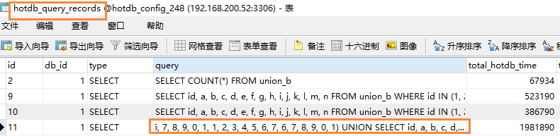

#### ndbSqlAddr & ndbSqlUser & ndb SqlPass

**参数说明：**

| Property | Value |
|----------|-------|
| 参数值 | ndbSqlAddr |
| 是否可见 | 是 |
| 参数说明 | NDB SQL端IP地址 |
| 默认值 | localhost:3329 |
| Reload是否生效 | 否 |
| 最低兼容版本 | 2.5.2 |

| Property | Value |
|----------|-------|
| 参数值 | ndbSqlUser |
| 是否可见 | 是 |
| 参数说明 | NDB SQL前端用户名 |
| 默认值 | root |
| Reload是否生效 | 否 |
| 最低兼容版本 | 2.5.2 |

| Property | Value |
|----------|-------|
| 参数值 | ndbSqlPass |
| 是否可见 | 是 |
| 参数说明 | NDB SQL前端密码 |
| 默认值 | root |
| Reload是否生效 | 否 |
| 最低兼容版本 | 2.5.2 |

**参数设置：**

ndbSqlAddr，ndbSqlUser，ndbSqlPass是配套参数，ndbSqlAddr是NDB SQL节点的物理地址，ndbSqlUser和ndbSqlPass属于连接NDB SQL节点的用户名和密码。

```xml
<property name="ndbSqlAddr">localhost:3329</property>
<property name="ndbSqlUser">root</property>
<property name="ndbSqlPass">root</property>
```

#### ndbSqlDataAddr

**参数说明：**

| Property | Value |
|----------|-------|
| 参数值 | ndbSqlDataAddr |
| 是否可见 | 是 |
| 参数说明 | 接收NDB SQL连接的IP地址和端口 |
| 默认值 | 127.0.0.1:3327 |
| Reload是否生效 | 否 |
| 最低兼容版本 | 2.5.2 |

**参数设置：**

NDB SQL到计算节点的连接，即计算节点所在服务器IP及NDB SQL到计算节点的通信端口，默认值为127.0.0.1:3327。

```xml
<property name="ndbSqlDataAddr">127.0.0.1:3327</property>
```

#### ndbSqlMode

**参数说明：**

| Property | Value |
|----------|-------|
| 参数值 | ndbSqlMode |
| 是否可见 | 是 |
| 参数说明 | NDB SQL节点的使用模式（NDB执行模式：none：禁用NDB功能，为默认值；local：NDB服务与计算节点在同一IP地址） |
| 默认值 | none |
| Reload是否生效 | 否 |
| 最低兼容版本 | 2.5.2 |

**参数设置：**

none：为默认值，代表禁用NDB功能；local：NDB服务与计算节点在同一IP地址上，满足相关条件的SQL，通过NDB逻辑执行。

```xml
<property name="ndbSqlMode">none</property>
```

#### ndbSqlVersion & ndbVersion

**参数说明：**

| Property | Value |
|----------|-------|
| 参数值 | ndbSqlVersion |
| 是否可见 | 是 |
| 参数说明 | NDB SQL版本号 |
| 默认值 | 5.7.24 |
| Reload是否生效 | 否 |
| 最低兼容版本 | 2.5.2 |

| Property | Value |
|----------|-------|
| 参数值 | ndbVersion |
| 是否可见 | 是 |
| 参数说明 | NDB引擎版本号 |
| 默认值 | 7.5.12 |
| Reload是否生效 | 否 |
| 最低兼容版本 | 2.5.2 |

**参数设置：**

ndbSqlVersion与ndbVersion是相对应的关系，具体对应关系可参考MySQL官方文档。ndbSqlVersion默认的版本为5.7.24，ndbVersion默认的版本为7.5.12。当前计算节点支持的NDB引擎版本为7.5.4及以上，使用NDB版本要求存储节点版本为5.7.16及以上。

```xml
<property name="ndbSqlVersion">5.7.24</property>
<property name="ndbVersion">7.5.12</property>
```

#### operateMode

**参数说明：**

| Property | Value |
|----------|-------|
| 参数值 | operateMode |
| 是否可见 | 否 |
| 参数说明 | 计算节点工作模式 |
| 默认值 | 0 |
| Reload是否生效 | 是 |
| 最低兼容版本 | 2.5.6 |

**参数设置：**

server.xml中operateMode参数配置如下：

```xml
<property name="operateMode">0</property><!--计算节点工作模式，0：正常模式，1：性能模式，2：调试模式(Operating mode, 0: normal mode, 1: performance mode, 2: debug mode)-->
```

**参数作用：**

控制计算节点的工作模式，0为正常模式，1为性能最大化模式，2为调试模式。正常模式下不对其他参数或功能做任何改变，性能最大化模式下会将下列参数涉及的功能强制关闭，调试模式下会将下列参数涉及的功能强制开启：

```
recordSql
recordSQLSyntaxError
recordCrossDNJoin
recordUNION
recordSubQuery
recordDeadLockSQL
recordLimitOffsetWithoutOrderby
recordSQLKeyConflict
recordSQLUnsupported
recordMySQLWarnings
recordMySQLErrors
recordHotDBWarnings
recordHotDBErrors
recordDDL
recordSQLIntercepted
recordAuditlog
recordSQLForward
recordSqlAuditlog
```

operateMode为隐藏参数，默认为正常模式，即operateMode=0，在启动计算节点时会在hotdb.log内输出相应的日志信息，如下所示：


在正常模式下，计算节点按照server.xml文件的参数配置进行启动，不受operateMode参数影响。

当设置计算节点工作模式为性能最大化模式时，即修改server.xml文件，添加operateMode=1配置参数，然后在3325端口执行reload @@config使之生效，此时计算节点会在hotdb.log中输出相应的信息，如下所示：


在性能最大化模式下，计算节点会主动将影响计算节点性能的参数强制关闭，例如：

prefetchBatchMax

当计算节点工作模式为调试模式时，计算节点会在hotdb.log中输出相应的信息，如下所示：

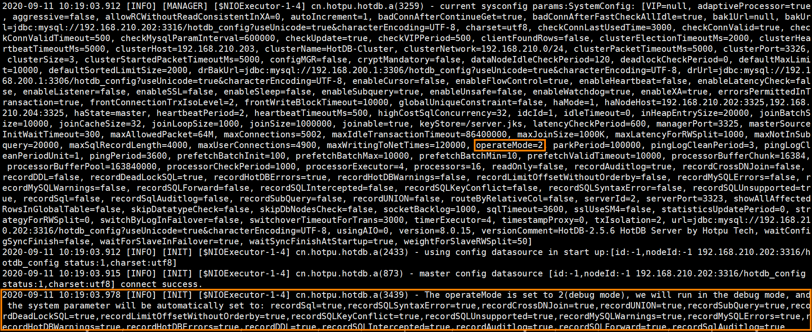

在调试模式下，计算节点会将与调试功能相关的参数强制开启，例如：

```
recordSql=true,recordSQLSyntaxError=true,recordCrossDNJoin=true,recordUNION=true,recordSubQuery=true,recordDeadLockSQL=true,recordLimitOffsetWithoutOrderby=true,recordSQLKeyConflict=true,recordSQLUnsupported=true,recordMySQLWarnings=true,recordMySQLErrors=true,recordHotDBWarnings=true,recordHotDBErrors=true,recordDDL=true,recordSQLIntercepted=true,recordAuditlog=true,recordSQLForward=true,recordSqlAuditlog=true，即使server.xml文件中配置这些参数为false。需要注意的是，调试模式下计算节点会产生较多日志文件，需要留意磁盘剩余可用空间，防止日志文件占满磁盘导致计算节点服务宕机。
```

#### parkPeriod

**参数说明：**

| Property | Value |
|----------|-------|
| 参数值 | parkPeriod |
| 是否可见 | 是 |
| 参数说明 | 消息系统空闲时线程休眠周期（ns） |
| 默认值 | 100000 |
| 最大值 | 1000000 |
| 最小值 | 1000 |
| Reload是否生效 | 2.4.5版本为N，2.4.7及以上为Y |
| 最低兼容版本 | 2.4.3 |

**参数设置：**

server.xml的parkPeriod参数设置 如下图:

```xml
<property name="parkPeriod">100000</property>
```

**参数作用：**

该参数用来调整内部线程通信的消息队列空闲时，消费消息队列的线程的休眠时间。

#### pingLogCleanPeriod

**参数说明：**

| Property | Value |
|----------|-------|
| 参数值 | pingLogCleanPeriod |
| 是否可见 | 隐藏不显示 |
| 参数说明 | ping日志清理周期，默认3 |
| 默认值 | 3 |
| Reload是否生效 | 是 |
| 最低兼容版本 | 2.4.9 |

**参数设置：**

server.xml中pingLogCleanPeriod参数配置 如下配置：

```xml
<property name="pingLogCleanPeriod">3</property><!--ping日志清理周期，默认3 -->
```

**参数作用：**

pingLogCleanPeriod参数默认为3，单位可选项为小时、天、月，由另一个参数pingLogCleanPeriodUnit决定。该参数主要是控制ping检查时存储到配置库中的数据的清理周期，每日定时删除指定时间以前的数据。

#### pingLogCleanPeriodUnit

**参数说明：**

| Property | Value |
|----------|-------|
| 参数值 | pingLogCleanPeriodUnit |
| 是否可见 | 隐藏不显示 |
| 参数说明 | ping日志清理周期单位，默认2， 0:小时，1:天，2:月 |
| 默认值 | 2 |
| Reload是否生效 | 是 |
| 最低兼容版本 | 2.4.9 |

**参数设置：**

server.xml中pingLogCleanPeriodUnit参数配置 如下配置：

```xml
<property name="pingLogCleanPeriodUnit">2</property><!--ping日志清理周期单位，默认2， 0:小时，1:天，2:月 -->
```

**参数作用：**

pingLogCleanPeriodUnit参数默认为2，代表ping日志清理周期的单位是月，可选项还有0代表小时，1代表天。该参数主要是控制ping日志清理周期的单位，与pingLogCleanPeriod参数配套使用。

#### pingPeriod

**参数说明：**

| Property | Value |
|----------|-------|
| 参数值 | pingPeriod |
| 是否可见 | 隐藏不显示 |
| 参数说明 | ping服务器周期，单位秒,默认3600秒,最小300秒 |
| 默认值 | 3600 |
| Reload是否生效 | 是 |
| 最低兼容版本 | 2.4.9 |

**参数设置：**

server.xml中pingPeriod参数配置 如下配置：

```xml
<property name="pingPeriod">3600</property><!--ping服务器周期，单位秒,默认3600秒,最小300秒 -->
```

**参数作用：**

pingPeriod参数默认为3600，单位秒，该参数主要是控制ping检查的周期，默认每一个小时ping一轮所有的与HotDB Serer连接的服务器的IP地址，例如客户端服务器、配置库服务器、存储节点服务器等，可配置最低300秒（即5分钟）触发一轮检测。如果一个小时没有完成上一轮检查，则这一轮检查直接放弃。

在检测过程中，对于一个IP地址，程序会自动使用10个64字节的包，10个65000字节的包，这20个包，每1秒一个进行ping处理。当检测发现网络质量存在故障时，则ping的检查间隔缩短至每分钟检测一次，故障判断的标准为：

- 如果同机房内：64字节的包不是全部都丢，则如果平均延迟大于1毫秒或最大延迟大于2毫秒，或者有丢包，会记录时间，ping类型，平均延迟，最大延迟，丢包率进入配置库hotdb_ping_log。如果65000字节的包不是全部都丢，则如果平均延迟大于3毫秒，或最大延迟大于5毫秒，或者有丢包， 记录时间，ping类型，平均延迟，最大延迟，丢包率进入配置库hotdb_ping_log表。
- 如果跨机房：64字节的包不是全部都丢，则如果平均延迟大于10毫秒或最大延迟大于20毫秒，或者有丢包，会记录时间，ping类型，平均延迟，最大延迟，丢包率进入配置库hotdb_ping_log。如果65000字节的包不是全部都丢，则如果平均延迟大于15毫秒，或最大延迟大于30毫秒，或者有丢包， 记录时间，ping类型，平均延迟，最大延迟，丢包率进入配置库hotdb_ping_log表。

#### prefetchBatchInit

**参数说明：**

| Property | Value |
|----------|-------|
| 参数值 | prefetchBatchInit |
| 是否可见 | 是 |
| 参数说明 | 自增长批次大小的初始值 |
| 默认值 | 100 |
| Reload是否生效 | 是 |
| 最低兼容版本 | 2.5.4 |

**参数设置：**

```xml
<property name="prefetchBatchInit">100</property>
```

**参数作用：**

自增长序列号预取批次大小的初始值，如果设置初始值为100，则预取默认区间的范围差值为100，例如若预取从123开始，则预取区间为`[123，223]`。

初始值可配置范围在实际配置的自增长批次大小上下限（[prefetchBatchMax](#prefetchbatchmax)和[prefetchBatchMin](#prefetchbatchmin)）的范围内，默认范围为`[10,10000]`。

#### prefetchBatchMax

**参数说明：**

| Property | Value |
|----------|-------|
| 参数值 | prefetchBatchMax |
| 是否可见 | 是 |
| 参数说明 | 自增长批次大小的上限 |
| 默认值 | 10000 |
| 最小值 | 10 |
| 最大值 | 100000 |
| Reload是否生效 | 是 |
| 最低兼容版本 | 2.5.4 |

**参数设置：**

```xml
<property name="prefetchBatchMax">10000</property>
```

**参数作用：**

自增长序列号预取批次大小的上限，如果设置成1000，每次预取区间范围差值的最大值为1000，例如若预取从123开始，则预取区间中最大值不超过1123，即范围不超过`[123，1123]`。

#### prefetchBatchMin

**参数说明：**

| Property | Value |
|----------|-------|
| 参数值 | prefetchBatchMin |
| 是否可见 | 是 |
| 参数说明 | 自增长批次大小的下限 |
| 默认值 | 10 |
| 最小值 | 2 |
| 最大值 | 1000 |
| Reload是否生效 | 是 |
| 最低兼容版本 | 2.5.4 |

**参数设置：**

```xml
<property name="prefetchBatchMin">10</property>
```

**参数作用：**

自增长序列号预取批次大小的下限，如果设置了100，每次预取区间范围差值的最小值为100，例如若预取从123开始，则预取区间中最大值不小于223，即下一批的预取批次至少从223开始预取，下一个预取批次\[>=223，223+预取批次大小]。

#### prefetchValidTimeout

**参数说明：**

| Property | Value |
|----------|-------|
| 参数值 | prefetchValidTimeout |
| 是否可见 | 是 |
| 参数说明 | 自增批次的超时废弃时间（秒） |
| 默认值 | 10 |
| 最小值 | 3 |
| 最大值 | 86400 |
| Reload是否生效 | 是 |
| 最低兼容版本 | 2.5.4 |

**参数设置：**

```xml
<property name="prefetchValidTimeout">30</property>
```

**参数作用：**

预取自增批次的超时废弃时间，设置成0为不因超时废弃自增批次。例如设置了30秒，预取区间为1-100，若超过30秒则未使用的值不再使用。

#### processorExecutor

**参数说明：**

| Property | Value |
|----------|-------|
| 参数值 | processorExecutor |
| 是否可见 | 是 |
| 参数说明 | 各处理器线程数 |
| 默认值 | 4 |
| 最小值 | 2 |
| 最大值 | 8 |
| Reload是否生效 | 否 |
| 最低兼容版本 | 2.4.3 |

**参数设置：**

```xml
<property name="processorExecutor">4</property><!-- 各处理器线程数 -->
```

**参数作用：**

此参数用于设置计算节点内部线程池里的每处理器线程各自的执行线程数。参数[adaptiveProcessor](#adaptiveprocessor)默认开启，开启时将由计算节点自动适配最大processorExecutor数。

登录3325端口，执行`show @@threadpool`命令，可查看当前processorExecutor数。

#### Processors

**参数说明：**

| Property | Value |
|----------|-------|
| 参数值 | processors |
| 是否可见 | 是 |
| 参数说明 | 处理器数 |
| 默认值 | 16 |
| 最小值 | 4 |
| 最大值 | 128 |
| Reload是否生效 | 否 |
| 最低兼容版本 | 2.4.3 |

**参数设置：**

```xml
<property name="processors">8</property><!-- 处理器数 -->
```

**参数作用：**

此参数用于设置计算节点内部线程池里的处理器线程数。参数[adaptiveProcessor](#adaptiveprocessor)默认开启，开启时将由计算节点自动适配processor数。

登录3325端口，执行show @@threadpool;命令，可查看当前processor数。

#### readOnly

**参数说明：**

| Property | Value |
|----------|-------|
| 参数值 | readOnly |
| 是否可见 | 否 |
| 参数说明 | 是否为只读模式 |
| 默认值 | false |
| Reload是否生效 | 是 |
| 最低兼容版本 | 2.4.8 |

**参数设置：**

```xml
<property name="readOnly">false</property><!-- 是否为只读模式 -->
```

**参数作用：**

用于设置当前计算节点为只读模式，在readonly模式下，计算节点只接收DQL（SELECT语句）操作，及SET命令行和SHOW类型操作，拒绝执行DDL（CREATE TABLE/VIEW/INDEX/SYN/CLUSTER）、DML（INSERT，UPDATE，DELETE）和DCL（GRANT，ROLLBACK \[WORK] TO \[SAVEPOINT]，COMMIT）等修改性操作命令

> !Note
>
> 该参数仍然是为单计算节点服务提供的，不允许多计算节点同时提供服务，也即不允许同时开启多个计算节点并同时对外进行服务。

开启状态：

```
mysql> drop table customer;

ERROR 1289 (HY000): Command not allowed in Read-Only mode.
```

#### recordAuditlog

**参数说明：**

| Property | Value |
|----------|-------|
| 参数值 | recordAuditlog |
| 是否可见 | 否 |
| 参数说明 | 记录审计日志 |
| 默认值 | true |
| Reload是否生效 | 是 |
| 最低兼容版本 | 2.5.0 |

**参数设置：**

server.xml中recordAuditlog参数如下配置：

```xml
<property name="recordAuditlog">true</property><!-- 记录审计日志 -->
```

**参数作用：**

recordAuditlog参数用于控制是否记录管理端操作信息，开启的情况可通过管理平台中的事件->审计日志查看管理端操作记录。

> !Note
>
> 若开启参数，仍无法在日志文件中查看相应记录，可检查log4j文件中是否配置正确，详情请参考[log4j日志类型](#log4j的日志类型)。

#### recordCrossDNJoin

**参数说明：**

| Property | Value |
|----------|-------|
| 参数值 | recordCrossDNJoin |
| 是否可见 | 否 |
| 参数说明 | 日志中记录跨库JOIN |
| 默认值 | False |
| Reload是否生效 | 是 |
| 最低兼容版本 | 2.4.7 |

**参数设置：**

server.xml中recordCrossDNJoin参数如下配置：

```xml
<property name="recordCrossDNJoin">true</property>
```

**参数作用：**

recordCrossDNJoin记录跨库的JOIN语句。

建表：

- account表auto_crc32分片，分片字段 id，节点1
- borrower表auto_mod分片，分片字段id，节点2

执行如下：

```
mysql> SELECT * FROM account a JOIN borrower b;
```

查看计算节点安装目录的`logs/sql.log`日志。

```log
2018-05-22 16:17:11.607 [INFO] [CROSSDNJOIN] [$NIOExecutor-6-2] JoinVisitor(4947) -- SELECT * FROM account a JOIN borrower b
```

> !Note
>
> 若开启参数，仍无法在日志文件中查看相应记录，可检查log4j文件中是否配置正确，详情请参考[log4j日志类型](#log4j的日志类型)。

#### recordDDL

**参数说明：**

| Property | Value |
|----------|-------|
| 参数值 | recordDDL |
| 是否可见 | 否 |
| 参数说明 | 日志中记录DDL语句 |
| 默认值 | False |
| Reload是否生效 | 是 |
| 最低兼容版本 | 2.4.7 |

**参数设置：**

server.xml中recordDDL参数如下配置：

```xml
<property name="recordDDL">true</property>
```

**参数作用：**

recordDDL日志中记录DDL语句，执行如下语句：

```
mysql> create table abc(id int);
```

查看计算节点安装目录的`logs/sql.log`日志：

```log
2018-05-23 14:23:52.697 [INFO] [HOTDBWARNING] [$NIOExecutor-6-2] ServerConnection(2368) -- sql: create table abc(id int), warning: {Create table without primary key and unique}
2018-05-23 14:23:52.698 [INFO] [DDL] [$NIOExecutor-6-2] ServerConnection(123) -- sql: create table abc(id int)
```

> !Note
>
> 若开启参数，仍无法在日志文件中查看相应记录，可检查log4j文件中是否配置正确，详情请参考[log4j日志类型](#log4j的日志类型)。

#### recordDeadLockSQL

**参数说明：**

| Property | Value |
|----------|-------|
| 参数值 | recordDeadLockSQL |
| 是否可见 | 否 |
| 参数说明 | 日志中记录引发死锁的语句 |
| 默认值 | true |
| Reload是否生效 | 是 |
| 最低兼容版本 | 2.4.7 |

**参数设置：**

server.xml中recordDeadLockSQL参数如下配置：

```xml
<property name="recordDeadLockSQL">true</property>
```

**参数作用：**

recordDeadLockSQL日志中记录引发死锁的语句：

1. 制造死锁场景
2. 查看计算节点安装目录的/logs/hotdb.log日志：

```log
2018-05-23 14:54:30.865 [INFO] [DEADLOCK] [$NIOREACTOR-1-RW] am(-1) -- sql: INSERT INTO table2000 VALUES (3); error response from MySQLConnection [node=4, id=277, threadId=133815, state=borrowed, close=false, autocommit=false, host=192.168.220.102, port=3309, database=db249, localPort=15332, isClose:false, toBeClose:false], err: Lock wait timeout exceeded; try restarting transaction, code: 1205
```

> !Note
>
> 若开启参数，仍无法在日志文件中查看相应记录，可检查log4j文件中是否配置正确，详情请参考[log4j日志类型](#log4j的日志类型)。

#### recordHotDBErrors

**参数说明：**

| Property | Value |
|----------|-------|
| 参数值 | recordHotDBErrors |
| 是否可见 | 否 |
| 参数说明 | 日志中记录HotDB返回的错误信息 |
| 默认值 | true |
| Reload是否生效 | 是 |
| 最低兼容版本 | 2.4.8 |

**参数设置：**

server.xml中recordHotDBErrors参数如下配置：

```xml
<property name="recordHotDBErrors">true</property>
```

**参数作用：**

recordHotDBErrors日志中记录计算节点返回的错误信息。

例：使用没有create权限的用户执行create语句，提示如下：

```log
2018-06-04 10:43:07.316 [INFO] [HOTDBERROR] [$NIOExecutor-3-0] ServerConnection(155) -- sql: create table a001(id int), err: [CREATE] command denied to user 'jzl' to logic database 'TEST_JZL'
```

> !Note
>
> 若开启参数，仍无法在日志文件中查看相应记录，可检查log4j文件中是否配置正确，详情请参考[log4j日志类型](#log4j的日志类型)。

#### recordHotDBWarnings

**参数说明：**

| Property | Value |
|----------|-------|
| 参数值 | recordHotDBWarnings |
| 是否可见 | 否 |
| 参数说明 | 日志中记录计算节点返回的警告信息 |
| 默认值 | False |
| Reload是否生效 | 是 |
| 最低兼容版本 | 2.4.7 |

**参数设置：**

server.xml中recordHotDBWarnings参数如下配置：

```xml
<property name="recordHotDBWarnings">true</property>
```

**参数作用：**

recordHotDBWarnings记录计算节点返回的警告信息，举例如下：

```sql
create table abc(id int);
```

查看计算节点安装目录的`logs/sql.log`日志：

```log
2018-05-23 14:23:52.697 [INFO] [HOTDBWARNING] [$NIOExecutor-6-2] ServerConnection(2368) -- sql: create table abc(id int), warning: {Create table without primary key and unique}
2018-05-23 14:23:52.698 [INFO] [DDL] [$NIOExecutor-6-2] ServerConnection(123) -- sql: create table abc(id int)
```

> !Note
>
> 若开启参数，仍无法在日志文件中查看相应记录，可检查log4j文件中是否配置正确，详情请参考[log4j日志类型](#log4j的日志类型)。

#### recordLimitOffsetWithoutOrderby

**参数说明：**

| Property | Value |
|----------|-------|
| 参数值 | recordLimitOffsetWithoutOrderby |
| 是否可见 | 否 |
| 参数说明 | 日志中记录无orderby的limit语句 |
| 默认值 | False |
| Reload是否生效 | 是 |
| 最低兼容版本 | 2.4.7 |

**参数设置：**

server.xml中recordLimitOffsetWithoutOrderby参数如下配置：

```xml
<property name="recordLimitOffsetWithoutOrderby">true</property>
```

**参数作用：**

recordLimitOffsetWithoutOrderby记录无orderby的limit语句。

举例如下：

```
mysql> select * FROM account a WHERE a.Branch_name IN(SELECT b.Branch_name FROM branch b ) limit 1,3;
```

查看计算节点安装目录的`logs/sql.log`日志

```log
2018-05-23 14:05:14.915 [INFO] [LIMITOFFSETWITHOUTORDERBY] [$NIOExecutor-6-l] SubqueryExecutor(97) - sql: select * FROM account a WHERE a.Branch_name IN(SELECT b.Branch_name FROM branch b) limit 1,3
2018-05-23 14:05:14.922 [INFO] [LIMITOFFSETWITHOUTORDERBY] [$NIOExecutor-2-3] BaseSession(97) - sql: SELECT A.`Balance`, A.`Branch_name`, A.`Account_number`, A.`account_date` FROM account AS a WHERE a.Branch_name IN (UNHEX('4272696768746F6E'), UNHEX('4272696768746F6E'), UNHEX('526564776F6F64'), UNHEX('50657272797269646765'), UNHEX('50657272797269646765'), UNHEX('526564776F6f64'), NULL) LIMIT 1 , 3
```

> !Note
>
> 若开启参数，仍无法在日志文件中查看相应记录，可检查log4j文件中是否配置正确，详情请参考[log4j日志类型](#log4j的日志类型)。

#### recordMySQLErrors

**参数说明：**

| Property | Value |
|----------|-------|
| 参数值 | recordMySQLErrors |
| 是否可见 | 否 |
| 参数说明 | 日志中记录MySQL返回的错误信息 |
| 默认值 | False |
| Reload是否生效 | 是 |
| 最低兼容版本 | 2.4.7 |

**参数设置：**

server.xml中recordMySQLErrors参数如下配置：

```xml
<property name="recordMySQLErrors">true</property>
```

**参数作用：**

recordMySQLErrors记录MySQL返回的错误信息。

举例如下：

```
mysql> select form;
```

查看计算节点安装目录的/logs/hotdb.log日志：

```log
2018-05-23 14:38:55.843 [INFO] [MYSQLERROR] [$NIOREACTOR-7-RW] MySQLConnection(56) -- sql: select form, error response from MySQLConnection [node=4, id=223, threadId=118551, state=borrowed, close=false, autocommit=true, host=192.168.220.103, port=3309, database=db249, localPort=27007, isClose:false, toBeClose:false], err: Unknown column 'form' in 'field list', code: 1054
```

> !Note
>
> 若开启参数，仍无法在日志文件中查看相应记录，可检查log4j文件中是否配置正确，详情请参考[log4j日志类型](#log4j的日志类型)。

#### recordMySQLWarnings

**参数说明：**

| Property | Value |
|----------|-------|
| 参数值 | recordMySQLWarnings |
| 是否可见 | 隐藏 |
| 参数说明 | 日志中记录MySQL返回的警告信息 |
| 默认值 | False |
| Reload是否生效 | 是 |
| 最低兼容版本 | 2.4.7 |

**参数设置：**

server.xml中recordMySQLWarnings参数如下配置：

```xml
<property name="recordMySQLWarnings">true</property>
```

**参数作用：**

recordMySQLWarnings记录MySQL返回的警告信息。

举例如下：

```
mysql> update account set Account_number="$!''##";
```

查看计算节点安装目录的`logs/sql.log`日志：

```log
2018-06-12 10:52:07.011 [INFO] [MYSQLWARNING] |[$NIOREACTOR-3-RW] showwarninqsHandler(79) --- sql: UPDATE account SET Account_number = '*$!''##', warninq from MySQLConnection [node=2, id=78814, threadId=75272, state=runninq, closed=false, autocommit=false, host=192.168.200.51, port=3309, database-db249, localPort=13317, isclose:false, toBeclose:false], warning: Data truncated for column 'Account_number' at row 1, code: 1265
2018-06-12 10:52:07.012 [INFO] [MYSQLWARNING] |[$NIOREACTOR-3-RW] showwarninqsHandler(79) --- sql: UPDATE account SET Account_number = '*$!''##', warninq from MySQLConnection [node=2, id=78814, threadId=75272, state=runninq, closed=false, autocommit=false, host=192.168.200.51, port=3309, database-db249, localPort=13317, isclose:false, toBeclose:false], warning: Data truncated for column 'Account_number' at row 2, code: 1265
2018-06-12 10:52:07.012 [INFO] [MYSQLWARNING] |[$NIOREACTOR-3-RW] showwarninqsHandler(79) --- sql: UPDATE account SET Account_number = '*$!''##', warninq from MySQLConnection [node=3, id=55313, threadId=166, state=runninq, closed=false, autocommit=false, host=192.168.200.52, port=3309, database-db249, localPort=13317, isclose:false, toBeclose:false], warning: Data truncated for column 'Account_number' at row 1, code: 1265
2018-06-12 10:52:07.013 [INFO] [MYSQLWARNING] |[$NIOREACTOR-3-RW] showwarninqsHandler(79) --- sql: UPDATE account SET Account_number = '*$!''##', warninq from MySQLConnection [node=3, id=55313, threadId=166, state=runninq, closed=false, autocommit=false, host=192.168.200.52, port=3309, database-db249, localPort=13317, isclose:false, toBeclose:false], warning: Data truncated for column 'Account_number' at row 2, code: 1265
```

> !Note
>
> 若开启参数，仍无法在日志文件中查看相应记录，可检查log4j文件中是否配置正确，详情请参考[log4j日志类型](#log4j的日志类型)。

#### recordSql

**参数说明：**

| Property | Value |
|----------|-------|
| 参数值 | recordSql |
| 是否可见 | 是 |
| 参数说明 | 是否统计SQL执行情况 |
| 默认值 | false |
| Reload是否生效 | 是 |
| 最低兼容版本 | 2.4.3 |

**参数设置：**

```xml
<property name="recordSql">false</property><!---是否统计SQL执行情况，是：true，否：false
```

**参数作用：**

是否统计记录SQL的执行情况。

1. 通过管理平台操作日志智能分析页面查看：

   - 关闭状态
     

   - 开启并允许一段时间后
     

2. 通过server配置库查看SQL执行统计情况

```
mysql> select * from hotdb_query_records order by db_id limit 1G

******************************1. row***************************

id: 2
db_id: 1
type: SELECT
query: SELECT COUNT(*) FROM union b
total_hotdb_time: 67934
total_mysql_time: 52105
hms1: 0
hms10: 1
hms300: 1
hs1: 0
hs3: 0
hs10: 0
hs60: 0
hs600: 0
hs600p: 0
mmsl: 0
mms10: 1
mms300: 1
ms1: 0
ms3: 0
ms10: 0
ms60: 0
ms600: 0
ms600p: 0
htime24: 67934
htime48: 67934
mtime24: 52105
mtime48: 52105
hcount24: 2
hcount48: 2
mcount24: 2
mcount48: 2
return_rows: 2
last update time: 2018-05-29 11:04:31.000000
crc: 321944166562
1 row in set (0.00 sec)
```

> !Note
>
> 若开启参数，仍无法在日志文件中查看相应记录，可检查log4j文件中是否配置正确，详情请参考[log4j日志类型](#log4j的日志类型)。

#### recordSqlAuditlog

**参数说明：**

| Property | Value |
|----------|-------|
| 参数值 | recordSqlAuditlog |
| 是否可见 | 否 |
| 参数说明 | SQL审计日志记录 |
| 默认值 | false |
| Reload是否生效 | 是 |
| 最低兼容版本 | 2.5.5 |

**参数设置：**

server.xml的recordSqlAuditlog参数默认false：

```xml
<property name="recordSqlAuditlog">false</property>
```

**参数作用：**

设置该参数为true，DDL、DML、DQL等操作将记录到计算节点安装目录下的logs/extra/sqlaudit/中。

如：计算节点服务端执行DDL，查看日志输出

```json
{"affected_rows":"0","command":"CREATE TABLE `t_sharding_01` (n`id` int(10) NOT NULL AUTO_INCREMENT,n`name` varchar(50) NOT NULL,n`age` int(3),nPRIMARY KEY (`id`)n) ENGINE=InnoDB DEFAULT CHARSET=utf8mb4","connection_id":"44","end_time":"2020-04-27 14:58:34.769","failed_reason":"","host":"127.0.0.1","ip":"127.0.0.1","log_id":"9524067900080128","logic_db":"CXD_DB","matched_rows":"0","port":"3323","query_rows":"0","sql_subtype":"CREATE","sql_type":"DDL","status":"1","time":"2020-04-27 14:58:34.736","user":"cxd@%"}
```

> !Note
>
> 日志输出为json格式，特殊字符如双引号采用进行转义，json中部分key代表的含义如下：
>
> - `sql_type` - 当前执行SQL的类型，包括：DDL/DML/DQL/OTHER。
> - `sql_subtype` - 当前执行SQL类型的子类,其中 DDL包括CREARE/ALTER/DROP/TUNCATE/RENAME；DQL包括SELECT；DML包括UPDATE/DELETE/INSERT/REPLACE/LOAD；OTHER包括SET/PREPARE/TRANSACTION/SHOW。
> - `ip` - 执行SQL的客户端IP地址。
> - `time` - 执行SQL的时间。
> - `user` - 连接计算节点执行SQL的用户（包括主机名）。
> - `host` - 连接计算节点所指定的host值。
> - `logic_db` - 连接计算节点执行SQL所use 的逻辑库。
> - `connection_id` - 执行SQL所使用的前端连接ID。
> - `command` - 具体执行SQL的语句（SQL原语句）。
> - `query_rows` - 返回的数据行数（主要体现在SELECT操作上）。
> - `affected_rows` - SQL执行受影响的行数。
> - `matched_rows` - SQL执行匹配的行数。
> - `status` - SQL执行结果是成功还是失败，失败为0 ，成功为1。
> - `failed_reason` - SQL执行失败的原因。
> - `end_time` - SQL执行结束时间。

#### recordSQLIntercepted

**参数说明：**

| Property | Value |
|----------|-------|
| 参数值 | recordSQLIntercepted |
| 是否可见 | 否 |
| 参数说明 | 日志中记录被拦截的语句 |
| 默认值 | False |
| Reload是否生效 | 是 |
| 最低兼容版本 | 2.4.7 |

**参数设置：**

server.xml中recordSQLIntercepted参数如下配置：

```xml
<property name="recordSQLIntercepted">true</property>
```

**参数作用：**

recordSQLIntercepted记录被拦截的SQL语句，拦截的语句配置在中间件管理平台->安全->SQL防火墙。

查看计算节点安装目录的`logs/sql.log`日志：

```log
2018-06-01 14:17:45.669 [INFO] [SQLINTERCEPTED] [$NIOExecutor-1-2] g(-1) -- sql: DELETE FROM sql_intercept_tab, user:zy, ip: 192.168.200.45, db: TEST_JZL, intercepted by filewall: not allowed to execute delete without where expression
```

> !Note
>
> 若开启参数，仍无法在日志文件中查看相应记录，可检查log4j文件中是否配置正确，详情请参考[log4j日志类型](#log4j的日志类型)。

#### recordSQLKeyConflict

**参数说明：**

| Property | Value |
|----------|-------|
| 参数值 | recordSQLKeyConflict |
| 是否可见 | 否 |
| 参数说明 | 日志中记录主键冲突、违反外键约束的语句 |
| 默认值 | False |
| Reload是否生效 | 是 |
| 最低兼容版本 | 2.4.7 |

**参数设置：**

server.xml中recordSQLKeyConflict参数如下配置：

```xml
<property name="recordSQLKeyConflict">true</property>
```

**参数作用：**

recordSQLKeyConflict记录主键冲突、违反外键约束的语句。

举例如下：

1. 建表：

```
mysql> CREATE TABLE `vtab001` (`id` int(11) NOT NULL,`name` varchar(255) DEFAULT NULL,PRIMARY KEY (`id`));
```

2. 执行一次插入语句：

```
mysql> insert into vtab001 values(1,'aaa');
```

3. 再次执行使之违反主键约束：

```
mysql> insert into vtab001 values(1,'aaa');
```

4. 查看计算节点安装目录的`logs/sql.log`日志：

```log
2018-06-01 14:09:47.139 [INFO] [SQLKEYCONFLICT] [$NIOREACTOR-1-RW] MySQLConnection(65) -- sql: insert into vtab001 values(1,'aaa'), error response from MySQLConnection [node=1, id=19, threadId=121339, state=borrowed, closed=false, autocommit=true, host=192.168.220.102, port=3306, database-db249, localPort=56158, isclose:false, toBeclose:false], err: Duplicate entry '1' for key 'PRIMARY', CODE: 1062
```

> !Note
>
> 若开启参数，仍无法在日志文件中查看相应记录，可检查log4j文件中是否配置正确，详情请参考[log4j日志类型](#log4j的日志类型)。

#### recordSQLSyntaxError

**参数说明：**

| Property | Value |
|----------|-------|
| 参数值 | recordSQLSyntaxError |
| 是否可见 | 否 |
| 参数说明 | 是否允许日志中记录语法错误的语句 |
| 默认值 | False |
| Reload是否生效 | 是 |
| 最低兼容版本 | 2.4.7 |

**参数设置：**

server.xml中recordSQLSyntaxError参数如下配置：

```xml
<property name="recordSQLSyntaxError">true</property>
```

**参数作用：**

recordSQLSyntaxError记录语法错误的SQL。

例如：

```sql
SELECT * FROM;
```

查看计算节点安装目录的`logs/sql.log`日志：

```log
2018-05-22 16:12:42.686 [INFO] [SQLSYNTAXERROR] [$NIOExecutor-6-3] ServerConnection(671) - SELECT * FROM
```

> !Note
>
> 若开启参数，仍无法在日志文件中查看相应记录，可检查log4j文件中是否配置正确，详情请参考[log4j日志类型](#log4j的日志类型)。

#### recordSQLUnsupported

**参数说明：**

| Property | Value |
|----------|-------|
| 参数值 | recordSQLUnsupported |
| 是否可见 | 否 |
| 参数说明 | 日志中记录不支持的语句 |
| 默认值 | true |
| Reload是否生效 | 是 |
| 最低兼容版本 | 2.4.7 |

**参数设置：**

server.xml中recordSQLUnsupported参数如下配置：

```xml
<property name="recordSQLUnsupported">true</property>
```

**参数作用：**

recordSQLUnsupported记录不支持的语句。

例如：

建表：

```
mysql> CREATE TABLE `vtab001` (`id` int(11) NOT NULL,`name` varchar(255) DEFAULT NULL,PRIMARY KEY (`id`));
```

执行HotDB暂不支持的语句：

```
mysql> select * into vtab001_bak from vtab001;
```

查看计算节点安装目录的`logs/sql.log`日志：

```log
2018-05-22 14:19:54.395 [INFO] [SQLUNSUPPORTED] [$NIOExecutor-6-2] ServerConnection(110) -- sql: select * into vtab001_bak from vtab001
```

> !Note
>
> 若开启参数，仍无法在日志文件中查看相应记录，可检查log4j文件中是否配置正确，详情请参考[log4j日志类型](#log4j的日志类型)。

#### recordSubQuery

**参数说明：**

| Property | Value |
|----------|-------|
| 参数值 | recordSubQuery |
| 是否可见 | 否 |
| 参数说明 | 日志中记录子查询 |
| 默认值 | False |
| Reload是否生效 | 是 |
| 最低兼容版本 | 2.4.7 |

**参数设置：**

server.xml中recordSubQuery参数如下配置：

```xml
<property name="recordSubQuery">true</property>
```

**参数作用：**

recordSubQuery记录子查询。

例如：

```
mysql> select * FROM account a WHERE a.Branch_name IN(SELECT b.Branch_name FROM branch b );
```

查看计算节点安装目录的`logs/sql.log`日志：

```
2018-05-23 13:56:11.714 [INFO] [SUBQUERY] [$NIOExecutor-6-0] SubqueryExecutor(169) -- select * FROM account a WHERE a.Branch_name IN(SELECT b.Branch_name FROM branch b )
```

> !Note
>
> 若开启参数，仍无法在日志文件中查看相应记录，可检查log4j文件中是否配置正确，详情请参考[log4j日志类型](#log4j的日志类型)。

#### recordUNION

**参数说明：**

| Property | Value |
|----------|-------|
| 参数值 | recordUNION |
| 是否可见 | 否 |
| 参数说明 | 日志中记录UNION |
| 默认值 | False |
| Reload是否生效 | 是 |
| 最低兼容版本 | 2.4.7 |

**参数设置：**

server.xml中recordUNION参数如下配置：

```xml
<property name="recordUNION">true</property>
```

**参数作用：**

recordUNION记录UNION语句。

例如：

```
mysql> SELECT * FROM trends UNION SELECT * from trends_uint;
```

查看计算节点安装目录的`logs/sql.log`日志：

```log
2018-05-23 13:30:27.156 [INFO] [UNION] [$NIOREACTOR-5-RW] UnionExecutor(162) - SELECT * FROM trends UNION SELECT * from trends_uint
```

> !Note
>
> 若开启参数，仍无法在日志文件中查看相应记录，可检查log4j文件中是否配置正确，详情请参考[log4j日志类型](#log4j的日志类型)。

#### routeByRelativeCol

**参数说明：**

| Property | Value |
|----------|-------|
| 参数值 | routeByRelativeCol |
| 是否可见 | 否 |
| 参数说明 | 不包含分片字段时通过辅助索引字段路由 |
| 默认值 | false |
| Reload是否生效 | 是 |
| 最低兼容版本 | 2.5.2 |

**参数设置：**

server.xml中routeByRelativeCol参数如下配置：

```xml
<property name="routeByRelativeCol">false</property><!--不包含分片字段时通过辅助索引字段路由-->
```

**参数作用：**

默认此功能关闭，即不包含分片字段时不通过辅助索引字段路由，修改为true后开启。开启后支持在SELECT查询语句中不包含分片字段但包含全局唯一约束字段时，通过查询辅助索引定位到具体节点，将SELECT查询语句仅下发到指定的节点而非下发到所有节点。

#### serverId

**参数说明：**

| Property | Value |
|----------|-------|
| 参数值 | serverId |
| 是否可见 | 是 |
| 参数说明 | 集群节点编号1-N（节点数)，集群内唯一 |
| 默认值 | 1 |
| Reload是否生效 | 否 |
| 最低兼容版本 | 2.5.0 |

**参数设置：**

server.xml中serverId参数如下配置：

```xml
<property name="serverId">1</property><!-- 集群节点编号1-N（节点数)，集群内唯一 -->
```

**参数作用：**

用来区分集群里不同计算节点的ID值，该参数设置需从1开始连续且不重复，若设置重复会导致集群启动异常。

#### serverPort & managerPort

**参数说明：**

| Property | Value |
|----------|-------|
| 参数值 | serverPort |
| 是否可见 | 是 |
| 参数说明 | 服务端口 |
| 默认值 | 3323 |
| Reload是否生效 | 否 |
| 最低兼容版本 | 2.4.3 |

| Property | Value |
|----------|-------|
| 参数值 | managerPort |
| 是否可见 | 是 |
| 参数说明 | 管理端口 |
| 默认值 | 3325 |
| Reload是否生效 | 否 |
| 最低兼容版本 | 2.4.3 |

**参数作用：**

服务端口用于登录计算节点执行数据操作语句，用法同MySQL类似。

管理端口用来监控计算节点服务信息及监控统计信息，还可执行相关的计算节点管理控制命令。

#### showAllAffectedRowsInGlobalTable

**参数说明：**

| Property | Value |
|----------|-------|
| 参数值 | showAllAffectedRowsInGlobalTable |
| 是否可见 | 是 |
| 参数说明 | 全局表IDU语句是否显示所有节点中AffectedRows的总和 |
| 默认值 | false |
| Reload是否生效 | 是 |
| 最低兼容版本 | 2.4.3 |

**参数作用：**

showAllAffectedRowsInGlobalTable参数设置为true后，全局表执行insert,delete,update相关的SQL语句,结果将显示所有影响到的行数总和。

例如：全局表join_c06_ct关联8个节点，执行该条SQL语句实际数据更新1条，将该参数设置为true时，结果将显示影响到的行数为8（即：更新行数\*影响节点数）。

```
mysql> delete from join_us06_ct where id = 8;

Query OK, 8 rows affected (0.01 sec)

mysql> update join_us06_ct set e = 'y' where id =7;

Query OK, 8 rows affected (0.04 sec)
Rows matched: 8 Changed: 8 Warnings: 0

mysql> insert into join_us06_ct values (8,6,1.3,1.4,'y','u',now(),now(),2017);

Query OK, 8 rows affected (0.01 sec)
Records: 8 Duplicates: 0 Warnings: 0
```

将该参数设置为false时，只显示影响的行数，有如下提示:

```
mysql> update join_us06_ct set e = 'm' where id =4;

Query OK, 1 rows affected (0.10 sec)
Rows matched: 1 Changed: 1 Warnings: 0
```

#### skipDatatypeCheck

**参数说明：**

| Property | Value |
|----------|-------|
| 参数值 | skipDatatypeCheck |
| 是否可见 | 否 |
| 参数说明 | 控制是否跳过表结构中对列数据类型的校验 |
| 默认值 | false |
| Reload是否生效 | 2.4.5版本为N，2.4.7及以上为Y |
| 最低兼容版本 | 2.4.5 |

**参数设置：**

server.xml中skipDatatypeCheck参数

```xml
<property name="skipDatatypeCheck">true</property>
```

**参数作用：**

对中间件服务器执行CREATE、ALTER语句时，是否校验表中非分片字段是否包含DOUBLE，FLOAT，REAL的数据类型。

例如：

```
mysql> alter table skipDatatypeCheck add(phone double(10,3));
```

skipDatatypeCheck=false:

```
mysql> alter table skipDatatypeCheck add(phone double(10,3));
ERROR 1064 (HY000): Column type:'DOUBLE' is forbidden, you could change column:'PHONE' to type 'DECIMAL'
```

skipDatatypeCheck=true:

```
mysql> alter table skipDatatypeCheck add(phone double(10,3));
Query OK, 0 rows affected (0.23 sec)
```

#### socketBacklog

**参数说明：**

| Property | Value |
|----------|-------|
| 参数值 | socketBacklog |
| 是否可见 | 否 |
| 参数说明 | 服务端Socket backlog |
| 默认值 | 1000 |
| 最小值 | 1000 |
| 最大值 | 4000 |
| Reload是否生效 | 否 |
| 最低兼容版本 | 2.4.3 |

**参数设置：**

```xml
<property name="socketBacklog">1000</property><!-- 服务端Socket backlog（单位个） -->
```

**参数作用：**

服务端socket处理客户端socket连接是需要一定时间的。ServerSocket有一个队列，存放还没有来得及处理的客户端Socket，这个队列的容量就是backlog的含义。如果队列已经被客户端socket占满了，如果还有新的连接过来，那么ServerSocket会拒绝新的连接。也即合适的backlog是为了保证队列有一定容量，提高应对瞬间突发大量连接请求的能力，不因瞬时性的队列太小而直接拒绝连接。

#### sqlTimeout

**参数说明：**

| Property | Value |
|----------|-------|
| 参数值 | sqlTimeout |
| 是否可见 | 是 |
| 参数说明 | sql执行超时时间（秒） |
| 默认值 | 3600 |
| 最小值 | 1 |
| 最大值 | 28800 |
| Reload是否生效 | 2.4.5版本为N，2.4.7及以上为Y |
| 最低兼容版本 | 2.4.3 |

**参数作用：**

计算节点从往存储节点发送SQL到接收完SQL执行结果的最大时间（包括单库和跨库）。若超过设置时间，会提示执行超时。

SQL执行时间超过设置时间时，会有如下提示：

```
mysql> select a.*,b.*,c.* from customer_auto_3 a join customer_auto_1 b on a.postcode=b.postcode join customer_auto_2 c on a.provinceid=c.provinceid where c.provinceid in (12,15) and b.province !='anhui' group by a.postcode order by a.birthday,a.provinceid,b.birthday,c.postcode limit 1000;
ERROR 1003 (HY000): query timeout, transaction rollbacked automatically and a new transaction started automatically
```

#### sslUseSM4

**参数说明：**

| Property | Value |
|----------|-------|
| 参数值 | sslUseSM4 |
| 是否可见 | 否 |
| 参数说明 | 是否支持国密算法 |
| 默认值 | false |
| Reload是否生效 | true |
| 最低兼容版本 | 2.5.5 |

**参数设置：**

`server.xml`中sslUseSM4参数如下配置：

```xml
<property name="sslUseSM4">true</property><!--是否支持国密算法 -->
```

**参数作用：**

在server.xml中打开enableSSL和sslUseSM4开关，可以使客户端访问计算节点的过程处于国密验证的加密状态。

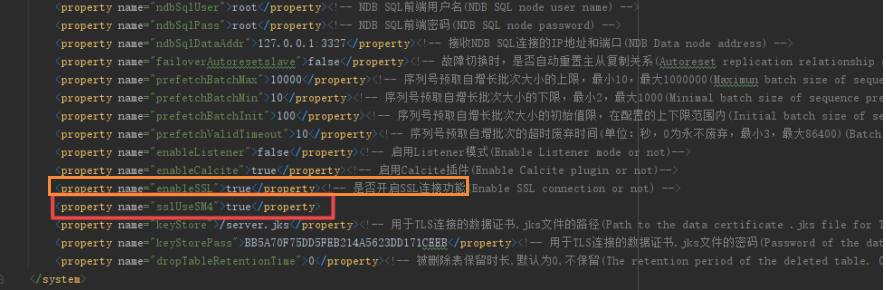

该功能对于用户来说只能通过抓包查看，示例：抓包可见TLS握手包中存在HotDB Server国密SM4定义的加密套件编号：0xff01，说明SM4加解密套件已生效。


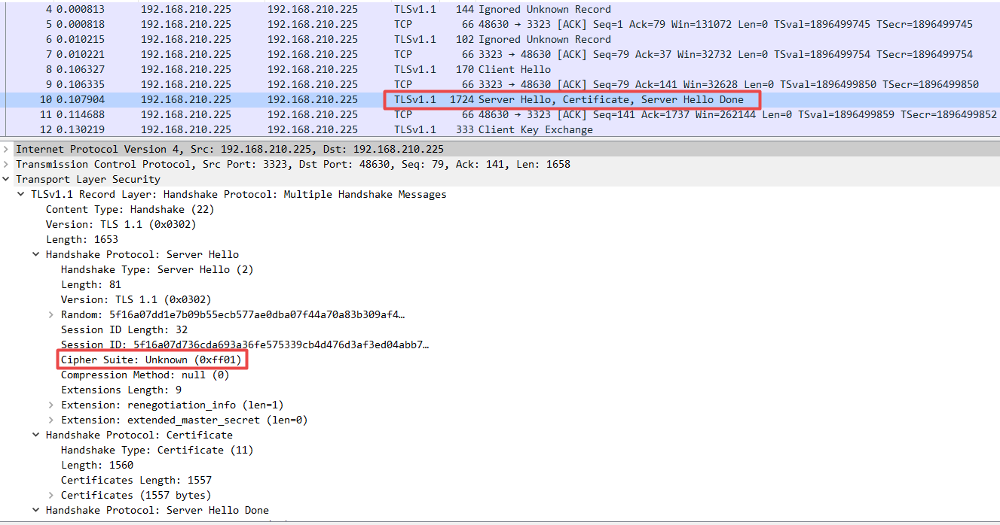

#### statisticsUpdatePeriod

**参数说明：**

| Property | Value |
|----------|-------|
| 参数值 | statisticsUpdatePeriod |
| 是否可见 | 是 |
| 参数说明 | 命令统计持久化周期，单位：毫秒 |
| 默认值 | 0 不持久化 |
| 最小值 | 0 |
| 最大值 | 3600000 |
| Reload是否生效 | 2.4.5版本为N，2.4.7及以上为Y |
| 最低兼容版本 | 2.4.3 |

**参数作用：**

命令统计信息持久化到配置库的周期，单位：毫秒。

若设置为0，程序异常退出不会持久化，若配置的值大于0，则可以定时持久化到数据库，重启也能累计。

在客户端执行SQL语句，会把相关命令统计在配置库中。当设置为0时，则不统计到配置库。

```
mysql> use test_ct

Database changed

mysql> select * from tid;

Empty set (0.03 sec)
```

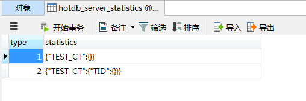

#### strategyForRWSplit

**参数说明：**

| Property | Value |
|----------|-------|
| 参数值 | strategyForRWSplit |
| 是否可见 | 是 |
| 参数说明 | 是否开启读写分离 |
| 默认值 | 0 |
| Reload是否生效 | 是 |
| 最低兼容版本 | 2.4.3 |

**参数作用：**

参数设置为0时，代表不开启读写分离，全部读主机。

```
mysql> select * from ss order by id;
+----+--------+
| id | a      |
+----+--------+
| 1  | master |
| 2  | master |
| 3  | master |
| 4  | master |
| 5  | master |
+----+--------+
5 rows in set (0.00 sec)
```

参数设置为1时，代表可分离的读请求发往所有可用存储节点，根据设置的从机读比例，读取从机或主机。

```
mysql> select * from ss;
+----+--------+
| id | a      |
+----+--------+
| 1  | master |
| 2  | master |
| 3  | master |
| 4  | slave  |
| 5  | slave  |
+----+--------+
5 rows in set (0.00 sec)
```

参数设置为2时，代表可分离的读请求发往可用备存储节点，事务外的读请求全部发往备存储节点，事务内的读请求发往主存储节点。

- 事务外：

```
mysql> select * from ss;
+----+-------+
| id | a     |
+----+-------+
| 1  | slave |
| 2  | slave |
| 3  | slave |
| 4  | slave |
| 5  | slave |
+----+-------+
5 rows in set (0.00 sec)
```

- 事务内：

```
mysql> select * from ss order by id;
+----+—-------+
| id | a      |
+----+—-------+
| 1  | master |
| 2  | master |
| 3  | master |
| 4  | master |
| 5  | master |
+----+—-------+
5 rows in set (0.00 sec)
```

参数设置为3时，代表事务中发生写前的读请求发往可用备存储节点。事务外的读请求发往可用备存储节点。

```
mysql> begin

Query OK, 0 row affected (0.00 sec)

mysql> select * from ss;
+--------+-------+
| id     | a     |
+--------+-------+
| 4      | slave |
| 5      | slave |
| 600004 | write |
| 600007 | write |
| 600013 | write |
| 1      | slave |
| 2      | slave |
| 3      | slave |
+--------+-------+
8 rows in set (0.00 sec)

mysql> insert into ss values(null,'write');

Query OK, 0 row affected (0.01 sec)
mysql> select * from ss;
+--------+--------+
| id     | a      |
+--------+--------+
| 1      | master |
| 2      | master |
| 3      | master |
| 600014 | write  |
| 4      | master |
| 5      | master |
| 600004 | write  |
| 600007 | write  |
| 600013 | write  |
+--------+--------+
9 rows in set (0.00 sec)
```

详细使用方法请参考[读写分离](#高可用服务)。

#### switchByLogInFailover

**参数说明：**

| Property | Value |
|----------|-------|
| 参数值 | switchByLogInFailover |
| 是否可见 | 否 |
| 参数说明 | 控制故障切换时是否由节点下各存储节点Master_Log_File位置决定切换优先级 |
| 默认值 | false |
| Reload是否生效 | 是 |
| 最低兼容版本 | 2.4.5 |

**参数设置：**

```xml
<property name="switchByLogInFailover">false</property><!-- 故障切换时根据Read_Master_Log_Pos选择切换优先级 -->
```

**参数作用：**

- True状态：故障切换优先通过从库同步速度来确定切换的优先级，具体由Master_Log_File和Read_Master_Log_Pos位置决定，优先取同步速度最快的切换，若所有从机Read_Master_Log_Pos位置相同，则再根据设置的优先级匹配。
- False状态：根据用户的故障切换规则进行切换。

> !Note
>
> 手动切换操作不受该参数控制。

#### switchoverTimeoutForTrans

**参数说明：**

| Property | Value |
|----------|-------|
| 参数值 | switchoverTimeoutForTrans |
| 是否可见 | 是 |
| 参数说明 | 手动切换时旧有事务等待提交超时时间（ms） |
| 默认值 | 3000 |
| 最大值 | 1800000 |
| 最小值 | 0 |
| Reload是否生效 | 是 |
| 最低兼容版本 | 2.4.3 |

**参数设置：**

server.xml的switchoverTimeoutForTrans参数设置 如下图:

```xml
<property name="switchoverTimeoutForTrans">3000</property>
```

**参数作用：**

手动主备切换时将等待已经开启的事务提交，超过此参数配置的时间，还没有发出提交请求的事务会被回滚。

即：在手动执行主备切换前，开启执行事务不提交，然后执行手动切换，在超时时间内提交事务，事务可提交成功。若大于超时则前端连接断开，事务自动回滚。

例如：

1. 设置switchoverTimeoutForTrans超时时间36000ms。

2. 开启事务执行插入操作，手动执行主备切换，在36000ms内提交事务。提交成功如下：

   ```
   mysql> begin;

   Query OK, 0 rows affected (0.00 sec)

   mysql> insert into TEST_001 values(1);

   Query OK, 0 rows affected (0.00 sec)

   mysql> commit;

   Query OK, 0 rows affected (0.00 sec)

   mysql> select * from TEST_001;

   +----+
   | id |
   +----+
   | 1  |
   +----+
   1 row in set (0.01 sec)
   ```

   提交事务后查询到id=1

3. 开启事务执行插入操作，手动执行主备切换，超过36000 ms事务未提交，由于提交超时，事务回滚如下：

   ```
   mysql> begin;

   Query OK, 0 rows affected (0.00 sec)

   mysql> insert into TEST_001 values(2);

   Query OK, 0 rows affected (0.00 sec)
   ```

   一分钟后执行查询语句：

   ```
   mysql> select * from TEST_001;

   ERROR 2013 (HY000): Lost connection to MySQL server during query
   ERROR 2016 (HY000): MySQL server has gone away
   No connection. Trying to reconnect...
   Connection id: 40672
   Current database: test_jzl
   ```

   重新登录后查询，发现事务没有提交：

   ```
   mysql> select * from TEST_001;

   +----+
   | id |
   +----+
   | 1  |
   +----+
   1 row in set (0.01 sec)
   ```

#### timerExecutor

**参数说明：**

| Property | Value |
|----------|-------|
| 参数值 | timerExecutor |
| 是否可见 | 是 |
| 参数说明 | 定时器线程数 |
| 默认值 | 4 |
| 最小值 | 2 |
| 最大值 | 8 |
| Reload是否生效 | 否 |
| 最低兼容版本 | 2.4.3 |

**参数设置：**

```xml
<property name="timerExecutor">4</property><!-- 定时器线程数 -->
```

**参数作用：**

参数[adaptiveProcessor](#adaptiveprocessor)默认开启，开启时将由计算节点自动适配最大timerExecutor数。登录3325端口，执行`show @@threadpool;`命令，可查看当前timerExecutor数。

#### timestampProxy

**参数说明：**

| Property | Value |
|----------|-------|
| 参数值 | timestampProxy |
| 是否可见 | 是 |
| 参数说明 | 时间代理模式 |
| 默认值 | 0 |
| Reload是否生效 | 是 |
| 最低兼容版本 | 2.5.1 |

**参数设置：**

timestampProxy参数为0时，代表自动模式，当计算节点检测到存储节点时间差异大于0.5秒时，自动全局代理时间函数。小于0.5秒时，只代理全局表、高精度时间戳和跨节点语句的时间函数。

```xml
<property name="timestampProxy">0</property>
```

参数设置为1时，代表global_table_only，仅全局表模式，计算节点仅代理全局表的时间函数。

```xml
<property name="timestampProxy">1</property>
```

参数设置为2时，代表all，全局模式，计算节点全局代理时间函数。

```xml
<property name="timestampProxy">2</property>
```

**参数作用：**

该参数用于表上有on update current_timestamp属性或SQL里用时间函数的代理，解决对应场景，insert或update操作可能会导致结果异常以及节点间时间数据存在差值的问题。如果timestampProxy设置为0且时间差异过大或者设置为2时，会大幅影响所有UPDATE语句的执行速度与效率。

#### unusualSQLMode

**参数说明：**

| Property | Value |
|----------|-------|
| 参数值 | unusualSQLMode |
| 是否可见 | 隐藏不显示 |
| 参数说明 | 控制unusualSQL输出日志的频率 |
| 默认值 | 1 |
| 最小值 | 0 |
| 最大值 | / |
| Reload是否生效 | 是 |
| 最低兼容版本 | 2.5.5 |

**参数设置：**

unusualSQLMode属隐藏参数，若要开启，需通过管理平台"更多参数"添加并执行reload操作或者手动添加到`server.xml`中。参数默认值为1，配置如下：

```xml
<property name="unusualSQLMode">1</property><!-- 控制unusualSQL输出日志的频率, 0:记录所有计数器，第一次出现时输出日志；1:记录所有SQL；>1:记录所有计数器，计数器每满N时输出日志; -->
```

**参数作用：**

1. 设置为1时：记录所有unusualSQL类型的日志与计数信息,每触发一次都输出对应日志信息且计数器加1。

   **日志同时记录计数器和SQL的场景：**

   1. 第一次触发时日志：

   ```log
   2021-01-13 14:26:46.564 [INFO] [UNUSUALSQL] [$I-NIOExecutor-7-0] cn.hotpu.hotdb.mysql.nio.a(501) - ERROR 1264:Out of range value for column 'id' at row 1 [frontend:[thread=$I-NIOExecutor-7-0,id=169,user=root,host=192.168.240.142,port=3323,localport=26672,schema=CC]; backend:MySQLConnection [node=2, id=247, threadId=27213, state=idle, closed=false, autocommit=true, host=192.168.240.143, port=3310, database=db01, localPort=58336, isClose:false, toBeClose:false, MySQLVersion:5.7.25]; frontend_sql:insert into success(id,name) values(11111111111111111111111111111111111111111111111111111111111111111111111111111111111111111111111111111111111111111111111111111111111111111111111111111111111111111111111111111111111111111111111111111111111111111111111111111111111111111111111111111111111111111111,"lili"); backend_sql:null] [CC.SUCCESS.count]=1
   ```

   2. 第二次触发时日志：

   ```log
   2021-01-13 14:27:38.159 [INFO] [UNUSUALSQL] [$I-NIOExecutor-0-0] cn.hotpu.hotdb.mysql.nio.a(501) - ERROR 1264:Out of range value for column 'id' at row 1 [frontend:[thread=$I-NIOExecutor-0-0,id=169,user=root,host=192.168.240.142,port=3323,localport=26672,schema=CC]; backend:MySQLConnection [node=2, id=298, threadId=27230, state=idle, closed=false, autocommit=true, host=192.168.240.143, port=3310, database=db01, localPort=58370, isClose:false, toBeClose:false, MySQLVersion:5.7.25]; frontend_sql:insert into success(id,name) values(11111111111111111111111111111111111111111111111111111111111111111111111111111111111111111111111111111111111111111111111111111111111111111111111111111111111111111111111111111111111111111111111111111111111111111111111111111111111111111111111111111111111111111111,"haha"); backend_sql:null] [CC.SUCCESS.count]=2
   ```

   后续每一次触发该类计数器，对应日志都正常输出。

   **无日志输出、只在接口统计计数器的场景：**

   每一次触发，计数器都正常统计。

   ```
   mysql> show @@unusualsqlcount;
   +--------------+-------------+-------+
   | unusual_type | unusual_key | count |
   +--------------+-------------+-------+
   | TABLE        | CsC.TEST    | 2     |
   | SCHEMA       | CC          | 1     |
   +--------------+-------------+-------+
   ```

2. 设置为0时：记录所有unusualSQL类型的日志与计数信息，但其日志信息只在第一次出现时输出，后续若再次出现，则只进行个数记录统计并展示在show @@unusualsqlcount结果中。

   日志同时记录计数器和SQL的场景：

   1. 第一次触发时日志：

   ```
   2021-01-13 14:48:55.314 [INFO] [UNUSUALSQL] [$I-NIOExecutor-6-0] cn.hotpu.hotdb.mysql.nio.a(501) - ERROR 1264:Out of range value for column 'id' at row 1 [frontend:[thread=$I-NIOExecutor-6-0,id=106,user=root,host=192.168.240.142,port=3323,localport=27698,schema=CC]; backend:MySQLConnection [node=2, id=262, threadId=27511, state=idle, closed=false, autocommit=true, host=192.168.240.143, port=3310, database=db01, localPort=59424, isClose:false, toBeClose:false, MySQLVersion:5.7.25]; frontend_sql:insert into success(id,name) values(11111111111111111111111111111111111111111111111111111111111111111111111111111111111111111111111111111111111111111111111111111111111111111111111111111111111111111111111111111111111111111111111111111111111111111111111111111111111111111111111111111111111111111111,"zhang"); backend_sql:null] [CC.SUCCESS.count]=1
   ```

   2. 第二次触发时：无对应日志输出

   3. 第三次触发时：无对应日志输出

   后续该类计数器每一次触发，都不再有对应日志输出。

   **无日志输出、只在接口统计计数器的场景：**

   每一次触发，计数器都正常统计。

   ```
   mysql> show @@unusualsqlcount;
   +--------------+-------------+-------+
   | unusual_type | unusual_key | count |
   +--------------+-------------+-------+
   | TABLE        | CC.TEST     | 3     |
   | SCHEMA       | CC          | 1     |
   +--------------+-------------+-------+
   ```

3. 当该参数设置为N（N>1）时：记录所有unusualSQL类型的日志与计数信息，但其日志信息只在每统计满N时输出一次日志，总出现次数依旧可以通过show @@unusualsqlcount结果查看 （此处以N为3进行测试）

   **日志里面同时记录计数器和SQL的场景：**

   1. 第一次触发：无对应日志输出

   2. 第二次触发：无对应日志输出

   3. 第三次触发时日志

   ```
   2021-01-13 15:10:47.953 [INFO] [UNUSUALSQL] [$I-NIOExecutor-4-2] cn.hotpu.hotdb.mysql.nio.a(501) - ERROR 1264:Out of range value for column 'id' at row 1 [frontend:[thread=$I-NIOExecutor-4-2,id=100,user=root,host=192.168.240.142,port=3323,localport=28882,schema=CC]; backend:MySQLConnection [node=2, id=253, threadId=27759, state=idle, closed=false, autocommit=true, host=192.168.240.143, port=3310, database=db01, localPort=60634, isClose:false, toBeClose:false, MySQLVersion:5.7.25]; frontend_sql:insert into success(id,name) values(11111111111111111111111111111111111111111111111111111111111111111111111111111111111111111111111111111111111111111111111111111111111111111111111111111111111111111111111111111111111111111111111111111111111111111111111111111111111111111111111111111111111111111111,"log"); backend_sql:null] [CC.SUCCESS.count]=3
   ```

   4. 第四次触发：无对应日志输出

   后续每当该类计数器统计满3时都会输出对应日志一次。

   **无日志输出、只在接口统计计数器的场景：**

   每一次触发，计数器都正常统计。

   ```
   mysql> show @@unusualsqlcount;
   +--------------+-------------+-------+
   | unusual_type | unusual_key | count |
   +--------------+-------------+-------+
   | TABLE        | CC.TEST     | 4     |
   | SCHEMA       | CC          | 1     |
   +--------------+-------------+-------+
   ```

> !Note
>
> 1. 计数器细化到表级别，针对表级别的每个错误号都有个计数器进行统计
> 2. 日志路径：`/usr/local/hotdb/hotdb-server/logs/extra/unusualsql/hotdb-unusualsql.log`

#### url & username & password{#url-username-password}

**参数说明：**

| Property | Value |
|----------|-------|
| 参数值 | url |
| 是否可见 | 是 |
| 参数说明 | 配置库地址 |
| 默认值 | jdbc:mysql://127.0.0.1:3306/hotdb_config |
| Reload是否生效 | 是 |
| 最低兼容版本 | 2.4.3 |

| Property | Value |
|----------|-------|
| 参数值 | username |
| 是否可见 | 是 |
| 参数说明 | 配置库用户名 |
| 默认值 | hotdb_config |
| Reload是否生效 | 是 |
| 最低兼容版本 | 2.4.3 |

| Property | Value |
|----------|-------|
| 参数值 | password |
| 是否可见 | 是 |
| 参数说明 | 配置库密码 |
| 默认值 | hotdb_config |
| Reload是否生效 | 是 |
| 最低兼容版本 | 2.4.3 |

**参数作用：**

url,username,password属于配套参数，url是存储计算节点配置信息的配置库路径，username,password属于连接该物理库的用户名密码，该配置库用于存储配置信息。

```xml
<property name="url">jdbc:mysql://192.168.200.191:3310/hotdb_config</property><!-- 主配置库地址 -->
<property name="username">hotdb_config</property><!-- 主配置库用户名 -->
<property name="password">hotdb_config</property><!-- 主配置库密码 -->
```

该用户名和密码需要在MySQL实例中创建，并赋予权限方可登录该配置库。用户名和密码均可自定义。

```
mysql> grant select,insert,update,delete,create,drop,index,alter,create temporary tables,references,super,reload,lock tables,replication slave,replication client on *.* to 'hotdb_config'@'%';

Query OK, 0 row affected (0.00 sec)

root> mysql -uhotdb_config_9 -photdb_config_9 -h127.0.0.1 -P3306

mysql: [Warning] Using a password on the command line interface can be insecure.
Welcome to the MySQL monitor. Commands end with ; or g.
Your MySQL connection id is 16323
Server version: 5.7.19-HotDB-2.5.2 HotDB Server by Hotpu Tech
Copyright (c) 2000, 2018, Oracle and/or its affiliates. All rights reserved.
Oracle is a registered trademark of Oracle Corporation and/or its
affiliates. Other names may be trademarks of their respective
owners.
Type 'help;' or 'h' for help. Type 'c' to clear the current input statement.
```

当启动计算节点，没有配置库高可用且配置库无法连接时，计算节点会间隔3秒重连，直到最终重试超过30分钟仍无法连接，则中断启动：

```log
The last packet set successfully to the server was 0 milliseconds ago. The driver has not received any packets from the server.
2018-06-12 15:25:56.789 [ERROR] [INIT] [main] HotdbConfig(275) -- no available config datasources. retry in 3 seconds.
```

#### usingAIO

**参数说明：**

| Property | Value |
|----------|-------|
| 参数值 | usingAIO |
| 是否可见 | 否 |
| 参数说明 | 是否使用AIO |
| 默认值 | 0 |
| Reload是否生效 | 否 |
| 最低兼容版本 | 2.4.3 |

**参数设置：**

```xml
<property name="usingAIO">0</property><!-- 是否使用AIO，是：1，否：0 -->
```

当参数为0时，计算节点使用的是NIO，标记AIO与NIO互斥。

**参数作用：**

用于设置当前计算节点是否启用AIO。

AIO：异步非阻塞，服务器实现模式为一个有效请求创建一个线程，客户端的I/O请求都是由OS先完成了再通知服务器应用去启动线程进行处理，IO方式适用于连接数目多且连接比较长（重操作）的架构。由于目前Linux上AIO的实现尚未完成，计算节点对AIO的优化也远远不如NIO，建议不要开启这个参数。

```
root> tail -n 300 hotdb.log | grep 'aio'
2018-06-01 13:51:18.961 [INFO] [INIT] [main] j(-1) -- using aio network handler
2018-06-01 13:52:19.644 [INFO] [INIT] [main] j(-1) -- using aio network handler
```

#### version

**参数说明：**

| Property | Value |
|----------|-------|
| 参数值 | version |
| 是否可见 | 隐藏 |
| 参数说明 | 计算节点对外显示的版本号 |
| 默认值 | 与计算节点`show @@version`的结果同步，例如：5.6.29-HotDB-2.5.1。 |
| Reload是否生效 | 是 |
| 最低兼容版本 | 2.4.3 |

**参数作用：**

计算节点对外显示的版本号，可自定义修改，能指定低版本的相关连接协议。

```xml
<property name="version">**5.6.1**</property><!-- 版本号 -->
```

登陆MySQL 实例时可查看相应版本号：

```
root> mysql -uct -pct -h127.0.0.1 -P2473

mysql: [Warning] Using a password on the command line interface can be insecure.
Welcome to the MySQL monitor. Commands end with ; or g.
Your MySQL connection id is 30
Server version:** 5.6.1**-HotDB-2.4.7 HotDB Server by Hotpu Tech
Copyright (c) 2000, 2017, Oracle and/or its affiliates. All rights reserved.
Oracle is a registered trademark of Oracle Corporation and/or its
affiliates. Other names may be trademarks of their respective
owners.
Type 'help;' or 'h' for help. Type 'c' to clear the current input statement.

root@127.0.0.1:(none) 5.6.1-HotDB-2.4.7 04:20:14> select version();
+-----------------------+
| VERSION()            |
+-----------------------+
| 5.6.1-HotDB-2.4.7     |
+-----------------------+
1 row in set (0.03 sec)
```

> !Note
>
> 当没有配置此参数时：所有存储节点的最低版本号低于或等于计算节点支持的最高版本号时，对外显示所有存储节点中最低的版本号；存储节点的版本号超过计算节点支持的最高版本号时，对外显示计算节点最高支持的协议版本的一个完整版本号，当前最高支持到8.0.15。当配置了此参数时，这个参数会改变对外显示的版本号。

#### versionComment

**参数说明：**

| Property | Value |
|----------|-------|
| 参数值 | versionComment |
| 是否可见 | 隐藏 |
| 参数说明 | 计算节点的版本备注信息 |
| 默认值 | （空） |
| Reload是否生效 | 是 |
| 最低兼容版本 | 2.5.3 |

**参数作用：**

计算节点对外显示的版本备注信息，可自定义修改，及配合Version参数使用。如果该参数值为其他字符串，则将原版本备注信息替换为配置的字符串；若不想显示任何备注信息，可配置为空格（实际显示也是空格）； 若不配置任何值，则默认显示：HotDB-2.5.5 HotDB Server by Hotpu Tech （2.5.5为计算节点自身的版本号）。根据需求配置后，可登陆管理端、服务端查看效果。

例如：

配置为空：`<property name="versionComment"></property>`，连接计算节点：

```
[root@hotdb]## mysql -uroot -proot -P3323 -h192.168.210.49

mysql: [Warning] Using a password on the command line interface can be insecure.
Welcome to the MySQL monitor. Commands end with ; or g.
Your MySQL connection id is 235
Server version: 5.7.23 HotDB-2.5.3 HotDB Server by Hotpu Tech
......
```

配置为空格：`<property name="versionComment"> </property>`，连接计算节点：

```
[root@hotdb]## mysql -uroot -proot -P3323 -h192.168.210.49

mysql: [Warning] Using a password on the command line interface can be insecure.
Welcome to the MySQL monitor. Commands end with ; or g.
Your MySQL connection id is 235
Server version: 5.7.23
......
```

配置为自定义字符串：`<property name="versionComment">hotpu</property>`，连接计算节点：

```
[root@hotdb]## mysql -uroot -proot -P3323 -h192.168.210.49

mysql: [Warning] Using a password on the command line interface can be insecure.
Welcome to the MySQL monitor. Commands end with ; or g.
Your MySQL connection id is 235
Server version: 5.7.23 hotpu
......
```

> !Note
>
> 连接后的status结果及客户端连接计算节点时的提示信息均会同步按照版本备注信息显示。例如：
>
> ```
> root@192.168.210.49:(none) 5.7.23 08:41:42> status;
> --------------
> mysql Ver 14.14 Distrib 5.7.21, for linux-glibc2.12 (x86_64) using EditLine wrapper
> Connection id: 444
> Current database:
> Current user: root@192.168.210.49
> SSL: Not in use
> Current pager: stdout
> Using outfile: ''
> Using delimiter: ;
> Server version: 5.7.23 hotpu
> Protocol version: 10
> Connection: 192.168.210.49 via TCP/IP
> ......
> ```

#### VIP & checkVIPPeriod

**参数说明：**

| Property | Value |
|----------|-------|
| 参数值 | [VIP](https://dev.mysql.com/doc/refman/5.6/en/server-system-variables.html#sysvar_back_log) |
| 是否可见 | 是 |
| 参数说明 | 虚拟IP地址 |
| 默认值 | 空 |
| Reload是否生效 | 是 |
| 最低兼容版本 | 2.4.8 |

| Property | Value |
|----------|-------|
| 参数值 | CheckVIPPeriod |
| 是否可见 | 是 |
| 参数说明 | 检测VIP周期 |
| 默认值 | 500ms |
| 最小值 | 10ms |
| 最大值 | 1000ms |
| Reload是否生效 | 是 |
| 最低兼容版本 | 2.4.8 |

VIP与checkVIPPeriod属于配套参数，VIP设置为Keepalived虚拟IP，checkVIPPeriod用于控制虚拟IP的检测频率。当计算节点开启了VIP检测时，如果备状态的计算节点发现VIP存在则自动执行online，如果主状态的计算节点发现VIP不存在则自动offline。该组参数适用于计算节点高可用环境，建议在计算节点主备节点的环境下配置，且需要设置为当前Keepalived的实际虚拟IP，若不设置或者设置错误将不做处理，单计算节点可忽略该参数。

**参数设置：**

server.xml的VIP参数设置为Keepalived的虚拟IP，CheckVIPPeriod为检测周期，单位ms

```xml
<property name="VIP">192.168.220.106</property><!-- 虚拟IP(不填或格式不为IPv4表示此选项为空) -->
<property name="checkVIPPeriod">500</property><!-- 虚拟IP检测周期(如VIP有效，检测VIP周期，单位ms) -->
```

查看Keepalived的配置脚本：

```bash
cat /etc/keepalived/keepalived.conf
```

确定对应IP：

```
virtual_ipaddress {
  192.168.220.106/24 dev bond0 label bond0:1
}
```

**参数作用：**

用于计算节点高可用的环境中，在root密码有变更的情况下进行高可用切换时根据VIP存在性的方式进行检测与切换，规避修改密码后无法切换的场景：

主计算节点：

```log
2019-12-19 15:08:49.595 [INFO] [EXIT[ FLOW]] [ShutdownHook] cn.hotpu.hotdb.c(691) - begin to exit...
2019-12-19 15:08:49.596 [WARN] [CONNECTION] [ShutdownHook] cn.hotpu.hotdb.net.t(175) - HotDB SocketChannel close due to:System exit
2019-12-19 15:08:49.597 [WARN] [CONNECTION] [ShutdownHook] cn.hotpu.hotdb.net.t(175) - HotDB SocketChannel close due to:System exit
2019-12-19 15:08:49.598 [WARN] [CONNECTION] [ShutdownHook] cn.hotpu.hotdb.net.q(349) - processor close due to:System exit
2019-12-19 15:08:49.598 [WARN] [CONNECTION] [ShutdownHook] cn.hotpu.hotdb.net.q(349) - processor close due to:System exit
2019-12-19 15:08:49.599 [WARN] [CONNECTION] [ShutdownHook] cn.hotpu.hotdb.net.q(349) - processor close due to:System exit
```

备计算节点：

```log
2019-12-19 15:09:02.911 [INFO] [MANAGER] [Labor-2] cn.hotpu.hotdb.c(2165) - MANAGER online end
2019-12-19 15:09:02.911 [INFO] [MANAGER] [Labor-2] cn.hotpu.hotdb.c(2134) - VIP online start
2019-12-19 15:09:02.911 [INFO] [TIMER] [Labor-2] cn.hotpu.hotdb.c(2148) - CheckVIP timer execute online...
2019-12-19 15:09:03.142 [INFO] [INIT] [$I-NIOREACTOR-1-RW] cn.hotpu.hotdb.c(3594) - persist sequence at abnormal starting server.
2019-12-19 15:09:03.143 [INFO] [INIT] [Labor-7] cn.hotpu.hotdb.c(1300) - start xa recover in starter
2019-12-19 15:09:03.150 [INFO] [INIT] [$I-NIOREACTOR-1-RW] cn.hotpu.hotdb.g.c.a.a.g(205) - wait datanodes synchronizing to recover XA transactions.
2019-12-19 15:09:03.207 [INFO] [INIT] [$NIOREACTOR-6-RW] cn.hotpu.hotdb.g.c.a.a.k(130) - no xa recover result
2019-12-19 15:09:03.249 [INFO] [INIT] [$NIOREACTOR-1-RW] cn.hotpu.hotdb.c(1442) - persist XID at abnormal starting server.
2019-12-19 15:09:03.257 [INFO] [MANAGER] [Labor-7] cn.hotpu.hotdb.a(5360) - Some sharding table have unique key, and the unique key don't contain rule column, you can turn on global unique key according to the actual.
2019-12-19 15:09:03.340 [INFO] [INIT] [Labor-7] cn.hotpu.hotdb.c(1808) - HotDB-Server listening on 3323
2019-12-19 15:09:03.340 [INFO] [INIT] [Labor-7] cn.hotpu.hotdb.c(1809) - ===============================================
2019-12-19 15:09:03.350 [INFO] [WATCHDOG] [Labor-7] cn.hotpu.hotdb.f(197) - Watchdog started.
2019-12-19 15:09:03.712 [INFO] [TIMER] [Labor-2] cn.hotpu.hotdb.c(2150) - CheckVIP timer finish online.
2019-12-19 15:09:03.713 [INFO] [MANAGER] [Labor-2] cn.hotpu.hotdb.c(2165) - VIP online end
```

#### waitConfigSyncFinish

**参数说明：**

| Property | Value |
|----------|-------|
| 参数值 | waitConfigSyncFinish |
| 是否可见 | 否 |
| 参数说明 | 启动时是否等待配置库同步追上 |
| 默认值 | false |
| Reload是否生效 | 否 |
| 最低兼容版本 | 2.4.3 |

**参数设置：**

```xml
<property name="waitConfigSyncFinish">true</property><!-- 启动时是否等待配置库同步追上 -->
```

**参数作用：**

用于设置启动时是否等待配置库同步追上。默认关闭，启动时若连上主配置库则不等待复制追上，开启开关，当选定的当前配置库配置有MySQL复制作为某个实例的从机，且复制存在延迟时的情况下，需要等到当前配置库追上复制，确保当前使用的配置库的数据为最新的数据，才继续启动。

关闭状态：启动时若连上主配置库，则若当前配置库存在延迟的情况下也直接继续启动：

```log
2018-06-01 16:21:14.958 [INFO] [INIT] [main] j(-1) - reading config...
2018-06-01 16:21:15.170 [INFO] [INIT] [main] a(-1) - using config datasource in start up:[id:-1,nodeId:-1 l27.0.0.l:3306/hotdb_config_249 status:l,charset:utf8]
2018-06-01 16:21:15.518 [INFO] [INIT] [main] a(-1) - master config datasource [id:-1,nodeId:-1 l27.0.0.l:3306/hotdb_config_249 status:l,charset:utf8] connect success.
2018-06-01 16:21:16.892 [INFO] [INIT] [main] j(-1) - ===============================================
2018-06-01 16:21:16.893 [INFO] [INIT] [main] j(-1) - HotDB-2.4.9 is ready to startup ...
2018-06-01 16:21:16.894 [INFO] [INIT] [main] j(-1) - Sysconfig params:SystemConfig [ frontwriteQueueSize=2048, serverPort=9993, managerPort=999S, charset=utf8, processors=8, processorExecutor=4, timerExecutor=4, managerExecutor=2, idleTimeout=28800, processorcheckPeriod=1000, dataNodeIdleCheckPeriod=120, dataNodeHeartbeatPeriod=3000, txIsolation=2, processorBufferPool=163840000, processorBufferchunk=16384, enableXA=false, enableHeartbeat=true, sqlTimeout=42100, configDatabase=jdbc:mysql://l27.0.0.l:3306/hotdb_config_249,backConfigDatasource=jdbc:mysql://l27.0.0.l:3306/botdb_config_249, usingAIO=0, hastate=master, cryptMandatory=false, autoIncrement=true, heartbeatPeriod=1, heartbeatTimeoutMs=100, joinable=true, joincachesize=4, errorsPermittedInTransaction=true, strategyForRWSplit=3, deadlockCheckPeriod=0, maxAllowedPacket=64M,viP=nul1,checkVIPPeriod=l600]
2018-06-01 16:21:17.210 [INFO] [INIT] [main] BufferPool(-1) - total buffer:163840000,every chunk bytes:16384,chunk number:10000,every threadLocalMaxNumber:10000
2018-06-01 16:21:17.216 [INFO] [INIT] [main] j(-1) - usinq aio network handler
```

开启的状态下：

需要等到复制同步后才继续启动

```log
2018-07-12 14:28:52.019 [INFO] [INIT] [$NIOREACTOR-9-RW] XAInitRecoverHandler(125) -- wait for config datasource synchronizing...
```

#### waitForSlaveInFailover

**参数说明：**

| Property | Value |
|----------|-------|
| 参数值 | waitForSlaveInFailover |
| 是否可见 | 是 |
| 参数说明 | 高可用切换是否等待从机追上复制 |
| 默认值 | true |
| Reload是否生效 | 是 |
| 最低兼容版本 | 2.4.3 |

**参数设置：**

```xml
<property name="waitForSlaveInFailover">true</property><!---高可用切换是否等待从机追上复制
```

**参数作用：**

用于设置高可用中是否等待从机追上复制。

开启状态：

当从机存在复制延迟时，无法切换到从机上, 计算节点会一直检测，等到复制追平才能进行切换：

```
mysql> show @@latency;
+----+----------------------------+----------------------------+----------+
| dn | info                       |                            | latency  |
+----+----------------------------+----------------------------+----------+
| 4  | 192.168.200.51:3310/phy248 | 192.168.200.51:3310/phy248 | 0 ms     |
| 5  | 192.168.200.51:3311/phy248 | 192.168.200.51:3311/phy248 | 0 ms     |
| 6  | 192.168.200.51:3312/phy248 | 192.168.200.51:3312/phy248 | 19582 ms |
| 7  | 192.168.200.51:3313/phy248 | 192.168.200.51:3313/phy248 | 0 ms     |
+----+----------------------------+----------------------------+----------+
4 rows in set (0.02 sec)
```

日志能够看到提示不再用故障的主存储节点，并且不会启用没有复制同步追上的存储节点：


```log
2018-06-08 10:36:47.921 [INFO] [FAILOVER] [Labor-1552] j(-1) - slave_sql_running is Yes in :[id:178,nodeId:6 192.168.200.52:3312/phy248 status:1,charset:utf8] during failover of datanode 6
2018-06-08 10:36:48.417 [WARN] [HEARTBEAT] [$NIOConnector] m(-1) - datasoruce 6 192.168.200.51:3312/phy248 init heartbeat failed due to：Get backend connection failed:java.net.ConnectException:connection refused
2018-06-08 10:36:48.418 [WARN] [HEARTBEAT] [$NIOConnector] m(-1) - datasoruce 6 192.168.200.51:3312/phy248 init heartbeat failed due to：Get backend connection failed:cn.hotpu.hotdb.h.l:java.net.connectException: connection refused
2018-06-08 10:36:48.918 [WARN] [HEARTBEAT] [$NIOConnector] m(-1) - datasoruce 6 192.168.200.51:3312/phy248 init heartbeat failed due to：Get backend connection failed:j ava.net.ConnectException: connection refused
2018-06-08 10:36:48.918 [WARN] [HEARTBEAT] [$NIOConnector] m(-1) - datasoruce 6 192.168.200.51:3312/phy248 init heartbeat failed due to：Get backend connection failed:cn.hotpu.hotdb.h.l:java.net.connectException: connection refused
2018-06-08 10:36:48.982 [INFO] [FAILOVER] [Labor-1552] j(-1) - masterLogFile:mysql-bin.000518,readMasterLogFile:mysql-bin.000518,readMasterLogPos:384545127,execMaster LogPos:384512435,relayLogFiTe:mysql-relay-bin.000002,relayLogPos; 248414,secondBehindMaster:19,execLogchanged:true in slave: MySQLConnection [node=6, id=140, threadId=3 15945, state=borrowed, closed=false, autocommit=true, host=192.168.200.52, port=3312, database=phy248, localPort=64694, isClose:false, toBeclose:false]
```

关闭状态：

当主从存储节点存在复制延迟时，可以直接切换到从机，不再等待复制追上：

```log
2018-06-08 16:19:22.864 [INFO] [FAILOVER] [Labor-1852] bh(-1) -- switch datasource:6 for datanode:6 successfully by Manager.
```

> !Note
>
> 在计算节点版本高于2.5.6 （包含）调整了master_delay对切换的影响，waitForSlaveInFailover参数（高可用切换是否等待从机追上复制）开启，当切换时检测到有master_delay的延时设置，会自动在追复制前取消，切换成功后恢复延时复制的设置。若取消master_delay后的复制延迟仍大于10s，则不允许切换，master_delay也会恢复之前设置的值。

#### waitSyncFinishAtStartup

**参数说明：**

| Property | Value |
|----------|-------|
| 参数值 | waitSyncFinishAtStartup |
| 是否可见 | 是 |
| 参数说明 | 启动时是否等待主存储节点同步追上 |
| 默认值 | true |
| Reload是否生效 | 否 |
| 最低兼容版本 | 2.4.3 |

**参数设置：**

```xml
<property name="waitSyncFinishAtStartup">true</property><!-- 启动时是否等待主存储节点同步追上 -->
```

**参数作用：**

启动时是否等待主存储节点同步追上，开启开关，启动计算节点时，等待存储节点复制追平，从而保证存储节点数据一致且为最新。

前提条件：

在主存储节点延迟未同步追上的情况下，启动计算节点会提示当前存储节点复制没有同步追上，需要等到复制追上之后再提供服务。

开启开关：启动计算节点时，等待存储节点主从复制追平，从而保证存储节点数据一致且为最新：

```log
2018-06-01 17:15:12.990 [info] [INIT] [$NIOREACTOR-3-RW] k(-1) - masterLogFile:mysql-bin.000667,relayMasterLogFile:mysql-bin.000667,readMasterLogPos:4668659,execMasterLogPos:4555931,relayLogFile:mysql-relay-bin.000004,relayLogPos: 2121597,secondBehindMaster:90,execLogchanged:true in server:MySQLConnection [node=3, id=41, threadId=l7054, state=running, closed=false, autocommit=true, host=192.168.200.52, port=3310, database=db249, localPort=18965, isClose:false, toBeClose:false]
2018-06-01 17:15:12.990 [info] [INIT] [$NIOREACTOR-3-RW] k(-1) - masterLogFile:mysql-bin.000667,relayMasterLogFile:mysql-bin.000667,readMasterLogPos: 4669275,execMasterLogPos:4555931,relayLogFile:mysql-relay-bin.000004,relayLogPos: 2121597,secondBehindMaster:90,execLogchanged:true in server:MySQLConnection [node=3, id=50, threadId=l7084, state=running, closed=false, autocommit=true, host=192.168.200.52, port=3310, database=db249, localPort=20329, isClose:false, toBeClose:false]
2018-06-01 17:15:12.990 [info] [INIT] [$NIOREACTOR-3-RW] k(-1) - masterLogFile:mysql-bin.000667,relayMasterLogFile:mysql-bin.000667,readMasterLogPos: 4670199,execMasterLogPos: 4557471,relayLogFile:mysql-relay-bin.000004,relayLogPos: 2122521,secondBehindMaster:90,execLogchanged:true in server:MySQLConnection [node=3, id=41, threadId=l7054, state=running, closed=false, autocommit=true, host=192.168.200.52, port=3310, database=db249, localPort=18965, isClose:false, toBeClose:false]
```

关闭开关：无其他异常，可以直接初始化存储节点

```log
2018-06-01 16:21:14.958 [INFO] [INIT] [main] j(-1) - reading config...
2018-06-01 16:21:15.170 [info] [INIT] [main] a(-1) - using config datasource in start up:[id:-1,nodeld:-1 l27.0.0.1:3306/hotdb_config_249 status:1,charset:utf8]
2018-06-01 16:21:15.518 [info] [INIT] [main] a(-1) - master config datasource [id:-1,nodeld:-1 l27.0.0.1:3306/hotdb_config_249 status:1,charset:utf8] connect success.
2018-06-01 16:21:16.892 [info] [INIT] [main] j(-1) - ===============================================
2018-06-01 16:21:16.893 [info] [INIT] [main] j(-1) - HotDB-2.4.9 is ready to startup ...
2018-06-01 16:21:16.894 [info] [INIT] [main] j(-1) - Sysconfig params:SystemConfig [ frontwriteQueueSize=2048, service port=9993, management port=9995, charset=utf8, processors=8, processorExecutor=4, timerExecutor=4, managerExecutor=2, idleTimeout=28800, processorcheckPeriod=1000, dataNodeIdleCheckPeriod=120, dataNodeHeartbeatPeriod=3000, txIsolation=2, processorBufferPool=163840000, processorBufferChunk=16384, enableXA=false, enableHeartbeat=true, sqlTimeout=42100, configDatabase=jdbc:mysql://127.0.0.1:3306/hotdb_config_249,backConfigDatasource=jdbc:mysql://127.0.0.l:3306/hotdb_config_249, usingAIO=o, hastate=master, cryptMandatory=false, autoIncrement=true, heartbeatPeriod=l, heartbeatTimeoutMs=l00, joinable=true, joinCacheSize=4, errorsPermittedInTransaction=true, strategyForRWSplit=3, deadlockCheckPeriod=0, maxAllowedPacket=64M,VIP=null,checkVIPPeriod=1600]
2018-06-01 16:21:17.210 [info] [INIT] [main] BufferPool(-1) - total buffer:163840000,every chunk bytes:16384,chunk number:10000,every threadLocalMaxNumber:1000
2018-06-01 16:21:17.216 [info] [INIT] [main] j(-1) - usinq aio network handler
```

#### weightForSlaveRWSplit

**参数说明：**

| Property | Value |
|----------|-------|
| 参数值 | weightForSlaveRWSplit |
| 是否可见 | 是 |
| 参数说明 | 从机读比例，默认50（百分比） |
| 默认值 | 50（%） |
| 最小值 | 0 |
| 最大值 | 100 |
| Reload是否生效 | 是 |
| 最低兼容版本 | 2.4.4 |

**参数设置：**

server.xml的weightForSlaveRWSplit参数设置为50：

```xml
<property name="weightForSlaveRWSplit">50</property>
```

**参数作用：**

weightForSlaveRWSplit和strategyForRWSplit参数属于配套参数，读写分离策略为1（可分离的读请求发往所有可用存储节点）时，从机读比例才有意义。若从机延迟超过可读从库阈值的情况下则读主库。

一主一从的情况下：从机的读取比例默认50%

一主多从情况下，例如一主双从，主的读取比例50%，从机A读取比例25%，从机B读取比例25%。

例如：

主库标识：name=Master

```
mysql> select * from vrab001;
+----+--------+
| id | name   |
+----+--------+
| 1  | Master |
| 2  | Master |
| 3  | Master |
| 4  | Master |
+----+--------+
```

备库标识：name=Slave

```
mysql> select * from vrab001;
+----+-------+
| id | name  |
+----+-------+
| 1  | slave |
| 2  | slave |
| 3  | slave |
| 4  | slave |
+----+-------+
```

多次执行select查询操作，主从各读50%。

## 附录

### HotDB Server注意事项

#### JDBC版本建议

建议JDBC的版本使用mysql-connector-java-5.1.27.jar，最高可兼容到8.0。

#### JAVA数据库连接池建议

建议连接池使用proxool-0.9。

#### log4j的日志类型

若开启了日志记录相关参数仍无法找到该日志类型的记录，例如，开启参数recordDDL却无法查看DDL相关的记录，可检查HotDB Server安装目录/conf目录下的log4j2.xml下，与"特殊SQL记录在另外一个文件"的相关代码中是否有对应日志类型。

```xml
<!-- 特殊SQL记录在另外一个文件 -->
<filters>
<MarkerFilter marker="DDL" onMatch="**ACCEPT**" onMismatch="NEUTRAL"></MarkerFilter>
</filters>
```

以及"不在hotdb.log中记录特殊SQL"的相关代码中不存在对应日志类型：

```xml
<!-- 不在hotdb.log中记录特殊SQL -->
<filters>
<MarkerFilter marker="DDL" onMatch="**DENY**" onMismatch="NEUTRAL"></MarkerFilter>
</filters>
```

Marker所有类型(All Markers)：AUTHORITY, BUFFER, CONNECTION, DEADLOCK, EXIT, FAILOVER, HEARTBEAT, HOLD, INIT, INNER, JOIN, MANAGER, ONLINEDDL, RELATIVE, RESPONSE, ROUTE, SQL, SQLSYNTAXERROR, CROSSDNJOIN, UNION, SUBQUERY, MYSQLWARNING, MYSQLERROR, HOTDBWARNING, HOTDBERROR, LIMITOFFSETWITHOUTORDERBY, SQLKEYCONFLICT, SQLUNSUPPORTED, DDL, SQLINTERCEPTED, TIMER, TRANSFER, WATCHDOG。

#### 数据库设计的保留字段

计算节点可根据DNID来显示数据来源的数据节点，故DNID为数据库的保留字段（表结构中请勿使用该字段名称）。

计算节点判断存储节点是否可用，是通过对存储节点hotdb_heartbeat表的操作来判断的，故hotdb_heartbeat作为表名称的保留字。
