# 可视化机房

## 功能背景

HotDB Server计算节点和管理平台在2.5.3.1及以上版本支持了跨机房灾备方案。但若发生了机房级别的故障，用户需要线下人工检测判断修复后，手动切换，运维成本很高。故在计算节点和管理平台版本高于（包含）2.5.6时，引入了由管理平台可视化操作机房切换、机房回切、移除机房、修复机房、灾备演练等功能，可侧面提高机房操作的可靠性以及易用性。

## 计算节点集群

### 切换为主机房入口

#### 中心机房为当前主机房

中心机房为当前主机房时，以下两种情况提供[切换为主机房](#切换为主机房)按钮入口：

1. 中心机服务端口和管理端口连接正常，灾备机房管理端口连接正常
2. 仅灾备机房管理端口可连接

中心机房服务端口和管理端口连接正常，灾备机房管理端口连接正常时。[切换为主机房](#切换为主机房)入口：

仅灾备机房管理端口可连时，集群名称橙色标记。[切换为主机房](#切换为主机房)入口：

#### 灾备机房为当前主机房

灾备机房为当前主机房时，不提供[切换为主机房](#切换为主机房)按钮入口

### 修复机房入口

当灾备机房为当前主机房且灾备机房的服务端口和管理端口连接正常时，中心机房提供[修复机房](#修复机房)按钮入口：

### 移除机房入口

中心机房为当前主机房，且中心机房服务端口和管理端口连接正常，灾备机房提供[移除机房](#移除机房)按钮入口：

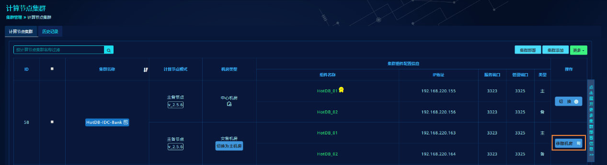

灾备机房为当前主机房，且灾备机房服务端口和管理端口连接正常，中心机房提供[移除机房](#移除机房)按钮入口：

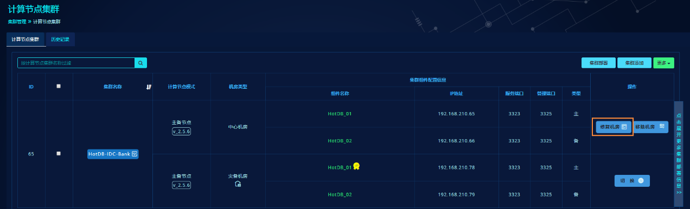

### 其它说明

当HotDB Server 版本高于2.5.6 （包含）且开启灾备模式时，展开更多集群部署信息时，【修复机房】【移除机房】【切换】【重建】按钮均显示小图标，鼠标悬停图标显示按钮信息。

- 修复机房图标：
- 移除机房图标：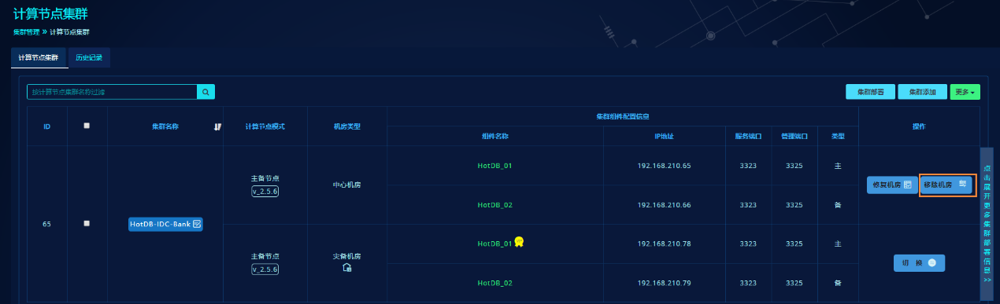
- 切换(机房内)图标：
- 重建(机房内)图标：

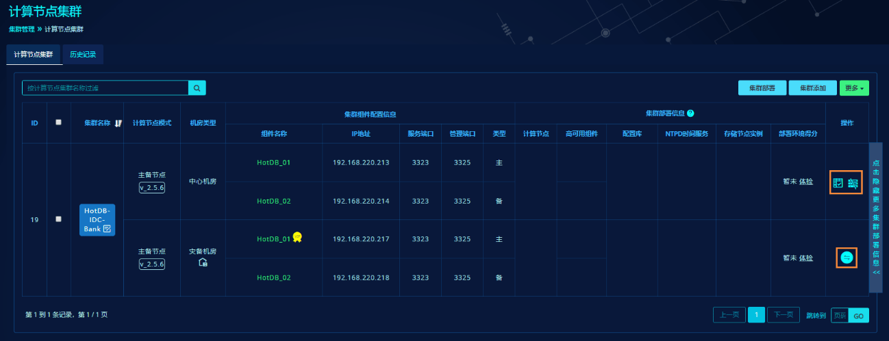

## 切换为主机房

切换为主机房主要包含：集群信息确认、切换前预检测及数据备份、中心机房处理策略选择、正式切换机房、完成切换五个步骤。根据切换策略的选择，将机房切换为主机房运行，同时存储节点角色、配置库角色根据切换策略做出对应变更。

### 中心机房服务端口连接正常

#### 集群信息确认

集群信息确认页面包含计算节点集群信息确认、计算节点集群备份信息确认、机房切换结果确认。

**计算节点集群信息确认**

- 当前机房：显示当前主机房和备机房信息
- 主计算节点：显示当前机房的主计算节点及VIP
- 服务状态：显示当前机房的主计算节点的服务端口/管理端口的连接状态
- 备计算节点：显示当前机房的备计算节点
- 服务状态：显示当前机房的备计算节点的服务端口/管理端口的连接状态

**计算节点集群备份信息确认**

计算节点集群备份信息确认模块默认全部勾选备份项，也可自行选择备份项，且至少选择一项后，【下一步】按钮才正常开放允许点击进入下一步骤

**机房切换结果确认**

显示机房切换后主机房及主计算节点信息

#### 切换前预检测及数据备份

对机房切换前，集群运行状态、各项配置信息、及节点的复制延迟、复制关系等做全面检测，以保证在机房切换后的计算节点、存储节点的正常运行及数据的准确性。切换前的数据备份则保证在机房切换失败的情况下数据不会丢失。

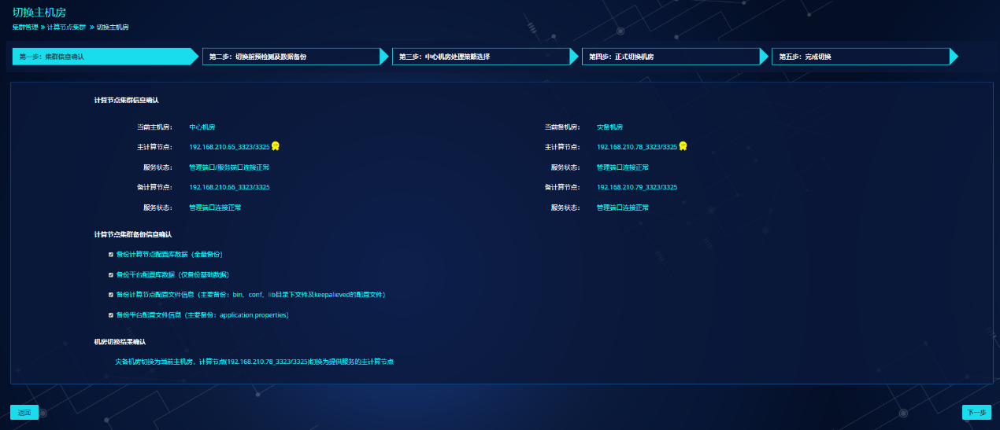

**页面按钮说明**

- 重试：重试执行当前步骤检测
- 忽略该项继续进行下一步：跳过该步骤，执行下一步骤检测
- 返回：返回[集群信息确认](#集群信息确认)页面
- 下一步：当前页面所有检测及备份通过后才可点击，否则置灰无法执行下一步

切换前要求所有检测项都通过才能进行下一步骤，否则必须人工介入解决不通过项的异常问题

1. 中心机房的计算节点高可用状态异常

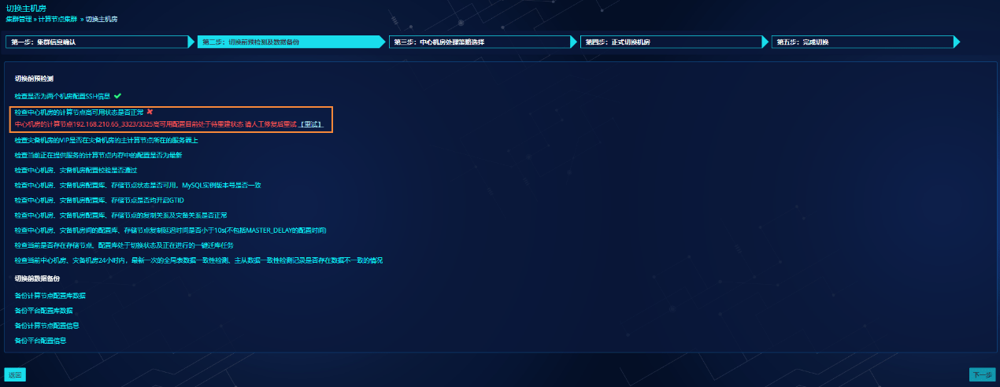

2. 中心机房存储节点不可用

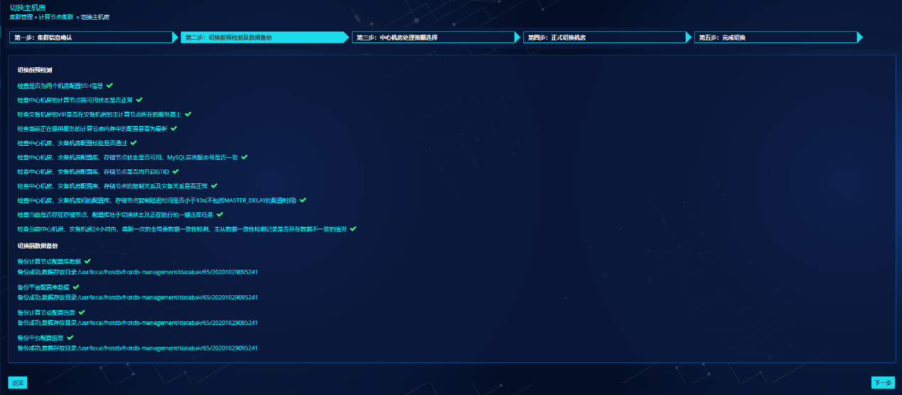

3. 存储节点灾备关系异常

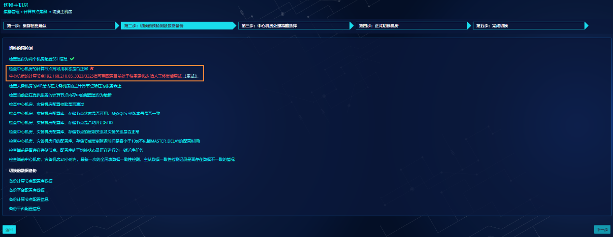

4. 24小时内未对所有数据做主备一致性检测和全局一致性检测

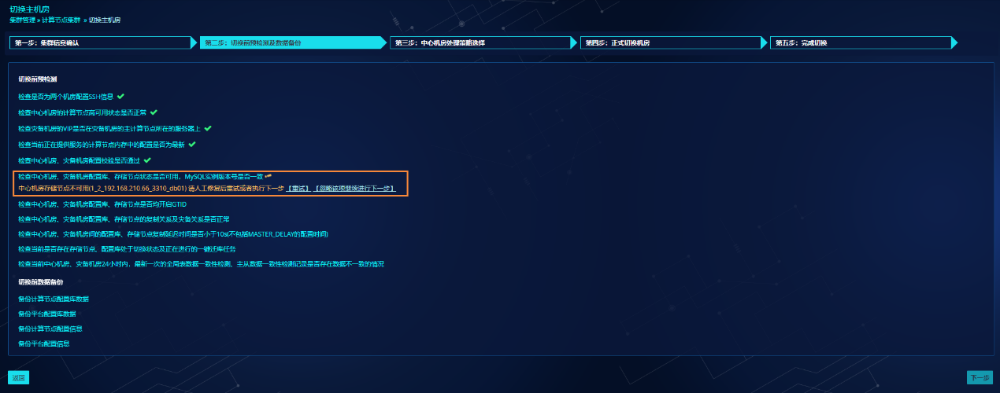

切换前数据备份模块主要是将上一步中选择的备份项进行数据备份，数据存放在当前管理平台`hotdb-management/databak/集群编号/备份时间戳`目录下

#### 中心机房处理策略选择

主要有三种切换策略：

1. 保留当前中心机房并交换角色使其成为灾备机房
2. 删除当前中心机房，将灾备机房作为单机房模式进行管理
3. 仅将当前主机房切换至灾备机房，切换后再做决策

默认勾选第一种切换策略。

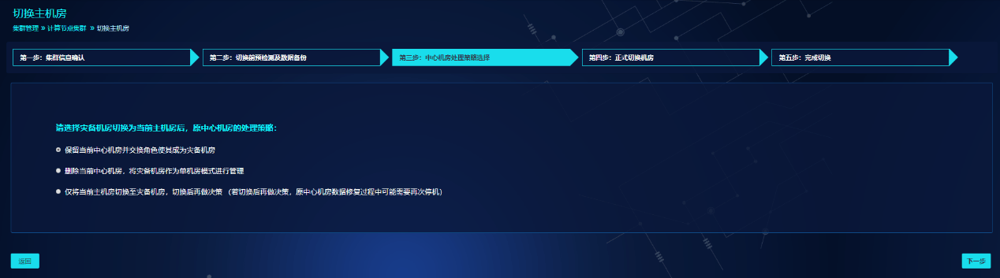

#### 正式切换机房

正式切换机房前需再次确认，且根据选择策略显示

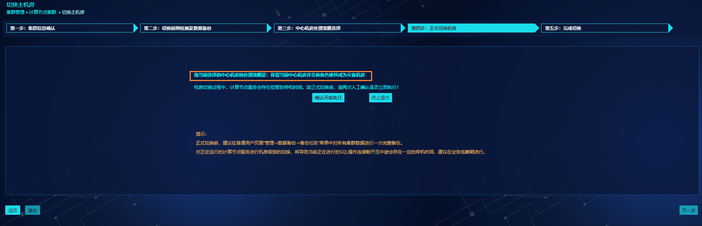

正式切换机房对必要条件的再次检测，在该步骤检测过程中，可以点击退出按钮退出切换为主机房任务，对必要条件再次检测步骤结束后无法退出

正式切换机房页面处于检测阶段中途退出的切换主机房任务，在24小时内均可以接着上一次的切换任务继续进行，也可以取消上一次任务，发起新任务（当接着上次任务继续进行时，页面跳转至上次执行到的位置继续执行，当取消上一次任务时，发起新的任务，忽略上次的未完成的执行结果）

对在切换机房过程中检测的异常，可根据具体异常信息人工介入处理

不同的切换策略，对应的切换流程也不相同

1. 保留中心机房并交换角色

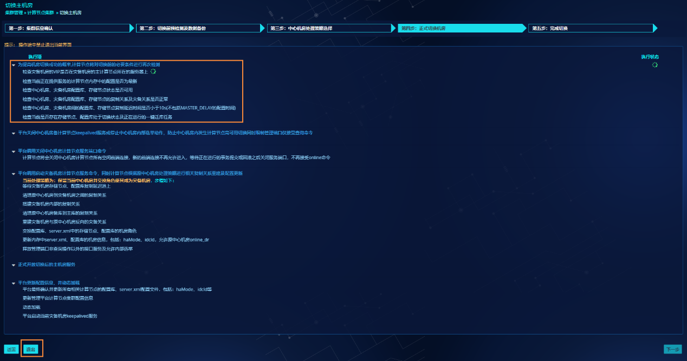

2. 删除中心机房

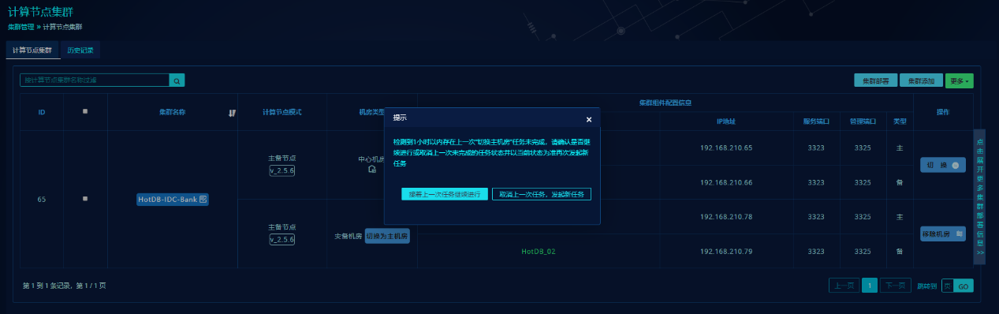

3. 仅将当前主机房切换至灾备机房

#### 完成切换

不同的机房切换策略，最终的完成切换页面当前备机房的可操作按钮也不相同

1. 保留中心机房并交换角色

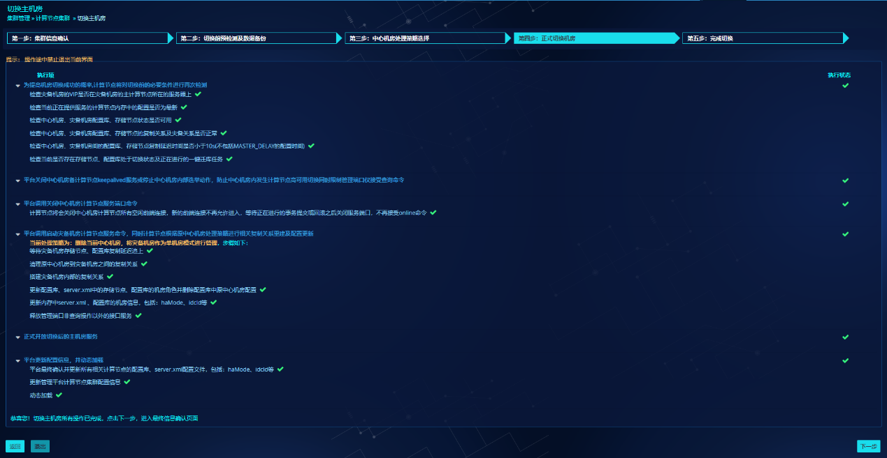

2. 删除中心机房

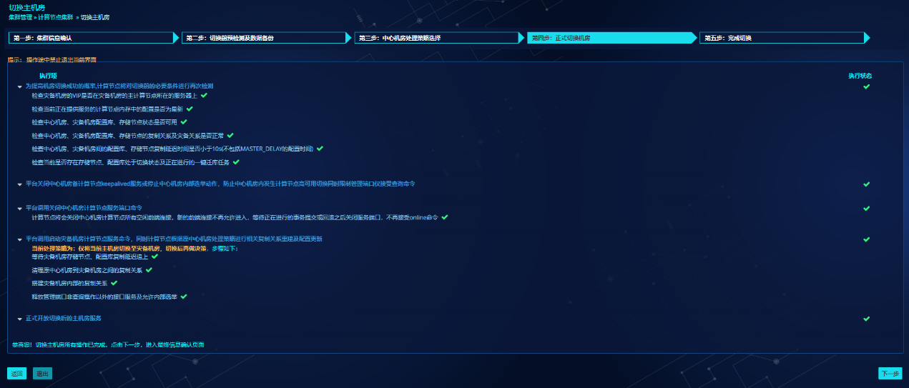

3. 仅将当前主机房切换至灾备机房

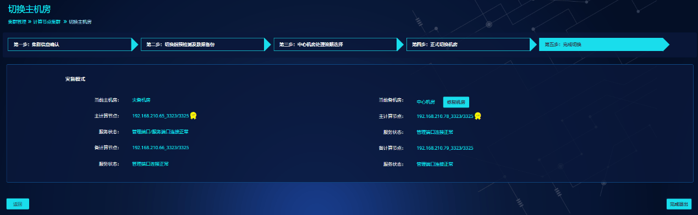

### 中心机房服务端口连接异常

#### 集群信息确认

当中心机房服务端口连接异常时，集群信息确认页面的计算节点的服务状态对应变更，其他与中心机房服务端口连接正常页面一致

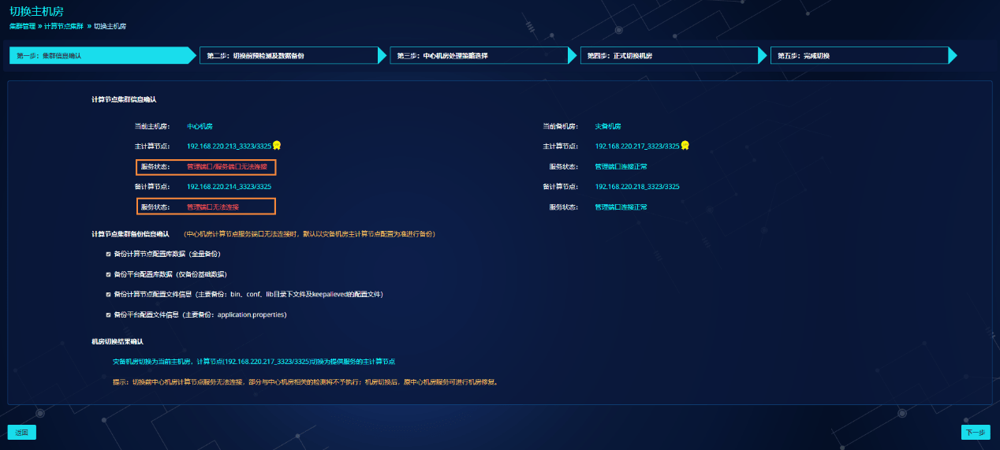

#### 切换前预检测及数据备份

对机房切换前，集群运行状态、各项配置信息、及节点的复制延迟、复制关系等做全面检测，以保证在机房切换后的计算节点、存储节点的正常运行及数据的准确性。切换前的数据备份则保证在机房切换失败的情况下数据不会丢失

中心机房服务端口连接异常时，部分与中心机房相关的检测将不予执行并给予橙色警告提示，该警告可直接忽略跳过检测，对当前切换主机房任务没有影响

数据备份与中心机房服务正常的情况一致

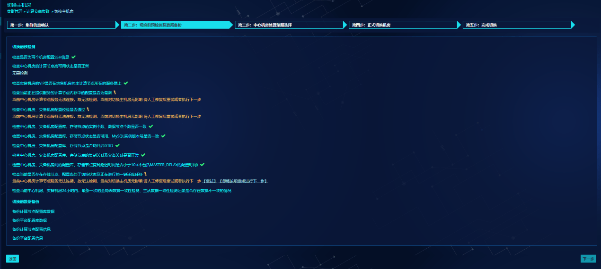

#### 中心机房处理策略选择

页面提供三种切换为机房的切换策略，默认选择第二种，由于中心机房服务端口连接异常，故只能选择策略二和策略三执行切换机房任务

中心机房服务无法连接时，切换后可将原中心机房进行修复

#### 正式切换机房

正式切换机房前需再次确认，根据选择策略显示

正式切换机房会对必要条件再次检测，在该步骤检测过程中，可以点击退出按钮退出切换为主机房任务，对必要条件的再次检测步骤结束后无法退出

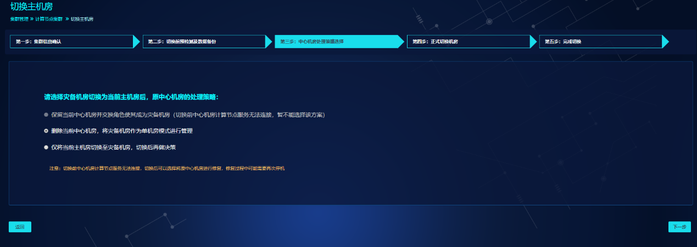

对在切换过程中出现的异常，可根据具体异常信息人工介入处理

不同的切换策略，对应的切换流程也不相同

1. 删除中心机房

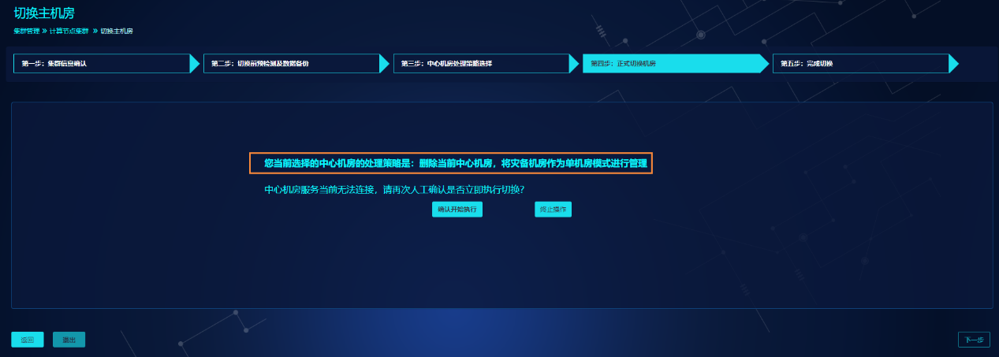

2. 仅将当前主机房切换至灾备机房

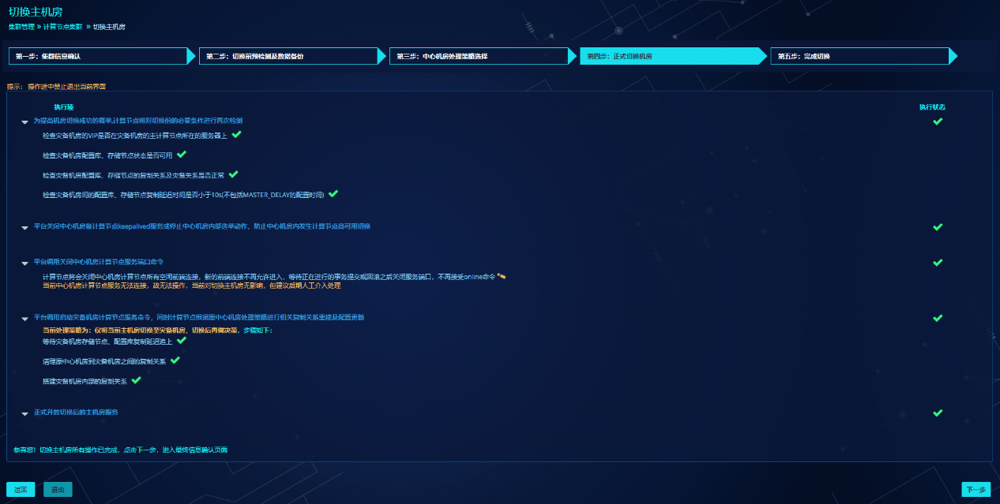

#### 完成切换

1. 删除中心机房

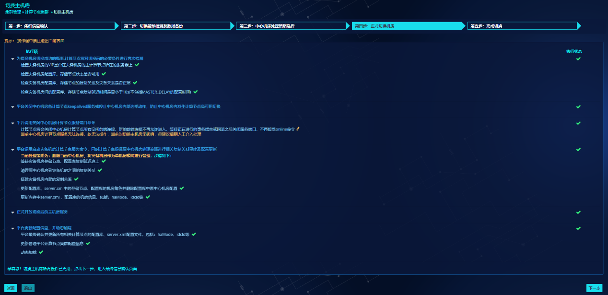

2. 仅将当前主机房切换至灾备机房

### 其他说明

计算节点集群页面，切换为主机房按钮状态不是最新状态时，无法发起切换为主机房任务，点击会提示"当前状态不是最新，请刷新当前页面"

当前有正在进行的切换主机房任务时（管理平台下监控的所有集群），无法发起新的切换主机房任务

## 修复机房

修复机房一般在机房发生切换的动作后，将机房切换后的原中心机房修复为灾备机房，原灾备机房为主机房运行或恢复原中心机房作为主机房运行

### 修复信息确认

修复机房需保证当前主机房的计算节点服务正常，被修复机房的计算节点无论服务端口还是管理端口是否连接异常均可修复

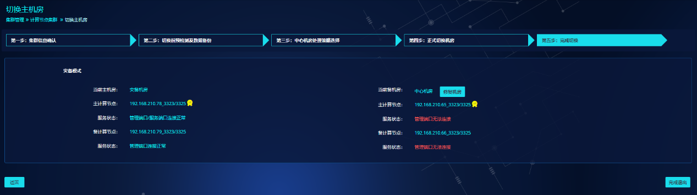

### 中心机房修复策略选择

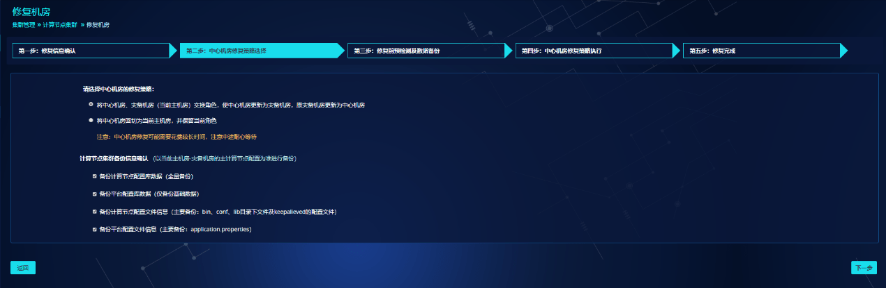

页面共提供两种修复机房的修复策略，默认选择第一种

中心机房修复可能需要花费较长时间，中途注意耐心等待

计算节点集群备份信息确认至少需勾选一项进行备份，否则不能进入下一步

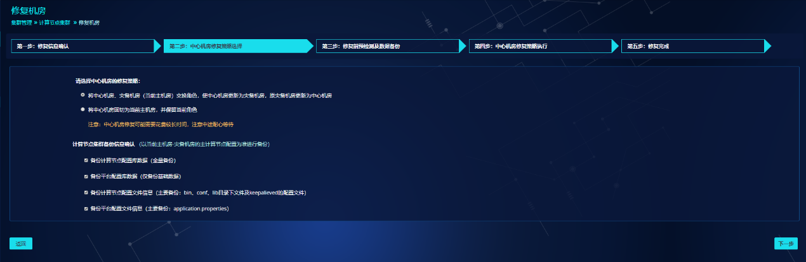

### 修复前预检测及数据备份

修复机房前，对集群运行状态、各项配置信息、及节点的复制延迟、复制关系等做全面检测，以保证机房修复正常执行

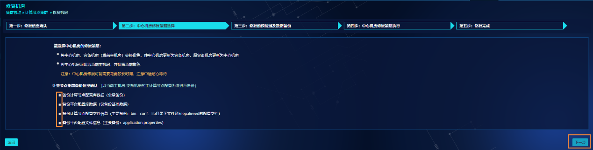

对检测出的异常信息，可根据具体异常信息人工介入处理，不影响机房修复的步骤（一般橙色提示）可忽略直接执行下一步

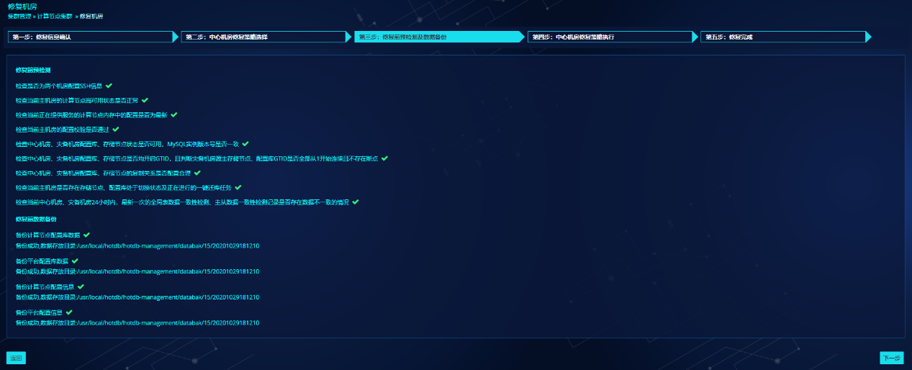

### 中心机房修复策略执行

正式执行修复机房前再次确认，根据选择策略显示

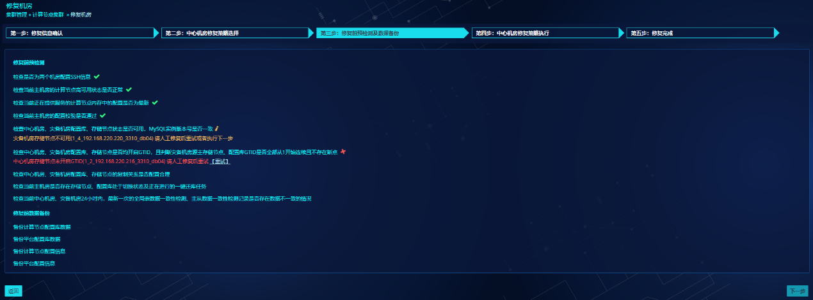

正式修复机房对必要条件的再次检测，在该步骤检测过程中，可以点击退出按钮退出修复机房任务，对必要条件的再次检测流程结束后无法退出

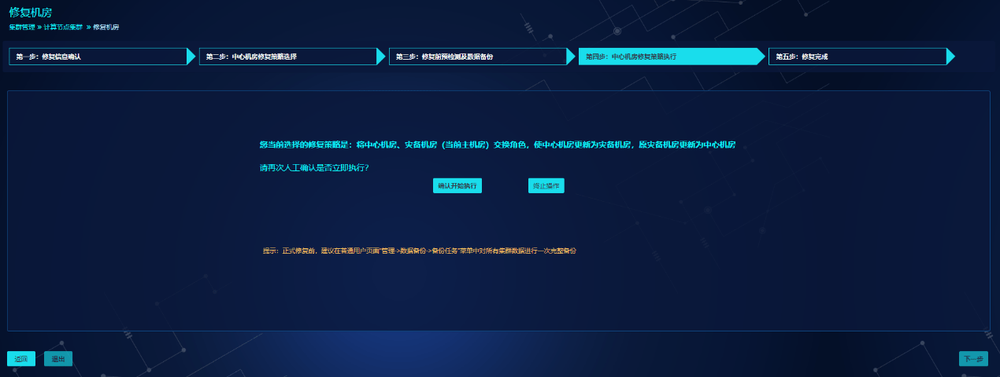

对在修复机房过程中检测出的的异常，可根据具体异常信息人工介入处理

不同的修复策略，对应的修复流程也不相同

1. 交换角色

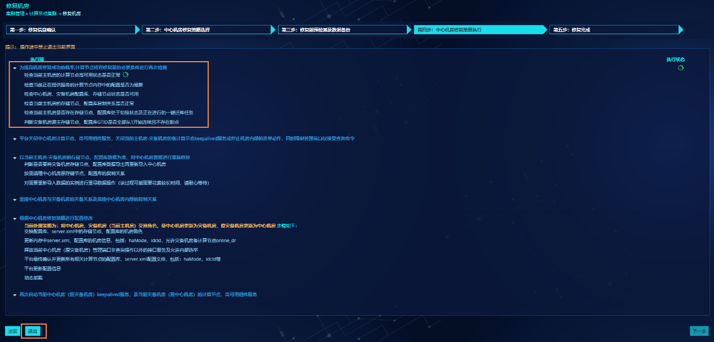

2. 保留当前角色并回切

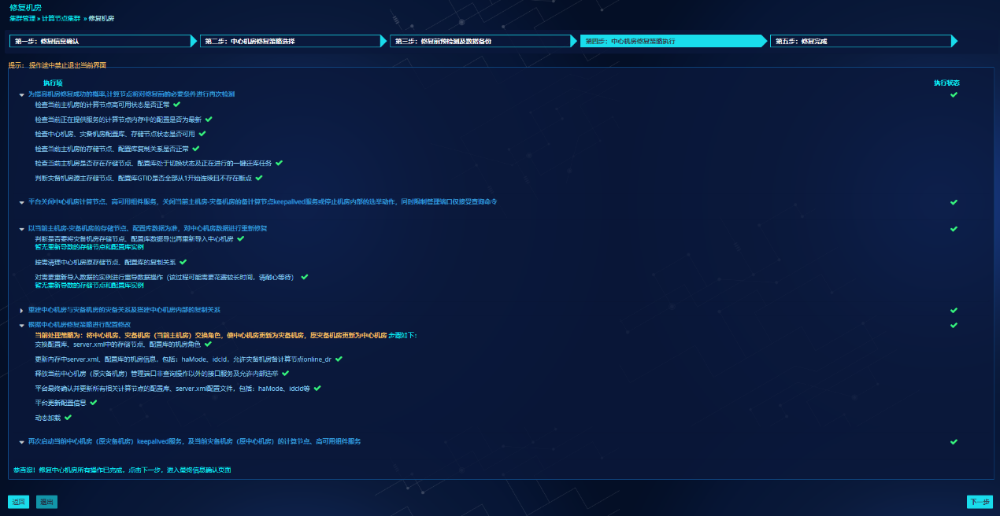

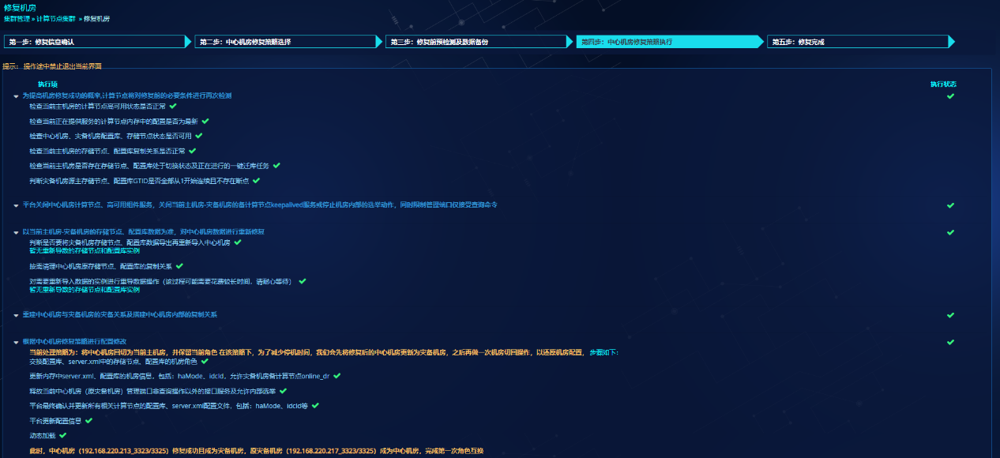

### 修复完成

修复机房完成后当前备机房可选择执行切换主机房任务

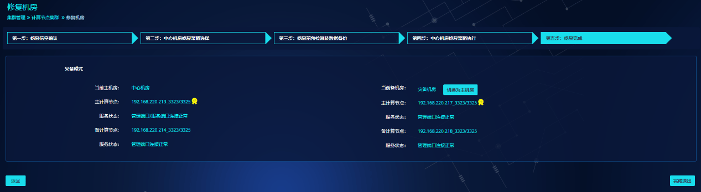

### 其他说明

计算节点集群页面，修复机房按钮状态不是最新状态时，无法发起修复机房任务，点击按钮提示"当前状态不是最新，请刷新当前页面"

当前有正在进行的修复机房任务时（管理平台下的所有集群），无法发起新的修复机房任务

## 移除机房

### 移除中心机房

灾备机房为当前主机房且服务端口和管理端口连接正常时，可移除中心机房，将灾备机房作为单机房运行，中心机房与灾备机房的`server.xml`进行互换，然后更新`server.xml`为单机房模式

移除机房需要再次确认，点击"确认"按钮进入移除机房流程，点击"取消"按钮返回计算节点集群页面

移除机房会对当前主机房进行两次动态加载，点击"是"继续移除机房，点击"否"则取消移除机房任务，页面3秒即逝提示"移除机房任务取消"

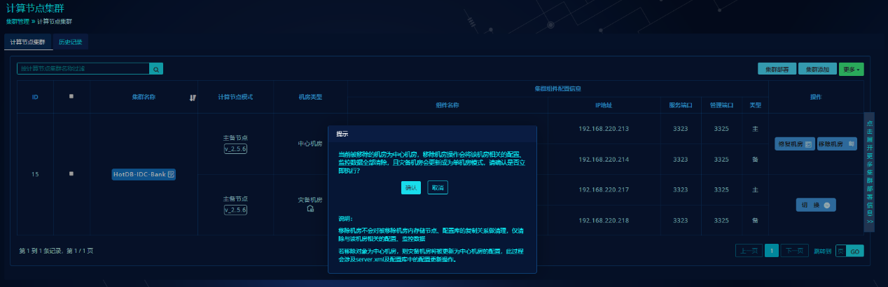

动态加载失败则弹窗提示，机房暂无法移除

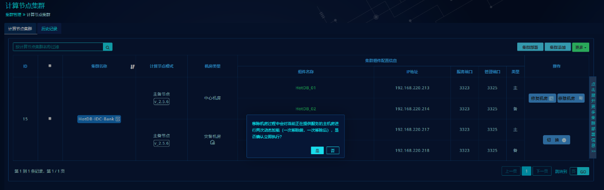

移除机房准备工作完成，再次确认是否移除中心机房，点击"是"则正式开始移除机房且页面loading状态显示，点击"否"则取消移除机房任务，页面3秒即逝提示"移除机房任务取消"

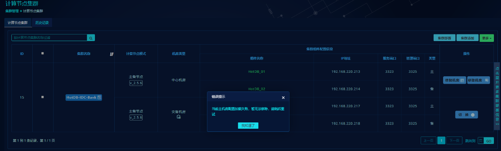

若移除机房失败，则显示具体失败原因，且配置回退

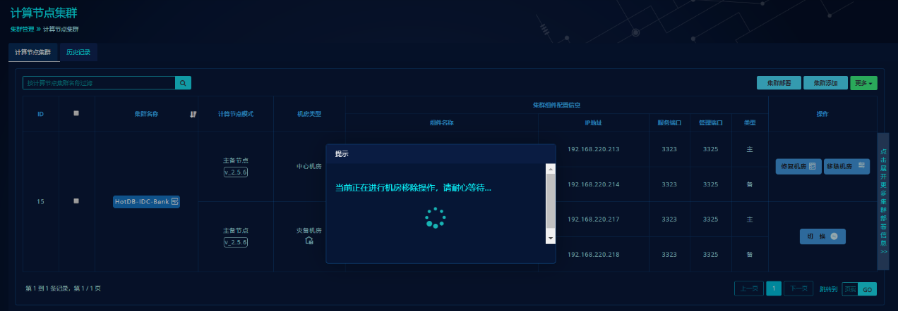

移除成功后，页面3秒即逝提示"移除成功"集群信息刷新为单机房模式

### 移除灾备机房

中心机房为当前主机房且服务端口和管理端口连接正常时，可移除灾备机房，将中心机房作为单机房运行，移除灾备机房会更新`server.xml`为单机房模式

移除灾备机房的流程中，中心机房与灾备机房的`server.xml`不需要进行互换，而是直接更新，其他流程和移除中心机房一致

### 其他说明

移除机房后，另一机房将作为单机房独立运行，需慎重操作

移除机房要求当前主机房服务端口和管理端口连接正常

移除机房不会对被移除机房内存储节点、配置库的复制关系做清理，仅清除与该机房相关的配置、监控数据

## 历史记录

切换主机房、修复机房、移除机房、切换（机房内）、重建（机房内）执行任务都会记录到计算节点集群- ->历史记录

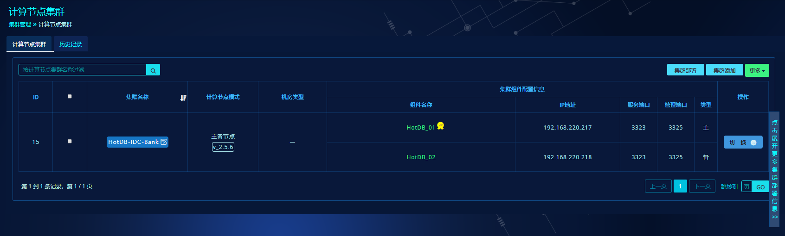

历史记录可通过计算节点名称、操作用户、访问IP、执行内容、执行状态来搜索对应的历史记录信息，其中计算节点名称、操作用户、访问IP为手动输入并支持模糊搜索，按执行内容和执行状态为对应的下拉框选项

除"操作"列外，其他列均支持排序

计算节点集群可用时，可点击计算节点集群名称，进入编辑计算节点集群页面

只有切换主机房和修复机房显示执行策略，移除机房、切换（机房内）、重建（机房内）的执行策略项均显示为空

执行状态记录任务执行的具体状态，鼠标指针悬停可显示具体状态，包含执行成功、进行中...、中途退出、执行失败（标注失败原因）

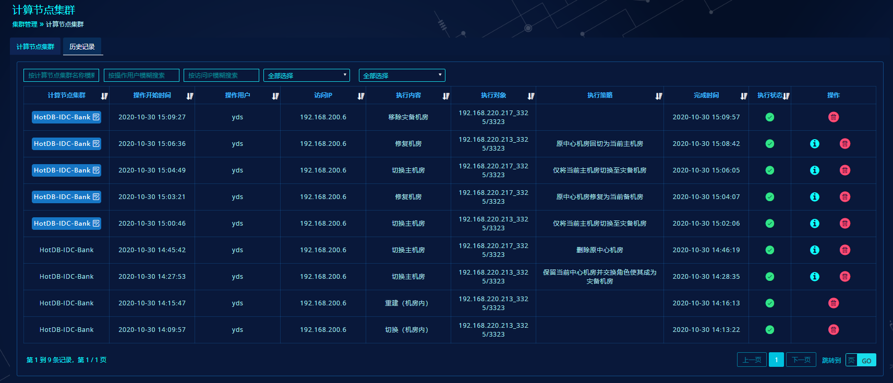

操作列：只有执行内容为切换主机房和修复机房显示详情和删除图标按钮，其他执行内容只显示删除图标按钮

点击操作列"详情"按钮，可进入切换为主机房/修复机房执行任务记录查看详细的切换/修复流程，点击"删除"按钮则删除当前的一条历史记录

## 机房切换演练

机房切换演练主要包含：集群信息确认、切换前预检测及数据备份、中心机房处理策略选择、正式切换机房、完成切换五个步骤。上一步骤未完成，不允许进入下一步骤。在正式切换机房步骤中，可以查看机房切换动画演示。

### 功能入口

在开启灾备模式的集群中，如果集群满足机房切换演练的条件，则在"更多"下拉框内可点击【机房切换演练】按钮进行动画效果演示真实机房切换的模拟过程。

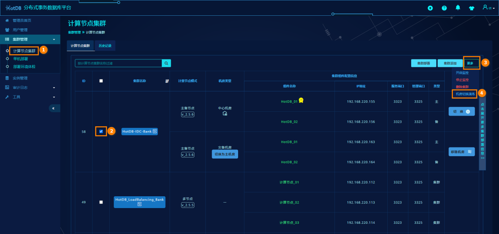

### 演练条件

**执行机房切换演练需满足以下条件：**

- 计算节点版本高于（包含）2.5.6且开启灾备模式；
- 仅允许选择一组计算节点集群；
- 当前计算节点集群可进行[切换为主机房](#切换为主机房)相关操作；
- 当前集群没有正在进行的切换机房任务；

### 中心机房服务正常情况下

当中心机房服务正常，灾备机房服务正常时，进行机房切换演练：

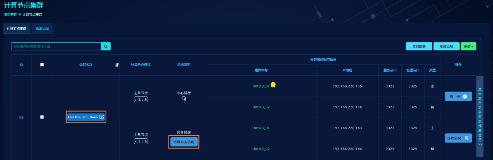

#### 集群信息确认

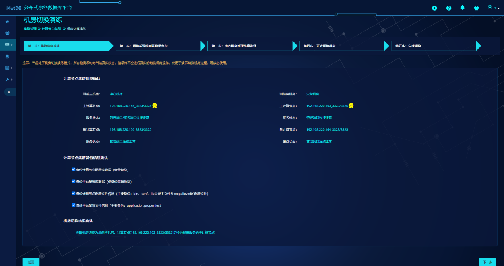

此步骤分为计算节点集群信息确认、计算节点集群备份信息确认和机房切换结果确认三个模块；

计算节点集群信息确认模块展示当前集群的最新信息和服务状态；

计算节点集群备份信息确认模块默认全部勾选备份项，也可以自行选择备份项；

机房切换结果确认模块显示切换后主机房及主计算节点；

只有当计算节点集群备份信息确认模块至少选择一项后，【下一步】按钮才正常开放允许点击进入下一步骤；

#### 切换前预检测及数据备份

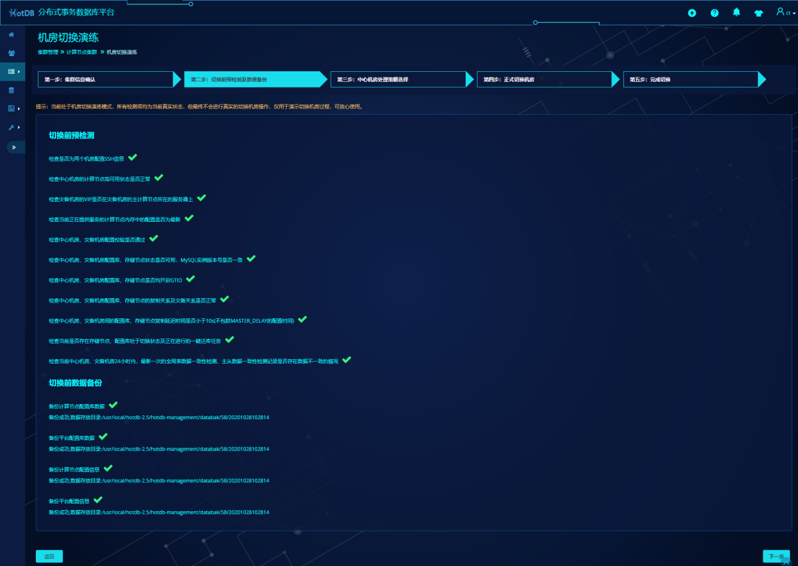

此步骤分为切换前预检测、切换前数据备份两个模块；

切换前预检测模块主要是对当前集群各机房的检测项进行检测；

切换前数据备份模块主要是将上一步中选择的备份项进行数据备份，数据存放在当前管理平台`hotdb-management/databak/集群编号/备份时间戳`目录下；

此步骤要求所有检测项都通过检测才能进行下一步骤，否则必须人工介入解决不通过项的异常问题；

#### 中心机房处理策略选择

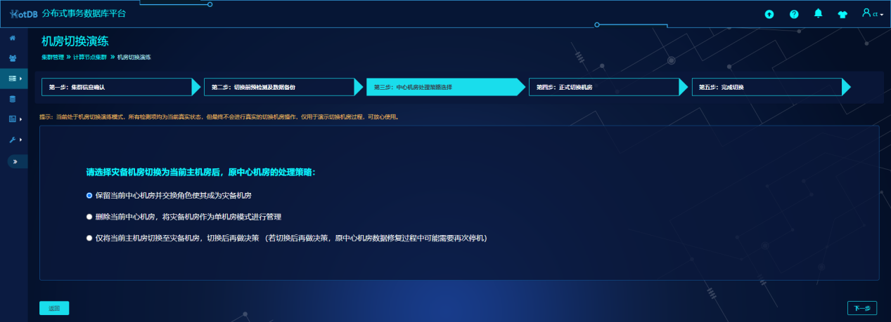

主要有三种切换策略，分别是保留当前中心机房并交换角色使其成为灾备机房、删除当前中心机房，将灾备机房作为单机房模式进行管理、仅将当前主机房切换至灾备机房，切换后再做决策；

保留当前中心机房并交换角色使其成为灾备机房，即交换中心机房和灾备机房；

删除当前中心机房，将灾备机房作为单机房模式进行管理，即退化成单机房模式；

仅将当前主机房切换至灾备机房，切换后再做决策，即仅切换到灾备机房；

#### 正式切换机房

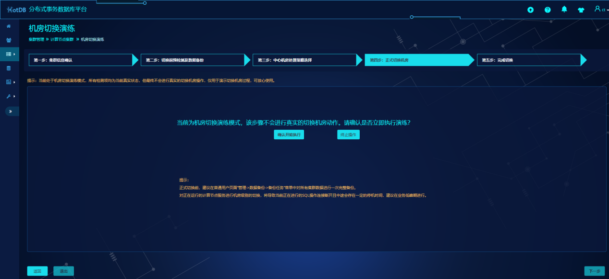

该步骤主要是确认开始执行机房切换演练，或者终止操作。需要注意的是，当前为机房切换演练模式，该步骤不会进行真实的切换机房动作；

点击终止操作，即退出机房切换演练，回到计算节点集群页面；

点击确认开始执行，会对必要性条件进行再次检测，以提高切换成功的概率。再次检测完成后，会出现"恭喜您！所有切换机房的预检测项均已完成，当前为演练模式，您可以通过动画效果查看真实机房切换的模拟过程或点击下一步进入最终信息确认页面。"

#### 查看机房切换动画演示

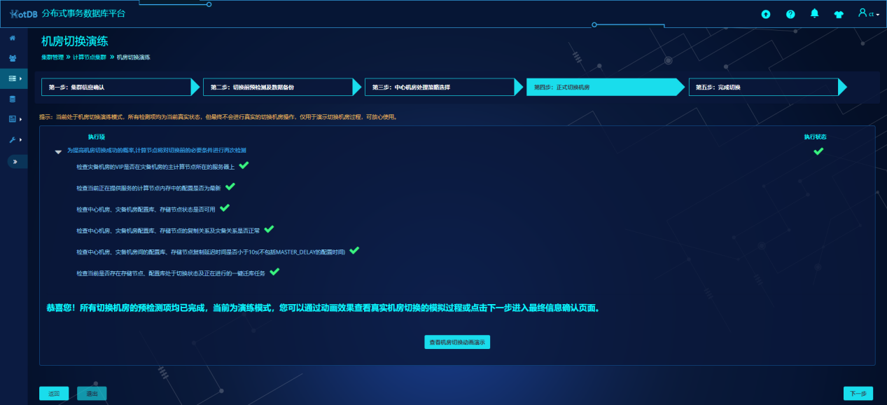

点击[查看机房切换动画演示](#查看机房切换动画演示)按钮，即可在弹出的新页面中观看切换演示动画。这一步是机房切换演练最核心的环节，通过动画展示机房切换的详细过程；

在动画演示过程中，可以点击右上角"重放"按钮，可以重新播放动画，在动画播放全程均可使用；

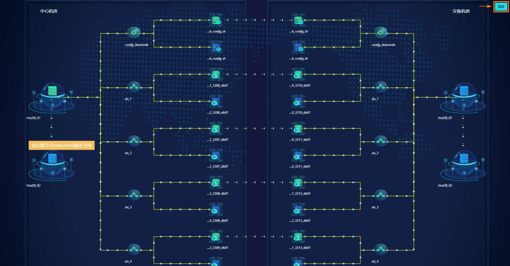

#### 完成切换

该步骤主要是按照"第三步：中心机房处理策略"中选择的策略，展示最终机房切换演练的结果；

当选择"保留当前中心机房并交换角色使其成为灾备机房"处理策略时，完成切换步骤显示如下：

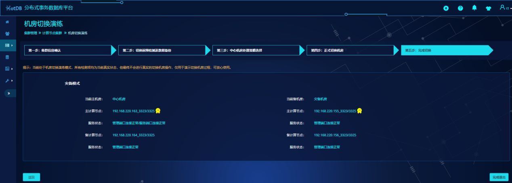

当选择"删除当前中心机房，将灾备机房作为单机房模式进行管理"处理策略时，完成切换步骤显示如下：

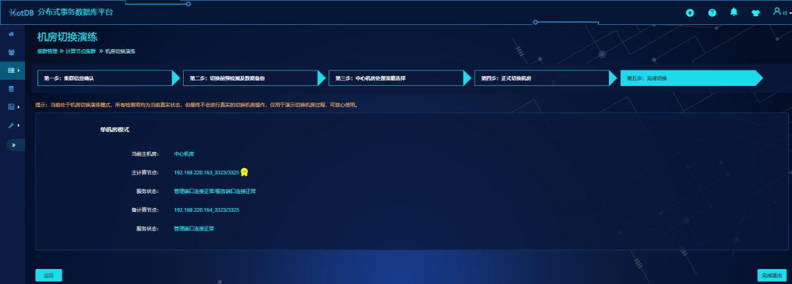

当选择"仅将当前主机房切换至灾备机房，切换后再做决策"处理策略时，完成切换步骤显示如下：

至此，点击"完成退出"即可完成机房切换演练，回到计算节点集群页面。

### 中心机房服务异常情况下

当中心机房服务出现异常，但灾备机房服务正常时，进行机房切换演练：

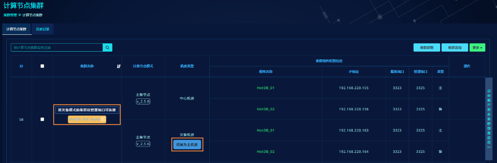

#### 集群信息确认

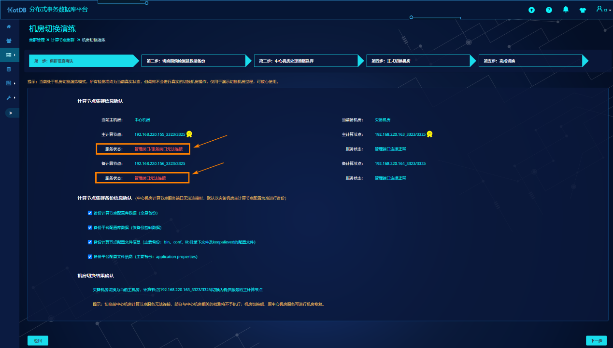

此步骤分为计算节点集群信息确认、计算节点集群备份信息确认和机房切换结果确认三个模块；

计算节点集群信息确认模块展示当前集群的最新信息和服务状态，当中心机房服务异常时，会用红色文字提醒管理端口/服务端口无法连接；

计算节点集群备份信息确认模块默认全部勾选备份项，也可以自行选择备份项，当中心机房计算节点服务端口无法连接时，默认以灾备机房主计算节点配置为准进行备份；

机房切换结果确认模块显示切换后主机房及主计算节点，当切换前中心机房计算节点服务无法连接，部分与中心机房相关的检测将不予执行；机房切换后，原中心机房服务可进行机房修复；

只有当计算节点集群备份信息确认模块至少选择一项后，【下一步】按钮才正常开放允许点击进入下一步骤；

#### 切换前预检测及数据备份

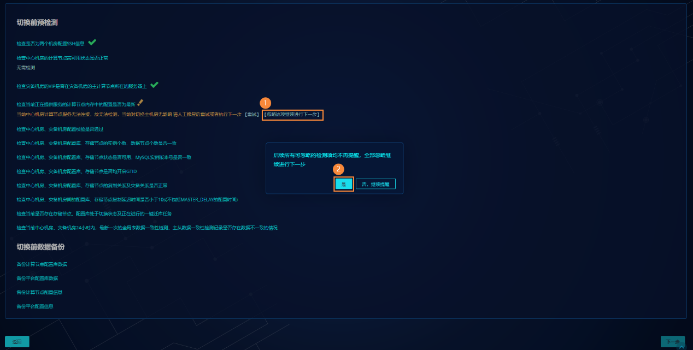

此步骤分为切换前预检测、切换前数据备份两个模块；

切换前预检测模块主要是对当前集群各机房的检测项进行检测，当中心机房服务异常导致个别检测项无法检测时，会用黄色文字提醒："当前中心机房计算节点服务无法连接，故无法检测，当前对切换主机房无影响"，可选择"忽略该项继续进行下一步"，在弹出的窗口中选择"是"，后面其他无法检测项也会直接忽略；

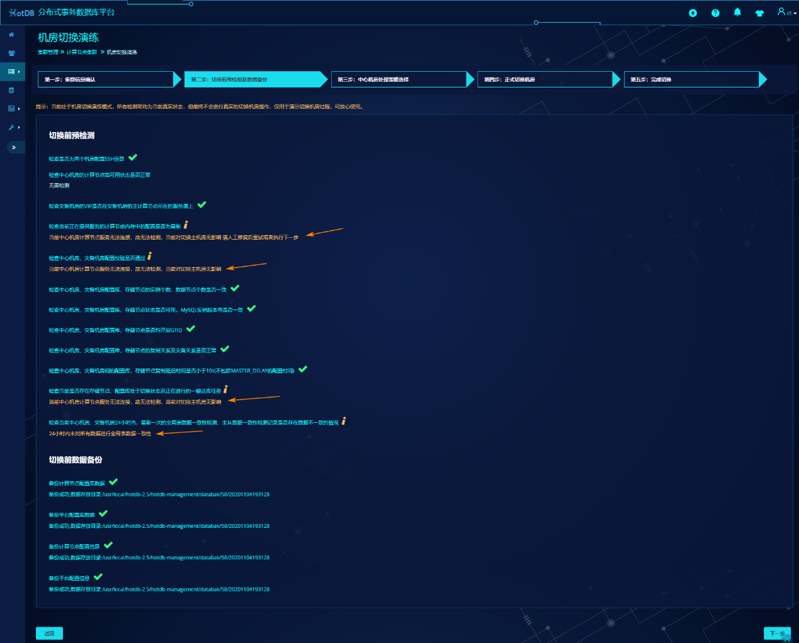

切换前数据备份模块主要是将上一步中选择的备份项进行数据备份，数据存放在当前管理平台hotdb-management/databak/集群编号/备份时间戳目录下；

此步骤要求所有检测项都通过检测才能进行下一步骤，否则必须人工介入解决不通过项的异常问题；

#### 中心机房处理策略选择

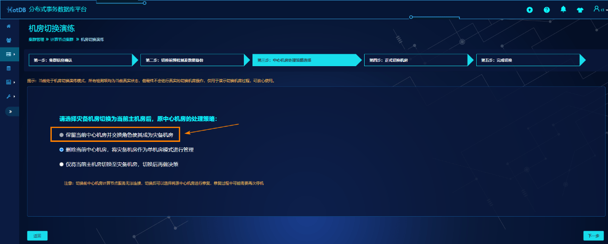

主要有三种切换策略，分别是保留当前中心机房并交换角色使其成为灾备机房、删除当前中心机房，将灾备机房作为单机房模式进行管理、仅将当前主机房切换至灾备机房，切换后再做决策。

当中心机房服务异常时，保留当前中心机房并交换角色使其成为灾备机房、删除当前中心机房处理策略置灰，不允许选择；

删除当前中心机房，将灾备机房作为单机房模式进行管理，即退化成单机房模式；

仅将当前主机房切换至灾备机房，切换后再做决策，即仅切换到灾备机房；

#### 正式切换机房

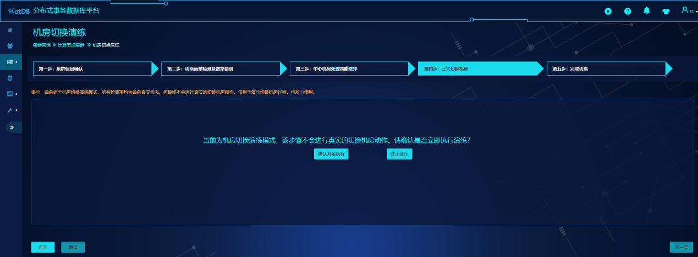

该步骤主要是确认开始执行机房切换演练，或者终止操作。需要注意的是，当前为机房切换演练模式，该步骤不会进行真实的切换机房动作。

点击终止操作，即退出机房切换演练，回到计算节点集群页面；

点击确认开始执行，会对必要性条件进行再次检测，以提高切换成功的概率。再次检测完成后，会出现"恭喜您！所有切换机房的预检测项均已完成，当前为演练模式，您可以通过动画效果查看真实机房切换的模拟过程或点击下一步进入最终信息确认页面。"

#### 查看机房切换动画演示

点击[查看机房切换动画演示](#查看机房切换动画演示)按钮，即可在弹出的新页面中观看切换演示动画。这一步是机房切换演练最核心的环节，通过动画展示机房切换的详细过程；

当中心机房服务异常时，动画开始时会显示左侧机房计算节点为红色，且配置库、数据节点均不可用；

在动画演示过程中，可以点击右上角"重放"按钮，可以重新播放动画，在动画播放全程均可使用；

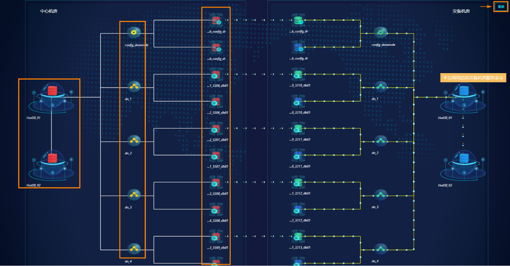

#### 完成切换

该步骤主要是按照"第三步：中心机房处理策略"中选择的策略，展示最终机房切换演练的结果；

当选择"删除当前中心机房，将灾备机房作为单机房模式进行管理"处理策略时，完成切换步骤显示如下：

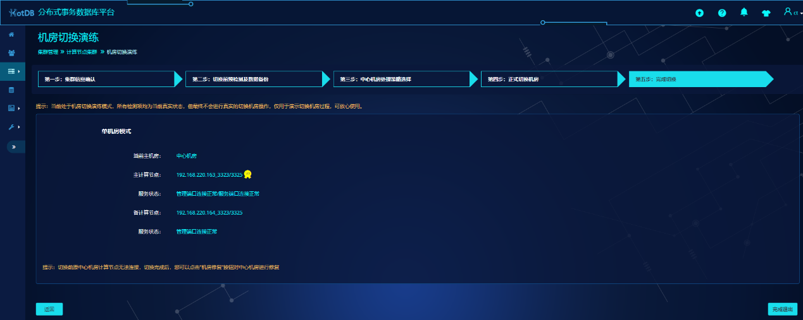

当选择"仅将当前主机房切换至灾备机房，切换后再做决策"处理策略时，完成切换步骤显示如下：

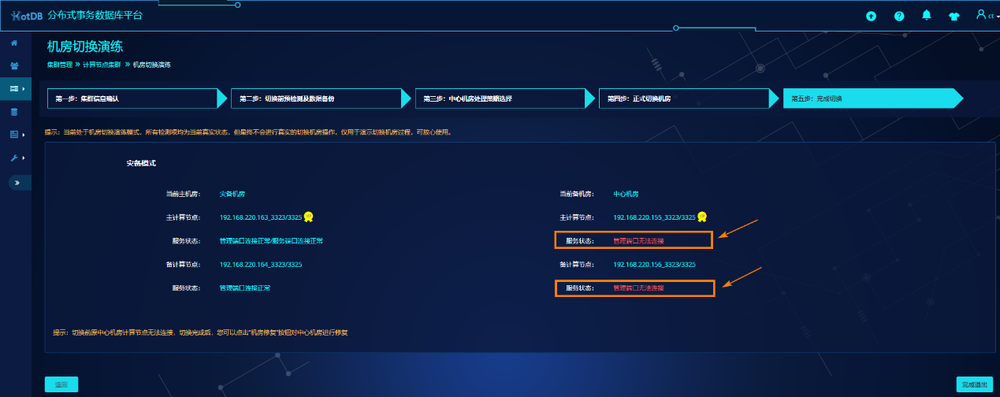

至此，点击"完成退出"即可完成机房切换演练，回到计算节点集群页面。

### 注意事项

需要注意的是，在机房切换演练中，所有检测项均为当前集群真实状态，但最终不会进行真实的切换机房操作，仅用于演示切换机房过程，可放心使用。

选择好中心机房处理策略后，一旦点击"确认开始执行"，后续再返回并且重新选择了其他处理策略，均以第一次选择的处理策略为准，后续返回重选的处理策略无效。

若想查看其他处理策略的动画演示，需要退出本次机房切换演练，在计算节点集群页面选择集群重新开始机房切换演示。

